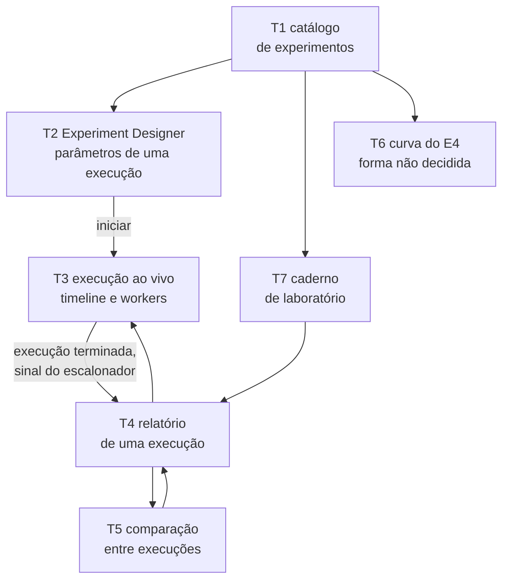
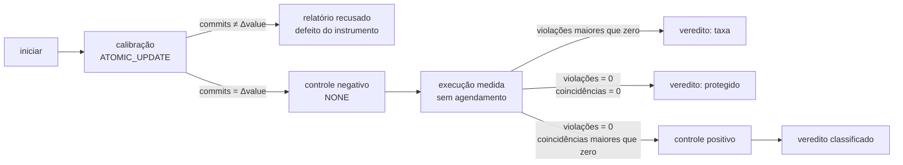
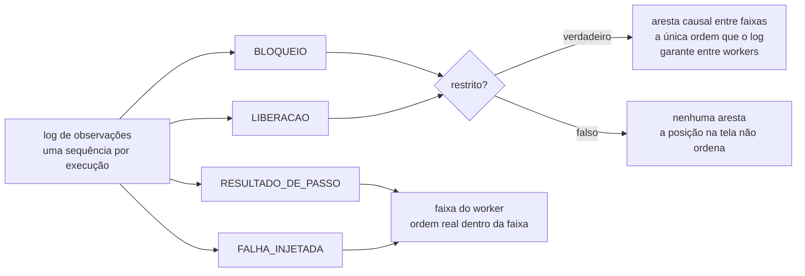

# Interface web

- **Estado:** Proposta — requer aprovação humana
- **Data:** 2026-08-03
- **Escopo:** as telas da interface web do laboratório, o que cada uma exibe, e como
  a timeline projeta o log de observações sem prometer ordem que o log não garante.
- **Depende de:** [`ADR-0001`](../../0001-o-passo-como-unidade-de-execucao.md),
  [`ADR-0002`](../../0002-o-dominio-minimo-e-os-dois-oraculos.md),
  [`ADR-0003`](../../0003-a-linguagem-do-agendamento.md),
  [`ADR-0004`](../../0004-o-estatuto-da-barreira-e-o-diagnostico-da-nao-ocorrencia.md),
  [`ADR-0005`](../../0005-a-forma-do-escalonador.md),
  [`ADR-0006`](../../0006-a-forma-da-estrategia-de-concorrencia.md) e
  [`ADR-0007`](../../0007-o-log-de-observacoes-forma-ordem-e-onde-vive.md), todos
  `Aceito`.

## O que este documento é, e o que ele não decide

Nenhuma tela existe. Nenhum componente existe. Este documento propõe o inventário, os
wireframes e a stack, e nomeia as escolhas que uma pessoa precisa fazer antes que a
primeira linha de código seja escrita.

O contrato HTTP e o formato do relatório estão no documento vizinho,
[`contratos-de-api.md`](contratos-de-api.md). Empacotamento, `Dockerfile`, Kustomize e
pipeline não pertencem a este documento — a seção
[`## O que pertence à decisão de entrega`](#o-que-pertence-à-decisão-de-entrega)
lista as opções e o que cada uma implica para a interface, e remete a escolha.

Três coisas fixam quase tudo o que segue.

**A timeline é a projeção direta do log de observações**
(`../../0001-o-passo-como-unidade-de-execucao.md:450-451`). Não existe um segundo
modelo de evento para a interface desenhar.

**O log só garante ordem entre workers para o par que um evento com
`restrito = verdadeiro` produz**
(`../../0007-o-log-de-observacoes-forma-ordem-e-onde-vive.md:80-83`). Para o resto, o
instante de parede é metadado de exibição.

**Um zero não é uma observação — é a ausência de uma**
(`../../../plano-do-laboratorio.md:520-525`). Uma tela que exiba `0 violações` sem o veredito
classificado, sem a exposição e sem o limite de confiança apaga o
[`ADR-0004`](../../0004-o-estatuto-da-barreira-e-o-diagnostico-da-nao-ocorrencia.md)
inteiro.

## O inventário de telas

| Tela                          | O que ela responde                               | Quem a exige   | Evidência                                    |
|-------------------------------|--------------------------------------------------|----------------|----------------------------------------------|
| T1 catálogo de experimentos   | quais experimentos existem, e o que cada um mede | todos          | `plano-do-laboratorio.md:540`                |
| T2 Experiment Designer        | o que uma execução declara antes de rodar        | E1, E3, E4, E5 | `plano-do-laboratorio.md:693-698`            |
| T3 execução ao vivo           | o que está acontecendo entre dois passos, agora  | E1, E5         | `plano-do-laboratorio.md:395-396`, `469-471` |
| T4 relatório de uma execução  | o que a execução afirma, e com que força         | E1, E3, E5     | `adr/0004-...md:113-123`                     |
| T5 comparação entre execuções | qual estratégia protege, e a que preço           | E3             | `plano-do-laboratorio.md:432-439`            |
| T6 curva                      | como o custo cresce com a contenção              | E4             | `plano-do-laboratorio.md:443-449`            |
| T7 caderno de laboratório     | o que já foi medido, e quando                    | processo       | `AGENTS.md`, regra de `docs/experiments/`    |

**T6 não é especificável hoje.** O formato de veredito em curva não foi decidido, e o E4
não tem Feature Card por esse motivo (`../../../features/README.md:35-48`). A seção
[`## T6 — a curva do E4`](#t6--a-curva-do-e4) registra o que se sabe e o que falta.

### Mapa de navegação



A seta ausente importa: nenhuma tela escreve no system under test. A interface
inicia execuções e lê o que o Lab Plane produziu. O runtime chama a operação; a operação
nunca chama o runtime (`../../0001-o-passo-como-unidade-de-execucao.md:94-95`), e a
interface fica um nível acima dos dois.

## T2 — o Experiment Designer

### O que ele precisa deixar declarar

Cada linha abaixo vem de um ADR aceito, e o Designer que omitir uma produz uma execução
que a plataforma recusa antes de rodar.

| Declaração                 | Forma                                                                      | Evidência                                          |
|----------------------------|----------------------------------------------------------------------------|----------------------------------------------------|
| estratégia de concorrência | rótulo, opaco para o Lab Plane                                             | `adr/0006-...md:51-54`                             |
| semente                    | inteiro; toda aleatoriedade vem dela                                       | `plano-do-laboratorio.md:594-596`                  |
| papéis e cardinalidades    | a carga; a soma é o número de workers                                      | `adr/0003-...md:144-148`                           |
| `N`                        | tentativas lançadas, declarado antes de começar                            | `adr/0004-...md:127-129`                           |
| nível de isolamento        | parâmetro da execução, três valores no E5                                  | `plano-do-laboratorio.md:472-474`                  |
| resolução                  | alta ou baixa; alta é obrigatória se o veredito pode ser zero              | `adr/0001-...md:272-276`, `adr/0004-...md:281-283` |
| janela de exposição        | par ordenado `(F_abre, F_fecha)` de endereços de fronteira                 | `adr/0004-...md:133-140`                           |
| agendamento                | conjunto de restrições, ou um encontro; vazio nas três primeiras execuções | `adr/0003-...md:123-126`, `198-204`                |
| hipótese e asserções       | escritas antes, para impedir racionalizar o resultado                      | `plano-do-laboratorio.md:649`                      |

**Um endereço de fronteira tem três componentes**, e o terceiro não tem valor padrão: a
plataforma recusa `AFTER_READ` sem seletor de tentativa em qualquer operação que possa
tentar mais de uma vez (`../../0001-o-passo-como-unidade-de-execucao.md:185-188`).
Proposta: o campo de tentativa nasce vazio e o formulário não submete enquanto ele
estiver vazio, em vez de preencher `1` por conveniência.

**O Designer oferece a lista de fronteiras sem executar nada.** Essa capacidade é o
motivo declarado pelo qual o ADR-0001 descartou ganchos inline no código do sistema sob
teste: "um método linear com ganchos só revela seus pontos de pausa executando (...) o
Experiment Designer da UI não consegue oferecer os pontos de barreira"
(`../../0001-o-passo-como-unidade-de-execucao.md:582-587`). A tela existe porque aquela
alternativa foi recusada; ela não é conveniência de formulário.

### O botão `iniciar` dispara quatro execuções, não uma

Um experimento tem quatro execuções, e o ADR-0003 nomeia as quatro: calibração, controle
negativo, execução medida e controle positivo
(`../../0003-a-linguagem-do-agendamento.md:155-167`). A calibração roda com
`ATOMIC_UPDATE` (`../../0006-a-forma-da-estrategia-de-concorrencia.md:79-81`), e a
plataforma recusa o relatório quando `commits` divergir de `value_final − value_inicial`
(`../../0002-o-dominio-minimo-e-os-dois-oraculos.md:179-185`). O controle positivo roda
apenas quando a execução medida termina com zero violações e coincidências próprias
maiores que zero (`../../0004-...md:250-259`).



Proposta: o Designer exibe esse encadeamento antes do clique, com o estado de cada
execução ao lado. Sem isso, o usuário vê quatro execuções aparecerem no caderno e não
sabe qual delas é o resultado.

### Wireframe

```
┌ Experiment Designer ─────────────────────────────────────────────────┐
│ experimento  E1 lost-update-none                    [somente leitura]│
│ operação     increment(resourceId)                  [somente leitura]│
│ resolução    (o) alta   ( ) baixa                                    │
│              alta é obrigatória quando o veredito pode ser zero      │
├ carga do experimento ────────────────────────────────────────────────┤
│ papel  [ incrementador      ]  cardinalidade [ 10 ]      [+ papel]   │
│ N      [ 100 ]  tentativas lançadas, declaradas antes de executar    │
├ execução medida ─────────────────────────────────────────────────────┤
│ estratégia [ NONE          v ]   semente [ 42 ]                      │
│ isolamento [ READ COMMITTED v ]                                      │
├ janela de exposição ─────────────────────────────────────────────────┤
│ abre  [ select-resource v ] [ saída   v ]  tentativa [    ] <- vazio │
│ fecha [ update-resource v ] [ entrada v ]  tentativa [    ] <- vazio │
├ hipótese e asserções ────────────────────────────────────────────────┤
│ hipótese [ NONE perde ao menos um incremento sob esta carga        ] │
│ asserção [ violações > 0                              ] [+ asserção] │
├──────────────────────────────────────────────────────────────────────┤
│ calibração > controle negativo > medida > controle positivo, se      │
│ aplicável.                                                           │
│                                          [ validar ]    [ iniciar ]  │
└──────────────────────────────────────────────────────────────────────┘
```

### A validação acontece antes de executar, e nomeia o culpado

A plataforma recusa, sem executar nada, sete classes de agendamento inválido, e a recusa
nomeia a restrição culpada (`../../0003-a-linguagem-do-agendamento.md:281-293`).
Proposta: o botão `validar` faz a mesma travessia que o `iniciar` faria e exibe a recusa
ancorada no campo que a causou — endereço não resolvido, papel não declarado, encontro
fora de `F_abre`, ciclo no grafo de precedências. Uma recusa exibida como texto solto no
topo da tela perde o endereço que o ADR obriga a plataforma a produzir.

## T3 — a execução ao vivo, e a honestidade sobre ordem

### Os quatro tipos de evento, e o que cada um vira na tela

O ADR-0007 fixa a forma de um evento: tentativa, worker, endereço de fronteira completo,
tipo, instante de parede e — apenas em `RESULTADO_DE_PASSO` — os fatos brutos, payload
opaco que o runtime não interpreta
(`../../0007-o-log-de-observacoes-forma-ordem-e-onde-vive.md:58-65`).

| Tipo                 | O que a tela desenha                                           | O que ela não pode acrescentar                     |
|----------------------|----------------------------------------------------------------|----------------------------------------------------|
| `RESULTADO_DE_PASSO` | uma linha na faixa do worker, com o rótulo do passo e os fatos | interpretação dos fatos; eles são opacos           |
| `BLOQUEIO`           | marca de retenção na fronteira                                 | motivo, quando `restrito = falso`                  |
| `LIBERACAO`          | marca de travessia                                             | ordem com outra faixa, sem `restrito = verdadeiro` |
| `FALHA_INJETADA`     | marca de interrupção da tentativa                              | causa raiz; a falha foi declarada, não descoberta  |



### Três regras de desenho que impedem a tela de mentir

**Uma faixa por worker, e a ordem só é real dentro da faixa.** Dentro de um mesmo worker
a ordem de emissão é a ordem de execução, por construção
(`../../0007-...md:79-80`). Entre faixas, nada é ordenado por vizinhança visual.

**A aresta causal é a única afirmação de precedência entre faixas.** Ela é desenhada
apenas para o par que um evento com `restrito = verdadeiro` produz: a liberação está
causalmente depois do evento que a autorizou (`../../0007-...md:80-82`). Um par sem
aresta não está ordenado, e a ausência da aresta é a informação.

**O instante de parede é uma coluna, e não o eixo.** O ADR-0007 o classifica como
metadado de exibição (`../../0007-...md:82-83`), e o ADR-0004 registra que nenhum
documento do repositório decidiu qual relógio o produz
(`../../0004-...md:414-416`). Uma linha do tempo cujo eixo é um número que ninguém
definiu afirma precedência a partir de uma quantidade sem origem.

Proposta: um **modo ordem garantida**, acionável por um controle da própria tela, que
oculta tudo exceto os eventos com `restrito = verdadeiro` e suas arestas. O que sobra é
exatamente a subsequência que o ADR-0007 usa para decidir se duas execuções de controle
com a mesma semente são equivalentes (`../../0007-...md:90-95`). O modo não é um filtro
de conveniência: ele é a projeção da única ordem que o laboratório afirma.

### Wireframe

```
┌ execução 7c2a · E1 · medida · semente 42 ················ o ao vivo ─┐
│ eixo [ posição no log v ]  [ ] só ordem garantida   tipo [ todos v ] │
│ ! a posição entre faixas não é prova de precedência. Só as arestas   │
│   marcadas ordenam eventos de workers diferentes.                    │
├──────┬───────────────────────┬───────────────────────┬───────────────┤
│ pos  │ incrementador#1       │ incrementador#2       │ parede        │
├──────┼───────────────────────┼───────────────────────┼───────────────┤
│ 0001 │ = RESULTADO select-r. │                       │ 12:01:00.100  │
│ 0002 │ o LIBERACAO saída/sel │                       │ 12:01:00.101  │
│ 0003 │                       │ = RESULTADO select-r. │ 12:01:00.104  │
│ 0004 │                       │ * BLOQUEIO saída/sel  │ 12:01:00.104  │
│ 0005 │ = RESULTADO update-r. │           |           │ 12:01:00.112  │
│ 0006 │ * LIBERACAO ----------+-----------+ restrito  │ 12:01:00.113  │
│ 0007 │ x FALHA_INJETADA      │                       │ 12:01:00.115  │
├──────┴───────────────────────┴───────────────────────┴───────────────┤
│ = resultado de passo   * restrito   o livre   x falha injetada       │
│ tentativa 1 · 1 480 eventos · 2 workers ativos                       │
└──────────────────────────────────────────────────────────────────────┘
```

Os números do wireframe são ilustrativos. Nenhuma execução existe.

### O desenho pedagógico que o plano pede não cabe na execução medida

O plano exige, para o E1, "timeline mostrando dois `READ version=N` antes de dois `WRITE
version=N+1`, com o segundo marcado como sobrescrita"
(`../../../plano-do-laboratorio.md:395-396`), e para o E5, "a timeline precisa mostrar os dois
`SELECT sum` retornando o mesmo valor **antes** de qualquer `INSERT`"
(`../../../plano-do-laboratorio.md:469-471`). As duas frases afirmam precedência entre
workers.

Três decisões aceitas tornam essas frases irrepresentáveis na execução que o experimento
reporta:

1. a execução medida roda **sem agendamento** (`../../0004-...md:100-102`), logo nenhum
   evento dela tem `restrito = verdadeiro`;
2. sem `restrito = verdadeiro`, o log não garante ordem entre workers
   (`../../0007-...md:80-83`);
3. a execução em que essa ordem é garantida é o controle positivo, e ele **não é
   reportado como resultado do experimento** (`../../0004-...md:256-259`).

Há ainda uma quarta colisão, menor e já registrada: `version` não existe no esquema
(`../../0002-...md:94-95`), e o próprio ADR-0002 anota que o exemplo do briefing "passa
a descrever um estado do laboratório que ainda não existe"
(`../../0002-...md:470-471`).

Isto é uma contradição entre o plano e três ADRs aceitos, e a interface é onde ela
aparece. A escolha está registrada em
[D-UI-05](#d-ui-05--onde-o-desenho-pedagógico-vive).

## O resultado zero na interface

O ADR-0004 classifica um zero em cinco vereditos, avaliados **na ordem da tabela**
(`../../0004-...md:207-222`), e o ADR-0005 acrescentou o sexto, `agendamento não
cumprido` (`../../0005-a-forma-do-escalonador.md:98-107`). Três dos seis não sustentam
afirmação de proteção.

| Veredito                   | Sustenta comparação entre estratégias | Origem                      |
|----------------------------|---------------------------------------|-----------------------------|
| `protegido`                | sim                                   | `adr/0004-...md:214`, `218` |
| `inválido`                 | não                                   | `adr/0004-...md:213`        |
| `janela mal declarada`     | não                                   | `adr/0004-...md:215`        |
| `exposição insuficiente`   | não                                   | `adr/0004-...md:217`        |
| `agendamento não cumprido` | não                                   | `adr/0005-...md:98-104`     |

Proposta, em quatro regras de renderização:

- **O número `0` nunca aparece sozinho.** Ele é renderizado junto do veredito, do limite
  superior a 95% e das duas contagens de coincidência — a da execução medida e a do
  controle negativo, que é a exposição de referência (`../../0004-...md:167-175`).
- **A tela mostra a travessia da tabela**, condição por condição, com a resposta de cada
  uma. É a diferença entre exibir um rótulo e explicar de onde ele veio.
- **Os quatro vereditos que não sustentam proteção** recebem tratamento visual próprio e
  texto que diz o que consertar. `inválido` e `janela mal declarada` apontam para o
  autor do experimento, não para a estratégia.
- **A interface não ramifica pelo rótulo da estratégia.** O ADR-0006 proíbe qualquer
  componente do Lab Plane de inspecionar esse rótulo (`../../0006-...md:51-54`). Uma
  tela que esconda o painel de controle positivo "porque é `PESSIMISTIC`" reintroduz a
  ramificação um nível acima; ela deve ler o veredito, que já diz que a ordem 3 encerrou
  a classificação.

### Wireframe de T4

```
┌ relatório · execução 7c2a · E3 braço PESSIMISTIC · medida ───────────┐
│ VEREDITO   protegido                                                 │
│            a estratégia fechou a janela — ordem 3 da tabela          │
├ contagens ───────────────────────────────────────────────────────────┤
│ tentativas lançadas  100      commits                     100        │
│ violações              0      sucessos                     98        │
│ coincidências          0      coincidências do controle    37        │
│                               negativo, mesma carga                  │
├ taxas ───────────────────────────────────────────────────────────────┤
│ taxa de violação   0 / 100 = 0      limite superior 95%   0,030      │
│ taxa de aborto     (100 - 100) / 100 = 0                             │
├ como este zero foi classificado ─────────────────────────────────────┤
│ 1 o controle negativo violou?                       sim  -> segue    │
│ 2 coincidências do controle negativo maiores que 0? sim  -> segue    │
│ 3 coincidências desta execução maiores que 0?       não  -> protegido│
├──────────────────────────────────────────────────────────────────────┤
│ calibração ATOMIC_UPDATE: commits = value_final - value_inicial  ok  │
│ [ ver timeline ]   [ comparar ]   [ baixar relatório JSON ]          │
└──────────────────────────────────────────────────────────────────────┘
```

## T5 — a comparação entre execuções

O E3 roda a carga do E1 quatro vezes, trocando apenas a estratégia
(`../../../plano-do-laboratorio.md:428-429`). A tabela comparativa é o resultado do
experimento.

Duas recusas vêm de ADR aceito e precisam existir na tela:

**A plataforma não compara contagens de execuções cuja carga declarada diferir**
(`../../0004-...md:188-190`). Proposta: a tela recusa montar a tabela e nomeia o campo
divergente — `N`, número de workers ou operação —, em vez de exibir células que não se
relacionam.

**O controle positivo não entra na tabela.** Ele declara carga própria
(`../../0003-...md:183-196`) e não é resultado (`../../0004-...md:256-259`). O
ADR-0003 registra a consequência: "os dois relatórios de um mesmo experimento descrevem
cargas diferentes" (`../../0003-...md:456-458`). Proposta: o controle positivo aparece
como um detalhe expansível dentro da linha da estratégia que o exigiu, rotulado como
execução de controle, e nunca como uma quinta coluna.

```
┌ comparação · E3 · quatro braços sobre a mesma carga declarada ───────┐
│ estratégia      tent.  commits  viol.  taxa viol.  aborto  veredito  │
│ NONE              100      100     17      0,170     0,00  17 perdas │
│ ATOMIC_UPDATE     100      100      0  0 (<=0,030)   0,00  protegido │
│ OPTIMISTIC        100       71      0  0 (<=0,042)   0,29  protegido │
│   > controle positivo: 2 workers, 1 operação cada — não é resultado  │
│ PESSIMISTIC       100      100      0  0 (<=0,030)   0,00  protegido │
├──────────────────────────────────────────────────────────────────────┤
│ ! a taxa de aborto é onde o custo do OPTIMISTIC aparece. Sem ela,    │
│   três braços ocupariam células idênticas.                           │
└──────────────────────────────────────────────────────────────────────┘
```

Números ilustrativos. O limite superior aparece **junto** do zero, e não numa coluna
distante: sem ele, "zero em cem tentativas" e "zero em um milhão" afirmam a mesma coisa
(`../../0004-...md:358-361`).

## T6 — a curva do E4

O E4 é o primeiro experimento cujo resultado é uma curva, e não um veredito
(`../../../plano-do-laboratorio.md:443-449`). O formato não foi decidido, e o E4 não tem
Feature Card por isso (`../../../features/README.md:35-48`).

O que se sabe hoje sobre o estímulo e a forma esperada: `OPTIMISTIC` fixo, workers de 2
a 50 sobre o mesmo recurso; correção sempre verde; retries por operação crescendo mais
rápido que linearmente; throughput com pico e queda.

O que falta para a tela existir: como uma curva é declarada, comparada e reprovada; o
limiar, que alguém precisa declarar (`../../../plano-do-laboratorio.md:700-704`); e como o
terceiro formato de veredito — taxa com limite de confiança — convive com os outros dois
(`../../../features/README.md:38-43`).

Proposta: T6 não é desenhada agora. Um eixo escolhido hoje congelaria a decisão de
formato, que é o erro que o índice de capacidades registra ao explicar por que o E4 não
tem card.

## Desempenho: uma timeline com muitos milhares de eventos

### A ordem de grandeza

O cálculo abaixo usa a operação `increment` do ADR-0001, com três passos
(`../../0001-...md:100-106`), em alta resolução — seis fronteiras por tentativa.

| Origem                                                     | Eventos por tentativa |
|------------------------------------------------------------|-----------------------|
| `RESULTADO_DE_PASSO`                                       | 3                     |
| `LIBERACAO`, uma por fronteira                             | 6                     |
| `BLOQUEIO`, se emitido também quando o worker não é retido | 6                     |

O ADR-0007 descreve `BLOQUEIO` e `LIBERACAO` carregando `restrito = falso` "quando o
worker só consultou e seguiu" (`../../0007-...md:63-66`), sem dizer se os dois eventos
são emitidos nesse caso. O piso é 9 eventos por tentativa; o teto, 15.

Com o E1 declarado no plano — 100 operações, 10 workers
(`../../../plano-do-laboratorio.md:391`) — a execução emite entre 900 e 1 500 eventos. O E4,
com 50 workers e um `N` que ninguém fixou, cruza a casa das dezenas de milhares.

### O que isso exige da tela

Proposta, com o número que a justifica:

- **Virtualização a partir de 500 linhas.** Acima disso, apenas a janela visível existe
  no DOM. Uma biblioteca de virtualização sem opinião de estilo entra aqui por uma
  limitação concreta — dezenas de milhares de linhas no DOM não são renderizáveis —, e
  não por estar disponível.
- **Coalescência do stream em lotes de no máximo 100 ms.** Sem ela, uma execução que
  emita 1 500 eventos em dois segundos dispara 1 500 renderizações.
- **Teto de retenção no navegador: 200 000 eventos por execução.** Acima do teto a tela
  para de guardar o log inteiro em memória e passa a paginar contra o servidor. O teto é
  um número proposto, não medido; ele existe para que a falha seja uma troca de modo
  anunciada, e não uma aba que trava.
- **A contagem de eventos é exibida sempre.** Um usuário que veja "1 480 eventos"
  entende por que a rolagem é longa; um que veja uma lista sem fim, não.

## Acessibilidade

Alvo proposto: WCAG 2.2 nível AA. Quatro pontos onde a timeline é o caso difícil.

**A timeline é uma tabela, não um desenho.** Proposta: uma grade com cabeçalho por
worker e uma linha por evento, com `aria-rowcount` declarando o total real enquanto a
virtualização mantém poucas linhas no DOM. Um `canvas` seria mais rápido e ilegível para
leitor de tela.

**`restrito` nunca é comunicado só por cor.** Ele carrega ícone e texto. É a distinção
mais importante da tela inteira, e cor sozinha a apaga para parte dos leitores.

**A região ao vivo é anunciada por agregado, não por evento.** Um `aria-live` que leia
1 500 eventos é inutilizável. Proposta: anunciar, no máximo a cada cinco segundos, o
número de eventos novos e a mudança de estado da execução.

**Navegação por teclado nas duas direções.** Setas verticais percorrem eventos; setas
horizontais trocam de faixa de worker; uma aresta causal é alcançável por teclado e
anuncia os dois eventos que ela liga.

## A stack do frontend

### Next.js App Router: onde cada tela renderiza

A escolha de renderização depende de onde o frontend roda, e essa é a decisão
[D-UI-02](#d-ui-02--onde-o-frontend-renderiza). As duas possibilidades produzem telas
diferentes:

| Tela                | Com servidor Node                           | Com export estático servido pela aplicação   |
|---------------------|---------------------------------------------|----------------------------------------------|
| T1 catálogo         | Server Component, sem JavaScript de cliente | busca no cliente, com estado de carregamento |
| T4 relatório        | Server Component; HTML já traz o veredito   | busca no cliente                             |
| T5 comparação       | Server Component                            | busca no cliente                             |
| T2 Designer         | Client Component nos dois casos             | idem                                         |
| T3 execução ao vivo | Client Component nos dois casos             | idem                                         |

O ganho de renderizar no servidor concentra-se nas telas de leitura, e o custo é um
segundo processo — que colide com `plano-do-laboratorio.md:531-532`, "uma aplicação
Spring Boot (...) nenhum segundo processo", e com `plano-do-laboratorio.md:486`, "um
processo, um banco, um navegador".

### Tailwind e o framework de componentes

O usuário já fixou Tailwind. A escolha restante é o framework de componentes, e o
critério que separa as opções é se ela traz um segundo sistema de estilo ao lado do
Tailwind.

| Opção                 | O que traz                                                                                      | O custo real                                                                      |
|-----------------------|-------------------------------------------------------------------------------------------------|-----------------------------------------------------------------------------------|
| shadcn/ui sobre Radix | componentes copiados para a árvore, estilizados em Tailwind; primitivas com foco e ARIA prontos | o código passa a ser mantido aqui; não há atualização por versão                  |
| Radix Primitives puro | comportamento e acessibilidade, nenhum estilo                                                   | toda a aparência é escrita à mão, inclusive tabela e formulário                   |
| Mantine               | biblioteca completa, com tabela, formulário e gráfico                                           | traz o próprio motor de estilo; passam a existir dois sistemas para a mesma coisa |
| Chakra UI             | biblioteca completa, com foco declarado em acessibilidade                                       | idem; e o custo de runtime recai sobre a tela que menos o tolera, a timeline      |

Recomendação: **shadcn/ui sobre Radix**, mais uma biblioteca de virtualização sem
opinião de estilo para a timeline. O argumento decisivo não é preferência: Mantine e
Chakra duplicam a camada que o usuário já escolheu, e "um conceito, um nome" vale também
para como uma cor chega ao elemento.

O argumento honesto contra: shadcn/ui não é uma dependência, é código vendorizado. Uma
correção de acessibilidade publicada a montante não chega sozinha — alguém precisa
trazê-la. Em troca, o que a tela mais crítica faz é auditável na própria árvore.

## O que pertence à decisão de entrega

Empacotamento é decisão de outro documento. As três formas visíveis, e o que cada uma
impõe a esta interface:

| Forma                                                  | O que muda para a interface                                                                   |
|--------------------------------------------------------|-----------------------------------------------------------------------------------------------|
| export estático dentro do artefato da aplicação        | mesma origem, sem CORS, sem URL base configurável, sem renderização no servidor               |
| imagem própria para o frontend, atrás do mesmo Ingress | origem própria; CORS e URL base viram configuração; o stream atravessa um proxy a mais        |
| processo Node ao lado da JVM                           | renderização no servidor disponível; dois processos, contra `plano-do-laboratorio.md:531-532` |

A escolha não é feita aqui.

## Decisões que exigem aprovação humana

| ID      | Decisão                                                  | Alternativas                                                                                                                                | Recomendação                                      | Por que só uma pessoa decide                                                             |
|---------|----------------------------------------------------------|---------------------------------------------------------------------------------------------------------------------------------------------|---------------------------------------------------|------------------------------------------------------------------------------------------|
| D-UI-01 | qual é a fonte de verdade da definição de um experimento | arquivo versionado com a UI gerando commit; registro no banco com exportação; separação entre definição versionada e parâmetros de execução | separação                                         | é a tensão 1 do plano, e ela decide se o caderno de laboratório continua no Git          |
| D-UI-02 | onde o frontend renderiza                                | export estático servido pela aplicação; processo Node ao lado da JVM                                                                        | export estático                                   | contraria `plano-do-laboratorio.md:531-532` na segunda opção, e afeta a entrega          |
| D-UI-03 | qual framework de componentes                            | shadcn/ui sobre Radix; Radix puro; Mantine; Chakra                                                                                          | shadcn/ui sobre Radix                             | entra tecnologia no repositório, e a regra exige limitação concreta declarada            |
| D-UI-04 | qual é o eixo padrão da timeline                         | instante de parede; posição no log com arestas causais; faixas independentes                                                                | posição no log com arestas causais                | é onde a interface pode mentir sobre ordem, e o briefing pede o contrário                |
| D-UI-05 | onde o desenho pedagógico do E1 e do E5 vive             | só no controle positivo; derivado das coincidências da execução medida; ambos, com procedência declarada                                    | só no controle positivo                           | o plano exige o desenho, e três ADRs aceitos o tornam irrepresentável na execução medida |
| D-UI-06 | o que acontece acima do teto de eventos no navegador     | paginação contra o servidor; amostragem; recusa de exibição                                                                                 | paginação contra o servidor                       | amostragem descarta eventos com `restrito = verdadeiro` e quebra a única ordem garantida |
| D-UI-07 | autenticação, autorização e autoria do relatório         | nenhuma, declarada; identidade só para autoria; autenticação com autorização por ação                                                       | nenhuma, declarada, com a autoria vinda do commit | a interface inicia execuções que saturam o banco e derrubam o processo                   |

### D-UI-01 — a fonte de verdade da definição de um experimento

**Problema.** O plano registra a tensão: uma interface onde o engenheiro seleciona o
cenário, configura e clica em iniciar implica que a definição nasce no banco; o
`arquivo/0004` decidiu que ela é arquivo versionado no Git, e que os relatórios formam
um caderno de laboratório (`../../../plano-do-laboratorio.md:693-698`). A regra estrutural do
repositório repete a divisão: `experiments/` guarda definições, `docs/experiments/`
guarda resultados, e os dois entram no Git.

**Alternativa A — o arquivo manda, e a UI gera commit.** A favor: o histórico inteiro
permanece no Git, e uma execução é reproduzível a partir de um `checkout`. Contra: a
interface passa a precisar de credencial de escrita no repositório e de um fluxo de
revisão; um clique em `iniciar` que abre um pull request não é uma interface de
laboratório, é um formulário de contribuição.

**Alternativa B — o banco manda, e a UI exporta.** A favor: o Designer fica direto, e o
usuário itera sem fricção. Contra: o caderno de laboratório sai do Git no exato ponto em
que ele tem valor — a definição que produziu um resultado antigo passa a viver num banco
cujo backup ninguém decidiu.

**Alternativa C — separação por camada.** A **definição** do experimento é arquivo
versionado, somente leitura na interface: operação, papéis disponíveis, janela de
exposição, resolução. Os **parâmetros da execução** — semente, `N`, cardinalidade,
estratégia, isolamento — nascem na interface e vivem no banco. A favor: a separação já
existe nos ADRs aceitos. O ADR-0003 diz que o experimento declara a carga e que **cada
execução declara as próprias restrições** (`../../0003-...md:155-167`), e o ADR-0004
atribui `N` à execução medida (`../../0004-...md:127-129`). Contra: uma execução deixa
de ser reproduzível por `checkout` sozinho — ela exige o arquivo mais a linha do banco,
e o relatório precisa carregar os dois para o caderno significar alguma coisa.

**Recomendação:** alternativa C, com a condição de que o relatório publique a declaração
completa da execução, e não uma referência a ela.

**O que muda se a escolha for outra.** Com A, o Designer deixa de ter botão `iniciar`
direto e a tela T2 vira um editor com pré-visualização de diff. Com B, a tela T7 deixa
de ser uma leitura do Git e passa a ser uma listagem de banco, e a regra de
`experiments/` contra `docs/experiments/` precisa ser reescrita.

### D-UI-02 — onde o frontend renderiza

**Problema.** O plano fixa uma aplicação Spring Boot, um PostgreSQL e uma interface web
servida pela própria aplicação, sem segundo processo
(`../../../plano-do-laboratorio.md:531-532`). Next.js com App Router e Server Components exige
um runtime Node em execução.

**Alternativa A — export estático servido pela aplicação.** A favor: preserva "um
processo, um banco, um navegador" (`../../../plano-do-laboratorio.md:486`); mesma origem,
nenhuma configuração de CORS, nenhuma URL base. Contra: sem Server Components com dados
de requisição, sem Route Handlers, sem renderização no servidor; T1, T4 e T5 passam a
buscar dados no cliente, com um estado de carregamento a mais em cada uma.

**Alternativa B — processo Node ao lado da JVM.** A favor: renderização no servidor nas
telas de leitura, e o relatório chega ao navegador já renderizado. Contra: contraria uma
frase explícita do plano; a regra estrutural exige que nenhuma tecnologia entre por
estar disponível, e "HTML pronto na primeira pintura" não é limitação de experimento
nenhum.

**Recomendação:** alternativa A. O App Router continua sendo usado — por roteamento e
convenção de arquivos — e nada do que as telas fazem depende de renderização no
servidor.

**O que muda se a escolha for outra.** Com B, a decisão de entrega ganha um segundo
artefato e um segundo `Deployment`, e a matriz de integrações ganha uma fronteira de
processo que hoje não existe.

### D-UI-03 — o framework de componentes

**Problema.** Tailwind está fixado. Um framework que traga o próprio motor de estilo
cria dois caminhos para a mesma decisão visual.

**Alternativas.** A tabela da seção
[`### Tailwind e o framework de componentes`](#tailwind-e-o-framework-de-componentes)
traz as quatro com o argumento a favor e o custo de cada uma.

**Recomendação:** shadcn/ui sobre Radix Primitives, mais virtualização sem opinião de
estilo para a timeline. A limitação concreta que a virtualização resolve está medida na
seção de desempenho: entre 900 e 1 500 eventos já no primeiro experimento do MVP.

**O que muda se a escolha for outra.** Com Mantine ou Chakra, o Tailwind vira decoração
e a decisão de estilo precisa ser tomada de novo. Com Radix puro, o tempo da primeira
tela cresce e a tabela do T5 é escrita à mão.

### D-UI-04 — o eixo padrão da timeline

**Problema.** O briefing pede `12:01:00.100 Worker-1 READ resource=42 version=1`
(`../../../plano-do-laboratorio.md:77-78`), que é uma linha do tempo por instante de parede. O
ADR-0007 classifica esse instante como metadado de exibição
(`../../0007-...md:82-83`), e o ADR-0004 registra que o relógio que o produz não foi
decidido (`../../0004-...md:414-416`).

**Alternativa A — instante de parede como eixo.** A favor: é o pedido literal, e é a
forma que qualquer leitor reconhece. Contra: ordena visualmente eventos que o log não
ordena, e o faz a partir de um número cuja origem nenhum documento fixou.

**Alternativa B — posição no log como ordem de linha, com arestas causais e modo ordem
garantida.** A favor: a posição é estrutura do próprio log (`../../0007-...md:85-88`),
e o modo ordem garantida projeta exatamente a subsequência que o ADR-0007 usa como
critério de equivalência (`../../0007-...md:90-95`). Contra: a posição também não é
prova de precedência entre faixas — ela reflete a ordem de apensação —, e a interface
precisa dizer isso de forma persistente, não uma vez.

**Alternativa C — faixas independentes, sem ordem comum.** A favor: não afirma nada de
errado. Contra: torna impossível ver a coincidência que o experimento existe para
produzir.

**Recomendação:** alternativa B, com o aviso persistente e o instante de parede como
coluna.

**O que muda se a escolha for outra.** Com A, a interface precisa primeiro fechar a
questão do relógio, e ela pertence ao ADR-0004
(`../../0004-...md:414-416`). Com C, o desenho do E5 deixa de ser possível em qualquer
execução.

### D-UI-05 — onde o desenho pedagógico vive

**Problema.** Está na seção
[`### O desenho pedagógico que o plano pede não cabe na execução medida`](#o-desenho-pedagógico-que-o-plano-pede-não-cabe-na-execução-medida).
O plano exige o desenho para E1 e E5; a execução que o reporta não tem ordem entre
workers, e a que tem não é reportada.

**Alternativa A — o desenho existe só no controle positivo.** A favor: ali o encontro
força a coincidência, os eventos são `restrito = verdadeiro`, e a ordem é real. Contra:
o controle positivo só roda em parte dos casos (`../../0004-...md:250-253`), e ele não
é resultado — a lição mais valiosa do laboratório passa a viver numa execução que o
relatório não reporta.

**Alternativa B — derivar o desenho das coincidências da execução medida.** A favor: uma
coincidência é, por definição, um par de tentativas cujas janelas se sobrepõem
(`../../0004-...md:160-163`), que é exatamente "as duas leram antes que qualquer uma
gravasse". Contra: a contagem de coincidências compara instantes entre threads a partir
de um relógio não decidido (`../../0004-...md:414-416`); o desenho herdaria essa
indefinição e a apresentaria como fato visual.

**Alternativa C — os dois, com procedência declarada em cada um.** A favor: atende o
plano sem esconder a diferença. Contra: dois desenhos do mesmo fenômeno na mesma tela
exigem que o leitor saiba qual afirma o quê, e o repositório já registra esse custo ao
manter duas notações de agendamento (`../../0003-...md:434-436`).

**Recomendação:** alternativa A no MVP. A execução medida exibe as contagens de
coincidência, que é o que ela pode afirmar; o desenho aparece na tela do controle
positivo, rotulado como execução de controle e não resultado.

**O que muda se a escolha for outra.** Com B, a interface passa a depender da decisão de
relógio antes de existir. Com C, T3 ganha um seletor de procedência e T4 precisa
explicar por que dois desenhos do mesmo experimento diferem.

### D-UI-06 — o teto de eventos no navegador

**Problema.** O E4 varia workers de 2 a 50, e o `N` não está fixado. Uma execução pode
produzir dezenas de milhares de eventos, e a aba precisa continuar utilizável.

**Alternativa A — paginação contra o servidor acima do teto.** A favor: nenhum evento é
descartado, e o modo ordem garantida continua exato. Contra: exige que o log de uma
execução terminada continue consultável, e o destino dele não está decidido
(`../../../plano-do-laboratorio.md:589-592`, `../../0007-...md:85-88`).

**Alternativa B — amostragem.** A favor: uma tela sempre responsiva, sem servidor a
mais. Contra: uma amostra descarta eventos com `restrito = verdadeiro`, e com eles a
única ordem que o log garante. O modo ordem garantida passaria a mostrar uma
subsequência incompleta sem dizer que está incompleta.

**Alternativa C — recusa de exibição acima do teto, com download do log.** A favor: a
falha é explícita. Contra: o experimento cujo desenho mais ajuda é o que mais eventos
produz.

**Recomendação:** alternativa A, com a ressalva de que ela depende de uma decisão sobre
onde o log de uma execução terminada vive — registrada como `Q-INT-12` proposta abaixo.

**O que muda se a escolha for outra.** Com B, o modo ordem garantida deixa de ser
confiável e a proposta de D-UI-04 perde a base. Com C, T3 fica indisponível justamente
no E4.

### D-UI-07 — autenticação, autorização e autoria

**Problema.** A interface inicia execuções que saturam o banco de propósito e, a partir
da etapa 6, derrubam o processo. O PostgreSQL pode ser compartilhado com outra camada do
homelab — é a `Q-INT-3` de [`../../../architecture/integrations.md`](../../../architecture/integrations.md):93-97. Ao mesmo tempo, o
relatório é peça de caderno de laboratório, e um caderno sem autor perde metade do
valor.

**Alternativa A — nenhuma autenticação, declarada.** A favor: nada é inventado, e a
proteção fica onde já existe, na exposição de rede que a decisão de entrega controla.
Contra: qualquer pessoa com acesso à rede dispara uma execução destrutiva, e o relatório
não tem autor.

**Alternativa B — identidade apenas para autoria, sem autorização.** A favor: o
relatório ganha autor sem que a plataforma passe a decidir quem pode o quê. Contra:
identidade sem autorização é um campo de texto que ninguém verifica.

**Alternativa C — autenticação com autorização por ação.** A favor: iniciar uma execução
destrutiva deixa de ser anônimo. Contra: nenhum experimento exige isso, e a regra
estrutural do repositório proíbe tecnologia que entre sem limitação concreta declarada.

**Recomendação:** alternativa A, **declarada de forma explícita** na tela e no contrato,
e a autoria vindo do commit que versiona a definição — o que a torna dependente de
D-UI-01.

**O que muda se a escolha for outra.** Com B ou C, o contrato HTTP ganha um esquema de
segurança e o relatório ganha um campo de autor, e a decisão de entrega ganha um Secret
— que precisa ser cifrado no homelab, nunca aqui.

## Perguntas em aberto

**O log de uma execução terminada não tem destino consultável.** O plano diz que o log
vive em memória e é persistido no fim da execução
(`../../../plano-do-laboratorio.md:589-592`); o ADR-0007 diz que a persistência durável está
fora de escopo até a etapa 6 (`../../0007-...md:85-88`). T7 lista execuções antigas e
T3 desenha a timeline delas, e nenhum documento diz de onde esses eventos vêm. Proposta
de registro como `Q-INT-12`.

**O relógio que produz o instante de parede não foi decidido.** O ADR-0004 registra a
lacuna (`../../0004-...md:414-416`), e a interface exibe esse instante em toda linha da
timeline. Proposta de registro como `Q-INT-13`.

**A interface é system under test, Lab Plane, ou nenhum dos dois?** O ADR-0002 proíbe o
oráculo de derivar o estado final do log (`../../0002-...md:216-219`), e o ADR-0006
proíbe componentes do Lab Plane de ramificar pelo rótulo da estratégia
(`../../0006-...md:51-54`). Nenhuma das duas regras nomeia a interface. Uma tela que
marque um `WRITE` como sobrescrita está derivando um veredito do log. Proposta de
registro como `Q-INT-14`.

**O ADR-0007 não diz se `BLOQUEIO` é emitido quando o worker não é retido.** O texto
descreve o campo `restrito = falso` para o caso em que o worker "só consultou e seguiu"
(`../../0007-...md:63-66`), o que admite as duas leituras. A diferença é de 40% no
volume de eventos por tentativa, e ela recai sobre o critério numérico de streaming.

**O E4 não tem `N` declarado em documento nenhum.** O ADR-0004 exige que `N` seja
declarado antes (`../../0004-...md:127-129`), e o plano descreve o E4 apenas pelo eixo
de workers (`../../../plano-do-laboratorio.md:443-445`). O teto de eventos da timeline depende
desse número.

**Nenhum documento diz quantos experimentos aparecem em T1.** Os 42 fenômenos do escopo
não têm card (`../../../features/README.md:60-61`), e o MVP tem quatro experimentos. A tela
precisa saber se lista o que existe ou o que está previsto.

## Adições propostas a `contracts/README.md`

Nada aqui edita aquele arquivo. As linhas abaixo são propostas.

- Acrescentar, na tabela `## Estado: nenhum contrato existe`, uma coluna ou nota que
  aponte, para os gatilhos `OpenAPI` e `JSON Schema do relatório`, o esboço em
  [`../../../architecture/contratos-de-api.md`](contratos-de-api.md) como o lugar onde a forma
  é discutida até o contrato nascer. O esboço não é contrato, e a nota precisa dizer
  isso.
- Acrescentar uma linha à tabela `## O que existe hoje no lugar de contrato`:

  | Fronteira                          | Onde está descrita                 | Forma                                              |
  |------------------------------------|------------------------------------|----------------------------------------------------|
  | telas e navegação da interface web | `../../../architecture/interface-web.md` | prosa, wireframes e Mermaid, em estado de proposta |

## Adições propostas a `integrations.md`

Nada aqui edita aquele arquivo. As linhas abaixo são propostas.

- Na linha `Lab Plane (log de observações) → interface web`, trocar `não decidido: SSE
  ou WebSocket` por uma referência à proposta de
  [`contratos-de-api.md`](contratos-de-api.md), mantendo a marca **hipótese**.
- Acrescentar quatro perguntas em aberto. **Os números são provisórios até a linha
  entrar em `../../../architecture/integrations.md`**: o identificador só é definitivo quando o índice o
  registra, e a faixa 12 a 17 foi atribuída para evitar colisão com outras propostas em
  curso.

  **Q-INT-12 — O log de uma execução terminada não tem destino consultável.** A
  interface desenha a timeline de execuções antigas, e a persistência durável está
  adiada até a etapa 6.

  **Q-INT-13 — Qual relógio produz o instante de parede do log.** O ADR-0004 registra a
  lacuna; a timeline exibe esse instante em toda linha, e a contagem de coincidências
  depende dele.

  **Q-INT-14 — A interface web pertence a qual plano.** As proibições do ADR-0002 e do
  ADR-0006 nomeiam o oráculo e os componentes do Lab Plane, e não a interface. Uma tela
  que derive veredito do log é um segundo oráculo sem nome.

  **Q-INT-15 — O frontend exige um segundo processo ou um export estático.** O plano
  fixa "nenhum segundo processo"; Next.js com renderização no servidor exige um runtime
  Node.
