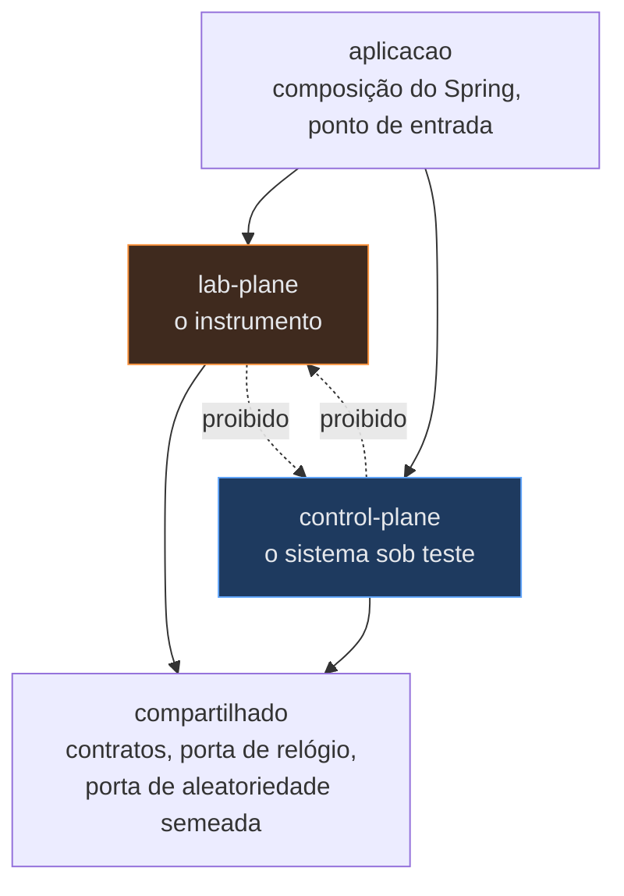
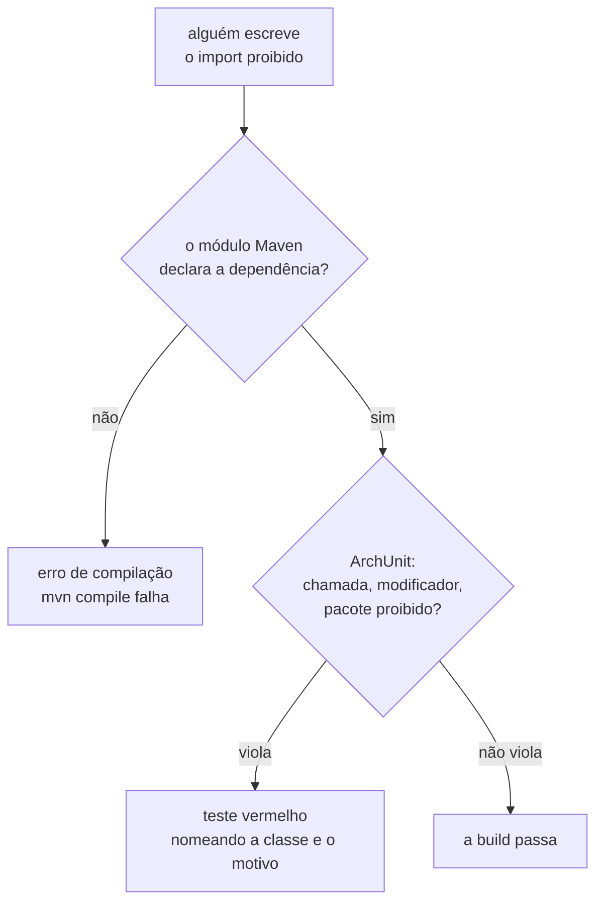
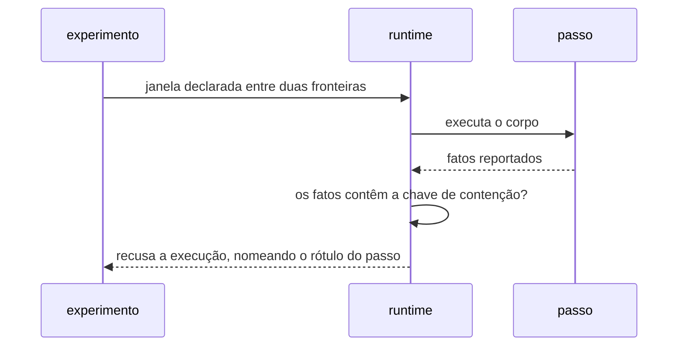

# Módulos, fronteiras e guardas executáveis

- **Estado:** Proposta — requer aprovação humana
- **Data:** 2026-08-03
- **Escopo:** os módulos nomeados do primeiro artefato compilável, as direções de
  dependência permitidas, e o mecanismo que transforma a separação system under test /
  Lab Plane num teste que falha.
- **Depende de:** [`ADR-0001`](../../0001-o-passo-como-unidade-de-execucao.md),
  [`ADR-0002`](../../0002-o-dominio-minimo-e-os-dois-oraculos.md),
  [`ADR-0005`](../../0005-a-forma-do-escalonador.md),
  [`ADR-0006`](../../0006-a-forma-da-estrategia-de-concorrencia.md),
  [`ADR-0007`](../../0007-o-log-de-observacoes-forma-ordem-e-onde-vive.md), todos
  `Aceito`. Responde a [`Q-0002-1`](../../../questions/Q-0002-1.md) e a
  [`Q-0004-2`](../../../questions/Q-0004-2.md), ambas com destino nomeado nesta decisão.

## Vocabulário emprestado

Este documento usa o vocabulário de módulo profundo da skill `codebase-design`:
**módulo** é qualquer coisa com interface e implementação, **interface** é tudo que quem
chama precisa saber, **seam** é o endereço onde a interface vive, e **adaptador** é o
que ocupa um seam. Um seam com um adaptador só é indireção, e não seam
(`.claude/skills/codebase-design/references/deepening.md:43-46`).

Os termos do glossário do laboratório — passo, fronteira, tentativa, worker, execução,
system under test, Lab Plane, verdade materializada, verdade derivada, oráculo, veredito,
restrito, calibração, observação, estratégia de concorrência — não são redefinidos aqui.

## Três regiões, e uma direção proibida

O laboratório tem uma invariante estrutural: **nenhuma classe do system under test
depende de uma classe do Lab Plane**. Ela vem da regra 6 do `arquivo/0006`, citada como
restrição pelo ADR-0001 (`../../0001-o-passo-como-unidade-de-execucao.md:68-70`) e
verificada por ele em três lugares diferentes (`:422-424`, `:440-442`).

Essa invariante cria um problema que nenhum documento do repositório trata. O runtime
recebe do system under test uma **definição de operação**, e não uma instância
(`../../0001-o-passo-como-unidade-de-execucao.md:118-124`). O tipo dessa definição
precisa ser visível dos dois lados. Se ele vive no Lab Plane, o system under test passa
a importá-lo, e a invariante cai. Se ele vive no system under test, o Lab Plane passa a
depender da identidade de cada operação, e o ADR-0006 proíbe exatamente esse acoplamento
para o rótulo de estratégia
(`../../0006-a-forma-da-estrategia-de-concorrencia.md:51-54`).

**Proposta:** três regiões, e não duas. Uma região `compartilhado` carrega os contratos
que os dois planos precisam enxergar, e não importa nenhum dos dois.

A seta `lab-plane → control-plane` também é proibida, e o motivo é o ADR-0006: o Lab
Plane seleciona qual implementação de `increment` roda, e nada mais. A seleção acontece
na composição, dentro de `aplicacao`, sobre uma interface declarada em `compartilhado`.
Com isso, escalonador, oráculo, contador de coincidências e classificador do zero
continuam sem enxergar a identidade de nenhuma estratégia.

## O mapa de módulos

Os módulos abaixo são a proposta de decomposição do primeiro artefato compilável. Todos
existem no MVP; nenhum é um processo.

| Módulo                      | Região        | Responsabilidade                                                            | Pode depender de           | Evidência                                                           |
|-----------------------------|---------------|-----------------------------------------------------------------------------|----------------------------|---------------------------------------------------------------------|
| `compartilhado.passo`       | compartilhado | contrato de passo, de definição de operação e de escopo de execução         | nada                       | `../../0001-o-passo-como-unidade-de-execucao.md:108-124`           |
| `compartilhado.relogio`     | compartilhado | porta do relógio injetável                                                  | nada                       | `../../0005-a-forma-do-escalonador.md:126`                         |
| `compartilhado.aleatorio`   | compartilhado | porta da fonte de aleatoriedade semeada                                     | nada                       | `plano-do-laboratorio.md:594-596`                                   |
| `labplane.runtime`          | Lab Plane     | executa a sequência de passos, cria o escopo da tentativa, verifica posse   | `compartilhado`            | `../../0001-o-passo-como-unidade-de-execucao.md:118-134`           |
| `labplane.escalonador`      | Lab Plane     | ativos, restrições pendentes, término, desistência                          | `compartilhado`            | `../../0005-a-forma-do-escalonador.md:60-80`                       |
| `labplane.injecao`          | Lab Plane     | decide se uma falha declarada dispara naquela fronteira                     | `compartilhado`            | `../../0001-o-passo-como-unidade-de-execucao.md:196-200`           |
| `labplane.observacao`       | Lab Plane     | sequência apensável de eventos, por execução, com `restrito`                | `compartilhado`            | `../../0007-o-log-de-observacoes-forma-ordem-e-onde-vive.md:56-88` |
| `labplane.veredito`         | Lab Plane     | oráculo exato, oráculo do predicado, calibração, classificação do zero      | `compartilhado`            | `../../0002-o-dominio-minimo-e-os-dois-oraculos.md:135-241`        |
| `labplane.experimento`      | Lab Plane     | definição, semente, hipótese, asserções, ciclo de vida da execução          | `compartilhado`            | fila de decisões, posição 8                                         |
| `labplane.web`              | Lab Plane     | inicia execução, transmite o log, entrega o relatório e a interface         | `compartilhado`            | `plano-do-laboratorio.md:531`, `540`                                |
| `controlplane.dominio`      | system under test | `Resource` e `Allocation`, sem nome de negócio                              | `compartilhado`            | `../../0002-o-dominio-minimo-e-os-dois-oraculos.md:87-99`          |
| `controlplane.operacao`     | system under test | definições de `increment` e `allocate`, nas duas resoluções                 | `compartilhado`, `dominio` | `../../0002-o-dominio-minimo-e-os-dois-oraculos.md:116-121`        |
| `controlplane.estrategia`   | system under test | `NONE`, `ATOMIC_UPDATE`, `OPTIMISTIC`, `PESSIMISTIC`, e o critério de retry | `compartilhado`, `dominio` | `../../0006-a-forma-da-estrategia-de-concorrencia.md:56-62`        |
| `controlplane.persistencia` | system under test | SQL, transação, isolamento, uma conexão por worker                          | `compartilhado`, `dominio` | `plano-do-laboratorio.md:579-582`                                   |
| `aplicacao`                 | composição    | ponto de entrada Spring Boot, ligação entre os dois planos                  | todos                      | —                                                                   |

Duas observações sobre o mapa.

**`labplane.web` não é o system under test.** A interface opera o instrumento; ela não é
medida por ele. Colocá-la fora dos dois planos exigiria uma quarta região sem regra
própria.

**`compartilhado` carrega contrato, e nunca comportamento de domínio.** `Resource`,
`Allocation`, a soma das alocações e qualquer regra sobre elas vivem no system under
test. É a mesma restrição que o `arquivo/0005` já havia fixado para outra topologia
(`../../arquivo/0005-monorepo-com-reactor-unico.md:50-67`), e o motivo continua
valendo: domínio compartilhado é acoplamento com outro nome.

## O mecanismo de módulo

Três mecanismos podem impor o mapa acima. Eles não competem em qualidade abstrata: cada
um falha num momento diferente do ciclo, e é isso que os separa.

| Mecanismo                | Quando a violação aparece | O que ele alcança                                    | O que ele não alcança                          |
|--------------------------|---------------------------|------------------------------------------------------|------------------------------------------------|
| Spring Modulith          | teste                     | dependência entre módulos declarados, e documentação | chamada de método, modificador, `synchronized` |
| Maven multi-módulo       | compilação                | dependência entre regiões, sem exceção possível      | qualquer regra dentro de um módulo             |
| microsserviços separados | rede                      | dependência entre processos                          | tudo que acontece dentro de um processo        |

**Spring Modulith.** O argumento legítimo é forte: um módulo é declarado onde ele vive,
a verificação é uma linha de teste, e o modelo de módulos gera documentação que não
apodrece junto do código. O `arquivo/0006` já previa esse uso, restrito a verificação e
documentação (`../../arquivo/0006-hexagonal-com-archunit.md:186-188`). O limite é o
alcance: Spring Modulith verifica dependências entre módulos, e as regras deste
laboratório que mais custam caro — aleatoriedade não semeada, relógio, sincronização de
JVM — não são dependências entre módulos, são chamadas e modificadores dentro de uma
classe.

**Maven multi-módulo.** É a forma mais forte: uma violação da direção proibida vira erro
de compilação, e não teste vermelho. O `arquivo/0006` a descartou por custo, com um
número explícito — quatro camadas vezes cinco serviços, dezesseis `pom.xml` adicionais
(`../../arquivo/0006-hexagonal-com-archunit.md:207-218`). Esse número não se aplica
aqui: o mapa acima tem **três** regiões mais a composição, o que custa quatro `pom.xml`
mais o `pom.xml` raiz. O argumento de custo que derrubou a alternativa em 2026-07-26 foi
calculado sobre uma arquitetura que o replanejamento arquivou.

**Microsserviços separados.** O argumento legítimo é o mais direto de todos: uma
fronteira de processo não é contornável nem por engano nem por pressa, e a stack do
usuário já a nomeia. O custo é que ela não existe no MVP: o plano fixa nenhum segundo
processo até que um experimento o exija (`plano-do-laboratorio.md:531-532`, `605-607`),
e criar processos antes disso é a decisão `D-ARQ-01` de
[`arquitetura-alvo.md`](arquitetura-alvo.md#d-arq-01--seguir-o-gatilho-contra-antecipar-a-decomposição).
Há um custo específico e menos óbvio: com o system under test noutro processo, a chamada
de passo atravessa a rede, e a latência dela entra na medida de todo experimento.

**Proposta:** Maven multi-módulo para a fronteira entre regiões, mais ArchUnit para as
regras de chamada e de modificador, que nenhuma fronteira de módulo alcança. Spring
Modulith fica como opção de documentação, sem substituir nenhum dos dois. É a decisão
`D-ARQ-05`.

## A separação vira um teste que falha

A fronteira entre os planos precisa produzir uma falha em dois lugares, porque um deles
sozinho deixa um caso passar.

O primeiro lugar é a compilação. Com `control-plane` sem dependência declarada para
`lab-plane` no `pom.xml`, o import não compila, e nenhuma configuração de teste pode ser
esquecida.

O segundo lugar é o teste. Duas propriedades que a fronteira de módulo não enxerga já
são exigidas por ADR aceito: a análise estática que rejeita campo não final, campo de
tipo mutável e `static` mutável nas classes de definição de operação
(`../../0001-o-passo-como-unidade-de-execucao.md:130-131`), e a prova de que as duas
resoluções da mesma operação emitem o mesmo traço de SQL
(`../../0001-o-passo-como-unidade-de-execucao.md:296-300`). As duas vivem no mesmo
lugar que as guardas abaixo.

## As três regras textuais viram guarda executável

Esta seção responde [`Q-0002-1`](../../../questions/Q-0002-1.md). A questão registra que a
justificativa do ADR-0002 se apoia em três regras que hoje são texto em `AGENTS.md`, e
que uma chamada esquecida a `Instant.now()` faz a prova de equivalência reprovar um par
correto de forma intermitente.

| Regra                               | Forma da guarda                                                                                                | Isenção declarada                        | Onde a guarda não alcança                              |
|-------------------------------------|----------------------------------------------------------------------------------------------------------------|------------------------------------------|--------------------------------------------------------|
| nenhuma aleatoriedade não semeada   | nenhuma classe chama `Math.random`, `new Random`, `ThreadLocalRandom.current`, `UUID.randomUUID`               | o adaptador de `compartilhado.aleatorio` | uma fonte alcançada por biblioteca de terceiro         |
| o tempo é injetável                 | nenhuma classe chama `Instant.now`, `LocalDateTime.now`, `System.currentTimeMillis`, `System.nanoTime`         | o adaptador de `compartilhado.relogio`   | um relógio lido dentro do driver ou do PostgreSQL      |
| nenhuma sincronização de JVM no SUT | nenhuma classe de `controlplane` referencia `ReentrantLock`, `AtomicInteger`, e nenhum método é `synchronized` | a estratégia `JVM_LOCK`                  | **o bloco `synchronized`** — ver `Perguntas em aberto` |

Três acréscimos ao que `AGENTS.md` lista, e o motivo de cada um.

**`UUID.randomUUID` entra na primeira regra.** O ADR-0002 exige que o identificador seja
função da semente e não do instante da execução
(`../../0002-o-dominio-minimo-e-os-dois-oraculos.md:123-133`). `UUID.randomUUID` não
aparece na lista de `AGENTS.md` e quebra exatamente essa exigência, em silêncio, porque
o teste de equivalência compara valores ligados.

**`System.nanoTime` entra na segunda regra.** O ADR-0007 exige um instante de parede em
todo evento do log
(`../../0007-o-log-de-observacoes-forma-ordem-e-onde-vive.md:58-60`), e o ADR-0005
proíbe medir tempo de parede fora de um adaptador de relógio
(`../../0005-a-forma-do-escalonador.md:126`). Um `System.nanoTime` esquecido dentro do
Lab Plane produz uma janela de exposição que nenhuma execução reproduz.

**A terceira regra vale só no system under test.** O Lab Plane precisa coordenar
threads para implementar a barreira, e proibi-la ali tornaria o escalonador do ADR-0005
inescrevível. `AGENTS.md` já escreve "no sistema sob teste"; a guarda precisa herdar
esse recorte, e é por isso que a região precisa ser identificável no nome do pacote.

A isenção é o ponto frágil de toda guarda deste tipo. Uma lista de classes isentas
escrita à mão apodrece — foi a objeção que o `arquivo/0006` registrou contra a regra 6
(`../../arquivo/0006-hexagonal-com-archunit.md:109-111`). **Proposta:** a isenção é
posicional, e não nominal. A guarda isenta um **pacote** (`compartilhado.relogio`,
`compartilhado.aleatorio`) e uma classe nomeada pela estratégia `JVM_LOCK`, e não aceita
anotação de supressão. É a decisão `D-ARQ-08`.

Uma ordem importa e não está escrita em lugar nenhum: **o adaptador precisa existir
antes da proibição**. O `arquivo/0006` registrou a mesma armadilha na questão 2
(`../../arquivo/0006-hexagonal-com-archunit.md:113-119`): uma regra que proíbe
`Instant.now()` sem oferecer o substituto é inaplicável. Proposta:
`compartilhado.relogio` e `compartilhado.aleatorio` entram no mesmo commit que a guarda.

## A guarda que `Q-0004-2` pede não é estática

[`Q-0004-2`](../../../questions/Q-0004-2.md) pede uma guarda que impeça um passo de deixar de
reportar a chave de contenção. A própria questão registra a dificuldade: a exigência não
vale para todo passo, vale para os passos que delimitam uma janela de exposição
declarada por algum experimento, e "esse ligamento vive no experimento, não na classe".

Isso derruba a forma estática. Uma regra ArchUnit enxerga a classe e não enxerga qual
experimento a referencia.

**Proposta:** a guarda é de execução, e tem a forma da terceira camada do ADR-0001 — a
verificação de posse do escopo, que falha na hora e nomeia o passo
(`../../0001-o-passo-como-unidade-de-execucao.md:132-134`). Quando um experimento
declara uma janela entre duas fronteiras, o runtime verifica na primeira passagem por
cada uma delas se o passo reportou a chave de contenção, e recusa a execução nomeando o
rótulo do passo. A recusa acontece antes de qualquer veredito ser publicado, que é a
propriedade que `Q-0004-2` protege. A forma exata é `D-ARQ-09`.

## Pacote raiz e convenção de nomes

**Proposta de pacote raiz:** `dev.da0hn.lab`. Abaixo dele, o primeiro segmento nomeia a
região: `dev.da0hn.lab.compartilhado`, `dev.da0hn.lab.labplane`,
`dev.da0hn.lab.controlplane`, `dev.da0hn.lab.aplicacao`.

O segmento de região não é estética. As regras 4, 5, 6 e 7 do `arquivo/0006` ficaram
inexprimíveis porque o padrão de pacote não existia, e a questão 1 daquele documento
registra que a regra 6 exige que o plano seja identificável — ou o pacote o carrega, ou
o teste precisa listar as classes uma a uma
(`../../arquivo/0006-hexagonal-com-archunit.md:98-111`). Um pacote como
`dev.da0hn.lab.runtime` deixaria a regra da fronteira dependente de uma lista manual.

**Proposta de artefatos Maven:** `lab-parent` como `pom`, e os módulos
`lab-compartilhado`, `lab-plane`, `lab-control-plane` e `lab-aplicacao`. O `groupId`
acompanha o pacote raiz.

**Proposta de idioma dos identificadores:** inglês para tipos e métodos, com uma tabela
de correspondência versionada entre o glossário congelado e os nomes de tipo. O motivo é
que o domínio já está em inglês por ADR aceito — `Resource`, `Allocation`, `value`,
`capacity`, `amount` (`../../0002-o-dominio-minimo-e-os-dois-oraculos.md:87-99`) — e um
código que misture `Passo` com `Resource` dá dois idiomas ao mesmo arquivo.

| Glossário   | Tipo proposto | Por que este nome                                                   |
|-------------|---------------|---------------------------------------------------------------------|
| passo       | `Step`        | —                                                                   |
| fronteira   | `Boundary`    | o endereço completo é `BoundaryAddress`                             |
| tentativa   | `Attempt`     | —                                                                   |
| worker      | `Worker`      | o glossário já usa a palavra inglesa                                |
| execução    | `Run`         | `Execution` colidiria com "execução de operação", que é outra coisa |
| experimento | `Experiment`  | —                                                                   |
| observação  | `Observation` | —                                                                   |
| veredito    | `Verdict`     | —                                                                   |
| oráculo     | `Oracle`      | —                                                                   |
| restrito    | `restricted`  | campo booleano do evento, `../../0007-...md:62-65`                 |
| calibração  | `Calibration` | —                                                                   |

## Decisões que exigem aprovação humana

| ID         | Decisão                                                    | Alternativas                                                                     | Recomendação                                                  | Por que só uma pessoa decide                                                      |
|------------|------------------------------------------------------------|----------------------------------------------------------------------------------|---------------------------------------------------------------|-----------------------------------------------------------------------------------|
| `D-ARQ-05` | O mecanismo de módulo do primeiro artefato                 | Spring Modulith; Maven multi-módulo; microsserviços separados                    | Maven multi-módulo com quatro módulos, mais ArchUnit          | fixa o número de `pom.xml` do dia zero e o custo de toda mudança de fronteira     |
| `D-ARQ-06` | Pacote raiz, artefatos e idioma dos identificadores        | `dev.da0hn.lab` em inglês; glossário em português; pacote sem segmento de região | `dev.da0hn.lab`, região no primeiro segmento, tipos em inglês | o nome é irreversível na prática e as guardas dependem do padrão de pacote        |
| `D-ARQ-07` | O que verifica cada classe de regra                        | ArchUnit; `spring-modulith-core`; fronteira de compilação; combinação            | compilação para região, ArchUnit para chamada e modificador   | decide o que falha na build e o que falha em teste                                |
| `D-ARQ-08` | Onde vivem o relógio e a fonte semeada, e quem fica isento | isenção posicional por pacote; lista nominal de classes; anotação de supressão   | isenção posicional, sem anotação de supressão                 | uma isenção larga apaga a guarda inteira, em silêncio                             |
| `D-ARQ-09` | A forma da guarda da chave de contenção                    | recusa na primeira passagem; validação do experimento antes de executar; nenhuma | recusa na primeira passagem, nomeando o rótulo do passo       | escolhe entre recusar uma execução e publicar um veredito que ninguém sabe errado |

### `D-ARQ-05` — o mecanismo de módulo do primeiro artefato

**O problema.** O mapa de módulos precisa de um mecanismo que o imponha. Os três
candidatos falham em momentos diferentes: compilação, teste e rede.

**Alternativa 1 — Spring Modulith.** A favor: declaração no lugar onde o módulo vive,
verificação em uma linha, e documentação gerada a partir do modelo. Contra: o alcance
para em dependência entre módulos, e as três regras que mais custam caro neste
laboratório são chamadas e modificadores; ArchUnit continuaria necessário, e o projeto
passaria a manter dois modelos de módulo.

**Alternativa 2 — Maven multi-módulo.** A favor: a direção proibida vira erro de
compilação, que nenhuma configuração de teste esquecida contorna; o custo aqui é quatro
`pom.xml`, e não os dezesseis que derrubaram a alternativa equivalente no
`arquivo/0006`. Contra: mover uma classe de região passa a ser uma mudança de `pom.xml`,
e o ciclo de build local fica mais lento que o de um módulo único.

**Alternativa 3 — microsserviços separados.** A favor: a fronteira mais forte que
existe, e já nomeada na stack escolhida. Contra: o MVP não tem experimento que peça um
segundo processo, a chamada de passo passaria a atravessar a rede, e a latência dela
entraria na medida — a decisão pertence a `D-ARQ-01`, não a esta.

**Recomendação.** Maven multi-módulo com `lab-compartilhado`, `lab-plane`,
`lab-control-plane` e `lab-aplicacao`, mais ArchUnit para o que a fronteira de módulo
não enxerga.

**Se a escolha for outra.** Com Spring Modulith, a região deixa de ser fronteira de
compilação e passa a depender de um teste que alguém precisa lembrar de rodar; com
microsserviços, `D-ARQ-01` fica decidida por consequência, sem gatilho.

### `D-ARQ-06` — pacote raiz, artefatos e idioma dos identificadores

**O problema.** Nenhum `pom.xml` existe, e o pacote raiz nunca foi escolhido
(`../../arquivo/0005-monorepo-com-reactor-unico.md:100-108`). As guardas são expressas
em padrões de pacote, e um padrão ambíguo torna a regra inexprimível.

**Alternativa 1 — `dev.da0hn.lab`, região no primeiro segmento, tipos em inglês.** A
favor: a região fica identificável sem lista manual, e o idioma acompanha o domínio já
fixado em inglês pelo ADR-0002. Contra: o glossário congelado é português, e a leitura
passa a depender da tabela de correspondência.

**Alternativa 2 — identificadores em português.** A favor: um conceito tem um nome,
escrito do mesmo jeito no ADR e no código, o que é uma regra explícita do repositório.
Contra: `Resource` e `Allocation` já estão em inglês por ADR aceito, e o resultado é um
arquivo com dois idiomas.

**Alternativa 3 — pacote sem segmento de região.** A favor: nomes mais curtos, e a
região expressa apenas na estrutura Maven. Contra: reintroduz exatamente a falha
registrada na questão 1 do `arquivo/0006` — a regra da fronteira passa a depender de uma
lista de classes que apodrece.

**Recomendação.** Alternativa 1, com a tabela de correspondência versionada junto do
glossário.

**Se a escolha for outra.** Identificadores em português exigem renomear `Resource` e
`Allocation`, o que contraria o ADR-0002 e precisa de um ADR novo que o substitua nesse
ponto.

### `D-ARQ-07` — o que verifica cada classe de regra

**O problema.** Existem quatro classes de regra: direção entre regiões, chamada de
método proibida, modificador proibido, e propriedade de classe exigida pelo ADR-0001.
Nenhum mecanismo alcança as quatro.

**Alternativa 1 — tudo em ArchUnit.** A favor: um só mecanismo, uma só forma de mensagem
de erro, e nada a mais no `pom.xml`. Contra: a direção entre regiões passa a falhar em
teste quando poderia falhar em compilação, e a diferença importa porque um teste pode
ser ignorado por quem tem pressa.

**Alternativa 2 — tudo em `spring-modulith-core`.** A favor: o modelo de módulos vira
documentação viva, e a verificação acompanha a aplicação Spring. Contra: chamada de
método e modificador ficam de fora, e as três regras de `Q-0002-1` continuariam sendo
texto.

**Alternativa 3 — combinação.** Compilação para região, ArchUnit para chamada,
modificador e propriedade de classe. A favor: cada regra falha no momento mais cedo
possível. Contra: duas ferramentas para entender quando algo quebra.

**Recomendação.** Alternativa 3, com `because(...)` obrigatório em toda regra ArchUnit —
o `arquivo/0006` já registrou que sem isso a mensagem vira obstáculo incompreensível
(`../../arquivo/0006-hexagonal-com-archunit.md:178-180`).

**Se a escolha for outra.** Com tudo em ArchUnit, a fronteira entre regiões deixa de ser
propriedade do `pom.xml` e `D-ARQ-05` perde o argumento principal.

### `D-ARQ-08` — onde vivem o relógio e a fonte semeada, e quem fica isento

**O problema.** As três regras de `Q-0002-1` só são aplicáveis se existir o substituto
que elas obrigam a usar, e a lista de quem está isento decide se a guarda vale alguma
coisa.

**Alternativa 1 — isenção posicional, por pacote.** A favor: a isenção tem endereço, e
mover uma classe para dentro dela é uma mudança visível no diff. Contra: uma classe
legítima que precise da chamada e não caiba no pacote isento força uma reorganização.

**Alternativa 2 — lista nominal de classes isentas.** A favor: caso a caso, sem
reorganizar código. Contra: a lista apodrece, e a objeção já está registrada no
`arquivo/0006` a respeito da regra 6.

**Alternativa 3 — anotação de supressão.** A favor: a isenção fica ao lado do código que
a exige, com o motivo escrito. Contra: uma anotação de supressão é uma isenção que
qualquer pessoa concede a si mesma, o que transforma a guarda em recomendação.

**Recomendação.** Alternativa 1, com dois pacotes isentos e uma classe isenta para
`JVM_LOCK`, e os adaptadores criados no mesmo commit que a guarda.

**Se a escolha for outra.** Uma anotação de supressão exige uma regra adicional que
conte as supressões e falhe acima de um número declarado — do contrário, `Q-0002-1`
continua aberta com outra aparência.

### `D-ARQ-09` — a forma da guarda da chave de contenção

**O problema.** `Q-0004-2` pede uma guarda que nenhuma regra estática consegue
expressar, porque o ligamento entre a janela declarada e o corpo do passo vive no
experimento.

**Alternativa 1 — recusa na primeira passagem.** A favor: falha na hora, nomeia o rótulo
do passo, e reusa a forma da terceira camada do ADR-0001. Contra: a recusa acontece
depois de a execução começar, e uma bateria longa perde o trabalho já feito.

**Alternativa 2 — validação do experimento antes de executar.** A favor: falha sem
gastar execução nenhuma. Contra: exige que a plataforma saiba, sem executar, quais fatos
um passo reporta — o que só é possível se o passo declarar os fatos, e isso muda o
contrato de passo do ADR-0001, que hoje trata o corpo como opaco.

**Alternativa 3 — nenhuma guarda.** A favor: nada a construir, e o MVP inteiro opera
sobre um `Resource` único, onde toda sobreposição temporal é sobreposição sobre a mesma
linha. Contra: é exatamente o cenário que `Q-0004-2` descreve como o que produz um
veredito `protegido` sem que teste nenhum falhe, e o custo aparece fora do MVP.

**Recomendação.** Alternativa 1.

**Se a escolha for outra.** A alternativa 2 exige um ADR que emende o contrato de passo
do ADR-0001, porque o corpo deixaria de ser opaco quanto aos fatos que reporta.

## Perguntas em aberto

**ArchUnit não enxerga um bloco `synchronized`.** O modelo dele expõe o modificador de
um método, e um `synchronized (obj) { ... }` dentro do corpo não aparece como
dependência nem como modificador. A guarda proposta pega o método sincronizado e as
referências a `ReentrantLock` e `AtomicInteger`, e deixa passar o bloco. Faltou:
verificar se uma leitura de bytecode em busca de `MONITORENTER` cabe no ciclo de build
sem uma dependência nova.

**Não está escrito se um Feature Card pode contradizer um ADR aceito.** A lacuna é do
processo (`../../../specification-process.md`), e ela alcança este documento: as guardas
propostas aqui derivam de regras que vivem em `AGENTS.md`, e não em ADR aceito. Faltou:
saber qual documento vence se os dois divergirem.

**A semente atravessa do Lab Plane para o system under test, e nenhum documento diz
como.** O ADR-0002 exige que o identificador seja função da semente e seja gerado no
código do sistema sob teste
(`../../0002-o-dominio-minimo-e-os-dois-oraculos.md:123-126`). A única forma que
preserva a direção proibida é a semente chegar como valor, pela definição de operação.
Faltou: uma linha em ADR aceito que fixe isso, em vez de deixá-lo como consequência
inferida.

**O número de módulos Maven interage com a etapa 4 e ninguém mediu o custo.** Se
`D-ARQ-03` escolher Lab Plane único chamando por rede, `lab-plane` e `lab-control-plane`
viram artefatos entregáveis separados, e o `deploy/` muda de forma. Faltou: o gatilho da
etapa 4, que ainda não disparou.

## Adições propostas a `integrations.md`

As linhas abaixo são propostas. **Nenhuma edição foi feita naquele arquivo.**

Nenhuma travessia de processo nasce desta decisão enquanto o MVP tiver um processo só. O
que ela acrescenta à matriz é uma fronteira interna que a matriz hoje não representa, e
que passa a ser fronteira de processo se `D-ARQ-03` escolher Lab Plane único:

| Origem             | Destino                 | Tipo                | Operação/tópico   | Finalidade                                      | Contrato                     | Autenticação | Confiabilidade                      | Evidência                                                          |
|--------------------|-------------------------|---------------------|-------------------|-------------------------------------------------|------------------------------|--------------|-------------------------------------|--------------------------------------------------------------------|
| `labplane.runtime` | `controlplane.operacao` | chamada em processo | executar um passo | executar a sequência de passos de uma tentativa | interface em `compartilhado` | —            | direção proibida no sentido inverso | hipótese — `../../0001-o-passo-como-unidade-de-execucao.md:93-95` |

Propostas de perguntas novas naquele arquivo, no formato `Q-INT-N`:

**`Q-INT-7` — o contrato de passo e de definição de operação não tem forma.** Ele
atravessa a fronteira entre os dois planos e é a interface mais citada por ADR aceito, e
nenhum documento fixa a assinatura dele. Enquanto isso, `contracts/` não tem onde
registrá-lo, porque a fronteira não é de processo — a regra de criação de contrato hoje
só cobre travessia de processo (`../../../contracts/README.md:9`).

**`Q-INT-8` — a semente atravessa do Lab Plane para o system under test sem forma
declarada.** O ADR-0002 exige identidade em função da semente, gerada no system under
test. A travessia é interna hoje, e vira fronteira de processo na etapa 4.
