# Fila de decisões

Fila única deste repositório. Criada em 2026-08-05 pela decisão `B-1`, registrada em
[`arquivo/proposta-2026-08-03/decisoes-pendentes.md`](arquivo/proposta-2026-08-03/decisoes-pendentes.md).

Antes dela existiam duas listas do mesmo tipo de coisa, e a sobreposição era medida: os
três primeiros assuntos da rodada de arquitetura vinham colados numa linha só da fila
derivada do plano. Enquanto foram duas, uma decisão PODE ter sido tomada numa e reaberta
na outra.

## O que esta fila enfileira

**Decisão, e não ADR.** Desde 2026-08-04, o artefato que uma linha gera é escolhido no
momento em que a decisão é tomada, e não antes: ADR quando a escolha atender aos quatro
critérios de [`README.md`](README.md#uma-decisão-merece-adr-quando), artefato de
[`../features/`](../features/README.md) quando não atender. Uma linha PODE gerar os dois,
e PODE não gerar ADR nenhum.

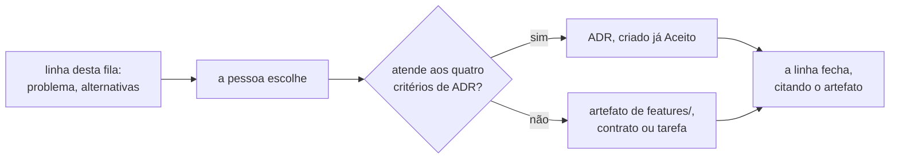

**A poda não acontece antes da decisão.** A pendência de podar as linhas que são
comportamento disfarçado de arquitetura fechou em 2026-08-05, pela decisão `B-2`, por
subsunção: podar hoje é escolher o artefato antes da decisão, que é o oposto da regra
acima. A poda acontece uma linha por vez, quando a pessoa escolhe.

## Como citar uma linha desta fila

**Pelo nome, nunca pela posição.** A posição muda quando uma decisão entra no meio, e
uma citação por posição continua válida depois da inserção — passando a apontar para
outra decisão.

**Por âncora nomeada, nunca por número de linha.** É a decisão `C-1`, de 2026-08-05, com
o slug do GitHub Flavored Markdown fixado por `C-1a`. O verificador
[`scripts/check_citations.py`](../../scripts/check_citations.py) confere as duas formas.

Os números de ADR **não** estão atribuídos nas linhas abertas. Um número é atribuído
quando o ADR é escrito — atribuir antes cria buracos na sequência quando a ordem muda.

## As decisões derivadas do plano

Ordem derivada de [`../plano-do-laboratorio.md`](../plano-do-laboratorio.md). A coluna
`Ordem` é posição na fila, e ela muda.

| Ordem | Decisão                                                      | Estado                                   |
|-------|--------------------------------------------------------------|------------------------------------------|
| 1     | **O passo como unidade de execução, observação e injeção**   | `Aceito` — ADR-0001                      |
| 2     | **O domínio mínimo: contador e predicado de capacidade**     | `Aceito` — ADR-0002                      |
| 3     | **O estatuto da barreira e o diagnóstico da não ocorrência** | `Aceito` — ADR-0004                      |
| 4     | **A linguagem do agendamento**                               | `Aceito` — ADR-0003                      |
| 5     | **A forma do escalonador**                                   | `Aceito` — ADR-0005                      |
| 6     | **Estratégias de concorrência como dado, não como branch**   | `Aceito` — ADR-0006                      |
| 7     | **O log de observações: forma, ordem e onde vive**           | `Aceito` — ADR-0007                      |
| 8     | **Experiment: definição, semente, hipótese e asserções**     | aberta                                   |
| 9     | **Os dois formatos de veredito: booleano e curva**           | aberta                                   |
| 10    | **Arquitetura mínima, stack e guardas executáveis**          | **parcialmente consumida** pelo ADR-0008 |
| 11    | **Entrega contínua no homelab desde o dia zero**             | aberta                                   |

O porquê de cada posição, as questões que cada linha carrega e o histórico de como a
fila chegou a esta ordem estão em [`README.md`](README.md#índice) e nos próprios ADRs. As três
linhas abertas levam o detalhe abaixo.

**Posição 8 — Experiment.** Precisa resolver a tensão entre o Designer na interface e a
definição versionada. [`Q-0002-4`](../questions/Q-0002-4.md) pede aqui o ciclo de vida de
uma execução, [`Q-0003-8`](../questions/Q-0003-8.md) o que `N` conta, e
[`Q-0001-1`](../questions/Q-0001-1.md) a identidade de versão de uma operação.

**Posição 9 — os dois formatos de veredito.** Se ficar para depois, o grupo D não cabe
na arquitetura. [`Q-0002-3`](../questions/Q-0002-3.md) acrescenta o eixo pontual contra
contínuo no tempo, e [`Q-0003-3`](../questions/Q-0003-3.md) pede o que "mesma taxa"
significa numa execução medida.

**Posição 10 — arquitetura mínima.** O
[ADR-0008](0008-os-dois-planos-em-processos-separados.md) fixou dois processos separados
e o pacote raiz. Restam o build, o número de módulos e a guarda que
[`Q-0002-1`](../questions/Q-0002-1.md) pede para as três regras hoje textuais.

**Posição 11 — entrega contínua.** O serviço precisa nascer entregando; a linha ratifica
ou emenda a ADR 0017 do homelab.

## As decisões da rodada de arquitetura de 2026-08-03

Sessenta e seis linhas com identificador `D-*`, agrupadas por bloco. O agrupamento
**não** é o documento que cada assunto vai gerar: esse só existe depois da escolha.

**Três linhas já fecharam** — `D-ARQ-05`, `D-ARQ-06` e `D-ARQ-01`, todas pelo
[ADR-0008](0008-os-dois-planos-em-processos-separados.md). **Quatro mais** — as do Bloco
4 — fecharam em [`../CONTEXT.md`](../CONTEXT.md). **Uma quinta**, `D-DAT-05`, fechou em
2026-08-05.

### Bloco 0 — sem estas seis, nenhuma linha de código é escrita

São as que a fila de [`README.md`](README.md) enfileira nas
posições 10 e 11, e a exigência de nascer entregando as torna as primeiras.

| ID         | Decisão                                  | Recomendação da proposta                          | Onde                                                                                                         |
|------------|------------------------------------------|---------------------------------------------------|--------------------------------------------------------------------------------------------------------------|
| `D-ARQ-05` | mecanismo de módulo do primeiro artefato | Maven multi-módulo, quatro módulos, mais ArchUnit | [`arquivo/proposta-2026-08-03/modulos-e-fronteiras.md`](arquivo/proposta-2026-08-03/modulos-e-fronteiras.md) |
| `D-ARQ-12` | Maven contra Gradle                      | emendar a ADR 0017 do homelab para Maven          | [`arquivo/proposta-2026-08-03/entrega-continua.md`](arquivo/proposta-2026-08-03/entrega-continua.md)         |
| `D-ARQ-06` | pacote raiz e idioma dos identificadores | `dev.da0hn.lab`, região no primeiro segmento      | [`arquivo/proposta-2026-08-03/modulos-e-fronteiras.md`](arquivo/proposta-2026-08-03/modulos-e-fronteiras.md) |
| `D-ARQ-15` | a forma do `deploy/` no primeiro commit  | `deploy/` mínimo agora, uma réplica               | [`arquivo/proposta-2026-08-03/entrega-continua.md`](arquivo/proposta-2026-08-03/entrega-continua.md)         |
| `D-ARQ-14` | o que o pipeline executa                 | só guardas e provas; experimento sob demanda      | [`arquivo/proposta-2026-08-03/entrega-continua.md`](arquivo/proposta-2026-08-03/entrega-continua.md)         |
| `D-DAT-04` | ferramenta de migração                   | Flyway com SQL versionado                         | [`arquivo/proposta-2026-08-03/modelo-de-dados.md`](arquivo/proposta-2026-08-03/modelo-de-dados.md)           |

**`D-ARQ-05` e `D-ARQ-06` estão fechadas** pelo
[ADR-0008](0008-os-dois-planos-em-processos-separados.md), `Aceito` em
2026-08-04. A escolha não foi a recomendação da linha: o mecanismo de módulo é a
**fronteira de processo**, e não Maven multi-módulo. O pacote raiz `dev.da0hn.lab` com a
região no primeiro segmento foi aceito como recomendado, com os identificadores
**todos** em inglês. As duas linhas permanecem na tabela para que o histórico da
recomendação não se perca.

`D-ARQ-12` é a única com custo fora deste repositório: ela emenda um documento
`Aceito` do [`homelab-infrastructure`](https://github.com/da0hn/homelab-infrastructure).
`D-ARQ-15` fecha o `ComparisonError` que o ArgoCD reporta hoje, e a separação por
processo muda a forma que ela precisa declarar.

### Bloco 1 — destravam o esquema e a primeira migração

| ID         | Decisão                                       | Recomendação da proposta                 |
|------------|-----------------------------------------------|------------------------------------------|
| `D-DAT-01` | tipo e derivação da coluna de identidade      | `bigint` ordinal da semente              |
| `D-DAT-02` | chave estrangeira de `allocation.resource_id` | sem FK no MVP                            |
| `D-DAT-03` | índice sobre `allocation(resource_id)`        | criar, e registrar o plano efetivo       |
| `D-DAT-05` | como o banco volta ao ponto de partida        | decidida em 2026-08-05: não há reset     |
| `D-DOM-14` | dono da identidade derivada da semente        | o experimento publica; o domínio consome |
| `D-DOM-13` | o esquema compartilhado entre os dois planos  | Shared Kernel com contrato verificável   |

`D-DAT-02` tem a justificativa mais afiada da rodada: com chave estrangeira, o
`INSERT` de uma alocação toma `FOR KEY SHARE` na linha do recurso e conflita com
o `FOR UPDATE` do `PESSIMISTIC` — uma restrição de integridade mudaria o
fenômeno medido.

`D-DAT-05` recomendava `TRUNCATE` antes de cada execução até 2026-08-05, quando uma
quarta candidata entrou — pôr a execução na chave primária, preservando todo o
histórico — e `P-DAT-9` mostrou que a objeção de `Q-0002-4` contra preservar linhas
entre execuções não se sustenta sobre nenhum dos dois critérios de igualdade aceitos.
**O usuário decidiu na mesma data: não há reset.** A chave primária das duas tabelas
passa a incluir um discriminador UUIDv7, gerado pelo Lab Plane e propagado a tudo que o
sistema medido publica, com o crescimento das tabelas aceito. A linha permanece aqui
para que o histórico da recomendação não se perca; a decisão e o que ela deixa em aberto
estão em [`arquivo/proposta-2026-08-03/modelo-de-dados.md`](arquivo/proposta-2026-08-03/modelo-de-dados.md), seção 7, `D-DAT-05`, `P-DAT-10` e
`P-DAT-11`.

### Bloco 2 — destravam o E1 e a etapa 1

| ID         | Decisão                                  | Recomendação da proposta                            |
|------------|------------------------------------------|-----------------------------------------------------|
| `D-ARQ-04` | modelo de thread do worker               | threads de plataforma no MVP                        |
| `D-ARQ-07` | o que verifica cada classe de regra      | compilação para região; ArchUnit para o resto       |
| `D-ARQ-08` | onde vivem o relógio e a fonte semeada   | isenção posicional, sem anotação de supressão       |
| `D-ARQ-09` | a forma da guarda da chave de contenção  | recusa na primeira passagem                         |
| `D-DAT-08` | como o nível de isolamento é aplicado    | `TransactionTemplate`, pelo runtime                 |
| `D-DAT-09` | verificação de "uma conexão por worker"  | tamanho de pool mais asserção de PID distinto       |
| `D-DOM-07` | `Allocation` é agregado próprio          | agregado próprio                                    |
| `D-DOM-08` | onde vive `Σ amount ≤ capacity`          | no oráculo, como invariante observada               |
| `D-DOM-15` | quais fronteiras a stack materializa     | só system under test / Lab Plane, imposta por teste |
| `D-UI-02`  | onde o frontend renderiza                | exportação estática                                 |
| `D-UI-03`  | framework de componentes                 | shadcn/ui sobre Radix                               |
| `D-UI-04`  | eixo padrão da timeline                  | posição no log, com arestas causais                 |
| `D-UI-06`  | teto de eventos no navegador             | paginação contra o servidor                         |
| `D-UI-07`  | autenticação e autoria                   | nenhuma, declarada; autoria vinda do commit         |
| `D-UI-08`  | o que o `POST` cria                      | a sequência de execuções, não uma                   |
| `D-UI-09`  | mecanismo de streaming                   | SSE, com limiar numérico proposto                   |
| `D-UI-10`  | idempotência de iniciar execução         | chave obrigatória do cliente                        |
| `D-UI-11`  | vocabulário do contrato                  | português, igual ao glossário                       |
| `D-UI-12`  | compatibilidade e enumeração do veredito | enumeração aberta, cliente falha fechado            |

`D-ARQ-07` e `D-ARQ-08` são a resposta proposta a
[`Q-0002-1`](../questions/Q-0002-1.md), que pede a guarda executável das três
regras hoje textuais. `D-ARQ-09` responde
[`Q-0004-2`](../questions/Q-0004-2.md).

`D-DOM-07` e `D-DOM-08` carregam a descoberta conceitual da rodada: **o
agregado clássico do DDD é antipadrão aqui.** Um `Resource` que impusesse
`Σ amount ≤ capacity` na fronteira transacional tornaria o E5 irreproduzível,
pelo mesmo argumento com que o ADR-0002 descartou a constraint no banco —
confundir observar com impedir (`0002-...md:566-574`).

### Bloco 3 — pertencem a um ADR já enfileirado, e a recomendação é não decidir agora

| ID         | Decisão                                  | Destino na fila de ADRs                                       |
|------------|------------------------------------------|---------------------------------------------------------------|
| `D-DOM-06` | o que `N` conta                          | Experiment, posição 8; [`Q-0003-8`](../questions/Q-0003-8.md) |
| `D-DOM-09` | se `Experimento` é raiz das execuções    | Experiment, posição 8                                         |
| `D-DAT-07` | onde vive a definição de experimento     | Experiment, posição 8                                         |
| `D-UI-01`  | fonte de verdade da definição            | Experiment, posição 8                                         |
| `D-DOM-05` | se `veredito` vira quatro termos         | formatos de veredito, posição 9                               |
| `D-DOM-16` | se o modelo reserva lugar para a curva   | formatos de veredito, posição 9                               |
| `D-DOM-10` | se o log é agregado próprio              | gatilho na etapa 6                                            |
| `D-DOM-12` | se a injeção de falha é contexto próprio | gatilho na etapa 6                                            |

Aprovar qualquer uma destas **antecipa um ADR enfileirado**, e é a forma mais
provável de esta rodada causar dano. A recomendação de cada uma é adiar.

### Bloco 4 — vocabulário, decidível a qualquer momento e barato

**As quatro estão fechadas desde 2026-08-04.** As escolhas e as consequências de cada
uma vivem em [`../CONTEXT.md`](../CONTEXT.md), seção "As seis decisões de vocabulário".

| ID         | Decisão                                             | Escolha                                                 | Seguiu a recomendação? |
|------------|-----------------------------------------------------|---------------------------------------------------------|------------------------|
| `D-DOM-01` | qual sentido `execução` carrega sozinha             | `run` no experimento, `operation execution` na operação | sim                    |
| `D-DOM-02` | separar `system under test` de execução de controle | renomear para `system under test`                       | **não**                |
| `D-DOM-03` | se `barreira` continua na linguagem                 | aposentar, com citação histórica permitida              | sim                    |
| `D-DOM-04` | os dois sentidos de `estratégia`                    | `strategy` e `strategy label`                           | sim                    |

`D-DOM-03` foi executada no mesmo turno: os oito pontos de
[`arquivo/proposta-2026-08-03/mensageria.md`](arquivo/proposta-2026-08-03/mensageria.md) que usavam `barreira` como termo passaram a dizer
`restrição de precedência` ou `espera`, e o mérito de `D-MSG-11` não mudou.

`D-DOM-02` foi decidida contra a recomendação, e abriu duas perguntas que a alternativa
A não tratava. As duas estão em [`../CONTEXT.md`](../CONTEXT.md), na seção `D-DOM-02`:
se `Lab Plane` acompanha a renomeação, e se ela alcança as 95 ocorrências em texto
editável ou só o glossário.

**Pergunta em aberto.** Qual artefato registra estas quatro? O processo de
[`README.md`](README.md) prevê ADR ou artefato de
[`../features/`](../features/README.md), e vocabulário não é nem um nem outro — ele vive
no glossário, por instrução de [`../AGENTS.md`](../AGENTS.md), seção `## Glossário de
domínio`. `D-DOM-02` é a que mais puxa para ADR: ela renomeia um termo presente em
quatro ADRs aceitos, e o rastro de alterações adotado em 2026-08-04 obrigaria a carimbar
os quatro.

Estas quatro existem porque **os ADRs aceitos já colidem entre si no
vocabulário**. Decidi-las é barato agora e caro depois de existir código.

**A contra-avaliação sustenta este bloco.** Ele é "o único bloco aprovável como está"
([`arquivo/proposta-2026-08-03/contra-avaliacao.md`](arquivo/proposta-2026-08-03/contra-avaliacao.md), linhas 430 a 434), porque as quatro
colisões são reais entre ADRs aceitos, independem da fila e ficam caras depois de
existir código. Nenhuma das quatro pode ser resolvida editando um ADR.

Dois fatos levantados em 2026-08-04, antes de qualquer escolha.

**O glossário já aplicou a recomendação de `D-DOM-03` sem a decisão existir.**
[`../CONTEXT.md`](../CONTEXT.md), linha 355, marca `barrier` como `aposentado`, e a
tabela de estados daquele arquivo (linha 49) reserva esse rótulo para o que "existiu em
ADR aceito e foi retirado da linguagem por outro ADR". A recomendação virou texto antes
de virar escolha. Se a decisão for outra, aquela entrada muda junto, e o registro disso
não pode depender da memória de quem editou.

**Aprovar `D-DOM-03` obriga reescrever [`arquivo/proposta-2026-08-03/mensageria.md`](arquivo/proposta-2026-08-03/mensageria.md) no mesmo
turno.** A palavra é termo vivo e normativo ali:
`arquivo/proposta-2026-08-03/mensageria.md:520`, `:539`, `:548-553`, `:805` e `:1034-1054`,
inclusive no enunciado e nas três alternativas de `D-MSG-11`. A ressalva está em [`arquivo/proposta-2026-08-03/contra-avaliacao.md`](arquivo/proposta-2026-08-03/contra-avaliacao.md), linhas 143
a 145; o inventário de linhas é novo.

### Bloco 5 — etapa 4 e adiante, sem gatilho disparado hoje

| ID         | Decisão                                      | Etapa | Recomendação da proposta                 |
|------------|----------------------------------------------|-------|------------------------------------------|
| `D-ARQ-01` | seguir o gatilho ou antecipar serviços       | 4     | seguir o gatilho                         |
| `D-ARQ-03` | onde o Lab Plane vive com dois processos     | 4     | decidir quando a etapa 4 tiver gatilho   |
| `D-ARQ-11` | PostgreSQL dedicado ou compartilhado         | 0     | dedicado                                 |
| `D-ARQ-13` | experimento destrutivo sob `selfHeal`        | 6     | matar a operação, preservando o processo |
| `D-ARQ-10` | Toxiproxy                                    | —     | emendar a ADR 0017 e retirar             |
| `D-DAT-06` | onde o log durável vive                      | 6     | instância separada da medida             |
| `D-DAT-10` | o que do log entra no Git                    | 6     | relatório mais eventos restritos         |
| `D-DAT-11` | instância e `wal_level` se o CDC entrar      | —     | dedicada                                 |
| `D-UI-05`  | onde vive o desenho pedagógico               | 1     | só no controle positivo                  |
| `D-UI-13`  | como o relatório chega a `docs/experiments/` | 1     | download e commit por pessoa             |

`D-ARQ-01` é a decisão que responde diretamente à instrução de usar
microsserviços: a proposta recomenda **seguir o gatilho**, isto é, começar com um
artefato e decompor quando o experimento `JVM_LOCK` ficar vermelho com duas
instâncias. Aprovar o contrário é legítimo e tem custo nomeado no documento.

**`D-ARQ-01` está fechada, contra a recomendação**, pelo
[ADR-0008](0008-os-dois-planos-em-processos-separados.md). A decomposição deixou
de esperar o gatilho da etapa 4: os dois planos rodam em processos separados desde o dia
zero. `D-ARQ-03` continua aberta e muda de sentido — ela deixa de perguntar onde o Lab
Plane vive quando existirem dois processos e passa a perguntar o que muda quando o
system under test ganhar a segunda instância.

### Bloco 6 — mensageria, etapa 5 e adiante

Nenhuma destas tem gatilho disparado hoje. Elas existem para que a etapa 5 não
comece sem desenho, e **nenhuma delas deve ser construída antes do gatilho**.

| ID         | Decisão                                      | Recomendação da proposta                    |
|------------|----------------------------------------------|---------------------------------------------|
| `D-MSG-01` | gatilho concreto que libera o RabbitMQ       | broker real, pelo mecanismo da reentrega    |
| `D-MSG-02` | como uma entrega duplicada é contada         | contagem nova de comandos distintos aceitos |
| `D-MSG-03` | quem carimba os atributos de extensão        | o runtime, na fronteira                     |
| `D-MSG-04` | modo do binding CloudEvents e versão do AMQP | binário sobre 0-9-1, mapeamento declarado   |
| `D-MSG-05` | que recursos do broker ficam desligados      | nenhum DLX e nenhum limite até a etapa 8    |
| `D-MSG-06` | confirmação de publicador                    | ligada, com braço de comparação desligado   |
| `D-MSG-07` | se o broker é fonte legítima do oráculo      | é fonte só depois da quiescência            |
| `D-MSG-08` | ciclo de vida de uma reentrega               | execução nova, com ADR novo sobre o log     |
| `D-MSG-09` | quem cria e destrói a topologia              | por execução                                |
| `D-MSG-10` | se o CDC com Debezium entra                  | **não entra**; gatilhos registrados         |
| `D-MSG-11` | barreira contra o limite de confirmação      | declarar o limite por execução e reportá-lo |

`D-MSG-05` é a que mais contraria a intuição: a proposta recomenda **desligar**
DLX e limite de entregas até a etapa 8, porque com eles ligados os cenários 18 e
19 não têm o que mostrar. É a regra pedagógica aplicada à configuração do broker.

`D-MSG-10` é a resposta à instrução sobre Debezium. O argumento decisivo não é de
custo: o CDC **apaga os pontos `BEFORE_PUBLISH` e `AFTER_PUBLISH` do ADR-0001**,
porque sem passo `PUBLISH` na operação a etapa 6 perde o gatilho que o plano lhe
dá (`../plano-do-laboratorio.md:609`). Os dois gatilhos que criariam o CDC estão
registrados em [`arquivo/proposta-2026-08-03/mensageria.md`](arquivo/proposta-2026-08-03/mensageria.md).

### As duas linhas sem bloco, classificadas em 2026-08-05

`D-ARQ-02` e `D-DOM-11` têm seção própria no documento-fonte e não apareciam em bloco
nenhum: é a diferença entre 64 e 66 que a decisão `B-5` fechou. **As duas continuam
abertas** — `B-5` classificou, e não decidiu.

| ID         | Decisão                               | Assunto                     | Onde                                                                                                                                                          |
|------------|---------------------------------------|-----------------------------|---------------------------------------------------------------------------------------------------------------------------------------------------------------|
| `D-ARQ-02` | onde a interface web é construída     | Entrega contínua no homelab | [`arquivo/proposta-2026-08-03/arquitetura-alvo.md`](arquivo/proposta-2026-08-03/arquitetura-alvo.md#d-arq-02--onde-a-interface-web-é-construída-e-empacotada) |
| `D-DOM-11` | se o escalonamento é contexto próprio | Bloco 4, vocabulário        | [`arquivo/proposta-2026-08-03/modelo-de-dominio.md`](arquivo/proposta-2026-08-03/modelo-de-dominio.md#d-dom-11--se-o-escalonamento-é-contexto-próprio)        |

`D-ARQ-02` entrou em "Entrega contínua no homelab" porque fixa o `Dockerfile` e o número
de imagens do dia zero. `D-DOM-11` entrou no Bloco 4 porque
[`../CONTEXT.md`](../CONTEXT.md) já carrega o termo `scheduling` como `proposto` por ela.

### O agrupamento por assunto

A tabela abaixo agrupa as linhas por assunto, e não por bloco. Ela existe porque os três
primeiros assuntos vinham colados numa linha só da fila derivada do plano: a posição 10.

| Assunto                                        | Linhas                                                                                          |
|------------------------------------------------|-------------------------------------------------------------------------------------------------|
| Experimento: definição, semente, ciclo de vida | Bloco 3, mais `D-DAT-05`, `D-UI-08` e `D-UI-10`                                                 |
| Formatos de veredito                           | `D-DOM-05` e `D-DOM-16`                                                                         |
| A forma do artefato compilável                 | `D-ARQ-05`, `D-ARQ-06`, `D-ARQ-04`                                                              |
| A guarda executável das três regras            | `D-ARQ-07`, `D-ARQ-08`, `D-ARQ-09`, `D-DOM-15`                                                  |
| O esquema e a primeira migração                | `D-DAT-01` a `D-DAT-04`, `D-DAT-08`, `D-DAT-09`, `D-DOM-07`, `D-DOM-08`, `D-DOM-13`, `D-DOM-14` |
| Entrega contínua no homelab                    | `D-ARQ-12`, `D-ARQ-14`, `D-ARQ-15`, `D-ARQ-10`, `D-ARQ-11`, `D-ARQ-13`, `D-ARQ-02`              |
| Vocabulário                                    | Bloco 4, mais `D-DOM-11`, com destino em [`../CONTEXT.md`](../CONTEXT.md)                       |
| Mensageria, sem gatilho hoje                   | Bloco 6                                                                                         |
| Interface web                                  | `D-UI-02` a `D-UI-13`, menos as que o Bloco 3 absorve                                           |

## A ordem da arquitetura mínima e da entrega contínua está sob tensão

O laboratório é entregue no cluster do
[`homelab-infrastructure`](https://github.com/da0hn/homelab-infrastructure), e a
exigência é que um serviço **nasça já entregando** — pipeline e CI/CD no mesmo commit
que cria o módulo, não retrofitados depois.

Isso não move o passo: o formato dele não afeta o que o pipeline empacota. Mas move a
arquitetura mínima e a entrega contínua para **junto do primeiro módulo compilável**, e
as decisões entre o domínio mínimo e os vereditos deixam de ser pré-requisito de
escrever código de esqueleto. O `Dockerfile` e o `deploy/kustomization.yaml` fixam o
número de módulos e a forma do artefato — que é o conteúdo da arquitetura mínima.

A entrega contínua tem uma particularidade que nenhuma outra tem: **parte dela já foi
tomada fora deste repositório.** A ADR 0017 do homelab, aceita em 2026-07-26, escolheu
Gradle, Toxiproxy e "microsserviços JVM" para este laboratório, dois dias antes do
replanejamento que descartou a arquitetura de serviços. Ratificar ou emendar é decisão
consciente e explícita. O inventário completo do que sobrevive e do que colide está em
[`../plano-do-laboratorio.md`](../plano-do-laboratorio.md), seção 12.

## O Lote E, enumerado em 2026-08-06

Os Lotes A a D fecharam pendências de **processo**: onde a fila vive, quem aprova o quê,
como uma citação é escrita, o que acontece com a rodada de arquitetura arquivada. Nenhum
deles destrava uma linha de código. **Este destrava, e é o único que destrava.**

O Lote E é a interseção de três coisas que a fila tinha separadas: a posição 10
(arquitetura mínima), a posição 11 (entrega contínua) e o Bloco 1 (esquema e primeira
migração). A exigência de nascer entregando as junta — o `Dockerfile` e o
`deploy/kustomization.yaml` fixam a forma do artefato, e a forma do artefato **é** o
conteúdo da arquitetura mínima.

### Os dois grupos, e a ordem entre eles

O grupo I produz um repositório que compila, empacota e é reconciliado pelo ArgoCD, com
zero regra de negócio dentro. O grupo II produz a primeira migração e as duas tabelas.
Os dois são sequenciais e não concorrentes: o grupo II precisa do build escolhido em
`E-1` para ter onde pôr o arquivo de migração.

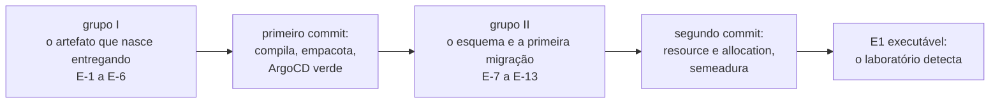

**O grupo I não espera o grupo II, e essa é a única razão de existirem dois.** Um
repositório que compila e é reconciliado, sem tabela nenhuma, já apaga o
`ComparisonError` que o cluster reporta hoje e prova a esteira inteira. Adiar o primeiro
commit até o esquema estar decidido acopla a prova da esteira à discussão de chave
primária, que não tem relação nenhuma com ela.

### Grupo I — sem estas seis, não existe `pom.xml`

| ID    | Decisão                                          | Origem     | Recomendação da proposta              |
|-------|--------------------------------------------------|------------|---------------------------------------|
| `E-1` | build: Maven contra Gradle                       | `D-ARQ-12` | emendar a ADR 0017 para Maven         |
| `E-2` | quantos artefatos executáveis, e quantos módulos | `D-ARQ-05` | **vencida** pelo ADR-0008; ver abaixo |
| `E-3` | a forma do `deploy/` no primeiro commit          | `D-ARQ-15` | `deploy/` mínimo agora, uma réplica   |
| `E-4` | o que o pipeline executa                         | `D-ARQ-14` | só guardas e provas                   |
| `E-5` | PostgreSQL dedicado contra compartilhado         | `D-ARQ-11` | dedicado ao namespace do laboratório  |
| `E-6` | onde a interface web é construída                | `D-ARQ-02` | exportação estática na mesma imagem   |

As alternativas de cada uma, com o argumento a favor e contra, estão em
[`entrega-continua.md`](arquivo/proposta-2026-08-03/entrega-continua.md#d-arq-12--maven-contra-gradle)
para `E-1`, `E-3`, `E-4` e `E-5`, e em
[`arquitetura-alvo.md`](arquivo/proposta-2026-08-03/arquitetura-alvo.md#d-arq-02--onde-a-interface-web-é-construída-e-empacotada)
para `E-6`.

### Grupo II — sem estas sete, não existe a primeira migração

| ID     | Decisão                                          | Origem     | Recomendação da proposta              |
|--------|--------------------------------------------------|------------|---------------------------------------|
| `E-7`  | ferramenta de migração                           | `D-DAT-04` | Flyway com SQL versionado             |
| `E-8`  | tipo e derivação da identidade do recurso        | `D-DAT-01` | `bigint` ordinal da semente           |
| `E-9`  | chave estrangeira de `allocation.resource_id`    | `D-DAT-02` | sem FK no MVP                         |
| `E-10` | índice sobre `allocation(resource_id)`           | `D-DAT-03` | criar, e registrar o plano efetivo    |
| `E-11` | quem deriva a identidade a partir da semente     | `D-DOM-14` | a definição publica, o domínio deriva |
| `E-12` | a guarda do filtro por discriminador             | `P-DAT-12` | nenhuma; a escolha não foi feita      |
| `E-13` | quem gera o UUIDv7, contra as regras estruturais | `P-DAT-10` | nenhuma; a tensão não foi fechada     |

`E-7` a `E-11` estão em
[`modelo-de-dados.md`](arquivo/proposta-2026-08-03/modelo-de-dados.md#d-dat-04--ferramenta-de-migração)
e em
[`modelo-de-dominio.md`](arquivo/proposta-2026-08-03/modelo-de-dominio.md#d-dom-14--quem-é-dono-da-identidade-derivada-da-semente).
`E-12` e `E-13` estão na seção
[`Perguntas em aberto`](arquivo/proposta-2026-08-03/modelo-de-dados.md#perguntas-em-aberto)
do mesmo documento, e **nunca estiveram em bloco nenhum** — elas nasceram como
consequência de `D-DAT-05`, decidida em 2026-08-05, depois de os blocos existirem.

### Seis achados do levantamento, e nenhum deles é opinião

**A recomendação de `D-ARQ-12` ficou órfã.** Ela argumentava a favor de Maven porque
`D-ARQ-05` propunha a fronteira entre regiões como dependência declarada entre módulos
Maven. O [ADR-0008](0008-os-dois-planos-em-processos-separados.md) decidiu **contra**
essa proposta: a fronteira é o processo, e não o módulo. O apoio técnico da recomendação
caiu junto, e o que resta a favor de Maven é de governança — a escolha por Gradle na ADR
0017 foi feita como detalhe de contexto de uma decisão de CI/CD, sem debate aqui.

**A recomendação de `D-ARQ-15` está vencida na letra.** Ela diz `Deployment` de **uma**
réplica, e foi escrita em 2026-08-03. O ADR-0008 é de 2026-08-04 e põe os dois planos em
processos separados — o `deploy/` nasce com **dois** `Deployment`, o que o próprio ADR
registra nas consequências. A escolha entre as três alternativas não muda; o manifesto
que a alternativa 1 descreve muda.

**`D-ARQ-05` já foi respondida para o mecanismo, e não para a contagem.** O ADR-0008
fixou a fronteira (processo) e as quatro regiões de pacote. Ele **não** fixou quantos
módulos de build existem nem quantos artefatos executáveis são publicados. Dois
processos exigem no mínimo dois executáveis; se `shared` é um módulo próprio, ou se os
quatro pacotes vivem em dois módulos, continua aberto. É `E-2`, e ela é a linha nova
deste lote.

**O argumento contra `bigint` em `D-DAT-01` caiu.** Ele era a colisão entre duas
execuções da mesma semente. `D-DAT-05` pôs um discriminador UUIDv7 de execução na chave
primária das duas tabelas, e a colisão deixou de existir — o próprio texto da decisão
registra que `D-DAT-01` permanece, com o discriminador como segunda coluna da chave e
não como substituição. `E-8` é hoje mais barata do que era quando foi enunciada.

**`D-DOM-13` é subsumida por `E-7`.** Ela pergunta se o Shared Kernel entre os dois
planos ganha contrato verificável, e recomenda que sim, deixando a forma "para quem
decide o esquema". Escolher uma ferramenta de migração com SQL versionado **é** essa
forma: o arquivo de migração passa a ser o contrato, e o Markdown não pode repeti-lo. A
linha fecha quando `E-7` fechar, sem decisão própria.

**`P-DAT-12` é o item mais perigoso do lote, e ele não estava em lista nenhuma.** Sem
reset, uma consulta que esqueça o filtro por discriminador soma linhas de execuções
anteriores ao `value_final` do oráculo exato, e o veredito sai errado **sem sintoma**.
Com `TRUNCATE` o mesmo esquecimento era inofensivo, porque não havia outra execução no
banco. A decisão de 2026-08-05 trocou dois riscos ruidosos por um silencioso, e nada
hoje obriga o filtro.

### O que este lote NÃO inclui, de propósito

- **As guardas executáveis** de [`Q-0002-1`](../questions/Q-0002-1.md) — `D-ARQ-07`,
  `D-ARQ-08` e `D-ARQ-09`. Elas pertencem ao Bloco 2, e nenhuma linha de código as
  espera: uma regra sem código para vigiar não tem o que verificar.
- **O modelo de thread do worker** (`D-ARQ-04`) e **o nível de isolamento**
  (`D-DAT-08`), que o E1 exige e o esqueleto não.
- **As dezenove linhas de interface web** do Bloco 2, menos `E-6`, que entra só porque
  fixa o número de imagens do `Dockerfile`.

### As decisões do grupo I, em 2026-08-06

| ID    | Escolha                                                          | Seguiu a recomendação? |
|-------|------------------------------------------------------------------|------------------------|
| `E-1` | Maven, emendando a ADR 0017 do homelab                           | sim                    |
| `E-2` | três módulos e dois executáveis, com o nome corrigido para `sut` | parcialmente           |
| `E-3` | **adiada**, por escolha explícita                                | —                      |
| `E-5` | PostgreSQL compartilhado do homelab, com schema por aplicação    | **não**                |
| `E-7` | Flyway, fechada por consequência de `E-5`                        | sim                    |

**`E-1` — Maven.** A emenda à ADR 0017 do `homelab-infrastructure` é custo aceito, e ela
é o único item deste lote com efeito fora deste repositório. `Q-INT-4` fecha com ela.

**`E-2` — o nome `control-plane` estava vencido, e a pergunta o repetiu.** A
[emenda do ADR-0009](0009-a-classificacao-do-dual-write-e-a-regiao-de-pacote.md) trocou
a região `dev.da0hn.lab.controlplane` por `dev.da0hn.lab.sut`, e `D-DOM-02` aposentou
`Control Plane` da linguagem. O módulo é `sut`, e não `control-plane`. A sigla é
permitida em identificador de código pela decisão `A5`, registrada em
[`../CONTEXT.md`](../CONTEXT.md#a-sigla-sut-no-código-decidida-em-2026-08-05) — em prosa
continua `system under test` por extenso.

**`E-3` — adiada.** O `ComparisonError` no ArgoCD permanece, e a exigência da ADR 0017
de nascer entregando fica pendente junto. A linha continua aberta nesta fila; nada mais
neste lote depende dela, porque o build e o esquema não leem o `deploy/`.

### `E-5`, decidida contra a recomendação, e o que ela arrasta

A escolha é a alternativa 2 de `D-ARQ-11`: **o PostgreSQL que o homelab já opera na
Camada 6**, com desenvolvimento local num contêiner. **Cada aplicação aplica a própria
migração, no próprio schema.**

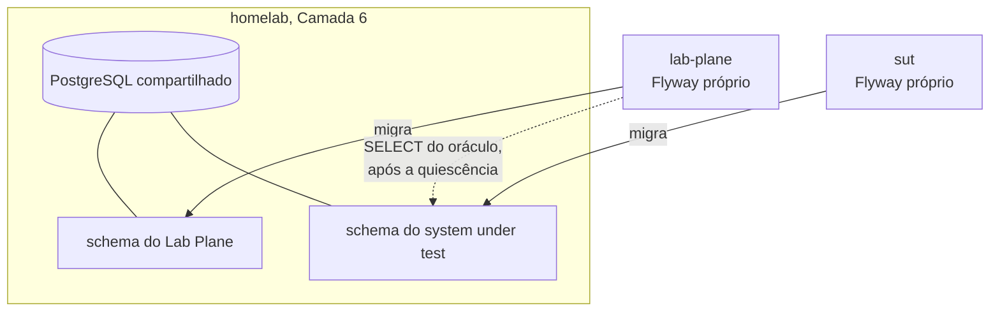

**Ela fecha uma pergunta em aberto do ADR-0008.** Aquele ADR registra que a escolha
entre schema separado e dois bancos na mesma instância não fora feita, e que ela decide
permissão e espaço de nomes — nunca contaminação da medida, porque dois schemas do mesmo
cluster compartilham buffer pool, WAL, checkpointer, autovacuum e a tabela de locks. A
escolha é **schemas separados na mesma instância**.

**O custo nomeado pela própria alternativa passa a valer.** A contenção de conexões, de
CPU e de I/O atravessa a fronteira do banco lógico. O relatório de todo experimento
DEVE registrar que a medida foi feita num banco com vizinhos; sem isso, dois relatórios
com o mesmo veredito afirmam coisas diferentes. `Q-INT-3` fecha com a alternativa 2 e
esta obrigação.

**Ela dá forma concreta a `D-DOM-13`.** O Shared Kernel entre os planos deixa de ser
abstrato: o oráculo do Lab Plane lê as tabelas do schema do system under test, então o
papel do Lab Plane precisa de `USAGE` naquele schema e `SELECT` nas duas tabelas. A
fronteira que `Q-INT-5` pedia com forma verificável é uma concessão de permissão, e ela
é declarável e testável.

**Ela fecha `E-7` por consequência.** Migração por aplicação exige ferramenta de
migração, e a escolha é Flyway com SQL versionado — um arquivo por decisão aceita, nunca
editado depois de aplicado. Com isso `D-DOM-13` fecha junto: o arquivo de migração passa
a ser o contrato, e o Markdown não pode repeti-lo.

**Ela acrescenta um artefato que este repositório declara não ter.** Um contêiner local
significa `compose.yaml` versionado, e o [`../../AGENTS.md`](../../AGENTS.md) afirma hoje
que não existe `docker-compose.yml` nem comando de execução. A afirmação deixa de valer
no commit que criar o arquivo, e o texto muda junto.

**Pergunta em aberto: o Lab Plane não tem tabela nenhuma hoje.** O
[ADR-0007](0007-o-log-de-observacoes-forma-ordem-e-onde-vive.md) mantém o log em memória
e fixa a etapa 6 como o gatilho da persistência durável. Um Flyway no `lab-plane` no dia
zero teria zero migrações. Se o módulo já carrega a ferramenta com o diretório vazio, ou
se ela entra quando a primeira tabela existir, **não foi decidido**.

### A segunda rodada do grupo I mudou o desenho, em 2026-08-06

Três respostas fecharam linha, e duas abriram decisão que a fila mantinha adiada de
propósito. O registro é literal, antes de qualquer escolha nova.

| ID     | Escolha                                                        | Efeito                                 |
|--------|----------------------------------------------------------------|----------------------------------------|
| `E-4`  | o pipeline constrói a imagem e atualiza o `deploy/`; nada mais | contraria a alternativa 1 em parte     |
| `E-6`  | frontend em contêiner próprio, React                           | contraria a recomendação de `D-ARQ-02` |
| `E-14` | o `lab-plane` tem base própria desde o dia zero                | linha nova; antecipa `D-DAT-07`        |
| `E-15` | serviço próprio para o histórico de execução                   | linha nova, **em aberto**              |

**`E-4` — o experimento sai do pipeline, e a interface o aciona.** A parte que coincide
com a recomendação é a que importa: nenhum experimento roda no CI, então o veredito
probabilístico nunca pinta a build de vermelho. A parte nova é que guardas, provas e
testes **também** ficaram de fora do enunciado, e isso ainda não foi confirmado.

**`E-4` colide com o mecanismo da ADR 0017 do homelab.** Aquele documento fixa **ArgoCD
por polling**, com intervalo de cerca de três minutos: o workflow da `master` bumpa
a tag da imagem nos manifests Kustomize de `deploy/`, e o ArgoCD percebe sozinho. Não há
notificação do pipeline para o ArgoCD. "Avisar" exigiria webhook ou credencial de
escrita no painel do homelab — que é a mesma objeção com que `D-ARQ-13` descartou a
alternativa 3. O efeito prático é o mesmo, e o mecanismo é outro.

**`E-6` — três imagens no dia zero.** A escolha é a alternativa 2 de `D-ARQ-02`, contra
a recomendação. O custo nomeado passa a valer: o workflow ganha uma segunda matriz de
build, e a frase do plano segundo a qual a interface é servida pela própria aplicação
deixa de ser verdadeira. O framework de componentes fica em aberto — é `D-UI-03`, ainda
na fila.

**`E-14` — a base do `lab-plane` antecipa uma decisão do Bloco 3.** Guardar "as
configurações do experimento e as execuções solicitadas" põe a definição de experimento
numa tabela. `D-DAT-07` e `D-UI-01` perguntam exatamente onde essa definição vive, e a
recomendação das duas é **não decidir agora**, porque elas pertencem ao ADR de
Experiment — a posição 8 desta fila.

A tensão é real e está escrita desde o replanejamento: o
[`../../AGENTS.md`](../../AGENTS.md) diz que `experiments/` guarda definições, que
`docs/experiments/` guarda resultados, e que **os dois entram no Git** — juntos, o
histórico vira um caderno de laboratório. Uma definição que só existe numa linha de
tabela não é versionada, não aparece em diff e não sobrevive a um banco recriado.

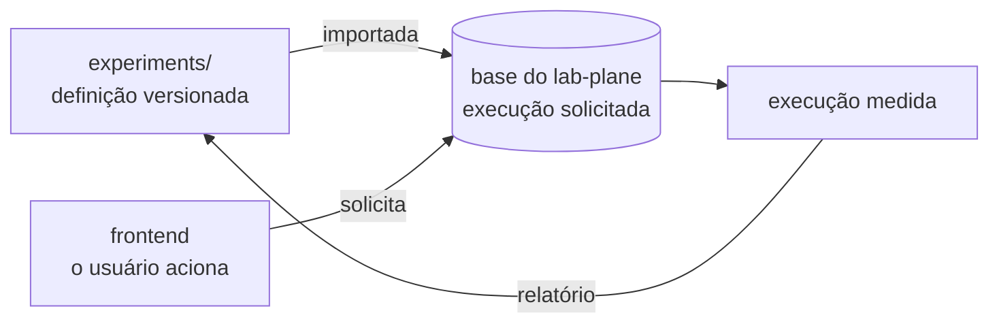

O desenho acima é **uma** saída, e não a decidida: a definição continua versionada e é
importada; o banco guarda a **execução solicitada**, que é dado de operação e não de
especificação. Registrado como possibilidade, e a escolha pertence a `E-14`.

**`E-15` — o serviço de histórico não tem decisão, e o argumento a favor é forte.**
Ele é o mesmo do [ADR-0008](0008-os-dois-planos-em-processos-separados.md), aplicado um nível
abaixo: quem consulta não pode compartilhar destino com quem mede. Uma consulta da
interface sobre o histórico, dentro do processo que executa o experimento, perturba a
medida pelo mecanismo que aquele ADR nomeia — pausa de GC, pool esgotado, contenção.

O argumento contra também é do repositório: o
[ADR-0007](0007-o-log-de-observacoes-forma-ordem-e-onde-vive.md) mantém o log em memória
e fixa a **etapa 6** como o gatilho da persistência durável. Um serviço de histórico
hoje antecipa esse gatilho, e a regra estrutural exige nomear a limitação concreta que
a peça nova resolve antes de ela entrar.

### A terceira rodada, em 2026-08-06: duas linhas fechadas e a nomenclatura

| ID     | Escolha                                              | Seguiu a recomendação? |
|--------|------------------------------------------------------|------------------------|
| `E-4`  | build, testes e guardas; depois imagem e bump da tag | sim                    |
| `E-14` | a definição de experimento vive **só no banco**      | **não**                |

**`E-4` fecha.** O workflow compila, roda os testes com Testcontainers e as guardas
executáveis, publica a imagem no GHCR e bumpa a tag nos manifests de `deploy/`. Nenhum
experimento roda no CI. Uma imagem publicada é uma imagem que passou nas provas exigidas
por ADR aceito, e o veredito probabilístico nunca pinta a build de vermelho.

**`E-14` fecha contra a recomendação, e fecha três linhas de outros blocos junto.**
`D-DAT-07`, `D-UI-01` e a tensão 1 do plano perguntam a mesma coisa: onde vive a
definição de experimento. A resposta é a tabela, e o Designer na interface passa a ser
a fonte. As três saem da posição 8 desta fila.

**O que a escolha custa, nomeado.** O [`../../AGENTS.md`](../../AGENTS.md) afirma que
`experiments/` guarda definições, que `docs/experiments/` guarda resultados e que os
dois entram no Git — "juntos, o histórico vira um caderno de laboratório". A metade das
definições deixa de valer: elas não aparecem em diff, não são revisadas em PR e não
sobrevivem a um banco recriado. O texto muda no commit que criar a tabela.

**Um desenho em que o custo desaparece, registrado como possibilidade.** Se o relatório
de execução que vai para `docs/experiments/` **incorporar a definição completa que foi
usada**, o Git volta a guardar tudo que reproduz a execução — só que como parte do
resultado, e não como fonte. A definição deixa de ser artefato a sincronizar e passa a
ser um campo do relatório, o que elimina a pergunta de qual representação manda.
A escolha entre isto e um relatório que só cite a definição por identificador **não foi
feita**.

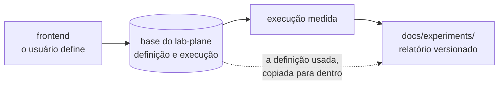

#### A nomenclatura dos módulos e dos serviços

Levantada na mesma rodada, e ela ainda não fechou.

**`system-under-test` como nome de módulo, `sut` como segmento de pacote.** A separação
já existe e é a decisão `A5`, em
[`../CONTEXT.md`](../CONTEXT.md#a-sigla-sut-no-código-decidida-em-2026-08-05): em prosa,
por extenso; em identificador de código, a sigla. Um nome de módulo e de imagem não é
nenhum dos dois — ele aparece em `deploy/`, no GHCR e no log do cluster, onde a sigla
não tem expansão à vista. O par por extenso no módulo e sigla no pacote é coerente com a
regra, e a fixa para um caso que ela não previa.

**`lab-auditory` não pode ser o nome, e o motivo é de idioma.** Em inglês `auditory` é
"auditivo", relativo à audição; "auditoria" é `audit`. Como todo identificador é escrito
em inglês pelo [ADR-0008](0008-os-dois-planos-em-processos-separados.md), o nome errado
ficaria em pacote, imagem e manifesto. As candidatas com o sentido pretendido são
`lab-audit`, `lab-journal`, `lab-ledger` e `lab-notebook` — as duas últimas alinhadas à
metáfora do caderno de laboratório que o repositório já usa.

**A contagem de serviços continua aberta**, e ela é o que resta de `E-2` e `E-15`.

### A quarta rodada, em 2026-08-06: uma contradição com ADR aceito

| ID     | Escolha                                              | Estado                     |
|--------|------------------------------------------------------|----------------------------|
| `E-16` | o nome do histórico é `lab-journal`                  | fechada                    |
| `E-17` | `docs/experiments/` não existe; tudo vive no serviço | fechada, com custo nomeado |
| `E-18` | um schema por serviço, sem acesso cruzado            | **contradiz o ADR-0008**   |

**`E-16` — `lab-journal`.** Pacote `dev.da0hn.lab.journal`. Alinhado à metáfora do
caderno de laboratório que o repositório já usa, e sem a conotação de conformidade que
`audit` carrega nem a contábil de `ledger`.

**`E-17` — o caderno de laboratório sai do Git por inteiro.** A definição já tinha saído
por `E-14`; agora saem também os resultados. O usuário define pelo frontend, e o serviço
expõe endpoints para isso. Três linhas fecham junto: `D-DAT-10`, que pergunta o que
do log entra no Git, fecha com **nada**; `D-UI-13`, que pergunta como o relatório
chega a `docs/experiments/`, fecha por subsunção; e a pasta deixa de ser criada.

O custo, nomeado e aceito: o [`../../AGENTS.md`](../../AGENTS.md) afirma que
`experiments/` e `docs/experiments/` entram no Git e que "juntos, o histórico vira um
caderno de laboratório". A frase inteira deixa de valer. Um resultado deixa de aparecer
em diff, de ser revisado em PR e de sobreviver a um banco recriado — o `lab-journal`
passa a ser o **único** guardião do histórico, e a durabilidade dele deixa de ser
conveniência e vira requisito.

#### `E-18` — a regra de schema e o oráculo do ADR-0002

A regra escolhida é a de microsserviços: **um schema por serviço, e um serviço JAMAIS
acessa o schema de outro.** Ela é sólida no lugar de onde vem, e aqui ela colide com uma
decisão `Aceito`.

O [ADR-0008](0008-os-dois-planos-em-processos-separados.md) declara, no diagrama da
seção `## Decisão`, a aresta `SELECT após a quiescência` indo do Lab Plane direto ao
PostgreSQL do sistema medido. Não é acessório: o oráculo exato do ADR-0002 é
`perdidas = commits − (value_final − value_inicial)`, e `value_final` é o valor lido de
`resource` **depois** que todos os workers terminaram. Sem essa leitura, o laboratório
não mede nada.

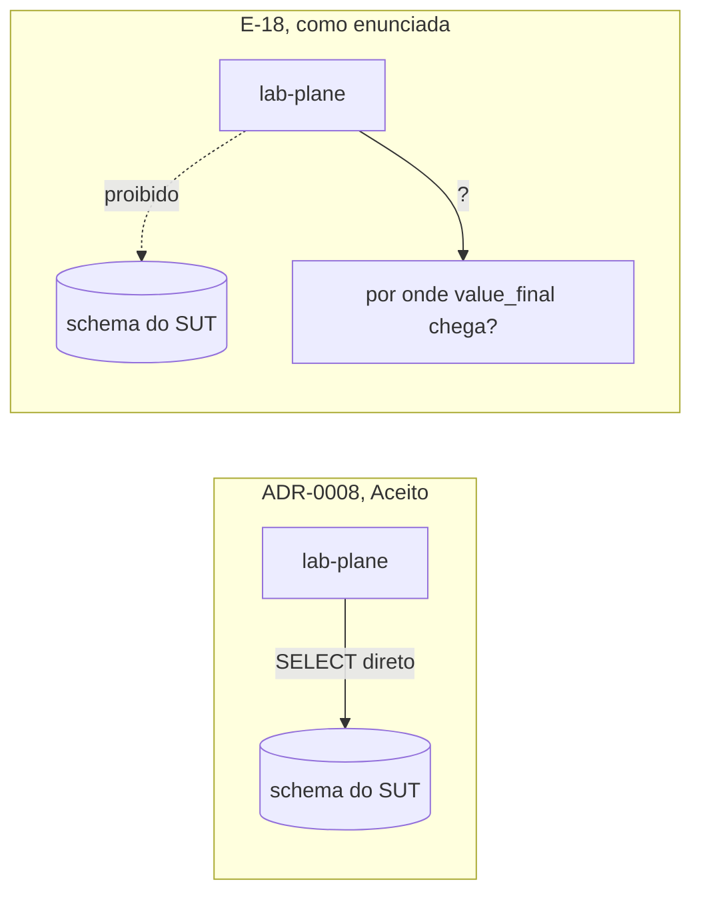

**Por que trocar por uma chamada HTTP ao próprio sistema medido não é neutro.** O
instrumento passaria a depender do medido para medi-lo: um defeito na leitura do
system under test — um filtro errado, um cache, uma transação aberta — apareceria como
resultado de consistência, que é precisamente a confusão entre os dois planos que o
ADR-0008 existe para impedir. Some-se a isto que `P-DAT-12` já registra que, sem reset,
um `WHERE` que esqueça o discriminador de execução corrompe o veredito **sem sintoma**.

**A contradição é decisão arquitetural nova, e ela entra na fila hoje.** É a regra
`B-4`, de 2026-08-05: um artefato não pode contradizer um ADR aceito, e a contradição
vira linha no mesmo turno em que é vista. Ela não foi decidida aqui, e o Lote E não
fecha sem ela.

### A quinta rodada, em 2026-08-06: o CDC, conferido

| ID     | Escolha                                           | Estado                      |
|--------|---------------------------------------------------|-----------------------------|
| `E-15` | quatro serviços no dia zero                       | fechada                     |
| `E-19` | observações atravessam ao vivo, evento por evento | fechada, com tensão nomeada |
| `E-18` | por onde `value_final` chega                      | **continua aberta**         |
| `E-20` | quem serve o frontend, e se existe BFF            | linha nova, aberta          |

#### O CDC entrou, e não no papel que dispensaria o `SELECT`

A pergunta levantada nesta rodada foi se o CDC não teria sido adotado justamente para o
`lab-plane` não consultar a base do sistema medido. **Ele foi adotado, e não para
isso.**

A decisão está em
[`decisoes-pendentes.md`](arquivo/proposta-2026-08-03/decisoes-pendentes.md), na seção
"Decidido em 2026-08-05: o CDC entra, com `wal_level = logical` permanente". Ela admite
o CDC como **fonte de observação**, e a tabela das três fontes daquela seção separa o
que cada uma pode dizer: o `SELECT` do oráculo é a única com "serve de veredito: **sim**
— é a fonte do ADR-0002"; o CDC aparece com "não; serve de conferência". O texto é
explícito: **o CDC confere, ele não decide.**

O motivo é do ADR-0002: o oráculo de capacidade calcula `SELECT sum(amount)`, e
reconstruir essa soma a partir de eventos de `INSERT` é derivar estado final de um
stream, que aquele ADR proíbe.

**Um achado desta rodada, que muda o desenho da saída.** O CDC lê o **WAL**, e não a
tabela — uma conexão de replicação lógica não faz `SELECT` no schema alheio. Pela letra
de `E-18`, o CDC **não viola** a regra de schema. Isso torna "o CDC como fonte" a única
saída tecnicamente compatível com a regra sem exceção nenhuma, e o custo dela é
contrariar duas decisões.

**E os dois oráculos não são iguais nesse ponto.** O oráculo exato precisa de
`value_final`, que é o **último valor** de `resource.value` visto no stream — leitura
direta, sem reconstrução. O oráculo de capacidade precisa de `Σ amount`, que exige somar
eventos. A proibição do ADR-0002 alcança o segundo com clareza; se ela alcança o
primeiro **não está escrito em lugar nenhum**, e a distinção nunca foi feita.

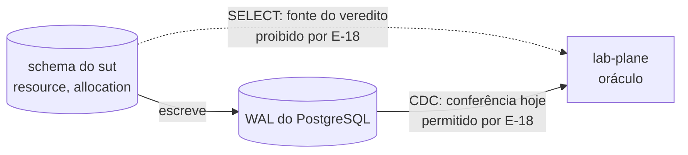

#### `E-19` — ao vivo, e a tensão com o ADR-0008

As observações atravessam para o `lab-journal` evento por evento. A tensão está escrita
no [ADR-0008](0008-os-dois-planos-em-processos-separados.md), que já registra como
consequência negativa que **a latência da rede entra na medida de todo experimento**, e
que o E1 do MVP emite entre 900 e 1500 observações por execução. A escolha acrescenta
essas travessias dentro da janela medida.

**Uma saída existe e não foi escolhida:** emissão não bloqueante, em que o passo
enfileira a observação num buffer local e um remetente próprio a envia, de modo que o
runtime nunca espera a rede. O custo é que uma queda do `lab-plane` perde o buffer, e a
etapa 6 mata o processo de propósito.

### A sexta rodada, em 2026-08-06: o CDC vira fonte do veredito

| ID     | Escolha                                                   | Estado                       |
|--------|-----------------------------------------------------------|------------------------------|
| `E-18` | o CDC é a fonte do veredito; não há `SELECT` cruzado      | fechada, contra recomendação |
| `E-20` | sem BFF: comando no `lab-plane`, leitura no `lab-journal` | fechada                      |

**`E-20` fecha sem custo novo.** O frontend pede execução ao `lab-plane` e lê histórico
e streaming do `lab-journal`, que já recebe as observações ao vivo por `E-19`. É CQRS
que a topologia já impunha. O recurso de exposição rotea dois caminhos, e nenhum serviço
novo entra.

#### O que `E-18` preserva, e o que ela desmonta

A escolha mantém a regra de schema sem exceção nenhuma: uma conexão de replicação lógica
consome o WAL, e não faz `SELECT` em tabela alheia.

**A guarda que protege o número já existe, e ela sobrevive.** `O19` fechou em 2026-08-05
decidindo que o oráculo **aguarda o CDC alcançar o LSN do commit final** antes de
comparar, com limite declarado por execução, e que o estouro desse limite recebe rótulo
próprio, distinto de `fontes divergentes`. Com essa espera, um slot atrasado não entrega
soma incompleta: ele estoura o limite e a execução é rotulada. O risco de número errado
por atraso continua coberto.

**O que se desmonta é a detecção cruzada.** O texto de `O19` diz que "o mecanismo de
duas fontes protege o veredito" e que um atraso do CDC "não produz número errado: ele
produz invalidação, que é o comportamento seguro". Com o CDC como fonte **única**, o
rótulo `fontes divergentes` perde sujeito para o veredito: não há segunda leitura
independente com que comparar. O consolidado publicado pelo system under test continua
servindo de conferência, mas ele **não** é independente do código medido — é a própria
tabela das três fontes que registra isso.

**`O20` deixa de ser uma objeção e vira bloqueio.** Ela registra que o `value_inicial`
não tem fonte: o ADR-0002 o exige lido antes de o primeiro worker começar, e o CDC
reporta mudanças, não estado. Enquanto o `SELECT` existia, essa lacuna tinha remédio
óbvio. As duas saídas que `O20` nomeia continuam sem escolha — o CDC roda com snapshot
inicial, ou o estado inicial vem de outro lugar.

**O oráculo de capacidade fica sem fonte declarada.** O ADR-0002 tem dois oráculos. O
exato usa `value_final`, que é o último valor de `resource.value` no stream — leitura
direta. O de capacidade calcula `Σ amount ≤ capacity`, e somar eventos de `INSERT` é
derivar estado final de um stream, que aquele ADR proíbe. O E5 depende do segundo, e
**nada neste lote lhe deu fonte**.

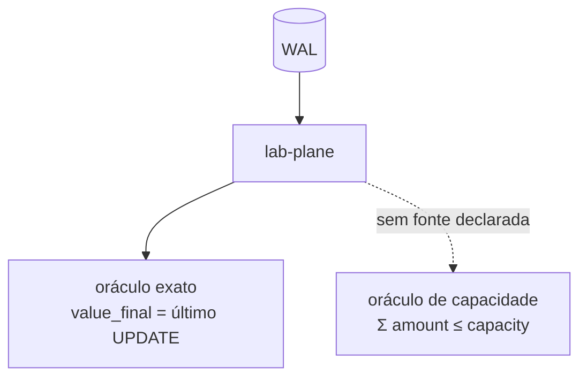

**Duas decisões anteriores precisam de ato formal.** A de 2026-08-05, que diz que o CDC
confere e não decide, fica revertida na parte do veredito — ela vive em documento
arquivado, e a reversão é esta linha. O
[ADR-0008](0008-os-dois-planos-em-processos-separados.md) está `Aceito` e declara no
diagrama da seção `## Decisão` a aresta `SELECT após a quiescência`: ele precisa de
**emenda ou substituição**, e o corpo dele não pode ser editado.

**O CDC passa a ser infraestrutura do dia zero.** Conector, `wal_level = logical` e slot
de replicação deixam de ser da etapa 5 e entram no primeiro `compose.yaml` e no primeiro
`deploy/`. `O17` já registrava que o Debezium entra na stack sem linha na matriz de
integrações, e agora ele entra antes de qualquer experimento existir.

### O esqueleto do grupo I, escrito em 2026-08-06

O primeiro código do repositório entrou no mesmo dia em que o grupo I fechou. Ele
compila, empacota, sobe contra PostgreSQL real e **não implementa nada**.

| Decisão | Como ela virou arquivo                                           |
|---------|------------------------------------------------------------------|
| `E-1`   | `pom.xml` reactor, Java 25, Spring Boot 4.1.0                    |
| `E-2`   | `shared`, `lab-plane`, `lab-journal`, `system-under-test`        |
| `E-4`   | `.github/workflows/build.yml`: verify, depois imagem no GHCR     |
| `E-5`   | `compose.yaml` e `local/postgres-init.sql`, um papel por serviço |
| `E-6`   | `frontend/`, React 19 com `Dockerfile` e nginx próprios          |
| `E-7`   | Flyway configurado nos três, com `create-schemas`                |
| `E-18`  | `ALTER ROLE lab_plane REPLICATION`, e nenhum `GRANT` cruzado     |
| `E-20`  | dois caminhos no `nginx.conf` e no proxy do Vite                 |

#### Cinco coisas que escrever o código decidiu, e que ninguém tinha perguntado

**A região `application` do ADR-0008 vira três folhas.** Aquele ADR nomeia
`dev.da0hn.lab.application` como a região de composição e ponto de entrada. Com três
executáveis, um pacote único ali ficaria dividido entre três artefatos — split package,
que compila e envenena qualquer análise por pacote. Cada bootstrap ganhou folha própria:
`application.labplane`, `application.journal` e `application.sut`, com
`scanBasePackages` declarado. **A emenda ao ADR-0008 precisa cobrir isto**, junto da
região `journal`, que também não existe lá.

**A direção proibida do ADR-0008 deixou de precisar de guarda.** O `system-under-test`
não declara dependência do `lab-plane`, então a chamada proibida é erro de compilação. O
ArchUnit foi **retirado** dos `pom.xml` por isso: uma dependência declarada sem uso é
exatamente o que a regra estrutural do repositório proíbe. Ele volta quando `D-ARQ-07`
decidir o que cada classe de regra verifica.

**O `public` foi revogado no banco local.** Um schema comum a todos os papéis é o
caminho por onde `E-18` vazaria sem ninguém notar: bastaria uma tabela criada sem
qualificar o schema. `REVOKE ALL ON SCHEMA public FROM PUBLIC` fecha isso.

**O SSE exige três diretivas no nginx.** Sem `proxy_buffering off`, o servidor acumula a
resposta e entrega o evento só quando o buffer enche — o que transforma "ao vivo" de
`E-19` em "em lote", sem erro nenhum aparecer. É a classe de defeito que o repositório
mais teme: o silencioso.

**O `lab-journal` já pode ter migração, e os outros dois não.** O
[ADR-0007](0007-o-log-de-observacoes-forma-ordem-e-onde-vive.md) já fixou a forma e a
ordem do log de observações, então a primeira migração do histórico não depende do grupo
II. As tabelas `resource` e `allocation` dependem, porque `E-8` a `E-13` continuam
abertas. Nenhuma migração entrou neste commit.

#### Cinco defeitos que o esqueleto teve, e o que cada um ensina

Nenhum deles apareceu como erro. Os cinco produziram **verde**, que é a forma de falha
que este repositório mais teme.

**A auto-configuração do Flyway saiu de `spring-boot-autoconfigure` no Spring Boot 4.**
Ela vive num módulo próprio, `spring-boot-flyway`. Sem ele, o `flyway-core` fica no
classpath, o contexto sobe, o health check responde `UP`, e **nenhuma migração roda**.

**O Flyway não cria schema quando não há migração a aplicar.** `create-schemas: true` é
condição, e não ordem: ele cria o schema antes de aplicar a primeira migração, e sem
nenhuma ele não faz nada. As três `V1` existem por isso, e criam apenas um
`COMMENT ON SCHEMA`.

**Os dois defeitos acima se somam num terceiro.** A fronteira de `E-18` ficava declarada
em `application.yml` e ausente no banco: os três serviços conectavam ao mesmo
`database`, nenhum schema existia, e nada os impedia de escrever no mesmo espaço de
nomes. A regra estava escrita e não estava valendo.

**O teste `contextLoads` não pega nada disso.** Ele prova que o Spring sobe, o que é
verdade mesmo com o Flyway inerte. Os testes passaram a consultar `pg_namespace` e
afirmar que o schema daquele processo existe — o que falha se qualquer um dos três
defeitos voltar.

**A tabela de controle do Flyway tem uma coluna `version`.** Uma guarda ingênua para a
proibição do ADR-0006 acusaria defeito na primeira execução. A verificação exclui
`flyway_schema_history`: a coluna pertence à ferramenta de migração, e não ao domínio
medido.

Um sexto, de ambiente e não de decisão: a imagem `postgres:18` mudou o ponto de
montagem para `/var/lib/postgresql`, porque os dados passaram a viver num subdiretório
por versão maior. Montar `/var/lib/postgresql/data` faz o contêiner recusar-se a subir —
este falhou ruidosamente, e por isso não está na lista acima.

#### O que o esqueleto prova, e o que ele não prova

Prova: os quatro artefatos constroem, os três serviços Java sobem contra PostgreSQL 18
real por Testcontainers, o Flyway cria o schema de cada um, e o `compose.yaml` levanta o
conjunto com `wal_level=logical`.

Não prova nada sobre consistência distribuída. Nenhum dos 42 fenômenos é reproduzível, o
oráculo não existe, e o CDC está provisionado mas não consumido.

### `E-21`: pular o build do módulo que não mudou, aberto em 2026-08-06

Metade deste assunto já fechou sem decisão, porque não havia alternativa a debater. O
[`Dockerfile`](../../Dockerfile) copiava os quatro `src/` numa camada só e construía o
reactor inteiro uma vez por imagem; como as três imagens Java partilham o arquivo, uma
mudança em qualquer módulo alterava o hash daquela camada nas três e invalidava o cache
de todas. O `cache-from: type=gha` do workflow existia e nunca era aproveitado entre
commits. Hoje `shared` é camada própria e cada imagem compila só o módulo pedido —
medido com Docker 29.5.3, tocar `lab-plane/src` deixa o build de `lab-journal` inteiro
em cache.

**O que sobra é decisão, e é isto: pular o job do módulo intocado.** Os quatro jobs da
matriz continuam rodando sempre. O do módulo que não mudou agora é barato, mas não é
grátis — ele resolve o cache, exporta um manifesto idêntico ao anterior e ocupa um
runner.

**O obstáculo não é o GitHub Actions, é a regra de tag.** A tag é o SHA do commit, e o
motivo está escrito no próprio workflow: uma tag móvel torna impossível dizer qual
imagem produziu um resultado de experimento, que é a propriedade que este repositório
existe para ter. Um job pulado deixa `ghcr.io/.../<módulo>:<sha>` sem existir, e todo
manifest que referencie o SHA do commit para os quatro serviços aponta para o vazio.

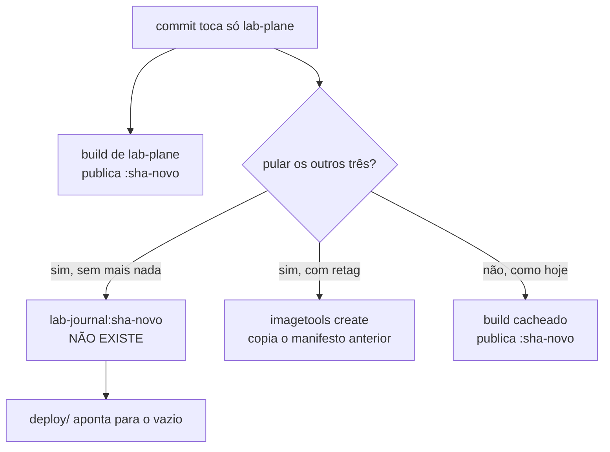

| Alternativa                        | A favor                                          | Contra                                            |
|------------------------------------|--------------------------------------------------|---------------------------------------------------|
| 1. matriz dinâmica com retag       | todo SHA continua tendo as quatro imagens        | achar o SHA anterior depende de retenção no GHCR  |
| 2. matriz dinâmica, tag por módulo | mais barato e mais honesto                       | transfere a complexidade inteira para `E-3`       |
| 3. não fazer nada                  | zero mecanismo novo; a regra de tag fica intacta | um job redundante por módulo intocado, por commit |

**A recomendação é a 3, e o motivo é que não há número.** Nenhum job de imagem completou
no GitHub até hoje, e o tempo de construção de uma imagem continua desconhecido.
Escolher entre 1 e 2 antes da primeira medição é optar pela complexidade no escuro. E a
alternativa 2 decide na prática a forma da tag, que é conteúdo de `E-3` — adiada por
escolha explícita na mesma data.

**Gatilho que reabre esta linha:** a primeira execução real do workflow produzir um
tempo de build, ou `E-3` fechar. O que vier primeiro.

**Por que ainda não há número, e o motivo não é deste repositório.** Em 2026-08-06 os
dois workflows passaram a executar — o `docs` fechou verde em 7s, e no `build` o job
`provas` obteve runner e `mvn verify` passou em 1m16s. Os quatro jobs `imagem`, que
rodam em paralelo depois dele, ficaram quinze minutos na fila e terminaram com
`The job was not acquired by Runner of type hosted even after multiple attempts`. Uma
reexecução passou mais de quarenta minutos sem sequer criar os jobs, e o cancelamento
foi recusado com `Cannot cancel a workflow re-run that has not yet queued` enquanto a
API do próprio run continuava a reportar `queued` — dois subsistemas do GitHub
discordando sobre o mesmo objeto. A causa é incidente de plataforma no GitHub Actions,
reportado em [`githubstatus.com`](https://www.githubstatus.com/) na mesma data. Nada
neste repositório o provoca e nada aqui o resolve; a medição espera o serviço
normalizar.

### O grupo II, reaberto em 2026-08-06: quatro achados antes de qualquer escolha

As seis linhas `E-8` a `E-13` foram enunciadas em 2026-08-03, e três decisões
posteriores mudaram o terreno delas sem que nenhuma fosse reescrita: `D-DAT-05` pôs um
discriminador de execução na chave primária das duas tabelas, `E-5` pôs um schema por
serviço, e `E-18` tirou o `SELECT` cruzado do oráculo e pôs o CDC no lugar. O que segue
é o efeito disso, registrado antes da rodada e **sem decidir nada**.

| Achado                                              | Linha atingida | Efeito                       |
|-----------------------------------------------------|----------------|------------------------------|
| a ordem das colunas da chave primária é ambígua     | linha nova     | `E-22`                       |
| Row Level Security deixou de alcançar o veredito    | `E-12`         | uma das duas candidatas cai  |
| a chave estrangeira teria de ser composta           | `E-9`          | o argumento contra cresce    |
| o índice em debate não é sobre `(resource_id)`      | `E-10`         | enunciado corrigido, e barato|

#### `E-22` — a própria `D-DAT-05` diz duas coisas sobre a ordem da chave

A tabela da decisão diz que "a chave primária das duas tabelas passa a incluir a
execução". O diagrama da mesma seção rotula a tabela como "PK começa pelo
discriminador". As consequências dizem que "todo índice passa a começar pelo
discriminador" e, na frase seguinte, que "o discriminador é a **segunda** coluna da
chave". Começar e ser segundo não são compatíveis, e as três frases estão em
[`modelo-de-dados.md`](arquivo/proposta-2026-08-03/modelo-de-dados.md#d-dat-05--reset-entre-execuções).

A escolha não é cosmética, e o motivo é o mesmo pelo qual aquela decisão preferiu
UUIDv7 a UUIDv4. Com `(execution_id, id)`, o prefixo de instante do UUIDv7 é crescente
e toda inserção cai no fim da B-tree. Com `(id, execution_id)`, a coluna à esquerda é o
`bigint` derivado da semente — valores pequenos que **se repetem** a cada execução —, e
as inserções se espalham pelo índice inteiro. É exatamente a fragmentação dentro da
janela de medida que a decisão diz querer evitar.

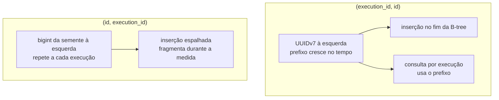

O acesso do `increment` conhece os dois valores e funciona em qualquer das duas ordens,
então nada quebra — o custo é só de desempenho, dentro da janela medida.

#### `E-12` mudou de lugar, e não de necessidade

`P-DAT-12` nomeia duas candidatas de guarda: um teste executável, na linha de
`D-DAT-09`, e Row Level Security com o discriminador vindo de `current_setting`. **A
segunda caiu**, e não por preferência.

Row Level Security aplica um predicado a quem consulta a tabela. Depois de `E-18` o
oráculo não consulta tabela nenhuma: ele consome o WAL por replicação lógica. O próprio
`P-DAT-12` já registrava isso na segunda face do risco — "Row Level Security não alcança
o consumidor de CDC: a política vale para quem consulta a tabela, e o conector lê o WAL"
([`modelo-de-dados.md`](arquivo/proposta-2026-08-03/modelo-de-dados.md#perguntas-em-aberto)).
Com o CDC como fonte única do veredito, a segunda face virou a única.

O risco não saiu junto com o `SELECT`. Um consumidor de CDC que não filtre por
discriminador soma eventos de execuções anteriores ao `value_final`, e o veredito sai
errado **sem sintoma** — a mesma falha silenciosa, um componente adiante.

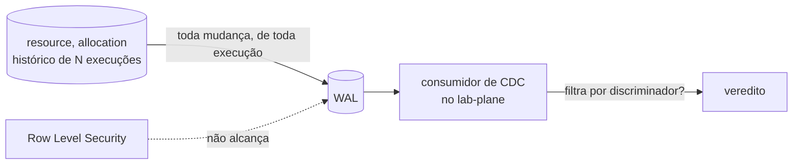

#### `E-9` — a chave estrangeira teria de ser composta

`D-DAT-02` pesou uma chave estrangeira simples, de `allocation.resource_id` para
`resource.id`. Com o discriminador na chave primária, `resource.id` sozinho deixa de ser
único, e a referência passa a ser `(resource_id, execution_id)` para `(id,
execution_id)` — o que exige a coluna do discriminador também em `allocation`, e ela já
está lá pela mesma decisão.

O argumento contra cresce em duas frentes. O lock `FOR KEY SHARE` que
[`D-DAT-02`](arquivo/proposta-2026-08-03/modelo-de-dados.md#d-dat-02--chave-estrangeira-de-allocationresource_id)
nomeia continua igual, e agora o vocabulário do Lab Plane — que `D-DAT-05` aceitou pôr
na chave do sistema medido — passa a aparecer também na restrição de integridade dele.

#### `E-10` — o índice em debate é `(execution_id, resource_id)`

[`D-DAT-03`](arquivo/proposta-2026-08-03/modelo-de-dados.md#d-dat-03--índice-sobre-allocationresource_id)
debate um índice sobre `allocation(resource_id)`. A consequência de `D-DAT-05` diz que
todo índice começa pelo discriminador, então o índice em debate é
`(execution_id, resource_id)`, e o enunciado de 2026-08-03 está vencido na letra.

**A decisão ficou mais barata do que era.** Sem o discriminador, o índice servia a uma
finalidade só, e discutível: aproximar o predicate lock do `SERIALIZABLE` do conflito
real. Com ele, o índice também é o que impede uma consulta por execução de varrer o
histórico inteiro — o crescimento monotônico que `P-DAT-11` aceitou sem particionamento
e sem retenção.

**O que não mudou:** a replicação lógica decodifica mudança de heap, e não de índice. O
índice não altera o que o oráculo de `E-18` enxerga. Ele altera o custo de escrita
dentro da janela medida, que é o argumento contra registrado em `D-DAT-03`.

Nenhum dos quatro é decisão. `E-22` é linha nova; os outros três levam `E-9`, `E-10` e
`E-12` à rodada com o enunciado corrigido.

### A primeira rodada do grupo II, em 2026-08-06

| ID     | Escolha                                                     | Seguiu a recomendação? |
|--------|-------------------------------------------------------------|------------------------|
| `E-8`  | `bigint` derivado da semente                                | sim                    |
| `E-9`  | sem chave estrangeira, com verificação de órfãs             | sim                    |
| `E-10` | índice `(execution_id, resource_id)`, com o plano efetivo   | sim                    |
| `E-22` | chave primária `(execution_id, id)`, decidida duas vezes    | sim                    |

**`E-8` — `bigint`.** O único argumento contra era a colisão entre duas execuções da
mesma semente, e o discriminador de `D-DAT-05` o removeu. O custo já estava registrado
como consequência aceita no
[ADR-0002](0002-o-dominio-minimo-e-os-dois-oraculos.md): a geração de identidade sai do
banco, todo `INSERT` carrega a chave, e uma inserção manual em `psql` durante depuração
deixa de funcionar sem que alguém escolha um identificador.

#### `E-9` fecha a escolha e abre uma pendência que `E-18` criou

A escolha é **sem chave estrangeira**, e o motivo é o lock: um `INSERT` em `allocation`
com FK adquire `FOR KEY SHARE` na linha de `resource`, e ele conflita com o `FOR UPDATE`
da estratégia `PESSIMISTIC`. Um bloqueio vindo da restrição seria atribuído à estratégia,
e a comparação entre estratégias mediria o esquema em vez do fenômeno.

**A metade que não fecha é onde a verificação de órfãs vive.** A recomendação de
`D-DAT-02` a punha "no mesmo lugar em que o oráculo já lê o banco" — e esse lugar
**deixou de existir** em `E-18`. O Lab Plane não faz `SELECT` no schema do system under
test; ele consome o WAL. Verificar órfã a partir do stream exige reconstruir o conjunto
de `resource.id` existentes e cruzá-lo com os `INSERT` de `allocation`, que é derivar
estado a partir de eventos — o mesmo obstáculo que já deixou o oráculo de capacidade sem
fonte declarada nesta mesma fila.

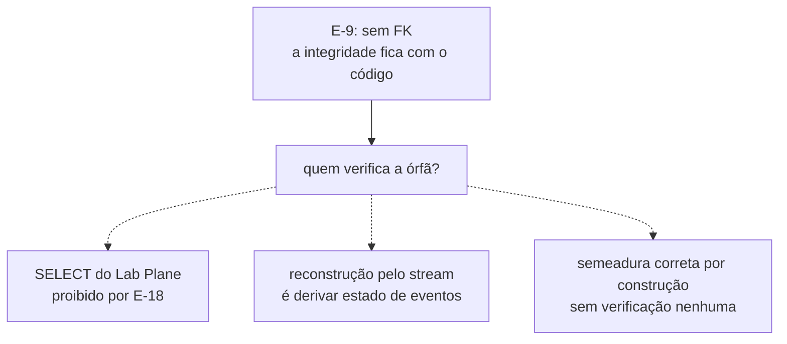

A terceira saída é a única sem obstáculo declarado, e ela troca verificação por
confiança no código da semeadura. **Nenhuma das três foi escolhida.** A pendência fica
vizinha da fonte do oráculo de capacidade, e as duas provavelmente fecham juntas.

**`E-10` — o índice entra, e ele depende de `E-22`.** A obrigação que vem junto é a de
`D-DAT-03`: o plano de execução efetivo vai no relatório do braço `SERIALIZABLE`, sob
pena de o número não ser interpretável. O custo é escrita de índice a cada `INSERT` do
E5, dentro da janela medida. **Se `E-22` escolher `(execution_id, id)`**, a chave
primária de `allocation` já começa pelo discriminador e este índice é adicional; se
escolher `(id, execution_id)`, ele passa a ser o único caminho de acesso por execução.

#### `E-22` — as duas premissas que a rodada corrigiu

A pergunta que a linha recebeu foi se a ordem `(id, execution_id)` é o que permite uma
segunda execução, "já que o `id` é auto-incrementado". As duas metades são falsas, e a
segunda é a que importa.

**O `id` não é auto-incrementado, e não pode ser.** O
[ADR-0002](0002-o-dominio-minimo-e-os-dois-oraculos.md) determina que o identificador é
gerado no código do sistema medido a partir da semente, e que o esquema NÃO DEVE usar
`SERIAL`, `IDENTITY`, `nextval` nem valor padrão do banco. Duas execuções da mesma
semente produzem **os mesmos** identificadores, por exigência — e foi precisamente isso
que obrigou o discriminador a entrar na chave.

**A ordem das colunas não muda o que a chave permite.** `PRIMARY KEY (a, b)` e
`PRIMARY KEY (b, a)` impõem a mesma restrição: o **par** é único, e nenhuma das duas diz
nada sobre `a` ou `b` isoladamente. As duas ordens permitem a segunda execução
igualmente, e o que a permite é o discriminador **estar** na chave — decidido em
`D-DAT-05`, não nesta linha.

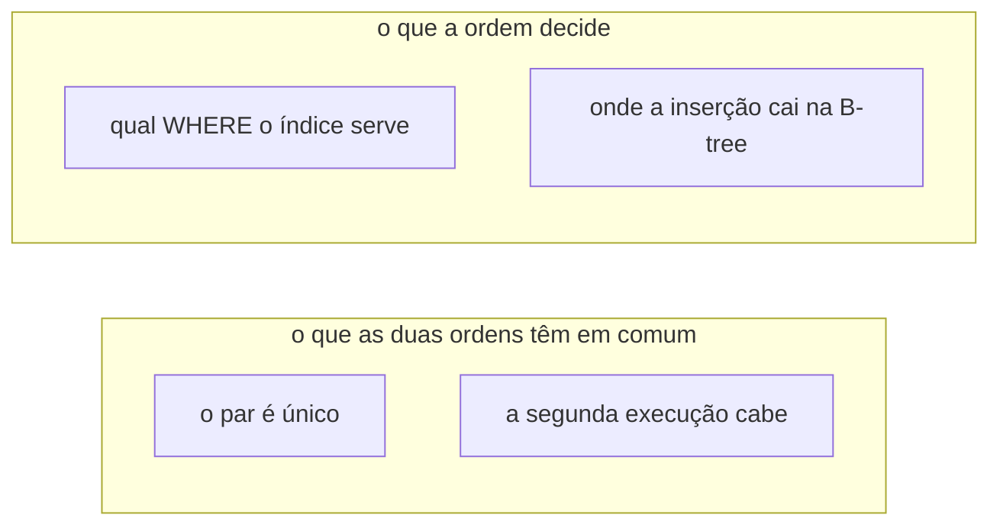

`E-22` decide desempenho e caminho de acesso dentro da janela medida, e **não** decide
capacidade nenhuma do esquema.

#### `E-22` fecha em `(execution_id, id)`, e a linha foi decidida duas vezes

A primeira escolha foi `(id, execution_id)`, e ela caiu no mesmo dia. O percurso fica
registrado porque o que a inverteu foi uma correção de mérito, e não uma mudança de
gosto.

**O argumento que sustentava a primeira escolha estava inflado, e quem o inflou foi esta
fila.** Ele dizia que buscar "a mesma linha em **todas** as execuções" é operação central
do laboratório, porque comparar `NONE`, `PESSIMISTIC` e `OPTIMISTIC` é comparar a mesma
entidade lógica entre execuções. **Não é uma consulta.** O oráculo do
[ADR-0002](0002-o-dominio-minimo-e-os-dois-oraculos.md) calcula
`perdidas = commits − (value_final − value_inicial)` **dentro** de cada execução, e a
comparação entre estratégias acontece depois, sobre números já calculados, no relatório.
Nenhum caminho quente junta execuções numa consulta só; isso é inspeção manual em `psql`,
e ela pode pagar uma varredura.

| Consulta                            | Quem a faz                  | Frequência    |
|-------------------------------------|-----------------------------|---------------|
| tudo de uma execução                | consumidor de CDC, histórico| todo momento  |
| a linha 42000 de uma execução       | operação medida             | todo momento  |
| a linha 42000 em todas as execuções | pessoa depurando em `psql`  | raro          |

A ordem escolhida põe as duas primeiras no prefixo do índice, e deixa a terceira pagar
varredura. A ordem descartada fazia o inverso — otimizava a rara e punha a frequente na
dependência de um índice secundário, sobre um histórico que nunca é apagado.

**O ganho de escrita vem junto.** O `execution_id` é um UUIDv7, cujo prefixo de instante
cresce, então toda inserção cai no fim da B-tree em vez de espalhada por ela. É a mesma
propriedade pela qual `D-DAT-05` preferiu UUIDv7 a UUIDv4, agora valendo também para a
chave primária. A pressão de `fillfactor` que a ordem descartada exigiria deixa de ser
questão, e `P-DAT-2` continua tratando só do autovacuum.

**O custo que passa a valer.** As linhas de uma mesma execução ficam fisicamente
adjacentes no índice, e workers concorrentes inserem na mesma página de folha. É
contenção de índice dentro da janela medida — ruído do instrumento, e não fenômeno
estudado. Ele não tem mitigação decidida, e é vizinho de `P-DAT-2` pelo mesmo motivo:
nenhuma política de página está declarada em documento nenhum.

**`E-10` permanece, e volta a ser aditivo.** Com o discriminador já no prefixo da chave
primária, o índice `(execution_id, resource_id)` deixa de ser o único caminho por
execução e volta ao papel que `D-DAT-03` lhe deu: aproximar o predicate lock do
`SERIALIZABLE` do conflito real. A obrigação de registrar o plano efetivo no relatório
continua.

**A contradição interna de `D-DAT-05` fica resolvida do outro lado.** A escolha ratifica
o diagrama — "PK começa pelo discriminador" — e a consequência de que "todo índice passa
a começar pelo discriminador". A frase vencida é "o discriminador é a segunda coluna da
chave", e ela fica registrada como tal aqui, sem editar o documento arquivado.

#### `E-23` — o nome da coluna do discriminador, aberto ao escrever o primeiro DDL

Com `E-8`, `E-9`, `E-10` e `E-22` fechadas, o `CREATE TABLE` das duas tabelas pode ser
escrito — e ele trava numa palavra. `D-DAT-05` decidiu que a coluna afirma "discriminador
de inquilino, com **nome genérico no sistema medido**", e deixou o nome concreto em
aberto de propósito: o sistema medido não sabe que o valor é uma execução de experimento,
e para ele aquilo é a partição lógica dos dados.

Chamá-la de `execution_id` nas tabelas do system under test contradiz a decisão na
palavra exata que ela escolheu evitar. **A ligação com o Lab Plane é justamente o que a
coluna não pode declarar**, porque declará-la põe vocabulário do instrumento dentro do
medido — o mesmo custo que `D-DAT-05` nomeou ao aceitar o discriminador na chave, e que
esta linha decide se paga inteiro ou pela metade.

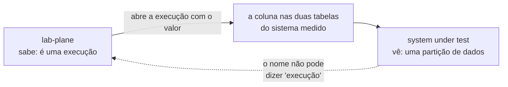

As candidatas visíveis são `tenant_id`, `partition_id` e `run_id`. As duas primeiras
honram a decisão e custam um salto mental em toda consulta do Lab Plane; a terceira é
legível dos dois lados e é a que a decisão diz para não usar. **Nenhuma foi escolhida**,
e o `CREATE TABLE` não pode ser escrito antes disso.

#### `E-12` ganhou uma terceira candidata, e ela não filtra nada

Com Row Level Security fora, `P-DAT-12` deixa uma candidata só — a guarda em teste
executável. Duas outras existem, e a segunda muda a natureza do problema.

**Row filter na publicação lógica.** O PostgreSQL aceita `CREATE PUBLICATION ... WHERE`
desde a versão 15, e o filtro passaria a ser do servidor, e não do consumidor. Contra: o
predicado teria de citar o discriminador da execução corrente, que muda a cada execução
— o que exige um `ALTER PUBLICATION` **dentro** da janela medida, e DDL sobre tabela
publicada durante a medida é exatamente o tipo de perturbação que o instrumento não pode
introduzir.

**Um slot de replicação por execução.** Um slot lógico nasce marcando o LSN corrente, e
entrega apenas o que vem depois dele. Se o slot é criado quando a execução abre e
descartado quando ela fecha, **o stream contém só aquela execução por construção** — não
há filtro a esquecer, porque não há filtro. O corte é temporal, e não por coluna.

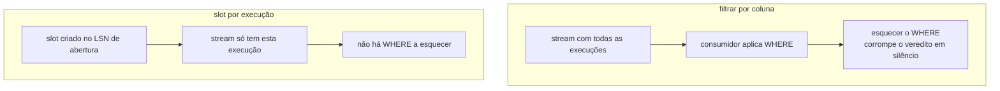

O custo dela é operacional e sério. Um slot lógico **retém WAL** enquanto não for
consumido: um slot esquecido por uma execução que morreu — e a etapa 6 mata processos de
propósito — segura o WAL até encher o disco do PostgreSQL, que em `E-5` é o banco
compartilhado do homelab, com vizinhos. Some-se `max_replication_slots`, que é finito e
de cluster. A candidata troca uma falha silenciosa por uma ruidosa que atinge terceiros.

**Esse custo tem mitigação declarada, e ela não é gratuita.** O PostgreSQL aceita
`max_slot_wal_keep_size` desde a versão 13: passado o limite, o servidor **invalida o
slot** em vez de continuar retendo WAL. A falha deixa de ser "o disco do vizinho encheu"
e passa a ser "esta execução perdeu o stream" — que é exatamente o formato de falha que
o instrumento precisa ter. O preço é que o parâmetro é de cluster, e o cluster é
compartilhado: fixá-lo muda o comportamento de todo consumidor lógico do banco do
homelab, e não só o do laboratório. **Isso é decisão de infraestrutura do `E-5`, e não
desta linha** — se a escolha aqui for o slot por execução, ela abre uma linha nova lá.

**Ela também não resolve `O20`.** Um slot criado na abertura não vê o estado anterior a
ele, e `value_inicial` continua sem fonte. Nenhuma das três candidatas o resolve.

#### `E-13` — qualificar por plano libera o escalonador, e isso é defeito

`P-DAT-10` enuncia duas saídas para a tensão entre o UUIDv7 do discriminador e as duas
regras estruturais do [`../../AGENTS.md`](../../AGENTS.md): ou as regras passam a dizer
que valem sobre o sistema medido e não sobre o instrumento, ou a geração do discriminador
é exceção nomeada.

**A primeira saída, na letra, libera o que ela não quer liberar.** As regras existem pela
reprodutibilidade, e o escalonador do Lab Plane é instrumento — mas ele **decide a
intercalação**. Um `Math.random()` dentro dele quebra a reprodutibilidade tão
completamente quanto um no sistema medido, e uma regra qualificada por plano deixaria de
alcançá-lo. O
[ADR-0005](0005-a-forma-do-escalonador.md) põe o estado do escalonador por execução, e a
semente do experimento é o que o torna repetível.

**Uma terceira formulação existe: qualificar pelo papel do valor.** As regras alcançam
todo valor que entra em veredito, em escalonamento ou em identidade derivada da semente —
independentemente do plano em que ele é produzido. O discriminador não entra em nenhum
dos três: ele é rótulo de partição, e duas execuções idênticas com discriminadores
diferentes produzem o mesmo veredito e a mesma intercalação.

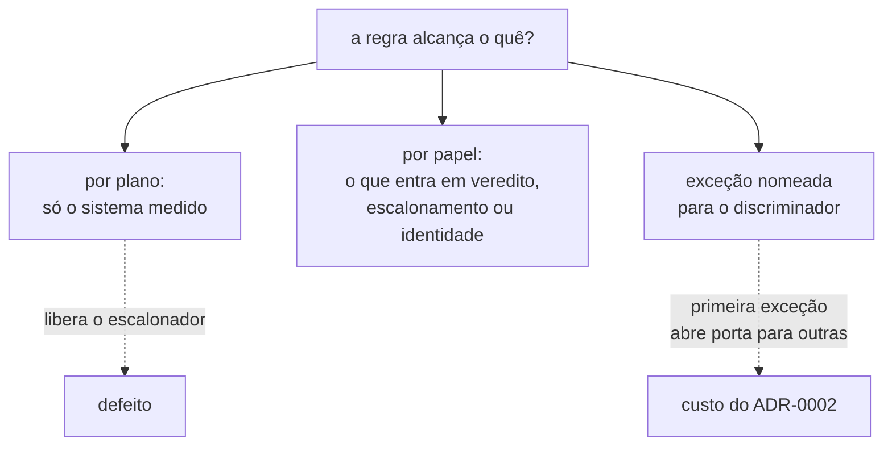

O argumento contra a exceção nomeada é do próprio
[ADR-0002](0002-o-dominio-minimo-e-os-dois-oraculos.md), que recusou excluir
identificadores do critério de igualdade porque "uma exceção nomeada no critério é uma
porta por onde outras entram". As três continuam abertas.

#### `E-11` mudou de terreno: o instrumento já publica identidade no sistema medido

`D-DOM-14` foi enunciada em 2026-08-03, antes de `D-DAT-05` existir. Os dois argumentos
que sustentam a recomendação da proposta mudaram de peso desde então, e nenhum dos dois
mudou por opinião.

**A favor da Alternativa A, a proposta afirma que "o domínio medido continua sem citar
nenhum contexto do Lab Plane por nome, e a semente entra como valor"**
([`modelo-de-dominio.md`](arquivo/proposta-2026-08-03/modelo-de-dominio.md#d-dom-14--quem-é-dono-da-identidade-derivada-da-semente)).
Com `E-22` fechada, o discriminador da execução é a **primeira coluna da chave primária**
das duas tabelas medidas, e quem o produz é o Lab Plane. A fronteira que a Alternativa A
protege já foi atravessada: a pergunta deixou de ser **se** o sistema medido recebe
identidade do instrumento, e passou a ser **quantos valores** ele recebe.

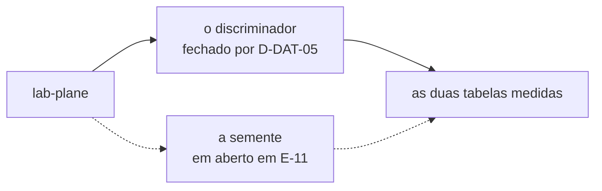

**Contra a Alternativa A, a proposta afirma que "uma mudança nela altera identificadores
de execuções antigas".** Essa objeção era hipotética enquanto o reset entre execuções
fosse `TRUNCATE` — sem execução antiga no banco, não há identificador antigo a alterar.
`D-DAT-05` escolheu o discriminador exatamente para preservá-las, e a objeção passou a
descrever o estado real do banco, e não um cenário.

**Um terceiro achado inverte o argumento de pureza.** A proposta recomenda A por
preservar a ignorância do sistema medido, e a letra da alternativa faz o contrário: para
derivar o identificador, o sistema medido precisa **receber a semente e hospedar a regra
de derivação**. Ele passa a saber que existe uma semente, e uma semente só existe porque
existe reprodutibilidade, que só importa porque existe experimento. Na Alternativa B ele
recebe valores opacos — um UUID e um `bigint` — e não sabe de onde vieram nem que se
repetem. **É B, e não A, que mantém o sistema medido ignorante do instrumento.**

**Nenhum dos três achados escolhe entre as alternativas.** O primeiro enfraquece o
argumento a favor de A, o segundo fortalece o argumento contra ela, e o terceiro mostra
que o critério que a proposta usou para recomendá-la aponta para B. A escolha continua
sendo da pessoa.

### A segunda rodada do grupo II, em 2026-08-06

| Linha  | Escolha                                           | Seguiu a recomendação? |
|--------|---------------------------------------------------|------------------------|
| `E-11` | um componente de identidade próprio, com contrato | não                    |
| `E-13` | as regras alcançam pelo papel do valor            | sim                    |

`E-23` e `E-12` continuam abertas. A primeira ganhou uma candidata que nenhuma das três
anteriores cobria; a segunda não foi decidida nesta rodada, e o motivo está no fim desta
seção.

#### `E-11` fecha no componente próprio, e abre `E-24` no mesmo ato

A escolha é a Alternativa C de
[`D-DOM-14`](arquivo/proposta-2026-08-03/modelo-de-dominio.md#d-dom-14--quem-é-dono-da-identidade-derivada-da-semente),
contra a recomendação da proposta e contra os três achados desta fila, que apontavam para
B. **O que C compra é o que a proposta já dizia: a regra fica isolada e testável.** O que
ela custa também já estava dito — um contexto inteiro para uma regra de uma linha — e a
pessoa o aceitou de olhos abertos.

**Os três achados desta fila não foram derrotados; eles ficaram sem alvo.** Eles pesavam
A contra B, e a escolha não é nenhuma das duas. O que eles descrevem — a semente
atravessando a fronteira, ou o instrumento publicando identidade pronta — reaparece
inteiro na linha que C não fecha.

#### `E-24` — a alternativa C isola a regra, e não decide quem a invoca

`E-11` responde **onde a regra de derivação vive**. Ela não responde **quem a chama**, e
o [ADR-0008](0008-os-dois-planos-em-processos-separados.md) torna a diferença observável:
os dois planos estão em processos separados, e a fronteira entre eles é a rede.

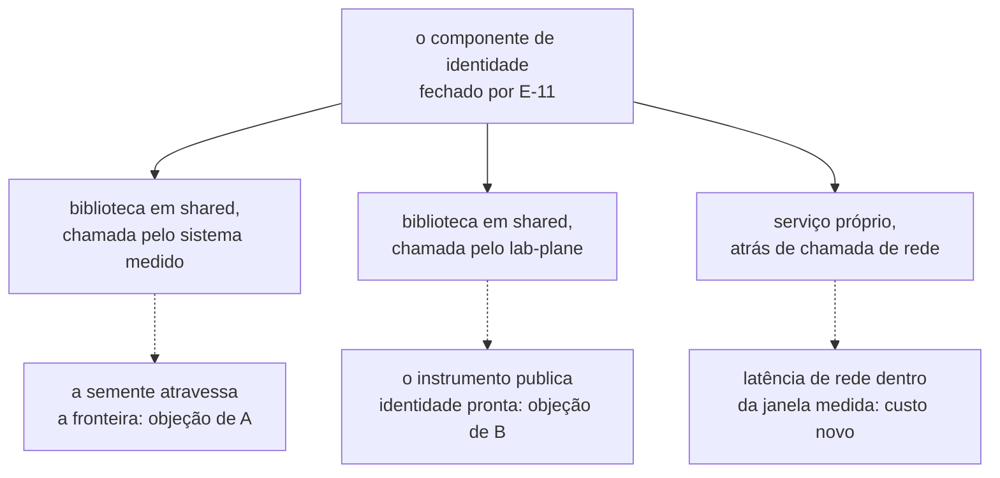

A terceira forma é a única que dispensa escolher entre os dois planos, e é a única que
põe uma chamada de rede **dentro da janela medida** — num laboratório cujo objeto de
estudo é justamente o que acontece entre dois passos, isso não é detalhe de desempenho.
**Nenhuma foi escolhida.**

#### `E-13` fecha por papel do valor, e o `AGENTS.md` muda no mesmo commit

As regras de aleatoriedade e de relógio passam a alcançar todo valor que entra em
veredito, em escalonamento ou em identidade derivada da semente — indiferentemente do
plano que o produz. O escalonador do Lab Plane continua coberto, que era o defeito da
formulação por plano; e não há exceção nomeada, que era o custo apontado pelo
[ADR-0002](0002-o-dominio-minimo-e-os-dois-oraculos.md).

**O discriminador da execução não entra em nenhum dos três papéis.** Ele é rótulo de
partição: duas execuções idênticas com discriminadores diferentes produzem o mesmo
veredito e a mesma intercalação. É por isso que o UUIDv7 não viola as regras — não porque
foi dispensado delas, mas porque nunca esteve no alcance delas.

**A escolha não fecha [`Q-0002-1`](../questions/Q-0002-1.md).** As regras continuam texto
e não guarda executável; o que mudou foi o que elas alcançam, e não o que as verifica.

#### `E-23` ganhou uma quarta candidata: nome diferente de cada lado

A pergunta é de 2026-08-06, e ela desfaz um pressuposto que as três candidatas anteriores
carregavam sem enunciar — o de que a coluna precisa ter **um** nome. Ela não precisa.
Pela decisão `E-18` cada serviço tem seu próprio schema e nenhum lê o do outro, então
nada obriga que a coluna do sistema medido e a das tabelas do Lab Plane se chamem igual.

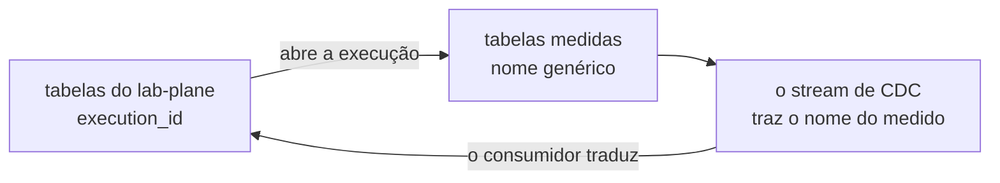

**O salto mental não desaparece; ele muda de lugar.** Nas suas próprias tabelas o Lab
Plane escreve `execution_id` e lê `execution_id`. Mas o oráculo lê o sistema medido por
CDC, e o stream carrega o nome que a coluna tem **lá** — a tradução passa a viver no
consumidor, num ponto só e nomeado, em vez de espalhada por toda consulta. Contra: um
mesmo valor com dois nomes exige que alguém saiba que são o mesmo, e essa ligação deixa
de ser visível no esquema.

#### `E-12` não foi decidida nesta rodada

As três candidatas se distinguem por vocabulário de replicação lógica do PostgreSQL —
LSN, replication slot, retenção de WAL, row filter na publication — e a escolha entre
elas não é escolha nenhuma sem esse vocabulário. **A linha continua aberta, com as três
candidatas intactas.**

#### `E-23` fecha em nomes assimétricos, um por lado da fronteira

A coluna se chama `partition_id` nas tabelas do sistema medido e `execution_id` nas
tabelas do Lab Plane. É a quarta candidata, e ela sai da pergunta de 2026-08-06. O
`CREATE TABLE` das duas tabelas medidas deixa de estar bloqueado.

`D-DAT-05` fica honrada na letra: o sistema medido não carrega a palavra "execução" em
lugar nenhum, e para ele aquilo é o que o nome diz — uma partição. O instrumento escreve
e lê `execution_id` nas suas próprias tabelas, sem salto mental.

**O custo é uma ligação que o esquema não declara.** Um mesmo valor com dois nomes exige
que alguém saiba que são o mesmo, e nenhuma constraint diz isso — não poderia dizer, já
que `E-18` proíbe o cruzamento de schemas. A tradução vive num ponto só, no consumidor do
stream de CDC, e é ali que ela precisa estar escrita e testada.

#### `E-12` não tem candidata no broker, e a razão não é de implementação

A pergunta de 2026-08-06 — se o filtro não caberia no RabbitMQ, já que o CDC publicaria
para ele — expõe um pressuposto que esta fila carregava sem enunciar. **Ele não publica.**
O consumidor do WAL é o próprio `lab-plane`, sem intermediário, e é isso que o diagrama
do [`AGENTS.md`](../../AGENTS.md) da raiz mostra. Não há broker no caminho do veredito.

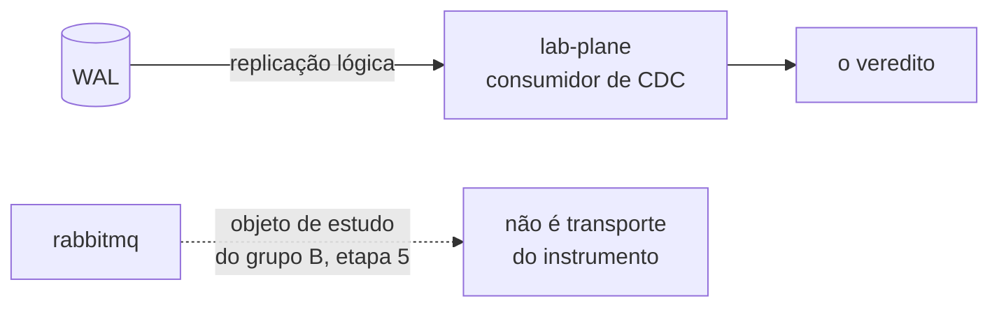

**E ele não deve entrar nesse caminho.** O RabbitMQ é objeto de estudo do grupo B, e o
que se estuda nele é justamente duplicata, perda e reordenação de entrega
([`plano-do-laboratorio.md`](../plano-do-laboratorio.md), etapa 5). Um instrumento que
transporta o veredito por broker passa a sofrer os fenômenos que ele mede: uma
duplicata na entrega vira uma contagem inflada, e ninguém consegue dizer se o experimento
achou uma perda ou se o instrumento inventou uma. É a confusão dos dois planos, num lugar
onde ela é indetectável.

**Sobram dois lugares, e não três.** Entre o WAL e o veredito existem o PostgreSQL e o
código do `lab-plane`. As candidatas (b) e (c) agem no primeiro; a candidata (a) age no
segundo, e ela **não é** guarda de banco — é código Java com teste, apesar de a linha
inteira ter sido apresentada em vocabulário de replicação.

### Timestamps, propostos em 2026-08-06, e a fronteira os separa em duas linhas

A proposta é `created_at` e `updated_at` nas duas tabelas medidas, e `executed_at`,
`concluded_at`, `created_at` e `updated_at` do lado do Lab Plane. **Os dois lados têm
argumentos disjuntos**, e por isso viram duas linhas. `E-25` volta a bloquear o
`CREATE TABLE` que `E-23` acabara de desbloquear.

#### `E-25` — timestamps nas tabelas medidas

**A objeção mais forte não é técnica, é pedagógica.** `updated_at` é um token de versão
clássico — `UPDATE resource SET value = ? WHERE id = ? AND updated_at = ?` é optimistic
locking escrito sem a palavra. A regra do [`AGENTS.md`](../../AGENTS.md) manda introduzir
o problema antes da solução, e é exatamente por isso que `version` não está no esquema. A
coluna entrega de graça metade do que o E1 deve construir do zero.

```mermaid
flowchart LR
    U["updated_at no esquema mínimo"]
    V["version no esquema mínimo"]
    O["optimistic locking<br/>disponível sem construir nada"]
    U --> O
    V --> O
    V -.->|" recusado pelo ADR-0001 "| R["a regra pedagógica"]
    U -.->|" a mesma recusa<br/>vale aqui? "| R
```

**A segunda objeção é sobre como o valor nasce.** As três formas custam:

| Forma                     | O que custa                                  |
|---------------------------|----------------------------------------------|
| `DEFAULT now()`           | relógio do banco, fora de qualquer adaptador |
| trigger `BEFORE UPDATE`   | código dentro da transação medida            |
| preenchida pela aplicação | o medido passa a depender do adaptador       |

O `DEFAULT now()` tem um defeito a mais, e ele é específico do PostgreSQL: `now()`
retorna o instante de **início da transação**, e não o do statement — duas rows escritas
na mesma transação recebem o mesmo valor, o que apaga justamente a ordem que a coluna
deveria mostrar. O trigger é pior por outro motivo: ele acrescenta trabalho **dentro da
janela exata** onde o lost update acontece, e o laboratório mede o que ocorre ali. A
terceira respeita a regra do relógio, e cobra que o sistema medido dependa do adaptador
por uma coluna que nenhum oráculo lê.

**A regra do relógio injetável não as proíbe, e isso precisa ser dito.** Pelo alcance
fixado em `E-13` nesta mesma data, as regras valem sobre valor que entra em veredito, em
escalonamento ou em identidade derivada da semente. Um `created_at` de `resource` não
entra em nenhum dos três. **A objeção vem da pedagogia e do custo na janela medida, não
da regra** — e confundir as duas coisas seria usar a regra como argumento que ela não faz.

**A favor:** com o discriminador preservando execuções antigas, uma pessoa que inspecione
o banco depois quer ordená-las no tempo. **Contra isso:** a ordem já existe e é melhor —
o CDC entrega em ordem de LSN, que é a ordem real de commit. Um timestamp de wall clock é
pior que o LSN para ordenar, e é o LSN que o oráculo usa.

#### `E-26` — timestamps nas tabelas do Lab Plane

**Aqui não há objeção pedagógica.** O Lab Plane é o instrumento, e não o objeto de
estudo; `executed_at` e `concluded_at` são propriedade da execução, e a timeline do
[ADR-0001](0001-o-passo-como-unidade-de-execucao.md) e o relatório dependem de saber
quando cada coisa aconteceu. `created_at` e `updated_at` da definição de experimento são
metadados de CRUD, sem relação com medida.

**Mas `E-13` acabou de decidir algo que alcança esta linha, e não é óbvio.** O veredito em
formato **curva** do grupo D é uma fila crescendo ao longo do tempo. Se a curva for
construída sobre `executed_at` e `concluded_at`, esses valores **entram no papel
veredito** — e o relógio que os produz DEVE ser o adaptador injetável, nunca um
`DEFAULT now()` do banco. É a primeira consequência concreta da formulação por papel.

```mermaid
flowchart TB
    E["executed_at, concluded_at"]
    Q{"a curva do grupo D<br/>é construída sobre eles?"}
    S["entram no papel veredito<br/>relógio injetável obrigatório"]
    N["metadado operacional<br/>a regra não os alcança"]
    E --> Q
    Q -->|" sim "| S
    Q -->|" não "| N
```

**Uma segunda pergunta fica aberta, e ela é do laboratório, não do CRUD.** `executed_at` e
`concluded_at` marcam a fronteira da janela medida pelo relógio do Lab Plane, enquanto o
oráculo ordena eventos por LSN do WAL do sistema medido. **São duas fontes de tempo
distintas**, e correlacionar as duas é exatamente o problema que o grupo E estuda sob o
nome de clock skew. Nada nesta fila decide como elas se alinham.

**Nenhuma das duas linhas foi decidida.**

### A terceira rodada do grupo II, em 2026-08-06

| Linha  | Escolha                                          | Seguiu a recomendação? |
|--------|--------------------------------------------------|------------------------|
| `E-12` | o CDC publica num broker, e o Lab Plane consome  | não                    |
| `E-24` | serviço próprio, atrás de chamada de rede        | não                    |
| `E-25` | `created_at` e `updated_at` nas tabelas medidas  | não                    |
| `E-26` | sim, com relógio pelo adaptador injetável        | sim                    |

Três das quatro contrariam a recomendação, e nenhuma delas foi tomada sem que a objeção
fosse enunciada antes. **O que segue não repete as objeções: procura, para cada uma, o
desenho em que ela deixa de existir.** Onde esse desenho não foi encontrado, a objeção
fica escrita como custo aceito, e não como argumento vencido.

#### `E-12` fecha no broker, e o LSN é o que torna a escolha defensável

A objeção registrada acima era que um instrumento transportando o veredito por broker
sofre os fenômenos que mede — duplicata, perda e reordenação viram contagem errada, e
ninguém distingue o achado do artefato. **Ela não vale para um evento de CDC, e a razão é
o LSN.**

```mermaid
flowchart LR
    W[("WAL")]
    C["conector de CDC"]
    B["broker"]
    LP["lab-plane"]
    V["veredito"]
    W -->|" cada evento carrega<br/>o seu LSN "| C
    C --> B
    B -->|" pode duplicar,<br/>reordenar, perder "| LP
    LP --> V
```

Uma mensagem de negócio não tem identidade natural nem ordem total, e por isso duplicata
e reordenação são invisíveis nela. **Um evento de CDC tem as duas, de graça**: o LSN é
único, monotônico, e atribuído pelo servidor antes de qualquer transporte existir. Isso
dá ao consumidor três defesas que ele não teria com mensagem comum:

| Fenômeno     | O que o LSN permite                                              |
|--------------|------------------------------------------------------------------|
| duplicata    | descartar o evento já visto, por LSN                             |
| reordenação  | ordenar por LSN antes de calcular                                |
| perda        | detectar o buraco na sequência e invalidar o veredito            |

A terceira é a que mais importa: **ela converte uma falha silenciosa em ruidosa.** Sem o
LSN, uma mensagem perdida vira uma perda contabilizada a mais e o experimento reporta um
número errado com cara de certo. Com ele, o instrumento sabe que não sabe.

**Dois custos continuam, e nenhum é resolvido pelo LSN.** O broker precisa estar de pé
para que exista veredito, o que acrescenta um modo de falha ao instrumento. E a regra do
[`AGENTS.md`](../../AGENTS.md) diz que uma tecnologia entra quando um experimento não
puder ser executado sem ela — aqui ela entra por decisão explícita de estudo, antecipando
a etapa 5. **A regra não foi satisfeita; ela foi dispensada de olhos abertos, e esta
linha é o registro disso.**

#### `E-24` fecha no serviço próprio, e a latência sai da janela se a derivação for antes

A objeção era a chamada de rede dentro da janela medida, num laboratório cujo objeto de
estudo é o que acontece entre dois passos. **O desenho que a remove é temporal, e não
estrutural.**

```mermaid
sequenceDiagram
    participant LP as lab-plane
    participant ID as serviço de identidade
    participant SUT as sistema medido
    LP->>ID: deriva os ids desta execução
    ID-->>LP: os ids
    LP->>SUT: seeding: as linhas iniciais
    Note over LP,SUT: a janela medida começa aqui
    LP->>SUT: passo 1
    LP->>SUT: passo 2
```

Se a derivação acontece na **fase de seeding**, antes de a janela medida abrir, a latência
de rede não está no caminho que se mede. A objeção deixa de existir — mas ela volta
inteira se algum experimento precisar de identidade **durante** os passos. **Isso não foi
decidido, e nenhum dos quatro experimentos especificados hoje exige identidade nova em
tempo de execução.** Se um exigir, esta linha reabre.

#### `E-25` fecha nas duas colunas, e a objeção pedagógica vira regra

`created_at` e `updated_at` entram em `resource` e `allocation`. A objeção registrada era
que `updated_at` é um token de versão escrito sem a palavra, e que o E1 encontraria pronta
metade da solução que deve construir. **Não há desenho que faça a coluna deixar de servir
de token** — a coluna existe, e um `UPDATE ... WHERE updated_at = ?` funciona.

O que sobra é regra, e ela precisa ficar escrita porque não é executável:

> **Nenhuma estratégia de concorrência lê `updated_at`.** A coluna é metadado de
> auditoria. A estratégia `OPTIMISTIC` introduz a sua própria coluna de versão, no ADR
> que a definir, e o faz depois de o experimento ter mostrado o problema.

Ela é da mesma natureza das três regras que [`Q-0002-1`](../questions/Q-0002-1.md) já
registra como texto sem guarda, e herda o mesmo risco: uma violação passa em silêncio.
**A diferença é que esta é mais fácil de violar sem perceber**, porque a coluna estará
lá, preenchida, e o código que a lê parecerá inocente.

#### `E-26` fecha com o adaptador, e é a primeira aplicação de `E-13`

`executed_at`, `concluded_at`, `created_at` e `updated_at` entram nas tabelas do Lab
Plane, e **o relógio vem do adaptador injetável, nunca de `DEFAULT now()`**. A razão é a
formulação por papel fixada em `E-13` no mesmo dia: se a curva do grupo D for construída
sobre `executed_at` e `concluded_at`, esses valores entram no papel veredito, e a regra
os alcança.

**A pergunta das duas fontes de tempo continua aberta.** O instrumento marca a janela
pelo seu relógio; o oráculo ordena eventos por LSN do sistema medido. Alinhar as duas é o
problema que o grupo E estuda sob o nome de clock skew, e nada aqui o decide.

### Quatro linhas novas, abertas pelas escolhas da terceira rodada

#### `E-27` — como o valor de `created_at` e `updated_at` nasce

`E-25` decidiu que as colunas existem. **Não decidiu quem as preenche**, e as três formas
já estão medidas acima: `DEFAULT now()` colapsa rows da mesma transação num só instante;
trigger `BEFORE UPDATE` acrescenta trabalho **dentro** da janela medida; e o preenchimento
pela aplicação faz o sistema medido depender do adaptador de relógio por uma coluna que
nenhum oráculo lê. A segunda é a única que altera o que se está medindo.

#### `E-28` — qual conector lê o WAL e publica no broker

`E-12` põe um conector entre o WAL e o broker, e ele não existia antes. As candidatas
visíveis são um conector pronto e um consumidor escrito aqui, sobre o protocolo de
replicação do próprio driver. **A escolha carrega mais do que conveniência**: um conector
pronto traz o seu formato de evento, o seu slot e o seu modo de falha, e o laboratório
passa a depender de que ele preserve o LSN no envelope — que é a peça de que `E-12`
depende inteiramente.

#### `E-29` — o filtro por execução, agora que existe um broker

As três candidatas de `E-12` foram enunciadas sem broker no caminho, e uma quarta aparece
com ele: **routing key contendo o `partition_id`**, com binding por execução. Ela é o
análogo do slot por execução, sem a retenção de WAL — o corte passa a ser do broker, e
não do PostgreSQL.

**Uma pergunta de topologia vem junto, e ela não é opcional.** A etapa 5 injeta falhas no
broker de propósito. Se a instância que transporta o veredito for a mesma que o
experimento sabota, o instrumento cai junto com o objeto de estudo — e a etapa 6, que
mata processos, agrava isso. **Nada decide hoje se são duas instâncias, dois virtual hosts
ou a mesma coisa.**

#### `E-30` — o slot do conector deixou de ser por execução, e vira permanente

Com o conector publicando continuamente, o replication slot dele é **um só e de vida
longa**, e não um por execução. A retenção de WAL sai do cenário "um slot órfão por
execução morta" e entra em "um slot que retém tudo se o conector ficar fora do ar" — no
banco compartilhado do homelab, com vizinhos. `max_slot_wal_keep_size` volta a ser a
mitigação, e continua sendo parâmetro de cluster que afeta terceiros.

### O que a quarta rodada apurou antes de perguntar, em 2026-08-06

#### `E-27` ganhou uma quarta forma, e ela separa dois defeitos que estavam juntos

As três formas registradas acima misturam dois defeitos distintos de `DEFAULT now()`: o
relógio ser o do servidor, e o valor ser o instante de **início da transação**. A segunda
metade tem saída própria — `clock_timestamp()` devolve o instante real da chamada, e duas
linhas gravadas na mesma transação recebem valores diferentes. O relógio continua sendo o
do servidor, e continua fora de qualquer adaptador.

| Forma                       | Relógio      | Instante            |
|-----------------------------|--------------|---------------------|
| `DEFAULT now()`             | do servidor  | início da transação |
| `DEFAULT clock_timestamp()` | do servidor  | da chamada          |
| trigger `BEFORE UPDATE`     | do servidor  | da chamada          |
| aplicação, pelo adaptador   | do adaptador | da chamada          |

**A tensão que ninguém viu ao fechar `E-25`.** O grupo E estuda clock skew, e o insumo
natural de um experimento assim é justamente uma coluna de tempo escrita pela aplicação,
com relógio que o experimento pode deslocar. Se `updated_at` vier do adaptador, ela deixa
de ser metadado inerte e vira matéria-prima possível — e a regra escrita em `E-25`, de que
nenhuma estratégia a lê, passa a conviver com um experimento que a lê por outro motivo. A
regra fala de estratégia de concorrência e não de oráculo, então não há contradição hoje.
**Há pressão sobre uma regra recém-escrita, e ela precisa ficar visível.**

#### `E-28` — três formas concretas, e o servidor compartilhado elimina uma família

O plugin de decodificação lógica é escolha anterior ao conector, e ela restringe o resto.
`pgoutput` é **built-in desde o PostgreSQL 10** e não pede nada do servidor. `wal2json`
produz JSON legível e **é extensão**: instalá-la significa mexer no PostgreSQL
compartilhado do homelab, que serve terceiros — o mesmo argumento que trava
`max_slot_wal_keep_size` em `E-30`. `test_decoding` é o plugin de exemplo, e o formato dele
não é estável entre versões.

As três formas de conector, com o que cada uma custa:

| Forma                | O que ela traz junto                                  |
|----------------------|-------------------------------------------------------|
| Debezium Server      | um processo a mais, com o formato de evento dele      |
| Debezium Embedded    | uma biblioteca dentro de um serviço nosso             |
| consumidor próprio   | decodificar `pgoutput` binário, mensagem por mensagem |

**A pergunta que decide isso não é de conveniência, e sim de onde o LSN fica.** `E-12` se
apoia inteiramente em o evento carregar o endereço que o servidor lhe deu. Um conector
pronto preserva esse endereço no envelope dele — e o laboratório passa a depender de uma
promessa de terceiro para o seu veredito. Um consumidor próprio põe o LSN sob controle
explícito, ao custo de decodificar um protocolo binário que tem `Relation`, `Begin`,
`Commit`, `Insert`, `Update` e `Delete` como mensagens obrigatórias.

**Isto não é dispensa nova da regra de tecnologia.** `E-12` já decidiu que existe um
conector entre o WAL e o broker; qual conector é implementação daquela decisão. A ressalva
vale para o Debezium clássico sobre Kafka Connect — **esse** traria um sistema inteiro que
ninguém decidiu, e seria dispensa nova. As duas formas listadas acima o evitam.

#### `E-29` — o corte no broker e o descarte no consumidor não medem a mesma coisa

A routing key com `partition_id` faz o broker **não entregar** o evento de outra execução.
O filtro no consumidor recebe tudo e descarta. A diferença aparece no que sobra como
evidência: o consumidor que descarta **pode contar o que descartou**, e essa contagem é
prova de que o filtro agiu; o broker que não entrega não deixa rastro do lado de cá. Em um
laboratório cujo produto é o veredito, o segundo apaga evidência para economizar rede.

O custo do lado oposto: a routing key exige que o **conector** conheça o `partition_id`
dentro do payload para rotear, o que o obriga a desserializar e a entender o esquema das
tabelas medidas. O filtro no consumidor não pede nada do conector.

**A topologia é pergunta separada, e a etapa 5 a torna obrigatória.** Ela injeta falhas no
broker de propósito.

```mermaid
flowchart LR
    subgraph I["instrumento"]
        CN["conector CDC"] --> BA["broker do veredito"]
        BA --> LP["lab-plane"]
    end
    subgraph O["objeto de estudo"]
        SUT["system-under-test"] --> BO["broker do experimento"]
        BO --> CS["consumidores do experimento"]
    end
    FA["etapa 5: falha injetada"] -.->|" derruba, particiona, duplica "| BO
```

Três formas, e elas não isolam a mesma coisa. **Duas instâncias** isolam falha de processo,
que é exatamente o que a etapa 5 e a etapa 6 produzem. **Dois virtual hosts** isolam
namespace e permissão, e não sobrevivem a matar o processo: um `docker kill` derruba os
dois. **A mesma coisa** aceita que o instrumento caia junto com o objeto de estudo, e o
LSN não a salva — ele torna a perda detectável, não impede que ela aconteça.

#### `E-30` não entra nesta rodada, e a razão é que ela depende de `E-5`

A mitigação de retenção é `max_slot_wal_keep_size`, que é **parâmetro de cluster**. Decidir
o valor dele exige antes saber se o laboratório roda no PostgreSQL compartilhado do homelab
ou em uma instância própria — que é a linha `E-5`, aberta. Fixar um valor agora seria impor
um limite ao vizinho sem ter decidido que existe vizinho.

### A quarta rodada do grupo II, em 2026-08-06

| Linha              | Escolha                                 | Seguiu a recomendação? |
|--------------------|-----------------------------------------|------------------------|
| `E-27`             | aplicação, pelo adaptador de relógio    | sim                    |
| `E-28`             | Debezium Server, processo separado      | não                    |
| `E-29` (topologia) | a mesma instância, e o custo é aceito   | não                    |
| `E-29` (filtro)    | filtro no consumidor, com contagem      | sim                    |

#### `E-27` fecha na aplicação, e o DDL das duas tabelas medidas deixa de ter lacuna

As colunas nascem `timestamptz NOT NULL`, sem `DEFAULT` e sem trigger, e o valor vem do
adaptador de relógio no momento da escrita. Nada roda dentro da transação medida além do
`INSERT` ou do `UPDATE` que já rodaria.

**A ausência de `DEFAULT` é deliberada e tem custo.** Uma escrita que esqueça a coluna
falha por `NOT NULL` em vez de gravar um valor plausível e errado. É a troca certa aqui:
um erro barulhento na primeira execução vale mais que um instante silenciosamente vindo do
relógio errado, meses depois, num experimento de clock skew.

A tensão registrada acima permanece por escrito: se algum experimento do grupo E ler
`updated_at` como insumo, a coluna deixa de ser metadado inerte, e a regra de `E-25` passa
a conviver com essa leitura. A regra fala de estratégia de concorrência, e não de oráculo
— **não há contradição hoje, e há pressão amanhã**.

#### `E-28` fecha no Debezium Server, e a objeção inverte a favor da escolha

A recomendação era o Debezium Embedded, e ela estava errada por um motivo que só aparece
ao olhar o privilégio. **Embarcar o conector dentro do `lab-plane` põe a credencial de
`REPLICATION` sobre o banco do sistema medido no mesmo processo que produz o veredito.**
Com o Server separado, essa credencial vive num terceiro processo cuja única função é
traduzir WAL em mensagem, e o `lab-plane` volta a ser só um consumidor de fila.

```mermaid
flowchart LR
    W[("WAL do system-under-test")]
    DS["Debezium Server<br/>processo próprio<br/>credencial REPLICATION"]
    B["broker"]
    LP["lab-plane<br/>sem acesso ao banco medido"]
    W -->|" pgoutput "| DS
    DS -->|" evento com source.lsn "| B
    B --> LP
```

Isso é a mesma regra de `E-18` um nível abaixo: um serviço não alcança o banco de outro, e
o Embedded teria aberto exatamente essa porta dentro do instrumento. A segunda objeção —
mais um processo a entregar — é custo marginal num repositório que já entrega quatro por
ArgoCD, e a configuração do Debezium Server é declarativa, que é a forma que sobrevive em
`deploy/`.

**O que não se dissolve, e vira linha própria: o LSN precisa sobreviver ao sink.** O
envelope do Debezium para PostgreSQL carrega `source.lsn`, e a serialização escolhida para
o RabbitMQ pode ou não levá-lo até o consumidor. Enquanto isso não for provado por teste,
`E-12` está apoiada numa promessa, e não num fato.

#### `E-29` fecha na instância única, e o LSN muda a natureza da falha

A objeção era que o instrumento cai junto com o objeto de estudo. Ela se dissolve por
duas vias, e uma terceira permanece.

**A primeira é temporal.** A etapa 5 não existe, e nenhum dos quatro experimentos
especificados hoje sabota broker. Uma segunda instância agora entraria por estar
disponível, que é a regra que este repositório aplica a toda tecnologia.

**A segunda é o LSN, de novo.** Um broker que cai leva a um buraco na sequência de
endereços, e o consumidor declara a execução inválida. O instrumento não sobrevive — ele
**sabe que morreu**, e isso é diferente de reportar um número errado com cara de certo.
Para um laboratório, saber que o resultado não vale é um resultado.

**A terceira permanece, e é um gatilho de reabertura escrito.** Um experimento da etapa 5
que sabote o broker vai invalidar o próprio veredito **toda vez**, e não em alguns casos.
Quando a etapa 5 chegar, esta linha reabre.

**Uma cadeia causal nova nasce da instância única, e ela liga `E-29` a `E-30`.** O grupo B
estuda fila cheia e consumidor lento. Se um experimento encher o broker, o Debezium Server
para de publicar; se ele para, o replication slot para de avançar; se o slot não avança, o
PostgreSQL retém WAL — no banco compartilhado do homelab.

```mermaid
flowchart TD
    E["experimento do grupo B<br/>enche o broker"]
    D["Debezium Server<br/>não consegue publicar"]
    S["slot para de avançar"]
    W["WAL retido, sem teto"]
    V["disco do banco compartilhado"]
    E --> D --> S --> W --> V
```

**Um experimento de fila cheia passa a ser capaz de encher o disco de um banco que serve
terceiros.** Isso não existia enquanto o broker estava fora do caminho do veredito, e é
material novo para `E-30` — que continua adiada, dependente de `E-5`.

### Três linhas novas, abertas pela quarta rodada

#### `E-31` — onde vive a configuração do Debezium Server

Ele não é um módulo Maven, e não nasce do reactor. A configuração é declarativa e precisa
ser versionada, entregue e bumpada como os outros quatro artefatos. **Isso reabre a
pressão sobre `E-3`**, a forma do `deploy/`, que segue adiada.

#### `E-32` — o teste que prova que o LSN chega ao consumidor

`E-12` inteira se apoia em o evento carregar o endereço que o servidor lhe deu. Entre o
WAL e o `lab-plane` há o Debezium Server e o sink do RabbitMQ, e nenhum dos dois foi
verificado aqui. **Enquanto o teste não existir, o veredito repousa sobre uma promessa de
terceiro.** O teste é de aceitação, não unitário: ele precisa ler do broker e comparar com
o `pg_current_wal_lsn()` do momento da escrita.

#### `E-33` — o que a contagem de descartados significa no relatório

`E-29` decidiu que o consumidor conta o que descarta. **Não decidiu o que a contagem
prova.** Um descarte é esperado quando existe execução anterior no mesmo banco; é sinal de
defeito quando não existe nenhuma. A linha decide se um descarte inesperado invalida a
execução, ou se apenas aparece no relatório.

### O que a quinta rodada apurou antes de perguntar, em 2026-08-06

Quatro achados, três deles verificados na documentação do Debezium Server e um na própria
árvore. O quarto abre uma linha que ninguém tinha visto.

#### `E-31` — a variável de ambiente sobrepõe tudo, e isso dissolve a tensão do Secret

O Debezium Server é uma aplicação Quarkus. A configuração vive em
`config/application.properties`, com os prefixos `debezium.source.*` para o conector e
`debezium.sink.*` para o destino — e **toda opção presente nesse arquivo pode ser
acrescentada ou sobreposta por variável de
ambiente**. A fonte é a
[documentação de operação do Debezium Server](https://debezium.io/documentation/reference/stable/operations/debezium-server.html),
conferida em 2026-08-06 — evidência externa, e não deste repositório.

Isso importa porque a credencial de `REPLICATION` sobre o banco do sistema medido é um
Secret, e o [`AGENTS.md`](../../AGENTS.md) proíbe Secret neste repositório. Sem o override
por ambiente, um arquivo versionado obrigaria a interpolação como único recurso; com ele,
a senha simplesmente nunca aparece em arquivo nenhum.

**Há precedente na árvore, e ele aponta para o ambiente.** O [`compose.yaml`](../../compose.yaml)
não monta arquivo de configuração para serviço nenhum: `LAB_PLANE_DB_URL`,
`SUT_DB_PASSWORD` e as demais vão todas por ambiente. A única exceção é
`local/postgres-init.sql`, que é script de inicialização do banco e não configuração de
aplicação.

| Forma                                 | Onde a senha vive | O que o `deploy/` carrega |
|---------------------------------------|-------------------|---------------------------|
| arquivo versionado, senha interpolada | ambiente          | ConfigMap com o arquivo   |
| só variável de ambiente               | ambiente          | as variáveis do manifesto |
| esperar `E-3`                         | —                 | nada, e o CDC não sobe    |

A terceira não é neutra. Enquanto ela durar, o Debezium Server roda no `compose.yaml` de
desenvolvimento e **não existe no homelab** — o que significa que o veredito não pode ser
produzido lá.

#### `E-32` — o LSN tem um jeito conhecido de sumir, e ele não é do broker

A linha foi escrita supondo que o risco estava no sink. **A apuração encontrou um risco
maior, e ele está antes do sink.** O envelope do Debezium carrega `source.lsn` dentro do
bloco `source`; a transformação `ExtractNewRecordState` — o *unwrap*, aplicado com
frequência para simplificar o payload — **descarta esse bloco inteiro**. Ela tem
`add.fields` para reinserir campos escolhidos, e sem essa reinserção o LSN some antes de
qualquer mensagem existir.

```mermaid
flowchart LR
    W[("WAL")]
    E["envelope Debezium<br/>source.lsn presente"]
    U["ExtractNewRecordState<br/>descarta o bloco source"]
    S["sink RabbitMQ"]
    C["lab-plane"]
    W --> E
    E -->|" sem unwrap "| S
    E -.->|" com unwrap, sem add.fields "| U
    U -->|" LSN perdido aqui "| S
    S --> C
```

**O teste de `E-32` precisa cobrir a configuração, e não só o transporte.** Um teste que
apenas leia do broker e encontre o LSN prova que a configuração de hoje funciona; ele não
impede que alguém ligue o unwrap amanhã. Os três testes que existem na árvore usam
Testcontainers com `PostgreSQLContainer` — e **nenhum deles sobe o banco com
`wal_level=logical`**, que é o padrão `replica` da imagem. O teste de `E-32` é o primeiro
que precisa de comando explícito no contêiner, além de um contêiner de Debezium Server e um
de RabbitMQ.

#### `E-34`, aberta pela apuração: o sink tem duas formas, e elas não são intercambiáveis

O Debezium Server oferece **dois** sinks de RabbitMQ: `rabbitmq`, sobre AMQP 0-9-1, com
`exchange` e `routingKey`; e `rabbitmqstream`, sobre o protocolo de stream, com semântica
de offset e retenção.

**A escolha entre eles amarra o objeto de estudo do grupo B.** O grupo estuda fila cheia e
consumidor lento — e uma *queue* AMQP que enche não é a mesma coisa que um *stream* com
retenção configurada, onde o produtor não é bloqueado pelo consumidor lento da mesma forma.
Escolher o sink pelo conforto do consumidor escolheria, sem dizer, qual fenômeno de
saturação o laboratório consegue reproduzir.

A linha não entra nesta rodada. Ela depende de o grupo B ter experimento especificado, e
hoje ele não tem.

#### `E-33` — o descarte tem duas causas, e só uma delas invalida

A linha foi escrita supondo que o descarte vem de "execução anterior no mesmo banco". **A
apuração corrige a premissa.** O consumidor não lê linhas de tabela; ele lê eventos do WAL.
Uma execução anterior cujas linhas ainda estão na tabela não produz evento nenhum — só
produz quem escreve agora, ou quem escreveu e ainda não foi consumido.

Com o slot permanente que `E-30` deixou em aberto, o backlog de uma execução anterior
sobrevive ao fim dela e é entregue durante a seguinte. São duas causas, com significados
opostos:

| Causa do descarte                | O que ela significa                     |
|----------------------------------|-----------------------------------------|
| backlog de execução já concluída | higiene, e a prova de que o filtro agiu |
| evento de execução ainda ativa   | duas execuções disputam o mesmo banco   |

**A segunda invalida por um motivo que nada tem a ver com o filtro.** Se outra execução
escreve nas mesmas tabelas ao mesmo tempo, o escalonador determinístico não a controla, e a
intercalação declarada deixa de ser a que aconteceu. O filtro protege a contagem; ele não
protege a reprodutibilidade.

**Distinguir as duas exige saber quais discriminadores estão ativos agora**, e isso não é
de graça. O `lab-plane` conhece a execução que ele mesmo conduz; conhecer as outras depende
de haver uma réplica só, que é a recomendação de `E-3` — adiada. Com duas réplicas, cada
uma vê backlog da outra e nenhuma sabe distinguir.

### A quinta rodada do grupo II, em 2026-08-06

| Linha  | Escolha                                      | Seguiu a recomendação? |
|--------|----------------------------------------------|------------------------|
| `E-31` | não decidida; exigência nova registrada      | —                      |
| `E-32` | aceitação com os três contêineres            | sim                    |
| `E-33` | invalida só se o discriminador estiver ativo | sim                    |

#### `E-31` não fecha, e o que a impede é uma exigência que a fila não enunciava

Nenhuma das três formas foi escolhida, e a razão é ortogonal a todas elas: **rodar o
Debezium Server no cluster exige mudar o repositório
[`homelab-infrastructure`](https://github.com/da0hn/homelab-infrastructure)**, e essa
exigência não estava escrita em lugar nenhum desta fila. Ela vale para qualquer das três
formas, porque nenhuma delas é alcançada por um `deploy/` que este repositório sozinho
produza.

O que ela acrescenta, pelo que o [`AGENTS.md`](../../AGENTS.md) já registra do contrato da
ADR 0017 daquele repositório:

- **A credencial de `REPLICATION` é um Secret**, e Secret não entra aqui. Ela é cifrada
  com SOPS/KSOPS no homelab e referenciada por nome — o que significa que a decisão de
  `E-31` sobre onde a configuração vive **não** decide onde a senha vive; ela já está
  decidida, e fora deste repositório.
- **O `Application` do ArgoCD aponta para um `deploy/` que não existe.** Já é o
  `ComparisonError` registrado em `E-3`. Um serviço a mais não o piora, mas também não
  chega ao cluster antes de `E-3` fechar.

**Pergunta em aberto: a ADR 0017 alcança uma imagem que este repositório não constrói?** O
`AGENTS.md` registra que ela descreve o laboratório como "monorepo de microsserviços JVM",
e o contrato dela fala em imagem publicada no GHCR com tag igual ao SHA do commit. O
`debezium/server` é imagem de terceiro, com tag de versão do Debezium, e nenhum commit
daqui a produz. Se isso é caso previsto ou lacuna, não foi conferido aqui.

#### `E-32` fecha na cadeia inteira, e o teste ganha uma segunda asserção

A alternativa barata provava metade da cadeia, e a metade que ela deixava de fora é a que
`E-12` depende. O teste sobe os três contêineres e lê do broker.

**A apuração acrescentou uma asserção que a linha não pedia.** Comparar o LSN lido com o
`pg_current_wal_lsn()` do momento da escrita prova que a configuração de hoje funciona;
não impede que alguém ligue o `ExtractNewRecordState` amanhã e o bloco `source` desapareça.
O teste falha nos dois casos, e é isso que o torna guarda em vez de conferência.

```mermaid
flowchart LR
    T["teste de aceitação"]
    PG[("PostgreSQL<br/>wal_level=logical<br/>por comando explícito")]
    DS["Debezium Server"]
    RB["RabbitMQ"]
    T -->|" escreve, e anota<br/>pg_current_wal_lsn() "| PG
    PG --> DS
    DS --> RB
    RB -->|" lê o evento "| T
    T -->|" compara os dois LSN "| T
```

**Ele é o primeiro teste da árvore que precisa de comando explícito no contêiner do
banco.** Os três que existem hoje usam `PostgreSQLContainer` sem argumento, e a imagem
sobe com o `wal_level=replica` padrão — no qual o slot lógico sequer pode ser criado.

**E ele antecede o que testa.** RabbitMQ e Debezium Server entram na árvore como
dependência de teste antes de existir uma linha de código que consuma CDC. Isso é
deliberado: a decisão de `E-12` foi tomada, e o custo de descobrir que ela não se sustenta
cresce a cada semana em que o teste não existir.

#### `E-33` fecha na distinção, e ela transforma uma recomendação de `E-3` em requisito

Backlog de execução já concluída é higiene e vai ao relatório. Evento de execução ainda
ativa invalida — porque outra execução escrevendo nas mesmas tabelas está fora do alcance
do escalonador determinístico, e a intercalação declarada deixa de ser a que aconteceu.

**A consequência não é sobre o filtro; é sobre a topologia.** `E-3` recomendava uma réplica
do `lab-plane`, como preferência. Com esta escolha, uma réplica passa a ser **condição para
o veredito ser confiável**: com duas, cada uma vê backlog da outra, nenhuma distingue
backlog de concorrência, e a regra recém-escrita não tem como ser aplicada.

```mermaid
flowchart TD
    D["evento descartado pelo filtro"]
    Q{"o discriminador dele<br/>pertence a execução ativa?"}
    R["conta no relatório<br/>a execução vale"]
    I["execução inválida<br/>duas escrevem no mesmo banco"]
    D --> Q
    Q -->|" não "| R
    Q -->|" sim "| I
```

### Duas linhas novas, abertas pela quinta rodada

#### `E-34` — qual dos dois sinks de RabbitMQ, e o que ele amarra

Aberta na apuração acima. `rabbitmq` sobre AMQP 0-9-1 contra `rabbitmqstream` sobre o
protocolo de stream. A escolha decide, sem dizer, qual fenômeno de saturação o grupo B
consegue reproduzir. **Não entra até o grupo B ter experimento especificado.**

#### `E-35` — onde o `lab-plane` guarda quais execuções estão ativas

`E-33` exige a resposta a "este discriminador pertence a execução ativa?", e não disse de
onde ela vem. Em memória, a resposta some num reinício e toda a execução seguinte passa a
descartar às cegas. Numa tabela do schema do `lab-plane`, ela sobrevive — e cria a primeira
tabela daquele schema, hoje vazio. A linha decide qual das duas, e como uma execução
abandonada deixa de ser ativa.

## A dívida de ADR do Lote E, levantada em 2026-08-06

**Vinte e nove linhas fecharam desde 2026-08-06, e nenhum ADR nasceu.** O último é o
[ADR-0009](0009-a-classificacao-do-dual-write-e-a-regiao-de-pacote.md), de 2026-08-05,
vindo do Lote A. Todo o Lote E vive nesta fila, e em nenhum outro lugar.

Isso **não** foi decidido. A regra de 2026-08-04 diz que a escolha do artefato acontece
depois da decisão, e a escolha simplesmente não foi feita — nem a favor do ADR, nem a
favor de `docs/features/`. A fila virou o depósito de tudo, por omissão.

### Três defeitos que já são visíveis, e nenhum é hipótese

**Uma linha desta fila foi decidida duas vezes.** `E-22` fechou, e reabriu, e fechou de
novo — o registro está em
[`E-22` fecha em `(execution_id, id)`](#e-22-fecha-em-execution_id-id-e-a-linha-foi-decidida-duas-vezes).
Uma decisão que não é consultável como registro é uma decisão que se retoma sem perceber.

**`E-18` é citada como regra estabelecida, e não tem estatuto de regra.** O
[`AGENTS.md`](../../AGENTS.md) a invoca para explicar por que o oráculo lê o WAL; o
[`compose.yaml`](../../compose.yaml) a invoca em comentário; três rodadas desta fila a
usam como premissa. Ela vive numa linha de um arquivo de 2431 linhas, **sem estado, sem
rastro de alteração e sem mecanismo de substituição** — que é exatamente o que
[`README.md`](README.md#estados) dá a um ADR.

**A fila não tem teto, e o índice de ADR tem.** Esta página passou de 2009 para 2431
linhas em três rodadas de um único dia. O [`README.md`](README.md#esta-página-tem-um-teto-de-514-linhas-e-ele-não-é-escolha)
carrega um teto de 514 linhas justamente porque um documento que só cresce deixa de ser
lido. Nada equivalente protege esta fila.

### A triagem contra os quatro critérios

Aplicando [os quatro critérios](README.md#uma-decisão-merece-adr-quando) às vinte e nove
linhas fechadas, elas se agrupam em **seis temas**, e não em vinte e nove artefatos. Duas
linhas não atendem a critério nenhum, e três seguem abertas.

| Tema candidato                                       | Linhas fechadas                                | Estado                         |
|------------------------------------------------------|------------------------------------------------|--------------------------------|
| a fronteira de schema e o CDC como fonte do veredito | `E-18`, `E-19`                                 | **contradiz o ADR-0002**       |
| os quatro serviços e o caderno fora do Git           | `E-14` a `E-17`, `E-20`                        | **emenda o ADR-0008**          |
| o transporte do veredito até o oráculo               | `E-12`, `E-28`, `E-29`, `E-33`                 | maduro                         |
| o alcance das regras estruturais por papel do valor  | `E-13`                                         | maduro; já mudou o `AGENTS.md` |
| a identidade derivada da semente                     | `E-8`, `E-11`, `E-24`                          | maduro                         |
| a chave, o discriminador e as colunas de tempo       | `E-9`, `E-10`, `E-22`, `E-23`, `E-25` a `E-27` | maduro                         |
| a entrega: build, imagem, banco e configuração       | `E-1` a `E-7`, `E-21`, `E-31`                  | **incompleto**: `E-3` aberta   |

**Os dois primeiros não são opcionais.** A decisão `B-4`, de 2026-08-05, diz que
contradição com ADR aceito **é** decisão arquitetural nova e gera ADR. `E-18` contradiz o
oráculo do ADR-0002, que pressupunha ler o estado final do sistema medido; `E-14` a `E-17`
emendam o ADR-0008, que fala em dois planos onde hoje existem quatro serviços. Os dois
já estão registrados como pendência nesta fila, e nenhum foi escrito.

**Duas linhas não viram ADR, e é o critério que diz isso.** `E-16` escolheu o nome
`lab-journal` — nome não atende a nenhum dos quatro. `E-32` decidiu a forma de um teste,
e o artefato dela é o próprio teste, não um documento.

**O sétimo tema não está pronto.** A entrega tem `E-3` aberta, e agora `E-31` também. Um
ADR de entrega escrito hoje registraria metade de uma decisão.

### A saída, decidida em 2026-08-06

**Os seis são escritos em sequência, um por vez, com o contexto limpo entre eles.** O
roteiro de cada sequência e o conteúdo que cada ADR precisa carregar estão em
[`plano-de-escrita-do-lote-e.md`](plano-de-escrita-do-lote-e.md) — um documento com prazo
de validade, apagado quando os seis existirem.

**A linha da fila é removida quando o ADR nasce.** Decidido contra a recomendação de
deixar lápide, e a verificação que sustentou a escolha desmontou a objeção: nenhuma
citação externa aponta para as seções de rodada do Lote E. As âncoras citadas de fora
desta fila são todas de seções anteriores a ele.

**`docs/features/` é fonte de verdade, junto dos ADRs**, e por isso cada sequência entrega
ADR e card no mesmo commit. A regra nasceu de um achado: **três cards contradizem `E-18`
hoje**, cada um afirmando que o oráculo emite `SELECT` depois da quiescência. Enquanto
`E-18` era linha de fila, isso era incoerência; quando ela virar ADR aceito, passa a ser
violação da regra `B-4`.

## O nível de isolamento não tem lugar nesta fila

O E5 exige a comparação do mesmo experimento sob `READ COMMITTED`, `REPEATABLE READ` e
`SERIALIZABLE`. Só o terceiro aborta uma das transações, com SQLSTATE `40001`. O plano
registra a exigência na seção 6, e nomeia o nível de isolamento como parâmetro do
experimento — escopo que os quatro experimentos anteriores não têm.

**Nenhuma linha desta fila nomeia esse parâmetro.**

A decisão de estratégias de concorrência é o destino aparente, e ela não serve sem
argumento. Uma estratégia é código da aplicação: `NONE`, `ATOMIC_UPDATE`, `OPTIMISTIC` e
`PESSIMISTIC` mudam o SQL que os passos emitem. Um nível de isolamento é propriedade da
transação, e ele muda o que o banco faz com o mesmo SQL. O E5 é o experimento que separa
os dois eixos: com `OPTIMISTIC` ativo sob `READ COMMITTED`, a invariante quebra sem
exceção nenhuma, porque inserir uma alocação não incrementa a versão de linha alguma.
Tratar o isolamento como mais um valor da mesma enumeração apagaria a distinção que o
experimento existe para mostrar.

Três destinos são possíveis, e a escolha não foi feita.

- **Estratégias de concorrência**, com o isolamento declarado como eixo separado dentro
da mesma decisão. O custo é uma decisão que passa a carregar dois eixos.
- **Experiment**, que define o que uma execução declara. O isolamento seria um campo da
definição, ao lado da semente. O custo é decidir a semântica do parâmetro num ADR cujo
assunto é o ciclo de vida da execução.
- **Linha própria nesta fila**, se a escolha tiver alternativas e trade-off que nenhuma
das duas comporte.

Uma pista contra o terceiro destino: o E5 não escolhe um nível, ele varre três. O que a
plataforma precisa é do eixo de variação, e não de um valor decidido uma vez.

Registrado em 2026-07-31, no levantamento do que falta para fechar o MVP.

## A anomalia por frequência: uma proposta que muda o estatuto da barreira

O laboratório foi planejado para **construir** a anomalia. O E2 declara a intercalação
`W1.READ → W2.READ → W1.WRITE → W2.WRITE`, o escalonador a impõe, e a atualização
perdida aparece em toda execução. A proposta inverte o mecanismo: a anomalia emerge da
**frequência** de execuções concorrentes, e o trabalho da plataforma passa a ser
**diagnosticar** se o erro esperado ocorreu.

A proposta não é uma preferência de implementação. Ela troca o que a plataforma promete:
de "esta execução produz a anomalia" para "esta configuração produz a anomalia com esta
taxa". As duas promessas exigem instrumentos diferentes.

#### O que a proposta contradiz

**A aresta `25 → 1` do plano**, seção 4. O texto lá diz: "o lost update precisa ser
demonstrado, não sorteado. Sem barreiras, o experimento produz *às vezes perde* — que é
a mesma frase que o engenheiro já dizia antes de abrir o laboratório." É o argumento
mais forte contra a proposta, e ele já estava escrito antes dela.

**O estatuto epistêmico do E2.** O plano separa E1 de E2 assim: "E1 prova que o
laboratório *detecta*. E2 prova que o laboratório *constrói*. São capacidades
diferentes, e a segunda é a que torna a primeira confiável." Sem barreira, a segunda
capacidade some, e a confiança na primeira perde o apoio que o plano lhe deu.

**A cláusula de honestidade do ADR-0001**, que está `Aceito`. Ela compara um braço com
barreiras contra um braço sem elas. Com um braço só, a cláusula fica sem sujeito. A
falha que ela existe para pegar — o runtime fabricando o fenômeno por agendamento —
deixa de ser possível pelo mesmo motivo, mas a fabricação por estado compartilhado
dentro do instrumento continua, e [`Q-0001-2`](../questions/Q-0001-2.md) registra que
ela não tem guarda.

**O ADR-0003 inteiro.** Ele define como uma barreira é declarada. A questão 4 daquele
documento está `aberto (crítico)` por causa desta proposta, e ele NÃO DEVE ser aceito
antes que este item seja decidido.

#### O que a proposta não contradiz, e o que ela reforça

**O oráculo do ADR-0002 já é uma contagem, e não um booleano.**
`perdidas = commits − (value_final − value_inicial)` mede magnitude. Uma taxa é a mesma
contagem dividida pelo número de tentativas, e nada no ADR-0002 precisa mudar para
produzi-la. O domínio mínimo foi escolhido de um jeito que serve às duas promessas.

**O E1 já é a proposta.** Cem incrementos, dez workers, nenhuma barreira, `value < 100`.
A mudança não introduz um experimento novo no MVP: ela promove a forma do E1 a norma e
rebaixa a do E2.

**O grupo de controle deixa de ser disciplina e vira pré-requisito lógico.** A regra
"se `NONE` não violar, a carga é insuficiente" já está no repositório. Sob a proposta,
ela passa a ser a única coisa que faz um resultado negativo significar alguma coisa.

**O passo sobrevive com duas das três motivações.** O ADR-0001 fixou o passo por três
exigências: barreira determinística, injeção de falha em ponto nomeado e timeline. A
proposta atinge a primeira e não toca nas outras duas. A etapa 6 continua precisando de
`AFTER_COMMIT` exato, e a timeline continua sendo um registro por passo.

#### O que a proposta cria, e ninguém decidiu ainda

**Um resultado negativo passa a ter quatro causas, e a plataforma não distingue nenhuma
delas hoje.** "Zero violações" PODE significar: a anomalia é impossível naquela
configuração; a anomalia é possível e a janela nunca foi atingida; a anomalia ocorreu e
o oráculo não a viu, porque ele lê o estado final quiescente (
[`Q-0002-3`](../questions/Q-0002-3.md) ); ou os workers nunca se sobrepuseram, porque o
pool de conexões os serializou. A primeira é o resultado que o experimento busca. As
outras três são defeitos do instrumento com a mesma aparência.

**A plataforma mede a consequência, e passaria a precisar medir a exposição.** Uma
atualização perdida exige que dois workers leiam o mesmo valor antes que qualquer um
escreva. Esse evento é contável a partir do log de observações que o ADR-0001 já obriga
o runtime a emitir. Contá-lo separa "a janela não abriu" de "a janela abriu e nada
aconteceu" — que é a distinção que converte um zero em conhecimento. Nenhum documento do
repositório nomeia essa métrica.

**Um resultado negativo precisa de regra de parada e de declaração de confiança.** Com N
tentativas e zero violações, o limite superior da taxa fica em torno de `3/N` com 95% de
confiança. Sem uma regra escrita, cada execução escolhe o próprio N, e dois relatórios
com o mesmo veredito afirmam coisas diferentes. Quem escolhe N, e o que o relatório
afirma quando o zero aparece, é decisão nova.

**O veredito ganha um terceiro formato.** A fila prevê booleano e curva. Taxa com
intervalo não é nenhum dos dois: ela tem um número e uma incerteza, e a incerteza
precisa aparecer no relatório. A decisão dos formatos de veredito muda de escopo por
causa disso.

**A falha intermitente entra no pipeline.** Um experimento probabilístico num workflow
que precisa ficar verde é um teste instável por construção. A tensão 2 do plano chama a
falha intermitente de "o pior resultado possível num instrumento de medida", e a
exigência de nascer entregando põe esse custo no primeiro commit, não depois.

#### Três desfechos, e nenhum é obviamente certo

**Remoção da barreira.** O agendamento sai, o ADR-0003 é descontinuado ainda `Proposto`,
e o E2 deixa de existir como experimento separado. Custo: a plataforma passa a afirmar
apenas o que observou, e perde o poder de mostrar a intercalação que causa o fenômeno —
que é a exigência pedagógica do cenário 25.

**Rebaixamento a instrumento de diagnóstico.** A frequência produz o resultado; a
barreira responde à pergunta que o resultado negativo deixa aberta. Se a execução por
frequência não produzir violação, a mesma configuração roda com a intercalação forçada:
violação ali significa carga insuficiente na primeira; ausência nas duas significa que a
anomalia é impossível naquela configuração. A barreira vira o **controle positivo** do
experimento, e o ADR-0003 continua válido com a seção `## Contexto` reescrita.

**Eixo coigual.** Frequência e barreira convivem como duas resoluções do experimento, do
mesmo jeito que o ADR-0001 fez com alta e baixa resolução da operação. Custo: todo
experimento passa a ter dois braços obrigatórios, e o laboratório carrega as duas
máquinas desde o MVP.

Registrado em 2026-07-31, no turno em que a proposta foi apresentada, antes de qualquer
resposta a ela.

O segundo desfecho foi o escolhido, e o
[ADR-0004](0004-o-estatuto-da-barreira-e-o-diagnostico-da-nao-ocorrencia.md) o fixou
junto dos instrumentos de diagnóstico. Ele foi aceito em 2026-08-01.

O [ADR-0003](0003-a-linguagem-do-agendamento.md) foi aceito no mesmo dia, com a seção
`## Contexto` reescrita para justificá-lo pela execução de controle. O parágrafo acima
que o proibia de ser aceito registra o bloqueio vigente em 2026-07-31, e deixou de valer
quando o ADR-0004 escolheu o desfecho.

O debate da aceitação mudou dois pontos do que está escrito acima. A exposição de
referência é contada no **controle negativo**, e não na execução medida: uma estratégia
que serializa fecha a janela, e ler esse zero como carga fraca condenaria a estratégia
mais protetora. E o veredito `sem exposição`, previsto aqui, não existe — o controle
negativo já detectava aquele caso, e o lugar foi ocupado por `janela mal declarada`.

## De onde esta fila veio

As duas origens continuam no repositório, e as duas viram lápide pela decisão `C-2`.

| Origem                                                                                                                 | O que ficou lá                                  |
|------------------------------------------------------------------------------------------------------------------------|-------------------------------------------------|
| [`README.md`](README.md), seção "Fila de decisões"                                                                     | uma lápide; o conteúdo veio inteiro para cá     |
| [`arquivo/proposta-2026-08-03/decisoes-pendentes.md`](arquivo/proposta-2026-08-03/decisoes-pendentes.md), Blocos 0 a 6 | o texto original, congelado; a fila viva é esta |

**A segunda não pôde ser esvaziada, e o motivo é técnico.** Nove citações por número de
linha apontam para `decisoes-pendentes.md` a partir dos ADRs 0008 e 0009, a maior em
`:1879`. O corpo de um ADR aceito NÃO PODE ser editado, então qualquer edição que
desloque uma linha até 1879 quebra citação que ninguém pode corrigir. Aquele arquivo é
append-only, e o texto dos blocos permanece lá como registro histórico congelado.
