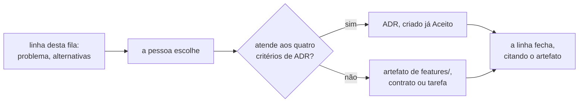
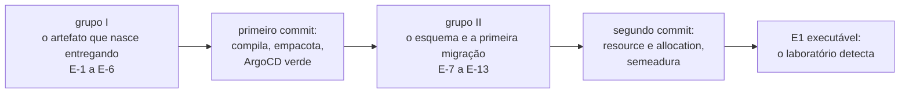
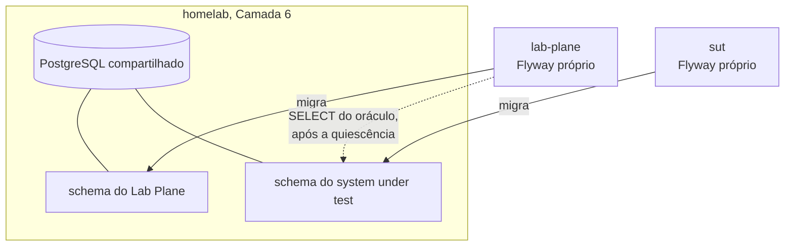
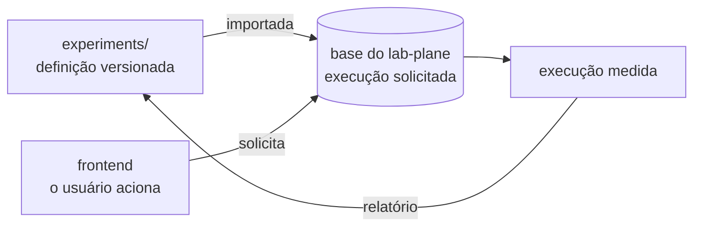
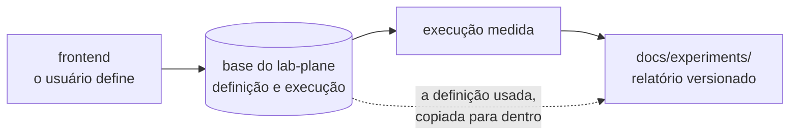
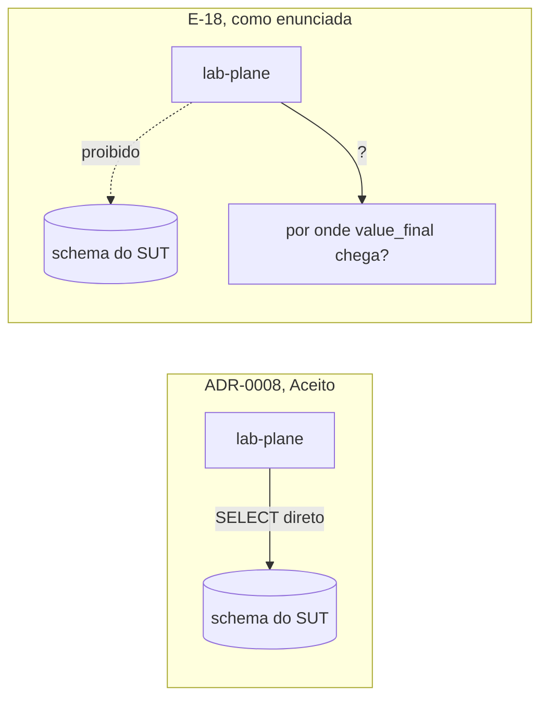
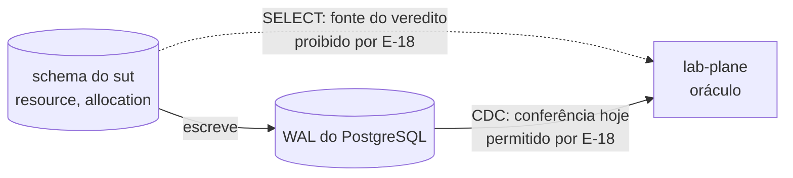
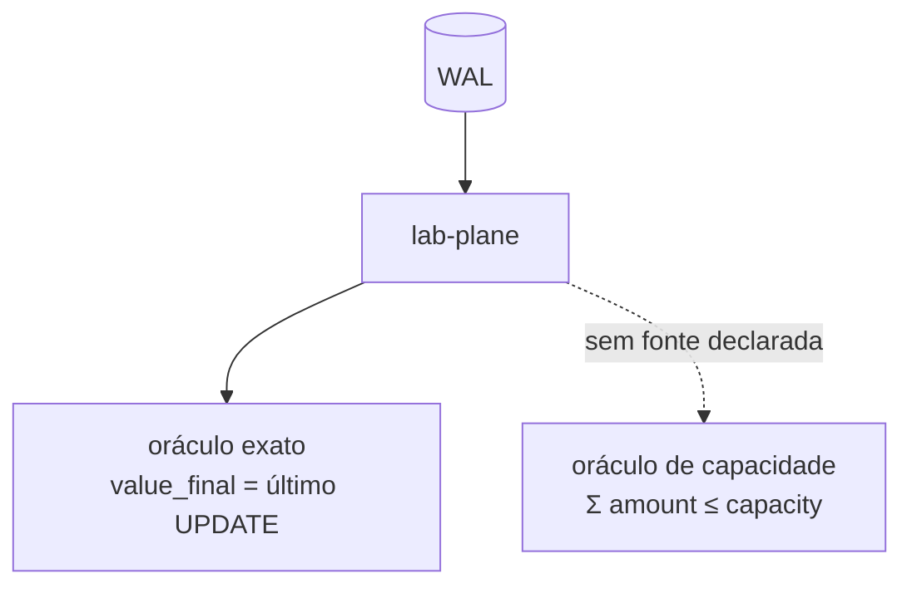

# Fila de decisões

Fila única deste repositório. Criada em 2026-08-05 pela decisão `B-1`, registrada em
[`arquivo/proposta-2026-08-03/decisoes-pendentes.md`](arquivo/proposta-2026-08-03/decisoes-pendentes.md).

Antes dela existiam duas listas do mesmo tipo de coisa, e a sobreposição era medida: os
três primeiros assuntos da rodada de arquitetura vinham colados numa linha só da fila
derivada do plano. Enquanto foram duas, uma decisão PODE ter sido tomada numa e reaberta
na outra.

## O que esta fila enfileira

**Decisão, e não ADR.** Desde 2026-08-04, o artefato que uma linha gera é escolhido no
momento em que a decisão é tomada, e não antes: ADR quando a escolha atender aos quatro
critérios de [`README.md`](README.md#uma-decisão-merece-adr-quando), artefato de
[`../features/`](../features/README.md) quando não atender. Uma linha PODE gerar os dois,
e PODE não gerar ADR nenhum.

**A poda não acontece antes da decisão.** A pendência de podar as linhas que são
comportamento disfarçado de arquitetura fechou em 2026-08-05, pela decisão `B-2`, por
subsunção: podar hoje é escolher o artefato antes da decisão, que é o oposto da regra
acima. A poda acontece uma linha por vez, quando a pessoa escolhe.

## Como citar uma linha desta fila

**Pelo nome, nunca pela posição.** A posição muda quando uma decisão entra no meio, e
uma citação por posição continua válida depois da inserção — passando a apontar para
outra decisão.

**Por âncora nomeada, nunca por número de linha.** É a decisão `C-1`, de 2026-08-05, com
o slug do GitHub Flavored Markdown fixado por `C-1a`. O verificador
[`scripts/check_citations.py`](../../scripts/check_citations.py) confere as duas formas.

Os números de ADR **não** estão atribuídos nas linhas abertas. Um número é atribuído
quando o ADR é escrito — atribuir antes cria buracos na sequência quando a ordem muda.

## As decisões derivadas do plano

Ordem derivada de [`../plano-do-laboratorio.md`](../plano-do-laboratorio.md). A coluna
`Ordem` é posição na fila, e ela muda.

| Ordem | Decisão                                                      | Estado                                   |
|-------|--------------------------------------------------------------|------------------------------------------|
| 1     | **O passo como unidade de execução, observação e injeção**   | `Aceito` — ADR-0001                      |
| 2     | **O domínio mínimo: contador e predicado de capacidade**     | `Aceito` — ADR-0002                      |
| 3     | **O estatuto da barreira e o diagnóstico da não ocorrência** | `Aceito` — ADR-0004                      |
| 4     | **A linguagem do agendamento**                               | `Aceito` — ADR-0003                      |
| 5     | **A forma do escalonador**                                   | `Aceito` — ADR-0005                      |
| 6     | **Estratégias de concorrência como dado, não como branch**   | `Aceito` — ADR-0006                      |
| 7     | **O log de observações: forma, ordem e onde vive**           | `Aceito` — ADR-0007                      |
| 8     | **Experiment: definição, semente, hipótese e asserções**     | aberta                                   |
| 9     | **Os dois formatos de veredito: booleano e curva**           | aberta                                   |
| 10    | **Arquitetura mínima, stack e guardas executáveis**          | **parcialmente consumida** pelo ADR-0008 |
| 11    | **Entrega contínua no homelab desde o dia zero**             | aberta                                   |

O porquê de cada posição, as questões que cada linha carrega e o histórico de como a
fila chegou a esta ordem estão em [`README.md`](README.md#índice) e nos próprios ADRs. As três
linhas abertas levam o detalhe abaixo.

**Posição 8 — Experiment.** Precisa resolver a tensão entre o Designer na interface e a
definição versionada. [`Q-0002-4`](../questions/Q-0002-4.md) pede aqui o ciclo de vida de
uma execução, [`Q-0003-8`](../questions/Q-0003-8.md) o que `N` conta, e
[`Q-0001-1`](../questions/Q-0001-1.md) a identidade de versão de uma operação.

**Posição 9 — os dois formatos de veredito.** Se ficar para depois, o grupo D não cabe
na arquitetura. [`Q-0002-3`](../questions/Q-0002-3.md) acrescenta o eixo pontual contra
contínuo no tempo, e [`Q-0003-3`](../questions/Q-0003-3.md) pede o que "mesma taxa"
significa numa execução medida.

**Posição 10 — arquitetura mínima.** O
[ADR-0008](0008-os-dois-planos-em-processos-separados.md) fixou dois processos separados
e o pacote raiz. Restam o build, o número de módulos e a guarda que
[`Q-0002-1`](../questions/Q-0002-1.md) pede para as três regras hoje textuais.

**Posição 11 — entrega contínua.** O serviço precisa nascer entregando; a linha ratifica
ou emenda a ADR 0017 do homelab.

## As decisões da rodada de arquitetura de 2026-08-03

Sessenta e seis linhas com identificador `D-*`, agrupadas por bloco. O agrupamento
**não** é o documento que cada assunto vai gerar: esse só existe depois da escolha.

**Três linhas já fecharam** — `D-ARQ-05`, `D-ARQ-06` e `D-ARQ-01`, todas pelo
[ADR-0008](0008-os-dois-planos-em-processos-separados.md). **Quatro mais** — as do Bloco
4 — fecharam em [`../CONTEXT.md`](../CONTEXT.md). **Uma quinta**, `D-DAT-05`, fechou em
2026-08-05.

### Bloco 0 — sem estas seis, nenhuma linha de código é escrita

São as que a fila de [`README.md`](README.md) enfileira nas
posições 10 e 11, e a exigência de nascer entregando as torna as primeiras.

| ID         | Decisão                                  | Recomendação da proposta                          | Onde                                                                                                         |
|------------|------------------------------------------|---------------------------------------------------|--------------------------------------------------------------------------------------------------------------|
| `D-ARQ-05` | mecanismo de módulo do primeiro artefato | Maven multi-módulo, quatro módulos, mais ArchUnit | [`arquivo/proposta-2026-08-03/modulos-e-fronteiras.md`](arquivo/proposta-2026-08-03/modulos-e-fronteiras.md) |
| `D-ARQ-12` | Maven contra Gradle                      | emendar a ADR 0017 do homelab para Maven          | [`arquivo/proposta-2026-08-03/entrega-continua.md`](arquivo/proposta-2026-08-03/entrega-continua.md)         |
| `D-ARQ-06` | pacote raiz e idioma dos identificadores | `dev.da0hn.lab`, região no primeiro segmento      | [`arquivo/proposta-2026-08-03/modulos-e-fronteiras.md`](arquivo/proposta-2026-08-03/modulos-e-fronteiras.md) |
| `D-ARQ-15` | a forma do `deploy/` no primeiro commit  | `deploy/` mínimo agora, uma réplica               | [`arquivo/proposta-2026-08-03/entrega-continua.md`](arquivo/proposta-2026-08-03/entrega-continua.md)         |
| `D-ARQ-14` | o que o pipeline executa                 | só guardas e provas; experimento sob demanda      | [`arquivo/proposta-2026-08-03/entrega-continua.md`](arquivo/proposta-2026-08-03/entrega-continua.md)         |
| `D-DAT-04` | ferramenta de migração                   | Flyway com SQL versionado                         | [`arquivo/proposta-2026-08-03/modelo-de-dados.md`](arquivo/proposta-2026-08-03/modelo-de-dados.md)           |

**`D-ARQ-05` e `D-ARQ-06` estão fechadas** pelo
[ADR-0008](0008-os-dois-planos-em-processos-separados.md), `Aceito` em
2026-08-04. A escolha não foi a recomendação da linha: o mecanismo de módulo é a
**fronteira de processo**, e não Maven multi-módulo. O pacote raiz `dev.da0hn.lab` com a
região no primeiro segmento foi aceito como recomendado, com os identificadores
**todos** em inglês. As duas linhas permanecem na tabela para que o histórico da
recomendação não se perca.

`D-ARQ-12` é a única com custo fora deste repositório: ela emenda um documento
`Aceito` do [`homelab-infrastructure`](https://github.com/da0hn/homelab-infrastructure).
`D-ARQ-15` fecha o `ComparisonError` que o ArgoCD reporta hoje, e a separação por
processo muda a forma que ela precisa declarar.

### Bloco 1 — destravam o esquema e a primeira migração

| ID         | Decisão                                       | Recomendação da proposta                 |
|------------|-----------------------------------------------|------------------------------------------|
| `D-DAT-01` | tipo e derivação da coluna de identidade      | `bigint` ordinal da semente              |
| `D-DAT-02` | chave estrangeira de `allocation.resource_id` | sem FK no MVP                            |
| `D-DAT-03` | índice sobre `allocation(resource_id)`        | criar, e registrar o plano efetivo       |
| `D-DAT-05` | como o banco volta ao ponto de partida        | decidida em 2026-08-05: não há reset     |
| `D-DOM-14` | dono da identidade derivada da semente        | o experimento publica; o domínio consome |
| `D-DOM-13` | o esquema compartilhado entre os dois planos  | Shared Kernel com contrato verificável   |

`D-DAT-02` tem a justificativa mais afiada da rodada: com chave estrangeira, o
`INSERT` de uma alocação toma `FOR KEY SHARE` na linha do recurso e conflita com
o `FOR UPDATE` do `PESSIMISTIC` — uma restrição de integridade mudaria o
fenômeno medido.

`D-DAT-05` recomendava `TRUNCATE` antes de cada execução até 2026-08-05, quando uma
quarta candidata entrou — pôr a execução na chave primária, preservando todo o
histórico — e `P-DAT-9` mostrou que a objeção de `Q-0002-4` contra preservar linhas
entre execuções não se sustenta sobre nenhum dos dois critérios de igualdade aceitos.
**O usuário decidiu na mesma data: não há reset.** A chave primária das duas tabelas
passa a incluir um discriminador UUIDv7, gerado pelo Lab Plane e propagado a tudo que o
sistema medido publica, com o crescimento das tabelas aceito. A linha permanece aqui
para que o histórico da recomendação não se perca; a decisão e o que ela deixa em aberto
estão em [`arquivo/proposta-2026-08-03/modelo-de-dados.md`](arquivo/proposta-2026-08-03/modelo-de-dados.md), seção 7, `D-DAT-05`, `P-DAT-10` e
`P-DAT-11`.

### Bloco 2 — destravam o E1 e a etapa 1

| ID         | Decisão                                  | Recomendação da proposta                            |
|------------|------------------------------------------|-----------------------------------------------------|
| `D-ARQ-04` | modelo de thread do worker               | threads de plataforma no MVP                        |
| `D-ARQ-07` | o que verifica cada classe de regra      | compilação para região; ArchUnit para o resto       |
| `D-ARQ-08` | onde vivem o relógio e a fonte semeada   | isenção posicional, sem anotação de supressão       |
| `D-ARQ-09` | a forma da guarda da chave de contenção  | recusa na primeira passagem                         |
| `D-DAT-08` | como o nível de isolamento é aplicado    | `TransactionTemplate`, pelo runtime                 |
| `D-DAT-09` | verificação de "uma conexão por worker"  | tamanho de pool mais asserção de PID distinto       |
| `D-DOM-07` | `Allocation` é agregado próprio          | agregado próprio                                    |
| `D-DOM-08` | onde vive `Σ amount ≤ capacity`          | no oráculo, como invariante observada               |
| `D-DOM-15` | quais fronteiras a stack materializa     | só system under test / Lab Plane, imposta por teste |
| `D-UI-02`  | onde o frontend renderiza                | exportação estática                                 |
| `D-UI-03`  | framework de componentes                 | shadcn/ui sobre Radix                               |
| `D-UI-04`  | eixo padrão da timeline                  | posição no log, com arestas causais                 |
| `D-UI-06`  | teto de eventos no navegador             | paginação contra o servidor                         |
| `D-UI-07`  | autenticação e autoria                   | nenhuma, declarada; autoria vinda do commit         |
| `D-UI-08`  | o que o `POST` cria                      | a sequência de execuções, não uma                   |
| `D-UI-09`  | mecanismo de streaming                   | SSE, com limiar numérico proposto                   |
| `D-UI-10`  | idempotência de iniciar execução         | chave obrigatória do cliente                        |
| `D-UI-11`  | vocabulário do contrato                  | português, igual ao glossário                       |
| `D-UI-12`  | compatibilidade e enumeração do veredito | enumeração aberta, cliente falha fechado            |

`D-ARQ-07` e `D-ARQ-08` são a resposta proposta a
[`Q-0002-1`](../questions/Q-0002-1.md), que pede a guarda executável das três
regras hoje textuais. `D-ARQ-09` responde
[`Q-0004-2`](../questions/Q-0004-2.md).

`D-DOM-07` e `D-DOM-08` carregam a descoberta conceitual da rodada: **o
agregado clássico do DDD é antipadrão aqui.** Um `Resource` que impusesse
`Σ amount ≤ capacity` na fronteira transacional tornaria o E5 irreproduzível,
pelo mesmo argumento com que o ADR-0002 descartou a constraint no banco —
confundir observar com impedir (`0002-...md:566-574`).

### Bloco 3 — pertencem a um ADR já enfileirado, e a recomendação é não decidir agora

| ID         | Decisão                                  | Destino na fila de ADRs                                       |
|------------|------------------------------------------|---------------------------------------------------------------|
| `D-DOM-06` | o que `N` conta                          | Experiment, posição 8; [`Q-0003-8`](../questions/Q-0003-8.md) |
| `D-DOM-09` | se `Experimento` é raiz das execuções    | Experiment, posição 8                                         |
| `D-DAT-07` | onde vive a definição de experimento     | Experiment, posição 8                                         |
| `D-UI-01`  | fonte de verdade da definição            | Experiment, posição 8                                         |
| `D-DOM-05` | se `veredito` vira quatro termos         | formatos de veredito, posição 9                               |
| `D-DOM-16` | se o modelo reserva lugar para a curva   | formatos de veredito, posição 9                               |
| `D-DOM-10` | se o log é agregado próprio              | gatilho na etapa 6                                            |
| `D-DOM-12` | se a injeção de falha é contexto próprio | gatilho na etapa 6                                            |

Aprovar qualquer uma destas **antecipa um ADR enfileirado**, e é a forma mais
provável de esta rodada causar dano. A recomendação de cada uma é adiar.

### Bloco 4 — vocabulário, decidível a qualquer momento e barato

**As quatro estão fechadas desde 2026-08-04.** As escolhas e as consequências de cada
uma vivem em [`../CONTEXT.md`](../CONTEXT.md), seção "As seis decisões de vocabulário".

| ID         | Decisão                                             | Escolha                                                 | Seguiu a recomendação? |
|------------|-----------------------------------------------------|---------------------------------------------------------|------------------------|
| `D-DOM-01` | qual sentido `execução` carrega sozinha             | `run` no experimento, `operation execution` na operação | sim                    |
| `D-DOM-02` | separar `system under test` de execução de controle | renomear para `system under test`                       | **não**                |
| `D-DOM-03` | se `barreira` continua na linguagem                 | aposentar, com citação histórica permitida              | sim                    |
| `D-DOM-04` | os dois sentidos de `estratégia`                    | `strategy` e `strategy label`                           | sim                    |

`D-DOM-03` foi executada no mesmo turno: os oito pontos de
[`arquivo/proposta-2026-08-03/mensageria.md`](arquivo/proposta-2026-08-03/mensageria.md) que usavam `barreira` como termo passaram a dizer
`restrição de precedência` ou `espera`, e o mérito de `D-MSG-11` não mudou.

`D-DOM-02` foi decidida contra a recomendação, e abriu duas perguntas que a alternativa
A não tratava. As duas estão em [`../CONTEXT.md`](../CONTEXT.md), na seção `D-DOM-02`:
se `Lab Plane` acompanha a renomeação, e se ela alcança as 95 ocorrências em texto
editável ou só o glossário.

**Pergunta em aberto.** Qual artefato registra estas quatro? O processo de
[`README.md`](README.md) prevê ADR ou artefato de
[`../features/`](../features/README.md), e vocabulário não é nem um nem outro — ele vive
no glossário, por instrução de [`../AGENTS.md`](../AGENTS.md), seção `## Glossário de
domínio`. `D-DOM-02` é a que mais puxa para ADR: ela renomeia um termo presente em
quatro ADRs aceitos, e o rastro de alterações adotado em 2026-08-04 obrigaria a carimbar
os quatro.

Estas quatro existem porque **os ADRs aceitos já colidem entre si no
vocabulário**. Decidi-las é barato agora e caro depois de existir código.

**A contra-avaliação sustenta este bloco.** Ele é "o único bloco aprovável como está"
([`arquivo/proposta-2026-08-03/contra-avaliacao.md`](arquivo/proposta-2026-08-03/contra-avaliacao.md), linhas 430 a 434), porque as quatro
colisões são reais entre ADRs aceitos, independem da fila e ficam caras depois de
existir código. Nenhuma das quatro pode ser resolvida editando um ADR.

Dois fatos levantados em 2026-08-04, antes de qualquer escolha.

**O glossário já aplicou a recomendação de `D-DOM-03` sem a decisão existir.**
[`../CONTEXT.md`](../CONTEXT.md), linha 355, marca `barrier` como `aposentado`, e a
tabela de estados daquele arquivo (linha 49) reserva esse rótulo para o que "existiu em
ADR aceito e foi retirado da linguagem por outro ADR". A recomendação virou texto antes
de virar escolha. Se a decisão for outra, aquela entrada muda junto, e o registro disso
não pode depender da memória de quem editou.

**Aprovar `D-DOM-03` obriga reescrever [`arquivo/proposta-2026-08-03/mensageria.md`](arquivo/proposta-2026-08-03/mensageria.md) no mesmo
turno.** A palavra é termo vivo e normativo ali:
`arquivo/proposta-2026-08-03/mensageria.md:520`, `:539`, `:548-553`, `:805` e `:1034-1054`,
inclusive no enunciado e nas três alternativas de `D-MSG-11`. A ressalva está em [`arquivo/proposta-2026-08-03/contra-avaliacao.md`](arquivo/proposta-2026-08-03/contra-avaliacao.md), linhas 143
a 145; o inventário de linhas é novo.

### Bloco 5 — etapa 4 e adiante, sem gatilho disparado hoje

| ID         | Decisão                                      | Etapa | Recomendação da proposta                 |
|------------|----------------------------------------------|-------|------------------------------------------|
| `D-ARQ-01` | seguir o gatilho ou antecipar serviços       | 4     | seguir o gatilho                         |
| `D-ARQ-03` | onde o Lab Plane vive com dois processos     | 4     | decidir quando a etapa 4 tiver gatilho   |
| `D-ARQ-11` | PostgreSQL dedicado ou compartilhado         | 0     | dedicado                                 |
| `D-ARQ-13` | experimento destrutivo sob `selfHeal`        | 6     | matar a operação, preservando o processo |
| `D-ARQ-10` | Toxiproxy                                    | —     | emendar a ADR 0017 e retirar             |
| `D-DAT-06` | onde o log durável vive                      | 6     | instância separada da medida             |
| `D-DAT-10` | o que do log entra no Git                    | 6     | relatório mais eventos restritos         |
| `D-DAT-11` | instância e `wal_level` se o CDC entrar      | —     | dedicada                                 |
| `D-UI-05`  | onde vive o desenho pedagógico               | 1     | só no controle positivo                  |
| `D-UI-13`  | como o relatório chega a `docs/experiments/` | 1     | download e commit por pessoa             |

`D-ARQ-01` é a decisão que responde diretamente à instrução de usar
microsserviços: a proposta recomenda **seguir o gatilho**, isto é, começar com um
artefato e decompor quando o experimento `JVM_LOCK` ficar vermelho com duas
instâncias. Aprovar o contrário é legítimo e tem custo nomeado no documento.

**`D-ARQ-01` está fechada, contra a recomendação**, pelo
[ADR-0008](0008-os-dois-planos-em-processos-separados.md). A decomposição deixou
de esperar o gatilho da etapa 4: os dois planos rodam em processos separados desde o dia
zero. `D-ARQ-03` continua aberta e muda de sentido — ela deixa de perguntar onde o Lab
Plane vive quando existirem dois processos e passa a perguntar o que muda quando o
system under test ganhar a segunda instância.

### Bloco 6 — mensageria, etapa 5 e adiante

Nenhuma destas tem gatilho disparado hoje. Elas existem para que a etapa 5 não
comece sem desenho, e **nenhuma delas deve ser construída antes do gatilho**.

| ID         | Decisão                                      | Recomendação da proposta                    |
|------------|----------------------------------------------|---------------------------------------------|
| `D-MSG-01` | gatilho concreto que libera o RabbitMQ       | broker real, pelo mecanismo da reentrega    |
| `D-MSG-02` | como uma entrega duplicada é contada         | contagem nova de comandos distintos aceitos |
| `D-MSG-03` | quem carimba os atributos de extensão        | o runtime, na fronteira                     |
| `D-MSG-04` | modo do binding CloudEvents e versão do AMQP | binário sobre 0-9-1, mapeamento declarado   |
| `D-MSG-05` | que recursos do broker ficam desligados      | nenhum DLX e nenhum limite até a etapa 8    |
| `D-MSG-06` | confirmação de publicador                    | ligada, com braço de comparação desligado   |
| `D-MSG-07` | se o broker é fonte legítima do oráculo      | é fonte só depois da quiescência            |
| `D-MSG-08` | ciclo de vida de uma reentrega               | execução nova, com ADR novo sobre o log     |
| `D-MSG-09` | quem cria e destrói a topologia              | por execução                                |
| `D-MSG-10` | se o CDC com Debezium entra                  | **não entra**; gatilhos registrados         |
| `D-MSG-11` | barreira contra o limite de confirmação      | declarar o limite por execução e reportá-lo |

`D-MSG-05` é a que mais contraria a intuição: a proposta recomenda **desligar**
DLX e limite de entregas até a etapa 8, porque com eles ligados os cenários 18 e
19 não têm o que mostrar. É a regra pedagógica aplicada à configuração do broker.

`D-MSG-10` é a resposta à instrução sobre Debezium. O argumento decisivo não é de
custo: o CDC **apaga os pontos `BEFORE_PUBLISH` e `AFTER_PUBLISH` do ADR-0001**,
porque sem passo `PUBLISH` na operação a etapa 6 perde o gatilho que o plano lhe
dá (`../plano-do-laboratorio.md:609`). Os dois gatilhos que criariam o CDC estão
registrados em [`arquivo/proposta-2026-08-03/mensageria.md`](arquivo/proposta-2026-08-03/mensageria.md).

### As duas linhas sem bloco, classificadas em 2026-08-05

`D-ARQ-02` e `D-DOM-11` têm seção própria no documento-fonte e não apareciam em bloco
nenhum: é a diferença entre 64 e 66 que a decisão `B-5` fechou. **As duas continuam
abertas** — `B-5` classificou, e não decidiu.

| ID         | Decisão                               | Assunto                     | Onde                                                                                                                                                          |
|------------|---------------------------------------|-----------------------------|---------------------------------------------------------------------------------------------------------------------------------------------------------------|
| `D-ARQ-02` | onde a interface web é construída     | Entrega contínua no homelab | [`arquivo/proposta-2026-08-03/arquitetura-alvo.md`](arquivo/proposta-2026-08-03/arquitetura-alvo.md#d-arq-02--onde-a-interface-web-é-construída-e-empacotada) |
| `D-DOM-11` | se o escalonamento é contexto próprio | Bloco 4, vocabulário        | [`arquivo/proposta-2026-08-03/modelo-de-dominio.md`](arquivo/proposta-2026-08-03/modelo-de-dominio.md#d-dom-11--se-o-escalonamento-é-contexto-próprio)        |

`D-ARQ-02` entrou em "Entrega contínua no homelab" porque fixa o `Dockerfile` e o número
de imagens do dia zero. `D-DOM-11` entrou no Bloco 4 porque
[`../CONTEXT.md`](../CONTEXT.md) já carrega o termo `scheduling` como `proposto` por ela.

### O agrupamento por assunto

A tabela abaixo agrupa as linhas por assunto, e não por bloco. Ela existe porque os três
primeiros assuntos vinham colados numa linha só da fila derivada do plano: a posição 10.

| Assunto                                        | Linhas                                                                                          |
|------------------------------------------------|-------------------------------------------------------------------------------------------------|
| Experimento: definição, semente, ciclo de vida | Bloco 3, mais `D-DAT-05`, `D-UI-08` e `D-UI-10`                                                 |
| Formatos de veredito                           | `D-DOM-05` e `D-DOM-16`                                                                         |
| A forma do artefato compilável                 | `D-ARQ-05`, `D-ARQ-06`, `D-ARQ-04`                                                              |
| A guarda executável das três regras            | `D-ARQ-07`, `D-ARQ-08`, `D-ARQ-09`, `D-DOM-15`                                                  |
| O esquema e a primeira migração                | `D-DAT-01` a `D-DAT-04`, `D-DAT-08`, `D-DAT-09`, `D-DOM-07`, `D-DOM-08`, `D-DOM-13`, `D-DOM-14` |
| Entrega contínua no homelab                    | `D-ARQ-12`, `D-ARQ-14`, `D-ARQ-15`, `D-ARQ-10`, `D-ARQ-11`, `D-ARQ-13`, `D-ARQ-02`              |
| Vocabulário                                    | Bloco 4, mais `D-DOM-11`, com destino em [`../CONTEXT.md`](../CONTEXT.md)                       |
| Mensageria, sem gatilho hoje                   | Bloco 6                                                                                         |
| Interface web                                  | `D-UI-02` a `D-UI-13`, menos as que o Bloco 3 absorve                                           |

## A ordem da arquitetura mínima e da entrega contínua está sob tensão

O laboratório é entregue no cluster do
[`homelab-infrastructure`](https://github.com/da0hn/homelab-infrastructure), e a
exigência é que um serviço **nasça já entregando** — pipeline e CI/CD no mesmo commit
que cria o módulo, não retrofitados depois.

Isso não move o passo: o formato dele não afeta o que o pipeline empacota. Mas move a
arquitetura mínima e a entrega contínua para **junto do primeiro módulo compilável**, e
as decisões entre o domínio mínimo e os vereditos deixam de ser pré-requisito de
escrever código de esqueleto. O `Dockerfile` e o `deploy/kustomization.yaml` fixam o
número de módulos e a forma do artefato — que é o conteúdo da arquitetura mínima.

A entrega contínua tem uma particularidade que nenhuma outra tem: **parte dela já foi
tomada fora deste repositório.** A ADR 0017 do homelab, aceita em 2026-07-26, escolheu
Gradle, Toxiproxy e "microsserviços JVM" para este laboratório, dois dias antes do
replanejamento que descartou a arquitetura de serviços. Ratificar ou emendar é decisão
consciente e explícita. O inventário completo do que sobrevive e do que colide está em
[`../plano-do-laboratorio.md`](../plano-do-laboratorio.md), seção 12.

## O Lote E, enumerado em 2026-08-06

Os Lotes A a D fecharam pendências de **processo**: onde a fila vive, quem aprova o quê,
como uma citação é escrita, o que acontece com a rodada de arquitetura arquivada. Nenhum
deles destrava uma linha de código. **Este destrava, e é o único que destrava.**

O Lote E é a interseção de três coisas que a fila tinha separadas: a posição 10
(arquitetura mínima), a posição 11 (entrega contínua) e o Bloco 1 (esquema e primeira
migração). A exigência de nascer entregando as junta — o `Dockerfile` e o
`deploy/kustomization.yaml` fixam a forma do artefato, e a forma do artefato **é** o
conteúdo da arquitetura mínima.

### Os dois grupos, e a ordem entre eles

O grupo I produz um repositório que compila, empacota e é reconciliado pelo ArgoCD, com
zero regra de negócio dentro. O grupo II produz a primeira migração e as duas tabelas.
Os dois são sequenciais e não concorrentes: o grupo II precisa do build escolhido em
`E-1` para ter onde pôr o arquivo de migração.

**O grupo I não espera o grupo II, e essa é a única razão de existirem dois.** Um
repositório que compila e é reconciliado, sem tabela nenhuma, já apaga o
`ComparisonError` que o cluster reporta hoje e prova a esteira inteira. Adiar o primeiro
commit até o esquema estar decidido acopla a prova da esteira à discussão de chave
primária, que não tem relação nenhuma com ela.

### Grupo I — sem estas seis, não existe `pom.xml`

| ID    | Decisão                                          | Origem     | Recomendação da proposta              |
|-------|--------------------------------------------------|------------|---------------------------------------|
| `E-1` | build: Maven contra Gradle                       | `D-ARQ-12` | emendar a ADR 0017 para Maven         |
| `E-2` | quantos artefatos executáveis, e quantos módulos | `D-ARQ-05` | **vencida** pelo ADR-0008; ver abaixo |
| `E-3` | a forma do `deploy/` no primeiro commit          | `D-ARQ-15` | `deploy/` mínimo agora, uma réplica   |
| `E-4` | o que o pipeline executa                         | `D-ARQ-14` | só guardas e provas                   |
| `E-5` | PostgreSQL dedicado contra compartilhado         | `D-ARQ-11` | dedicado ao namespace do laboratório  |
| `E-6` | onde a interface web é construída                | `D-ARQ-02` | exportação estática na mesma imagem   |

As alternativas de cada uma, com o argumento a favor e contra, estão em
[`entrega-continua.md`](arquivo/proposta-2026-08-03/entrega-continua.md#d-arq-12--maven-contra-gradle)
para `E-1`, `E-3`, `E-4` e `E-5`, e em
[`arquitetura-alvo.md`](arquivo/proposta-2026-08-03/arquitetura-alvo.md#d-arq-02--onde-a-interface-web-é-construída-e-empacotada)
para `E-6`.

### Grupo II — sem estas sete, não existe a primeira migração

| ID     | Decisão                                          | Origem     | Recomendação da proposta              |
|--------|--------------------------------------------------|------------|---------------------------------------|
| `E-7`  | ferramenta de migração                           | `D-DAT-04` | Flyway com SQL versionado             |
| `E-8`  | tipo e derivação da identidade do recurso        | `D-DAT-01` | `bigint` ordinal da semente           |
| `E-9`  | chave estrangeira de `allocation.resource_id`    | `D-DAT-02` | sem FK no MVP                         |
| `E-10` | índice sobre `allocation(resource_id)`           | `D-DAT-03` | criar, e registrar o plano efetivo    |
| `E-11` | quem deriva a identidade a partir da semente     | `D-DOM-14` | a definição publica, o domínio deriva |
| `E-12` | a guarda do filtro por discriminador             | `P-DAT-12` | nenhuma; a escolha não foi feita      |
| `E-13` | quem gera o UUIDv7, contra as regras estruturais | `P-DAT-10` | nenhuma; a tensão não foi fechada     |

`E-7` a `E-11` estão em
[`modelo-de-dados.md`](arquivo/proposta-2026-08-03/modelo-de-dados.md#d-dat-04--ferramenta-de-migração)
e em
[`modelo-de-dominio.md`](arquivo/proposta-2026-08-03/modelo-de-dominio.md#d-dom-14--quem-é-dono-da-identidade-derivada-da-semente).
`E-12` e `E-13` estão na seção
[`Perguntas em aberto`](arquivo/proposta-2026-08-03/modelo-de-dados.md#perguntas-em-aberto)
do mesmo documento, e **nunca estiveram em bloco nenhum** — elas nasceram como
consequência de `D-DAT-05`, decidida em 2026-08-05, depois de os blocos existirem.

### Seis achados do levantamento, e nenhum deles é opinião

**A recomendação de `D-ARQ-12` ficou órfã.** Ela argumentava a favor de Maven porque
`D-ARQ-05` propunha a fronteira entre regiões como dependência declarada entre módulos
Maven. O [ADR-0008](0008-os-dois-planos-em-processos-separados.md) decidiu **contra**
essa proposta: a fronteira é o processo, e não o módulo. O apoio técnico da recomendação
caiu junto, e o que resta a favor de Maven é de governança — a escolha por Gradle na ADR
0017 foi feita como detalhe de contexto de uma decisão de CI/CD, sem debate aqui.

**A recomendação de `D-ARQ-15` está vencida na letra.** Ela diz `Deployment` de **uma**
réplica, e foi escrita em 2026-08-03. O ADR-0008 é de 2026-08-04 e põe os dois planos em
processos separados — o `deploy/` nasce com **dois** `Deployment`, o que o próprio ADR
registra nas consequências. A escolha entre as três alternativas não muda; o manifesto
que a alternativa 1 descreve muda.

**`D-ARQ-05` já foi respondida para o mecanismo, e não para a contagem.** O ADR-0008
fixou a fronteira (processo) e as quatro regiões de pacote. Ele **não** fixou quantos
módulos de build existem nem quantos artefatos executáveis são publicados. Dois
processos exigem no mínimo dois executáveis; se `shared` é um módulo próprio, ou se os
quatro pacotes vivem em dois módulos, continua aberto. É `E-2`, e ela é a linha nova
deste lote.

**O argumento contra `bigint` em `D-DAT-01` caiu.** Ele era a colisão entre duas
execuções da mesma semente. `D-DAT-05` pôs um discriminador UUIDv7 de execução na chave
primária das duas tabelas, e a colisão deixou de existir — o próprio texto da decisão
registra que `D-DAT-01` permanece, com o discriminador como segunda coluna da chave e
não como substituição. `E-8` é hoje mais barata do que era quando foi enunciada.

**`D-DOM-13` é subsumida por `E-7`.** Ela pergunta se o Shared Kernel entre os dois
planos ganha contrato verificável, e recomenda que sim, deixando a forma "para quem
decide o esquema". Escolher uma ferramenta de migração com SQL versionado **é** essa
forma: o arquivo de migração passa a ser o contrato, e o Markdown não pode repeti-lo. A
linha fecha quando `E-7` fechar, sem decisão própria.

**`P-DAT-12` é o item mais perigoso do lote, e ele não estava em lista nenhuma.** Sem
reset, uma consulta que esqueça o filtro por discriminador soma linhas de execuções
anteriores ao `value_final` do oráculo exato, e o veredito sai errado **sem sintoma**.
Com `TRUNCATE` o mesmo esquecimento era inofensivo, porque não havia outra execução no
banco. A decisão de 2026-08-05 trocou dois riscos ruidosos por um silencioso, e nada
hoje obriga o filtro.

### O que este lote NÃO inclui, de propósito

- **As guardas executáveis** de [`Q-0002-1`](../questions/Q-0002-1.md) — `D-ARQ-07`,
  `D-ARQ-08` e `D-ARQ-09`. Elas pertencem ao Bloco 2, e nenhuma linha de código as
  espera: uma regra sem código para vigiar não tem o que verificar.
- **O modelo de thread do worker** (`D-ARQ-04`) e **o nível de isolamento**
  (`D-DAT-08`), que o E1 exige e o esqueleto não.
- **As dezenove linhas de interface web** do Bloco 2, menos `E-6`, que entra só porque
  fixa o número de imagens do `Dockerfile`.

### As decisões do grupo I, em 2026-08-06

| ID    | Escolha                                                          | Seguiu a recomendação? |
|-------|------------------------------------------------------------------|------------------------|
| `E-1` | Maven, emendando a ADR 0017 do homelab                           | sim                    |
| `E-2` | três módulos e dois executáveis, com o nome corrigido para `sut` | parcialmente           |
| `E-3` | **adiada**, por escolha explícita                                | —                      |
| `E-5` | PostgreSQL compartilhado do homelab, com schema por aplicação    | **não**                |
| `E-7` | Flyway, fechada por consequência de `E-5`                        | sim                    |

**`E-1` — Maven.** A emenda à ADR 0017 do `homelab-infrastructure` é custo aceito, e ela
é o único item deste lote com efeito fora deste repositório. `Q-INT-4` fecha com ela.

**`E-2` — o nome `control-plane` estava vencido, e a pergunta o repetiu.** A
[emenda do ADR-0009](0009-a-classificacao-do-dual-write-e-a-regiao-de-pacote.md) trocou
a região `dev.da0hn.lab.controlplane` por `dev.da0hn.lab.sut`, e `D-DOM-02` aposentou
`Control Plane` da linguagem. O módulo é `sut`, e não `control-plane`. A sigla é
permitida em identificador de código pela decisão `A5`, registrada em
[`../CONTEXT.md`](../CONTEXT.md#a-sigla-sut-no-código-decidida-em-2026-08-05) — em prosa
continua `system under test` por extenso.

**`E-3` — adiada.** O `ComparisonError` no ArgoCD permanece, e a exigência da ADR 0017
de nascer entregando fica pendente junto. A linha continua aberta nesta fila; nada mais
neste lote depende dela, porque o build e o esquema não leem o `deploy/`.

### `E-5`, decidida contra a recomendação, e o que ela arrasta

A escolha é a alternativa 2 de `D-ARQ-11`: **o PostgreSQL que o homelab já opera na
Camada 6**, com desenvolvimento local num contêiner. **Cada aplicação aplica a própria
migração, no próprio schema.**

**Ela fecha uma pergunta em aberto do ADR-0008.** Aquele ADR registra que a escolha
entre schema separado e dois bancos na mesma instância não fora feita, e que ela decide
permissão e espaço de nomes — nunca contaminação da medida, porque dois schemas do mesmo
cluster compartilham buffer pool, WAL, checkpointer, autovacuum e a tabela de locks. A
escolha é **schemas separados na mesma instância**.

**O custo nomeado pela própria alternativa passa a valer.** A contenção de conexões, de
CPU e de I/O atravessa a fronteira do banco lógico. O relatório de todo experimento
DEVE registrar que a medida foi feita num banco com vizinhos; sem isso, dois relatórios
com o mesmo veredito afirmam coisas diferentes. `Q-INT-3` fecha com a alternativa 2 e
esta obrigação.

**Ela dá forma concreta a `D-DOM-13`.** O Shared Kernel entre os planos deixa de ser
abstrato: o oráculo do Lab Plane lê as tabelas do schema do system under test, então o
papel do Lab Plane precisa de `USAGE` naquele schema e `SELECT` nas duas tabelas. A
fronteira que `Q-INT-5` pedia com forma verificável é uma concessão de permissão, e ela
é declarável e testável.

**Ela fecha `E-7` por consequência.** Migração por aplicação exige ferramenta de
migração, e a escolha é Flyway com SQL versionado — um arquivo por decisão aceita, nunca
editado depois de aplicado. Com isso `D-DOM-13` fecha junto: o arquivo de migração passa
a ser o contrato, e o Markdown não pode repeti-lo.

**Ela acrescenta um artefato que este repositório declara não ter.** Um contêiner local
significa `compose.yaml` versionado, e o [`../../AGENTS.md`](../../AGENTS.md) afirma hoje
que não existe `docker-compose.yml` nem comando de execução. A afirmação deixa de valer
no commit que criar o arquivo, e o texto muda junto.

**Pergunta em aberto: o Lab Plane não tem tabela nenhuma hoje.** O
[ADR-0007](0007-o-log-de-observacoes-forma-ordem-e-onde-vive.md) mantém o log em memória
e fixa a etapa 6 como o gatilho da persistência durável. Um Flyway no `lab-plane` no dia
zero teria zero migrações. Se o módulo já carrega a ferramenta com o diretório vazio, ou
se ela entra quando a primeira tabela existir, **não foi decidido**.

### A segunda rodada do grupo I mudou o desenho, em 2026-08-06

Três respostas fecharam linha, e duas abriram decisão que a fila mantinha adiada de
propósito. O registro é literal, antes de qualquer escolha nova.

| ID     | Escolha                                                        | Efeito                                 |
|--------|----------------------------------------------------------------|----------------------------------------|
| `E-4`  | o pipeline constrói a imagem e atualiza o `deploy/`; nada mais | contraria a alternativa 1 em parte     |
| `E-6`  | frontend em contêiner próprio, React                           | contraria a recomendação de `D-ARQ-02` |
| `E-14` | o `lab-plane` tem base própria desde o dia zero                | linha nova; antecipa `D-DAT-07`        |
| `E-15` | serviço próprio para o histórico de execução                   | linha nova, **em aberto**              |

**`E-4` — o experimento sai do pipeline, e a interface o aciona.** A parte que coincide
com a recomendação é a que importa: nenhum experimento roda no CI, então o veredito
probabilístico nunca pinta a build de vermelho. A parte nova é que guardas, provas e
testes **também** ficaram de fora do enunciado, e isso ainda não foi confirmado.

**`E-4` colide com o mecanismo da ADR 0017 do homelab.** Aquele documento fixa **ArgoCD
por polling**, com intervalo de cerca de três minutos: o workflow da `master` bumpa
a tag da imagem nos manifests Kustomize de `deploy/`, e o ArgoCD percebe sozinho. Não há
notificação do pipeline para o ArgoCD. "Avisar" exigiria webhook ou credencial de
escrita no painel do homelab — que é a mesma objeção com que `D-ARQ-13` descartou a
alternativa 3. O efeito prático é o mesmo, e o mecanismo é outro.

**`E-6` — três imagens no dia zero.** A escolha é a alternativa 2 de `D-ARQ-02`, contra
a recomendação. O custo nomeado passa a valer: o workflow ganha uma segunda matriz de
build, e a frase do plano segundo a qual a interface é servida pela própria aplicação
deixa de ser verdadeira. O framework de componentes fica em aberto — é `D-UI-03`, ainda
na fila.

**`E-14` — a base do `lab-plane` antecipa uma decisão do Bloco 3.** Guardar "as
configurações do experimento e as execuções solicitadas" põe a definição de experimento
numa tabela. `D-DAT-07` e `D-UI-01` perguntam exatamente onde essa definição vive, e a
recomendação das duas é **não decidir agora**, porque elas pertencem ao ADR de
Experiment — a posição 8 desta fila.

A tensão é real e está escrita desde o replanejamento: o
[`../../AGENTS.md`](../../AGENTS.md) diz que `experiments/` guarda definições, que
`docs/experiments/` guarda resultados, e que **os dois entram no Git** — juntos, o
histórico vira um caderno de laboratório. Uma definição que só existe numa linha de
tabela não é versionada, não aparece em diff e não sobrevive a um banco recriado.

O desenho acima é **uma** saída, e não a decidida: a definição continua versionada e é
importada; o banco guarda a **execução solicitada**, que é dado de operação e não de
especificação. Registrado como possibilidade, e a escolha pertence a `E-14`.

**`E-15` — o serviço de histórico não tem decisão, e o argumento a favor é forte.**
Ele é o mesmo do [ADR-0008](0008-os-dois-planos-em-processos-separados.md), aplicado um nível
abaixo: quem consulta não pode compartilhar destino com quem mede. Uma consulta da
interface sobre o histórico, dentro do processo que executa o experimento, perturba a
medida pelo mecanismo que aquele ADR nomeia — pausa de GC, pool esgotado, contenção.

O argumento contra também é do repositório: o
[ADR-0007](0007-o-log-de-observacoes-forma-ordem-e-onde-vive.md) mantém o log em memória
e fixa a **etapa 6** como o gatilho da persistência durável. Um serviço de histórico
hoje antecipa esse gatilho, e a regra estrutural exige nomear a limitação concreta que
a peça nova resolve antes de ela entrar.

### A terceira rodada, em 2026-08-06: duas linhas fechadas e a nomenclatura

| ID     | Escolha                                              | Seguiu a recomendação? |
|--------|------------------------------------------------------|------------------------|
| `E-4`  | build, testes e guardas; depois imagem e bump da tag | sim                    |
| `E-14` | a definição de experimento vive **só no banco**      | **não**                |

**`E-4` fecha.** O workflow compila, roda os testes com Testcontainers e as guardas
executáveis, publica a imagem no GHCR e bumpa a tag nos manifests de `deploy/`. Nenhum
experimento roda no CI. Uma imagem publicada é uma imagem que passou nas provas exigidas
por ADR aceito, e o veredito probabilístico nunca pinta a build de vermelho.

**`E-14` fecha contra a recomendação, e fecha três linhas de outros blocos junto.**
`D-DAT-07`, `D-UI-01` e a tensão 1 do plano perguntam a mesma coisa: onde vive a
definição de experimento. A resposta é a tabela, e o Designer na interface passa a ser
a fonte. As três saem da posição 8 desta fila.

**O que a escolha custa, nomeado.** O [`../../AGENTS.md`](../../AGENTS.md) afirma que
`experiments/` guarda definições, que `docs/experiments/` guarda resultados e que os
dois entram no Git — "juntos, o histórico vira um caderno de laboratório". A metade das
definições deixa de valer: elas não aparecem em diff, não são revisadas em PR e não
sobrevivem a um banco recriado. O texto muda no commit que criar a tabela.

**Um desenho em que o custo desaparece, registrado como possibilidade.** Se o relatório
de execução que vai para `docs/experiments/` **incorporar a definição completa que foi
usada**, o Git volta a guardar tudo que reproduz a execução — só que como parte do
resultado, e não como fonte. A definição deixa de ser artefato a sincronizar e passa a
ser um campo do relatório, o que elimina a pergunta de qual representação manda.
A escolha entre isto e um relatório que só cite a definição por identificador **não foi
feita**.

#### A nomenclatura dos módulos e dos serviços

Levantada na mesma rodada, e ela ainda não fechou.

**`system-under-test` como nome de módulo, `sut` como segmento de pacote.** A separação
já existe e é a decisão `A5`, em
[`../CONTEXT.md`](../CONTEXT.md#a-sigla-sut-no-código-decidida-em-2026-08-05): em prosa,
por extenso; em identificador de código, a sigla. Um nome de módulo e de imagem não é
nenhum dos dois — ele aparece em `deploy/`, no GHCR e no log do cluster, onde a sigla
não tem expansão à vista. O par por extenso no módulo e sigla no pacote é coerente com a
regra, e a fixa para um caso que ela não previa.

**`lab-auditory` não pode ser o nome, e o motivo é de idioma.** Em inglês `auditory` é
"auditivo", relativo à audição; "auditoria" é `audit`. Como todo identificador é escrito
em inglês pelo [ADR-0008](0008-os-dois-planos-em-processos-separados.md), o nome errado
ficaria em pacote, imagem e manifesto. As candidatas com o sentido pretendido são
`lab-audit`, `lab-journal`, `lab-ledger` e `lab-notebook` — as duas últimas alinhadas à
metáfora do caderno de laboratório que o repositório já usa.

**A contagem de serviços continua aberta**, e ela é o que resta de `E-2` e `E-15`.

### A quarta rodada, em 2026-08-06: uma contradição com ADR aceito

| ID     | Escolha                                              | Estado                     |
|--------|------------------------------------------------------|----------------------------|
| `E-16` | o nome do histórico é `lab-journal`                  | fechada                    |
| `E-17` | `docs/experiments/` não existe; tudo vive no serviço | fechada, com custo nomeado |
| `E-18` | um schema por serviço, sem acesso cruzado            | **contradiz o ADR-0008**   |

**`E-16` — `lab-journal`.** Pacote `dev.da0hn.lab.journal`. Alinhado à metáfora do
caderno de laboratório que o repositório já usa, e sem a conotação de conformidade que
`audit` carrega nem a contábil de `ledger`.

**`E-17` — o caderno de laboratório sai do Git por inteiro.** A definição já tinha saído
por `E-14`; agora saem também os resultados. O usuário define pelo frontend, e o serviço
expõe endpoints para isso. Três linhas fecham junto: `D-DAT-10`, que pergunta o que
do log entra no Git, fecha com **nada**; `D-UI-13`, que pergunta como o relatório
chega a `docs/experiments/`, fecha por subsunção; e a pasta deixa de ser criada.

O custo, nomeado e aceito: o [`../../AGENTS.md`](../../AGENTS.md) afirma que
`experiments/` e `docs/experiments/` entram no Git e que "juntos, o histórico vira um
caderno de laboratório". A frase inteira deixa de valer. Um resultado deixa de aparecer
em diff, de ser revisado em PR e de sobreviver a um banco recriado — o `lab-journal`
passa a ser o **único** guardião do histórico, e a durabilidade dele deixa de ser
conveniência e vira requisito.

#### `E-18` — a regra de schema e o oráculo do ADR-0002

A regra escolhida é a de microsserviços: **um schema por serviço, e um serviço JAMAIS
acessa o schema de outro.** Ela é sólida no lugar de onde vem, e aqui ela colide com uma
decisão `Aceito`.

O [ADR-0008](0008-os-dois-planos-em-processos-separados.md) declara, no diagrama da
seção `## Decisão`, a aresta `SELECT após a quiescência` indo do Lab Plane direto ao
PostgreSQL do sistema medido. Não é acessório: o oráculo exato do ADR-0002 é
`perdidas = commits − (value_final − value_inicial)`, e `value_final` é o valor lido de
`resource` **depois** que todos os workers terminaram. Sem essa leitura, o laboratório
não mede nada.

**Por que trocar por uma chamada HTTP ao próprio sistema medido não é neutro.** O
instrumento passaria a depender do medido para medi-lo: um defeito na leitura do
system under test — um filtro errado, um cache, uma transação aberta — apareceria como
resultado de consistência, que é precisamente a confusão entre os dois planos que o
ADR-0008 existe para impedir. Some-se a isto que `P-DAT-12` já registra que, sem reset,
um `WHERE` que esqueça o discriminador de execução corrompe o veredito **sem sintoma**.

**A contradição é decisão arquitetural nova, e ela entra na fila hoje.** É a regra
`B-4`, de 2026-08-05: um artefato não pode contradizer um ADR aceito, e a contradição
vira linha no mesmo turno em que é vista. Ela não foi decidida aqui, e o Lote E não
fecha sem ela.

### A quinta rodada, em 2026-08-06: o CDC, conferido

| ID     | Escolha                                           | Estado                      |
|--------|---------------------------------------------------|-----------------------------|
| `E-15` | quatro serviços no dia zero                       | fechada                     |
| `E-19` | observações atravessam ao vivo, evento por evento | fechada, com tensão nomeada |
| `E-18` | por onde `value_final` chega                      | **continua aberta**         |
| `E-20` | quem serve o frontend, e se existe BFF            | linha nova, aberta          |

#### O CDC entrou, e não no papel que dispensaria o `SELECT`

A pergunta levantada nesta rodada foi se o CDC não teria sido adotado justamente para o
`lab-plane` não consultar a base do sistema medido. **Ele foi adotado, e não para
isso.**

A decisão está em
[`decisoes-pendentes.md`](arquivo/proposta-2026-08-03/decisoes-pendentes.md), na seção
"Decidido em 2026-08-05: o CDC entra, com `wal_level = logical` permanente". Ela admite
o CDC como **fonte de observação**, e a tabela das três fontes daquela seção separa o
que cada uma pode dizer: o `SELECT` do oráculo é a única com "serve de veredito: **sim**
— é a fonte do ADR-0002"; o CDC aparece com "não; serve de conferência". O texto é
explícito: **o CDC confere, ele não decide.**

O motivo é do ADR-0002: o oráculo de capacidade calcula `SELECT sum(amount)`, e
reconstruir essa soma a partir de eventos de `INSERT` é derivar estado final de um
stream, que aquele ADR proíbe.

**Um achado desta rodada, que muda o desenho da saída.** O CDC lê o **WAL**, e não a
tabela — uma conexão de replicação lógica não faz `SELECT` no schema alheio. Pela letra
de `E-18`, o CDC **não viola** a regra de schema. Isso torna "o CDC como fonte" a única
saída tecnicamente compatível com a regra sem exceção nenhuma, e o custo dela é
contrariar duas decisões.

**E os dois oráculos não são iguais nesse ponto.** O oráculo exato precisa de
`value_final`, que é o **último valor** de `resource.value` visto no stream — leitura
direta, sem reconstrução. O oráculo de capacidade precisa de `Σ amount`, que exige somar
eventos. A proibição do ADR-0002 alcança o segundo com clareza; se ela alcança o
primeiro **não está escrito em lugar nenhum**, e a distinção nunca foi feita.

#### `E-19` — ao vivo, e a tensão com o ADR-0008

As observações atravessam para o `lab-journal` evento por evento. A tensão está escrita
no [ADR-0008](0008-os-dois-planos-em-processos-separados.md), que já registra como
consequência negativa que **a latência da rede entra na medida de todo experimento**, e
que o E1 do MVP emite entre 900 e 1500 observações por execução. A escolha acrescenta
essas travessias dentro da janela medida.

**Uma saída existe e não foi escolhida:** emissão não bloqueante, em que o passo
enfileira a observação num buffer local e um remetente próprio a envia, de modo que o
runtime nunca espera a rede. O custo é que uma queda do `lab-plane` perde o buffer, e a
etapa 6 mata o processo de propósito.

### A sexta rodada, em 2026-08-06: o CDC vira fonte do veredito

| ID     | Escolha                                                   | Estado                       |
|--------|-----------------------------------------------------------|------------------------------|
| `E-18` | o CDC é a fonte do veredito; não há `SELECT` cruzado      | fechada, contra recomendação |
| `E-20` | sem BFF: comando no `lab-plane`, leitura no `lab-journal` | fechada                      |

**`E-20` fecha sem custo novo.** O frontend pede execução ao `lab-plane` e lê histórico
e streaming do `lab-journal`, que já recebe as observações ao vivo por `E-19`. É CQRS
que a topologia já impunha. O recurso de exposição rotea dois caminhos, e nenhum serviço
novo entra.

#### O que `E-18` preserva, e o que ela desmonta

A escolha mantém a regra de schema sem exceção nenhuma: uma conexão de replicação lógica
consome o WAL, e não faz `SELECT` em tabela alheia.

**A guarda que protege o número já existe, e ela sobrevive.** `O19` fechou em 2026-08-05
decidindo que o oráculo **aguarda o CDC alcançar o LSN do commit final** antes de
comparar, com limite declarado por execução, e que o estouro desse limite recebe rótulo
próprio, distinto de `fontes divergentes`. Com essa espera, um slot atrasado não entrega
soma incompleta: ele estoura o limite e a execução é rotulada. O risco de número errado
por atraso continua coberto.

**O que se desmonta é a detecção cruzada.** O texto de `O19` diz que "o mecanismo de
duas fontes protege o veredito" e que um atraso do CDC "não produz número errado: ele
produz invalidação, que é o comportamento seguro". Com o CDC como fonte **única**, o
rótulo `fontes divergentes` perde sujeito para o veredito: não há segunda leitura
independente com que comparar. O consolidado publicado pelo system under test continua
servindo de conferência, mas ele **não** é independente do código medido — é a própria
tabela das três fontes que registra isso.

**`O20` deixa de ser uma objeção e vira bloqueio.** Ela registra que o `value_inicial`
não tem fonte: o ADR-0002 o exige lido antes de o primeiro worker começar, e o CDC
reporta mudanças, não estado. Enquanto o `SELECT` existia, essa lacuna tinha remédio
óbvio. As duas saídas que `O20` nomeia continuam sem escolha — o CDC roda com snapshot
inicial, ou o estado inicial vem de outro lugar.

**O oráculo de capacidade fica sem fonte declarada.** O ADR-0002 tem dois oráculos. O
exato usa `value_final`, que é o último valor de `resource.value` no stream — leitura
direta. O de capacidade calcula `Σ amount ≤ capacity`, e somar eventos de `INSERT` é
derivar estado final de um stream, que aquele ADR proíbe. O E5 depende do segundo, e
**nada neste lote lhe deu fonte**.

**Duas decisões anteriores precisam de ato formal.** A de 2026-08-05, que diz que o CDC
confere e não decide, fica revertida na parte do veredito — ela vive em documento
arquivado, e a reversão é esta linha. O
[ADR-0008](0008-os-dois-planos-em-processos-separados.md) está `Aceito` e declara no
diagrama da seção `## Decisão` a aresta `SELECT após a quiescência`: ele precisa de
**emenda ou substituição**, e o corpo dele não pode ser editado.

**O CDC passa a ser infraestrutura do dia zero.** Conector, `wal_level = logical` e slot
de replicação deixam de ser da etapa 5 e entram no primeiro `compose.yaml` e no primeiro
`deploy/`. `O17` já registrava que o Debezium entra na stack sem linha na matriz de
integrações, e agora ele entra antes de qualquer experimento existir.

### O esqueleto do grupo I, escrito em 2026-08-06

O primeiro código do repositório entrou no mesmo dia em que o grupo I fechou. Ele
compila, empacota, sobe contra PostgreSQL real e **não implementa nada**.

| Decisão | Como ela virou arquivo                                           |
|---------|------------------------------------------------------------------|
| `E-1`   | `pom.xml` reactor, Java 25, Spring Boot 4.1.0                    |
| `E-2`   | `shared`, `lab-plane`, `lab-journal`, `system-under-test`        |
| `E-4`   | `.github/workflows/build.yml`: verify, depois imagem no GHCR     |
| `E-5`   | `compose.yaml` e `local/postgres-init.sql`, um papel por serviço |
| `E-6`   | `frontend/`, React 19 com `Dockerfile` e nginx próprios          |
| `E-7`   | Flyway configurado nos três, com `create-schemas`                |
| `E-18`  | `ALTER ROLE lab_plane REPLICATION`, e nenhum `GRANT` cruzado     |
| `E-20`  | dois caminhos no `nginx.conf` e no proxy do Vite                 |

#### Cinco coisas que escrever o código decidiu, e que ninguém tinha perguntado

**A região `application` do ADR-0008 vira três folhas.** Aquele ADR nomeia
`dev.da0hn.lab.application` como a região de composição e ponto de entrada. Com três
executáveis, um pacote único ali ficaria dividido entre três artefatos — split package,
que compila e envenena qualquer análise por pacote. Cada bootstrap ganhou folha própria:
`application.labplane`, `application.journal` e `application.sut`, com
`scanBasePackages` declarado. **A emenda ao ADR-0008 precisa cobrir isto**, junto da
região `journal`, que também não existe lá.

**A direção proibida do ADR-0008 deixou de precisar de guarda.** O `system-under-test`
não declara dependência do `lab-plane`, então a chamada proibida é erro de compilação. O
ArchUnit foi **retirado** dos `pom.xml` por isso: uma dependência declarada sem uso é
exatamente o que a regra estrutural do repositório proíbe. Ele volta quando `D-ARQ-07`
decidir o que cada classe de regra verifica.

**O `public` foi revogado no banco local.** Um schema comum a todos os papéis é o
caminho por onde `E-18` vazaria sem ninguém notar: bastaria uma tabela criada sem
qualificar o schema. `REVOKE ALL ON SCHEMA public FROM PUBLIC` fecha isso.

**O SSE exige três diretivas no nginx.** Sem `proxy_buffering off`, o servidor acumula a
resposta e entrega o evento só quando o buffer enche — o que transforma "ao vivo" de
`E-19` em "em lote", sem erro nenhum aparecer. É a classe de defeito que o repositório
mais teme: o silencioso.

**O `lab-journal` já pode ter migração, e os outros dois não.** O
[ADR-0007](0007-o-log-de-observacoes-forma-ordem-e-onde-vive.md) já fixou a forma e a
ordem do log de observações, então a primeira migração do histórico não depende do grupo
II. As tabelas `resource` e `allocation` dependem, porque `E-8` a `E-13` continuam
abertas. Nenhuma migração entrou neste commit.

#### Cinco defeitos que o esqueleto teve, e o que cada um ensina

Nenhum deles apareceu como erro. Os cinco produziram **verde**, que é a forma de falha
que este repositório mais teme.

**A auto-configuração do Flyway saiu de `spring-boot-autoconfigure` no Spring Boot 4.**
Ela vive num módulo próprio, `spring-boot-flyway`. Sem ele, o `flyway-core` fica no
classpath, o contexto sobe, o health check responde `UP`, e **nenhuma migração roda**.

**O Flyway não cria schema quando não há migração a aplicar.** `create-schemas: true` é
condição, e não ordem: ele cria o schema antes de aplicar a primeira migração, e sem
nenhuma ele não faz nada. As três `V1` existem por isso, e criam apenas um
`COMMENT ON SCHEMA`.

**Os dois defeitos acima se somam num terceiro.** A fronteira de `E-18` ficava declarada
em `application.yml` e ausente no banco: os três serviços conectavam ao mesmo
`database`, nenhum schema existia, e nada os impedia de escrever no mesmo espaço de
nomes. A regra estava escrita e não estava valendo.

**O teste `contextLoads` não pega nada disso.** Ele prova que o Spring sobe, o que é
verdade mesmo com o Flyway inerte. Os testes passaram a consultar `pg_namespace` e
afirmar que o schema daquele processo existe — o que falha se qualquer um dos três
defeitos voltar.

**A tabela de controle do Flyway tem uma coluna `version`.** Uma guarda ingênua para a
proibição do ADR-0006 acusaria defeito na primeira execução. A verificação exclui
`flyway_schema_history`: a coluna pertence à ferramenta de migração, e não ao domínio
medido.

Um sexto, de ambiente e não de decisão: a imagem `postgres:18` mudou o ponto de
montagem para `/var/lib/postgresql`, porque os dados passaram a viver num subdiretório
por versão maior. Montar `/var/lib/postgresql/data` faz o contêiner recusar-se a subir —
este falhou ruidosamente, e por isso não está na lista acima.

#### O que o esqueleto prova, e o que ele não prova

Prova: os quatro artefatos constroem, os três serviços Java sobem contra PostgreSQL 18
real por Testcontainers, o Flyway cria o schema de cada um, e o `compose.yaml` levanta o
conjunto com `wal_level=logical`.

Não prova nada sobre consistência distribuída. Nenhum dos 42 fenômenos é reproduzível, o
oráculo não existe, e o CDC está provisionado mas não consumido.

## O nível de isolamento não tem lugar nesta fila

O E5 exige a comparação do mesmo experimento sob `READ COMMITTED`, `REPEATABLE READ` e
`SERIALIZABLE`. Só o terceiro aborta uma das transações, com SQLSTATE `40001`. O plano
registra a exigência na seção 6, e nomeia o nível de isolamento como parâmetro do
experimento — escopo que os quatro experimentos anteriores não têm.

**Nenhuma linha desta fila nomeia esse parâmetro.**

A decisão de estratégias de concorrência é o destino aparente, e ela não serve sem
argumento. Uma estratégia é código da aplicação: `NONE`, `ATOMIC_UPDATE`, `OPTIMISTIC` e
`PESSIMISTIC` mudam o SQL que os passos emitem. Um nível de isolamento é propriedade da
transação, e ele muda o que o banco faz com o mesmo SQL. O E5 é o experimento que separa
os dois eixos: com `OPTIMISTIC` ativo sob `READ COMMITTED`, a invariante quebra sem
exceção nenhuma, porque inserir uma alocação não incrementa a versão de linha alguma.
Tratar o isolamento como mais um valor da mesma enumeração apagaria a distinção que o
experimento existe para mostrar.

Três destinos são possíveis, e a escolha não foi feita.

- **Estratégias de concorrência**, com o isolamento declarado como eixo separado dentro
da mesma decisão. O custo é uma decisão que passa a carregar dois eixos.
- **Experiment**, que define o que uma execução declara. O isolamento seria um campo da
definição, ao lado da semente. O custo é decidir a semântica do parâmetro num ADR cujo
assunto é o ciclo de vida da execução.
- **Linha própria nesta fila**, se a escolha tiver alternativas e trade-off que nenhuma
das duas comporte.

Uma pista contra o terceiro destino: o E5 não escolhe um nível, ele varre três. O que a
plataforma precisa é do eixo de variação, e não de um valor decidido uma vez.

Registrado em 2026-07-31, no levantamento do que falta para fechar o MVP.

## A anomalia por frequência: uma proposta que muda o estatuto da barreira

O laboratório foi planejado para **construir** a anomalia. O E2 declara a intercalação
`W1.READ → W2.READ → W1.WRITE → W2.WRITE`, o escalonador a impõe, e a atualização
perdida aparece em toda execução. A proposta inverte o mecanismo: a anomalia emerge da
**frequência** de execuções concorrentes, e o trabalho da plataforma passa a ser
**diagnosticar** se o erro esperado ocorreu.

A proposta não é uma preferência de implementação. Ela troca o que a plataforma promete:
de "esta execução produz a anomalia" para "esta configuração produz a anomalia com esta
taxa". As duas promessas exigem instrumentos diferentes.

#### O que a proposta contradiz

**A aresta `25 → 1` do plano**, seção 4. O texto lá diz: "o lost update precisa ser
demonstrado, não sorteado. Sem barreiras, o experimento produz *às vezes perde* — que é
a mesma frase que o engenheiro já dizia antes de abrir o laboratório." É o argumento
mais forte contra a proposta, e ele já estava escrito antes dela.

**O estatuto epistêmico do E2.** O plano separa E1 de E2 assim: "E1 prova que o
laboratório *detecta*. E2 prova que o laboratório *constrói*. São capacidades
diferentes, e a segunda é a que torna a primeira confiável." Sem barreira, a segunda
capacidade some, e a confiança na primeira perde o apoio que o plano lhe deu.

**A cláusula de honestidade do ADR-0001**, que está `Aceito`. Ela compara um braço com
barreiras contra um braço sem elas. Com um braço só, a cláusula fica sem sujeito. A
falha que ela existe para pegar — o runtime fabricando o fenômeno por agendamento —
deixa de ser possível pelo mesmo motivo, mas a fabricação por estado compartilhado
dentro do instrumento continua, e [`Q-0001-2`](../questions/Q-0001-2.md) registra que
ela não tem guarda.

**O ADR-0003 inteiro.** Ele define como uma barreira é declarada. A questão 4 daquele
documento está `aberto (crítico)` por causa desta proposta, e ele NÃO DEVE ser aceito
antes que este item seja decidido.

#### O que a proposta não contradiz, e o que ela reforça

**O oráculo do ADR-0002 já é uma contagem, e não um booleano.**
`perdidas = commits − (value_final − value_inicial)` mede magnitude. Uma taxa é a mesma
contagem dividida pelo número de tentativas, e nada no ADR-0002 precisa mudar para
produzi-la. O domínio mínimo foi escolhido de um jeito que serve às duas promessas.

**O E1 já é a proposta.** Cem incrementos, dez workers, nenhuma barreira, `value < 100`.
A mudança não introduz um experimento novo no MVP: ela promove a forma do E1 a norma e
rebaixa a do E2.

**O grupo de controle deixa de ser disciplina e vira pré-requisito lógico.** A regra
"se `NONE` não violar, a carga é insuficiente" já está no repositório. Sob a proposta,
ela passa a ser a única coisa que faz um resultado negativo significar alguma coisa.

**O passo sobrevive com duas das três motivações.** O ADR-0001 fixou o passo por três
exigências: barreira determinística, injeção de falha em ponto nomeado e timeline. A
proposta atinge a primeira e não toca nas outras duas. A etapa 6 continua precisando de
`AFTER_COMMIT` exato, e a timeline continua sendo um registro por passo.

#### O que a proposta cria, e ninguém decidiu ainda

**Um resultado negativo passa a ter quatro causas, e a plataforma não distingue nenhuma
delas hoje.** "Zero violações" PODE significar: a anomalia é impossível naquela
configuração; a anomalia é possível e a janela nunca foi atingida; a anomalia ocorreu e
o oráculo não a viu, porque ele lê o estado final quiescente (
[`Q-0002-3`](../questions/Q-0002-3.md) ); ou os workers nunca se sobrepuseram, porque o
pool de conexões os serializou. A primeira é o resultado que o experimento busca. As
outras três são defeitos do instrumento com a mesma aparência.

**A plataforma mede a consequência, e passaria a precisar medir a exposição.** Uma
atualização perdida exige que dois workers leiam o mesmo valor antes que qualquer um
escreva. Esse evento é contável a partir do log de observações que o ADR-0001 já obriga
o runtime a emitir. Contá-lo separa "a janela não abriu" de "a janela abriu e nada
aconteceu" — que é a distinção que converte um zero em conhecimento. Nenhum documento do
repositório nomeia essa métrica.

**Um resultado negativo precisa de regra de parada e de declaração de confiança.** Com N
tentativas e zero violações, o limite superior da taxa fica em torno de `3/N` com 95% de
confiança. Sem uma regra escrita, cada execução escolhe o próprio N, e dois relatórios
com o mesmo veredito afirmam coisas diferentes. Quem escolhe N, e o que o relatório
afirma quando o zero aparece, é decisão nova.

**O veredito ganha um terceiro formato.** A fila prevê booleano e curva. Taxa com
intervalo não é nenhum dos dois: ela tem um número e uma incerteza, e a incerteza
precisa aparecer no relatório. A decisão dos formatos de veredito muda de escopo por
causa disso.

**A falha intermitente entra no pipeline.** Um experimento probabilístico num workflow
que precisa ficar verde é um teste instável por construção. A tensão 2 do plano chama a
falha intermitente de "o pior resultado possível num instrumento de medida", e a
exigência de nascer entregando põe esse custo no primeiro commit, não depois.

#### Três desfechos, e nenhum é obviamente certo

**Remoção da barreira.** O agendamento sai, o ADR-0003 é descontinuado ainda `Proposto`,
e o E2 deixa de existir como experimento separado. Custo: a plataforma passa a afirmar
apenas o que observou, e perde o poder de mostrar a intercalação que causa o fenômeno —
que é a exigência pedagógica do cenário 25.

**Rebaixamento a instrumento de diagnóstico.** A frequência produz o resultado; a
barreira responde à pergunta que o resultado negativo deixa aberta. Se a execução por
frequência não produzir violação, a mesma configuração roda com a intercalação forçada:
violação ali significa carga insuficiente na primeira; ausência nas duas significa que a
anomalia é impossível naquela configuração. A barreira vira o **controle positivo** do
experimento, e o ADR-0003 continua válido com a seção `## Contexto` reescrita.

**Eixo coigual.** Frequência e barreira convivem como duas resoluções do experimento, do
mesmo jeito que o ADR-0001 fez com alta e baixa resolução da operação. Custo: todo
experimento passa a ter dois braços obrigatórios, e o laboratório carrega as duas
máquinas desde o MVP.

Registrado em 2026-07-31, no turno em que a proposta foi apresentada, antes de qualquer
resposta a ela.

O segundo desfecho foi o escolhido, e o
[ADR-0004](0004-o-estatuto-da-barreira-e-o-diagnostico-da-nao-ocorrencia.md) o fixou
junto dos instrumentos de diagnóstico. Ele foi aceito em 2026-08-01.

O [ADR-0003](0003-a-linguagem-do-agendamento.md) foi aceito no mesmo dia, com a seção
`## Contexto` reescrita para justificá-lo pela execução de controle. O parágrafo acima
que o proibia de ser aceito registra o bloqueio vigente em 2026-07-31, e deixou de valer
quando o ADR-0004 escolheu o desfecho.

O debate da aceitação mudou dois pontos do que está escrito acima. A exposição de
referência é contada no **controle negativo**, e não na execução medida: uma estratégia
que serializa fecha a janela, e ler esse zero como carga fraca condenaria a estratégia
mais protetora. E o veredito `sem exposição`, previsto aqui, não existe — o controle
negativo já detectava aquele caso, e o lugar foi ocupado por `janela mal declarada`.

## De onde esta fila veio

As duas origens continuam no repositório, e as duas viram lápide pela decisão `C-2`.

| Origem                                                                                                                 | O que ficou lá                                  |
|------------------------------------------------------------------------------------------------------------------------|-------------------------------------------------|
| [`README.md`](README.md), seção "Fila de decisões"                                                                     | uma lápide; o conteúdo veio inteiro para cá     |
| [`arquivo/proposta-2026-08-03/decisoes-pendentes.md`](arquivo/proposta-2026-08-03/decisoes-pendentes.md), Blocos 0 a 6 | o texto original, congelado; a fila viva é esta |

**A segunda não pôde ser esvaziada, e o motivo é técnico.** Nove citações por número de
linha apontam para `decisoes-pendentes.md` a partir dos ADRs 0008 e 0009, a maior em
`:1879`. O corpo de um ADR aceito NÃO PODE ser editado, então qualquer edição que
desloque uma linha até 1879 quebra citação que ninguém pode corrigir. Aquele arquivo é
append-only, e o texto dos blocos permanece lá como registro histórico congelado.
