# Fila de decisões

Fila única deste repositório. Criada em 2026-08-05 pela decisão `B-1`, registrada em
[`arquivo/proposta-2026-08-03/decisoes-pendentes.md`](arquivo/proposta-2026-08-03/decisoes-pendentes.md).

Antes dela existiam duas listas do mesmo tipo de coisa, e a sobreposição era medida: os
três primeiros assuntos da rodada de arquitetura vinham colados numa linha só da fila
derivada do plano. Enquanto foram duas, uma decisão PODE ter sido tomada numa e reaberta
na outra.

## O que esta fila enfileira

**Decisão, e não ADR.** Desde 2026-08-04, o artefato que uma linha gera é escolhido no
momento em que a decisão é tomada, e não antes: ADR quando a escolha atender aos quatro
critérios de [`README.md`](README.md#uma-decisão-merece-adr-quando), artefato de
[`../features/`](../features/README.md) quando não atender. Uma linha PODE gerar os dois,
e PODE não gerar ADR nenhum.

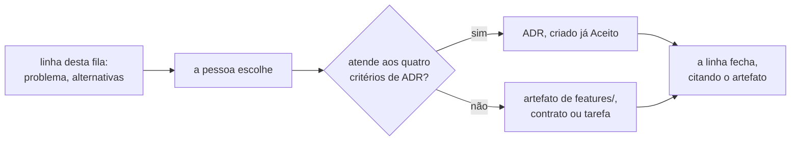

**A poda não acontece antes da decisão.** A pendência de podar as linhas que são
comportamento disfarçado de arquitetura fechou em 2026-08-05, pela decisão `B-2`, por
subsunção: podar hoje é escolher o artefato antes da decisão, que é o oposto da regra
acima. A poda acontece uma linha por vez, quando a pessoa escolhe.

## Como citar uma linha desta fila

**Pelo nome, nunca pela posição.** A posição muda quando uma decisão entra no meio, e
uma citação por posição continua válida depois da inserção — passando a apontar para
outra decisão.

**Por âncora nomeada, nunca por número de linha.** É a decisão `C-1`, de 2026-08-05, com
o slug do GitHub Flavored Markdown fixado por `C-1a`. O verificador
[`scripts/check_citations.py`](../../scripts/check_citations.py) confere as duas formas.

Os números de ADR **não** estão atribuídos nas linhas abertas. Um número é atribuído
quando o ADR é escrito — atribuir antes cria buracos na sequência quando a ordem muda.

## As decisões derivadas do plano

Ordem derivada de [`../plano-do-laboratorio.md`](../plano-do-laboratorio.md). A coluna
`Ordem` é posição na fila, e ela muda.

| Ordem | Decisão                                                      | Estado                                   |
|-------|--------------------------------------------------------------|------------------------------------------|
| 1     | **O passo como unidade de execução, observação e injeção**   | `Aceito` — ADR-0001                      |
| 2     | **O domínio mínimo: contador e predicado de capacidade**     | `Aceito` — ADR-0002                      |
| 3     | **O estatuto da barreira e o diagnóstico da não ocorrência** | `Aceito` — ADR-0004                      |
| 4     | **A linguagem do agendamento**                               | `Aceito` — ADR-0003                      |
| 5     | **A forma do escalonador**                                   | `Aceito` — ADR-0005                      |
| 6     | **Estratégias de concorrência como dado, não como branch**   | `Aceito` — ADR-0006                      |
| 7     | **O log de observações: forma, ordem e onde vive**           | `Aceito` — ADR-0007                      |
| 8     | **Experiment: definição, semente, hipótese e asserções**     | aberta                                   |
| 9     | **Os dois formatos de veredito: booleano e curva**           | aberta                                   |
| 10    | **Arquitetura mínima, stack e guardas executáveis**          | **parcialmente consumida** pelo ADR-0008 |
| 11    | **Entrega contínua no homelab desde o dia zero**             | aberta                                   |

O porquê de cada posição, as questões que cada linha carrega e o histórico de como a
fila chegou a esta ordem estão em [`README.md`](README.md#índice) e nos próprios ADRs. As três
linhas abertas levam o detalhe abaixo.

**Posição 8 — Experiment.** Precisa resolver a tensão entre o Designer na interface e a
definição versionada. [`Q-0002-4`](../questions/Q-0002-4.md) pede aqui o ciclo de vida de
uma execução, [`Q-0003-8`](../questions/Q-0003-8.md) o que `N` conta, e
[`Q-0001-1`](../questions/Q-0001-1.md) a identidade de versão de uma operação.

**Posição 9 — os dois formatos de veredito.** Se ficar para depois, o grupo D não cabe
na arquitetura. [`Q-0002-3`](../questions/Q-0002-3.md) acrescenta o eixo pontual contra
contínuo no tempo, e [`Q-0003-3`](../questions/Q-0003-3.md) pede o que "mesma taxa"
significa numa execução medida.

**Posição 10 — arquitetura mínima.** O
[ADR-0008](0008-os-dois-planos-em-processos-separados.md) fixou dois processos separados
e o pacote raiz. Restam o build, o número de módulos e a guarda que
[`Q-0002-1`](../questions/Q-0002-1.md) pede para as três regras hoje textuais.

**Posição 11 — entrega contínua.** O serviço precisa nascer entregando; a linha ratifica
ou emenda a ADR 0017 do homelab.

## As decisões da rodada de arquitetura de 2026-08-03

Sessenta e seis linhas com identificador `D-*`, agrupadas por bloco. O agrupamento
**não** é o documento que cada assunto vai gerar: esse só existe depois da escolha.

**Três linhas já fecharam** — `D-ARQ-05`, `D-ARQ-06` e `D-ARQ-01`, todas pelo
[ADR-0008](0008-os-dois-planos-em-processos-separados.md). **Quatro mais** — `D-DOM-01` a
`D-DOM-04`, as de vocabulário — fecharam em 2026-08-04, e o Bloco 4 que carregava o
debate delas foi apagado em 2026-08-10, por não ser citado de lugar nenhum. O estado de
cada termo e a lápide de cada uma das quatro decisões vivem em
[`../CONTEXT.md`](../CONTEXT.md). **Uma quinta**, `D-DAT-05`, fechou em 2026-08-05.

### Bloco 0 — sem estas seis, nenhuma linha de código é escrita

São as que a fila de [`README.md`](README.md) enfileira nas
posições 10 e 11, e a exigência de nascer entregando as torna as primeiras.

| ID         | Decisão                                  | Recomendação da proposta                          | Onde                                                                                                         |
|------------|------------------------------------------|---------------------------------------------------|--------------------------------------------------------------------------------------------------------------|
| `D-ARQ-05` | mecanismo de módulo do primeiro artefato | Maven multi-módulo, quatro módulos, mais ArchUnit | [`arquivo/proposta-2026-08-03/modulos-e-fronteiras.md`](arquivo/proposta-2026-08-03/modulos-e-fronteiras.md) |
| `D-ARQ-12` | Maven contra Gradle                      | emendar a ADR 0017 do homelab para Maven          | [`arquivo/proposta-2026-08-03/entrega-continua.md`](arquivo/proposta-2026-08-03/entrega-continua.md)         |
| `D-ARQ-06` | pacote raiz e idioma dos identificadores | `dev.da0hn.lab`, região no primeiro segmento      | [`arquivo/proposta-2026-08-03/modulos-e-fronteiras.md`](arquivo/proposta-2026-08-03/modulos-e-fronteiras.md) |
| `D-ARQ-15` | a forma do `deploy/` no primeiro commit  | `deploy/` mínimo agora, uma réplica               | [`arquivo/proposta-2026-08-03/entrega-continua.md`](arquivo/proposta-2026-08-03/entrega-continua.md)         |
| `D-ARQ-14` | o que o pipeline executa                 | só guardas e provas; experimento sob demanda      | [`arquivo/proposta-2026-08-03/entrega-continua.md`](arquivo/proposta-2026-08-03/entrega-continua.md)         |
| `D-DAT-04` | ferramenta de migração                   | Flyway com SQL versionado                         | [`arquivo/proposta-2026-08-03/modelo-de-dados.md`](arquivo/proposta-2026-08-03/modelo-de-dados.md)           |

**`D-ARQ-05` e `D-ARQ-06` estão fechadas** pelo
[ADR-0008](0008-os-dois-planos-em-processos-separados.md), `Aceito` em
2026-08-04. A escolha não foi a recomendação da linha: o mecanismo de módulo é a
**fronteira de processo**, e não Maven multi-módulo. O pacote raiz `dev.da0hn.lab` com a
região no primeiro segmento foi aceito como recomendado, com os identificadores
**todos** em inglês. As duas linhas permanecem na tabela para que o histórico da
recomendação não se perca.

`D-ARQ-12` é a única com custo fora deste repositório: ela emenda um documento
`Aceito` do [`homelab-infrastructure`](https://github.com/da0hn/homelab-infrastructure).
`D-ARQ-15` fecha o `ComparisonError` que o ArgoCD reporta hoje, e a separação por
processo muda a forma que ela precisa declarar.

### Bloco 1 — destravam o esquema e a primeira migração

| ID         | Decisão                                       | Recomendação da proposta                 |
|------------|-----------------------------------------------|------------------------------------------|
| `D-DAT-01` | tipo e derivação da coluna de identidade      | `bigint` ordinal da semente              |
| `D-DAT-02` | chave estrangeira de `allocation.resource_id` | sem FK no MVP                            |
| `D-DAT-03` | índice sobre `allocation(resource_id)`        | criar, e registrar o plano efetivo       |
| `D-DAT-05` | como o banco volta ao ponto de partida        | decidida em 2026-08-05: não há reset     |
| `D-DOM-14` | dono da identidade derivada da semente        | o experimento publica; o domínio consome |
| `D-DOM-13` | o esquema compartilhado entre os dois planos  | Shared Kernel com contrato verificável   |

`D-DAT-02` tem a justificativa mais afiada da rodada: com chave estrangeira, o
`INSERT` de uma alocação toma `FOR KEY SHARE` na linha do recurso e conflita com
o `FOR UPDATE` do `PESSIMISTIC` — uma restrição de integridade mudaria o
fenômeno medido.

`D-DAT-05` recomendava `TRUNCATE` antes de cada execução até 2026-08-05, quando uma
quarta candidata entrou — pôr a execução na chave primária, preservando todo o
histórico — e `P-DAT-9` mostrou que a objeção de `Q-0002-4` contra preservar linhas
entre execuções não se sustenta sobre nenhum dos dois critérios de igualdade aceitos.
**O usuário decidiu na mesma data: não há reset.** A chave primária das duas tabelas
passa a incluir um discriminador UUIDv7, gerado pelo Lab Plane e propagado a tudo que o
sistema medido publica, com o crescimento das tabelas aceito. A linha permanece aqui
para que o histórico da recomendação não se perca; a decisão e o que ela deixa em aberto
estão em [`arquivo/proposta-2026-08-03/modelo-de-dados.md`](arquivo/proposta-2026-08-03/modelo-de-dados.md), seção 7, `D-DAT-05`, `P-DAT-10` e
`P-DAT-11`.

### Bloco 2 — destravam o E1 e a etapa 1

| ID         | Decisão                                  | Recomendação da proposta                            |
|------------|------------------------------------------|-----------------------------------------------------|
| `D-ARQ-04` | modelo de thread do worker               | threads de plataforma no MVP                        |
| `D-ARQ-07` | o que verifica cada classe de regra      | compilação para região; ArchUnit para o resto       |
| `D-ARQ-08` | onde vivem o relógio e a fonte semeada   | isenção posicional, sem anotação de supressão       |
| `D-ARQ-09` | a forma da guarda da chave de contenção  | recusa na primeira passagem                         |
| `D-DAT-08` | como o nível de isolamento é aplicado    | `TransactionTemplate`, pelo runtime                 |
| `D-DAT-09` | verificação de "uma conexão por worker"  | tamanho de pool mais asserção de PID distinto       |
| `D-DOM-07` | `Allocation` é agregado próprio          | agregado próprio                                    |
| `D-DOM-08` | onde vive `Σ amount ≤ capacity`          | no oráculo, como invariante observada               |
| `D-DOM-15` | quais fronteiras a stack materializa     | só system under test / Lab Plane, imposta por teste |
| `D-UI-02`  | onde o frontend renderiza                | exportação estática                                 |
| `D-UI-03`  | framework de componentes                 | shadcn/ui sobre Radix                               |
| `D-UI-04`  | eixo padrão da timeline                  | posição no log, com arestas causais                 |
| `D-UI-06`  | teto de eventos no navegador             | paginação contra o servidor                         |
| `D-UI-07`  | autenticação e autoria                   | nenhuma, declarada; autoria vinda do commit         |
| `D-UI-08`  | o que o `POST` cria                      | a sequência de execuções, não uma                   |
| `D-UI-09`  | mecanismo de streaming                   | SSE, com limiar numérico proposto                   |
| `D-UI-10`  | idempotência de iniciar execução         | chave obrigatória do cliente                        |
| `D-UI-11`  | vocabulário do contrato                  | português, igual ao glossário                       |
| `D-UI-12`  | compatibilidade e enumeração do veredito | enumeração aberta, cliente falha fechado            |

`D-ARQ-07` e `D-ARQ-08` são a resposta proposta a
[`Q-0002-1`](../questions/Q-0002-1.md), que pede a guarda executável das três
regras hoje textuais. `D-ARQ-09` responde
[`Q-0004-2`](../questions/Q-0004-2.md).

`D-DOM-07` e `D-DOM-08` carregam a descoberta conceitual da rodada: **o
agregado clássico do DDD é antipadrão aqui.** Um `Resource` que impusesse
`Σ amount ≤ capacity` na fronteira transacional tornaria o E5 irreproduzível,
pelo mesmo argumento com que o ADR-0002 descartou a constraint no banco —
confundir observar com impedir (`0002-...md:566-574`).

### Bloco 3 — pertencem a um ADR já enfileirado, e a recomendação é não decidir agora

| ID         | Decisão                                  | Destino na fila de ADRs                                       |
|------------|------------------------------------------|---------------------------------------------------------------|
| `D-DOM-06` | o que `N` conta                          | Experiment, posição 8; [`Q-0003-8`](../questions/Q-0003-8.md) |
| `D-DOM-09` | se `Experimento` é raiz das execuções    | Experiment, posição 8                                         |
| `D-DAT-07` | onde vive a definição de experimento     | Experiment, posição 8                                         |
| `D-UI-01`  | fonte de verdade da definição            | Experiment, posição 8                                         |
| `D-DOM-05` | se `veredito` vira quatro termos         | formatos de veredito, posição 9                               |
| `D-DOM-16` | se o modelo reserva lugar para a curva   | formatos de veredito, posição 9                               |
| `D-DOM-10` | se o log é agregado próprio              | gatilho na etapa 6                                            |
| `D-DOM-12` | se a injeção de falha é contexto próprio | gatilho na etapa 6                                            |

Aprovar qualquer uma destas **antecipa um ADR enfileirado**, e é a forma mais
provável de esta rodada causar dano. A recomendação de cada uma é adiar.

Duas das oito são decisões de vocabulário, e o debate delas foi trazido de
[`../CONTEXT.md`](../CONTEXT.md) em 2026-08-07, quando o glossário voltou a ser só
glossário. As outras quatro do mesmo conjunto — `D-DOM-01` a `D-DOM-04` — fecharam em
2026-08-04, e o Bloco 4 que as carregava saiu desta fila em 2026-08-10. **`D-DOM-05` e
`D-DOM-06` continuam abertas**, e nada abaixo as fecha: o que veio do glossário é o
enunciado, as alternativas e a recomendação de cada uma.

#### D-DOM-05 — Se `verdict` vira quatro termos

**Trazido de [`../CONTEXT.md`](../CONTEXT.md) em 2026-08-07**, da seção `D-DOM-05`, que
lá virou lápide. O texto é o de lá, com o nível de título rebaixado.

**O problema.** `verdict` nomeia a taxa de violação (`0004:112-113`), o rótulo da
classificação do zero (`0004:206-218`), o booleano do predicado de capacidade
(`0002:186-190`) e a curva do grupo D, que não tem forma decidida (`plano:226-229`).

**Alternativa A — quatro termos distintos.** A favor: cada formato ganha nome, e a
tabela comparativa do E3 deixa de misturar coisas diferentes na mesma coluna. Contra:
antecipa a decisão da posição 9 da fila, que é justamente sobre como os formatos
convivem.

**Alternativa B — um termo com formato declarado.** A favor: o glossário fica estável
enquanto a decisão dos formatos não é tomada, e o relatório declara o formato ao lado do
número. Contra: quem lê um relatório precisa ler duas coisas para entender uma.

**Alternativa C — adiar até a fila resolver.** A favor: nenhum termo nasce antes da
decisão que o fixa. Contra: os quatro Feature Cards já usam a palavra, e o adiamento
mantém a ambiguidade em documentos vivos.

**Recomendação.** Alternativa B, com revisão obrigatória quando a decisão dos dois
formatos de veredito for tomada.

**Se a escolha for outra.** Com a alternativa A, o E4 ganha vocabulário antes de ter
card, e o motivo registrado em `features/README.md:35-51` deixa de valer.

#### D-DOM-06 — O que `N` conta

**Trazido de [`../CONTEXT.md`](../CONTEXT.md) em 2026-08-07**, da seção `D-DOM-06`, que
lá virou lápide. O texto é o de lá, com o nível de título rebaixado e o caminho de
`Q-0003-8` reescrito de `docs/` para `docs/adr/`. A frase "este glossário não escolhe"
fala de [`../CONTEXT.md`](../CONTEXT.md), e não desta fila.

**O problema.** [`Q-0003-8`](../questions/Q-0003-8.md) mostra que as duas leituras de `N`
quebram em pontos diferentes. Se `N` conta `attempt` do ADR-0001, ele inclui retries, e
o número de retries é resultado da execução. Se conta `operation execution`, a taxa de
aborto deixa de enxergar o trabalho descartado, que é o que ela existe para mostrar.

**Alternativa A — `N` conta `attempt` do ADR-0001.** A favor: é a leitura literal de
`launched attempt` no ADR-0004. Contra: sob `OPTIMISTIC` o número não é declarável antes
de executar, e o E3 e o E4 rodam `OPTIMISTIC`.

**Alternativa B — `N` conta `operation execution`.** A favor: é declarável antes.
Contra: a taxa de aborto de uma execução que falha duas vezes e comete na terceira é
zero, e a justificativa do ADR-0004 diz que essa taxa existe para mostrar o trabalho
descartado.

**Alternativa C — dois números, um declarado e um observado.** A favor: cada um mede o
que sabe medir. Contra: exige um ADR que substitua a contagem de um ADR aceito, e
`Q-0003-8` registra essa possibilidade sem escolhê-la.

**Recomendação.** Manter a pergunta aberta e citá-la por `Q-0003-8` até a decisão
`Experiment`. Este glossário não escolhe.

**Se a escolha for outra.** Qualquer das três muda o significado da taxa de aborto na
tabela comparativa do E3, que é um resultado já especificado em Feature Card.

### Bloco 5 — etapa 4 e adiante, sem gatilho disparado hoje

| ID         | Decisão                                      | Etapa | Recomendação da proposta                 |
|------------|----------------------------------------------|-------|------------------------------------------|
| `D-ARQ-01` | seguir o gatilho ou antecipar serviços       | 4     | seguir o gatilho                         |
| `D-ARQ-03` | onde o Lab Plane vive com dois processos     | 4     | decidir quando a etapa 4 tiver gatilho   |
| `D-ARQ-11` | PostgreSQL dedicado ou compartilhado         | 0     | dedicado                                 |
| `D-ARQ-13` | experimento destrutivo sob `selfHeal`        | 6     | matar a operação, preservando o processo |
| `D-ARQ-10` | Toxiproxy                                    | —     | emendar a ADR 0017 e retirar             |
| `D-DAT-06` | onde o log durável vive                      | 6     | instância separada da medida             |
| `D-DAT-10` | o que do log entra no Git                    | 6     | relatório mais eventos restritos         |
| `D-DAT-11` | instância e `wal_level` se o CDC entrar      | —     | dedicada                                 |
| `D-UI-05`  | onde vive o desenho pedagógico               | 1     | só no controle positivo                  |
| `D-UI-13`  | como o relatório chega a `docs/experiments/` | 1     | download e commit por pessoa             |

`D-ARQ-01` é a decisão que responde diretamente à instrução de usar
microsserviços: a proposta recomenda **seguir o gatilho**, isto é, começar com um
artefato e decompor quando o experimento `JVM_LOCK` ficar vermelho com duas
instâncias. Aprovar o contrário é legítimo e tem custo nomeado no documento.

**`D-ARQ-01` está fechada, contra a recomendação**, pelo
[ADR-0008](0008-os-dois-planos-em-processos-separados.md). A decomposição deixou
de esperar o gatilho da etapa 4: os dois planos rodam em processos separados desde o dia
zero. `D-ARQ-03` continua aberta e muda de sentido — ela deixa de perguntar onde o Lab
Plane vive quando existirem dois processos e passa a perguntar o que muda quando o
system under test ganhar a segunda instância.

### Bloco 6 — mensageria, etapa 5 e adiante

Nenhuma destas tem gatilho disparado hoje. Elas existem para que a etapa 5 não
comece sem desenho, e **nenhuma delas deve ser construída antes do gatilho**.

| ID         | Decisão                                      | Recomendação da proposta                    |
|------------|----------------------------------------------|---------------------------------------------|
| `D-MSG-01` | gatilho concreto que libera o RabbitMQ       | broker real, pelo mecanismo da reentrega    |
| `D-MSG-02` | como uma entrega duplicada é contada         | contagem nova de comandos distintos aceitos |
| `D-MSG-03` | quem carimba os atributos de extensão        | o runtime, na fronteira                     |
| `D-MSG-04` | modo do binding CloudEvents e versão do AMQP | binário sobre 0-9-1, mapeamento declarado   |
| `D-MSG-05` | que recursos do broker ficam desligados      | nenhum DLX e nenhum limite até a etapa 8    |
| `D-MSG-06` | confirmação de publicador                    | ligada, com braço de comparação desligado   |
| `D-MSG-07` | se o broker é fonte legítima do oráculo      | é fonte só depois da quiescência            |
| `D-MSG-08` | ciclo de vida de uma reentrega               | execução nova, com ADR novo sobre o log     |
| `D-MSG-09` | quem cria e destrói a topologia              | por execução                                |
| `D-MSG-10` | se o CDC com Debezium entra                  | **não entra**; gatilhos registrados         |
| `D-MSG-11` | barreira contra o limite de confirmação      | declarar o limite por execução e reportá-lo |

`D-MSG-05` é a que mais contraria a intuição: a proposta recomenda **desligar**
DLX e limite de entregas até a etapa 8, porque com eles ligados os cenários 18 e
19 não têm o que mostrar. É a regra pedagógica aplicada à configuração do broker.

`D-MSG-10` é a resposta à instrução sobre Debezium. O argumento decisivo não é de
custo: o CDC **apaga os pontos `BEFORE_PUBLISH` e `AFTER_PUBLISH` do ADR-0001**,
porque sem passo `PUBLISH` na operação a etapa 6 perde o gatilho que o plano lhe
dá (`../plano-do-laboratorio.md:609`). Os dois gatilhos que criariam o CDC estão
registrados em [`arquivo/proposta-2026-08-03/mensageria.md`](arquivo/proposta-2026-08-03/mensageria.md).

### As duas linhas sem bloco, classificadas em 2026-08-05

`D-ARQ-02` e `D-DOM-11` têm seção própria no documento-fonte e não apareciam em bloco
nenhum: é a diferença entre 64 e 66 que a decisão `B-5` fechou. **As duas continuam
abertas** — `B-5` classificou, e não decidiu.

| ID         | Decisão                               | Assunto                     | Onde                                                                                                                                                          |
|------------|---------------------------------------|-----------------------------|---------------------------------------------------------------------------------------------------------------------------------------------------------------|
| `D-ARQ-02` | onde a interface web é construída     | Entrega contínua no homelab | [`arquivo/proposta-2026-08-03/arquitetura-alvo.md`](arquivo/proposta-2026-08-03/arquitetura-alvo.md#d-arq-02--onde-a-interface-web-é-construída-e-empacotada) |
| `D-DOM-11` | se o escalonamento é contexto próprio | Bloco 4, vocabulário        | [`arquivo/proposta-2026-08-03/modelo-de-dominio.md`](arquivo/proposta-2026-08-03/modelo-de-dominio.md#d-dom-11--se-o-escalonamento-é-contexto-próprio)        |

`D-ARQ-02` entrou em "Entrega contínua no homelab" porque fixa o `Dockerfile` e o número
de imagens do dia zero. `D-DOM-11` entrou no Bloco 4 porque ela nomeia um contexto de
vocabulário: `scheduling` é um dos seis contextos propostos, listados abaixo em
[Os contextos propostos](#os-contextos-propostos). **A justificativa mudou de evidência
em 2026-08-07, e não de conclusão**: até aquela data ela dizia que
[`../CONTEXT.md`](../CONTEXT.md) carregava o termo `scheduling` como `proposto` por
`D-DOM-11`, e o termo saiu do glossário junto com os outros cinco contextos. A
classificação da linha não muda, e ela continua aberta.

### Os contextos propostos

**Trazido de [`../CONTEXT.md`](../CONTEXT.md) em 2026-08-07**, da seção
`### Os contextos propostos`, que lá virou lápide. O texto é o de lá, com os caminhos
relativos reescritos de `docs/` para `docs/adr/`; "nesta proposta" nomeia a proposta de
vocabulário do glossário. **Nenhum dos seis tem decisão**, e absorver o texto não fecha
linha nenhuma. A entrada `observed invariant`, que vivia sob o mesmo título, **ficou** no
glossário: ela é termo, e não contexto.

Os seis nomes abaixo nascem nesta proposta e nomeiam bounded contexts, não módulos nem
processos. O desenho está em
[`arquivo/proposta-2026-08-03/modelo-de-dominio.md`](arquivo/proposta-2026-08-03/modelo-de-dominio.md).

**measured domain** — `proposto` (`D-DOM-07`)
O contexto do system under test: `Resource`, `Allocation`, `increment`, `allocate` e as
estratégias. Ele não conhece as palavras experimento, veredito nem coincidência.

**execution runtime** — `proposto` (`D-DOM-12`)
O contexto que constrói e executa as sequências de passos, cria o escopo de execução e
emite observações.

**scheduling** — `proposto` (`D-DOM-11`)
O contexto que declara e executa o agendamento: papel, carga, restrição de precedência,
encontro, chegada, travessia, término e desistência.

**observation record** — `proposto` (`D-DOM-10`)
O contexto do log e da timeline. Ele adota o vocabulário do runtime e do escalonamento
sem acrescentar significado.

**diagnosis** — `proposto` (`D-DOM-08`)
O contexto dos oráculos, das contagens, da janela de exposição, das coincidências e da
classificação do zero.

**experiment definition** — `proposto` (`D-DOM-09`), sem dono decidido
O contexto que declara o que uma execução roda antes de rodar. A decisão está na fila,
posição 8.

**Pergunta em aberto: dois dos seis identificadores não batem com o documento-fonte.** A
lista acima dá `D-DOM-07` a `measured domain` e `D-DOM-12` a `execution runtime`, e
[`arquivo/proposta-2026-08-03/modelo-de-dominio.md`](arquivo/proposta-2026-08-03/modelo-de-dominio.md)
enuncia `D-DOM-07` como "`Allocation` é agregado próprio ou membro de `Resource`" e
`D-DOM-12` como "Se a injeção de falha é contexto próprio" — que é um contexto sem nome
nesta lista. Os outros quatro correspondem. Qual das duas atribuições vale **não foi
decidido**, e este registro não a decide.

### O agrupamento por assunto

A tabela abaixo agrupa as linhas por assunto, e não por bloco. Ela existe porque os três
primeiros assuntos vinham colados numa linha só da fila derivada do plano: a posição 10.

| Assunto                                        | Linhas                                                                                          |
|------------------------------------------------|-------------------------------------------------------------------------------------------------|
| Experimento: definição, semente, ciclo de vida | Bloco 3, mais `D-DAT-05`, `D-UI-08` e `D-UI-10`                                                 |
| Formatos de veredito                           | `D-DOM-05` e `D-DOM-16`                                                                         |
| A forma do artefato compilável                 | `D-ARQ-05`, `D-ARQ-06`, `D-ARQ-04`                                                              |
| A guarda executável das três regras            | `D-ARQ-07`, `D-ARQ-08`, `D-ARQ-09`, `D-DOM-15`                                                  |
| O esquema e a primeira migração                | `D-DAT-01` a `D-DAT-04`, `D-DAT-08`, `D-DAT-09`, `D-DOM-07`, `D-DOM-08`, `D-DOM-13`, `D-DOM-14` |
| Entrega contínua no homelab                    | `D-ARQ-12`, `D-ARQ-14`, `D-ARQ-15`, `D-ARQ-10`, `D-ARQ-11`, `D-ARQ-13`, `D-ARQ-02`              |
| Vocabulário                                    | Bloco 4, mais `D-DOM-11`, com destino em [`../CONTEXT.md`](../CONTEXT.md)                       |
| Mensageria, sem gatilho hoje                   | Bloco 6                                                                                         |
| Interface web                                  | `D-UI-02` a `D-UI-13`, menos as que o Bloco 3 absorve                                           |

## A ordem da arquitetura mínima e da entrega contínua está sob tensão

O laboratório é entregue no cluster do
[`homelab-infrastructure`](https://github.com/da0hn/homelab-infrastructure), e a
exigência é que um serviço **nasça já entregando** — pipeline e CI/CD no mesmo commit
que cria o módulo, não retrofitados depois.

Isso não move o passo: o formato dele não afeta o que o pipeline empacota. Mas move a
arquitetura mínima e a entrega contínua para **junto do primeiro módulo compilável**, e
as decisões entre o domínio mínimo e os vereditos deixam de ser pré-requisito de
escrever código de esqueleto. O `Dockerfile` e o `deploy/kustomization.yaml` fixam o
número de módulos e a forma do artefato — que é o conteúdo da arquitetura mínima.

A entrega contínua tem uma particularidade que nenhuma outra tem: **parte dela já foi
tomada fora deste repositório.** A ADR 0017 do homelab, aceita em 2026-07-26, escolheu
Gradle, Toxiproxy e "microsserviços JVM" para este laboratório, dois dias antes do
replanejamento que descartou a arquitetura de serviços. Ratificar ou emendar é decisão
consciente e explícita. O inventário completo do que sobrevive e do que colide está em
[`../plano-do-laboratorio.md`](../plano-do-laboratorio.md), seção 12.

## A5 — a sigla `SUT` no código, decidida em 2026-08-05

**Trazido de [`../CONTEXT.md`](../CONTEXT.md) em 2026-08-07**, da seção
[`## A sigla SUT no código, decidida em 2026-08-05`](../CONTEXT.md#a-sigla-sut-no-código-decidida-em-2026-08-05).
**A regra ficou lá**, porque o
[ADR-0009](0009-a-classificacao-do-dual-write-e-a-regiao-de-pacote.md) aponta para o
glossário como fonte dela: em prosa, `system under test` por extenso; em identificador de
código, `sut`. O que veio para cá é o que a fila é dona — a **justificativa** da separação
e as **alternativas descartadas**. "Esta seção", "o glossário" e "este glossário" abaixo
nomeiam [`../CONTEXT.md`](../CONTEXT.md).

**Por que a separação precisou ser declarada.** A escolha do pacote se justifica dizendo
que o glossário já define o termo por extenso, enquanto a entrada `system under test`
lista `SUT` sob `_Evite_`, "por ser sigla sem expansão". Sem esta seção, o ADR que fixa
o pacote e o glossário nascem se contradizendo — e a contradição estaria dentro de um ADR
aceito, onde ninguém pode corrigi-la.

Descartadas: rever o nome do pacote, por reabrir uma decisão do dia anterior e trazer de
volta três alternativas já descartadas; e registrar como pergunta em aberto, por fazer o
ADR nascer carregando contradição conhecida com este glossário.

**Uma premissa do parágrafo acima caiu em 2026-08-07, e a decisão não.** "Onde ninguém
pode corrigi-la" valia enquanto o corpo de um ADR aceito era imutável; hoje um erro
material de texto é corrigível por patch, pela decisão registrada em
[A imutabilidade do corpo de um ADR aceito, revogada em 2026-08-07](#a-imutabilidade-do-corpo-de-um-adr-aceito-revogada-em-2026-08-07).
O que
`A5` escolheu continua valendo, e o texto de 2026-08-05 fica como está.

## O Lote E, enumerado em 2026-08-06

Os Lotes A a D fecharam pendências de **processo**: onde a fila vive, quem aprova o quê,
como uma citação é escrita, o que acontece com a rodada de arquitetura arquivada. Nenhum
deles destrava uma linha de código. **Este destrava, e é o único que destrava.**

O Lote E é a interseção de três coisas que a fila tinha separadas: a posição 10
(arquitetura mínima), a posição 11 (entrega contínua) e o Bloco 1 (esquema e primeira
migração). A exigência de nascer entregando as junta — o `Dockerfile` e o
`deploy/kustomization.yaml` fixam a forma do artefato, e a forma do artefato **é** o
conteúdo da arquitetura mínima.

### Grupo I — sem estas seis, não existe `pom.xml`

| ID    | Decisão                                          | Origem     | Recomendação da proposta              |
|-------|--------------------------------------------------|------------|---------------------------------------|
| `E-1` | build: Maven contra Gradle                       | `D-ARQ-12` | emendar a ADR 0017 para Maven         |
| `E-2` | quantos artefatos executáveis, e quantos módulos | `D-ARQ-05` | **vencida** pelo ADR-0008; ver abaixo |
| `E-3` | a forma do `deploy/` no primeiro commit          | `D-ARQ-15` | `deploy/` mínimo agora, uma réplica   |
| `E-4` | o que o pipeline executa                         | `D-ARQ-14` | só guardas e provas                   |
| `E-5` | PostgreSQL dedicado contra compartilhado         | `D-ARQ-11` | dedicado ao namespace do laboratório  |
| `E-6` | onde a interface web é construída                | `D-ARQ-02` | exportação estática na mesma imagem   |

As alternativas de cada uma, com o argumento a favor e contra, estão em
[`entrega-continua.md`](arquivo/proposta-2026-08-03/entrega-continua.md#d-arq-12--maven-contra-gradle)
para `E-1`, `E-3`, `E-4` e `E-5`, e em
[`arquitetura-alvo.md`](arquivo/proposta-2026-08-03/arquitetura-alvo.md#d-arq-02--onde-a-interface-web-é-construída-e-empacotada)
para `E-6`.

### Grupo II — sem estas sete, não existe a primeira migração

| ID     | Decisão                                          | Origem     | Recomendação da proposta              |
|--------|--------------------------------------------------|------------|---------------------------------------|
| `E-7`  | ferramenta de migração                           | `D-DAT-04` | Flyway com SQL versionado             |
| `E-8`  | tipo e derivação da identidade do recurso        | `D-DAT-01` | `bigint` ordinal da semente           |
| `E-9`  | chave estrangeira de `allocation.resource_id`    | `D-DAT-02` | sem FK no MVP                         |
| `E-10` | índice sobre `allocation(resource_id)`           | `D-DAT-03` | criar, e registrar o plano efetivo    |
| `E-11` | quem deriva a identidade a partir da semente     | `D-DOM-14` | a definição publica, o domínio deriva |
| `E-12` | a guarda do filtro por discriminador             | `P-DAT-12` | nenhuma; a escolha não foi feita      |
| `E-13` | quem gera o UUIDv7, contra as regras estruturais | `P-DAT-10` | nenhuma; a tensão não foi fechada     |

`E-7` a `E-11` estão em
[`modelo-de-dados.md`](arquivo/proposta-2026-08-03/modelo-de-dados.md#d-dat-04--ferramenta-de-migração)
e em
[`modelo-de-dominio.md`](arquivo/proposta-2026-08-03/modelo-de-dominio.md#d-dom-14--quem-é-dono-da-identidade-derivada-da-semente).
`E-12` e `E-13` estão na seção
[`Perguntas em aberto`](arquivo/proposta-2026-08-03/modelo-de-dados.md#perguntas-em-aberto)
do mesmo documento, e **nunca estiveram em bloco nenhum** — elas nasceram como
consequência de `D-DAT-05`, decidida em 2026-08-05, depois de os blocos existirem.

### As decisões do grupo I, em 2026-08-06

| ID    | Escolha                                                          | Seguiu a recomendação? |
|-------|------------------------------------------------------------------|------------------------|
| `E-1` | Maven, emendando a ADR 0017 do homelab                           | sim                    |
| `E-2` | três módulos e dois executáveis, com o nome corrigido para `sut` | parcialmente           |
| `E-3` | **adiada**, por escolha explícita                                | —                      |
| `E-5` | PostgreSQL compartilhado do homelab, com schema por aplicação    | **não**                |
| `E-7` | Flyway, fechada por consequência de `E-5`                        | sim                    |

**`E-1` — Maven.** A emenda à ADR 0017 do `homelab-infrastructure` é custo aceito, e ela
é o único item deste lote com efeito fora deste repositório. `Q-INT-4` fecha com ela.

**`E-2` — o nome `control-plane` estava vencido, e a pergunta o repetiu.** A
[emenda do ADR-0009](0009-a-classificacao-do-dual-write-e-a-regiao-de-pacote.md) trocou
a região `dev.da0hn.lab.controlplane` por `dev.da0hn.lab.sut`, e `D-DOM-02` aposentou
`Control Plane` da linguagem. O módulo é `sut`, e não `control-plane`. A sigla é
permitida em identificador de código pela decisão `A5`, registrada em
[`../CONTEXT.md`](../CONTEXT.md#a-sigla-sut-no-código-decidida-em-2026-08-05) — em prosa
continua `system under test` por extenso.

**`E-3` — adiada.** O `ComparisonError` no ArgoCD permanece, e a exigência da ADR 0017
de nascer entregando fica pendente junto. A linha continua aberta nesta fila; nada mais
neste lote depende dela, porque o build e o esquema não leem o `deploy/`.

### `E-5`, decidida contra a recomendação, e o que ela arrasta

A escolha é a alternativa 2 de `D-ARQ-11`: **o PostgreSQL que o homelab já opera na
Camada 6**, com desenvolvimento local num contêiner. **Cada aplicação aplica a própria
migração, no próprio schema.**

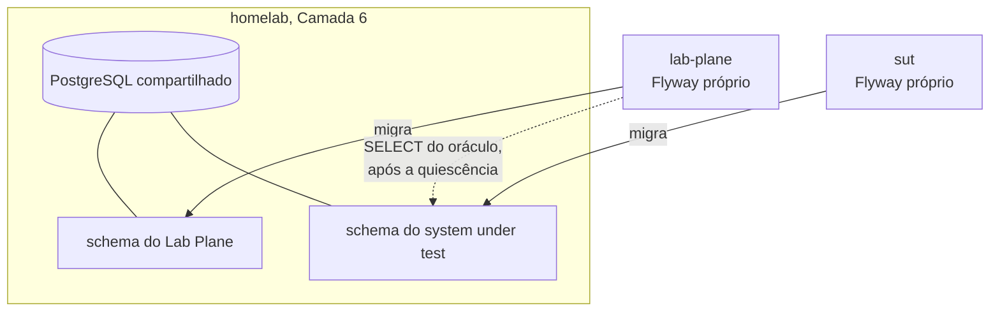

**Ela fecha uma pergunta em aberto do ADR-0008.** Aquele ADR registra que a escolha
entre schema separado e dois bancos na mesma instância não fora feita, e que ela decide
permissão e espaço de nomes — nunca contaminação da medida, porque dois schemas do mesmo
cluster compartilham buffer pool, WAL, checkpointer, autovacuum e a tabela de locks. A
escolha é **schemas separados na mesma instância**.

**O custo nomeado pela própria alternativa passa a valer.** A contenção de conexões, de
CPU e de I/O atravessa a fronteira do banco lógico. O relatório de todo experimento
DEVE registrar que a medida foi feita num banco com vizinhos; sem isso, dois relatórios
com o mesmo veredito afirmam coisas diferentes. `Q-INT-3` fecha com a alternativa 2 e
esta obrigação.

**Ela dá forma concreta a `D-DOM-13`.** O Shared Kernel entre os planos deixa de ser
abstrato: o oráculo do Lab Plane lê as tabelas do schema do system under test, então o
papel do Lab Plane precisa de `USAGE` naquele schema e `SELECT` nas duas tabelas. A
fronteira que `Q-INT-5` pedia com forma verificável é uma concessão de permissão, e ela
é declarável e testável.

**Ela fecha `E-7` por consequência.** Migração por aplicação exige ferramenta de
migração, e a escolha é Flyway com SQL versionado — um arquivo por decisão aceita, nunca
editado depois de aplicado. Com isso `D-DOM-13` fecha junto: o arquivo de migração passa
a ser o contrato, e o Markdown não pode repeti-lo.

**Ela acrescenta um artefato que este repositório declara não ter.** Um contêiner local
significa `compose.yaml` versionado, e o [`../../AGENTS.md`](../../AGENTS.md) afirma hoje
que não existe `docker-compose.yml` nem comando de execução. A afirmação deixa de valer
no commit que criar o arquivo, e o texto muda junto.

**Pergunta em aberto: o Lab Plane não tem tabela nenhuma hoje.** O
[ADR-0007](0007-o-log-de-observacoes-forma-ordem-e-onde-vive.md) mantém o log em memória
e fixa a etapa 6 como o gatilho da persistência durável. Um Flyway no `lab-plane` no dia
zero teria zero migrações. Se o módulo já carrega a ferramenta com o diretório vazio, ou
se ela entra quando a primeira tabela existir, **não foi decidido**.

### A quarta rodada, em 2026-08-06: uma contradição com ADR aceito

**Estado:** `fechada`, em 2026-08-06.
**Absorvida por:** [ADR-0011](0011-a-topologia-de-servicos-e-o-caderno-de-laboratorio-fora-do-git.md#o-caderno-de-laboratório-sai-do-git)
(`E-16`, `E-17`) e [ADR-0010](0010-a-fronteira-de-schema-e-o-cdc-como-fonte-do-veredito.md#decisão) (`E-18`).

### A quinta rodada, em 2026-08-06: o CDC, conferido

**Estado:** `fechada`, em 2026-08-06.
**Absorvida por:** [ADR-0011](0011-a-topologia-de-servicos-e-o-caderno-de-laboratorio-fora-do-git.md#cinco-serviços-e-o-quatro-do-agentsmd-deixa-de-valer)
(`E-15`, `E-20`) e [ADR-0010](0010-a-fronteira-de-schema-e-o-cdc-como-fonte-do-veredito.md#decisão) (`E-19`).

#### `E-19` — ao vivo, e a tensão com o ADR-0008

**Estado:** `fechada`, em 2026-08-06. A saída não escolhida segue aberta em
[`E-36`](#e-36--a-emissão-ao-vivo-entra-na-janela-que-o-experimento-mede).
**Absorvida por:** [ADR-0010](0010-a-fronteira-de-schema-e-o-cdc-como-fonte-do-veredito.md#decisão).

### A sexta rodada, em 2026-08-06: o CDC vira fonte do veredito

**Estado:** `fechada`, em 2026-08-06.
**Absorvida por:** [ADR-0010](0010-a-fronteira-de-schema-e-o-cdc-como-fonte-do-veredito.md#decisão)
(`E-18`) e [ADR-0011](0011-a-topologia-de-servicos-e-o-caderno-de-laboratorio-fora-do-git.md#comando-no-lab-plane-leitura-no-lab-journal-sem-bff)
(`E-20`).

### `E-21`: pular o build do módulo que não mudou, aberto em 2026-08-06

Metade deste assunto já fechou sem decisão, porque não havia alternativa a debater. O
[`Dockerfile`](../../Dockerfile) copiava os quatro `src/` numa camada só e construía o
reactor inteiro uma vez por imagem; como as três imagens Java partilham o arquivo, uma
mudança em qualquer módulo alterava o hash daquela camada nas três e invalidava o cache
de todas. O `cache-from: type=gha` do workflow existia e nunca era aproveitado entre
commits. Hoje `shared` é camada própria e cada imagem compila só o módulo pedido —
medido com Docker 29.5.3, tocar `lab-plane/src` deixa o build de `lab-journal` inteiro
em cache.

**O que sobra é decisão, e é isto: pular o job do módulo intocado.** Os quatro jobs da
matriz continuam rodando sempre. O do módulo que não mudou agora é barato, mas não é
grátis — ele resolve o cache, exporta um manifesto idêntico ao anterior e ocupa um
runner.

**O obstáculo não é o GitHub Actions, é a regra de tag.** A tag é o SHA do commit, e o
motivo está escrito no próprio workflow: uma tag móvel torna impossível dizer qual
imagem produziu um resultado de experimento, que é a propriedade que este repositório
existe para ter. Um job pulado deixa `ghcr.io/.../<módulo>:<sha>` sem existir, e todo
manifest que referencie o SHA do commit para os quatro serviços aponta para o vazio.

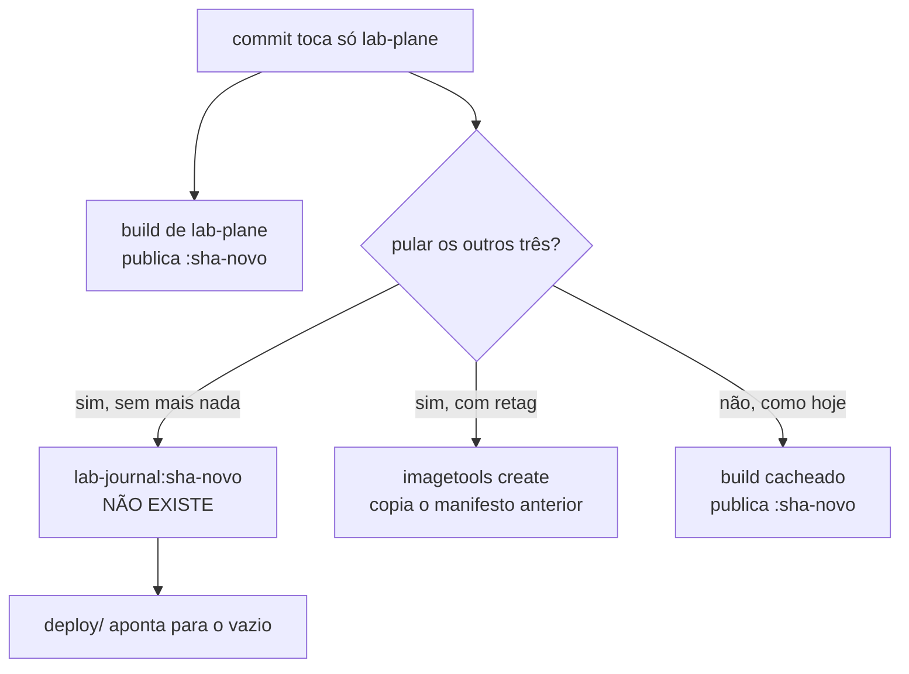

| Alternativa                        | A favor                                          | Contra                                            |
|------------------------------------|--------------------------------------------------|---------------------------------------------------|
| 1. matriz dinâmica com retag       | todo SHA continua tendo as quatro imagens        | achar o SHA anterior depende de retenção no GHCR  |
| 2. matriz dinâmica, tag por módulo | mais barato e mais honesto                       | transfere a complexidade inteira para `E-3`       |
| 3. não fazer nada                  | zero mecanismo novo; a regra de tag fica intacta | um job redundante por módulo intocado, por commit |

**A recomendação é a 3, e o motivo é que não há número.** Nenhum job de imagem completou
no GitHub até hoje, e o tempo de construção de uma imagem continua desconhecido.
Escolher entre 1 e 2 antes da primeira medição é optar pela complexidade no escuro. E a
alternativa 2 decide na prática a forma da tag, que é conteúdo de `E-3` — adiada por
escolha explícita na mesma data.

**Gatilho que reabre esta linha:** a primeira execução real do workflow produzir um
tempo de build, ou `E-3` fechar. O que vier primeiro.

**Por que ainda não há número, e o motivo não é deste repositório.** Em 2026-08-06 os
dois workflows passaram a executar — o `docs` fechou verde em 7s, e no `build` o job
`provas` obteve runner e `mvn verify` passou em 1m16s. Os quatro jobs `imagem`, que
rodam em paralelo depois dele, ficaram quinze minutos na fila e terminaram com
`The job was not acquired by Runner of type hosted even after multiple attempts`. Uma
reexecução passou mais de quarenta minutos sem sequer criar os jobs, e o cancelamento
foi recusado com `Cannot cancel a workflow re-run that has not yet queued` enquanto a
API do próprio run continuava a reportar `queued` — dois subsistemas do GitHub
discordando sobre o mesmo objeto. A causa é incidente de plataforma no GitHub Actions,
reportado em [`githubstatus.com`](https://www.githubstatus.com/) na mesma data. Nada
neste repositório o provoca e nada aqui o resolve; a medição espera o serviço
normalizar.

### A primeira rodada do grupo II, em 2026-08-06

| ID     | Escolha                                                   | Seguiu a recomendação? |
|--------|-----------------------------------------------------------|------------------------|
| `E-8`  | `bigint` derivado da semente                              | sim                    |
| `E-9`  | sem chave estrangeira, com verificação de órfãs           | sim                    |
| `E-10` | índice `(execution_id, resource_id)`, com o plano efetivo | sim                    |
| `E-22` | chave primária `(execution_id, id)`, decidida duas vezes  | sim                    |

**`E-8` — `bigint`.** O único argumento contra era a colisão entre duas execuções da
mesma semente, e o discriminador de `D-DAT-05` o removeu. O custo já estava registrado
como consequência aceita no
[ADR-0002](0002-o-dominio-minimo-e-os-dois-oraculos.md): a geração de identidade sai do
banco, todo `INSERT` carrega a chave, e uma inserção manual em `psql` durante depuração
deixa de funcionar sem que alguém escolha um identificador.

#### `E-9` fecha a escolha e abre uma pendência que `E-18` criou

A escolha é **sem chave estrangeira**, e o motivo é o lock: um `INSERT` em `allocation`
com FK adquire `FOR KEY SHARE` na linha de `resource`, e ele conflita com o `FOR UPDATE`
da estratégia `PESSIMISTIC`. Um bloqueio vindo da restrição seria atribuído à estratégia,
e a comparação entre estratégias mediria o esquema em vez do fenômeno.

**A metade que não fecha é onde a verificação de órfãs vive.** A recomendação de
`D-DAT-02` a punha "no mesmo lugar em que o oráculo já lê o banco" — e esse lugar
**deixou de existir** em `E-18`. O Lab Plane não faz `SELECT` no schema do system under
test; ele consome o WAL. Verificar órfã a partir do stream exige reconstruir o conjunto
de `resource.id` existentes e cruzá-lo com os `INSERT` de `allocation`, que é derivar
estado a partir de eventos — o mesmo obstáculo que já deixou o oráculo de capacidade sem
fonte declarada nesta mesma fila.

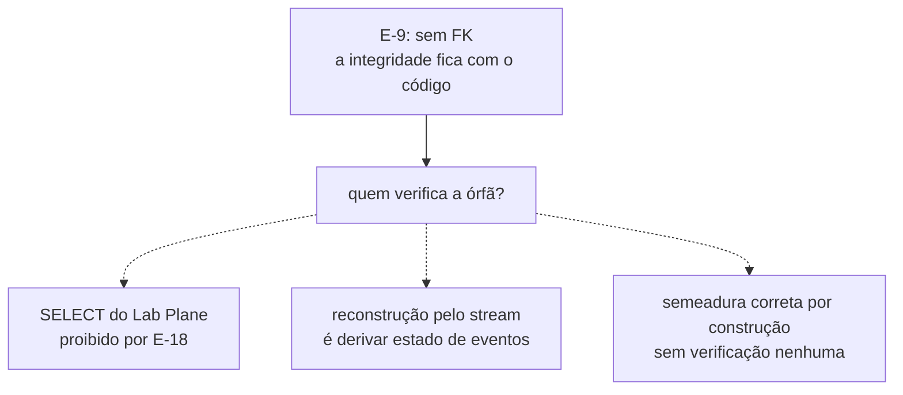

A terceira saída é a única sem obstáculo declarado, e ela troca verificação por
confiança no código da semeadura. **Nenhuma das três foi escolhida.** A pendência fica
vizinha da fonte do oráculo de capacidade, e as duas provavelmente fecham juntas.

**`E-10` — o índice entra, e ele depende de `E-22`.** A obrigação que vem junto é a de
`D-DAT-03`: o plano de execução efetivo vai no relatório do braço `SERIALIZABLE`, sob
pena de o número não ser interpretável. O custo é escrita de índice a cada `INSERT` do
E5, dentro da janela medida. **Se `E-22` escolher `(execution_id, id)`**, a chave
primária de `allocation` já começa pelo discriminador e este índice é adicional; se
escolher `(id, execution_id)`, ele passa a ser o único caminho de acesso por execução.

#### `E-22` fecha em `(execution_id, id)`, e a linha foi decidida duas vezes

A primeira escolha foi `(id, execution_id)`, e ela caiu no mesmo dia. O percurso fica
registrado porque o que a inverteu foi uma correção de mérito, e não uma mudança de
gosto.

**O argumento que sustentava a primeira escolha estava inflado, e quem o inflou foi esta
fila.** Ele dizia que buscar "a mesma linha em **todas** as execuções" é operação central
do laboratório, porque comparar `NONE`, `PESSIMISTIC` e `OPTIMISTIC` é comparar a mesma
entidade lógica entre execuções. **Não é uma consulta.** O oráculo do
[ADR-0002](0002-o-dominio-minimo-e-os-dois-oraculos.md) calcula
`perdidas = commits − (value_final − value_inicial)` **dentro** de cada execução, e a
comparação entre estratégias acontece depois, sobre números já calculados, no relatório.
Nenhum caminho quente junta execuções numa consulta só; isso é inspeção manual em `psql`,
e ela pode pagar uma varredura.

| Consulta                            | Quem a faz                   | Frequência   |
|-------------------------------------|------------------------------|--------------|
| tudo de uma execução                | consumidor de CDC, histórico | todo momento |
| a linha 42000 de uma execução       | operação medida              | todo momento |
| a linha 42000 em todas as execuções | pessoa depurando em `psql`   | raro         |

A ordem escolhida põe as duas primeiras no prefixo do índice, e deixa a terceira pagar
varredura. A ordem descartada fazia o inverso — otimizava a rara e punha a frequente na
dependência de um índice secundário, sobre um histórico que nunca é apagado.

**O ganho de escrita vem junto.** O `execution_id` é um UUIDv7, cujo prefixo de instante
cresce, então toda inserção cai no fim da B-tree em vez de espalhada por ela. É a mesma
propriedade pela qual `D-DAT-05` preferiu UUIDv7 a UUIDv4, agora valendo também para a
chave primária. A pressão de `fillfactor` que a ordem descartada exigiria deixa de ser
questão, e `P-DAT-2` continua tratando só do autovacuum.

**O custo que passa a valer.** As linhas de uma mesma execução ficam fisicamente
adjacentes no índice, e workers concorrentes inserem na mesma página de folha. É
contenção de índice dentro da janela medida — ruído do instrumento, e não fenômeno
estudado. Ele não tem mitigação decidida, e é vizinho de `P-DAT-2` pelo mesmo motivo:
nenhuma política de página está declarada em documento nenhum.

**`E-10` permanece, e volta a ser aditivo.** Com o discriminador já no prefixo da chave
primária, o índice `(execution_id, resource_id)` deixa de ser o único caminho por
execução e volta ao papel que `D-DAT-03` lhe deu: aproximar o predicate lock do
`SERIALIZABLE` do conflito real. A obrigação de registrar o plano efetivo no relatório
continua.

**A contradição interna de `D-DAT-05` fica resolvida do outro lado.** A escolha ratifica
o diagrama — "PK começa pelo discriminador" — e a consequência de que "todo índice passa
a começar pelo discriminador". A frase vencida é "o discriminador é a segunda coluna da
chave", e ela fica registrada como tal aqui, sem editar o documento arquivado.

#### `E-23` — o nome da coluna do discriminador, aberto ao escrever o primeiro DDL

Com `E-8`, `E-9`, `E-10` e `E-22` fechadas, o `CREATE TABLE` das duas tabelas pode ser
escrito — e ele trava numa palavra. `D-DAT-05` decidiu que a coluna afirma "discriminador
de inquilino, com **nome genérico no sistema medido**", e deixou o nome concreto em
aberto de propósito: o sistema medido não sabe que o valor é uma execução de experimento,
e para ele aquilo é a partição lógica dos dados.

Chamá-la de `execution_id` nas tabelas do system under test contradiz a decisão na
palavra exata que ela escolheu evitar. **A ligação com o Lab Plane é justamente o que a
coluna não pode declarar**, porque declará-la põe vocabulário do instrumento dentro do
medido — o mesmo custo que `D-DAT-05` nomeou ao aceitar o discriminador na chave, e que
esta linha decide se paga inteiro ou pela metade.

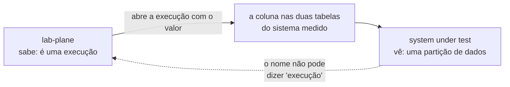

As candidatas visíveis são `tenant_id`, `partition_id` e `run_id`. As duas primeiras
honram a decisão e custam um salto mental em toda consulta do Lab Plane; a terceira é
legível dos dois lados e é a que a decisão diz para não usar. **Nenhuma foi escolhida**,
e o `CREATE TABLE` não pode ser escrito antes disso.

#### `E-11` mudou de terreno: o instrumento já publica identidade no sistema medido

**Estado:** `fechada`, em 2026-08-06.
**Absorvida por:** [ADR-0011](0011-a-topologia-de-servicos-e-o-caderno-de-laboratorio-fora-do-git.md#identidade-embutida-no-domínio-medido-ou-no-lab-plane).

### A segunda rodada do grupo II, em 2026-08-06

**Estado:** `fechada` na parte da identidade, em 2026-08-06. As duas seções de `E-23`
continuam abaixo por não terem ADR que as carregue.
**Absorvida por:** [ADR-0011](0011-a-topologia-de-servicos-e-o-caderno-de-laboratorio-fora-do-git.md#o-componente-de-identidade)
(`E-11`, `E-13`).

#### `E-11` fecha no componente próprio, e abre `E-24` no mesmo ato

**Estado:** `fechada`, em 2026-08-06, contra a recomendação.
**Absorvida por:** [ADR-0011](0011-a-topologia-de-servicos-e-o-caderno-de-laboratorio-fora-do-git.md#o-componente-de-identidade).

#### `E-24` — a alternativa C isola a regra, e não decide quem a invoca

**Estado:** `fechada`, em 2026-08-06.
**Absorvida por:** [ADR-0011](0011-a-topologia-de-servicos-e-o-caderno-de-laboratorio-fora-do-git.md#o-componente-de-identidade).

#### `E-13` fecha por papel do valor, e o `AGENTS.md` muda no mesmo commit

**Estado:** `fechada`, em 2026-08-06. Não gerou ADR.
**Absorvida por:** [`AGENTS.md` da raiz](../../AGENTS.md#regras-estruturais-que-valem-sempre).

#### `E-23` ganhou uma quarta candidata: nome diferente de cada lado

A pergunta é de 2026-08-06, e ela desfaz um pressuposto que as três candidatas anteriores
carregavam sem enunciar — o de que a coluna precisa ter **um** nome. Ela não precisa.
Pela decisão `E-18` cada serviço tem seu próprio schema e nenhum lê o do outro, então
nada obriga que a coluna do sistema medido e a das tabelas do Lab Plane se chamem igual.

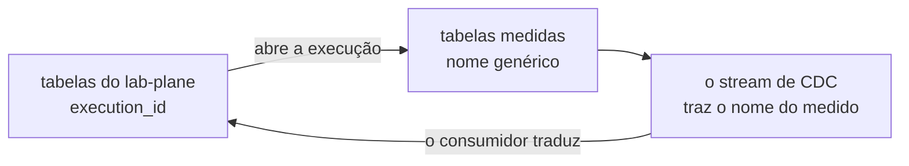

**O salto mental não desaparece; ele muda de lugar.** Nas suas próprias tabelas o Lab
Plane escreve `execution_id` e lê `execution_id`. Mas o oráculo lê o sistema medido por
CDC, e o stream carrega o nome que a coluna tem **lá** — a tradução passa a viver no
consumidor, num ponto só e nomeado, em vez de espalhada por toda consulta. Contra: um
mesmo valor com dois nomes exige que alguém saiba que são o mesmo, e essa ligação deixa
de ser visível no esquema.

#### `E-23` fecha em nomes assimétricos, um por lado da fronteira

A coluna se chama `partition_id` nas tabelas do sistema medido e `execution_id` nas
tabelas do Lab Plane. É a quarta candidata, e ela sai da pergunta de 2026-08-06. O
`CREATE TABLE` das duas tabelas medidas deixa de estar bloqueado.

`D-DAT-05` fica honrada na letra: o sistema medido não carrega a palavra "execução" em
lugar nenhum, e para ele aquilo é o que o nome diz — uma partição. O instrumento escreve
e lê `execution_id` nas suas próprias tabelas, sem salto mental.

**O custo é uma ligação que o esquema não declara.** Um mesmo valor com dois nomes exige
que alguém saiba que são o mesmo, e nenhuma constraint diz isso — não poderia dizer, já
que `E-18` proíbe o cruzamento de schemas. A tradução vive num ponto só, no consumidor do
stream de CDC, e é ali que ela precisa estar escrita e testada.

### Timestamps, propostos em 2026-08-06, e a fronteira os separa em duas linhas

A proposta é `created_at` e `updated_at` nas duas tabelas medidas, e `executed_at`,
`concluded_at`, `created_at` e `updated_at` do lado do Lab Plane. **Os dois lados têm
argumentos disjuntos**, e por isso viram duas linhas. `E-25` volta a bloquear o
`CREATE TABLE` que `E-23` acabara de desbloquear.

#### `E-25` — timestamps nas tabelas medidas

**A objeção mais forte não é técnica, é pedagógica.** `updated_at` é um token de versão
clássico — `UPDATE resource SET value = ? WHERE id = ? AND updated_at = ?` é optimistic
locking escrito sem a palavra. A regra do [`AGENTS.md`](../../AGENTS.md) manda introduzir
o problema antes da solução, e é exatamente por isso que `version` não está no esquema. A
coluna entrega de graça metade do que o E1 deve construir do zero.

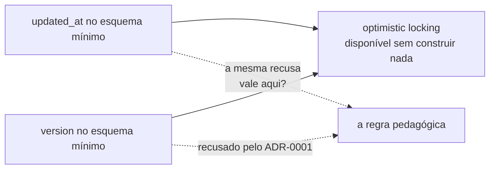

**A segunda objeção é sobre como o valor nasce.** As três formas custam:

| Forma                     | O que custa                                  |
|---------------------------|----------------------------------------------|
| `DEFAULT now()`           | relógio do banco, fora de qualquer adaptador |
| trigger `BEFORE UPDATE`   | código dentro da transação medida            |
| preenchida pela aplicação | o medido passa a depender do adaptador       |

O `DEFAULT now()` tem um defeito a mais, e ele é específico do PostgreSQL: `now()`
retorna o instante de **início da transação**, e não o do statement — duas rows escritas
na mesma transação recebem o mesmo valor, o que apaga justamente a ordem que a coluna
deveria mostrar. O trigger é pior por outro motivo: ele acrescenta trabalho **dentro da
janela exata** onde o lost update acontece, e o laboratório mede o que ocorre ali. A
terceira respeita a regra do relógio, e cobra que o sistema medido dependa do adaptador
por uma coluna que nenhum oráculo lê.

**A regra do relógio injetável não as proíbe, e isso precisa ser dito.** Pelo alcance
fixado em `E-13` nesta mesma data, as regras valem sobre valor que entra em veredito, em
escalonamento ou em identidade derivada da semente. Um `created_at` de `resource` não
entra em nenhum dos três. **A objeção vem da pedagogia e do custo na janela medida, não
da regra** — e confundir as duas coisas seria usar a regra como argumento que ela não faz.

**A favor:** com o discriminador preservando execuções antigas, uma pessoa que inspecione
o banco depois quer ordená-las no tempo. **Contra isso:** a ordem já existe e é melhor —
o CDC entrega em ordem de LSN, que é a ordem real de commit. Um timestamp de wall clock é
pior que o LSN para ordenar, e é o LSN que o oráculo usa.

#### `E-26` — timestamps nas tabelas do Lab Plane

**Aqui não há objeção pedagógica.** O Lab Plane é o instrumento, e não o objeto de
estudo; `executed_at` e `concluded_at` são propriedade da execução, e a timeline do
[ADR-0001](0001-o-passo-como-unidade-de-execucao.md) e o relatório dependem de saber
quando cada coisa aconteceu. `created_at` e `updated_at` da definição de experimento são
metadados de CRUD, sem relação com medida.

**Mas `E-13` acabou de decidir algo que alcança esta linha, e não é óbvio.** O veredito em
formato **curva** do grupo D é uma fila crescendo ao longo do tempo. Se a curva for
construída sobre `executed_at` e `concluded_at`, esses valores **entram no papel
veredito** — e o relógio que os produz DEVE ser o adaptador injetável, nunca um
`DEFAULT now()` do banco. É a primeira consequência concreta da formulação por papel.

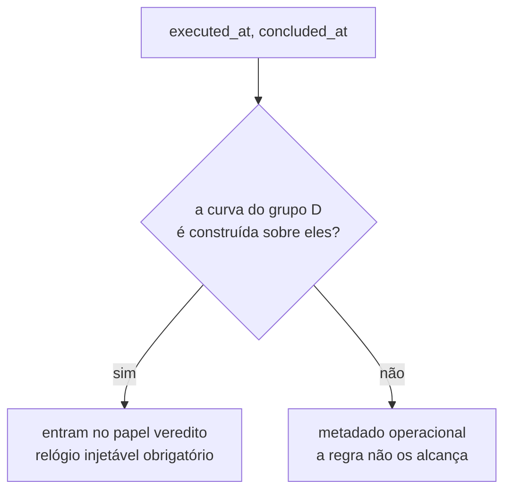

**Uma segunda pergunta fica aberta, e ela é do laboratório, não do CRUD.** `executed_at` e
`concluded_at` marcam a fronteira da janela medida pelo relógio do Lab Plane, enquanto o
oráculo ordena eventos por LSN do WAL do sistema medido. **São duas fontes de tempo
distintas**, e correlacionar as duas é exatamente o problema que o grupo E estuda sob o
nome de clock skew. Nada nesta fila decide como elas se alinham.

**Nenhuma das duas linhas foi decidida.**

### A terceira rodada do grupo II, em 2026-08-06

**Estado:** `fechada` para `E-12` e `E-24`, em 2026-08-06. `E-25` e `E-26` permanecem
abertas, registradas nas seções `Perguntas em aberto` dos Example Mapping de
[atualização perdida](../features/deteccao-de-atualizacao-perdida/example-mapping.md#perguntas-em-aberto)
e de [execução de experimento](../features/execucao-de-experimento/example-mapping.md#perguntas-em-aberto).
**Absorvida por:** [ADR-0012](0012-o-broker-no-caminho-do-veredito-e-a-dispensa-que-ele-exigiu.md#decisão)
(`E-12`) e [ADR-0011](0011-a-topologia-de-servicos-e-o-caderno-de-laboratorio-fora-do-git.md#o-componente-de-identidade)
(`E-24`).

#### `E-12` fecha no broker, e o LSN é o que torna a escolha defensável

**Estado:** `fechada`, em 2026-08-06, contra a recomendação.
**Absorvida por:** [ADR-0012](0012-o-broker-no-caminho-do-veredito-e-a-dispensa-que-ele-exigiu.md#decisão).

#### `E-24` fecha no serviço próprio, e a latência sai da janela se a derivação for antes

**Estado:** `fechada`, em 2026-08-06.
**Absorvida por:** [ADR-0011](0011-a-topologia-de-servicos-e-o-caderno-de-laboratorio-fora-do-git.md#o-componente-de-identidade).

### Quatro linhas novas, abertas pelas escolhas da terceira rodada

As outras duas, `E-28` e `E-29`, fecharam em 2026-08-06 e a parte permanente delas vive em
[ADR-0012](0012-o-broker-no-caminho-do-veredito-e-a-dispensa-que-ele-exigiu.md#decisão).

#### `E-27` — como o valor de `created_at` e `updated_at` nasce

`E-25` decidiu que as colunas existem. **Não decidiu quem as preenche**, e as três formas
já estão medidas acima: `DEFAULT now()` colapsa rows da mesma transação num só instante;
trigger `BEFORE UPDATE` acrescenta trabalho **dentro** da janela medida; e o preenchimento
pela aplicação faz o sistema medido depender do adaptador de relógio por uma coluna que
nenhum oráculo lê. A segunda é a única que altera o que se está medindo.

#### `E-30` — o slot do conector deixou de ser por execução, e vira permanente

Com o conector publicando continuamente, o replication slot dele é **um só e de vida
longa**, e não um por execução. A retenção de WAL sai do cenário "um slot órfão por
execução morta" e entra em "um slot que retém tudo se o conector ficar fora do ar" — no
banco compartilhado do homelab, com vizinhos. `max_slot_wal_keep_size` volta a ser a
mitigação, e continua sendo parâmetro de cluster que afeta terceiros.

### O que a quarta rodada apurou antes de perguntar, em 2026-08-06

#### `E-30` não entra nesta rodada, e a razão é que ela depende de `E-5`

A mitigação de retenção é `max_slot_wal_keep_size`, que é **parâmetro de cluster**. Decidir
o valor dele exige antes saber se o laboratório roda no PostgreSQL compartilhado do homelab
ou em uma instância própria — que é a linha `E-5`, aberta. Fixar um valor agora seria impor
um limite ao vizinho sem ter decidido que existe vizinho.

> **A premissa deste adiamento não vale mais, e ninguém percebeu na hora.** `E-5` já
> estava fechada quando este parágrafo foi escrito, no PostgreSQL **compartilhado** do
> homelab. O argumento se inverte: sabe-se que o vizinho existe, e não fixar o limite é
> que passa a impor risco a ele. `E-30` deixa de estar bloqueada e passa a estar
> **aberta e decidível**. O que ela decide continua sendo parâmetro de cluster, e por
> isso a decisão alcança o `homelab-infrastructure`, e não só este repositório.

### A quarta rodada do grupo II, em 2026-08-06

| Linha              | Escolha                               | Seguiu a recomendação? |
|--------------------|---------------------------------------|------------------------|
| `E-27`             | aplicação, pelo adaptador de relógio  | sim                    |
| `E-28`             | Debezium Server, processo separado    | não                    |
| `E-29` (topologia) | a mesma instância, e o custo é aceito | não                    |
| `E-29` (filtro)    | filtro no consumidor, com contagem    | sim                    |

#### `E-27` fecha na aplicação, e o DDL das duas tabelas medidas deixa de ter lacuna

As colunas nascem `timestamptz NOT NULL`, sem `DEFAULT` e sem trigger, e o valor vem do
adaptador de relógio no momento da escrita. Nada roda dentro da transação medida além do
`INSERT` ou do `UPDATE` que já rodaria.

**A ausência de `DEFAULT` é deliberada e tem custo.** Uma escrita que esqueça a coluna
falha por `NOT NULL` em vez de gravar um valor plausível e errado. É a troca certa aqui:
um erro barulhento na primeira execução vale mais que um instante silenciosamente vindo do
relógio errado, meses depois, num experimento de clock skew.

A tensão registrada acima permanece por escrito: se algum experimento do grupo E ler
`updated_at` como insumo, a coluna deixa de ser metadado inerte, e a regra de `E-25` passa
a conviver com essa leitura. A regra fala de estratégia de concorrência, e não de oráculo
— **não há contradição hoje, e há pressão amanhã**.

### Três linhas novas, abertas pela quarta rodada

#### `E-31` — onde vive a configuração do Debezium Server

Ele não é um módulo Maven, e não nasce do reactor. A configuração é declarativa e precisa
ser versionada, entregue e bumpada como os outros quatro artefatos. **Isso reabre a
pressão sobre `E-3`**, a forma do `deploy/`, que segue adiada.

#### `E-32` — o teste que prova que o LSN chega ao consumidor

**Fechada em 2026-08-06.** O LSN é o que ordena os eventos do WAL, e nada garante que ele
sobreviva à travessia `pgoutput` → Debezium Server → RabbitMQ → `lab-plane`: uma
transformação de mensagem no meio do caminho pode descartar o bloco `source` que o carrega.
A guarda decidida é um teste de aceitação sobre a cadeia inteira, descrito abaixo em
[`E-32` fecha na cadeia inteira](#e-32-fecha-na-cadeia-inteira-e-o-teste-ganha-uma-segunda-asserção)
e registrado em
[ADR-0012](0012-o-broker-no-caminho-do-veredito-e-a-dispensa-que-ele-exigiu.md#negativas).

`E-33`, a terceira linha aberta por esta rodada, fechou na mesma data e sua lápide está em
[`E-33` fecha na distinção](#e-33-fecha-na-distinção-e-ela-transforma-uma-recomendação-de-e-3-em-requisito).

### O que a quinta rodada apurou antes de perguntar, em 2026-08-06

Dois achados sobre `E-31`, verificados na documentação do Debezium Server e na própria
árvore, e um deles abriu `E-34`, uma linha que ninguém tinha visto. O registro daquele
segundo achado foi apagado em 2026-08-10, por não ser citado de lugar nenhum, e o
enunciado de `E-34` continua adiante.

#### `E-31` — a variável de ambiente sobrepõe tudo, e isso dissolve a tensão do Secret

O Debezium Server é uma aplicação Quarkus. A configuração vive em
`config/application.properties`, com os prefixos `debezium.source.*` para o conector e
`debezium.sink.*` para o destino — e **toda opção presente nesse arquivo pode ser
acrescentada ou sobreposta por variável de
ambiente**. A fonte é a
[documentação de operação do Debezium Server](https://debezium.io/documentation/reference/stable/operations/debezium-server.html),
conferida em 2026-08-06 — evidência externa, e não deste repositório.

Isso importa porque a credencial de `REPLICATION` sobre o banco do sistema medido é um
Secret, e o [`AGENTS.md`](../../AGENTS.md) proíbe Secret neste repositório. Sem o override
por ambiente, um arquivo versionado obrigaria a interpolação como único recurso; com ele,
a senha simplesmente nunca aparece em arquivo nenhum.

**Há precedente na árvore, e ele aponta para o ambiente.** O [`compose.yaml`](../../compose.yaml)
não monta arquivo de configuração para serviço nenhum: `LAB_PLANE_DB_URL`,
`SUT_DB_PASSWORD` e as demais vão todas por ambiente. A única exceção é
`local/postgres-init.sql`, que é script de inicialização do banco e não configuração de
aplicação.

| Forma                                 | Onde a senha vive | O que o `deploy/` carrega |
|---------------------------------------|-------------------|---------------------------|
| arquivo versionado, senha interpolada | ambiente          | ConfigMap com o arquivo   |
| só variável de ambiente               | ambiente          | as variáveis do manifesto |
| esperar `E-3`                         | —                 | nada, e o CDC não sobe    |

A terceira não é neutra. Enquanto ela durar, o Debezium Server roda no `compose.yaml` de
desenvolvimento e **não existe no homelab** — o que significa que o veredito não pode ser
produzido lá.

### A quinta rodada do grupo II, em 2026-08-06

| Linha  | Escolha                                      | Seguiu a recomendação? |
|--------|----------------------------------------------|------------------------|
| `E-31` | não decidida; exigência nova registrada      | —                      |
| `E-32` | aceitação com os três contêineres            | sim                    |
| `E-33` | invalida só se o discriminador estiver ativo | sim                    |

#### `E-31` não fecha, e o que a impede é uma exigência que a fila não enunciava

Nenhuma das três formas foi escolhida, e a razão é ortogonal a todas elas: **rodar o
Debezium Server no cluster exige mudar o repositório
[`homelab-infrastructure`](https://github.com/da0hn/homelab-infrastructure)**, e essa
exigência não estava escrita em lugar nenhum desta fila. Ela vale para qualquer das três
formas, porque nenhuma delas é alcançada por um `deploy/` que este repositório sozinho
produza.

O que ela acrescenta, pelo que o [`AGENTS.md`](../../AGENTS.md) já registra do contrato da
ADR 0017 daquele repositório:

- **A credencial de `REPLICATION` é um Secret**, e Secret não entra aqui. Ela é cifrada
  com SOPS/KSOPS no homelab e referenciada por nome — o que significa que a decisão de
  `E-31` sobre onde a configuração vive **não** decide onde a senha vive; ela já está
  decidida, e fora deste repositório.
- **O `Application` do ArgoCD aponta para um `deploy/` que não existe.** Já é o
  `ComparisonError` registrado em `E-3`. Um serviço a mais não o piora, mas também não
  chega ao cluster antes de `E-3` fechar.

**Pergunta em aberto: a ADR 0017 alcança uma imagem que este repositório não constrói?** O
`AGENTS.md` registra que ela descreve o laboratório como "monorepo de microsserviços JVM",
e o contrato dela fala em imagem publicada no GHCR com tag igual ao SHA do commit. O
`debezium/server` é imagem de terceiro, com tag de versão do Debezium, e nenhum commit
daqui a produz. Se isso é caso previsto ou lacuna, não foi conferido aqui.

#### `E-32` fecha na cadeia inteira, e o teste ganha uma segunda asserção

**Estado:** `fechada`, em 2026-08-06. **O teste não existe.**
**Absorvida por:** [ADR-0012](0012-o-broker-no-caminho-do-veredito-e-a-dispensa-que-ele-exigiu.md#negativas).

#### `E-33` fecha na distinção, e ela transforma uma recomendação de `E-3` em requisito

**Fechada em 2026-08-06.** Um evento que chega ao `lab-plane` com discriminador de execução
**ativo** e não reconhecido invalida a execução; um com discriminador de execução encerrada
é descartado em silêncio, porque ele é resíduo de uma janela que já fechou. A distinção só
se sustenta se um `lab-plane` souber quais execuções estão ativas — e com duas réplicas,
uma delas não sabe. **A réplica única deixou de ser preferência e virou condição do
veredito confiável**, o que é insumo vivo para `E-3`, ainda aberta. A consequência está em
[ADR-0012](0012-o-broker-no-caminho-do-veredito-e-a-dispensa-que-ele-exigiu.md#consequências),
e onde a lista de execuções ativas vive continua aberto em
[`E-35`](#e-35--onde-o-lab-plane-guarda-quais-execuções-estão-ativas).

### Duas linhas novas, abertas pela quinta rodada

#### `E-34` — qual dos dois sinks de RabbitMQ, e o que ele amarra

Aberta na apuração acima. `rabbitmq` sobre AMQP 0-9-1 contra `rabbitmqstream` sobre o
protocolo de stream. A escolha decide, sem dizer, qual fenômeno de saturação o grupo B
consegue reproduzir. **Não entra até o grupo B ter experimento especificado.**

#### `E-35` — onde o `lab-plane` guarda quais execuções estão ativas

`E-33` exige a resposta a "este discriminador pertence a execução ativa?", e não disse de
onde ela vem. Em memória, a resposta some num reinício e toda a execução seguinte passa a
descartar às cegas. Numa tabela do schema do `lab-plane`, ela sobrevive — e cria a primeira
tabela daquele schema, hoje vazio. A linha decide qual das duas, e como uma execução
abandonada deixa de ser ativa.

#### `E-35` fecha em tabela no `lab_plane`, escolhida em 2026-08-10

**Escolhido pela pessoa em 2026-08-10.** A lista de quais execuções estão ativas passa a
viver numa **tabela do schema `lab_plane`**, que se torna a primeira tabela daquele
schema — hoje vazio de propósito
(`lab-plane/src/main/resources/db/migration/V1__criar_schema_do_lab_plane.sql:7-8`).

**Um `lab-plane` reinicia a cada deploy, e isso já basta para apagar a resposta em
memória.** Não é preciso `Deployment`, `selfHeal` nem qualquer outro mecanismo de
auto-reinício: "Em memória, um reinício apaga a resposta, e a execução seguinte descarta às
cegas"
([ADR-0012, Negativas](0012-o-broker-no-caminho-do-veredito-e-a-dispensa-que-ele-exigiu.md#negativas)).
Hoje nada neste repositório reinicia o `lab-plane` sozinho: `deploy/` não existe, o
`Application` do ArgoCD segue em `ComparisonError`
([`../../AGENTS.md`](../../AGENTS.md#este-repositório-é-entregue-no-homelab)), e o
`compose.yaml` não declara `restart:` em nenhum serviço, nem localmente. O que sustenta
esta escolha não é um reinício automático em curso — é que **todo deploy, aqui ou no
homelab, é ele próprio um reinício** do processo, e nenhuma tabela de estado corrente
sobrevive a um reinício quando vive só em memória.

**A escolha é antecipatória, e o custo disso fica nomeado, não escondido.** O precedente
que sustentaria manter a lista em memória é o do
[ADR-0007, Onde o log vive](0007-o-log-de-observacoes-forma-ordem-e-onde-vive.md#onde-o-log-vive):
aceitar estado volátil até um gatilho nomeado disparar. O gatilho daquele ADR está escrito
por extenso — "quando a etapa 6 introduzir um experimento que derruba o processo, 'log em
memória, perdido se o processo morrer' deixa de ser aceitável"
([ADR-0007, Quando esta decisão deixa de valer](0007-o-log-de-observacoes-forma-ordem-e-onde-vive.md#quando-esta-decisão-deixa-de-valer))
— e ele **ainda não disparou**: nenhum experimento da etapa 6 existe executável nesta
árvore. Fixar a tabela agora, antes de esse gatilho ocorrer, contraria o padrão do
precedente, que adia persistência até haver motivo concreto. A escolha é feita sabendo
disso: o motivo concreto que o precedente exigiria ainda não existe.

**Distinguir higiene de invalidação exige saber quem está ativo.** A mesma decisão do
broker manda o consumidor tratar diferente um evento de execução já concluída — higiene —
e um evento de execução ainda ativa — que invalida o veredito —, e isso "exige saber quais
discriminadores estão ativos"
([ADR-0012, Decisão](0012-o-broker-no-caminho-do-veredito-e-a-dispensa-que-ele-exigiu.md#decisão)).
A lista é condição do veredito confiável, e não conveniência de implementação.

**Nenhum ADR aceito proíbe uma tabela ali.** O schema `lab_plane` está vazio de propósito
até aqui: a primeira migração diz que "nenhuma tabela entra aqui. As do Lab Plane dependem
das decisoes E-8 a E-13, do grupo II do Lote E"
(`lab-plane/src/main/resources/db/migration/V1__criar_schema_do_lab_plane.sql:7-8`), e o
papel `lab_plane` já tem `CREATE` concedido no banco (`local/postgres-init.sql:18`).

**Esta escolha não contradiz o ADR-0011, e a razão é o que a lista guarda.** Aquele ADR
recusou pôr o **histórico do que foi medido** dentro do `lab-plane`, pelo argumento do
ADR-0008: "o instrumento que mede guardaria o que mediu"
([ADR-0011, Histórico de execução dentro do `lab-plane`](0011-a-topologia-de-servicos-e-o-caderno-de-laboratorio-fora-do-git.md#histórico-de-execução-dentro-do-lab-plane)).
A lista de execuções ativas não é isso: ela não registra o que uma execução mediu, é
estado operacional do consumidor — quais discriminadores o filtro que
[`E-33`](#e-33-fecha-na-distinção-e-ela-transforma-uma-recomendação-de-e-3-em-requisito)
exige tratar como vivos agora, e some quando a execução deixa de estar ativa. O histórico
permanece fora do `lab-plane`; o que entra é só o estado corrente do filtro.

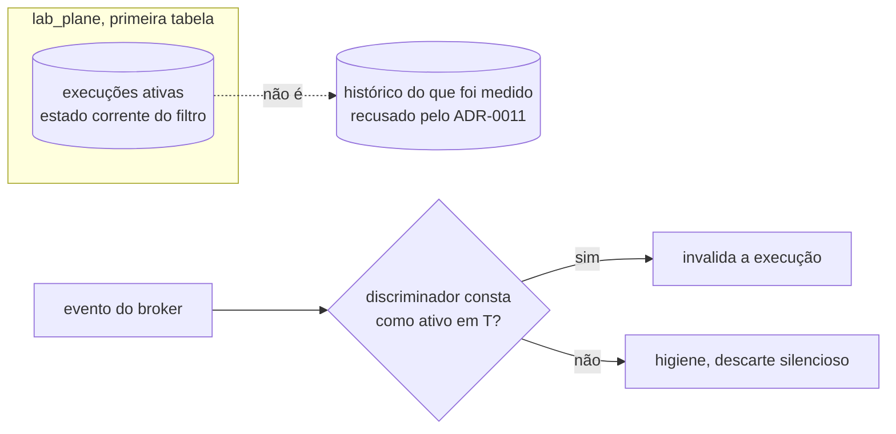

**A descartada, e o motivo.** Manter a lista **em memória, com o mesmo gatilho de
reversão do precedente citado acima** — esperar a etapa 6 introduzir o experimento que
derruba o processo. Perde aqui não porque o gatilho já tenha disparado, mas porque esperar
por ele não evita o custo: um deploy comum já apaga a resposta em memória antes de
qualquer experimento da etapa 6 existir, e o custo não é perder um registro histórico — é
a execução seguinte descartar às cegas e o veredito sair errado sem sintoma.

**O que esta linha NÃO decide.** A forma da tabela — colunas, chave e migração — não foi
escolhida. `Pergunta em aberto`. Como uma execução abandonada deixa de ser ativa também
não foi decidido aqui; o motivo de abrir linha própria em vez de responder de passagem
está registrado em
[`E-50`](#e-50--como-uma-execução-ativa-deixa-de-ser-ativa-chegue-ou-não-ao-fim).

#### `E-50` — como uma execução ativa deixa de ser ativa, chegue ou não ao fim

Aberta em 2026-08-10, pelo fecho de
[`E-35`](#e-35-fecha-em-tabela-no-lab_plane-escolhida-em-2026-08-10). "Execução
abandonada" não está definida em documento nenhum deste repositório, e a pergunta original
— como o `lab-plane` sabe que pode remover uma linha da lista de execuções ativas — se
divide em duas conforme a execução chega ou não ao fim. **As duas metades ficam abertas
aqui**, nenhuma das duas é dada por resolvida.

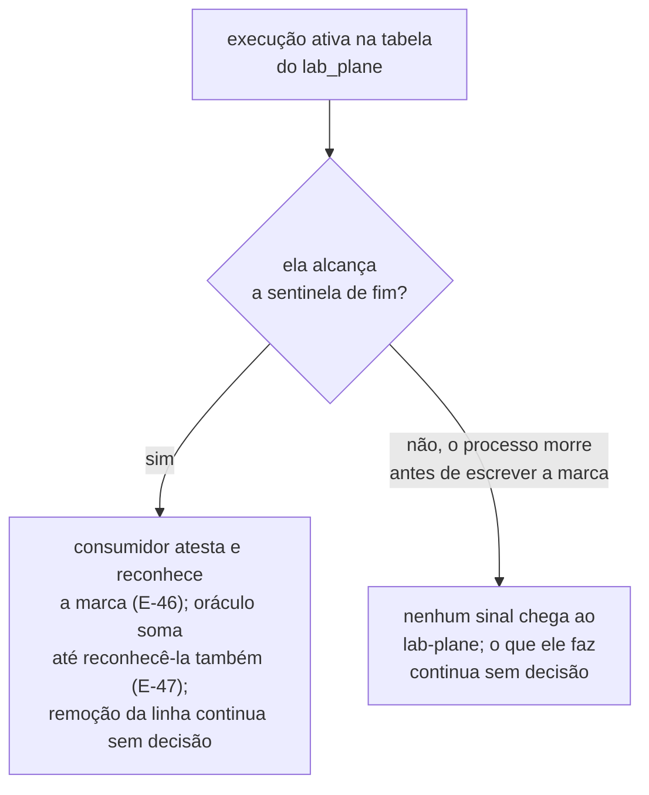

**A citação que fecharia o caminho óbvio alcança menos do que parece.** "O término já é
um evento do próprio runtime"
([ADR-0005, Justificativa](0005-a-forma-do-escalonador.md#justificativa)) é o argumento
contra timeout para a **desistência de worker dentro do escalonador**, e só para ela —
não para o `lab-plane` decidir abandono de execução, que é a pergunta desta linha. O que
poderia alcançar esta linha é a regra geral: tempo de parede fora de um adaptador de
relógio é proibido. **Se ela a alcança é o que o parágrafo seguinte deixa em aberto** —
e enquanto isso não fechar, o caminho não está fechado por esta citação nem por
nenhuma outra.

**O fecho de [`E-47`](#e-47-fecha-na-sentinela-escolhida-em-2026-08-10) carrega uma
exceção, e se ela alcança esta linha não está estabelecido.** A exceção é "um limite que
não entra em veredito não é alcançado pela regra do relógio injetável", e o "limite de
espera" daquela linha segue `Pergunta em aberto` por ela. Aplicá-la aqui exige saber se
a remoção da linha da lista de execuções ativas entra em veredito. **Isso não foi
decidido.** `Pergunta em aberto`.

**Os dois fechos que a fila já tem apontam em direções opostas, e a divergência fica
registrada em vez de resolvida.** O fecho de `E-47` deriva a exceção de o limite
produzir `fonte atrasada` "e não um veredito", e conclui que ele "deixou de ser insumo
de veredito" — ali, produzir invalidação é justamente o que **tira** o limite do
veredito. O fecho de
[`E-35`](#e-35-fecha-em-tabela-no-lab_plane-escolhida-em-2026-08-10) puxa para o outro
lado: "A lista é condição do veredito confiável, e não conveniência de implementação", e
quem sai da lista decide se um evento de backlog é higiene ou invalidação. Ler daí que
um limite de parede que decide abandono decide, por consequência, invalidação, e que por
isso entra em veredito, é **leitura desta linha e não consequência dada** — nenhum
documento deste repositório afirma que a remoção da linha entra em veredito, e o mesmo
critério, aplicado ao próprio `E-47`, retiraria a exceção de quem a criou. O corpo de
`E-47` permanece como fechou; este parágrafo só nomeia onde as duas leituras se
encontram.

**Enquanto essa pergunta não fechar, o caminho de tempo de parede não está nem
autorizado nem descartado aqui** — o que está descartado, e isso o `E-47` já fixou, é
tempo de parede como **fonte** de veredito.

**Para a execução que alcança o fim, existe mecanismo — mas a hipótese que sobra é só a
remoção da linha da lista.** O sistema medido escreve a sentinela depois que todos os
workers terminam. O fecho de
[`E-46`](#e-46-fecha-no-consumidor-do-broker-escolhida-em-2026-08-10) já atribui ao
consumidor do broker as duas metades da completude: a mesma camada "confere o buraco no
meio **e reconhece a marca de fim que `E-47` escolheu**". O fecho de
[`E-47`](#e-47-fecha-na-sentinela-escolhida-em-2026-08-10), por sua vez, diz que é o
**oráculo** que soma até reconhecer o evento dessa marca — no stream que o consumidor já
entrega atestado. As duas coisas convivem: o consumidor reconhece a marca ao atestar o
stream; o oráculo reconhece a mesma marca dentro da própria soma, e é esse
reconhecimento que encerra o `Σ amount`. Nenhum dos dois fechos decide, porém, se essa
mesma marca também remove a linha da execução na lista de execuções ativas do
`lab-plane` — isso continua **hipótese, e não decisão**: nenhum fecho atribuiu essa
remoção a ator nenhum.

**Para a execução que nunca chega lá, nenhum sinal foi decidido.** Um processo do sistema
medido que morre antes de escrever a sentinela — a etapa 6 mata processos de propósito —
nunca produz o evento que fecharia a janela. Se o `lab-plane` também não tem outro sinal,
essa linha da lista de execuções ativas fica lá para sempre, e o que o `lab-plane` faz
diante disso não foi decidido.

**Sem recomendação, nas duas metades.**

### Duas linhas abertas pelo ADR-0010, ao reconciliar os cards

O [ADR-0010](0010-a-fronteira-de-schema-e-o-cdc-como-fonte-do-veredito.md) nasceu `Aceito`
em 2026-08-06 deixando lacunas marcadas como `Pergunta em aberto`. Duas delas precisam de
linha aqui, porque **uma pergunta dentro de um ADR aceito não pode ser respondida editando
o ADR**. Uma terceira, a fonte do `value_inicial`, foi apurada como aberta **por engano** —
ela fechou em 2026-08-05, e o parágrafo de `E-36` registra onde.

#### `E-36` — a emissão ao vivo entra na janela que o experimento mede

`E-19` decidiu que as observações de passo atravessam para o `lab-journal` ao vivo, evento
por evento. O ADR-0008 já registra que a latência de rede entra na medida de todo
experimento, e o E1 emite entre 900 e 1500 observações por execução — a emissão evento a
evento acrescenta cada uma dessas travessias **dentro** da janela medida. **A saída existe
e nunca foi escolhida:** emissão não bloqueante, em que o passo enfileira num buffer local
e um remetente próprio esvazia. O custo dela é perder o buffer quando o `lab-plane` cai —
e a etapa 6 mata o processo de propósito. A linha decide qual das duas.

**Não confundir com o `value_inicial`, que já tem fonte.** Esta linha nasceu de uma
apuração que o tratava como aberto; ele não é. `O20` fechou em 2026-08-05 pelo estado
inicial ser **inserido** antes de cada execução, e capturado como qualquer outro evento —
o registro está em
[`decisoes-pendentes.md`](arquivo/proposta-2026-08-03/decisoes-pendentes.md#o20-fecha-o-estado-inicial-é-criado-dentro-da-janela-de-captura),
que também descarta o snapshot inicial do Debezium por nome, porque ele lê a tabela
inteira e devolve ao instrumento o acesso ao banco medido.

#### `E-36` fecha no broker com persistência antes da emissão, escolhida em 2026-08-10

**Escolhido pela pessoa em 2026-08-10.** A emissão ao vivo de `E-19` passa a atravessar
pelo broker, com a persistência no `lab-journal` acontecendo antes do push ao vivo — e
não em paralelo com ele.

**O evento sai do passo pelo broker.** Ele atravessa pelo RabbitMQ — o broker do
[ADR-0012, Decisão](0012-o-broker-no-caminho-do-veredito-e-a-dispensa-que-ele-exigiu.md#decisão),
hoje só no caminho do veredito —, que passa a servir também ao caminho da observação.

**Pergunta em aberto: o que distingue esta travessia da que "ao vivo bloqueante" perde
por manter.** O evento continua saindo do passo, evento por evento, dentro da janela
medida — só o destino muda, de uma chamada direta ao `lab-journal` para o RabbitMQ.
Nenhum documento nomeia essa publicação como não bloqueante, fire-and-forget ou de outra
forma mais barata que a chamada que esta decisão descarta abaixo. Até essa lacuna fechar,
o motivo dado para descartar "ao vivo bloqueante" — manter as travessias dentro da janela
medida — vale, sem diferença nomeada, também para a escolhida.

**No `lab-journal` a ordem é serial, nunca paralela.** O consumidor persiste o evento
primeiro, e só depois de o `COMMIT` confirmar é que o push ao vivo acontece.

**O push usa o pub/sub interno do Spring, disparado na fase pós-commit da transação de
persistência.** O gatilho é um evento interno do framework
(`TransactionPhase.AFTER_COMMIT` do Spring) — nome que colide com a fronteira
`AFTER_COMMIT` que este repositório já usa para o sistema medido, onde `commits` conta
passagens por ela
([`../../AGENTS.md`](../../AGENTS.md#decisões)). São dois conceitos distintos: este é
evento interno do `lab-journal`; aquele é fronteira do runtime que o oráculo exato conta.
Uma persistência que falha simplesmente não publica no pub/sub, e é por isso que a falta
de resiliência desse mecanismo não é risco **neste** arranjo — ela seria fatal no arranjo
em paralelo, que esta escolha descarta abaixo.

**O SSE aceita `Last-Event-ID`.** O stream reproduz da base a partir do cursor recebido e
emenda no fluxo ao vivo a partir daí. **Recuperar todo o histórico é o mesmo mecanismo,
com cursor vazio** — não existe um segundo endpoint para isso.

**O cursor é um campo próprio, monótono por execução.** Ele não é um timestamp — a razão
está abaixo. **Dois instantes ficam no registro, e nenhum dos dois é ordem.** O instante
de ocorrência é atribuído no `lab-plane`; o instante de persistência, no `lab-journal`. A
diferença entre os dois mede o custo da travessia.

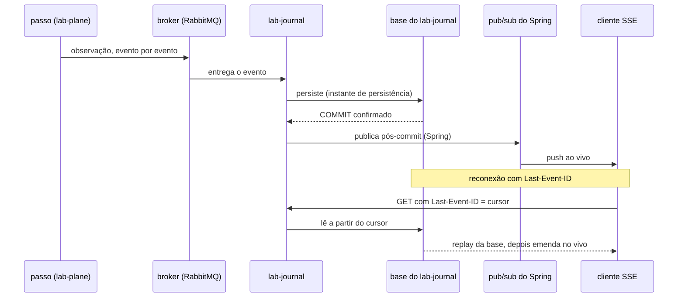

**As três descartadas, e o motivo de cada uma.** Ao vivo bloqueante, que é o vigente
hoje, perde por manter dentro da janela medida cada travessia de rede que a emissão
evento a evento produz — na ordem de centenas por execução, já que o E1 emite entre 900 e
1500 observações
([ADR-0008, Negativas](0008-os-dois-planos-em-processos-separados.md#negativas)) —, sem
nenhuma defesa. Buffer local volátil perde porque a etapa 6 mata o processo de propósito,
e o buffer não esvaziado desaparece: a consulta posterior devolveria uma execução com um
buraco **sem sinalizar o buraco**. SSE e persistência em paralelo perde porque são duas
escritas independentes sem transação comum — é o dual write, o próprio item do briefing
que a etapa 6 existe para estudar, reproduzido dentro do instrumento que deveria só
observá-lo.

**Por que o cursor não é um timestamp.** [`Q-0004-3`](../questions/Q-0004-3.md),
`pendente`, registra que "nenhum documento diz qual relógio o log usa, nem se ele é
monotônico, nem qual é a resolução dele". Dois eventos dentro da mesma resolução colidem,
e um cursor que colide pula ou repete evento no replay, em silêncio. O mesmo risco já
apareceu para as colunas de tempo do próprio Lab Plane: o registro de
[`E-26`](#e-26--timestamps-nas-tabelas-do-lab-plane) nota que, se um valor de tempo entra
no papel veredito, o relógio que o produz DEVE ser o adaptador injetável — consequência
de `E-13`, já fechada — embora a linha `E-26` em si continue sem decisão sobre se essas
colunas existem. Um cursor de replay carrega o mesmo risco que motivou aquela nota.

**Quando esta decisão deixa de valer.** Se o `lab-journal` passar a ter mais de uma
instância, um `SseEmitter` conectado numa instância não vê o evento publicado noutra. O
replay por cursor cobre o buraco na reconexão, com atraso — mas não substitui a garantia
de entrega ao vivo enquanto as duas instâncias convivem.

**O que o ADR-0008 registra, por completo.** O bullet inteiro, em
[Negativas](0008-os-dois-planos-em-processos-separados.md#negativas), diz: "A latência da
rede entra na medida de todo experimento. O runtime consulta escalonador e injetor em
**cada** fronteira entre passos, e o E1 do MVP emite entre 900 e 1500 observações." O "e"
liga o número de observações à consulta ao escalonador e ao injetor **em cada fronteira**
— não a uma travessia de rede da emissão para o `lab-journal`, que ainda não existia
quando o ADR-0008 foi escrito: ela só passou a existir depois, por `E-19` e pelo
[ADR-0010, Decisão](0010-a-fronteira-de-schema-e-o-cdc-como-fonte-do-veredito.md#decisão).
O que o enunciado desta linha afirma — "a emissão evento a evento acrescenta cada uma
dessas travessias **dentro** da janela medida" — é conclusão desta fila sobre a decisão de
`E-19`, e não algo que o ADR-0008 já dissesse sobre a emissão para o `lab-journal`. O fato
que o ADR-0008 registra — a latência entra na medida de todo experimento — continua
verdadeiro, e é diferente do fato que `E-19` acrescentou.

**`E-19` nunca avaliou alternativa, e isso também fica registrado.** O enunciado desta
linha nomeia o buffer local como a saída "que existe e nunca foi escolhida" — nomeada, e
não descartada por argumento. O fecho de
[`E-19`](#e-19--ao-vivo-e-a-tensão-com-o-adr-0008) já registrava o mesmo fato, de outra
forma: "a saída não escolhida — buffer local com remetente próprio — continua aberta em
`E-36`". Nenhum documento deste repositório registra razão positiva para a emissão "ao
vivo, evento por evento" além de a decisão ter sido tomada.

**Esta decisão exige ADR, e este fecho registra isso sem escrever o ADR.** Ela toca
quatro ADRs aceitos e a matriz de integrações, e nenhum deles é editado por este fecho:

- O [ADR-0010, Decisão](0010-a-fronteira-de-schema-e-o-cdc-como-fonte-do-veredito.md#decisão)
  manda as observações atravessarem "ao vivo, evento por evento". A regra `R12` do
  [card de observação passo a passo](../features/observacao-passo-a-passo/feature-card.md#regras-de-negócio)
  acrescenta que "o Lab Plane NÃO DEVE acumulá-las para enviar ao fim da execução", mas
  ela é regra **`pendente`** do card — não é documento aceito, e não entra na contagem
  dos quatro.
- O [ADR-0007, A forma de um evento](0007-o-log-de-observacoes-forma-ordem-e-onde-vive.md#a-forma-de-um-evento)
  é dono da forma do evento, e ela não tem campo de cursor nem instante de persistência.
- O [ADR-0011](0011-a-topologia-de-servicos-e-o-caderno-de-laboratorio-fora-do-git.md#comando-no-lab-plane-leitura-no-lab-journal-sem-bff)
  desenha a aresta direta do `lab-plane` ao `lab-journal`, rotulada "observações". Roteá-la
  pelo broker muda essa topologia.
- A [matriz](../architecture/integrations.md#matriz), dona do **estado de cada fronteira
  de processo**, registra a linha `lab-plane` → `lab-journal` como "observação, evento por
  evento, ao vivo"; ela passa a descrever um caminho que esta decisão substitui.
- O [ADR-0012, Decisão](0012-o-broker-no-caminho-do-veredito-e-a-dispensa-que-ele-exigiu.md#decisão)
  dispensou a regra de que nenhuma tecnologia entra por estar disponível, para o broker
  **no caminho do veredito**; usá-lo também na observação amplia o alcance daquela
  dispensa, e o [`AGENTS.md`](../../AGENTS.md#regras-estruturais-que-valem-sempre) registra
  que "uma dispensa registrada não é precedente: a próxima também precisa ser explícita".

Nenhum dos cinco é editado aqui. O card também não — a regra `R12`, `pendente`, só muda
pelo próprio ciclo de aprovação de regra, e não entra na contagem por não ser aceita. A
redação do ADR é o próximo passo, e ela pertence à pessoa.

**Duas lacunas seguem abertas, e este fecho as nomeia sem fechá-las.**
[`E-51`](#e-51--o-que-protege-a-contagem-de-coincidências-de-um-transporte-falível)
pergunta o que protege a contagem de coincidências do ADR-0004 agora que ela passa a
depender de um transporte falível, e
[`E-52`](#e-52--de-onde-vem-o-instante-de-parede-de-um-evento-e-se-ele-é-monotônico)
pergunta de onde vem o instante de parede de um evento e se ele é monotônico. Nenhuma das
duas tinha linha própria nesta fila antes deste fecho.

#### `E-51` — o que protege a contagem de coincidências de um transporte falível

Aberta em 2026-08-10, pelo fecho de
[`E-36`](#e-36-fecha-no-broker-com-persistência-antes-da-emissão-escolhida-em-2026-08-10).

A contagem de coincidências é derivada do log de observações por decisão do
[ADR-0004](0004-o-estatuto-da-barreira-e-o-diagnostico-da-nao-ocorrencia.md#a-plataforma-conta-coincidências).
Quando aquele ADR foi escrito, o log não atravessava broker nenhum. A decisão de
[`E-36`](#e-36-fecha-no-broker-com-persistência-antes-da-emissão-escolhida-em-2026-08-10)
põe o log a atravessar RabbitMQ e a ser persistido no `lab-journal`, e com isso **um
evento pode se perder no transporte** — caminho de falha que as
[negativas do ADR-0004](0004-o-estatuto-da-barreira-e-o-diagnostico-da-nao-ocorrencia.md#negativas)
não previam. As negativas de lá já nomeiam dois modos pelos quais a contagem erra em
silêncio: um passo que não reporta a chave de contenção, e a comparação de instantes
entre threads sem relógio decidido. O de `E-36` é um terceiro. O que ninguém decidiu é
**o que protege uma contagem que agora depende de um transporte falível** — se ela ganha
guarda de completude como a que
[`E-46`](#e-46-fecha-no-consumidor-do-broker-escolhida-em-2026-08-10) deu à soma do
predicado, se ela passa a ser derivada de outra fonte, ou se o risco é aceito e nomeado.

**Sem recomendação.**

#### `E-52` — de onde vem o instante de parede de um evento, e se ele é monotônico

Aberta em 2026-08-10, pelo fecho de
[`E-36`](#e-36-fecha-no-broker-com-persistência-antes-da-emissão-escolhida-em-2026-08-10),
ligada a [`Q-0004-3`](../questions/Q-0004-3.md). Aquela questão já registra que "nenhum
documento diz qual relógio o log usa, nem se ele é monotônico, nem qual é a resolução
dele", e a decisão de `E-36` acrescenta um segundo instante — o de persistência — sem
resolver a origem do primeiro.

**Sem recomendação.**

#### `E-37` — o que a proibição de derivar estado de stream alcança

**Estado:** `fechada`, em 2026-08-09. Os três desdobramentos que esta linha deixou
abertos viraram `E-45`, `E-46` e `E-47`, adiante.
**Absorvida por:** [ADR-0013](0013-a-proveniencia-da-fonte-como-criterio-da-proibicao-do-oraculo.md).

#### `E-37` fecha na proveniência, e a contiguidade deixa de ser opcional

**Estado:** `fechada`, em 2026-08-09, pela pessoa, redigida pelo par escritor/revisor.
**Absorvida por:** [ADR-0013](0013-a-proveniencia-da-fonte-como-criterio-da-proibicao-do-oraculo.md).

### `E-38` — o limite do Feature Card contra o card como fonte de verdade

Aberta em 2026-08-06, ao reconciliar os cards com o ADR-0010. **A decisão de que
`docs/features/` é fonte de verdade e o limite de 5500 caracteres do Feature Card não
convivem.** Um card que carrega tudo o que uma consulta precisa é maior que um card que
resume e aponta.

A medição depois da reconciliação, com o verificador de limites:

| Card                            | Antes | Depois | Limite |
|---------------------------------|-------|--------|--------|
| detecção de atualização perdida | 7470  | 9576   | 5500   |
| execução de experimento         | 7372  | 8278   | 5500   |
| observação passo a passo        | 6641  | 8512   | 5500   |
| detecção de proteção inerte     | 5312  | 7029   | 5500   |

**Três dos quatro já excediam antes**, e o quarto passou a exceder. A pendência de que o
card de atualização perdida violava o limite de palavras já estava registrada, e nunca foi
decidida — o que mudou é que agora ela alcança todos os quatro, e por um motivo novo: não é
prosa em excesso, é conteúdo que a decisão de fonte de verdade exige que esteja ali.

**Cuidado ao comparar com estes números.** Eles são anteriores à isenção de diagrama,
código e tabela, decidida em 2026-08-06 no fecho abaixo — a tabela daquele fecho remede os
mesmos cards sob a regra vigente, e é ela que vale para comparação. Confrontar uma medição
pré-isenção com uma pós-isenção faz um card que cresceu parecer que encolheu, e isso já
aconteceu uma vez, em 2026-08-09.

Três saídas, nenhuma escolhida. Dividir cada card em dois artefatos, e decidir o que fica
em qual. Subir o limite, e aceitar que um card longo deixa de ser lido de ponta a ponta.
Ou manter o limite e aceitar que o card volte a apontar para o ADR — o que **desfaz** a
decisão de 2026-08-06. **A terceira não é neutra**, e é por isso que a linha existe em vez
de o limite ser ajustado em silêncio.

#### `E-38` fecha por uma quarta saída, escolhida em 2026-08-06

**Diagrama, bloco de código e tabela deixaram de entrar na contagem**, em todo artefato
`.md` que tenha limite. A escolha é da pessoa, e resolve a linha sem tocar em nenhuma
das três saídas acima: o limite continua 5500, os cards continuam carregando tudo o que
uma consulta precisa, e nenhum volta a apontar para o ADR.

O que a linha media não era o que ela queria medir. Um card cresce em caracteres por
três motivos, e só um deles é prosa em excesso: uma regra nova acrescenta uma **linha de
tabela** com evidência e aprovador, um fluxo novo acrescenta um **diagrama** — e as
convenções deste repositório **exigem os dois**. O limite punia o cumprimento da regra.

| Card                            | Bruto | Prosa | Limite |
|---------------------------------|-------|-------|--------|
| detecção de atualização perdida | 9245  | 3637  | 5500   |
| detecção de proteção inerte     | 6721  | 4651  | 5500   |
| execução de experimento         | 8011  | 2922  | 5500   |
| observação passo a passo        | 8286  | 2604  | 5500   |

O verificador é
[`check_artifact_limits.py`](../../.claude/skills/feature-planning/scripts/check_artifact_limits.py),
e a regra está em [`../AGENTS.md`](../AGENTS.md#feature-card) e em
[`README.md`](README.md#convenções).

**O `behavior.feature` fica de fora da regra, e não por esquecimento.** Em Gherkin a
tabela `Exemplos:` **é** o cenário, e não ilustração dele; descontá-la esvaziaria o
limite em vez de corrigi-lo.

#### `E-39` — o Example Mapping tem limite, e as instruções dizem que não

Aberta em 2026-08-06, pela mesma medição. Duas coisas se contradizem, e nenhuma é nova:
[`check_artifact_limits.py`](../../.claude/skills/feature-planning/scripts/check_artifact_limits.py)
impõe 4500 caracteres a `example-mapping.md`, enquanto o texto de `docs/AGENTS.md`
dizia, até hoje, que o Example Mapping **não tem limite** — e mandava mover para lá o
diagrama que não coubesse no card.

Com a contagem por prosa, dois dos quatro continuam acima:

| Example Mapping                 | Bruto | Prosa | Limite |
|---------------------------------|-------|-------|--------|
| execução de experimento         | 10452 | 6443  | 4500   |
| observação passo a passo        | 8626  | 6260  | 4500   |
| detecção de proteção inerte     | 7355  | 4293  | 4500   |
| detecção de atualização perdida | 5486  | 3925  | 4500   |

Aqui é prosa mesmo, e não moldura — a regra nova não os salva. As saídas eram: subir o
limite dos dois, cortar prosa deles, ou aceitar que o Example Mapping é o artefato sem
teto e remover a entrada do verificador.

#### `E-39` fecha sem teto, no mesmo dia

**O `example-mapping.md` não tem limite.** Escolhido pela pessoa em 2026-08-06, pela
terceira saída. Um Example Mapping cresce por exemplo acrescentado, e acrescentar
exemplo **é o trabalho dele** — um teto ali transforma "achei mais um contraexemplo" em
"preciso apagar um dos antigos", que é o oposto do que o artefato existe para fazer.

Quem estava fora de sincronia era o verificador: `docs/AGENTS.md` já dizia que ele não
tem limite. O script ganhou uma isenção **por nome**, e não a simples remoção da entrada
— sem ela o arquivo cairia no teto genérico de 4000 para `.md`, mais apertado que o que
a decisão removeu.

O custo está nomeado: o Example Mapping passa a ser o único artefato de
[`../features/`](../features/README.md) sem freio nenhum.

**Sobra uma pendência da mesma família, e ela é anterior a tudo isto.** O
`behavior.feature` de detecção de atualização perdida tem 4295 caracteres contra um teto
de 3500 — e já tinha 4223 antes das edições de hoje. Ele **não** recebe o desconto de
tabela, por decisão: em Gherkin a tabela `Exemplos:` é o cenário, e não ilustração dele.
Subir o teto, dividir o arquivo ou cortar cenário é escolha, e ela não foi feita.

#### `E-40` — o componente de identidade contradiz um `DEVE` do ADR-0002

**Fechada em 2026-08-06: não há contradição.** O `DEVE` do ADR-0002 opõe **aplicação a
banco**, e não sistema medido a serviço externo — o que ele proibe é o banco atribuir
identidade por `SERIAL`, `IDENTITY` ou `nextval`. O ADR-0002 não é emendado nem
substituído, e o
[ADR-0011](0011-a-topologia-de-servicos-e-o-caderno-de-laboratorio-fora-do-git.md#justificativa) registra a leitura e o motivo dela, de propósito.

#### `E-41` — o que a decisão do broker desfaz fora do ADR

Aberta em 2026-08-06, na segunda revisão do ADR-0012. Duas consequências que não vivem
dentro de nenhum ADR e que ficariam sem dono.

**O `REPLICATION` do papel `lab_plane` perdeu o propósito.** `local/postgres-init.sql:18`
faz `ALTER ROLE lab_plane REPLICATION;`, e o comentário acima dele diz que o `lab-plane`
lê o WAL por replicação lógica. Com o conector em processo próprio, quem lê o WAL é o
Debezium Server — o `lab-plane` consome do broker e **não precisa mais do atributo**.
Mantê-lo deixa a credencial de leitura do WAL no mesmo processo que produz o veredito,
que é a razão pela qual o conector foi separado.

**Um papel novo, dedicado ao conector, recebe o `REPLICATION`.** Escolhido pela pessoa em
2026-08-06. A alternativa era o papel do sistema medido, e ela perde por ampliar o que
uma falha nele alcança: ler o próprio WAL não é necessário para o domínio, e o
laboratório mata processos do sistema medido de propósito na etapa 6.

Manter o `GRANT` no `lab_plane` **desfaria o motivo de o conector existir em processo
próprio** — a credencial de leitura do WAL voltaria ao processo que produz o veredito, um
nível abaixo da regra de fronteira. O `local/postgres-init.sql` muda no commit que traz o
ADR-0012.

**A matriz de integrações envelheceu no mesmo ato.**
[`integrations.md`](../architecture/integrations.md#matriz) registra o RabbitMQ como
**hipótese**, com a ressalva de que ele entra na etapa 5 e não antes. A decisão do broker
o põe no dia zero. A regra de `docs/AGENTS.md` obriga a matriz a separar fato de hipótese
e proíbe deixar uma linha envelhecer — a linha é reescrita no commit que traz o ADR.

**Ao reescrevê-la, apareceu uma segunda linha morta que ninguém tinha registrado.** A
matriz descrevia `Lab Plane (oráculo) → PostgreSQL`, por `SELECT` após a quiescência —
exatamente a regra que o
[ADR-0010](0010-a-fronteira-de-schema-e-o-cdc-como-fonte-do-veredito.md#decisão) revogou
ao mandar o oráculo ler o WAL. Ela foi substituída pelas três linhas do caminho decidido:
conector → PostgreSQL por replicação lógica, conector → RabbitMQ, RabbitMQ → `lab-plane`.
A linha do RabbitMQ do domínio continua **hipótese**, porque o que a decisão do broker
antecipou foi a existência do broker, e não o uso dele pelos grupos B e C.

**O que isso revela é maior que as duas linhas.** A matriz não tem quem a reconcilie
quando um ADR nasce; ela envelheceu porque a checagem não existe, e não porque alguém
esqueceu. Se cada ADR passa a listar o que desfaz fora de si — e se a checagem disso é
humana ou executável — **ninguém decidiu**: `Pergunta em aberto`.

#### `E-42` — o relatório de execução incorpora a definição usada, ou a cita

Aberta em 2026-08-09, pela poda de `E-14`. A escolha nunca foi feita, e o registro dela
sobreviveu apenas dentro da narrativa que esta poda reduziu a lápide: nenhum ADR a
absorveu.

**O problema.** O
[ADR-0011](0011-a-topologia-de-servicos-e-o-caderno-de-laboratorio-fora-do-git.md#o-caderno-de-laboratório-sai-do-git)
põe a definição de um experimento e o resultado dela no banco do `lab-journal`, e nomeia
o custo nas
[consequências negativas](0011-a-topologia-de-servicos-e-o-caderno-de-laboratorio-fora-do-git.md#negativas):
um resultado deixa de aparecer em diff, de ser revisado em PR e de sobreviver a um banco
recriado. O que ele não decide é **o que o relatório carrega** quando sai do banco.

**A primeira forma é o relatório incorporar a definição completa que foi usada.** O que
reproduz a execução volta a estar num artefato único, e a definição deixa de ser algo a
sincronizar — ela passa a ser um campo do resultado, e não uma fonte à parte. É o desenho
em que o custo nomeado pelo ADR-0011 desaparece.

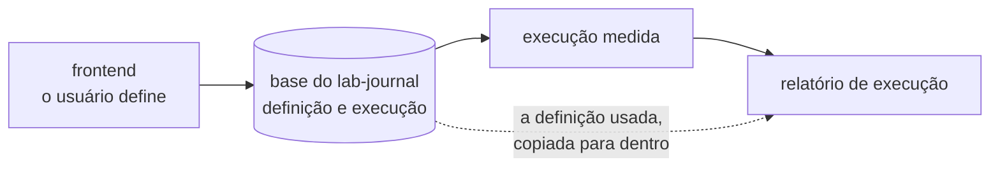

**A segunda é o relatório citar a definição por identificador.** O relatório fica menor e
não duplica o que o banco já guarda; em troca, reproduzir uma execução antiga exige o
banco que ainda tenha aquele identificador — que é exatamente o que a decisão do ADR-0011
admitiu não sobreviver.

**Ela alcança um contrato que ainda não existe.** O JSON Schema do relatório de execução
está listado como não decidido em
[`../contracts/README.md`](../contracts/README.md#estado-nenhum-contrato-existe), com o
primeiro relatório emitido como gatilho. Decidir `E-42` depois desse gatilho fixaria a
forma por omissão.

**Sem recomendação.** A linha nasce com o registro do que a poda teria apagado, e nada
além disso.

#### `E-43` — as três pendências do ADR-0013 vivem dentro de uma linha fechada

Aberta em 2026-08-09, pela revisão do ADR-0013. O
[fecho de `E-37`](#e-37-fecha-na-proveniência-e-a-contiguidade-deixa-de-ser-opcional)
enumera três coisas que aquela linha não decide, e o ADR-0013 as declara em
`### Negativas`. Mas `E-37` está **fechada**, e uma pendência registrada dentro de uma
linha fechada não é enfileirada por ninguém: ela só é encontrada por quem já sabe que
existe. O precedente contrário é `E-42`, aberta no commit anterior exatamente para isso.

**As três.** O rótulo da execução invalidada por buraco de LSN — se é
[`fonte atrasada`](../CONTEXT.md#os-dois-rótulos-do-instrumento-decididos-em-2026-08-05),
que `A3` deu ao estouro do limite de espera, ou um distinto. Onde a conferência de
contiguidade vive: conector de CDC, consumidor do broker ou o próprio oráculo. E se a
espera pelo LSN do commit final alcança também o oráculo do predicado.

**A terceira não é igual às outras duas**, e é por isso que a linha existe em vez de as
três ficarem onde estão. Sem condição de término, a soma pode ser lida cedo demais e sair
parcial — o mesmo falso negativo silencioso que a guarda de contiguidade evita, por outra
porta. O card diz isso na letra:
[a terceira ainda produz veredito errado](../features/deteccao-de-protecao-inerte/feature-card.md#riscos-e-decisões-pendentes).

**Decidir se elas viram uma linha, três linhas ou questões em `docs/questions/`** é o que
esta linha enfileira. Sem recomendação.

**A apuração de 2026-08-10 achou que uma das três alternativas embute uma decisão que
esta linha não toma.** As três pendências nasceram na revisão de um ADR que nasceu
`Aceito`. A pasta `docs/questions/` tem regra de transporte para duas origens apenas,
[`ADR proposto` e `contra-avaliação`](../questions/README.md#de-onde-uma-questão-vem), e
nenhuma delas alcança um ADR aceito. Pela
[origem nova](../questions/README.md#origem-nova-e-o-que-ainda-não-tem-regra), as três
entrariam com `Tipo de origem` sem decisão, e repetiriam o precedente das sete linhas de
`auditoria documental` — que o [índice](../questions/README.md#índice) declara descritivo,
e não regra decidida.

**As três não têm o mesmo destino, e o índice de questões exige um.** A coluna
`Destino na fila` é obrigatória lá. O rótulo da execução invalidada pertence ao
vocabulário do relatório, ao lado de `A3` e de
[`E-42`](#e-42--o-relatório-de-execução-incorpora-a-definição-usada-ou-a-cita). O lugar da
conferência pertence à fronteira do
[ADR-0012](0012-o-broker-no-caminho-do-veredito-e-a-dispensa-que-ele-exigiu.md#decisão), e
não é decidível hoje: nenhum código de oráculo, de conector ou de consumidor existe na
árvore. A condição de término pertence a
[`O19`](arquivo/proposta-2026-08-03/decisoes-pendentes.md#o19-fecha-o-oráculo-espera-o-cdc-com-limite-declarado),
que fechou em 2026-08-05 para o oráculo exato.

**A terceira tem urgência que as outras duas não têm.** Ela produz veredito errado hoje,
pela letra do
[card](../features/deteccao-de-protecao-inerte/feature-card.md#riscos-e-decisões-pendentes).
As outras duas fixam um nome e um lugar de código. Uma linha única faz a terceira esperar
o tempo das outras duas, e uma citação vinda do card deixa de dizer qual das três ela
alcança.

| Alternativa | O que faz                                             | Custo                                                      |
|-------------|-------------------------------------------------------|------------------------------------------------------------|
| A           | uma linha, as três juntas                             | mistura urgência e destino; a citação do card fica ambígua |
| B           | três linhas, uma por pendência                        | a fila cresce em três, e duas delas são pequenas           |
| C           | três questões em `docs/questions/`                    | decide de passagem a origem nova, que segue sem decisão    |
| D           | a terceira em linha própria, as duas primeiras juntas | duas linhas em vez de uma ou três                          |

**Uma linha cujo gatilho ainda não ocorreu tem precedente nesta fila.** A própria
[`E-42`](#e-42--o-relatório-de-execução-incorpora-a-definição-usada-ou-a-cita) alcança um
contrato que ainda não existe, e foi aberta assim de propósito. O custo de `B` não é,
portanto, a indecidibilidade de uma das três: é apenas o tamanho da fila.

**Nada disto decide a linha**, e a escolha continua da pessoa.

#### `E-43` fecha em três linhas, escolhidas em 2026-08-10

**Escolhido pela pessoa em 2026-08-10**, pela alternativa `B`. Cada pendência recebe linha
própria nesta fila, com nome, destino e citação inequívoca:
[`E-45`](#e-45--o-buraco-de-lsn-não-cabe-em-nenhum-dos-dois-rótulos-do-instrumento),
[`E-46`](#e-46--onde-a-conferência-de-contiguidade-de-lsn-vive) e
[`E-47`](#e-47--a-soma-do-oráculo-do-predicado-não-tem-condição-de-término).

**As duas descartadas, e o motivo de cada uma.** A alternativa `C` decidiria de passagem o
critério de entrada de uma origem nova em `docs/questions/`, que a
[origem nova](../questions/README.md#origem-nova-e-o-que-ainda-não-tem-regra) declara sem
decisão. A alternativa `D` agruparia duas pendências por urgência, e não por assunto — e
esta fila cita linha [pelo nome](#como-citar-uma-linha-desta-fila), de modo que um nome
que cobrisse "o rótulo e o lugar do código" não diria qual das duas alcança.

**O card do E5 passa a citar os fechos das linhas que viram regra**, no lugar do fecho de
`E-37`: `R8` cita `E-46` e `R9` cita `E-47`. `E-45` fica de fora porque ela nomeia um
rótulo, e quem define rótulo é o glossário. As quatro citações
que o
[ADR-0013](0013-a-proveniencia-da-fonte-como-criterio-da-proibicao-do-oraculo.md#negativas)
faz ao fecho de `E-37` **não** são patchadas: elas não estão erradas, porque aquele fecho
continua enumerando as três, e o corpo de um ADR aceito só muda pelas formas do
[lifecycle](README.md#a-revogação-da-imutabilidade-decidida-em-2026-08-07).

#### `E-45` — o buraco de LSN não cabe em nenhum dos dois rótulos do instrumento

**Fechada em 2026-08-10.** O terceiro rótulo do instrumento é `fonte incompleta`, e o par
legível vira trio. O racional vive em
[`E-45` fecha em `fonte incompleta`](#e-45-fecha-em-fonte-incompleta-escolhida-em-2026-08-10).

#### `E-46` — onde a conferência de contiguidade de LSN vive

**Fechada em 2026-08-10.** A guarda vive no consumidor do broker, e o oráculo recebe um
stream já atestado. O racional vive em
[`E-46` fecha no consumidor do broker](#e-46-fecha-no-consumidor-do-broker-escolhida-em-2026-08-10).

#### `E-47` — a soma do oráculo do predicado não tem condição de término

**Fechada em 2026-08-10.** O sistema medido escreve uma marca de fim fora da janela medida,
e o oráculo soma até reconhecê-la no stream. O racional vive em
[`E-47` fecha na sentinela](#e-47-fecha-na-sentinela-escolhida-em-2026-08-10).

### A rodada de 2026-08-10: a completude do stream ganha dono, e o par vira trio

**As quatro linhas desta rodada fecharam em 2026-08-10**, tratadas juntas porque as
quatro descendem da mesma retirada: o
[ADR-0010](0010-a-fronteira-de-schema-e-o-cdc-como-fonte-do-veredito.md#decisão) tirou o
`SELECT sum` do oráculo do predicado, e o
[ADR-0013](0013-a-proveniencia-da-fonte-como-criterio-da-proibicao-do-oraculo.md#decisão)
pôs o WAL no lugar. `E-47` fixou como o oráculo sabe que pode somar, `E-46` fixou quem
confere a contiguidade, `E-45` nomeou a execução invalidada e `E-44` mandou reparar o
glossário.

#### `E-47` fecha na sentinela, escolhida em 2026-08-10

**Escolhido pela pessoa em 2026-08-10**, pela sentinela. O sistema medido escreve uma marca
de fim depois que todos os workers terminam, e o oráculo soma até reconhecer o evento dessa
marca no stream. O LSN da marca é o "LSN do commit final" que
[`O19`](arquivo/proposta-2026-08-03/decisoes-pendentes.md#o19-fecha-o-oráculo-espera-o-cdc-com-limite-declarado)
nomeia, obtido sem consultar relógio.

**O limite de espera continua existindo, e muda de papel.** Ele deixa de decidir quando o
resultado está pronto, e passa a decidir apenas quando desistir. A desistência produz
`fonte atrasada`, que já existe no glossário, e não um veredito. Pela formulação por papel
do valor fixada em `E-13`, um limite que não entra em veredito não é alcançado pela regra
do relógio injetável. **O valor dele segue `Pergunta em aberto`**, e a razão mudou: ele
deixou de ser insumo de veredito.

**As três descartadas, e o motivo de cada uma.** Estender `O19`, esperando o LSN do commit
final sob limite de tempo, não diz ao oráculo que o stream acabou: ele soma o que chegou
até o limite e **emite veredito** sobre uma soma parcial. Um `Σ amount` incompleto sai
abaixo de `capacity` e produz `protegido` sobre um banco violado — veredito errado, e não a
ausência de veredito que a desistência da sentinela produz. Essa é a diferença entre as
duas, e não a estabilidade do desfecho.
Contar eventos supõe que o número de passagens por `AFTER_COMMIT` iguale o número de
eventos de `INSERT`, e `allocate` insere apenas quando couber — a diferença entre os dois
números é exatamente o que
[`R6`](../features/deteccao-de-protecao-inerte/feature-card.md#regras-de-negócio) exige que
a amostra contenha. Atribuir a completude ao transporte não é resposta própria: desloca a
pergunta para `E-46`, que fechou no mesmo dia.

**O que esta linha não decide.** A forma da marca — tabela própria, coluna em tabela
existente, ou outra — não foi escolhida, nem quem a emite dentro do sistema medido. O que
ficou fixado é que ela é escrita **pelo sistema medido**, fora da janela medida: o Lab
Plane escrever ali quebraria a fronteira do
[ADR-0010](0010-a-fronteira-de-schema-e-o-cdc-como-fonte-do-veredito.md#decisão).

#### `E-46` fecha no consumidor do broker, escolhida em 2026-08-10

**Escolhido pela pessoa em 2026-08-10.** A conferência de contiguidade de LSN vive no
consumidor do broker. Ele entrega ao oráculo um stream já atestado, e todo leitor a jusante
dele herda a guarda sem reimplementá-la.

**A completude passa a ter dono único, e era esse o risco.** A mesma camada confere o
buraco no meio e reconhece a marca de fim que `E-47` escolheu. Sem isso, a guarda ficaria
num lugar e a espera noutro, e nenhum dos dois poderia afirmar que o stream está completo.

**As duas descartadas.** O conector é o Debezium Server, pelo
[ADR-0012](0012-o-broker-no-caminho-do-veredito-e-a-dispensa-que-ele-exigiu.md#decisão), e
o que se versiona dele é configuração declarativa, como a apuração de
[`E-31`](#e-31--a-variável-de-ambiente-sobrepõe-tudo-e-isso-dissolve-a-tensão-do-secret)
levantou: pôr a guarda ali exigiria transformação própria ou fork, e nenhuma das duas é
configuração. O oráculo protegeria apenas a si: qualquer outro leitor do mesmo stream —
uma projeção, um exportador — ficaria sem guarda, ainda que dentro do `lab-plane`. Um
segundo **consumidor** do broker reimplementaria a guarda nos dois desenhos; a diferença
está em quantos leitores um único consumidor cobre.

**A linha fecha antes do gatilho, de propósito.** Nenhum dos componentes existe na árvore.
O que a decisão evita é o gatilho chegar e o dono ser escolhido por omissão, pelo primeiro
código que alguém escrever — o mesmo modo de falha que
[`E-42`](#e-42--o-relatório-de-execução-incorpora-a-definição-usada-ou-a-cita) nomeia.

**A apuração do fecho achou que os dois ADRs aceitos já divergiam no ator.** O
[ADR-0012](0012-o-broker-no-caminho-do-veredito-e-a-dispensa-que-ele-exigiu.md#decisão) diz
que **o `lab-plane`** DEVE usar o LSN para ordenar, desduplicar e detectar buraco na
sequência antes de calcular o veredito, e põe o filtro por execução no consumidor, dentro
do `lab-plane`. O
[ADR-0013](0013-a-proveniencia-da-fonte-como-criterio-da-proibicao-do-oraculo.md#decisão)
diz que **o oráculo** DEVE conferir a contiguidade. Os dois atores vivem no mesmo processo,
e nenhum dos dois ADRs escolheu a camada — a negativa do ADR-0013 declara isso na letra.
Esta linha escolhe a camada, e por isso **não** contradiz nenhum dos dois: ela fecha uma
lacuna que os dois deixaram.

**O que sobra é a frase "parte do oráculo, e não acessório", do ADR-0013.** Ela diz que sem
a guarda o veredito não vale, e continua verdadeira: o oráculo recebe um stream atestado, e
não produz veredito sem o atestado. Lida como **condição de validade**, a frase convive com
esta decisão. Lida como **localização**, ela a contradiz, e aí seria preciso ADR. A leitura
adotada aqui é a primeira, e quem discordar tem nesta linha o registro de que a escolha
existiu.

#### `E-45` fecha em `fonte incompleta`, escolhida em 2026-08-10

**Escolhido pela pessoa em 2026-08-10**, pela criação de um terceiro rótulo, e o nome dele
é `fonte incompleta`. Ele nomeia a fonte que alcançou o ponto declarado e chegou com buraco
na sequência de LSN. O par legível vira trio, e lê-se em série: uma fonte diverge, a outra
não chega, a terceira chega incompleta.

**Os quatro nomes descartados, e o motivo de cada um.** `fonte descontínua` nomeia o
defeito com precisão, e é menos legível ao lado de `protegido` e `violado`. `fonte com
lacuna` carrega `lacuna`, que neste repositório já significa ausência documental. `fonte
truncada` sugere corte no fim, e o defeito é buraco no meio. Reusar `fonte atrasada`, que
era a alternativa a criar rótulo novo, perde por fazer uma palavra nomear duas falhas
diferentes — que é o que `A3` recusou ao criar dois rótulos em vez de um.

**O glossário é corrigido no mesmo dia**, pelo fecho de `E-44`, e o terceiro rótulo entra
na tabela de classificação do ADR-0004 pelo caminho de subsunção que o par já usou.

#### `E-44` fecha em reparo imediato, escolhida em 2026-08-10

**Escolhido pela pessoa em 2026-08-10.** O glossário é corrigido agora, no mesmo ato que
registra `E-45`, e não num turno futuro da skill `domain-modeling`. A regra daquela skill
fala do turno em que um termo é resolvido; o termo foi resolvido em 2026-08-09, pelo
ADR-0013, e o glossário não mudou naquele turno. O que se faz hoje é reparo, e não lote.

**A correção tem duas partes, e as duas saem juntas.** A entrada `predicate oracle` deixa
de descrever o `SELECT sum` que o ADR-0010 retirou, e passa a citar a evidência por âncora
GFM em vez de número de linha, como `C-1` exige. A seção dos rótulos recebe `fonte
incompleta`, com o título preservado porque ele é citado por âncora.

**A alternativa descartada era esperar a skill.** Ela perde porque a contradição com dois
ADRs aceitos permaneceria até um turno que ninguém agendou, e porque corrigir junto do
rótulo novo toca o arquivo uma vez em vez de duas.

**Quem é dono do glossário continua `Pergunta em aberto`.** Nenhuma frase de
[`CONTEXT.md`](../CONTEXT.md) diz quem o mantém ou como uma entrada errada é reparada; a
regra vive fora dele, no
[`AGENTS.md` de `docs/`](../AGENTS.md#glossário-de-domínio). A pessoa não fechou essa
ausência neste ato.

**O reparo alcançou só `predicate oracle` e o rótulo novo, e nada além disso.** As
demais entradas do glossário que citam o ADR-0002 por número de linha continuam como
estavam antes deste fecho, e pelo menos quatro já citam um número que não alcança mais o
trecho que sustentou a entrada — o próprio defeito que `C-1` proíbe: `exact oracle` e
`materialized truth` apontam para linha fora de
[`## Vocabulário`](0002-o-dominio-minimo-e-os-dois-oraculos.md#vocabulário) e de
[`### O oráculo exato`](0002-o-dominio-minimo-e-os-dois-oraculos.md#o-oráculo-exato), e
`Resource` e `Allocation` apontam para linha fora de
[`## Decisão`](0002-o-dominio-minimo-e-os-dois-oraculos.md#decisão), que é onde as duas
entidades estão hoje. Consertar essas quatro citações não foi decidido aqui — a linha
fica dívida nomeada no glossário, não fato reparado por este fecho.

#### `E-48` — a precedência entre `fonte incompleta` e `fonte atrasada` diverge entre os dois diagramas

Aberta em 2026-08-10, achada ao conferir os diagramas que os fechos de `E-46` e `E-47`
levaram para dois documentos diferentes.

**O problema.** O diagrama de [`CONTEXT.md`](../CONTEXT.md), num bloco Mermaid sem
título que o alcance (`docs/CONTEXT.md:818-827`), pergunta primeiro se as duas fontes
alcançaram o commit final — o que produz `fonte atrasada` quando a resposta é não — e só
depois confere a contiguidade de LSN, que produz `fonte incompleta`. O diagrama do
[card de detecção de proteção
inerte](../features/deteccao-de-protecao-inerte/feature-card.md), também num bloco
Mermaid sem título que o alcance
(`docs/features/deteccao-de-protecao-inerte/feature-card.md:71-96`), inverte a ordem: a
contiguidade de LSN é conferida primeiro, e a marca de fim só depois. Para um stream que
chega com buraco **e** estoura o limite de espera na mesma execução, os dois documentos
rotulam o mesmo caso de formas diferentes — `fonte atrasada` no primeiro, `fonte
incompleta` no segundo.

**Nenhum dos dois fechos decidiu a ordem entre as duas condições.**
[`E-46`](#e-46-fecha-no-consumidor-do-broker-escolhida-em-2026-08-10) escolheu **quem**
confere a contiguidade, e [`E-47`](#e-47-fecha-na-sentinela-escolhida-em-2026-08-10)
escolheu **como** o oráculo reconhece o fim do stream; nenhuma das duas linhas comparou
as duas verificações entre si nem previu o caso em que ambas falham juntas.

**Duas saídas, e o custo de cada uma.**

- **A marca de fim é conferida primeiro**, como em `CONTEXT.md`. Uma execução que nunca
  alcança o commit final sai `fonte atrasada`, mesmo que o stream recebido até o limite
  de espera já tivesse um buraco. O custo é descartar informação: o buraco existiu, e o
  rótulo não o carrega.
- **A contiguidade é conferida primeiro**, como no card. Uma execução com buraco sai
  `fonte incompleta`, mesmo que ela também nunca fosse alcançar o commit final. O custo
  é o mesmo, do lado oposto: o estouro do limite de espera existiu, e o rótulo não o
  carrega.

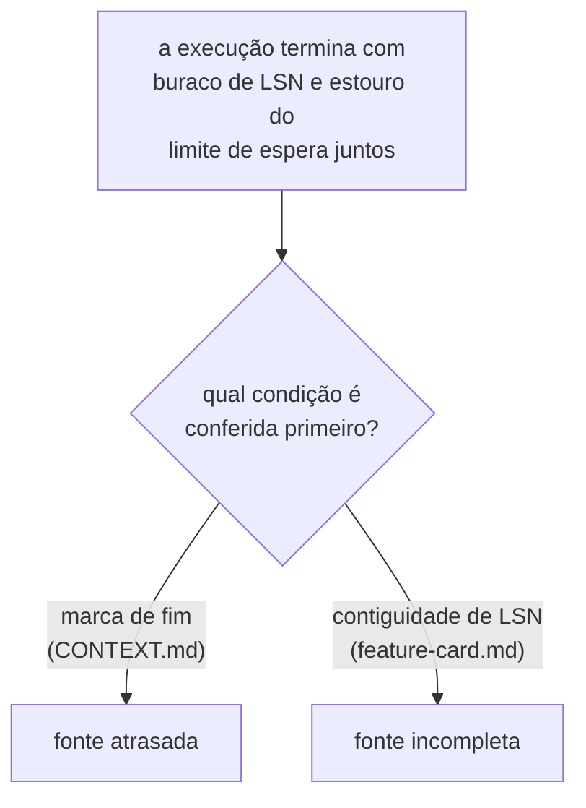

**Sem recomendação.** A linha nasce com a divergência registrada entre os dois
documentos, e nenhum dos dois diagramas foi alterado para resolvê-la.

#### `E-48` fecha em contiguidade primeiro, escolhida em 2026-08-10

**Escolhido pela pessoa em 2026-08-10.** A contiguidade de LSN é conferida antes da marca
de fim. O diagrama do
[card de detecção de proteção inerte](../features/deteccao-de-protecao-inerte/feature-card.md#integrações-e-contratos-afetados)
já estava nesta ordem, e não muda. O diagrama de
[`CONTEXT.md`](../CONTEXT.md#os-dois-rótulos-do-instrumento-decididos-em-2026-08-05),
que estava na ordem inversa, foi corrigido para esta.

**A citação por linha do enunciado ficou desatualizada, e este fecho registra isso.** O
bloco Mermaid que o enunciado cita em `docs/CONTEXT.md:818-827` era o texto **antes**
desta correção. A troca de ordem deslocou o texto ao redor dele, e hoje o mesmo bloco —
já com a contiguidade perguntada primeiro — vive em `docs/CONTEXT.md:825-834`.

**A frase do enunciado sobre os dois diagramas também ficou para trás.** Ele diz que
"nenhum dos dois diagramas foi alterado para resolvê-la", e isso descrevia o estado no
momento em que a linha foi aberta. O diagrama de `CONTEXT.md` foi alterado por este
fecho, e a frase não descreve mais o estado corrente. O enunciado permanece como nasceu
— este parágrafo só nomeia onde ele ficou para trás.

**A correção não parou no diagrama, e este fecho registra isso também.** O mesmo commit
reescreveu a prosa do glossário ao redor dele: a entrada `fonte incompleta` deixou de
dizer que a fonte "**alcançou** o ponto declarado e chegou **incompleta**", e o parágrafo
"O terceiro não desfaz o par" foi refeito para não depender de a fonte alcançar o commit
final. Sob esta ordem, o rótulo sai ao achar o buraco, **independentemente** de a fonte
alcançar o ponto declarado depois.

**Isso deixa a caracterização do fecho de `E-45` desatualizada, sem alterá-lo.** Aquele
fecho, nesta mesma página, diz que o rótulo "nomeia a fonte que **alcançou o ponto
declarado** e chegou com buraco na sequência de LSN"
([`E-45` fecha em `fonte incompleta`](#e-45-fecha-em-fonte-incompleta-escolhida-em-2026-08-10)).
Essa frase descrevia a condição de emissão do rótulo antes desta linha decidir a ordem
entre as duas conferências; hoje ela não descreve mais quando `fonte incompleta` sai. O
corpo de `E-45` permanece como fechou — este parágrafo só nomeia onde a descrição ficou
para trás.

**Os dois motivos.** Um buraco de LSN é fato **definitivo sobre a fonte**: uma vez achado,
ele não se desfaz. O estouro do limite de espera é fato **sobre o instrumento** — o limite
é escolhido por alguém, e o valor dele continua `Pergunta em aberto` pelo fecho de
[`E-47`](#e-47-fecha-na-sentinela-escolhida-em-2026-08-10). Rotular pelo fato sobre o
instrumento quando existe um fato sobre a fonte descarta o diagnóstico mais forte. E a
ordem inversa **mascara a causa**: se o evento perdido no buraco for justamente o da marca
de fim, conferir a marca primeiro produz `fonte atrasada` — um rótulo que diz "espere
mais" para um caso em que esperar nunca resolve o problema. `fonte incompleta` diz o que
consertar.

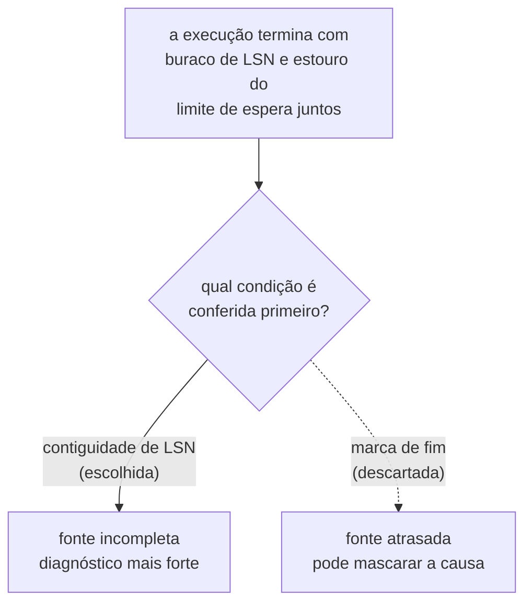

**As duas descartadas, e o motivo de cada uma.** Marca de fim primeiro, como o
`CONTEXT.md` fazia, se sustentaria se a contiguidade só pudesse ser avaliada sobre um
stream que se sabe terminado — enquanto eventos ainda chegam, um "buraco" poderia ser
transitório. Perde pelo segundo motivo acima: mascara a causa no caso em que as duas
condições falham juntas. Rótulo primário mais secundário — conferindo as duas condições e
reportando as duas — é a única saída que não descarta informação nenhuma; perde por custo:
o rótulo do instrumento é hoje um valor único entre
[três](../CONTEXT.md#os-dois-rótulos-do-instrumento-decididos-em-2026-08-05) — `fonte
atrasada`, `fonte incompleta`, `fontes divergentes` —, e reportar dois valores onde hoje
há um não foi decidido em lugar nenhum. Isto não é o formato do veredito: os três rótulos
"falam do **instrumento**, e nenhum é veredito sobre o system under test"
([`CONTEXT.md`](../CONTEXT.md#os-dois-rótulos-do-instrumento-decididos-em-2026-08-05)), e
o fecho de [`E-47`](#e-47-fecha-na-sentinela-escolhida-em-2026-08-10) já trata `fonte
atrasada` como o oposto de veredito — "e não um veredito". O campo composto discutido
aqui, se viesse a existir, viveria no rótulo do instrumento, e não na posição 9 da fila,
que é sobre booleano contra curva.

**Pergunta em aberto, que esta escolha herda.** Ela repousa na premissa de que um buraco
de LSN é **definitivo**, e não transitório — isto é, de que o transporte não entrega
eventos fora de ordem de LSN. Nenhum documento deste repositório afirma nem nega isso. Se
o transporte puder reordenar, a contiguidade avaliada cedo demais produz `fonte
incompleta` sobre um stream que ainda ia se completar, e o diagnóstico mais forte vira o
mais precipitado.

#### `E-49` — o `CONTEXT.md` cita a fila instável, e a citação vira lápide

Aberta em 2026-08-10, achada ao registrar `E-44` e `E-45` no glossário. A pessoa
objetou ao padrão antes da próxima citação nascer: o `CONTEXT.md` não deveria
referenciar um arquivo instável como esta fila.

**O problema, na formulação da pessoa.** O [`CONTEXT.md`](../CONTEXT.md) cresce, funde
e poda linha a linha, pela regra de
[`Como citar uma linha desta fila`](#como-citar-uma-linha-desta-fila). Um glossário que
existe para fixar vocabulário estável passa a citar um documento cujo próprio nome —
fila — é a promessa de que ele muda.

**Até 2026-08-10 o glossário só citava a moldura da fila.** No último commit que
tocou o arquivo, `a84ce7b` (2026-08-07), havia onze citações, e as onze apontavam
para heading `##` ou `###` — moldura estrutural, que sobrevive a qualquer poda de
linha individual: três para
[`#o-que-esta-fila-enfileira`](#o-que-esta-fila-enfileira), cinco para `#bloco-4` e três
para
[`#bloco-3`](#bloco-3--pertencem-a-um-adr-já-enfileirado-e-a-recomendação-é-não-decidir-agora).

> **A premissa de que moldura sobrevive a qualquer poda caiu em 2026-08-10.** O Bloco 4
> foi apagado nesse dia, depois que as cinco citações do glossário saíram por este mesmo
> fecho: sem citante, moldura também é podável. O que protege um heading é a citação, e
> não o nível dele.

**As três citações a um fecho de linha individual nasceram neste turno.** Ao registrar
`E-44` e `E-45` no glossário, este mesmo turno acrescentou uma citação ao
[`E-44` fecha em reparo imediato](#e-44-fecha-em-reparo-imediato-escolhida-em-2026-08-10)
e duas ao
[`E-45` fecha em `fonte incompleta`](#e-45-fecha-em-fonte-incompleta-escolhida-em-2026-08-10),
levando o total a catorze. Nenhuma citação do glossário a um fecho de linha
individual existia antes de hoje — foi exatamente essa mudança de padrão que a pessoa
notou.

**O glossário não é o maior citador desta fila — os ADRs aceitos são.** Por `grep`, em
2026-08-10: o
[ADR-0010](0010-a-fronteira-de-schema-e-o-cdc-como-fonte-do-veredito.md) cita cinco
vezes, sobre quatro âncoras distintas; o
[ADR-0011](0011-a-topologia-de-servicos-e-o-caderno-de-laboratorio-fora-do-git.md)
cita dez vezes, sobre dez âncoras distintas; o
[ADR-0012](0012-o-broker-no-caminho-do-veredito-e-a-dispensa-que-ele-exigiu.md) cita
cinco vezes, sobre cinco âncoras distintas; o
[ADR-0013](0013-a-proveniencia-da-fonte-como-criterio-da-proibicao-do-oraculo.md) cita
sete vezes, sobre duas âncoras distintas. As quatro somam vinte e sete citações,
quase o dobro das catorze do glossário. Isto importa porque um ADR aceito NÃO PODE ser
editado para desfazer a citação, pelas formas do
[lifecycle](README.md#a-revogação-da-imutabilidade-decidida-em-2026-08-07): a
instabilidade que o problema aponta já produz lápide permanente nos quatro ADRs, e a
fila não pode desamarrar essas citações mesmo se o glossário parar de citá-la.

**O mecanismo é um cliquet, e ele só gira numa direção.** A regra de poda em
[A saída, decidida em 2026-08-06](#a-saída-decidida-em-2026-08-06) diz que heading
citado por documento imutável permanece byte a byte; onde ninguém cita, a narrativa é
apagada sem lápide. Cada citação externa nova — de um ADR aceito ou do glossário —
converte uma linha que seria podável em texto permanente, e a fila só encolhe onde
ninguém apontou. As três citações de hoje já fizeram isso: `E-44` e `E-45` não podem
mais virar lápide sem quebrar o `CONTEXT.md`.

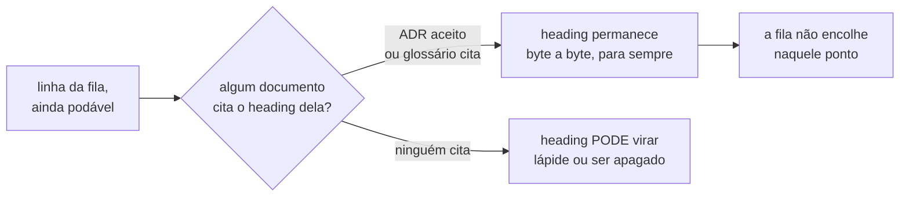

**Quatro saídas, e o custo de cada uma.**

| Alternativa | O que faz                                                                                                                 | Custo                                                                                                                                   |
|-------------|---------------------------------------------------------------------------------------------------------------------------|-----------------------------------------------------------------------------------------------------------------------------------------|
| A           | só a moldura é citável: o glossário PODE citar heading estrutural e NÃO DEVE citar fecho de linha individual              | perde-se navegação clicável para o racional de `E-44` e `E-45`; a distinção entre moldura e linha não está escrita em lugar nenhum hoje |
| B           | nenhuma citação à fila: as 14 saem, e as seis seções `D-DOM-01` a `D-DOM-06` nomeiam a decisão só pelo identificador      | 14 links viram texto; a saída não alcança os ADRs aceitos, que continuam citando a fila e não podem ser editados                        |
| C           | inverter a direção: o glossário nunca cita a fila; a fila passa a citar o glossário quando uma linha fecha em vocabulário | exige varrer a fila e reescrever os fechos de vocabulário; também não alcança os ADRs aceitos                                           |
| D           | status quo: a regra de lápide cobre o caso, e nenhuma citação quebrou na poda de 2026-08-10                               | a fila cresce monotonicamente — cada citação externa nova é uma lápide que nunca sai                                                    |

**Sem recomendação.** A linha nasce com o mecanismo e as quatro saídas registrados, e
nenhum diagrama ou tabela deste repositório foi alterado para escolher entre elas.

#### `E-49` fecha em nenhuma citação à fila, com alcance estendido aos ADRs aceitos, escolhida em 2026-08-10

**Escolhido pela pessoa em 2026-08-10**, pela alternativa `B` — nenhuma citação a esta
fila sobrevive em documento estável — **estendida a um alcance que a própria linha não
previa**: as quatro alternativas registradas em `E-49` comparavam apenas o glossário
contra a fila; a pessoa estendeu a mesma regra aos quatro ADRs aceitos que citam esta
página, o que nenhuma das quatro enunciava.

**O CONTEXT.md.** As catorze citações da tabela do enunciado saíram. Três delas — as que
apontavam para o heading estrutural
[`#o-que-esta-fila-enfileira`](#o-que-esta-fila-enfileira) — viraram menção sem link ao
substantivo "fila de decisões". As onze restantes — cinco para o Bloco 4, apagado desta
fila em 2026-08-10, três para o
[Bloco 3](#bloco-3--pertencem-a-um-adr-já-enfileirado-e-a-recomendação-é-não-decidir-agora)
e uma para cada um dos fechos de [`E-44`](#e-44-fecha-em-reparo-imediato-escolhida-em-2026-08-10)
e [`E-45`](#e-45-fecha-em-fonte-incompleta-escolhida-em-2026-08-10) — viraram menção ao
identificador da decisão (`D-DOM-01` a `D-DOM-06`, `E-44`, `E-45`, `A5`) como texto, sem
link. Nenhuma das catorze apagou informação: o fato que cada uma sustentava continua no
glossário, só deixou de ser uma citação formal com caminho e âncora para esta fila.

**Os ADRs aceitos, dentro do que o lifecycle permitiu.** Das vinte e sete citações que o
enunciado mediu em quatro ADRs, quatro saíram por **patch**, registrado em
`## Patches aplicados` de cada arquivo alterado, no mesmo commit deste fecho:

| ADR      | Onde               | O que a fila dizia                               | Para onde foi                                                                                                                                 |
|----------|--------------------|--------------------------------------------------|-----------------------------------------------------------------------------------------------------------------------------------------------|
| ADR-0010 | `### Neutras`      | fecho de `E-12`, sobre quem decidiu o transporte | âncora para o próprio [ADR-0012](0012-o-broker-no-caminho-do-veredito-e-a-dispensa-que-ele-exigiu.md#decisão), que existe e fixa o mesmo fato |
| ADR-0010 | `### Neutras`      | "o que o esqueleto prova e o que ele não prova"  | citação removida; o fato já está evidenciado no `## Contexto` do próprio ADR-0010                                                             |
| ADR-0010 | `### Neutras`      | "o que `E-18` preserva e o que ela desmonta"     | citação removida; o fato é a própria `## Decisão` do ADR-0010                                                                                 |
| ADR-0013 | `## Justificativa` | fecho de `E-37`, sobre a guarda de contiguidade  | referência ao item 3 da própria `## Decisão` do ADR-0013                                                                                      |

As quatro se qualificaram como patch porque a correção trocou só a âncora — o fato citado
continuava vale, e nenhuma mudou a decisão, a justificativa, a alternativa descartada ou o
trade-off que a citação sustentava, na letra da
[fronteira objetiva](README.md#a-revogação-da-imutabilidade-decidida-em-2026-08-07) do
regime de patch.

**O que esta escolha não resolve.** Vinte e três das vinte e sete citações continuam
citando esta fila, porque nenhuma forma que o lifecycle permite as alcança sem forçar.
Nomeadas uma a uma:

- **ADR-0010, `### Negativas`** — as duas citações ao fecho aberto de
  [`E-37`](#e-37--o-que-a-proibição-de-derivar-estado-de-stream-alcança) ("a fonte do
  oráculo de capacidade fica sem decisão" e "se a proibição alcança também a leitura
  direta não está decidido"). Redirecioná-las para o ADR-0013, que fechou `E-37` depois
  desta escrita, inverteria o que a `## Consequências` deste ADR afirma sobre o próprio
  estado do ADR-0010 em 2026-08-06 — mudança de consequência, e não de citação.
- **ADR-0011** — as dez citações, em `## Contexto`, `## Decisão`, `## Justificativa` e
  `### Neutras`: a tabela de rodadas que sustenta "por que a contagem de quatro deixa de
  valer", o "sem BFF" dentro de `## Decisão`, e cada trade-off do componente de
  identidade. Nenhum ADR nem questão registra o mesmo fato; a fila é a única fonte, e
  remover a citação deixaria a afirmação sem evidência — o que a
  [política de citação da raiz](../../AGENTS.md#ao-trabalhar-aqui) proíbe.
- **ADR-0012** — as cinco citações (`E-31`, `E-32`, `E-34`, `E-35`, `E-5`), quatro delas
  marcando `Pergunta em aberto`. Nenhum `E-*` desta fila tem contraparte em
  `docs/questions/`, porque a origem `E-*` de um ADR aceito não tem regra de transporte
  ([`questions/README.md`](../questions/README.md#origem-nova-e-o-que-ainda-não-tem-regra)).
  Sem alternativa e sem citação, a `## Consequências` ficaria sem evidência nenhuma.
- **ADR-0013** — as seis restantes: as três ao fecho aberto de
  [`E-37`](#e-37--o-que-a-proibição-de-derivar-estado-de-stream-alcança) (`## Relacionado`,
  `## Contexto` e `## Problema`, estabelecendo o problema que este ADR resolve) e três das
  quatro ao fecho fechado — o rótulo de `fonte atrasada` versus um rótulo novo, onde a
  guarda de contiguidade vive, e se a espera de `O19` alcança o oráculo do predicado.
  As três últimas seguem `Pergunta em aberto` na letra do ADR-0013; as respostas de fato
  vieram de `E-45`, `E-46` e `E-47`, nenhuma delas um ADR — redirecionar mudaria o que o
  leitor entende como decidido, sem que nenhum ADR novo tenha sido escrito para isso.

**A consequência sobre a poda.** A saída da citação não fecha lápide nenhuma sozinha —
[o mecanismo é um cliquet](#e-49--o-contextmd-cita-a-fila-instável-e-a-citação-vira-lápide):
um heading só volta a ser podável quando **nenhuma** citação externa restar. Apurado em
2026-08-10, depois desta edição, com o comando abaixo, aplicado a cada heading:

```bash
python scripts/check_citations.py --root . --quem-cita "docs/adr/fila-de-decisoes.md#<slug>"
```

| Heading                                                                            | Citantes restantes                                                                         | Elegível para poda?                |
|------------------------------------------------------------------------------------|--------------------------------------------------------------------------------------------|------------------------------------|
| `#e-44-fecha-em-reparo-imediato-escolhida-em-2026-08-10`                           | só internos (`fila-de-decisoes.md:2553`, `:2618`, `:2898`)                                 | **sim**                            |
| `#bloco-4--vocabulário-decidível-a-qualquer-momento-e-barato`                      | só internos (`fila-de-decisoes.md:207`, `:2548`, `:2616`)                                  | **sim**                            |
| `#bloco-3--pertencem-a-um-adr-já-enfileirado-e-a-recomendação-é-não-decidir-agora` | só internos (`:331`, `:2549`, `:2617`)                                                     | **sim**                            |
| `#e-45-fecha-em-fonte-incompleta-escolhida-em-2026-08-10`                          | só internos (`:2333`, `:2555`, `:2619`)                                                    | **sim**                            |
| `#e-12-fecha-no-broker-e-o-lsn-é-o-que-torna-a-escolha-defensável`                 | nenhum                                                                                     | **sim**                            |
| `#o-que-o-esqueleto-prova-e-o-que-ele-não-prova`                                   | nenhum                                                                                     | **sim**                            |
| `#o-que-e-18-preserva-e-o-que-ela-desmonta`                                        | nenhum                                                                                     | **sim**                            |
| `#o-que-esta-fila-enfileira`                                                       | `AGENTS.md` (×4), `docs/README.md`, `docs/plano-do-laboratorio.md` (×3), `docs/audits/...` | não — nunca dependeu do CONTEXT.md |
| `#e-37-fecha-na-proveniência-e-a-contiguidade-deixa-de-ser-opcional`               | `docs/adr/0013-...md:136,141,145` (as três protegidas acima)                               | não                                |

Sete headings ficaram elegíveis. **Nenhum é podado neste ato**: a
[regra da própria fila](#o-que-esta-fila-enfileira) é que a poda acontece uma linha por
vez, quando a pessoa escolhe — este fecho apura a elegibilidade, e não decide sobre ela.

**As três descartadas, e o custo de cada uma — da tabela do enunciado.**

- **A** — só a moldura é citável, e fecho de linha individual não. Perde porque a
  distinção entre "moldura" e "linha" não está escrita em regra nenhuma deste
  repositório hoje, e a pessoa preferiu não inventar essa fronteira só para justificar
  duas das catorze citações do CONTEXT.md.
- **C** — inverter a direção, e a fila passar a citar o glossário. Perde pelo mesmo custo
  que a tabela já nomeava: exige varrer a fila inteira reescrevendo os fechos de
  vocabulário, e não alcança os ADRs aceitos, que continuam citando esta página nos
  pontos que o lifecycle não libera.
- **D** — manter o status quo, confiando na regra de lápide. Perde porque é exatamente o
  crescimento monotônico que a pessoa objetou: cada citação nova de um documento estável
  converte uma linha podável em permanente, e nada neste fecho aceita continuar
  produzindo esse efeito.

## A saída, decidida em 2026-08-06

**A dívida de ADR que enunciou esta linha saiu da fila em 2026-08-10**, por não ser
citada de lugar nenhum: o levantamento de 2026-08-06 dizia que seis temas mereciam ADR,
e quatro deles já existem — os ADRs 0010, 0011, 0012 e 0013. O que fica é a **regra de
poda** que esta linha fixou, e ela é citada de fora.

**Os seis são escritos em sequência, um por vez, com o contexto limpo entre eles.** O
roteiro de cada sequência e o conteúdo que cada ADR precisa carregar estão em
[`plano-de-escrita-do-lote-e.md`](plano-de-escrita-do-lote-e.md) — um documento com prazo
de validade, apagado quando os seis existirem.

**A linha da fila é removida quando o ADR nasce.** Decidido contra a recomendação de
deixar lápide, e a verificação que sustentou a escolha desmontou a objeção: nenhuma
citação externa aponta para as seções de rodada do Lote E. As âncoras citadas de fora
desta fila são todas de seções anteriores a ele.

**A premissa acima caiu, e a lápide passou a ser obrigatória.** Decidido em 2026-08-07,
pelo achado `A-11` de
[`2026-08-06-coerencia-e-limites-documentais.md`](../audits/2026-08-06-coerencia-e-limites-documentais.md#a-11--a-fila-ativa-contém-narrativa-integral-de-decisões-fechadas):
os ADRs 0010, 0011 e 0012 nasceram citando seções de rodada do Lote E, e o corpo de um ADR
aceito não pode ser editado para apontar para outro lugar. **Onde um documento imutável
cita o heading, o heading permanece byte a byte**, e sob ele ficam o estado `fechada`, o
ADR que a absorveu e o link com âncora. Onde ninguém cita, a narrativa é apagada sem
lápide. A poda de 2026-08-07 aplicou as duas regras.

**`docs/features/` é fonte de verdade, junto dos ADRs**, e por isso cada sequência entrega
ADR e card no mesmo commit. A regra nasceu de um achado: **três cards contradizem `E-18`
hoje**, cada um afirmando que o oráculo emite `SELECT` depois da quiescência. Enquanto
`E-18` era linha de fila, isso era incoerência; quando ela virar ADR aceito, passa a ser
violação da regra `B-4`.

## A imutabilidade do corpo de um ADR aceito, revogada em 2026-08-07

**Fechada em 2026-08-07, por decisão explícita da pessoa.** A linha nasce aqui já
fechada: a revogação foi aplicada na árvore antes de ter linha na fila, e a fila é onde
uma decisão desse alcance precisa estar registrada. Ela veio da auditoria de
[`2026-08-06-coerencia-e-limites-documentais.md`](../audits/2026-08-06-coerencia-e-limites-documentais.md#resultado-executivo),
e não inaugura lote novo — a organização da fila em lotes não foi reaberta.

**O problema.** O corpo de um ADR aceito nunca era editado, e a regra custava mais do que
protegia: um teto de linhas no [`README.md`](README.md#esta-página-tem-um-teto-de-514-linhas-e-ele-não-é-escolha)
que existia só para não deslocar citação, entradas de defeito declaradas insolúveis em
[`citations-baseline.txt`](../../scripts/citations-baseline.txt), errata em cabeçalho para
dizer que uma citação apontava para o lugar errado sem poder consertá-la, e um adendo
criado para incorporar o que uma citação quebrada sustentava.

**A alternativa era manter a regra**, aceitando esses custos, com a proteção que ela dava:
impedir que a decisão de ontem fosse reescrita para parecer a de hoje.

**A escolha: revogar, com o patch como quinta forma de alterar um ADR aceito**, ao lado de
substituição, subsunção, emenda e adendo. O patch é limitado a texto que não carrega
decisão, e cada um exige a linha correspondente em `## Patches aplicados`, no mesmo commit
— é assim que a proteção antiga sobrevive por outra via.

**O conteúdo é do [`README.md`](README.md#a-revogação-da-imutabilidade-decidida-em-2026-08-07)**,
e não desta fila: o que é patch e o que não é, as quatro regras do livro-razão, a isenção
da seção na contagem de prosa e a exclusão do campo `Alterado por` estão lá, e não são
reproduzidos aqui.

**A consequência que alcança esta fila não é a que se esperaria: as lápides continuam
obrigatórias.** A regra de
[`A saída, decidida em 2026-08-06`](#a-saída-decidida-em-2026-08-06) preserva o heading
citado porque `scripts/check_citations.py` precisa que a âncora exista — e isso independe
de o corpo do ADR ser editável. A premissa mudou; a conclusão não.

## O rito que reconcilia a matriz com a árvore

**Aberta, e nasce sem recomendação.** Ela veio da reestruturação do roteamento
documental, que deu a `docs/README.md` o papel de roteador único. Não inaugura lote novo.

**O problema.** O roteador declara dois donos para fatos vizinhos: a árvore versionada
prova **o que existe e executa**, e a
[matriz](../architecture/integrations.md#matriz) é dona do **estado de cada fronteira de
processo**. Os dois respondem a perguntas diferentes, e por isso a divisão é boa — mas
nada define o que fazer quando eles discordam. Uma fronteira marcada como decidida e
ausente cujo código já está na árvore, ou uma marcada como implementada cujo módulo foi
removido, são o mesmo defeito visto de dois lados, e hoje quem o encontra decide sozinho
qual dos dois corrigir.

**A tentação a evitar é a inferência automática:** tratar a árvore como sempre vencedora
transformaria toda remoção temporária em regressão de estado documentado, e tratar a
matriz como sempre vencedora reintroduz a hipótese promovida a fato que a própria matriz
existe para impedir.

**Três alternativas, e nenhuma escolhida.**

| Rito                       | O que ele faz                                                                       | O custo                                                    |
|----------------------------|-------------------------------------------------------------------------------------|------------------------------------------------------------|
| árvore vence, sempre       | quem vir a divergência corrige a matriz no mesmo turno, citando o caminho           | uma remoção temporária vira regressão registrada           |
| matriz vence até revisão   | a divergência abre linha aqui, e a matriz só muda por decisão                       | o documento fica errado enquanto a linha não fecha         |
| verificação determinística | um script confere as afirmações da matriz que têm caminho versionado, e falha no CI | só alcança o que for expresso como caminho, e não o estado |

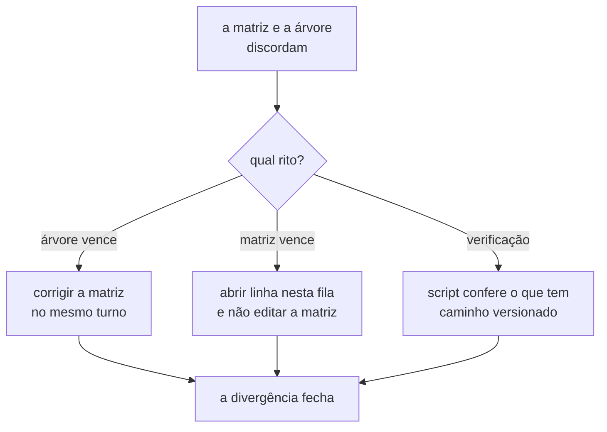

**A terceira não exclui as outras duas**, e é a única que impede a divergência de passar
despercebida — as outras duas só dizem o que fazer depois que alguém a nota. A linha
decide qual rito vale e, se for a terceira, o que exatamente o script consegue afirmar.

## O orçamento de prosa: quem é dono do teto, e o que ele alcança

**Aberta.** Ela é a segunda das quatro perguntas do plano de navegação documental, que
nasceu em `4d15bd6` e foi removido da árvore em `4f04246` — o texto original é recuperável
por `git show 4d15bd6:docs/audits/2026-08-07-navegacao-documental-para-agentes.md`. A
primeira daquelas perguntas fechou no [`AGENTS.md`](../../AGENTS.md#como-o-planejamento-funciona-aqui),
e a quarta é a linha [acima](#o-rito-que-reconcilia-a-matriz-com-a-árvore). Esta e a
[seguinte](#o-que-apura-a-âncora-citada-antes-de-uma-redução) ficaram sem dono quando o
arquivo saiu, e voltam aqui por isso. Não inaugura lote novo.

**O problema.** O teto genérico de prosa é 4.000 caracteres, e quem o aplica é
[`check_artifact_limits.py`](../../.claude/skills/feature-planning/scripts/check_artifact_limits.py).
O workflow [`docs`](../../.github/workflows/docs.yml) só o executa sobre
`docs/adr/[0-9]*.md`. Fora desse glob, ninguém mede — e medidos em 2026-08-08, seis
arquivos excedem o genérico sem que nada falhe:

| Arquivo                                  | Prosa medida | Teto aplicado hoje |
|------------------------------------------|--------------|--------------------|
| `docs/plano-do-laboratorio.md`           | 48.253       | genérico, 4.000    |
| `docs/CONTEXT.md`                        | 35.633       | genérico, 4.000    |
| `docs/adr/plano-de-escrita-do-lote-e.md` | 25.405       | genérico, 4.000    |
| `docs/specification-process.md`          | 18.493       | genérico, 4.000    |
| `docs/questions/README.md`               | 10.442       | genérico, 4.000    |
| `docs/features/README.md`                | 4.616        | genérico, 4.000    |

**A foto acima é de 2026-08-08, e um dos seis já cresceu.** A correção do glossário
decidida em [`E-44`](#e-44-fecha-em-reparo-imediato-escolhida-em-2026-08-10), e o
registro da dívida nomeada que ela deixou, acrescentaram prosa ao `docs/CONTEXT.md`, que
passou de 35.633 para 38.079 caracteres em 2026-08-10, medidos por
`check_artifact_limits.py` — mais de nove vezes o teto genérico, sem que nada falhasse,
porque ele segue fora do glob do workflow. A tabela **não** é atualizada: ela é a
medição daquela data. O que este parágrafo registra é que a linha aberta tem custo
crescente, e não que a foto esteja errada.

**Duas coisas distintas estão fundidas.** Um teto que descreve mal o artefato é defeito de
regra; um teto que ninguém executa é defeito de alcance. A isenção de `AGENTS.md` e
`docs/AGENTS.md`, declarada em `4f04246` dentro do próprio script, resolveu dois casos pelo
primeiro eixo e deixou o segundo intacto — os seis acima não estão isentos, estão fora do
alcance da medição.

**A tentação a evitar é declarar isenção nova a cada arquivo que exceda.** Cada isenção
carrega justificativa escrita, o que é bom; o que falta é o critério contra o qual a
próxima seria conferida, e sem ele a soma das justificativas **é** o critério, sem nunca
ter sido decidida.

**Três alternativas, e nenhuma escolhida.**

| Alternativa                  | O que ela faz                                                                                | O custo                                                               |
|------------------------------|----------------------------------------------------------------------------------------------|-----------------------------------------------------------------------|
| isenção declarada, uma a uma | mantém o que `4f04246` fez, e o script segue sendo o dono do número e das exceções           | o critério fica implícito na soma das justificativas                  |
| teto por classe de artefato  | o processo declara classes — instrução, índice, plano, glossário, fila — e um teto para cada | classificar artefato novo vira decisão, e há artefato em duas classes |
| medir tudo sem falhar        | o CI mede todo Markdown e publica o número, falhando só nas classes com teto                 | o número deixa de ser guardrail e vira relatório que ninguém lê       |

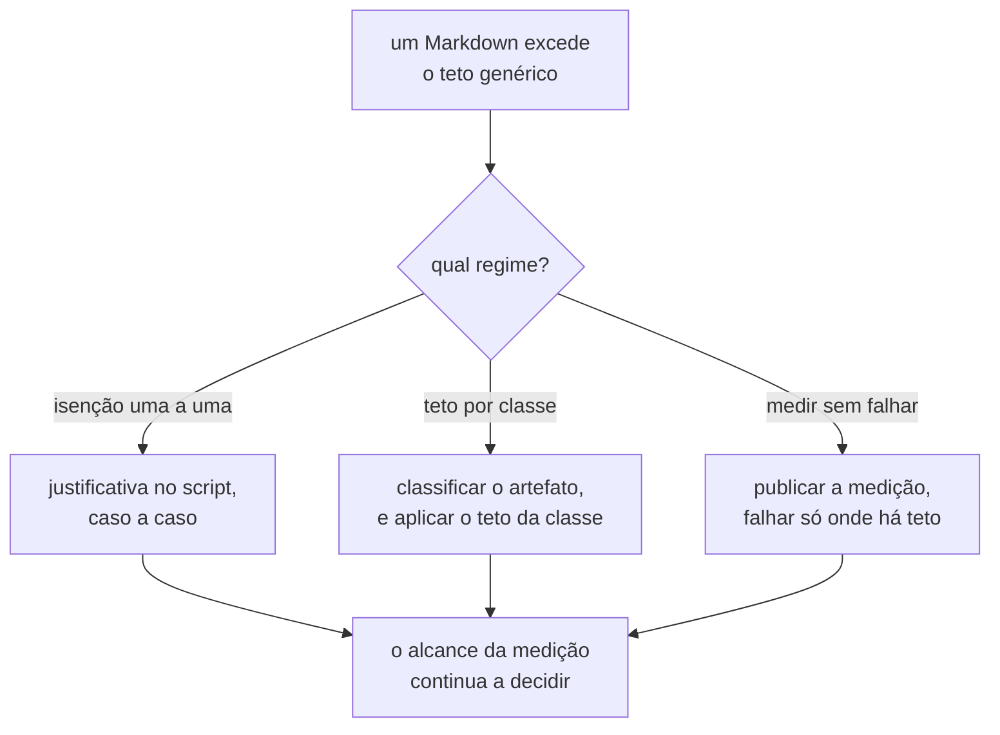

**A linha decide três coisas, e não uma:** qual arquivo é dono do número — hoje ele vive
no script e o [processo](../specification-process.md#feature-card--o-padrão) o cita —,
quais caminhos a medição alcança no CI, e como uma isenção nasce. Decidir só a primeira
deixa os seis arquivos acima exatamente como estão.

## O que apura a âncora citada antes de uma redução

**Fechada em 2026-08-08, por decisão explícita da pessoa.** Terceira das quatro perguntas
do mesmo plano removido, e irmã da linha
[acima](#o-orçamento-de-prosa-quem-é-dono-do-teto-e-o-que-ele-alcança).

**A decisão.** [`check_citations.py`](../../scripts/check_citations.py) ganha um modo de
consulta que responde, sob demanda, quem cita cada heading de um arquivo. **Nada é gravado
na árvore**: a resposta é recalculada no momento da redução e descartada, e por isso não
existe derivado a envelhecer. A guarda que o verificador já executa no CI permanece como a
rede de segurança embaixo da consulta.

Duas alternativas foram descartadas com motivo. O **índice reverso versionado** grava a
mesma resposta num arquivo da árvore, e diverge da fonte no primeiro commit que ninguém
regenerar. O **inventário aprovado por pessoa** não carrega decisão humana nenhuma: a
lápide já é obrigatória para todo heading citado, de modo que o inventário apenas dataria
uma descoberta técnica — e datá-la é o defeito que ele tenta evitar, como a verificação de
2026-08-06 provou ao envelhecer em horas.

**A consulta alcança também a âncora interna, e por um defeito descoberto ao decidir
isto.** Verificado em 2026-08-08: o verificador reconhece a citação externa e **não**
reconhece a interna, porque o padrão exige o `.md` antes do `#`.

```text
reconhecida:      <arquivo>.md#<slug>
não reconhecida:  [texto](#<slug>)
```

Uma âncora interna apontando para título inexistente passa sem defeito nenhum. Esta fila
carrega links dessa forma — 16 em 2026-08-08, 52 em 2026-08-10 —, e podá-la sem
cobri-los quebraria qualquer um deles em silêncio; `CONTEXT.md` carrega
zero, e por isso [A-09](../audits/2026-08-06-coerencia-e-limites-documentais.md#a-09--contextmd-é-glossário-proposta-decisão-e-backlog-ao-mesmo-tempo)
não corre esse risco. O número cresce a cada fecho que aponta para outro, e por isso ele
é remedido a cada poda em vez de citado de memória.

**Pergunta em aberto.** Se o verificador **também** passa a acusar âncora interna quebrada
no CI, e não apenas a responder por ela na consulta, continua sem decisão. Ampliar o que
ele acusa muda o que o corpus precisa satisfazer, e essa é decisão da pessoa.

**O que já está decidido, e não é objeto desta linha.** A lápide é obrigatória: a regra de
[`A saída, decidida em 2026-08-06`](#a-saída-decidida-em-2026-08-06) preserva o heading
citado, e a [revogação da imutabilidade](#a-imutabilidade-do-corpo-de-um-adr-aceito-revogada-em-2026-08-07)
mudou a premissa sem mudar a conclusão. A pergunta aqui é **como se descobre quais headings
são esses**, antes de encolher qualquer documento.

**O problema.** Fechar
[A-09](../audits/2026-08-06-coerencia-e-limites-documentais.md#a-09--contextmd-é-glossário-proposta-decisão-e-backlog-ao-mesmo-tempo)
e
[A-11](../audits/2026-08-06-coerencia-e-limites-documentais.md#a-11--a-fila-ativa-contém-narrativa-integral-de-decisões-fechadas)
exige remover texto de dois documentos citados de fora. **Nenhuma apuração existe**: quem
reduzir precisa varrer o corpus à mão atrás de quem cita o heading que vai apagar, e
[`check_citations.py`](../../scripts/check_citations.py) só acusa o defeito **depois** de
ele ser cometido, na próxima execução.

**A objeção que sustenta a urgência.** O
[plano de escrita do Lote E](plano-de-escrita-do-lote-e.md) registra que a verificação de
2026-08-06 concluiu que nenhuma citação externa apontava para as seções de rodada — e que a
conclusão deixou de valer no ato de escrever os ADRs 0010 a 0012, que passaram a citá-las.
Uma apuração manual foi feita, estava correta, e envelheceu em horas.

**Três alternativas, e nenhuma escolhida.**

| Alternativa                    | O que ela faz                                                                      | O custo                                                        |
|--------------------------------|------------------------------------------------------------------------------------|----------------------------------------------------------------|
| inventário aprovado por pessoa | levanta-se a lista reversa uma vez, e a pessoa aprova quais headings ganham lápide | envelhece na primeira citação nova, como já envelheceu uma vez |
| índice reverso gerado          | um script deriva, de todas as citações, quem aponta para cada heading              | é derivado, e um arquivo derivado versionado diverge da fonte  |
| guarda no CI                   | `check_citations.py` já falha quando um heading citado desaparece do alvo          | não é preventiva: acusa depois da remoção, e não antes dela    |

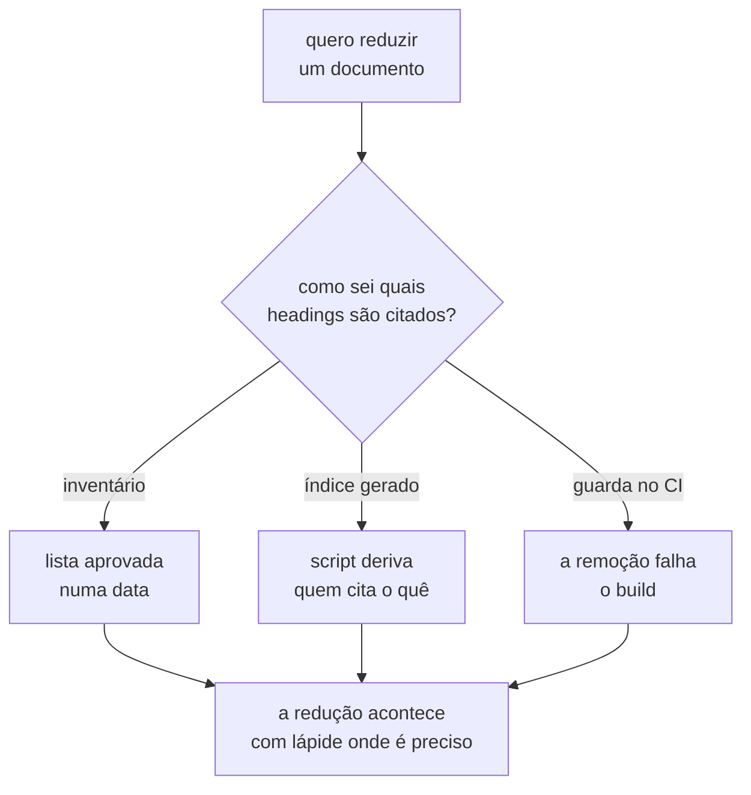

**A terceira alternativa já está implementada, e descobrir isso reformula a pergunta.**
Verificado em 2026-08-08:
[`check_citations.py`](../../scripts/check_citations.py) compara cada âncora citada
contra os títulos do alvo, e emite `ancora nao corresponde a titulo nenhum do alvo`.
Ele **já falha** quando um heading citado desaparece, e a comparação corre contra a
árvore atual — não contra o estado anterior, que uma leitura anterior desta linha supunha
necessário. Reproduz-se com dois arquivos, um citando o outro por âncora, e o heading
apagado do alvo.

O que falta, portanto, não é detecção: é **antecedência**. O verificador responde "você
quebrou" na execução seguinte à remoção; esta linha pergunta o que responde "vai quebrar"
**antes** dela, para que a lápide entre no mesmo commit que reduz o texto. A escolha real
está entre as duas primeiras alternativas, e a terceira deixa de ser trabalho a fazer para
virar a rede de segurança que já existe embaixo delas.

**A segunda alternativa é mais barata do que a tabela sugere**, e isso também é
descoberta desta verificação: `inspect()` já resolve, para cada citação, o par (arquivo
alvo, slug). Um índice reverso não exige um analisador novo — exige inverter e agrupar o
que a função já computa.

E o custo que restava a ela **pressupõe uma premissa que não é obrigatória**: um derivado
só diverge da fonte se for **versionado**. Um modo de consulta que responda, sob demanda,
quem cita um heading não deixa arquivo nenhum na árvore para envelhecer — ele é lido no
momento da redução e descartado. A escolha, então, não é entre inventário e índice: é
entre **guardar a resposta** e **saber recalculá-la**, e é a mesma escolha que a regra
de não repetir estado que outro documento é dono de manter já fez em toda esta base.

**As duas primeiras são parentes da terceira alternativa da linha do rito**, e podem sair
de um mesmo script — mas são decisões separadas, e fundi-las escolheria a ferramenta
antes do problema.

**O bloqueio que este parágrafo carregava caiu com o próprio fecho.** Até 2026-08-08 ele
dizia que nenhuma redução de `CONTEXT.md` ou da fila deveria começar enquanto esta linha
não fechasse. Ela fechou naquela data, o modo de consulta existe, e a condição virou
procedimento: **toda redução roda a consulta reversa antes**, e é ela que separa fechar
A-09 e A-11 de quebrar citação de ADR aceito.

## O nível de isolamento não tem lugar nesta fila

O E5 exige a comparação do mesmo experimento sob `READ COMMITTED`, `REPEATABLE READ` e
`SERIALIZABLE`. Só o terceiro aborta uma das transações, com SQLSTATE `40001`. O plano
registra a exigência na seção 6, e nomeia o nível de isolamento como parâmetro do
experimento — escopo que os quatro experimentos anteriores não têm.

**Nenhuma linha desta fila nomeia esse parâmetro.**

A decisão de estratégias de concorrência é o destino aparente, e ela não serve sem
argumento. Uma estratégia é código da aplicação: `NONE`, `ATOMIC_UPDATE`, `OPTIMISTIC` e
`PESSIMISTIC` mudam o SQL que os passos emitem. Um nível de isolamento é propriedade da
transação, e ele muda o que o banco faz com o mesmo SQL. O E5 é o experimento que separa
os dois eixos: com `OPTIMISTIC` ativo sob `READ COMMITTED`, a invariante quebra sem
exceção nenhuma, porque inserir uma alocação não incrementa a versão de linha alguma.
Tratar o isolamento como mais um valor da mesma enumeração apagaria a distinção que o
experimento existe para mostrar.

Três destinos são possíveis, e a escolha não foi feita.

- **Estratégias de concorrência**, com o isolamento declarado como eixo separado dentro
da mesma decisão. O custo é uma decisão que passa a carregar dois eixos.
- **Experiment**, que define o que uma execução declara. O isolamento seria um campo da
definição, ao lado da semente. O custo é decidir a semântica do parâmetro num ADR cujo
assunto é o ciclo de vida da execução.
- **Linha própria nesta fila**, se a escolha tiver alternativas e trade-off que nenhuma
das duas comporte.

Uma pista contra o terceiro destino: o E5 não escolhe um nível, ele varre três. O que a
plataforma precisa é do eixo de variação, e não de um valor decidido uma vez.

Registrado em 2026-07-31, no levantamento do que falta para fechar o MVP.

## A anomalia por frequência: uma proposta que muda o estatuto da barreira

O laboratório foi planejado para **construir** a anomalia. O E2 declara a intercalação
`W1.READ → W2.READ → W1.WRITE → W2.WRITE`, o escalonador a impõe, e a atualização
perdida aparece em toda execução. A proposta inverte o mecanismo: a anomalia emerge da
**frequência** de execuções concorrentes, e o trabalho da plataforma passa a ser
**diagnosticar** se o erro esperado ocorreu.

A proposta não é uma preferência de implementação. Ela troca o que a plataforma promete:
de "esta execução produz a anomalia" para "esta configuração produz a anomalia com esta
taxa". As duas promessas exigem instrumentos diferentes.

#### O que a proposta contradiz

**A aresta `25 → 1` do plano**, seção 4. O texto lá diz: "o lost update precisa ser
demonstrado, não sorteado. Sem barreiras, o experimento produz *às vezes perde* — que é
a mesma frase que o engenheiro já dizia antes de abrir o laboratório." É o argumento
mais forte contra a proposta, e ele já estava escrito antes dela.

**O estatuto epistêmico do E2.** O plano separa E1 de E2 assim: "E1 prova que o
laboratório *detecta*. E2 prova que o laboratório *constrói*. São capacidades
diferentes, e a segunda é a que torna a primeira confiável." Sem barreira, a segunda
capacidade some, e a confiança na primeira perde o apoio que o plano lhe deu.

**A cláusula de honestidade do ADR-0001**, que está `Aceito`. Ela compara um braço com
barreiras contra um braço sem elas. Com um braço só, a cláusula fica sem sujeito. A
falha que ela existe para pegar — o runtime fabricando o fenômeno por agendamento —
deixa de ser possível pelo mesmo motivo, mas a fabricação por estado compartilhado
dentro do instrumento continua, e [`Q-0001-2`](../questions/Q-0001-2.md) registra que
ela não tem guarda.

**O ADR-0003 inteiro.** Ele define como uma barreira é declarada. A questão 4 daquele
documento está `aberto (crítico)` por causa desta proposta, e ele NÃO DEVE ser aceito
antes que este item seja decidido.

#### O que a proposta não contradiz, e o que ela reforça

**O oráculo do ADR-0002 já é uma contagem, e não um booleano.**
`perdidas = commits − (value_final − value_inicial)` mede magnitude. Uma taxa é a mesma
contagem dividida pelo número de tentativas, e nada no ADR-0002 precisa mudar para
produzi-la. O domínio mínimo foi escolhido de um jeito que serve às duas promessas.

**O E1 já é a proposta.** Cem incrementos, dez workers, nenhuma barreira, `value < 100`.
A mudança não introduz um experimento novo no MVP: ela promove a forma do E1 a norma e
rebaixa a do E2.

**O grupo de controle deixa de ser disciplina e vira pré-requisito lógico.** A regra
"se `NONE` não violar, a carga é insuficiente" já está no repositório. Sob a proposta,
ela passa a ser a única coisa que faz um resultado negativo significar alguma coisa.

**O passo sobrevive com duas das três motivações.** O ADR-0001 fixou o passo por três
exigências: barreira determinística, injeção de falha em ponto nomeado e timeline. A
proposta atinge a primeira e não toca nas outras duas. A etapa 6 continua precisando de
`AFTER_COMMIT` exato, e a timeline continua sendo um registro por passo.

#### O que a proposta cria, e ninguém decidiu ainda

**Um resultado negativo passa a ter quatro causas, e a plataforma não distingue nenhuma
delas hoje.** "Zero violações" PODE significar: a anomalia é impossível naquela
configuração; a anomalia é possível e a janela nunca foi atingida; a anomalia ocorreu e
o oráculo não a viu, porque ele lê o estado final quiescente (
[`Q-0002-3`](../questions/Q-0002-3.md) ); ou os workers nunca se sobrepuseram, porque o
pool de conexões os serializou. A primeira é o resultado que o experimento busca. As
outras três são defeitos do instrumento com a mesma aparência.

**A plataforma mede a consequência, e passaria a precisar medir a exposição.** Uma
atualização perdida exige que dois workers leiam o mesmo valor antes que qualquer um
escreva. Esse evento é contável a partir do log de observações que o ADR-0001 já obriga
o runtime a emitir. Contá-lo separa "a janela não abriu" de "a janela abriu e nada
aconteceu" — que é a distinção que converte um zero em conhecimento. Nenhum documento do
repositório nomeia essa métrica.

**Um resultado negativo precisa de regra de parada e de declaração de confiança.** Com N
tentativas e zero violações, o limite superior da taxa fica em torno de `3/N` com 95% de
confiança. Sem uma regra escrita, cada execução escolhe o próprio N, e dois relatórios
com o mesmo veredito afirmam coisas diferentes. Quem escolhe N, e o que o relatório
afirma quando o zero aparece, é decisão nova.

**O veredito ganha um terceiro formato.** A fila prevê booleano e curva. Taxa com
intervalo não é nenhum dos dois: ela tem um número e uma incerteza, e a incerteza
precisa aparecer no relatório. A decisão dos formatos de veredito muda de escopo por
causa disso.

**A falha intermitente entra no pipeline.** Um experimento probabilístico num workflow
que precisa ficar verde é um teste instável por construção. A tensão 2 do plano chama a
falha intermitente de "o pior resultado possível num instrumento de medida", e a
exigência de nascer entregando põe esse custo no primeiro commit, não depois.

#### Três desfechos, e nenhum é obviamente certo

**Remoção da barreira.** O agendamento sai, o ADR-0003 é descontinuado ainda `Proposto`,
e o E2 deixa de existir como experimento separado. Custo: a plataforma passa a afirmar
apenas o que observou, e perde o poder de mostrar a intercalação que causa o fenômeno —
que é a exigência pedagógica do cenário 25.

**Rebaixamento a instrumento de diagnóstico.** A frequência produz o resultado; a
barreira responde à pergunta que o resultado negativo deixa aberta. Se a execução por
frequência não produzir violação, a mesma configuração roda com a intercalação forçada:
violação ali significa carga insuficiente na primeira; ausência nas duas significa que a
anomalia é impossível naquela configuração. A barreira vira o **controle positivo** do
experimento, e o ADR-0003 continua válido com a seção `## Contexto` reescrita.

**Eixo coigual.** Frequência e barreira convivem como duas resoluções do experimento, do
mesmo jeito que o ADR-0001 fez com alta e baixa resolução da operação. Custo: todo
experimento passa a ter dois braços obrigatórios, e o laboratório carrega as duas
máquinas desde o MVP.

Registrado em 2026-07-31, no turno em que a proposta foi apresentada, antes de qualquer
resposta a ela.

O segundo desfecho foi o escolhido, e o
[ADR-0004](0004-o-estatuto-da-barreira-e-o-diagnostico-da-nao-ocorrencia.md) o fixou
junto dos instrumentos de diagnóstico. Ele foi aceito em 2026-08-01.

O [ADR-0003](0003-a-linguagem-do-agendamento.md) foi aceito no mesmo dia, com a seção
`## Contexto` reescrita para justificá-lo pela execução de controle. O parágrafo acima
que o proibia de ser aceito registra o bloqueio vigente em 2026-07-31, e deixou de valer
quando o ADR-0004 escolheu o desfecho.

O debate da aceitação mudou dois pontos do que está escrito acima. A exposição de
referência é contada no **controle negativo**, e não na execução medida: uma estratégia
que serializa fecha a janela, e ler esse zero como carga fraca condenaria a estratégia
mais protetora. E o veredito `sem exposição`, previsto aqui, não existe — o controle
negativo já detectava aquele caso, e o lugar foi ocupado por `janela mal declarada`.

## De onde esta fila veio

As duas origens continuam no repositório, e as duas viram lápide pela decisão `C-2`.

| Origem                                                                                                                 | O que ficou lá                                  |
|------------------------------------------------------------------------------------------------------------------------|-------------------------------------------------|
| [`README.md`](README.md), seção "Fila de decisões"                                                                     | uma lápide; o conteúdo veio inteiro para cá     |
| [`arquivo/proposta-2026-08-03/decisoes-pendentes.md`](arquivo/proposta-2026-08-03/decisoes-pendentes.md), Blocos 0 a 6 | o texto original, congelado; a fila viva é esta |

**A segunda não pôde ser esvaziada, e o motivo é técnico.** Nove citações por número de
linha apontam para `decisoes-pendentes.md` a partir dos ADRs 0008 e 0009, a maior em
`:1879`. O corpo de um ADR aceito NÃO PODE ser editado, então qualquer edição que
desloque uma linha até 1879 quebra citação que ninguém pode corrigir. Aquele arquivo é
append-only, e o texto dos blocos permanece lá como registro histórico congelado.
