# Fila de decisões

Fila única deste repositório. Criada em 2026-08-05 pela decisão `B-1`, registrada em
[`arquivo/proposta-2026-08-03/decisoes-pendentes.md`](arquivo/proposta-2026-08-03/decisoes-pendentes.md).

Antes dela existiam duas listas do mesmo tipo de coisa, e a sobreposição era medida: os
três primeiros assuntos da rodada de arquitetura vinham colados numa linha só da fila
derivada do plano. Enquanto foram duas, uma decisão PODE ter sido tomada numa e reaberta
na outra.

## O que esta fila enfileira

**Decisão, e não ADR.** Desde 2026-08-04, o artefato que uma linha gera é escolhido no
momento em que a decisão é tomada, e não antes: ADR quando a escolha atender aos quatro
critérios de [`README.md`](README.md#uma-decisão-merece-adr-quando), artefato de
[`../features/`](../features/README.md) quando não atender. Uma linha PODE gerar os dois,
e PODE não gerar ADR nenhum.

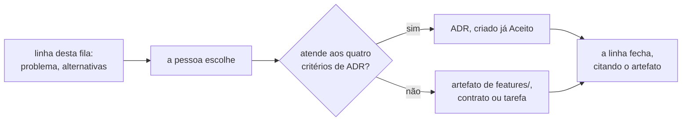
```mermaid
flowchart LR
  L["linha desta fila:<br/>problema, alternativas"] --> E["a pessoa escolhe"]
  E --> T{"atende aos quatro<br/>critérios de ADR?"}
  T -->|" sim "| ADR["ADR, criado já Aceito"]
  T -->|" não "| ART["artefato de features/,<br/>contrato ou tarefa"]
  ADR --> F["a linha fecha,<br/>citando o artefato"]
  ART --> F
```

**A poda não acontece antes da decisão.** A pendência de podar as linhas que são
comportamento disfarçado de arquitetura fechou em 2026-08-05, pela decisão `B-2`, por
subsunção: podar hoje é escolher o artefato antes da decisão, que é o oposto da regra
acima. A poda acontece uma linha por vez, quando a pessoa escolhe.

## Como citar uma linha desta fila

**Pelo nome, nunca pela posição.** A posição muda quando uma decisão entra no meio, e
uma citação por posição continua válida depois da inserção — passando a apontar para
outra decisão.

**Por âncora nomeada, nunca por número de linha.** É a decisão `C-1`, de 2026-08-05, com
o slug do GitHub Flavored Markdown fixado por `C-1a`. O verificador
[`scripts/check_citations.py`](../../scripts/check_citations.py) confere as duas formas.

**A citação a um fecho é provisória, e migra quando o artefato nascer.** A regra é de
[`E-90`](#e-90-fecha-em-citação-a-esta-fila-é-provisória-escolhida-em-2026-08-12), e o
dono do texto normativo é
[`specification-process.md`](../specification-process.md#quando-um-fecho-da-fila-está-coberto-decidido-em-2026-08-12).

Os números de ADR **não** estão atribuídos nas linhas abertas. Um número é atribuído
quando o ADR é escrito — atribuir antes cria buracos na sequência quando a ordem muda.

## As decisões derivadas do plano

Ordem derivada de [`../plano-do-laboratorio.md`](../plano-do-laboratorio.md). A coluna
`Ordem` é posição na fila, e ela muda.

| Ordem | Decisão                                                      | Estado                                   |
|-------|--------------------------------------------------------------|------------------------------------------|
| 1     | **O passo como unidade de execução, observação e injeção**   | `Aceito` — ADR-0001                      |
| 2     | **O domínio mínimo: contador e predicado de capacidade**     | `Aceito` — ADR-0002                      |
| 3     | **O estatuto da barreira e o diagnóstico da não ocorrência** | `Aceito` — ADR-0004                      |
| 4     | **A linguagem do agendamento**                               | `Aceito` — ADR-0003                      |
| 5     | **A forma do escalonador**                                   | `Aceito` — ADR-0005                      |
| 6     | **Estratégias de concorrência como dado, não como branch**   | `Aceito` — ADR-0006                      |
| 7     | **O log de observações: forma, ordem e onde vive**           | `Aceito` — ADR-0007                      |
| 8     | **Experiment: definição, semente, hipótese e asserções**     | aberta                                   |
| 9     | **Os dois formatos de veredito: booleano e curva**           | aberta                                   |
| 10    | **Arquitetura mínima, stack e guardas executáveis**          | **parcialmente consumida** pelo ADR-0008 |
| 11    | **Entrega contínua no homelab desde o dia zero**             | **parcialmente consumida** pelo ADR-0019 |

O porquê de cada posição, as questões que cada linha carrega e o histórico de como a
fila chegou a esta ordem estão em [`README.md`](README.md#índice) e nos próprios ADRs. As
quatro posições abaixo levam o detalhe.

**Posição 8 — Experiment.** Precisa resolver a tensão entre o Designer na interface e a
definição versionada. [`Q-0002-4`](../questions/Q-0002-4.md) pede aqui o ciclo de vida de
uma execução, [`Q-0003-8`](../questions/Q-0003-8.md) o que `N` conta, e
[`Q-0001-1`](../questions/Q-0001-1.md) a identidade de versão de uma operação.

**Posição 9 — os dois formatos de veredito.** Se ficar para depois, o grupo D não cabe
na arquitetura. [`Q-0002-3`](../questions/Q-0002-3.md) acrescenta o eixo pontual contra
contínuo no tempo, e [`Q-0003-3`](../questions/Q-0003-3.md) pede o que "mesma taxa"
significa numa execução medida.

**Posição 10 — arquitetura mínima.** O
[ADR-0008](0008-os-dois-planos-em-processos-separados.md) fixou dois processos separados
e o pacote raiz. Restam o build, o número de módulos e a guarda que
[`Q-0002-1`](../questions/Q-0002-1.md) pede para as três regras hoje textuais.

**Posição 11 — entrega contínua.** O serviço precisa nascer entregando; a linha ratifica
ou emenda a ADR 0017 do homelab.

## As decisões da rodada de arquitetura de 2026-08-03

Sessenta e seis linhas com identificador `D-*`, agrupadas por bloco. O agrupamento
**não** é o documento que cada assunto vai gerar: esse só existe depois da escolha.

**Três linhas já fecharam** — `D-ARQ-05`, `D-ARQ-06` e `D-ARQ-01`, todas pelo
[ADR-0008](0008-os-dois-planos-em-processos-separados.md). **Quatro mais** — `D-DOM-01` a
`D-DOM-04`, as de vocabulário — fecharam em 2026-08-04, e o Bloco 4 que carregava o
debate delas foi apagado em 2026-08-10, por não ser citado de lugar nenhum. O estado de
cada termo e a lápide de cada uma das quatro decisões vivem em
[`../CONTEXT.md`](../CONTEXT.md). **Uma quinta**, `D-DAT-05`, fechou em 2026-08-05.

### Bloco 0 — sem estas seis, nenhuma linha de código é escrita

São as que a fila de [`README.md`](README.md) enfileira nas
posições 10 e 11, e a exigência de nascer entregando as torna as primeiras.

| ID         | Decisão                                  | Recomendação da proposta                          | Onde                                                                                                         |
|------------|------------------------------------------|---------------------------------------------------|--------------------------------------------------------------------------------------------------------------|
| `D-ARQ-05` | mecanismo de módulo do primeiro artefato | Maven multi-módulo, quatro módulos, mais ArchUnit | [`arquivo/proposta-2026-08-03/modulos-e-fronteiras.md`](arquivo/proposta-2026-08-03/modulos-e-fronteiras.md) |
| `D-ARQ-12` | Maven contra Gradle                      | emendar a ADR 0017 do homelab para Maven          | [`arquivo/proposta-2026-08-03/entrega-continua.md`](arquivo/proposta-2026-08-03/entrega-continua.md)         |
| `D-ARQ-06` | pacote raiz e idioma dos identificadores | `dev.da0hn.lab`, região no primeiro segmento      | [`arquivo/proposta-2026-08-03/modulos-e-fronteiras.md`](arquivo/proposta-2026-08-03/modulos-e-fronteiras.md) |
| `D-ARQ-15` | a forma do `deploy/` no primeiro commit  | `deploy/` mínimo agora, uma réplica               | [`arquivo/proposta-2026-08-03/entrega-continua.md`](arquivo/proposta-2026-08-03/entrega-continua.md)         |
| `D-ARQ-14` | o que o pipeline executa                 | só guardas e provas; experimento sob demanda      | [`arquivo/proposta-2026-08-03/entrega-continua.md`](arquivo/proposta-2026-08-03/entrega-continua.md)         |
| `D-DAT-04` | ferramenta de migração                   | Flyway com SQL versionado                         | [`arquivo/proposta-2026-08-03/modelo-de-dados.md`](arquivo/proposta-2026-08-03/modelo-de-dados.md)           |

**`D-ARQ-05` e `D-ARQ-06` estão fechadas** pelo
[ADR-0008](0008-os-dois-planos-em-processos-separados.md), `Aceito` em
2026-08-04. A escolha não foi a recomendação da linha: o mecanismo de módulo é a
**fronteira de processo**, e não Maven multi-módulo. O pacote raiz `dev.da0hn.lab` com a
região no primeiro segmento foi aceito como recomendado, com os identificadores
**todos** em inglês. As duas linhas permanecem na tabela para que o histórico da
recomendação não se perca.

`D-ARQ-12` é a única com custo fora deste repositório: ela emenda um documento
`Aceito` do [`homelab-infrastructure`](https://github.com/da0hn/homelab-infrastructure).
`D-ARQ-15` **não** fecha o `ComparisonError` que o ArgoCD reporta: a linha que a
absorveu, `E-3`, fechou em 2026-08-13 decidindo onde os manifests vivem
([ADR-0019](0019-a-entrega-sai-do-deploy-e-a-imagem-ganha-tag-semantica.md)), e o
`Application` só sai de `ComparisonError` quando eles existirem lá — pendência da
[issue #2](https://github.com/da0hn/homelab-infrastructure/issues/2) do homelab.

### Bloco 1 — destravam o esquema e a primeira migração

| ID         | Decisão                                       | Recomendação da proposta                 |
|------------|-----------------------------------------------|------------------------------------------|
| `D-DAT-01` | tipo e derivação da coluna de identidade      | `bigint` ordinal da semente              |
| `D-DAT-02` | chave estrangeira de `allocation.resource_id` | sem FK no MVP                            |
| `D-DAT-03` | índice sobre `allocation(resource_id)`        | criar, e registrar o plano efetivo       |
| `D-DAT-05` | como o banco volta ao ponto de partida        | decidida em 2026-08-05: não há reset     |
| `D-DOM-14` | dono da identidade derivada da semente        | o experimento publica; o domínio consome |
| `D-DOM-13` | o esquema compartilhado entre os dois planos  | Shared Kernel com contrato verificável   |

`D-DAT-02` tem a justificativa mais afiada da rodada: com chave estrangeira, o
`INSERT` de uma alocação toma `FOR KEY SHARE` na linha do recurso e conflita com
o `FOR UPDATE` do `PESSIMISTIC` — uma restrição de integridade mudaria o
fenômeno medido.

`D-DAT-05` recomendava `TRUNCATE` antes de cada execução até 2026-08-05, quando uma
quarta candidata entrou — pôr a execução na chave primária, preservando todo o
histórico — e `P-DAT-9` mostrou que a objeção de `Q-0002-4` contra preservar linhas
entre execuções não se sustenta sobre nenhum dos dois critérios de igualdade aceitos.
**O usuário decidiu na mesma data: não há reset.** A chave primária das duas tabelas
passa a incluir um discriminador UUIDv7, gerado pelo Lab Plane e propagado a tudo que o
sistema medido publica, com o crescimento das tabelas aceito. A linha permanece aqui
para que o histórico da recomendação não se perca; a decisão e o que ela deixa em aberto
estão em [`arquivo/proposta-2026-08-03/modelo-de-dados.md`](arquivo/proposta-2026-08-03/modelo-de-dados.md), seção 7, `D-DAT-05`, `P-DAT-10` e
`P-DAT-11`.

### Bloco 2 — destravam o E1 e a etapa 1

| ID         | Decisão                                  | Recomendação da proposta                            |
|------------|------------------------------------------|-----------------------------------------------------|
| `D-ARQ-04` | modelo de thread do worker               | threads de plataforma no MVP                        |
| `D-ARQ-07` | o que verifica cada classe de regra      | compilação para região; ArchUnit para o resto       |
| `D-ARQ-08` | onde vivem o relógio e a fonte semeada   | isenção posicional, sem anotação de supressão       |
| `D-ARQ-09` | a forma da guarda da chave de contenção  | recusa na primeira passagem                         |
| `D-DAT-08` | como o nível de isolamento é aplicado    | `TransactionTemplate`, pelo runtime                 |
| `D-DAT-09` | verificação de "uma conexão por worker"  | tamanho de pool mais asserção de PID distinto       |
| `D-DOM-07` | `Allocation` é agregado próprio          | agregado próprio                                    |
| `D-DOM-08` | onde vive `Σ amount ≤ capacity`          | no oráculo, como invariante observada               |
| `D-DOM-15` | quais fronteiras a stack materializa     | só system under test / Lab Plane, imposta por teste |
| `D-UI-02`  | onde o frontend renderiza                | exportação estática                                 |
| `D-UI-03`  | framework de componentes                 | shadcn/ui sobre Radix                               |
| `D-UI-04`  | eixo padrão da timeline                  | posição no log, com arestas causais                 |
| `D-UI-06`  | teto de eventos no navegador             | paginação contra o servidor                         |
| `D-UI-07`  | autenticação e autoria                   | nenhuma, declarada; autoria vinda do commit         |
| `D-UI-08`  | o que o `POST` cria                      | a sequência de execuções, não uma                   |
| `D-UI-09`  | mecanismo de streaming                   | SSE, com limiar numérico proposto                   |
| `D-UI-10`  | idempotência de iniciar execução         | chave obrigatória do cliente                        |
| `D-UI-11`  | vocabulário do contrato                  | português, igual ao glossário                       |
| `D-UI-12`  | compatibilidade e enumeração do veredito | enumeração aberta, cliente falha fechado            |

`D-ARQ-07` e `D-ARQ-08` são a resposta proposta a
[`Q-0002-1`](../questions/Q-0002-1.md), que pede a guarda executável das três
regras hoje textuais. `D-ARQ-09` responde
[`Q-0004-2`](../questions/Q-0004-2.md).

`D-DOM-07` e `D-DOM-08` carregam a descoberta conceitual da rodada: **o
agregado clássico do DDD é antipadrão aqui.** Um `Resource` que impusesse
`Σ amount ≤ capacity` na fronteira transacional tornaria o E5 irreproduzível,
pelo mesmo argumento com que o ADR-0002 descartou a constraint no banco —
confundir observar com impedir (`0002-...md:566-574`).

### Bloco 3 — pertencem a um ADR já enfileirado, e a recomendação é não decidir agora

| ID         | Decisão                                  | Destino na fila de ADRs                                       |
|------------|------------------------------------------|---------------------------------------------------------------|
| `D-DOM-06` | o que `N` conta                          | Experiment, posição 8; [`Q-0003-8`](../questions/Q-0003-8.md) |
| `D-DOM-09` | se `Experimento` é raiz das execuções    | Experiment, posição 8                                         |
| `D-DAT-07` | onde vive a definição de experimento     | Experiment, posição 8                                         |
| `D-UI-01`  | fonte de verdade da definição            | Experiment, posição 8                                         |
| `D-DOM-05` | se `veredito` vira quatro termos         | formatos de veredito, posição 9                               |
| `D-DOM-16` | se o modelo reserva lugar para a curva   | formatos de veredito, posição 9                               |
| `D-DOM-10` | se o log é agregado próprio              | gatilho na etapa 6                                            |
| `D-DOM-12` | se a injeção de falha é contexto próprio | gatilho na etapa 6                                            |

Aprovar qualquer uma destas **antecipa um ADR enfileirado**, e é a forma mais
provável de esta rodada causar dano. A recomendação de cada uma é adiar.

Duas das oito são decisões de vocabulário, e o debate delas foi trazido de
[`../CONTEXT.md`](../CONTEXT.md) em 2026-08-07, quando o glossário voltou a ser só
glossário. As outras quatro do mesmo conjunto — `D-DOM-01` a `D-DOM-04` — fecharam em
2026-08-04, e o Bloco 4 que as carregava saiu desta fila em 2026-08-10. **`D-DOM-05` e
`D-DOM-06` continuam abertas**, e nada abaixo as fecha: o que veio do glossário é o
enunciado, as alternativas e a recomendação de cada uma.

#### D-DOM-05 — Se `verdict` vira quatro termos

**Trazido de [`../CONTEXT.md`](../CONTEXT.md) em 2026-08-07**, da seção `D-DOM-05`, que
lá virou lápide. O texto é o de lá, com o nível de título rebaixado.

**O problema.** `verdict` nomeia a taxa de violação (`0004:112-113`), o rótulo da
classificação do zero (`0004:206-218`), o booleano do predicado de capacidade
(`0002:186-190`) e a curva do grupo D, que não tem forma decidida (`plano:226-229`).

**Alternativa A — quatro termos distintos.** A favor: cada formato ganha nome, e a
tabela comparativa do E3 deixa de misturar coisas diferentes na mesma coluna. Contra:
antecipa a decisão da posição 9 da fila, que é justamente sobre como os formatos
convivem.

**Alternativa B — um termo com formato declarado.** A favor: o glossário fica estável
enquanto a decisão dos formatos não é tomada, e o relatório declara o formato ao lado do
número. Contra: quem lê um relatório precisa ler duas coisas para entender uma.

**Alternativa C — adiar até a fila resolver.** A favor: nenhum termo nasce antes da
decisão que o fixa. Contra: os quatro Feature Cards já usam a palavra, e o adiamento
mantém a ambiguidade em documentos vivos.

**Recomendação.** Alternativa B, com revisão obrigatória quando a decisão dos dois
formatos de veredito for tomada.

**Se a escolha for outra.** Com a alternativa A, o E4 ganha vocabulário antes de ter
card, e o motivo registrado em `features/README.md:35-51` deixa de valer.

#### D-DOM-06 — O que `N` conta

**Trazido de [`../CONTEXT.md`](../CONTEXT.md) em 2026-08-07**, da seção `D-DOM-06`, que
lá virou lápide. O texto é o de lá, com o nível de título rebaixado e o caminho de
`Q-0003-8` reescrito de `docs/` para `docs/adr/`. A frase "este glossário não escolhe"
fala de [`../CONTEXT.md`](../CONTEXT.md), e não desta fila.

**O problema.** [`Q-0003-8`](../questions/Q-0003-8.md) mostra que as duas leituras de `N`
quebram em pontos diferentes. Se `N` conta `attempt` do ADR-0001, ele inclui retries, e
o número de retries é resultado da execução. Se conta `operation execution`, a taxa de
aborto deixa de enxergar o trabalho descartado, que é o que ela existe para mostrar.

**Alternativa A — `N` conta `attempt` do ADR-0001.** A favor: é a leitura literal de
`launched attempt` no ADR-0004. Contra: sob `OPTIMISTIC` o número não é declarável antes
de executar, e o E3 e o E4 rodam `OPTIMISTIC`.

**Alternativa B — `N` conta `operation execution`.** A favor: é declarável antes.
Contra: a taxa de aborto de uma execução que falha duas vezes e comete na terceira é
zero, e a justificativa do ADR-0004 diz que essa taxa existe para mostrar o trabalho
descartado.

**Alternativa C — dois números, um declarado e um observado.** A favor: cada um mede o
que sabe medir. Contra: exige um ADR que substitua a contagem de um ADR aceito, e
`Q-0003-8` registra essa possibilidade sem escolhê-la.

**Recomendação.** Manter a pergunta aberta e citá-la por `Q-0003-8` até a decisão
`Experiment`. Este glossário não escolhe.

**Se a escolha for outra.** Qualquer das três muda o significado da taxa de aborto na
tabela comparativa do E3, que é um resultado já especificado em Feature Card.

### Bloco 5 — etapa 4 e adiante, sem gatilho disparado hoje

| ID         | Decisão                                      | Etapa | Recomendação da proposta                 |
|------------|----------------------------------------------|-------|------------------------------------------|
| `D-ARQ-01` | seguir o gatilho ou antecipar serviços       | 4     | seguir o gatilho                         |
| `D-ARQ-03` | onde o Lab Plane vive com dois processos     | 4     | decidir quando a etapa 4 tiver gatilho   |
| `D-ARQ-11` | PostgreSQL dedicado ou compartilhado         | 0     | dedicado                                 |
| `D-ARQ-13` | experimento destrutivo sob `selfHeal`        | 6     | matar a operação, preservando o processo |
| `D-ARQ-10` | Toxiproxy                                    | —     | emendar a ADR 0017 e retirar             |
| `D-DAT-06` | onde o log durável vive                      | 6     | instância separada da medida             |
| `D-DAT-10` | o que do log entra no Git                    | 6     | relatório mais eventos restritos         |
| `D-DAT-11` | instância e `wal_level` se o CDC entrar      | —     | dedicada                                 |
| `D-UI-05`  | onde vive o desenho pedagógico               | 1     | só no controle positivo                  |
| `D-UI-13`  | como o relatório chega a `docs/experiments/` | 1     | download e commit por pessoa             |

`D-ARQ-01` é a decisão que responde diretamente à instrução de usar
microsserviços: a proposta recomenda **seguir o gatilho**, isto é, começar com um
artefato e decompor quando o experimento `JVM_LOCK` ficar vermelho com duas
instâncias. Aprovar o contrário é legítimo e tem custo nomeado no documento.

**`D-ARQ-01` está fechada, contra a recomendação**, pelo
[ADR-0008](0008-os-dois-planos-em-processos-separados.md). A decomposição deixou
de esperar o gatilho da etapa 4: os dois planos rodam em processos separados desde o dia
zero. `D-ARQ-03` continua aberta e muda de sentido — ela deixa de perguntar onde o Lab
Plane vive quando existirem dois processos e passa a perguntar o que muda quando o
system under test ganhar a segunda instância.

### Bloco 6 — mensageria, etapa 5 e adiante

Nenhuma destas tem gatilho disparado hoje. Elas existem para que a etapa 5 não
comece sem desenho, e **nenhuma delas deve ser construída antes do gatilho**.

| ID         | Decisão                                      | Recomendação da proposta                    |
|------------|----------------------------------------------|---------------------------------------------|
| `D-MSG-01` | gatilho concreto que libera o RabbitMQ       | broker real, pelo mecanismo da reentrega    |
| `D-MSG-02` | como uma entrega duplicada é contada         | contagem nova de comandos distintos aceitos |
| `D-MSG-03` | quem carimba os atributos de extensão        | o runtime, na fronteira                     |
| `D-MSG-04` | modo do binding CloudEvents e versão do AMQP | binário sobre 0-9-1, mapeamento declarado   |
| `D-MSG-05` | que recursos do broker ficam desligados      | nenhum DLX e nenhum limite até a etapa 8    |
| `D-MSG-06` | confirmação de publicador                    | ligada, com braço de comparação desligado   |
| `D-MSG-07` | se o broker é fonte legítima do oráculo      | é fonte só depois da quiescência            |
| `D-MSG-08` | ciclo de vida de uma reentrega               | execução nova, com ADR novo sobre o log     |
| `D-MSG-09` | quem cria e destrói a topologia              | por execução                                |
| `D-MSG-10` | se o CDC com Debezium entra                  | **não entra**; gatilhos registrados         |
| `D-MSG-11` | barreira contra o limite de confirmação      | declarar o limite por execução e reportá-lo |

`D-MSG-05` é a que mais contraria a intuição: a proposta recomenda **desligar**
DLX e limite de entregas até a etapa 8, porque com eles ligados os cenários 18 e
19 não têm o que mostrar. É a regra pedagógica aplicada à configuração do broker.

`D-MSG-10` é a resposta à instrução sobre Debezium. O argumento decisivo não é de
custo: o CDC **apaga os pontos `BEFORE_PUBLISH` e `AFTER_PUBLISH` do ADR-0001**,
porque sem passo `PUBLISH` na operação a etapa 6 perde o gatilho que o plano lhe
dá (`../plano-do-laboratorio.md:609`). Os dois gatilhos que criariam o CDC estão
registrados em [`arquivo/proposta-2026-08-03/mensageria.md`](arquivo/proposta-2026-08-03/mensageria.md).

### As duas linhas sem bloco, classificadas em 2026-08-05

`D-ARQ-02` e `D-DOM-11` têm seção própria no documento-fonte e não apareciam em bloco
nenhum: é a diferença entre 64 e 66 que a decisão `B-5` fechou. **As duas continuam
abertas** — `B-5` classificou, e não decidiu.

| ID         | Decisão                               | Assunto                     | Onde                                                                                                                                                          |
|------------|---------------------------------------|-----------------------------|---------------------------------------------------------------------------------------------------------------------------------------------------------------|
| `D-ARQ-02` | onde a interface web é construída     | Entrega contínua no homelab | [`arquivo/proposta-2026-08-03/arquitetura-alvo.md`](arquivo/proposta-2026-08-03/arquitetura-alvo.md#d-arq-02--onde-a-interface-web-é-construída-e-empacotada) |
| `D-DOM-11` | se o escalonamento é contexto próprio | Bloco 4, vocabulário        | [`arquivo/proposta-2026-08-03/modelo-de-dominio.md`](arquivo/proposta-2026-08-03/modelo-de-dominio.md#d-dom-11--se-o-escalonamento-é-contexto-próprio)        |

`D-ARQ-02` entrou em "Entrega contínua no homelab" porque fixa o `Dockerfile` e o número
de imagens do dia zero. `D-DOM-11` entrou no Bloco 4 porque ela nomeia um contexto de
vocabulário: `scheduling` é um dos seis contextos propostos, listados abaixo em
[Os contextos propostos](#os-contextos-propostos). **A justificativa mudou de evidência
em 2026-08-07, e não de conclusão**: até aquela data ela dizia que
[`../CONTEXT.md`](../CONTEXT.md) carregava o termo `scheduling` como `proposto` por
`D-DOM-11`, e o termo saiu do glossário junto com os outros cinco contextos. A
classificação da linha não muda, e ela continua aberta.

### Os contextos propostos

**Trazido de [`../CONTEXT.md`](../CONTEXT.md) em 2026-08-07**, da seção
`### Os contextos propostos`, que lá virou lápide. O texto é o de lá, com os caminhos
relativos reescritos de `docs/` para `docs/adr/`; "nesta proposta" nomeia a proposta de
vocabulário do glossário. **Nenhum dos seis tem decisão**, e absorver o texto não fecha
linha nenhuma. A entrada `observed invariant`, que vivia sob o mesmo título, **ficou** no
glossário: ela é termo, e não contexto.

Os seis nomes abaixo nascem nesta proposta e nomeiam bounded contexts, não módulos nem
processos. O desenho está em
[`arquivo/proposta-2026-08-03/modelo-de-dominio.md`](arquivo/proposta-2026-08-03/modelo-de-dominio.md).

**measured domain** — `proposto` (`D-DOM-07`)
O contexto do system under test: `Resource`, `Allocation`, `increment`, `allocate` e as
estratégias. Ele não conhece as palavras experimento, veredito nem coincidência.

**execution runtime** — `proposto` (`D-DOM-12`)
O contexto que constrói e executa as sequências de passos, cria o escopo de execução e
emite observações.

**scheduling** — `proposto` (`D-DOM-11`)
O contexto que declara e executa o agendamento: papel, carga, restrição de precedência,
encontro, chegada, travessia, término e desistência.

**observation record** — `proposto` (`D-DOM-10`)
O contexto do log e da timeline. Ele adota o vocabulário do runtime e do escalonamento
sem acrescentar significado.

**diagnosis** — `proposto` (`D-DOM-08`)
O contexto dos oráculos, das contagens, da janela de exposição, das coincidências e da
classificação do zero.

**experiment definition** — `proposto` (`D-DOM-09`), sem dono decidido
O contexto que declara o que uma execução roda antes de rodar. A decisão está na fila,
posição 8.

**Pergunta em aberto: dois dos seis identificadores não batem com o documento-fonte.** A
lista acima dá `D-DOM-07` a `measured domain` e `D-DOM-12` a `execution runtime`, e
[`arquivo/proposta-2026-08-03/modelo-de-dominio.md`](arquivo/proposta-2026-08-03/modelo-de-dominio.md)
enuncia `D-DOM-07` como "`Allocation` é agregado próprio ou membro de `Resource`" e
`D-DOM-12` como "Se a injeção de falha é contexto próprio" — que é um contexto sem nome
nesta lista. Os outros quatro correspondem. Qual das duas atribuições vale **não foi
decidido**, e este registro não a decide.

### O agrupamento por assunto

A tabela abaixo agrupa as linhas por assunto, e não por bloco. Ela existe porque os três
primeiros assuntos vinham colados numa linha só da fila derivada do plano: a posição 10.

| Assunto                                        | Linhas                                                                                          |
|------------------------------------------------|-------------------------------------------------------------------------------------------------|
| Experimento: definição, semente, ciclo de vida | Bloco 3, mais `D-DAT-05`, `D-UI-08` e `D-UI-10`                                                 |
| Formatos de veredito                           | `D-DOM-05` e `D-DOM-16`                                                                         |
| A forma do artefato compilável                 | `D-ARQ-05`, `D-ARQ-06`, `D-ARQ-04`                                                              |
| A guarda executável das três regras            | `D-ARQ-07`, `D-ARQ-08`, `D-ARQ-09`, `D-DOM-15`                                                  |
| O esquema e a primeira migração                | `D-DAT-01` a `D-DAT-04`, `D-DAT-08`, `D-DAT-09`, `D-DOM-07`, `D-DOM-08`, `D-DOM-13`, `D-DOM-14` |
| Entrega contínua no homelab                    | `D-ARQ-12`, `D-ARQ-14`, `D-ARQ-15`, `D-ARQ-10`, `D-ARQ-11`, `D-ARQ-13`, `D-ARQ-02`              |
| Vocabulário                                    | Bloco 4, mais `D-DOM-11`, com destino em [`../CONTEXT.md`](../CONTEXT.md)                       |
| Mensageria, sem gatilho hoje                   | Bloco 6                                                                                         |
| Interface web                                  | `D-UI-02` a `D-UI-13`, menos as que o Bloco 3 absorve                                           |

## A ordem da arquitetura mínima e da entrega contínua está sob tensão

O laboratório é entregue no cluster do
[`homelab-infrastructure`](https://github.com/da0hn/homelab-infrastructure), e a
exigência é que um serviço **nasça já entregando** — pipeline e CI/CD no mesmo commit
que cria o módulo, não retrofitados depois.

Isso não move o passo: o formato dele não afeta o que o pipeline empacota. Mas move a
arquitetura mínima e a entrega contínua para **junto do primeiro módulo compilável**, e
as decisões entre o domínio mínimo e os vereditos deixam de ser pré-requisito de
escrever código de esqueleto. O `Dockerfile` e o `deploy/kustomization.yaml` fixam o
número de módulos e a forma do artefato — que é o conteúdo da arquitetura mínima.

A entrega contínua tem uma particularidade que nenhuma outra tem: **parte dela já foi
tomada fora deste repositório.** A ADR 0017 do homelab, aceita em 2026-07-26, escolheu
Gradle, Toxiproxy e "microsserviços JVM" para este laboratório, dois dias antes do
replanejamento que descartou a arquitetura de serviços. Ratificar ou emendar é decisão
consciente e explícita. O inventário completo do que sobrevive e do que colide está em
[`../plano-do-laboratorio.md`](../plano-do-laboratorio.md), seção 12.

## A5 — a sigla `SUT` no código, decidida em 2026-08-05

**Trazido de [`../CONTEXT.md`](../CONTEXT.md) em 2026-08-07**, da seção
[`## A sigla SUT no código, decidida em 2026-08-05`](../CONTEXT.md#a-sigla-sut-no-código-decidida-em-2026-08-05).
**A regra ficou lá**, porque o
[ADR-0009](0009-a-classificacao-do-dual-write-e-a-regiao-de-pacote.md) aponta para o
glossário como fonte dela: em prosa, `system under test` por extenso; em identificador de
código, `sut`. O que veio para cá é o que a fila é dona — a **justificativa** da separação
e as **alternativas descartadas**. "Esta seção", "o glossário" e "este glossário" abaixo
nomeiam [`../CONTEXT.md`](../CONTEXT.md).

**Por que a separação precisou ser declarada.** A escolha do pacote se justifica dizendo
que o glossário já define o termo por extenso, enquanto a entrada `system under test`
lista `SUT` sob `_Evite_`, "por ser sigla sem expansão". Sem esta seção, o ADR que fixa
o pacote e o glossário nascem se contradizendo — e a contradição estaria dentro de um ADR
aceito, onde ninguém pode corrigi-la.

Descartadas: rever o nome do pacote, por reabrir uma decisão do dia anterior e trazer de
volta três alternativas já descartadas; e registrar como pergunta em aberto, por fazer o
ADR nascer carregando contradição conhecida com este glossário.

**Uma premissa do parágrafo acima caiu em 2026-08-07, e a decisão não.** "Onde ninguém
pode corrigi-la" valia enquanto o corpo de um ADR aceito era imutável; hoje um erro
material de texto é corrigível por patch, pela decisão registrada em
[A imutabilidade do corpo de um ADR aceito, revogada em 2026-08-07](#a-imutabilidade-do-corpo-de-um-adr-aceito-revogada-em-2026-08-07).
O que
`A5` escolheu continua valendo, e o texto de 2026-08-05 fica como está.

## O Lote E, enumerado em 2026-08-06

Os Lotes A a D fecharam pendências de **processo**: onde a fila vive, quem aprova o quê,
como uma citação é escrita, o que acontece com a rodada de arquitetura arquivada. Nenhum
deles destrava uma linha de código. **Este destrava, e é o único que destrava.**

O Lote E é a interseção de três coisas que a fila tinha separadas: a posição 10
(arquitetura mínima), a posição 11 (entrega contínua) e o Bloco 1 (esquema e primeira
migração). A exigência de nascer entregando as junta — o `Dockerfile` e o
`deploy/kustomization.yaml` fixam a forma do artefato, e a forma do artefato **é** o
conteúdo da arquitetura mínima.

### Grupo I — sem estas seis, não existe `pom.xml`

| ID    | Decisão                                          | Origem     | Recomendação da proposta              |
|-------|--------------------------------------------------|------------|---------------------------------------|
| `E-1` | build: Maven contra Gradle                       | `D-ARQ-12` | emendar a ADR 0017 para Maven         |
| `E-2` | quantos artefatos executáveis, e quantos módulos | `D-ARQ-05` | **vencida** pelo ADR-0008; ver abaixo |
| `E-3` | a forma do `deploy/` no primeiro commit          | `D-ARQ-15` | `deploy/` mínimo agora, uma réplica   |
| `E-4` | o que o pipeline executa                         | `D-ARQ-14` | só guardas e provas                   |
| `E-5` | PostgreSQL dedicado contra compartilhado         | `D-ARQ-11` | dedicado ao namespace do laboratório  |
| `E-6` | onde a interface web é construída                | `D-ARQ-02` | exportação estática na mesma imagem   |

As alternativas de cada uma, com o argumento a favor e contra, estão em
[`entrega-continua.md`](arquivo/proposta-2026-08-03/entrega-continua.md#d-arq-12--maven-contra-gradle)
para `E-1`, `E-3`, `E-4` e `E-5`, e em
[`arquitetura-alvo.md`](arquivo/proposta-2026-08-03/arquitetura-alvo.md#d-arq-02--onde-a-interface-web-é-construída-e-empacotada)
para `E-6`.

### Grupo II — sem estas sete, não existe a primeira migração

| ID     | Decisão                                          | Origem     | Recomendação da proposta              |
|--------|--------------------------------------------------|------------|---------------------------------------|
| `E-7`  | ferramenta de migração                           | `D-DAT-04` | Flyway com SQL versionado             |
| `E-8`  | tipo e derivação da identidade do recurso        | `D-DAT-01` | `bigint` ordinal da semente           |
| `E-9`  | chave estrangeira de `allocation.resource_id`    | `D-DAT-02` | sem FK no MVP                         |
| `E-10` | índice sobre `allocation(resource_id)`           | `D-DAT-03` | criar, e registrar o plano efetivo    |
| `E-11` | quem deriva a identidade a partir da semente     | `D-DOM-14` | a definição publica, o domínio deriva |
| `E-12` | a guarda do filtro por discriminador             | `P-DAT-12` | nenhuma; a escolha não foi feita      |
| `E-13` | quem gera o UUIDv7, contra as regras estruturais | `P-DAT-10` | nenhuma; a tensão não foi fechada     |

`E-7` a `E-11` estão em
[`modelo-de-dados.md`](arquivo/proposta-2026-08-03/modelo-de-dados.md#d-dat-04--ferramenta-de-migração)
e em
[`modelo-de-dominio.md`](arquivo/proposta-2026-08-03/modelo-de-dominio.md#d-dom-14--quem-é-dono-da-identidade-derivada-da-semente).
`E-12` e `E-13` estão na seção
[`Perguntas em aberto`](arquivo/proposta-2026-08-03/modelo-de-dados.md#perguntas-em-aberto)
do mesmo documento, e **nunca estiveram em bloco nenhum** — elas nasceram como
consequência de `D-DAT-05`, decidida em 2026-08-05, depois de os blocos existirem.

### As decisões do grupo I, em 2026-08-06

| ID    | Escolha                                                             | Seguiu a recomendação? |
|-------|---------------------------------------------------------------------|------------------------|
| `E-1` | Maven, emendando a ADR 0017 do homelab                              | sim                    |
| `E-2` | três módulos e dois executáveis, com o nome corrigido para `sut`    | parcialmente           |
| `E-3` | adiada em 2026-08-06; **fechada em 2026-08-13**, sem `deploy/` aqui | **não**                |
| `E-5` | PostgreSQL compartilhado do homelab, com schema por aplicação       | **não**                |
| `E-7` | Flyway, fechada por consequência de `E-5`                           | sim                    |

**`E-1` — Maven.** A emenda à ADR 0017 do `homelab-infrastructure` é custo aceito, e ela
é o único item deste lote com efeito fora deste repositório. `Q-INT-4` fecha com ela.

**`E-2` — o nome `control-plane` estava vencido, e a pergunta o repetiu.** A
[emenda do ADR-0009](0009-a-classificacao-do-dual-write-e-a-regiao-de-pacote.md) trocou
a região `dev.da0hn.lab.controlplane` por `dev.da0hn.lab.sut`, e `D-DOM-02` aposentou
`Control Plane` da linguagem. O módulo é `sut`, e não `control-plane`. A sigla é
permitida em identificador de código pela decisão `A5`, registrada em
[`../CONTEXT.md`](../CONTEXT.md#a-sigla-sut-no-código-decidida-em-2026-08-05) — em prosa
continua `system under test` por extenso.

**`E-3` — fechada em 2026-08-13**, e o enunciado vive no fecho:
[`E-3` fecha em manifests no `homelab-infrastructure`](#e-3-fecha-em-manifests-no-homelab-infrastructure-escolhida-em-2026-08-13).
Nada neste lote dependia dela, porque o build e o esquema não leem o `deploy/`.

### `E-5`, decidida contra a recomendação, e o que ela arrasta

A escolha é a alternativa 2 de `D-ARQ-11`: **o PostgreSQL que o homelab já opera na
Camada 6**, com desenvolvimento local num contêiner. **Cada aplicação aplica a própria
migração, no próprio schema.**

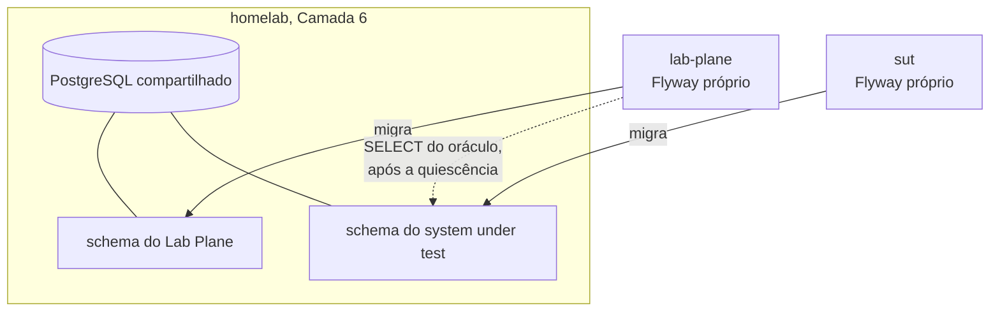
```mermaid
flowchart TB
    subgraph HL["homelab, Camada 6"]
        PG[("PostgreSQL compartilhado")]
        SL["schema do Lab Plane"]
        SS["schema do system under test"]
        PG --- SL
        PG --- SS
    end
    LP["lab-plane<br/>Flyway próprio"]
    ST["sut<br/>Flyway próprio"]
    LP -->|" migra "| SL
    ST -->|" migra "| SS
    LP -.->|" SELECT do oráculo,<br/>após a quiescência "| SS
```

**Ela fecha uma pergunta em aberto do ADR-0008.** Aquele ADR registra que a escolha
entre schema separado e dois bancos na mesma instância não fora feita, e que ela decide
permissão e espaço de nomes — nunca contaminação da medida, porque dois schemas do mesmo
cluster compartilham buffer pool, WAL, checkpointer, autovacuum e a tabela de locks. A
escolha é **schemas separados na mesma instância**.

**O custo nomeado pela própria alternativa passa a valer.** A contenção de conexões, de
CPU e de I/O atravessa a fronteira do banco lógico. O relatório de todo experimento
DEVE registrar que a medida foi feita num banco com vizinhos; sem isso, dois relatórios
com o mesmo veredito afirmam coisas diferentes. `Q-INT-3` fecha com a alternativa 2 e
esta obrigação.

**Ela dá forma concreta a `D-DOM-13`.** O Shared Kernel entre os planos deixa de ser
abstrato: o oráculo do Lab Plane lê as tabelas do schema do system under test, então o
papel do Lab Plane precisa de `USAGE` naquele schema e `SELECT` nas duas tabelas. A
fronteira que `Q-INT-5` pedia com forma verificável é uma concessão de permissão, e ela
é declarável e testável.

**Ela fecha `E-7` por consequência.** Migração por aplicação exige ferramenta de
migração, e a escolha é Flyway com SQL versionado — um arquivo por decisão aceita, nunca
editado depois de aplicado. Com isso `D-DOM-13` fecha junto: o arquivo de migração passa
a ser o contrato, e o Markdown não pode repeti-lo.

**Ela acrescenta um artefato que este repositório declara não ter.** Um contêiner local
significa `compose.yaml` versionado, e o [`../../AGENTS.md`](../../AGENTS.md) afirma hoje
que não existe `docker-compose.yml` nem comando de execução. A afirmação deixa de valer
no commit que criar o arquivo, e o texto muda junto.

**Pergunta em aberto: o Lab Plane não tem tabela nenhuma hoje.** O
[ADR-0007](0007-o-log-de-observacoes-forma-ordem-e-onde-vive.md) mantém o log em memória
e fixa a etapa 6 como o gatilho da persistência durável. Um Flyway no `lab-plane` no dia
zero teria zero migrações. Se o módulo já carrega a ferramenta com o diretório vazio, ou
se ela entra quando a primeira tabela existir, **não foi decidido**.

### A quarta rodada, em 2026-08-06: uma contradição com ADR aceito

**Estado:** `fechada`, em 2026-08-06.
**Absorvida por:** [ADR-0011](0011-a-topologia-de-servicos-e-o-caderno-de-laboratorio-fora-do-git.md#o-caderno-de-laboratório-sai-do-git)
(`E-16`, `E-17`) e [ADR-0010](0010-a-fronteira-de-schema-e-o-cdc-como-fonte-do-veredito.md#decisão) (`E-18`).

### A quinta rodada, em 2026-08-06: o CDC, conferido

**Estado:** `fechada`, em 2026-08-06.
**Absorvida por:** [ADR-0011](0011-a-topologia-de-servicos-e-o-caderno-de-laboratorio-fora-do-git.md#cinco-serviços-e-o-quatro-do-agentsmd-deixa-de-valer)
(`E-15`, `E-20`) e [ADR-0010](0010-a-fronteira-de-schema-e-o-cdc-como-fonte-do-veredito.md#decisão) (`E-19`).

#### `E-19` — ao vivo, e a tensão com o ADR-0008

**Estado:** `fechada`, em 2026-08-06. A saída não escolhida segue aberta em
[`E-36`](#e-36--a-emissão-ao-vivo-entra-na-janela-que-o-experimento-mede).
**Absorvida por:** [ADR-0010](0010-a-fronteira-de-schema-e-o-cdc-como-fonte-do-veredito.md#decisão).

### A sexta rodada, em 2026-08-06: o CDC vira fonte do veredito

**Estado:** `fechada`, em 2026-08-06.
**Absorvida por:** [ADR-0010](0010-a-fronteira-de-schema-e-o-cdc-como-fonte-do-veredito.md#decisão)
(`E-18`) e [ADR-0011](0011-a-topologia-de-servicos-e-o-caderno-de-laboratorio-fora-do-git.md#comando-no-lab-plane-leitura-no-lab-journal-sem-bff)
(`E-20`).

### `E-21`: pular o build do módulo que não mudou, aberto em 2026-08-06

Metade deste assunto já fechou sem decisão, porque não havia alternativa a debater. O
[`Dockerfile`](../../Dockerfile) copiava os quatro `src/` numa camada só e construía o
reactor inteiro uma vez por imagem; como as três imagens Java partilham o arquivo, uma
mudança em qualquer módulo alterava o hash daquela camada nas três e invalidava o cache
de todas. O `cache-from: type=gha` do workflow existia e nunca era aproveitado entre
commits. Hoje `shared` é camada própria e cada imagem compila só o módulo pedido —
medido com Docker 29.5.3, tocar `lab-plane/src` deixa o build de `lab-journal` inteiro
em cache.

**O que sobra é decisão, e é isto: pular o job do módulo intocado.** Os quatro jobs da
matriz continuam rodando sempre. O do módulo que não mudou agora é barato, mas não é
grátis — ele resolve o cache, exporta um manifesto idêntico ao anterior e ocupa um
runner.

**O obstáculo não era o GitHub Actions, era a regra de tag.** Até o fecho, a tag era o
SHA do commit, e o motivo estava escrito no próprio workflow: uma tag móvel torna
impossível dizer qual imagem produziu um resultado de experimento, que é a propriedade
que este repositório existe para ter. Um job pulado deixaria `ghcr.io/.../<módulo>:<sha>`
sem existir, e todo manifest que referenciasse o SHA do commit para os quatro serviços
apontaria para o vazio. O diagrama abaixo registra esse obstáculo como ele era, antes do
fecho:

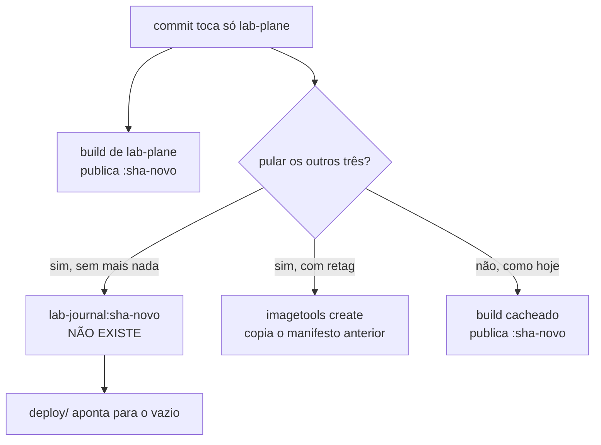
```mermaid
flowchart TD
    C["commit toca só lab-plane"]
    C --> B["build de lab-plane<br/>publica :sha-novo"]
    C --> P{"pular os outros três?"}
    P -->|" sim, sem mais nada "| X["lab-journal:sha-novo<br/>NÃO EXISTE"]
    P -->|" sim, com retag "| R["imagetools create<br/>copia o manifesto anterior"]
    P -->|" não, como hoje "| T["build cacheado<br/>publica :sha-novo"]
    X --> F["deploy/ aponta para o vazio"]
```

| Alternativa                        | A favor                                          | Contra                                            |
|------------------------------------|--------------------------------------------------|---------------------------------------------------|
| 1. matriz dinâmica com retag       | todo SHA continua tendo as quatro imagens        | achar o SHA anterior depende de retenção no GHCR  |
| 2. matriz dinâmica, tag por módulo | mais barato e mais honesto                       | transfere a complexidade inteira para `E-3`       |
| 3. não fazer nada                  | zero mecanismo novo; a regra de tag fica intacta | um job redundante por módulo intocado, por commit |

**Por que o número demorou a existir, e o motivo não era deste repositório.** Em
2026-08-06 os dois workflows passaram a executar — o `docs` fechou verde em 7s, e no
`build` o job `provas` obteve runner e `mvn verify` passou em 1m16s. Os quatro jobs
`imagem`, que rodam em paralelo depois dele, ficaram quinze minutos na fila e terminaram
com `The job was not acquired by Runner of type hosted even after multiple attempts`.
Uma reexecução passou mais de quarenta minutos sem sequer criar os jobs, e o
cancelamento foi recusado com `Cannot cancel a workflow re-run that has not yet queued`
enquanto a API do próprio run continuava a reportar `queued` — dois subsistemas do
GitHub discordando sobre o mesmo objeto. A causa foi incidente de plataforma no GitHub
Actions, reportado em [`githubstatus.com`](https://www.githubstatus.com/) na mesma data;
nada neste repositório o provocou, e a medição esperou o serviço normalizar.

**Fechada em 2026-08-13**, e o enunciado vive no fecho:
[`E-21` fecha em pular com matriz dinâmica montada do diff](#e-21-fecha-em-pular-com-matriz-dinâmica-montada-do-diff-escolhida-em-2026-08-13).
O gatilho que este parágrafo registrava — a primeira execução real produzir um tempo de
build, ou `E-3` fechar — disparou duas vezes, e as duas estão descritas lá.

### A primeira rodada do grupo II, em 2026-08-06

| ID     | Escolha                                                   | Seguiu a recomendação? |
|--------|-----------------------------------------------------------|------------------------|
| `E-8`  | `bigint` derivado da semente                              | sim                    |
| `E-9`  | sem chave estrangeira, com verificação de órfãs           | sim                    |
| `E-10` | índice `(execution_id, resource_id)`, com o plano efetivo | sim                    |
| `E-22` | chave primária `(execution_id, id)`, decidida duas vezes  | sim                    |

**`E-8` — `bigint`.** O único argumento contra era a colisão entre duas execuções da
mesma semente, e o discriminador de `D-DAT-05` o removeu. O custo já estava registrado
como consequência aceita no
[ADR-0002](0002-o-dominio-minimo-e-os-dois-oraculos.md): a geração de identidade sai do
banco, todo `INSERT` carrega a chave, e uma inserção manual em `psql` durante depuração
deixa de funcionar sem que alguém escolha um identificador.

#### `E-9` fecha a escolha e abre uma pendência que `E-18` criou

A escolha é **sem chave estrangeira**, e o motivo é o lock: um `INSERT` em `allocation`
com FK adquire `FOR KEY SHARE` na linha de `resource`, e ele conflita com o `FOR UPDATE`
da estratégia `PESSIMISTIC`. Um bloqueio vindo da restrição seria atribuído à estratégia,
e a comparação entre estratégias mediria o esquema em vez do fenômeno.

**A metade que não fecha é onde a verificação de órfãs vive.** A recomendação de
`D-DAT-02` a punha "no mesmo lugar em que o oráculo já lê o banco" — e esse lugar
**deixou de existir** em `E-18`. O Lab Plane não faz `SELECT` no schema do system under
test; ele consome o WAL. Verificar órfã a partir do stream exige reconstruir o conjunto
de `resource.id` existentes e cruzá-lo com os `INSERT` de `allocation`, que é derivar
estado a partir de eventos — o mesmo obstáculo que já deixou o oráculo de capacidade sem
fonte declarada nesta mesma fila.

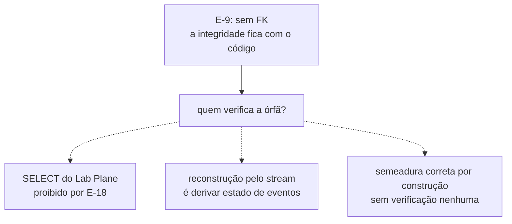
```mermaid
flowchart TB
    E9["E-9: sem FK<br/>a integridade fica com o código"]
    V["quem verifica a órfã?"]
    A["SELECT do Lab Plane<br/>proibido por E-18"]
    B["reconstrução pelo stream<br/>é derivar estado de eventos"]
    C["semeadura correta por construção<br/>sem verificação nenhuma"]
    E9 --> V
    V -.-> A
    V -.-> B
    V -.-> C
```

A terceira saída é a única sem obstáculo declarado, e ela troca verificação por
confiança no código da semeadura. **Nenhuma das três foi escolhida.** A pendência fica
vizinha da fonte do oráculo de capacidade, e as duas provavelmente fecham juntas.

**Esta pendência ganhou identificador em 2026-08-11, e vive daqui em diante em
[`E-74`](#e-74--quem-verifica-a-órfã-de-allocation-e-o-obstáculo-que-caiu).** Ela nasceu
dentro deste fecho e por isso não podia ser citada por nome. O obstáculo que o parágrafo
acima nomeia — a vizinhança com a fonte do oráculo de capacidade — **caiu** com o fecho
de `E-37` e o ADR-0013, e é a linha nova que registra o que isso muda e o que continua sem
decisão.

**`E-10` — o índice entra, e ele depende de `E-22`.** A obrigação que vem junto é a de
`D-DAT-03`: o plano de execução efetivo vai no relatório do braço `SERIALIZABLE`, sob
pena de o número não ser interpretável. O custo é escrita de índice a cada `INSERT` do
E5, dentro da janela medida. **Se `E-22` escolher `(execution_id, id)`**, a chave
primária de `allocation` já começa pelo discriminador e este índice é adicional; se
escolher `(id, execution_id)`, ele passa a ser o único caminho de acesso por execução.

#### `E-22` fecha em `(execution_id, id)`, e a linha foi decidida duas vezes

A primeira escolha foi `(id, execution_id)`, e ela caiu no mesmo dia. O percurso fica
registrado porque o que a inverteu foi uma correção de mérito, e não uma mudança de
gosto.

**O argumento que sustentava a primeira escolha estava inflado, e quem o inflou foi esta
fila.** Ele dizia que buscar "a mesma linha em **todas** as execuções" é operação central
do laboratório, porque comparar `NONE`, `PESSIMISTIC` e `OPTIMISTIC` é comparar a mesma
entidade lógica entre execuções. **Não é uma consulta.** O oráculo do
[ADR-0002](0002-o-dominio-minimo-e-os-dois-oraculos.md) calcula
`perdidas = commits − (value_final − value_inicial)` **dentro** de cada execução, e a
comparação entre estratégias acontece depois, sobre números já calculados, no relatório.
Nenhum caminho quente junta execuções numa consulta só; isso é inspeção manual em `psql`,
e ela pode pagar uma varredura.

| Consulta                            | Quem a faz                   | Frequência   |
|-------------------------------------|------------------------------|--------------|
| tudo de uma execução                | consumidor de CDC, histórico | todo momento |
| a linha 42000 de uma execução       | operação medida              | todo momento |
| a linha 42000 em todas as execuções | pessoa depurando em `psql`   | raro         |

A ordem escolhida põe as duas primeiras no prefixo do índice, e deixa a terceira pagar
varredura. A ordem descartada fazia o inverso — otimizava a rara e punha a frequente na
dependência de um índice secundário, sobre um histórico que nunca é apagado.

**O ganho de escrita vem junto.** O `execution_id` é um UUIDv7, cujo prefixo de instante
cresce, então toda inserção cai no fim da B-tree em vez de espalhada por ela. É a mesma
propriedade pela qual `D-DAT-05` preferiu UUIDv7 a UUIDv4, agora valendo também para a
chave primária. A pressão de `fillfactor` que a ordem descartada exigiria deixa de ser
questão, e `P-DAT-2` continua tratando só do autovacuum.

**O custo que passa a valer.** As linhas de uma mesma execução ficam fisicamente
adjacentes no índice, e workers concorrentes inserem na mesma página de folha. É
contenção de índice dentro da janela medida — ruído do instrumento, e não fenômeno
estudado. Ele não tem mitigação decidida, e é vizinho de `P-DAT-2` pelo mesmo motivo:
nenhuma política de página está declarada em documento nenhum.

**`E-10` permanece, e volta a ser aditivo.** Com o discriminador já no prefixo da chave
primária, o índice `(execution_id, resource_id)` deixa de ser o único caminho por
execução e volta ao papel que `D-DAT-03` lhe deu: aproximar o predicate lock do
`SERIALIZABLE` do conflito real. A obrigação de registrar o plano efetivo no relatório
continua.

**A contradição interna de `D-DAT-05` fica resolvida do outro lado.** A escolha ratifica
o diagrama — "PK começa pelo discriminador" — e a consequência de que "todo índice passa
a começar pelo discriminador". A frase vencida é "o discriminador é a segunda coluna da
chave", e ela fica registrada como tal aqui, sem editar o documento arquivado.

#### `E-23` — o nome da coluna do discriminador, aberto ao escrever o primeiro DDL

Com `E-8`, `E-9`, `E-10` e `E-22` fechadas, o `CREATE TABLE` das duas tabelas pode ser
escrito — e ele trava numa palavra. `D-DAT-05` decidiu que a coluna afirma "discriminador
de inquilino, com **nome genérico no sistema medido**", e deixou o nome concreto em
aberto de propósito: o sistema medido não sabe que o valor é uma execução de experimento,
e para ele aquilo é a partição lógica dos dados.

Chamá-la de `execution_id` nas tabelas do system under test contradiz a decisão na
palavra exata que ela escolheu evitar. **A ligação com o Lab Plane é justamente o que a
coluna não pode declarar**, porque declará-la põe vocabulário do instrumento dentro do
medido — o mesmo custo que `D-DAT-05` nomeou ao aceitar o discriminador na chave, e que
esta linha decide se paga inteiro ou pela metade.

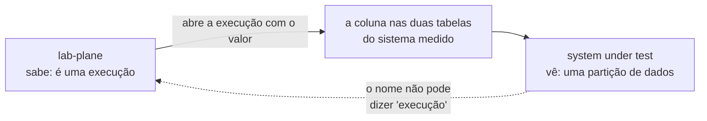
```mermaid
flowchart LR
    LP["lab-plane<br/>sabe: é uma execução"]
    COL["a coluna nas duas tabelas<br/>do sistema medido"]
    SUT["system under test<br/>vê: uma partição de dados"]
    LP -->|" abre a execução com o valor "| COL
    COL --> SUT
    SUT -.->|" o nome não pode<br/>dizer 'execução' "| LP
```

As candidatas visíveis são `tenant_id`, `partition_id` e `run_id`. As duas primeiras
honram a decisão e custam um salto mental em toda consulta do Lab Plane; a terceira é
legível dos dois lados e é a que a decisão diz para não usar. **Nenhuma foi escolhida**,
e o `CREATE TABLE` não pode ser escrito antes disso.

#### `E-11` mudou de terreno: o instrumento já publica identidade no sistema medido

**Estado:** `fechada`, em 2026-08-06.
**Absorvida por:** [ADR-0011](0011-a-topologia-de-servicos-e-o-caderno-de-laboratorio-fora-do-git.md#identidade-embutida-no-domínio-medido-ou-no-lab-plane).

### A segunda rodada do grupo II, em 2026-08-06

**Estado:** `fechada` na parte da identidade, em 2026-08-06. As duas seções de `E-23`
continuam abaixo por não terem ADR que as carregue.
**Absorvida por:** [ADR-0011](0011-a-topologia-de-servicos-e-o-caderno-de-laboratorio-fora-do-git.md#o-componente-de-identidade)
(`E-11`, `E-13`).

#### `E-11` fecha no componente próprio, e abre `E-24` no mesmo ato

**Estado:** `fechada`, em 2026-08-06, contra a recomendação.
**Absorvida por:** [ADR-0011](0011-a-topologia-de-servicos-e-o-caderno-de-laboratorio-fora-do-git.md#o-componente-de-identidade).

#### `E-24` — a alternativa C isola a regra, e não decide quem a invoca

**Estado:** `fechada`, em 2026-08-06.
**Absorvida por:** [ADR-0011](0011-a-topologia-de-servicos-e-o-caderno-de-laboratorio-fora-do-git.md#o-componente-de-identidade).

#### `E-13` fecha por papel do valor, e o `AGENTS.md` muda no mesmo commit

**Estado:** `fechada`, em 2026-08-06. Não gerou ADR.
**Absorvida por:** [`AGENTS.md` da raiz](../../AGENTS.md#regras-estruturais-que-valem-sempre).

#### `E-23` ganhou uma quarta candidata: nome diferente de cada lado

A pergunta é de 2026-08-06, e ela desfaz um pressuposto que as três candidatas anteriores
carregavam sem enunciar — o de que a coluna precisa ter **um** nome. Ela não precisa.
Pela decisão `E-18` cada serviço tem seu próprio schema e nenhum lê o do outro, então
nada obriga que a coluna do sistema medido e a das tabelas do Lab Plane se chamem igual.

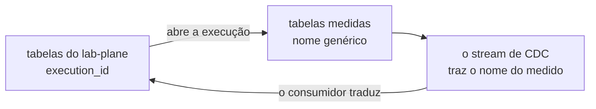
```mermaid
flowchart LR
    LPT["tabelas do lab-plane<br/>execution_id"]
    SUT["tabelas medidas<br/>nome genérico"]
    CDC["o stream de CDC<br/>traz o nome do medido"]
    LPT -->|" abre a execução "| SUT
    SUT --> CDC
    CDC -->|" o consumidor traduz "| LPT
```

**O salto mental não desaparece; ele muda de lugar.** Nas suas próprias tabelas o Lab
Plane escreve `execution_id` e lê `execution_id`. Mas o oráculo lê o sistema medido por
CDC, e o stream carrega o nome que a coluna tem **lá** — a tradução passa a viver no
consumidor, num ponto só e nomeado, em vez de espalhada por toda consulta. Contra: um
mesmo valor com dois nomes exige que alguém saiba que são o mesmo, e essa ligação deixa
de ser visível no esquema.

#### `E-23` fecha em nomes assimétricos, um por lado da fronteira

A coluna se chama `partition_id` nas tabelas do sistema medido e `execution_id` nas
tabelas do Lab Plane. É a quarta candidata, e ela sai da pergunta de 2026-08-06. O
`CREATE TABLE` das duas tabelas medidas deixa de estar bloqueado.

`D-DAT-05` fica honrada na letra: o sistema medido não carrega a palavra "execução" em
lugar nenhum, e para ele aquilo é o que o nome diz — uma partição. O instrumento escreve
e lê `execution_id` nas suas próprias tabelas, sem salto mental.

**O custo é uma ligação que o esquema não declara.** Um mesmo valor com dois nomes exige
que alguém saiba que são o mesmo, e nenhuma constraint diz isso — não poderia dizer, já
que `E-18` proíbe o cruzamento de schemas. A tradução vive num ponto só, no consumidor do
stream de CDC, e é ali que ela precisa estar escrita e testada.

### Timestamps, propostos em 2026-08-06, e a fronteira os separa em duas linhas

A proposta é `created_at` e `updated_at` nas duas tabelas medidas, e `executed_at`,
`concluded_at`, `created_at` e `updated_at` do lado do Lab Plane. **Os dois lados têm
argumentos disjuntos**, e por isso viram duas linhas. `E-25` volta a bloquear o
`CREATE TABLE` que `E-23` acabara de desbloquear.

#### `E-25` — timestamps nas tabelas medidas

**A objeção pedagógica saiu daqui em 2026-08-12**, pelo fecho de
[`E-76`](#e-76-fecha-em-a-regra-desce-para-o-feature-card-escolhida-em-2026-08-12). A
regra — uma estratégia de concorrência **NÃO DEVE** ler `updated_at` — e o argumento que a
sustenta vivem hoje em
[`deteccao-de-atualizacao-perdida`](../features/deteccao-de-atualizacao-perdida/example-mapping.md#updated_at-existe-no-esquema-e-nenhuma-estratégia-pode-lê-la),
que **hospeda a redação de referência dos dois** e transcreve na íntegra o parágrafo que
estava aqui. O heading permanece porque o
[ADR-0015](0015-a-chave-o-discriminador-de-execucao-e-as-colunas-de-tempo.md) o cita duas
vezes, e porque esta linha continua sendo **onde a decisão foi tomada**, em 2026-08-06: o
que mudou de casa foi a redação, e não a autoria. O texto podado está nesta linha como ela
era em `0837ac3`.

**O resto do corpo fica, e o motivo é que nada o hospeda.** O fecho de `E-76` desceu a
regra e o argumento pedagógico, e só eles; o custo das três formas de nascer o valor, o
alcance da regra do relógio e a comparação com o LSN não foram transportados a documento
nenhum, e apagá-los aqui os perderia.

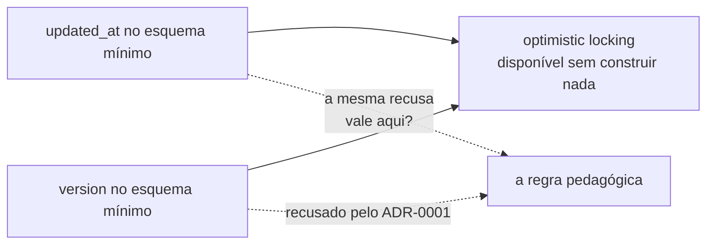
```mermaid
flowchart LR
    U["updated_at no esquema mínimo"]
    V["version no esquema mínimo"]
    O["optimistic locking<br/>disponível sem construir nada"]
    U --> O
    V --> O
    V -.->|" recusado pelo ADR-0001 "| R["a regra pedagógica"]
    U -.->|" a mesma recusa<br/>vale aqui? "| R
```

**A segunda objeção é sobre como o valor nasce.** As três formas custam:

| Forma                     | O que custa                                  |
|---------------------------|----------------------------------------------|
| `DEFAULT now()`           | relógio do banco, fora de qualquer adaptador |
| trigger `BEFORE UPDATE`   | código dentro da transação medida            |
| preenchida pela aplicação | o medido passa a depender do adaptador       |

O `DEFAULT now()` tem um defeito a mais, e ele é específico do PostgreSQL: `now()`
retorna o instante de **início da transação**, e não o do statement — duas rows escritas
na mesma transação recebem o mesmo valor, o que apaga justamente a ordem que a coluna
deveria mostrar. O trigger é pior por outro motivo: ele acrescenta trabalho **dentro da
janela exata** onde o lost update acontece, e o laboratório mede o que ocorre ali. A
terceira respeita a regra do relógio, e cobra que o sistema medido dependa do adaptador
por uma coluna que nenhum oráculo lê.

**A regra do relógio injetável não as proíbe, e isso precisa ser dito.** Pelo alcance
fixado em `E-13` nesta mesma data, as regras valem sobre valor que entra em veredito, em
escalonamento ou em identidade derivada da semente. Um `created_at` de `resource` não
entra em nenhum dos três. **A objeção vem da pedagogia e do custo na janela medida, não
da regra** — e confundir as duas coisas seria usar a regra como argumento que ela não faz.

**A favor:** com o discriminador preservando execuções antigas, uma pessoa que inspecione
o banco depois quer ordená-las no tempo. **Contra isso:** a ordem já existe e é melhor —
o CDC entrega em ordem de LSN, que é a ordem real de commit. Um timestamp de wall clock é
pior que o LSN para ordenar, e é o LSN que o oráculo usa.

#### `E-26` — timestamps nas tabelas do Lab Plane

**Aqui não há objeção pedagógica.** O Lab Plane é o instrumento, e não o objeto de
estudo; `executed_at` e `concluded_at` são propriedade da execução, e a timeline do
[ADR-0001](0001-o-passo-como-unidade-de-execucao.md) e o relatório dependem de saber
quando cada coisa aconteceu. `created_at` e `updated_at` da definição de experimento são
metadados de CRUD, sem relação com medida.

**Mas `E-13` acabou de decidir algo que alcança esta linha, e não é óbvio.** O veredito em
formato **curva** do grupo D é uma fila crescendo ao longo do tempo. Se a curva for
construída sobre `executed_at` e `concluded_at`, esses valores **entram no papel
veredito** — e o relógio que os produz DEVE ser o adaptador injetável, nunca um
`DEFAULT now()` do banco. É a primeira consequência concreta da formulação por papel.

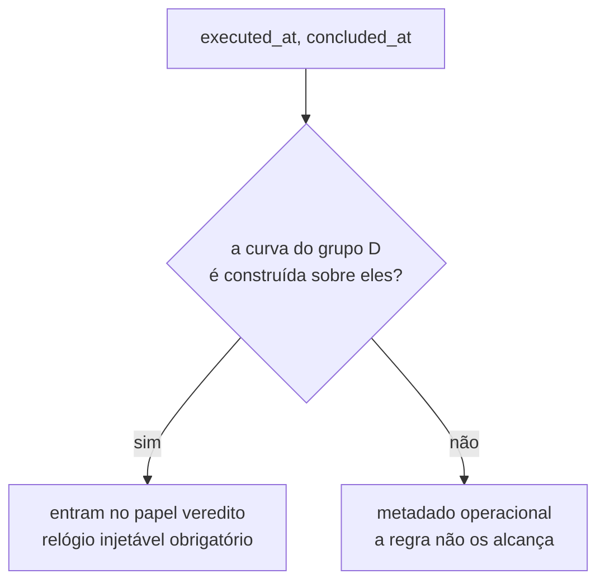
```mermaid
flowchart TB
    E["executed_at, concluded_at"]
    Q{"a curva do grupo D<br/>é construída sobre eles?"}
    S["entram no papel veredito<br/>relógio injetável obrigatório"]
    N["metadado operacional<br/>a regra não os alcança"]
    E --> Q
    Q -->|" sim "| S
    Q -->|" não "| N
```

**Uma segunda pergunta fica aberta, e ela é do laboratório, não do CRUD.** `executed_at` e
`concluded_at` marcam a fronteira da janela medida pelo relógio do Lab Plane, enquanto o
oráculo ordena eventos por LSN do WAL do sistema medido. **São duas fontes de tempo
distintas**, e correlacionar as duas é exatamente o problema que o grupo E estuda sob o
nome de clock skew. Nada nesta fila decide como elas se alinham.

**Nenhuma das duas linhas foi decidida.**

### A terceira rodada do grupo II, em 2026-08-06

**Estado:** `fechada` para `E-12` e `E-24`, em 2026-08-06. `E-25` e `E-26` permanecem
abertas, registradas nas seções `Perguntas em aberto` dos Example Mapping de
[atualização perdida](../features/deteccao-de-atualizacao-perdida/example-mapping.md#perguntas-em-aberto)
e de [execução de experimento](../features/execucao-de-experimento/example-mapping.md#perguntas-em-aberto).
**Absorvida por:** [ADR-0012](0012-o-broker-no-caminho-do-veredito-e-a-dispensa-que-ele-exigiu.md#decisão)
(`E-12`) e [ADR-0011](0011-a-topologia-de-servicos-e-o-caderno-de-laboratorio-fora-do-git.md#o-componente-de-identidade)
(`E-24`).

#### `E-12` fecha no broker, e o LSN é o que torna a escolha defensável

**Estado:** `fechada`, em 2026-08-06, contra a recomendação.
**Absorvida por:** [ADR-0012](0012-o-broker-no-caminho-do-veredito-e-a-dispensa-que-ele-exigiu.md#decisão).

#### `E-24` fecha no serviço próprio, e a latência sai da janela se a derivação for antes

**Estado:** `fechada`, em 2026-08-06.
**Absorvida por:** [ADR-0011](0011-a-topologia-de-servicos-e-o-caderno-de-laboratorio-fora-do-git.md#o-componente-de-identidade).

### Quatro linhas novas, abertas pelas escolhas da terceira rodada

As outras duas, `E-28` e `E-29`, fecharam em 2026-08-06 e a parte permanente delas vive em
[ADR-0012](0012-o-broker-no-caminho-do-veredito-e-a-dispensa-que-ele-exigiu.md#decisão).

#### `E-27` — como o valor de `created_at` e `updated_at` nasce

`E-25` decidiu que as colunas existem. **Não decidiu quem as preenche**, e as três formas
já estão medidas acima: `DEFAULT now()` colapsa rows da mesma transação num só instante;
trigger `BEFORE UPDATE` acrescenta trabalho **dentro** da janela medida; e o preenchimento
pela aplicação faz o sistema medido depender do adaptador de relógio por uma coluna que
nenhum oráculo lê. A segunda é a única que altera o que se está medindo.

#### `E-30` — o slot do conector deixou de ser por execução, e vira permanente

**Fechada em 2026-08-10**, e o enunciado vive no fecho:
[`E-30` fecha em limite finito com alerta](#e-30-fecha-em-limite-finito-com-alerta-escolhida-em-2026-08-10).

### O que a quarta rodada apurou antes de perguntar, em 2026-08-06

#### `E-30` não entra nesta rodada, e a razão é que ela depende de `E-5`

**O adiamento caiu, e a linha fechou em 2026-08-10.** Ele dependia de `E-5`, que já estava
fechada quando este parágrafo foi escrito — o argumento se invertia por inteiro. Tanto o
adiamento quanto a premissa caída estão registrados no fecho:
[`E-30` fecha em limite finito com alerta](#e-30-fecha-em-limite-finito-com-alerta-escolhida-em-2026-08-10).

### A quarta rodada do grupo II, em 2026-08-06

| Linha              | Escolha                               | Seguiu a recomendação? |
|--------------------|---------------------------------------|------------------------|
| `E-27`             | aplicação, pelo adaptador de relógio  | sim                    |
| `E-28`             | Debezium Server, processo separado    | não                    |
| `E-29` (topologia) | a mesma instância, e o custo é aceito | não                    |
| `E-29` (filtro)    | filtro no consumidor, com contagem    | sim                    |

#### `E-27` fecha na aplicação, e o DDL das duas tabelas medidas deixa de ter lacuna

As colunas nascem `timestamptz NOT NULL`, sem `DEFAULT` e sem trigger, e o valor vem do
adaptador de relógio no momento da escrita. Nada roda dentro da transação medida além do
`INSERT` ou do `UPDATE` que já rodaria.

**A ausência de `DEFAULT` é deliberada e tem custo.** Uma escrita que esqueça a coluna
falha por `NOT NULL` em vez de gravar um valor plausível e errado. É a troca certa aqui:
um erro barulhento na primeira execução vale mais que um instante silenciosamente vindo do
relógio errado, meses depois, num experimento de clock skew.

A tensão registrada acima permanece por escrito: se algum experimento do grupo E ler
`updated_at` como insumo, a coluna deixa de ser metadado inerte, e a regra de `E-25` passa
a conviver com essa leitura. A regra fala de estratégia de concorrência, e não de oráculo
— **não há contradição hoje, e há pressão amanhã**.

### Três linhas novas, abertas pela quarta rodada

#### `E-31` — onde vive a configuração do Debezium Server

Ele não é um módulo Maven, e não nasce do reactor. A configuração é declarativa e precisa
ser versionada, entregue e bumpada como os outros quatro artefatos. **Isso reabria a
pressão sobre `E-3`**, a forma do `deploy/`, que seguia adiada até fechar em 2026-08-13
([`E-3` fecha em manifests no `homelab-infrastructure`](#e-3-fecha-em-manifests-no-homelab-infrastructure-escolhida-em-2026-08-13)).

#### `E-32` — o teste que prova que o LSN chega ao consumidor

**Fechada em 2026-08-06.** O LSN é o que ordena os eventos do WAL, e nada garante que ele
sobreviva à travessia `pgoutput` → Debezium Server → RabbitMQ → `lab-plane`: uma
transformação de mensagem no meio do caminho pode descartar o bloco `source` que o carrega.
A guarda decidida é um teste de aceitação sobre a cadeia inteira, descrito abaixo em
[`E-32` fecha na cadeia inteira](#e-32-fecha-na-cadeia-inteira-e-o-teste-ganha-uma-segunda-asserção)
e registrado em
[ADR-0012](0012-o-broker-no-caminho-do-veredito-e-a-dispensa-que-ele-exigiu.md#negativas).

`E-33`, a terceira linha aberta por esta rodada, fechou na mesma data e sua lápide está em
[`E-33` fecha na distinção](#e-33-fecha-na-distinção-e-ela-transforma-uma-recomendação-de-e-3-em-requisito).

### O que a quinta rodada apurou antes de perguntar, em 2026-08-06

Dois achados sobre `E-31`, verificados na documentação do Debezium Server e na própria
árvore, e um deles abriu `E-34`, uma linha que ninguém tinha visto. O registro daquele
segundo achado foi apagado em 2026-08-10, por não ser citado de lugar nenhum, e o
enunciado de `E-34` continua adiante.

#### Achado sobre `E-31` — a variável de ambiente sobrepõe tudo, e isso dissolve a tensão do Secret

O Debezium Server é uma aplicação Quarkus. A configuração vive em
`config/application.properties`, com os prefixos `debezium.source.*` para o conector e
`debezium.sink.*` para o destino — e **toda opção presente nesse arquivo pode ser
acrescentada ou sobreposta por variável de
ambiente**. A fonte é a
[documentação de operação do Debezium Server](https://debezium.io/documentation/reference/stable/operations/debezium-server.html),
conferida em 2026-08-06 — evidência externa, e não deste repositório.

Isso importa porque a credencial de `REPLICATION` sobre o banco do sistema medido é um
Secret, e o [`AGENTS.md`](../../AGENTS.md) proíbe Secret neste repositório. Sem o override
por ambiente, um arquivo versionado obrigaria a interpolação como único recurso; com ele,
a senha simplesmente nunca aparece em arquivo nenhum.

**Há precedente na árvore, e ele aponta para o ambiente.** O [`compose.yaml`](../../compose.yaml)
não monta arquivo de configuração para serviço nenhum: `LAB_PLANE_DB_URL`,
`SUT_DB_PASSWORD` e as demais vão todas por ambiente. A única exceção é
`local/postgres-init.sql`, que é script de inicialização do banco e não configuração de
aplicação.

| Forma                                 | Onde a senha vive | O que o `deploy/` carrega |
|---------------------------------------|-------------------|---------------------------|
| arquivo versionado, senha interpolada | ambiente          | ConfigMap com o arquivo   |
| só variável de ambiente               | ambiente          | as variáveis do manifesto |
| esperar `E-3`                         | —                 | nada, e o CDC não sobe    |

A terceira não era neutra. Enquanto durou, o Debezium Server rodou só no `compose.yaml`
de desenvolvimento e **não existiu no homelab** — o veredito não podia ser produzido lá.
`E-3` fechou em 2026-08-13 decidindo **onde os manifests vivem**, e não decidiu onde a
configuração do Debezium Server vive: essa parte de `E-31` continua sem forma.

### A quinta rodada do grupo II, em 2026-08-06

| Linha  | Escolha                                      | Seguiu a recomendação? |
|--------|----------------------------------------------|------------------------|
| `E-31` | não decidida; exigência nova registrada      | —                      |
| `E-32` | aceitação com os três contêineres            | sim                    |
| `E-33` | invalida só se o discriminador estiver ativo | sim                    |

#### `E-31` não fecha, e o que a impede é uma exigência que a fila não enunciava

Nenhuma das três formas foi escolhida, e a razão é ortogonal a todas elas: **rodar o
Debezium Server no cluster exige mudar o repositório
[`homelab-infrastructure`](https://github.com/da0hn/homelab-infrastructure)**, e essa
exigência não estava escrita em lugar nenhum desta fila. Ela vale para qualquer das três
formas, porque nenhuma delas é alcançada por um `deploy/` que este repositório sozinho
produza.

O que ela acrescenta, pelo que o [`AGENTS.md`](../../AGENTS.md) já registra do contrato da
ADR 0017 daquele repositório:

- **A credencial de `REPLICATION` é um Secret**, e Secret não entra aqui. Ela é cifrada
  com SOPS/KSOPS no homelab e referenciada por nome — o que significa que a decisão de
  `E-31` sobre onde a configuração vive **não** decide onde a senha vive; ela já está
  decidida, e fora deste repositório.
- **O `Application` do ArgoCD aponta para um `deploy/` que não existe.** Já é o
  `ComparisonError` que motivou `E-3`. Um serviço a mais não o piora, mas também não
  chega ao cluster antes de os manifests existirem no `homelab-infrastructure` — `E-3`
  fechou em 2026-08-13 decidindo que eles vivem lá; criá-los é a
  [issue #2](https://github.com/da0hn/homelab-infrastructure/issues/2).

**Pergunta em aberto: a ADR 0017 alcança uma imagem que este repositório não constrói?** O
`AGENTS.md` registra que ela descreve o laboratório como "monorepo de microsserviços JVM",
e o contrato dela fala em imagem publicada no GHCR com tag igual ao SHA do commit. O
`debezium/server` é imagem de terceiro, com tag de versão do Debezium, e nenhum commit
daqui a produz. Se isso é caso previsto ou lacuna, não foi conferido aqui.

#### `E-32` fecha na cadeia inteira, e o teste ganha uma segunda asserção

**Estado:** `fechada`, em 2026-08-06. **O teste não existe.**
**Absorvida por:** [ADR-0012](0012-o-broker-no-caminho-do-veredito-e-a-dispensa-que-ele-exigiu.md#negativas).

#### `E-33` fecha na distinção, e ela transforma uma recomendação de `E-3` em requisito

**Fechada em 2026-08-06.** Um evento que chega ao `lab-plane` com discriminador de execução
**ativo** e não reconhecido invalida a execução; um com discriminador de execução encerrada
é descartado em silêncio, porque ele é resíduo de uma janela que já fechou. A distinção só
se sustenta se um `lab-plane` souber quais execuções estão ativas — e com duas réplicas,
uma delas não sabe. **A réplica única deixou de ser preferência e virou condição do
veredito confiável**, o que era insumo vivo para `E-3` enquanto ela seguiu aberta. Com
`E-3` fechada em 2026-08-13, o lugar que honra esse `DEVE` é o manifesto do
`homelab-infrastructure` — [ADR-0019](0019-a-entrega-sai-do-deploy-e-a-imagem-ganha-tag-semantica.md#decisão)
e [issue #2](https://github.com/da0hn/homelab-infrastructure/issues/2). A consequência está em
[ADR-0012](0012-o-broker-no-caminho-do-veredito-e-a-dispensa-que-ele-exigiu.md#consequências),
e onde a lista de execuções ativas vive continua aberto em
[`E-35`](#e-35--onde-o-lab-plane-guarda-quais-execuções-estão-ativas).

### Duas linhas novas, abertas pela quinta rodada

#### `E-34` — qual dos dois sinks de RabbitMQ, e o que ele amarra

Aberta na apuração acima. `rabbitmq` sobre AMQP 0-9-1 contra `rabbitmqstream` sobre o
protocolo de stream. A escolha decide, sem dizer, qual fenômeno de saturação o grupo B
consegue reproduzir. **Não entra até o grupo B ter experimento especificado.**

#### `E-35` — onde o `lab-plane` guarda quais execuções estão ativas

`E-33` exige a resposta a "este discriminador pertence a execução ativa?", e não disse de
onde ela vem. Em memória, a resposta some num reinício e toda a execução seguinte passa a
descartar às cegas. Numa tabela do schema do `lab-plane`, ela sobrevive — e cria a primeira
tabela daquele schema, hoje vazio. A linha decide qual das duas, e como uma execução
abandonada deixa de ser ativa.

#### `E-35` fecha em tabela no `lab_plane`, escolhida em 2026-08-10

**Escolhido pela pessoa em 2026-08-10.** A lista de quais execuções estão ativas passa a
viver numa **tabela do schema `lab_plane`**, que se torna a primeira tabela daquele
schema — hoje vazio de propósito
(`lab-plane/src/main/resources/db/migration/V1__criar_schema_do_lab_plane.sql:7-8`).

**Um `lab-plane` reinicia a cada deploy, e isso já basta para apagar a resposta em
memória.** Não é preciso `Deployment`, `selfHeal` nem qualquer outro mecanismo de
auto-reinício: "Em memória, um reinício apaga a resposta, e a execução seguinte descarta às
cegas"
([ADR-0012, Negativas](0012-o-broker-no-caminho-do-veredito-e-a-dispensa-que-ele-exigiu.md#negativas)).
Hoje nada neste repositório reinicia o `lab-plane` sozinho: `deploy/` não existe, o
`Application` do ArgoCD segue em `ComparisonError`
([`../../AGENTS.md`](../../AGENTS.md#este-repositório-é-entregue-no-homelab)), e o
`compose.yaml` não declara `restart:` em nenhum serviço, nem localmente. O que sustenta
esta escolha não é um reinício automático em curso — é que **todo deploy, aqui ou no
homelab, é ele próprio um reinício** do processo, e nenhuma tabela de estado corrente
sobrevive a um reinício quando vive só em memória.

**A escolha é antecipatória, e o custo disso fica nomeado, não escondido.** O precedente
que sustentaria manter a lista em memória é o do
[ADR-0007, Onde o log vive](0007-o-log-de-observacoes-forma-ordem-e-onde-vive.md#onde-o-log-vive):
aceitar estado volátil até um gatilho nomeado disparar. O gatilho daquele ADR está escrito
por extenso — "quando a etapa 6 introduzir um experimento que derruba o processo, 'log em
memória, perdido se o processo morrer' deixa de ser aceitável"
([ADR-0007, Quando esta decisão deixa de valer](0007-o-log-de-observacoes-forma-ordem-e-onde-vive.md#quando-esta-decisão-deixa-de-valer))
— e ele **ainda não disparou**: nenhum experimento da etapa 6 existe executável nesta
árvore. Fixar a tabela agora, antes de esse gatilho ocorrer, contraria o padrão do
precedente, que adia persistência até haver motivo concreto. A escolha é feita sabendo
disso: o motivo concreto que o precedente exigiria ainda não existe.

**Distinguir higiene de invalidação exige saber quem está ativo.** A mesma decisão do
broker manda o consumidor tratar diferente um evento de execução já concluída — higiene —
e um evento de execução ainda ativa — que invalida o veredito —, e isso "exige saber quais
discriminadores estão ativos"
([ADR-0012, Decisão](0012-o-broker-no-caminho-do-veredito-e-a-dispensa-que-ele-exigiu.md#decisão)).
A lista é condição do veredito confiável, e não conveniência de implementação.

**Nenhum ADR aceito proíbe uma tabela ali.** O schema `lab_plane` está vazio de propósito
até aqui: a primeira migração diz que "nenhuma tabela entra aqui. As do Lab Plane dependem
das decisoes E-8 a E-13, do grupo II do Lote E"
(`lab-plane/src/main/resources/db/migration/V1__criar_schema_do_lab_plane.sql:7-8`), e o
papel `lab_plane` já tem `CREATE` concedido no banco (`local/postgres-init.sql:18`).

**Esta escolha não contradiz o ADR-0011, e a razão é o que a lista guarda.** Aquele ADR
recusou pôr o **histórico do que foi medido** dentro do `lab-plane`, pelo argumento do
ADR-0008: "o instrumento que mede guardaria o que mediu"
([ADR-0011, Histórico de execução dentro do `lab-plane`](0011-a-topologia-de-servicos-e-o-caderno-de-laboratorio-fora-do-git.md#histórico-de-execução-dentro-do-lab-plane)).
A lista de execuções ativas não é isso: ela não registra o que uma execução mediu, é
estado operacional do consumidor — quais discriminadores o filtro que
[`E-33`](#e-33-fecha-na-distinção-e-ela-transforma-uma-recomendação-de-e-3-em-requisito)
exige tratar como vivos agora, e some quando a execução deixa de estar ativa. O histórico
permanece fora do `lab-plane`; o que entra é só o estado corrente do filtro.

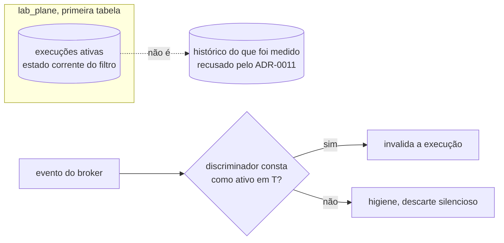
```mermaid
flowchart LR
    subgraph LP["lab_plane, primeira tabela"]
        T[("execuções ativas<br/>estado corrente do filtro")]
    end
    H[("histórico do que foi medido<br/>recusado pelo ADR-0011")]
    B["evento do broker"] --> C{"discriminador consta<br/>como ativo em T?"}
    C -->|" sim "| INV["invalida a execução"]
    C -->|" não "| HIG["higiene, descarte silencioso"]
    T -.->|" não é "| H
```

**A descartada, e o motivo.** Manter a lista **em memória, com o mesmo gatilho de
reversão do precedente citado acima** — esperar a etapa 6 introduzir o experimento que
derruba o processo. Perde aqui não porque o gatilho já tenha disparado, mas porque esperar
por ele não evita o custo: um deploy comum já apaga a resposta em memória antes de
qualquer experimento da etapa 6 existir, e o custo não é perder um registro histórico — é
a execução seguinte descartar às cegas e o veredito sair errado sem sintoma.

**O que esta linha NÃO decide.** A forma da tabela — colunas, chave e migração — não foi
escolhida. `Pergunta em aberto`. Como uma execução abandonada deixa de ser ativa também
não foi decidido aqui; o motivo de abrir linha própria em vez de responder de passagem
está registrado em
[`E-50`](#e-50--como-uma-execução-ativa-deixa-de-ser-ativa-chegue-ou-não-ao-fim).

#### `E-50` — como uma execução ativa deixa de ser ativa, chegue ou não ao fim

Aberta em 2026-08-10, pelo fecho de
[`E-35`](#e-35-fecha-em-tabela-no-lab_plane-escolhida-em-2026-08-10). "Execução
abandonada" não está definida em documento nenhum deste repositório, e a pergunta original
— como o `lab-plane` sabe que pode remover uma linha da lista de execuções ativas — se
divide em duas conforme a execução chega ou não ao fim. **As duas metades ficam abertas
aqui**, nenhuma das duas é dada por resolvida.

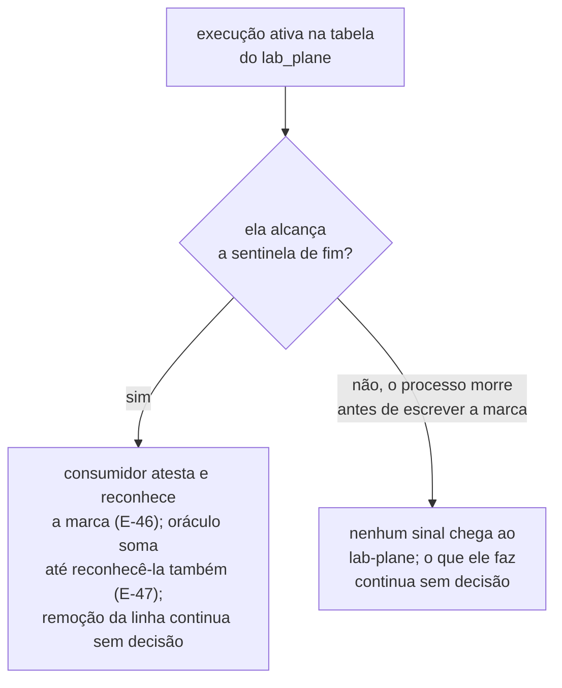
```mermaid
flowchart TD
    E["execução ativa na tabela<br/>do lab_plane"] --> F{"ela alcança<br/>a sentinela de fim?"}
    F -->|" sim "| T["consumidor atesta e reconhece<br/>a marca (E-46); oráculo soma<br/>até reconhecê-la também (E-47);<br/>remoção da linha continua sem decisão"]
    F -->|" não, o processo morre<br/>antes de escrever a marca "| A["nenhum sinal chega ao<br/>lab-plane; o que ele faz<br/>continua sem decisão"]
```

**A citação que fecharia o caminho óbvio alcança menos do que parece.** "O término já é
um evento do próprio runtime"
([ADR-0005, Justificativa](0005-a-forma-do-escalonador.md#justificativa)) é o argumento
contra timeout para a **desistência de worker dentro do escalonador**, e só para ela —
não para o `lab-plane` decidir abandono de execução, que é a pergunta desta linha. O que
poderia alcançar esta linha é a regra geral: tempo de parede fora de um adaptador de
relógio é proibido. **Se ela a alcança é o que o parágrafo seguinte deixa em aberto** —
e enquanto isso não fechar, o caminho não está fechado por esta citação nem por
nenhuma outra.

**O fecho de [`E-47`](#e-47-fecha-na-sentinela-escolhida-em-2026-08-10) carrega uma
exceção, e se ela alcança esta linha não está estabelecido.** A exceção é "um limite que
não entra em veredito não é alcançado pela regra do relógio injetável", e o "limite de
espera" daquela linha segue `Pergunta em aberto` por ela. Aplicá-la aqui exige saber se
a remoção da linha da lista de execuções ativas entra em veredito. **Isso não foi
decidido.** `Pergunta em aberto`.

**Os dois fechos que a fila já tem apontam em direções opostas, e a divergência fica
registrada em vez de resolvida.** O fecho de `E-47` deriva a exceção de o limite
produzir `fonte atrasada` "e não um veredito", e conclui que ele "deixou de ser insumo
de veredito" — ali, produzir invalidação é justamente o que **tira** o limite do
veredito. O fecho de
[`E-35`](#e-35-fecha-em-tabela-no-lab_plane-escolhida-em-2026-08-10) puxa para o outro
lado: "A lista é condição do veredito confiável, e não conveniência de implementação", e
quem sai da lista decide se um evento de backlog é higiene ou invalidação. Ler daí que
um limite de parede que decide abandono decide, por consequência, invalidação, e que por
isso entra em veredito, é **leitura desta linha e não consequência dada** — nenhum
documento deste repositório afirma que a remoção da linha entra em veredito, e o mesmo
critério, aplicado ao próprio `E-47`, retiraria a exceção de quem a criou. O corpo de
`E-47` permanece como fechou; este parágrafo só nomeia onde as duas leituras se
encontram.

**Enquanto essa pergunta não fechar, o caminho de tempo de parede não está nem
autorizado nem descartado aqui** — o que está descartado, e isso o `E-47` já fixou, é
tempo de parede como **fonte** de veredito.

**Para a execução que alcança o fim, existe mecanismo — mas a hipótese que sobra é só a
remoção da linha da lista.** O sistema medido escreve a sentinela depois que todos os
workers terminam. O fecho de
[`E-46`](#e-46-fecha-no-consumidor-do-broker-escolhida-em-2026-08-10) já atribui ao
consumidor do broker as duas metades da completude: a mesma camada "confere o buraco no
meio **e reconhece a marca de fim que `E-47` escolheu**". O fecho de
[`E-47`](#e-47-fecha-na-sentinela-escolhida-em-2026-08-10), por sua vez, diz que é o
**oráculo** que soma até reconhecer o evento dessa marca — no stream que o consumidor já
entrega atestado. As duas coisas convivem: o consumidor reconhece a marca ao atestar o
stream; o oráculo reconhece a mesma marca dentro da própria soma, e é esse
reconhecimento que encerra o `Σ amount`. Nenhum dos dois fechos decide, porém, se essa
mesma marca também remove a linha da execução na lista de execuções ativas do
`lab-plane` — isso continua **hipótese, e não decisão**: nenhum fecho atribuiu essa
remoção a ator nenhum.

**Para a execução que nunca chega lá, nenhum sinal foi decidido.** Um processo do sistema
medido que morre antes de escrever a sentinela — a etapa 6 mata processos de propósito —
nunca produz o evento que fecharia a janela. Se o `lab-plane` também não tem outro sinal,
essa linha da lista de execuções ativas fica lá para sempre, e o que o `lab-plane` faz
diante disso não foi decidido.

**Sem recomendação, nas duas metades.**

#### `E-50` fecha em três caminhos de saída da lista, escolhida em 2026-08-12

**Escolhido pela pessoa em 2026-08-12**, na letra: "por timeout ou cancelamento explícito
do usuário". A escolha alcança a metade que ficara sem sinal nenhum, e por consequência
fixa também a outra.

**Uma execução sai da lista de execuções ativas do `lab_plane` por três caminhos, e por
nenhum outro.**

| Caminho                      | Quando                                                | O que o dispara                                                                           |
|------------------------------|-------------------------------------------------------|-------------------------------------------------------------------------------------------|
| a **sentinela** de fim       | a execução alcança o fim, e todos os workers terminam | o evento da marca que [`E-47`](#e-47-fecha-na-sentinela-escolhida-em-2026-08-10) escolheu |
| o **limite de espera**       | nenhuma marca chega dentro do limite                  | o adaptador de relógio do `lab-plane`                                                     |
| o **cancelamento** explícito | a pessoa encerra a execução                           | o frontend, pelo qual ela já declara experimento                                          |

**A sentinela passa a remover a linha, e isso deixa de ser hipótese.** O enunciado
registrava que nenhum fecho atribuíra essa remoção a ator nenhum, e que ela continuava
"hipótese, e não decisão". A escolha de hoje a fixa por consequência: se o abandono sai
por limite de espera, e o limite existe justamente para o caso em que **nenhuma marca
chega**, então a marca que chega é o que encerra o caminho normal. Ler o contrário —
sentinela que não remove — faria toda execução bem-sucedida esperar o limite estourar, o
que esvaziaria a distinção entre as duas metades.

**O limite de espera usa o adaptador de relógio, e a divergência registrada é resolvida
por precaução.** O enunciado registrava que os fechos de `E-47` e
[`E-35`](#e-35-fecha-em-tabela-no-lab_plane-escolhida-em-2026-08-10) apontam para lados
opostos: aquele criou a exceção "um limite que não entra em veredito não é alcançado pela
regra do relógio injetável", e este afirma que a lista "é condição do veredito confiável".
**A exceção não é aplicada aqui**, e o motivo é assimetria de risco: aplicar a regra do
[relógio injetável](../../AGENTS.md#regras-estruturais-que-valem-sempre) a um limite que
não precisava dela custa um adaptador; **não** aplicá-la a um que precisava quebra a
reprodutibilidade em silêncio, meses depois. A prova cabe a quem quiser a exceção, e
ninguém a produziu.

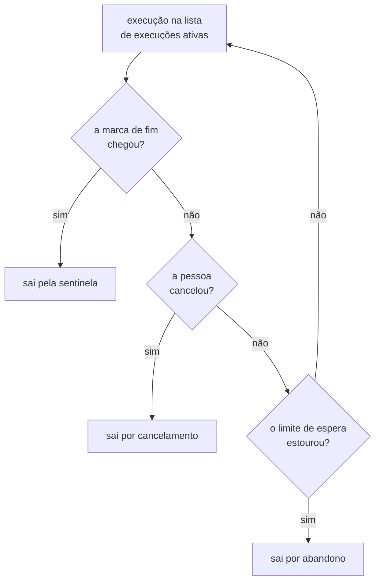
```mermaid
flowchart TD
    E["execução na lista<br/>de execuções ativas"] --> S{"a marca de fim<br/>chegou?"}
    S -->|" sim "| R1["sai pela sentinela"]
    S -->|" não "| C{"a pessoa<br/>cancelou?"}
    C -->|" sim "| R2["sai por cancelamento"]
    C -->|" não "| T{"o limite de espera<br/>estourou?"}
    T -->|" sim "| R3["sai por abandono"]
    T -->|" não "| E
```

**Três perguntas ficam abertas, e nenhuma delas bloqueia a forma da tabela.**

- **Qual é o limite, e se ele é por execução ou global.** `Pergunta em aberto`. Um número
  escrito aqui seria decisão que ninguém tomou.
- **Se uma execução encerrada por limite produz veredito.** `Pergunta em aberto`. Ela é
  candidata natural a um **quinto** valor da classificação do veredito zero, que o
  [ADR-0004](0004-o-estatuto-da-barreira-e-o-diagnostico-da-nao-ocorrencia.md#o-zero-é-classificado-e-a-classificação-tem-quatro-valores)
  já fixou com quatro — acrescentar um quinto é decisão arquitetural nova, e entra na fila
  quando alguém a propuser.
- **Se o cancelamento e o abandono se distinguem no registro.** `Pergunta em aberto`. Os
  dois tiram a linha da lista; se o resultado guarda **por qual** dos dois, ninguém
  decidiu.

**O que isto desbloqueia.** A forma da tabela de execuções ativas em
[`schemas/lab-plane.md`](../architecture/schemas/lab-plane.md#o-schema-do-instrumento-lab_plane) deixa de
depender desta linha: ela precisa de coluna que sustente os três caminhos. Quais colunas,
e o nome delas, continua com `E-35`.

### Duas linhas abertas pelo ADR-0010, ao reconciliar os cards

O [ADR-0010](0010-a-fronteira-de-schema-e-o-cdc-como-fonte-do-veredito.md) nasceu `Aceito`
em 2026-08-06 deixando lacunas marcadas como `Pergunta em aberto`. Duas delas precisam de
linha aqui, porque **uma pergunta dentro de um ADR aceito não pode ser respondida editando
o ADR**. Uma terceira, a fonte do `value_inicial`, foi apurada como aberta **por engano** —
ela fechou em 2026-08-05, e o parágrafo de `E-36` registra onde.

#### `E-36` — a emissão ao vivo entra na janela que o experimento mede

`E-19` decidiu que as observações de passo atravessam para o `lab-journal` ao vivo, evento
por evento. O ADR-0008 já registra que a latência de rede entra na medida de todo
experimento, e o E1 emite entre 900 e 1500 observações por execução — a emissão evento a
evento acrescenta cada uma dessas travessias **dentro** da janela medida. **A saída existe
e nunca foi escolhida:** emissão não bloqueante, em que o passo enfileira num buffer local
e um remetente próprio esvazia. O custo dela é perder o buffer quando o `lab-plane` cai —
e a etapa 6 mata o processo de propósito. A linha decide qual das duas.

**Não confundir com o `value_inicial`, que já tem fonte.** Esta linha nasceu de uma
apuração que o tratava como aberto; ele não é. `O20` fechou em 2026-08-05 pelo estado
inicial ser **inserido** antes de cada execução, e capturado como qualquer outro evento —
o registro está em
[`decisoes-pendentes.md`](arquivo/proposta-2026-08-03/decisoes-pendentes.md#o20-fecha-o-estado-inicial-é-criado-dentro-da-janela-de-captura),
que também descarta o snapshot inicial do Debezium por nome, porque ele lê a tabela
inteira e devolve ao instrumento o acesso ao banco medido.

#### `E-36` fecha no broker com persistência antes da emissão, escolhida em 2026-08-10

**Escolhido pela pessoa em 2026-08-10.** A emissão ao vivo de `E-19` passa a atravessar
pelo broker, com a persistência no `lab-journal` acontecendo antes do push ao vivo — e
não em paralelo com ele.

**O evento sai do passo pelo broker.** Ele atravessa pelo RabbitMQ — o broker do
[ADR-0012, Decisão](0012-o-broker-no-caminho-do-veredito-e-a-dispensa-que-ele-exigiu.md#decisão),
hoje só no caminho do veredito —, que passa a servir também ao caminho da observação.

**Pergunta em aberto: o que distingue esta travessia da que "ao vivo bloqueante" perde
por manter.** O evento continua saindo do passo, evento por evento, dentro da janela
medida — só o destino muda, de uma chamada direta ao `lab-journal` para o RabbitMQ.
Nenhum documento nomeia essa publicação como não bloqueante, fire-and-forget ou de outra
forma mais barata que a chamada que esta decisão descarta abaixo. Até essa lacuna fechar,
o motivo dado para descartar "ao vivo bloqueante" — manter as travessias dentro da janela
medida — vale, sem diferença nomeada, também para a escolhida.

**No `lab-journal` a ordem é serial, nunca paralela.** O consumidor persiste o evento
primeiro, e só depois de o `COMMIT` confirmar é que o push ao vivo acontece.

**O push usa o pub/sub interno do Spring, disparado na fase pós-commit da transação de
persistência.** O gatilho é um evento interno do framework
(`TransactionPhase.AFTER_COMMIT` do Spring) — nome que colide com a fronteira
`AFTER_COMMIT` que este repositório já usa para o sistema medido, onde `commits` conta
passagens por ela
([`../../AGENTS.md`](../../AGENTS.md#decisões)). São dois conceitos distintos: este é
evento interno do `lab-journal`; aquele é fronteira do runtime que o oráculo exato conta.
Uma persistência que falha simplesmente não publica no pub/sub, e é por isso que a falta
de resiliência desse mecanismo não é risco **neste** arranjo — ela seria fatal no arranjo
em paralelo, que esta escolha descarta abaixo.

**O SSE aceita `Last-Event-ID`.** O stream reproduz da base a partir do cursor recebido e
emenda no fluxo ao vivo a partir daí. **Recuperar todo o histórico é o mesmo mecanismo,
com cursor vazio** — não existe um segundo endpoint para isso.

**O cursor é um campo próprio, monótono por execução.** Ele não é um timestamp — a razão
está abaixo. **Dois instantes ficam no registro, e nenhum dos dois é ordem.** O instante
de ocorrência é atribuído no `lab-plane`; o instante de persistência, no `lab-journal`. A
diferença entre os dois mede o custo da travessia.

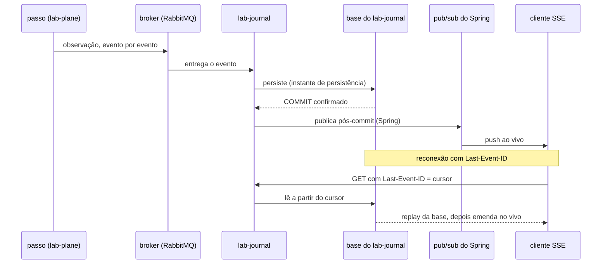
```mermaid
sequenceDiagram
    participant P as passo (lab-plane)
    participant B as broker (RabbitMQ)
    participant J as lab-journal
    participant D as base do lab-journal
    participant S as pub/sub do Spring
    participant C as cliente SSE
    P->>B: observação, evento por evento
    B->>J: entrega o evento
    J->>D: persiste (instante de persistência)
    D-->>J: COMMIT confirmado
    J->>S: publica pós-commit (Spring)
    S->>C: push ao vivo
    Note over C,D: reconexão com Last-Event-ID
    C->>J: GET com Last-Event-ID = cursor
    J->>D: lê a partir do cursor
    D-->>C: replay da base, depois emenda no vivo
```

**O diagrama acima é o da primeira escolha, e é anterior à segunda.** Nele o passo
publica direto no broker — `P->>B` —, que é exatamente o trecho que a segunda escolha,
mais abaixo, desfez ao interpor o buffer e a thread. Ele fica porque registra o que se
decidiu primeiro; o desenho vigente é o do segundo diagrama.

**As três descartadas, e o motivo de cada uma.** Ao vivo bloqueante, que é o vigente
hoje, perde por manter dentro da janela medida cada travessia de rede que a emissão
evento a evento produz — na ordem de centenas por execução, já que o E1 emite entre 900 e
1500 observações
([ADR-0008, Negativas](0008-os-dois-planos-em-processos-separados.md#negativas)) —, sem
nenhuma defesa. Buffer local volátil perde porque a etapa 6 mata o processo de propósito,
e o buffer não esvaziado desaparece: a consulta posterior devolveria uma execução com um
buraco **sem sinalizar o buraco**. SSE e persistência em paralelo perde porque são duas
escritas independentes sem transação comum — é o dual write, o próprio item do briefing
que a etapa 6 existe para estudar, reproduzido dentro do instrumento que deveria só
observá-lo.

**A segunda escolha da pessoa, no mesmo dia: buffer em memória com thread própria, e o
bloqueio registrado.** O runtime enfileira a observação num buffer em memória, sem esperar
a rede, e uma thread separada publica cada item no broker; só o enfileiramento fica na
janela medida. Quando o buffer enche, o runtime **bloqueia** até haver espaço e **registra
o bloqueio como evento do log** — a observação não se perde em silêncio, e um veredito sob
bloqueio pode ser descartado por quem lê o relatório.

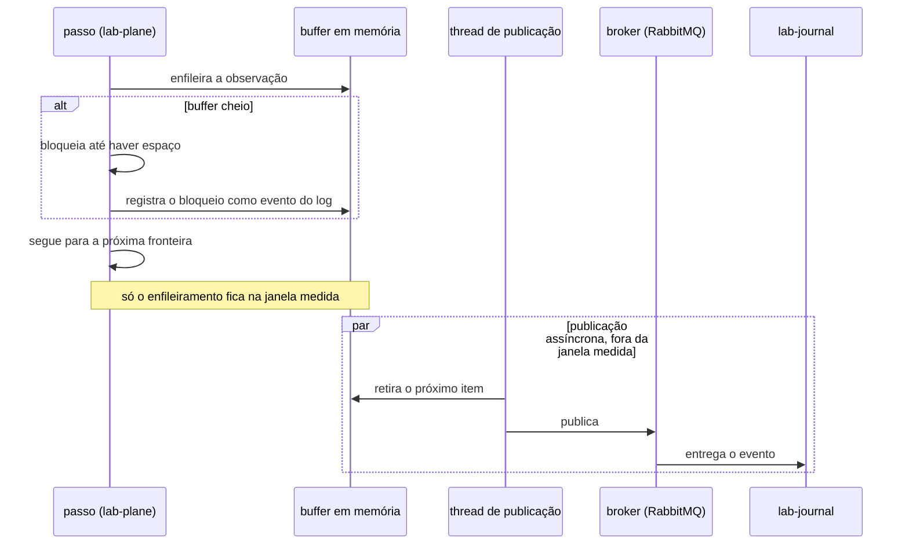
```mermaid
sequenceDiagram
    participant P as passo (lab-plane)
    participant M as buffer em memória
    participant T as thread de publicação
    participant B as broker (RabbitMQ)
    participant J as lab-journal
    P->>M: enfileira a observação
    alt buffer cheio
        P->>P: bloqueia até haver espaço
        P->>M: registra o bloqueio como evento do log
    end
    P->>P: segue para a próxima fronteira
    Note over P,M: só o enfileiramento fica na janela medida
    par publicação assíncrona, fora da janela medida
        T->>M: retira o próximo item
        T->>B: publica
        B->>J: entrega o evento
    end
```

**A alternativa descartada nessa segunda escolha é o descarte silencioso da observação
quando o buffer enche.** A favor dela: o worker nunca bloqueia, e a janela medida não sofre
perturbação alguma sob pressão. Perde porque uma perda silenciosa envenena o veredito sem
deixar rastro — um log com buraco é indistinguível de um log correto, e o laboratório
inteiro existe para produzir veredito confiável. Bloquear e registrar troca perturbação
invisível por perturbação declarada.

**O "buffer local" descartado acima não é este buffer, e o que os separa é onde o evento
para.** O enunciado desta linha descreve a alternativa como "o passo enfileira num buffer
local e um remetente próprio esvazia", e o
[ADR-0010, Negativas](0010-a-fronteira-de-schema-e-o-cdc-como-fonte-do-veredito.md#negativas)
a chama de "buffer local com remetente próprio": o remetente próprio vive dentro do
`lab-plane`, e a queda da etapa 6 leva buffer e remetente juntos; o broker é outro
processo, e o que chegou lá sobrevive. O que **não** saiu do `lab-plane` se perde nos dois
desenhos — o enunciado já dizia isso da alternativa, "perder o buffer quando o `lab-plane`
cai" —, e nenhum dos dois sinaliza essa perda: o ADR-0017 a registra como consequência
negativa em vez de deixá-la implícita.

**Por que o cursor não é um timestamp.** [`Q-0004-3`](../questions/Q-0004-3.md),
`pendente`, registra que "nenhum documento diz qual relógio o log usa, nem se ele é
monotônico, nem qual é a resolução dele". Dois eventos dentro da mesma resolução colidem,
e um cursor que colide pula ou repete evento no replay, em silêncio. O mesmo risco já
apareceu para as colunas de tempo do próprio Lab Plane: o registro de
[`E-26`](#e-26--timestamps-nas-tabelas-do-lab-plane) nota que, se um valor de tempo entra
no papel veredito, o relógio que o produz DEVE ser o adaptador injetável — consequência
de `E-13`, já fechada — embora a linha `E-26` em si continue sem decisão sobre se essas
colunas existem. Um cursor de replay carrega o mesmo risco que motivou aquela nota.

**Quando esta decisão deixa de valer.** Se o `lab-journal` passar a ter mais de uma
instância, um `SseEmitter` conectado numa instância não vê o evento publicado noutra. O
replay por cursor cobre o buraco na reconexão, com atraso — mas não substitui a garantia
de entrega ao vivo enquanto as duas instâncias convivem.

**O que o ADR-0008 registra, por completo.** O bullet inteiro, em
[Negativas](0008-os-dois-planos-em-processos-separados.md#negativas), diz: "A latência da
rede entra na medida de todo experimento. O runtime consulta escalonador e injetor em
**cada** fronteira entre passos, e o E1 do MVP emite entre 900 e 1500 observações." O "e"
liga o número de observações à consulta ao escalonador e ao injetor **em cada fronteira**
— não a uma travessia de rede da emissão para o `lab-journal`, que ainda não existia
quando o ADR-0008 foi escrito: ela só passou a existir depois, por `E-19` e pelo
[ADR-0010, Decisão](0010-a-fronteira-de-schema-e-o-cdc-como-fonte-do-veredito.md#decisão).
O que o enunciado desta linha afirma — "a emissão evento a evento acrescenta cada uma
dessas travessias **dentro** da janela medida" — é conclusão desta fila sobre a decisão de
`E-19`, e não algo que o ADR-0008 já dissesse sobre a emissão para o `lab-journal`. O fato
que o ADR-0008 registra — a latência entra na medida de todo experimento — continua
verdadeiro, e é diferente do fato que `E-19` acrescentou.

**`E-19` nunca avaliou alternativa, e isso também fica registrado.** O enunciado desta
linha nomeia o buffer local como a saída "que existe e nunca foi escolhida" — nomeada, e
não descartada por argumento. O fecho de
[`E-19`](#e-19--ao-vivo-e-a-tensão-com-o-adr-0008) já registrava o mesmo fato, de outra
forma: "a saída não escolhida — buffer local com remetente próprio — continua aberta em
`E-36`". Nenhum documento deste repositório registra razão positiva para a emissão "ao
vivo, evento por evento" além de a decisão ter sido tomada.

**Esta decisão exige ADR, e este fecho registra isso sem escrever o ADR.** Ela toca
quatro ADRs aceitos e a matriz de integrações, e nenhum deles é editado por este fecho:

- O [ADR-0010, Decisão](0010-a-fronteira-de-schema-e-o-cdc-como-fonte-do-veredito.md#decisão)
  manda as observações atravessarem "ao vivo, evento por evento". A regra `R12` do
  [card de observação passo a passo](../features/observacao-passo-a-passo/feature-card.md#regras-de-negócio)
  acrescenta que "o Lab Plane NÃO DEVE acumulá-las para enviar ao fim da execução", mas
  ela é regra **`pendente`** do card — não é documento aceito, e não entra na contagem
  dos quatro.
- O [ADR-0007, A forma de um evento](0007-o-log-de-observacoes-forma-ordem-e-onde-vive.md#a-forma-de-um-evento)
  é dono da forma do evento, e ela não tem campo de cursor nem instante de persistência.
- O [ADR-0011](0011-a-topologia-de-servicos-e-o-caderno-de-laboratorio-fora-do-git.md#comando-no-lab-plane-leitura-no-lab-journal-sem-bff)
  desenha a aresta direta do `lab-plane` ao `lab-journal`, rotulada "observações". Roteá-la
  pelo broker muda essa topologia.
- A [matriz](../architecture/integrations.md#matriz), dona do **estado de cada fronteira
  de processo**, registra a linha `lab-plane` → `lab-journal` como "observação, evento por
  evento, ao vivo"; ela passa a descrever um caminho que esta decisão substitui.
- O [ADR-0012, Decisão](0012-o-broker-no-caminho-do-veredito-e-a-dispensa-que-ele-exigiu.md#decisão)
  dispensou a regra de que nenhuma tecnologia entra por estar disponível, para o broker
  **no caminho do veredito**. O enunciado deste fecho supunha que usá-lo também na
  observação ampliaria o alcance daquela dispensa; **a redação decidiu o oposto**, e a
  pessoa o confirmou: o ADR-0014 concede dispensa própria e não toca o ADR-0012, porque
  herdar seria tratar a primeira como precedente — e o
  [`AGENTS.md`](../../AGENTS.md#regras-estruturais-que-valem-sempre) registra que uma
  dispensa registrada não é precedente, e que a próxima precisa ser explícita.

A redação atravessou 2026-08-10, 2026-08-11 e 2026-08-12, e a linha produziu **três**
artefatos, e não um: a travessia da observação no
[ADR-0014](0014-o-broker-na-travessia-da-observacao-e-o-cursor-monotonico-do-replay.md), o
streaming com replay por cursor no
[ADR-0016](0016-o-streaming-e-o-replay-do-log-de-observacoes.md) — o número 0016, e não
0015, porque aquele estava sendo escrito noutra frente —, e a persistência antecipada com
o buffer no
[ADR-0017](0017-a-persistencia-antecipada-do-log-de-observacoes-e-o-buffer-que-a-alimenta.md),
que recebeu por divisão o que havia entrado no corpo do ADR-0014 sem forma que o
autorizasse. O que cada um desatualiza fora de si está na seção própria de cada um
([0014](0014-o-broker-na-travessia-da-observacao-e-o-cursor-monotonico-do-replay.md#o-que-este-adr-desfaz-fora-de-si),
[0016](0016-o-streaming-e-o-replay-do-log-de-observacoes.md#o-que-este-adr-desfaz-fora-de-si),
[0017](0017-a-persistencia-antecipada-do-log-de-observacoes-e-o-buffer-que-a-alimenta.md#o-que-este-adr-desfaz-fora-de-si)).

**"Nenhum dos cinco é editado aqui" valeu até a redação existir, e caiu com ela.** Até
2026-08-11 este parágrafo afirmava isso, e afirmava também que o card não era tocado,
porque `R12` é regra `pendente` e só o ciclo de aprovação a move. Os dois ADRs tocaram os
cinco: o ADR-0007, o ADR-0010 e o ADR-0011 receberam `Última atualização` e `Alterado
por`; a [matriz](../architecture/integrations.md#matriz) trocou a linha da fronteira; e
`R12` ganhou a evidência do ADR-0014 ao lado da do ADR-0010 — **sem sair de `pendente`**,
que é a metade da frase antiga que continua de pé. A frase não é apagada porque o que
ela dizia foi verdade, e saber quando deixou de ser é o que separa fecho de lápide.

**Duas lacunas seguem abertas, e este fecho as nomeia sem fechá-las.**
[`E-51`](#e-51--o-que-protege-a-contagem-de-coincidências-de-um-transporte-falível)
pergunta o que protege a contagem de coincidências do ADR-0004 agora que ela passa a
depender de um transporte falível, e
[`E-52`](#e-52--de-onde-vem-o-instante-de-parede-de-um-evento-e-se-ele-é-monotônico)
pergunta de onde vem o instante de parede de um evento e se ele é monotônico. Nenhuma das
duas tinha linha própria nesta fila antes deste fecho.

#### `E-51` — o que protege a contagem de coincidências de um transporte falível

Aberta em 2026-08-10, pelo fecho de
[`E-36`](#e-36-fecha-no-broker-com-persistência-antes-da-emissão-escolhida-em-2026-08-10).

A contagem de coincidências é derivada do log de observações por decisão do
[ADR-0004](0004-o-estatuto-da-barreira-e-o-diagnostico-da-nao-ocorrencia.md#a-plataforma-conta-coincidências).
Quando aquele ADR foi escrito, o log não atravessava broker nenhum. A decisão de
[`E-36`](#e-36-fecha-no-broker-com-persistência-antes-da-emissão-escolhida-em-2026-08-10)
põe o log a atravessar RabbitMQ e a ser persistido no `lab-journal`, e com isso **um
evento pode se perder no transporte** — caminho de falha que as
[negativas do ADR-0004](0004-o-estatuto-da-barreira-e-o-diagnostico-da-nao-ocorrencia.md#negativas)
não previam. As negativas de lá já nomeiam dois modos pelos quais a contagem erra em
silêncio: um passo que não reporta a chave de contenção, e a comparação de instantes
entre threads sem relógio decidido. O de `E-36` é um terceiro. O que ninguém decidiu é
**o que protege uma contagem que agora depende de um transporte falível** — se ela ganha
guarda de completude como a que
[`E-46`](#e-46-fecha-no-consumidor-do-broker-escolhida-em-2026-08-10) deu à soma do
predicado, se ela passa a ser derivada de outra fonte, ou se o risco é aceito e nomeado.

**Sem recomendação.**

#### `E-51` fecha em guarda de completude, escolhida em 2026-08-12

**Escolhida pela pessoa em 2026-08-12**, pela primeira das três saídas nomeadas no
enunciado.

**A contagem de coincidências só vale sobre stream atestado como completo.** É o mesmo
mecanismo que [`E-46`](#e-46-fecha-no-consumidor-do-broker-escolhida-em-2026-08-10) deu à
soma do predicado, e a escolha é por reuso: o consumidor do broker já confere o buraco no
meio e reconhece a marca de fim, e a contagem passa a depender do mesmo atestado em vez de
ganhar guarda própria.

**O motivo, e ele é o do projeto inteiro.** Uma contagem que erra por evento perdido no
transporte produz **falso negativo silencioso** — o instrumento afirma menos coincidências
do que houve, e nada no relatório distingue isso de um experimento sem contenção. É a
mesma classe de defeito que a regra de conexão por worker existe para impedir, e o
laboratório não pode cometê-la no próprio veredito.

**As duas outras saídas caem por motivos distintos.** Derivar a contagem de outra fonte
contraria o
[ADR-0004](0004-o-estatuto-da-barreira-e-o-diagnostico-da-nao-ocorrencia.md#a-plataforma-conta-coincidências),
que decidiu o log como fonte, e seria decisão arquitetural nova sobre ADR aceito. Aceitar o
risco deixaria o instrumento com **três** modos conhecidos de errar em silêncio — os dois
que as [negativas](0004-o-estatuto-da-barreira-e-o-diagnostico-da-nao-ocorrencia.md#negativas)
já nomeiam, mais este — e nenhum deles com guarda.

**Onde a guarda vive, e o que ela faz quando falha.** `Pergunta em aberto`, nas duas
metades. O fecho de `E-46` pôs a conferência no consumidor do broker, e se a contagem lê o
atestado dali ou refaz a conferência não foi decidido; o que uma contagem sobre stream
incompleto **produz** — recusa, número com ressalva, ou o rótulo `fonte atrasada` — também
não.

**O que este fecho NÃO faz.** Ele não emenda o ADR-0004. A guarda é condição de uso da
contagem, e não mudança do que ela conta — se alguém concluir que ela muda, isso é decisão
arquitetural nova, e entra nesta fila.

#### `E-52` — de onde vem o instante de parede de um evento, e se ele é monotônico

Aberta em 2026-08-10, pelo fecho de
[`E-36`](#e-36-fecha-no-broker-com-persistência-antes-da-emissão-escolhida-em-2026-08-10),
ligada a [`Q-0004-3`](../questions/Q-0004-3.md). Aquela questão já registra que "nenhum
documento diz qual relógio o log usa, nem se ele é monotônico, nem qual é a resolução
dele", e a decisão de `E-36` acrescenta um segundo instante — o de persistência — sem
resolver a origem do primeiro.

**Sem recomendação.**

#### `E-52` fecha em a ordem vem do cursor, e o instante é rótulo, escolhida em 2026-08-12

**Escolhida pela pessoa em 2026-08-12.** O instante de parede de um evento existe para
leitura humana e **NÃO DEVE** ordenar nada; quem ordena é o cursor monotônico.

**A decisão já existia, e o que faltava era lê-la como resposta a esta linha.** O
[ADR-0016](0016-o-streaming-e-o-replay-do-log-de-observacoes.md#o-replay-por-cursor-é-o-único-mecanismo-com-ou-sem-histórico-completo)
fixou o replay por cursor, e o `## Alternativas consideradas` dele **descartou ordenar
pelo instante**. Esta linha perguntava de onde vem o instante e se ele é monotônico; com a
ordem fora dele, a segunda metade da pergunta deixa de precisar de resposta — **um rótulo
não precisa ser monotônico**.

**O que isso resolve de [`Q-0004-3`](../questions/Q-0004-3.md), e o que não.** Aquela
questão registra que "nenhum documento diz qual relógio o log usa, nem se ele é
monotônico, nem qual é a resolução dele". A monotonicidade sai da lista. **Qual relógio** e
**qual resolução** continuam abertos, e a regra que os alcança é a de sempre: o tempo é
injetável, e `Instant.now()` só em adaptador de relógio
([`AGENTS.md`](../../AGENTS.md#regras-estruturais-que-valem-sempre)). A questão permanece
`pendente` no [índice](../questions/README.md#índice), com escopo reduzido.

**Os dois instantes que `E-36` criou continuam ambos existindo**, e nenhum dos dois ordena.
O do passo e o de persistência são rótulos de momentos diferentes; compará-los entre
processos continua sendo um dos modos de erro que as
[negativas do ADR-0004](0004-o-estatuto-da-barreira-e-o-diagnostico-da-nao-ocorrencia.md#negativas)
já nomeiam, e este fecho não o autoriza.

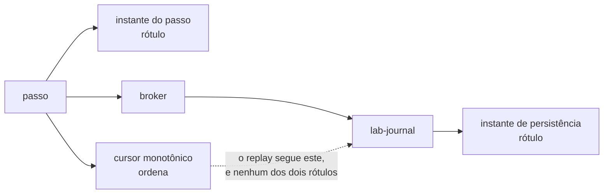
```mermaid
flowchart LR
    P["passo"] --> I1["instante do passo<br/>rótulo"]
    P --> C["cursor monotônico<br/>ordena"]
    P --> B["broker"] --> J["lab-journal"] --> I2["instante de persistência<br/>rótulo"]
    C -.->|" o replay segue este,<br/>e nenhum dos dois rótulos "| J
```

**Uma consequência que vale escrever.** Um relatório ou uma tela que ordene observações
pelo instante está errado, mesmo que o resultado pareça certo na maioria das execuções.
Onde essa proibição é escrita como regra verificável pertence ao card de
[streaming e replay](../features/streaming-e-replay-do-log-de-observacoes/feature-card.md),
e não a esta fila.

#### `E-59` — se o ADR-0016 tira a premissa de `Q-0022`

Aberta em 2026-08-11, ao redigir o
[ADR-0016](0016-o-streaming-e-o-replay-do-log-de-observacoes.md#o-replay-por-cursor-é-o-único-mecanismo-com-ou-sem-histórico-completo).
[`Q-0022`](../questions/Q-0022.md) objeta que os dois limiares propostos para trocar
polling por SSE nunca foram medidos. O ADR fixa SSE **sem limiar nenhum**, e por isso os
dois números deixam de governar escolha alguma — mas ele não nomeia a questão, e
ninguém a adjudicou. Ela segue `pendente`, no próprio arquivo e no
[índice de questões](../questions/README.md#índice).

**Por que importa.** Declarar a premissa caída fora do arquivo da questão deixaria a
[matriz de integrações](../architecture/integrations.md#perguntas-em-aberto) anunciando o
fim de uma pendência que o índice ainda lista como viva — duas páginas afirmando coisas
diferentes sobre a mesma questão. A redação de 2026-08-11 tirou a frase da matriz por
isso, e não fechou a questão: fechá-la é ato de pessoa.

**Sem recomendação.**

#### `E-60` — o inventário de contratos, isento por caminho em 2026-08-11

**Fechada em 2026-08-11, por escolha da pessoa, e a linha nasce aqui já fechada.** A
pendência apareceu neste ciclo, ao acrescentar a fronteira `lab-plane` → RabbitMQ →
`lab-journal` à tabela de
[`../contracts/README.md`](../contracts/README.md#estado-nenhum-contrato-existe): o
acréscimo foi só de linha de tabela, e o
[`check_artifact_limits.py`](../../.claude/skills/feature-planning/scripts/check_artifact_limits.py)
desconta tabela — o número medido era o mesmo de antes do ciclo, e já reprovava contra o
teto genérico de 4.000. A reprovação é anterior à decisão do ADR-0014.

**As duas saídas eram isentar o arquivo por caminho ou encolher a prosa**, dando a outro
dono a doutrina dos três estados de interface. **A pessoa escolheu a primeira.** O arquivo
entrou em `EXEMPT_BY_PATH` no `check_artifact_limits.py`, e o motivo está escrito no
próprio script: o inventário de contratos **cresce por interface**, como o índice de
capacidades cresce por capacidade, e um teto ali obrigaria a escolher entre omitir
contrato do inventário e apagar a doutrina que explica o inventário. A medida que motivou
a escolha está registrada lá — 6.690 caracteres de prosa contra o genérico de 4.000, num
ciclo cujo acréscimo foi de linha de tabela.

**O que a isenção NÃO alcança**, e o script o diz na própria entrada:
`docs/plano-do-laboratorio.md`. O critério que separa os dois é o mesmo desta lista
inteira — o inventário cresce por entrada, e o plano cresce por prosa analítica.

**Esta worktree ainda carrega o script anterior à escolha**, e por isso o verificador
reprova `docs/contracts/README.md` aqui até o merge. A isenção chega com ele.

#### `E-61` — que tipo o evento de bloqueio de buffer carrega

Aberta em 2026-08-11, ao redigir o que era então o ADR-0014. A subseção citada saiu dele
na divisão de 2026-08-12 e vive hoje no
[ADR-0017](0017-a-persistencia-antecipada-do-log-de-observacoes-e-o-buffer-que-a-alimenta.md#o-runtime-publica-por-um-buffer-em-memória-numa-thread-separada).
Aquela decisão manda o runtime **registrar o bloqueio do buffer como evento do log**, e
não diz que tipo esse evento carrega. O conjunto de tipos é **fechado** em quatro valores
pela
[forma de um evento](0007-o-log-de-observacoes-forma-ordem-e-onde-vive.md#a-forma-de-um-evento)
do ADR-0007 — `RESULTADO_DE_PASSO`, `BLOQUEIO`, `LIBERACAO` e `FALHA_INJETADA` —, e o
`BLOQUEIO` de lá designa **outra coisa**: o bloqueio pelo escalonador, que carrega o campo
`restrito`, verdadeiro quando havia restrição pendente para aquela fronteira.

**Por que importa.** Reusar `BLOQUEIO` faz um nome designar dois conceitos, e quem lê o log
deixa de distinguir bloqueio de escalonador de bloqueio de buffer. É essa distinção que
sustenta a consequência que o ADR-0014 declara — "um veredito sob bloqueio PODE ser
descartado por quem lê o relatório". Sem ela, o descarte alcança execução que só foi
ordenada por barreira, e o `restrito` de um evento de buffer não tem significado.

**Duas saídas, e nenhuma é de quem redige.** Uma é **emendar** o conjunto de tipos do
ADR-0007 com um quinto valor, o que exige nomeá-lo e dizer o que ele faz com `restrito` e
com o
[critério de igualdade entre execuções de controle](0007-o-log-de-observacoes-forma-ordem-e-onde-vive.md#o-critério-de-igualdade-entre-execuções-de-controle),
que hoje compara a subsequência de eventos com `restrito = verdadeiro`. A outra é registrar
o bloqueio fora do log de observações, o que tira o problema do conjunto fechado e cria
outro: uma segunda sequência que a timeline precisa alinhar com a primeira.

**Sem recomendação.**

#### `E-62` — que forma cobre a entrada de decisão nova num ADR aceito

Aberta em 2026-08-11, ao reconciliar o ADR-0014 com o commit `a5d5777`, que o aceitou.

**O problema.** A **divisão**, sexta forma, foi criada para a **subtração declarada**: um
ADR aceito cede subseções a um ADR novo, e o rastro diz quais saíram
([`README.md`](README.md#a-divisão-de-um-adr-aceito-decidida-em-2026-08-11)). O que
aconteceu com o
[ADR-0014](0014-o-broker-na-travessia-da-observacao-e-o-cursor-monotonico-do-replay.md)
não foi só isso. Medido contra `a5d5777`, o `## Decisão` dele perdeu cinco subseções e
**ganhou duas** — "A persistência no `lab-journal` começa na etapa 1, e não mais na 6" e
"O runtime publica por um buffer em memória, numa thread separada", esta com três
requisitos normativos —, e ganhou também um parágrafo normativo dentro de uma subseção
que já existia, "fica **dispensada, e não satisfeita**", que em `a5d5777` só era
argumento de `## Justificativa`. Fora de `## Decisão`, o mesmo commit fundiu as duas
primeiras subseções de `## Alternativas consideradas` numa só e deu a ela um parágrafo de
`Pergunta em aberto` novo, e acrescentou três subseções inteiras — "Descartar a
observação quando o buffer enche", "Publish sem confirmação..." e "Emendar o
ADR-0012...". Em `## Justificativa`, dois parágrafos são inteiramente novos e dois
sobreviventes foram reescritos. Em `### Negativas`, três bullets entraram — a perda do
buffer não esvaziado, o I/O que a persistência soma ao PostgreSQL único, e o tipo do
evento de bloqueio
([`E-61`](#e-61--que-tipo-o-evento-de-bloqueio-de-buffer-carrega)) —, e o **sexto**, o de
`Perguntas em aberto`, foi reescrito: ele funde num bullet só as perguntas que `a5d5777`
trazia soltas, perde as duas que a divisão levou ao ADR-0016 e **ganha uma lacuna que o
ADR aceito não registrava, a capacidade do buffer** — a origem declarada de `P9` no
[example mapping](../features/observacao-passo-a-passo/example-mapping.md#perguntas-em-aberto)
e da linha do
[card](../features/observacao-passo-a-passo/feature-card.md#riscos-e-decisões-pendentes).
Com as duas subseções de `## Decisão` entrou um alvo de emenda que o ADR aceito não tinha,
["Onde o log vive"](0007-o-log-de-observacoes-forma-ordem-e-onde-vive.md#onde-o-log-vive),
do ADR-0007 — e ele **troca** o alvo daquele commit, em vez de somar-se a ele: lá o
`Alterado por` do ADR-0007 nomeava só "A forma de um evento", que a divisão passou ao
ADR-0016. **Nenhuma das seis formas descreve entrada de decisão nova num ADR aceito.**

**Por que importa.** As cinco formas anteriores à divisão preservam o corpo, ou consertam
texto que não carrega decisão; a sexta o reduz e declara o que saiu. Nenhuma obriga a
declarar o que **entrou**. Sem essa obrigação, quem lê um ADR aceito não distingue o que
foi decidido na data do cabeçalho do que foi acrescentado depois — a leitura errada que a
imutabilidade existia para impedir, e que o livro-razão de patch repôs por outra via
apenas para o texto sem decisão. O cabeçalho do ADR-0014 declara hoje o **fato** da
entrada e não nomeia forma alguma, porque a resposta é desta linha.

**Três alternativas, e a objeção de cada uma.**

| Alternativa                                                                        | Objeção                                                                                                                                                                                                                                           |
|------------------------------------------------------------------------------------|---------------------------------------------------------------------------------------------------------------------------------------------------------------------------------------------------------------------------------------------------|
| alargar a **divisão** para cobrir entrada e saída no mesmo ato                     | o nome deixa de descrever o ato, e `Alterado por: divisão` passa a poder significar duas coisas opostas — quem lê o campo não sabe se o corpo encolheu ou cresceu                                                                                 |
| criar uma **sétima forma**, só para a entrada                                      | sete formas para alterar um ADR aceito é vocabulário que ninguém retém, e a fronteira entre "entrada durante divisão" e emenda comum continua por decidir de qualquer modo                                                                        |
| **recusar a entrada**: o ADR novo carrega toda decisão nova, e o dividido só perde | as duas subseções que entraram são sobre a travessia da observação, que é o tema do ADR-0014; empurrá-las para o ADR-0016 poria decisão de travessia dentro do ADR de streaming, e a divisão teria produzido dois artefatos com o assunto trocado |

**O título também entrou, e a regra da divisão só fala de perda.** A seção
[A divisão de um ADR aceito](README.md#a-divisão-de-um-adr-aceito-decidida-em-2026-08-11)
autoriza a subtração e nada além dela: "o título dele PODE **perder** a parte que
nomeava o que saiu". No primeiro caso da regra o título fez as duas coisas — em
`a5d5777` ele era "O broker na travessia da observação, e o cursor monotônico do
replay", e hoje é "A travessia da observação — o broker, o buffer e o bloqueio
registrado": perdeu o cursor, que saiu, e **ganhou** "o buffer e o bloqueio registrado",
que nomeia as duas subseções que entraram. Qualquer das três alternativas acima precisa
alcançar o título, e não só o corpo — o cabeçalho do ADR-0014 declara hoje o ganho **e
não nomeia forma para ele**, como faz para o corpo. **Alterar a seção do lifecycle para
passar a alcançar o título é decisão da pessoa**, e não de quem redige.

**Sem recomendação.**

#### `E-63` — a emenda e o título citado por trecho

Aberta em 2026-08-11, ao revisar o ADR-0014 e o ADR-0016. A emenda a "Onde o log vive"
passou do ADR-0014 para o ADR-0017 na divisão de 2026-08-12, e esta linha a acompanha.

**O problema.** O ADR-0017 emenda
["Onde o log vive"](0007-o-log-de-observacoes-forma-ordem-e-onde-vive.md#onde-o-log-vive),
e o ADR-0016 emenda
["A forma de um evento"](0007-o-log-de-observacoes-forma-ordem-e-onde-vive.md#a-forma-de-um-evento).
O título do ADR-0007 é "O log de observações — forma, ordem e onde vive": as duas
expressões — "forma" e "onde vive" — aparecem nele, na letra. A fronteira de
[`README.md`](README.md#a-emenda-terceira-forma-ao-lado-da-substituição-e-da-subsunção)
diz que a regra emendada NÃO DEVE ser a que dá título ao ADR — e aqui as duas dão, ao
menos em parte.

**Os dois ADRs declaram a colisão, e é por isso que ela chega aqui.** Cada
"Por que emenda, e não substituição" reconhece que o título nomeia a regra emendada e
remete a esta linha, em vez de afirmar que não há tensão:
[ADR-0017](0017-a-persistencia-antecipada-do-log-de-observacoes-e-o-buffer-que-a-alimenta.md#justificativa)
escreve "o título do ADR-0007 é '...forma, ordem e onde vive': a regra o nomeia", e
[ADR-0016](0016-o-streaming-e-o-replay-do-log-de-observacoes.md#justificativa) escreve
"a palavra que nomeia a regra emendada está nele". **Nenhum dos dois decide**, e nem
poderia: escolher entre emenda e substituição é da pessoa.

**O precedente são dois conjuntos, e confundi-los é o que produziu três listas
diferentes do mesmo fato.** Quem **emendou regra dentro de `## Decisão` e segue
`Aceito`** são os ADRs
[0009](0009-a-classificacao-do-dual-write-e-a-regiao-de-pacote.md#justificativa),
[0010](0010-a-fronteira-de-schema-e-o-cdc-como-fonte-do-veredito.md#justificativa) e
[0011](0011-a-topologia-de-servicos-e-o-caderno-de-laboratorio-fora-do-git.md#justificativa)
— **três**. Quem, além de emendar, **registrou a tensão como `Pergunta em aberto`** em
vez de decidi-la são os ADRs 0010 e 0011 — **dois** —, com a fórmula "se a cláusula
exclui qualquer regra sob `## Decisão`, ou só a que dá título, ninguém decidiu". O
ADR-0009 emendou e **não** registrou a pergunta. **Os três lugares que citam este
precedente passam a dizer a mesma coisa**: a `## Justificativa` do
[ADR-0017](0017-a-persistencia-antecipada-do-log-de-observacoes-e-o-buffer-que-a-alimenta.md#justificativa),
a do [ADR-0016](0016-o-streaming-e-o-replay-do-log-de-observacoes.md#justificativa) e
esta linha.

Aqui a tensão é **mais forte** que naquele precedente, porque a regra não está só em
`## Decisão`: uma expressão dela está no título. Se o precedente se estende a este
caso é justamente o que esta linha decide.

**Duas leituras, e nenhuma escolhida.**

| Leitura                                             | Consequência                                                                                  |
|-----------------------------------------------------|-----------------------------------------------------------------------------------------------|
| um trecho literal do título conta como "dar título" | as duas emendas violam a fronteira, e a saída é substituição ou uma forma nova para este caso |
| só o título inteiro, por igualdade, conta           | as duas emendas continuam válidas, e o precedente dos ADRs 0010 e 0011 se estende a este caso |

**Sem recomendação.** Escolher entre emenda e substituição é da pessoa, e não de quem
revisa ou redige.

#### `E-66` — o cabeçalho descontado do ADR virou o lugar do argumento

Aberta em 2026-08-11, ao corrigir o ADR-0014 e o ADR-0016.

**O que o script decidiu, e onde.** O cabeçalho de um ADR — título, `Estado`, `Data`,
`Etapa`, `Relacionado`, `Última atualização` e `Alterado por` — sai da contagem de prosa
desde 2026-08-10, e quem o desconta é
[`check_artifact_limits.py`](../../.claude/skills/feature-planning/scripts/check_artifact_limits.py).
O comentário das linhas 228 a 241 declara a decisão e o motivo dela — "Ele é
livro-razão de manutenção, como `## Patches aplicados`, e cresce por alteração
sofrida, e não por argumento escrito" —; `prose_lines` e `prose_only` a implementam
pelo parâmetro `skip_header`, nas linhas 277 a 302; e as linhas 428 a 431 a ligam para
todo ADR, com `skip_header=is_adr(relative_path)`. Os números são os da cópia em
`master`; a cópia desta árvore de trabalho é anterior, e nela o mesmo comentário está
nas linhas 163 a 179 — o texto é o mesmo, e os identificadores também.

**A justificativa escrita ali é a que a realidade desmentiu.** A linha 237 registra o
caso que originou a decisão: em 2026-08-10 o ADR-0011 recebeu emenda do ADR-0014 e
estourou o teto "pelas duas linhas de cabeçalho que toda emenda obriga — **cerca de
trezentas letras, quase todas dentro de um link**". **Para aquele caso a decisão
continua correta**, e esta linha não a contesta: duas linhas de livro-razão não são
argumento, e cobrá-las empurraria para encolher a prosa de um ADR aceito, que é
exatamente o que o lifecycle proíbe.

**O que mudou não foi a régua, foi o que passou a caber embaixo dela.** O cabeçalho do
[ADR-0014](0014-o-broker-na-travessia-da-observacao-e-o-cursor-monotonico-do-replay.md)
tinha **693 caracteres** em `a5d5777`, foi a **5.837** ao ser reconciliado com a
divisão, e está em **7.856** depois das correções desta revisão — **mais de vinte vezes**
as "trezentas letras" que sustentam o desconto. Os três valores são medição **desta
árvore, nesta revisão**, e cada edição do cabeçalho os move; o que a linha afirma é a
ordem de grandeza, e não o dígito. E o que entrou ali não é livro-razão: dois bullets do
cabeçalho **argumentam** — qual forma do lifecycle cobre a entrada de decisão nova
([`E-62`](#e-62--que-forma-cobre-a-entrada-de-decisão-nova-num-adr-aceito)), que o alvo
de emenda no ADR-0007 trocou em vez de somar, e por que o nome do arquivo não é
renomeado, com dois comandos de medição e a explicação de por que eles não batem.

**O contraste é o que dá peso à linha.** No mesmo arquivo, o corpo medido está em
**11.997 contra 12.000**, e chegou a essa margem por **compressão deliberada** — a
pessoa escolheu comprimir em 2026-08-11, na linha
[`## O orçamento de prosa`](#o-orçamento-de-prosa-quem-é-dono-do-teto-e-o-que-ele-alcança),
recusando teto próprio justamente para não afrouxar a régua. Medido **sem** o desconto,
o mesmo arquivo dá **19.594 caracteres de prosa contra 12.000**. A régua mede o corpo,
não vê o cabeçalho, e o argumento migrou para onde ela não olha — sem que ninguém tenha
decidido que ele podia.

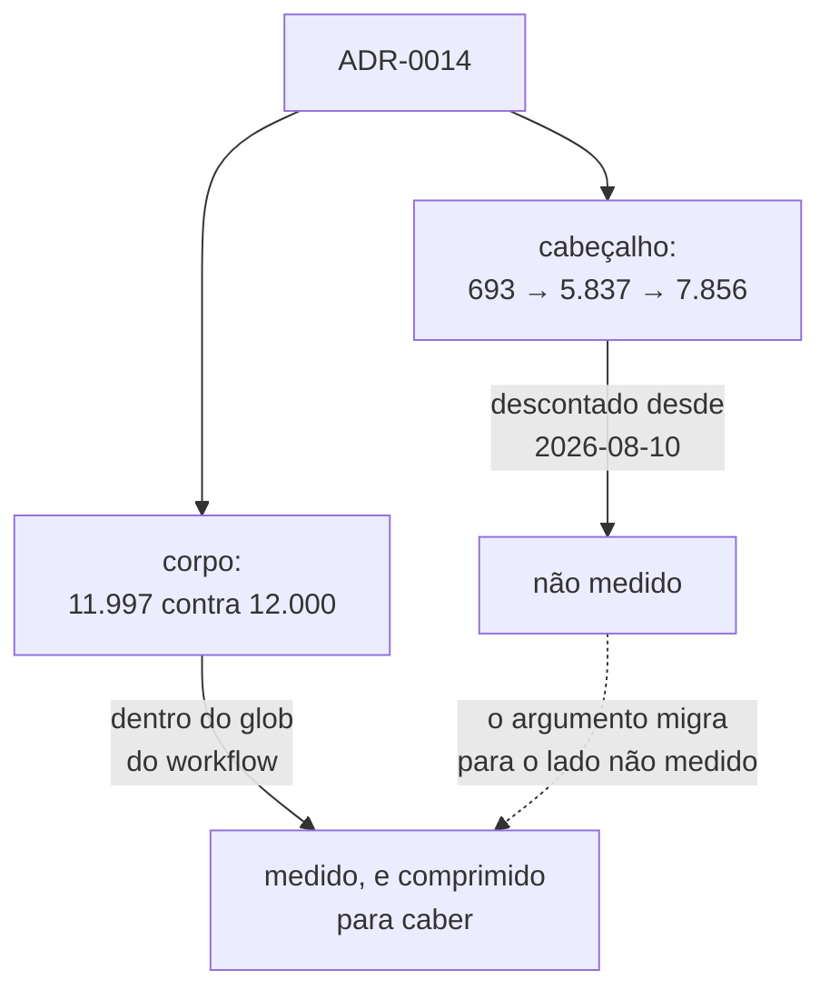
```mermaid
flowchart TD
  A["ADR-0014"] --> C["cabeçalho:<br/>693 → 5.837 → 7.856"]
  A --> B["corpo:<br/>11.997 contra 12.000"]
  C -->|" descontado desde<br/>2026-08-10 "| N["não medido"]
  B -->|" dentro do glob<br/>do workflow "| M["medido, e comprimido<br/>para caber"]
  N -.->|" o argumento migra<br/>para o lado não medido "| M
```

**Três saídas, e nenhuma recomendada.**

| Saída                                       | O que ela faz                                                                                    | O que ela custa                                                                                                                                        |
|---------------------------------------------|--------------------------------------------------------------------------------------------------|--------------------------------------------------------------------------------------------------------------------------------------------------------|
| o script passa a medir o cabeçalho do ADR   | `skip_header` deixa de valer, e o cabeçalho volta para dentro da contagem                        | o ADR-0014 estoura de novo, e por muito: **19.594 contra 12.000**, medido nesta árvore; e a decisão de 2026-08-10 cai junto para o caso que a originou |
| o argumento desce do cabeçalho para o corpo | o cabeçalho volta a ser livro-razão, e o que argumenta vira seção medida                         | o corpo tem **3 caracteres** de folga; o que descer estoura o teto no mesmo ato, e a compressão de 2026-08-11 é pedida outra vez                       |
| a divergência é aceita e registrada         | o cabeçalho segue fora da contagem, e esta linha fica sendo o registro de que ele mudou de papel | a régua passa a descrever mal o artefato, e nada impede que o próximo argumento também migre para o cabeçalho — sem ninguém medir                      |

**Sem recomendação.** Escolher entre afrouxar a régua, estourá-la ou aceitar que ela
deixou de alcançar o argumento é da pessoa, e não de quem redige o ADR que a expôs.

**O que esta linha NÃO decide.** Quem é dono do teto no caso geral, e o alcance da
medição sobre os arquivos fora do glob do workflow, continuam na linha
[`## O orçamento de prosa`](#o-orçamento-de-prosa-quem-é-dono-do-teto-e-o-que-ele-alcança).
Esta linha é sobre uma região **descontada de propósito** que passou a carregar
argumento, e ela não fecha aquela.

#### `E-66` fecha em o argumento desce do cabeçalho para o corpo, escolhida em 2026-08-12

**Escolhida pela pessoa em 2026-08-12**, pela segunda das três saídas.

**O desconto permanece, e é isso que a escolha preserva.** `skip_header` continua valendo,
porque a justificativa de 2026-08-10 continua correta para o que ela descrevia: duas linhas
de livro-razão não são argumento, e cobrá-las empurraria para encolher a prosa de um ADR
aceito, que é o que o
[lifecycle](README.md#a-revogação-da-imutabilidade-decidida-em-2026-08-07) proíbe. O que
muda não é a régua — é o que pode morar embaixo dela.

**A regra que nasce.** O cabeçalho de um ADR é **livro-razão**, e NÃO DEVE carregar
argumento. Ele registra alteração sofrida — título, `Estado`, `Data`, `Etapa`,
`Relacionado`, `Última atualização`, `Alterado por`. Todo texto que **sustenta** uma
escolha, descarta uma alternativa ou explica por que uma medição não bate vive no corpo, e
é medido. Vale daqui em diante, para todo ADR.

**A terceira saída foi descartada por nomear o problema em vez de resolvê-lo**: aceitar a
divergência deixaria a régua descrevendo mal o artefato, e nada impediria o próximo
argumento de migrar para o mesmo lugar não medido. A primeira — medir o cabeçalho —
derrubaria a decisão de 2026-08-10 justamente para o caso que a originou, a emenda que
estourou por cerca de trezentas letras de livro-razão.

**O custo foi aceito na letra da saída, e ele é imediato.** O corpo do ADR-0014 mede
**11.997 contra 12.000** — três caracteres de folga. Descer o argumento do cabeçalho
estoura o teto no mesmo ato, e a compressão que a pessoa escolheu em 2026-08-11 é pedida
outra vez.

**A aplicação retroativa ao ADR-0014 esteve bloqueada até 2026-08-12, e não por falta de
decisão aqui.** Mover argumento do cabeçalho para o corpo de um ADR **aceito** altera o
corpo, e nenhuma das seis formas do lifecycle cobre isso sem forçar: o patch conserta
citação, caminho e erro material, e o que desceria não é nenhum dos três. Era a mesma
lacuna de forma que
[`E-64`](#e-64--o-que-fazer-com-a-entrada-já-consumada-no-adr-0014) estava aberta para
resolver, e o fecho dela a destravou: o bullet "Nome do arquivo" do ADR-0014 perdeu o
argumento e ficou em livro-razão. **Para onde o argumento vai continua sem resposta**,
porque destravar não é escolher destino — é a linha
[`E-83`](#e-83--onde-mora-o-racional-de-não-renomear-o-arquivo-do-adr-0014). **A regra
acima nunca dependeu disso** — ela vale para todo ADR escrito daqui em diante.

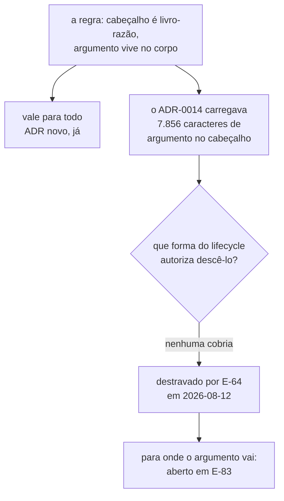
```mermaid
flowchart TD
  R["a regra: cabeçalho é livro-razão,<br/>argumento vive no corpo"] --> N["vale para todo<br/>ADR novo, já"]
  R --> V["o ADR-0014 carregava<br/>7.856 caracteres de<br/>argumento no cabeçalho"]
  V --> Q{"que forma do lifecycle<br/>autoriza descê-lo?"}
  Q -->|" nenhuma cobria "| E["destravado por E-64<br/>em 2026-08-12"]
  E --> D["para onde o argumento vai:<br/>aberto em E-83"]
```

#### `E-67` — o transporte da emissão ao vivo foi fixado sem alternativa descartada

Aberta em 2026-08-11, ao revisar o ADR-0016.

**O problema.** O
[ADR-0016](0016-o-streaming-e-o-replay-do-log-de-observacoes.md#o-replay-por-cursor-é-o-único-mecanismo-com-ou-sem-histórico-completo)
fixa o **SSE** como transporte da emissão ao vivo — é ali que a regra o nomeia, em "o
stream **SSE** DEVE aceitar `Last-Event-ID`". A subseção
[do push ao vivo](0016-o-streaming-e-o-replay-do-log-de-observacoes.md#o-push-ao-vivo-é-o-pubsub-interno-do-spring-em-after_commit)
decide o gatilho da emissão, e não o transporte dela. O `## Alternativas consideradas`
dele não registra **WebSocket** — as três alternativas que ele examina
tratam de outra coisa: persistir em paralelo, replay em endpoint próprio, e ordenar pelo
instante. A linha do plano que a decisão fecha oferecia dois nomes, na letra —
"Mecanismo de streaming para a UI (**SSE ou WebSocket**)", em
[9. Decisões deliberadamente adiadas](../plano-do-laboratorio.md#9-decisões-deliberadamente-adiadas)
—, e um deles saiu escolhido sem que o outro fosse descartado com motivo escrito.

**Por que importa.** O único apoio que o ADR oferece para o SSE é o
`frontend/nginx.conf:18-28` já desligar buffer e cache de resposta, pressupondo SSE — e o
próprio `## Contexto` dele reconhece que isso foi feito "sem que nenhum ADR o tivesse
decidido". **Isso é disponibilidade**, e disponibilidade é exatamente o argumento que a
regra estrutural do [`AGENTS.md`](../../AGENTS.md#regras-estruturais-que-valem-sempre)
recusa: uma tecnologia entra quando um experimento não puder ser executado sem ela. Uma
escolha de transporte que se apoia na configuração que a antecipou inverte a ordem — a
configuração passa a decidir, e o ADR a registra.

**O que esta linha NÃO afirma.** Ela **não** diz que o SSE é a escolha errada, nem
conhece o motivo pelo qual o WebSocket foi preterido: **ninguém o escreveu em documento
nenhum deste repositório**, e inventá-lo aqui seria fabricar justificativa para uma
decisão já tomada. O que falta é o descarte com motivo, e é só isso que a linha pede.

| Saída                                                | O que ela faz                                                                                  |
|------------------------------------------------------|------------------------------------------------------------------------------------------------|
| escrever o descarte do WebSocket                     | o ADR-0016 ganha a alternativa em `## Alternativas consideradas`, com o motivo do descarte     |
| reabrir o transporte, e decidi-lo contra alternativa | a escolha do SSE deixa de valer até o confronto acontecer, e a linha do plano volta ao adiado  |
| aceitar o SSE como está, e registrar o débito        | a decisão fica de pé, e esta linha vira o registro de que ela não enfrentou alternativa alguma |

**Sem recomendação.** Escolher entre elas é da pessoa. Enquanto a linha estiver aberta, a
`### Negativas` do ADR-0016 carrega a `Pergunta em aberto` que remete a ela.

#### `E-69` — a linha de `Alterado por` cujo alvo a divisão mudou

Aberta em 2026-08-11, ao revisar o ADR-0016.

**O problema.** A regra do rastro manda acumular: "a linha antiga NÃO DEVE ser removida
quando a nova entra", em
[o rastro de alterações](README.md#o-rastro-de-alterações-emendado-em-2026-08-04). Ela foi
escrita para o caso em que **dois ADRs diferentes** alteram o mesmo alvo, e cada um ganha
a sua linha. A divisão, sexta forma, cria um caso que ela não previu: a linha existente
continua nomeando **o mesmo ADR**, e o que mudou foi o alcance dele. No `Alterado por` do
ADR-0007, a linha do ADR-0014 nomeava a seção "A forma de um evento"; a divisão passou
aquela seção ao ADR-0016, e manter a linha na letra faria o cabeçalho afirmar hoje uma
coisa que a divisão desfez.

**Por que ela existe, e por que não é conserto de redação.** Um revisor independente leu a
regra na letra, viu a linha reescrita e classificou o ato como apagamento de rastro. A
leitura é defensável — o texto da regra não distingue os dois atos —, e por isso o próximo
revisor a repetirá. O que separa os casos hoje é conhecimento fora do texto: se o commit
que gravou a linha antiga é ancestral da `master`, ela é fato publicado; se vive só no
ramo, é estado intermediário do próprio trabalho. **Nada na regra diz isso.**

| Saída                                                         | O que ela faz                                                                                                                                           |
|---------------------------------------------------------------|---------------------------------------------------------------------------------------------------------------------------------------------------------|
| a regra ganha a exceção da divisão, escrita                   | a reescrita passa a ser autorizada quando a forma que a motiva é a divisão, e o rastro do que a linha dizia antes fica em `git show` do commit anterior |
| a regra passa a exigir acúmulo sempre, sem exceção            | o `Alterado por` do ADR-0007 volta a ter as duas linhas do ADR-0014, e a primeira ganha marca explícita de revogada pela divisão                        |
| a regra passa a valer só sobre linha já publicada na `master` | o critério vira a alcançabilidade do commit, e o que vive só num ramo deixa de ser rastro protegido                                                     |

**Sem recomendação.** Escolher entre elas é da pessoa. Enquanto a linha estiver aberta, o
cabeçalho do ADR-0007 carrega a redação de hoje — a que descreve o que cada ADR alcança
**agora** —, e o que a linha dizia em `a5d5777` continua consultável por `git show`.

**Uma condição de merge nasce daqui.** Mais de vinte trechos deste ramo citam `a5d5777`
como "o commit que aceitou o ADR-0014". Um merge com `--squash` apagaria aquele commit da
história e transformaria todas essas citações em ponteiro para nada. **O merge deste ramo
NÃO DEVE ser squash**, e essa exigência vale independentemente de qual saída acima for
escolhida.

#### `E-70` — o glob do CI é mais estreito que a régua de tamanho

Aberta em 2026-08-11, ao mesclar o ramo do ADR-0016.

**O problema.** O passo de limites do workflow `docs` monta a lista de arquivos com
`for f in docs/adr/[0-9]*.md`, em `.github/workflows/docs.yml:45`, e por isso mede **só
ADR**. O `check_artifact_limits.py` conhece teto para muito mais que isso: os Feature
Card, a [matriz](../architecture/integrations.md#matriz), e todo `.md` sem isenção. Esses
arquivos são medidos quando alguém roda o script à mão, e por ninguém no CI. **Uma
convenção de nome de arquivo virou, em silêncio, o critério de cobertura de uma guarda
executável** — e quem escreveu o glob não escolheu isso, apenas nomeou os arquivos que
existiam quando ele foi escrito.

**Por que não é conserto mecânico.** Alargar o glob reprova o build no mesmo commit em
que for feito, porque há estouro vivo fora dos ADRs — o `docs/CONTEXT.md` mede muitas
vezes o teto de 4.000, e há outros. Cada um deles é dívida aceita ou defeito a corrigir,
e essa classificação é da pessoa, não do glob. **Esta linha não pergunta o teto de
arquivo nenhum**: ela pergunta o **alcance da guarda**, e continua de pé qualquer que
seja a resposta sobre cada teto individual.

| Saída                                                    | O que ela faz                                                                                                         |
|----------------------------------------------------------|-----------------------------------------------------------------------------------------------------------------------|
| alargar o glob, e isentar por caminho o que hoje estoura | o CI passa a cobrir todo artefato com teto, e cada isenção vira linha escrita e visível em vez de ausência silenciosa |
| alargar o glob sem isentar nada                          | o build reprova até cada estouro vivo ser resolvido, e a régua passa a valer na letra desde já                        |
| manter o glob, e declarar que a guarda do CI é só de ADR | o script continua sendo a régua completa, e o CI passa a ser assumidamente uma amostra dela, com isso escrito         |

**Sem recomendação.** Escolher entre elas é da pessoa.

#### `E-70` fecha junto com o orçamento de prosa, em 2026-08-12

**Fechada pela mesma escolha que fechou o
[orçamento de prosa](#o-orçamento-fecha-em-teto-por-classe-alcance-em-docs-e-triagem-caso-a-caso-escolhida-em-2026-08-12).**
Esta linha perguntava por que o glob do CI era mais estreito que a régua; a resposta é
que ele deixou de ser.

**O que mudou em [`docs.yml`](../../.github/workflows/docs.yml).** O passo de limites
alcançava `docs/adr/[0-9]*.md` e passa a alcançar **todo `.md` sob `docs/`**. Medido
depois da mudança, em 2026-08-12: **103 arquivos**, e o job passa.

**A objeção que a linha carregava era verdadeira, e foi resolvida por desenho e não por
argumento.** Ela dizia que "alargar o glob reprova o build no mesmo commit, porque há
estouro vivo fora dele". Havia mesmo — cinco. Eles não reprovam porque a condição que a
pessoa pôs criou um estado que não existia: `TRIAGEM`, que reporta o estouro sem falhar,
enquanto a classe daquele arquivo não for decidida.

**`.claude/**` continua fora**, e o custo está nomeado no fecho do orçamento.

#### `E-80` — a triagem que a extensão do glob produziu, e ela é a lista inteira

Aberta em 2026-08-12, ao executar o fecho do orçamento de prosa. **Ela não é linha de
narrativa: é a lista de trabalho que a escolha da pessoa criou**, e ela some quando
esvaziar.

**Cinco arquivos excedem a classe que os alcança, e a classe própria de cada um não foi
decidida.** Medidos em 2026-08-12 por
[`check_artifact_limits.py`](../../.claude/skills/feature-planning/scripts/check_artifact_limits.py),
com o glob já estendido:

| Arquivo                                          | Medido        | Classe que o alcança hoje | O que está em dúvida                                                   |
|--------------------------------------------------|---------------|---------------------------|------------------------------------------------------------------------|
| `docs/CONTEXT.md`                                | 37.974/4.000  | genérico                  | cresce por termo resolvido (inventário) e carrega doutrina (instrução) |
| `docs/specification-process.md`                  | 22.510/4.000  | genérico                  | cresce por regra de processo decidida                                  |
| `docs/architecture/integrations.md`              | 12.314/12.000 | arquitetura               | excede a própria classe por 314; a matriz cresce por fronteira         |
| `docs/audits/2026-08-06-coerencia-e-limites-...` | 8.062/4.000   | genérico                  | é registro datado, como `docs/adr/arquivo/**`                          |
| `docs/questions/Q-0001-1.md`                     | 4.282/4.000   | genérico                  | o índice de questões é isento; a questão individual não é              |

**Um eixo que a triagem precisa, e ele não é meu — foi medido por quem fez o
movimento.** Um arquivo pode ter crescido porque alguém **escreveu**, ou porque alguém
**moveu** um bloco de um arquivo isento para um medido. O `specification-process.md` foi
de 18.493 para 22.510 em 2026-08-12 **sem que uma frase fosse escrita**: os 4.017 são a
seção de redação e revisão independente, realocada do `AGENTS.md`, que é classe isenta.
Tratar esse salto como inchaço puniria exatamente o movimento certo — tirar processo de
um arquivo de instrução e pôr no documento que é dono dele.

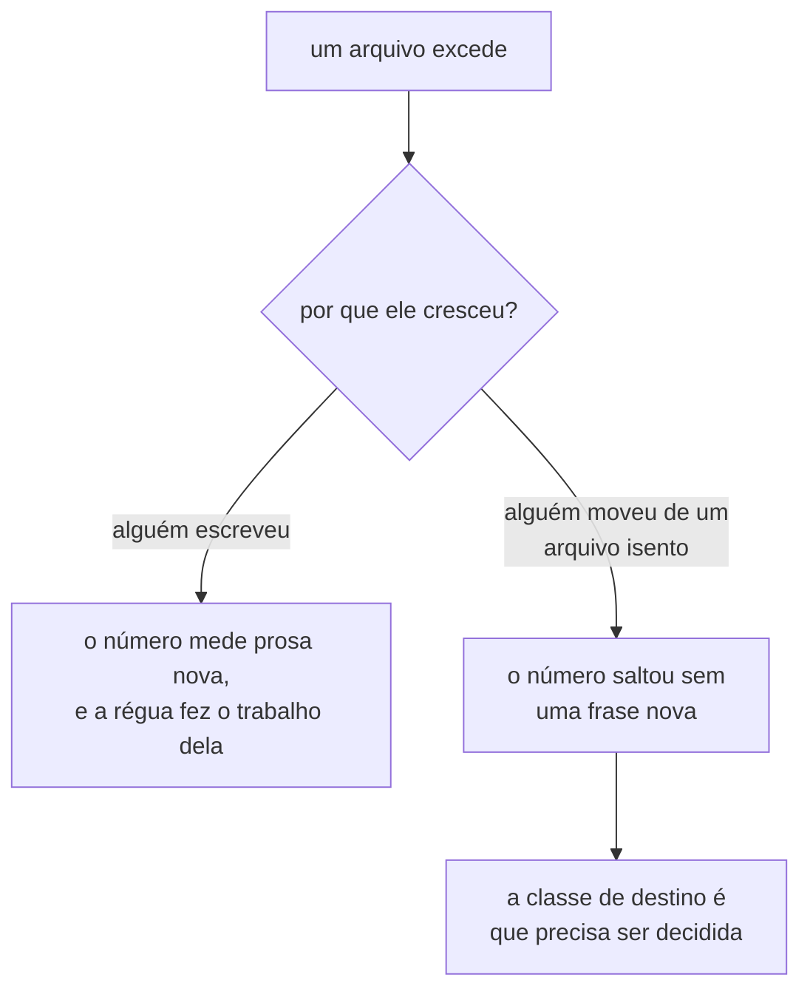
```mermaid
flowchart TD
  A["um arquivo excede"] --> Q{"por que ele cresceu?"}
  Q -->|" alguém escreveu "| E["o número mede prosa nova,<br/>e a régua fez o trabalho dela"]
  Q -->|" alguém moveu de um<br/>arquivo isento "| M["o número saltou sem<br/>uma frase nova"]
  M --> C["a classe de destino é<br/>que precisa ser decidida"]
```

**Sem recomendação, e são cinco decisões e não uma.** Cada arquivo pode receber classe
nova, entrar numa que já existe, ou ser comprimido. **Nada está bloqueado por esta
linha** — o job passa, e os cinco continuam medidos e visíveis a cada execução.

**Esta linha é de segunda espécie**, pela
[diretriz de prioridade](#a-prioridade-do-trabalho-declarada-em-2026-08-12). Ela não
bloqueia nenhuma linha da primeira, e o desfecho padrão dela é lacuna aceita — o que
significa que a lista pode ficar como está indefinidamente sem que nada quebre.

#### `E-71` — uma decisão sem ADR falsificou prosa de um ADR aceito

Aberta em 2026-08-11, ao conferir o que o fecho de `E-5` alterou fora de si.

**O problema.** O `### Neutras` do
[ADR-0008](0008-os-dois-planos-em-processos-separados.md#neutras) afirma que a escolha
entre schema separado e dois bancos na mesma instância "**não foi feita**" e que ela "é
pergunta em aberto". O
[fecho de `E-5`](#e-5-decidida-contra-a-recomendação-e-o-que-ela-arrasta) fez a escolha —
schemas separados na mesma instância — e diz, com todas as letras, que "ela fecha uma
pergunta em aberto do ADR-0008". **O ADR-0008 nunca foi tocado.** Ele segue afirmando que
a pergunta está aberta, e quem ler só ele não tem como saber que caiu.

**Por que nenhuma forma do lifecycle alcança este caso.** As formas que alteram um ADR
aceito por outro ADR exigem **um ADR novo que as carregue**, e `E-5` fechou sem gerar ADR
— o que é regular desde 2026-08-04, quando o que passou a se enfileirar foi decisão, e
não ADR. Sobra o **patch**, que conserta citação, caminho ou erro material e NÃO DEVE
alterar a decisão nem o argumento. Trocar "não foi feita" por "foi feita" não é conserto
de citação nem de caminho; e se é erro material, é o único tipo que nasce **depois** do
texto, por ato de terceiro, e não por descuido de quem escreveu. **A lacuna não é do
ADR-0008 — é da regra.**

**Quantos casos existem não está medido, e esta linha não inventa o número.** O
levantamento dos fechos sem artefato achou `E-5` com esta natureza; se há outros, medi-los
faz parte da saída que for escolhida.

| Saída                                                             | O que ela faz                                                                                                                        |
|-------------------------------------------------------------------|--------------------------------------------------------------------------------------------------------------------------------------|
| o patch ganha um motivo a mais, escrito                           | consertar afirmação que uma decisão posterior falsificou passa a ser patch legítimo, com a linha de `## Patches aplicados` de sempre |
| decisão de fila que alcance ADR aceito passa a exigir ADR         | `E-5` teria gerado ADR, e o regime de 2026-08-04 ganha uma exceção nomeada em vez de um vazio                                        |
| nasce uma forma nova, para decisão de fila que alcança ADR aceito | o lifecycle passa a ter uma forma cujo portador não é ADR, e o rastro no cabeçalho aponta para a linha da fila                       |

**Sem recomendação.** Escolher entre elas é da pessoa. Enquanto a linha estiver aberta, o
`### Neutras` do ADR-0008 permanece **byte a byte**, porque nenhuma forma autoriza tocá-lo
— e é exatamente esse impasse que a linha existe para resolver.

#### `E-72` — doze citações quebradas esperam sob uma premissa que já caiu

Aberta em 2026-08-11, ao conferir se a baseline de citações tinha entrada obsoleta.

**O problema.** As doze entradas de `scripts/citations-baseline.txt` são citações por
linha, nos ADRs 0008 e 0009, para três arquivos arquivados em
`docs/adr/arquivo/proposta-2026-08-03/`. O bloco que as autoriza dá o motivo: "o corpo de
um ADR aceito NÃO DEVE ser editado", escrito em 2026-08-05. **A imutabilidade do corpo foi
revogada em 2026-08-07**, e o bloco imediatamente acima daquele, o de `C-6`, é o registro
de duas citações consertadas por patch exatamente por causa da revogação. As doze ficaram
onde estavam, sob uma justificativa que a revogação esvaziou.

**O conserto existe, e foi verificado e não suposto.** Os três arquivos foram movidos sem
alteração de conteúdo: a linha 154-158 de `modelo-de-dados.md` no arquivo congelado traz,
na letra, a frase sobre buffer pool, WAL, checkpointer, autovacuum e tabela de locks que o
ADR-0008 cita; e 230-233 de `decisoes-pendentes.md` traz o que o ADR-0009 cita. Trocar o
prefixo do caminho resolve as doze, com os números de linha intactos.

**Por que isto não é execução, e sim decisão.** O bloco da baseline registra uma escolha
deliberada de **forma**: cada um dos dois ADRs recebeu um **adendo** que incorpora a
afirmação que a citação sustentava, e a nota diz que "a citação permanece quebrada no
corpo, e o adendo diz o que ela dizia". Repontar as doze troca essa forma por outra, e
esvazia parte do que os dois adendos existem para sustentar. Quem escolhe entre uma forma
e outra é a pessoa.

| Saída                                                       | O que ela faz                                                                                                                       |
|-------------------------------------------------------------|-------------------------------------------------------------------------------------------------------------------------------------|
| repontar as doze por patch, e manter os adendos             | a baseline esvazia, o verificador passa sem exceção nenhuma, e os adendos passam a ser redundância deliberada em vez de único apoio |
| manter como está, e corrigir só a justificativa da baseline | nada muda no corpo dos ADRs, e o bloco passa a dizer que a escolha é da forma, e não da impossibilidade de editar                   |
| repontar só as citações que nenhum adendo cobre             | exige medir, uma a uma, o que cada adendo absorveu — trabalho que nenhuma das outras duas saídas pede                               |

**Sem recomendação.** Enquanto a linha estiver aberta, as doze entradas permanecem na
baseline, e o bloco de comentário delas remete a esta linha.

#### `E-37` — o que a proibição de derivar estado de stream alcança

**Estado:** `fechada`, em 2026-08-09. Os três desdobramentos que esta linha deixou
abertos viraram `E-45`, `E-46` e `E-47`, adiante.
**Absorvida por:** [ADR-0013](0013-a-proveniencia-da-fonte-como-criterio-da-proibicao-do-oraculo.md).

#### `E-37` fecha na proveniência, e a contiguidade deixa de ser opcional

**Estado:** `fechada`, em 2026-08-09, pela pessoa, redigida pelo par escritor/revisor.
**Absorvida por:** [ADR-0013](0013-a-proveniencia-da-fonte-como-criterio-da-proibicao-do-oraculo.md).

### `E-38` — o limite do Feature Card contra o card como fonte de verdade

Aberta em 2026-08-06, ao reconciliar os cards com o ADR-0010. **A decisão de que
`docs/features/` é fonte de verdade e o limite de 5500 caracteres do Feature Card não
convivem.** Um card que carrega tudo o que uma consulta precisa é maior que um card que
resume e aponta.

A medição depois da reconciliação, com o verificador de limites:

| Card                            | Antes | Depois | Limite |
|---------------------------------|-------|--------|--------|
| detecção de atualização perdida | 7470  | 9576   | 5500   |
| execução de experimento         | 7372  | 8278   | 5500   |
| observação passo a passo        | 6641  | 8512   | 5500   |
| detecção de proteção inerte     | 5312  | 7029   | 5500   |

**Três dos quatro já excediam antes**, e o quarto passou a exceder. A pendência de que o
card de atualização perdida violava o limite de palavras já estava registrada, e nunca foi
decidida — o que mudou é que agora ela alcança todos os quatro, e por um motivo novo: não é
prosa em excesso, é conteúdo que a decisão de fonte de verdade exige que esteja ali.

**Cuidado ao comparar com estes números.** Eles são anteriores à isenção de diagrama,
código e tabela, decidida em 2026-08-06 no fecho abaixo — a tabela daquele fecho remede os
mesmos cards sob a regra vigente, e é ela que vale para comparação. Confrontar uma medição
pré-isenção com uma pós-isenção faz um card que cresceu parecer que encolheu, e isso já
aconteceu uma vez, em 2026-08-09.

Três saídas, nenhuma escolhida. Dividir cada card em dois artefatos, e decidir o que fica
em qual. Subir o limite, e aceitar que um card longo deixa de ser lido de ponta a ponta.
Ou manter o limite e aceitar que o card volte a apontar para o ADR — o que **desfaz** a
decisão de 2026-08-06. **A terceira não é neutra**, e é por isso que a linha existe em vez
de o limite ser ajustado em silêncio.

#### `E-38` fecha por uma quarta saída, escolhida em 2026-08-06

**Diagrama, bloco de código e tabela deixaram de entrar na contagem**, em todo artefato
`.md` que tenha limite. A escolha é da pessoa, e resolve a linha sem tocar em nenhuma
das três saídas acima: o limite continua 5500, os cards continuam carregando tudo o que
uma consulta precisa, e nenhum volta a apontar para o ADR.

O que a linha media não era o que ela queria medir. Um card cresce em caracteres por
três motivos, e só um deles é prosa em excesso: uma regra nova acrescenta uma **linha de
tabela** com evidência e aprovador, um fluxo novo acrescenta um **diagrama** — e as
convenções deste repositório **exigem os dois**. O limite punia o cumprimento da regra.

| Card                            | Bruto | Prosa | Limite |
|---------------------------------|-------|-------|--------|
| detecção de atualização perdida | 9245  | 3637  | 5500   |
| detecção de proteção inerte     | 6721  | 4651  | 5500   |
| execução de experimento         | 8011  | 2922  | 5500   |
| observação passo a passo        | 8286  | 2604  | 5500   |

O verificador é
[`check_artifact_limits.py`](../../.claude/skills/feature-planning/scripts/check_artifact_limits.py),
e a regra está em [`../AGENTS.md`](../AGENTS.md#feature-card) e em
[`README.md`](README.md#convenções).

**O `behavior.feature` fica de fora da regra, e não por esquecimento.** Em Gherkin a
tabela `Exemplos:` **é** o cenário, e não ilustração dele; descontá-la esvaziaria o
limite em vez de corrigi-lo.

#### `E-39` — o Example Mapping tem limite, e as instruções dizem que não

Aberta em 2026-08-06, pela mesma medição. Duas coisas se contradizem, e nenhuma é nova:
[`check_artifact_limits.py`](../../.claude/skills/feature-planning/scripts/check_artifact_limits.py)
impõe 4500 caracteres a `example-mapping.md`, enquanto o texto de `docs/AGENTS.md`
dizia, até hoje, que o Example Mapping **não tem limite** — e mandava mover para lá o
diagrama que não coubesse no card.

Com a contagem por prosa, dois dos quatro continuam acima:

| Example Mapping                 | Bruto | Prosa | Limite |
|---------------------------------|-------|-------|--------|
| execução de experimento         | 10452 | 6443  | 4500   |
| observação passo a passo        | 8626  | 6260  | 4500   |
| detecção de proteção inerte     | 7355  | 4293  | 4500   |
| detecção de atualização perdida | 5486  | 3925  | 4500   |

Aqui é prosa mesmo, e não moldura — a regra nova não os salva. As saídas eram: subir o
limite dos dois, cortar prosa deles, ou aceitar que o Example Mapping é o artefato sem
teto e remover a entrada do verificador.

#### `E-39` fecha sem teto, no mesmo dia

**O `example-mapping.md` não tem limite.** Escolhido pela pessoa em 2026-08-06, pela
terceira saída. Um Example Mapping cresce por exemplo acrescentado, e acrescentar
exemplo **é o trabalho dele** — um teto ali transforma "achei mais um contraexemplo" em
"preciso apagar um dos antigos", que é o oposto do que o artefato existe para fazer.

Quem estava fora de sincronia era o verificador: `docs/AGENTS.md` já dizia que ele não
tem limite. O script ganhou uma isenção **por nome**, e não a simples remoção da entrada
— sem ela o arquivo cairia no teto genérico de 4000 para `.md`, mais apertado que o que
a decisão removeu.

O custo está nomeado: o Example Mapping passa a ser o único artefato de
[`../features/`](../features/README.md) sem freio nenhum.

**Sobra uma pendência da mesma família, e ela é anterior a tudo isto.** O
`behavior.feature` de detecção de atualização perdida tem 4295 caracteres contra um teto
de 3500 — e já tinha 4223 antes das edições de hoje. Ele **não** recebe o desconto de
tabela, por decisão: em Gherkin a tabela `Exemplos:` é o cenário, e não ilustração dele.
Subir o teto, dividir o arquivo ou cortar cenário é escolha, e ela não foi feita.

#### `E-40` — o componente de identidade contradiz um `DEVE` do ADR-0002

**Fechada em 2026-08-06: não há contradição.** O `DEVE` do ADR-0002 opõe **aplicação a
banco**, e não sistema medido a serviço externo — o que ele proibe é o banco atribuir
identidade por `SERIAL`, `IDENTITY` ou `nextval`. O ADR-0002 não é emendado nem
substituído, e o
[ADR-0011](0011-a-topologia-de-servicos-e-o-caderno-de-laboratorio-fora-do-git.md#justificativa) registra a leitura e o motivo dela, de propósito.

#### `E-41` — o que a decisão do broker desfaz fora do ADR

Aberta em 2026-08-06, na segunda revisão do ADR-0012. Duas consequências que não vivem
dentro de nenhum ADR e que ficariam sem dono.

**O `REPLICATION` do papel `lab_plane` perdeu o propósito.** `local/postgres-init.sql:18`
faz `ALTER ROLE lab_plane REPLICATION;`, e o comentário acima dele diz que o `lab-plane`
lê o WAL por replicação lógica. Com o conector em processo próprio, quem lê o WAL é o
Debezium Server — o `lab-plane` consome do broker e **não precisa mais do atributo**.
Mantê-lo deixa a credencial de leitura do WAL no mesmo processo que produz o veredito,
que é a razão pela qual o conector foi separado.

**Um papel novo, dedicado ao conector, recebe o `REPLICATION`.** Escolhido pela pessoa em
2026-08-06. A alternativa era o papel do sistema medido, e ela perde por ampliar o que
uma falha nele alcança: ler o próprio WAL não é necessário para o domínio, e o
laboratório mata processos do sistema medido de propósito na etapa 6.

Manter o `GRANT` no `lab_plane` **desfaria o motivo de o conector existir em processo
próprio** — a credencial de leitura do WAL voltaria ao processo que produz o veredito, um
nível abaixo da regra de fronteira. O `local/postgres-init.sql` muda no commit que traz o
ADR-0012.

**A matriz de integrações envelheceu no mesmo ato.**
[`integrations.md`](../architecture/integrations.md#matriz) registra o RabbitMQ como
**hipótese**, com a ressalva de que ele entra na etapa 5 e não antes. A decisão do broker
o põe no dia zero. A regra de `docs/AGENTS.md` obriga a matriz a separar fato de hipótese
e proíbe deixar uma linha envelhecer — a linha é reescrita no commit que traz o ADR.

**Ao reescrevê-la, apareceu uma segunda linha morta que ninguém tinha registrado.** A
matriz descrevia `Lab Plane (oráculo) → PostgreSQL`, por `SELECT` após a quiescência —
exatamente a regra que o
[ADR-0010](0010-a-fronteira-de-schema-e-o-cdc-como-fonte-do-veredito.md#decisão) revogou
ao mandar o oráculo ler o WAL. Ela foi substituída pelas três linhas do caminho decidido:
conector → PostgreSQL por replicação lógica, conector → RabbitMQ, RabbitMQ → `lab-plane`.
A linha do RabbitMQ do domínio continua **hipótese**, porque o que a decisão do broker
antecipou foi a existência do broker, e não o uso dele pelos grupos B e C.

**O que isso revela é maior que as duas linhas.** A matriz não tem quem a reconcilie
quando um ADR nasce; ela envelheceu porque a checagem não existe, e não porque alguém
esqueceu. Se cada ADR passa a listar o que desfaz fora de si — e se a checagem disso é
humana ou executável — **ninguém decidiu**: `Pergunta em aberto`.

#### `E-42` — o relatório de execução incorpora a definição usada, ou a cita

Aberta em 2026-08-09, pela poda de `E-14`. A escolha nunca foi feita, e o registro dela
sobreviveu apenas dentro da narrativa que esta poda reduziu a lápide: nenhum ADR a
absorveu.

**O problema.** O
[ADR-0011](0011-a-topologia-de-servicos-e-o-caderno-de-laboratorio-fora-do-git.md#o-caderno-de-laboratório-sai-do-git)
põe a definição de um experimento e o resultado dela no banco do `lab-journal`, e nomeia
o custo nas
[consequências negativas](0011-a-topologia-de-servicos-e-o-caderno-de-laboratorio-fora-do-git.md#negativas):
um resultado deixa de aparecer em diff, de ser revisado em PR e de sobreviver a um banco
recriado. O que ele não decide é **o que o relatório carrega** quando sai do banco.

**A primeira forma é o relatório incorporar a definição completa que foi usada.** O que
reproduz a execução volta a estar num artefato único, e a definição deixa de ser algo a
sincronizar — ela passa a ser um campo do resultado, e não uma fonte à parte. É o desenho
em que o custo nomeado pelo ADR-0011 desaparece.

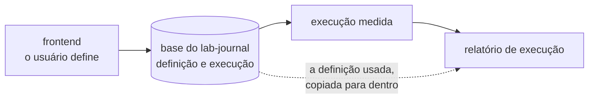
```mermaid
flowchart LR
    UI["frontend<br/>o usuário define"]
    DB[("base do lab-journal<br/>definição e execução")]
    RUN["execução medida"]
    REL["relatório de execução"]
    UI --> DB
    DB --> RUN
    RUN --> REL
    DB -.->|" a definição usada,<br/>copiada para dentro "| REL
```

**A segunda é o relatório citar a definição por identificador.** O relatório fica menor e
não duplica o que o banco já guarda; em troca, reproduzir uma execução antiga exige o
banco que ainda tenha aquele identificador — que é exatamente o que a decisão do ADR-0011
admitiu não sobreviver.

**Ela alcança um contrato que ainda não existe.** O JSON Schema do relatório de execução
está listado como não decidido em
[`../contracts/README.md`](../contracts/README.md#estado-nenhum-contrato-existe), com o
primeiro relatório emitido como gatilho. Decidir `E-42` depois desse gatilho fixaria a
forma por omissão.

**Sem recomendação.** A linha nasce com o registro do que a poda teria apagado, e nada
além disso.

#### `E-42` fecha em o relatório incorpora a definição usada, escolhida em 2026-08-12

**Escolhida pela pessoa em 2026-08-12**, pela primeira das duas formas.

**O relatório de execução carrega a definição completa que foi usada**, como campo do
resultado. Reproduzir uma execução deixa de exigir que o banco ainda tenha a definição, e
o que reproduz volta a estar num artefato único.

**O motivo é o custo que o próprio ADR-0011 nomeou.** As
[consequências negativas](0011-a-topologia-de-servicos-e-o-caderno-de-laboratorio-fora-do-git.md#negativas)
dele registram que um resultado deixa de sobreviver a um banco recriado — e o
[caderno de laboratório fora do Git](0011-a-topologia-de-servicos-e-o-caderno-de-laboratorio-fora-do-git.md#o-caderno-de-laboratório-sai-do-git)
foi aceito **com** esse custo. Incorporar é o único dos dois desenhos em que ele
desaparece: o relatório sobrevive ao banco que o produziu. Citar por identificador
preservaria o custo inteiro, e num artefato que existe justamente para sair de lá.

**O custo aceito.** O relatório duplica o que o banco guarda. A duplicação é deliberada e
não é fonte concorrente: **a definição dentro do relatório é a que foi usada naquela
execução**, e não a definição vigente — as duas divergirem depois de uma edição é o
comportamento correto, e não um defeito de sincronização.

**Isto fixa uma decisão antes do gatilho que a fixaria por omissão.** O JSON Schema do
relatório de execução está listado como não decidido em
[`../contracts/README.md`](../contracts/README.md#estado-nenhum-contrato-existe), com o
primeiro relatório emitido como gatilho. O enunciado alertava que decidir `E-42` depois
desse gatilho fixaria a forma por omissão; a escolha chegou antes, e o contrato nasce
sabendo o que carrega.

**O que continua aberto.** Qual é a forma da definição dentro do relatório — objeto
aninhado, documento serializado, ou os campos achatados — não foi decidido, e pertence ao
contrato quando ele nascer. E **o que o relatório publica** continua sendo a decisão
maior, ainda aberta, da composição dos formatos de veredito, em
[capacidade conhecida e não especificada](../features/README.md#capacidade-conhecida-e-não-especificada).

#### `E-43` — as três pendências do ADR-0013 vivem dentro de uma linha fechada

Aberta em 2026-08-09, pela revisão do ADR-0013. O
[fecho de `E-37`](#e-37-fecha-na-proveniência-e-a-contiguidade-deixa-de-ser-opcional)
enumera três coisas que aquela linha não decide, e o ADR-0013 as declara em
`### Negativas`. Mas `E-37` está **fechada**, e uma pendência registrada dentro de uma
linha fechada não é enfileirada por ninguém: ela só é encontrada por quem já sabe que
existe. O precedente contrário é `E-42`, aberta no commit anterior exatamente para isso.

**As três.** O rótulo da execução invalidada por buraco de LSN — se é
[`fonte atrasada`](../CONTEXT.md#os-dois-rótulos-do-instrumento-decididos-em-2026-08-05),
que `A3` deu ao estouro do limite de espera, ou um distinto. Onde a conferência de
contiguidade vive: conector de CDC, consumidor do broker ou o próprio oráculo. E se a
espera pelo LSN do commit final alcança também o oráculo do predicado.

**A terceira não é igual às outras duas**, e é por isso que a linha existe em vez de as
três ficarem onde estão. Sem condição de término, a soma pode ser lida cedo demais e sair
parcial — o mesmo falso negativo silencioso que a guarda de contiguidade evita, por outra
porta. O card diz isso na letra:
[a terceira ainda produz veredito errado](../features/deteccao-de-protecao-inerte/feature-card.md#riscos-e-decisões-pendentes).

**Decidir se elas viram uma linha, três linhas ou questões em `docs/questions/`** é o que
esta linha enfileira. Sem recomendação.

**A apuração de 2026-08-10 achou que uma das três alternativas embute uma decisão que
esta linha não toma.** As três pendências nasceram na revisão de um ADR que nasceu
`Aceito`. A pasta `docs/questions/` tem regra de transporte para duas origens apenas,
[`ADR proposto` e `contra-avaliação`](../questions/README.md#de-onde-uma-questão-vem), e
nenhuma delas alcança um ADR aceito. Pela
[origem nova](../questions/README.md#origem-nova-e-o-que-ainda-não-tem-regra), as três
entrariam com `Tipo de origem` sem decisão, e repetiriam o precedente das sete linhas de
`auditoria documental` — que o [índice](../questions/README.md#índice) declara descritivo,
e não regra decidida.

**As três não têm o mesmo destino, e o índice de questões exige um.** A coluna
`Destino na fila` é obrigatória lá. O rótulo da execução invalidada pertence ao
vocabulário do relatório, ao lado de `A3` e de
[`E-42`](#e-42--o-relatório-de-execução-incorpora-a-definição-usada-ou-a-cita). O lugar da
conferência pertence à fronteira do
[ADR-0012](0012-o-broker-no-caminho-do-veredito-e-a-dispensa-que-ele-exigiu.md#decisão), e
não é decidível hoje: nenhum código de oráculo, de conector ou de consumidor existe na
árvore. A condição de término pertence a
[`O19`](arquivo/proposta-2026-08-03/decisoes-pendentes.md#o19-fecha-o-oráculo-espera-o-cdc-com-limite-declarado),
que fechou em 2026-08-05 para o oráculo exato.

**A terceira tem urgência que as outras duas não têm.** Ela produz veredito errado hoje,
pela letra do
[card](../features/deteccao-de-protecao-inerte/feature-card.md#riscos-e-decisões-pendentes).
As outras duas fixam um nome e um lugar de código. Uma linha única faz a terceira esperar
o tempo das outras duas, e uma citação vinda do card deixa de dizer qual das três ela
alcança.

| Alternativa | O que faz                                             | Custo                                                      |
|-------------|-------------------------------------------------------|------------------------------------------------------------|
| A           | uma linha, as três juntas                             | mistura urgência e destino; a citação do card fica ambígua |
| B           | três linhas, uma por pendência                        | a fila cresce em três, e duas delas são pequenas           |
| C           | três questões em `docs/questions/`                    | decide de passagem a origem nova, que segue sem decisão    |
| D           | a terceira em linha própria, as duas primeiras juntas | duas linhas em vez de uma ou três                          |

**Uma linha cujo gatilho ainda não ocorreu tem precedente nesta fila.** A própria
[`E-42`](#e-42--o-relatório-de-execução-incorpora-a-definição-usada-ou-a-cita) alcança um
contrato que ainda não existe, e foi aberta assim de propósito. O custo de `B` não é,
portanto, a indecidibilidade de uma das três: é apenas o tamanho da fila.

**Nada disto decide a linha**, e a escolha continua da pessoa.

#### `E-43` fecha em três linhas, escolhidas em 2026-08-10

**Escolhido pela pessoa em 2026-08-10**, pela alternativa `B`. Cada pendência recebe linha
própria nesta fila, com nome, destino e citação inequívoca:
[`E-45`](#e-45--o-buraco-de-lsn-não-cabe-em-nenhum-dos-dois-rótulos-do-instrumento),
[`E-46`](#e-46--onde-a-conferência-de-contiguidade-de-lsn-vive) e
[`E-47`](#e-47--a-soma-do-oráculo-do-predicado-não-tem-condição-de-término).

**As duas descartadas, e o motivo de cada uma.** A alternativa `C` decidiria de passagem o
critério de entrada de uma origem nova em `docs/questions/`, que a
[origem nova](../questions/README.md#origem-nova-e-o-que-ainda-não-tem-regra) declara sem
decisão. A alternativa `D` agruparia duas pendências por urgência, e não por assunto — e
esta fila cita linha [pelo nome](#como-citar-uma-linha-desta-fila), de modo que um nome
que cobrisse "o rótulo e o lugar do código" não diria qual das duas alcança.

**O card do E5 passa a citar os fechos das linhas que viram regra**, no lugar do fecho de
`E-37`: `R8` cita `E-46` e `R9` cita `E-47`. `E-45` fica de fora porque ela nomeia um
rótulo, e quem define rótulo é o glossário. As quatro citações
que o
[ADR-0013](0013-a-proveniencia-da-fonte-como-criterio-da-proibicao-do-oraculo.md#negativas)
faz ao fecho de `E-37` **não** são patchadas: elas não estão erradas, porque aquele fecho
continua enumerando as três, e o corpo de um ADR aceito só muda pelas formas do
[lifecycle](README.md#a-revogação-da-imutabilidade-decidida-em-2026-08-07).

#### `E-45` — o buraco de LSN não cabe em nenhum dos dois rótulos do instrumento

**Fechada em 2026-08-10.** O terceiro rótulo do instrumento é `fonte incompleta`, e o par
legível vira trio. O racional vive em
[`E-45` fecha em `fonte incompleta`](#e-45-fecha-em-fonte-incompleta-escolhida-em-2026-08-10).

#### `E-46` — onde a conferência de contiguidade de LSN vive

**Fechada em 2026-08-10.** A guarda vive no consumidor do broker, e o oráculo recebe um
stream já atestado. O racional vive em
[`E-46` fecha no consumidor do broker](#e-46-fecha-no-consumidor-do-broker-escolhida-em-2026-08-10).

#### `E-47` — a soma do oráculo do predicado não tem condição de término

**Fechada em 2026-08-10.** O sistema medido escreve uma marca de fim fora da janela medida,
e o oráculo soma até reconhecê-la no stream. O racional vive em
[`E-47` fecha na sentinela](#e-47-fecha-na-sentinela-escolhida-em-2026-08-10).

### A rodada de 2026-08-10: a completude do stream ganha dono, e o par vira trio

**As quatro linhas desta rodada fecharam em 2026-08-10**, tratadas juntas porque as
quatro descendem da mesma retirada: o
[ADR-0010](0010-a-fronteira-de-schema-e-o-cdc-como-fonte-do-veredito.md#decisão) tirou o
`SELECT sum` do oráculo do predicado, e o
[ADR-0013](0013-a-proveniencia-da-fonte-como-criterio-da-proibicao-do-oraculo.md#decisão)
pôs o WAL no lugar. `E-47` fixou como o oráculo sabe que pode somar, `E-46` fixou quem
confere a contiguidade, `E-45` nomeou a execução invalidada e `E-44` mandou reparar o
glossário.

#### `E-47` fecha na sentinela, escolhida em 2026-08-10

**Escolhido pela pessoa em 2026-08-10**, pela sentinela. O sistema medido escreve uma marca
de fim depois que todos os workers terminam, e o oráculo soma até reconhecer o evento dessa
marca no stream. O LSN da marca é o "LSN do commit final" que
[`O19`](arquivo/proposta-2026-08-03/decisoes-pendentes.md#o19-fecha-o-oráculo-espera-o-cdc-com-limite-declarado)
nomeia, obtido sem consultar relógio.

**O limite de espera continua existindo, e muda de papel.** Ele deixa de decidir quando o
resultado está pronto, e passa a decidir apenas quando desistir. A desistência produz
`fonte atrasada`, que já existe no glossário, e não um veredito. Pela formulação por papel
do valor fixada em `E-13`, um limite que não entra em veredito não é alcançado pela regra
do relógio injetável. **O valor dele segue `Pergunta em aberto`**, e a razão mudou: ele
deixou de ser insumo de veredito.

**As três descartadas, e o motivo de cada uma.** Estender `O19`, esperando o LSN do commit
final sob limite de tempo, não diz ao oráculo que o stream acabou: ele soma o que chegou
até o limite e **emite veredito** sobre uma soma parcial. Um `Σ amount` incompleto sai
abaixo de `capacity` e produz `protegido` sobre um banco violado — veredito errado, e não a
ausência de veredito que a desistência da sentinela produz. Essa é a diferença entre as
duas, e não a estabilidade do desfecho.
Contar eventos supõe que o número de passagens por `AFTER_COMMIT` iguale o número de
eventos de `INSERT`, e `allocate` insere apenas quando couber — a diferença entre os dois
números é exatamente o que
[`R6`](../features/deteccao-de-protecao-inerte/feature-card.md#regras-de-negócio) exige que
a amostra contenha. Atribuir a completude ao transporte não é resposta própria: desloca a
pergunta para `E-46`, que fechou no mesmo dia.

**O que esta linha não decide.** A forma da marca — tabela própria, coluna em tabela
existente, ou outra — não foi escolhida, nem quem a emite dentro do sistema medido. O que
ficou fixado é que ela é escrita **pelo sistema medido**, fora da janela medida: o Lab
Plane escrever ali quebraria a fronteira do
[ADR-0010](0010-a-fronteira-de-schema-e-o-cdc-como-fonte-do-veredito.md#decisão).

#### `E-46` fecha no consumidor do broker, escolhida em 2026-08-10

**Escolhido pela pessoa em 2026-08-10.** A conferência de contiguidade de LSN vive no
consumidor do broker. Ele entrega ao oráculo um stream já atestado, e todo leitor a jusante
dele herda a guarda sem reimplementá-la.

**A completude passa a ter dono único, e era esse o risco.** A mesma camada confere o
buraco no meio e reconhece a marca de fim que `E-47` escolheu. Sem isso, a guarda ficaria
num lugar e a espera noutro, e nenhum dos dois poderia afirmar que o stream está completo.

**As duas descartadas.** O conector é o Debezium Server, pelo
[ADR-0012](0012-o-broker-no-caminho-do-veredito-e-a-dispensa-que-ele-exigiu.md#decisão), e
o que se versiona dele é configuração declarativa, como a apuração de
[`E-31`](#achado-sobre-e-31--a-variável-de-ambiente-sobrepõe-tudo-e-isso-dissolve-a-tensão-do-secret)
levantou: pôr a guarda ali exigiria transformação própria ou fork, e nenhuma das duas é
configuração. O oráculo protegeria apenas a si: qualquer outro leitor do mesmo stream —
uma projeção, um exportador — ficaria sem guarda, ainda que dentro do `lab-plane`. Um
segundo **consumidor** do broker reimplementaria a guarda nos dois desenhos; a diferença
está em quantos leitores um único consumidor cobre.

**A linha fecha antes do gatilho, de propósito.** Nenhum dos componentes existe na árvore.
O que a decisão evita é o gatilho chegar e o dono ser escolhido por omissão, pelo primeiro
código que alguém escrever — o mesmo modo de falha que
[`E-42`](#e-42--o-relatório-de-execução-incorpora-a-definição-usada-ou-a-cita) nomeia.

**A apuração do fecho achou que os dois ADRs aceitos já divergiam no ator.** O
[ADR-0012](0012-o-broker-no-caminho-do-veredito-e-a-dispensa-que-ele-exigiu.md#decisão) diz
que **o `lab-plane`** DEVE usar o LSN para ordenar, desduplicar e detectar buraco na
sequência antes de calcular o veredito, e põe o filtro por execução no consumidor, dentro
do `lab-plane`. O
[ADR-0013](0013-a-proveniencia-da-fonte-como-criterio-da-proibicao-do-oraculo.md#decisão)
diz que **o oráculo** DEVE conferir a contiguidade. Os dois atores vivem no mesmo processo,
e nenhum dos dois ADRs escolheu a camada — a negativa do ADR-0013 declara isso na letra.
Esta linha escolhe a camada, e por isso **não** contradiz nenhum dos dois: ela fecha uma
lacuna que os dois deixaram.

**O que sobra é a frase "parte do oráculo, e não acessório", do ADR-0013.** Ela diz que sem
a guarda o veredito não vale, e continua verdadeira: o oráculo recebe um stream atestado, e
não produz veredito sem o atestado. Lida como **condição de validade**, a frase convive com
esta decisão. Lida como **localização**, ela a contradiz, e aí seria preciso ADR. A leitura
adotada aqui é a primeira, e quem discordar tem nesta linha o registro de que a escolha
existiu.

#### `E-45` fecha em `fonte incompleta`, escolhida em 2026-08-10

**Escolhido pela pessoa em 2026-08-10**, pela criação de um terceiro rótulo, e o nome dele
é `fonte incompleta`. Ele nomeia a fonte que alcançou o ponto declarado e chegou com buraco
na sequência de LSN. O par legível vira trio, e lê-se em série: uma fonte diverge, a outra
não chega, a terceira chega incompleta.

**Os quatro nomes descartados, e o motivo de cada um.** `fonte descontínua` nomeia o
defeito com precisão, e é menos legível ao lado de `protegido` e `violado`. `fonte com
lacuna` carrega `lacuna`, que neste repositório já significa ausência documental. `fonte
truncada` sugere corte no fim, e o defeito é buraco no meio. Reusar `fonte atrasada`, que
era a alternativa a criar rótulo novo, perde por fazer uma palavra nomear duas falhas
diferentes — que é o que `A3` recusou ao criar dois rótulos em vez de um.

**O glossário é corrigido no mesmo dia**, pelo fecho de `E-44`, e o terceiro rótulo entra
na tabela de classificação do ADR-0004 pelo caminho de subsunção que o par já usou.

#### `E-44` fecha em reparo imediato, escolhida em 2026-08-10

**Escolhido pela pessoa em 2026-08-10.** O glossário é corrigido agora, no mesmo ato que
registra `E-45`, e não num turno futuro da skill `domain-modeling`. A regra daquela skill
fala do turno em que um termo é resolvido; o termo foi resolvido em 2026-08-09, pelo
ADR-0013, e o glossário não mudou naquele turno. O que se faz hoje é reparo, e não lote.

**A correção tem duas partes, e as duas saem juntas.** A entrada `predicate oracle` deixa
de descrever o `SELECT sum` que o ADR-0010 retirou, e passa a citar a evidência por âncora
GFM em vez de número de linha, como `C-1` exige. A seção dos rótulos recebe `fonte
incompleta`, com o título preservado porque ele é citado por âncora.

**A alternativa descartada era esperar a skill.** Ela perde porque a contradição com dois
ADRs aceitos permaneceria até um turno que ninguém agendou, e porque corrigir junto do
rótulo novo toca o arquivo uma vez em vez de duas.

**Quem é dono do glossário continua `Pergunta em aberto`.** Nenhuma frase de
[`CONTEXT.md`](../CONTEXT.md) diz quem o mantém ou como uma entrada errada é reparada; a
regra vive fora dele, no
[`AGENTS.md` de `docs/`](../AGENTS.md#glossário-de-domínio). A pessoa não fechou essa
ausência neste ato.

**O reparo alcançou só `predicate oracle` e o rótulo novo, e nada além disso.** As
demais entradas do glossário que citam o ADR-0002 por número de linha continuam como
estavam antes deste fecho, e pelo menos quatro já citam um número que não alcança mais o
trecho que sustentou a entrada — o próprio defeito que `C-1` proíbe: `exact oracle` e
`materialized truth` apontam para linha fora de
[`## Vocabulário`](0002-o-dominio-minimo-e-os-dois-oraculos.md#vocabulário) e de
[`### O oráculo exato`](0002-o-dominio-minimo-e-os-dois-oraculos.md#o-oráculo-exato), e
`Resource` e `Allocation` apontam para linha fora de
[`## Decisão`](0002-o-dominio-minimo-e-os-dois-oraculos.md#decisão), que é onde as duas
entidades estão hoje. Consertar essas quatro citações não foi decidido aqui — a linha
fica dívida nomeada no glossário, não fato reparado por este fecho.

#### `E-48` — a precedência entre `fonte incompleta` e `fonte atrasada` diverge entre os dois diagramas

Aberta em 2026-08-10, achada ao conferir os diagramas que os fechos de `E-46` e `E-47`
levaram para dois documentos diferentes.

**O problema.** O bloco Mermaid de
[`CONTEXT.md`, os dois rótulos do instrumento](../CONTEXT.md#os-dois-rótulos-do-instrumento-decididos-em-2026-08-05)
pergunta primeiro se as duas fontes alcançaram o commit final — o que produz
`fonte atrasada` quando a resposta é não — e só depois confere a contiguidade de LSN, que
produz `fonte incompleta`. O bloco Mermaid do
[card de detecção de proteção inerte, integrações e contratos afetados](../features/deteccao-de-protecao-inerte/feature-card.md#integrações-e-contratos-afetados)
inverte a ordem: a contiguidade de LSN é conferida primeiro, e a marca de fim só depois.
Para um stream que chega com buraco **e** estoura o limite de espera na mesma execução, os
dois documentos rotulam o mesmo caso de formas diferentes — `fonte atrasada` no primeiro,
`fonte incompleta` no segundo.

**Nenhum dos dois fechos decidiu a ordem entre as duas condições.**
[`E-46`](#e-46-fecha-no-consumidor-do-broker-escolhida-em-2026-08-10) escolheu **quem**
confere a contiguidade, e [`E-47`](#e-47-fecha-na-sentinela-escolhida-em-2026-08-10)
escolheu **como** o oráculo reconhece o fim do stream; nenhuma das duas linhas comparou
as duas verificações entre si nem previu o caso em que ambas falham juntas.

**Duas saídas, e o custo de cada uma.**

- **A marca de fim é conferida primeiro**, como em `CONTEXT.md`. Uma execução que nunca
  alcança o commit final sai `fonte atrasada`, mesmo que o stream recebido até o limite
  de espera já tivesse um buraco. O custo é descartar informação: o buraco existiu, e o
  rótulo não o carrega.
- **A contiguidade é conferida primeiro**, como no card. Uma execução com buraco sai
  `fonte incompleta`, mesmo que ela também nunca fosse alcançar o commit final. O custo
  é o mesmo, do lado oposto: o estouro do limite de espera existiu, e o rótulo não o
  carrega.

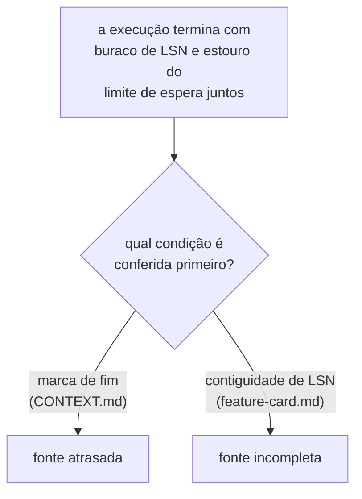
```mermaid
flowchart TD
    E["a execução termina com<br/>buraco de LSN e estouro do<br/>limite de espera juntos"] --> Q{"qual condição é<br/>conferida primeiro?"}
    Q -->|" marca de fim<br/>(CONTEXT.md) "| A["fonte atrasada"]
    Q -->|" contiguidade de LSN<br/>(feature-card.md) "| I["fonte incompleta"]
```

**Sem recomendação.** A linha nasce com a divergência registrada entre os dois
documentos, e nenhum dos dois diagramas foi alterado para resolvê-la.

#### `E-48` fecha em contiguidade primeiro, escolhida em 2026-08-10

**Escolhido pela pessoa em 2026-08-10.** A contiguidade de LSN é conferida antes da marca
de fim. O diagrama do
[card de detecção de proteção inerte](../features/deteccao-de-protecao-inerte/feature-card.md#integrações-e-contratos-afetados)
já estava nesta ordem, e não muda. O diagrama de
[`CONTEXT.md`](../CONTEXT.md#os-dois-rótulos-do-instrumento-decididos-em-2026-08-05),
que estava na ordem inversa, foi corrigido para esta.

**A citação por linha do enunciado ficou desatualizada, e este fecho registra isso.** O
bloco Mermaid que o enunciado cita em `docs/CONTEXT.md:818-827` era o texto **antes**
desta correção. A troca de ordem deslocou o texto ao redor dele, e hoje o mesmo bloco —
já com a contiguidade perguntada primeiro — vive em `docs/CONTEXT.md:825-834`.

**Esta segunda medição envelheceu por sua vez, e o padrão virou linha própria.** Em
2026-08-11 o mesmo bloco vivia em `docs/CONTEXT.md:829-839`. Duas edições do alvo, duas
citações por linha defasadas, e nenhum verificador acusou. O que fazer com isso é
[`E-75`](#e-75--a-citação-por-linha-a-bloco-mermaid-envelhece-a-cada-edição-do-alvo);
este parágrafo só nomeia o fato, e o corpo acima permanece como fechou.

**A frase do enunciado sobre os dois diagramas também ficou para trás.** Ele diz que
"nenhum dos dois diagramas foi alterado para resolvê-la", e isso descrevia o estado no
momento em que a linha foi aberta. O diagrama de `CONTEXT.md` foi alterado por este
fecho, e a frase não descreve mais o estado corrente. O enunciado permanece como nasceu
— este parágrafo só nomeia onde ele ficou para trás.

**A correção não parou no diagrama, e este fecho registra isso também.** O mesmo commit
reescreveu a prosa do glossário ao redor dele: a entrada `fonte incompleta` deixou de
dizer que a fonte "**alcançou** o ponto declarado e chegou **incompleta**", e o parágrafo
"O terceiro não desfaz o par" foi refeito para não depender de a fonte alcançar o commit
final. Sob esta ordem, o rótulo sai ao achar o buraco, **independentemente** de a fonte
alcançar o ponto declarado depois.

**Isso deixa a caracterização do fecho de `E-45` desatualizada, sem alterá-lo.** Aquele
fecho, nesta mesma página, diz que o rótulo "nomeia a fonte que **alcançou o ponto
declarado** e chegou com buraco na sequência de LSN"
([`E-45` fecha em `fonte incompleta`](#e-45-fecha-em-fonte-incompleta-escolhida-em-2026-08-10)).
Essa frase descrevia a condição de emissão do rótulo antes desta linha decidir a ordem
entre as duas conferências; hoje ela não descreve mais quando `fonte incompleta` sai. O
corpo de `E-45` permanece como fechou — este parágrafo só nomeia onde a descrição ficou
para trás.

**Os dois motivos.** Um buraco de LSN é fato **definitivo sobre a fonte**: uma vez achado,
ele não se desfaz. O estouro do limite de espera é fato **sobre o instrumento** — o limite
é escolhido por alguém, e o valor dele continua `Pergunta em aberto` pelo fecho de
[`E-47`](#e-47-fecha-na-sentinela-escolhida-em-2026-08-10). Rotular pelo fato sobre o
instrumento quando existe um fato sobre a fonte descarta o diagnóstico mais forte. E a
ordem inversa **mascara a causa**: se o evento perdido no buraco for justamente o da marca
de fim, conferir a marca primeiro produz `fonte atrasada` — um rótulo que diz "espere
mais" para um caso em que esperar nunca resolve o problema. `fonte incompleta` diz o que
consertar.

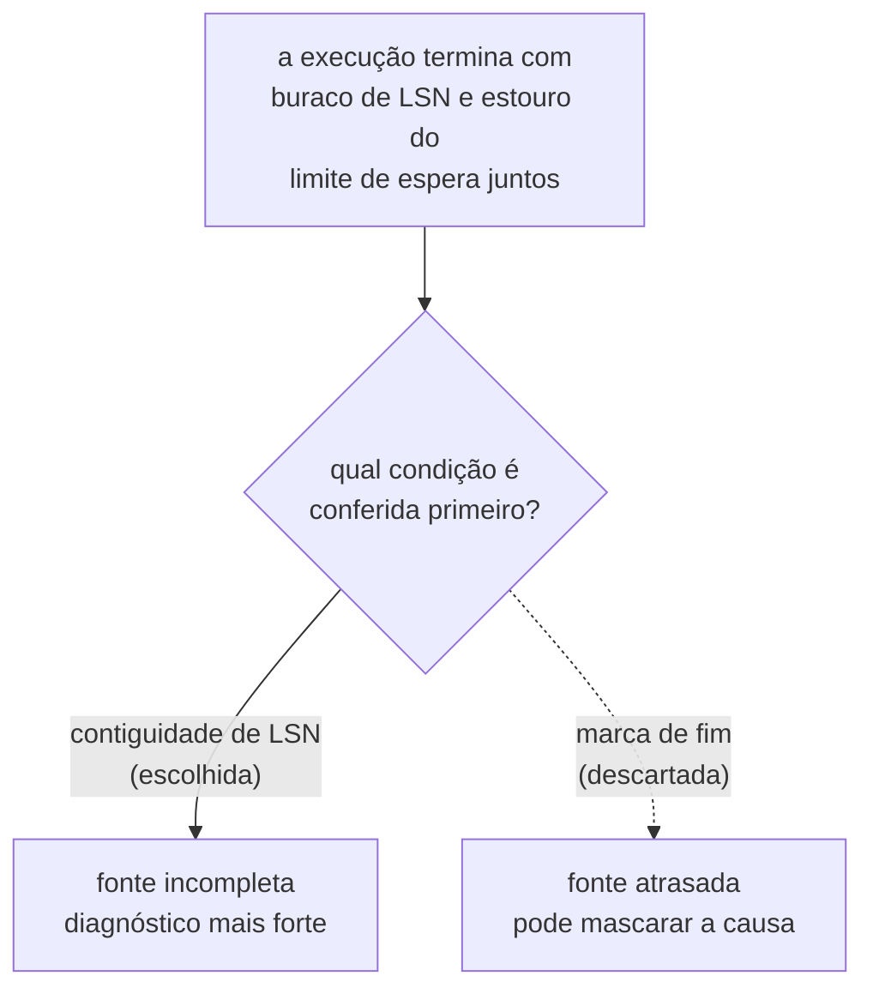
```mermaid
flowchart TD
    E["a execução termina com<br/>buraco de LSN e estouro do<br/>limite de espera juntos"] --> Q{"qual condição é<br/>conferida primeiro?"}
    Q -->|" contiguidade de LSN<br/>(escolhida) "| I["fonte incompleta<br/>diagnóstico mais forte"]
    Q -.->|" marca de fim<br/>(descartada) "| A["fonte atrasada<br/>pode mascarar a causa"]
```

**As duas descartadas, e o motivo de cada uma.** Marca de fim primeiro, como o
`CONTEXT.md` fazia, se sustentaria se a contiguidade só pudesse ser avaliada sobre um
stream que se sabe terminado — enquanto eventos ainda chegam, um "buraco" poderia ser
transitório. Perde pelo segundo motivo acima: mascara a causa no caso em que as duas
condições falham juntas. Rótulo primário mais secundário — conferindo as duas condições e
reportando as duas — é a única saída que não descarta informação nenhuma; perde por custo:
o rótulo do instrumento é hoje um valor único entre
[três](../CONTEXT.md#os-dois-rótulos-do-instrumento-decididos-em-2026-08-05) — `fonte
atrasada`, `fonte incompleta`, `fontes divergentes` —, e reportar dois valores onde hoje
há um não foi decidido em lugar nenhum. Isto não é o formato do veredito: os três rótulos
"falam do **instrumento**, e nenhum é veredito sobre o system under test"
([`CONTEXT.md`](../CONTEXT.md#os-dois-rótulos-do-instrumento-decididos-em-2026-08-05)), e
o fecho de [`E-47`](#e-47-fecha-na-sentinela-escolhida-em-2026-08-10) já trata `fonte
atrasada` como o oposto de veredito — "e não um veredito". O campo composto discutido
aqui, se viesse a existir, viveria no rótulo do instrumento, e não na posição 9 da fila,
que é sobre booleano contra curva.

**Pergunta em aberto, que esta escolha herda.** Ela repousa na premissa de que um buraco
de LSN é **definitivo**, e não transitório — isto é, de que o transporte não entrega
eventos fora de ordem de LSN. Nenhum documento deste repositório afirma nem nega isso. Se
o transporte puder reordenar, a contiguidade avaliada cedo demais produz `fonte
incompleta` sobre um stream que ainda ia se completar, e o diagnóstico mais forte vira o
mais precipitado.

#### `E-49` — o `CONTEXT.md` cita a fila instável, e a citação vira lápide

Aberta em 2026-08-10, achada ao registrar `E-44` e `E-45` no glossário. A pessoa
objetou ao padrão antes da próxima citação nascer: o `CONTEXT.md` não deveria
referenciar um arquivo instável como esta fila.

**O problema, na formulação da pessoa.** O [`CONTEXT.md`](../CONTEXT.md) cresce, funde
e poda linha a linha, pela regra de
[`Como citar uma linha desta fila`](#como-citar-uma-linha-desta-fila). Um glossário que
existe para fixar vocabulário estável passa a citar um documento cujo próprio nome —
fila — é a promessa de que ele muda.

**Até 2026-08-10 o glossário só citava a moldura da fila.** No último commit que
tocou o arquivo, `a84ce7b` (2026-08-07), havia onze citações, e as onze apontavam
para heading `##` ou `###` — moldura estrutural, que sobrevive a qualquer poda de
linha individual: três para
[`#o-que-esta-fila-enfileira`](#o-que-esta-fila-enfileira), cinco para `#bloco-4` e três
para
[`#bloco-3`](#bloco-3--pertencem-a-um-adr-já-enfileirado-e-a-recomendação-é-não-decidir-agora).

> **A premissa de que moldura sobrevive a qualquer poda caiu em 2026-08-10.** O Bloco 4
> foi apagado nesse dia, depois que as cinco citações do glossário saíram por este mesmo
> fecho: sem citante, moldura também é podável. O que protege um heading é a citação, e
> não o nível dele.

**As três citações a um fecho de linha individual nasceram neste turno.** Ao registrar
`E-44` e `E-45` no glossário, este mesmo turno acrescentou uma citação ao
[`E-44` fecha em reparo imediato](#e-44-fecha-em-reparo-imediato-escolhida-em-2026-08-10)
e duas ao
[`E-45` fecha em `fonte incompleta`](#e-45-fecha-em-fonte-incompleta-escolhida-em-2026-08-10),
levando o total a catorze. Nenhuma citação do glossário a um fecho de linha
individual existia antes de hoje — foi exatamente essa mudança de padrão que a pessoa
notou.

**O glossário não é o maior citador desta fila — os ADRs aceitos são.** Por `grep`, em
2026-08-10: o
[ADR-0010](0010-a-fronteira-de-schema-e-o-cdc-como-fonte-do-veredito.md) cita cinco
vezes, sobre quatro âncoras distintas; o
[ADR-0011](0011-a-topologia-de-servicos-e-o-caderno-de-laboratorio-fora-do-git.md)
cita dez vezes, sobre dez âncoras distintas; o
[ADR-0012](0012-o-broker-no-caminho-do-veredito-e-a-dispensa-que-ele-exigiu.md) cita
cinco vezes, sobre cinco âncoras distintas; o
[ADR-0013](0013-a-proveniencia-da-fonte-como-criterio-da-proibicao-do-oraculo.md) cita
sete vezes, sobre duas âncoras distintas. As quatro somam vinte e sete citações,
quase o dobro das catorze do glossário. Isto importa porque um ADR aceito NÃO PODE ser
editado para desfazer a citação, pelas formas do
[lifecycle](README.md#a-revogação-da-imutabilidade-decidida-em-2026-08-07): a
instabilidade que o problema aponta já produz lápide permanente nos quatro ADRs, e a
fila não pode desamarrar essas citações mesmo se o glossário parar de citá-la.

**O mecanismo é um cliquet, e ele só gira numa direção.** A regra de poda em
[A saída, decidida em 2026-08-06](#a-saída-decidida-em-2026-08-06) diz que heading
citado por documento imutável permanece byte a byte; onde ninguém cita, a narrativa é
apagada sem lápide. Cada citação externa nova — de um ADR aceito ou do glossário —
converte uma linha que seria podável em texto permanente, e a fila só encolhe onde
ninguém apontou. As três citações de hoje já fizeram isso: `E-44` e `E-45` não podem
mais virar lápide sem quebrar o `CONTEXT.md`.

```mermaid
flowchart LR
    L["linha da fila,<br/>ainda podável"] --> C{"algum documento<br/>cita o heading dela?"}
    C -->|" ADR aceito<br/>ou glossário cita "| P["heading permanece<br/>byte a byte, para sempre"]
    C -->|" ninguém cita "| D["heading PODE virar<br/>lápide ou ser apagado"]
    P --> N["a fila não encolhe<br/>naquele ponto"]
```

**Quatro saídas, e o custo de cada uma.**

| Alternativa | O que faz                                                                                                                 | Custo                                                                                                                                   |
|-------------|---------------------------------------------------------------------------------------------------------------------------|-----------------------------------------------------------------------------------------------------------------------------------------|
| A           | só a moldura é citável: o glossário PODE citar heading estrutural e NÃO DEVE citar fecho de linha individual              | perde-se navegação clicável para o racional de `E-44` e `E-45`; a distinção entre moldura e linha não está escrita em lugar nenhum hoje |
| B           | nenhuma citação à fila: as 14 saem, e as seis seções `D-DOM-01` a `D-DOM-06` nomeiam a decisão só pelo identificador      | 14 links viram texto; a saída não alcança os ADRs aceitos, que continuam citando a fila e não podem ser editados                        |
| C           | inverter a direção: o glossário nunca cita a fila; a fila passa a citar o glossário quando uma linha fecha em vocabulário | exige varrer a fila e reescrever os fechos de vocabulário; também não alcança os ADRs aceitos                                           |
| D           | status quo: a regra de lápide cobre o caso, e nenhuma citação quebrou na poda de 2026-08-10                               | a fila cresce monotonicamente — cada citação externa nova é uma lápide que nunca sai                                                    |

**Sem recomendação.** A linha nasce com o mecanismo e as quatro saídas registrados, e
nenhum diagrama ou tabela deste repositório foi alterado para escolher entre elas.

#### `E-49` fecha em nenhuma citação à fila, com alcance estendido aos ADRs aceitos, escolhida em 2026-08-10

**Escolhido pela pessoa em 2026-08-10**, pela alternativa `B` — nenhuma citação a esta
fila sobrevive em documento estável — **estendida a um alcance que a própria linha não
previa**: as quatro alternativas registradas em `E-49` comparavam apenas o glossário
contra a fila; a pessoa estendeu a mesma regra aos quatro ADRs aceitos que citam esta
página, o que nenhuma das quatro enunciava.

**O CONTEXT.md.** As catorze citações da tabela do enunciado saíram. Três delas — as que
apontavam para o heading estrutural
[`#o-que-esta-fila-enfileira`](#o-que-esta-fila-enfileira) — viraram menção sem link ao
substantivo "fila de decisões". As onze restantes — cinco para o Bloco 4, apagado desta
fila em 2026-08-10, três para o
[Bloco 3](#bloco-3--pertencem-a-um-adr-já-enfileirado-e-a-recomendação-é-não-decidir-agora)
e uma para cada um dos fechos de [`E-44`](#e-44-fecha-em-reparo-imediato-escolhida-em-2026-08-10)
e [`E-45`](#e-45-fecha-em-fonte-incompleta-escolhida-em-2026-08-10) — viraram menção ao
identificador da decisão (`D-DOM-01` a `D-DOM-06`, `E-44`, `E-45`, `A5`) como texto, sem
link. Nenhuma das catorze apagou informação: o fato que cada uma sustentava continua no
glossário, só deixou de ser uma citação formal com caminho e âncora para esta fila.

**Os ADRs aceitos, dentro do que o lifecycle permitiu.** Das vinte e sete citações que o
enunciado mediu em quatro ADRs, quatro saíram por **patch**, registrado em
`## Patches aplicados` de cada arquivo alterado, no mesmo commit deste fecho:

| ADR      | Onde               | O que a fila dizia                               | Para onde foi                                                                                                                                 |
|----------|--------------------|--------------------------------------------------|-----------------------------------------------------------------------------------------------------------------------------------------------|
| ADR-0010 | `### Neutras`      | fecho de `E-12`, sobre quem decidiu o transporte | âncora para o próprio [ADR-0012](0012-o-broker-no-caminho-do-veredito-e-a-dispensa-que-ele-exigiu.md#decisão), que existe e fixa o mesmo fato |
| ADR-0010 | `### Neutras`      | "o que o esqueleto prova e o que ele não prova"  | citação removida; o fato já está evidenciado no `## Contexto` do próprio ADR-0010                                                             |
| ADR-0010 | `### Neutras`      | "o que `E-18` preserva e o que ela desmonta"     | citação removida; o fato é a própria `## Decisão` do ADR-0010                                                                                 |
| ADR-0013 | `## Justificativa` | fecho de `E-37`, sobre a guarda de contiguidade  | referência ao item 3 da própria `## Decisão` do ADR-0013                                                                                      |

As quatro se qualificaram como patch porque a correção trocou só a âncora — o fato citado
continuava vale, e nenhuma mudou a decisão, a justificativa, a alternativa descartada ou o
trade-off que a citação sustentava, na letra da
[fronteira objetiva](README.md#a-revogação-da-imutabilidade-decidida-em-2026-08-07) do
regime de patch.

**O que esta escolha não resolve.** Vinte e três das vinte e sete citações continuam
citando esta fila, porque nenhuma forma que o lifecycle permite as alcança sem forçar.
Nomeadas uma a uma:

- **ADR-0010, `### Negativas`** — as duas citações ao fecho aberto de
  [`E-37`](#e-37--o-que-a-proibição-de-derivar-estado-de-stream-alcança) ("a fonte do
  oráculo de capacidade fica sem decisão" e "se a proibição alcança também a leitura
  direta não está decidido"). Redirecioná-las para o ADR-0013, que fechou `E-37` depois
  desta escrita, inverteria o que a `## Consequências` deste ADR afirma sobre o próprio
  estado do ADR-0010 em 2026-08-06 — mudança de consequência, e não de citação.
- **ADR-0011** — as dez citações, em `## Contexto`, `## Decisão`, `## Justificativa` e
  `### Neutras`: a tabela de rodadas que sustenta "por que a contagem de quatro deixa de
  valer", o "sem BFF" dentro de `## Decisão`, e cada trade-off do componente de
  identidade. Nenhum ADR nem questão registra o mesmo fato; a fila é a única fonte, e
  remover a citação deixaria a afirmação sem evidência — o que a
  [política de citação da raiz](../../AGENTS.md#ao-trabalhar-aqui) proíbe.
- **ADR-0012** — as cinco citações (`E-31`, `E-32`, `E-34`, `E-35`, `E-5`), quatro delas
  marcando `Pergunta em aberto`. Nenhum `E-*` desta fila tem contraparte em
  `docs/questions/`, porque a origem `E-*` de um ADR aceito não tem regra de transporte
  ([`questions/README.md`](../questions/README.md#origem-nova-e-o-que-ainda-não-tem-regra)).
  Sem alternativa e sem citação, a `## Consequências` ficaria sem evidência nenhuma.
- **ADR-0013** — as seis restantes: as três ao fecho aberto de
  [`E-37`](#e-37--o-que-a-proibição-de-derivar-estado-de-stream-alcança) (`## Relacionado`,
  `## Contexto` e `## Problema`, estabelecendo o problema que este ADR resolve) e três das
  quatro ao fecho fechado — o rótulo de `fonte atrasada` versus um rótulo novo, onde a
  guarda de contiguidade vive, e se a espera de `O19` alcança o oráculo do predicado.
  As três últimas seguem `Pergunta em aberto` na letra do ADR-0013; as respostas de fato
  vieram de `E-45`, `E-46` e `E-47`, nenhuma delas um ADR — redirecionar mudaria o que o
  leitor entende como decidido, sem que nenhum ADR novo tenha sido escrito para isso.

**A consequência sobre a poda.** A saída da citação não fecha lápide nenhuma sozinha —
[o mecanismo é um cliquet](#e-49--o-contextmd-cita-a-fila-instável-e-a-citação-vira-lápide):
um heading só volta a ser podável quando **nenhuma** citação externa restar. Apurado em
2026-08-10, depois desta edição, com o comando abaixo, aplicado a cada heading:

```bash
python scripts/check_citations.py --root . --quem-cita "docs/adr/fila-de-decisoes.md#<slug>"
```

| Heading                                                                            | Citantes restantes                                                                         | Elegível para poda?                |
|------------------------------------------------------------------------------------|--------------------------------------------------------------------------------------------|------------------------------------|
| `#e-44-fecha-em-reparo-imediato-escolhida-em-2026-08-10`                           | só internos (`fila-de-decisoes.md:2553`, `:2618`, `:2898`)                                 | **sim**                            |
| `#bloco-4--vocabulário-decidível-a-qualquer-momento-e-barato`                      | só internos (`fila-de-decisoes.md:207`, `:2548`, `:2616`)                                  | **sim**                            |
| `#bloco-3--pertencem-a-um-adr-já-enfileirado-e-a-recomendação-é-não-decidir-agora` | só internos (`:331`, `:2549`, `:2617`)                                                     | **sim**                            |
| `#e-45-fecha-em-fonte-incompleta-escolhida-em-2026-08-10`                          | só internos (`:2333`, `:2555`, `:2619`)                                                    | **sim**                            |
| `#e-12-fecha-no-broker-e-o-lsn-é-o-que-torna-a-escolha-defensável`                 | nenhum                                                                                     | **sim**                            |
| `#o-que-o-esqueleto-prova-e-o-que-ele-não-prova`                                   | nenhum                                                                                     | **sim**                            |
| `#o-que-e-18-preserva-e-o-que-ela-desmonta`                                        | nenhum                                                                                     | **sim**                            |
| `#o-que-esta-fila-enfileira`                                                       | `AGENTS.md` (×4), `docs/README.md`, `docs/plano-do-laboratorio.md` (×3), `docs/audits/...` | não — nunca dependeu do CONTEXT.md |
| `#e-37-fecha-na-proveniência-e-a-contiguidade-deixa-de-ser-opcional`               | `docs/adr/0013-...md:136,141,145` (as três protegidas acima)                               | não                                |

Sete headings ficaram elegíveis. **Nenhum é podado neste ato**: a
[regra da própria fila](#o-que-esta-fila-enfileira) é que a poda acontece uma linha por
vez, quando a pessoa escolhe — este fecho apura a elegibilidade, e não decide sobre ela.

**As três descartadas, e o custo de cada uma — da tabela do enunciado.**

- **A** — só a moldura é citável, e fecho de linha individual não. Perde porque a
  distinção entre "moldura" e "linha" não está escrita em regra nenhuma deste
  repositório hoje, e a pessoa preferiu não inventar essa fronteira só para justificar
  duas das catorze citações do CONTEXT.md.
- **C** — inverter a direção, e a fila passar a citar o glossário. Perde pelo mesmo custo
  que a tabela já nomeava: exige varrer a fila inteira reescrevendo os fechos de
  vocabulário, e não alcança os ADRs aceitos, que continuam citando esta página nos
  pontos que o lifecycle não libera.
- **D** — manter o status quo, confiando na regra de lápide. Perde porque é exatamente o
  crescimento monotônico que a pessoa objetou: cada citação nova de um documento estável
  converte uma linha podável em permanente, e nada neste fecho aceita continuar
  produzindo esse efeito.

#### `E-53` — A fonte de `created_at`/`updated_at` da definição de experimento, no Lab Plane

Aberta em 2026-08-11, achada ao corrigir defeitos do ADR-0015 num ciclo de revisão. O
ADR-0015 fixa quatro colunas do lado do instrumento — `executed_at`, `concluded_at`,
`created_at` e `updated_at` da definição de experimento —, e decide que os dois últimos
vêm do relógio do banco, por serem "metadado de CRUD sobre uma definição declarada via
frontend — fora dos três papéis que a regra estrutural alcança"
([ADR-0015](0015-a-chave-o-discriminador-de-execucao-e-as-colunas-de-tempo.md#justificativa)).

**O problema.** O Example Mapping de
[`execucao-de-experimento`](../features/execucao-de-experimento/example-mapping.md#as-duas-fontes-de-tempo-da-execução-e-o-relógio-que-produz-cada-uma),
escrito em 2026-08-07 a partir de uma decisão fechada em 2026-08-06, **afirmava** o oposto
em **duas** das quatro colunas — para `executed_at`/`concluded_at` os dois sempre disseram
o mesmo, o adaptador de relógio. **As duas citações a seguir reproduzem o texto que a
seção trazia antes deste commit, e as duas foram substituídas nele**: "o valor vem do
adaptador de relógio injetável, **nunca** de `DEFAULT now()`", e "nenhum ADR a carrega".
Hoje a seção nomeia o ADR-0015 como dono normativo das **quatro** colunas e passa a
ilustrá-lo, sem ser fonte de nenhuma. Nenhum ADR decidira essas quatro colunas antes de
2026-08-11, e o ADR-0015 foi o primeiro a fazê-lo, para as quatro — em duas delas,
`created_at`/`updated_at` da definição, com resposta divergente da que o Example Mapping
trazia. A regra do relógio injetável do
[`AGENTS.md`](../../AGENTS.md#regras-estruturais-que-valem-sempre) e o alcance por papel
do valor fixado em [`E-13`](#e-13-fecha-por-papel-do-valor-e-o-agentsmd-muda-no-mesmo-commit)
não decidem sozinhos qual das duas respostas vale: `created_at`/`updated_at` da definição
não entram em veredito, escalonamento nem identidade — o mesmo raciocínio que já valia
para `resource`/`allocation` no ADR-0015 —, e por isso a regra estrutural não obriga
nenhuma das duas respostas por si só.

**Duas alternativas, e a objeção de cada uma.**

- **A — manter a decisão do ADR-0015.** `created_at`/`updated_at` da definição vêm do
  relógio do banco, porque nenhum oráculo os lê e a dependência do adaptador em toda
  escrita de CRUD do instrumento é custo sem benefício nomeado. **Objeção:** contradiz um
  Example Mapping já escrito, ainda que nenhuma das regras dele tenha `Aprovada por`
  preenchido; corrigir a seção em silêncio, sem que a pessoa veja a divergência, repetiria
  o problema que a regra de citação existe para evitar — uma afirmação que deixa de ser
  verdadeira em algum lugar do repositório, sem que ninguém tenha decidido isso.
- **B — manter a decisão do Example Mapping.** As quatro colunas do lado do instrumento
  vêm do adaptador de relógio injetável, sem exceção. **Objeção:** o Lab Plane é o
  instrumento, e não o objeto de estudo; fazer todo metadado de CRUD do instrumento
  depender do adaptador, sem que nenhum experimento hoje precise disso, estende uma regra
  pensada para o domínio medido a um lugar onde ela ainda não tem pressão real — a mesma
  distinção que o ADR-0015 já faz para `resource`/`allocation`, mas em sentido oposto.

```mermaid
flowchart LR
    C["created_at/updated_at<br/>da definição, no Lab Plane"]
    A["A — relógio do banco<br/>ADR-0015"]
    B["B — adaptador injetável<br/>example-mapping.md"]
    C --> A
    C --> B
    A -.->|" contradiz o<br/>example mapping "| X1["sem decisão"]
    B -.->|" estende a regra do<br/>domínio ao instrumento "| X2["sem decisão"]
```

**Sem recomendação, no momento em que esta linha foi aberta.** A linha nasce com a
divergência registrada entre os dois documentos, e, até este ponto, nenhum dos dois havia
sido alterado para resolvê-la. O ADR-0015 nasceu `Aceito` antes de esta linha existir; a
resolução chega no fecho abaixo, no mesmo commit que corrige o Example Mapping de
`execucao-de-experimento`.

#### `E-53` fecha em `created_at`/`updated_at`, e metade de `E-26` continua aberta

Fechada em 2026-08-11, pela pessoa. Decisão, na letra:

> `created_at`/`updated_at` são campos de crud servem apenas para registrar quando foi
> criado ou alterado então não precisam de relógio injetavel

**A alternativa escolhida é a A da linha `E-53`.** `created_at`/`updated_at` da definição
de experimento vêm do relógio do banco — a decisão que o ADR-0015 já registrava. A
justificativa é da pessoa: são metadado de CRUD, registram quando o registro nasceu ou
mudou, e nada além disso.

**A decisão alcança dois campos, e só esses dois.** `executed_at` e `concluded_at` não são
alcançados por ela. Esta delimitação não é uma segunda frase da pessoa — é leitura
aplicada ao fechar a linha, apoiada em `E-26` já classificar `created_at`/`updated_at`
como "metadados de CRUD, sem relação com medida" e em `E-26` tratar `executed_at`/
`concluded_at` como pergunta separada, no mesmo bloco
([`E-26`](#e-26--timestamps-nas-tabelas-do-lab-plane)). **O recorte é revisável pela
pessoa**, e confirmar se ele reflete o que ela quis dizer é **pendência desta linha**, não
resolvida por este fecho.

**Isto fecha metade de `E-26`, e não a linha inteira.** A primeira metade — a fonte de
`created_at`/`updated_at` da definição — está decidida por este fecho. A segunda — se
`executed_at`/`concluded_at` entram no papel veredito quando a curva do grupo D for
construída sobre eles, e como as duas fontes de tempo (relógio do Lab Plane e LSN do WAL)
se alinham — continua aberta, exatamente como `E-26` a deixou.

**A contradição que a fila carregava sobre `E-26`, registrada e não reescrita.** Duas
frases desta página descreviam o estado de `E-26` de formas incompatíveis, e as duas
continuam no lugar em que foram escritas: [a terceira rodada do grupo
II](#a-terceira-rodada-do-grupo-ii-em-2026-08-06) afirma que "`E-25` e `E-26` fixaram as
colunas de tempo dos dois lados da fronteira", e o registro dentro de [`E-36` fecha no
broker com persistência antes da
emissão](#e-36-fecha-no-broker-com-persistência-antes-da-emissão-escolhida-em-2026-08-10)
nota que "a linha `E-26` em si continue sem decisão". As duas estavam corretas para
partes diferentes da mesma linha: `E-25`, do lado medido, tinha de fato fechado; `E-26`,
do lado do instrumento, não tinha decisão nenhuma até este fecho. Depois dele, a primeira
frase passa a valer só para a metade CRUD, e a segunda continua valendo para
`executed_at`/`concluded_at`.

**O Example Mapping de `execucao-de-experimento` é corrigido no mesmo commit.** A seção
`### As duas fontes de tempo da execução, e o relógio que produz cada uma` afirmava que
as quatro colunas vinham do adaptador injetável; a correção e a citação a este fecho vivem
em [`execucao-de-experimento`, Example
Mapping](../features/execucao-de-experimento/example-mapping.md#as-duas-fontes-de-tempo-da-execução-e-o-relógio-que-produz-cada-uma).

#### `E-54` — a seção "O que este ADR desfaz fora de si" não está versionada em lugar nenhum

Aberta em 2026-08-11, achada num ciclo de revisão do ADR-0015. O ADR-0015 nasce com uma
seção `## O que este ADR desfaz fora de si`, e o próprio `E-41` já tinha previsto a
lacuna: "se cada ADR passa a listar o que desfaz fora de si — e se a checagem disso é
humana ou executável — ninguém decidiu: `Pergunta em aberto`"
([`E-41`](#e-41--o-que-a-decisão-do-broker-desfaz-fora-do-adr)).

**O problema.** A seção não está em
[`.claude/skills/adr/references/adr.md`](../../.claude/skills/adr/references/adr.md), não
está em [`README.md`](README.md#convenções), e a única menção a ela fora do ADR-0015 é o
próprio `E-41`, ainda sem decisão. O ADR-0012 já usava a mesma forma informalmente — uma
tabela `Documento | Linha | Estava | Passa a ser`, reescrita "no mesmo commit deste ADR"
([`0012`, `## Justificativa`](0012-o-broker-no-caminho-do-veredito-e-a-dispensa-que-ele-exigiu.md#justificativa)),
mas sem título nem heading própria; o ADR-0015 é o primeiro a nomeá-la e a dar heading.
Sem template nem convenção registrada, o próximo ADR não a terá, e nada vai acusar a
falta.

**Duas alternativas.**

- **A — a seção vira obrigatória**, no template e no `README.md`, com a checagem feita
  por quem escreve o ADR, ou por um verificador que confira se cada documento citado ali
  foi de fato tocado no mesmo commit. **Objeção:** sem o verificador, "obrigatória" vira
  ceremônia não fiscalizada — a mesma falha que `AGENTS.md` já recusa para "lembrar de
  atualizar" —, e o verificador precisaria abrir cada documento citado e confirmar que
  ele mudou, o que nenhum script deste repositório faz hoje.
- **B — a seção continua opcional**, e cada ADR decide se a inclui, como aconteceu até
  aqui: o ADR-0012 sem nomeá-la, o ADR-0015 com ela. **Objeção:** quem lê um ADR sem a
  seção não sabe se ela falta porque nada ficou desatualizado ou porque ninguém a
  escreveu — a ausência deixa de ser sinal confiável assim que um ADR a omite por
  esquecimento.

**Sem recomendação.** Decidir entre A e B é decisão de processo, e `E-41` já registrou que
ninguém a tomou. Esta linha formaliza que a lacuna persiste depois de um segundo ADR
tê-la usado sem que exista onde ela esteja descrita.

#### `E-55` — o artefato deste tema contraria a triagem de 2026-08-06

Aberta em 2026-08-11, achada num ciclo de revisão do ADR-0015. **O ADR-0015 existe contra
a triagem escrita neste repositório, e nada até esta linha registrava isso.**

**O problema.** A
[triagem de 2026-08-06](plano-de-escrita-do-lote-e.md#o-que-a-redução-cortou-e-para-onde-cada-coisa-foi)
reaplicou os quatro critérios às linhas fechadas e concluiu que o tema "a chave, o
discriminador e o tempo" **não** sobrevive a eles — "esquema não é arquitetura duradoura"
—, mandando-o para "a migração `V2` e o card". A mesma seção declara que as seções
`## ADR-0013` e `## ADR-0015` do plano "continuam válidas como conteúdo, e deixaram de ser
destino de ADR", e que a seção `## ADR-0014` permanece como insumo do `0011`, "e não como
ADR próprio"
([`plano-de-escrita-do-lote-e.md#estado`](plano-de-escrita-do-lote-e.md#estado)). O
ADR-0015 foi escrito assim mesmo, nasceu `Aceito` e já foi ao [índice](README.md#índice);
nenhum documento registrava a contradição.

```mermaid
flowchart TD
    T["triagem de 2026-08-06<br/>quatro critérios reaplicados"]
    T -->|" o tema não sobrevive "| C["migração V2 e card"]
    A["ADR-0015, Aceito<br/>escrito em 2026-08-11"]
    A -.->|" contraria "| T
    C -.->|" ninguém escolheu<br/>entre os dois "| Q["sem decisão"]
    A -.-> Q
```

**Duas alternativas.**

- **A — manter o ADR-0015 como está**, e tratar a triagem como superada para este tema.
  **Objeção:** o critério que a triagem aplicou — esquema não é arquitetura duradoura —
  não foi revogado por nada; mantê-lo por omissão faz o próximo tema de esquema herdar um
  precedente que ninguém decidiu criar.
- **B — rebaixar o tema ao destino que a triagem lhe deu**, com o conteúdo indo para a
  migração `V2` e para os cards, e o ADR-0015 sendo substituído ou retirado pela forma que
  o [lifecycle](README.md#a-emenda-e-o-adendo-decididos-em-2026-08-05) permitir.
  **Objeção:** o ADR-0015 já emendou o ADR-0002 e já é citado por cinco documentos deste
  commit; desfazê-lo custa reescrever todos eles, e a decisão que ele carrega continuaria
  valendo, só que espalhada.

**Sem recomendação.** Escolher o artefato é da pessoa, pela regra de 2026-08-04, e esta
linha existe para que a escolha seja feita **vendo** a contradição, e não por omissão. O
ADR-0015 carrega o mesmo registro no cabeçalho, no campo `Divergência de artefato`.

#### `E-55` fecha na divisão entre o ADR e um documento de arquitetura, escolhida em 2026-08-11

**Escolhida pela pessoa em 2026-08-11, e não é nem a A nem a B.** O tema é dividido em
dois artefatos, e **o esquema deixa de ser documentado por DDL**: ele vira **diagrama ER**,
e nenhum documento vigente carrega bloco SQL. A exceção é o diretório
`docs/adr/arquivo/` inteiro, que não é vigente, e ela está nomeada em
[`schemas/`](../architecture/schemas/README.md#os-dois-esquemas-e-a-fronteira-que-eles-não-atravessam).

| Fica no [ADR-0015](0015-a-chave-o-discriminador-de-execucao-e-as-colunas-de-tempo.md#decisão) | Vai para [`schemas/sut.md`](../architecture/schemas/sut.md#o-schema-do-sistema-medido-sut) |
|-----------------------------------------------------------------------------------------------|--------------------------------------------------------------------------------------------|
| a ausência de chave estrangeira, com a `Pergunta em aberto` de `E-9`                          | a chave primária composta e a ordem das colunas                                            |
| a proibição de uma estratégia ler `updated_at`                                                | o índice aditivo `(partition_id, resource_id)`                                             |
| a janela delimitada por evento, nunca por tempo                                               | os tipos `timestamptz NOT NULL`, sem `DEFAULT` e sem trigger                               |
| a fonte do relógio por papel do valor, com o fecho de `E-53`                                  | —                                                                                          |
| a assimetria de nome entre os dois schemas, e a tradução num ponto único                      | —                                                                                          |

**A assimetria de nome fica no ADR apesar de parecer esquema.** Ela decorre da fronteira do
[ADR-0010](0010-a-fronteira-de-schema-e-o-cdc-como-fonte-do-veredito.md#decisão): nenhuma
constraint pode ligar `partition_id` a `execution_id`, e é essa impossibilidade que obriga
a tradução a existir num ponto único.

**O Feature Card não recebe forma de tabela nenhuma.** O critério é o mesmo que descartou a
primeira alternativa abaixo.

```mermaid
flowchart TD
    T["tema: a chave, o discriminador<br/>e as colunas de tempo"]
    T --> A["ADR-0015<br/>o que restringe a medição"]
    T --> E["esquemas.md<br/>a forma das tabelas"]
    T -.->|" descartado "| C["feature card"]
    T -.->|" descartado "| S["bloco SQL"]
    E --> D1["erDiagram do sut"]
    E --> D2["erDiagram do lab_plane"]
    D1 -.->|" sem linha entre eles,<br/>e a ausência é a decisão "| D2
```

**Dois `erDiagram` separados, e nunca um.** Desenhar os dois schemas num canvas só, com uma
linha entre eles, renderizaria visualmente uma chave estrangeira que a fronteira do
ADR-0010 proíbe. **A ausência de linha é a decisão**, e o texto de `esquemas.md` diz isso.
Como diagrama não desenha ausência, cada diagrama leva abaixo dele a prosa que nomeia o que
foi decidido **não** existir, e o que o Mermaid não expressa — a ordem das colunas na chave
e o índice aditivo.

**As três descartadas, e o motivo de cada uma.**

- **O diagrama dentro dos Feature Cards.** Duas capacidades tocam o schema do sistema
  medido — `deteccao-de-atualizacao-perdida` e `deteccao-de-protecao-inerte` —, e o mesmo
  desenho apareceria duas vezes, livre para divergir, sem dono.
- **O diagrama dentro do ADR-0015.** O corpo de um ADR aceito só muda por cerimônia de
  [lifecycle](README.md#a-revogação-da-imutabilidade-decidida-em-2026-08-07), e o esquema
  muda antes disso: a coluna `version` entra quando a estratégia `OPTIMISTIC` nascer, como
  o [ADR-0006](0006-a-forma-da-estrategia-de-concorrencia.md#decisão) e o comentário da
  `V1` do sistema medido já anunciam.
- **Manter um bloco SQL ilustrativo ao lado do diagrama.** Criaria um segundo lugar onde a
  forma da tabela vive, e ele divergiria do diagrama.

**O que este fecho não resolve.** O critério que a triagem de 2026-08-06 aplicou — "esquema
não é arquitetura duradoura" — **não** foi revogado por esta escolha: ele foi honrado, e o
esquema saiu do ADR. Se ele alcança outro tema é decisão de quem trouxer o próximo.
[`E-54`](#e-54--a-seção-o-que-este-adr-desfaz-fora-de-si-não-está-versionada-em-lugar-nenhum)
continua aberta, e não é tocada por este fecho.

#### `E-56` — o tipo SQL de `value`, `capacity` e `amount` nunca foi decidido

Aberta em 2026-08-11, achada ao redigir
[`schemas/sut.md`](../architecture/schemas/sut.md#o-que-o-diagrama-do-sut-não-desenha).

**O problema.** O rascunho do ADR-0015 trazia um bloco DDL que declarava `bigint` nas três
colunas, e **linha nenhuma desta fila decidiu isso**.
[`E-8`](#a-primeira-rodada-do-grupo-ii-em-2026-08-06) decidiu o tipo da **identidade**, e
não o das grandezas. A única fonte que argumenta pelos três tipos é o documento arquivado,
que recomenda `bigint` porque "`integer` estoura em `2^31`" e porque manter `amount` e
`capacity` no mesmo tipo mantém a soma do oráculo do predicado no tipo do limite
([`modelo-de-dados.md`](arquivo/proposta-2026-08-03/modelo-de-dados.md#por-que-cada-escolha-de-tipo-e-restrição)).
Recomendação arquivada não é decisão desta fila. Com o DDL fora dos documentos, o diagrama
marca as três como lacuna, e a migração não tem o que copiar.

**Duas alternativas.**

- **A — `bigint` nas três**, ratificando a recomendação arquivada. **Objeção:** ratificar
  por inércia é o que já produziu um DDL afirmando tipo que ninguém escolheu.
- **B — `integer` nas três**, e o estouro em `2^31` vira limite declarado do experimento.
  **Objeção:** um estouro no meio de uma execução vira exceção do banco no caminho medido
  do E1 ao E4, e o veredito sai contaminado por defeito do instrumento.

**Sem recomendação.** Se `amount` é sempre inteiro nunca foi enunciado em documento algum,
e a resposta muda o conjunto de alternativas.

#### `E-57` — a definição de experimento tem dois donos declarados

Aberta em 2026-08-11, achada ao redigir `esquemas.md`.

**O problema.** O
[ADR-0011](0011-a-topologia-de-servicos-e-o-caderno-de-laboratorio-fora-do-git.md#o-caderno-de-laboratório-sai-do-git)
põe a definição de experimento e o resultado no banco do `lab-journal`.
[`E-26`](#e-26--timestamps-nas-tabelas-do-lab-plane) e o
[Example Mapping de `execucao-de-experimento`](../features/execucao-de-experimento/example-mapping.md#as-duas-fontes-de-tempo-da-execução-e-o-relógio-que-produz-cada-uma)
falam das quatro colunas de tempo como estando "nas tabelas do Lab Plane", e o ADR-0015
decide de onde vem o relógio de `created_at`/`updated_at` **da definição**. Enquanto os
dois donos convivem, `esquemas.md` não pode desenhar a tabela, e uma decisão de relógio
fica sem tabela a que se aplicar.

**Duas alternativas.**

- **A — a definição vive no `lab_journal`**, e "Lab Plane" em `E-26` é imprecisão de
  vocabulário. **Objeção:** o ADR-0015 e o Example Mapping passam a falar de colunas de um
  schema que não é o que eles nomeiam.
- **B — a definição vive no `lab_plane`**, e o ADR-0011 alcança só o **resultado**.
  **Objeção:** contraria o argumento do ADR-0008 que o ADR-0011 usou — o instrumento que
  mede guardaria o que mediu — a menos que a definição seja insumo, e não registro.

**Sem recomendação.** A distinção entre instrumento e caderno é do ADR-0011, e escolher
aqui por leitura seria decidir.

#### `E-58` — a forma da alteração do ADR-0002 por este ADR não foi nomeada

Aberta em 2026-08-11, ao redigir o ADR-0015.

**O problema.** O ADR-0015 acrescenta colunas às duas tabelas que o
[ADR-0002](0002-o-dominio-minimo-e-os-dois-oraculos.md#decisão) fixou com "nenhuma outra
coluna entra no MVP". Isso altera um ADR aceito, e as formas permitidas são as do
[lifecycle](README.md#a-revogação-da-imutabilidade-decidida-em-2026-08-07) — escolher entre
elas é da pessoa. **A pessoa não nomeou nenhuma**, e o ADR-0015 aplicou **emenda** por
precedente: o [ADR-0009](0009-a-classificacao-do-dual-write-e-a-regiao-de-pacote.md) e o
[ADR-0010](0010-a-fronteira-de-schema-e-o-cdc-como-fonte-do-veredito.md#justificativa) já
emendaram regra dentro da mesma `## Decisão`. O rastro está no cabeçalho do ADR-0002, no
mesmo commit.

**Duas alternativas.**

- **A — confirmar a emenda.** **Objeção:** o critério da emenda em
  [`README.md`](README.md#a-emenda-terceira-forma-ao-lado-da-substituição-e-da-subsunção)
  excluiria este caso na leitura literal, e confirmar por precedente amplia o critério sem
  que ninguém tenha escrito o alcance novo.
- **B — subsunção.** A regra do ADR-0002 passaria a ser lida como "nenhuma outra coluna
  **de negócio** entra no MVP", e o ADR-0015 a citaria sem contradizê-la. **Objeção:**
  reescrever o alcance de uma regra aceita sem que o texto dela mude deixa o leitor do
  ADR-0002 sem sinal de que a leitura mudou, a menos que o rastro seja explícito.

**Sem recomendação.** Enquanto esta linha estiver aberta, o rastro no ADR-0002 diz
`emenda`, e trocá-lo exige a escolha da pessoa.

#### `E-81` — a citação entre aspas não tem verificador, e ela quebra em silêncio

Aberta em 2026-08-11, achada na revisão do ADR-0015.

**O problema.** A política de citação da
[raiz](../../AGENTS.md#ao-trabalhar-aqui) manda citar por caminho e âncora, e
`scripts/check_citations.py` confere exatamente isso. Só que este repositório também cita
**entre aspas**, e num volume que só aparece quando alguém conta. **Só no fecho de
[`E-35`](#e-35-fecha-em-tabela-no-lab_plane-escolhida-em-2026-08-10) há cinco frases entre
aspas, de quatro alvos distintos** — o ADR-0012 duas vezes, o `AGENTS.md`, a `V1` do
`lab-plane` e o ADR-0011. O número é de 2026-08-11 e cobre **um** fecho: ele é piso, e não
total do repositório. **A aspas é um acoplamento mais forte que a âncora, e é o único
que ninguém verifica**: quem edita o alvo não é avisado, o caminho continua existindo, a
âncora continua resolvendo, e o script passa. Aconteceu neste ciclo — a reescrita de um
comentário de migração invalidou a frase que `E-35` cita, e quem pegou foi o **revisor
independente do ciclo**, lendo os dois arquivos lado a lado. Nenhum verificador acusou, e
a pessoa não chegou a ver o defeito.

**Um dos quatro alvos é o `AGENTS.md`, e é ele que tira o problema da hipótese.** O fecho
de `E-35` reproduz "não tem solução decidida" de
[`AGENTS.md`](../../AGENTS.md#este-repositório-é-entregue-no-homelab), e **este commit
edita o `AGENTS.md`**. É o único alvo tocado aqui cuja citação literal continua sendo
afirmada como **viva** — as duas de `E-53` também têm alvo editado neste commit, mas
nascem declaradas como históricas. As cinco frases foram conferidas uma a uma em
2026-08-11, e as cinco continuam vivas; o que nenhuma ferramenta fez foi conferir.

**Quatro das cinco não casam com o alvo por comparação literal**, o que dimensiona o
trabalho de quem for verificá-las: três estão quebradas por fim de linha e recuo, e a
da `V1` carrega o prefixo `-- ` de comentário SQL, com a inicial rebaixada para
minúscula para caber na frase que a introduz. **A quinta casa literalmente, numa linha
só, sem normalizar nada**: a frase do ADR-0011 — "o instrumento que mede guardaria o
que mediu" — está inteira em [`0011`, Histórico de execução dentro do `lab-plane`](0011-a-topologia-de-servicos-e-o-caderno-de-laboratorio-fora-do-git.md#histórico-de-execução-dentro-do-lab-plane).
Comparar as outras quatro exige normalizar espaço, comentário e caixa antes.

**Quatro alternativas.**

- **A — verificador de citação literal.** Toda frase entre aspas seguida de uma citação de
  caminho é procurada no alvo. **Objeção:** aspas também marcam ênfase e fala, e o
  falso positivo pode inviabilizar o uso.
- **B — marcação explícita do trecho citável no alvo**, e o verificador só confere o que
  estiver marcado. **Objeção:** exige tocar todo alvo, inclusive os que ninguém pode
  editar.
- **C — proibir a citação entre aspas**, deixando só caminho e âncora. **Objeção:** a
  aspas carrega o que a âncora não carrega — a frase exata que sustenta o argumento.
- **D — nada muda, e a busca pela frase fica por conta de quem edita.** **Objeção:** é o
  estado de hoje, e é justamente ele que falhou neste ciclo; uma disciplina que depende de
  alguém lembrar não é rede de segurança.

**Sem recomendação, e sem conduta provisória.** Escrever aqui o que fazer até a linha
fechar seria decidir por `D`, que é uma das alternativas em jogo.

#### `E-82` — os comentários das duas `V1` ficaram defasados, e reescrevê-los esbarra em `E-81`

Aberta em 2026-08-11, ao redigir o ADR-0015.

**O problema tem dois lados, e é um só.** O comentário da `V1` do sistema medido diz que
"As tabelas `resource` e `allocation` dependem das decisoes E-8 a E-13"
(`system-under-test/src/main/resources/db/migration/V1__criar_schema_do_sut.sql:4`), e o
da `V1` do instrumento diz que "Nenhuma tabela entra aqui. As do Lab Plane dependem das
decisoes E-8 a E-13"
(`lab-plane/src/main/resources/db/migration/V1__criar_schema_do_lab_plane.sql:7-8`). As
duas frases deixaram de descrever o estado:

- **do lado medido**, a forma passou a ter dono em
  [`schemas/sut.md`](../architecture/schemas/sut.md#o-schema-do-sistema-medido-sut), e o que
  falta é a migração, não a decisão. O mesmo texto, em prosa, foi corrigido neste commit
  em [`contracts/README.md`](../contracts/README.md#o-ddl-de-um-serviço-não-é-contrato) —
  o comentário ficou para trás;
- **do lado do instrumento**, `E-35` decidiu que uma tabela entra ali, e
  [`schemas/lab-plane.md`](../architecture/schemas/lab-plane.md#o-schema-do-instrumento-lab_plane) a desenha
  com evidência em `E-35` e `E-50`, e não em `E-8` a `E-13`. Como aquele arquivo nasce
  dono único da forma, o repositório passa a afirmar as duas coisas.

**Por que nenhum dos dois foi corrigido no mesmo commit.** A segunda frase é citada
**entre aspas** pelo fecho de
[`E-35`](#e-35-fecha-em-tabela-no-lab_plane-escolhida-em-2026-08-10), e reescrevê-la a
quebra em silêncio — é o que
[`E-81`](#e-81--a-citação-entre-aspas-não-tem-verificador-e-ela-quebra-em-silêncio)
enfileira. A reescrita foi tentada neste ciclo, produziu a quebra, e foi revertida.

**Quem reproduz cada frase, depois deste commit.** A do lado do instrumento tem dois
citantes: o fecho de `E-35`, de 2026-08-10, e o parágrafo acima desta linha. A do lado
medido tem um citante, e ele nasce aqui: o parágrafo acima desta linha. O
[ADR-0015](0015-a-chave-o-discriminador-de-execucao-e-as-colunas-de-tempo.md#o-que-este-adr-desfaz-fora-de-si)
alcança as duas na tabela `desfaz`, e as **parafraseia** de propósito — ele nasce
`Aceito`, e uma frase literal ali só se consertaria por
[patch](README.md#a-revogação-da-imutabilidade-decidida-em-2026-08-07), o que
encareceria toda alternativa abaixo. Esta linha, ao contrário, reproduz as duas: sem a
frase literal, quem a ler depois não tem como conferir a defasagem que ela registra. Cada
alternativa abaixo nomeia os citantes que ela quebra.

**Três alternativas.**

- **A — reescrever os dois comentários e corrigir o fecho de `E-35` junto.** **Objeção:**
  o fecho é registro datado do que se sabia em 2026-08-10, e editá-lo para acompanhar o
  alvo apaga a história que ele existe para guardar. E o custo não para nele: as duas
  reproduções do parágrafo acima quebram junto, e entram no mesmo commit. **E há um
  citante a mais, criado por este próprio commit:**
  [`schemas/sut.md`](../architecture/schemas/sut.md#o-schema-do-sistema-medido-sut) cita aquele
  comentário **por linha** — `V1__criar_schema_do_sut.sql:5-7` —, e reescrevê-lo desloca
  ou apaga as linhas citadas sem que verificador nenhum acuse.
- **B — reescrever só o comentário do lado medido**, deixando o do instrumento intacto.
  **Objeção:** o lado medido passou a ter citante neste commit — o parágrafo acima o
  reproduz entre aspas —, e reescrevê-lo sem corrigir esta linha produz aqui o mesmo modo
  de falha que
  [`E-81`](#e-81--a-citação-entre-aspas-não-tem-verificador-e-ela-quebra-em-silêncio)
  registra. E deixa os dois lados divergentes: quem ler o outro não terá como saber se a
  frase está viva ou defasada. **O citante novo pesa mais nesta alternativa que na A**,
  porque é exatamente o lado medido que
  [`schemas/sut.md`](../architecture/schemas/sut.md#o-schema-do-sistema-medido-sut) cita por
  linha, em `V1__criar_schema_do_sut.sql:5-7`: B reescreve o único comentário que ganhou
  citante neste commit.
- **C — esperar `E-62` fechar** e tratar os dois pela forma que ela escolher. **Objeção:**
  a defasagem fica na árvore por tempo indeterminado, e um comentário de migração é lido
  justamente por quem for escrever a migração.

**Sem recomendação.**

#### `E-65` fecha no script de nome de tabela, escolhida em 2026-08-11

Aberta e fechada na mesma réplica, em 2026-08-11. **O problema.** `esquemas.md` promete
atualizar o `erDiagram` sempre que a forma mudar, e os `V2__*.sql` que a criarem
precisam ficar equalizados com essas mesmas mudanças — sem mecanismo, "lembrar de
atualizar" é exatamente o que este repositório recusa para toda outra sincronização.

**A pessoa escolheu, na letra.** Um mecanismo mecânico, e não uma regra em prosa: um
script, `scripts/check_schema_sync.py`, que **compara nome de tabela** entre o
`erDiagram` de `esquemas.md` e as migrações Flyway, com uma baseline que **declara** a
divergência deliberada, no mesmo padrão de `citations-baseline.txt`.

**Duas alternativas descartadas.**

- **Regra em `AGENTS.md`** mandando atualizar `esquemas.md` junto da migração.
  **Objeção da pessoa:** "lembrar de atualizar" é o mecanismo que este repositório
  recusa — é o mesmo argumento que já afasta prosa como guarda em
  [`Q-0002-1`](../questions/Q-0002-1.md).
- **Comparar tabela e coluna**, não só o nome da tabela. **Objeção da pessoa:** custo
  alto para o ganho; o nome da tabela já pega o caso que mais importa — migração e
  diagrama descrevendo tabelas diferentes.

**O que falta.** O script não existe ainda, e nenhum `V2__*.sql` existe para comparar
contra `esquemas.md`. O mecanismo comparado é só **nome de tabela** — nada aqui autoriza
estender o escopo para coluna, tipo ou índice sem decisão nova.
[`schemas/`](../architecture/schemas/README.md#por-que-a-forma-vive-aqui-e-não-dentro-do-adr-0015)
aponta para este fecho.

#### `E-68` — duas citações por linha ao ADR-0002 são editáveis, e ninguém decidiu o alvo

Aberta em 2026-08-11, ao inventariar a defasagem que o commit do ADR-0015 causa. **O
problema.** O cabeçalho novo do ADR-0002 desloca o corpo dele em dez linhas, e **vinte e
quatro** citações por linha apontam para dentro — contadas **fora de `docs/adr/arquivo/`**,
que carrega mais três dezenas ao mesmo alvo, igualmente deslocadas, e que nunca é editado e
é isento por `scripts/check_citations.py`. Sem essa qualificação a contagem não se
reproduz. Vinte e duas não têm conserto aqui: sete
vivem em corpo de ADR aceito — `0006`, `0009` e `0011` —, e só saem por **patch**
registrado em cada um; quinze são a dívida que o
[fecho de `E-44`](#e-44-fecha-em-reparo-imediato-escolhida-em-2026-08-10) nomeou e não
reparou; e duas dessas quinze só existem porque a entrada de cabeçalho que elas citam foi
reescrita agora.

**As outras duas são editáveis, e por isso ficam sem categoria.** Nenhuma está em corpo de
ADR aceito, e nenhuma é alcançada pela dívida de `E-44`:

| Onde vive                                                                                    | O que ela cita | Por que o conserto exige decisão                                                                                                                                                                                                                                                                                                                                                                                                                                                              |
|----------------------------------------------------------------------------------------------|----------------|-----------------------------------------------------------------------------------------------------------------------------------------------------------------------------------------------------------------------------------------------------------------------------------------------------------------------------------------------------------------------------------------------------------------------------------------------------------------------------------------------|
| [`README.md`, rastro de alterações](README.md#o-rastro-de-alterações-emendado-em-2026-08-04) | `0002:95-96`   | a célula afirma falar da delegação de `version`, e `:95-96` já caía em `## Problema` antes deste commit; qual trecho sustenta a afirmação é escolha                                                                                                                                                                                                                                                                                                                                           |
| [esta fila, `D-DOM-05`](#d-dom-05--se-verdict-vira-quatro-termos)                            | `0002:186-190` | **está em prosa, e não em bloco Mermaid** — e o intervalo nunca apontou para o que a frase afirma. Ela sustenta "o booleano do predicado de capacidade", e `:186-190` são a cauda do `sequenceDiagram` do oráculo do **contador** mais o parágrafo de `sucessos`; o predicado vive em `### O oráculo do predicado`. Não falta escolher qual intervalo deslocado é o certo: falta decidir se o alvo passa a ser a âncora daquela seção, que é o que `C-1` exige de prosa alcançável por título |

**Sem recomendação.** Consertá-las por conta própria seria escolher o alvo, e escolher o
alvo de uma citação é decidir o que a afirmação se apoia. As duas ficam como estão até a
pessoa dizer.

**As sete de corpo de ADR aceito foram patchadas em 2026-08-11, e a medição desmentiu a
premissa desta linha em dois pontos.** Primeiro, **eram nove**, e não sete: o inventário
não alcançou `0008:111` nem a segunda ocorrência de `:175` dentro do `## Decisão` do
ADR-0009, e uma delas — o rótulo do nó `R1` do bloco Mermaid — não é citação em prosa e
por isso escapou da varredura. Segundo, e mais importante, **o deslocamento não era de dez
linhas: era cumulativo, e maior**. As nove foram conferidas contra o texto que cada uma
cita entre aspas, e nenhuma voltaria ao alvo somando dez — `:175` do ADR-0009 aponta para
uma linha `participant` do `sequenceDiagram` e a frase citada vive em `:202`; `:94-95` do
ADR-0006 cai nas forças em conflito e a frase vive em `:122-123`. Somar dez a cada uma
teria produzido nove citações continuando erradas, com aparência de consertadas.

**O conserto foi para âncora, e isso não escolheu alvo nenhum.** Cada uma das nove cita um
trecho **entre aspas**, e esse trecho existe, na letra, dentro de uma seção alcançável por
título — que é a condição em que `C-1` manda citar por âncora. O alvo foi **achado** pelo
texto citado, e não escolhido por quem patchou. É exatamente o que separa as nove da
segunda linha da tabela acima, em que a frase e o intervalo nunca descreveram a mesma
coisa.

**Uma décima ficou de fora, e ela pertence a esta linha.**

| Onde vive                                                                         | O que ela cita | Por que o conserto exige decisão                                                                                                                                                                                                                                                           |
|-----------------------------------------------------------------------------------|----------------|--------------------------------------------------------------------------------------------------------------------------------------------------------------------------------------------------------------------------------------------------------------------------------------------|
| [ADR-0006, `## Contexto`](0006-a-forma-da-estrategia-de-concorrencia.md#contexto) | `0002:283-297` | não cita trecho entre aspas: afirma que o ADR-0002 atribuiu ao ADR-0006 "três pontos: colunas, calibração e retry". A seção `### O que este ADR não decide` do ADR-0002 delega colunas e calibração, e **não nomeia retry**. Repontar para ela afirmaria que a seção diz o que ela não diz |

#### `E-83` — onde mora o racional de não renomear o arquivo do ADR-0014

Aberta em 2026-08-12, ao corrigir a réplica 1 da divisão do ADR-0014, escolhida em
[`E-64`](#e-64-fecha-em-desfazer-por-divisão-escolhida-em-2026-08-12).

**O problema.** O cabeçalho do ADR-0014 registrava, no bullet "Nome do arquivo", o
argumento completo de por que o arquivo não acompanha o título quando uma divisão o
encolhe — a ordem de grandeza das citações que renomear quebraria, e os dois comandos
para medi-las antes de confiar. A regra de
[`E-66`](#e-66-fecha-em-o-argumento-desce-do-cabeçalho-para-o-corpo-escolhida-em-2026-08-12)
manda esse argumento sair do cabeçalho, e a divisão de `E-64` destrava a aplicação
retroativa a este ADR — mas só destrava, não escolhe **para onde** o argumento vai. O
corpo de um ADR aceito só **perde** conteúdo pela divisão, e nenhuma das seis formas
descreve um corpo aceito **ganhando** justificativa nova; e este argumento não pertence
às duas subseções que saíram para o ADR-0017 — ele é sobre o arquivo do ADR-0014 em si,
não sobre a persistência nem o buffer. Descer o parágrafo para o corpo do ADR-0014 é,
portanto, uma quarta saída que a restrição acima já exclui — e não uma saída rejeitada
por alguém.

**O texto apagado é recuperável, e o ponto de recuperação fica nomeado.** O argumento
completo — a ordem de grandeza das citações que uma renomeação quebraria, os dois
comandos que a medem, e por que `grep -ro` e `check_citations.py --quem-cita` contam
coisas diferentes — está no cabeçalho do ADR-0014 como ele era em `2089e78`, o commit
anterior à divisão de 2026-08-12. Qualquer das saídas abaixo o reconstrói de lá; nenhuma
precisa reescrevê-lo do zero.


#### `E-83` fecha em lacuna aceita, escolhida em 2026-08-12

**Escolhida pela pessoa em 2026-08-12**, e nenhuma das três saídas foi tomada — pelo mesmo
motivo de [`E-77`](#e-77-fecha-em-lacuna-aceita-escolhida-em-2026-08-12), na
[diretriz de prioridade](#a-prioridade-do-trabalho-declarada-em-2026-08-12). As saídas
saíram do texto neste mesmo turno, porque ninguém vai escolher entre elas.

**O que fica decidido.** O argumento de por que o arquivo de um ADR dividido não é
renomeado **não ganha lugar**: nem regra geral no `README.md`, nem ADR próprio, nem
exceção nomeada em `E-66`. O bullet "Nome do arquivo" do
[ADR-0014](0014-o-broker-na-travessia-da-observacao-e-o-cursor-monotonico-do-replay.md)
segue registrando só o fato — sufixo mantido, título encolhido duas vezes — e apontando
para cá.

**O custo aceito, escrito para quem dividir o próximo ADR.** A pergunta vai reaparecer
inteira, sem regra que a responda, e quem a enfrentar não terá o argumento à mão: ele está
no cabeçalho do ADR-0014 como ele era em `2089e78`, e só o histórico do Git o devolve. A
ordem de grandeza das citações que uma renomeação quebraria, e os dois comandos que a
medem, deixam de estar em qualquer arquivo da árvore.

#### `E-84` — a dispensa do ADR-0017 é terceira, ou é a segunda realocada

Aberta em 2026-08-12, ao revisar a divisão do ADR-0014 escolhida em
[`E-64`](#e-64-fecha-em-desfazer-por-divisão-escolhida-em-2026-08-12).

**O problema.** A divisão moveu para o ADR-0017 um parágrafo normativo de dispensa da
regra de tecnologia, que havia entrado no corpo do ADR-0014 depois de `a5d5777`. O texto
movido declara o escopo "o uso do broker no caminho da observação" — que é, palavra por
palavra, o escopo da **segunda** dispensa, a que o ADR-0014 aceito reivindica para si em
[`## Trade-offs`](0014-o-broker-na-travessia-da-observacao-e-o-cursor-monotonico-do-replay.md#trade-offs)
("uma **segunda** dispensa da regra de tecnologia") e argumenta em
[`## Justificativa`](0014-o-broker-na-travessia-da-observacao-e-o-cursor-monotonico-do-replay.md#justificativa).
O ADR-0017, porém, escreve argumento **próprio** para ela em
[`## Justificativa`](0017-a-persistencia-antecipada-do-log-de-observacoes-e-o-buffer-que-a-alimenta.md#justificativa)
e descarta a alternativa de alargar a do ADR-0012 — o que só faz sentido se a dispensa
for nova.

**Por que isso não se conserta reescrevendo.** O parágrafo chegou ao ADR-0017 **pela
divisão**, e a divisão move o texto sem alterá-lo. Encolher o escopo dele para "o buffer
e a thread" decidiria esta linha dentro do ADR, em silêncio — que é exatamente o que
[`E-64`](#e-64-fecha-em-desfazer-por-divisão-escolhida-em-2026-08-12) acabou de desfazer
naquele mesmo corpo.

**Enquanto a linha estiver aberta**, o
[`AGENTS.md`](../../AGENTS.md#regras-estruturais-que-valem-sempre) conta **duas**
dispensas e registra a terceira como escrita e não contada, apontando para cá. A contagem
não antecipa a resposta em documento nenhum.

```mermaid
flowchart TD
  P["parágrafo de dispensa,<br/>movido do ADR-0014<br/>para o ADR-0017"] --> E["escopo declarado:<br/>o uso do broker no<br/>caminho da observação"]
  E --> C{"é o mesmo escopo<br/>da segunda dispensa?"}
  C -->|" sim, palavra por palavra "| R["então é realocação,<br/>e a conta fica em duas"]
  C -->|" mas o ADR-0017<br/>argumenta por si "| N["então é dispensa nova,<br/>e a conta vai a três"]
  R --> D["aberto: E-84"]
  N --> D
```


#### `E-84` fecha em lacuna aceita, escolhida em 2026-08-12

**Escolhida pela pessoa em 2026-08-12**, e nenhuma das três saídas foi tomada, pelo motivo
da [diretriz de prioridade](#a-prioridade-do-trabalho-declarada-em-2026-08-12). As saídas
saíram do texto neste mesmo turno.

**O que fica decidido.** Se a dispensa do ADR-0017 é uma terceira ou é a segunda realocada
pela divisão **continua sem resposta, e ninguém está encarregado de respondê-la**. O
parágrafo movido não é recortado, o ADR-0017 mantém o argumento próprio que escreveu, e o
[`AGENTS.md`](../../AGENTS.md#regras-estruturais-que-valem-sempre) segue contando **duas**
dispensas e registrando a terceira como escrita e não contada.

**O custo aceito, escrito para quem propuser a próxima tecnologia.** O guardrail existe
para responder "quantas vezes esta regra já foi dispensada", e a partir daqui ele responde
com um número e uma ressalva. Quem contar subseções de dispensa acha três; quem ler o
guardrail lê duas; e os dois estão certos. A regra que importa — **uma dispensa registrada
não é precedente, e a próxima precisa ser escrita por inteiro** — não depende da contagem,
e é ela que continua valendo.

#### `E-85` — a moldura em prosa do fecho de `E-35` atribui a frase ao ADR errado

Aberta em 2026-08-12, ao retomar as pendências que a fila destravou.

**O problema.** O fecho de
[`E-35`](#e-35-fecha-em-tabela-no-lab_plane-escolhida-em-2026-08-10), datado de
2026-08-10, escreve que o ADR-0011 "recusou pôr o **histórico do que foi medido** dentro
do `lab-plane`, pelo argumento do ADR-0008: 'o instrumento que mede guardaria o que
mediu'" — e o link ao lado aponta para o
[ADR-0011](0011-a-topologia-de-servicos-e-o-caderno-de-laboratorio-fora-do-git.md#histórico-de-execução-dentro-do-lab-plane).
**O link está certo, e a prosa engana.** A frase é do ADR-0011, e
[`E-81`](#e-81--a-citação-entre-aspas-não-tem-verificador-e-ela-quebra-em-silêncio) já a
mediu ali — "a quinta casa literalmente, numa linha só, sem normalizar nada". Ela não
existe em lugar nenhum do ADR-0008.

**Por que nenhum verificador pega.** [`check_citations.py`](../../scripts/check_citations.py)
confere caminho e âncora, nunca o texto citado nem a moldura que o apresenta. É a mesma
lacuna de [`E-77`](#e-77-fecha-em-lacuna-aceita-escolhida-em-2026-08-12), fechada em
lacuna aceita — com uma diferença que importa: lá o alvo não sustentava a afirmação; aqui
o alvo sustenta, e quem erra é o nome do ADR na frase que introduz a citação.

**Por que não foi consertado no turno em que foi visto.** Editar um fecho **datado** é o
que a alternativa `A` de
[`E-63`](#e-63--a-emenda-e-o-título-citado-por-trecho) objeta: o fecho registra o que se
sabia naquela data, e corrigi-lo em silêncio apaga que o erro existiu.


**Nada fica bloqueado por ela.** O fato que o fecho sustenta — que a lista de execuções
ativas não é o histórico que o ADR-0011 recusou — continua verdadeiro, e é o link que o
prova.


#### `E-85` fecha em lacuna aceita, escolhida em 2026-08-12

**Escolhida pela pessoa em 2026-08-12**, e nenhuma das três saídas foi tomada, pelo motivo
da [diretriz de prioridade](#a-prioridade-do-trabalho-declarada-em-2026-08-12). As saídas
saíram do texto neste mesmo turno.

**O que fica decidido.** O fecho de
[`E-35`](#e-35-fecha-em-tabela-no-lab_plane-escolhida-em-2026-08-10) **não é corrigido, e
não vira patch**: ele permanece byte a byte como foi escrito em 2026-08-10, atribuindo ao
ADR-0008 a frase que é do ADR-0011. Esta linha é o registro de que o defeito é conhecido, e
o link ao lado da frase continua apontando para o alvo certo.

**O custo aceito, escrito para quem ler aquele fecho.** Quem o ler pela primeira vez
aprende a atribuição errada, e só descobre seguindo o link. A fila não ganha regime de
patch, e por isso qualquer defeito futuro em fecho datado cai neste mesmo lugar: fica
registrado e não é consertado.

### `E-86` — a regra `R18` do E1 é viva, e a única evidência dela está no arquivo congelado

Aberta em 2026-08-12, na triagem das regras pendentes do card do E1.

**O problema.** A regra `R18` de
[detecção de atualização perdida](../features/deteccao-de-atualizacao-perdida/feature-card.md#regras-de-negócio)
diz que o estado inicial **DEVE** ser inserido antes de cada execução, e não
pressuposto, para que `value_inicial` venha do mesmo stream que `value_final`. A única
evidência dela é o item `O20` de
[decisões pendentes arquivadas](arquivo/proposta-2026-08-03/decisoes-pendentes.md#o20-fecha-o-estado-inicial-é-criado-dentro-da-janela-de-captura)
, e aquele arquivo é **arquivo congelado**: ele registra o que se pensava em 2026-08-03
e [nunca é editado](../AGENTS.md#o-que-nunca-é-editado) . Proposta arquivada não é
decisão aceita, e `R18` é a única regra daquele card sustentada por documento que não
decide.

**Por que ela não foi aprovada com as outras.** As outras dezessete regras do card foram
aprovadas em 2026-08-12 porque cada uma transcreve decisão que já vive em ADR aceito, ou
em guardrail da raiz — aprová-las confirmou a fidelidade da transcrição, e não redecidiu
o mérito. `R18` não tem esse dono a montante. Aprová-la seria **tomar a decisão pela
primeira vez dentro de um card**, e a coluna `Aprovada por` registra que a pessoa
confirmou a regra, nunca que a arquitetura foi decidida ali.

**O que está em jogo.** O oráculo exato é `perdidas = commits − (value_final −
value_inicial)`, do
[ADR-0002](0002-o-dominio-minimo-e-os-dois-oraculos.md#o-oráculo-exato) . Se
`value_inicial` vier de fora do stream — de uma migração, de um `SELECT` no schema
medido, ou de um valor presumido —, os dois lados da subtração deixam de ter a mesma
origem, e o veredito passa a somar a diferença entre duas fontes com a perda que ele
quer medir. **O ADR-0002 exige `value_inicial` e não diz de onde ele vem.** Um `SELECT`
cruzado está fora por outro motivo, que é a fronteira do
[ADR-0010](0010-a-fronteira-de-schema-e-o-cdc-como-fonte-do-veredito.md#decisão) — o que
sobra em aberto é o resto.

```mermaid
flowchart LR
  subgraph fora["fora do stream — origem diferente"]
    MIG["migração Flyway<br/>cria o estado inicial"]
    PRES["valor presumido<br/>por convenção"]
  end
  subgraph dentro["dentro da janela de captura"]
    INS["INSERT antes da execução<br/>vira evento no WAL"]
  end
  MIG --> V["value_inicial"]
  PRES --> V
  INS --> V
  V --> O["perdidas = commits − (value_final − value_inicial)"]
  W["WAL — replicação lógica"] --> VF["value_final"]
  INS -.-> W
  VF --> O
```

**Esta linha não duplica [`Q-0002-4`](../questions/Q-0002-4.md) , e o recorte é o que as
separa.** Aquela questão pergunta **quem** escreve o estado inicial e **como o banco
volta ao ponto de partida** entre duas execuções, e ela foi escrita a partir do
ADR-0002, quando o oráculo ainda "lê `value_inicial` antes do primeiro worker" — por
`SELECT`, portanto. Esta linha pergunta outra coisa: **se essa escrita precisa ser
observável no stream**, o que só passou a fazer diferença depois que o
[ADR-0010](0010-a-fronteira-de-schema-e-o-cdc-como-fonte-do-veredito.md#decisão) tirou o
`SELECT` do caminho do veredito. Quem fechar `Q-0002-4` NÃO DEVE presumir que fechou
esta, e quem fechar esta NÃO DEVE presumir que respondeu a limpeza entre execuções.


#### `E-86` fecha em o estado inicial é escrito com a captura aberta, escolhida em 2026-08-12

**Escolhida pela pessoa em 2026-08-12.**

**O que fica decidido.** O `INSERT` do estado inicial acontece com a replicação lógica
**já ativa**, e o oráculo obtém `value_inicial` do primeiro evento daquele
`partition_id` no stream. Os dois lados de `perdidas = commits − (value_final −
value_inicial)` passam a vir da mesma fonte, e nenhum deles é constante no código do
oráculo.

**A alternativa descartada, e o motivo.** Presumir `value_inicial` da convenção de
criação era mais barata e não mudava protocolo nenhum. Perde porque transforma metade da
subtração em constante: um setup alterado produziria número errado sem sinal, que é o
falso negativo silencioso que a `R18` existe para impedir.

**O que isso obriga.** Abrir a captura **antes** do setup passa a ser parte do protocolo
de execução, e o oráculo precisa distinguir o evento de criação do primeiro evento
medido. O discriminador de
[`E-23`](#e-23-fecha-em-nomes-assimétricos-um-por-lado-da-fronteira) é o que torna isso
possível: a linha nasce com o `partition_id` daquela execução, e não existe antes dela.

**Uma alternativa não precisou ser avaliada.** Criar o estado inicial por migração
Flyway está fora **por construção**, e não por preferência: a coluna do discriminador
entra em `resource` e `allocation` pelo
[ADR-0015](0015-a-chave-o-discriminador-de-execucao-e-as-colunas-de-tempo.md#o-nome-assimétrico-do-discriminador-e-a-tradução-num-ponto-único)
, e uma migração não pré-cria linha de execução que ainda não existe.

**A `R18` é aprovada como está escrita**, e passa a citar este fecho. **Este fecho não
fecha [`Q-0002-4`](../questions/Q-0002-4.md)**: quem limpa entre duas execuções, e se o
histórico da anterior sobrevive, continuam sem resposta.

### `E-88` — o sinal de encerramento do stream, que a `R4` de streaming propõe sem ADR

Aberta em 2026-08-12, na triagem das regras pendentes dos cinco cards.

**O problema.** A regra `R4` de
[streaming e replay do log de observações](../features/streaming-e-replay-do-log-de-observacoes/feature-card.md#regras-de-negócio)
diz que abrir o stream de uma execução **encerrada** DEVE devolver o histórico completo
e DEVE fechar o stream, sem aguardar evento ao vivo que não virá. A coluna de evidência
dela não cita documento nenhum: ela diz, literalmente, "proposta deste card; nenhum ADR
aceito decide o sinal de encerramento". **É a única regra de todos os seis cards cuja
evidência declara a própria ausência de evidência**, e o risco correspondente já estava
registrado naquele card antes desta linha existir.

**O que falta decidir são duas coisas, e elas não são a mesma.** Primeiro, **como o
`lab-journal` sabe que uma execução terminou** — o
[ADR-0016](0016-o-streaming-e-o-replay-do-log-de-observacoes.md#o-replay-por-cursor-é-o-único-mecanismo-com-ou-sem-histórico-completo)
decide o mecanismo de replay e não decide isso. Segundo, **como o stream sinaliza o fim
ao frontend** — fechar a conexão, emitir um evento terminal, ou ambos.

**Há um laço com uma regra já aprovada, e ele não fecha esta linha.** A `R7` de
[distinção entre higiene e invalidação](../features/distincao-entre-higiene-e-invalidacao/feature-card.md#regras-de-negócio)
nomeia três caminhos de saída da lista de execuções ativas do `lab_plane`, e o primeiro
é "a sentinela de fim, que passa a remover a linha", pelo fecho de
[`E-50`](#e-50-fecha-em-três-caminhos-de-saída-da-lista-escolhida-em-2026-08-12) .
**Aquilo acontece no `lab_plane`, e o stream é do `lab-journal`** — dois serviços, e a
fronteira entre eles é a rede. Que a sentinela remova a linha num não diz como o outro
descobre o mesmo fato, nem se descobre pelo mesmo evento.

```mermaid
flowchart LR
  SUT["sistema medido"] -->|" sentinela de fim "| LP["lab-plane<br/>remove a linha da lista<br/>decidido em E-50"]
  LP -->|" broker "| LJ["lab-journal<br/>como ele sabe?<br/>não decidido"]
  LJ -->|" stream "| FE["frontend<br/>como o fim é sinalizado?<br/>não decidido"]
```


#### `E-88` fecha em evento terminal pelo broker, e o stream fecha depois dele, escolhida em 2026-08-12

**Escolhida pela pessoa em 2026-08-12.** As duas metades foram decididas juntas, porque
a segunda não faz sentido sem a primeira.

**Como o `lab-journal` descobre o fim.** O runtime emite um **evento terminal de
observação** depois do último passo, e ele viaja pelo mesmo buffer, pela mesma thread de
publicação e pelo mesmo broker que o
[ADR-0017](0017-a-persistencia-antecipada-do-log-de-observacoes-e-o-buffer-que-a-alimenta.md#o-runtime-publica-por-um-buffer-em-memória-numa-thread-separada)
decidiu. Por viajar no mesmo canal ordenado, ele **não pode ultrapassar** observação
nenhuma ainda enfileirada.

**Como o stream sinaliza ao frontend.** O `lab-journal` entrega o evento terminal ao
cliente, carregando o cursor do último evento da execução, e **só então** fecha o
stream.

**As duas alternativas descartadas, e o motivo de cada uma.** Sinalizar por chamada
direta do `lab-plane` ao `lab-journal` perde porque a chamada é fora de banda: com o
buffer assíncrono, ela pode chegar antes das observações ainda enfileiradas e truncar o
stream sem que ninguém perceba. Fechar a conexão sem evento perde porque um fechamento é
indistinguível de queda de rede, e a `R2` manda o cliente reconectar com `Last-Event-ID`
— ele reconectaria indefinidamente contra uma execução que acabou.

```mermaid
sequenceDiagram
    participant RT as runtime
    participant BUF as buffer · thread
    participant RB as RabbitMQ
    participant LJ as lab-journal
    participant FE as frontend
    RT->>BUF: observação do último passo
    RT->>BUF: evento terminal
    BUF->>RB: publica na ordem
    RB->>LJ: entrega na ordem
    LJ->>FE: ...observações...
    LJ->>FE: evento terminal, com o cursor do último
    LJ--xFE: fecha o stream
```

**Este fecho não decide a marca de fim do caminho do veredito.** Aquela é do
[`E-47`](#e-47-fecha-na-sentinela-escolhida-em-2026-08-10), é escrita pelo sistema medido e
viaja o WAL. **São dois sinais, em dois caminhos**, e nada aqui os funde.

**A `R4` passa a citar este fecho e a nomear o evento terminal**, e é aprovada.

### `E-89` — a classificação do zero quando o nível de isolamento é o eixo variado

Aberta em 2026-08-12, na revisão do card de
[comparação entre níveis de isolamento](../features/comparacao-entre-niveis-de-isolamento/feature-card.md),
e registrada lá como `P6`.

**O problema.** A capacidade nova diz "quais níveis protegem a invariante e a que
custo".
A palavra `protegido` já tem dono normativo: ela é um dos veredictos da
[classificação do zero](0004-o-estatuto-da-barreira-e-o-diagnostico-da-nao-ocorrencia.md#o-zero-é-classificado-e-a-classificação-tem-quatro-valores)
do ADR-0004, `Aceito`. A ordem 1 daquela tabela diz que **o controle negativo não
violar** produz `inválido`, e `inválido` **NÃO DEVE** ser reportado como evidência de
proteção. Sob `SERIALIZABLE`, o controle negativo — a estratégia `NONE` — não viola.
Aplicada ao pé da letra, a ordem 1 classificaria o braço `SERIALIZABLE` como `inválido`,
e nunca como `protegido`.

**A tabela não está errada; ela foi escrita antes de o nível ser um eixo.**
Quando a ordem 1 foi redigida, o único jeito de o controle negativo não violar era a
carga não gerar contenção, e aí `inválido` é o veredito certo.

**O dado que separa as duas causas já existe, e a ordem 1 não olha para ele.** O
ADR-0004
manda contar coincidências em
[toda execução, medida ou de controle](0004-o-estatuto-da-barreira-e-o-diagnostico-da-nao-ocorrencia.md#a-plataforma-conta-coincidências),
e a ordem 2 já consulta as do controle negativo. `SERIALIZABLE` no PostgreSQL é SSI: ele
não bloqueia, ele aborta no commit — as janelas continuam se sobrepondo, e
`coincidências > 0`. É o oposto de `SELECT ... FOR UPDATE`, que fecha a janela por
construção e produz `coincidências = 0`. As duas causas do zero de violações são
distinguíveis pelo número que a plataforma já calcula.

```mermaid
flowchart TD
    Z["controle negativo NONE<br/>não violou"] --> C{"coincidências<br/>do controle negativo"}
    C -->|" = 0 "| A["a carga não gera contenção<br/>é o inválido da ordem 1"]
    C -->|" maiores que 0 "| B["a carga gera contenção,<br/>e o nível a neutralizou<br/>a ordem 1 não cobre este caso"]
    style A fill:#1d3a4a, stroke:#60a5fa, color:#e5e7eb
    style B fill:#4a1d1d, stroke:#f87171, color:#e5e7eb
```

**O que esta linha NÃO decide.** O que quantifica "o custo" de um nível que protege
segue sendo `P4` do card, e a generalização além do E5 segue sendo `P5`.

#### `E-89` fecha em cada controle roda sob o seu próprio nível, escolhida em 2026-08-12

**Escolhida pela pessoa em 2026-08-12.** A tabela do ADR-0004 fica **byte a byte**: ela
não precisava mudar, e o que faltava era uma decisão que aquele ADR nunca tomou.

**Os dois controles respondem perguntas diferentes, e por isso rodam sob níveis
diferentes.** O controle negativo pergunta *a carga oferece exposição?* — propriedade da
carga, e não do nível — e por isso roda sob o nível **mais fraco**. O controle positivo
pergunta *a anomalia é possível aqui?* — propriedade do par (nível, estratégia) — e por
isso roda sob o nível **medido**. A assimetria é a decisão, e não efeito colateral dela.

**O nível de isolamento NÃO entra na carga declarada.** A comparabilidade entre duas
contagens continua exigindo o mesmo `N`, o mesmo número de workers e a mesma operação,
como o ADR-0004 já escreve em
[a plataforma conta coincidências](0004-o-estatuto-da-barreira-e-o-diagnostico-da-nao-ocorrencia.md#a-plataforma-conta-coincidências).
O nível não está nessa lista, e esta linha o mantém fora dela de propósito.

**Com isso o braço `SERIALIZABLE` cai na ordem 5, e o veredito é `protegido`.** O
controle negativo viola sob o nível mais fraco, e a ordem 1 não dispara. As
coincidências dele são maiores que zero, e a ordem 2 não dispara. `SERIALIZABLE` é SSI e
não bloqueia — as janelas continuam se sobrepondo —, então as coincidências da medida
também são maiores que zero, e a ordem 3 não dispara. O controle positivo aborta com
SQLSTATE `40001` em vez de violar, e a ordem 4 não dispara. Sobra a ordem 5.

```mermaid
flowchart TD
    CN["controle negativo<br/>NONE sob o nível mais fraco"] --> O1{"ordem 1<br/>não violou?"}
    O1 -->|" violou "| O2{"ordem 2<br/>coincidências<br/>do controle = 0?"}
    O2 -->|" maiores que 0 "| O3{"ordem 3<br/>coincidências<br/>da medida = 0?"}
    O3 -->|" maiores que 0 "| O4{"ordem 4<br/>controle positivo<br/>sob o nível medido<br/>violou?"}
    O4 -->|" abortou com 40001 "| P["ordem 5<br/>protegido"]
    style P fill:#1d4a2b, stroke:#4ade80, color:#e5e7eb
```

**As três saídas descartadas, e o motivo de cada uma.**

| Saída descartada                                              | Por que não                                                                                                               |
|---------------------------------------------------------------|---------------------------------------------------------------------------------------------------------------------------|
| O nível entra na carga, e cada braço tem controle próprio     | o braço `SERIALIZABLE` viraria `inválido`, e a capacidade precisaria de um segundo vocabulário de veredito fora da tabela |
| Qualificar a ordem 1 pelas coincidências do controle negativo | altera a decisão de um ADR aceito, e a saída escolhida alcança o mesmo resultado sem tocar nela                           |
| Lacuna aceita, "protege" em prosa e `protegido` como veredito | dois sentidos para a mesma raiz no mesmo repositório, e nada no relatório diria qual está em uso                          |

**O teste das quatro perguntas responde `sim` nas quatro**, e o
[processo](../specification-process.md#adr--só-decisão-arquitetural-durável) chama isso
de ADR carregando comportamento: o ADR leva o porquê, e o card leva o quê.

**Esta linha NÃO fecha `P2`** — onde o nível de isolamento é declarado continua sem
dono. Ela decide sob qual nível cada controle roda, e não quem declara o nível nem onde.

### `E-90` — o alcance da remoção de citações a esta fila

Aberta em 2026-08-11, ao conferir o que a poda deixou para trás.

**O problema.** O
[ADR-0010](0010-a-fronteira-de-schema-e-o-cdc-como-fonte-do-veredito.md#patches-aplicados)
e o
[ADR-0013](0013-a-proveniencia-da-fonte-como-criterio-da-proibicao-do-oraculo.md#patches-aplicados)
removeram as citações que faziam a esta fila, os dois com o mesmo motivo escrito na
linha de patch: documentos estáveis deixam de citar a fila, que cresce, funde e poda
linha a linha. **Nenhum documento diz até onde essa prática vale.**

**A medição de 2026-08-12.** Trinta arquivos a citam de fora, por âncora de fecho.
O [ADR-0015](0015-a-chave-o-discriminador-de-execucao-e-as-colunas-de-tempo.md#decisão)
sozinho carrega vinte e oito ponteiros.

**O que a ausência de regra custa, e ela custa nos dois sentidos.** Um fecho citado de
fora não pode ser podado, e a poda é o que impede esta fila de crescer. Apagar a citação
onde não existe artefato, porém, deixa a afirmação sem evidência: as três regras de
[`comparacao-entre-niveis-de-isolamento`](../features/comparacao-entre-niveis-de-isolamento/feature-card.md#regras-de-negócio)
têm o fecho de `E-87` como evidência única, e nada mais no repositório as sustenta.

#### `E-90` fecha em citação a esta fila é provisória, escolhida em 2026-08-12

**Escolhida pela pessoa em 2026-08-12.** Um documento **PODE** citar um fecho desta fila
enquanto não existir artefato próprio daquela decisão. Quando o artefato nascer, a
citação **DEVE** migrar para ele, e só então o fecho fica podável.

**A regra normativa vive em
[`specification-process.md`](../specification-process.md#quando-um-fecho-da-fila-está-coberto-decidido-em-2026-08-12),
e não é repetida aqui.** Uma segunda cópia dela divergiria na primeira edição de uma das
duas, que é o defeito que este repositório já pagou mais de uma vez.

```mermaid
flowchart LR
  F["fecho desta fila"] -->|" documento externo cita "| C["citação provisória<br/>legítima enquanto<br/>não há artefato"]
  C --> N{"nasceu ADR ou card<br/>daquela decisão?"}
  N -->|" não "| C
  N -->|" sim "| M["a citação migra<br/>para o artefato"]
  M --> P["o fecho fica podável"]
  style P fill:#1d4a2b, stroke:#4ade80, color:#e5e7eb
```

**Nenhum arquivo muda por esta escolha.** Os trinta que citam esta fila hoje continuam
válidos. A migração acontece uma citação por vez, quando o artefato daquela decisão
existir — e é ela que destrava a poda, em vez de a poda esperar por uma varredura
completa que precisaria acontecer de uma vez.

**As duas saídas descartadas, e o motivo de cada uma.**

| Saída descartada                                   | Por que não                                                                                                                                            |
|----------------------------------------------------|--------------------------------------------------------------------------------------------------------------------------------------------------------|
| Lacuna aceita, e a prática segue sem regra escrita | os trinta arquivos continuariam pregando fechos no lugar, e a poda seguiria travada caso a caso, sem ninguém saber quando ela se destrava              |
| Aplicar a remoção aos trinta arquivos agora        | onde não há artefato, a citação não tem para onde ir — três regras aprovadas ficariam sem evidência, e escrever o artefato antes é trabalho não pedido |

**Esta linha NÃO decide qual citação migra primeiro.** Ela diz quando uma citação a esta
fila é legítima e quando ela precisa migrar; a ordem do trabalho continua sem dono.

### `E-91` — absorção por arquivo de instrução conta como artefato?

Aberta em 2026-08-11, ao varrer os fechos sem ADR nem card.

**O levantamento daquele dia estava defasado, e foi refeito em 2026-08-12.** Cinco
linhas mudaram depois dos merges. `E-9`, `E-22`, `E-23` e `E-27` são citadas pelo
[ADR-0015](0015-a-chave-o-discriminador-de-execucao-e-as-colunas-de-tempo.md#decisão), e
`E-35` pelo card
[`distincao-entre-higiene-e-invalidacao`](../features/distincao-entre-higiene-e-invalidacao/feature-card.md#riscos-e-decisões-pendentes).
`E-5` não é falta de artefato: ele alterou um ADR aceito sem declarar, e isso já está
registrado em [`E-71`](#e-71--uma-decisão-sem-adr-falsificou-prosa-de-um-adr-aceito).

**O que sobra tem uma forma só.** Sete fechos — `E-13`, `E-38`, `E-39`, `E-44`, `E-45`,
`E-48` e `E-49` — foram absorvidos por `AGENTS.md`, por `CONTEXT.md` ou pelo próprio
verificador. Eles não são decisão sem registro: são decisão registrada num lugar que não
é `docs/adr/` nem `docs/features/`. **A pergunta não é "card ou ADR", e sim se esse
lugar conta.**

#### `E-91` fecha em instrução e verificador contam como artefato, escolhida em 2026-08-12

**Escolhida pela pessoa em 2026-08-12.** Um fecho está **coberto** quando a regra dele
vive num arquivo que o agente lê antes de trabalhar: um arquivo de instrução, ou um
script verificador que aplique a regra.

**O critério é o enforcement, e não o formato.** Uma regra que o
[`check_artifact_limits.py`](../../.claude/skills/feature-planning/scripts/check_artifact_limits.py)
recusa vincula mais do que uma regra escrita num artefato que nenhum processo executa.
Escrever um card para `E-38` e `E-39` criaria um segundo lugar onde o mesmo teto vive, e
o [`AGENTS.md`](../../AGENTS.md#ao-trabalhar-aqui) já proíbe repetir estado que outro
documento é dono de manter.

```mermaid
flowchart TD
  F["fecho desta fila"] --> Q{"onde a regra dele vive?"}
  Q -->|" docs/adr/ "| A["ADR"]
  Q -->|" docs/features/ "| C["Feature Card"]
  Q -->|" AGENTS.md, CONTEXT.md "| I["arquivo de instrução"]
  Q -->|" script que a recusa "| V["verificador"]
  Q -->|" lugar nenhum "| N["descoberto:<br/>a decisão precisa de artefato"]
  A --> OK["coberto"]
  C --> OK
  I --> OK
  V --> OK
  style OK fill:#1d4a2b, stroke:#4ade80, color:#e5e7eb
  style N fill:#4a1d1d, stroke:#f87171, color:#e5e7eb
```

**Os sete saem da lista de fechos sem artefato.** Sobra
[`E-43`](#e-43-fecha-em-três-linhas-escolhidas-em-2026-08-10), que decide sobre a
organização desta própria fila e não tem destino fora dela.

**A saída descartada, e o motivo.** Exigir card ou ADR para cada um dos sete geraria
sete documentos novos, todos sobre regra de processo, todos repetindo texto que já vive
no arquivo que o agente carrega. Os dois divergiriam na primeira edição de um deles, e
ninguém saberia qual dos dois estava valendo.

**Esta linha NÃO dispensa card nem ADR para decisão sobre o que o sistema faz.** A
cobertura por instrução ou por verificador alcança regra de processo, de escrita e de
vocabulário. Comportamento observável continua exigindo o artefato que os
[quatro critérios](README.md#uma-decisão-merece-adr-quando) indicarem.

## A dívida de ADR do Lote E, levantada em 2026-08-06

**Esta seção é um levantamento congelado em 2026-08-06, e não é recontada a cada linha
nova.** A frase abaixo — "nenhum ADR nasceu" — já não é verdadeira: ADRs do Lote E
nasceram depois dela. **Quantos são, quais são e em que estado estão é do
[`docs/adr/README.md`](README.md#índice)**, que é o dono do inventário; nomeá-los aqui
repetiria a contagem que este repositório manda não duplicar, e a lista envelheceria no
ADR seguinte. O argumento que a seção sustenta — que a fila virou depósito por omissão de
escolha de artefato — permanece válido: nem todo tema fechado desde então recebeu ADR.

**Vinte e nove linhas fecharam desde 2026-08-06, e nenhum ADR nasceu.** O último é o
[ADR-0009](0009-a-classificacao-do-dual-write-e-a-regiao-de-pacote.md), de 2026-08-05,
vindo do Lote A. Todo o Lote E vive nesta fila, e em nenhum outro lugar.


### A triagem contra os quatro critérios

**Esta seção foi podada em 2026-08-11, e volta como lápide.** O
[ADR-0015](0015-a-chave-o-discriminador-de-execucao-e-as-colunas-de-tempo.md#o-que-este-adr-desfaz-fora-de-si)
cita esta âncora para nomear o tema de que ele nasceu, e a regra da poda manda o heading
permanecer onde houver citação. O que saiu foi a narrativa de 2026-08-06 — por que cada
tema foi triado assim; a tabela fica, porque é o que a citação alcança.

| Tema candidato                                       | Linhas fechadas                                | Estado                                      |
|------------------------------------------------------|------------------------------------------------|---------------------------------------------|
| a fronteira de schema e o CDC como fonte do veredito | `E-18`, `E-19`                                 | **contradiz o ADR-0002**                    |
| os quatro serviços e o caderno fora do Git           | `E-14` a `E-17`, `E-20`                        | **emenda o ADR-0008**                       |
| o transporte do veredito até o oráculo               | `E-12`, `E-28`, `E-29`, `E-33`                 | maduro                                      |
| o alcance das regras estruturais por papel do valor  | `E-13`                                         | maduro; já mudou o `AGENTS.md`              |
| a identidade derivada da semente                     | `E-8`, `E-11`, `E-24`                          | maduro                                      |
| a chave, o discriminador e as colunas de tempo       | `E-9`, `E-10`, `E-22`, `E-23`, `E-25` a `E-27` | ADR-0015 escrito; poda bloqueada por `E-76` |
| a entrega: build, imagem, banco e configuração       | `E-1` a `E-7`, `E-21`, `E-31`                  | **incompleto**: `E-3` aberta                |

**A coluna da direita não é recontada a cada linha nova.** Quem é dono do inventário de
ADR é o [`README.md`](README.md#índice); esta tabela registra o estado de cada tema na
triagem, e não o estado do repositório hoje. Por isso a célula "`E-3` aberta", de
2026-08-06, não foi atualizada quando `E-3` fechou em 2026-08-13 — o estado atual está no
fecho de [`E-3`](#e-3-fecha-em-manifests-no-homelab-infrastructure-escolhida-em-2026-08-13),
não nesta tabela.

#### `E-30` fecha em limite finito com alerta, escolhida em 2026-08-10

**O problema, que a poda desta linha trouxe para cá.** Com o conector de CDC publicando
continuamente, o replication slot dele é **um só e de vida longa**, e não um por execução.
A retenção de WAL deixou de ser "um slot órfão por execução morta" e passou a ser "um slot
que retém tudo enquanto o conector estiver fora do ar" — num banco que o homelab
compartilha com vizinhos.

**A escolha.** `max_slot_wal_keep_size` recebe **valor finito**, e a retenção do slot ganha
**alerta**. A observabilidade vem da stack que o cluster já opera, e **nenhuma tecnologia
nova entra por causa disto**: a
[regra estrutural](../../AGENTS.md#regras-estruturais-que-valem-sempre) não é acionada,
porque nada entra na stack **deste** repositório.

**O que fica aqui é a exigência; o valor, não.** Qual número o parâmetro recebe é
configuração de cluster, e vive no
[`homelab-infrastructure`](https://github.com/da0hn/homelab-infrastructure). Fixá-lo aqui
seria este repositório decidindo o que ele não opera.

**Por que limite, e não retenção livre.** Sem limite, um conector fora do ar retém WAL até
encher o disco do cluster e derrubar quem não tem relação nenhuma com o laboratório. Com
limite, o pior caso é **slot invalidado**, e a guarda de
[`E-46`](#e-46-fecha-no-consumidor-do-broker-escolhida-em-2026-08-10) o detecta. A troca é
explícita: aceita-se perder a medida de uma execução para não derrubar o vizinho.

**As duas formas do pior caso não são a mesma, e a classificação para elas já existe.**
Slot invalidado **e recriado** produz `fonte incompleta`, o rótulo que
[`E-45`](#e-45-fecha-em-fonte-incompleta-escolhida-em-2026-08-10) criou. Slot invalidado
**e não recriado** produz fonte atrasada, que é outra coisa: os dados chegam, e chegam
velhos.

**O adiamento de 2026-08-06 foi escrito sobre uma premissa que já tinha caído, e isso não
é anedota.** Aquele parágrafo adiou `E-30` dizendo que ela dependia de `E-5` — se o
laboratório rodaria no PostgreSQL compartilhado ou em instância própria. `E-5` já estava
fechada no **compartilhado** quando ele foi escrito. O argumento se invertia por inteiro:
sabendo que o vizinho existe, é **não** fixar o limite que passa a impor risco a ele. Uma
linha pode ficar bloqueada por uma dependência que já foi satisfeita, e nada no processo
confere isso — quem escreve o adiamento é quem precisa reler a linha de que ele depende.

#### `E-41` fecha em seção obrigatória, escolhida em 2026-08-10

**A escolha.** Todo ADR passa a carregar uma seção que lista **o que ele desfaz fora de
si**, e o commit que traz o ADR **toca esses arquivos**. O precedente do ADR-0012, que fez
isso uma vez por iniciativa de quem o escreveu, vira regra.

**Por que o commit toca os arquivos, e não apenas os lista.** Uma decisão que invalida um
texto sem corrigi-lo deixa o repositório afirmando duas coisas contraditórias, e quem ler
a segunda não tem como saber que ela caiu. Uma lista sem o conserto adia a correção para
um commit que pode nunca vir, e o intervalo entre os dois é justamente quando alguém lê.

**A regra vale daqui em diante, e não retroage.** Um ADR aceito não ganha a seção depois do
fato: acrescentá-la seria editar o corpo fora das formas que o
[lifecycle](README.md#a-revogação-da-imutabilidade-decidida-em-2026-08-07) autoriza. Os
ADRs anteriores a 2026-08-10 seguem sem ela, e isso é consequência aceita, e não descuido.

**Onde a regra está escrita.** Ela vive no template e no lifecycle da skill de ADR, e
desde 2026-08-11 também no
[`README.md`](README.md#a-seção--o-que-este-adr-desfaz-fora-de-si-obrigatória-desde-2026-08-10)
desta pasta — a skill governa quem escreve por ela, e o `README.md` é o que um leitor
consulta. Até essa data a segunda metade seguia pendente, e este parágrafo era o registro
da pendência.

#### `E-62` fecha em ADR próprio, escolhida em 2026-08-11

Fecha o `E-62` de
[que forma cobre a entrada de decisão nova num ADR aceito](#e-62--que-forma-cobre-a-entrada-de-decisão-nova-num-adr-aceito),
e **não** o `E-62` da
[citação entre aspas](#e-81--a-citação-entre-aspas-não-tem-verificador-e-ela-quebra-em-silêncio):
os dois identificadores colidem, e a colisão é da linha
[`E-73`](#e-73--dois-identificadores-da-fila-foram-usados-duas-vezes).

**A pessoa escolheu, na letra: proibir — decisão nova nasce em ADR próprio.** Um ADR
aceito NÃO DEVE receber decisão que não estava nele quando foi aceito. As seis formas do
lifecycle continuam seis, e nenhuma delas acrescenta decisão. A regra está escrita em
[`README.md`](README.md#um-adr-aceito-não-recebe-decisão-nova-decidido-em-2026-08-11).

**As duas outras alternativas caem com a escolha.**

| Alternativa descartada                            | Por que não                                                                                                       |
|---------------------------------------------------|-------------------------------------------------------------------------------------------------------------------|
| alargar a **divisão** para cobrir entrada e saída | `Alterado por: divisão` passaria a significar duas coisas opostas, e o campo deixaria de dizer se o corpo cresceu |
| criar uma **sétima forma**, só para a entrada     | sete formas é vocabulário que ninguém retém, e a fronteira contra a emenda comum continuaria por decidir          |

**A objeção que a alternativa escolhida carregava foi respondida, e não ignorada.** O
enunciado observava que as duas subseções que entraram no ADR-0014 são sobre a travessia
da observação — tema dele, e não do ADR-0016 —, e que empurrá-las para o ADR de streaming
produziria dois artefatos com o assunto trocado. A escolha **não** as empurra para o
ADR-0016: ela as manda para um **terceiro** ADR, e o `Relacionado` liga os três. O custo
disso está nomeado no `README.md` — quem consultar só o ADR antigo não encontra a decisão
nova.

**O que esta linha não fecha.** A entrada já consumada no ADR-0014 continua consumada, e a
regra vale daqui em diante. O que fazer com ela é a linha
[`E-64`](#e-64--o-que-fazer-com-a-entrada-já-consumada-no-adr-0014).

#### `E-64` — o que fazer com a entrada já consumada no ADR-0014

Aberta em 2026-08-11, ao fechar o `E-62` da entrada de decisão nova.

**O problema.** A proibição vale daqui em diante, e o ADR-0014 já ganhou, depois de aceito
em `a5d5777`, duas subseções de `## Decisão` — "A persistência no `lab-journal` começa na
etapa 1, e não mais na 6" e "O runtime publica por um buffer em memória, numa thread
separada" — mais um parágrafo normativo dentro de subseção que já existia, e um ganho no
próprio título. O cabeçalho dele declara o **fato** da entrada e não nomeia forma alguma,
porque na data em que foi escrito não havia forma a nomear. Agora há uma regra, e ela diz
que aquilo não deveria ter acontecido — sem dizer o que fazer com o que aconteceu.

**Por que importa.** Um ADR aceito que carrega decisão que ele não tinha, sob uma regra
que proíbe exatamente isso, é uma contradição visível para quem ler os dois. E o cabeçalho
que declara o fato sem nomear forma é hoje o **único** rastro de que o corpo cresceu:
apagá-lo por descuido apaga a evidência do problema.

**Três saídas, e nenhuma escolhida.**

| Saída                                                                     | Objeção                                                                                                                     |
|---------------------------------------------------------------------------|-----------------------------------------------------------------------------------------------------------------------------|
| **desfazer**: as duas subseções saem para um ADR terceiro, e o 0014 volta | é a única que alinha o repositório à regra, e é também a mais cara — três ADRs para uma travessia que já está descrita      |
| **nomear uma forma datada** para o caso, válida só até 2026-08-11         | cria uma sétima forma pela porta dos fundos, que é o que a escolha do `E-62` acabou de descartar                            |
| **registrar como exceção**, no cabeçalho do 0014 e nesta fila             | a exceção fica sem forma que a autorize, e o próximo caso a citará como precedente, que é o risco que toda dispensa carrega |

**Sem recomendação.** Qual das três vale é decisão de pessoa: as duas primeiras mexem em
ADR aceito, e a terceira cria precedente.

#### `E-64` fecha em desfazer por divisão, escolhida em 2026-08-12

**Escolhida pela pessoa em 2026-08-12**, pela primeira das três saídas.

**A objeção que sustentava as outras duas caiu, e não por argumento novo.** O enunciado
descartava "nomear uma forma datada" por ela criar uma sétima forma pela porta dos fundos.
Isso continua verdadeiro — e deixou de ser necessário: a
[divisão](README.md#a-divisão-de-um-adr-aceito-decidida-em-2026-08-11) nasceu como **sexta
forma** em 2026-08-11, e nasceu para este mesmo arquivo. Desfazer a entrada indevida não
inventa cerimônia: aplica a sexta forma uma segunda vez ao ADR-0014.

**O que sai, e para onde.** As duas subseções de `## Decisão` que entraram depois de
`a5d5777` — "A persistência no `lab-journal` começa na etapa 1, e não mais na 6" e "O
runtime publica por um buffer em memória, numa thread separada" — mais o parágrafo
normativo acrescentado a subseção preexistente saem para um **ADR terceiro**, que nasce
`Aceito` com elas. O ADR-0014 volta ao que era quando foi aceito, e o ganho no título dele
acompanha.

**O custo continua o que a linha declarava**: três ADRs para uma travessia que já está
descrita. Ele foi aceito, e não refutado.

**Esta escolha destrava
[`E-66`](#e-66-fecha-em-o-argumento-desce-do-cabeçalho-para-o-corpo-escolhida-em-2026-08-12),
e é o segundo motivo dela.** O cabeçalho do ADR-0014 carrega 7.856 caracteres de argumento
que o fecho de `E-66` manda descer para o corpo, e o corpo tem três caracteres de folga. O
argumento que pertence às subseções que saem **desce junto com elas**, para o corpo de um
ADR que nasce sem teto estourado — e o que sobrar no cabeçalho do 0014 volta a ser
livro-razão sem compressão nenhuma.

```mermaid
flowchart LR
  A["ADR-0014 hoje:<br/>corpo com duas subseções<br/>que entraram depois,<br/>cabeçalho com 7.856"] --> D["divisão"]
  D --> B["ADR-0014 restaurado:<br/>o que ele era ao ser aceito"]
  D --> C["ADR novo, Aceito:<br/>as subseções e o<br/>argumento que as sustenta"]
```

**O que este fecho NÃO decide.** O número e o título do ADR terceiro, e se o cabeçalho do
ADR-0014 declara a divisão pela seção `## O que este ADR desfaz fora de si` ou por
`## Patches aplicados` — as duas são cerimônia da divisão, e a skill `adr` é dona da
forma.

#### `E-73` — dois identificadores da fila foram usados duas vezes

Aberta em 2026-08-11, ao redigir o fecho do `E-62`.

**O problema.** `E-62` e `E-63` nomeiam **duas linhas cada um**. Os dois pares nasceram no
mesmo dia, em worktrees que corriam em paralelo, e a mesclagem juntou os quatro sem que
nada acusasse a colisão — nenhum verificador confere unicidade de identificador nesta
fila.

| Identificador | Uma linha                                 | E a outra                                      |
|---------------|-------------------------------------------|------------------------------------------------|
| `E-62`        | que forma cobre a entrada de decisão nova | a citação entre aspas não tem verificador      |
| `E-63`        | a emenda e o título citado por trecho     | os comentários das duas `V1` ficaram defasados |

**As âncoras continuam resolvendo, e é isso que torna a colisão silenciosa.** O slug GFM
carrega o título inteiro, e não só o identificador, de modo que
`#e-62--que-forma-cobre-a-entrada-de-decisão-nova-num-adr-aceito` e
`#e-62--a-citação-entre-aspas-não-tem-verificador-e-ela-quebra-em-silêncio` são endereços
distintos. `check_citations.py` passa nas duas. O que quebra é a **citação por
identificador**: "a linha `E-62`" deixou de nomear uma linha, e é assim que este
repositório cita a fila em prosa, no `AGENTS.md` e nos ADRs.

**Três saídas, e nenhuma escolhida.**

| Saída                                                           | Objeção                                                                                                       |
|-----------------------------------------------------------------|---------------------------------------------------------------------------------------------------------------|
| **renumerar** um dos dois pares para identificadores livres     | troca o slug das linhas renumeradas, e toda citação a elas quebra no mesmo commit                             |
| **deixar como está** e citar sempre por âncora, nunca por `E-N` | contraria a forma como a fila já é citada em prosa, e o próximo par colidido não terá nem sinal               |
| **sufixar** o par mais novo — `E-62b`, `E-63b`                  | gramática de identificador nova, e a fila não tem dona declarada para ela, ao contrário do índice de questões |

**Uma quarta coisa é independente da escolha, e não custa decisão:** um verificador que
recuse identificador repetido nesta fila. Ele não existe, e a colisão foi achada à mão.

**Sem recomendação.**

#### `E-73` fecha em renumerar o par mais novo, escolhida em 2026-08-12

**Escolhida pela pessoa em 2026-08-12**, pela primeira das três saídas.

**As duas linhas mais recentes recebem identificadores livres**, e as mais antigas
mantêm `E-62` e `E-63`. A antiguidade decide porque o dano da renumeração é proporcional
ao número de citantes, e o par mais novo tem menos.

**O custo é real, e a escolha é por ele ser mensurável.** Renumerar troca o slug, e toda
citação às linhas renumeradas quebra no mesmo commit. O que torna esse dano preferível ao
outro é que ele é **descobrível antes** — a
[consulta reversa](../AGENTS.md#antes-de-reduzir-um-documento) lista quem cita cada
heading, e [`check_citations.py`](../../scripts/check_citations.py) acusa o que ficar para
trás na execução seguinte. O dano de "deixar como está" não tem nenhuma das duas coisas:
uma citação em prosa a "a linha `E-62`" continua legível, aponta para uma das duas, e
nada acusa qual.

**A quarta coisa, que o enunciado já declarava independente da escolha, é executada
junto:** um verificador que recuse identificador repetido nesta fila. Ele não custa
decisão, e sem ele o próximo par colidido nasce do mesmo jeito — em worktrees paralelas,
sem que a mesclagem acuse nada.

#### A execução do fecho de `E-73`, em 2026-08-12

**O par renumerado foi o de baixo**, e quem decidiu foi a contagem de citantes — o
motivo declarado no fecho, e não a posição no arquivo. Medida pela
[consulta reversa](../AGENTS.md#antes-de-reduzir-um-documento) antes de qualquer edição:

| Linha                                              | Citantes | Em ADR aceito | Destino         |
|----------------------------------------------------|----------|---------------|-----------------|
| `E-62` — que forma cobre a entrada de decisão nova | 6        | 3             | fica `E-62`     |
| `E-62` — a citação entre aspas                     | 4        | **0**         | vira **`E-81`** |
| `E-63` — a emenda e o título citado por trecho     | 3        | 3             | fica `E-63`     |
| `E-63` — os comentários das duas `V1`              | 1        | **1**         | vira **`E-82`** |

**O par escolhido custou um patch; o outro custaria três, em dois ADRs aceitos.** O
patch está registrado em
[`## Patches aplicados`](0015-a-chave-o-discriminador-de-execucao-e-as-colunas-de-tempo.md#patches-aplicados)
do ADR-0015, e alcança duas coisas na mesma célula: a citação a `E-63`, que passa a
`E-82`, e uma menção em prosa a `E-62`, que passa a `E-81`. As outras quatro citações
eram internas a esta fila.

**O enunciado de `E-73` NÃO foi reescrito, e isso é deliberado.** Ele reproduz os dois
slugs colididos entre crases, e é o registro datado do problema — reescrevê-lo apagaria
a descrição da colisão que ele existe para guardar. A tabela de lá descreve
2026-08-11, e não hoje.

**O verificador que o fecho declarou independente da escolha existe**, em
[`check_queue_ids.py`](../../scripts/check_queue_ids.py), e ele achou duas coisas que
ninguém havia visto.

**A primeira: `E-31` parecia nomear duas linhas, e não nomeia.** A de baixo vive sob
[O que a quinta rodada apurou](#o-que-a-quinta-rodada-apurou-antes-de-perguntar-em-2026-08-06),
cujo parágrafo de abertura diz "Dois achados sobre `E-31`". Ela é **achado** da mesma
linha, e ganhou formato de enunciado por descuido de rotulagem. A correção foi o título,
e não o identificador: ele passa a declarar que é achado, e o único citante interno
acompanhou. **Nenhum identificador mudou**, e nada além do rótulo.

**A segunda: a regra que o verificador nasceu com estava errada.** A primeira versão
acusava **fecho sem enunciado**, e acusou doze — os doze eram poda executada
corretamente, porque esta fila apaga a narrativa quando a linha fecha e deixa só o fecho.
Uma regra que não distingue poda de renumeração esquecida produz doze vermelhos falsos e
treina quem lê a ignorar o verdadeiro, que é o mesmo argumento com que o plano do
laboratório ganhou teto próprio em 2026-08-11. Fecho órfão passou a ser **contado e
mostrado**, e não reprova.

**Medido depois de tudo:** 56 enunciados, 44 fechos, 11 de linha podada, e nenhum
identificador repetido. O enunciado a menos é o achado de `E-31`, que deixou de ser
contado como linha ao ser rotulado como o que sempre foi.

#### `E-74` — quem verifica a órfã de `allocation`, e o obstáculo que caiu

Aberta em 2026-08-11, ao numerar a pendência que o
[fecho de `E-9`](#e-9-fecha-a-escolha-e-abre-uma-pendência-que-e-18-criou) deixou sem
identificador. **A pendência não é nova; o que é novo é ela poder ser citada.** Enquanto
morou dentro de um fecho, ninguém podia apontar para ela por nome, e a fila cita por
identificador em prosa.

**O problema.** `E-9` escolheu **sem chave estrangeira**, porque um `INSERT` em
`allocation` com FK adquire `FOR KEY SHARE` na linha de `resource` e conflita com o
`FOR UPDATE` da estratégia `PESSIMISTIC` — o bloqueio viria da restrição e seria atribuído
à estratégia. A integridade passa a ser do código, e **quem verifica a órfã ficou sem
lugar**: a recomendação original punha a verificação "no mesmo lugar em que o oráculo já lê
o banco", e esse lugar deixou de existir com a proibição de o Lab Plane fazer `SELECT` no
schema do sistema medido.

**O obstáculo declarado contra a terceira saída caiu, e é por isso que a linha vale a pena
ser reaberta agora.** O fecho de `E-9` descartou reconstruir o conjunto de `resource.id`
pelo stream chamando isso de "derivar estado a partir de eventos", e apontava o oráculo de
capacidade como quem já esbarrava no mesmo obstáculo. Esse obstáculo era o `E-37`, que
**fechou** em 2026-08-09 e foi absorvido pelo
[ADR-0013](0013-a-proveniencia-da-fonte-como-criterio-da-proibicao-do-oraculo.md#decisão):
a proibição alcança fonte **produzida pelo instrumento**, e o WAL não é uma delas. Somar
`INSERT` do WAL deixou de ser proibido para o oráculo do predicado.

**O que isso não decide.** Somar eventos e **reconstruir um conjunto** para cruzá-lo com
outro não são a mesma operação, e nenhum documento deste repositório diz que a segunda está
igualmente liberada. A guarda de contiguidade de LSN, que o ADR-0013 tornou obrigatória
antes da soma, valeria aqui na mesma forma ou em outra — também não decidido.
`Pergunta em aberto`.

**Três saídas, e nenhuma escolhida.**

| Saída                                                     | Objeção                                                                                  |
|-----------------------------------------------------------|------------------------------------------------------------------------------------------|
| `SELECT` do Lab Plane no schema medido                    | proibido pelo ADR-0010, e nenhuma dispensa foi pedida                                    |
| reconstruir o conjunto pelo stream                        | o obstáculo caiu para a soma, e não está declarado caído para a reconstrução             |
| semeadura correta por construção, sem verificação nenhuma | troca verificação por confiança no código da semeadura, e um defeito ali não tem sintoma |

**Sem recomendação.** A terceira continua sendo a única sem obstáculo declarado, e continua
sendo a que não verifica nada.

#### `E-75` — a citação por linha a bloco Mermaid envelhece a cada edição do alvo

Aberta em 2026-08-11, ao conferir a correção que o fecho de `E-48` registrou.

**O problema, e ele já se repetiu uma vez.** A política de citação manda citar por caminho
e âncora, e admite número de linha **só** quando o alvo não tiver título que a alcance —
dentro de um bloco Mermaid, por exemplo
([`../../AGENTS.md`](../../AGENTS.md#ao-trabalhar-aqui)). O enunciado de `E-48` usou essa
permissão e citou `docs/CONTEXT.md:818-827`. O
[fecho de `E-48`](#e-48-fecha-em-contiguidade-primeiro-escolhida-em-2026-08-10) registrou
que a citação envelhecera e disse que o mesmo bloco passara a viver em
`docs/CONTEXT.md:825-834`. **Essa segunda medição também já envelheceu**: o bloco vive hoje
em `docs/CONTEXT.md:829-839`. Duas edições do `CONTEXT.md`, duas citações defasadas, e
nenhum verificador acusou — `check_citations.py` só reprova linha **além do fim** do alvo,
e um deslocamento de quatro linhas dentro do arquivo passa verde.

**Por que importa.** Uma citação por linha defasada não aponta para nada errado de forma
visível: ela aponta para outro texto, e quem a segue lê o parágrafo vizinho achando que leu
a evidência. É exatamente o dano que a decisão `C-1` nomeou ao trocar linha por âncora, e a
exceção do Mermaid o reintroduz onde a exceção vale.

**Quatro saídas, e nenhuma escolhida.**

| Saída                                                                     | Objeção                                                                                               |
|---------------------------------------------------------------------------|-------------------------------------------------------------------------------------------------------|
| citar o **heading que contém** o bloco, e descrever o bloco em prosa      | perde a precisão de apontar o bloco, que é o que a exceção existe para permitir                       |
| manter a linha e **patchar quando envelhecer**                            | é o que já se fez duas vezes, e nas duas o conserto envelheceu depois; ninguém confere periodicamente |
| **âncora sintética** — um comentário HTML nomeado logo antes do bloco     | inventa gramática de citação nova, e o verificador não a conhece                                      |
| ensinar o verificador a **casar o conteúdo** citado, e não só o intervalo | é a única que fecha o buraco, e é a mais cara: exige guardar o texto citado, ou um resumo dele        |

**Sem recomendação.** As duas primeiras são baratas e não fecham o buraco; as duas últimas
o fecham e criam trabalho novo.

#### `E-76` — a poda do tema do ADR-0015 apagaria regra que o próprio ADR delega à fila

Aberta em 2026-08-11, ao executar a poda das sete linhas que o
[ADR-0015](0015-a-chave-o-discriminador-de-execucao-e-as-colunas-de-tempo.md) nasceu de,
e parar antes de remover a primeira.

**O que já estava previsto.** O `## O que este ADR desfaz fora de si` do ADR-0015 declara
que quem executar a poda "não pode remover duas delas por inteiro": `E-9` deixa em aberto
onde vive a verificação de órfãs, e `E-26` fecha só a metade CRUD. Isso continua valendo, e
a metade aberta de `E-9` ganhou linha própria em
[`E-74`](#e-74--quem-verifica-a-órfã-de-allocation-e-o-obstáculo-que-caiu).

**O que não estava, e é o que abre esta linha.** O ADR-0015 **não absorveu** a regra de
`E-25`: ele a **cita como sendo de lá**, na letra — "essa regra é de
[`E-25`], não do fecho de `E-27`" na seção
[As colunas de tempo](0015-a-chave-o-discriminador-de-execucao-e-as-colunas-de-tempo.md#as-colunas-de-tempo-e-a-fonte-do-relógio-por-papel-do-valor),
e "`E-25`, que é dona da proibição e do argumento pedagógico" na tabela de
`## Justificativa`. A regra em questão é normativa: **uma estratégia de concorrência NÃO
DEVE ler `updated_at`**. Podar o corpo de `E-25` apagaria do repositório a única redação
dela e o argumento que a sustenta, deixando duas citações de um ADR aceito apontando para
uma lápide.

**Por que isso não se resolve movendo a regra para dentro do ADR.** O ADR-0015 é `Aceito`,
e desde 2026-08-11 um ADR aceito NÃO DEVE receber decisão que não estava nele quando foi
aceito, pela regra de
[Um ADR aceito não recebe decisão nova](README.md#um-adr-aceito-não-recebe-decisão-nova-decidido-em-2026-08-11).
Escrever ali a regra que ele hoje delega é exatamente a entrada que aquela regra proíbe.

**O problema é maior que o tema deste ADR.** Uma linha de fila que um ADR aceito cita como
**dona** de uma regra deixa de ser rastro de deliberação e passa a ser documento normativo,
sem que ninguém tenha decidido que a fila pode sê-lo. Esta linha pergunta o que fazer com
essa classe, e não só com `E-25`.

**Quatro saídas, e nenhuma escolhida.**

| Saída                                                                     | Objeção                                                                                                                 |
|---------------------------------------------------------------------------|-------------------------------------------------------------------------------------------------------------------------|
| **não podar** as linhas que um ADR aceito cita como donas de regra        | a fila cresce sem teto, e ela é o arquivo que este repositório mais manda sanitizar                                     |
| **ADR novo** que recolha as regras órfãs, e só então podar                | um ADR para hospedar regra que já foi decidida, sem alternativa nem trade-off próprios — não passa nos quatro critérios |
| mover a regra para o **Feature Card** da capacidade que ela restringe     | nenhum card cobre `updated_at` hoje, e criar um só para hospedar a regra é o mesmo problema com outro artefato          |
| declarar que **a fila PODE ser dona de regra**, e parar de tentar podá-la | inverte a decisão de 2026-08-04, que trata a fila como fila e não como destino                                          |

**Sem recomendação.** A escolha decide o que a fila é, e não só o que se apaga dela.

**O que fica bloqueado até ela fechar.** A poda do tema "a chave, o discriminador e as
colunas de tempo" na
[triagem](#a-triagem-contra-os-quatro-critérios). As partes fechadas de `E-22`, `E-23` e
`E-27` são podáveis hoje; `E-9`, `E-25` e `E-26` não são, cada uma por um motivo diferente,
e podar metade do tema deixaria a tabela dizendo "podado" sobre um tema que continua na
fila.

#### `E-76` fecha em a regra desce para o Feature Card, escolhida em 2026-08-12

**Escolhida pela pessoa em 2026-08-12**, pela terceira das quatro saídas — a que leva a
regra para `docs/features/`.

**A objeção registrada contra ela estava mal formulada, e é por isso que a saída
sobrevive.** O enunciado a descartava dizendo que "nenhum card cobre `updated_at` hoje, e
criar um só para hospedar a regra é o mesmo problema com outro artefato". Mas a regra não
é sobre a coluna: ela é sobre **estratégia de concorrência** — "uma estratégia de
concorrência NÃO DEVE ler `updated_at`" —, e a estratégia é exatamente a proteção que
[detecção de atualização perdida](../features/deteccao-de-atualizacao-perdida/feature-card.md)
mede, em E1 e E3. **Nenhum card novo nasce**: a regra entra num que já existe e já cobre
o assunto dela.

**A regra não nasce `pendente`.** Ela foi decidida por pessoa em `E-25`, e a coluna
`Aprovada por` registra aquela decisão e a data dela. O que o
[processo](../specification-process.md#quem-aprova-o-que-decidido-em-2026-08-05) proíbe é
uma regra virar cenário sem aprovação — e esta tem aprovação anterior ao card.

**O que isso desbloqueia.** A poda do tema "a chave, o discriminador e as colunas de
tempo" deixa de estar travada por `E-25`: com a regra e o argumento pedagógico dela vivos
no card, o corpo de `E-25` pode ser reduzido a lápide, e as duas citações do ADR-0015
passam a apontar para o card — por **patch**, com a linha em `## Patches aplicados`.
`E-9` e `E-26` continuam não podáveis, cada uma pelo motivo próprio já registrado.

**O que este fecho NÃO decide, e é o que a linha perguntava de maior.** Se a fila **pode**
ser dona de regra normativa continua sem resposta geral: esta escolha resolve o caso de
`E-25` tirando a regra de lá, e não declarando o que a fila é. A próxima linha que um ADR
aceito citar como dona de regra reabre a mesma pergunta.

```mermaid
flowchart TD
  E["E-25, na fila:<br/>dona da regra hoje"] --> C["feature card de<br/>detecção de atualização perdida"]
  A["ADR-0015 cita E-25<br/>como dona, duas vezes"] -->|" patch "| C
  E -.->|" depois disso "| L["lápide, e o tema<br/>fica podável"]
```

#### `E-77` — a âncora resolve, e o alvo não sustenta a afirmação

Aberta em 2026-08-11, achada pelo revisor independente do ciclo do card de
[distinção entre higiene e invalidação](../features/distincao-entre-higiene-e-invalidacao/feature-card.md).

**O problema.** [`check_citations.py`](../../scripts/check_citations.py) confere que o
caminho existe e que a âncora resolve. Nada confere que o alvo **diga** o que a frase que
o cita afirma. Uma citação assim não quebra nunca: ela nasce apontando para outro texto, e
continua apontando para ele por edição nenhuma.

**O caso medido.** Uma frase sobre a **ausência de reinício automático** do `lab-plane`
levava como evidência
[As decisões do grupo I](#as-decisões-do-grupo-i-em-2026-08-06). Aquela seção registrava,
em 2026-08-11, que `E-3` fora adiada, que o `ComparisonError` permanecia e que a linha
seguia aberta — e não dizia uma palavra sobre reinício. (`E-3` fechou em 2026-08-13, e a
seção citada mudou de texto; o defeito que esta linha registra é sobre a citação de
2026-08-11, e não sobre o estado de hoje.) O fato existe, e está no fecho de
[`E-35`](#e-35-fecha-em-tabela-no-lab_plane-escolhida-em-2026-08-10), onde sustenta outra
coisa: que estado em memória se perde, e não quantas réplicas sobem. **Os três
verificadores mecânicos passaram**, e quem pegou foi o revisor independente.

**Por que esta linha não é
[`E-81`](#e-81--a-citação-entre-aspas-não-tem-verificador-e-ela-quebra-em-silêncio).**
Aquela trata da frase reproduzida **entre aspas**, cujo acoplamento com o alvo é literal e
verificável por busca. Aqui não há frase a procurar: a citação apenas **descreve** o alvo,
e a descrição está errada. Nenhuma das quatro alternativas de `E-62` alcança este caso —
fechar aquela linha deixa esta intacta.

**Três saídas, e nenhuma escolhida.**

| Saída                                                                                              | Objeção                                                                                                                         |
|----------------------------------------------------------------------------------------------------|---------------------------------------------------------------------------------------------------------------------------------|
| exigir que toda evidência venha com a frase do alvo entre aspas, reduzindo esta classe à de `E-62` | multiplica exatamente o acoplamento que `E-62` ainda está decidindo se aceita                                                   |
| declarar o **revisor independente** a única guarda, e escrever isso                                | ele só roda dentro do ciclo de especificação, e tem teto de três réplicas — patch de ADR e edição desta fila não passam por ele |
| verificador heurístico que exija termo compartilhado entre a frase e o título citado               | "sustenta" não é sobreposição de vocabulário; erra nos dois sentidos e treina quem escreve a driblá-lo                          |

**Sem recomendação.** A primeira saída depende de `E-62`, que está aberta.

**Nada fica bloqueado por ela.** Ela nomeia uma lacuna de verificação, e não impede
edição nenhuma.

#### `E-77` fecha em lacuna aceita, escolhida em 2026-08-12

**Escolhida pela pessoa em 2026-08-12**, e nenhuma das três saídas foi tomada. A pessoa
recusou a linha inteira, e a razão dela vale muito além deste caso — ela está na
[diretriz abaixo](#a-prioridade-do-trabalho-declarada-em-2026-08-12).

**O que fica decidido.** A classe que `E-77` nomeia — a citação cuja âncora resolve e cujo
alvo não sustenta a afirmação — **não recebe guarda**. Nenhum verificador é escrito para
ela, nenhuma gramática de citação muda, e o revisor independente continua alcançando só o
ciclo de especificação. **O enunciado permanece** porque ele descreve um defeito real e
medido; o que foi recusado é gastar decisão nele.

**O custo aceito, escrito para quem encontrar o próximo caso.** Uma citação dessa classe
não quebra nunca: ela nasce apontando para outro texto, e continua apontando para ele por
edição nenhuma. Quem a seguir lê o parágrafo vizinho achando que leu a evidência. Isso
continua verdadeiro, e ninguém está encarregado de encontrá-lo.

## A prioridade do trabalho, declarada em 2026-08-12

**Declarada pela pessoa em 2026-08-12**, ao recusar
[`E-77`](#e-77-fecha-em-lacuna-aceita-escolhida-em-2026-08-12). Na letra dela:

> Estamos perdendo tempo com decisões menos prioritárias que o objetivo final: criar um
> laboratório com cenários reprodutíveis de ambientes distribuídos. Prefiro deixar essas
> lacunas e focar em resolver os problemas de definição de regras do projeto.

**O que isso governa.** Esta fila enfileira decisão, e passa a distinguir duas espécies
delas. Uma decide **o que o laboratório faz** — o que um oráculo mede, quando uma execução
deixa de ser ativa, de onde vem o instante de um evento, o que um relatório publica. A
outra decide **como o repositório documenta a si mesmo** — a gramática de citação, o
alcance de um verificador de Markdown, o teto de prosa de um arquivo.

**A segunda espécie deixa de disputar a atenção da pessoa em pé de igualdade.** Ela
continua sendo registrada quando alguém a encontra, porque uma lacuna vista e não escrita
desaparece no próximo contexto limpo. O que muda é o desfecho padrão: **uma linha da
segunda espécie fecha em lacuna aceita**, e não em decisão, salvo quando ela estiver
bloqueando uma linha da primeira.

**A evidência que a motivou.** Entre 2026-08-11 e 2026-08-12 o repositório recebeu vinte e
seis commits, e nenhum deles tocou um fenômeno distribuído. Enquanto isso,
[`E-50`](#e-50--como-uma-execução-ativa-deixa-de-ser-ativa-chegue-ou-não-ao-fim),
[`E-51`](#e-51--o-que-protege-a-contagem-de-coincidências-de-um-transporte-falível) e
[`E-52`](#e-52--de-onde-vem-o-instante-de-parede-de-um-evento-e-se-ele-é-monotônico)
seguem abertas — e as duas primeiras bloqueiam a forma de uma tabela que precisa existir.

```mermaid
flowchart TD
  L["uma linha entra na fila"] --> Q{"ela decide o que o<br/>laboratório faz?"}
  Q -->|" sim "| P["primeira espécie:<br/>vai à pessoa para decisão"]
  Q -->|" não, decide como o<br/>repositório se documenta "| S{"ela bloqueia<br/>uma da primeira?"}
  S -->|" sim "| P
  S -->|" não "| A["lacuna aceita,<br/>registrada e fechada"]
```

**Esta diretriz não revoga nenhuma decisão já tomada**, e não apaga linha nenhuma. Ela
decide o que fazer com as que ainda não foram decididas.

#### `E-79` — o verificador de citações não alcança `.claude/`, e fecha em lacuna aceita

Aberta e fechada em 2026-08-12. Achada por um agente em worktree paralela, ao migrar a
seção de redação e revisão independente do `AGENTS.md` para o
[processo](../specification-process.md).

**O problema, medido.** [`check_citations.py`](../../scripts/check_citations.py) varre
`docs/**` e a raiz, e **não** varre `.claude/**`. As citações que vivem em agente e em
skill não são verificadas, nem aparecem na
[consulta reversa](../AGENTS.md#antes-de-reduzir-um-documento). A medição que revelou
isso: **cinco** citações a um heading do `AGENTS.md` viviam em `.claude/agents/` e
`.claude/skills/`, e `--quem-cita AGENTS.md` devolveu **nenhuma**. Quem confiasse na
consulta antes de reduzir aquele heading quebraria as cinco sem nenhum sinal.

**Por que isso é pior que uma citação quebrada comum.** A consulta reversa existe para ser
consultada **antes** da poda, e o verificador é a rede embaixo dela. Aqui as duas falham
juntas e no mesmo sentido: a consulta responde "ninguém cita", e o verificador nunca
contradiz, porque também não olha. O silêncio parece confirmação.

**Fecha em lacuna aceita, pela
[diretriz de prioridade](#a-prioridade-do-trabalho-declarada-em-2026-08-12) declarada no
mesmo dia.** Esta linha decide como o repositório se documenta, e não o que o laboratório
faz; ela não bloqueia nenhuma linha da primeira espécie. O desfecho padrão se aplica, e
nenhuma decisão foi pedida à pessoa. **O enunciado permanece** porque o defeito é real e
medido — quem quiser reabrir tem o número e o caso.

**O custo aceito.** Estender o varredor a `.claude/**` é barato e não foi feito. Até que
seja, **a consulta reversa é incompleta por construção**, e quem reduzir um heading citado
de lá o quebra em silêncio. Quem podar `AGENTS.md`, `docs/AGENTS.md` ou qualquer arquivo
que uma skill cite deve conferir `.claude/**` à mão.

#### `E-78` — o `esquemas.md` vira pasta, com um arquivo por serviço

Aberta e escolhida pela pessoa em 2026-08-12, ao decidir o teto que ele estourou.
**Executada em 2026-08-12**, no commit que criou
[`docs/architecture/schemas/`](../architecture/schemas/README.md).

**A escolha.** `esquemas.md` media 5.302 caracteres de prosa contra o teto próprio de
5.000 que ele ganhou em `b7deb0c`. Três saídas foram oferecidas — subir o teto, comprimir
os 302, dividir em dois arquivos —, e a pessoa escolheu uma quarta: **uma pasta, com um
arquivo de schema por serviço**, referenciado onde for necessário e indexado. O desenho
executado, e de que cada arquivo é dono, vivem no
[`README.md` da pasta](../architecture/schemas/README.md#os-dois-esquemas-e-a-fronteira-que-eles-não-atravessam),
que é quem os hospeda hoje — inclusive a razão de o `lab_journal` não ganhar arquivo
enquanto [`E-57`](#e-57--a-definição-de-experimento-tem-dois-donos-declarados) não fechar.

**Esta escolha reverte uma decisão da própria pessoa, de 2026-08-11, e a reversão é
deliberada.** Aquela era contra dividir em **dois arquivos irmãos**, e nesse desenho ela
está certa: a fronteira entre os dois schemas — a ausência de linha, que é a decisão do
[ADR-0010](0010-a-fronteira-de-schema-e-o-cdc-como-fonte-do-veredito.md#decisão) — não
pertence a nenhum dos dois lados, e ficaria sem dono ou duplicada. O desenho escolhido tem
um terceiro lugar: **o dono único deixa de ser o arquivo e passa a ser a pasta**, e o
`README.md` dela é o único ponto de onde a fronteira pode ser afirmada sem pertencer a um
dos lados. O que `E-55` decidiu — que existe um dono único da forma das tabelas —
continua valendo, e muda de granularidade.

**O comentário que afirmava o contrário já não existia na hora da execução.** Ele vivia em
`check_artifact_limits.py` e dizia que separar `esquemas.md` em dois arquivos quebraria o
dono único da forma; o fecho do
[orçamento de prosa](#o-orçamento-fecha-em-teto-por-classe-alcance-em-docs-e-triagem-caso-a-caso-escolhida-em-2026-08-12)
já o havia removido junto do teto por caminho, e nada precisou ser reescrito lá. **O teto
deixou de ser a pergunta pelo mesmo motivo**: cada arquivo da pasta caiu na classe que
aquele fecho governa, e nenhum herdou os 5.000 de um arquivo que deixou de existir.

**Nenhuma lápide foi deixada**, e essa parte é regra e não relato: o arquivo não sobrevive
como redirecionador, porque um dono único que aponta para o dono real é o segundo lugar
onde a forma vive, que é o defeito que `E-55` fechou. As **30** citações que a consulta
reversa mediu foram reapontadas na execução, e as **sete** que viviam em ADRs aceitos
saíram por **patch**, com a linha em `## Patches aplicados` do
[ADR-0002](0002-o-dominio-minimo-e-os-dois-oraculos.md#patches-aplicados) e do
[ADR-0015](0015-a-chave-o-discriminador-de-execucao-e-as-colunas-de-tempo.md#patches-aplicados).
As menções em prosa dentro de fechos datados **não** foram reescritas: elas narram o que
se fez quando o arquivo existia com aquele nome.

## A saída, decidida em 2026-08-06

**A dívida de ADR que enunciou esta linha saiu da fila em 2026-08-10**, por não ser
citada de lugar nenhum: o levantamento de 2026-08-06 dizia que seis temas mereciam ADR,
e quatro deles já existem — os ADRs 0010, 0011, 0012 e 0013. O que fica é a **regra de
poda** que esta linha fixou, e ela é citada de fora.

**Os seis são escritos em sequência, um por vez, com o contexto limpo entre eles.** O
roteiro de cada sequência e o conteúdo que cada ADR precisa carregar estão em
[`plano-de-escrita-do-lote-e.md`](plano-de-escrita-do-lote-e.md) — um documento com prazo
de validade, apagado quando os seis existirem.

**A linha da fila é removida quando o ADR nasce.** Decidido contra a recomendação de
deixar lápide, e a verificação que sustentou a escolha desmontou a objeção: nenhuma
citação externa aponta para as seções de rodada do Lote E. As âncoras citadas de fora
desta fila são todas de seções anteriores a ele.

**A premissa acima caiu, e a lápide passou a ser obrigatória.** Decidido em 2026-08-07,
pelo achado `A-11` de
[`2026-08-06-coerencia-e-limites-documentais.md`](../audits/2026-08-06-coerencia-e-limites-documentais.md#a-11--a-fila-ativa-contém-narrativa-integral-de-decisões-fechadas):
os ADRs 0010, 0011 e 0012 nasceram citando seções de rodada do Lote E, e o corpo de um ADR
aceito não pode ser editado para apontar para outro lugar. **Onde um documento imutável
cita o heading, o heading permanece byte a byte**, e sob ele ficam o estado `fechada`, o
ADR que a absorveu e o link com âncora. Onde ninguém cita, a narrativa é apagada sem
lápide. A poda de 2026-08-07 aplicou as duas regras.

**`docs/features/` é fonte de verdade, junto dos ADRs**, e por isso cada sequência entrega
ADR e card no mesmo commit. A regra nasceu de um achado: **três cards contradizem `E-18`
hoje**, cada um afirmando que o oráculo emite `SELECT` depois da quiescência. Enquanto
`E-18` era linha de fila, isso era incoerência; quando ela virar ADR aceito, passa a ser
violação da regra `B-4`.

## A imutabilidade do corpo de um ADR aceito, revogada em 2026-08-07

**Fechada em 2026-08-07, por decisão explícita da pessoa.** A linha nasce aqui já
fechada: a revogação foi aplicada na árvore antes de ter linha na fila, e a fila é onde
uma decisão desse alcance precisa estar registrada. Ela veio da auditoria de
[`2026-08-06-coerencia-e-limites-documentais.md`](../audits/2026-08-06-coerencia-e-limites-documentais.md#resultado-executivo),
e não inaugura lote novo — a organização da fila em lotes não foi reaberta.

**O problema.** O corpo de um ADR aceito nunca era editado, e a regra custava mais do que
protegia: um teto de linhas no [`README.md`](README.md#esta-página-tem-um-teto-de-514-linhas-e-ele-não-é-escolha)
que existia só para não deslocar citação, entradas de defeito declaradas insolúveis em
[`citations-baseline.txt`](../../scripts/citations-baseline.txt), errata em cabeçalho para
dizer que uma citação apontava para o lugar errado sem poder consertá-la, e um adendo
criado para incorporar o que uma citação quebrada sustentava.

**A alternativa era manter a regra**, aceitando esses custos, com a proteção que ela dava:
impedir que a decisão de ontem fosse reescrita para parecer a de hoje.

**A escolha: revogar, com o patch como quinta forma de alterar um ADR aceito**, ao lado de
substituição, subsunção, emenda e adendo. O patch é limitado a texto que não carrega
decisão, e cada um exige a linha correspondente em `## Patches aplicados`, no mesmo commit
— é assim que a proteção antiga sobrevive por outra via.

**O conteúdo é do [`README.md`](README.md#a-revogação-da-imutabilidade-decidida-em-2026-08-07)**,
e não desta fila: o que é patch e o que não é, as quatro regras do livro-razão, a isenção
da seção na contagem de prosa e a exclusão do campo `Alterado por` estão lá, e não são
reproduzidos aqui.

**A consequência que alcança esta fila não é a que se esperaria: as lápides continuam
obrigatórias.** A regra de
[`A saída, decidida em 2026-08-06`](#a-saída-decidida-em-2026-08-06) preserva o heading
citado porque `scripts/check_citations.py` precisa que a âncora exista — e isso independe
de o corpo do ADR ser editável. A premissa mudou; a conclusão não.

## A divisão como sexta forma, decidida em 2026-08-11

**Fechada em 2026-08-11, por decisão explícita da pessoa.** A linha nasce aqui já fechada,
como a da [imutabilidade revogada](#a-imutabilidade-do-corpo-de-um-adr-aceito-revogada-em-2026-08-07):
a escolha foi feita durante a redação do par ADR-0014/ADR-0016, e a fila é onde uma decisão
de processo desse alcance precisa estar registrada. Não inaugura lote novo.

**O problema.** A pessoa dividiu uma decisão já aceita em dois artefatos: o
[ADR-0014](0014-o-broker-na-travessia-da-observacao-e-o-cursor-monotonico-do-replay.md)
ficou com a travessia da observação, e o
[ADR-0016](0016-o-streaming-e-o-replay-do-log-de-observacoes.md) nasceu com o streaming e o
replay. Cinco subseções de `## Decisão` saíram do corpo do ADR-0014, junto dos trechos de
`## Justificativa`, `## Trade-offs` e `## Alternativas consideradas` que as sustentavam, e
o título mudou. **Nenhuma das cinco formas do
[lifecycle](README.md#a-revogação-da-imutabilidade-decidida-em-2026-08-07) cobria isso.**
Patch NÃO DEVE tocar decisão, justificativa, alternativa nem trade-off; as outras quatro
exigem rastro no cabeçalho, e o ADR-0014 tinha o corpo reescrito sem `Última atualização` e
sem `Alterado por`.

**Três alternativas, e o motivo do descarte de cada uma.**

| Alternativa                              | Por que foi descartada                                                                                                                           |
|------------------------------------------|--------------------------------------------------------------------------------------------------------------------------------------------------|
| chamar de **emenda**, forma já existente | emenda ajusta uma regra acessória; chamar de emenda a amputação de cinco subseções e a troca de título estica a palavra para o próximo leitor    |
| **substituir** o ADR-0014 pelo par       | reusar o número apaga a distinção entre o velho e o novo, e as citações vivas passariam a apontar para um documento que não é o que elas citaram |
| **isentar** o ADR-0014 do teto de prosa  | o estouro era sintoma de o ADR cobrir mais de uma decisão; isentar tratava o sintoma e deixava a causa — duas decisões num corpo só — intacta    |

**A escolha: a divisão, sexta forma do lifecycle.** O motivo positivo é o que sobra —
**é a única das quatro que descreve o que aconteceu.** O repositório tinha vocabulário
para modificar um ADR aceito e não tinha vocabulário para dividir um. Um ADR aceito cede
parte do corpo a um ADR novo, **os dois continuam vigentes**, e a divisão PODE tocar
decisão, justificativa, alternativa e trade-off, que é exatamente o que o patch NÃO PODE.

**O que esta escolha NÃO resolve, e a linha que sobrou.** A divisão cobre a **subtração**.
No mesmo commit, o `## Decisão` do ADR-0014 também **ganhou** conteúdo que não estava
nele em `a5d5777` — a extensão completa, e não só um resumo, está na linha
[`E-62`](#e-62--que-forma-cobre-a-entrada-de-decisão-nova-num-adr-aceito), para não haver
duas contagens do mesmo fato neste arquivo. Nenhuma das seis formas descreve essa
**entrada**. O cabeçalho do ADR-0014 declara o fato sem nomear forma: nomeá-la seria
decidir por quem decide.

**O conteúdo é do
[`README.md`](README.md#a-divisão-de-um-adr-aceito-decidida-em-2026-08-11)**, e não desta
fila: a comparação com as outras cinco formas, o rastro exigido de cada lado e a proibição
de registrá-la como patch estão lá, e não são reproduzidos aqui. A tabela de formas da
skill,
[`adr-lifecycle.md`](../../.claude/skills/adr/references/adr-lifecycle.md), ganha a sexta
linha no mesmo commit — uma lista de cinco ali contradiria a de seis no `README.md`.

## O rito que reconcilia a matriz com a árvore

**Aberta, e nasce sem recomendação.** Ela veio da reestruturação do roteamento
documental, que deu a `docs/README.md` o papel de roteador único. Não inaugura lote novo.

**O problema.** O roteador declara dois donos para fatos vizinhos: a árvore versionada
prova **o que existe e executa**, e a
[matriz](../architecture/integrations.md#matriz) é dona do **estado de cada fronteira de
processo**. Os dois respondem a perguntas diferentes, e por isso a divisão é boa — mas
nada define o que fazer quando eles discordam. Uma fronteira marcada como decidida e
ausente cujo código já está na árvore, ou uma marcada como implementada cujo módulo foi
removido, são o mesmo defeito visto de dois lados, e hoje quem o encontra decide sozinho
qual dos dois corrigir.

**A tentação a evitar é a inferência automática:** tratar a árvore como sempre vencedora
transformaria toda remoção temporária em regressão de estado documentado, e tratar a
matriz como sempre vencedora reintroduz a hipótese promovida a fato que a própria matriz
existe para impedir.

**Três alternativas, e nenhuma escolhida.**

| Rito                       | O que ele faz                                                                       | O custo                                                    |
|----------------------------|-------------------------------------------------------------------------------------|------------------------------------------------------------|
| árvore vence, sempre       | quem vir a divergência corrige a matriz no mesmo turno, citando o caminho           | uma remoção temporária vira regressão registrada           |
| matriz vence até revisão   | a divergência abre linha aqui, e a matriz só muda por decisão                       | o documento fica errado enquanto a linha não fecha         |
| verificação determinística | um script confere as afirmações da matriz que têm caminho versionado, e falha no CI | só alcança o que for expresso como caminho, e não o estado |

```mermaid
flowchart TD
  D["a matriz e a árvore<br/>discordam"] --> Q{"qual rito?"}
  Q -->|" árvore vence "| A["corrigir a matriz<br/>no mesmo turno"]
  Q -->|" matriz vence "| B["abrir linha nesta fila<br/>e não editar a matriz"]
  Q -->|" verificação "| C["script confere o que tem<br/>caminho versionado"]
  A --> R["a divergência fecha"]
  B --> R
  C --> R
```

**A terceira não exclui as outras duas**, e é a única que impede a divergência de passar
despercebida — as outras duas só dizem o que fazer depois que alguém a nota. A linha
decide qual rito vale e, se for a terceira, o que exatamente o script consegue afirmar.

## O orçamento de prosa: quem é dono do teto, e o que ele alcança

**Fechada em 2026-08-12**, no [fecho abaixo](#o-orçamento-fecha-em-teto-por-classe-alcance-em-docs-e-triagem-caso-a-caso-escolhida-em-2026-08-12).
Ela é a segunda das quatro perguntas do plano de navegação documental, que
nasceu em `4d15bd6` e foi removido da árvore em `4f04246` — o texto original é recuperável
por `git show 4d15bd6:docs/audits/2026-08-07-navegacao-documental-para-agentes.md`. A
primeira daquelas perguntas fechou no [`AGENTS.md`](../../AGENTS.md#como-o-planejamento-funciona-aqui),
e a quarta é a linha [acima](#o-rito-que-reconcilia-a-matriz-com-a-árvore). Esta e a
[seguinte](#o-que-apura-a-âncora-citada-antes-de-uma-redução) ficaram sem dono quando o
arquivo saiu, e voltam aqui por isso. Não inaugura lote novo.

**O problema.** O teto genérico de prosa é 4.000 caracteres, e quem o aplica é
[`check_artifact_limits.py`](../../.claude/skills/feature-planning/scripts/check_artifact_limits.py).
O workflow [`docs`](../../.github/workflows/docs.yml) só o executa sobre
`docs/adr/[0-9]*.md`. Fora desse glob, ninguém mede — e medidos em 2026-08-08, seis
arquivos excedem o genérico sem que nada falhe:

| Arquivo                                  | Prosa medida | Teto aplicado hoje |
|------------------------------------------|--------------|--------------------|
| `docs/plano-do-laboratorio.md`           | 48.253       | genérico, 4.000    |
| `docs/CONTEXT.md`                        | 35.633       | genérico, 4.000    |
| `docs/adr/plano-de-escrita-do-lote-e.md` | 25.405       | genérico, 4.000    |
| `docs/specification-process.md`          | 18.493       | genérico, 4.000    |
| `docs/questions/README.md`               | 10.442       | genérico, 4.000    |
| `docs/features/README.md`                | 4.616        | genérico, 4.000    |

**A foto acima é de 2026-08-08, e um dos seis já cresceu.** A correção do glossário
decidida em [`E-44`](#e-44-fecha-em-reparo-imediato-escolhida-em-2026-08-10), e o
registro da dívida nomeada que ela deixou, acrescentaram prosa ao `docs/CONTEXT.md`, que
passou de 35.633 para 38.079 caracteres em 2026-08-10, medidos por
`check_artifact_limits.py` — mais de nove vezes o teto genérico, sem que nada falhasse,
porque ele segue fora do glob do workflow. A tabela **não** é atualizada: ela é a
medição daquela data. O que este parágrafo registra é que a linha aberta tem custo
crescente, e não que a foto esteja errada.

**Um sétimo arquivo entrou na conta em 2026-08-11, e ele nem sequer está sob `docs/`.**
[`.claude/skills/adr/references/adr-lifecycle.md`](../../.claude/skills/adr/references/adr-lifecycle.md)
media 5.394 caracteres de prosa contra o genérico de 4.000 **antes** de qualquer edição
deste ciclo, e passou a 5.887 ao ganhar a sexta forma do lifecycle, a divisão. Ele está
fora do glob do workflow pelo mesmo defeito de alcance, e a distância entre os dois números
mostra o que a linha aberta custa: uma decisão de processo obrigatória de registrar empurra
para cima um arquivo que ninguém mede, e o crescimento não tem onde ser recusado. A tabela
acima continua sendo a foto de 2026-08-08 e **não** é atualizada.

**Em 2026-08-11 o defeito deixou de ser silencioso por uma hora, e foi comprimido no
mesmo dia.** O
[ADR-0014](0014-o-broker-na-travessia-da-observacao-e-o-cursor-monotonico-do-replay.md)
media **12.053 caracteres de prosa contra o teto de 12.000** — 53 acima —, medidos nesta
árvore de trabalho por
[`check_artifact_limits.py`](../../.claude/skills/feature-planning/scripts/check_artifact_limits.py).
Era o **único** `EXCEDE` entre os ADRs numerados. A compressão escolhida logo abaixo o
trouxe a **11.985 contra 12.000**, remedido pelo mesmo script depois do corte.

**A diferença para tudo o que está registrado acima era o alcance da medição, e não o
tamanho.** Os arquivos da tabela e do parágrafo anteriores estouram em silêncio porque
estão **fora** do glob do workflow; o ADR-0014 está **dentro** dele. O workflow
[`docs`](../../.github/workflows/docs.yml) monta os argumentos com
`for f in docs/adr/[0-9]*.md`, e esse glob alcança exatamente este arquivo: um estouro
ali **reprova o job no merge**, diferente dos sete acima. Enquanto o ADR-0014 esteve em
12.053, o job ficava vermelho; comprimido para 11.985, ele volta a `OK`, e é esse o
estado desta árvore de trabalho. Este parágrafo registra o fato e a correção; a escolha
entre as três saídas está no quadro logo adiante.

```mermaid
flowchart TD
  G["glob do workflow docs:<br/>os ADRs numerados"]
  D["ADR-0014<br/>era 12.053 contra 12.000"]
  F["os arquivos registrados acima:<br/>fora do glob"]
  G --> D
  D --> V["EXCEDE, e o job docs<br/>reprovava no merge"]
  V --> C["comprimido para<br/>11.985 contra 12.000: OK"]
  F --> S["EXCEDE, e nada falha"]
  V -.->|" a diferença era o alcance,<br/>e não o tamanho "| S
```

**Três saídas para este caso, e a pessoa escolheu a compressão, em 2026-08-11.** Elas são
do caso, e não do regime — o regime geral continua sendo o que a tabela mais abaixo deixa
em aberto, e esta escolha não o fecha.

| Saída                                         | O que ela faz                                                                 | Motivo do descarte, ou o custo aceito                                                |
|-----------------------------------------------|-------------------------------------------------------------------------------|--------------------------------------------------------------------------------------|
| teto próprio para o ADR-0014                  | o script ganha limite ou isenção nomeada para este arquivo, e o job passa     | contradiz o argumento da divisão: trata o sintoma do estouro e deixa a causa intacta |
| **comprimir a prosa do ADR-0014 — escolhida** | o excesso sai do corpo, e o arquivo volta para dentro do teto vigente         | o que sai é escolhido pelo espaço que falta, e não pelo que o trecho vale            |
| mesclar com o job vermelho                    | o estouro fica declarado aqui, e o `docs` segue reprovando até a linha fechar | um guardrail que reprova e é ignorado deixa de distinguir este estouro do próximo    |

**O motivo da escolha.** Dar teto ao ADR-0014 contradiria o argumento com que a divisão
foi decidida: se estourar era sintoma de o ADR cobrir mais de uma decisão, afrouxar a
régua trata o sintoma e deixa a causa. É o mesmo argumento que já descartara "isentar o
ADR-0014 do teto de prosa" na
[decisão da divisão](#a-divisão-como-sexta-forma-decidida-em-2026-08-11), agora aplicado
ao resíduo que sobrou depois dela — e é por isso que "teto próprio" também sai
descartado aqui, pelo mesmo argumento.

**A escolha alcança só o ADR-0014, e não a linha inteira.** O regime geral — quem é dono
do teto no caso geral, e o alcance da medição sobre os sete arquivos registrados acima —
seguia sem decisão quando este parágrafo foi escrito, e fechou em 2026-08-12, no
[fecho abaixo](#o-orçamento-fecha-em-teto-por-classe-alcance-em-docs-e-triagem-caso-a-caso-escolhida-em-2026-08-12).

**Duas coisas distintas estão fundidas.** Um teto que descreve mal o artefato é defeito de
regra; um teto que ninguém executa é defeito de alcance. A isenção de `AGENTS.md` e
`docs/AGENTS.md`, declarada em `4f04246` dentro do próprio script, resolveu dois casos pelo
primeiro eixo e deixou o segundo intacto — os seis acima não estão isentos, estão fora do
alcance da medição.

**A tentação a evitar é declarar isenção nova a cada arquivo que exceda.** Cada isenção
carrega justificativa escrita, o que é bom; o que falta é o critério contra o qual a
próxima seria conferida, e sem ele a soma das justificativas **é** o critério, sem nunca
ter sido decidida.

**Três alternativas, e nenhuma escolhida.**

| Alternativa                  | O que ela faz                                                                                | O custo                                                               |
|------------------------------|----------------------------------------------------------------------------------------------|-----------------------------------------------------------------------|
| isenção declarada, uma a uma | mantém o que `4f04246` fez, e o script segue sendo o dono do número e das exceções           | o critério fica implícito na soma das justificativas                  |
| teto por classe de artefato  | o processo declara classes — instrução, índice, plano, glossário, fila — e um teto para cada | classificar artefato novo vira decisão, e há artefato em duas classes |
| medir tudo sem falhar        | o CI mede todo Markdown e publica o número, falhando só nas classes com teto                 | o número deixa de ser guardrail e vira relatório que ninguém lê       |

```mermaid
flowchart TD
  A["um Markdown excede<br/>o teto genérico"] --> Q{"qual regime?"}
  Q -->|" isenção uma a uma "| I["justificativa no script,<br/>caso a caso"]
  Q -->|" teto por classe "| C["classificar o artefato,<br/>e aplicar o teto da classe"]
  Q -->|" medir sem falhar "| M["publicar a medição,<br/>falhar só onde há teto"]
  I --> D["o alcance da medição<br/>continua a decidir"]
  C --> D
  M --> D
```

**A linha decide três coisas, e não uma:** qual arquivo é dono do número — hoje ele vive
no script e o [processo](../specification-process.md#feature-card--o-padrão) o cita —,
quais caminhos a medição alcança no CI, e como uma isenção nasce. Decidir só a primeira
deixa os seis arquivos acima exatamente como estão.

### O orçamento fecha em teto por classe, alcance em `docs/` e triagem caso a caso, escolhida em 2026-08-12

**Escolhido pela pessoa em 2026-08-12.** A seção acima registrava que a linha decide
**três coisas, e não uma**; as três foram decididas no mesmo ato, e é por isso que este
fecho não é de uma alternativa só.

| O que a linha perguntava      | O que foi escolhido                                                              |
|-------------------------------|----------------------------------------------------------------------------------|
| quem é dono do número         | o script continua dono, e passa a declarar **classe de artefato**, e não caminho |
| o que a medição alcança no CI | todo `.md` sob `docs/`, e não todo Markdown versionado                           |
| como uma isenção nasce        | pela classe, e nunca mais uma a uma                                              |

**A classe substitui a isenção avulsa.** A terceira alternativa da tabela acima — "medir
tudo sem falhar" — foi descartada pelo custo que ela mesma declarava, e a primeira —
"isenção declarada, uma a uma" — foi descartada porque é exatamente o regime cujo defeito
esta linha nomeia: o critério fica implícito na soma das justificativas. O que decidiu a
escolha foi um fato do próprio script, e não um argumento novo: ele **já classifica por
caminho** desde 2026-08-07, entre `LIMITS_BY_PATH` e `EXEMPT_BY_PATH`, e cada entrada
carrega a justificativa de uma classe que nunca foi nomeada. Nomear as classes torna
explícito o critério que já estava sendo aplicado caso a caso.

**O alcance para em `docs/`, e o custo disso está nomeado.** A pessoa escolheu `docs/`
contra "todo Markdown versionado", e a consequência é que
[`.claude/skills/adr/references/adr-lifecycle.md`](../../.claude/skills/adr/references/adr-lifecycle.md)
— 5.887 caracteres contra o genérico de 4.000, registrado acima — **continua sem
medição**. Ele é instrução de skill, não artefato de planejamento, e o repositório já
declara que a lista de skills é recurso efêmero do ambiente, em
[`AGENTS.md`](../../AGENTS.md#como-o-planejamento-funciona-aqui). O custo aceito é que um
arquivo que guia a escrita de ADR cresce sem teto; ele não é snapshot, e por isso fica
escrito aqui.

**Estender o glob NÃO reprova ninguém por consequência automática.** Foi a condição que a
pessoa pôs, na letra: os `.md` que já ultrapassaram o teto "devem ser avaliados caso a
caso". Um arquivo que hoje excede entra numa **triagem**, e a triagem decide a classe
dele — teto próprio, isenção nomeada ou compressão. Enquanto a triagem não passar por um
arquivo, ele não reprova o job. Isso é o oposto de conceder isenção em massa: a extensão
do alcance é o que **produz** a lista a triar, e nenhum arquivo sai dela sem decisão
escrita.

```mermaid
flowchart TD
  G["o glob passa a alcançar<br/>todo .md sob docs/"] --> L["a lista dos que excedem"]
  L --> T{"triagem, um a um"}
  T -->|" a classe tem teto "| A["teto da classe"]
  T -->|" a classe é isenta "| B["isenção da classe,<br/>com o motivo escrito"]
  T -->|" nenhuma das duas "| C["comprimir, ou<br/>decidir a classe nova"]
  T -.->|" enquanto não passar "| D["não reprova o job"]
```

**O que este fecho NÃO decide: a classe de cada arquivo.** Os sete registrados acima
continuam sem classificação, e a triagem de cada um é trabalho, não decisão tomada. O que
está decidido é o regime que a governa.

**Duas linhas abertas continuam abertas, e este fecho não as alcança.**
[`E-66`](#e-66--o-cabeçalho-descontado-do-adr-virou-o-lugar-do-argumento) é sobre uma
região descontada **de propósito** dentro de um artefato já medido, e não sobre alcance.
[`E-78`](#e-78--o-esquemasmd-vira-pasta-com-um-arquivo-por-serviço) é o caso concreto de
um arquivo cujo teto próprio estourou, e a saída escolhida ali não foi teto nenhum.

## O que apura a âncora citada antes de uma redução

**Fechada em 2026-08-08, por decisão explícita da pessoa.** Terceira das quatro perguntas
do mesmo plano removido, e irmã da linha
[acima](#o-orçamento-de-prosa-quem-é-dono-do-teto-e-o-que-ele-alcança).

**A decisão.** [`check_citations.py`](../../scripts/check_citations.py) ganha um modo de
consulta que responde, sob demanda, quem cita cada heading de um arquivo. **Nada é gravado
na árvore**: a resposta é recalculada no momento da redução e descartada, e por isso não
existe derivado a envelhecer. A guarda que o verificador já executa no CI permanece como a
rede de segurança embaixo da consulta.

Duas alternativas foram descartadas com motivo. O **índice reverso versionado** grava a
mesma resposta num arquivo da árvore, e diverge da fonte no primeiro commit que ninguém
regenerar. O **inventário aprovado por pessoa** não carrega decisão humana nenhuma: a
lápide já é obrigatória para todo heading citado, de modo que o inventário apenas dataria
uma descoberta técnica — e datá-la é o defeito que ele tenta evitar, como a verificação de
2026-08-06 provou ao envelhecer em horas.

**A consulta alcança também a âncora interna, e por um defeito descoberto ao decidir
isto.** Verificado em 2026-08-08: o verificador reconhece a citação externa e **não**
reconhece a interna, porque o padrão exige o `.md` antes do `#`.

```text
reconhecida:      <arquivo>.md#<slug>
não reconhecida:  [texto](#<slug>)
```

Uma âncora interna apontando para título inexistente passa sem defeito nenhum. Esta fila
carrega links dessa forma — 16 em 2026-08-08, 52 em 2026-08-10 —, e podá-la sem
cobri-los quebraria qualquer um deles em silêncio; `CONTEXT.md` carrega
zero, e por isso [A-09](../audits/2026-08-06-coerencia-e-limites-documentais.md#a-09--contextmd-é-glossário-proposta-decisão-e-backlog-ao-mesmo-tempo)
não corre esse risco. O número cresce a cada fecho que aponta para outro, e por isso ele
é remedido a cada poda em vez de citado de memória.

**Pergunta em aberto.** Se o verificador **também** passa a acusar âncora interna quebrada
no CI, e não apenas a responder por ela na consulta, continua sem decisão. Ampliar o que
ele acusa muda o que o corpus precisa satisfazer, e essa é decisão da pessoa.

**O que já está decidido, e não é objeto desta linha.** A lápide é obrigatória: a regra de
[`A saída, decidida em 2026-08-06`](#a-saída-decidida-em-2026-08-06) preserva o heading
citado, e a [revogação da imutabilidade](#a-imutabilidade-do-corpo-de-um-adr-aceito-revogada-em-2026-08-07)
mudou a premissa sem mudar a conclusão. A pergunta aqui é **como se descobre quais headings
são esses**, antes de encolher qualquer documento.

**O problema.** Fechar
[A-09](../audits/2026-08-06-coerencia-e-limites-documentais.md#a-09--contextmd-é-glossário-proposta-decisão-e-backlog-ao-mesmo-tempo)
e
[A-11](../audits/2026-08-06-coerencia-e-limites-documentais.md#a-11--a-fila-ativa-contém-narrativa-integral-de-decisões-fechadas)
exige remover texto de dois documentos citados de fora. **Nenhuma apuração existe**: quem
reduzir precisa varrer o corpus à mão atrás de quem cita o heading que vai apagar, e
[`check_citations.py`](../../scripts/check_citations.py) só acusa o defeito **depois** de
ele ser cometido, na próxima execução.

**A objeção que sustenta a urgência.** O
[plano de escrita do Lote E](plano-de-escrita-do-lote-e.md) registra que a verificação de
2026-08-06 concluiu que nenhuma citação externa apontava para as seções de rodada — e que a
conclusão deixou de valer no ato de escrever os ADRs 0010 a 0012, que passaram a citá-las.
Uma apuração manual foi feita, estava correta, e envelheceu em horas.

**Três alternativas, e nenhuma escolhida.**

| Alternativa                    | O que ela faz                                                                      | O custo                                                        |
|--------------------------------|------------------------------------------------------------------------------------|----------------------------------------------------------------|
| inventário aprovado por pessoa | levanta-se a lista reversa uma vez, e a pessoa aprova quais headings ganham lápide | envelhece na primeira citação nova, como já envelheceu uma vez |
| índice reverso gerado          | um script deriva, de todas as citações, quem aponta para cada heading              | é derivado, e um arquivo derivado versionado diverge da fonte  |
| guarda no CI                   | `check_citations.py` já falha quando um heading citado desaparece do alvo          | não é preventiva: acusa depois da remoção, e não antes dela    |

```mermaid
flowchart TD
  R["quero reduzir<br/>um documento"] --> Q{"como sei quais<br/>headings são citados?"}
  Q -->|" inventário "| I["lista aprovada<br/>numa data"]
  Q -->|" índice gerado "| G["script deriva<br/>quem cita o quê"]
  Q -->|" guarda no CI "| C["a remoção falha<br/>o build"]
  I --> P["a redução acontece<br/>com lápide onde é preciso"]
  G --> P
  C --> P
```

**A terceira alternativa já está implementada, e descobrir isso reformula a pergunta.**
Verificado em 2026-08-08:
[`check_citations.py`](../../scripts/check_citations.py) compara cada âncora citada
contra os títulos do alvo, e emite `ancora nao corresponde a titulo nenhum do alvo`.
Ele **já falha** quando um heading citado desaparece, e a comparação corre contra a
árvore atual — não contra o estado anterior, que uma leitura anterior desta linha supunha
necessário. Reproduz-se com dois arquivos, um citando o outro por âncora, e o heading
apagado do alvo.

O que falta, portanto, não é detecção: é **antecedência**. O verificador responde "você
quebrou" na execução seguinte à remoção; esta linha pergunta o que responde "vai quebrar"
**antes** dela, para que a lápide entre no mesmo commit que reduz o texto. A escolha real
está entre as duas primeiras alternativas, e a terceira deixa de ser trabalho a fazer para
virar a rede de segurança que já existe embaixo delas.

**A segunda alternativa é mais barata do que a tabela sugere**, e isso também é
descoberta desta verificação: `inspect()` já resolve, para cada citação, o par (arquivo
alvo, slug). Um índice reverso não exige um analisador novo — exige inverter e agrupar o
que a função já computa.

E o custo que restava a ela **pressupõe uma premissa que não é obrigatória**: um derivado
só diverge da fonte se for **versionado**. Um modo de consulta que responda, sob demanda,
quem cita um heading não deixa arquivo nenhum na árvore para envelhecer — ele é lido no
momento da redução e descartado. A escolha, então, não é entre inventário e índice: é
entre **guardar a resposta** e **saber recalculá-la**, e é a mesma escolha que a regra
de não repetir estado que outro documento é dono de manter já fez em toda esta base.

**As duas primeiras são parentes da terceira alternativa da linha do rito**, e podem sair
de um mesmo script — mas são decisões separadas, e fundi-las escolheria a ferramenta
antes do problema.

**O bloqueio que este parágrafo carregava caiu com o próprio fecho.** Até 2026-08-08 ele
dizia que nenhuma redução de `CONTEXT.md` ou da fila deveria começar enquanto esta linha
não fechasse. Ela fechou naquela data, o modo de consulta existe, e a condição virou
procedimento: **toda redução roda a consulta reversa antes**, e é ela que separa fechar
A-09 e A-11 de quebrar citação de ADR aceito.

## O nível de isolamento não tem lugar nesta fila

O E5 exige a comparação do mesmo experimento sob `READ COMMITTED`, `REPEATABLE READ` e
`SERIALIZABLE`. Só o terceiro aborta uma das transações, com SQLSTATE `40001`. O plano
registra a exigência na seção 6, e nomeia o nível de isolamento como parâmetro do
experimento — escopo que os quatro experimentos anteriores não têm.

**Nenhuma linha desta fila nomeia esse parâmetro.**

A decisão de estratégias de concorrência é o destino aparente, e ela não serve sem
argumento. Uma estratégia é código da aplicação: `NONE`, `ATOMIC_UPDATE`, `OPTIMISTIC` e
`PESSIMISTIC` mudam o SQL que os passos emitem. Um nível de isolamento é propriedade da
transação, e ele muda o que o banco faz com o mesmo SQL. O E5 é o experimento que separa
os dois eixos: com `OPTIMISTIC` ativo sob `READ COMMITTED`, a invariante quebra sem
exceção nenhuma, porque inserir uma alocação não incrementa a versão de linha alguma.
Tratar o isolamento como mais um valor da mesma enumeração apagaria a distinção que o
experimento existe para mostrar.

**Os três destinos considerados em 2026-07-31 saíram deste texto em 2026-08-12**, no
turno em que a linha fechou. Eram "estratégias de concorrência, com o isolamento como
eixo separado", "Experiment, com o isolamento como campo da definição" e "linha própria
nesta fila". O fecho de `E-87` diz por que nenhum foi tomado, e a terceira é o que esta
linha acabou sendo.

Registrado em 2026-07-31, no levantamento do que falta para fechar o MVP.

**O título desta seção deixou de ser verdadeiro em 2026-08-12, e ele permanece.** A
pendência ganhou o identificador abaixo, e portanto passou a ter lugar nesta fila; o
heading fica porque o
[índice de ADRs](README.md#o-nível-de-isolamento-não-tem-lugar-nesta-fila) o cita por
âncora.

### `E-87` — o nível de isolamento como parâmetro do experimento, e os três destinos

Numerada em 2026-08-12, na triagem das regras pendentes dos cinco cards. **O enunciado é
o desta seção, escrito em 2026-07-31, e nada nele foi reescrito** — o que muda é que ele
passa a ter identificador, e por isso passa a ser contável pelo
[`check_queue_ids.py`](../../scripts/check_queue_ids.py) e citável por uma regra.

**O que forçou a numeração.** A regra `R7` de
[detecção de proteção inerte](../features/deteccao-de-protecao-inerte/feature-card.md#regras-de-negócio)
exige a comparação sob os três níveis, e citava o
[plano](../plano-do-laboratorio.md#e5--write-skew-inert-protection) — que
[não decide nada](../../AGENTS.md#o-que-este-projeto-é) . O dono aparente seria o
ADR-0002, e ele **recusa o papel por escrito**: a seção
[O que este ADR não decide](0002-o-dominio-minimo-e-os-dois-oraculos.md#o-que-este-adr-não-decide)
diz que "o isolamento é parâmetro da definição de experimento, e tem ADR próprio na
fila". Enquanto a pendência não tinha número, essa promessa não apontava para lugar
nenhum, e a `R7` ficava sem chão a montante.

#### `E-87` fecha em card novo para a comparação entre níveis de isolamento, escolhida em 2026-08-12

**Escolhida pela pessoa em 2026-08-12**, e **nenhum dos três destinos de 2026-07-31 foi
tomado** — as saídas deles saíram do texto neste mesmo turno.

**A pergunta estava mal formulada, e o reenquadramento é da pessoa.** Os três destinos
perguntavam *qual ADR*. Desde 2026-08-01 o ADR deixou de ser a forma principal de
documentação, e o teste é outro: o que descreve o que o sistema faz, e é verificável,
vai para Feature Card. Comparar o mesmo experimento sob três níveis de isolamento é
verificável — "dada uma execução declarando `SERIALIZABLE`, quando duas transações
conflitam, então uma aborta com `40001`". **É feature, e não decisão arquitetural.**

**Dois dos três destinos já eram impossíveis quando a decisão foi retomada.**
"Experiment" não existe como artefato. E "estratégias de concorrência" é o
[ADR-0006](0006-a-forma-da-estrategia-de-concorrencia.md) , `Aceito`, que não recebe
decisão nova desde 2026-08-11. O terceiro, linha própria nesta fila, é o que esta linha
foi.

**O que fica decidido.** A capacidade ganha **card próprio**, e ele não é sobre declarar
um parâmetro: é sobre **comparar os três níveis e dizer quais protegem, e a que custo**.
O nível de isolamento é propriedade da transação, e a estratégia é código da aplicação —
o E5 existe para separar os dois eixos, e um card que os comparasse dentro do card de
outro oráculo apagaria a separação.

**A plataforma NÃO DEVE recusar combinação alguma de nível e estratégia.** `OPTIMISTIC`
sob `READ COMMITTED` quebra a invariante sem exceção nenhuma, porque inserir uma
alocação não incrementa a versão de linha alguma — e é exatamente esse o fenômeno que o
E5 ensina. Recusar a combinação apagaria o problema antes de mostrá-lo, contra a
[regra pedagógica](../../AGENTS.md#regra-pedagógica) . **O relatório DEVE exibir o par
declarado ao lado do veredito**, sem o que o número não é interpretável.

**A `R7` de detecção de proteção inerte é aprovada** e passa a citar este fecho no lugar
do plano. Se o card novo a absorve ou se ela permanece como ponteiro é trabalho da
redação dele, e não desta linha.

## A anomalia por frequência: uma proposta que muda o estatuto da barreira

O laboratório foi planejado para **construir** a anomalia. O E2 declara a intercalação
`W1.READ → W2.READ → W1.WRITE → W2.WRITE`, o escalonador a impõe, e a atualização
perdida aparece em toda execução. A proposta inverte o mecanismo: a anomalia emerge da
**frequência** de execuções concorrentes, e o trabalho da plataforma passa a ser
**diagnosticar** se o erro esperado ocorreu.

A proposta não é uma preferência de implementação. Ela troca o que a plataforma promete:
de "esta execução produz a anomalia" para "esta configuração produz a anomalia com esta
taxa". As duas promessas exigem instrumentos diferentes.

#### O que a proposta contradiz

**A aresta `25 → 1` do plano**, seção 4. O texto lá diz: "o lost update precisa ser
demonstrado, não sorteado. Sem barreiras, o experimento produz *às vezes perde* — que é
a mesma frase que o engenheiro já dizia antes de abrir o laboratório." É o argumento
mais forte contra a proposta, e ele já estava escrito antes dela.

**O estatuto epistêmico do E2.** O plano separa E1 de E2 assim: "E1 prova que o
laboratório *detecta*. E2 prova que o laboratório *constrói*. São capacidades
diferentes, e a segunda é a que torna a primeira confiável." Sem barreira, a segunda
capacidade some, e a confiança na primeira perde o apoio que o plano lhe deu.

**A cláusula de honestidade do ADR-0001**, que está `Aceito`. Ela compara um braço com
barreiras contra um braço sem elas. Com um braço só, a cláusula fica sem sujeito. A
falha que ela existe para pegar — o runtime fabricando o fenômeno por agendamento —
deixa de ser possível pelo mesmo motivo, mas a fabricação por estado compartilhado
dentro do instrumento continua, e [`Q-0001-2`](../questions/Q-0001-2.md) registra que
ela não tem guarda.

**O ADR-0003 inteiro.** Ele define como uma barreira é declarada. A questão 4 daquele
documento está `aberto (crítico)` por causa desta proposta, e ele NÃO DEVE ser aceito
antes que este item seja decidido.

#### O que a proposta não contradiz, e o que ela reforça

**O oráculo do ADR-0002 já é uma contagem, e não um booleano.**
`perdidas = commits − (value_final − value_inicial)` mede magnitude. Uma taxa é a mesma
contagem dividida pelo número de tentativas, e nada no ADR-0002 precisa mudar para
produzi-la. O domínio mínimo foi escolhido de um jeito que serve às duas promessas.

**O E1 já é a proposta.** Cem incrementos, dez workers, nenhuma barreira, `value < 100`.
A mudança não introduz um experimento novo no MVP: ela promove a forma do E1 a norma e
rebaixa a do E2.

**O grupo de controle deixa de ser disciplina e vira pré-requisito lógico.** A regra
"se `NONE` não violar, a carga é insuficiente" já está no repositório. Sob a proposta,
ela passa a ser a única coisa que faz um resultado negativo significar alguma coisa.

**O passo sobrevive com duas das três motivações.** O ADR-0001 fixou o passo por três
exigências: barreira determinística, injeção de falha em ponto nomeado e timeline. A
proposta atinge a primeira e não toca nas outras duas. A etapa 6 continua precisando de
`AFTER_COMMIT` exato, e a timeline continua sendo um registro por passo.

#### O que a proposta cria, e ninguém decidiu ainda

**Um resultado negativo passa a ter quatro causas, e a plataforma não distingue nenhuma
delas hoje.** "Zero violações" PODE significar: a anomalia é impossível naquela
configuração; a anomalia é possível e a janela nunca foi atingida; a anomalia ocorreu e
o oráculo não a viu, porque ele lê o estado final quiescente (
[`Q-0002-3`](../questions/Q-0002-3.md) ); ou os workers nunca se sobrepuseram, porque o
pool de conexões os serializou. A primeira é o resultado que o experimento busca. As
outras três são defeitos do instrumento com a mesma aparência.

**A plataforma mede a consequência, e passaria a precisar medir a exposição.** Uma
atualização perdida exige que dois workers leiam o mesmo valor antes que qualquer um
escreva. Esse evento é contável a partir do log de observações que o ADR-0001 já obriga
o runtime a emitir. Contá-lo separa "a janela não abriu" de "a janela abriu e nada
aconteceu" — que é a distinção que converte um zero em conhecimento. Nenhum documento do
repositório nomeia essa métrica.

**Um resultado negativo precisa de regra de parada e de declaração de confiança.** Com N
tentativas e zero violações, o limite superior da taxa fica em torno de `3/N` com 95% de
confiança. Sem uma regra escrita, cada execução escolhe o próprio N, e dois relatórios
com o mesmo veredito afirmam coisas diferentes. Quem escolhe N, e o que o relatório
afirma quando o zero aparece, é decisão nova.

**O veredito ganha um terceiro formato.** A fila prevê booleano e curva. Taxa com
intervalo não é nenhum dos dois: ela tem um número e uma incerteza, e a incerteza
precisa aparecer no relatório. A decisão dos formatos de veredito muda de escopo por
causa disso.

**A falha intermitente entra no pipeline.** Um experimento probabilístico num workflow
que precisa ficar verde é um teste instável por construção. A tensão 2 do plano chama a
falha intermitente de "o pior resultado possível num instrumento de medida", e a
exigência de nascer entregando põe esse custo no primeiro commit, não depois.

#### Três desfechos, e nenhum é obviamente certo

**Remoção da barreira.** O agendamento sai, o ADR-0003 é descontinuado ainda `Proposto`,
e o E2 deixa de existir como experimento separado. Custo: a plataforma passa a afirmar
apenas o que observou, e perde o poder de mostrar a intercalação que causa o fenômeno —
que é a exigência pedagógica do cenário 25.

**Rebaixamento a instrumento de diagnóstico.** A frequência produz o resultado; a
barreira responde à pergunta que o resultado negativo deixa aberta. Se a execução por
frequência não produzir violação, a mesma configuração roda com a intercalação forçada:
violação ali significa carga insuficiente na primeira; ausência nas duas significa que a
anomalia é impossível naquela configuração. A barreira vira o **controle positivo** do
experimento, e o ADR-0003 continua válido com a seção `## Contexto` reescrita.

**Eixo coigual.** Frequência e barreira convivem como duas resoluções do experimento, do
mesmo jeito que o ADR-0001 fez com alta e baixa resolução da operação. Custo: todo
experimento passa a ter dois braços obrigatórios, e o laboratório carrega as duas
máquinas desde o MVP.

Registrado em 2026-07-31, no turno em que a proposta foi apresentada, antes de qualquer
resposta a ela.

O segundo desfecho foi o escolhido, e o
[ADR-0004](0004-o-estatuto-da-barreira-e-o-diagnostico-da-nao-ocorrencia.md) o fixou
junto dos instrumentos de diagnóstico. Ele foi aceito em 2026-08-01.

O [ADR-0003](0003-a-linguagem-do-agendamento.md) foi aceito no mesmo dia, com a seção
`## Contexto` reescrita para justificá-lo pela execução de controle. O parágrafo acima
que o proibia de ser aceito registra o bloqueio vigente em 2026-07-31, e deixou de valer
quando o ADR-0004 escolheu o desfecho.

O debate da aceitação mudou dois pontos do que está escrito acima. A exposição de
referência é contada no **controle negativo**, e não na execução medida: uma estratégia
que serializa fecha a janela, e ler esse zero como carga fraca condenaria a estratégia
mais protetora. E o veredito `sem exposição`, previsto aqui, não existe — o controle
negativo já detectava aquele caso, e o lugar foi ocupado por `janela mal declarada`.

## O teto do `.feature`, decidido em 2026-08-12

### `E-92` — o teto da classe `bdd` reprova arquivo cuja regra foi toda aprovada

Aberta em 2026-08-12, ao realinhar os quatro `behavior.feature` às regras aprovadas.

**O problema.** A regra de retorno do processo diz que um `.feature` "volta ao conjunto
ativo quando cada regra que ele cobre tiver `Aprovada por` preenchido, e não antes" — em
[`specification-process.md`](../specification-process.md#o-feature-inativo-e-como-ele-volta-ao-conjunto-ativo).
Aprovação é necessária **e** suficiente. A marca `ARQUIVO INATIVO`, porém, isenta o
arquivo do teto de tamanho, e retirá-la devolve o teto no mesmo instante. Com as regras
aprovadas, dois arquivos passaram a reprovar.

**A assimetria que ninguém tinha notado.** A classe `bdd` é a **única** que mede o
artefato inteiro; todas as outras descontam diagrama, código e tabela e medem só
prosa. Isso é deliberado, e o motivo está na skill: em Gherkin a tabela `Exemplos:` é o
cenário, e não ilustração dele. A consequência é que o teto não limita prosa inchada —
um `.feature` quase não tem prosa. Ele limita **quantos cenários** o arquivo pode ter.

**Medido em 2026-08-12** pelo
[`check_artifact_limits.py`](../../.claude/skills/feature-planning/scripts/check_artifact_limits.py),
contra o teto de `3500` então vigente:

| Arquivo                                            | Medido | Estado então               |
|----------------------------------------------------|--------|----------------------------|
| `deteccao-de-protecao-inerte/behavior.feature`     | 2771   | ativo, dentro              |
| `observacao-passo-a-passo/behavior.feature`        | 4416   | ativo, excedendo           |
| `deteccao-de-atualizacao-perdida/behavior.feature` | 4494   | ativo, excedendo           |
| `execucao-de-experimento/behavior.feature`         | 6460   | inativo, e por isso isento |

`deteccao-de-atualizacao-perdida` tem dezenove regras aprovadas. Os 4494 dão cerca de
236
caracteres por regra — menos que um cenário cada.

#### `E-92` fecha em o teto sobe para 5500, escolhida em 2026-08-12

**Escolhida pela pessoa em 2026-08-12.** O teto da classe `bdd` passa de `3500` para
`5500`, ancorado no teto do Feature Card: **um `.feature` não deveria ultrapassar o card
cujas regras ele verifica.**

**A âncora é imperfeita, e o aperto é de propósito.** O card mede só prosa, e a classe
`bdd` mede tudo — então `5500` é mais apertado para o `.feature` do que para o card. É
esse aperto que mantém o sinal sobre `execucao-de-experimento`, que segue acima do teto
com treze cenários para uma capacidade só. Um teto calibrado para fazer tudo caber não
teria dito nada sobre ele.

```mermaid
flowchart TD
  A["behavior.feature"] --> M{"tem marca<br/>ARQUIVO INATIVO?"}
  M -->|" sim "| I["isento do teto"]
  M -->|" não "| T{"cabe em 5500?"}
  T -->|" sim "| OK["ativo, e medido"]
  T -->|" não "| X["reprova:<br/>cenários demais<br/>para uma capacidade"]
  style OK fill:#1d4a2b, stroke:#4ade80, color:#e5e7eb
  style X fill:#4a1d1d, stroke:#f87171, color:#e5e7eb
```

**As três saídas descartadas, e o motivo de cada uma.**

| Saída descartada                                      | Por que não                                                                                                             |
|-------------------------------------------------------|-------------------------------------------------------------------------------------------------------------------------|
| Dividir cada capacidade em vários `.feature`          | a árvore prevê um `behavior.feature` singular por pasta, e vários por card é desenho novo de especificação, não redação |
| Manter os dois inativos, e emendar a regra de retorno | "inativo" passaria a significar duas coisas, e um arquivo poderia ficar inativo para sempre com toda regra aprovada     |
| Cortar cenário até caber                              | todo cenário presente cobre regra aprovada corretamente alinhada, e o corte sai da prosa, nunca da evidência            |

**Esta linha NÃO decide o destino de `execucao-de-experimento`.** Ele segue inativo por
`R16` e `R17` `pendente`, e continua acima do teto. Quando as duas forem aprovadas, o
arquivo precisa de decisão própria — dividir, cortar, ou rever o teto de novo.

## A entrega sai do `deploy/`, e o build ganha matriz dinâmica, decidido em 2026-08-13

`E-3` e `E-21` fecham juntas, porque a segunda estava presa à primeira desde
2026-08-06. As duas viraram
[ADR-0019](0019-a-entrega-sai-do-deploy-e-a-imagem-ganha-tag-semantica.md), porque a
tag deixar de ser o SHA do commit contradiz o guardrail do
[`AGENTS.md`](../../AGENTS.md#este-repositório-é-entregue-no-homelab) e o item 2 da ADR
0017 do homelab — e é essa contradição que torna o ADR obrigatório, e não só a
recomendação dos quatro critérios.

### Os dois enunciados de fecho

#### `E-3` fecha em manifests no `homelab-infrastructure`, escolhida em 2026-08-13

**Escolhida pela pessoa em 2026-08-13.** Os manifests do laboratório vivem no
[`homelab-infrastructure`](https://github.com/da0hn/homelab-infrastructure), em
`kubernetes/applications/distributed-consistency-lab/`, junto dos Secrets. Este
repositório **não** cria `deploy/`, e a ausência deixa de ser adiamento: é decisão. O
argumento completo, as três alternativas descartadas e os trade-offs vivem em
[ADR-0019, seção "Os manifests vivem no `homelab-infrastructure`"](0019-a-entrega-sai-do-deploy-e-a-imagem-ganha-tag-semantica.md#os-manifests-vivem-no-homelab-infrastructure-e-deploy-não-nasce-aqui).

```mermaid
flowchart LR
    A["árvore deste repositório<br/>reorganiza-se com frequência"] --> B{"deploy/<br/>vive aqui?"}
    B -->|" sim "| C["prune: true do ArgoCD<br/>alcança o cluster"]
    B -->|" não, homelab-infrastructure "| D["a reorganização daqui<br/>não toca o cluster"]
    style C fill:#4a1d1d, stroke:#f87171, color:#e5e7eb
    style D fill:#1d4a2b, stroke:#4ade80, color:#e5e7eb
```

**O motivo positivo, resumido aqui e detalhado no ADR:** `deploy/` neste repositório
expunha a árvore a esse risco — reorganizações frequentes sob um `Application` com
`prune: true`. O risco não chegou a se realizar: `deploy/` já sumiu uma vez, mas por
limpeza de árvore no commit `e1c88ae`, e o `Application` nunca saiu de `ComparisonError`
para sincronizar workload nenhum
([`plano-do-laboratorio.md`, "O acoplamento já existe, e não é
hipotético"](../plano-do-laboratorio.md#o-acoplamento-já-existe-e-não-é-hipotético)).
Manifests e Secrets voltam a viver no mesmo repositório, o que a ADR 0017 do homelab
tinha separado.

#### `E-21` fecha em pular com matriz dinâmica montada do diff, escolhida em 2026-08-13

**Escolhida pela pessoa em 2026-08-13.** O build pula o módulo intocado, com a matriz de
`imagem` montada a partir do `git diff` da base do push ou do Pull Request
(`.github/workflows/build.yml:136-146`, montagem; `:190-201`, o módulo fora da lista não
entra na matriz — já implementado). O argumento completo vive em
[ADR-0019, seção "O build pula o módulo intocado"](0019-a-entrega-sai-do-deploy-e-a-imagem-ganha-tag-semantica.md#o-build-pula-o-módulo-intocado-com-matriz-montada-a-partir-do-diff).

**Duas coisas mudaram desde a recomendação de 2026-08-06, e as duas precisam estar
escritas aqui.**

O obstáculo desapareceu por consequência de `E-3` e da tag por módulo, decidida junto no
ADR-0019. A alternativa 3 desta linha temia que um job pulado deixasse
`ghcr.io/.../<módulo>:<sha>` sem existir, e todo manifesto que referenciasse aquele SHA
para os quatro serviços apontaria para o vazio. Com tag por módulo e o Image Updater
resolvendo cada imagem pela própria tag mais recente, nada exige que as quatro existam
na mesma versão.

O número passou a existir. "Nenhum job de imagem completou no GitHub até hoje" era
verdade durante um incidente de plataforma em 2026-08-06, e deixou de ser. Medido por
`gh run view`: no run de 2026-08-07, com cache frio, `lab-plane` levou 2m49s,
`lab-journal` 1m13s, `system-under-test` 1m29s e `frontend` 58s; no run de 2026-08-11,
commit só de documentação com cache quente, os quatro levaram 24s, 17s, 27s e 17s. O
gatilho de reabertura que a linha original declarava — a primeira execução real produzir
um tempo de build, ou `E-3` fechar — disparou duas vezes.

```mermaid
flowchart TD
    O["obstáculo de 2026-08-06:<br/>SHA inexistente para módulo pulado"] -->|" E-3 + tag por módulo "| R["Image Updater resolve<br/>cada imagem pela própria tag"]
    N["falta de número"] -->|" gh run view,<br/>2026-08-07 e 2026-08-11 "| M["tempos medidos,<br/>cache frio e cache quente"]
    R --> F["E-21 fecha:<br/>pular, com matriz dinâmica"]
    M --> F
```

### `E-95` — um experimento com segunda instância deliberada roda sob um orquestrador com `selfHeal`

**Aberta em 2026-08-13, ao fechar `E-3` e `E-21`.** A pendência já era nomeada em
[`AGENTS.md`](../../AGENTS.md#este-repositório-é-entregue-no-homelab): "um experimento
que sobe deliberadamente uma segunda instância roda sob um `Application` com `selfHeal`",
e isso "não tem solução decidida". Ela ganha identificador próprio agora porque
[ADR-0019](0019-a-entrega-sai-do-deploy-e-a-imagem-ganha-tag-semantica.md#a-réplica-única-do-lab-plane-passa-a-ser-critério-de-aceite-na-issue-2)
torna `replicas: 1` do `lab-plane` critério de aceite normativo na issue #2, e o
experimento que precisaria da segunda réplica para provar o `JVM_LOCK` falhando
([`AGENTS.md`](../../AGENTS.md#regras-estruturais-que-valem-sempre)) roda, se rodar no
cluster, sob esse mesmo `Application`.

**O problema.** Se alguém subir uma segunda réplica do `lab-plane` no cluster de
propósito, para o experimento, o `selfHeal` do ArgoCD reconcilia o `Deployment` de volta
ao manifest — que declara `replicas: 1` — e desfaz a segunda instância antes ou durante
a medição. O experimento passaria a medir o orquestrador junto com o fenômeno, a mesma
confusão system under test / Lab Plane um nível abaixo que o
[plano, "Quatro riscos"](../plano-do-laboratorio.md#quatro-riscos-que-nenhum-dos-dois-repositórios-registrou)
já registra para a etapa 6.

| Alternativa                                                 | A favor                                       | Contra                                                                                     |
|-------------------------------------------------------------|-----------------------------------------------|--------------------------------------------------------------------------------------------|
| 1. `ignoreDifferences` no campo `replicas` do Deployment    | simples, sem tocar o `Application` em runtime | o cluster aceita divergência de réplica permanentemente, não só durante o experimento      |
| 2. Desligar `selfHeal` antes do experimento, religar depois | preciso, escopo só à janela do experimento    | depende de automação externa ao runtime medido; erro humano deixa o cluster sem `selfHeal` |
| 3. Rodar o `JVM_LOCK` fora do cluster, só localmente        | zero mudança de infraestrutura                | não prova a réplica única do ambiente que a issue #2 declara                               |

**Nenhuma alternativa foi escolhida.** Nenhum experimento do grupo A com segunda
instância deliberada foi executado até hoje; a linha aguarda a etapa em que o `JVM_LOCK`
precisar rodar contra o ambiente do cluster, e não só localmente.

## De onde esta fila veio

As duas origens continuam no repositório, e as duas viram lápide pela decisão `C-2`.

| Origem                                                                                                                 | O que ficou lá                                  |
|------------------------------------------------------------------------------------------------------------------------|-------------------------------------------------|
| [`README.md`](README.md), seção "Fila de decisões"                                                                     | uma lápide; o conteúdo veio inteiro para cá     |
| [`arquivo/proposta-2026-08-03/decisoes-pendentes.md`](arquivo/proposta-2026-08-03/decisoes-pendentes.md), Blocos 0 a 6 | o texto original, congelado; a fila viva é esta |

**A segunda não pôde ser esvaziada, e o motivo é técnico.** Nove citações por número de
linha apontam para `decisoes-pendentes.md` a partir dos ADRs 0008 e 0009, a maior em
`:1879`. O corpo de um ADR aceito NÃO PODE ser editado, então qualquer edição que
desloque uma linha até 1879 quebra citação que ninguém pode corrigir. Aquele arquivo é
append-only, e o texto dos blocos permanece lá como registro histórico congelado.
