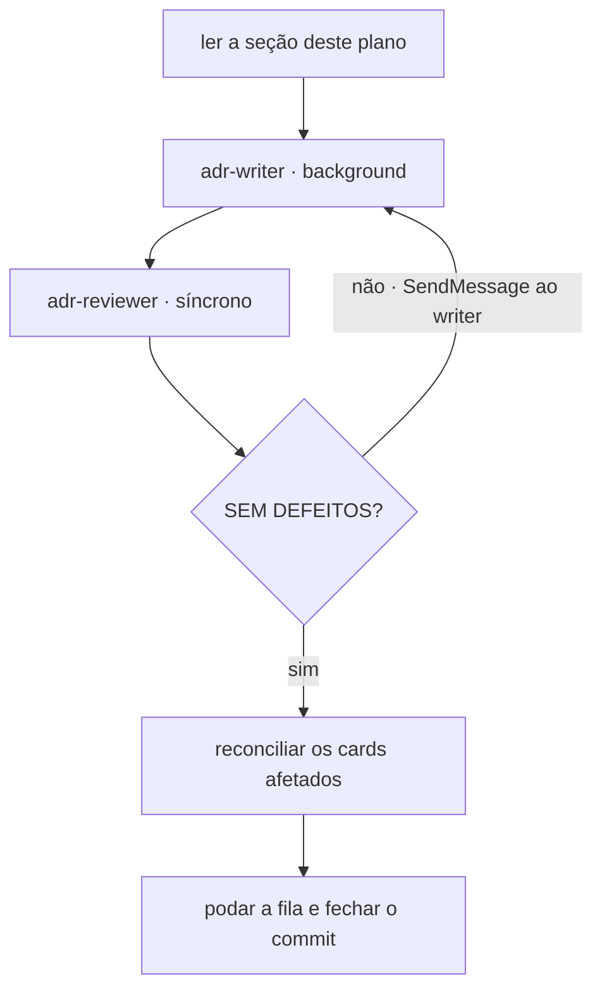

# Plano de escrita dos ADRs do Lote E

**Este documento tem prazo de validade.** Ele existe porque vinte e nove decisões do
Lote E fecharam entre 2026-08-05 e 2026-08-06 sem que nenhum artefato nascesse, e porque
o contexto da sessão é limpo **entre um ADR e o seguinte**, por escolha da pessoa. Cada
seção abaixo carrega tudo o que a sequência seguinte precisa saber — **conteúdo, e não
ponteiro**, porque as linhas de origem na fila são removidas assim que o ADR nasce.

Quando os seis existirem e os cards estiverem reconciliados, **apague este arquivo**.

## As três regras que governam cada sequência

**A escrita roda em sub-agente.** A sessão principal não redige ADR. O par é
[`adr-writer`](../../.claude/agents/adr-writer.md), em background, e
[`adr-reviewer`](../../.claude/agents/adr-reviewer.md), síncrono e sem `Write`. No
máximo três rodadas de correção; na terceira sem convergir, relate à pessoa.

**`docs/features/` é fonte de verdade, junto dos ADRs.** Decidido em 2026-08-06. Um ADR
que nasce sem o card correspondente reconciliado deixa o repositório afirmando duas
coisas contraditórias — e a regra `B-4` já proíbe card que contradiga ADR aceito. Por
isso **cada sequência entrega ADR e card no mesmo commit**.

**A linha da fila é removida quando o ADR nasce.** Decidido em 2026-08-06, contra a
recomendação de deixar lápide. A verificação que sustentou a escolha: nenhuma citação
externa aponta para as seções de rodada do Lote E — as âncoras citadas de fora são todas
de seções anteriores (`#o-nível-de-isolamento`, `#a-anomalia-por-frequência`,
`#as-decisões-derivadas-do-plano`, `#como-citar-uma-linha-desta-fila` e
`#a-ordem-da-arquitetura-mínima-e-da-entrega-contínua-está-sob-tensão`). **Citações
internas entre rodadas existem e precisam ser removidas junto.**



## Estado

| Nº     | Título                                                     | Estado     |
|--------|------------------------------------------------------------|------------|
| `0010` | A fronteira de schema e o CDC como fonte do veredito       | a escrever |
| `0011` | Os quatro serviços e o caderno de laboratório fora do Git  | a escrever |
| `0012` | O transporte do veredito: broker, conector e filtro        | a escrever |
| `0013` | O alcance das regras estruturais pelo papel do valor       | a escrever |
| `0014` | A identidade derivada da semente e quem a produz           | a escrever |
| `0015` | A chave, o discriminador de execução e as colunas de tempo | a escrever |

A ordem não é arbitrária. `0010` é premissa de `0012` e de `0015`; `0013` é premissa de
`0014`. Os dois primeiros são obrigatórios pela regra `B-4`, porque contradizem ADR
aceito.

**Fora dos seis, e por quê.** `E-16` escolheu o nome `lab-journal` — nome de serviço não
atende a nenhum dos quatro critérios. `E-32` decidiu a forma de um teste, e o artefato
dela é o próprio teste. A entrega (`E-1` a `E-7`, `E-21`, `E-31`) fica de fora enquanto
`E-3` e `E-31` estiverem abertas: um ADR escrito hoje registraria metade da decisão.

---

## ADR-0010 — A fronteira de schema e o CDC como fonte do veredito

**Linhas de origem:** `E-18`, `E-19`.
**Ele contradiz o [ADR-0002](0002-o-dominio-minimo-e-os-dois-oraculos.md) e o
[ADR-0008](0008-os-dois-planos-em-processos-separados.md), e os dois recebem `Alterado
por` no mesmo commit.**

### A decisão

Um schema por serviço, e **um serviço jamais acessa o schema de outro**. O oráculo lê o
WAL do sistema medido por replicação lógica; não existe `SELECT` cruzado. As observações
de passo atravessam para o `lab-journal` **ao vivo**, evento por evento.

### Por que ela contradiz dois ADRs aceitos

O ADR-0008 declara, no diagrama da seção `## Decisão`, a aresta `SELECT após a
quiescência` indo do Lab Plane direto ao PostgreSQL do sistema medido. O ADR-0002 define
o oráculo exato como `perdidas = commits − (value_final − value_inicial)`, com
`value_final` lido de `resource` depois que todos os workers terminaram. **A regra de
schema proíbe essa leitura.**

O que destrava a saída: **uma conexão de replicação lógica consome o WAL, e não faz
`SELECT` em tabela alheia.** Pela letra da regra, o CDC não a viola. Isso torna o CDC a
única saída tecnicamente compatível sem exceção nenhuma.

### As alternativas descartadas, com o motivo de cada uma

| Alternativa                       | Por que foi descartada                                |
|-----------------------------------|-------------------------------------------------------|
| manter o `SELECT` cruzado         | exceção explícita à regra, logo no primeiro serviço   |
| chamada HTTP ao sistema medido    | o instrumento passa a depender do medido para medi-lo |
| `GRANT` de leitura ao `lab_plane` | é o `SELECT` cruzado com outro nome                   |

A segunda é a que merece parágrafo próprio no ADR: um defeito na leitura do
`system-under-test` — filtro errado, cache, transação aberta — apareceria como resultado
de consistência. É precisamente a confusão entre os dois planos que o ADR-0008 existe
para impedir. Some-se que um `WHERE` que esqueça o discriminador de execução corrompe o
veredito **sem sintoma**.

### O que a decisão desmonta, e precisa aparecer em `## Consequências`

**A detecção cruzada acaba.** A questão `O19` fechou em 2026-08-05 decidindo que o
oráculo aguarda o CDC alcançar o LSN do commit final antes de comparar, com limite
declarado por execução, e que o estouro recebe rótulo próprio, distinto de `fontes
divergentes`. Essa guarda sobrevive. O que não sobrevive é o rótulo `fontes divergentes`
para o veredito: **com o CDC como fonte única, não há segunda leitura independente com
que comparar.** O consolidado publicado pelo sistema medido continua servindo de
conferência, mas não é independente do código medido.

**`O20` deixa de ser objeção e vira bloqueio.** O `value_inicial` não tem fonte: o
ADR-0002 o exige lido antes de o primeiro worker começar, e o CDC reporta mudanças, não
estado. Enquanto o `SELECT` existia, a lacuna tinha remédio óbvio. As duas saídas
nomeadas continuam sem escolha — o CDC roda com snapshot inicial, ou o estado inicial vem
de outro lugar. **Isto é `Pergunta em aberto` no ADR, nunca fato.**

**O oráculo de capacidade fica sem fonte declarada.** O ADR-0002 tem dois oráculos, e
eles não são iguais aqui. O exato usa `value_final`, que é o último valor de
`resource.value` no stream — leitura direta, sem reconstrução. O de capacidade calcula
`Σ amount ≤ capacity`, e somar eventos de `INSERT` é derivar estado final de um stream,
que o ADR-0002 proíbe. **O E5 depende do segundo, e nada lhe deu fonte.** Se a proibição
do ADR-0002 alcança também o primeiro não está escrito em lugar nenhum, e a distinção
nunca foi feita — `Pergunta em aberto`.

**O CDC vira infraestrutura do dia zero.** Conector, `wal_level = logical` e replication
slot deixam de ser da etapa 5 e entram no primeiro `compose.yaml` e no primeiro
`deploy/`.

**A latência entra na janela medida, por `E-19`.** O ADR-0008 já registra como
consequência negativa que a latência de rede entra na medida de todo experimento, e o E1
emite entre 900 e 1500 observações por execução. A emissão ao vivo acrescenta essas
travessias dentro da janela. **A saída existe e não foi escolhida:** emissão não
bloqueante, com buffer local e remetente próprio, ao custo de perder o buffer quando o
`lab-plane` cai — e a etapa 6 mata o processo de propósito. `Pergunta em aberto`.

### Evidência conferida

- A aresta `SELECT após a quiescência` está no diagrama da seção `## Decisão` do
  [ADR-0008](0008-os-dois-planos-em-processos-separados.md).
- O papel anterior do CDC — "confere, não decide" — está em
  [`decisoes-pendentes.md`](arquivo/proposta-2026-08-03/decisoes-pendentes.md), seção
  "Decidido em 2026-08-05: o CDC entra, com `wal_level = logical` permanente". A tabela
  das três fontes daquela seção dá ao `SELECT` "serve de veredito: sim" e ao CDC "não;
  serve de conferência". **Este ADR reverte essa parte**, e o documento é arquivado e
  append-only: a reversão é registrada aqui, nunca lá.
- `ALTER ROLE lab_plane REPLICATION` e a ausência de `GRANT` cruzado estão em
  [`local/postgres-init.sql`](../../local/postgres-init.sql).
- `wal_level=logical` está no [`compose.yaml`](../../compose.yaml).

### Cards a reconciliar, no mesmo commit

**Os três contradizem a decisão hoje.** Nenhum pode continuar afirmando `SELECT`.

- [`deteccao-de-atualizacao-perdida/feature-card.md`](../features/deteccao-de-atualizacao-perdida/feature-card.md)
  — afirma que o oráculo emite um `SELECT` do Lab Plane depois da quiescência.
- [`deteccao-de-protecao-inerte/feature-card.md`](../features/deteccao-de-protecao-inerte/feature-card.md)
  — a regra `R3` afirma `SELECT sum` emitido pelo Lab Plane.
- [`execucao-de-experimento/feature-card.md`](../features/execucao-de-experimento/feature-card.md)
  — afirma que o oráculo lê o banco depois da quiescência.

**Há um caso mais delicado no Example Mapping.** O
`features/deteccao-de-atualizacao-perdida/example-mapping.md` registra, na seção do que
foi adiado de propósito, que derivar `value_final` do log em vez do `SELECT` mediria o
instrumento em vez do sistema medido. **Este ADR faz exatamente o que aquele parágrafo
adiou.** O parágrafo não é apagado: ele recebe o gatilho que o retomou, porque a seção
existe para registrar que a escolha foi consciente.

**O card de proteção inerte tem um problema sem solução neste ADR.** A regra R3 dele
depende do oráculo de capacidade, que ficou sem fonte. A regra passa a `pendente` com a
lacuna nomeada; ela **não** é reescrita para o CDC, porque ninguém decidiu que ela pode.

---

## ADR-0011 — Os quatro serviços e o caderno de laboratório fora do Git

**Linhas de origem:** `E-14`, `E-15`, `E-16`, `E-17`, `E-20`.
**Ele emenda o [ADR-0008](0008-os-dois-planos-em-processos-separados.md).**

### A decisão

Quatro serviços no dia zero: `lab-plane`, `lab-journal`, `system-under-test` e o
`frontend`. O `lab-plane` tem base própria desde o dia zero. O histórico de execução vive
num serviço próprio, o `lab-journal`, com pacote `dev.da0hn.lab.journal`. **A definição
de experimento e o resultado vivem no banco do `lab-journal`, e não no Git.** Sem BFF: o
frontend manda comando ao `lab-plane` e lê histórico e streaming do `lab-journal`.

### Por que emenda o ADR-0008

Aquele ADR fala em **dois** planos em dois processos. A topologia real tem quatro
serviços, e a fronteira que ele descreve continua valendo — mas o número não.

### As alternativas descartadas

| Alternativa                              | Por que foi descartada                         |
|------------------------------------------|------------------------------------------------|
| `experiments/` versionado no Git         | o Experiment Designer venceu o arquivo em diff |
| histórico dentro do `lab-plane`          | o instrumento que mede guardaria o que mediu   |
| um BFF entre frontend e os dois serviços | nenhum serviço novo se justificou              |
| `audit` ou `ledger` como nome            | conotação de conformidade e contábil           |

`E-20` fecha sem custo novo: é CQRS que a topologia já impunha, e o recurso de exposição
roteia dois caminhos.

### O custo, nomeado e aceito

O [`AGENTS.md`](../../AGENTS.md) afirmava que `experiments/` e `docs/experiments/` entram
no Git e que "juntos, o histórico vira um caderno de laboratório". **A frase inteira
deixou de valer.** Um resultado deixa de aparecer em diff, de ser revisado em PR e de
sobreviver a um banco recriado. O `lab-journal` passa a ser o **único** guardião do
histórico, e a durabilidade dele deixa de ser conveniência e vira requisito.

Três linhas fecharam junto por subsunção: `D-DAT-10` (o que do log entra no Git) fecha
com **nada**; `D-UI-13` (como o relatório chega a `docs/experiments/`) fecha por não
haver destino; e a pasta deixa de ser criada.

### Evidência conferida

Os quatro módulos existem na árvore, com `scanBasePackages` declarado por executável em
`dev.da0hn.lab.application.labplane`, `.journal` e `.sut`. O `frontend/` tem `Dockerfile`
e nginx próprios. Os dois caminhos de `E-20` estão no `nginx.conf` e no proxy do Vite.

### Cards a reconciliar

`features/execucao-de-experimento/` é o card do ciclo de vida da execução, e é onde a
definição declarada pelo frontend aparece. Confira se ele ainda supõe arquivo versionado.

---

## ADR-0012 — O transporte do veredito: broker, conector e filtro

**Linhas de origem:** `E-12`, `E-28`, `E-29`, `E-33`. **Depende do ADR-0010.**

### A decisão

O conector de CDC publica num broker, e o `lab-plane` consome de lá. O conector é o
**Debezium Server, em processo próprio**, sobre o plugin `pgoutput`. A instância de
broker é **a mesma** que os experimentos sabotam, e o custo foi aceito. O filtro por
execução acontece **no consumidor**, que conta o que descarta. Um evento descartado
invalida a execução **quando o discriminador dele pertence a uma execução ainda ativa**.

### O argumento que sustenta tudo: o LSN

A objeção registrada era que um instrumento transportando o veredito por broker sofre os
fenômenos que mede — duplicata, perda e reordenação viram contagem errada, e ninguém
distingue o achado do artefato. **Ela não vale para evento de CDC.**

Uma mensagem de negócio não tem identidade natural nem ordem total. Um evento de CDC tem
as duas de graça: o LSN é único, monotônico, e atribuído pelo servidor **antes de
qualquer transporte existir**.

| Fenômeno    | O que o LSN permite                                   |
|-------------|-------------------------------------------------------|
| duplicata   | descartar o evento já visto, por LSN                  |
| reordenação | ordenar por LSN antes de calcular                     |
| perda       | detectar o buraco na sequência e invalidar o veredito |

A terceira é a que mais importa: ela converte falha silenciosa em ruidosa. Sem o LSN, uma
mensagem perdida vira uma perda contabilizada a mais e o experimento reporta um número
errado com cara de certo. **Com ele, o instrumento sabe que não sabe.**

### Por que o conector fica em processo próprio

A recomendação era o Debezium Embedded, e ela estava errada. Embarcá-lo poria a
credencial de `REPLICATION` sobre o banco do sistema medido **dentro do mesmo processo
que produz o veredito** — a regra do ADR-0010, um nível abaixo. Separado, essa credencial
vive num terceiro processo cuja única função é traduzir log em mensagem.

O Debezium clássico sobre Kafka Connect foi descartado por trazer um sistema inteiro que
ninguém decidiu. O `wal2json` foi descartado porque é extensão, e instalá-la significa
tocar o PostgreSQL compartilhado do homelab, que serve terceiros; o `pgoutput` é embutido
desde a versão 10 e não pede nada ao servidor.

### O que fica como custo e como consequência negativa

**A regra de tecnologia foi dispensada, não satisfeita.** O `AGENTS.md` diz que uma
tecnologia entra quando um experimento não puder ser executado sem ela. O broker entrou
por decisão explícita de estudo, antecipando a etapa 5. **Uma dispensa registrada não é
precedente.**

**O broker precisa estar de pé para existir veredito.** Um modo de falha a mais no
instrumento.

**Uma cadeia causal nova nasce da instância única, e ela não existia antes.** Se um
experimento do grupo B encher o broker, o Debezium Server para de publicar; se ele para,
o replication slot para de avançar; se o slot não avança, o PostgreSQL retém WAL — no
banco compartilhado do homelab. **Um experimento de fila cheia passa a poder encher o
disco de um banco que serve terceiros.** A mitigação (`max_slot_wal_keep_size`) é
parâmetro de cluster e continua sem decisão.

**Um gatilho de reabertura, escrito:** um experimento da etapa 5 que sabote o broker vai
invalidar o próprio veredito **toda vez**, e não em alguns casos. Quando a etapa 5
chegar, a decisão da instância única reabre.

**A regra do descarte impõe topologia.** Distinguir backlog de execução concluída
(higiene) de evento de execução ativa (invalidação) exige saber quais discriminadores
estão ativos — o que só funciona com **uma réplica** do `lab-plane`. Com duas, cada uma vê
backlog da outra e nenhuma distingue. A réplica única deixa de ser preferência e vira
condição para o veredito ser confiável.

### Perguntas em aberto que o ADR carrega

- **O LSN sobrevive ao envelope e ao sink?** O envelope do Debezium para PostgreSQL
  carrega `source.lsn`, e a transformação `ExtractNewRecordState` — o *unwrap* — descarta
  o bloco `source` inteiro. Existe `add.fields` para reinserir. Enquanto o teste de
  aceitação não existir, isto é promessa de terceiro. O teste foi decidido: três
  contêineres, comparando com `pg_current_wal_lsn()` do momento da escrita.
- **Qual dos dois sinks de RabbitMQ.** `rabbitmq` sobre AMQP 0-9-1 contra `rabbitmqstream`
  sobre o protocolo de stream. A escolha amarra qual fenômeno de saturação o grupo B
  consegue reproduzir, porque uma queue que enche não é um stream com retenção.
- **Onde o `lab-plane` guarda quais execuções estão ativas.** Em memória some num
  reinício; numa tabela sobrevive, e cria a primeira tabela daquele schema.
- **Onde vive a configuração do Debezium Server**, e como ela chega ao cluster. Rodar no
  cluster exige mudar o `homelab-infrastructure`, e não só este repositório.

---

## ADR-0013 — O alcance das regras estruturais pelo papel do valor

**Linha de origem:** `E-13`. Independente dos demais. **O `AGENTS.md` já foi alterado por
esta decisão** — o ADR registra o porquê, que hoje não está em lugar nenhum.

### A decisão

As regras de aleatoriedade semeada e de relógio injetável alcançam **pelo papel do valor,
e não pelo plano que o produz**. Elas valem sobre todo valor que entra em **veredito**, em
**escalonamento** ou em **identidade derivada da semente** — no sistema medido ou no Lab
Plane, indiferentemente.

### A alternativa descartada, e por que ela é um defeito

Qualificar a regra por plano — "vale no sistema medido, não no instrumento" —
**liberaria o escalonador**. Um `Math.random()` no escalonador quebra a reprodutibilidade
tão completamente quanto um no domínio, e o escalonador é do Lab Plane. Uma regra
qualificada por plano deixaria de alcançá-lo, que é exatamente onde ela mais importa.

### O que a formulação por papel deixa de fora, de propósito

**O discriminador de execução não entra em nenhum dos três papéis.** Ele é rótulo de
partição: duas execuções idênticas com discriminadores diferentes produzem o mesmo
veredito e a mesma intercalação. Por isso um UUIDv7 gerado fora da semente não o viola.

### A primeira aplicação concreta

Se a curva de saturação for construída sobre o instante de início e de conclusão da
execução, esses valores entram no papel de **veredito**, e o relógio que os produz passa a
ter de ser o adaptador injetável — mesmo sendo o instrumento a produzi-los.

### A lacuna que o ADR precisa nomear

As três regras estruturais continuam **texto, e não guarda executável**. Está registrado
em [`Q-0002-1`](../questions/Q-0002-1.md), e a guarda pertence à decisão de arquitetura
mínima. `Pergunta em aberto`.

---

## ADR-0014 — A identidade derivada da semente e quem a produz

**Linhas de origem:** `E-8`, `E-11`, `E-24`. **Depende do ADR-0013.**

### A decisão

A identidade do recurso é `bigint`, derivada da semente por ordinal. Quem a deriva é um
**componente de identidade próprio**, com contrato — e não a definição do experimento nem
o domínio. Ele é serviço próprio, atrás de chamada de rede.

### A objeção que foi levantada, e como ela se dissolveu

A objeção era a chamada de rede **dentro da janela medida**, num laboratório cujo objeto
de estudo é justamente latência e ordem. Ela some se a derivação acontecer na **fase de
preparação**, antes de a janela medida abrir — e nenhum dos quatro experimentos
especificados hoje pede identidade nova durante os passos. **Se algum pedir, a decisão
reabre.** Isso é gatilho de reabertura, e vai escrito.

### Alternativas descartadas

| Alternativa                           | Por que foi descartada                        |
|---------------------------------------|-----------------------------------------------|
| a definição publica, o domínio deriva | espalha a regra por dois lugares              |
| `uuid` como identidade do recurso     | não tem ordinal legível a partir da semente   |
| derivar dentro do sistema medido      | o instrumento já publica identidade no medido |

---

## ADR-0015 — A chave, o discriminador de execução e as colunas de tempo

**Linhas de origem:** `E-9`, `E-10`, `E-22`, `E-23`, `E-25`, `E-26`, `E-27`.
**Depende do ADR-0010 e do ADR-0014.**

### A decisão

Chave primária composta `(execution_id, id)`. **Sem chave estrangeira** em
`allocation.resource_id`, com verificação de órfãs em lugar dela. Índice
`(execution_id, resource_id)`, com o plano efetivo registrado. O discriminador tem **nomes
assimétricos, um por lado da fronteira**. As tabelas medidas ganham `created_at` e
`updated_at`, `timestamptz NOT NULL`, **sem `DEFAULT` e sem trigger** — o valor vem da
aplicação, pelo adaptador de relógio.

### O DDL que a decisão produz

```sql
CREATE TABLE resource (
    partition_id uuid        NOT NULL,
    id           bigint      NOT NULL,
    value        bigint      NOT NULL,
    capacity     bigint      NOT NULL,
    created_at   timestamptz NOT NULL,
    updated_at   timestamptz NOT NULL,
    CONSTRAINT resource_pk PRIMARY KEY (partition_id, id)
);
```

`allocation` repete a forma, com `resource_id bigint NOT NULL` apontando para
`resource.id` **sem foreign key**, e o join se faz em duas colunas:
`a.partition_id = r.partition_id AND a.resource_id = r.id`.

### Os argumentos que precisam sobreviver ao ADR

**A ausência de `DEFAULT` é deliberada e tem custo.** Uma escrita que esqueça a coluna
falha por `NOT NULL` em vez de gravar um valor plausível vindo do relógio errado — e um
instante plausível e errado é indetectável até um experimento de clock skew produzir um
resultado inexplicável meses depois. Vale acrescentar que `DEFAULT` **não age em
`UPDATE`** de qualquer forma: a cláusula só preenche coluna ausente num `INSERT`.

**A chave estrangeira teria de ser composta**, porque a chave primária é. Sem ela, órfãs
passam a ser verificadas — e **onde essa verificação vive continua em aberto**, porque o
lugar recomendado deixou de existir com a fronteira de schema do ADR-0010.

**A objeção pedagógica às colunas de tempo virou regra escrita.** Uma coluna de última
alteração é um token de versão sem a palavra, e comparar essa coluna num `UPDATE`
condicional é optimistic locking pronto. A regra pedagógica manda introduzir o problema
antes da solução, e é por ela que `version` não está no esquema. Não há desenho que impeça
o mau uso, então o que sobra é regra: **nenhuma estratégia de concorrência lê
`updated_at`**, e a estratégia otimista introduz a própria coluna de versão quando for
definida. **É regra sem guarda executável, e mais fácil de violar sem perceber que as
outras, porque a coluna estará lá e o código que a lê parecerá inocente.**

**Uma tensão fica registrada.** O grupo E estuda clock skew, e o insumo natural de um
experimento assim é justamente uma coluna de tempo escrita pela aplicação. Se um
experimento do grupo E vier a ler `updated_at`, a regra acima entra sob pressão.
`Pergunta em aberto`.

### Cards a reconciliar

Nenhum card afirma DDL hoje — os três dizem explicitamente "não existe DDL nem contrato
de esquema", com `Q-INT-5` citada. **Confira se essa afirmação ainda é verdadeira** depois
que este ADR nascer, e atualize a pergunta se não for.
