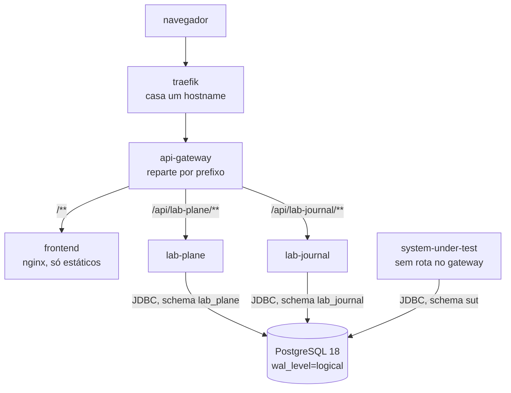

# Arquitetura

Esta pasta descreve o que o repositório constrói: os processos que ele sobe, o papel de
cada um e as restrições que valem sobre todos. Cada afirmação foi conferida na árvore
versionada — `pom.xml`, `compose.yaml`, `Dockerfile`, `frontend/package.json`, os
`application.yml` de cada serviço, as migrações Flyway e `local/`. Onde este texto
contradisser a árvore, a árvore está certa.

## O que a aplicação é

O laboratório reproduz, observa e compara fenômenos de consistência em sistemas
distribuídos. Ele não atende a um caso de negócio, e o software que ele contém não
existe para entregar valor a um usuário final: ele existe para criar uma condição
controlada, medir o que acontece dentro dela e explicar o resultado.

Um experimento submete um sistema comum — um serviço HTTP com um banco relacional atrás
— a concorrência, a falha e a atraso. O laboratório observa o efeito e emite um veredito
sobre a execução. A pergunta que ele responde não é "o pedido funcionou", e sim "o
estado final é o que a operação prometia". A ordem pedagógica é a do `README.md` da
raiz: primeiro o problema observável, depois a causa, e só então a solução.

A configuração versionada fixa de onde vem o número que sustenta o veredito. O
`compose.yaml` sobe o PostgreSQL com `wal_level=logical`, `max_replication_slots` e
`max_wal_senders`, e o `local/postgres-init.sql` cria um papel com o atributo
`REPLICATION` que não pertence a serviço nenhum. A leitura do estado medido vem do WAL,
por replicação lógica, e nunca de um `SELECT` no schema do sistema medido.

**Hoje o repositório é um esqueleto executável.** Os cinco processos da aplicação sobem,
três deles criam o próprio schema pelo Flyway, e nenhum fenômeno é reproduzido.

## Os serviços, e o papel de cada um

### Os módulos do reactor Maven

Declarados em `pom.xml`, sobre Spring Boot 4.1.0 e Java 25:

| Módulo              | Papel                                  | Vira imagem |
|---------------------|----------------------------------------|-------------|
| `shared`            | biblioteca comum, sem ponto de entrada | não         |
| `api-gateway`       | a entrada única de HTTP                | sim         |
| `lab-plane`         | o instrumento que comanda e mede       | sim         |
| `lab-journal`       | o caderno de laboratório               | sim         |
| `system-under-test` | o sistema medido                       | sim         |

O `shared` é o único módulo sem `spring-boot-maven-plugin`, e o único ausente da matriz
de imagens de `.github/workflows/build.yml`. Ele é compilado dentro dos outros, e o
`Dockerfile` o instala antes de qualquer executável.

### Os processos que o `compose.yaml` sobe

| Processo            | Imagem               | Porta interna | Porta publicada          |
|---------------------|----------------------|---------------|--------------------------|
| `traefik`           | `traefik:v3.3`       | 80            | `${LAB_PORT:-8000}`      |
| `api-gateway`       | construída aqui      | 8000          | `${GATEWAY_PORT:-8001}`  |
| `frontend`          | construída aqui      | 80            | nenhuma                  |
| `lab-plane`         | construída aqui      | 8080          | 8080                     |
| `lab-journal`       | construída aqui      | 8081          | 8081                     |
| `system-under-test` | construída aqui      | 8082          | 8082                     |
| `postgres`          | `postgres:18-alpine` | 5432          | `${POSTGRES_PORT:-5432}` |

- **`traefik`** é o proxy de borda, e a entrada única da stack local. Ele casa um
  hostname e entrega tudo ao gateway. Existe para que o caminho local tenha a mesma
  forma do caminho no cluster — dois saltos até o serviço, com `X-Forwarded-*` no meio.
- **`api-gateway`** é um Spring Cloud Gateway sobre WebFlux. Ele reparte por prefixo de
  caminho e não remove prefixo nenhum.
- **`frontend`** é uma interface React 19 construída com Vite e servida por nginx. Ele
  não publica porta: é alcançado pelo gateway, como o resto.
- **`lab-plane`** é o instrumento que comanda a execução. Ele tem schema próprio, e a
  migração `V1` dele cria apenas o schema.
- **`lab-journal`** é o caderno de laboratório: a definição e o resultado de cada
  experimento vivem no banco dele, e não no Git. A `V1` dele também cria só o schema.
- **`system-under-test`** é o sistema medido. O pool Hikari sobe com 32 conexões por
  default, alto o bastante para não serializar dois workers.
- **`postgres`** é a instância local e efêmera, com o banco `lab`. Ela reproduz na
  máquina de quem desenvolve o banco compartilhado do homelab, e nunca é entregue.

### O que ainda não existe

- **Nenhuma tabela de domínio.** As três migrações `V1` criam apenas o schema.
- **Nenhum endpoint.** Os quatro módulos Java contêm só a classe de aplicação.
- **Nenhum consumidor do WAL.** O `wal_level=logical` e o papel `cdc_connector` estão
  provisionados, e nenhum processo os usa.
- **Nenhum broker, conector de CDC ou serviço de identidade** aparece no `compose.yaml`.
- **Nenhuma tela.** `frontend/src/App.tsx` renderiza um título e um parágrafo.

### A topologia de hoje

Nenhuma seta liga um serviço da aplicação a outro. O `lab-plane` não chama o
`system-under-test`, e nada alimenta o `lab-journal`.

## A separação fundamental: o sistema medido e o instrumento

**O `system-under-test` é o sistema medido. O `lab-plane` e o `lab-journal` são o
instrumento.** A divisão não é organizacional: ela existe para que uma falha do
instrumento não possa ser lida como um resultado de consistência sobre o sistema medido.

Um instrumento que participa da medição contamina a medida de um jeito que não aparece.
Se o processo que julga também escrevesse no schema medido, ou consultasse esse schema
depois do fato, o número do veredito passaria a depender do próprio instrumento — e o
relatório continuaria saindo, com o mesmo formato, sem erro nenhum no log. É o pior
modo de falha possível num laboratório: o resultado errado com a aparência do certo.

Por isso o sistema medido não conhece o instrumento, não é alcançável pela borda e não
compartilha schema com ninguém. A fronteira é sustentada por configuração, e não por
convenção: papéis separados no banco, ausência de rota no gateway, ausência de
dependência no `pom.xml` e o WAL como origem do número.

## As restrições arquiteturais

Cada uma tem página própria, com o que a árvore mostra e o que quebraria em silêncio se
ela fosse violada.

- [O sistema medido não conhece o instrumento](restricoes/o-sistema-medido-nao-conhece-o-instrumento.md)
  — sem dependência, sem rota na borda, sem prefixo público.
- [Cada serviço tem o próprio schema](restricoes/cada-servico-tem-o-proprio-schema.md)
  — um papel e um schema por serviço, e nenhum `SELECT` no schema do vizinho.
- [Quem lê o WAL não é quem produz o veredito](restricoes/quem-le-o-wal-nao-produz-o-veredito.md)
  — o atributo `REPLICATION` fica num papel que serviço nenhum usa.
- [O mapa de caminhos vive num lugar só](restricoes/o-mapa-de-caminhos-vive-num-lugar-so.md)
  — o gateway roteia, e nenhum filtro remove prefixo.
- [Os cabeçalhos de proxy só são confiáveis nas faixas privadas](restricoes/os-cabecalhos-de-proxy-e-as-faixas-privadas.md)
  — `trusted-proxies` e `forward-headers-strategy` trabalham em par.
- [O Actuator não fica na porta de tráfego](restricoes/o-actuator-fora-da-porta-de-trafego.md)
  — porta de gestão própria, que o gateway não roteia.
- [Contrato é o que atravessa uma fronteira de processo](restricoes/o-que-e-contrato.md)
  — DDL, tabela e rota de proxy não são contrato.

**Seis regras de código valem sobre tudo daqui, e esta pasta não as repete.**
Aleatoriedade semeada, relógio injetável, ausência de sincronização de JVM no sistema
medido, uma conexão por worker, tecnologia que só entra quando um experimento a exigir e
o caderno de laboratório fora do Git vivem na seção `Regras estruturais que valem
sempre` do [`AGENTS.md`](../../AGENTS.md) da raiz. Duplicá-las aqui criaria duas cópias
livres para divergir. As restrições de entrega — a tag da imagem, a ausência de Secret e
a ausência de `deploy/` — vivem na seção `Este repositório é entregue no homelab` do
mesmo arquivo.

## O resto desta pasta

A forma dos schemas do sistema medido e do instrumento vive em
[`schemas/`](schemas/README.md). Nenhuma migração cria aquelas tabelas hoje.
