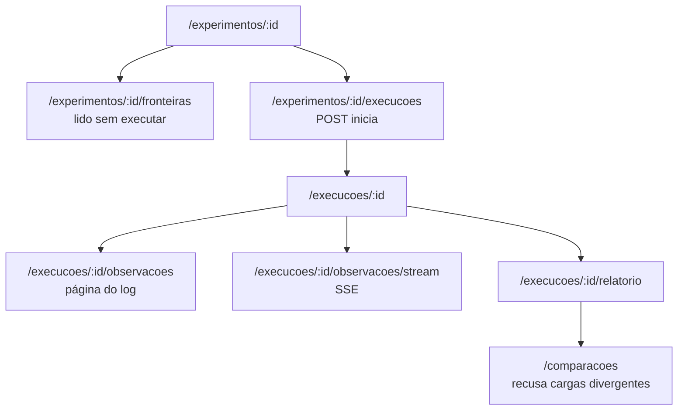
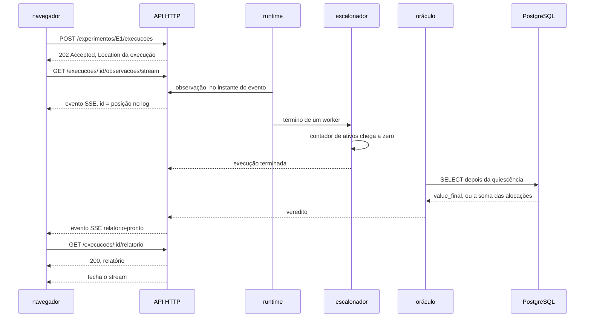

# Contratos de API

- **Estado:** Proposta — requer aprovação humana
- **Data:** 2026-08-03
- **Escopo:** o modelo de recursos HTTP entre a interface web e o Lab Plane, o formato
  do relatório, o mecanismo de streaming das observações, e a resposta proposta para
  `Q-INT-1` e `Q-INT-2`.
- **Depende de:** [`ADR-0001`](../adr/0001-o-passo-como-unidade-de-execucao.md),
  [`ADR-0002`](../adr/0002-o-dominio-minimo-e-os-dois-oraculos.md),
  [`ADR-0003`](../adr/0003-a-linguagem-do-agendamento.md),
  [`ADR-0004`](../adr/0004-o-estatuto-da-barreira-e-o-diagnostico-da-nao-ocorrencia.md),
  [`ADR-0005`](../adr/0005-a-forma-do-escalonador.md),
  [`ADR-0006`](../adr/0006-a-forma-da-estrategia-de-concorrencia.md) e
  [`ADR-0007`](../adr/0007-o-log-de-observacoes-forma-ordem-e-onde-vive.md), todos
  `Aceito`.

## O que este documento é, e o que ele não cria

**Nenhum contrato existe, e este documento não cria nenhum.** O gatilho do OpenAPI é a
primeira rota HTTP escrita, e o do JSON Schema do relatório é o primeiro relatório
emitido ([`../contracts/README.md`](../contracts/README.md):11-16). Nenhuma das duas
coisas aconteceu.

Os dois esboços abaixo vivem em blocos cercados dentro deste Markdown, e são **esboço**.
`contracts/openapi/` continua não existindo: um diretório vazio afirma que existem APIs
a documentar, e o repositório já pagou por esse erro uma vez
([`../contracts/README.md`](../contracts/README.md):18-23).

Quando o contrato nascer, ele carrega operações, autenticação, payloads, respostas,
erros, paginação, idempotência e política de compatibilidade, e **este Markdown deixa de
repetir** o que estiver formalizado lá ([`../AGENTS.md`](../AGENTS.md):120).

O inventário de telas que consome estes recursos está em
[`interface-web.md`](interface-web.md).

## O modelo de recursos

### Três substantivos, e nada além deles

O contrato usa os termos que os ADRs aceitos já fixaram, sem inventar um quarto.

| Recurso     | O que é                                                                                         | Onde o termo foi fixado  |
|-------------|-------------------------------------------------------------------------------------------------|--------------------------|
| experimento | a definição: operação, papéis disponíveis, janela de exposição, resolução                       | `adr/0003-...md:155-167` |
| execução    | uma das quatro que um experimento tem: calibração, controle negativo, medida, controle positivo | `adr/0003-...md:155-157` |
| observação  | um evento do log, com tentativa, worker, endereço de fronteira, tipo, instante e fatos          | `adr/0007-...md:58-65`   |

O relatório não é um quarto substantivo: ele é a representação do veredito de uma
execução, e vive sob ela.



**`/experimentos/{id}/fronteiras` não é conveniência.** O ADR-0001 descartou ganchos
inline no código do sistema sob teste porque "o Experiment Designer da UI não consegue
oferecer os pontos de barreira" quando eles só existem em execução
(`../adr/0001-o-passo-como-unidade-de-execucao.md:582-587`). Este recurso é a
materialização daquela recusa: a lista de endereços endereçáveis, antes da primeira
execução.

### Os nomes do contrato são os do glossário

Proposta: rotas, campos e valores em português, com a grafia exata do glossário do
repositório — `tentativa`, `fronteira`, `worker`, `execução`, `veredito`, `restrito`,
`calibração`, `coincidência`. Um contrato em inglês criaria um segundo nome para cada
conceito, e a convenção do repositório é um conceito, um nome. A escolha está em
[D-UI-11](#d-ui-11--o-vocabulário-do-contrato).

A palavra `tipo` aparece em três escopos já fixados: tipo de passo
(`../adr/0001-...md:111-113`), tipo de evento do log (`../adr/0007-...md:60`) e, nesta
proposta, tipo de execução. Os três estão desambiguados pelo objeto que os carrega, e a
alternativa seria cunhar um termo novo — o que exige aprovação.

## Uma execução completa, vista da interface



Três instantes do diagrama vêm de decisão aceita, e nenhum deles é escolha desta
proposta.

**O fim da execução é declarado pelo escalonador**, quando o contador de workers ativos
chega a zero; é esse sinal que o oráculo aguarda
(`../adr/0005-a-forma-do-escalonador.md:79-82`).

**O oráculo lê o PostgreSQL**, e não o log de observações
(`../adr/0002-o-dominio-minimo-e-os-dois-oraculos.md:216-219`). O contrato não expõe
rota alguma que produza veredito a partir do stream.

**O relatório só existe depois da quiescência.** Uma requisição ao relatório antes disso
responde `409`, e não um relatório parcial: um veredito calculado sobre estado
intermediário reporta perda que ainda seria escrita
(`../questions/Q-0002-2.md`).

## Esboço de OpenAPI

**Isto é um esboço.** Ele não valida contra nenhuma implementação, e nenhum arquivo
`.yaml` foi criado.

```yaml
# ESBOÇO — não é contrato publicado. Ver docs/contracts/README.md:11-23.
openapi: 3.1.0
info:
  title: Lab Plane — laboratório de consistência distribuída
  version: 1.0.0-esboco
  description: >
    Fronteira entre a interface web e o Lab Plane. Proposta de resposta a Q-INT-1.
    Nenhuma autenticação está declarada: ver D-UI-07 em interface-web.md.
servers:
  - url: /api/v1

paths:
  /experimentos:
    get:
      summary: Lista os experimentos definidos
      responses:
        "200":
          content:
            application/json:
              schema:
                type: array
                items: { $ref: "#/components/schemas/Experimento" }

  /experimentos/{experimentoId}/fronteiras:
    get:
      summary: Endereços de fronteira endereçáveis, antes de qualquer execução
      description: >
        Existe porque o ADR-0001 recusou ganchos inline pela impossibilidade de o
        Designer oferecer os pontos de barreira sem executar a operação.
      parameters:
        - { name: experimentoId, in: path, required: true,
            schema: { type: string } }
      responses:
        "200":
          content:
            application/json:
              schema:
                type: array
                items: { $ref: "#/components/schemas/EnderecoDeFronteira" }

  /experimentos/{experimentoId}/execucoes:
    post:
      summary: Inicia a sequência de execuções de um experimento
      description: >
        Cria calibração, controle negativo e execução medida. O controle positivo é
        criado apenas se a execução medida terminar com violações iguais a zero e
        coincidências próprias maiores que zero.
      parameters:
        - { name: experimentoId, in: path, required: true,
            schema: { type: string } }
        - name: Idempotency-Key
          in: header
          required: true
          schema: { type: string, format: uuid }
      requestBody:
        required: true
        content:
          application/json:
            schema: { $ref: "#/components/schemas/DeclaracaoDeExecucao" }
      responses:
        "202":
          description: Aceita; Location aponta para a execução medida
          headers:
            Location: { schema: { type: string, format: uri } }
        "409":
          description: Chave de idempotência reutilizada com corpo diferente
          content:
            application/problem+json:
              schema: { $ref: "#/components/schemas/Problema" }
        "422":
          description: Declaração recusada antes de executar
          content:
            application/problem+json:
              schema: { $ref: "#/components/schemas/Problema" }

  /execucoes/{execucaoId}:
    get:
      summary: Estado de uma execução
      parameters:
        - { name: execucaoId, in: path, required: true,
            schema: { type: string, format: uuid } }
      responses:
        "200":
          content:
            application/json:
              schema: { $ref: "#/components/schemas/Execucao" }

  /execucoes/{execucaoId}/observacoes:
    get:
      summary: Página do log de observações
      description: Modo de degradação quando o stream cai. Ver a seção de streaming.
      parameters:
        - { name: execucaoId, in: path, required: true,
            schema: { type: string, format: uuid } }
        - { name: desde, in: query,
            schema: { type: integer, minimum: 0, default: 0 } }
        - { name: limite, in: query,
            schema: { type: integer, minimum: 1, maximum: 1000, default: 500 } }
      responses:
        "200":
          content:
            application/json:
              schema:
                type: object
                required: [observacoes, proximaPosicao, completo]
                properties:
                  observacoes:
                    type: array
                    items: { $ref: "#/components/schemas/Observacao" }
                  proximaPosicao: { type: integer }
                  completo:
                    type: boolean
                    description: verdadeiro quando a execução terminou e não há mais

  /execucoes/{execucaoId}/observacoes/stream:
    get:
      summary: Stream de observações
      description: >
        text/event-stream. O id de cada evento SSE é a posição da observação no log,
        e o cliente retoma com Last-Event-ID.
      parameters:
        - { name: execucaoId, in: path, required: true,
            schema: { type: string, format: uuid } }
        - { name: Last-Event-ID, in: header,
            schema: { type: integer } }
      responses:
        "200":
          content:
            text/event-stream:
              schema:
                type: string
                description: >
                  eventos: observacao, execucao-terminada, relatorio-pronto, recusa

  /execucoes/{execucaoId}/relatorio:
    get:
      summary: Relatório de uma execução
      parameters:
        - { name: execucaoId, in: path, required: true,
            schema: { type: string, format: uuid } }
      responses:
        "200":
          content:
            application/json:
              schema: { $ref: "#/components/schemas/Relatorio" }
        "409":
          description: A execução não atingiu a quiescência

  /comparacoes:
    post:
      summary: Compara execuções sobre a mesma carga declarada
      description: >
        Recusa quando as cargas declaradas diferirem, conforme o ADR-0004.
      requestBody:
        required: true
        content:
          application/json:
            schema:
              type: object
              required: [execucoes]
              properties:
                execucoes:
                  type: array
                  minItems: 2
                  items: { type: string, format: uuid }
      responses:
        "200":
          content:
            application/json:
              schema: { $ref: "#/components/schemas/Comparacao" }
        "422":
          description: Cargas declaradas divergentes; o problema nomeia o campo
          content:
            application/problem+json:
              schema: { $ref: "#/components/schemas/Problema" }

components:
  schemas:
    EnderecoDeFronteira:
      type: object
      required: [rotulo, lado, tentativa]
      properties:
        rotulo: { type: string }
        lado: { type: string, enum: [entrada, saida] }
        tentativa:
          type: integer
          minimum: 1
          description: >
            Sem valor padrão. A plataforma recusa o endereço sem este campo em
            operação que possa tentar mais de uma vez.

    Papel:
      type: object
      required: [nome, cardinalidade]
      properties:
        nome: { type: string }
        cardinalidade: { type: integer, minimum: 1 }

    DeclaracaoDeExecucao:
      type: object
      required: [semente, n, papeis, estrategia, isolamento, resolucao]
      properties:
        semente: { type: integer }
        n:
          type: integer
          minimum: 1
          description: tentativas lançadas, declaradas antes de executar
        papeis:
          type: array
          minItems: 1
          items: { $ref: "#/components/schemas/Papel" }
        estrategia:
          type: string
          description: >
            Rótulo opaco. Nenhum componente do Lab Plane ramifica por ele.
        isolamento:
          type: string
          enum: ["READ COMMITTED", "REPEATABLE READ", "SERIALIZABLE"]
        resolucao: { type: string, enum: [alta, baixa] }
        janelaDeExposicao:
          type: object
          required: [abre, fecha]
          properties:
            abre: { $ref: "#/components/schemas/EnderecoDeFronteira" }
            fecha: { $ref: "#/components/schemas/EnderecoDeFronteira" }
        hipotese: { type: string }
        asercoes:
          type: array
          items: { type: string }

    Observacao:
      type: object
      required: [posicao, tentativa, worker, fronteira, tipo, instanteDeParede]
      properties:
        posicao:
          type: integer
          description: >
            Posição de apensação no log. Não é prova de precedência entre workers.
        tentativa: { type: integer, minimum: 1 }
        worker: { type: string }
        fronteira: { $ref: "#/components/schemas/EnderecoDeFronteira" }
        tipo:
          type: string
          enum: [RESULTADO_DE_PASSO, BLOQUEIO, LIBERACAO, FALHA_INJETADA]
        instanteDeParede:
          type: string
          format: date-time
          description: >
            Metadado de exibição. Qual relógio o produz não foi decidido.
        restrito:
          type: boolean
          description: >
            Presente apenas em BLOQUEIO e LIBERACAO. Verdadeiro quando o escalonador
            tinha restrição pendente para aquela fronteira.
        fatos:
          type: object
          additionalProperties: true
          description: >
            Presente apenas em RESULTADO_DE_PASSO. Payload opaco; o runtime não o
            interpreta, e o esquema não enumera suas chaves.
```

Quatro esquemas são referenciados e não desenhados acima: `Experimento`, `Execucao`,
`Comparacao` e `Problema`. `Relatorio` está desenhado na seção seguinte. A omissão é
deliberada: um esboço que preenchesse os quatro por analogia estaria inventando forma, e
a regra do repositório é que um campo preenchido por analogia com outro projeto é
invenção ([`../contracts/README.md`](../contracts/README.md):33-37).

## Esboço do JSON Schema do relatório

**Isto é um esboço.** Nenhum relatório foi emitido, e o gatilho do contrato é o primeiro
([`../contracts/README.md`](../contracts/README.md):15).

O esquema abaixo torna estruturalmente impossível publicar um zero sem o veredito
classificado e sem o limite superior — que é a exigência do ADR-0004 escrita como
restrição, e não como recomendação.

```json
{
  "$schema": "https://json-schema.org/draft/2020-12/schema",
  "title": "Relatório de execução — ESBOÇO, não é contrato publicado",
  "type": "object",
  "required": [
    "execucaoId", "experimentoId", "tipo", "semente", "resolucao",
    "cargaDeclarada", "contagens", "taxas", "veredito"
  ],
  "properties": {
    "execucaoId": { "type": "string", "format": "uuid" },
    "experimentoId": { "type": "string" },
    "tipo": {
      "enum": ["calibracao", "controle-negativo", "medida", "controle-positivo"]
    },
    "semente": { "type": "integer" },
    "resolucao": { "enum": ["alta", "baixa"] },
    "estrategia": { "type": "string" },
    "isolamento": {
      "enum": ["READ COMMITTED", "REPEATABLE READ", "SERIALIZABLE"]
    },
    "cargaDeclarada": {
      "type": "object",
      "required": ["n", "operacao", "papeis"],
      "properties": {
        "n": { "type": "integer", "minimum": 1 },
        "operacao": { "type": "string" },
        "papeis": {
          "type": "array",
          "items": {
            "type": "object",
            "required": ["nome", "cardinalidade"],
            "properties": {
              "nome": { "type": "string" },
              "cardinalidade": { "type": "integer", "minimum": 1 }
            }
          }
        }
      }
    },
    "janelaDeExposicao": {
      "type": ["object", "null"],
      "required": ["abre", "fecha"],
      "properties": {
        "abre": { "$ref": "#/$defs/enderecoDeFronteira" },
        "fecha": { "$ref": "#/$defs/enderecoDeFronteira" }
      }
    },
    "contagens": {
      "type": "object",
      "required": [
        "tentativasLancadas", "commits", "violacoes", "sucessos", "coincidencias"
      ],
      "properties": {
        "tentativasLancadas": { "type": "integer", "minimum": 0 },
        "commits": {
          "type": "integer", "minimum": 0,
          "description": "passagens pela fronteira AFTER_COMMIT, por tentativa"
        },
        "violacoes": { "type": "integer", "minimum": 0 },
        "sucessos": {
          "type": "integer", "minimum": 0,
          "description": "commits menos sucessos mede o dual write"
        },
        "coincidencias": { "type": "integer", "minimum": 0 }
      }
    },
    "taxas": {
      "type": "object",
      "required": ["violacao", "aborto"],
      "properties": {
        "violacao": {
          "type": ["number", "null"],
          "description": "violacoes / commits; nula quando commits for zero"
        },
        "aborto": {
          "type": "number",
          "description": "(n - commits) / n"
        }
      }
    },
    "limiteSuperior95": {
      "type": ["number", "null"],
      "description": "calculado sobre commits, nunca sobre n"
    },
    "oraculo": {
      "oneOf": [
        {
          "type": "object",
          "required": ["formato", "perdidas", "valueInicial", "valueFinal"],
          "properties": {
            "formato": { "const": "exato" },
            "perdidas": { "type": "integer" },
            "valueInicial": { "type": "integer" },
            "valueFinal": { "type": "integer" }
          }
        },
        {
          "type": "object",
          "required": ["formato", "somaObtida", "capacidadeDeclarada", "violada"],
          "properties": {
            "formato": { "const": "predicado" },
            "somaObtida": { "type": "integer" },
            "capacidadeDeclarada": { "type": "integer" },
            "violada": { "type": "boolean" }
          }
        }
      ]
    },
    "veredito": {
      "type": "object",
      "required": ["formato", "valor"],
      "properties": {
        "formato": { "enum": ["taxa", "classificado", "curva"] },
        "valor": {
          "type": "string",
          "description": "enumeração ABERTA. Valores conhecidos: protegido, invalido, janela-mal-declarada, exposicao-insuficiente, agendamento-nao-cumprido. Um valor não reconhecido nunca é evidência de proteção."
        },
        "sustentaComparacao": { "type": "boolean" }
      }
    },
    "referencias": {
      "type": "object",
      "properties": {
        "controleNegativo": { "type": ["string", "null"], "format": "uuid" },
        "controlePositivo": { "type": ["string", "null"], "format": "uuid" },
        "calibracao": { "type": ["string", "null"], "format": "uuid" },
        "coincidenciasDoControleNegativo": { "type": ["integer", "null"] }
      }
    }
  },
  "allOf": [
    {
      "if": {
        "properties": { "contagens": {
          "properties": { "violacoes": { "const": 0 } },
          "required": ["violacoes"]
        } },
        "required": ["contagens"]
      },
      "then": {
        "required": ["limiteSuperior95", "veredito"],
        "properties": {
          "limiteSuperior95": { "type": "number" },
          "veredito": {
            "properties": { "formato": { "const": "classificado" } }
          }
        }
      }
    },
    {
      "if": {
        "properties": { "tipo": { "const": "medida" } },
        "required": ["tipo"]
      },
      "then": {
        "properties": {
          "referencias": {
            "required": ["controleNegativo", "coincidenciasDoControleNegativo"]
          }
        },
        "required": ["janelaDeExposicao", "referencias"]
      }
    },
    {
      "if": {
        "properties": { "resolucao": { "const": "baixa" } },
        "required": ["resolucao"]
      },
      "then": {
        "properties": {
          "contagens": {
            "properties": { "violacoes": { "minimum": 1 } }
          }
        }
      }
    }
  ],
  "$defs": {
    "enderecoDeFronteira": {
      "type": "object",
      "required": ["rotulo", "lado", "tentativa"],
      "properties": {
        "rotulo": { "type": "string" },
        "lado": { "enum": ["entrada", "saida"] },
        "tentativa": { "type": "integer", "minimum": 1 }
      }
    }
  }
}
```

As três condições no fim do esquema não são estilo. Cada uma recusa um relatório que um
ADR aceito já proíbe:

| Condição                                                         | O que ela impede                                                     | Regra                               |
|------------------------------------------------------------------|----------------------------------------------------------------------|-------------------------------------|
| `violacoes = 0` exige `limiteSuperior95` e veredito classificado | publicar um zero sem dizer o que ele significa                       | `adr/0004-...md:120-123`, `207-222` |
| `tipo = medida` exige janela e referência ao controle negativo   | classificar sem a exposição de referência                            | `adr/0004-...md:167-175`            |
| `resolucao = baixa` exige `violacoes` maior que zero             | reportar zero em baixa resolução, onde a janela não tem onde ancorar | `adr/0004-...md:281-283`            |

## O mecanismo de streaming, e o critério numérico de `Q-INT-2`

### As três opções

| Mecanismo | A favor                                                                                                                                                                                                  | Contra                                                                                                                                                                                                            |
|-----------|----------------------------------------------------------------------------------------------------------------------------------------------------------------------------------------------------------|-------------------------------------------------------------------------------------------------------------------------------------------------------------------------------------------------------------------|
| SSE       | o fluxo é unidirecional, que é a forma real do log; o navegador reconecta sozinho e retoma com `Last-Event-ID`, que mapeia na posição de apensação; texto puro, atravessa proxy HTTP sem framing próprio | limite de conexões por origem em HTTP/1.1; nenhum binário; um proxy que bufferize precisa de configuração explícita                                                                                               |
| WebSocket | canal bidirecional; sem limite de conexões por origem                                                                                                                                                    | a interface não envia nada durante a execução: o agendamento é declarado antes de executar, e um script imperativo que dirigisse a execução foi descartado; reconexão e retomada por posição viram código próprio |
| polling   | nenhum mecanismo novo; a rota de página já existe como degradação                                                                                                                                        | cruza o limiar de volume no primeiro experimento do MVP, como o cálculo abaixo mostra                                                                                                                             |

O argumento decisivo contra o WebSocket não é custo: é que a bidirecionalidade não tem
consumidor. O ADR-0003 exige que o agendamento seja inspecionável antes da primeira
execução (`../adr/0003-a-linguagem-do-agendamento.md:75-79`) e descartou o script
imperativo do escalonador justamente porque ele "só revela os pontos em que para quando
executa" (`../adr/0003-...md:566-568`). A interface nunca libera um worker à mão. Se um
fenômeno futuro exigir isso, o WebSocket volta à mesa.

Recomendação: **SSE**, com a rota de página como modo de degradação, e não como etapa
anterior.

### O critério numérico proposto para "longa o suficiente"

O gatilho registrado é "a primeira execução longa o suficiente para não caber num
polling" (`../plano-do-laboratorio.md:611`), e `Q-INT-2` registra que o gatilho não
define o critério ([`integrations.md`](integrations.md):88-91).

Proposta, com dois limiares; cruzar qualquer um exige o stream:

| Limiar  | Valor proposto                             | Por que este número                                                                                                                                                                                                                                                                          |
|---------|--------------------------------------------|----------------------------------------------------------------------------------------------------------------------------------------------------------------------------------------------------------------------------------------------------------------------------------------------|
| volume  | mais de **500 observações** numa execução  | 500 eventos serializados a cerca de 200 bytes cabem em uma resposta de cerca de 100 kB, entregue sem paginação. Acima disso, cada poll repete a carga inteira ou precisa de `desde=` — e uma vez que `desde=` existe, o stream é o mesmo mecanismo com uma conexão no lugar de N requisições |
| duração | duração **medida** acima de **2 segundos** | abaixo disso, uma única requisição depois do sinal `execução terminada` entrega tudo antes que a espera seja percebida; acima, a tela fica sem nada para mostrar enquanto a execução corre                                                                                                   |

**O E1 do MVP já cruza o limiar de volume.** A operação `increment` tem três passos
(`../adr/0001-...md:100-106`), portanto seis fronteiras em alta resolução. Por
tentativa, o piso é 3 `RESULTADO_DE_PASSO` mais 6 `LIBERACAO`; o teto acrescenta 6
`BLOQUEIO`, se eles também forem emitidos quando o worker não é retido — o ADR-0007 não
diz (`../adr/0007-...md:63-66`). Com as 100 operações e os 10 workers que o plano
declara (`../plano-do-laboratorio.md:391`), a execução emite entre 900 e 1 500
observações.

A conclusão é operacional: **o polling não é uma etapa do MVP.** Ele é o que a interface
usa quando o stream cai. Isso muda o gatilho registrado no plano de "quando a primeira
execução for longa" para "desde a primeira execução", e a mudança precisa de aprovação.

### Retomada, e o campo que falta

A retomada por `Last-Event-ID` exige que cada observação tenha uma posição estável e
monotônica dentro da execução. O ADR-0007 fixa uma "sequência apensável, em memória, uma
por execução" (`../adr/0007-...md:85-88`), que tem posições por construção, mas **não
nomeia um identificador de evento**. O esboço acima chama esse campo de `posicao` e o
declara explicitamente como não sendo prova de precedência entre workers. É uma
proposta, não um fato — registrada abaixo como pergunta em aberto.

## Erros

Proposta: `application/problem+json`, conforme a RFC 9457, com o campo `type` estável e
o campo `detail` nomeando o culpado — porque quase toda recusa deste laboratório tem um
culpado nomeável, e um ADR aceito exige que ele apareça.

| `type`                                | Situação                                                                                                             | Código | Regra que a produz       |
|---------------------------------------|----------------------------------------------------------------------------------------------------------------------|--------|--------------------------|
| `endereco-de-fronteira-nao-resolvido` | o endereço não resolve para passo nenhum da operação                                                                 | 422    | `adr/0001-...md:190-193` |
| `nome-de-fronteira-ambiguo`           | nome abreviado quando o tipo aparece mais de uma vez                                                                 | 422    | `adr/0001-...md:181-185` |
| `seletor-de-tentativa-ausente`        | endereço sem seletor, em operação que pode tentar mais de uma vez                                                    | 422    | `adr/0001-...md:185-188` |
| `agendamento-invalido`                | ciclo, papel não declarado, encontro fora de `F_abre`, cardinalidade menor que dois, mais de uma operação por worker | 422    | `adr/0003-...md:281-293` |
| `janela-nao-declarada`                | o veredito pode ser zero e a janela não foi declarada                                                                | 422    | `adr/0004-...md:133-135` |
| `resolucao-insuficiente`              | o veredito pode ser zero e a resolução declarada é baixa                                                             | 422    | `adr/0004-...md:281-283` |
| `calibracao-reprovada`                | `commits` diferente de `value_final − value_inicial` na calibração                                                   | 422    | `adr/0002-...md:179-185` |
| `carga-declarada-divergente`          | comparação entre execuções cujas cargas declaradas diferem                                                           | 422    | `adr/0004-...md:188-190` |
| `execucao-nao-quiescente`             | relatório pedido antes do sinal do escalonador                                                                       | 409    | `adr/0005-...md:79-82`   |
| `chave-de-idempotencia-reutilizada`   | mesma chave, corpo diferente                                                                                         | 409    | esta proposta            |

`agendamento-invalido` carrega, em `detail`, a restrição culpada: o ADR-0003 exige que a
recusa a nomeie (`../adr/0003-...md:293`). Um problema que diga apenas "agendamento
inválido" descarta a informação que o ADR obriga a plataforma a produzir.

`calibracao-reprovada` não é um erro de cliente no sentido usual — ele acusa o
instrumento. Proposta: ele responde 422 na requisição do relatório da execução medida, e
o corpo diz que nenhum resultado daquela execução vale (`../adr/0002-...md:183-185`).

## Idempotência de "iniciar execução"

**Iniciar uma execução não é naturalmente idempotente.** O caderno de laboratório quer a
mesma configuração rodada várias vezes: duas execuções de controle com a mesma semente
são comparadas por um critério que o ADR-0007 define (`../adr/0007-...md:90-95`), e o
critério pressupõe que as duas existam. Deduplicar por conteúdo apagaria essa
capacidade.

Proposta:

- o cabeçalho `Idempotency-Key` é **obrigatório** no `POST`, e o valor é gerado pelo
  cliente;
- a chave é retida por 24 horas; uma repetição com a mesma chave e o mesmo corpo devolve
  o mesmo `202` e o mesmo `Location`, sem criar execução nova;
- a mesma chave com corpo diferente responde `409` `chave-de-idempotencia-reutilizada`;
- duas requisições com corpos idênticos e chaves diferentes criam **duas** execuções, de
  propósito.

A obrigatoriedade da chave existe porque o clique duplo é a falha real: a interface
dispara quatro execuções, e uma segunda sequência iniciada por engano contamina a
comparação do E3 com um braço a mais sobre a mesma carga.

## Política de compatibilidade

Proposta:

**A versão vive no caminho, `/api/v1`.** Dentro de `v1`, só entram adições: campo novo
opcional, valor novo em enumeração aberta, recurso novo. Remoção de campo, mudança de
tipo e estreitamento de enumeração exigem `v2`.

**`veredito.valor` é uma enumeração aberta, e o cliente falha fechado.** O ADR-0004
fixou cinco valores (`../adr/0004-...md:212-218`) e o ADR-0005 acrescentou o sexto,
`agendamento não cumprido` (`../adr/0005-...md:98-104`). Um cliente que tratasse a
enumeração como fechada teria quebrado naquele commit. Proposta: um valor não
reconhecido é exibido como não reconhecido e **nunca** como evidência de proteção — o
mesmo princípio de falha fechada que o ADR-0006 aplicou ao retry
(`../adr/0006-a-forma-da-estrategia-de-concorrencia.md:66-69`).

**`fatos` é um objeto aberto por decisão, não por descuido.** O runtime registra os
fatos sem interpretá-los (`../adr/0007-...md:60-61`), e um esquema que enumerasse suas
chaves obrigaria o Lab Plane a conhecer o que o passo reporta.

**O tipo de evento do log é enumeração fechada.** O ADR-0007 fixou os quatro
(`../adr/0007-...md:60`), e um quinto tipo muda a projeção da timeline — ele exige ADR,
e não um campo novo.

## Decisões que exigem aprovação humana

| ID      | Decisão                                                      | Alternativas                                                                                      | Recomendação                        | Por que só uma pessoa decide                                                  |
|---------|--------------------------------------------------------------|---------------------------------------------------------------------------------------------------|-------------------------------------|-------------------------------------------------------------------------------|
| D-UI-08 | o que o `POST` cria                                          | uma execução por requisição; a sequência de execuções que o experimento exige                     | a sequência                         | decide se a plataforma ou o usuário garante que a calibração precede a medida |
| D-UI-09 | o mecanismo de streaming, e o critério numérico de `Q-INT-2` | SSE; WebSocket; polling                                                                           | SSE, com os dois limiares propostos | fecha `Q-INT-2`, e o critério muda o gatilho registrado no plano              |
| D-UI-10 | idempotência de iniciar execução                             | chave obrigatória do cliente; deduplicação por conteúdo; nenhuma                                  | chave obrigatória do cliente        | deduplicar por conteúdo remove a capacidade de repetir a mesma execução       |
| D-UI-11 | o vocabulário do contrato                                    | português, igual ao glossário; inglês; híbrido                                                    | português                           | criar um segundo nome por conceito contraria a convenção do repositório       |
| D-UI-12 | política de compatibilidade e enumeração do veredito         | enumeração aberta com falha fechada; enumeração fechada com versão nova a cada veredito           | aberta, com falha fechada           | um veredito novo já entrou uma vez depois de o formato ser fixado             |
| D-UI-13 | como o relatório chega a `docs/experiments/`                 | download e commit por uma pessoa; a API escreve e abre pull request; o relatório fica só no banco | download e commit                   | a segunda exige credencial de escrita no repositório para a aplicação         |

### D-UI-08 — o que o `POST` cria

**Problema.** O ADR-0003 diz que um experimento tem quatro execuções
(`../adr/0003-...md:155-157`), o ADR-0002 exige a calibração antes de toda execução
medida (`../adr/0002-...md:179-181`), e o ADR-0004 condiciona o controle positivo ao
resultado da medida (`../adr/0004-...md:250-253`). Nenhum ADR nomeia o conjunto.

**Alternativa A — uma execução por requisição.** A favor: o recurso é o que os ADRs
nomeiam, e nenhum termo novo entra no glossário. Contra: a ordem entre as quatro passa a
ser responsabilidade do cliente, e um cliente que pule a calibração produz um relatório
que a plataforma deveria ter recusado.

**Alternativa B — o `POST` cria a sequência.** A favor: a ordem vira propriedade do
servidor, e a recusa de calibração acontece onde ela é verificável. Contra: a resposta
`202` aponta para qual execução? O esboço aponta para a medida, o que esconde a
calibração até alguém procurar por ela.

**Recomendação:** alternativa B, com `Location` apontando para a execução medida e o
corpo do recurso listando as demais por referência. Nenhum substantivo novo é criado: o
recurso continua sendo `execução`, e a coleção é a resposta.

**O que muda se a escolha for outra.** Com A, o Designer precisa orquestrar quatro
requisições em ordem, e a regra do ADR-0002 passa a ser verificada no navegador.

### D-UI-09 — o mecanismo de streaming e o critério numérico

**Problema.** `Q-INT-2` registra que SSE e WebSocket estão os dois na mesa, e que o
critério de "longa o suficiente" não está escrito
([`integrations.md`](integrations.md):88-91).

**Alternativas.** A tabela da seção
[`### As três opções`](#as-três-opções) traz o argumento a favor e o custo de cada uma.

**Recomendação:** SSE, com os limiares de 500 observações e 2 segundos, e a constatação
de que o E1 já cruza o primeiro. O polling permanece como degradação.

**O que muda se a escolha for outra.** Com WebSocket, a retomada por posição vira código
próprio e a interface ganha um canal de escrita sem consumidor. Com polling apenas, a
primeira execução do MVP já entrega uma resposta que cresce a cada requisição.

### D-UI-10 — idempotência

**Problema.** Um clique duplo dispara duas sequências de execuções sobre a mesma carga,
e a comparação do E3 ganha um braço que ninguém pediu.

**Alternativa A — chave obrigatória gerada pelo cliente.** A favor: preserva a
capacidade de repetir a mesma configuração de propósito, que o critério de equivalência
do ADR-0007 pressupõe (`../adr/0007-...md:90-95`). Contra: o cliente passa a ter uma
obrigação, e um cliente que gere a mesma chave duas vezes por engano perde uma execução
legítima.

**Alternativa B — deduplicação por conteúdo.** A favor: nada a implementar no cliente.
Contra: duas execuções da mesma semente deixam de ser criáveis, e é exatamente o par que
o ADR-0007 compara.

**Alternativa C — nenhuma.** A favor: o menor contrato. Contra: o clique duplo contamina
o experimento em silêncio.

**Recomendação:** alternativa A.

**O que muda se a escolha for outra.** Com B, o critério de equivalência entre execuções
de controle deixa de ser verificável pela interface.

### D-UI-11 — o vocabulário do contrato

**Problema.** O glossário do repositório é em português, e o contrato HTTP costuma ser
escrito em inglês.

**Alternativa A — português, igual ao glossário.** A favor: um conceito, um nome; o
campo `restrito` do JSON é o mesmo `restrito` do ADR-0007. Contra: `execucaoId` e
`nao-cumprido` carregam a perda de acento em identificadores, e o resultado é um híbrido
de grafia.

**Alternativa B — inglês.** A favor: convenção de mercado. Contra: cria um segundo nome
para cada conceito do glossário, e a tradução de `restrito`, `coincidência` e
`exposição` seria feita por quem escreve o contrato, sem passar por decisão.

**Recomendação:** alternativa A, com a regra de que a grafia sem acento é a mesma
palavra, e não um termo novo.

**O que muda se a escolha for outra.** Com B, o glossário ganha uma coluna de tradução,
e ela precisa de aprovação para não virar vocabulário paralelo.

### D-UI-12 — compatibilidade e a enumeração do veredito

**Problema.** O ADR-0004 fixou cinco vereditos e o ADR-0005 acrescentou um sexto três
dias depois. O contrato precisa sobreviver ao sétimo.

**Alternativa A — enumeração aberta, com falha fechada no cliente.** A favor: um
veredito novo não quebra cliente nenhum, e um valor não reconhecido nunca é lido como
proteção. Contra: um erro de grafia no servidor passa a ser exibido como veredito
desconhecido, em vez de falhar na desserialização.

**Alternativa B — enumeração fechada.** A favor: erro de grafia falha alto. Contra: cada
veredito novo é uma mudança incompatível, e a série já produziu um em três dias.

**Recomendação:** alternativa A, com um teste que compare a lista conhecida do cliente
com a do servidor e falhe no CI quando divergirem — o valor desconhecido continua
tolerado em execução, e a divergência é vista antes.

**O que muda se a escolha for outra.** Com B, o próximo ADR que acrescente um veredito
obriga uma versão nova da API.

### D-UI-13 — como o relatório chega a `docs/experiments/`

**Problema.** A regra estrutural do repositório manda os resultados para
`docs/experiments/`, versionados no Git, para que o histórico vire um caderno de
laboratório ([`../../AGENTS.md`](../../AGENTS.md)). O relatório nasce na aplicação.

**Alternativa A — download e commit por uma pessoa.** A favor: nenhuma credencial de
escrita no repositório para a aplicação, e o commit tem autor. Contra: um relatório
esquecido some, e o caderno fica com buracos que ninguém percebe.

**Alternativa B — a API escreve e abre pull request.** A favor: nenhum relatório se
perde. Contra: a aplicação passa a precisar de credencial de escrita neste repositório,
e nenhum Secret é definido aqui — eles ficam cifrados no homelab.

**Alternativa C — o relatório fica só no banco.** A favor: nada a fazer. Contra:
contraria a regra de `docs/experiments/`, e o caderno de laboratório deixa de existir.

**Recomendação:** alternativa A no MVP, com a interface deixando visível quais execuções
ainda não foram para o Git.

**O que muda se a escolha for outra.** Com B, a decisão de entrega ganha um Secret e a
matriz de integrações ganha uma fronteira entre a aplicação e a API do GitHub.

## Perguntas em aberto

**O ADR-0007 não nomeia um identificador de evento.** A sequência apensável tem posições
por construção (`../adr/0007-...md:85-88`), e a retomada por `Last-Event-ID` depende de
uma posição estável entre reconexões. O campo `posicao` do esboço é proposta.

**O relatório de uma execução terminada não tem lugar de leitura definido.** O log vive
em memória (`../plano-do-laboratorio.md:589-592`), e nada diz onde o relatório é retido
depois. A rota `/execucoes/{id}/relatorio` pressupõe uma resposta a essa pergunta.

**O contrato não declara autenticação.** A proposta é declarar a ausência, e a decisão
está em [D-UI-07](interface-web.md#d-ui-07--autenticação-autorização-e-autoria).
Enquanto ela não for tomada, o esboço não declara `securitySchemes`, e a ausência é
deliberada.

**Nenhum documento fixa quem cria o estado inicial do banco entre duas execuções.** É a
[`Q-0002-4`](../questions/Q-0002-4.md), e ela recai sobre o `POST` que inicia a
sequência: se o estado inicial não for restabelecido, a segunda execução mede outra
coisa.

**O `409` da rota de relatório pressupõe que a interface saiba o que é quiescência.** O
sinal existe (`../adr/0005-...md:79-82`), mas nada diz se ele é exposto como estado da
execução ou apenas como evento do stream. O esboço faz as duas coisas, o que é uma
duplicação a decidir.

## Adições propostas a `contracts/README.md`

Nada aqui edita aquele arquivo. As linhas abaixo são propostas.

- Na tabela de gatilhos, acrescentar a `OpenAPI` e a `JSON Schema do relatório` uma
  referência a este documento como o lugar onde a forma é discutida **até** o contrato
  nascer, com a ressalva de que um esboço em Markdown não é contrato.
- Acrescentar uma linha à tabela `## O que existe hoje no lugar de contrato`:

  | Fronteira                                | Onde está descrita                    | Forma                                                                 |
  |------------------------------------------|---------------------------------------|-----------------------------------------------------------------------|
  | interface web para Lab Plane, HTTP e SSE | `../architecture/contratos-de-api.md` | esboço de OpenAPI e de JSON Schema em Markdown, em estado de proposta |

- Acrescentar, em `## Quando um contrato for criado`, a regra de que os esboços deste
  documento são **removidos** do Markdown no mesmo commit em que o contrato nascer, para
  que não existam duas fontes para a mesma forma.

## Adições propostas a `integrations.md`

Nada aqui edita aquele arquivo. As linhas abaixo são propostas.

- Na linha `interface web → Lab Plane`, trocar `não decidido` na coluna
  `Operação/tópico` por uma referência ao modelo de recursos deste documento, mantendo a
  marca **hipótese** e o `nenhum contrato existe` na coluna de contrato.
- Na linha `Lab Plane (log de observações) → interface web`, registrar a proposta
  **SSE** e o critério numérico, mantendo a marca **hipótese**.
- Em `Q-INT-2`, registrar que o critério proposto é 500 observações ou 2 segundos, e que
  o E1 do MVP já cruza o primeiro limiar — o que muda o gatilho de "a primeira execução
  longa" para "desde a primeira execução".
- Acrescentar duas perguntas em aberto. **Os números são provisórios até a linha entrar
  em `integrations.md`**: o identificador só é definitivo quando o índice o registra, e
  a faixa 12 a 17 foi atribuída para evitar colisão com outras propostas em curso.

  **Q-INT-16 — O log de observações não tem identificador de evento.** A retomada de um
  stream depende de uma posição estável que o ADR-0007 não nomeia.

  **Q-INT-17 — Quem escreve o relatório em `docs/experiments/`.** A regra estrutural
  manda o resultado para o Git; a aplicação não tem credencial de escrita neste
  repositório. </content>
