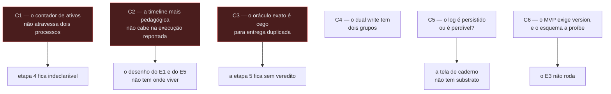
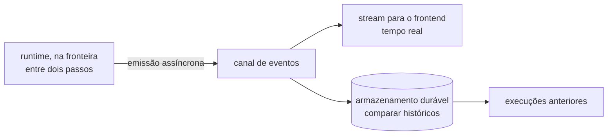
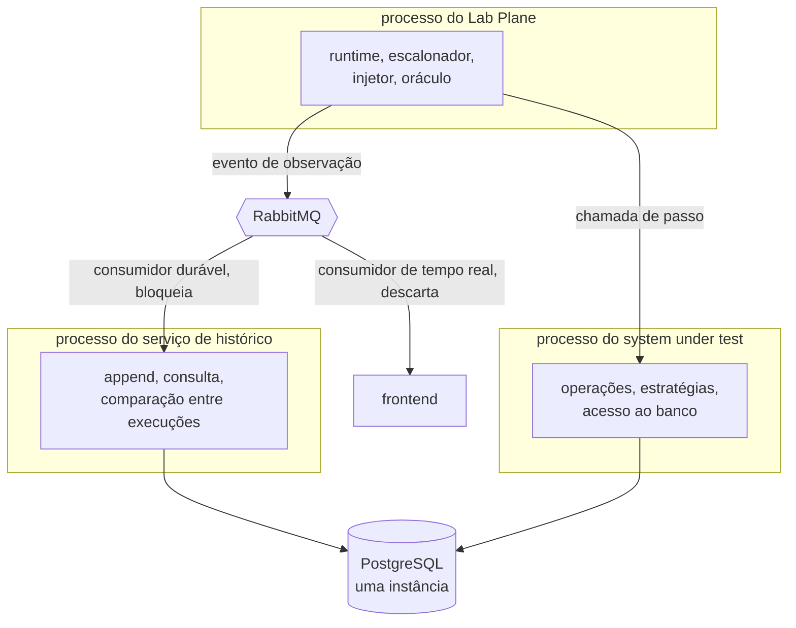
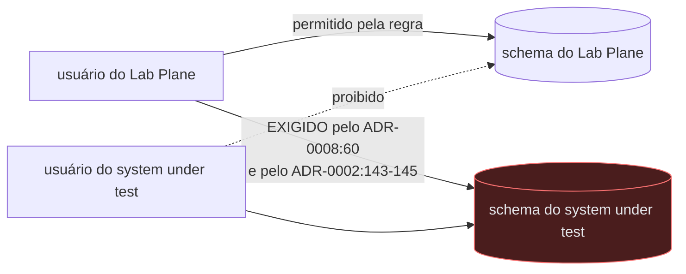
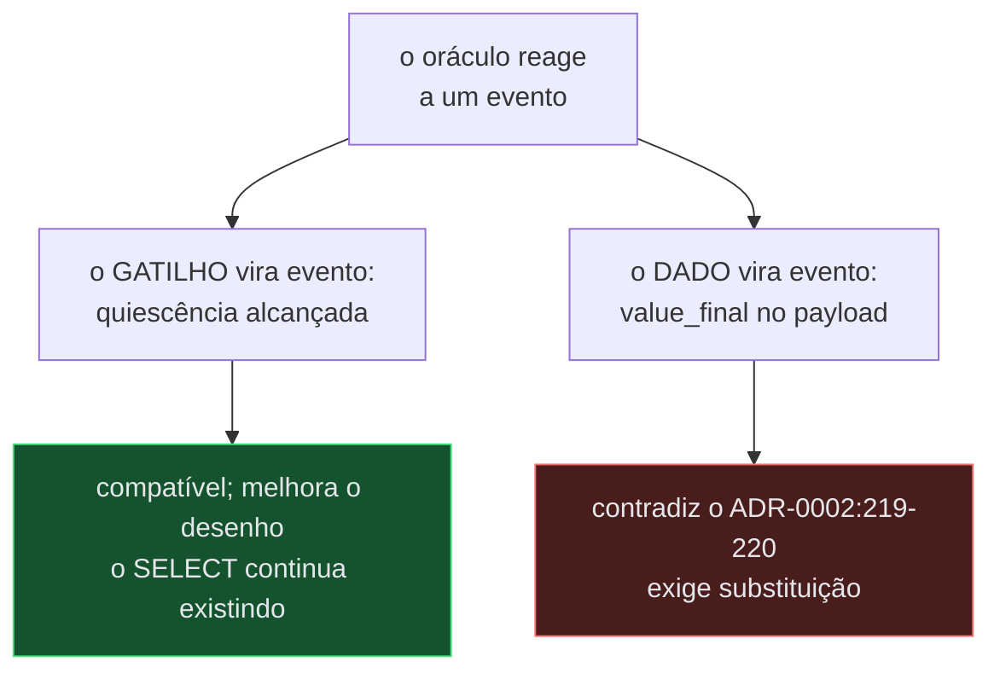
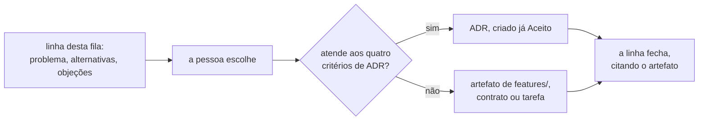
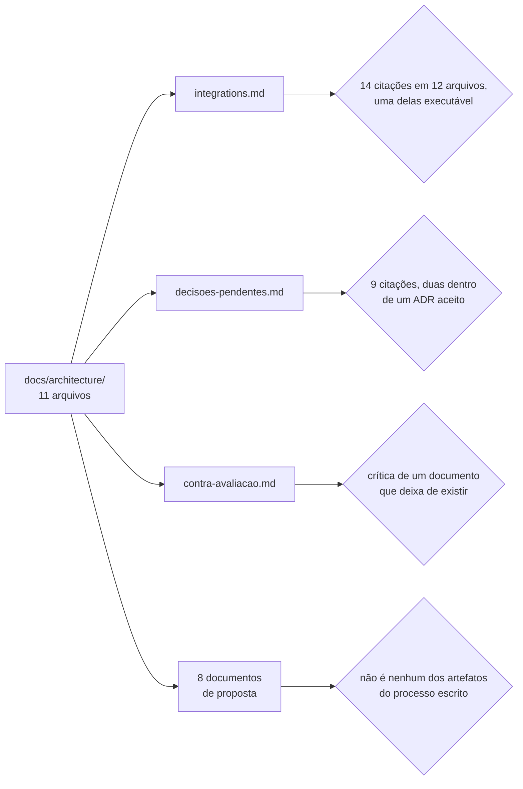
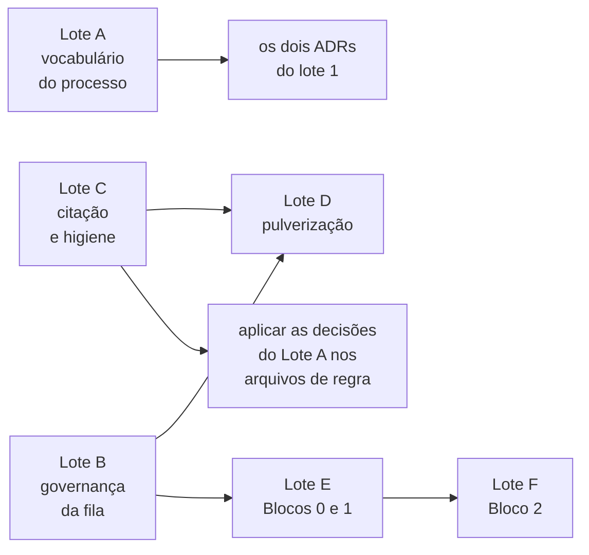
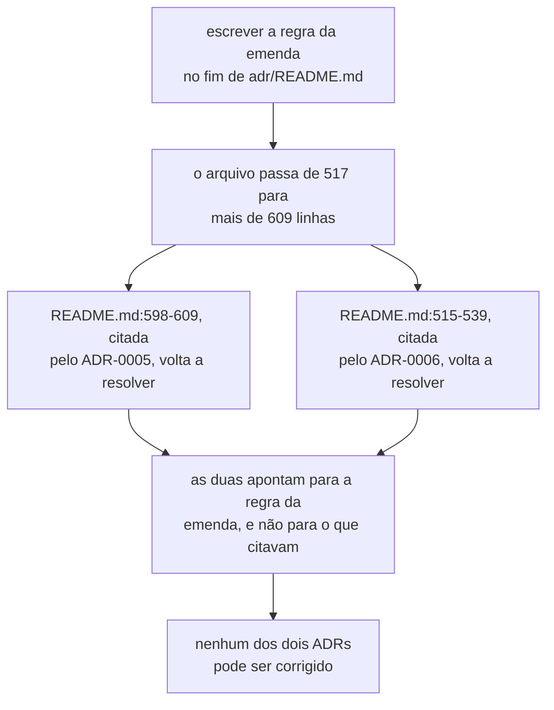

# Fila de avaliação — as decisões que esta rodada produziu

- **Estado:** Proposta — requer aprovação humana
- **Data:** 2026-08-03
- **Escopo:** consolidar, numa fila só, as 66 decisões que os documentos de
  arquitetura desta rodada deixaram para uma pessoa, e ordená-las pelo que cada
  uma destrava.
- **Depende de:** os sete ADRs aceitos da série corrente, e os nove documentos
  de proposta listados abaixo.

## O que este documento é, e o que ele não é

Cinco documentos de arquitetura foram escritos em paralelo em 2026-08-03, sob a
stack definida pelo usuário: Java com Spring Boot 4.x, PostgreSQL, RabbitMQ com
CloudEvents, Debezium se houver gatilho, e React com Next.js e Tailwind. Cada um
registrou as decisões que não podia tomar sozinho, com o prefixo do seu domínio.

Este arquivo **não decide nada** e **não repete o conteúdo**. Ele é o índice, mais
a única análise que nenhum dos cinco documentos podia fazer: **o que cada decisão
destrava**, visto de cima dos cinco.

Nenhum documento desta rodada é ADR. A fila de decisões de
[`../adr/README.md`](../adr/README.md) continua sendo a única fonte de decisão
arquitetural, e o processo continua sendo **um ADR por vez**. A lição registrada
em [`../adr/README.md`](../adr/README.md), seção "A lição que a primeira série
deixou", é a razão de esta rodada ter produzido proposta, e não decisão.

| Documento                                            | Prefixo | Decisões |
|------------------------------------------------------|---------|----------|
| [`../CONTEXT.md`](../CONTEXT.md)                     | `D-DOM` | 6        |
| [`modelo-de-dominio.md`](modelo-de-dominio.md)       | `D-DOM` | 10       |
| [`modelo-de-dados.md`](modelo-de-dados.md)           | `D-DAT` | 11       |
| [`arquitetura-alvo.md`](arquitetura-alvo.md)         | `D-ARQ` | 4        |
| [`modulos-e-fronteiras.md`](modulos-e-fronteiras.md) | `D-ARQ` | 5        |
| [`entrega-continua.md`](entrega-continua.md)         | `D-ARQ` | 6        |
| [`mensageria.md`](mensageria.md)                     | `D-MSG` | 11       |
| [`interface-web.md`](interface-web.md)               | `D-UI`  | 7        |
| [`contratos-de-api.md`](contratos-de-api.md)         | `D-UI`  | 6        |

---

## Leia isto antes das tabelas: seis contradições dentro de ADRs aceitos

Estas **não são decisões de proposta**. São defeitos que os agentes encontraram
nos documentos que já estão em vigor, e que nenhuma aprovação de proposta
resolve. Um ADR aceito não pode ser editado — cada uma exige ADR novo, ou uma
subsunção, no sentido de [`../adr/README.md`](../adr/README.md), seção
"Substituição e subsunção são coisas diferentes".

Elas vêm primeiro porque mudam o que vale a pena aprovar nas tabelas abaixo.

### C1 — O escalonador não sobrevive à etapa 4

O ADR-0005 mantém, **por execução e em
memória**, um contador de workers ativos (`../adr/0005-a-forma-do-escalonador.md:60-61`), e o zero desse contador é o
sinal que o oráculo aguarda antes de ler o banco (`:77-80`). A etapa 4 põe os
workers em dois processos (`../plano-do-laboratorio.md:344`). O contador de um
processo não enxerga os workers do outro, e o sinal de término nunca chega.

Nenhum documento do repositório registrava isso. Detalhe em `D-ARQ-03`.

### C2 — O desenho mais pedagógico do laboratório não cabe na execução que o reporta

O plano exige, para o E1, uma timeline mostrando "dois `READ version=N` antes de
dois `WRITE version=N+1`" (`../plano-do-laboratorio.md:395-396`), e para o E5 os
dois `SELECT sum` antes de qualquer `INSERT` (`:469-471`). Os dois são
afirmações de **precedência entre workers**.

A execução medida roda **sem agendamento**
(`../adr/0004-o-estatuto-da-barreira-e-o-diagnostico-da-nao-ocorrencia.md:101`),
logo nenhum evento dela tem `restrito = verdadeiro`. Sem isso, o log **não
garante ordem entre workers**, e a timeline "NÃO DEVE ser lida como prova de
precedência"
(`../adr/0007-o-log-de-observacoes-forma-ordem-e-onde-vive.md:80-83`). A
execução em que a ordem é real é o controle positivo — e ela "NÃO DEVE ser
reportada como resultado do experimento" (`../adr/0004-...md:258`).

Detalhe em `D-UI-04` e `D-UI-05`.

### C3 — O oráculo exato é cego para a entrega duplicada

`perdidas = commits − (value_final − value_inicial)`
(`../adr/0002-o-dominio-minimo-e-os-dois-oraculos.md:140`). Uma mensagem
reentregue faz o worker commitar de novo: `commits` sobe, `value_final` sobe, e a
diferença fica zero. A outra métrica, `commits − sucessos`, mede o caso oposto —
o commit sem sucesso reportado.

A etapa 5 estuda a duplicata de entrega e **não tem veredito**. Detalhe em
`D-MSG-02`.

### C4 — O dual write está classificado em dois grupos diferentes

O ADR-0002 chama o dual write de "o fenômeno do grupo B que a etapa 6 estuda"
(`../adr/0002-...md:175`). O plano o classifica no grupo C, escrita parcial (`../plano-do-laboratorio.md:204-207`). O ADR está aceito e não é editável.

### C5 — O log é persistido no fim, ou é perdível?

O plano diz que no MVP o log "vive em memória e é persistido no fim da execução"
(`../plano-do-laboratorio.md:589-592`). O ADR-0007, posterior e aceito, diz que a
persistência durável está fora de escopo até a etapa 6 e aceita que "o log é
perdível" (`../adr/0007-...md:86-88`, `:152-153`).

Duas telas propostas dependem de qual leitura vale. Detalhe em `D-DAT-10` e
`D-UI-12` da numeração de `interface-web.md`.

### C6 — O MVP exige `version`, e o esquema a proíbe

**Esta contradição não existe.** A verificação está na seção seguinte, e o restante
deste bloco registra o que se afirmava antes dela.

"Nenhuma outra coluna entra no MVP" (`../adr/0002-...md:93`). O E3 roda
`OPTIMISTIC`, que "exige `version` em `Resource`"
(`../adr/0006-a-forma-da-estrategia-de-concorrencia.md:56-57`), e o E3 está na
etapa 2 — dentro do MVP (`../plano-do-laboratorio.md:356-357`).

O próprio ADR-0002 registra a consequência (`:465-466`), o que sugere que a
frase descreve o esquema **inicial**. A leitura não está escrita, e o ADR-0006
condiciona a migração a "quando a arquitetura mínima existir" (`:56-58`). Sem
mecanismo de migração, o E3 não roda: por isso `D-DAT-04` deixou de ser
preferência de ferramenta.

### C7 — O ADR-0008 fixou um pacote com o termo aposentado

**Contradição nova, levantada em
2026-08-04**, no turno em que a resolução desta fila foi
retomada.

`D-DOM-02` aposentou `Control Plane` e renomeou o plano medido para `system under test`
([`../CONTEXT.md`](../CONTEXT.md), linha 193). O
[ADR-0008](../adr/0008-os-dois-planos-em-processos-separados.md), aceito no **mesmo
dia**,
fixa a região de pacote `dev.da0hn.lab.controlplane` (`../adr/0008-...md:70`).

As 18 ocorrências em prosa dentro de ADRs aceitos são caso resolvido: elas não mudam
porque o corpo de um ADR aceito não é editado, e a tabela de
[`../CONTEXT.md`](../CONTEXT.md), linhas 867 a 871, registra a escolha. **Um nome de
pacote não é prosa.** Ele vira diretório, `import` e regra de ArchUnit, e o custo de
trocá-lo cresce com a primeira linha de código.

O glossário afirma que "o ADR-0008 fixou só o pacote raiz"
(`../CONTEXT.md:883`). A linha 70 daquele ADR contradiz a afirmação: ela fixa quatro
regiões, e uma delas é `controlplane`. A pergunta em aberto do glossário alcança
[`modulos-e-fronteiras.md`](modulos-e-fronteiras.md), linhas 86 a 89, que são
**proposta**,
e não alcança a linha do ADR, que é **decisão aceita**.

**Pergunta em aberto.** O pacote passa a se chamar `dev.da0hn.lab.systemundertest`, ou o
identificador conserva `controlplane` de propósito? A primeira exige um ADR novo, porque
a tabela de regiões está dentro de um ADR aceito. A segunda cria um par permanente entre
o nome do glossário e o nome do código, que a regra "um conceito tem **um** nome"
(`../adr/README.md:32`) proíbe.

### O estado das sete contradições

| ID   | Situação em 2026-08-04 | Onde                                                      |
|------|------------------------|-----------------------------------------------------------|
| `C1` | **fechada**            | `../adr/0008-...md:128-129`, como neutra                  |
| `C2` | **decidida**           | controle positivo rotulado; ver abaixo                    |
| `C3` | **adiada, com forma**  | vira arquivo em [`../questions/`](../questions/README.md) |
| `C4` | **decidida**           | ADR novo, junto de `C7`                                   |
| `C5` | **fechada**            | log orientado a evento; 21 objeções decididas             |
| `C6` | **refutada**           | seção seguinte deste arquivo                              |
| `C7` | **decidida**           | ADR novo, junto de `C4`                                   |

`C1` fechou por consequência, e não por escolha. O ADR-0008 manteve os workers num
processo só — o do Lab Plane — e o contador de ativos do ADR-0005 sobrevive. A seção
`### Neutras` daquele ADR registra o fato (`../adr/0008-...md:128-129`).

## As escolhas do lote 1, tomadas em 2026-08-04

Escolhas da pessoa, no turno em que as cinco contradições abertas foram apresentadas.
Nenhuma gerou artefato ainda.

### `C2` — o desenho pedagógico vive só no controle positivo, rotulado

A interface apresenta a timeline do controle positivo ao lado do resultado medido, com
rótulo explícito de que aquela execução demonstra o mecanismo e **não** é o resultado. É
a recomendação de `D-UI-05`, e ela não cria mecanismo novo nem contradiz ADR aceito.

Descartadas, com o motivo técnico de cada uma:

- **Detecção de exposição a posteriori.** O log medido seria varrido depois para achar
  pares `READ`/`WRITE` sobrepostos. Perde porque exige a métrica de exposição que
  `../adr/README.md:445-451` declara não nomeada em documento nenhum — decidir aqui seria
  decidir duas coisas num turno só.
- **Emendar o plano e retirar o requisito.** Perde porque o cenário 25 é o único desenho
  que explica por que travar uma linha não ajuda no E5.

**Consequência aceita.** O leitor da interface passa a ver dois artefatos, e precisa
entender por que só um deles é o resultado. O rótulo é o que carrega essa distinção, e a
forma dele é decisão de `D-UI-05`, que continua aberta.

### `C3` — adiada, e a contradição ganha forma de questão

A etapa 5 não tem gatilho disparado: o RabbitMQ não entrou, e `D-MSG-01` ainda não
nomeou o gatilho que o libera. A contradição **NÃO DEVE** desaparecer com este índice.
Ela vira arquivo próprio em [`../questions/`](../questions/README.md), com o enunciado
inteiro e destino nomeado em `D-MSG-02`.

Descartadas: a contagem de comandos distintos aceitos, porque exige identidade de
comando, que é decisão de Experiment na posição 8 da fila; e o oráculo próprio para a
etapa 5, porque dois oráculos para o mesmo domínio mínimo criam a regra de qual vale em
qual etapa, e essa regra não tem dono.

### `C4` e `C7` — um ADR novo corrige as duas

O ADR novo corrige a classificação do dual write e renomeia a região de pacote. Os dois
ADRs alterados — ADR-0002 e ADR-0008 — recebem `Última atualização` e `Alterado por` no
cabeçalho, no mesmo commit, pela regra de `../adr/README.md`, seção "O rastro de
alterações, emendado em 2026-08-04".

Descartadas: a errata no índice de ADRs, porque quem lê um ADR isolado continua lendo a
afirmação errada; e estender o campo `Alterado por` para correção factual, porque emenda
uma regra de processo aceita no dia anterior e faz o cabeçalho carregar dois tipos de
coisa.

**Custo aceito e nomeado.** Corrigir um rótulo de grupo não atende aos quatro critérios
de ADR de `../adr/README.md:13-18`. A escolha foi consciente: o mesmo ADR carrega `C7`,
que atende, e separar as duas produziria um documento para uma linha.

**Decidido em 2026-08-05: a região de pacote passa a
ser `dev.da0hn.lab.sut`.** A sigla é
padrão na literatura de teste, o segmento fica curto e dentro da convenção Java, e
[`../CONTEXT.md`](../CONTEXT.md) já define o termo por extenso. Descartadas:
`systemundertest`, por criar o precedente de segmento composto de 15 caracteres que
nenhuma convenção do repositório trata; `subject`, por criar um terceiro nome para o
conceito que `D-DOM-02` acabou de unificar; e manter `controlplane`, por violar "um
conceito tem **um** nome" (`../adr/README.md:32`) de forma visível em todo `import`.

**O23 — a substituição parcial não existe no vocabulário do processo.** O ADR novo
contradiz **uma** regra do ADR-0008 — o nome da região de pacote (`:70`) — e deixa a
decisão principal daquele ADR intacta: os dois planos continuam em processos separados.

O processo de `../adr/README.md` só oferece dois caminhos, e nenhum serve.

| Caminho      | O que ele exige                                | Por que não serve                               |
|--------------|------------------------------------------------|-------------------------------------------------|
| subsunção    | a regra antiga continua válida no caso que via | ela **não** continua: o nome é trocado          |
| substituição | `Estado` do antigo recebe `Substituído por`    | derrubaria a decisão de dois processos, vigente |

O precedente mais próximo é o ADR-0005, que acrescentou um sexto rótulo à tabela do
ADR-0004 e o chamou de subsunção (`../adr/0005-...md:96-104`). Ali a regra antiga
continuava valendo, e aqui não continua.

**Pergunta em
aberto.** O ADR-0008 permanece `Aceito` com o rastro registrando substituição
de uma regra, ou o processo ganha um terceiro caminho nomeado? A escolha vale para todo ADR
futuro que corrija um detalhe sem derrubar a decisão, e ela não foi feita.

**Pergunta em
aberto.** O ADR novo renomeia o pacote para `dev.da0hn.lab.systemundertest`,
ou para outra forma? `systemundertest` tem 17 caracteres sem separador, e nenhuma
convenção do repositório trata segmento composto. A escolha do identificador não foi
feita.

### `C5` — o log de execução passa a ser orientado a evento

**Instrução do usuário, registrada em 2026-08-04, verbatim:**

> Log de execução do experimento deve ser orientado a evento. Todas as ações realizadas
> durante o experimento devem ser emitidas de forma assíncrona. Desse modo é possível
> atender ao requisito de que o frontend deve ser capaz de apresentar em tempo real o que
> está ocorrendo com o experimento e comparar históricos de execuções anteriores.

A escolha não é nenhuma das três alternativas apresentadas. Ela é mais forte que as três,
e **substitui** o ADR-0007 em dois pontos. Substituição, e não subsunção: as duas regras
abaixo passam a ser contraditas, e `../adr/README.md`, seção "Substituição e subsunção
são coisas diferentes", exige que a contradição siga o caminho da substituição.

| Regra do ADR-0007                                   | Origem     | O que a escolha faz                     |
|-----------------------------------------------------|------------|-----------------------------------------|
| "Sequência apensável, em memória, uma por execução" | `:87`      | contradiz: vira stream                  |
| "o log é perdível até a etapa 6"                    | `:152-153` | contradiz: histórico exige durabilidade |

Seis objeções seguem da escolha. Nenhuma a invalida; todas exigem decisão antes de o ADR
novo ser escrito.

**O1 — a substituição alcança um ADR aceito
ontem.** O ADR-0007 foi aceito em 2026-08-04.
Ele recebe `Substituído por ADR-NNNN` e o rastro de alterações. Nenhuma parte do corpo
dele é editada.

**O2 — a emissão assíncrona ameaça a única ordem que o log garante.** O ADR-0007 garante
que, dentro de um mesmo worker, "a ordem de emissão é a ordem de execução — sequencial
por construção" (`:79-80`). Um emissor com buffer por worker preserva essa garantia; um
emissor com fila compartilhada e mais de um consumidor não. Qual dos dois vale NÃO está
decidido, e a diferença é observável na timeline.

**O3 — "tempo real" e "não perturbar a medida"
competem.** O log não escreve no banco sob
teste porque isso adiciona contenção (`../plano-do-laboratorio.md:588-589`). A emissão
assíncrona tira o trabalho do caminho quente, e é argumento **a favor** da escolha. Mas
o E1 emite entre 900 e 1500 observações, e o custo de enfileirar cada uma continua dentro
do Lab Plane. A fronteira de processo do ADR-0008 reduz o dano, e não o elimina.

**O4 — a contrapressão não tem
política.** Se o consumidor do stream for mais lento que o
emissor, o buffer cresce. Descartar evento falsifica a timeline; bloquear o runtime
perturba a medida. As duas saídas são inaceitáveis sem declaração explícita, e nenhuma
foi escolhida.

**O5 — "comparar históricos" antecipa dois gatilhos da etapa
6.** `D-DAT-10`, o que do log
entra no Git, e `D-DAT-06`, onde o log durável vive, tinham gatilho na etapa 6. A escolha
os traz para o MVP. `D-DAT-06` já estava sem forma: ele recomenda instância separada, e o
homelab terá uma instância só de PostgreSQL (`../adr/0008-...md:27-28`).

**O6 — onde o log durável vive continua sem resposta.** Gravá-lo na mesma instância do
system under test contraria a regra de `../plano-do-laboratorio.md:588-589`. Schema
separado não isola contenção ([`modelo-de-dados.md`](modelo-de-dados.md), linhas 154 a
158). Um destino fora do PostgreSQL não foi proposto por documento nenhum, e a regra
"nenhuma tecnologia entra por estar disponível" ([`../../AGENTS.md`](../../AGENTS.md))
exige nomear a limitação concreta antes de propor um.

#### As quatro escolhas que fecham `C5`, tomadas em 2026-08-04

As seis objeções acima foram apresentadas à pessoa no mesmo turno. Quatro decisões
seguiram, e duas contrariaram a recomendação apresentada.

| Eixo   | Escolha                                                 | Seguiu a recomendação? |
|--------|---------------------------------------------------------|------------------------|
| `C5.1` | RabbitMQ desde o MVP, com deduplicação no consumidor    | **não**                |
| `C5.2` | sequência lógica por worker, dentro do próprio evento   | sim                    |
| `C5.3` | o consumidor durável bloqueia; o de tempo real descarta | sim                    |
| `C5.4` | serviço próprio, que faz append e expõe o histórico     | **não**                |

Instrução do usuário em `C5.1`, verbatim: "Eventos duplicados devem ser devidamente
tratados e descartados." Instrução em `C5.4`, verbatim: "Fica no banco de dados, eu
entendo que o melhor aqui seria um serviço responsável por fazer append e expor o
histórico e comparações entre históricos."

**A topologia passa a ter três
processos.** O ADR-0008 fixou dois (`../adr/0008-...md:44-47`) e não proíbe um terceiro. O diagrama daquele ADR deixa de
descrever a topologia inteira, sem que decisão nenhuma dele seja contradita.

`C5.2` e `C5.1` se sustentam: a chave de deduplicação é o par worker mais sequência
lógica, que `C5.2` já obriga cada evento a carregar. Nenhum campo novo entra para
atender à instrução sobre duplicatas.

**Seis linhas da fila ganham gatilho disparado.** `D-MSG-01`, `D-MSG-03`, `D-MSG-04`,
`D-MSG-06` e `D-MSG-09` estavam no Bloco 6, cuja regra é que "nenhuma delas deve ser
construída antes do gatilho". O gatilho disparou, e não pelo motivo que `D-MSG-01`
previa — ele nomeia a reentrega, e quem o disparou foi o log. `D-DAT-06` fecha: o log
durável vive em banco, atrás de um serviço próprio.

**Quatro objeções novas seguem das escolhas.** Elas não invalidam nenhuma; todas exigem
decisão antes de o ADR ser escrito.

**O7 — o instrumento passa a depender do objeto de
estudo.** A etapa 5 estuda a duplicata
de entrega, e a etapa 8 estuda DLQ e poison message. Com o log no mesmo RabbitMQ, um
experimento que sature ou derrube o broker derruba o **instrumento que o observa**. A
deduplicação de `C5.1` cobre a mensagem duplicada; ela não cobre a saturação nem a queda.
É a confusão system under test / Lab Plane um nível abaixo, que
[`../../AGENTS.md`](../../AGENTS.md) já registra sem solução para o caso do orquestrador.

**O8 — a contrapressão de `C5.3` passa a atravessar a rede.** "O consumidor durável
bloqueia" era barato com um buffer em memória. Com o broker no meio, o bloqueio chega ao
runtime pelo mecanismo de confirmação de publicador, que é exatamente `D-MSG-06`. Um
serviço de histórico lento passa a atrasar a fronteira entre passos do experimento.

**O9 — o `deploy/` nasce com
três `Deployment`.** `D-ARQ-15` foi escrita sob a hipótese de
um; o ADR-0008 a levou para dois (`../adr/0008-...md:123-124`); esta escolha leva para
três, mais o RabbitMQ. A forma do `deploy/` no primeiro commit muda pela terceira vez, e
`D-ARQ-15` continua aberta.

**O10 — a regra de tecnologia exige a limitação concreta, e ela precisa ser honesta.**
[`../../AGENTS.md`](../../AGENTS.md) exige nomear qual limitação da stack atual a
tecnologia resolve. Um SSE direto do Lab Plane atenderia o tempo real **sem broker**. O
que o broker acrescenta é o desacoplamento entre quem emite e o serviço de histórico, mais
a entrega ao segundo consumidor sem o Lab Plane conhecê-lo. Esse é o argumento, e ele
NÃO DEVE ser escrito como se o tempo real sozinho o exigisse.

**Pergunta em
aberto.** O log usa o mesmo RabbitMQ dos experimentos, um vhost separado, ou
um broker separado? A escolha decide se `O7` é mitigada ou aceita. O homelab já tem
RabbitMQ (`../plano-do-laboratorio.md:848`), e nenhum documento propõe um segundo.

**Pergunta em aberto.** O serviço de histórico usa a mesma instância de PostgreSQL do
system under test? Ela é uma só (`../adr/0008-...md:27-28`), e schema ou banco separado
não isola contenção ([`modelo-de-dados.md`](modelo-de-dados.md), linhas 154 a 158). A
escrita é assíncrona e fora do caminho quente, o que reduz o dano sem eliminá-lo.

#### As quatro escolhas que fecham as objeções de `C5`, tomadas em 2026-08-04

| Objeção | Escolha                                                       | Seguiu a recomendação? |
|---------|---------------------------------------------------------------|------------------------|
| `O7`    | mesmo vhost; o acoplamento é **aceito e declarado**           | **não**                |
| `O6`    | schema por aplicação, com usuário próprio de leitura restrita | **não**                |
| `O9`    | o serviço de histórico é o Lab Plane, noutro processo         | sim                    |
| `O8`    | confirmação de publicador ligada, com latência medida         | sim                    |

**`O7` é aceita, e não
mitigada.** O log e os experimentos dividem o mesmo vhost do mesmo
RabbitMQ. A escolha foi consciente: um vhost separado prometeria isolamento que ele não
entrega, porque memória, disco e conexões são do nó. O custo permanece, e ele DEVE ser
declarado em todo relatório da etapa 5 e da etapa 8: um resultado daquelas etapas PODE ter
origem no instrumento, e a plataforma não distingue.

**`O9` fecha sem plano novo.** O serviço de histórico **é** o Lab Plane, num segundo
processo. O pacote fica sob `dev.da0hn.lab.labplane`, a regra do ADR-0008 vale sem emenda
— o system under test não chama o Lab Plane, em processo nenhum — e nenhuma região de
pacote nova entra. A guarda de [`Q-0002-1`](../questions/Q-0002-1.md) continua exprimível
pelo padrão de pacote que o ADR-0008 já fixou.

**`O8` fecha `D-MSG-06` em parte.** A confirmação de publicador entra **ligada**, e a
latência que ela impõe na fronteira entre passos é medida e reportada ao lado do
resultado. O braço de comparação desligado, que `D-MSG-06` recomendava,
**não** entra: ele
dobraria as execuções de calibração para medir um eixo que nenhum experimento pediu.

### A política de acesso a dados, decidida em 2026-08-04

A escolha em `O6` não é sobre o serviço de histórico. Instrução do usuário, verbatim:

> Vamos decidir agora para todos os outros serviços. Vou usar separação por schema e
> usuários por aplicação com leitura apenas no schema da aplicação. A decisão de não usar
> as tabelas de teste precisa ser consciente e deve ser policiada durante o planejamento e
> implementação.

Ela vale para **toda** aplicação do laboratório, e não só para o log.

| Elemento          | Regra                                                    |
|-------------------|----------------------------------------------------------|
| isolamento lógico | um schema por aplicação, numa instância só de PostgreSQL |
| identidade        | um usuário de banco por aplicação                        |
| permissão         | leitura restrita ao schema da própria aplicação          |
| guarda            | policiamento no planejamento e na implementação          |

**Esta escolha fecha uma pergunta em aberto de um ADR
aceito.** O ADR-0008 registrou que a
escolha entre schema separado e dois bancos "**não foi
feita**" (`:130-134`). Ela foi feita
agora, e o resultado é schema. A decisão NÃO contradiz aquele ADR: ele já declarava que
nenhuma das duas isola contenção, e que a escolha decide permissão e espaço de nomes. É
exatamente o eixo que esta política decide.

**A objeção que eu levantei contra schema foi respondida.** Eu argumentei que schema não
isola permissão por padrão. A instrução acrescenta o mecanismo que faltava: usuário por
aplicação, com permissão restrita ao próprio schema. A objeção deixa de valer.

**Duas objeções novas seguem, e nenhuma foi tratada.**

**O11 — o oráculo do Lab Plane precisa ler o schema do system under test.** O ADR-0008
fixa essa leitura no diagrama da decisão: `RUN -->|" SELECT após a quiescência "| PG`
(`../adr/0008-...md:60`). O ADR-0002 exige a mesma leitura para `value_inicial` e
`value_final` (`../adr/0002-...md:143-145`). A regra "leitura apenas no schema da
aplicação" proíbe exatamente isso, salvo exceção declarada. A exceção é
**obrigatória**, e
ela não está escrita.

**O12 — "policiada durante o planejamento e implementação" é guarda humana.**
[`Q-0002-1`](../questions/Q-0002-1.md) existe porque três regras deste repositório são
texto e não regra executável, e o custo registrado ali é que uma violação passa em
silêncio e aparece meses depois. Esta política é a quarta regra textual. Se ela é
verificável — por permissão do próprio PostgreSQL, que recusa o acesso, e não por revisão
— então a guarda é o banco, e o policiamento é o último recurso, não o primeiro.

#### `O12` fecha: a guarda é o banco

Decidido em 2026-08-04. As permissões são versionadas na migração, e o PostgreSQL recusa
a consulta proibida. O policiamento no planejamento e na implementação continua, como
segunda camada.

**Isto resolve, para esta regra, o problema que [`Q-0002-1`](../questions/Q-0002-1.md)
levanta.** Aquela questão registra que três regras deste repositório são texto e não regra
executável, e que uma violação passa em silêncio e aparece meses depois. Esta política não
entra na mesma condição: `GRANT` e `REVOKE` fazem a violação falhar no instante da
consulta.

#### O broker fica sem identidade por aplicação

Decidido em 2026-08-04, contra a recomendação apresentada. O RabbitMQ é tratado como
infraestrutura compartilhada: um vhost, um usuário, nenhuma permissão por padrão de fila
ou de exchange. A política de acesso a dados **não** se estende ao broker.

| Recurso    | Identidade            | Permissão                       | Guarda         |
|------------|-----------------------|---------------------------------|----------------|
| PostgreSQL | usuário por aplicação | restrita ao schema da aplicação | o banco recusa |
| RabbitMQ   | usuário único         | nenhuma restrição declarada     | nenhuma        |

**O13 — o acoplamento do instrumento ao objeto de estudo passa a ser total.** `O7` já
aceitou que o log e os experimentos dividem o vhost. Sem identidade separada, uma aplicação
alcança a fila do log com a credencial que ela já tem. A etapa 8 estuda poison message e
DLQ, e roda com credencial que enxerga o instrumento. O custo é aceito, e DEVE ser
declarado no relatório daquela etapa junto do custo de `O7`.

#### `O11` continua aberta, e a evidência diz por que a exceção é obrigatória

A pessoa perguntou por que o oráculo precisa ler o schema do system under test. O ADR-0002
responde, e a resposta é normativa.

**O ADR-0002 tem uma seção com esse
título:** "O oráculo lê o banco, e NÃO DEVE ler o log
de observações" (`../adr/0002-...md:218-241`). O diagrama daquela seção marca a aresta do
log para o oráculo como **proibida**, e a aresta do oráculo para as tabelas como a única
fonte do estado final.

Três razões técnicas sustentam a regra, e as três estão dentro do ADR.

- **O oráculo é independente do runtime, por trade-off declarado**
  (`../adr/0002-...md:493-495`). Se o sistema medido reportasse `value_final`, um defeito
  nele produziria um oráculo que concorda com o defeito. É o erro que o laboratório existe
  para detectar.
- **O oráculo tem transação própria** (`../adr/0002-...md:474-476`): "O `SELECT sum` do
  oráculo roda numa transação própria do Lab Plane, depois da execução. O nível de
  isolamento dessa transação não afeta o resultado sobre um banco quiescente." Uma leitura
  feita pelo system under test herdaria o nível de isolamento que o E3 e o E5 **variam
  de
  propósito**, e um snapshot antigo viraria veredito.
- **O oráculo de capacidade não lê estado; ele calcula um agregado.**
  `SELECT sum(amount) WHERE resource_id = r` (`../adr/0002-...md:208`). Não existe valor
  materializado que o system under test pudesse reportar.

**A exceção é obrigatória.** Negá-la exigiria um ADR que substituísse o ADR-0002, e a
substituição derrubaria o trade-off da independência do oráculo.

#### A proposta de o oráculo reagir a um evento, levantada em 2026-08-04

A pessoa perguntou se o estado final não poderia chegar como evento, com o oráculo reagindo
a ele. A proposta separa em **duas** coisas, e elas têm respostas opostas.

**O gatilho como evento é compatível, e melhora o desenho.** O ADR-0005 já fixa que o
contador de ativos, ao chegar a zero, sinaliza "execução terminada", e que é esse sinal que
o oráculo aguarda antes de ler o banco (`../adr/0005-a-forma-do-escalonador.md:77-80`).
`C5` acabou de tornar o log orientado a evento; transformar esse sinal num evento do mesmo
canal elimina um mecanismo de sincronização in-process que a fronteira de rede do ADR-0008
já tornava frágil. **O `SELECT` continua existindo**, e a permissão de `O11` continua
necessária.

**O dado como evento contradiz um ADR
aceito.** O ADR-0002 é explícito: "Os dois oráculos
consultam o PostgreSQL. Nenhum dos dois deriva o estado final do log de observações do
runtime" (`../adr/0002-...md:219-220`). Um evento que carregue `value_final` é o estado
final derivado de um stream, que é o caso proibido.

Três consequências técnicas seguem, além da regra:

- **Quem emitiria o evento?** Se for o system under test, o medido reporta o próprio
  resultado, e as três razões da subseção anterior valem sem alteração. Se for um terceiro
  componente, ele precisa de `SELECT` no schema do system under test — a permissão de `O11`
  muda de dono, e não desaparece.
- **O oráculo de capacidade não tem estado para transportar.** Ele calcula
  `SELECT sum(amount)` (`../adr/0002-...md:208`). Reconstruir essa soma a partir de eventos
  de `INSERT` é derivar o estado final de um stream, que é o caso proibido.
- **CDC não é
  saída.** `D-MSG-10` já decidiu que o Debezium não entra, porque o CDC apaga
  os pontos `BEFORE_PUBLISH` e `AFTER_PUBLISH` do ADR-0001. Além disso, replicação lógica
  exige permissão **maior** que `SELECT`, e não menor.

**Decidido em 2026-08-04: o sinal de quiescência vira evento.** O escalonador emite
"quiescência alcançada" no canal de `C5`, e o oráculo reage a ele. A escolha não contradiz
ADR nenhum: o ADR-0005 fixa que o sinal existe (`:77-80`), e não por qual meio ele viaja.

#### A contraproposta de o system under test publicar o valor consolidado

Levantada pela pessoa em 2026-08-04, com o custo reconhecido no próprio enunciado.
Verbatim:

> Ao invés de permitir acesso. O SUT emite um evento consumido internamente em uma
> transação nova, lê o conteúdo do banco e publica o valor consolidado. Isso fere o
> princípio definido, mas evita que o oráculo tenha acesso a base do SUT.

**Um ganho real, e ele não estava
escrito.** A transação nova neutraliza a segunda das três
razões. Uma leitura que abre transação própria depois da quiescência **não** herda o
snapshot dos workers, e o problema de `REPEATABLE READ` devolver estado antigo deixa de
existir. Aquela objeção cai.

**Duas razões continuam valendo, e a primeira é o que o ADR-0002 chama de trade-off.**

- **A independência do
  medidor.** O E3 estuda `OPTIMISTIC` e o E5 estuda proteção presente
  e inerte. Os dois são defeitos **na camada de persistência do system under
  test**. Pedir
  a essa camada que reporte o resultado é pedir ao componente sob suspeita que produza a
  prova. O ADR-0002 registra o oposto como benefício aceito: "o oráculo é independente do
  runtime" (`../adr/0002-...md:493-495`).
- **Transação nova não é sessão
  nova.** Uma leitura consolidada emitida de dentro do system
  under test PODE atravessar cache de primeiro ou de segundo nível do mapeador e devolver
  entidade em cache. A transação nova não garante cache limpo, e nenhum documento declara
  qual mapeador o system under test usa.

**A proporção do
custo.** O que se evita é um `GRANT SELECT` em duas tabelas. O que se paga
é o trade-off que o ADR-0002 declara ter aceito. As duas grandezas não são comparáveis.

**Esta contraproposta exige um ADR que substitua o ADR-0002.** Ela contradiz
`../adr/0002-...md:219-220` de forma direta, e contradição é substituição, e não subsunção (`../adr/README.md`, seção "Substituição e subsunção são coisas diferentes"). O ADR-0002
receberia `Substituído por ADR-NNNN`, e os dois oráculos seriam redefinidos.

#### `O11` fecha: as duas fontes convivem, e a divergência vira sinal

Decidido em 2026-08-04. O system under test publica o valor consolidado, lido em transação
nova depois da quiescência,
**e** o oráculo mantém o `SELECT` no banco. Divergir entre as
duas leituras passa a ser sinal de defeito no system under test.

A escolha preserva a independência do oráculo — o `SELECT` continua sendo a fonte do
veredito — e acrescenta um detector que o repositório não tinha. O `GRANT` permanece
necessário, e o formato dele continua sem escolha.

**O14 — a divergência entre as duas fontes não tem veredito.** O ADR-0004 classifica o
zero em cinco rótulos, e o ADR-0005 acrescentou o sexto. Uma divergência entre a leitura
publicada e a leitura do oráculo não é nenhum dos seis: ela não fala do fenômeno, fala do
instrumento. Onde ela aparece no relatório, e se ela invalida a execução, não foi decidido.

#### O CDC como fonte de observação, levantado em 2026-08-04

A pessoa perguntou se o CDC não poderia capturar as alterações e ser comparado ao evento
publicado pelo system under test.

**`D-MSG-10` não avaliou este uso, e a pergunta é
legítima.** As três alternativas daquela
seção (`mensageria.md:1000-1017`) tratam o CDC como substituto do Outbox — papel de
**publicação** do system under test. Observação independente para o oráculo é um quarto
papel, e nenhum documento o analisou.

**O argumento a favor é forte e não estava escrito.** O WAL registra o que o PostgreSQL
efetivamente aplicou. Ele não passa pela camada de persistência do system under test, não
passa por cache de mapeador e não depende de código sob suspeita. Como fonte independente,
o CDC é **mais** independente que o `SELECT` do oráculo.

**O custo já está medido neste repositório, e é decisivo.**
[`modelo-de-dados.md`](modelo-de-dados.md), linhas 565 a 580, mede as exigências do CDC
sobre a medida. Três delas matam o uso proposto.

| Exigência           | Efeito sobre a medida                                                                          |
|---------------------|------------------------------------------------------------------------------------------------|
| `wal_level=logical` | aumenta o WAL de **toda** escrita do cluster, inclusive o `UPDATE` quente do E1 ao E4          |
| slot de replicação  | um slot parado segura `restart_lsn` e o `xmin`: o vacuum para e o bloat cresce entre execuções |
| GUC de cluster      | `wal_level` é ajuste de cluster, e não de banco; mudá-lo exige reinício                        |

A frase que fecha o caso está na linha 576 daquele documento: "Um resultado medido sob
`logical` não é comparável com um medido sob `replica`, e o slot parado degrada a linha de
base ao longo do tempo sem nenhum sintoma visível no relatório."

**Isto é o instrumento alterando o sistema medido.** O CDC compraria independência de
leitura pagando com contaminação de escrita — e a contaminação alcança **todos** os
experimentos, não só o que usasse o CDC. O E3 compara estratégias e o E5 compara níveis de
isolamento; os dois dependem de execuções comparáveis entre si.

**Uma variante evita a incomparabilidade, e não o
custo.** Se `wal_level = logical` ficar
ligado
**permanentemente**, e todo relatório registrar o valor vigente, todas as execuções
pagam o mesmo custo e voltam a ser comparáveis. É a segunda saída que
[`modelo-de-dados.md`](modelo-de-dados.md), linha 578, já oferece. O WAL maior permanece em
toda escrita, o slot parado continua degradando em silêncio, e a etapa 6 — que mata
processos de propósito — é exatamente onde o consumidor cai.

**A permissão não é o argumento.** A tabela daquele documento mede o papel com atributo
`REPLICATION` como "nenhum" custo sobre a medida. A objeção anterior deste arquivo, de que
a replicação exigiria permissão maior, é verdadeira e **não** é o motivo decisivo.

#### Decidido em 2026-08-05: o CDC entra, com `wal_level = logical` permanente

O CDC entra como **fonte de observação** do oráculo. O `wal_level` do cluster fica em
`logical` de forma permanente, e todo relatório registra o valor vigente. Todas as
execuções pagam o mesmo custo de WAL, e continuam comparáveis entre si.

**`D-MSG-10` continua valendo no papel que ele avaliou.** Aquela linha decidiu que o CDC
**não** substitui o Outbox, porque apagaria os pontos `BEFORE_PUBLISH` e `AFTER_PUBLISH`
do ADR-0001 (`mensageria.md:1004-1007`). Esta decisão não a contradiz: ela admite o CDC num
papel que `D-MSG-10` não examinou. Os passos `PUBLISH` da operação permanecem, e a etapa 6
mantém o ponto de injeção.

**`D-DAT-11`
fecha.** A linha oferecia instância dedicada ou instância compartilhada com o
`wal_level` registrado, e recomendava a dedicada. A escolha é a **segunda**, porque o
homelab terá uma instância só (`../adr/0008-...md:27-28`).

**As três fontes, e o que cada uma pode dizer.**

| Fonte                          | Independe do código do SUT? | Serve de veredito?              |
|--------------------------------|-----------------------------|---------------------------------|
| `SELECT` do oráculo            | sim                         | **sim** — é a fonte do ADR-0002 |
| consolidado publicado pelo SUT | não                         | não; serve de conferência       |
| CDC sobre o WAL                | sim, e mais que o `SELECT`  | não; serve de conferência       |

**O CDC NÃO DEVE virar fonte do veredito.** O oráculo de capacidade calcula
`SELECT sum(amount)` (`../adr/0002-...md:208`). Reconstruir essa soma a partir de eventos
de `INSERT` do CDC é derivar o estado final de um stream, que o ADR-0002 proíbe (`:219-220`). O CDC confere; ele não decide.

**Quatro consequências novas, e nenhuma tem decisão.**

**O15 — `O14` foi decidida para duas fontes, e agora existem três.** A regra "divergir
invalida a execução" precisa dizer **entre
quais** fontes. Três leituras admitem três pares,
e o caso em que duas concordam e uma discorda não é o mesmo que o caso em que as três
divergem. A primeira configuração aponta o componente defeituoso; a segunda não aponta nada.

**O16 — o slot de replicação parado degrada em silêncio, e a etapa 6 o para de
propósito.**
Um slot parado segura `restart_lsn` e o horizonte de `xmin`: o vacuum para e o bloat cresce
entre execuções, "sem nenhum sintoma visível no relatório"
([`modelo-de-dados.md`](modelo-de-dados.md), linha 577). A etapa 6 mata processos de
propósito, e o consumidor do CDC é um deles. Sem uma guarda que meça o atraso do slot, a
linha de base apodrece e o relatório atribui a degradação ao experimento.

**O17 — o Debezium entra na stack sem linha na matriz de integrações.** Ele é componente
novo, com `Deployment` próprio no `deploy/`, e `D-ARQ-15` muda pela quarta vez. Nenhuma
linha de [`integrations.md`](integrations.md) o descreve.

**O18 — todo relatório passa a carregar um campo
novo.** O `wal_level` vigente vira parte
do relatório, por exigência de [`modelo-de-dados.md`](modelo-de-dados.md), linha 578.
Nenhum documento descreve a forma do relatório, e este é o segundo campo que uma decisão
deste lote lhe acrescenta — o primeiro é a latência de `O8`.

#### `O14` fecha: a divergência invalida a execução, com rótulo próprio

Decidido em 2026-08-05. Uma divergência entre as fontes invalida a execução e recebe rótulo
separado dos seis existentes.

O critério que sustenta a separação é o mesmo que o ADR-0005 usou para distinguir
`agendamento não cumprido` de `exposição insuficiente` (`../adr/0005-...md:106-107`): um
rótulo fala do **fenômeno**, o outro fala do
**instrumento**. Uma divergência entre fontes
diz que o instrumento e o medido discordam sobre o fato básico, e nenhum veredito sobre o
fenômeno é confiável nessa condição.

**Pergunta em
aberto.** Qual é o nome do rótulo, e ele entra na tabela do ADR-0004 ou numa
tabela nova? O ADR-0004 está aceito, e o ADR-0005 já acrescentou um sexto valor àquela
classificação por subsunção (`../adr/0005-...md:96-104`). O caminho existe; a escolha não
foi feita.

#### Decidido em 2026-08-05: o oráculo deixa de consultar o banco

Instrução do usuário, verbatim: "Oraculo aceita compara apenas o evento emitido pelo SUT e
CDC. Reconstruir os eventos a partir dos INSERTS é aceitavel por estar na camada do banco
de dados."

**As fontes passam a ser duas, e nenhuma delas é um `SELECT` do Lab Plane.**

| Fonte                          | Origem                    | Depende do código do SUT? |
|--------------------------------|---------------------------|---------------------------|
| consolidado publicado pelo SUT | leitura em transação nova | sim                       |
| CDC sobre o WAL                | o que o cluster aplicou   | não                       |

**`O11` deixa de existir, e a política de acesso fica sem exceção.** Sem `SELECT` do
oráculo, nenhum usuário precisa de permissão fora do próprio schema. A regra decidida em
`O6` — leitura restrita ao schema da aplicação — passa a valer sem caso especial. Era o
objetivo da contraproposta, e ele foi alcançado.

**O argumento sobre a camada do banco tem mérito, e ele não estava escrito.** O ADR-0002
proíbe derivar o estado final "do log de observações do **runtime**"
(`../adr/0002-...md:219-220`). O CDC não é esse log: ele é o WAL do PostgreSQL, e o WAL
registra o que o cluster aplicou, sem passar por código do system under test. O trade-off
que o ADR-0002 declara — "o oráculo é independente do runtime" (`:493-495`) — é
**preservado** por esta escolha, e não revogado.

**Ainda assim, é substituição, e não
subsunção.** O diagrama da seção "O oráculo lê o banco"
mostra `OR -->|" SELECT após a quiescência "| T` como a única aresta do oráculo (`../adr/0002-...md:230-241`). Remover essa aresta contradiz o desenho, e contradição segue
o caminho da substituição (`../adr/README.md`, seção "Substituição e subsunção são coisas
diferentes"). O ADR-0002 recebe `Substituído por ADR-NNNN`.

**`O15` fecha por consequência.** Com duas fontes, a regra é a que a pessoa declarou:
divergiu, invalida. Não há maioria a apurar.

**Três objeções novas, e a primeira muda o peso de uma decisão já tomada.**

**O19 — um slot atrasado invalida execuções corretas.** A guarda escolhida em `O16` foi
monitoramento externo no homelab, fora do relatório. Com o CDC como **uma das duas
fontes**, um slot atrasado entrega soma incompleta, ela diverge do consolidado, e a
execução recebe `fontes divergentes`.

**O mecanismo de duas fontes protege o veredito.** Um atraso do CDC
**não** produz número
errado: ele produz invalidação, que é o comportamento seguro. O custo é de **ruído**, e
não de erro — execuções corretas descartadas por atraso de infraestrutura, num
laboratório em que a etapa 6 mata processos de propósito e o consumidor do CDC é um deles.

Uma saída existe e não foi escolhida: o oráculo aguardar o CDC alcançar o LSN do commit
final antes de comparar, do mesmo modo que o ADR-0002 já o faz aguardar a quiescência.

**O20 — o `value_inicial` não tem
fonte.** O ADR-0002 exige `value_inicial` lido "antes de
o primeiro worker começar" (`:143-145`). O CDC reporta mudanças, e não estado. Se o estado
inicial existir antes da janela de captura, nenhuma das duas fontes o enxerga. Duas saídas
existem e nenhuma foi escolhida: o CDC roda com snapshot inicial, ou o estado inicial é
sempre criado dentro da janela — o que amarra esta decisão a `D-DAT-05`, que trata de como
o banco volta ao ponto de partida.

**O21 — uma soma reconstruída não é auto-consistente.** Um `SELECT sum` é atômico: ele
sempre devolve um valor coerente com o estado do banco. Uma soma reconstruída de N eventos
está errada se faltar um, e nada no valor resultante indica a falta.

**A comparação entre as duas fontes é a guarda, e ela é boa.** As duas erram por motivos
independentes: o consolidado do system under test erra por defeito na camada de
persistência dele, e o CDC erra por evento perdido ou atrasado. Duas fontes que erram por
motivos independentes concordarem no **mesmo** valor errado é improvável, e uma delas
errando produz divergência, que invalida.

O que resta sem guarda é o caso em que **as duas** estão certas sobre o que observaram e
mesmo assim discordam por diferença de janela — o `value_inicial` de `O20` é o exemplo.

#### `O16` fecha: monitoramento externo

Decidido em 2026-08-05. O atraso do slot de replicação é observado por monitoramento no
homelab, fora do relatório e fora do caminho do experimento.

`O19` registra o efeito colateral: com o CDC como fonte, o atraso vira invalidação de
execução correta, e não degradação silenciosa.

#### `O14` fecha: o rótulo é `fontes divergentes`

Decidido em 2026-08-05. O nome descreve o fato observado, sem interpretar de que lado está
o defeito. Ele entra na tabela de classificação do ADR-0004 por
**subsunção**, pelo mesmo
caminho que o ADR-0005 usou para acrescentar o sexto valor (`../adr/0005-...md:96-104`): o
ADR-0004 permanece `Aceito`, os cinco valores dele continuam válidos para o caso que
enxergavam, e o rótulo novo cobre o caso que nenhum previa.

O critério de separação é o do ADR-0005 (`:106-107`): um rótulo fala do fenômeno, o outro
fala do instrumento. `fontes divergentes` NÃO DEVE ser lido como resultado do experimento.

#### `O17` e `O18` são execução, e ficam registradas como tarefa

**`O17`.** [`integrations.md`](integrations.md) ganha as linhas do RabbitMQ, do Debezium e
do serviço de histórico, como **fato** a partir do commit que os criar, e como
**hipótese** até lá. `D-ARQ-15` muda pela quarta vez, e `deploy/` passa a declarar os dois
artefatos do ADR-0008 mais o serviço de histórico.

**`O18`.** O relatório ganha dois campos que decisões deste lote lhe acrescentaram: o
`wal_level` vigente e a latência imposta pela confirmação de publicador. Nenhum documento
descreve a forma do relatório, e a lacuna pertence a `D-UI-13`.

#### `O20` fecha: o estado inicial é criado dentro da janela de captura

Decidido em 2026-08-05. Antes de cada execução o banco volta ao ponto de partida e o estado
inicial é
**inserido**, não pressuposto. O CDC captura esse `INSERT`, e o `value_inicial`
passa a vir da mesma fonte que o `value_final`.

Descartadas: o snapshot inicial do Debezium, porque ele lê a tabela inteira e devolve ao
instrumento o acesso ao banco medido que a decisão anterior tinha removido; e o system
under test publicar inicial e final, porque o `value_inicial` ficaria com fonte única,
sem a redundância que protege o `value_final`.

##### O `TRUNCATE` NÃO fecha junto, e a reavaliação foi pedida

Instrução do usuário, registrada em 2026-08-05: o `TRUNCATE` fica **em
aberto**, para ser
avaliado com calma em outro momento. `D-DAT-05` **não** fecha com `O20`.

**O que `O20` exige é o `INSERT`, e não
o `TRUNCATE`.** Os dois requisitos são separáveis,
e misturá-los foi imprecisão do parágrafo anterior a este.

| Requisito                                          | Quem o exige | Mecanismo              |
|----------------------------------------------------|--------------|------------------------|
| o estado inicial nasce dentro da janela de captura | `O20`        | um `INSERT` observável |
| os dados da execução anterior não contaminam       | `D-DAT-05`   | decidido em 2026-08-05 |

O segundo requisito admite pelo menos quatro mecanismos: `TRUNCATE`;
`DROP` e `CREATE` do schema por execução; identificador de execução em cada linha, com
filtro por execução; ou banco descartável por execução. **O terceiro foi escolhido em
2026-08-05**, mais tarde no mesmo dia — um discriminador UUIDv7 na chave primária das duas
tabelas, gerado pelo Lab Plane e propagado a tudo que o sistema medido publica. A escolha
satisfaz o requisito de visibilidade no stream por construção: não há operação de limpeza
a ser capturada, e todo evento de CDC carrega o discriminador. O registro completo está em
[`modelo-de-dados.md`](modelo-de-dados.md), `D-DAT-05`.

**O22 — o `TRUNCATE` é descartado pelo Debezium na configuração padrão.** `verificado em
2026-08-05, por leitura da documentação das duas ferramentas.`

A objeção procede, e a causa
**não** é a que este arquivo afirmava antes da verificação. O
PostgreSQL publica `TRUNCATE` por padrão; quem o descarta é o conector.

| Camada     | Propriedade          | Padrão                               | Efeito sobre `TRUNCATE` |
|------------|----------------------|--------------------------------------|-------------------------|
| PostgreSQL | `publish`            | `'insert, update, delete, truncate'` | **publicado**           |
| Debezium   | `skipped.operations` | `t`                                  | **descartado**          |

A documentação do PostgreSQL é literal: "The default is to publish all actions, and so the
default value for this option is `'insert, update, delete, truncate'`"
([CREATE PUBLICATION](https://www.postgresql.org/docs/current/sql-createpublication.html)).

A referência de configuração do conector lista `skipped.operations` com padrão `t`, em que
`t` significa `truncates`
([Debezium PostgreSQL Source Connector](https://docs.confluent.io/kafka-connectors/debezium-postgres-source/current/postgres_source_connector_config.html)).

**A consequência é a que a objeção previa.** Com a configuração padrão, o consumidor não
recebe evento nenhum de `TRUNCATE`, e a visão materializada dele conserva as linhas da
execução anterior. Com o CDC como **fonte do veredito**, isso produz soma errada — e não
invalidação, porque a soma errada PODE coincidir com o consolidado se o system under test
também não enxergar o problema.

**A correção é uma linha de configuração**, e ela DEVE ser declarada:
`skipped.operations = none`.

**Pergunta em aberto.** A documentação do Debezium no ramo principal diz "If you do not
want the connector to capture *truncate* events, use the `skipped.operations` option to
filter them out"
([postgresql.adoc](https://raw.githubusercontent.com/debezium/debezium/main/documentation/modules/ROOT/pages/connectors/postgresql.adoc)),
o que sugere captura por padrão, enquanto a referência do Confluent lista `t` como padrão.
As duas descrevem distribuições e versões diferentes. Qual vale depende da versão do
conector que o homelab usar, e ela não foi escolhida. O risco de assumir o padrão é o
motivo de a configuração ser declarada de forma explícita.

**Pergunta em aberto, respondida mais tarde no mesmo dia.** Como os dados de uma execução
anterior deixam de contaminar a seguinte, e o mecanismo escolhido é observável pelo CDC? A
pergunta é `D-DAT-05`, que voltou a ficar aberta com o requisito novo de ser visível no
stream — e foi decidida em 2026-08-05 sem limpeza nenhuma: o discriminador de execução na
chave primária. Sem operação de limpeza, não há evento que o conector possa deixar de
capturar, e o requisito de visibilidade deixa de ter objeto.

#### `O19` fecha: o oráculo espera o CDC, com limite declarado

Decidido em 2026-08-05. O oráculo aguarda o CDC alcançar o LSN do commit final antes de
comparar as duas fontes. A espera tem limite declarado por execução.

**O limite é exigência, e não
precaução.** O ADR-0005 fixa a terminação como critério: "Uma
restrição sem antecedente não pode travar a execução para sempre"
(`../adr/0005-...md:53`). Um consumidor de CDC morto na etapa 6 é exatamente esse caso.

**O estouro do limite recebe rótulo próprio**, distinto de `fontes divergentes`. Os dois
falam do instrumento, e dizem coisas diferentes: um diz que o CDC não alcançou o commit
final no tempo declarado; o outro diz que as duas fontes alcançaram e discordam. Confundir
os dois esconderia qual componente falhou. O nome do rótulo e a subsunção no ADR-0004
seguem o mesmo caminho de `O14`.

### `C5` fecha, e o que ela produziu

Vinte e duas objeções. Vinte e uma decididas ou cobertas; `O22` foi **verificada** em
2026-08-05 e procede, com correção conhecida — `skipped.operations = none` no conector. O
mecanismo de isolamento entre execuções continua aberto em `D-DAT-05`. As linhas da fila
que a decisão fechou, destravou ou reabriu:

| Linha                              | Efeito                                                                                     |
|------------------------------------|--------------------------------------------------------------------------------------------|
| `D-DAT-05`                         | reaberta aqui, e decidida mais tarde no mesmo dia: não há reset (ver `modelo-de-dados.md`) |
| `D-DAT-06`                         | fecha: o log durável vive em banco, atrás do serviço de histórico                          |
| `D-DAT-11`                         | fecha: instância compartilhada, `wal_level` registrado no relatório                        |
| `D-MSG-06`                         | fecha em parte: confirmação ligada, sem braço de comparação                                |
| `D-MSG-01`                         | destravada: o gatilho disparou pelo log, e não pela reentrega                              |
| `D-MSG-03`, `D-MSG-04`, `D-MSG-09` | destravadas: o broker entrou no MVP                                                        |
| `D-MSG-10`                         | intacta no papel que avaliou; o CDC entra em papel que ela não viu                         |
| `D-ARQ-15`                         | muda pela quarta vez: `deploy/` ganha o serviço de histórico                               |
| `D-UI-13`                          | ganha dois campos novos de relatório                                                       |

**Dois ADRs aceitos são substituídos por esta
decisão.** O ADR-0007, na forma e no lugar do
log; o ADR-0002, na fonte do oráculo. Os dois recebem `Substituído por ADR-NNNN` e o rastro
de alterações, no mesmo commit em que o ADR novo nascer.

---

## O que a verificação de 2026-08-04 muda neste arquivo

[`contra-avaliacao.md`](contra-avaliacao.md) contestou este índice. Duas objeções
foram reconferidas por leitura direta, e as duas procedem.

**C6 não é contradição.** O ADR-0002 delega a coluna `version` de forma explícita:
"O esquema NÃO DEVE carregar uma coluna `version`. Quem a acrescenta é o ADR de
estratégias de concorrência, no mesmo commit em que decidir a política que a lê"
(`../adr/0002-o-dominio-minimo-e-os-dois-oraculos.md:95-96`). O ADR-0006 aceita a
delegação e nomeia a condição: "quando a arquitetura mínima existir"
(`../adr/0006-a-forma-da-estrategia-de-concorrencia.md:56-58`). Existe delegação
cumprida. O que resta de C6 é a ferramenta de migração, que já é `D-DAT-04`.

**A contagem é 64, e não 66.** Os identificadores únicos deste arquivo somam 64, e
os documentos-fonte somam 66. `D-ARQ-02` e `D-DOM-11` têm seção própria na fonte e
não aparecem em bloco nenhum aqui. Uma aprovação "das 66" aprova 64 e deixa duas
decisões sem estado.

### O ciclo de vida desta fila, decidido em 2026-08-04

Levantado em 2026-08-04, no turno em que a resolução do arquivo foi pedida: nenhuma
tabela deste índice tinha coluna de estado, e nenhuma seção dizia onde uma aprovação
era escrita. Uma decisão aprovada apenas na conversa desaparece no próximo compact,
que é o que [`../AGENTS.md`](../AGENTS.md) proíbe na primeira regra.

A lacuna foi fechada no mesmo dia. Uma linha desta fila fecha quando a pessoa
escolhe, e a escolha nomeia o artefato que a registra — ADR quando atender aos
quatro critérios de [`../adr/README.md`](../adr/README.md), artefato de
[`../features/`](../features/README.md) quando não atender. O processo está em
[`../specification-process.md`](../specification-process.md), seção "A decisão vem
antes do artefato".

**Três linhas já fecharam: `D-ARQ-05`, `D-ARQ-06` e `D-ARQ-01`**, todas pelo
[ADR-0008](../adr/0008-os-dois-planos-em-processos-separados.md), aceito em 2026-08-04.
As demais não têm artefato definido. A tabela abaixo agrupa as 64 linhas por assunto. O
agrupamento não é o documento que cada assunto vai gerar: esse só existe depois da
escolha.

| Assunto                                        | Linhas                                                                                          |
|------------------------------------------------|-------------------------------------------------------------------------------------------------|
| Experimento: definição, semente, ciclo de vida | Bloco 3, mais `D-DAT-05`, `D-UI-08` e `D-UI-10`, conforme R4                                    |
| Formatos de veredito                           | `D-DOM-05` e `D-DOM-16`                                                                         |
| A forma do artefato compilável                 | `D-ARQ-05`, `D-ARQ-06`, `D-ARQ-04`                                                              |
| A guarda executável das três regras            | `D-ARQ-07`, `D-ARQ-08`, `D-ARQ-09`, `D-DOM-15`                                                  |
| O esquema e a primeira migração                | `D-DAT-01` a `D-DAT-04`, `D-DAT-08`, `D-DAT-09`, `D-DOM-07`, `D-DOM-08`, `D-DOM-13`, `D-DOM-14` |
| Entrega contínua no homelab                    | `D-ARQ-12`, `D-ARQ-14`, `D-ARQ-15`, `D-ARQ-10`, `D-ARQ-11`, `D-ARQ-13`                          |
| Vocabulário                                    | Bloco 4, com destino em [`../CONTEXT.md`](../CONTEXT.md)                                        |
| Mensageria, sem gatilho hoje                   | Bloco 6                                                                                         |
| Interface web                                  | `D-UI-02` a `D-UI-13`, menos as que R4 move para o Bloco 3                                      |

Os três primeiros assuntos da coluna esquerda vinham colados na posição 10 da fila de
[`../adr/README.md`](../adr/README.md), que os descreve como "um módulo, dois planos na
mesma JVM, separação imposta por teste" (`../adr/README.md:273`). São três assuntos, e
o checklist daquela página (`:66`) pergunta, antes de apresentar um ADR: "existe **uma**
decisão só?". O esquema, em particular, não tem linha própria em fila nenhuma.

**Pergunta em aberto.** Esta fila e a de [`../adr/README.md`](../adr/README.md) são duas
listas do mesmo tipo de coisa, e não foram fundidas. Enquanto forem duas, uma decisão
PODE ser tomada numa e reaberta na outra.

### A separação física entre os dois planos

Instrução do usuário, registrada em 2026-08-04: **"o sistema sob teste deve estar
fisicamente separado do sistema que planeja o teste"**.

Ela recorta `D-ARQ-05` e alcança `D-ARQ-01`, e a palavra "fisicamente" admite duas
leituras com custos muito diferentes.

| Leitura                      | Fronteira    | Quando a violação aparece | Custo na medida                 |
|------------------------------|--------------|---------------------------|---------------------------------|
| artefatos de build separados | módulo Maven | compilação                | nenhum; uma JVM só              |
| processos separados          | rede         | rede                      | a latência entra em toda medida |

**O argumento a favor da instrução é real e não estava escrito.** Na mesma JVM, os dois
planos compartilham destino: uma pausa de GC, um pool esgotado ou um vazamento no
instrumento perturba o sistema medido. O [`../AGENTS.md`](../AGENTS.md) reconhece a
convivência na mesma JVM como compromisso — "o que torna a separação por teste
executável mais necessária, não menos" — e não como virtude.

**O argumento contra a leitura por processos também é real.** O runtime retém workers em
cada fronteira entre passos, e o E1 do MVP emite entre 900 e 1500 observações. Com o
system under test em outro processo, cada travessia dessas passa a custar uma ida à
rede, e essa latência entra na medida de todo experimento. Além disso, o plano fixa
nenhum segundo processo até a etapa 4, e antecipar a decomposição é `D-ARQ-01`.

**Decisão tomada em 2026-08-04: processos separados**, desde o dia zero. Ela está
registrada no [ADR-0008](../adr/0008-os-dois-planos-em-processos-separados.md), `Aceito`,
que fecha `D-ARQ-05`, `D-ARQ-06` e, por consequência, `D-ARQ-01`. O usuário declarou
também uma restrição de infraestrutura: **o homelab terá uma instância de PostgreSQL**,
e a escolha entre schema separado e dois bancos na mesma instância ainda não foi feita.

**Uma evidência do repositório reformula essa escolha.**
[`modelo-de-dados.md`](modelo-de-dados.md), linhas 154 a 158: "um schema separado não
isola contenção. Dois schemas do mesmo banco compartilham buffer pool, WAL,
checkpointer, autovacuum e a tabela de locks. Schema é espaço de nomes; a fronteira de
contenção é a instância." O mesmo vale para dois bancos do mesmo cluster. Logo a escolha
entre schema e banco decide **permissão e espaço de nomes**, e não contaminação da
medida — as duas contaminam igual.

Cinco consequências seguem da separação por processo, e nenhuma tinha registro.

- **`D-ARQ-01` fica decidida por consequência.** A decomposição deixa de esperar o
  gatilho da etapa 4, contra a recomendação de
  [`arquitetura-alvo.md`](arquitetura-alvo.md). Aprovar isto é legítimo; silenciá-lo
  não.
- **A latência da rede entra na medida.** O runtime consulta escalonador e injetor em
  cada fronteira entre passos, e o E1 emite entre 900 e 1500 observações.
- **O escopo transacional precisa sobreviver entre chamadas.** Uma tentativa roda numa
  transação, numa conexão. Com o runtime noutro processo, a transação fica aberta no
  system under test enquanto o Lab Plane decide a fronteira. Como isso é declarado é
  decisão nova, e não tem destino nomeado.
- **`C1` não dispara.** Os workers continuam num processo só, o do Lab Plane. O contador
  de ativos do ADR-0005 sobrevive; o que atravessa a rede é a chamada de passo.
- **`D-DAT-06` fica sem forma.** Ele recomenda instância separada para o log durável da
  etapa 6, e o homelab terá uma instância só.

**Pergunta em aberto.** Como o runtime dirige os passos de uma tentativa que roda em
outro processo, sem quebrar a cláusula de honestidade do ADR-0001? Cada fronteira vira
uma ida à rede, e a transação fica aberta do outro lado. Nenhum documento do repositório
descreve esse mecanismo, e o ADR-0008 não o inventa.

**Pergunta em aberto.** Schema separado ou dois bancos na mesma instância? Nenhuma das
duas isola contenção, pela evidência de [`modelo-de-dados.md`](modelo-de-dados.md),
linhas 154 a 158. A escolha decide permissão e espaço de nomes, e não tem destino
nomeado.

**Pergunta em aberto.** Qual forma `D-DAT-06` assume com uma instância só? Ele recomenda
instância separada para o log durável da etapa 6, e a recomendação deixou de ser
executável. O gatilho continua sendo a etapa 6.

**Pergunta em aberto.** Como o `deploy/` declara dois artefatos executáveis no primeiro
commit? `D-ARQ-15` foi escrita sob a hipótese de um `Deployment` e uma réplica, e a
separação por processo a contradiz sem que ninguém tenha decidido a forma nova.

---

## Bloco 0 — sem estas seis, nenhuma linha de código é escrita

São as que a fila de [`../adr/README.md`](../adr/README.md) enfileira nas
posições 10 e 11, e a exigência de nascer entregando as torna as primeiras.

| ID         | Decisão                                  | Recomendação da proposta                          | Onde                                                 |
|------------|------------------------------------------|---------------------------------------------------|------------------------------------------------------|
| `D-ARQ-05` | mecanismo de módulo do primeiro artefato | Maven multi-módulo, quatro módulos, mais ArchUnit | [`modulos-e-fronteiras.md`](modulos-e-fronteiras.md) |
| `D-ARQ-12` | Maven contra Gradle                      | emendar a ADR 0017 do homelab para Maven          | [`entrega-continua.md`](entrega-continua.md)         |
| `D-ARQ-06` | pacote raiz e idioma dos identificadores | `dev.da0hn.lab`, região no primeiro segmento      | [`modulos-e-fronteiras.md`](modulos-e-fronteiras.md) |
| `D-ARQ-15` | a forma do `deploy/` no primeiro commit  | `deploy/` mínimo agora, uma réplica               | [`entrega-continua.md`](entrega-continua.md)         |
| `D-ARQ-14` | o que o pipeline executa                 | só guardas e provas; experimento sob demanda      | [`entrega-continua.md`](entrega-continua.md)         |
| `D-DAT-04` | ferramenta de migração                   | Flyway com SQL versionado                         | [`modelo-de-dados.md`](modelo-de-dados.md)           |

**`D-ARQ-05` e `D-ARQ-06` estão fechadas** pelo
[ADR-0008](../adr/0008-os-dois-planos-em-processos-separados.md), `Aceito` em
2026-08-04. A escolha não foi a recomendação da linha: o mecanismo de módulo é a
**fronteira de processo**, e não Maven multi-módulo. O pacote raiz `dev.da0hn.lab` com a
região no primeiro segmento foi aceito como recomendado, com os identificadores
**todos** em inglês. As duas linhas permanecem na tabela para que o histórico da
recomendação não se perca.

`D-ARQ-12` é a única com custo fora deste repositório: ela emenda um documento
`Aceito` do [`homelab-infrastructure`](https://github.com/da0hn/homelab-infrastructure).
`D-ARQ-15` fecha o `ComparisonError` que o ArgoCD reporta hoje, e a separação por
processo muda a forma que ela precisa declarar.

## Bloco 1 — destravam o esquema e a primeira migração

| ID         | Decisão                                       | Recomendação da proposta                 |
|------------|-----------------------------------------------|------------------------------------------|
| `D-DAT-01` | tipo e derivação da coluna de identidade      | `bigint` ordinal da semente              |
| `D-DAT-02` | chave estrangeira de `allocation.resource_id` | sem FK no MVP                            |
| `D-DAT-03` | índice sobre `allocation(resource_id)`        | criar, e registrar o plano efetivo       |
| `D-DAT-05` | como o banco volta ao ponto de partida        | decidida em 2026-08-05: não há reset     |
| `D-DOM-14` | dono da identidade derivada da semente        | o experimento publica; o domínio consome |
| `D-DOM-13` | o esquema compartilhado entre os dois planos  | Shared Kernel com contrato verificável   |

`D-DAT-02` tem a justificativa mais afiada da rodada: com chave estrangeira, o
`INSERT` de uma alocação toma `FOR KEY SHARE` na linha do recurso e conflita com
o `FOR UPDATE` do `PESSIMISTIC` — uma restrição de integridade mudaria o
fenômeno medido.

`D-DAT-05` recomendava `TRUNCATE` antes de cada execução até 2026-08-05, quando uma
quarta candidata entrou — pôr a execução na chave primária, preservando todo o
histórico — e `P-DAT-9` mostrou que a objeção de `Q-0002-4` contra preservar linhas
entre execuções não se sustenta sobre nenhum dos dois critérios de igualdade aceitos.
**O usuário decidiu na mesma data: não há reset.** A chave primária das duas tabelas
passa a incluir um discriminador UUIDv7, gerado pelo Lab Plane e propagado a tudo que o
sistema medido publica, com o crescimento das tabelas aceito. A linha permanece aqui
para que o histórico da recomendação não se perca; a decisão e o que ela deixa em aberto
estão em [`modelo-de-dados.md`](modelo-de-dados.md), seção 7, `D-DAT-05`, `P-DAT-10` e
`P-DAT-11`.

## Bloco 2 — destravam o E1 e a etapa 1

| ID         | Decisão                                  | Recomendação da proposta                            |
|------------|------------------------------------------|-----------------------------------------------------|
| `D-ARQ-04` | modelo de thread do worker               | threads de plataforma no MVP                        |
| `D-ARQ-07` | o que verifica cada classe de regra      | compilação para região; ArchUnit para o resto       |
| `D-ARQ-08` | onde vivem o relógio e a fonte semeada   | isenção posicional, sem anotação de supressão       |
| `D-ARQ-09` | a forma da guarda da chave de contenção  | recusa na primeira passagem                         |
| `D-DAT-08` | como o nível de isolamento é aplicado    | `TransactionTemplate`, pelo runtime                 |
| `D-DAT-09` | verificação de "uma conexão por worker"  | tamanho de pool mais asserção de PID distinto       |
| `D-DOM-07` | `Allocation` é agregado próprio          | agregado próprio                                    |
| `D-DOM-08` | onde vive `Σ amount ≤ capacity`          | no oráculo, como invariante observada               |
| `D-DOM-15` | quais fronteiras a stack materializa     | só system under test / Lab Plane, imposta por teste |
| `D-UI-02`  | onde o frontend renderiza                | exportação estática                                 |
| `D-UI-03`  | framework de componentes                 | shadcn/ui sobre Radix                               |
| `D-UI-04`  | eixo padrão da timeline                  | posição no log, com arestas causais                 |
| `D-UI-06`  | teto de eventos no navegador             | paginação contra o servidor                         |
| `D-UI-07`  | autenticação e autoria                   | nenhuma, declarada; autoria vinda do commit         |
| `D-UI-08`  | o que o `POST` cria                      | a sequência de execuções, não uma                   |
| `D-UI-09`  | mecanismo de streaming                   | SSE, com limiar numérico proposto                   |
| `D-UI-10`  | idempotência de iniciar execução         | chave obrigatória do cliente                        |
| `D-UI-11`  | vocabulário do contrato                  | português, igual ao glossário                       |
| `D-UI-12`  | compatibilidade e enumeração do veredito | enumeração aberta, cliente falha fechado            |

`D-ARQ-07` e `D-ARQ-08` são a resposta proposta a
[`Q-0002-1`](../questions/Q-0002-1.md), que pede a guarda executável das três
regras hoje textuais. `D-ARQ-09` responde
[`Q-0004-2`](../questions/Q-0004-2.md).

`D-DOM-07` e `D-DOM-08` carregam a descoberta conceitual da rodada: **o
agregado clássico do DDD é antipadrão aqui.** Um `Resource` que impusesse
`Σ amount ≤ capacity` na fronteira transacional tornaria o E5 irreproduzível,
pelo mesmo argumento com que o ADR-0002 descartou a constraint no banco —
confundir observar com impedir (`../adr/0002-...md:566-574`).

## Bloco 3 — pertencem a um ADR já enfileirado, e a recomendação é não decidir agora

| ID         | Decisão                                  | Destino na fila de ADRs                                       |
|------------|------------------------------------------|---------------------------------------------------------------|
| `D-DOM-06` | o que `N` conta                          | Experiment, posição 8; [`Q-0003-8`](../questions/Q-0003-8.md) |
| `D-DOM-09` | se `Experimento` é raiz das execuções    | Experiment, posição 8                                         |
| `D-DAT-07` | onde vive a definição de experimento     | Experiment, posição 8                                         |
| `D-UI-01`  | fonte de verdade da definição            | Experiment, posição 8                                         |
| `D-DOM-05` | se `veredito` vira quatro termos         | formatos de veredito, posição 9                               |
| `D-DOM-16` | se o modelo reserva lugar para a curva   | formatos de veredito, posição 9                               |
| `D-DOM-10` | se o log é agregado próprio              | gatilho na etapa 6                                            |
| `D-DOM-12` | se a injeção de falha é contexto próprio | gatilho na etapa 6                                            |

Aprovar qualquer uma destas **antecipa um ADR enfileirado**, e é a forma mais
provável de esta rodada causar dano. A recomendação de cada uma é adiar.

## Bloco 4 — vocabulário, decidível a qualquer momento e barato

**As quatro estão fechadas desde 2026-08-04.** As escolhas e as consequências de cada
uma vivem em [`../CONTEXT.md`](../CONTEXT.md), seção "As seis decisões de vocabulário".

| ID         | Decisão                                             | Escolha                                                 | Seguiu a recomendação? |
|------------|-----------------------------------------------------|---------------------------------------------------------|------------------------|
| `D-DOM-01` | qual sentido `execução` carrega sozinha             | `run` no experimento, `operation execution` na operação | sim                    |
| `D-DOM-02` | separar `system under test` de execução de controle | renomear para `system under test`                       | **não**                |
| `D-DOM-03` | se `barreira` continua na linguagem                 | aposentar, com citação histórica permitida              | sim                    |
| `D-DOM-04` | os dois sentidos de `estratégia`                    | `strategy` e `strategy label`                           | sim                    |

`D-DOM-03` foi executada no mesmo turno: os oito pontos de
[`mensageria.md`](mensageria.md) que usavam `barreira` como termo passaram a dizer
`restrição de precedência` ou `espera`, e o mérito de `D-MSG-11` não mudou.

`D-DOM-02` foi decidida contra a recomendação, e abriu duas perguntas que a alternativa
A não tratava. As duas estão em [`../CONTEXT.md`](../CONTEXT.md), na seção `D-DOM-02`:
se `Lab Plane` acompanha a renomeação, e se ela alcança as 95 ocorrências em texto
editável ou só o glossário.

**Pergunta em aberto.** Qual artefato registra estas quatro? O processo de
[`../adr/README.md`](../adr/README.md) prevê ADR ou artefato de
[`../features/`](../features/README.md), e vocabulário não é nem um nem outro — ele vive
no glossário, por instrução de [`../AGENTS.md`](../AGENTS.md), seção `## Glossário de
domínio`. `D-DOM-02` é a que mais puxa para ADR: ela renomeia um termo presente em
quatro ADRs aceitos, e o rastro de alterações adotado em 2026-08-04 obrigaria a carimbar
os quatro.

Estas quatro existem porque **os ADRs aceitos já colidem entre si no
vocabulário**. Decidi-las é barato agora e caro depois de existir código.

**A contra-avaliação sustenta este bloco.** Ele é "o único bloco aprovável como está"
([`contra-avaliacao.md`](contra-avaliacao.md), linhas 430 a 434), porque as quatro
colisões são reais entre ADRs aceitos, independem da fila e ficam caras depois de
existir código. Nenhuma das quatro pode ser resolvida editando um ADR.

Dois fatos levantados em 2026-08-04, antes de qualquer escolha.

**O glossário já aplicou a recomendação de `D-DOM-03` sem a decisão existir.**
[`../CONTEXT.md`](../CONTEXT.md), linha 355, marca `barrier` como `aposentado`, e a
tabela de estados daquele arquivo (linha 49) reserva esse rótulo para o que "existiu em
ADR aceito e foi retirado da linguagem por outro ADR". A recomendação virou texto antes
de virar escolha. Se a decisão for outra, aquela entrada muda junto, e o registro disso
não pode depender da memória de quem editou.

**Aprovar `D-DOM-03` obriga reescrever [`mensageria.md`](mensageria.md) no mesmo
turno.** A palavra é termo vivo e normativo ali: `mensageria.md:520`, `:539`,
`:548-553`, `:805` e `:1034-1054`, inclusive no enunciado e nas três alternativas de
`D-MSG-11`. A ressalva está em [`contra-avaliacao.md`](contra-avaliacao.md), linhas 143
a 145; o inventário de linhas é novo.

## Bloco 5 — etapa 4 e adiante, sem gatilho disparado hoje

| ID         | Decisão                                      | Etapa | Recomendação da proposta                 |
|------------|----------------------------------------------|-------|------------------------------------------|
| `D-ARQ-01` | seguir o gatilho ou antecipar serviços       | 4     | seguir o gatilho                         |
| `D-ARQ-03` | onde o Lab Plane vive com dois processos     | 4     | decidir quando a etapa 4 tiver gatilho   |
| `D-ARQ-11` | PostgreSQL dedicado ou compartilhado         | 0     | dedicado                                 |
| `D-ARQ-13` | experimento destrutivo sob `selfHeal`        | 6     | matar a operação, preservando o processo |
| `D-ARQ-10` | Toxiproxy                                    | —     | emendar a ADR 0017 e retirar             |
| `D-DAT-06` | onde o log durável vive                      | 6     | instância separada da medida             |
| `D-DAT-10` | o que do log entra no Git                    | 6     | relatório mais eventos restritos         |
| `D-DAT-11` | instância e `wal_level` se o CDC entrar      | —     | dedicada                                 |
| `D-UI-05`  | onde vive o desenho pedagógico               | 1     | só no controle positivo                  |
| `D-UI-13`  | como o relatório chega a `docs/experiments/` | 1     | download e commit por pessoa             |

`D-ARQ-01` é a decisão que responde diretamente à instrução de usar
microsserviços: a proposta recomenda **seguir o gatilho**, isto é, começar com um
artefato e decompor quando o experimento `JVM_LOCK` ficar vermelho com duas
instâncias. Aprovar o contrário é legítimo e tem custo nomeado no documento.

**`D-ARQ-01` está fechada, contra a recomendação**, pelo
[ADR-0008](../adr/0008-os-dois-planos-em-processos-separados.md). A decomposição deixou
de esperar o gatilho da etapa 4: os dois planos rodam em processos separados desde o dia
zero. `D-ARQ-03` continua aberta e muda de sentido — ela deixa de perguntar onde o Lab
Plane vive quando existirem dois processos e passa a perguntar o que muda quando o
system under test ganhar a segunda instância.

## Bloco 6 — mensageria, etapa 5 e adiante

Nenhuma destas tem gatilho disparado hoje. Elas existem para que a etapa 5 não
comece sem desenho, e **nenhuma delas deve ser construída antes do gatilho**.

| ID         | Decisão                                      | Recomendação da proposta                    |
|------------|----------------------------------------------|---------------------------------------------|
| `D-MSG-01` | gatilho concreto que libera o RabbitMQ       | broker real, pelo mecanismo da reentrega    |
| `D-MSG-02` | como uma entrega duplicada é contada         | contagem nova de comandos distintos aceitos |
| `D-MSG-03` | quem carimba os atributos de extensão        | o runtime, na fronteira                     |
| `D-MSG-04` | modo do binding CloudEvents e versão do AMQP | binário sobre 0-9-1, mapeamento declarado   |
| `D-MSG-05` | que recursos do broker ficam desligados      | nenhum DLX e nenhum limite até a etapa 8    |
| `D-MSG-06` | confirmação de publicador                    | ligada, com braço de comparação desligado   |
| `D-MSG-07` | se o broker é fonte legítima do oráculo      | é fonte só depois da quiescência            |
| `D-MSG-08` | ciclo de vida de uma reentrega               | execução nova, com ADR novo sobre o log     |
| `D-MSG-09` | quem cria e destrói a topologia              | por execução                                |
| `D-MSG-10` | se o CDC com Debezium entra                  | **não entra**; gatilhos registrados         |
| `D-MSG-11` | barreira contra o limite de confirmação      | declarar o limite por execução e reportá-lo |

`D-MSG-05` é a que mais contraria a intuição: a proposta recomenda **desligar**
DLX e limite de entregas até a etapa 8, porque com eles ligados os cenários 18 e
19 não têm o que mostrar. É a regra pedagógica aplicada à configuração do broker.

`D-MSG-10` é a resposta à instrução sobre Debezium. O argumento decisivo não é de
custo: o CDC **apaga os pontos `BEFORE_PUBLISH` e `AFTER_PUBLISH` do ADR-0001**,
porque sem passo `PUBLISH` na operação a etapa 6 perde o gatilho que o plano lhe
dá (`../plano-do-laboratorio.md:609`). Os dois gatilhos que criariam o CDC estão
registrados em [`mensageria.md`](mensageria.md).

---

## A pulverização de `docs/architecture/`, pedida em 2026-08-04

Instrução do usuário, registrada no turno em que a resolução desta fila foi retomada:
**quando as pendências fecharem, `docs/architecture/` é pulverizada** em
[`../features/`](../features/README.md), [`../questions/`](../questions/README.md),
[`../contracts/`](../contracts/README.md), `../diagrams/` e
[`../adr/`](../adr/README.md).

A instrução tem motivo verificável. Esta pasta é a única de `docs/` cujo conteúdo não é
nenhum dos artefatos que [`../specification-process.md`](../specification-process.md)
prevê, e a árvore daquele documento (`../specification-process.md:224-225`) declara que
`architecture/` contém a matriz de integrações — e nada mais. Os outros dez arquivos
existem fora do processo escrito.

Quatro lacunas bloqueiam a execução da instrução. Nenhuma estava escrita antes deste
turno.

### Lacuna 1 — um ADR aceito cita esta pasta por arquivo e linha

[`../adr/0008-os-dois-planos-em-processos-separados.md`](../adr/0008-os-dois-planos-em-processos-separados.md)
cita [`decisoes-pendentes.md`](decisoes-pendentes.md) duas vezes: na linha 9, por link, e
na linha 112, por **número de linha** (`../architecture/decisoes-pendentes.md:254-255`).

O corpo de um ADR aceito NÃO DEVE ser editado ([`../AGENTS.md`](../AGENTS.md), seção "O
que nunca é editado"). Apagar ou mover este arquivo cria duas referências mortas dentro
de um documento que ninguém pode corrigir.

Duas saídas existem, e nenhuma foi escolhida: deixar um arquivo neste caminho apontando
para o destino novo, ou aceitar as referências mortas e registrar o motivo. A regra do
rastro de alterações (`../adr/README.md`, seção "O rastro de alterações") não cobre o
caso — ela trata de decisão substituída, e não de caminho movido.

**Pergunta em
aberto.** Qual das duas saídas vale, e ela vira regra para todo caminho que
um ADR aceito cite?

#### O dano já ocorreu, em 2026-08-05, e ele é irreversível

**A citação do ADR-0008 quebrou antes de qualquer pulverização.** O trabalho deste turno
inseriu cerca de 800 linhas neste arquivo. A citação `decisoes-pendentes.md:254-255` de
`../adr/0008-...md:112` apontava para o parágrafo sobre as 900 a 1500 observações do E1;
esse parágrafo está hoje na linha 1100, e as linhas 254 e 255 trazem uma tabela sobre
subsunção.

**Nenhuma correção é
possível.** O corpo de um ADR aceito NÃO DEVE ser editado ([`../AGENTS.md`](../AGENTS.md), seção "O que nunca é editado"). A citação permanece
quebrada, e o leitor que a seguir chega a texto sem relação com a afirmação.

**O repositório tinha previsto exatamente este risco.**
[`contra-avaliacao.md`](contra-avaliacao.md), seção `R12`, registra que edição em massa
desloca citações `arquivo:linha` em silêncio. [`../CONTEXT.md`](../CONTEXT.md), linhas 873
a 877, descreve a mitigação usada na renomeação de `D-DOM-02`: substituição dentro da
linha, sem inserir nem remover linha nenhuma, com a contagem conferida antes e depois.
Este turno não aplicou essa mitigação.

**Quatro citações quebraram; três foram corrigidas.**

| Citação                         | Onde                      | Estado                       |
|---------------------------------|---------------------------|------------------------------|
| `decisoes-pendentes.md:254-255` | `../adr/0008-...md:112`   | **quebrada, irreversível**   |
| `decisoes-pendentes.md:203-207` | `contra-avaliacao.md:176` | trocada por citação de seção |
| `decisoes-pendentes.md:222-223` | `contra-avaliacao.md:156` | trocada por citação de seção |
| `decisoes-pendentes.md:302-315` | `contra-avaliacao.md:137` | trocada por citação de seção |

As três citações restantes de [`contra-avaliacao.md`](contra-avaliacao.md) — linhas 5 a 7,
22 a 26 e 42 a 48 — apontam para trechos anteriores às inserções e continuam válidas.

**A correção por número de linha foi tentada e falhou duas vezes no mesmo
turno.** As três
citações foram recalculadas e corrigidas; edições posteriores no mesmo arquivo, mais a
reformatação automática de Markdown, as deslocaram de novo antes do commit. A segunda
tentativa trocou o mecanismo: as três passaram a citar **o título da
seção**, que nenhuma
edição desloca.

**O reformatador de Markdown é ele mesmo uma fonte de
deslocamento.** Ele reflui parágrafos
e muda o número de linhas de trechos que ninguém editou. Qualquer citação por linha para um
arquivo que passe por ele é instável por construção, mesmo sem edição de conteúdo.

**A lição, e ela é de processo, não deste
arquivo.** Um documento citado por número de linha
a partir de um artefato imutável **NÃO
DEVE** crescer no meio. Ou ele só recebe acréscimo no
fim, ou quem o edita corrige toda citação externa no mesmo commit — e a segunda opção não
existe quando o citador é um ADR aceito.

**Escolha feita por agente em 2026-08-05, e ela precisa de
revisão.** A troca de citação por
linha para citação por seção contraria a convenção de
[`../../AGENTS.md`](../../AGENTS.md), que exige "evidência com caminho de arquivo e linha".
A escolha foi feita porque a alternativa era manter três citações comprovadamente
quebradas, e uma citação quebrada não é evidência. Ela alcança
**apenas** as três citações
de [`contra-avaliacao.md`](contra-avaliacao.md) para este arquivo, e nenhuma outra do
repositório.

**Pergunta em
aberto.** O repositório adota a citação por seção como convenção geral, mantém
o número de linha e aceita o apodrecimento, ou adota uma terceira forma — âncora nomeada ou
identificador de bloco? A decisão vale para todo documento vivo citado por outro, e ela não
foi tomada por pessoa.

### Lacuna 2 — mover `integrations.md` quebra uma verificação executável

A matriz de integrações é citada catorze vezes, em doze arquivos fora desta pasta. Onze
são texto. A décima segunda não é.

| Texto                                      | Linhas  | O que ele afirma                          |
|--------------------------------------------|---------|-------------------------------------------|
| `../../AGENTS.md`                          | 226     | é onde a matriz separa fato de hipótese   |
| `../../README.md`                          | 297     | é a leitura 4 do roteiro                  |
| `../AGENTS.md`                             | 137,185 | é o caminho canônico da matriz            |
| `../README.md`                             | 15      | é o conteúdo declarado de `architecture/` |
| `../contracts/README.md`                   | 53      | é a matriz que os contratos citam         |
| `../features/README.md`                    | 57      | sustenta uma decisão de card              |
| quatro `../features/*/feature-card.md`     | 56–66   | citam `Q-INT-1` e `Q-INT-5` por ele       |
| `.claude/skills/feature-planning/SKILL.md` | 20,96   | manda ler e atualizar este caminho        |
| `check_artifact_limits.py`, da mesma skill | 18      | aplica o limite ao caminho literal        |

O script associa o limite a `Path("docs/architecture/integrations.md")`. Um arquivo
movido deixa de casar com essa chave, e o verificador **passa a não medir nada** — sem
erro e sem aviso. É a única quebra desta lista que não aparece na leitura.

**Pergunta em aberto.** A matriz de integrações é um dos cinco destinos nomeados na
instrução? `contracts/` é o candidato, porque a matriz descreve o que atravessa uma
fronteira. Nenhum dos cinco destinos a acomoda sem que `../AGENTS.md:137` e o script
mudem no mesmo commit.

### Lacuna 3 — os oito documentos de proposta não são artefato previsto

[`../specification-process.md`](../specification-process.md) prevê seis artefatos:
Feature Card, Example Mapping, BDD, contrato, ADR e glossário. Um documento de proposta
de arquitetura não é nenhum deles.

Os oito carregam três naturezas misturadas, e cada uma tem destino diferente:

| Natureza                                     | Destino provável                          |
|----------------------------------------------|-------------------------------------------|
| o enunciado de uma decisão, com alternativas | a linha desta fila, até a pessoa escolher |
| a evidência que sustenta uma alternativa     | o artefato que a decisão gerar            |
| a prosa que não sustenta decisão nenhuma     | nenhum; é apagada                         |

**Pergunta em
aberto.** A prosa que não sustenta decisão nenhuma é apagada, ou preservada
como registro do que se pensava em 2026-08-03? O precedente do repositório é
[`../adr/arquivo/`](../adr/README.md), que preserva; o custo é uma pasta nova que a
instrução não previu.

### Lacuna 4 — `contra-avaliacao.md` critica um documento que deixará de existir

[`contra-avaliacao.md`](contra-avaliacao.md) contesta este índice, e duas das objeções
dele já foram absorvidas na seção "O que a verificação de 2026-08-04 muda neste arquivo".
As demais não foram conferidas.

**Pergunta em aberto.** As objeções não absorvidas são conferidas antes da pulverização,
ou o arquivo é apagado junto com o que ele critica? Apagar sem conferir descarta trabalho
de revisão que ninguém repetiu.

### O que a pulverização NÃO DEVE fazer

Uma restrição segue do processo, e não da instrução. Pulverizar
**não** fecha decisão. Um
enunciado que hoje mora num documento de proposta e amanhã morar num `example-mapping.md`
continua sendo decisão aberta. Mover o texto de pasta NÃO DEVE ser lido como escolha
feita, e cada arquivo de destino DEVE dizer que a linha da fila continua aberta.

---

## O que esta rodada não produziu

- **Nenhum ADR.** O processo de [`../adr/README.md`](../adr/README.md) é um por
  vez, com contexto limpo, e cinco documentos escritos em paralelo são
  exatamente o que produziu as três contradições da primeira série.
- **Nenhum contrato em `contracts/`.** Os esboços de OpenAPI, AsyncAPI, JSON
  Schema e DDL vivem em bloco cercado dentro dos documentos de proposta. Um
  contrato nasce quando a interface existir ([`../contracts/README.md`](../contracts/README.md)).
- **Nenhuma edição em `integrations.md`.** As linhas de matriz propostas estão
  nas seções `## Adições propostas` de cada documento.
- **Nenhum código, nenhum `pom.xml`, nenhum `deploy/`.** A árvore continua só com
  `docs/`.

## Uma nota sobre os identificadores `Q-INT-*`

Quatro documentos atribuíram `Q-INT-6`, `Q-INT-7` e `Q-INT-8` a questões
diferentes, porque foram escritos sem se ver. `integrations.md` vai até
`Q-INT-5` e é ele que define o espaço de nomes.

A colisão foi resolvida por faixas disjuntas: `arquitetura-alvo.md` e
`modulos-e-fronteiras.md` ficam com 6 a 8, `mensageria.md` com 9 a 11,
`interface-web.md` com 12 a 15 e `contratos-de-api.md` com 16 e 17.

Os números são **provisórios**. Um identificador só é definitivo quando a linha
entra em [`integrations.md`](integrations.md), pelo mesmo motivo que
[`../adr/README.md`](../adr/README.md) não atribui número a decisão que ainda
não virou ADR: atribuir antes cria buraco na sequência quando a ordem muda.

---

## O que aguarda decisão da pessoa, em 2026-08-05

Índice das pendências que a sessão de 2026-08-04 e 2026-08-05 deixou. **Nenhuma foi
decidida por
agente.** Cada linha aponta a seção deste arquivo que a descreve por inteiro.

Esta seção fica no **fim** do arquivo, e não no topo, por consequência direta da lição
registrada na Lacuna 1: um documento citado por número de linha a partir de um artefato
imutável NÃO DEVE crescer no meio. Acrescentá-la no topo deslocaria todas as citações
externas de novo.

### Bloqueiam a escrita dos dois ADRs do lote 1

| Pendência                                                | Onde              |
|----------------------------------------------------------|-------------------|
| `O23` — a substituição parcial não existe no vocabulário | seção `C4` e `C7` |
| o nome do rótulo do estouro de espera pelo CDC           | seção `O19` fecha |
| `Q-NNNN-K` não cobre questão que não nasceu de ADR       | abaixo            |

**A execução de `C3` está bloqueada por convenção.** A decisão foi tomada: a contradição
vira arquivo em [`../questions/`](../questions/README.md), com destino em `D-MSG-02`. O
identificador não pode ser atribuído. [`../questions/README.md`](../questions/README.md),
linhas 24 a 28, define `Q-NNNN-K` com `NNNN` sendo **o ADR de origem** e `K` o número da
questão na seção `## Questões em aberto` dele. `C3` não nasceu de ADR nenhum: ela nasceu da
rodada de arquitetura de 2026-08-03. Nenhum `NNNN` a descreve, e inventar prefixo novo
criaria espaço de nomes sem decisão — o erro que a seção "Uma nota sobre os identificadores
`Q-INT-*`" deste arquivo já registra.

### Bloqueiam a pulverização de `docs/architecture/`

| Pendência                                                        | Onde     |
|------------------------------------------------------------------|----------|
| o caminho citado por ADR aceito: redirecionar ou aceitar o morto | Lacuna 1 |
| citação estável por âncora nomeada, em vez de número de linha    | Lacuna 1 |
| destino de `integrations.md` e do script que o valida            | Lacuna 2 |
| destino da prosa das oito propostas: apagar ou arquivar          | Lacuna 3 |
| destino de `contra-avaliacao.md` e das objeções não conferidas   | Lacuna 4 |

### Reabertas ou não tratadas

| Pendência                                                           | Estado                 |
|---------------------------------------------------------------------|------------------------|
| `D-DAT-05` — isolar execuções consecutivas, e o papel do `TRUNCATE` | decidida em 2026-08-05 |
| fundir esta fila com a de [`../adr/README.md`](../adr/README.md)    | não tratada            |
| podar as linhas que são comportamento disfarçado de arquitetura     | não tratada            |
| quem aprova um Feature Card                                         | não tratada            |
| se um Feature Card PODE contradizer um ADR aceito                   | não tratada            |
| `D-ARQ-02` e `D-DOM-11` seguem sem estado em bloco nenhum           | não tratada            |
| Blocos 0, 1 e 2 — 28 linhas do escopo bloqueante                    | não tratadas           |

### Um dano irreversível ocorreu nesta sessão

A citação `decisoes-pendentes.md:254-255`, feita por `../adr/0008-...md:112`, quebrou. O
ADR é imutável e a citação não pode ser corrigida. O relato completo está na Lacuna 1,
subseção "O dano já ocorreu".

### Escolhas feitas por agente nesta sessão, que precisam de revisão

Duas. As duas estão descritas por inteiro nas seções acima, e nenhuma fecha decisão de
arquitetura.

| Escolha                                                              | Onde                          |
|----------------------------------------------------------------------|-------------------------------|
| citar por título de seção, em três citações de `contra-avaliacao.md` | Lacuna 1, "O dano já ocorreu" |
| acrescentar esta seção no fim do arquivo, e não no topo              | esta seção                    |

A primeira contraria a convenção de evidência por caminho e linha. A alternativa era manter
citações comprovadamente quebradas.

A segunda torna o índice menos visível. A alternativa deslocaria todas as citações externas
de novo, repetindo o dano no mesmo turno em que ele foi documentado.

---

## Auditoria de citações, feita em 2026-08-05

`verificado` por script sobre as 597 citações no formato `arquivo.md:N` presentes em
`docs/`. O script resolve a abreviação `NNNN-...md` que este repositório usa, e reporta
duas classes de defeito objetivo: alvo inexistente, e linha citada além do fim do alvo.
Ele **não** verifica se o conteúdo da linha corresponde à afirmação, porque isso exige
julgamento.

### Cinco citações apontam além do fim do arquivo, e duas estão em ADR aceito

| Origem                                                    | Citação             | O alvo tem |
|-----------------------------------------------------------|---------------------|------------|
| `../adr/0005-a-forma-do-escalonador.md:34`                | `README.md:598-609` | 517 linhas |
| `../adr/0006-a-forma-da-estrategia-de-concorrencia.md:22` | `README.md:515-539` | 517 linhas |
| `integrations.md:26`                                      | `README.md:200-208` | ambíguo    |
| `integrations.md:32`                                      | `README.md:180`     | ambíguo    |
| `integrations.md:33`                                      | `README.md:181`     | ambíguo    |

**As duas primeiras eram válidas quando foram escritas.** O histórico do Git mostra que
[`../adr/README.md`](../adr/README.md) tinha **908 linhas** em 2026-08-01, data em que o
ADR-0005 e o ADR-0006 foram aceitos, e tem
**517** hoje. O arquivo encolheu em 2026-08-03,
no commit que extraiu as questões para [`../questions/`](../questions/README.md).

**Isto prova que o problema é sistêmico, e anterior a esta
sessão.** Duas citações dentro
de ADRs imutáveis quebraram por uma refatoração de documentação, e nenhum documento do
repositório registrava a quebra. O dano causado nesta sessão à citação do ADR-0008 é o
terceiro caso, e não o primeiro.

**As três de [`integrations.md`](integrations.md) são ambíguas, e não comprovadamente
quebradas.** Elas citam `README.md` sem caminho, e o repositório tem quatro arquivos com
esse nome. A citação `README.md:180` sustenta uma afirmação sobre o RabbitMQ; a linha 180
do `README.md` da raiz trata da etapa 7 do roadmap. A intenção provável é o `README.md` do
[`homelab-infrastructure`](https://github.com/da0hn/homelab-infrastructure), que este
repositório não versiona e cujo conteúdo não pode ser conferido daqui.

### Quarenta e oito citações não resolvem o caminho

Todas em [`mensageria.md`](mensageria.md), e todas com a mesma forma: o ADR é citado como
`0001-...md:NN`, sem o prefixo `../adr/`. De `docs/architecture/`, esse caminho não resolve.
São citações em texto, e não links Markdown, mas [`../AGENTS.md`](../AGENTS.md) exige que os
links relativos resolvam.

### O verificador não está versionado

O script vive no diretório temporário desta sessão e **não** foi acrescentado ao
repositório: incluir ferramenta nova é decisão, e nenhuma foi tomada. A lógica dele cabe em
cinco passos, e reconstruí-la é barato:

1. varrer `docs/**/*.md` procurando `([A-Za-z0-9_./\-]+\.md):(\d+)(?:-(\d+))?`;
2. resolver o caminho contra a pasta da origem, contra `docs/` e contra a raiz;
3. expandir a abreviação `NNNN-...md` pelo prefixo, dentro da pasta candidata;
4. contar as linhas do alvo;
5. reportar alvo inexistente, e linha citada maior que o total.

**Pergunta em
aberto.** O repositório versiona esse verificador e o roda no pipeline? Ele
transformaria a regra "toda afirmação leva evidência com caminho e linha" em regra
executável, que é o que [`../questions/Q-0002-1.md`](../questions/Q-0002-1.md) pede para
outras três regras. Acrescentá-lo é decisão, e ela não foi tomada.

---

## Os seis lotes, e o Lote A decidido em 2026-08-05

As pendências da seção "O que aguarda decisão da pessoa" foram agrupadas em seis lotes.
O critério não é gravidade nem ordem de aparição: é o que uma sessão fecha sem trocar de
assunto, e o que cada lote destrava. Pendência de vocabulário de processo e pendência de
arquitetura exigem leituras diferentes, e misturá-las foi o que fez este arquivo crescer
oitocentas linhas numa sessão só.

| Lote | Tema                             | Itens  | Destrava                          |
|------|----------------------------------|--------|-----------------------------------|
| `A`  | vocabulário do processo de ADR   | 4      | a escrita dos dois ADRs do lote 1 |
| `C`  | convenção de citação e higiene   | 6      | o Lote D, e o apodrecimento       |
| `B`  | governança da especificação      | 5      | os Lotes D e E                    |
| `D`  | execução da pulverização         | 3      | a leitura de `docs/architecture/` |
| `E`  | arquitetura mínima, Blocos 0 e 1 | 9 + 2  | a primeira linha de código        |
| `F`  | Bloco 2, E1 e etapa 1            | 19 + 1 | o primeiro experimento            |

O Lote C vem antes de B, D, E e F por dependência medida, e não por preferência: a
aplicação das decisões do Lote A depende dele, pelo motivo registrado no fim desta
seção.

### As seis decisões do Lote A, em 2026-08-05

Nenhuma foi tomada por agente. As quatro primeiras foram apresentadas com alternativas e
trade-offs; as duas últimas nasceram de objeção levantada depois da primeira rodada, e
foram decididas na mesma sessão.

#### `A1` — a emenda entra no vocabulário do processo

**Decidido.** Um ADR novo que contradiga uma regra **acessória** de um ADR aceito, sem
contradizer a decisão principal dele, o **emenda**. O ADR antigo permanece `Aceito` e
recebe `Última atualização` e `Alterado por: ADR-NNNN — emenda; qual regra, com a seção
de origem`, pela mecânica de [`../adr/README.md`](../adr/README.md), seção "O rastro de
alterações, emendado em 2026-08-04".

A fronteira é objetiva, e não julgamento: a regra emendada **NÃO DEVE** ser a que dá
título ao ADR, nem a que está na seção `## Decisão`. Qualquer outra afirmação normativa
dele **PODE** ser emendada.

Descartadas: a substituição pela letra da regra atual — `../adr/README.md:171-172` manda
"se contradisser, é substituição" —, porque o `Estado` do ADR-0008 passaria a dizer que
a decisão dos dois planos em processos separados saiu de vigor, e ela não saiu; alargar
a subsunção trocando a terceira exigência de `:171-172` por "não contradiz a decisão
principal", porque `Alterado por: subsunção` deixaria de dizer se a regra antiga ainda
vale, que é a informação que o campo existe para carregar; e tirar a renomeação do ADR
novo, porque `C7` continuaria aberta dentro de um ADR aceito e o mesmo problema
retornaria nos quatro ADRs que `D-DOM-02` alcança.

#### `A2` — o identificador de questão deixa de codificar a origem

**Decidido.** Uma questão nova recebe identificador plano, `Q-NNNN`, sem sufixo, e a
origem passa a ser **coluna** do índice de
[`../questions/README.md`](../questions/README.md). A sequência nova começa em
`Q-0019`, para não colidir visualmente com os dezoito identificadores existentes.

**Os dezoito não são renomeados.** A medição de 2026-08-05: `Q-NNNN-K` aparece 255 vezes
em `docs/` e no `AGENTS.md` da raiz, e **66 dessas ocorrências estão dentro dos oito
ADRs aceitos** — 11 no ADR-0001, 14 no ADR-0002, 16 no ADR-0007, e assim por diante. O
corpo de um ADR aceito não pode ser editado ([`../AGENTS.md`](../AGENTS.md), seção "O
que nunca é editado"). Renomear produziria 66 citações mortas em artefato imutável: o
dano da Lacuna 1, repetido 66 vezes.

O formato `Q-NNNN-K` fica **congelado como legado**. Ele não é reutilizado, não é
estendido, e nenhuma questão nova o recebe.

Descartadas: o prefixo próprio `Q-ARQ-K`, por criar um terceiro espaço de nomes ao lado
de `Q-NNNN-K` e `Q-INT-*`, quando a seção "Uma nota sobre os identificadores `Q-INT-*`"
deste arquivo já registra o que espaço de nomes sem dono produziu; `NNNN` passando a ser
o ADR de destino, porque o destino de `C3` é `D-MSG-02`, linha de fila sem número de
ADR, e o identificador seguiria inatribuível; e `C3` permanecer como linha de fila, por
contrariar a decisão já registrada e porque a fila não é citável de forma estável.

**`C3` é a primeira questão da sequência nova.** O número é atribuído no ato da criação
do arquivo, e o dono da atribuição é `../questions/README.md`.

#### `A3` — o rótulo do estouro de espera pelo CDC é `fonte atrasada`

**Decidido.** Ele e `fontes divergentes` formam um par legível: uma fonte diverge, a
outra não alcança o ponto declarado no tempo declarado. Os dois falam do instrumento, e
nenhum é veredito sobre o system under test. A subsunção no ADR-0004 segue o caminho de
`O14`, registrado na seção `O19` deste arquivo.

Descartados: `CDC não alcançou`, por amarrar o vocabulário de veredito a uma tecnologia
— se a segunda fonte deixar de ser CDC, o rótulo mente; `espera do observador esgotada`,
por ser longo demais para um rótulo que aparece em relatório ao lado de `protegido` e
`violado`; e `observação incompleta`, por não dizer o que falhou nem por quê.

#### `A4` — um ADR de vocabulário cobre as quatro decisões do Bloco 4

**Decidido.** `D-DOM-01` a `D-DOM-04` são registradas num ADR de vocabulário. O
glossário [`../CONTEXT.md`](../CONTEXT.md) continua sendo a fonte operacional, e passa a
citá-lo.

O motivo é que **o glossário já exige um ADR e não o tem**. `../CONTEXT.md:51` define o
estado `aposentado` como "existiu em ADR aceito e foi retirado da linguagem por outro
ADR", e `../CONTEXT.md:64` e `:193` marcam `Control Plane` como aposentado por
`D-DOM-02` — que é linha de fila, e não ADR. Sem o ADR, o glossário permanece falso
contra a própria definição de estado, e o campo `Alterado por` dos ADRs alcançados não
tem `ADR-NNNN` para receber.

Descartadas: só o glossário, porque os ADRs alcançados por `D-DOM-02` nunca seriam
carimbados e quem lesse um deles isolado continuaria lendo o termo aposentado sem aviso;
e um ADR só para `D-DOM-02`, porque `D-DOM-03` também aposenta termo presente em ADR
aceito e cairia na mesma exceção, fazendo o critério nomear dois casos em vez de
enunciar uma regra.

Custo aceito e nomeado: quatro decisões num ADR, contra "um ADR por decisão". É o mesmo
custo já aceito na seção `C4` e `C7` deste arquivo, e as quatro partilham tema.

#### `A5` — a sigla `sut` no pacote, e a proibição no glossário

**Decidido.** A proibição de `SUT` vale para **prosa**, e não para identificador de
código. A escolha de `dev.da0hn.lab.sut` fica de pé, e o glossário passa a declarar a
separação.

A tensão foi levantada em 2026-08-05: a escolha do pacote se justifica dizendo que o
glossário "já define o termo por extenso", enquanto a entrada `system under test`
daquele arquivo lista `SUT` sob `_Evite_`, "por ser sigla sem expansão"
(`../CONTEXT.md:180`). Sem a separação declarada, o ADR novo e o glossário nascem se
contradizendo.

Descartadas: rever o nome do pacote, por reabrir uma decisão do dia anterior e trazer de
volta três alternativas já descartadas; e registrar como pergunta em aberto, por fazer o
ADR novo nascer carregando contradição conhecida com o glossário.

### O que o Lote A NÃO aplicou, e a cadeia causal

As seis decisões estão registradas aqui e **não** foram aplicadas em
[`../adr/README.md`](../adr/README.md),
[`../questions/README.md`](../questions/README.md) e [`../CONTEXT.md`](../CONTEXT.md).
O motivo é medido, e não cautela genérica.

**`../adr/README.md` tem 517 linhas, e dois ADRs aceitos citam além desse fim.**
`../adr/0005-...md:34` cita `README.md:598-609`; `../adr/0006-...md:22` cita
`README.md:515-539`. As duas quebraram quando aquele arquivo encolheu de 908 para 517
linhas, em 2026-08-03, e estão na auditoria acima. Acrescentar a regra da emenda no fim
dele faria as duas **voltarem a resolver** — para a regra da emenda, que nada tem a ver
com o que elas citavam. Uma citação que aponta para nada é detectável por script; uma
que aponta para o texto errado mente em silêncio, e nenhum verificador a pega.

**`../questions/README.md` e `../CONTEXT.md` são citados por linha em prosa.** A
execução de `A2` acrescenta texto na seção `## Identificador`, que este arquivo cita
como "linhas 24 a 28"; a de `A5` altera a entrada `system under test`, e este arquivo
cita `../CONTEXT.md`, linha 355 e linha 49. Deslocar qualquer uma exige corrigir as
referências no mesmo turno, e a convenção que dispensa esse acerto — citação por âncora
nomeada — é pendência do Lote C.

**A escrita dos dois ADRs do lote 1 continua destravada.** Eles são arquivos novos e não
deslocam linha de arquivo citado. Enquanto `A1` não estiver aplicada em
`../adr/README.md`, o ADR que emenda o ADR-0008 **DEVE** citar esta seção como a decisão
que criou a emenda.

## O limite de 9000 caracteres colide com o rastro de alterações, achado na escrita
## do ADR-0009

**Lacuna, não decisão.** Ao aplicar o cabeçalho de emenda no ADR-0008
(`../adr/0008-os-dois-planos-em-processos-separados.md`), pela mecânica de
`../adr/README.md`, seção "O rastro de alterações" (linhas 195-199), o arquivo passou
de 8985 para 9249 caracteres — 249 acima do `ADR_LIMIT = 9000` de
`.claude/skills/feature-planning/scripts/check_artifact_limits.py:21`. O corpo de um
ADR `Aceito` NÃO DEVE ser editado (`../adr/README.md:153` e `:174`), e nenhuma forma do
cabeçalho de emenda que ainda cite a regra e a seção de origem, exigidas por
`../adr/README.md:209-210`, cabe na margem de 15 caracteres que sobrou.

**Pergunta em aberto.** O limite de 9000 caracteres vale só no nascimento de um ADR, ou
para o arquivo inteiro em qualquer momento posterior — inclusive depois de um cabeçalho
de rastro obrigatório ser acrescentado por emenda ou subsunção? Se valer sempre, todo
ADR aceito perto do limite fica impedido de receber o rastro que o processo torna
obrigatório, e as duas regras se contradizem. A escolha não foi feita. O cabeçalho do
ADR-0008 foi escrito de qualquer forma, no mesmo commit do ADR-0009, porque
`../adr/README.md:203` exige os dois campos "no mesmo commit em que nasce" o ADR que
altera, sem exceção declarada para o caso de estouro.
