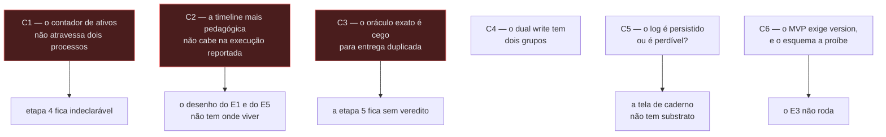
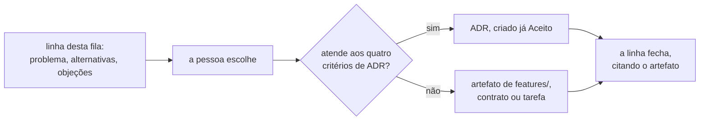

# Fila de avaliação — as decisões que esta rodada produziu

- **Estado:** Proposta — requer aprovação humana
- **Data:** 2026-08-03
- **Escopo:** consolidar, numa fila só, as 66 decisões que os documentos de
  arquitetura desta rodada deixaram para uma pessoa, e ordená-las pelo que cada
  uma destrava.
- **Depende de:** os sete ADRs aceitos da série corrente, e os nove documentos
  de proposta listados abaixo.

## O que este documento é, e o que ele não é

Cinco documentos de arquitetura foram escritos em paralelo em 2026-08-03, sob a
stack definida pelo usuário: Java com Spring Boot 4.x, PostgreSQL, RabbitMQ com
CloudEvents, Debezium se houver gatilho, e React com Next.js e Tailwind. Cada um
registrou as decisões que não podia tomar sozinho, com o prefixo do seu domínio.

Este arquivo **não decide nada** e **não repete o conteúdo**. Ele é o índice, mais
a única análise que nenhum dos cinco documentos podia fazer: **o que cada decisão
destrava**, visto de cima dos cinco.

Nenhum documento desta rodada é ADR. A fila de decisões de
[`../adr/README.md`](../adr/README.md) continua sendo a única fonte de decisão
arquitetural, e o processo continua sendo **um ADR por vez**. A lição registrada
em [`../adr/README.md`](../adr/README.md), seção "A lição que a primeira série
deixou", é a razão de esta rodada ter produzido proposta, e não decisão.

| Documento                                            | Prefixo | Decisões |
|------------------------------------------------------|---------|----------|
| [`../CONTEXT.md`](../CONTEXT.md)                     | `D-DOM` | 6        |
| [`modelo-de-dominio.md`](modelo-de-dominio.md)       | `D-DOM` | 10       |
| [`modelo-de-dados.md`](modelo-de-dados.md)           | `D-DAT` | 11       |
| [`arquitetura-alvo.md`](arquitetura-alvo.md)         | `D-ARQ` | 4        |
| [`modulos-e-fronteiras.md`](modulos-e-fronteiras.md) | `D-ARQ` | 5        |
| [`entrega-continua.md`](entrega-continua.md)         | `D-ARQ` | 6        |
| [`mensageria.md`](mensageria.md)                     | `D-MSG` | 11       |
| [`interface-web.md`](interface-web.md)               | `D-UI`  | 7        |
| [`contratos-de-api.md`](contratos-de-api.md)         | `D-UI`  | 6        |

---

## Leia isto antes das tabelas: seis contradições dentro de ADRs aceitos

Estas **não são decisões de proposta**. São defeitos que os agentes encontraram
nos documentos que já estão em vigor, e que nenhuma aprovação de proposta
resolve. Um ADR aceito não pode ser editado — cada uma exige ADR novo, ou uma
subsunção, no sentido de [`../adr/README.md`](../adr/README.md), seção
"Substituição e subsunção são coisas diferentes".

Elas vêm primeiro porque mudam o que vale a pena aprovar nas tabelas abaixo.

### C1 — O escalonador não sobrevive à etapa 4

O ADR-0005 mantém, **por execução e em
memória**, um contador de workers ativos (`../adr/0005-a-forma-do-escalonador.md:60-61`), e o zero desse contador é o
sinal que o oráculo aguarda antes de ler o banco (`:77-80`). A etapa 4 põe os
workers em dois processos (`../plano-do-laboratorio.md:344`). O contador de um
processo não enxerga os workers do outro, e o sinal de término nunca chega.

Nenhum documento do repositório registrava isso. Detalhe em `D-ARQ-03`.

### C2 — O desenho mais pedagógico do laboratório não cabe na execução que o reporta

O plano exige, para o E1, uma timeline mostrando "dois `READ version=N` antes de
dois `WRITE version=N+1`" (`../plano-do-laboratorio.md:395-396`), e para o E5 os
dois `SELECT sum` antes de qualquer `INSERT` (`:469-471`). Os dois são
afirmações de **precedência entre workers**.

A execução medida roda **sem agendamento**
(`../adr/0004-o-estatuto-da-barreira-e-o-diagnostico-da-nao-ocorrencia.md:101`),
logo nenhum evento dela tem `restrito = verdadeiro`. Sem isso, o log **não
garante ordem entre workers**, e a timeline "NÃO DEVE ser lida como prova de
precedência"
(`../adr/0007-o-log-de-observacoes-forma-ordem-e-onde-vive.md:80-83`). A
execução em que a ordem é real é o controle positivo — e ela "NÃO DEVE ser
reportada como resultado do experimento" (`../adr/0004-...md:258`).

Detalhe em `D-UI-04` e `D-UI-05`.

### C3 — O oráculo exato é cego para a entrega duplicada

`perdidas = commits − (value_final − value_inicial)`
(`../adr/0002-o-dominio-minimo-e-os-dois-oraculos.md:140`). Uma mensagem
reentregue faz o worker commitar de novo: `commits` sobe, `value_final` sobe, e a
diferença fica zero. A outra métrica, `commits − sucessos`, mede o caso oposto —
o commit sem sucesso reportado.

A etapa 5 estuda a duplicata de entrega e **não tem veredito**. Detalhe em
`D-MSG-02`.

### C4 — O dual write está classificado em dois grupos diferentes

O ADR-0002 chama o dual write de "o fenômeno do grupo B que a etapa 6 estuda"
(`../adr/0002-...md:175`). O plano o classifica no grupo C, escrita parcial (`../plano-do-laboratorio.md:204-207`). O ADR está aceito e não é editável.

### C5 — O log é persistido no fim, ou é perdível?

O plano diz que no MVP o log "vive em memória e é persistido no fim da execução"
(`../plano-do-laboratorio.md:589-592`). O ADR-0007, posterior e aceito, diz que a
persistência durável está fora de escopo até a etapa 6 e aceita que "o log é
perdível" (`../adr/0007-...md:86-88`, `:152-153`).

Duas telas propostas dependem de qual leitura vale. Detalhe em `D-DAT-10` e
`D-UI-12` da numeração de `interface-web.md`.

### C6 — O MVP exige `version`, e o esquema a proíbe

**Esta contradição não existe.** A verificação está na seção seguinte, e o restante
deste bloco registra o que se afirmava antes dela.

"Nenhuma outra coluna entra no MVP" (`../adr/0002-...md:93`). O E3 roda
`OPTIMISTIC`, que "exige `version` em `Resource`"
(`../adr/0006-a-forma-da-estrategia-de-concorrencia.md:56-57`), e o E3 está na
etapa 2 — dentro do MVP (`../plano-do-laboratorio.md:356-357`).

O próprio ADR-0002 registra a consequência (`:465-466`), o que sugere que a
frase descreve o esquema **inicial**. A leitura não está escrita, e o ADR-0006
condiciona a migração a "quando a arquitetura mínima existir" (`:56-58`). Sem
mecanismo de migração, o E3 não roda: por isso `D-DAT-04` deixou de ser
preferência de ferramenta.

---

## O que a verificação de 2026-08-04 muda neste arquivo

[`contra-avaliacao.md`](contra-avaliacao.md) contestou este índice. Duas objeções
foram reconferidas por leitura direta, e as duas procedem.

**C6 não é contradição.** O ADR-0002 delega a coluna `version` de forma explícita:
"O esquema NÃO DEVE carregar uma coluna `version`. Quem a acrescenta é o ADR de
estratégias de concorrência, no mesmo commit em que decidir a política que a lê"
(`../adr/0002-o-dominio-minimo-e-os-dois-oraculos.md:95-96`). O ADR-0006 aceita a
delegação e nomeia a condição: "quando a arquitetura mínima existir"
(`../adr/0006-a-forma-da-estrategia-de-concorrencia.md:56-58`). Existe delegação
cumprida. O que resta de C6 é a ferramenta de migração, que já é `D-DAT-04`.

**A contagem é 64, e não 66.** Os identificadores únicos deste arquivo somam 64, e
os documentos-fonte somam 66. `D-ARQ-02` e `D-DOM-11` têm seção própria na fonte e
não aparecem em bloco nenhum aqui. Uma aprovação "das 66" aprova 64 e deixa duas
decisões sem estado.

### O ciclo de vida desta fila, decidido em 2026-08-04

Levantado em 2026-08-04, no turno em que a resolução do arquivo foi pedida: nenhuma
tabela deste índice tinha coluna de estado, e nenhuma seção dizia onde uma aprovação
era escrita. Uma decisão aprovada apenas na conversa desaparece no próximo compact,
que é o que [`../AGENTS.md`](../AGENTS.md) proíbe na primeira regra.

A lacuna foi fechada no mesmo dia. Uma linha desta fila fecha quando a pessoa
escolhe, e a escolha nomeia o artefato que a registra — ADR quando atender aos
quatro critérios de [`../adr/README.md`](../adr/README.md), artefato de
[`../features/`](../features/README.md) quando não atender. O processo está em
[`../specification-process.md`](../specification-process.md), seção "A decisão vem
antes do artefato".

**Três linhas já fecharam: `D-ARQ-05`, `D-ARQ-06` e `D-ARQ-01`**, todas pelo
[ADR-0008](../adr/0008-os-dois-planos-em-processos-separados.md), aceito em 2026-08-04.
As demais não têm artefato definido. A tabela abaixo agrupa as 64 linhas por assunto. O
agrupamento não é o documento que cada assunto vai gerar: esse só existe depois da
escolha.

| Assunto                                        | Linhas                                                                                          |
|------------------------------------------------|-------------------------------------------------------------------------------------------------|
| Experimento: definição, semente, ciclo de vida | Bloco 3, mais `D-DAT-05`, `D-UI-08` e `D-UI-10`, conforme R4                                    |
| Formatos de veredito                           | `D-DOM-05` e `D-DOM-16`                                                                         |
| A forma do artefato compilável                 | `D-ARQ-05`, `D-ARQ-06`, `D-ARQ-04`                                                              |
| A guarda executável das três regras            | `D-ARQ-07`, `D-ARQ-08`, `D-ARQ-09`, `D-DOM-15`                                                  |
| O esquema e a primeira migração                | `D-DAT-01` a `D-DAT-04`, `D-DAT-08`, `D-DAT-09`, `D-DOM-07`, `D-DOM-08`, `D-DOM-13`, `D-DOM-14` |
| Entrega contínua no homelab                    | `D-ARQ-12`, `D-ARQ-14`, `D-ARQ-15`, `D-ARQ-10`, `D-ARQ-11`, `D-ARQ-13`                          |
| Vocabulário                                    | Bloco 4, com destino em [`../CONTEXT.md`](../CONTEXT.md)                                        |
| Mensageria, sem gatilho hoje                   | Bloco 6                                                                                         |
| Interface web                                  | `D-UI-02` a `D-UI-13`, menos as que R4 move para o Bloco 3                                      |

Os três primeiros assuntos da coluna esquerda vinham colados na posição 10 da fila de
[`../adr/README.md`](../adr/README.md), que os descreve como "um módulo, dois planos na
mesma JVM, separação imposta por teste" (`../adr/README.md:273`). São três assuntos, e
o checklist daquela página (`:66`) pergunta, antes de apresentar um ADR: "existe **uma**
decisão só?". O esquema, em particular, não tem linha própria em fila nenhuma.

**Pergunta em aberto.** Esta fila e a de [`../adr/README.md`](../adr/README.md) são duas
listas do mesmo tipo de coisa, e não foram fundidas. Enquanto forem duas, uma decisão
PODE ser tomada numa e reaberta na outra.

### A separação física entre os dois planos

Instrução do usuário, registrada em 2026-08-04: **"o sistema sob teste deve estar
fisicamente separado do sistema que planeja o teste"**.

Ela recorta `D-ARQ-05` e alcança `D-ARQ-01`, e a palavra "fisicamente" admite duas
leituras com custos muito diferentes.

| Leitura                      | Fronteira    | Quando a violação aparece | Custo na medida                 |
|------------------------------|--------------|---------------------------|---------------------------------|
| artefatos de build separados | módulo Maven | compilação                | nenhum; uma JVM só              |
| processos separados          | rede         | rede                      | a latência entra em toda medida |

**O argumento a favor da instrução é real e não estava escrito.** Na mesma JVM, os dois
planos compartilham destino: uma pausa de GC, um pool esgotado ou um vazamento no
instrumento perturba o sistema medido. O [`../AGENTS.md`](../AGENTS.md) reconhece a
convivência na mesma JVM como compromisso — "o que torna a separação por teste
executável mais necessária, não menos" — e não como virtude.

**O argumento contra a leitura por processos também é real.** O runtime retém workers em
cada fronteira entre passos, e o E1 do MVP emite entre 900 e 1500 observações. Com o
system under test em outro processo, cada travessia dessas passa a custar uma ida à
rede, e essa latência entra na medida de todo experimento. Além disso, o plano fixa
nenhum segundo processo até a etapa 4, e antecipar a decomposição é `D-ARQ-01`.

**Decisão tomada em 2026-08-04: processos separados**, desde o dia zero. Ela está
registrada no [ADR-0008](../adr/0008-os-dois-planos-em-processos-separados.md), `Aceito`,
que fecha `D-ARQ-05`, `D-ARQ-06` e, por consequência, `D-ARQ-01`. O usuário declarou
também uma restrição de infraestrutura: **o homelab terá uma instância de PostgreSQL**,
e a escolha entre schema separado e dois bancos na mesma instância ainda não foi feita.

**Uma evidência do repositório reformula essa escolha.**
[`modelo-de-dados.md`](modelo-de-dados.md), linhas 154 a 158: "um schema separado não
isola contenção. Dois schemas do mesmo banco compartilham buffer pool, WAL,
checkpointer, autovacuum e a tabela de locks. Schema é espaço de nomes; a fronteira de
contenção é a instância." O mesmo vale para dois bancos do mesmo cluster. Logo a escolha
entre schema e banco decide **permissão e espaço de nomes**, e não contaminação da
medida — as duas contaminam igual.

Cinco consequências seguem da separação por processo, e nenhuma tinha registro.

- **`D-ARQ-01` fica decidida por consequência.** A decomposição deixa de esperar o
  gatilho da etapa 4, contra a recomendação de
  [`arquitetura-alvo.md`](arquitetura-alvo.md). Aprovar isto é legítimo; silenciá-lo
  não.
- **A latência da rede entra na medida.** O runtime consulta escalonador e injetor em
  cada fronteira entre passos, e o E1 emite entre 900 e 1500 observações.
- **O escopo transacional precisa sobreviver entre chamadas.** Uma tentativa roda numa
  transação, numa conexão. Com o runtime noutro processo, a transação fica aberta no
  system under test enquanto o Lab Plane decide a fronteira. Como isso é declarado é
  decisão nova, e não tem destino nomeado.
- **`C1` não dispara.** Os workers continuam num processo só, o do Lab Plane. O contador
  de ativos do ADR-0005 sobrevive; o que atravessa a rede é a chamada de passo.
- **`D-DAT-06` fica sem forma.** Ele recomenda instância separada para o log durável da
  etapa 6, e o homelab terá uma instância só.

**Pergunta em aberto.** Como o runtime dirige os passos de uma tentativa que roda em
outro processo, sem quebrar a cláusula de honestidade do ADR-0001? Cada fronteira vira
uma ida à rede, e a transação fica aberta do outro lado. Nenhum documento do repositório
descreve esse mecanismo, e o ADR-0008 não o inventa.

**Pergunta em aberto.** Schema separado ou dois bancos na mesma instância? Nenhuma das
duas isola contenção, pela evidência de [`modelo-de-dados.md`](modelo-de-dados.md),
linhas 154 a 158. A escolha decide permissão e espaço de nomes, e não tem destino
nomeado.

**Pergunta em aberto.** Qual forma `D-DAT-06` assume com uma instância só? Ele recomenda
instância separada para o log durável da etapa 6, e a recomendação deixou de ser
executável. O gatilho continua sendo a etapa 6.

**Pergunta em aberto.** Como o `deploy/` declara dois artefatos executáveis no primeiro
commit? `D-ARQ-15` foi escrita sob a hipótese de um `Deployment` e uma réplica, e a
separação por processo a contradiz sem que ninguém tenha decidido a forma nova.

---

## Bloco 0 — sem estas seis, nenhuma linha de código é escrita

São as que a fila de [`../adr/README.md`](../adr/README.md) enfileira nas
posições 10 e 11, e a exigência de nascer entregando as torna as primeiras.

| ID         | Decisão                                  | Recomendação da proposta                          | Onde                                                 |
|------------|------------------------------------------|---------------------------------------------------|------------------------------------------------------|
| `D-ARQ-05` | mecanismo de módulo do primeiro artefato | Maven multi-módulo, quatro módulos, mais ArchUnit | [`modulos-e-fronteiras.md`](modulos-e-fronteiras.md) |
| `D-ARQ-12` | Maven contra Gradle                      | emendar a ADR 0017 do homelab para Maven          | [`entrega-continua.md`](entrega-continua.md)         |
| `D-ARQ-06` | pacote raiz e idioma dos identificadores | `dev.da0hn.lab`, região no primeiro segmento      | [`modulos-e-fronteiras.md`](modulos-e-fronteiras.md) |
| `D-ARQ-15` | a forma do `deploy/` no primeiro commit  | `deploy/` mínimo agora, uma réplica               | [`entrega-continua.md`](entrega-continua.md)         |
| `D-ARQ-14` | o que o pipeline executa                 | só guardas e provas; experimento sob demanda      | [`entrega-continua.md`](entrega-continua.md)         |
| `D-DAT-04` | ferramenta de migração                   | Flyway com SQL versionado                         | [`modelo-de-dados.md`](modelo-de-dados.md)           |

**`D-ARQ-05` e `D-ARQ-06` estão fechadas** pelo
[ADR-0008](../adr/0008-os-dois-planos-em-processos-separados.md), `Aceito` em
2026-08-04. A escolha não foi a recomendação da linha: o mecanismo de módulo é a
**fronteira de processo**, e não Maven multi-módulo. O pacote raiz `dev.da0hn.lab` com a
região no primeiro segmento foi aceito como recomendado, com os identificadores
**todos** em inglês. As duas linhas permanecem na tabela para que o histórico da
recomendação não se perca.

`D-ARQ-12` é a única com custo fora deste repositório: ela emenda um documento
`Aceito` do [`homelab-infrastructure`](https://github.com/da0hn/homelab-infrastructure).
`D-ARQ-15` fecha o `ComparisonError` que o ArgoCD reporta hoje, e a separação por
processo muda a forma que ela precisa declarar.

## Bloco 1 — destravam o esquema e a primeira migração

| ID         | Decisão                                       | Recomendação da proposta                 |
|------------|-----------------------------------------------|------------------------------------------|
| `D-DAT-01` | tipo e derivação da coluna de identidade      | `bigint` ordinal da semente              |
| `D-DAT-02` | chave estrangeira de `allocation.resource_id` | sem FK no MVP                            |
| `D-DAT-03` | índice sobre `allocation(resource_id)`        | criar, e registrar o plano efetivo       |
| `D-DAT-05` | como o banco volta ao ponto de partida        | decidida em 2026-08-05: não há reset     |
| `D-DOM-14` | dono da identidade derivada da semente        | o experimento publica; o domínio consome |
| `D-DOM-13` | o esquema compartilhado entre os dois planos  | Shared Kernel com contrato verificável   |

`D-DAT-02` tem a justificativa mais afiada da rodada: com chave estrangeira, o
`INSERT` de uma alocação toma `FOR KEY SHARE` na linha do recurso e conflita com
o `FOR UPDATE` do `PESSIMISTIC` — uma restrição de integridade mudaria o
fenômeno medido.

`D-DAT-05` recomendava `TRUNCATE` antes de cada execução até 2026-08-05, quando uma
quarta candidata entrou — pôr a execução na chave primária, preservando todo o
histórico — e `P-DAT-9` mostrou que a objeção de `Q-0002-4` contra preservar linhas
entre execuções não se sustenta sobre nenhum dos dois critérios de igualdade aceitos.
**O usuário decidiu na mesma data: não há reset.** A chave primária das duas tabelas
passa a incluir um discriminador UUIDv7, gerado pelo Lab Plane e propagado a tudo que o
sistema medido publica, com o crescimento das tabelas aceito. A linha permanece aqui
para que o histórico da recomendação não se perca; a decisão e o que ela deixa em aberto
estão em [`modelo-de-dados.md`](modelo-de-dados.md), seção 7, `D-DAT-05`, `P-DAT-10` e
`P-DAT-11`.

## Bloco 2 — destravam o E1 e a etapa 1

| ID         | Decisão                                  | Recomendação da proposta                        |
|------------|------------------------------------------|-------------------------------------------------|
| `D-ARQ-04` | modelo de thread do worker               | threads de plataforma no MVP                    |
| `D-ARQ-07` | o que verifica cada classe de regra      | compilação para região; ArchUnit para o resto   |
| `D-ARQ-08` | onde vivem o relógio e a fonte semeada   | isenção posicional, sem anotação de supressão   |
| `D-ARQ-09` | a forma da guarda da chave de contenção  | recusa na primeira passagem                     |
| `D-DAT-08` | como o nível de isolamento é aplicado    | `TransactionTemplate`, pelo runtime             |
| `D-DAT-09` | verificação de "uma conexão por worker"  | tamanho de pool mais asserção de PID distinto   |
| `D-DOM-07` | `Allocation` é agregado próprio          | agregado próprio                                |
| `D-DOM-08` | onde vive `Σ amount ≤ capacity`          | no oráculo, como invariante observada           |
| `D-DOM-15` | quais fronteiras a stack materializa     | só system under test / Lab Plane, imposta por teste |
| `D-UI-02`  | onde o frontend renderiza                | exportação estática                             |
| `D-UI-03`  | framework de componentes                 | shadcn/ui sobre Radix                           |
| `D-UI-04`  | eixo padrão da timeline                  | posição no log, com arestas causais             |
| `D-UI-06`  | teto de eventos no navegador             | paginação contra o servidor                     |
| `D-UI-07`  | autenticação e autoria                   | nenhuma, declarada; autoria vinda do commit     |
| `D-UI-08`  | o que o `POST` cria                      | a sequência de execuções, não uma               |
| `D-UI-09`  | mecanismo de streaming                   | SSE, com limiar numérico proposto               |
| `D-UI-10`  | idempotência de iniciar execução         | chave obrigatória do cliente                    |
| `D-UI-11`  | vocabulário do contrato                  | português, igual ao glossário                   |
| `D-UI-12`  | compatibilidade e enumeração do veredito | enumeração aberta, cliente falha fechado        |

`D-ARQ-07` e `D-ARQ-08` são a resposta proposta a
[`Q-0002-1`](../questions/Q-0002-1.md), que pede a guarda executável das três
regras hoje textuais. `D-ARQ-09` responde
[`Q-0004-2`](../questions/Q-0004-2.md).

`D-DOM-07` e `D-DOM-08` carregam a descoberta conceitual da rodada: **o
agregado clássico do DDD é antipadrão aqui.** Um `Resource` que impusesse
`Σ amount ≤ capacity` na fronteira transacional tornaria o E5 irreproduzível,
pelo mesmo argumento com que o ADR-0002 descartou a constraint no banco —
confundir observar com impedir (`../adr/0002-...md:566-574`).

## Bloco 3 — pertencem a um ADR já enfileirado, e a recomendação é não decidir agora

| ID         | Decisão                                  | Destino na fila de ADRs                                       |
|------------|------------------------------------------|---------------------------------------------------------------|
| `D-DOM-06` | o que `N` conta                          | Experiment, posição 8; [`Q-0003-8`](../questions/Q-0003-8.md) |
| `D-DOM-09` | se `Experimento` é raiz das execuções    | Experiment, posição 8                                         |
| `D-DAT-07` | onde vive a definição de experimento     | Experiment, posição 8                                         |
| `D-UI-01`  | fonte de verdade da definição            | Experiment, posição 8                                         |
| `D-DOM-05` | se `veredito` vira quatro termos         | formatos de veredito, posição 9                               |
| `D-DOM-16` | se o modelo reserva lugar para a curva   | formatos de veredito, posição 9                               |
| `D-DOM-10` | se o log é agregado próprio              | gatilho na etapa 6                                            |
| `D-DOM-12` | se a injeção de falha é contexto próprio | gatilho na etapa 6                                            |

Aprovar qualquer uma destas **antecipa um ADR enfileirado**, e é a forma mais
provável de esta rodada causar dano. A recomendação de cada uma é adiar.

## Bloco 4 — vocabulário, decidível a qualquer momento e barato

**As quatro estão fechadas desde 2026-08-04.** As escolhas e as consequências de cada
uma vivem em [`../CONTEXT.md`](../CONTEXT.md), seção "As seis decisões de vocabulário".

| ID         | Decisão                                         | Escolha                                                 | Seguiu a recomendação? |
|------------|-------------------------------------------------|---------------------------------------------------------|------------------------|
| `D-DOM-01` | qual sentido `execução` carrega sozinha         | `run` no experimento, `operation execution` na operação | sim                    |
| `D-DOM-02` | separar `system under test` de execução de controle | renomear para `system under test`                       | **não**                |
| `D-DOM-03` | se `barreira` continua na linguagem             | aposentar, com citação histórica permitida              | sim                    |
| `D-DOM-04` | os dois sentidos de `estratégia`                | `strategy` e `strategy label`                           | sim                    |

`D-DOM-03` foi executada no mesmo turno: os oito pontos de
[`mensageria.md`](mensageria.md) que usavam `barreira` como termo passaram a dizer
`restrição de precedência` ou `espera`, e o mérito de `D-MSG-11` não mudou.

`D-DOM-02` foi decidida contra a recomendação, e abriu duas perguntas que a alternativa
A não tratava. As duas estão em [`../CONTEXT.md`](../CONTEXT.md), na seção `D-DOM-02`:
se `Lab Plane` acompanha a renomeação, e se ela alcança as 95 ocorrências em texto
editável ou só o glossário.

**Pergunta em aberto.** Qual artefato registra estas quatro? O processo de
[`../adr/README.md`](../adr/README.md) prevê ADR ou artefato de
[`../features/`](../features/README.md), e vocabulário não é nem um nem outro — ele vive
no glossário, por instrução de [`../AGENTS.md`](../AGENTS.md), seção `## Glossário de
domínio`. `D-DOM-02` é a que mais puxa para ADR: ela renomeia um termo presente em
quatro ADRs aceitos, e o rastro de alterações adotado em 2026-08-04 obrigaria a carimbar
os quatro.

Estas quatro existem porque **os ADRs aceitos já colidem entre si no
vocabulário**. Decidi-las é barato agora e caro depois de existir código.

**A contra-avaliação sustenta este bloco.** Ele é "o único bloco aprovável como está"
([`contra-avaliacao.md`](contra-avaliacao.md), linhas 430 a 434), porque as quatro
colisões são reais entre ADRs aceitos, independem da fila e ficam caras depois de
existir código. Nenhuma das quatro pode ser resolvida editando um ADR.

Dois fatos levantados em 2026-08-04, antes de qualquer escolha.

**O glossário já aplicou a recomendação de `D-DOM-03` sem a decisão existir.**
[`../CONTEXT.md`](../CONTEXT.md), linha 355, marca `barrier` como `aposentado`, e a
tabela de estados daquele arquivo (linha 49) reserva esse rótulo para o que "existiu em
ADR aceito e foi retirado da linguagem por outro ADR". A recomendação virou texto antes
de virar escolha. Se a decisão for outra, aquela entrada muda junto, e o registro disso
não pode depender da memória de quem editou.

**Aprovar `D-DOM-03` obriga reescrever [`mensageria.md`](mensageria.md) no mesmo
turno.** A palavra é termo vivo e normativo ali: `mensageria.md:520`, `:539`,
`:548-553`, `:805` e `:1034-1054`, inclusive no enunciado e nas três alternativas de
`D-MSG-11`. A ressalva está em [`contra-avaliacao.md`](contra-avaliacao.md), linhas 143
a 145; o inventário de linhas é novo.

## Bloco 5 — etapa 4 e adiante, sem gatilho disparado hoje

| ID         | Decisão                                      | Etapa | Recomendação da proposta                 |
|------------|----------------------------------------------|-------|------------------------------------------|
| `D-ARQ-01` | seguir o gatilho ou antecipar serviços       | 4     | seguir o gatilho                         |
| `D-ARQ-03` | onde o Lab Plane vive com dois processos     | 4     | decidir quando a etapa 4 tiver gatilho   |
| `D-ARQ-11` | PostgreSQL dedicado ou compartilhado         | 0     | dedicado                                 |
| `D-ARQ-13` | experimento destrutivo sob `selfHeal`        | 6     | matar a operação, preservando o processo |
| `D-ARQ-10` | Toxiproxy                                    | —     | emendar a ADR 0017 e retirar             |
| `D-DAT-06` | onde o log durável vive                      | 6     | instância separada da medida             |
| `D-DAT-10` | o que do log entra no Git                    | 6     | relatório mais eventos restritos         |
| `D-DAT-11` | instância e `wal_level` se o CDC entrar      | —     | dedicada                                 |
| `D-UI-05`  | onde vive o desenho pedagógico               | 1     | só no controle positivo                  |
| `D-UI-13`  | como o relatório chega a `docs/experiments/` | 1     | download e commit por pessoa             |

`D-ARQ-01` é a decisão que responde diretamente à instrução de usar
microsserviços: a proposta recomenda **seguir o gatilho**, isto é, começar com um
artefato e decompor quando o experimento `JVM_LOCK` ficar vermelho com duas
instâncias. Aprovar o contrário é legítimo e tem custo nomeado no documento.

**`D-ARQ-01` está fechada, contra a recomendação**, pelo
[ADR-0008](../adr/0008-os-dois-planos-em-processos-separados.md). A decomposição deixou
de esperar o gatilho da etapa 4: os dois planos rodam em processos separados desde o dia
zero. `D-ARQ-03` continua aberta e muda de sentido — ela deixa de perguntar onde o Lab
Plane vive quando existirem dois processos e passa a perguntar o que muda quando o
system under test ganhar a segunda instância.

## Bloco 6 — mensageria, etapa 5 e adiante

Nenhuma destas tem gatilho disparado hoje. Elas existem para que a etapa 5 não
comece sem desenho, e **nenhuma delas deve ser construída antes do gatilho**.

| ID         | Decisão                                      | Recomendação da proposta                    |
|------------|----------------------------------------------|---------------------------------------------|
| `D-MSG-01` | gatilho concreto que libera o RabbitMQ       | broker real, pelo mecanismo da reentrega    |
| `D-MSG-02` | como uma entrega duplicada é contada         | contagem nova de comandos distintos aceitos |
| `D-MSG-03` | quem carimba os atributos de extensão        | o runtime, na fronteira                     |
| `D-MSG-04` | modo do binding CloudEvents e versão do AMQP | binário sobre 0-9-1, mapeamento declarado   |
| `D-MSG-05` | que recursos do broker ficam desligados      | nenhum DLX e nenhum limite até a etapa 8    |
| `D-MSG-06` | confirmação de publicador                    | ligada, com braço de comparação desligado   |
| `D-MSG-07` | se o broker é fonte legítima do oráculo      | é fonte só depois da quiescência            |
| `D-MSG-08` | ciclo de vida de uma reentrega               | execução nova, com ADR novo sobre o log     |
| `D-MSG-09` | quem cria e destrói a topologia              | por execução                                |
| `D-MSG-10` | se o CDC com Debezium entra                  | **não entra**; gatilhos registrados         |
| `D-MSG-11` | barreira contra o limite de confirmação      | declarar o limite por execução e reportá-lo |

`D-MSG-05` é a que mais contraria a intuição: a proposta recomenda **desligar**
DLX e limite de entregas até a etapa 8, porque com eles ligados os cenários 18 e
19 não têm o que mostrar. É a regra pedagógica aplicada à configuração do broker.

`D-MSG-10` é a resposta à instrução sobre Debezium. O argumento decisivo não é de
custo: o CDC **apaga os pontos `BEFORE_PUBLISH` e `AFTER_PUBLISH` do ADR-0001**,
porque sem passo `PUBLISH` na operação a etapa 6 perde o gatilho que o plano lhe
dá (`../plano-do-laboratorio.md:609`). Os dois gatilhos que criariam o CDC estão
registrados em [`mensageria.md`](mensageria.md).

---

## O que esta rodada não produziu

- **Nenhum ADR.** O processo de [`../adr/README.md`](../adr/README.md) é um por
  vez, com contexto limpo, e cinco documentos escritos em paralelo são
  exatamente o que produziu as três contradições da primeira série.
- **Nenhum contrato em `contracts/`.** Os esboços de OpenAPI, AsyncAPI, JSON
  Schema e DDL vivem em bloco cercado dentro dos documentos de proposta. Um
  contrato nasce quando a interface existir ([`../contracts/README.md`](../contracts/README.md)).
- **Nenhuma edição em `integrations.md`.** As linhas de matriz propostas estão
  nas seções `## Adições propostas` de cada documento.
- **Nenhum código, nenhum `pom.xml`, nenhum `deploy/`.** A árvore continua só com
  `docs/`.

## Uma nota sobre os identificadores `Q-INT-*`

Quatro documentos atribuíram `Q-INT-6`, `Q-INT-7` e `Q-INT-8` a questões
diferentes, porque foram escritos sem se ver. `integrations.md` vai até
`Q-INT-5` e é ele que define o espaço de nomes.

A colisão foi resolvida por faixas disjuntas: `arquitetura-alvo.md` e
`modulos-e-fronteiras.md` ficam com 6 a 8, `mensageria.md` com 9 a 11,
`interface-web.md` com 12 a 15 e `contratos-de-api.md` com 16 e 17.

Os números são **provisórios**. Um identificador só é definitivo quando a linha
entra em [`integrations.md`](integrations.md), pelo mesmo motivo que
[`../adr/README.md`](../adr/README.md) não atribui número a decisão que ainda
não virou ADR: atribuir antes cria buraco na sequência quando a ordem muda.
