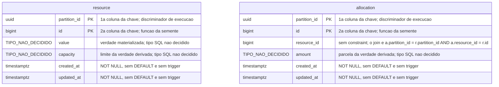
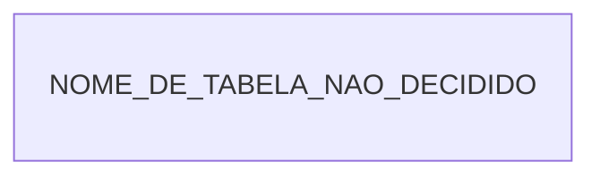

# Os dois esquemas, e a fronteira que eles não atravessam

Dona única da forma de **dois** schemas — `sut` e `lab_plane` —, e não dos três que o
repositório tem: `lab_journal` fica fora, porque o
[ADR-0011](../adr/0011-a-topologia-de-servicos-e-o-caderno-de-laboratorio-fora-do-git.md#o-caderno-de-laboratório-sai-do-git)
pôs a definição e o resultado de experimento lá. A forma dele não tem dono enquanto
[`E-57`](../adr/fila-de-decisoes.md#e-57--a-definição-de-experimento-tem-dois-donos-declarados)
não fechar. **Nenhum documento vigente carrega DDL** e a exceção é `docs/adr/arquivo/`
inteiro, congelado — as duas coisas são do fecho de
[`E-55`](../adr/fila-de-decisoes.md#e-55-fecha-na-divisão-entre-o-adr-e-um-documento-de-arquitetura-escolhida-em-2026-08-11).
Vários arquivos de lá carregam bloco SQL, entre eles a
[proposta de modelo de dados](../adr/arquivo/proposta-2026-08-03/modelo-de-dados.md#1-o-esquema-do-system-under-test).

**Nada aqui é decisão nova.** Cada afirmação cita onde a escolha foi fechada, e o que não
foi decidido fica como `Pergunta em aberto`. Esta página também não é contrato — o DDL de
um serviço saiu do inventário por regra própria, em
[`contracts/README.md`](../contracts/README.md#o-ddl-de-um-serviço-não-é-contrato).

## Por que a forma vive aqui, e não dentro do ADR-0015

Decidido pela pessoa em 2026-08-11, no fecho de
[`E-55`](../adr/fila-de-decisoes.md#e-55-fecha-na-divisão-entre-o-adr-e-um-documento-de-arquitetura-escolhida-em-2026-08-11).
O [ADR-0015](../adr/0015-a-chave-o-discriminador-de-execucao-e-as-colunas-de-tempo.md#decisão)
fica com o que restringe **como o instrumento mede**; a forma desce para cá.

O motivo é o ciclo de vida: o corpo de um ADR aceito só muda por cerimônia de
[lifecycle](../adr/README.md#a-revogação-da-imutabilidade-decidida-em-2026-08-07),
e o esquema muda antes disso — `version` entra quando `OPTIMISTIC` nascer, como o
[ADR-0006](../adr/0006-a-forma-da-estrategia-de-concorrencia.md#decisão) e o comentário da
`V1` do sistema medido já anunciam
(`system-under-test/src/main/resources/db/migration/V1__criar_schema_do_sut.sql:5-7`, por
linha, porque o alvo não tem título).

| Alternativa descartada em 2026-08-11 | Por que ela perdeu                                                                                             |
|--------------------------------------|----------------------------------------------------------------------------------------------------------------|
| o diagrama dentro dos Feature Cards  | duas capacidades tocam o schema medido, e o mesmo desenho apareceria duas vezes, livre para divergir, sem dono |
| o diagrama dentro do ADR-0015        | o corpo de um ADR aceito só muda por cerimônia de lifecycle, e o esquema muda antes dela                       |
| um bloco SQL ilustrativo ao lado     | criaria um segundo lugar onde a forma da tabela vive, e os dois divergiriam                                    |

**Manter os dois diagramas desta página equalizados com a migração é mecânico, e não
confiança na memória de quem editar.** `scripts/check_schema_sync.py` compara nome de
tabela entre cada `erDiagram` abaixo e as migrações Flyway do serviço correspondente,
com baseline própria para divergência deliberada — decidido em
[`E-65`, fecho](../adr/fila-de-decisoes.md#e-65-fecha-no-script-de-nome-de-tabela-escolhida-em-2026-08-11).
O script ainda não existe.

## O schema do sistema medido, `sut`

### O que o diagrama do `sut` não desenha

**O `erDiagram` acima anota, por comentário de coluna, tudo que ele não tem sintaxe
própria para desenhar: ausência de FK, o join composto que a substitui, ordem da chave
composta, ausência de `DEFAULT` e de trigger, e origem do valor da identidade.** A última
linha da tabela — o tipo de `value`, `capacity` e `amount` — não é ausência decidida: é
`Pergunta em aberto`, e o
token `TIPO_NAO_DECIDIDO` marca exatamente isso. Só o **índice aditivo** sobre
`allocation` fica de fora até do comentário: `erDiagram` não expressa índice, e nada
acima o substitui. A tabela sustenta cada linha com evidência, o que um comentário
sozinho não carrega.

| O que o diagrama anota (ou não)               | O que foi decidido                                                                                                                                                                                                                                                                                                                                                                                           | Evidência                                                                                                                                                                                                    |
|-----------------------------------------------|--------------------------------------------------------------------------------------------------------------------------------------------------------------------------------------------------------------------------------------------------------------------------------------------------------------------------------------------------------------------------------------------------------------|--------------------------------------------------------------------------------------------------------------------------------------------------------------------------------------------------------------|
| `"sem constraint"` e o join, em `resource_id` | ausência de FK, e o **join composto** que a substitui: `a.partition_id = r.partition_id AND a.resource_id = r.id`. Sem as duas colunas, a consulta cruza execuções, que é o que o discriminador existe para impedir. Onde a órfã é verificada segue em aberto, e o porquê da ausência é do [ADR-0015, Justificativa](../adr/0015-a-chave-o-discriminador-de-execucao-e-as-colunas-de-tempo.md#justificativa) | [`E-9`](../adr/fila-de-decisoes.md#e-9-fecha-a-escolha-e-abre-uma-pendência-que-e-18-criou)                                                                                                                  |
| `"1a"`/`"2a coluna da chave"`                 | o discriminador vem **primeiro**, `(partition_id, id)`; ele é um UUIDv7, e o prefixo de instante põe toda inserção no fim da B-tree                                                                                                                                                                                                                                                                          | [`E-22`](../adr/fila-de-decisoes.md#e-22-fecha-em-execution_id-id-e-a-linha-foi-decidida-duas-vezes) e [`E-23`, fecho](../adr/fila-de-decisoes.md#e-23-fecha-em-nomes-assimétricos-um-por-lado-da-fronteira) |
| nada — a única ausência real                  | o índice aditivo `(partition_id, resource_id)` sobre `allocation`. O porquê publicá-lo é do [ADR-0015, Sem chave estrangeira](../adr/0015-a-chave-o-discriminador-de-execucao-e-as-colunas-de-tempo.md#sem-chave-estrangeira-em-allocationresource_id)                                                                                                                                                       | [`E-10`, fecho](../adr/fila-de-decisoes.md#a-primeira-rodada-do-grupo-ii-em-2026-08-06) e [`E-23`, fecho](../adr/fila-de-decisoes.md#e-23-fecha-em-nomes-assimétricos-um-por-lado-da-fronteira)              |
| `"NOT NULL, sem DEFAULT e sem trigger"`       | `timestamptz NOT NULL`, preenchida pela aplicação com o adaptador de relógio; a escrita que esquecer a coluna falha alto                                                                                                                                                                                                                                                                                     | [`E-27`](../adr/fila-de-decisoes.md#e-27-fecha-na-aplicação-e-o-ddl-das-duas-tabelas-medidas-deixa-de-ter-lacuna)                                                                                            |
| `"funcao da semente"`                         | o tipo é `bigint` e o valor é **derivado da semente**, e não gerado pelo banco; `allocation.resource_id` repete o tipo porque aponta para `resource.id`                                                                                                                                                                                                                                                      | [`E-8`, fecho](../adr/fila-de-decisoes.md#a-primeira-rodada-do-grupo-ii-em-2026-08-06)                                                                                                                       |
| `"tipo SQL nao decidido"`                     | **`Pergunta em aberto`** — `TIPO_NAO_DECIDIDO` no desenho não é tipo de coluna, e nenhum tipo do PostgreSQL tem esse nome                                                                                                                                                                                                                                                                                    | [`E-56`](../adr/fila-de-decisoes.md#e-56--o-tipo-sql-de-value-capacity-e-amount-nunca-foi-decidido)                                                                                                          |

**Nenhuma migração cria as duas tabelas hoje.** A `V1` do sistema medido cria só o schema,
e forma decidida não é implementação.

## O schema do instrumento, `lab_plane`

### O que o diagrama do `lab_plane` não desenha

**Deste lado quase nada tem forma.** `NOME_DE_TABELA_NAO_DECIDIDO` é o mesmo tipo de
token que `TIPO_NAO_DECIDIDO` no diagrama do `sut`: não é nome de tabela, e nada deste
repositório se chama assim. A existência da tabela foi decidida; nome, colunas, chave e
migração continuam `Pergunta em aberto` — inclusive se ela carrega o discriminador. Não
existe tabela desenhada para as quatro colunas de tempo, e não existe decisão sobre em
qual banco a definição de experimento vive.

| O que não aparece no desenho   | O que foi decidido                                                                                                                  | Evidência                                                                                                                                                                                                                                          |
|--------------------------------|-------------------------------------------------------------------------------------------------------------------------------------|----------------------------------------------------------------------------------------------------------------------------------------------------------------------------------------------------------------------------------------------------|
| a forma da tabela              | a lista de execuções ativas vive numa tabela do `lab_plane`; "colunas, chave e migração" seguem sem escolha, e o abandono é `E-50`  | [`E-35`](../adr/fila-de-decisoes.md#e-35-fecha-em-tabela-no-lab_plane-escolhida-em-2026-08-10) e [`E-50`](../adr/fila-de-decisoes.md#e-50--como-uma-execução-que-nunca-termina-deixa-de-ser-ativa)                                                 |
| o vocabulário do discriminador | `execution_id` é o nome que o instrumento usa para ele, onde quer que apareça; que esta tabela o carregue não foi decidido          | [`E-23`](../adr/fila-de-decisoes.md#e-23-fecha-em-nomes-assimétricos-um-por-lado-da-fronteira)                                                                                                                                                     |
| as quatro colunas de tempo     | fonte de relógio decidida por papel do valor, sem tabela desenhada; onde a definição de experimento vive é **`Pergunta em aberto`** | [ADR-0015](../adr/0015-a-chave-o-discriminador-de-execucao-e-as-colunas-de-tempo.md#as-colunas-de-tempo-e-a-fonte-do-relógio-por-papel-do-valor) e [`E-57`](../adr/fila-de-decisoes.md#e-57--a-definição-de-experimento-tem-dois-donos-declarados) |

## A ausência de linha entre os dois diagramas é a decisão

Os dois esquemas são desenhados em canvas separados, **e nunca num só**. Um canvas único,
com uma linha ligando `partition_id` a `execution_id`, renderiza uma chave estrangeira que
a fronteira do
[ADR-0010](../adr/0010-a-fronteira-de-schema-e-o-cdc-como-fonte-do-veredito.md#decisão)
proíbe: nenhuma constraint liga os dois nomes, e nenhuma poderia ligá-los.

O mesmo valor carrega dois nomes de propósito, e quem traduz é um ponto único — o
consumidor de CDC, dentro do `lab-plane`. A tradução vive no
[ADR-0015](../adr/0015-a-chave-o-discriminador-de-execucao-e-as-colunas-de-tempo.md#o-nome-assimétrico-do-discriminador-e-a-tradução-num-ponto-único),
porque decorre da fronteira, e não da forma da tabela.

## O que muda esta página

- a coluna `version`, quando a estratégia `OPTIMISTIC` nascer;
- a forma da tabela de execuções ativas, quando `E-35` e `E-50` fecharem;
- o tipo SQL de `value`, `capacity` e `amount`, quando `E-56` fechar;
- onde a definição de experimento vive, quando `E-57` fechar.

Uma mudança aqui **NÃO DEVE** alterar o ADR-0015. Se ela mudar como o instrumento mede,
é decisão arquitetural nova, e entra na
[fila](../adr/fila-de-decisoes.md#o-que-esta-fila-enfileira).
