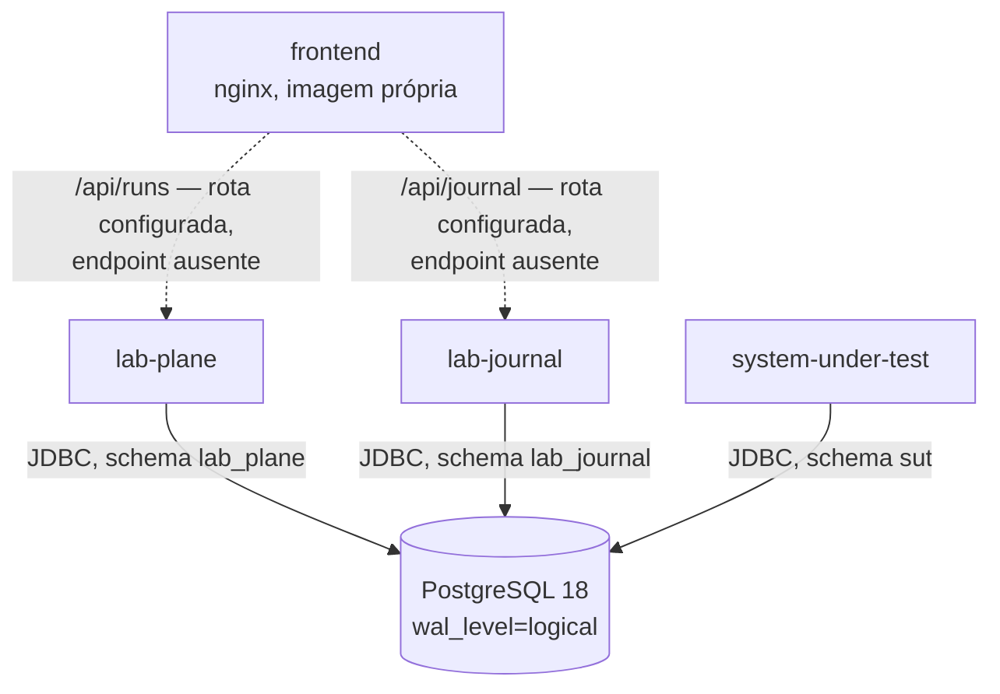
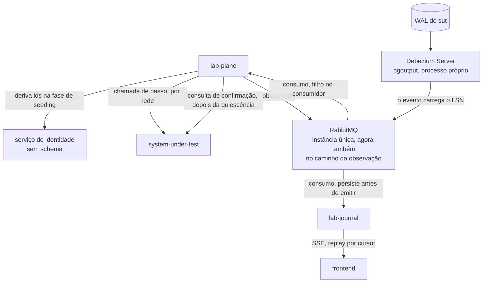
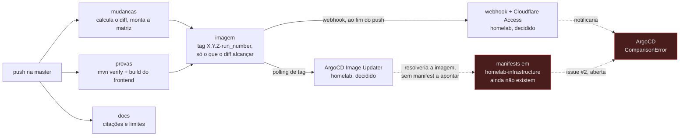

# Integrações

Tudo que atravessa uma fronteira de processo, e o estado de cada travessia.

**Esta página é a fonte de verdade única do estado e da topologia das fronteiras.** O
`README.md`, o `AGENTS.md`, os Feature Cards e
[`contracts/README.md`](../contracts/README.md#estado-nenhum-contrato-existe) resumem e
apontam para cá; nenhum deles declara estado de fronteira por conta própria. Estado
copiado envelhece em silêncio, e foi isso que aconteceu com a versão anterior desta
matriz: ela descrevia um repositório sem código, meses depois de o esqueleto existir.

Regenerada em 2026-08-07 contra a árvore versionada e os ADRs aceitos. Nenhuma linha foi
herdada sem reconferência no arquivo que a sustenta.

## Como ler esta página

### Os quatro estados

| Estado                      | Significado                                                      | Como se verifica                                    |
|-----------------------------|------------------------------------------------------------------|-----------------------------------------------------|
| `implementado`              | existe e funciona na árvore versionada agora                     | abrindo o arquivo citado                            |
| `decidido/não implementado` | fixado por ADR aceito, ou por decisão tomada sem ADR; sem código | a decisão está no ADR; a ausência, na árvore        |
| `hipótese`                  | descrito em documento de planejamento; ninguém decidiu           | nenhuma decisão o sustenta                          |
| `bloqueado`                 | existe e **não** funciona, com a causa nomeada                   | o sintoma é observável, e a causa tem identificador |

A divisão anterior era binária — fato contra hipótese — e não tinha onde pôr a categoria
mais numerosa deste repositório: a decisão tomada, com ADR aceito, para a qual não existe
uma linha de código. Chamá-la de hipótese convida a redecidir o que já foi decidido;
chamá-la de fato faz um agente presumir que há código a reusar. As duas leituras já
aconteceram aqui.

### As três classes de elemento

**"Serviço" passou a significar módulo Maven, executável, contêiner e processo de
infraestrutura ao mesmo tempo**, e é por isso que a documentação chegou a sustentar
quatro, cinco e sete processos simultaneamente, todos aparentemente corretos. Cada
elemento desta página pertence a uma classe só.

| Classe               | O que é                                                        | Vira imagem?                                         |
|----------------------|----------------------------------------------------------------|------------------------------------------------------|
| biblioteca           | módulo Maven sem ponto de entrada, compilado dentro dos outros | **não**                                              |
| serviço da aplicação | executável cujo código nasce neste repositório                 | sim, construída aqui                                 |
| infraestrutura       | processo de terceiro, configurado e não escrito aqui           | imagem de terceiro; **nenhum commit daqui a produz** |

## O inventário dos elementos

| Elemento              | Classe               | Estado                      | Evidência                                                                                                                                                                                                                                                                                  |
|-----------------------|----------------------|-----------------------------|--------------------------------------------------------------------------------------------------------------------------------------------------------------------------------------------------------------------------------------------------------------------------------------------|
| `shared`              | biblioteca           | `implementado`              | `shared/pom.xml`; não tem `spring-boot-maven-plugin` e não aparece na matriz de imagens de `.github/workflows/build.yml`                                                                                                                                                                   |
| `lab-plane`           | serviço da aplicação | `implementado` — esqueleto  | `lab-plane/pom.xml`; `compose.yaml`; região `dev.da0hn.lab.labplane`                                                                                                                                                                                                                       |
| `lab-journal`         | serviço da aplicação | `implementado` — esqueleto  | `lab-journal/pom.xml`; região `dev.da0hn.lab.journal`                                                                                                                                                                                                                                      |
| `system-under-test`   | serviço da aplicação | `implementado` — esqueleto  | `system-under-test/pom.xml`; região `dev.da0hn.lab.sut`                                                                                                                                                                                                                                    |
| `frontend`            | serviço da aplicação | `implementado` — esqueleto  | `frontend/Dockerfile`, `frontend/nginx.conf`; `frontend/src/App.tsx` não tem tela                                                                                                                                                                                                          |
| PostgreSQL 18         | infraestrutura       | `implementado`              | `compose.yaml`; instância local, efêmera — **não** é o cluster do homelab. No cluster, o mesmo papel é o CNPG compartilhado da Camada 6 — [ADR-0019](../adr/0019-a-entrega-sai-do-deploy-e-a-imagem-ganha-tag-semantica.md#o-postgresql-compartilhado-da-camada-6-ganha-replicação-lógica) |
| serviço de identidade | serviço da aplicação | `decidido/não implementado` | [ADR-0011](../adr/0011-a-topologia-de-servicos-e-o-caderno-de-laboratorio-fora-do-git.md#o-componente-de-identidade); não há módulo nem imagem                                                                                                                                             |
| Debezium Server       | infraestrutura       | `decidido/não implementado` | [ADR-0012](../adr/0012-o-broker-no-caminho-do-veredito-e-a-dispensa-que-ele-exigiu.md#decisão); imagem de terceiro, ausente de `compose.yaml`                                                                                                                                              |
| RabbitMQ              | infraestrutura       | `decidido/não implementado` | [ADR-0012](../adr/0012-o-broker-no-caminho-do-veredito-e-a-dispensa-que-ele-exigiu.md#decisão); ausente de `compose.yaml`                                                                                                                                                                  |
| ArgoCD                | infraestrutura       | `bloqueado`                 | vive no `homelab-infrastructure`; o `Application` aponta para manifests que ainda não existem lá — [ADR-0019](../adr/0019-a-entrega-sai-do-deploy-e-a-imagem-ganha-tag-semantica.md#decisão); [issue #2](https://github.com/da0hn/homelab-infrastructure/issues/2)                         |

**Cinco elementos são serviço da aplicação, e apenas quatro têm imagem hoje.** O quinto é
o serviço de identidade, decidido pelo ADR-0011. O `shared` não é o quinto: ele é
biblioteca, e a contagem "quatro serviços" do `AGENTS.md` deixou de valer pela
[decisão do ADR-0011](../adr/0011-a-topologia-de-servicos-e-o-caderno-de-laboratorio-fora-do-git.md#cinco-serviços-e-o-quatro-do-agentsmd-deixa-de-valer).

## A topologia implementada hoje

Os quatro contêineres da aplicação sobem, três deles conectam ao PostgreSQL e cada um
cria e possui o próprio schema pelo Flyway. O `frontend` já roteia dois prefixos de
caminho — `/api/runs` para o `lab-plane` e `/api/journal` para o `lab-journal` —, e do
outro lado de cada rota **não existe endpoint nenhum**. Nenhuma chamada entre serviços da
aplicação existe: o `lab-plane` não chama o `system-under-test`, e não emite observação
para o `lab-journal`.

**O `wal_level=logical` já está ligado e ninguém lê o WAL.** O `compose.yaml` sobe o
banco com replicação lógica habilitada porque o oráculo decidido depende dela; o processo
que a consumiria não existe. É provisionamento sem consumo, e está assim de propósito.

## A topologia decidida, e o que falta dela

O diagrama abaixo mostra **apenas o que falta**: os elementos e as travessias que os ADRs
0010, 0011, 0012, 0014 e 0016 fixaram, mais a consulta de confirmação que o
[fecho de `E-96`](../fila-de-decisoes.md#e-96-fecha-em-card-e-example-mapping-sem-adr-escolhida-em-2026-08-13)
decidiu sem ADR — e que nenhum arquivo da árvore implementa. Ele não repete nenhuma aresta
do diagrama anterior.

**A ordem entre as duas topologias importa.** A implementada não é um subconjunto
inocente da decidida: ela contém a fronteira de schema, que é a regra mais cara de
reverter, e não contém nenhum caminho de veredito. Um agente que confunda as duas
constrói o oráculo com `SELECT` cruzado, que os ADRs 0010 e 0012 proíbem.

## Matriz

| Origem                    | Destino                                                                          | Mecanismo                                                   | Finalidade                                                                      | Estado                                                                                        | Contrato                      | Evidência                                                                                                                                                                                                                                                                           |
|---------------------------|----------------------------------------------------------------------------------|-------------------------------------------------------------|---------------------------------------------------------------------------------|-----------------------------------------------------------------------------------------------|-------------------------------|-------------------------------------------------------------------------------------------------------------------------------------------------------------------------------------------------------------------------------------------------------------------------------------|
| `frontend`                | `lab-plane`                                                                      | HTTP, prefixo `/api/runs`                                   | comandar uma execução de experimento                                            | `decidido/não implementado` — a rota existe em dois roteadores, o endpoint não                | nenhum; `Q-INT-1`             | [ADR-0011](../adr/0011-a-topologia-de-servicos-e-o-caderno-de-laboratorio-fora-do-git.md#comando-no-lab-plane-leitura-no-lab-journal-sem-bff); `frontend/nginx.conf:13`; `frontend/vite.config.ts:16`                                                                               |
| `frontend`                | `lab-journal`                                                                    | HTTP, prefixo `/api/journal`                                | ler o caderno e o histórico de execuções                                        | `decidido/não implementado` — a rota existe em dois roteadores, o endpoint não                | nenhum; `Q-INT-1`             | [ADR-0011](../adr/0011-a-topologia-de-servicos-e-o-caderno-de-laboratorio-fora-do-git.md#comando-no-lab-plane-leitura-no-lab-journal-sem-bff); `frontend/nginx.conf:18`; `frontend/vite.config.ts:17`                                                                               |
| `frontend`                | `lab-journal`                                                                    | SSE, `Last-Event-ID` e replay por cursor                    | alimentar a timeline ao vivo, e repor o histórico                               | `decidido/não implementado` — o nginx já desliga buffer e cache; nada emite evento            | nenhum                        | `frontend/nginx.conf:22-27`; [ADR-0016](../adr/0016-o-streaming-e-o-replay-do-log-de-observacoes.md#o-replay-por-cursor-é-o-único-mecanismo-com-ou-sem-histórico-completo)                                                                                                          |
| `lab-plane`               | serviço de identidade                                                            | chamada de rede, na fase de seeding                         | derivar identificadores a partir da semente                                     | `decidido/não implementado` — não há módulo, imagem nem papel no banco                        | nenhum                        | [ADR-0011](../adr/0011-a-topologia-de-servicos-e-o-caderno-de-laboratorio-fora-do-git.md#o-componente-de-identidade)                                                                                                                                                                |
| `lab-plane`               | `system-under-test`                                                              | chamada de passo, por rede; sentido inverso proibido        | executar cada passo da operação medida                                          | `decidido/não implementado` — os dois processos sobem; nenhuma chamada existe                 | nenhum                        | [ADR-0008](../adr/0008-os-dois-planos-em-processos-separados.md#decisão); `system-under-test/pom.xml` não declara dependência do `lab-plane`                                                                                                                                        |
| `lab-plane`               | `system-under-test`                                                              | HTTP, consulta depois da quiescência, fora da janela medida | confirmar o consolidado por recurso, e detectar divergência com o stream de CDC | `decidido/não implementado` — a decisão está na fila; nenhum código, rota nem contrato existe | nenhum; forma não decidida    | [`E-96`, fecho](../fila-de-decisoes.md#e-96-fecha-em-card-e-example-mapping-sem-adr-escolhida-em-2026-08-13); [card](../features/deteccao-de-divergencia-entre-fontes/feature-card.md)                                                                                              |
| `lab-plane`               | RabbitMQ                                                                         | AMQP; mensagem de negócio, sem LSN                          | levar a observação até o `lab-journal`                                          | `decidido/não implementado`                                                                   | nenhum                        | [ADR-0014](../adr/0014-o-broker-na-travessia-da-observacao-e-o-cursor-monotonico-do-replay.md#o-evento-sai-do-passo-pelo-broker)                                                                                                                                                    |
| RabbitMQ                  | `lab-journal`                                                                    | AMQP; persiste, depois emite                                | alimentar o caderno durante a execução                                          | `decidido/não implementado`                                                                   | nenhum                        | [ADR-0016](../adr/0016-o-streaming-e-o-replay-do-log-de-observacoes.md#no-lab-journal-a-ordem-é-serial-persiste-depois-emite)                                                                                                                                                       |
| `system-under-test`       | PostgreSQL, schema `sut`                                                         | JDBC, uma conexão por worker                                | executar as operações do sistema medido                                         | `implementado` — conexão e schema existem; `resource` e `allocation` não                      | a órfã de `E-9`, em `Q-INT-5` | `system-under-test/src/main/resources/application.yml:12-23`; `system-under-test/src/main/resources/db/migration/V1__criar_schema_do_sut.sql`; [`schemas/sut.md`](schemas/sut.md#o-schema-do-sistema-medido-sut)                                                                    |
| `lab-plane`               | PostgreSQL, schema `lab_plane`                                                   | JDBC                                                        | schema próprio do instrumento, hoje sem tabela                                  | `implementado` — schema vazio; a primeira tabela depende de decisão em aberto                 | —                             | `lab-plane/src/main/resources/application.yml:12-18`; `lab-plane/src/test/java/dev/da0hn/lab/application/labplane/LabPlaneApplicationTests.java:36-43`; [ADR-0012, negativas](../adr/0012-o-broker-no-caminho-do-veredito-e-a-dispensa-que-ele-exigiu.md#negativas)                 |
| `lab-journal`             | PostgreSQL, schema `lab_journal`                                                 | JDBC                                                        | guardar a definição e o resultado de cada experimento                           | `implementado` — schema vazio                                                                 | —                             | `lab-journal/src/main/resources/application.yml:11-17`; [ADR-0011](../adr/0011-a-topologia-de-servicos-e-o-caderno-de-laboratorio-fora-do-git.md#o-caderno-de-laboratório-sai-do-git)                                                                                               |
| Debezium Server           | PostgreSQL, WAL do `sut`                                                         | replicação lógica, plugin `pgoutput`, slot próprio          | traduzir o WAL em evento que carrega o LSN                                      | `decidido/não implementado` — o papel e o `wal_level` existem; o conector não                 | —                             | [ADR-0012](../adr/0012-o-broker-no-caminho-do-veredito-e-a-dispensa-que-ele-exigiu.md#decisão); `local/postgres-init.sql:12-24`; `compose.yaml:13-20`                                                                                                                               |
| Debezium Server           | RabbitMQ                                                                         | AMQP; o sink ainda não foi escolhido                        | levar o evento do WAL até o oráculo                                             | `decidido/não implementado`                                                                   | nenhum                        | [ADR-0012](../adr/0012-o-broker-no-caminho-do-veredito-e-a-dispensa-que-ele-exigiu.md#decisão), e o sink em aberto nas [neutras](../adr/0012-o-broker-no-caminho-do-veredito-e-a-dispensa-que-ele-exigiu.md#neutras)                                                                |
| RabbitMQ                  | `lab-plane`                                                                      | AMQP; o filtro por execução acontece no consumidor          | contar `commits`, ler `value_final`, somar `Σ amount`                           | `decidido/não implementado` — exige `lab-plane` em réplica única                              | nenhum                        | [ADR-0012](../adr/0012-o-broker-no-caminho-do-veredito-e-a-dispensa-que-ele-exigiu.md#decisão), que exige a réplica única no mesmo parágrafo do filtro; a soma do predicado vem do [ADR-0013](../adr/0013-a-proveniencia-da-fonte-como-criterio-da-proibicao-do-oraculo.md#decisão) |
| GitHub Actions            | GHCR                                                                             | push de imagem OCI, tag `X.Y.Z-<run_number>`                | publicar a imagem de cada módulo que o diff alcançar                            | `implementado`                                                                                | —                             | `.github/workflows/build.yml:250-277`; [ADR-0019](../adr/0019-a-entrega-sai-do-deploy-e-a-imagem-ganha-tag-semantica.md#decisão)                                                                                                                                                    |
| GHCR                      | ArgoCD Image Updater, no homelab                                                 | polling de tag                                              | resolver a imagem mais nova de cada módulo                                      | `decidido/não implementado`                                                                   | —                             | [ADR-0019](../adr/0019-a-entrega-sai-do-deploy-e-a-imagem-ganha-tag-semantica.md#decisão); [issue #3](https://github.com/da0hn/homelab-infrastructure/issues/3)                                                                                                                     |
| GitHub Actions            | ArgoCD, no homelab                                                               | webhook; bypass no Cloudflare Access, HMAC validado         | notificar o sync sem esperar o polling do Updater                               | `decidido/não implementado`                                                                   | nenhum                        | [ADR-0019](../adr/0019-a-entrega-sai-do-deploy-e-a-imagem-ganha-tag-semantica.md#o-argocd-é-notificado-por-webhook-atrás-de-um-bypass-de-path-no-cloudflare-access); [issue #4](https://github.com/da0hn/homelab-infrastructure/issues/4)                                           |
| ArgoCD                    | `homelab-infrastructure`, `kubernetes/applications/distributed-consistency-lab/` | GitOps, `prune` e `selfHeal`                                | reconciliar os workloads do laboratório no cluster                              | `bloqueado` — `ComparisonError`: os manifests ainda não existem lá                            | Kustomize                     | [ADR-0019](../adr/0019-a-entrega-sai-do-deploy-e-a-imagem-ganha-tag-semantica.md#decisão); [issue #2](https://github.com/da0hn/homelab-infrastructure/issues/2)                                                                                                                     |
| PostgreSQL CNPG, Camada 6 | Debezium Server                                                                  | `wal_level=logical`, slots, senders e role `REPLICATION`    | permitir a replicação lógica que o CDC exige                                    | `decidido/não implementado`                                                                   | —                             | [ADR-0019](../adr/0019-a-entrega-sai-do-deploy-e-a-imagem-ganha-tag-semantica.md#o-postgresql-compartilhado-da-camada-6-ganha-replicação-lógica); [issue #5](https://github.com/da0hn/homelab-infrastructure/issues/5)                                                              |
| domínio medido            | RabbitMQ                                                                         | AMQP; exchanges, queues e roteamento não decididos          | mensageria dos grupos B e C                                                     | `hipótese` — o broker existe por decisão; o uso pelo domínio não                              | nenhum                        | [roadmap incremental](../plano-do-laboratorio.md#5-roadmap-incremental)                                                                                                                                                                                                             |
| domínio medido            | Valkey                                                                           | não decidido                                                | lock distribuído                                                                | `hipótese` — entra **se** um experimento provar que advisory lock não basta                   | nenhum                        | [roadmap incremental](../plano-do-laboratorio.md#5-roadmap-incremental)                                                                                                                                                                                                             |

Não há integração com serviço externo de terceiro, job agendado ou banco compartilhado
com outro sistema além do PostgreSQL da Camada 6 do homelab. O webhook do GitHub para o
ArgoCD é a exceção: decidido pelo [ADR-0019](../adr/0019-a-entrega-sai-do-deploy-e-a-imagem-ganha-tag-semantica.md#decisão),
e ainda sem código.

### Fonte decidida, fonte implementada e fonte configurada são três coisas separadas

Tratá-las como uma só produz a conclusão errada em qualquer das direções. O título
anterior separava o CDC, o broker e a fonte do oráculo, e essa separação deixou de valer
em 2026-08-09: desde o
[ADR-0013](../adr/0013-a-proveniencia-da-fonte-como-criterio-da-proibicao-do-oraculo.md#decisão)
o CDC alcança os dois oráculos. O que continua separado é o eixo abaixo, e a matriz o
declara assim:

1. **O contador do oráculo exato está decidido, e não implementado.** `commits`,
   `value_inicial` e `value_final` vêm do WAL por replicação lógica, e nunca de um
   `SELECT` no schema do sistema medido —
   [ADR-0010](../adr/0010-a-fronteira-de-schema-e-o-cdc-como-fonte-do-veredito.md#decisão).
   Nenhum consumidor existe.
2. **A fonte da soma do predicado da proteção inerte foi decidida em 2026-08-09, e não
   implementada.** O oráculo do E5 precisa de `Σ amount ≤ capacity`, e o
   [ADR-0013](../adr/0013-a-proveniencia-da-fonte-como-criterio-da-proibicao-do-oraculo.md#decisão)
   fixou que ele soma os eventos de `INSERT` vindos do WAL: a proibição do ADR-0002 alcança
   fonte produzida pelo instrumento, e o WAL não é uma delas. A soma **DEVE** ser precedida
   da conferência de contiguidade de LSN, e um buraco invalida a execução —
   [card da proteção inerte](../features/deteccao-de-protecao-inerte/feature-card.md#atores-e-gatilho).
   Nenhum consumidor existe, e a guarda não tem código.
3. **A configuração do Debezium Server e o papel de replicação continuam pendentes.** Onde
   a configuração vive **não foi decidido**, e o próprio ADR-0012 registra isso como
   `Pergunta em aberto` nas
   [consequências negativas](../adr/0012-o-broker-no-caminho-do-veredito-e-a-dispensa-que-ele-exigiu.md#negativas):
   rodá-lo no cluster exige mudar o `homelab-infrastructure`, e se a ADR 0017 daquele
   repositório alcança uma imagem de terceiro também é `Pergunta em aberto`.

### Os papéis do PostgreSQL, e quem tem `REPLICATION`

O privilégio de ler o WAL **não** pertence ao processo que produz o veredito. Separar o
conector existe para isso, e devolver o atributo ao `lab_plane` desfaria o motivo da
separação um nível abaixo da regra de fronteira. O estado abaixo é o do arquivo, e não
uma proposta.

| Papel           | Atributos                          | Quem o usa            | Estado                                                            |
|-----------------|------------------------------------|-----------------------|-------------------------------------------------------------------|
| `lab_plane`     | `LOGIN`, `CREATE` no banco         | o `lab-plane`         | `implementado` — **sem** `REPLICATION`                            |
| `lab_journal`   | `LOGIN`, `CREATE` no banco         | o `lab-journal`       | `implementado`                                                    |
| `sut`           | `LOGIN`, `CREATE` no banco         | o `system-under-test` | `implementado`                                                    |
| `cdc_connector` | `LOGIN`, `REPLICATION`, sem schema | o Debezium Server     | `implementado` — o papel existe, o processo não                   |
| `PUBLIC`        | `REVOKE ALL ON SCHEMA public`      | ninguém               | `implementado` — fecha a rota de vazamento da fronteira de schema |

Evidência: `local/postgres-init.sql:8-28`; a fronteira de schema é a decisão do
[ADR-0010](../adr/0010-a-fronteira-de-schema-e-o-cdc-como-fonte-do-veredito.md#decisão), e
a atribuição do `REPLICATION` ao `cdc_connector` está nas
[consequências negativas do ADR-0012](../adr/0012-o-broker-no-caminho-do-veredito-e-a-dispensa-que-ele-exigiu.md#negativas).

## A entrega: implementada até o GHCR, decidida além dele, e ainda bloqueada

Um `push` na `master` dispara dois workflows independentes. O `build.yml` roda o reactor
Maven, constrói o frontend e, **só depois de as provas passarem**, publica no GHCR a
imagem de cada módulo que o `git diff` alcançar, com tag `X.Y.Z-<run_number>` — o SHA do
commit vai para o label OCI, e não para a tag
([ADR-0019](../adr/0019-a-entrega-sai-do-deploy-e-a-imagem-ganha-tag-semantica.md#a-tag-da-imagem-é-a-versão-do-artefato-mais-o-número-do-build)).
O `docs.yml` verifica citações e limites de caracteres dos documentos, e **não é
dependência do job de imagem**: o job `imagem` declara `needs: [mudancas, provas]`, e os
dois estão no mesmo arquivo que ele. Um defeito de citação não impede a publicação da
imagem, nem o contrário — os dois workflows são separados de propósito.

O que falta é **implementar** a decisão do
[ADR-0019](../adr/0019-a-entrega-sai-do-deploy-e-a-imagem-ganha-tag-semantica.md#decisão)
do lado do `homelab-infrastructure` — rastreado nas issues
[#1](https://github.com/da0hn/homelab-infrastructure/issues/1) a
[#6](https://github.com/da0hn/homelab-infrastructure/issues/6). Até a issue #2 fechar, o
workflow publica imagens que nada consome, e o `Application` do ArgoCD continua em
`ComparisonError`. Não chame este pipeline de completo: build, tag por módulo e
publicação existem; os manifests do outro lado, não.

**Um experimento destrutivo roda sob um orquestrador que o desfaz**, e o ADR-0019 aceita
essa lacuna pela metade — `selfHeal` ligado e a folga da liveness sem número medido; ver
[ADR-0019, `## Decisão`](../adr/0019-a-entrega-sai-do-deploy-e-a-imagem-ganha-tag-semantica.md#o-selfheal-permanece-e-a-folga-vai-para-a-probe-de-liveness).

**As provas já dependem de contêiner, e vão depender de mais.** Os testes de contexto
sobem um PostgreSQL 18 real por Testcontainers no runner hospedado. O teste de aceitação
que prova que o LSN sobrevive ao transporte, descrito nas
[consequências negativas do ADR-0012](../adr/0012-o-broker-no-caminho-do-veredito-e-a-dispensa-que-ele-exigiu.md#negativas),
acrescenta RabbitMQ e Debezium Server como dependência de teste **antes** de
existir código que consuma CDC, e é o primeiro que precisa de comando explícito no
contêiner do banco, porque a imagem sobe com `wal_level=replica`.

## Perguntas em aberto

**Esta página é a dona do espaço de nomes `Q-INT-N`.** Ele é local daqui, e uma questão
de integração **NÃO DEVE** entrar no índice de
[`questions/`](../questions/README.md#de-onde-uma-questão-vem), que registra a separação e
declara não ser dono deste formato. O número não é reciclado: uma questão resolvida mantém
o enunciado e ganha a resolução. Uma decisão de integração ainda **aberta** não vive aqui:
a seção seguinte a nomeia e diz onde ela está registrada.

**`Q-INT-1` — o contrato entre o frontend e os dois serviços não tem forma.** O ADR-0011
decidiu **quem** fala com quem — comando no `lab-plane`, leitura e streaming no
`lab-journal`, sem BFF — e o mapa de prefixos já está implementado no `nginx.conf` e no
proxy do Vite. O que continua sem decisão é o resto: quais recursos existem, qual o
formato do relatório e qual o corpo de cada requisição. Enquanto isso, `contracts/openapi/`
não é criado.

**`Q-INT-2` — resolvida.** O mecanismo é **SSE, com `Last-Event-ID` e replay por
cursor**, decidido pelo
[ADR-0016](../adr/0016-o-streaming-e-o-replay-do-log-de-observacoes.md#o-replay-por-cursor-é-o-único-mecanismo-com-ou-sem-histórico-completo),
sem condicionar a escolha a um limiar. O `nginx.conf` já pressupunha SSE; o que faltava
era o ADR. [`Q-0022`](../questions/Q-0022.md), sobre os dois limiares nunca medidos,
continua `pendente`: o ADR-0016 não a nomeia nem a resolve, e o destino dela é a linha
[`E-59`](../fila-de-decisoes.md#e-59--se-o-adr-0016-tira-a-premissa-de-q-0022).

**`Q-INT-3` — resolvida.** O PostgreSQL é o **compartilhado da Camada 6 do homelab**, com
schema por aplicação — decidido em 2026-08-06, contra a recomendação, e registrado nas
[consequências negativas do ADR-0012](../adr/0012-o-broker-no-caminho-do-veredito-e-a-dispensa-que-ele-exigiu.md#negativas),
que descrevem o banco com vizinhos. A obrigação que veio junto continua valendo e não foi
implementada: o relatório de toda execução **DEVE** registrar que a medida foi feita num
banco com vizinhos, sem o que dois relatórios com o mesmo veredito afirmam coisas
diferentes.

**`Q-INT-4` — resolvida.** O build é **Maven**, decidido em 2026-08-06, emendando a ADR
0017 do `homelab-infrastructure`, que escolhera Gradle sem passar pelo debate daqui
([plano, seção 12](../plano-do-laboratorio.md#a-adr-0017-descreve-a-arquitetura-arquivada)).
É a única decisão daquele dia com efeito fora deste repositório, e a árvore concorda:
`pom.xml` na raiz e `mvn -B verify` no workflow. **O
Toxiproxy, nomeado pela mesma ADR 0017, continua sem debate e sem uso aqui.**

**`Q-INT-5` — parcialmente resolvida.** As `V1` criam **apenas o schema**, e `resource` e
`allocation` deixaram de ser prosa no ADR-0002: a **forma** delas
vive em [`schemas/sut.md`](schemas/sut.md#o-schema-do-sistema-medido-sut), e o que restringe a
medição no [ADR-0015](../adr/0015-a-chave-o-discriminador-de-execucao-e-as-colunas-de-tempo.md#decisão).
Onde a órfã é verificada segue
[aberto](../fila-de-decisoes.md#e-9-fecha-a-escolha-e-abre-uma-pendência-que-e-18-criou).
**O tipo SQL de `value`, `capacity` e `amount` deixou de bloquear:**
[`E-56`, fecho](../fila-de-decisoes.md#e-56-fecha-em-bigint-nas-três-escolhida-em-2026-08-13)
fechou em 2026-08-13, e a forma decidida já está no `erDiagram` de
[`schemas/sut.md`](schemas/sut.md#o-que-o-diagrama-do-sut-não-desenha) — dona da forma, e
não repetida aqui. Isso não escreve nenhuma migração nova: a `V1` continua criando só o
schema, e forma decidida não é implementação.
O motivo de o esquema ser um contrato mudou com o ADR-0010, e não neste commit: ele
deixou de ser "duas partes leem as mesmas tabelas" — o `SELECT` cruzado foi proibido —
e passou a ser a forma que o evento de CDC carrega até o oráculo. A concessão de
`USAGE` e `SELECT` ao papel
`lab_plane`, cogitada antes como saída, **não** é mais a resposta: o ADR-0010 a
[descartou por escrito](../adr/0010-a-fronteira-de-schema-e-o-cdc-como-fonte-do-veredito.md#grant-de-leitura-ao-lab_plane).

## Decisões de fronteira ainda abertas, e onde elas vivem

Esta página registra estado, e não decide nada. As quatro decisões abaixo mudam a
topologia desta matriz quando fecharem — a forma do `deploy/` saiu desta lista em
2026-08-13, decidida pelo
[ADR-0019](../adr/0019-a-entrega-sai-do-deploy-e-a-imagem-ganha-tag-semantica.md#decisão)
e pendente só de implementação do lado do `homelab-infrastructure`, já refletida na
matriz acima.

| O que decide                                             | Onde está registrada                                                                                        | Efeito aqui                                              |
|----------------------------------------------------------|-------------------------------------------------------------------------------------------------------------|----------------------------------------------------------|
| o slot de replicação permanente do conector              | nenhum ADR aceito a alcança                                                                                 | fixa o que Debezium Server → WAL cria no banco           |
| onde vive a configuração do Debezium Server              | [ADR-0012, negativas](../adr/0012-o-broker-no-caminho-do-veredito-e-a-dispensa-que-ele-exigiu.md#negativas) | decide se o conector chega ao cluster, e como            |
| qual sink de RabbitMQ, AMQP 0-9-1 ou protocolo de stream | [ADR-0012, neutras](../adr/0012-o-broker-no-caminho-do-veredito-e-a-dispensa-que-ele-exigiu.md#neutras)     | decide qual fenômeno de saturação o grupo B reproduz     |
| onde o `lab-plane` guarda quais execuções estão ativas   | [ADR-0012, negativas](../adr/0012-o-broker-no-caminho-do-veredito-e-a-dispensa-que-ele-exigiu.md#negativas) | cria a primeira tabela do schema `lab_plane`, hoje vazio |

**Uma delas não tem registro que esta página possa citar.** O slot permanente do conector
não aparece em ADR aceito nenhum, e por isso a linha declara a ausência em vez de apontar
para um documento: ela é `Pergunta em aberto`, e não fato apurado.
