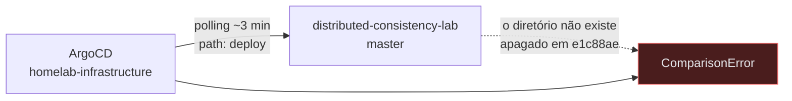

# Integrações

Tudo que atravessa uma fronteira de processo, e o estado de cada travessia.

Levantado em 2026-08-01, a partir da árvore versionada e da documentação. **Nenhuma
linha desta página foi derivada de código**, porque não existe código: `git ls-files`
retorna 28 arquivos, nenhum com extensão de linguagem, build ou IaC.

## Como ler esta página

A matriz separa duas coisas que costumam ser confundidas:

| Marca    | Significado                                                               |
|----------|---------------------------------------------------------------------------|
| **fato** | verificável hoje, na árvore versionada ou num repositório externo nomeado |
| hipótese | descrito em documento de planejamento; nada existe que o implemente       |

Uma hipótese não é uma promessa fraca. Ela é uma afirmação sobre o futuro que **ainda não
tem evidência**, e tratá-la como fato é o erro que esta separação existe para impedir.

## Matriz

| Origem                            | Destino                                       | Tipo                     | Operação/tópico                             | Finalidade                                                      | Contrato                   | Autenticação                   | Confiabilidade                                                                           | Evidência                                                                                                                                                                                                                    |
|-----------------------------------|-----------------------------------------------|--------------------------|---------------------------------------------|-----------------------------------------------------------------|----------------------------|--------------------------------|------------------------------------------------------------------------------------------|------------------------------------------------------------------------------------------------------------------------------------------------------------------------------------------------------------------------------|
| ArgoCD (`homelab-infrastructure`) | este repositório, `deploy/`                   | GitOps, pull por polling | `git fetch` em `master`, `path: deploy`     | reconciliar os workloads do laboratório no cluster              | Kustomize                  | leitura de repositório público | polling ~3 min, `prune: true`, `selfHeal: true`                                          | **fato**, e **quebrado** — `plano-do-laboratorio.md:764-771`; `deploy/` apagado no commit `e1c88ae`                                                                                                                          |
| GitHub Actions (runner hospedado) | GHCR                                          | push de imagem OCI       | `docker push`, tag = SHA do commit          | publicar o artefato executável                                  | —                          | `GITHUB_TOKEN` efêmero         | tag imutável, nunca `latest`                                                             | hipótese — [ADR 0017 do homelab](https://github.com/da0hn/homelab-infrastructure/blob/12a2b6ad397156decce32d87ccfa994d0fc95446/docs/adr/0017-cicd-das-aplicacoes-no-github-actions.md). Não existe `.github/workflows/` aqui |
| GitHub Actions (`master`)         | este repositório, `deploy/kustomization.yaml` | commit de bump           | `kustomize edit set image`                  | apontar o manifest para a imagem nova                           | Kustomize                  | `GITHUB_TOKEN`                 | push com esse token não dispara workflows, o que evita recursão de build                 | hipótese — `plano-do-laboratorio.md:795`                                                                                                                                                                                     |
| aplicação do laboratório          | PostgreSQL                                    | JDBC                     | SQL sobre `resource` e `allocation`         | executar as operações do sistema sob teste e ler o estado final | esquema de duas tabelas    | não decidido                   | **uma conexão por worker**, obrigatório                                                  | hipótese — `adr/0002-o-dominio-minimo-e-os-dois-oraculos.md:87-99`; `plano-do-laboratorio.md:579-582`                                                                                                                        |
| Lab Plane (oráculo)               | PostgreSQL                                    | JDBC                     | `SELECT` após a quiescência                 | ler `value_final` e `Σ amount`                                  | —                          | não decidido                   | lê o banco, e NÃO DEVE ler o log de observações                                          | hipótese — `adr/0002-o-dominio-minimo-e-os-dois-oraculos.md:214-235`                                                                                                                                                         |
| Lab Plane (log de observações)    | interface web                                 | stream                   | não decidido: SSE ou WebSocket              | alimentar a timeline em tempo real                              | nenhum                     | não decidido                   | gatilho da decisão: a primeira execução longa demais para polling                        | hipótese — `plano-do-laboratorio.md:565`, `611`                                                                                                                                                                              |
| interface web                     | Lab Plane                                     | HTTP                     | não decidido                                | iniciar uma execução, ler o relatório                           | **nenhum contrato existe** | não decidido                   | —                                                                                        | hipótese — `plano-do-laboratorio.md:557`                                                                                                                                                                                     |
| aplicação do laboratório          | RabbitMQ                                      | AMQP                     | exchanges, filas e roteamento não decididos | mensageria dos grupos B e C                                     | nenhum                     | não decidido                   | entra na etapa 5, não antes                                                              | hipótese — [ADR 0011 do homelab](https://github.com/da0hn/homelab-infrastructure/blob/12a2b6ad397156decce32d87ccfa994d0fc95446/docs/adr/0011-dados-com-estado-postgres-valkey-rabbitmq.md); `plano-do-laboratorio.md:608`    |
| aplicação do laboratório          | Valkey                                        | não decidido             | —                                           | lock distribuído                                                | nenhum                     | não decidido                   | entra na etapa 11 **se** um experimento provar que advisory lock do PostgreSQL não basta | hipótese — [ADR 0011 do homelab](https://github.com/da0hn/homelab-infrastructure/blob/12a2b6ad397156decce32d87ccfa994d0fc95446/docs/adr/0011-dados-com-estado-postgres-valkey-rabbitmq.md); `plano-do-laboratorio.md:613`    |

Não há integração com serviço externo de terceiro, webhook, job agendado ou banco
compartilhado com outro sistema. O `Application` do ArgoCD é a única fronteira de
processo com existência verificável hoje.

## A única integração real está quebrada

O `Application` está commitado em
`kubernetes/applications/apps/distributed-consistency-lab.yaml` no repositório
[`homelab-infrastructure`](https://github.com/da0hn/homelab-infrastructure), apontando
para `path: deploy` com `prune: true` e `selfHeal: true`. Esse diretório foi apagado
daqui nos commits `83fcfc9` e `e1c88ae`, antes de a arquitetura nova ser decidida.

O cluster reporta erro para este app agora. O sintoma é ruidoso e isolado do resto da
árvore, e o conserto está enfileirado junto da decisão de arquitetura mínima e entrega
contínua — [`../adr/README.md`](../adr/README.md), fila, linha 11.

Evidência: [`../plano-do-laboratorio.md`](../plano-do-laboratorio.md):757-771 e
[`README.md`](../../README.md):235-240.

## Três consequências que a matriz não mostra

**`prune: true` faz uma limpeza de árvore aqui ter efeito em produção.** Apagar o
`deploy/` deste repositório remove workloads do cluster no próximo sync. É o
comportamento desejado, e ele significa que arrumar diretórios aqui deixou de ser
barato. Evidência: `plano-do-laboratorio.md:855-858`.

**A fronteira do "nada existe no servidor que não esteja no Git" atravessa dois
repositórios.** O `.github/workflows/` e o `deploy/` **deste** repositório passaram a
ser infraestrutura, e reconstruir o ambiente passa a exigir dois `git clone`. Evidência:
`plano-do-laboratorio.md:773-777`.

**Um experimento destrutivo roda sob um orquestrador que o desfaz.** A etapa 6 mata o
processo de propósito; o `Deployment` o reinicia e o ArgoCD reconcilia. O experimento
passa a medir o orquestrador junto com o fenômeno. Nenhuma solução foi decidida, e as
três candidatas visíveis têm custos diferentes. Evidência:
`plano-do-laboratorio.md:837-845`.

## Perguntas em aberto

**Q-INT-1 — O contrato entre a interface web e o Lab Plane não tem forma.** O plano
descreve uma UI que inicia execução, recebe stream e exibe relatório
(`plano-do-laboratorio.md:540`, `557`, `568`). Nada diz se a fronteira é HTTP, quais
recursos existem, nem qual o formato do relatório. Enquanto isso não for decidido,
`contracts/openapi/` fica vazio.

**Q-INT-2 — O mecanismo de streaming não foi escolhido.** SSE e WebSocket estão os dois
na mesa, e o gatilho da escolha é "a primeira execução longa o suficiente para não caber
num polling" (`plano-do-laboratorio.md:611`). O gatilho não define o critério: quanto é
"longa o suficiente" não está escrito.

**Q-INT-3 — O PostgreSQL é dedicado ou compartilhado com a Camada 6 do homelab.** O plano
recomenda dedicado, porque saturação e deadlock de propósito degradam as outras cargas,
e as outras cargas viram ruído dentro da medida. A recomendação custa exatamente o que a
Camada 6 economizaria, e a decisão não foi tomada. Evidência:
`plano-do-laboratorio.md:847-853`.

**Q-INT-4 — O build deste repositório foi escolhido em outro repositório.** A ADR 0017 do
homelab, `Aceita` em 2026-07-26, nomeia Gradle e Toxiproxy para este laboratório.
Nenhuma das duas passou pelo debate daqui, e o plano presume reactor Maven. Ratificar ou
emendar é decisão consciente. Evidência: `plano-do-laboratorio.md:806-820`.

**Q-INT-5 — Não há contrato de esquema para `resource` e `allocation`.** O ADR-0002 fixa
as colunas em prosa (`adr/0002-o-dominio-minimo-e-os-dois-oraculos.md:87-99`). Não
existe DDL, migração nem JSON Schema. Se o esquema é um contrato entre o system under
test e o oráculo — e ele é, porque os dois leem as mesmas tabelas — ele precisa de forma
verificável.
