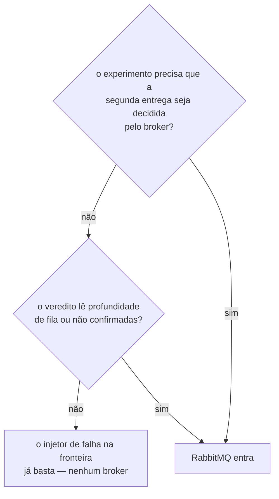
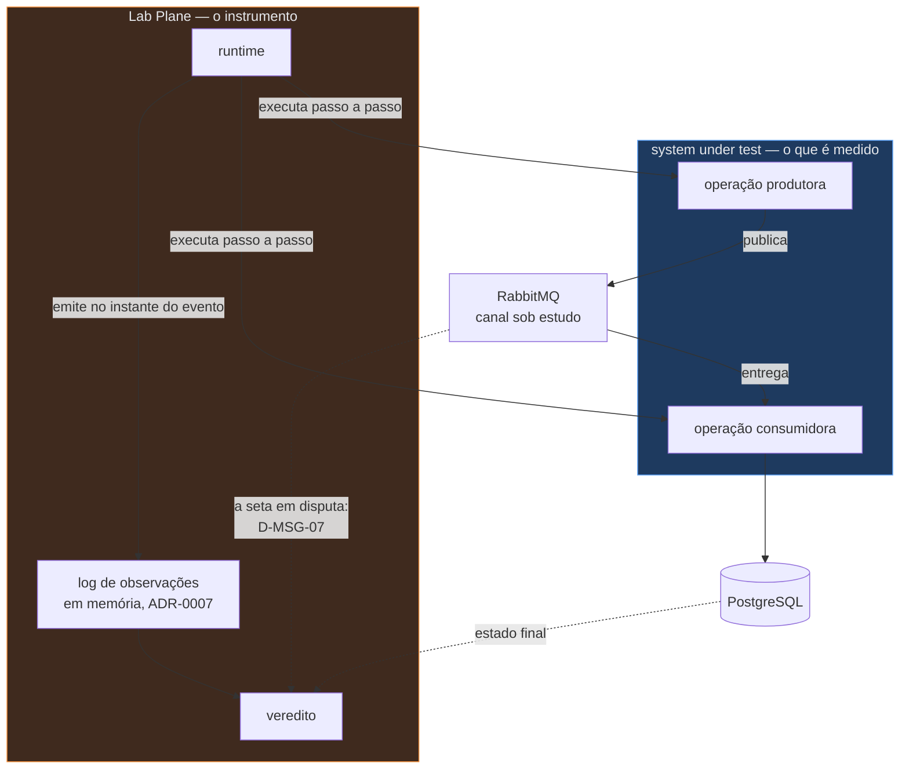
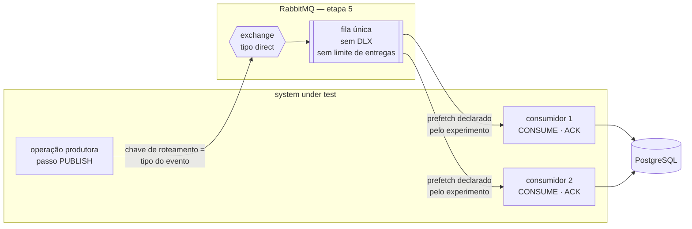
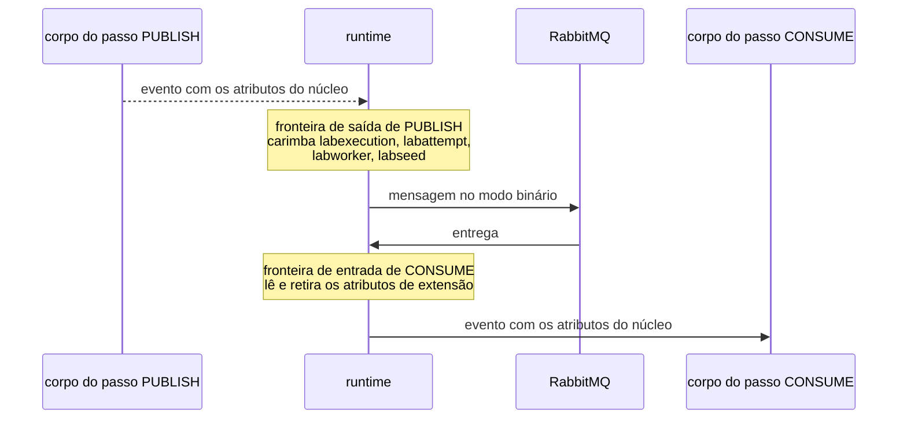
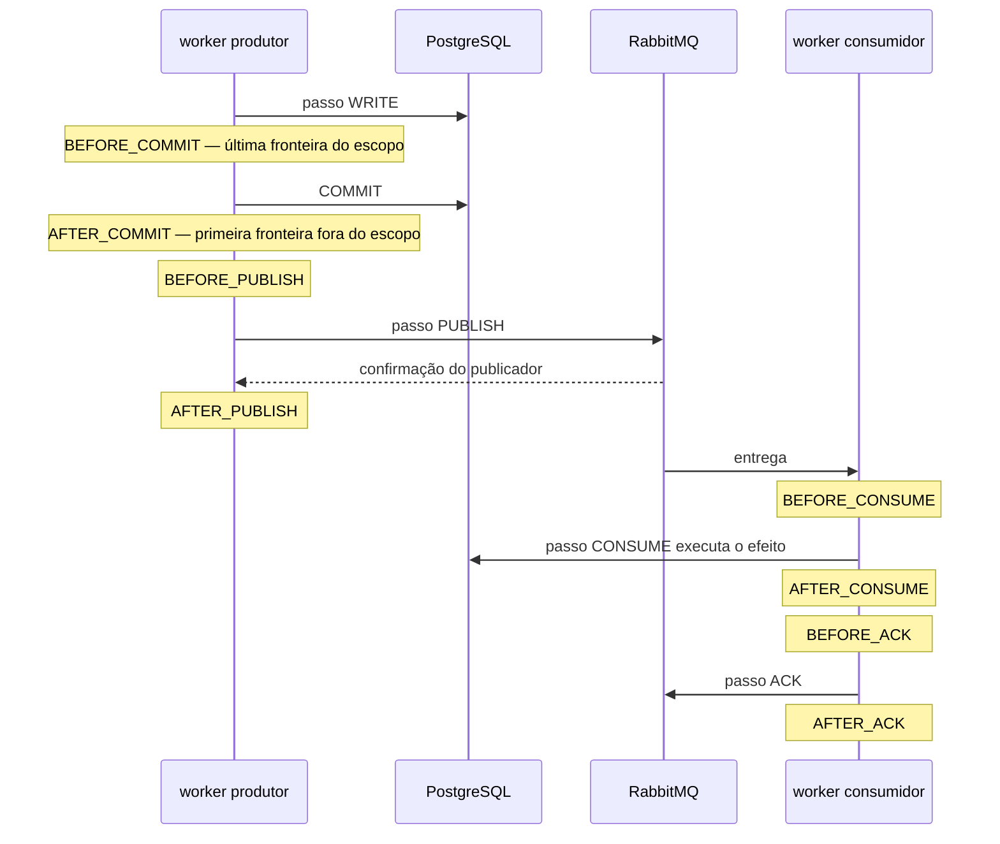
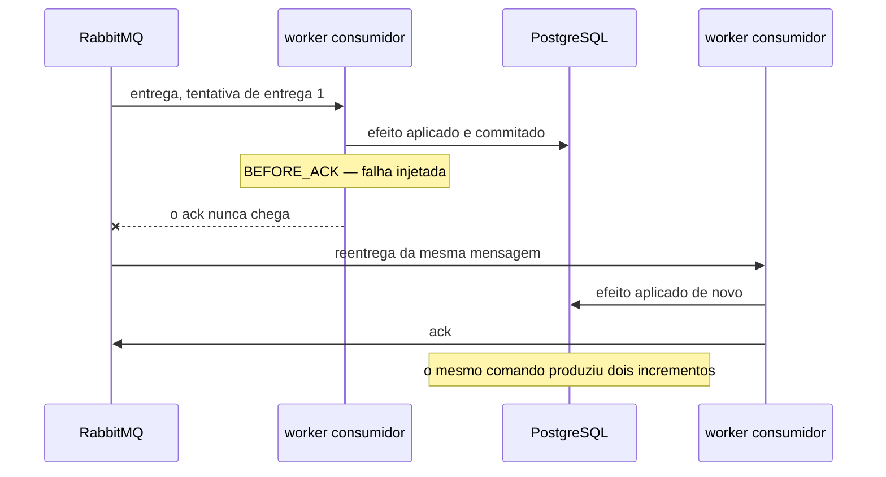
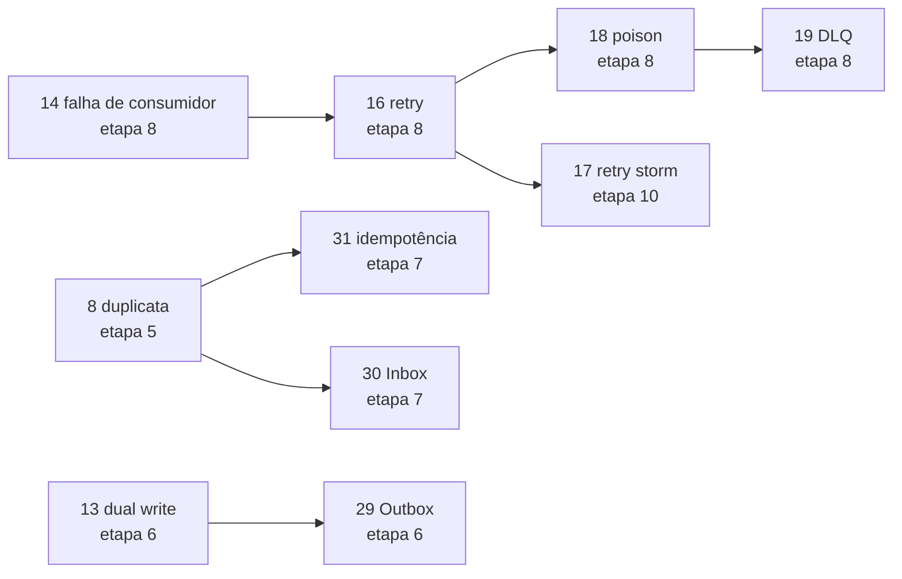
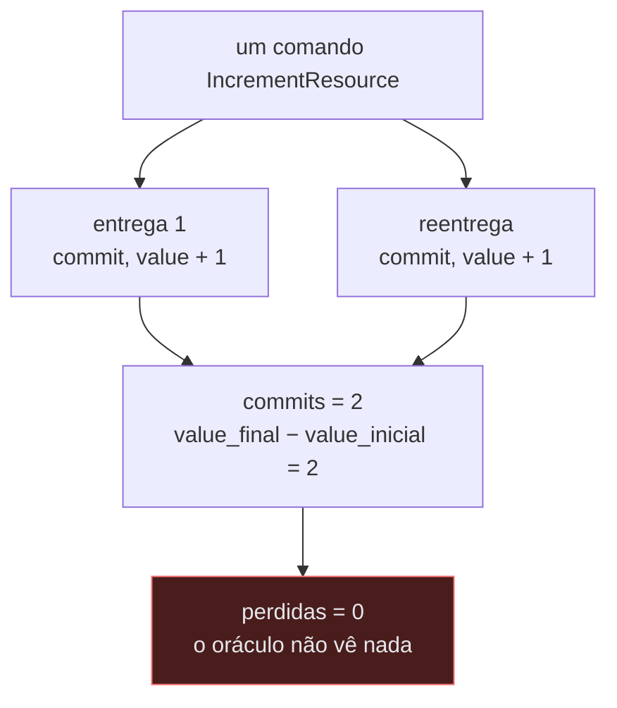

# Mensageria: RabbitMQ, CloudEvents e CDC

- **Estado:** Proposta — requer aprovação humana
- **Data:** 2026-08-03
- **Escopo:** o que a etapa 5 do roadmap constrói quando a operação vira uma mensagem, o
  que ela deixa de construir de propósito, e onde os pontos de injeção do ADR-0001 caem
  no caminho de uma mensagem.
- **Depende de:** [`ADR-0001`](../adr/0001-o-passo-como-unidade-de-execucao.md) (passo,
  fronteira, tentativa, tipos `PUBLISH`/`CONSUME`/`ACK`),
  [`ADR-0002`](../adr/0002-o-dominio-minimo-e-os-dois-oraculos.md) (domínio, oráculo
  exato, identidade pela semente),
  [`ADR-0004`](../adr/0004-o-estatuto-da-barreira-e-o-diagnostico-da-nao-ocorrencia.md)
  (taxa, janela de exposição), [`ADR-0005`](../adr/0005-a-forma-do-escalonador.md)
  (término e desistência),
  [`ADR-0006`](../adr/0006-a-forma-da-estrategia-de-concorrencia.md) (estratégia como
  rótulo opaco),
  [`ADR-0007`](../adr/0007-o-log-de-observacoes-forma-ordem-e-onde-vive.md) (forma do
  evento de log).

Este documento **não decide nada**. Ele levanta o que a etapa 5 exige, nomeia as
decisões que só uma pessoa toma e registra as contradições que encontrou com ADR aceito.

## Como ler as afirmações deste documento

Três marcas separam o que tem evidência do que não tem.

| Marca                    | Significado                                                        |
|--------------------------|--------------------------------------------------------------------|
| `arquivo.md:linha`       | afirmação verificável na árvore versionada                         |
| **conhecimento externo** | vem de especificação ou documentação de terceiro, nomeada na frase |
| `Pergunta em aberto`     | nada no repositório sustenta a afirmação, e ela não foi decidida   |

Nenhuma afirmação marcada como conhecimento externo fixa número de versão ou valor
padrão. Cada uma nomeia o documento que a sustenta e exige verificação antes de virar
código.

---

## 1. Quando o broker entra, e qual gatilho o libera

O plano coloca o RabbitMQ na etapa 5, cuja pergunta é *"o que muda quando a operação
vira uma mensagem?"*, com `RabbitMQ; competing consumers; duplicata` na coluna do que é
novo (`plano-do-laboratorio.md:345`). A seção de decisões adiadas nomeia o gatilho como
"o primeiro experimento assíncrono (etapa 5)" (`plano-do-laboratorio.md:608`).

A regra estrutural é mais exigente que isso: *"nenhuma tecnologia entra por estar
disponível. Cada uma entra quando um experimento não puder ser executado sem ela"*
(`plano-do-laboratorio.md:620-621`). "O primeiro experimento assíncrono" não é um
gatilho — é o nome da etapa. Um gatilho precisa dizer **o que falta hoje**.

### O que o laboratório já consegue fazer sem broker

O ADR-0001 tornou a injeção de falha uma consulta na fronteira entre dois passos (`0001-o-passo-como-unidade-de-execucao.md:196-199`). Isso significa que o laboratório
já sabe, sem broker nenhum:

- **publicar duas vezes** — o injetor dispara na fronteira de saída de um passo
  `PUBLISH` e o runtime executa o passo de novo;
- **não publicar** — o injetor derruba a tentativa em `AFTER_COMMIT`, que é o desenho
  da etapa 6 (`0001-...md:416-419`);
- **atrasar** — o escalonador segura o worker numa fronteira.

O `arquivo/0012` já havia demonstrado que os três lugares clássicos de interceptação
custam caro: a rede não produz duplicata semântica, porque o kernel remonta o fluxo TCP (`arquivo/0012:70`); e o TCP entrega em ordem, de modo que a rede também não reordena (`arquivo/0012:72`). O ADR-0001 desfez esse impasse dentro do processo (`0001-...md:438-442`). A consequência para a mensageria é direta:
**um Chaos Relay e um
Toxiproxy não têm gatilho na etapa 5**, e o inventário do plano já registrava que o
Toxiproxy nunca passou pelo debate daqui (`plano-do-laboratorio.md:816-820`).

### O que o laboratório não consegue fazer sem broker

Três coisas, e nenhuma delas é substituível por uma fila em memória sem que o
instrumento passe a fabricar o fenômeno que mede.

**A reentrega causada por um `ack` que não chegou.** É o mecanismo real da duplicata do
cenário 8. Uma fila em memória que reentregasse por decisão do laboratório produziria a
duplicata por construção — exatamente a falha que a cláusula de honestidade do ADR-0001
existe para pegar (`0001-...md:280-283`).

**A distribuição entre consumidores concorrentes.** Competing consumers, o cenário 32, é
o broker decidindo quem recebe o quê, sob um limite de mensagens não confirmadas por
consumidor. Quem decide é o broker.

**Um número que só o broker tem.** Profundidade de fila e mensagens não confirmadas são
o veredito do grupo D (`plano-do-laboratorio.md:221-224`), e nenhuma consulta ao
PostgreSQL os produz.

> **Proposta de gatilho.** O RabbitMQ entra quando o primeiro experimento precisar que a
> **segunda entrega do mesmo fato lógico seja decidida pelo broker, e não pelo
> laboratório**. Antes disso, nada em `docker-compose` ou em `deploy/` menciona
> mensageria.

O gatilho aponta um experimento nomeado: `duplicate-delivery-none`, o controle negativo
da etapa 5. Ver a seção 6.



---

## 2. Mensageria do system under test contra mensageria do Lab Plane

O repositório separa o sistema sob teste do instrumento que o mede, e a separação fica
mais crítica porque os dois dividem a mesma JVM (`plano-do-laboratorio.md:645`). A
mensageria multiplica os lugares onde os dois se confundem.

**Mensageria do system under test** é o canal que o experimento estuda. É o objeto de
medida, e **precisa ser ingênua no começo**: publicar depois do commit, sem outbox, sem
inbox, sem chave de idempotência. A aresta `13 → 29` do grafo de dependências
pedagógicas diz o motivo em uma linha: *"o Outbox só é compreensível depois de ver o
dual write falhar"* (`plano-do-laboratorio.md:318-319`).

**Mensageria do Lab Plane** seria o canal por onde o instrumento transporta as próprias
observações. Ela não existe hoje, e a proposta é que continue não existindo.

O plano já fixou a regra um nível abaixo: *"o log de observações não escreve no banco
sob
teste"*, porque gravar observações no mesmo PostgreSQL adiciona contenção à medida (`plano-do-laboratorio.md:589-592`). O ADR-0007 concretizou isso: sequência apensável em
memória, uma por execução (`0007-o-log-de-observacoes-forma-ordem-e-onde-vive.md:85-88`).

O argumento é idêntico um andar acima, e é pior. Um experimento do grupo D satura a fila
de propósito (`plano-do-laboratorio.md:216-224`). Se as observações trafegassem pelo
mesmo broker, o instrumento que mede a saturação seria a primeira vítima dela, e a
timeline perderia eventos exatamente no trecho que o experimento existe para mostrar. O
relatório publicaria uma curva com buraco no ponto de interesse, sem que nada acusasse a
perda.



Três consequências que a separação impõe, e que valem antes de qualquer linha de código.

**O log de observações não trafega pelo broker sob estudo.** Nem na etapa 5, nem quando
a etapa 6 exigir persistência durável (`plano-do-laboratorio.md:610`).

**A topologia da mensageria é configuração da plataforma, não conhecimento da
operação.** O corpo do passo `PUBLISH` recebe o destino; ele não escolhe entre uma
exchange "antes do caos" e outra "depois". O `arquivo/0012` chegou à mesma conclusão por
outro caminho (`arquivo/0012:121-124`), e o argumento sobrevive ao arquivamento.

**A seta tracejada acima é uma decisão em aberto.** O ADR-0002 fixou que o oráculo lê o
banco e NÃO DEVE ler o log de observações (`0002-...md:216-236`). Ele não previu um
terceiro lugar onde mora estado: o broker. Ver `D-MSG-07`.

---

## 3. Topologia de exchanges, filas e bindings, por experimento

Nenhuma exchange existe hoje: a matriz de integrações registra "exchanges, filas e
roteamento não decididos" como hipótese (`architecture/integrations.md:32`).

A proposta é que **a topologia seja parte da definição do experimento**, e não da
configuração do serviço. Duas razões, e a segunda é a que importa.

A primeira é a de sempre: o que não é declarado pelo experimento não é reproduzível.

A segunda é pedagógica e decide o desenho. **Uma topologia que já traz DLQ, limite de
entregas e fila quorum resolve os cenários 18 e 19 antes de alguém vê-los falhar.** A
regra `PROBLEMA → CAUSA → SOLUÇÃO → TRADE-OFF` vale para os 42 fenômenos sem exceção. A
topologia da etapa 5 é, portanto, deliberadamente pobre.

### A topologia da etapa 5



| Recurso            | Etapa 5                             | Por que assim                                                     |
|--------------------|-------------------------------------|-------------------------------------------------------------------|
| exchange           | uma, tipo `direct`, por experimento | roteamento por tipo de evento; nada a filtrar por cabeçalho ainda |
| fila               | uma, por experimento                | competing consumers exige uma fila e N consumidores               |
| binding            | um, chave = tipo do evento          | o menor roteamento que entrega                                    |
| DLX                | **ausente**                         | a DLQ é objeto de estudo da etapa 8                               |
| limite de entregas | **ausente**                         | um limite resolve o poison antes do cenário 18                    |
| `ack`              | manual                              | `BEFORE_ACK` e `AFTER_ACK` precisam existir (ADR-0001:61-62)      |
| prefetch           | declarado pelo experimento          | ele muda o que o experimento mede; ver a seção 7                  |

### O que cada etapa acrescenta à topologia

| Etapa | Fenômeno                        | Recurso novo na topologia                       | Evidência                     |
|-------|---------------------------------|-------------------------------------------------|-------------------------------|
| 5     | duplicata, competing consumers  | exchange, fila, binding, prefetch, `ack` manual | `plano-do-laboratorio.md:345` |
| 6     | dual write, Outbox              | nenhum — a mudança é no system under test           | `plano-do-laboratorio.md:346` |
| 7     | Inbox, idempotência             | nenhum — a mudança é uma tabela                 | `plano-do-laboratorio.md:347` |
| 8     | retry, poison, DLQ, replay      | DLX, fila morta, fila de replay                 | `plano-do-laboratorio.md:348` |
| 9     | projeção, consistência eventual | segunda fila ligada à mesma exchange            | `plano-do-laboratorio.md:349` |
| 10    | backpressure, slow consumer     | limite de profundidade de fila                  | `plano-do-laboratorio.md:350` |

A linha da etapa 6 é a mais informativa: **o Outbox não muda a topologia.** Ele muda
quem publica e quando. Um engenheiro que ache que precisa de exchange nova para o Outbox
entendeu o Outbox como infraestrutura, e não como objeto de estudo.

### Nomes de recurso

Proposta: `<experimento>.<papel>`, com o identificador do experimento como prefixo, sem
prefixo que denuncie o laboratório. O `arquivo/0012` registrou o motivo ao propor a
regra `6c`: uma propriedade sob prefixo `lab.` lida pelo system under test cumpre a
separação ao pé da letra e a viola por completo (`arquivo/0012:313-320`). Aquele
documento nunca foi aceito, e o argumento continua de pé.

Uma execução cria e destrói a própria topologia, ou reusa uma declarada uma vez? A
pergunta é a mesma que o ADR-0002 encaminhou sobre o banco — quem devolve o estado ao
ponto de partida entre duas execuções (`0002-...md:293-296`,
[`Q-0002-4`](../questions/Q-0002-4.md)) — e ninguém a fez para o broker. Ver `D-MSG-09`.

---

## 4. O envelope: CloudEvents sobre AMQP

**Conhecimento externo.** CloudEvents é uma especificação da CNCF que define um envelope
de metadados para eventos, com um documento de núcleo e documentos de binding por
protocolo, entre eles um binding para AMQP. Nenhuma versão é fixada aqui; a versão exata
e o texto normativo precisam ser verificados na especificação antes de virar código.

### Modo binário contra modo estruturado

O binding AMQP descreve dois modos de conteúdo. No **modo estruturado**, o evento
inteiro — atributos e dados — vai serializado no corpo da mensagem, sob um tipo de
conteúdo próprio. No **modo binário**, os atributos vão em propriedades da mensagem e
apenas os dados ficam no corpo.

| Eixo                                        | Estruturado | Binário                 |
|---------------------------------------------|-------------|-------------------------|
| o runtime lê a correlação sem desserializar | não         | sim                     |
| roteamento por atributo no broker           | não         | possível                |
| o corpo permanece opaco ao runtime          | não         | sim                     |
| sobrevive a um salto por outro protocolo    | sim         | depende do binding      |
| tamanho do cabeçalho                        | mínimo      | cresce com os atributos |

A terceira linha decide. O ADR-0001 fixou que **o corpo do passo é opaco ao runtime** e
que o runtime NÃO DEVE gerar, interpretar ou analisar o SQL (`0001-...md:113-117`). A mesma proibição, aplicada à mensagem, diz que o runtime não
desserializa o payload para descobrir a que execução a mensagem pertence. No modo
estruturado ele precisaria desserializar. No modo binário ele lê propriedades.

O `arquivo/0012` chegou ao mesmo desenho quando descreveu o relay desarmado: *"não
desserializa o `payload` (...) Lê os cabeçalhos do envelope"* (`arquivo/0012:139-140`).

> **Proposta:** modo binário. Ver `D-MSG-04`, que também registra a distinção entre AMQP
> 0-9-1 e AMQP 1.0.

**Conhecimento externo, e é a pegadinha desta seção.** O binding AMQP do CloudEvents é
escrito sobre as seções de mensagem do **AMQP 1.0**. O protocolo nativo do RabbitMQ é o
**AMQP 0-9-1**, cujas propriedades de mensagem incluem uma tabela `headers`, e não as
`application-properties` do 1.0. Suporte a AMQP 1.0 no RabbitMQ existe por caminho
próprio, e qual caminho, com que restrições, é verificação pendente na documentação do
RabbitMQ. `Pergunta em aberto`: o mapeamento de atributo para cabeçalho no 0-9-1 é
convenção do laboratório, não conformidade com o binding.

### Atributos obrigatórios e de onde cada um vem

| Atributo      | Obrigatório | Origem proposta                      | Restrição já aceita                         |
|---------------|-------------|--------------------------------------|---------------------------------------------|
| `specversion` | sim         | constante do laboratório             | nenhuma                                     |
| `id`          | sim         | função da semente do experimento     | `ADR-0002:123-133`, identidade da aplicação |
| `source`      | sim         | URI que nomeia a operação produtora  | nenhuma                                     |
| `type`        | sim         | nome do fato, do catálogo da seção 5 | nenhuma                                     |
| `time`        | não         | adaptador de relógio                 | `plano-do-laboratorio.md:594-596`           |
| `subject`     | não         | identificador do `Resource`          | nenhuma                                     |

Duas linhas dessa tabela não são preferência. O ADR-0002 exige que o identificador seja
gerado no código a partir da semente, e NÃO DEVE ser função do instante da execução (`0002-o-dominio-minimo-e-os-dois-oraculos.md:125-131`). Um `id` de evento gerado por
`UUID.randomUUID()` quebra a reprodutibilidade em silêncio, e um `time` vindo de
`Instant.now()` quebra a regra do relógio injetável. As duas quebras aparecem meses
depois, no replay da etapa 12.

### Atributos de extensão que o laboratório precisa

O laboratório correlaciona uma mensagem com a execução, a tentativa, o worker e a
semente. Nenhum atributo do núcleo do CloudEvents carrega isso.

| Extensão proposta | Conteúdo                        | Quem consome                                  |
|-------------------|---------------------------------|-----------------------------------------------|
| `labexecution`    | identificador da execução       | o log de observações e o veredito             |
| `labattempt`      | número da tentativa do produtor | ADR-0001: toda observação carrega a tentativa |
| `labworker`       | identidade do worker produtor   | a timeline                                    |
| `labseed`         | semente da execução             | o replay determinístico                       |

**Quem carimba esses atributos é a decisão, não quais eles são.** Se o corpo do passo
`PUBLISH` os escrever, o sistema sob teste passa a falar a linguagem do instrumento — a
violação que o `arquivo/0012` recusou na sua Alternativa D, ao descartar o `seed` no
envelope: *"a mesma violação que a regra 6 existe para impedir, cometida por dados em
vez de por `import`"* (`arquivo/0012:540-544`).

O ADR-0001 abre uma saída que não existia quando aquele texto foi escrito. O runtime
executa o passo e detém o controle na fronteira (`0001-...md:438-442`). Ele pode
carimbar na fronteira de saída de `PUBLISH` e retirar na fronteira de entrada de
`CONSUME`, sem que o corpo de passo nenhum saiba que os atributos existem. Ver
`D-MSG-03`.



---

## 5. Catálogo de eventos

O `contracts/README.md` exige que um contrato de evento **distinga comando de evento de
domínio** e declare produtor, consumidores, fila, versão, correlação, idempotência,
ordenação, retry, DLQ e garantia de entrega — *"cada um apenas quando houver evidência
ou decisão explícita"* (`contracts/README.md:33-37`).

O domínio tem duas entidades e duas operações: `increment` e `allocate`
(`0002-o-dominio-minimo-e-os-dois-oraculos.md:88-121`). O catálogo abaixo não vai além
delas.

| Nome                  | Classe            | Etapa | Experimento que o exige                    |
|-----------------------|-------------------|-------|--------------------------------------------|
| `IncrementResource`   | comando           | 5     | `duplicate-delivery-none` (cenários 8, 32) |
| `ResourceIncremented` | evento de domínio | 6     | `dual-write-none` (cenário 13)             |

**Dois eventos, e nenhum a mais.** `AllocationCreated` não entra porque nenhum
experimento das etapas 5 a 8 o consome; o `allocate` é o E5, do grupo A, que não passa
por broker (`plano-do-laboratorio.md:374`).

A diferença entre os dois não é estilística, e ela decide o oráculo.

**`IncrementResource` é um comando.** Ele pede que algo aconteça. Uma entrega duplicada
faz o efeito acontecer duas vezes. O fenômeno é a **duplicata de efeito**.

**`ResourceIncremented` é um evento de domínio.** Ele afirma que algo aconteceu. A falha
que a etapa 6 estuda é a **ausência** dele depois de um commit que ocorreu — o dual
write, medido por `commits − sucessos` (`0002-...md:174-175`).

### Versionamento e compatibilidade

Nenhum consumidor externo existe, e nenhum contrato foi publicado (`contracts/README.md:5-16`). Uma política de compatibilidade escrita agora seria
política sobre um contrato inexistente.

Proposta mínima, e nada além dela: o `type` do CloudEvents carrega a versão maior no
próprio nome, e um consumidor que não reconheça o `type` recusa a mensagem em vez de
adivinhar. A recusa nomeada é o comportamento que a etapa 8 precisa para produzir uma
poison message de verdade.

`Pergunta em aberto`: uma mudança incompatível de esquema é, ela mesma, um fenômeno de
sistemas distribuídos que os 42 cenários não listam. Ver `Q-MSG-4`.

---

## 6. Os doze pontos de injeção no caminho de uma mensagem

O ADR-0001 lista os doze pontos como convenção de nomenclatura sobre a parte
`(rótulo, entrada|saída)` do endereço, válida quando o tipo é único na operação (`0001-o-passo-como-unidade-de-execucao.md:181-184`). Os seis pontos de mensageria estão
lá desde o começo (`0001-...md:59-62`), e os tipos `PUBLISH`, `CONSUME` e `ACK` já
constam do conjunto fechado (`0001-...md:111-112`).

### Os seis pontos vivem em duas operações, não em uma

Esta é a leitura errada mais provável do ADR-0001, e ela custa caro se entrar no código.

`BEFORE_PUBLISH` e `AFTER_PUBLISH` são fronteiras da **operação produtora**.
`BEFORE_CONSUME`, `AFTER_CONSUME`, `BEFORE_ACK` e `AFTER_ACK` são fronteiras da
**operação consumidora**. São duas operações, dois workers, duas sequências de passos e
dois escopos de execução. Uma lista de doze nomes num parágrafo só sugere uma operação
com doze fronteiras, e não existe tal operação.



### A duplicata sai de uma falha em `BEFORE_ACK`

O caminho honesto para o cenário 8 não precisa de componente novo. O injetor derruba o
worker consumidor entre o efeito e o `ack`; o broker não recebe confirmação e reentrega
a mesma mensagem. **A duplicata é produzida pela máquina de confirmação do broker, não
pelo laboratório**, que é exatamente o que a cláusula de honestidade exige.



### A reentrega é uma execução de operação nova, não uma tentativa nova

O ADR-0001 fixou que a **tentativa** é a unidade de sequência e que, ao fim de uma
tentativa malsucedida, o runtime pergunta à estratégia se há outra (`0001-...md:153-156`). O ADR-0006 fixou que a estratégia responde a partir da exceção
recebida do banco (`0006-a-forma-da-estrategia-de-concorrencia.md:51-60`).

Uma reentrega não é isso. Quem a decide é o broker, não a estratégia, e a decisão parte
de um `ack` ausente, não de uma exceção.

> **Proposta:** uma reentrega abre uma **execução de operação nova**, com o contador de
> tentativa começando em um. A ligação entre as duas execuções é o `id` do CloudEvents.

**Contradição com ADR aceito.** O ADR-0007 fixou a forma de um evento do log —
tentativa, worker, endereço de fronteira, tipo, instante de parede e fatos brutos (`0007-o-log-de-observacoes-forma-ordem-e-onde-vive.md:56-65`).
**Nenhum desses campos
liga duas execuções de operação que processaram a mesma mensagem.** Sem essa ligação, a
timeline da etapa 5 mostra dois incrementos sem dizer que eles vieram do mesmo comando,
e o veredito da seção 7 não é calculável. O ADR-0007 está `Aceito` e não pode ser
editado; acrescentar o campo exige ADR novo. Ver `D-MSG-08`.

### O ponto que o roadmap adiou

O plano adia "o formato interno da injeção de falha" para *"a etapa 6, quando o ponto
`BEFORE_PUBLISH` precisar existir de verdade"* (`plano-do-laboratorio.md:609`). O
`example-mapping.md` da observação passo a passo repete o adiamento e acrescenta o dos
tipos `PUBLISH`, `CONSUME` e `ACK` para a etapa 5 (`features/observacao-passo-a-passo/example-mapping.md:110-111`), com a pergunta P7 em
aberto: *"o tipo de passo é conjunto fechado. Acrescentar `PUBLISH` na etapa 5 muda o
quê?"* (`features/observacao-passo-a-passo/example-mapping.md:103`).

Este documento responde uma parte de P7: acrescentar `PUBLISH` não muda o conjunto
fechado, porque `PUBLISH`, `CONSUME` e `ACK` já estão nele (`0001-...md:111-112`). O que
muda é quem inicia a operação consumidora — e essa parte continua sem resposta. Ver
`D-MSG-08` e `Q-MSG-1`.

---

## 7. Entrega, ordenação e duplicata: o que o RabbitMQ garante e o que não garante

**Conhecimento externo.** As afirmações desta seção vêm da especificação AMQP 0-9-1 e da
documentação do RabbitMQ. Nenhum valor padrão é reproduzido aqui, e cada linha precisa
de verificação antes de virar configuração.

| Propriedade                              | O que existe                                                           | O que o experimento ganha                        |
|------------------------------------------|------------------------------------------------------------------------|--------------------------------------------------|
| ordem dentro de um canal, para uma fila  | mensagens publicadas por um canal chegam à fila na ordem de publicação | uma linha de base para reordenação               |
| ordem com consumidores concorrentes      | não há garantia: cada consumidor avança no próprio ritmo               | o cenário 10 sai daqui, sem injeção nenhuma      |
| ordem depois de uma reentrega            | uma mensagem reentregue perde a posição relativa que tinha             | reordenação causada pela própria recuperação     |
| entrega ao menos uma vez                 | exige confirmação de publicador, `ack` manual e fila durável           | o cenário 8 tem mecanismo real                   |
| entrega exatamente uma vez               | **não existe**                                                         | é a lição da etapa 7, não uma configuração       |
| perda silenciosa na publicação           | sem confirmação de publicador, uma publicação pode se perder sem erro  | duas causas para o mesmo sintoma; ver `D-MSG-06` |
| limite de não confirmadas por consumidor | `prefetch` limita quantas entregas ficam sem `ack`                     | é o botão do grupo D; ver abaixo                 |
| tempo limite de confirmação              | o broker fecha o canal quando uma entrega passa tempo demais sem `ack` | colide com a espera do escalonador; `D-MSG-11`   |

### O que cada configuração faz o experimento medir

**`prefetch = 1`.** Cada consumidor segura uma entrega por vez. A fila distribui pelo
consumidor que terminou, e o experimento mede latência de processamento. É a
configuração que torna o cenário 32 visível.

**`prefetch` alto.** Um consumidor lento acumula entregas que ninguém mais pode pegar. O
experimento passa a medir enfileiramento no cliente, não no broker — e a profundidade de
fila do broker mente sobre o trabalho pendente. É o cenário 21 (slow consumer), e o
plano já registra que ele é a
**causa** do backpressure, não o efeito (`plano-do-laboratorio.md:326-329`).

**`ack` automático.** O broker considera entregue no instante em que envia. As
fronteiras `BEFORE_ACK` e `AFTER_ACK` deixam de existir, e com elas o cenário 8 inteiro.
Proposta: `ack` automático é modo de comparação declarado por um experimento, nunca a
configuração padrão.

### A espera do escalonador encontra um relógio que o laboratório não injeta

O ADR-0005 fixou que a desistência é imediata e não por timeout, porque *"timeout mede
tempo de parede, proibido fora de um adaptador de relógio"*
(`0005-a-forma-do-escalonador.md:125-126`).

**Conhecimento externo:** o RabbitMQ tem um tempo limite próprio para a confirmação de
uma entrega, e ele mede tempo de parede num processo que o laboratório não controla.

A colisão é concreta. Um experimento que declare uma restrição de precedência retendo o
worker consumidor em `BEFORE_ACK` — para produzir a intercalação de dois consumidores —
segura junto uma entrega não confirmada. Se a espera durar mais que o limite do broker,
o canal cai, a mensagem volta para a fila, e o relatório registra uma reentrega que o
experimento não pediu. **O instrumento produziu o fenômeno que ele mede**, e nenhuma
contagem do ADR-0004 distingue esse caso. Ver `D-MSG-11`.

A palavra `barreira` foi aposentada da linguagem pela decisão `D-DOM-03`, em 2026-08-04 ([`../CONTEXT.md`](../CONTEXT.md), seção `D-DOM-03`). O que existe é a restrição de
precedência; a parada é o efeito dela. As passagens desta seção e de `D-MSG-11` foram
reescritas no mesmo turno, e **o mérito de nenhuma delas mudou**.

---

## 8. DLQ, retry e poison como objetos de estudo

Nenhuma destas peças é infraestrutura que o laboratório adota. Cada uma tem etapa e um
experimento que precisa falhar antes.

| Peça                  | Etapa | Experimento que precisa falhar antes               | Aresta do grafo              |
|-----------------------|-------|----------------------------------------------------|------------------------------|
| chave de idempotência | 7     | 8, duplicata de entrega, com efeito dobrado        | `8 → 31` (`plano-do-laboratorio.md:292`)  |
| Inbox                 | 7     | 8, duplicata de entrega, com efeito dobrado        | `8 → 30` (`plano-do-laboratorio.md:293`)  |
| Outbox                | 6     | 13, dual write, com o evento perdido               | `13 → 29` (`plano-do-laboratorio.md:294`) |
| política de retry     | 8     | 14, falha de consumidor, sem nenhuma recuperação   | `14 → 16` (`plano-do-laboratorio.md:295`) |
| poison message        | 8     | 16, retry, que precisa existir para nunca terminar | `16 → 18` (`plano-do-laboratorio.md:295`) |
| DLQ                   | 8     | 18, poison, que precisa não ter para onde ir       | `18 → 19` (`plano-do-laboratorio.md:295`) |
| retry storm           | 10    | 16, retry, que precisa existir para amplificar     | `16 → 17` (`plano-do-laboratorio.md:296`) |

A cadeia da etapa 8 se lê de trás para frente e explica a topologia pobre da seção 3.
Uma DLQ declarada na etapa 5 tira a mensagem envenenada de circulação antes de alguém
observar o laço. Um limite de entregas faz o mesmo. **A ausência das duas na etapa 5 não
é economia; é a condição para que o cenário 18 tenha o que mostrar.**



### O grupo de controle vale aqui igual

A regra é que a estratégia `NONE` precisa falhar, sob pena de o experimento não ter
carga suficiente. Na mensageria, o controle negativo de cada peça tem nome:

| Peça                  | Controle negativo                       | Resultado que ele precisa produzir |
|-----------------------|-----------------------------------------|------------------------------------|
| chave de idempotência | consumidor sem deduplicação             | efeito aplicado duas vezes         |
| Outbox                | publicação depois do commit, sem tabela | commit sem evento publicado        |
| DLQ                   | fila sem destino morto                  | mensagem reentregue sem fim        |
| política de retry     | consumidor que não tenta de novo        | efeito perdido na primeira falha   |

### O oráculo exato do ADR-0002 é cego para a duplicata de entrega

Esta é a lacuna mais séria que este documento encontrou, e ela bloqueia a etapa 5.

O oráculo é `perdidas = commits − (value_final − value_inicial)`, com `commits` contando
passagens pela fronteira `AFTER_COMMIT`, por tentativa (`0002-o-dominio-minimo-e-os-dois-oraculos.md:139-146`).

Considere uma entrega duplicada de `IncrementResource`. O efeito é aplicado duas vezes:
`commits` sobe de um, e `value_final − value_inicial` sobe de um. **A diferença continua
zero.** O oráculo reporta nenhuma perda sobre um banco em que um comando produziu dois
incrementos.



O segundo oráculo do ADR-0002 também não serve: `commits − sucessos` mede o dual write,
o caso oposto (`0002-...md:174-175`). E o Inbox, que contaria a duplicata descartada, é
etapa 7 — usá-lo como oráculo da etapa 5 entregaria a solução antes do problema.

**A etapa 5 precisa de uma contagem que nenhum ADR aceito define.** Ver `D-MSG-02`.

### Uma contradição de classificação, entre dois documentos

O ADR-0002 chama o dual write de *"o fenômeno do grupo B que a etapa 6 estuda"*
(`0002-o-dominio-minimo-e-os-dois-oraculos.md:174-175`). O plano coloca o cenário 13,
"producer failure e dual write", no **grupo
C**, escrita parcial (`plano-do-laboratorio.md:204-207`), e a tabela do roadmap marca a etapa 6 como grupo C (`plano-do-laboratorio.md:346`).

O ADR-0002 está `Aceito` e não pode ser editado. A divergência é de rótulo, não de
mecanismo, e não muda nenhum número — mas quem ler os dois na ordem encontra o mesmo
fenômeno em dois grupos. Ver `Q-MSG-2`.

---

## 9. CDC com Debezium: o gatilho que não existe hoje

A pergunta honesta é uma só: **existe algum dos 42 fenômenos que o CDC destrava e que a
alternativa não destrava?**

A resposta é não.

### Por que não

**O CDC é uma alternativa ao Outbox, e portanto é objeto de estudo.** Os dois resolvem o
mesmo problema, o dual write do cenário 13. O `arquivo/0007` já havia chegado a isso ao
descartar o Debezium: *"é mais eficiente que polling e elimina a latência do ciclo. Mas
exige Kafka Connect e configuração de replicação lógica, e o mecanismo fica escondido
dentro do Debezium"* (`arquivo/0007-outbox-e-inbox.md:197-204`). Aquele documento nunca
foi aceito; o raciocínio sobrevive.

**Nenhum dos 42 cenários nomeia CDC, WAL ou replicação lógica.** Os grupos B, C e D
listam duplicata, reordenação, perda, Outbox, Inbox, idempotência, projeção, saturação e
lease (`plano-do-laboratorio.md:189-243`). Nenhum deles muda de veredito conforme a
mudança chegue ao broker por uma tabela `outbox` ou pelo WAL.

**O CDC apaga uma fronteira de que a etapa 6 depende.** Este é o argumento decisivo, e
ele não estava no `arquivo/0007`. Com CDC, a operação não tem passo `PUBLISH`: a
publicação deixa de ser um passo do sistema sob teste e passa a ser trabalho de um
processo externo lendo o log de transações. Os pontos `BEFORE_PUBLISH` e `AFTER_PUBLISH`
do ADR-0001 (`0001-...md:59-62`) deixam de existir, e o plano nomeia justamente
`BEFORE_PUBLISH` como o gatilho do formato interno da injeção de falha (`plano-do-laboratorio.md:609`). Adotar CDC como infraestrutura de base removeria o
ponto de injeção que a etapa 6 existe para usar.

**O CDC arrasta uma tecnologia sem gatilho.** O plano lista Kafka na linha "nenhum
gatilho previsto no roadmap atual" (`plano-do-laboratorio.md:616`). **Conhecimento
externo:** o Debezium é distribuído tanto como conector do Kafka Connect quanto como
processo autônomo com sinks plugáveis. Qual sink alcança o RabbitMQ, e com que
garantias, é verificação pendente na documentação do Debezium — não é fato deste
documento.

### O que o CDC custaria à medida

| Custo                                           | Por que ele entra na medida                                                        |
|-------------------------------------------------|------------------------------------------------------------------------------------|
| configuração de replicação lógica no PostgreSQL | é escopo de quem decide o esquema e o banco; este documento só registra que existe |
| slot de replicação que ninguém consome          | o PostgreSQL retém o log de transações, e o disco enche                            |
| um processo a mais no caminho                   | latência que entra em qualquer medida de convergência                              |
| o mecanismo fica dentro de uma ferramenta       | o laboratório existe para tornar o mecanismo visível                               |

A segunda linha é a que morde num laboratório que **mata processos de propósito** na
etapa 6 (`plano-do-laboratorio.md:346`). **Conhecimento externo:** um slot de replicação
lógica abandonado faz o PostgreSQL reter WAL sem limite, conforme a documentação do
PostgreSQL sobre slots de replicação. Um experimento que derruba o consumidor do slot
deixa de medir o fenômeno e passa a medir o disco.

A configuração de `wal_level`, do slot e do que mais o CDC exigir do PostgreSQL **não é
escopo deste documento** — ela pertence a quem decide o esquema e o banco.

### O gatilho que criaria o CDC

Dois, e nenhum existe hoje.

**Uma escrita que não passa pela operação sob teste.** Se algum experimento precisar
observar uma mudança de estado produzida fora do caminho instrumentado — um processo de
reconciliação, um `UPDATE` manual, um segundo escritor —, nenhum passo `PUBLISH` existe
para carregá-la, e ler o log de transações passa a ser a única forma de vê-la. O
`arquivo/0002` descreve quatro origens de escrita com semânticas distintas, e o plano as
reagenda para as etapas 9 e 11 (`plano-do-laboratorio.md:682-686`).

**O CDC como segunda solução do mesmo problema, medida contra a primeira.** É o caminho
que respeita a regra pedagógica: etapa 6 mostra o dual write, introduz o Outbox e mede o
custo dele; uma etapa posterior introduz o CDC sobre o **mesmo** experimento e compara
latência, complexidade operacional e modo de falha. Aí o CDC é o objeto de estudo, e não
a base. O `arquivo/0007` já sugeria essa comparação (`arquivo/0007:203-204`).

> **Proposta:** o CDC não entra. Ver `D-MSG-10`, que registra a decisão e os dois
> gatilhos acima.

---

## 10. Esboço de AsyncAPI

**Este bloco é um esboço, não um contrato.** Ele não é criado como arquivo, e
`contracts/asyncapi/` continua não existindo. O motivo está escrito: *"um diretório
vazio não é criado antecipadamente (...) o repositório já pagou por esse erro uma vez"*
(`contracts/README.md:18-23`). O gatilho registrado é "o primeiro experimento
assíncrono" (`contracts/README.md:14`), e ele ainda não ocorreu.

O esboço existe para mostrar **onde cada decisão em aberto deste documento apareceria**
num contrato, e todas elas estão marcadas.

```yaml
# ESBOÇO — não é contrato. Nenhum arquivo é criado a partir deste bloco.
# Cada "PENDENTE" aponta uma decisão da seção 11 deste documento.
asyncapi: "3.0.0"                      # PENDENTE: versão não verificada
info:
  title: Mensageria do laboratório — etapa 5
  version: "0.0.0"                     # nada publicado
  description: >
    Comando e evento das etapas 5 e 6. Nenhuma interface existe.
servers:
  broker:
    host: PENDENTE                     # não decidido; sem Secret neste repositório
    protocol: amqp                     # PENDENTE D-MSG-04: 0-9-1 ou 1.0
channels:
  incrementResource:
    address: PENDENTE                  # D-MSG-09: topologia por execução?
    messages:
      command:
        $ref: "#/components/messages/IncrementResource"
operations:
  sendIncrementResource:
    action: send
    channel:
      $ref: "#/channels/incrementResource"
  receiveIncrementResource:
    action: receive
    channel:
      $ref: "#/channels/incrementResource"
    # PENDENTE D-MSG-08: uma reentrega é execução nova, e o log não a liga
components:
  messages:
    IncrementResource:
      contentType: application/json    # PENDENTE D-MSG-04: modo binário
      headers:                         # atributos do CloudEvents no modo binário
        type: object
        properties:
          specversion: { type: string }
          id:          { type: string } # ADR-0002:123-133 — função da semente
          source:      { type: string }
          type:        { type: string, const: "IncrementResource.v1" }
          time:        { type: string, format: date-time }
          # extensões carimbadas pelo runtime — PENDENTE D-MSG-03
          labexecution: { type: string }
          labattempt:   { type: integer }
          labworker:    { type: string }
          labseed:      { type: string }
      payload:
        type: object
        properties:
          resourceId: { type: string }
        required: [resourceId]
# Campos que o contracts/README.md exige e que NÃO aparecem aqui, por falta de decisão:
#   idempotência   — etapa 7, objeto de estudo (aresta 8 → 31)
#   retry e DLQ    — etapa 8, objeto de estudo (arestas 16 → 18 → 19)
#   ordenação      — sem garantia com competing consumers; ver seção 7
#   garantia       — PENDENTE D-MSG-06: confirmação de publicador ligada ou não
```

---

## 11. Decisões que exigem aprovação humana

| ID         | Decisão                                                       | Alternativas                                                          | Recomendação                                    | Por que só uma pessoa decide                                        |
|------------|---------------------------------------------------------------|-----------------------------------------------------------------------|-------------------------------------------------|---------------------------------------------------------------------|
| `D-MSG-01` | Qual gatilho concreto libera o RabbitMQ                       | fila em memória primeiro; RabbitMQ no primeiro experimento assíncrono | RabbitMQ, pelo mecanismo da reentrega           | escolhe se o instrumento pode produzir a duplicata que ele mede     |
| `D-MSG-02` | Como uma entrega duplicada é contada                          | contagem nova; reusar `commits − sucessos`; predicado sobre o Inbox   | contagem nova de comandos distintos aceitos     | acrescenta um número ao relatório que dois ADRs aceitos não têm     |
| `D-MSG-03` | Quem carimba os atributos de extensão do laboratório          | o runtime na fronteira; o corpo do passo `PUBLISH`                    | o runtime na fronteira                          | decide se o sistema sob teste sabe que está sendo medido            |
| `D-MSG-04` | Modo do binding CloudEvents, e qual versão do AMQP            | binário sobre 0-9-1; estruturado sobre 0-9-1; AMQP 1.0                | binário sobre 0-9-1, com o mapeamento declarado | escolhe entre conformidade com a especificação e o protocolo nativo |
| `D-MSG-05` | Que recursos do broker ficam desligados até a etapa 8         | DLX e limite de entregas desde a etapa 5; nenhum dos dois até a 8     | nenhum dos dois até a etapa 8                   | decide se os cenários 18 e 19 terão o que mostrar                   |
| `D-MSG-06` | Confirmação de publicador ligada desde a etapa 5              | ligada; desligada; ligada com um braço de comparação desligado        | ligada, com braço de comparação desligado       | separa perda por injeção de perda pelo transporte                   |
| `D-MSG-07` | Se o broker é fonte legítima do oráculo                       | é fonte; não é fonte; é fonte só depois da quiescência                | é fonte só depois da quiescência                | recorta uma regra do ADR-0002, que está `Aceito`                    |
| `D-MSG-08` | O ciclo de vida de uma reentrega, e o que liga duas execuções | execução nova com campo novo no log; tentativa nova                   | execução nova, com ADR novo sobre o log         | exige ADR novo sobre um ADR aceito que não pode ser editado         |
| `D-MSG-09` | Quem cria e destrói a topologia entre duas execuções          | por execução; declarada uma vez; híbrida                              | por execução                                    | decide se uma execução herda mensagem da anterior                   |
| `D-MSG-10` | Se o CDC com Debezium entra                                   | entra como base; entra como objeto de estudo depois; não entra        | não entra; gatilhos registrados                 | traz uma tecnologia sem gatilho e apaga um ponto de injeção         |
| `D-MSG-11` | O que acontece quando a espera excede o limite do broker      | proibir espera no consumidor; declarar o limite; confirmar antes      | declarar o limite por execução e reportá-lo     | o broker tem um relógio que o laboratório não injeta                |

### `D-MSG-01` — Qual gatilho concreto libera o RabbitMQ

**Problema.** "O primeiro experimento assíncrono" (`plano-do-laboratorio.md:608`) nomeia
a etapa, não o que falta. A regra estrutural exige a limitação concreta (`plano-do-laboratorio.md:620-621`).

**Alternativa A — fila em memória primeiro.** A favor: custa zero em infraestrutura,
mantém o MVP num processo só, e o laboratório já sabe injetar falha em fronteira.
Contra: a reentrega passaria a ser decidida pelo laboratório. A cláusula de honestidade
do ADR-0001 existe para pegar o runtime fabricando o fenômeno (`0001-...md:280-283`), e
uma fila em memória que reentrega é o runtime fabricando a duplicata.

**Alternativa B — RabbitMQ no primeiro experimento assíncrono.** A favor: a duplicata
sai da máquina de confirmação do broker; competing consumers e profundidade de fila
existem. Contra: um contêiner a mais desde a etapa 5, e o experimento passa a depender
de um componente cuja configuração pode mudar o resultado sem aparecer em campo nenhum.

**Recomendação:** B, com o gatilho escrito como "a segunda entrega do mesmo fato lógico
precisa ser decidida pelo broker".

**Se a escolha for A:** a etapa 5 vira uma demonstração, e o relatório precisa declarar
que a duplicata foi injetada. O cenário 32 fica sem experimento.

### `D-MSG-02` — Como uma entrega duplicada é contada

**Problema.** O oráculo exato do ADR-0002 é cego para a duplicata de entrega, pela
demonstração da seção 8. Sem uma contagem nova, a etapa 5 não tem veredito.

**Alternativa A — contagem nova: comandos distintos aceitos.** O Lab Plane conta quantos
comandos lógicos distintos foram submetidos, e o veredito da etapa 5 é `duplicatas =
commits − comandos distintos aceitos`. A favor: espelha a forma do oráculo já aceito e
continua sendo uma contagem, não um predicado. Contra: acrescenta uma segunda entrada do
Lab Plane no veredito, e o ADR-0002 já registrava a contagem de `AFTER_COMMIT` como a
única entrada fora do banco (`0002-...md:239-242`). A calibração daquele ADR precisa
ganhar um caso novo.

**Alternativa B — reusar `commits − sucessos`.** A favor: nenhum número novo. Contra:
ela mede o dual write, o caso oposto (`0002-...md:174-175`). Uma execução com uma
duplicata e um dual write publicaria zero, que é exatamente o cancelamento que a
alternativa H do ADR-0002 foi descartada por produzir (`0002-...md:624-637`).

**Alternativa C — predicado sobre a tabela `inbox`.** A favor: lê o banco, e o ADR-0002
prefere o banco. Contra: o Inbox é etapa 7 (`plano-do-laboratorio.md:347`). Usá-lo como
oráculo da etapa 5 entrega a solução antes do problema.

**Recomendação:** A, com a calibração do ADR-0002 estendida.

**Se a escolha for B ou C:** a etapa 5 perde veredito próprio e depende da etapa 7, o
que inverte a ordem do roadmap.

### `D-MSG-03` — Quem carimba os atributos de extensão do laboratório

**Problema.** `labexecution`, `labattempt`, `labworker` e `labseed` precisam viajar com
a mensagem. Se o corpo do passo os escrever, o system under test fala a linguagem do
instrumento.

**Alternativa A — o corpo do passo `PUBLISH`.** A favor: é o caminho direto, e o corpo
já monta o evento. Contra: é a violação por dados que o `arquivo/0012` recusou ao
descartar o `seed` no envelope (`arquivo/0012:540-544`).

**Alternativa B — o runtime, na fronteira.** A favor: o ADR-0001 inverteu a direção da
dependência, e o runtime detém o controle na fronteira (`0001-...md:438-442`). O corpo
do passo nunca vê os atributos. Contra: os atributos trafegam pela rede e ficam visíveis
a qualquer consumidor; e o runtime passa a manipular a mensagem, o que é um passo em
direção a interpretar o que ele deveria tratar como opaco.

**Recomendação:** B, com a regra de que o runtime lê e escreve apenas as propriedades de
extensão, nunca o corpo.

**Se a escolha for A:** uma regra executável precisa impedir o system under test de ler
esses atributos de volta, e o repositório ainda não tem a guarda executável de que
[`Q-0002-1`](../questions/Q-0002-1.md) trata.

### `D-MSG-04` — Modo do binding CloudEvents, e qual versão do AMQP

**Problema.** O binding AMQP do CloudEvents é escrito sobre o AMQP 1.0; o RabbitMQ fala
AMQP 0-9-1 nativamente. **Conhecimento externo**, a verificar nas duas especificações.

**Alternativa A — estruturado.** A favor: o evento inteiro num corpo só, indiferente ao
protocolo, e o mapeamento de cabeçalho deixa de importar. Contra: o runtime precisaria
desserializar o corpo para ler a correlação, contra a opacidade do ADR-0001 (`0001-...md:113-117`).

**Alternativa B — binário sobre AMQP 0-9-1.** A favor: o runtime lê propriedades sem
tocar no corpo. Contra: o mapeamento de atributo para a tabela `headers` do 0-9-1 é
convenção do laboratório, e o contrato deixa de ser conforme ao binding.

**Alternativa C — AMQP 1.0.** A favor: conformidade com o binding. Contra: muda o
protocolo do broker por um motivo que nenhum experimento pediu, o que é a regra
estrutural ao contrário.

**Recomendação:** B, com o mapeamento declarado no contrato e a não conformidade
registrada.

**Se a escolha for A:** `D-MSG-03` muda de forma — o runtime carimbaria dentro do corpo,
e a opacidade cai.

### `D-MSG-05` — Que recursos do broker ficam desligados até a etapa 8

**Problema.** DLX e limite de entregas resolvem os cenários 18 e 19 automaticamente. Uma
topologia que os traga na etapa 5 apaga dois experimentos.

**Alternativa A — declarar desde a etapa 5.** A favor: a topologia nasce estável, e
nunca mais muda; e uma fila sem DLQ num ambiente compartilhado é operacionalmente
desconfortável. Contra: o laço de reentrega infinita do cenário 18 nunca acontece, e o
engenheiro vê a DLQ funcionando sem nunca ter visto por que ela existe.

**Alternativa B — nenhum dos dois até a etapa 8.** A favor: a regra pedagógica sem
exceção. Contra: a topologia muda entre etapas, e uma definição de experimento antiga
pode passar a rodar sobre outra topologia sem avisar.

**Recomendação:** B, com a topologia versionada junto da definição do experimento.

**Se a escolha for A:** os cenários 18 e 19 precisam de outro estímulo, e nenhum é
conhecido hoje.

### `D-MSG-06` — Confirmação de publicador ligada desde a etapa 5

**Problema.** Sem confirmação, uma publicação pode se perder sem erro (**conhecimento
externo**, documentação do RabbitMQ). A etapa 6 injeta a falha entre o
commit e a publicação. Se as duas causas coexistem, um evento ausente tem duas
explicações.

**Alternativa A — ligada.** A favor: o evento ausente da etapa 6 é atribuível à injeção,
e só a ela. Contra: a confirmação de publicador é, ela mesma, a solução de um problema —
e ligá-la por padrão entrega a solução antes de mostrar a perda silenciosa.

**Alternativa B — desligada.** A favor: a perda silenciosa vira objeto de estudo.
Contra: a etapa 6 passa a medir dois fenômenos ao mesmo tempo, e o oráculo `commits −
sucessos` não os separa.

**Recomendação:** A, com um braço de comparação desligado, declarado pelo experimento —
a mesma forma que o ADR-0001 deu ao eixo de resolução (`0001-...md:272-277`).

**Se a escolha for B:** a etapa 6 precisa de um número que separe perda por transporte
de perda por injeção, e ele não existe.

### `D-MSG-07` — Se o broker é fonte legítima do oráculo

**Problema.** O ADR-0002 fixou que o oráculo lê o banco e NÃO DEVE ler o log de
observações (`0002-...md:216-236`). Profundidade de fila e mensagens não confirmadas não
estão no banco nem no log. O veredito do grupo D depende delas (`plano-do-laboratorio.md:221-224`).

**Alternativa A — o broker é fonte.** A favor: é o único lugar onde o número existe, e o
broker é sistema sob teste, não instrumento — a mesma razão que torna o banco legítimo.
Contra: a leitura é feita por uma interface de administração, cujo custo e cuja
atualização entram na medida do próprio fenômeno que se mede.

**Alternativa B — o broker não é fonte; o consumidor grava no banco.** A favor: preserva
a regra do ADR-0002 sem emenda. Contra: o consumidor não sabe quantas mensagens estão na
fila; ele só sabe o que recebeu. O número mede outra coisa.

**Alternativa C — fonte apenas depois da quiescência.** A favor: alinha com o veredito
de estado final do ADR-0002. Contra: a curva do grupo D é sobre o transiente, e depois
da quiescência a fila está vazia. [`Q-0002-3`](../questions/Q-0002-3.md) já registra o
eixo pontual contra contínuo no tempo.

**Recomendação:** C para os grupos B e C, com a admissão explícita de que o grupo D
precisa de A e que a decisão dos dois formatos de veredito (fila, posição 9) é o lugar
dela.

**Se a escolha for A sem recorte:** um ADR novo precisa dizer o que muda no ADR-0002,
porque um oráculo com três fontes não é o que aquele documento decidiu.

### `D-MSG-08` — O ciclo de vida de uma reentrega, e o que liga duas execuções

**Problema.** Uma reentrega é decidida pelo broker; a tentativa do ADR-0001 é decidida
pela estratégia (`0001-...md:153-156`, `0006-...md:51-60`). E o evento do log do
ADR-0007 não tem campo que ligue duas execuções da mesma mensagem (`0007-...md:56-65`).

**Alternativa A — reentrega é tentativa nova.** A favor: o contador de tentativa
continua sendo o número de vezes que o efeito foi processado, que é o que a timeline
mostra. Contra: a estratégia passaria a responder "há outra tentativa?" sobre algo que o
broker já decidiu, contra o contrato do ADR-0006.

**Alternativa B — reentrega é execução de operação nova, ligada pelo `id` do
CloudEvents.** A favor: respeita os dois ADRs. Contra: exige um campo novo no log de
observações, e o ADR-0007 está `Aceito` e não pode ser editado. É um ADR novo.

**Recomendação:** B, com ADR próprio para o campo.

**Se a escolha for A:** o ADR-0006 precisa ser substituído, e a estratégia passa a
depender de um evento do broker.

### `D-MSG-09` — Quem cria e destrói a topologia entre duas execuções

**Problema.** Uma fila com mensagens de uma execução anterior contamina a próxima. É a
mesma pergunta que [`Q-0002-4`](../questions/Q-0002-4.md) faz sobre o banco, e ninguém a
fez sobre o broker.

**Alternativa A — topologia por execução, criada e destruída.** A favor: isolamento
verificável, e o nome do recurso pode incluir o identificador da execução. Contra: cada
execução paga o custo de declarar recursos, e duas execuções paralelas deixam de
compartilhar o broker sem cuidado.

**Alternativa B — declarada uma vez, purgada entre execuções.** A favor: mais barato.
Contra: uma purga esquecida produz um falso resultado que ninguém consegue explicar
depois.

**Recomendação:** A.

**Se a escolha for B:** a purga precisa virar pré-condição verificada, e o relatório
precisa recusar a execução quando a fila não estiver vazia no início.

### `D-MSG-10` — Se o CDC com Debezium entra

**Problema.** A seção 9 mostra que nenhum dos 42 fenômenos exige CDC hoje.

**Alternativa A — entra como base, no lugar do Outbox.** A favor: elimina a latência de
polling e a tabela de outbox. Contra: apaga os pontos `BEFORE_PUBLISH` e `AFTER_PUBLISH`
do ADR-0001, que a etapa 6 usa (`plano-do-laboratorio.md:609`); e esconde o mecanismo
dentro de uma ferramenta, contra o que o laboratório existe para fazer.

**Alternativa B — entra depois, como segunda solução medida contra o Outbox.** A favor:
respeita `PROBLEMA → CAUSA → SOLUÇÃO → TRADE-OFF` e produz um resultado comparável.
Contra: é uma etapa que ninguém pediu, e ela custa a configuração de replicação lógica.

**Alternativa C — não entra, com os gatilhos registrados.** A favor: nenhuma tecnologia
entra por estar disponível. Contra: a pergunta volta a cada etapa se não ficar escrito
por quê.

**Recomendação:** C agora, com B nomeado como o caminho caso o gatilho apareça.

**Se a escolha for A:** a etapa 6 precisa de outro ponto de injeção, e nenhum foi
proposto.

### `D-MSG-11` — O que acontece quando a espera excede o limite do broker

**Problema.** Uma restrição de precedência que retenha o worker em `BEFORE_ACK` segura
uma entrega não confirmada. O broker tem um limite de tempo de parede para isso
(**conhecimento externo**), e o ADR-0005 proíbe o laboratório de medir tempo de parede
fora de um adaptador de relógio (`0005-...md:125-126`).

**Alternativa A — proibir restrição de precedência nas fronteiras do consumidor.** A
favor: elimina a colisão. Contra: o cenário 25 do briefing pede intercalação
determinística, e o grupo B perderia a única forma de produzi-la entre dois consumidores.

**Alternativa B — permitir, com o limite declarado por execução e reportado.** A favor:
a colisão vira um número no relatório em vez de um resultado inexplicado. Contra: o
laboratório passa a configurar um comportamento do broker por causa do instrumento, o
que é o instrumento alterando o sistema medido.

**Alternativa C — confirmar antes de reter o worker.** A favor: nenhuma colisão. Contra:
muda a semântica do experimento — o cenário 8 depende de a confirmação **não** ter
acontecido.

**Recomendação:** B, com o relatório recusando o resultado quando a duração da espera se
aproximar do limite.

**Se a escolha for A:** o grupo B perde a execução de controle que o ADR-0004 usa para
diagnosticar um resultado zero ([a anomalia por frequência](../adr/fila-de-decisoes.md#a-anomalia-por-frequência-uma-proposta-que-muda-o-estatuto-da-barreira)).

---

## 12. Perguntas em aberto

**`Q-MSG-1` — Quem inicia a operação consumidora?** O ADR-0001 descreve o runtime
construindo a sequência e executando os passos (`0001-...md:93-95`). Um consumidor é
iniciado por uma entrega do broker, não por um worker que o runtime lançou. Nenhum
documento diz se o contêiner de listener chama o runtime, se o runtime registra o
listener, ou se um worker do laboratório faz um consumo por vez. A pergunta P7 do
`example-mapping.md` da observação passo a passo toca a borda disso (`features/observacao-passo-a-passo/example-mapping.md:103`).

**`Q-MSG-2` — O dual write é grupo B ou grupo
C?** O ADR-0002 diz grupo B (`0002-...md:174-175`); o plano diz grupo C
(`plano-do-laboratorio.md:204-207`, `plano-do-laboratorio.md:346`). Os dois estão em
vigor, e o ADR-0002 não pode ser editado.

**`Q-MSG-3` — O cenário 12 aparece nas listas do grupo B e do grupo C.** O grupo B o
lista entre os dez (`plano-do-laboratorio.md:189`) e o grupo C o lista como "12 (reconciliação)" (`plano-do-laboratorio.md:204`). A leitura posicional dos nomes sugere
que 12 é "perda" no grupo B, mas o documento não fixa a correspondência entre número e
nome. Qualquer catálogo que dependa dessa correspondência está sobre terreno não
verificado.

**`Q-MSG-4` — Uma mudança incompatível de esquema de evento não é nenhum dos 42
fenômenos.** Ela produz falha de consumo em produção com frequência, e o escopo não a
cobre. Acrescentá-la ao escopo é decisão do usuário, não deste documento.

**`Q-MSG-5` — Cada worker tem sua própria conexão. E cada consumidor?** A restrição vale
para os workers do grupo A, contra o pool serializar dois workers (`plano-do-laboratorio.md:579-582`). O equivalente no broker é o modelo de conexão e
canal, e nenhum documento diz se dois consumidores concorrentes compartilham conexão. Se
compartilharem, um bloqueio num deles alcança o outro, e o experimento produz um
falso resultado do mesmo tipo.

**`Q-MSG-6` — Um experimento que derruba o processo roda sob um orquestrador que o
reinicia.** O plano registra o risco (`plano-do-laboratorio.md:837-845`), e a mensageria
o agrava: um pod reiniciado reabre a conexão, o broker reentrega as não confirmadas, e a
reentrega que o experimento contava passa a ter duas causas.

**`Q-MSG-7` — O broker é dedicado ou compartilhado com a Camada 6 do homelab?** É a
mesma pergunta que `Q-INT-3` faz sobre o PostgreSQL (`architecture/integrations.md:93-97`), e o homelab já tem RabbitMQ (`plano-do-laboratorio.md:848`). O grupo D satura de propósito, e um broker
compartilhado leva a saturação para as outras cargas.

---

## 13. Adições propostas a `integrations.md`

**Nenhuma linha daquele arquivo foi editada.** As linhas abaixo são propostas.

Substituir a linha do RabbitMQ da matriz (`architecture/integrations.md:32`) por três,
todas ainda **hipótese**:

| Origem                  | Destino                   | Tipo                       | Operação/tópico                                   | Finalidade                           | Contrato          | Confiabilidade                                            |
|-------------------------|---------------------------|----------------------------|---------------------------------------------------|--------------------------------------|-------------------|-----------------------------------------------------------|
| operação produtora (CP) | RabbitMQ                  | AMQP                       | passo `PUBLISH`; exchange e chave por experimento | publicar comando e evento de domínio | AsyncAPI, ausente | entra na etapa 5; confirmação de publicador em `D-MSG-06` |
| RabbitMQ                | operação consumidora (CP) | AMQP                       | entrega de fila única, competing consumers        | executar o efeito do comando         | AsyncAPI, ausente | `ack` manual; prefetch declarado; sem DLX até a etapa 8   |
| Lab Plane (veredito)    | RabbitMQ                  | interface de administração | leitura de profundidade de fila e não confirmadas | veredito do grupo D                  | nenhum            | **em disputa**: `D-MSG-07` recorta uma regra do ADR-0002  |

Acrescentar às perguntas em aberto daquele arquivo:

- **`Q-INT-9` — O broker é fonte legítima do oráculo?** O ADR-0002 fixou banco, e não
  broker (`0002-...md:216-236`). Ver `D-MSG-07` deste documento.
- **`Q-INT-10` — Quem devolve o broker ao ponto de partida entre duas execuções?**
  [`Q-0002-4`](../questions/Q-0002-4.md) faz a pergunta sobre o banco; ninguém a fez
  sobre a fila. Ver `D-MSG-09`.
- **`Q-INT-11` — O RabbitMQ é dedicado ou compartilhado com a Camada 6?** Mesmo
  argumento de `Q-INT-3`, aplicado ao broker.

**Os três números são provisórios até a linha entrar em `integrations.md`.** O
identificador só é definitivo quando o índice daquele arquivo o registra, e ele vai até
`Q-INT-5` hoje (`architecture/integrations.md:104`). Quem transportar estas linhas
confere a numeração no momento do transporte, porque outros documentos desta rodada
propuseram linhas para o mesmo espaço de nomes.

---

## 14. Adições propostas a `contracts/README.md`

**Nenhuma linha daquele arquivo foi editada.** As linhas abaixo são propostas.

Trocar o gatilho da linha do AsyncAPI (`contracts/README.md:14`) por um gatilho
verificável:

| Contrato | Por que não existe                                                           | Gatilho que o cria                                                                 |
|----------|------------------------------------------------------------------------------|------------------------------------------------------------------------------------|
| AsyncAPI | não há mensageria; a topologia da etapa 5 depende de `D-MSG-01` a `D-MSG-05` | o primeiro passo `PUBLISH` escrito, junto do experimento `duplicate-delivery-none` |

Acrescentar à seção `## Quando um contrato for criado`, depois do parágrafo sobre
eventos (`contracts/README.md:33-37`):

> Para os eventos deste laboratório, três campos que o contrato **não** carrega enquanto
> o experimento que os cria não existir: idempotência (etapa 7), retry e DLQ (etapa 8) e
> garantia de ordenação (não existe com competing consumers). Preenchê-los antes seria
> descrever a solução de um problema que ninguém viu.

Acrescentar uma linha à tabela `## O que existe hoje no lugar de contrato`
(`contracts/README.md:46-51`):

| Fronteira                      | Onde está descrita                         | Forma                      |
|--------------------------------|--------------------------------------------|----------------------------|
| envelope de evento e topologia | `architecture/mensageria.md`, seções 3 a 5 | prosa, e um esboço marcado |
