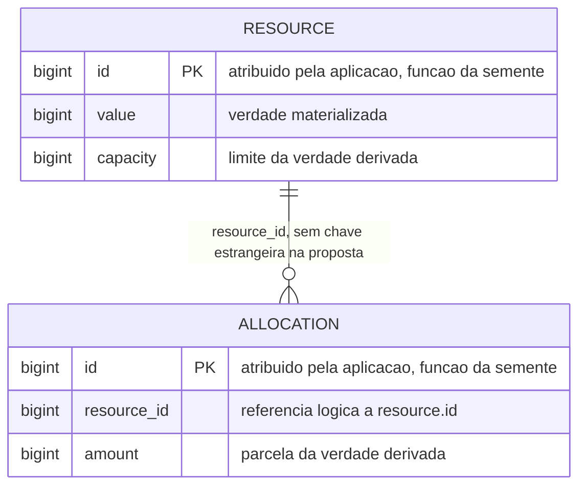
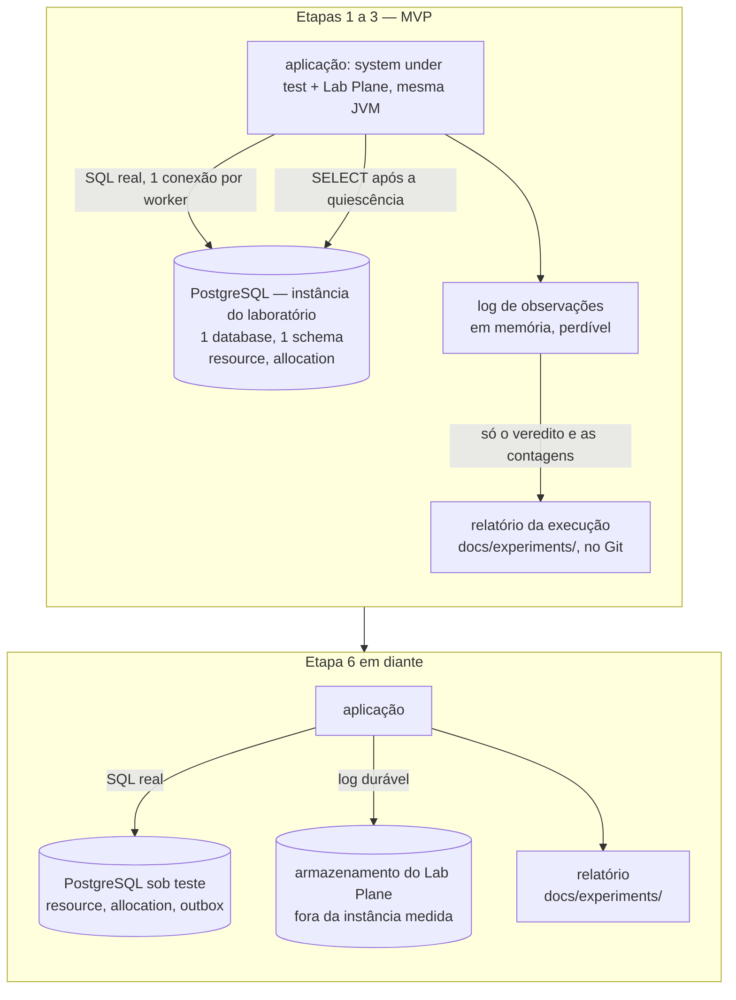
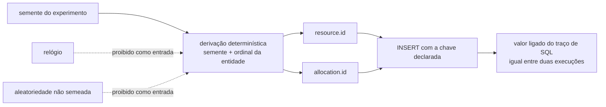
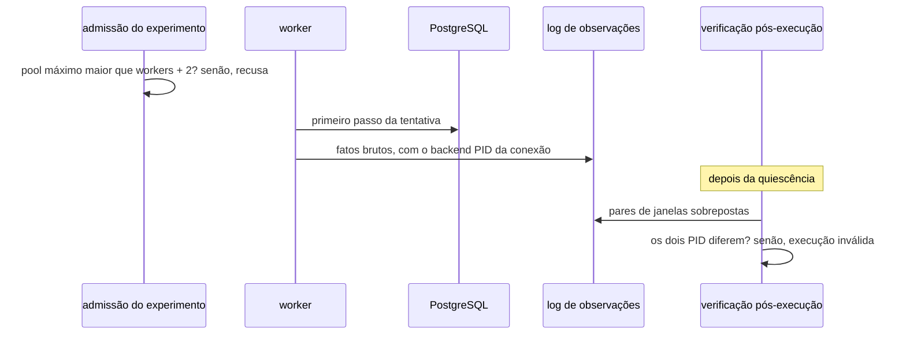
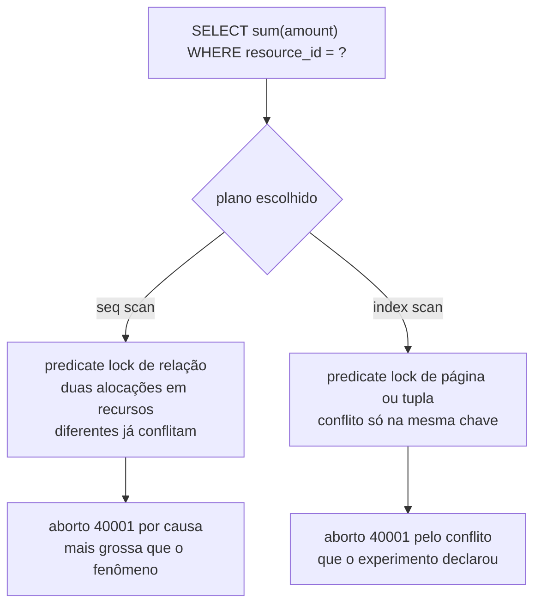
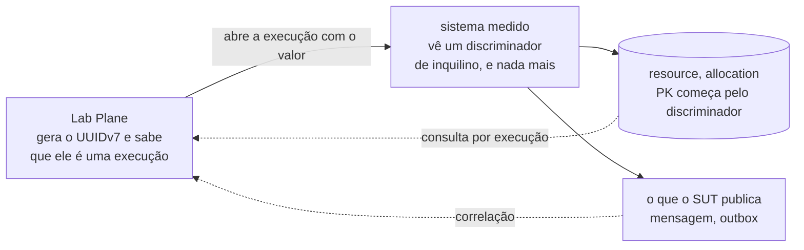

# Modelo de dados, esquema PostgreSQL, migrações e persistência

- **Estado:** Proposta — requer aprovação humana
- **Data:** 2026-08-03
- **Escopo:** o esquema das duas tabelas do system under test, onde o Lab Plane
  guarda o estado dele sem contaminar a medida, e as decisões de persistência que a
  primeira migração obriga a tomar.
- **Depende de:** [`ADR-0001`](../adr/0001-o-passo-como-unidade-de-execucao.md),
  [`ADR-0002`](../adr/0002-o-dominio-minimo-e-os-dois-oraculos.md),
  [`ADR-0004`](../adr/0004-o-estatuto-da-barreira-e-o-diagnostico-da-nao-ocorrencia.md),
  [`ADR-0006`](../adr/0006-a-forma-da-estrategia-de-concorrencia.md),
  [`ADR-0007`](../adr/0007-o-log-de-observacoes-forma-ordem-e-onde-vive.md) — os cinco
  `Aceito`.

## O que este documento é

Uma proposta de esquema, não uma decisão. Nada aqui substitui, emenda ou contraria um
ADR aceito; onde a proposta esbarra num, a colisão está nomeada com arquivo e linha, e
vira linha da tabela `## Decisões que exigem aprovação humana`.

O documento existe porque as colunas do laboratório hoje são prosa: `Q-INT-5` registra
que não há DDL, migração nem esquema executável
([`integrations.md`](integrations.md):104-108), e o contrato de esquema só nasce com "a
primeira migração escrita" ([`../contracts/README.md`](../contracts/README.md):16).
Nenhum arquivo `.sql` foi criado aqui — todo DDL abaixo vive em bloco cercado, porque
escrever a migração é o gatilho do contrato, e o gatilho pertence a uma pessoa.

A medida de sucesso: quem escrever a primeira migração a partir daqui não precisa tomar
nenhuma decisão nova, e sabe exatamente quais restam.

---

## 1. O esquema do system under test

O ADR-0002 fixa duas entidades e cinco colunas: `Resource` carrega `id`, `value` e
`capacity`; `Allocation` carrega `id`, `resource_id` e `amount`; "Nenhuma outra coluna
entra no MVP" (`../adr/0002-o-dominio-minimo-e-os-dois-oraculos.md`:88-93).



`value` é a verdade materializada; `Σ amount` das alocações do recurso é a verdade
derivada, e `capacity` é o limite dela (`0002-...md`:98-100).

```sql
-- Proposta. Nasce na etapa 1 do roadmap (plano-do-laboratorio.md:341).
-- Este bloco NÃO é um arquivo de migração: ver seção 6.

CREATE TABLE resource (
    id       bigint NOT NULL,
    value    bigint NOT NULL,
    capacity bigint NOT NULL,
    CONSTRAINT resource_pk PRIMARY KEY (id)
);

CREATE TABLE allocation (
    id          bigint NOT NULL,
    resource_id bigint NOT NULL,
    amount      bigint NOT NULL,
    CONSTRAINT allocation_pk PRIMARY KEY (id)
);
```

### Por que cada escolha de tipo e restrição

| Escolha                                 | Motivo                                                                                                                          |
|-----------------------------------------|---------------------------------------------------------------------------------------------------------------------------------|
| `bigint` em `id`                        | a identidade vem da aplicação, e o tipo depende de D-DAT-01; `bigint` é a alternativa recomendada ali                           |
| `bigint` em `value`                     | `integer` estoura em `2^31`; um estouro no meio de uma execução vira exceção do banco no caminho medido do E1 ao E4             |
| `bigint` em `amount` e `capacity`       | mesmo motivo, e mantém a soma do oráculo do predicado no mesmo tipo do limite                                                   |
| `NOT NULL` em tudo                      | um nulo em `value` faz `value_final − value_inicial` do oráculo virar nulo, e o veredito some em silêncio (`0002-...md`:140)    |
| chave primária declarada                | a identidade é a única coisa que o esquema precisa impedir de duplicar; o índice dela é a via de acesso do `increment`          |
| nenhum `DEFAULT`                        | `SERIAL`, `IDENTITY`, `nextval` e valor padrão gerado pelo banco são proibidos para coluna de identidade (`0002-...md`:125-127) |
| nenhum `CHECK`                          | ver seção 2                                                                                                                     |
| nenhuma chave estrangeira               | ver D-DAT-02                                                                                                                    |
| nenhum índice além das chaves primárias | ver D-DAT-03 e seção 11                                                                                                         |

Duas notas de sintaxe que custam caro quando descobertas tarde. `value` é palavra-chave
**não reservada** no PostgreSQL e funciona como nome de coluna sem aspas; o nome vem do
ADR-0002 e a proposta não o troca. E `resource` e `allocation` ficam em minúsculas sem
aspas, de modo que o texto do statement da operação e o texto do statement do oráculo
usam a mesma grafia — o critério de igualdade de traço compara texto normalizado apenas
por espaço em branco (`0002-...md`:252-257), e uma grafia com aspas em um dos braços
reprovaria um par correto.

### Onde `capacity` fica ociosa

Nos experimentos E1 a E4 nenhuma alocação existe, e `capacity` não é lida. O ADR-0002 já
aceitou esse custo: "o esquema carrega colunas que nenhum experimento isolado usa por
inteiro" (`0002-...md`:490-491). A proposta mantém `NOT NULL` e faz a semeadura declarar
um valor, para que o esquema não precise distinguir "sem capacidade" de "capacidade
zero".

---

## 2. O que deliberadamente não existe no esquema

Cada ausência abaixo tem um dono: um ADR aceito que a exige, ou uma decisão desta
proposta. Nenhuma delas é esquecimento.

| Ausência                                                 | Quem a exige                                                                      |
|----------------------------------------------------------|-----------------------------------------------------------------------------------|
| coluna `version`                                         | `0002-...md`:95-96 — quem a acrescenta é o ADR de estratégias, ver seção 6        |
| `SERIAL`, `IDENTITY`, `nextval`, `DEFAULT` de identidade | `0002-...md`:125-127                                                              |
| `DEFAULT now()`, `created_at`, `updated_at`              | o tempo é injetável (`../../AGENTS.md`:108); um padrão do banco lê o relógio real |
| `DEFAULT gen_random_uuid()`                              | aleatoriedade não semeada (`../../AGENTS.md`:105)                                 |
| estado, data de liberação ou baixa em `allocation`       | `0002-...md`:439-440 — a alocação nunca é liberada no MVP                         |
| `CHECK` com subconsulta, constraint deferida, trigger    | Alternativa D do ADR-0002 (`0002-...md`:559-574)                                  |
| `CHECK (amount > 0)` e afins                             | ver abaixo                                                                        |
| `experiment_id` ou `execution_id` nas duas tabelas       | ver abaixo                                                                        |
| unicidade sobre `(resource_id, amount)`                  | o E5 produz duas linhas idênticas de propósito (`plano-do-laboratorio.md`:461)    |

**Por que nenhuma verificação de invariante vive no banco.** A Alternativa D do ADR-0002
foi descartada por dois motivos, e o segundo é o que importa aqui: uma trigger que soma
alocações roda sob o mesmo isolamento da transação que a disparou, sofre o mesmo write
skew, e deixaria passar exatamente o caso que deveria pegar (`0002-...md`:569-574). Uma
constraint que recusa a alocação excedente produz um experimento em que nada dá errado,
e apaga a lição do E5 — a invariante quebra sem nenhuma exceção lançada.

**Por que nem sequer um `CHECK` de linha única.** `CHECK (amount > 0)` não avalia
conjunto e não cai na Alternativa D. A proposta o descarta por outro motivo: qualquer
recusa vinda do banco que o experimento não tenha declarado vira uma exceção no caminho
medido, e a estratégia de concorrência responde "há outra tentativa?" a partir da
exceção recebida (`0006-...md`:60-62). Uma restrição que ninguém declarou passa a
decidir retry.

**Por que o system under test não carrega identificador de execução.** Uma coluna
`execution_id` em `resource` resolveria o reset entre execuções por filtro, e colocaria
vocabulário do instrumento dentro do sistema medido. Os dois planos já dividem a mesma
JVM, e a separação precisa ser imposta, não presumida
(`plano-do-laboratorio.md`:534-536). A consequência é que o isolamento entre execuções
precisa vir de outro lugar — é D-DAT-05.

---

## 3. Topologia de dados, por etapa

A pergunta que governa esta seção: **onde o Lab Plane guarda o dele sem entrar na
medida?** A restrição é explícita — "gravar observações no mesmo PostgreSQL adiciona
contenção à medida" (`plano-do-laboratorio.md`:589-592).

Um esclarecimento técnico que muda a resposta: **um schema separado não isola
contenção.** Dois schemas do mesmo banco compartilham buffer pool, WAL, checkpointer,
autovacuum e a tabela de locks. Schema é espaço de nomes; a fronteira de contenção é a
instância. Um `INSERT` do Lab Plane num schema vizinho gera WAL na mesma sequência que o
`UPDATE` medido.



| Etapa | O que existe no banco sob teste                                         | Onde o Lab Plane guarda o dele                             |
|-------|-------------------------------------------------------------------------|------------------------------------------------------------|
| 1 a 3 | `resource`, `allocation`                                                | memória; só o relatório sobrevive à execução               |
| 4     | as mesmas duas, compartilhadas pelas duas instâncias do processo        | inalterado                                                 |
| 5     | as mesmas duas                                                          | inalterado                                                 |
| 6     | acrescenta a tabela de outbox, no mesmo escopo transacional da operação | armazenamento durável, fora da instância medida (D-DAT-06) |
| 7     | acrescenta a tabela de deduplicação do inbox                            | inalterado                                                 |
| 9     | acrescenta a tabela da projeção                                         | inalterado                                                 |

A tabela de outbox é do **system under test**, não do Lab Plane: ela participa da
transação da operação, e é a solução que a etapa 6 introduz **depois** de o experimento
mostrar o problema, pela regra pedagógica (`../../AGENTS.md`:88-92). O desenho do
pipeline que a consome não é deste documento.

### A divergência sobre persistir o log no MVP

O plano diz que "no MVP, o log vive em memória e é persistido no fim da execução"
(`plano-do-laboratorio.md`:589-592). O ADR-0007, aceito depois, diz que "persistência
durável continua fora de escopo — gatilho na etapa 6" (`0007-...md`:86-88), e assume o
custo: "o log é perdível até a etapa 6" (`0007-...md`:152-153).

Os dois textos não dizem a mesma coisa, e a diferença decide se o MVP escreve alguma
coisa em disco. Como o ADR-0007 está `Aceito` e é posterior, a leitura proposta é: **o
MVP não persiste o log; ele persiste o relatório.** O relatório é artefato do ADR-0004,
não do log, e o caderno de laboratório de `docs/experiments/` (`../../AGENTS.md`:116)
continua existindo com ele. Esta leitura é proposta, não decisão — D-DAT-06.

---

## 4. O esquema do Lab Plane, e a etapa de nascimento de cada tabela

Nenhuma tabela do Lab Plane nasce no MVP. Nenhuma tem experimento que a exija hoje, e a
regra é que "nenhuma tecnologia entra por estar disponível" (`../../AGENTS.md`:102-104)
— a regra vale para uma tabela igual.

| Tabela proposta             | Nasce quando                                                               |
|-----------------------------|----------------------------------------------------------------------------|
| `lab_execution`             | o log precisar de dono durável — etapa 6 (`0007-...md`:179-181)            |
| `lab_observation`           | a mesma etapa 6                                                            |
| `lab_report`                | o primeiro relatório que precisar sobreviver fora do Git; ver D-DAT-10     |
| `lab_experiment_definition` | se, e só se, a definição de experimento passar a viver no banco — D-DAT-07 |

```sql
-- Proposta, etapa 6. Fora da instância que o experimento mede — ver D-DAT-06.

CREATE TABLE lab_execution (
    id               bigint      NOT NULL,
    experiment_id    text        NOT NULL,
    seed             bigint      NOT NULL,
    execution_role   text        NOT NULL, -- calibração | controle negativo
                                           -- | medida | controle positivo
    n_declared       bigint      NOT NULL, -- o N do ADR-0004:108
    workers          integer     NOT NULL,
    strategy         text        NOT NULL, -- rótulo opaco, ADR-0006:51-54
    isolation_level  text        NOT NULL,
    started_at       timestamptz NOT NULL, -- do adaptador de relógio, nunca de now()
    ended_at         timestamptz NOT NULL,
    CONSTRAINT lab_execution_pk PRIMARY KEY (id)
);

CREATE TABLE lab_observation (
    execution_id     bigint      NOT NULL,
    sequence_no      bigint      NOT NULL, -- ordem de apensamento, não precedência
    attempt          bigint      NOT NULL,
    worker           integer     NOT NULL,
    step_label       text        NOT NULL, -- endereço de fronteira, ADR-0001:177-179
    boundary_side    text        NOT NULL, -- entrada | saida
    attempt_selector text        NOT NULL,
    event_type       text        NOT NULL, -- RESULTADO_DE_PASSO | BLOQUEIO
                                           -- | LIBERACAO | FALHA_INJETADA
    wall_instant     timestamptz NOT NULL,
    restricted       boolean,               -- só em BLOQUEIO e LIBERACAO
    facts            json,                  -- só em RESULTADO_DE_PASSO, opaco
    CONSTRAINT lab_observation_pk PRIMARY KEY (execution_id, sequence_no),
    CONSTRAINT lab_observation_execution_fk
        FOREIGN KEY (execution_id) REFERENCES lab_execution (id)
);

CREATE TABLE lab_report (
    execution_id        bigint NOT NULL,
    commits             bigint NOT NULL, -- ADR-0004:109
    violations          bigint NOT NULL, -- ADR-0004:110
    coincidences        bigint NOT NULL, -- ADR-0004:160-162
    zero_classification text,            -- ADR-0004:212-218, nulo quando há violação
    CONSTRAINT lab_report_pk PRIMARY KEY (execution_id),
    CONSTRAINT lab_report_execution_fk
        FOREIGN KEY (execution_id) REFERENCES lab_execution (id)
);
```

Cinco escolhas merecem justificativa, e nenhuma delas vale para o system under test.

**As taxas não são colunas.** A taxa de violação, a taxa de aborto e o limite superior a
95% derivam das três contagens (`0004-...md`:113-122). Guardá-las materializaria uma
verdade derivada, e o vocabulário do ADR-0002 existe justamente para separar as duas. A
classificação do zero fica gravada porque ela depende de comparar execuções irmãs na
ordem da tabela do ADR-0004 (`0004-...md`:208-218) — recalculá-la depois exigiria que as
execuções irmãs ainda existissem.

**`facts` é `json`, não `jsonb`.** `jsonb` reordena chaves e descarta duplicatas, o que
é interpretação; o runtime registra os fatos sem interpretá-los (`0001-...md`:253-254) e
o payload é opaco (`0007-...md`:61). Se alguma consulta nomeada precisar indexar o
conteúdo, a troca para `jsonb` passa a ter dono; hoje não tem.

**Chave estrangeira aqui, e não lá.** No Lab Plane, uma restrição que recusa um evento
malformado é o instrumento se protegendo. No system under test, uma restrição que recusa
uma linha é o instrumento impedindo a anomalia que o laboratório existe para mostrar. A
Alternativa D do ADR-0002 vale para um lado só.

**`sequence_no` não promete precedência.** Entre workers, o log só garante ordem para o
par que um evento `restrito = verdadeiro` produz (`0007-...md`:78-83). A coluna registra
a ordem de apensamento, e quem a lê como prova de precedência lê errado.

**`started_at`, `ended_at` e `wall_instant` vêm do adaptador de relógio.** Nenhum
`DEFAULT now()` em nenhuma das três — a regra do relógio injetável não abre exceção para
o Lab Plane sem abrir para o system under test.

---

## 5. Identidade determinística a partir da semente

O ADR-0002 fixa duas coisas sobre identidade: ela é gerada no código do sistema sob
teste a partir da semente do experimento, e não é função do instante da execução
(`0002-...md`:125-131). Duas execuções da mesma semente produzem os mesmos
identificadores.



Duas famílias de resposta sobrevivem à restrição, e as duas estão em D-DAT-01. O que
vale para as duas:

- `UUID.randomUUID()` está fora: é aleatoriedade não semeada.
- UUIDv7 e qualquer identificador com componente temporal estão fora: são função do
  instante.
- A derivação recebe a semente e o ordinal da entidade dentro do experimento, e nada
  mais. Um contador de processo, um `AtomicLong` ou o número de linhas já existentes na
  tabela reintroduzem dependência de execução anterior — e `AtomicInteger` está proibido
  no sistema sob teste por outro motivo (`../../AGENTS.md`:111-113).
- O identificador entra na comparação por valor do traço de SQL (`0002-...md`:259-261).
  Uma derivação que mude entre execuções reprova um par correto, e é exatamente o
  acoplamento que [`Q-0002-4`](../questions/Q-0002-4.md) registra.

---

## 6. Migrações

Três candidatas, e a terceira é a que causa dano silencioso.

**Nenhuma ferramenta, esquema gerado pelo ORM.** `ddl-auto` cria as tabelas a partir das
entidades. Descartada por uma razão específica deste repositório: uma entidade anotada
com `@Version` faz o Hibernate criar a coluna `version` sem que ela apareça em diff
nenhum, e o ADR-0002 a proíbe no esquema (`0002-...md`:95-96). A proibição existe para
que `OPTIMISTIC` continue sendo uma escolha, e não a continuação natural do modelo
(`0002-...md`:392-398). Um esquema gerado retira a escolha em silêncio — o modo de falha
que este repositório mais tenta evitar.

**Liquibase, changelog declarativo.** O argumento a favor é legítimo: rollback declarado
e independência de banco. Perde porque o laboratório mede comportamento específico do
PostgreSQL. `fillfactor`, `REPLICA IDENTITY`, tipo de índice e nível de isolamento são
as alavancas que contaminam ou preservam a medida, e uma camada que gera DDL a partir de
abstração afasta o autor delas. Independência de banco também não é requisito: nenhum
experimento roda em outro banco.

**Flyway, SQL versionado.** Recomendada. O arquivo de migração é o DDL literal, e passa
a ser o contrato que `Q-INT-5` pede. Cada decisão aceita vira um arquivo; um arquivo
aplicado nunca é editado, pela mesma razão que um ADR aceito não é.

A sequência proposta:

| Migração                  | Nasce com                                                         |
|---------------------------|-------------------------------------------------------------------|
| `resource` e `allocation` | a arquitetura mínima (fila, posição 10)                           |
| `version` em `resource`   | o commit que introduz `OPTIMISTIC` no código (`0006-...md`:56-59) |
| tabela de outbox          | o experimento da etapa 6                                          |
| esquema do Lab Plane      | a etapa 6, em outro alvo — ver D-DAT-06                           |

```sql
-- Proposta. Nasce no mesmo commit que introduz OPTIMISTIC — ADR-0006:56-59.
-- Não antes: a coluna decide o E3 em silêncio (ADR-0002:392-398).

ALTER TABLE resource ADD COLUMN version bigint NOT NULL DEFAULT 0;
ALTER TABLE resource ALTER COLUMN version DROP DEFAULT;
```

O `DEFAULT 0` existe para preencher as linhas já gravadas, e sai em seguida para que
toda inserção declare o valor — a mesma disciplina que o ADR-0002 impôs à identidade. Se
a decisão de reset (D-DAT-05) esvaziar a tabela entre execuções, as duas linhas viram
uma.

**Uma dependência de ordem que vale registrar.** O ADR-0006 exige que a migração de
`version` nasça junto do código de `OPTIMISTIC` (`0006-...md`:56-59). Enquanto não
houver ferramenta de migração escolhida, esse "nasça junto" não tem forma. D-DAT-04 é
pré-requisito de executar o ADR-0006, e não uma preferência de ferramenta.

---

## 7. Reset entre execuções

**Em 2026-08-05 o usuário decidiu que não há reset**, e a decisão está registrada em
D-DAT-05. O que segue mantém o levantamento das quatro candidatas, porque ele é o que
justifica a escolha; a decisão e o que ela deixa em aberto estão em D-DAT-05.

A decisão **não fecha** [`Q-0002-4`](../questions/Q-0002-4.md) por si. O destino daquela
questão na fila continua sendo o ADR de Experiment (fila, posição 8), e é lá que a
escolha vira artefato — este documento não é o lugar onde a questão se encerra.

O aperto é o que a própria questão descreve: o identificador é função da semente, logo
duas execuções da mesma semente produzem a mesma chave primária, e a segunda colide com
as linhas da primeira. As três candidatas visíveis:

| Candidata                         | Custo técnico                                                                                                                            |
|-----------------------------------|------------------------------------------------------------------------------------------------------------------------------------------|
| `TRUNCATE` antes de cada execução | apaga o histórico; `TRUNCATE` toma `ACCESS EXCLUSIVE` e reinicia o arquivo da tabela, o que zera a estatística e o bloat acumulados      |
| schema por execução               | isola de verdade dentro do mesmo banco quanto a colisão de chave, e multiplica objetos; o `search_path` passa a ser parâmetro de conexão |
| recurso novo por execução         | contradiz a comparação por valor do traço, porque o identificador passa a variar entre execuções (`Q-0002-4`)                            |
| execução na chave primária        | preserva todo o histórico e faz as duas tabelas crescerem sem limite; põe vocabulário do Lab Plane na chave do sistema medido            |

Um detalhe do `TRUNCATE` que muda a comparabilidade entre execuções: ele recria o
arquivo físico da tabela, e a execução seguinte começa sobre páginas novas. Um `DELETE`
deixa tuplas mortas e o autovacuum passa a rodar dentro da execução seguinte. As duas
limpezas não produzem a mesma linha de base, e nenhuma das duas está declarada hoje.

**A quarta candidata não está em `Q-0002-4`, e foi levantada em 2026-08-05.** Ela troca
a chave primária de `resource` por um par `(execução, recurso)`, e faz o mesmo em
`allocation`. Nenhuma execução colide com outra, nada é apagado, e a análise de uma
execução passada continua possível sobre as linhas — não apenas sobre o veredito do
relatório. Ela **não** é a candidata "recurso novo por execução" de `Q-0002-4`: aquela
faz o identificador do recurso variar, e esta o mantém função da semente, acrescentando
uma segunda coluna à chave. A restrição do ADR-0002 sobre a identidade
(`Q-0002-4.md`:30-32) continua satisfeita.

O que ela custa está em dois lugares. O primeiro é a linha de base: as duas tabelas
crescem monotonicamente, e a execução número `n` roda sobre um heap formado pelas `n-1`
anteriores. É a mesma objeção que derruba a terceira candidata em `Q-0002-4.md`:16-17, e
ela só é neutralizada por particionamento pela coluna de execução, por retenção
declarada, ou pela demonstração de que o crescimento não alcança o veredito do E4 — cuja
forma é uma curva de tempo (`plano-do-laboratorio.md`:443). Nenhuma das três está
escrita. O segundo é de desenho: a coluna de execução é vocabulário do Lab Plane, e
colocá-la na chave primária do sistema medido faz o sistema medido saber que está sendo
medido. O ADR-0008 separa os planos por processo, e nada nele fala sobre o esquema.

**A forma proposta para a coluna, em 2026-08-05: um ULID, propagado a tudo que participa
da execução**, de modo que log, oráculo e linhas do banco sejam rastreáveis ao mesmo
identificador. A propagação não é gratuita e abre três pontos que ninguém decidiu:

- **Quem gera, e sob qual regra.** Um ULID é 48 bits de instante mais 80 bits de
  aleatoriedade. As duas metades esbarram nas regras de `../../AGENTS.md`:124-128 — nada
  de aleatoriedade fora do componente semeado, nada de `Instant.now()` fora do adaptador
  de relógio. A saída plausível é que o identificador nasça **no Lab Plane**, que é o
  instrumento e não o sistema medido, mas as duas regras estão escritas sem qualificar
  plano, e `Q-0002-1` já registra que elas são texto e não guarda executável.
- **Como é armazenado.** Um ULID cabe em 16 bytes e o PostgreSQL tem `uuid` nativo com
  esse tamanho; a forma canônica em texto ocupa 26 caracteres. Como a coluna entra na
  chave primária das duas tabelas e em todo índice, a escolha multiplica por `n` linhas
  de `allocation`. Guardá-lo como texto é a variante cara, e nada hoje declara qual vale.
- **Até onde propaga.** Hoje existem dois processos (ADR-0008) e nenhum protocolo entre
  eles está decidido. A partir da etapa 5 entra o RabbitMQ, e propagar passa a significar
  header de mensagem, com a pergunta de o que acontece quando ele falta.

Há um enquadramento que dissolve a objeção de desenho acima, e ele também é decisão de
alguém: se a coluna de execução for lida como **discriminador de inquilino**, e não como
identificador de medição, o sistema medido deixa de saber que está sendo medido — ele
apenas passa a ser multi-inquilino, que é forma corrente em sistema real. O nome da
coluna decide qual das duas leituras o esquema afirma.

O que ela **não** custa, ao contrário do que `Q-0002-4.md`:19-21 sugere, é a igualdade
de traço. Os dois critérios de igualdade aceitos hoje sobrevivem a ela:

| Critério                                         | Compara                                                            | A coluna de execução entra?       |
|--------------------------------------------------|--------------------------------------------------------------------|-----------------------------------|
| igualdade de traço de SQL (`0002-...md`:244-281) | os dois braços da mesma operação, na mesma entrada amostrada       | os dois braços leem o mesmo valor |
| execuções de controle (`0007-...md`:90-95)       | veredito, mais a subsequência de eventos com `restrito` verdadeiro | não compara SQL nenhum            |

A prova de equivalência do ADR-0002 é intra-execução: os dois braços rodam sobre a mesma
entrada amostrada e leem a mesma coluna de execução, de modo que os valores ligados
coincidem. E o critério que compara duas execuções — o do ADR-0007 — olha veredito e
subsequência de eventos restritos por tipo e endereço de fronteira, ignorando eventos
livres e instante de parede; nenhum valor de SQL entra nele. O que segue sem critério é a
**execução medida**, e isso já é consequência negativa declarada do ADR-0007
(`0007-...md`:141-142), anterior a esta candidata e independente dela. Ver `P-DAT-9`.

Recomendação em D-DAT-05: `TRUNCATE` das duas tabelas seguido da semeadura, executado
pelo Lab Plane antes de cada uma das quatro execuções do ciclo
(`execucao-de-experimento`, R2), com o estado final de cada execução copiado para o
relatório antes da limpeza seguinte. O histórico que se perde é o das linhas; o que
interessa ao caderno de laboratório é o veredito, e ele já sai no relatório.

---

## 8. Nível de isolamento

O E5 compara o mesmo experimento sob `READ COMMITTED`, `REPEATABLE READ` e
`SERIALIZABLE` (`plano-do-laboratorio.md`:472-474), e o ADR-0002 deixou o isolamento
explicitamente fora do que decide (`0002-...md`:287-291).

O card do E5 registra o risco de apagar a distinção: "uma estratégia é código da
aplicação e muda o SQL emitido; um nível de isolamento é propriedade da transação e muda
o que o banco faz com o **mesmo** SQL"
(`../features/deteccao-de-protecao-inerte/feature-card.md`:66-69). A proposta trata os
dois como parâmetros distintos da execução, com donos distintos.

Quatro formas de aplicar o parâmetro, e três estragam alguma coisa:

| Forma                                                         | Consequência                                                                                                                      |
|---------------------------------------------------------------|-----------------------------------------------------------------------------------------------------------------------------------|
| runtime configura o `TransactionTemplate` ao abrir o escopo   | recomendada; o runtime já é quem abre o escopo (`0001-...md`:256-262), e o SQL da operação não muda                               |
| a operação emite `SET TRANSACTION ISOLATION LEVEL` como passo | o statement entra no traço e muda o critério de igualdade (`0002-...md`:248-252); e o isolamento vira código do system under test |
| configuração do pool, igual para todas as execuções           | o E5 deixa de poder variar o eixo que ele existe para varrer                                                                      |
| `@Transactional(isolation = ...)` no braço declarativo        | a anotação é constante; o braço declarativo não recebe o parâmetro da execução — ver `## Perguntas em aberto`                     |

Duas armadilhas de configuração que valem estar escritas antes da primeira execução.
`spring.datasource.hikari.transaction-isolation`, quando fixado, sobrepõe o nível pedido
pelo escopo transacional. E uma conexão devolvida ao pool com o isolamento alterado
carrega o valor para a execução seguinte, se quem alterou não restaurar — o parâmetro
vaza entre execuções sem sintoma. A verificação proposta: o Lab Plane confere o nível
efetivo numa transação de sondagem própria, antes da execução, nunca dentro de uma
tentativa medida — um `SHOW` emitido dentro da tentativa entraria no traço.

O `SELECT sum` do oráculo roda em transação própria depois da quiescência, e o
isolamento dela não afeta o resultado (`0002-...md`:471-474).

---

## 9. Pool e conexões

A restrição: "cada worker tem sua própria conexão. (...) O tamanho do pool precisa ser
maior que o número de workers, e isso precisa ser verificado, não presumido"
(`plano-do-laboratorio.md`:579-582). Se o pool serializar dois workers, o experimento
produz um falso negativo e o relatório diz `protegido`.

O tamanho do pool é condição necessária e não suficiente. Além dos workers, tomam
conexão emprestada: o oráculo, a ferramenta de migração na subida, o `health check` do
Actuator e a transação de sondagem do isolamento. Um pool de exatamente `workers`
conexões passa numa verificação de tamanho e ainda serializa.

**Proposta de verificação executável, em duas camadas.**

A primeira é estática, na admissão do experimento: recusar a execução quando o tamanho
máximo do pool não for maior que `workers + 2`. A recusa é ruidosa e acontece antes de
qualquer medida.

A segunda é a que verifica a propriedade de verdade. Cada tentativa reporta, entre os
fatos brutos do primeiro passo, o **backend PID** da conexão que a atendeu. O runtime
registra o fato sem interpretá-lo, do mesmo jeito que registra `version` e
`rowsAffected` (`0001-...md`:253-254), e é o mesmo mecanismo que o ADR-0004 já usa para
a chave de contenção (`0004-...md`:195-197). A asserção reusa os pares que a plataforma
já calcula: **para todo par de tentativas cujas janelas de exposição se sobrepõem
(`0004-...md`:160-162), os dois backend PID diferem.** Se dois workers com janelas
sobrepostas compartilharam a conexão, a asserção falha, e falha com nome.



Dois cuidados. O backend PID é lido do driver pelo lado cliente
(`PGConnection#getBackendPID()`), sem enviar statement nenhum — um `SELECT
pg_backend_pid()` entraria no traço de SQL e reprovaria a prova de equivalência contra o
braço declarativo, que é um passo único de corpo opaco (`0001-...md`:266-269). E a
asserção é vazia quando não há par sobreposto: sob `PESSIMISTIC` as coincidências são
zero por construção (`0006-...md`:71-74), e é por isso que a camada estática continua
existindo.

Uma consequência que o número do pool não mostra: sob `PESSIMISTIC`, o worker bloqueado
no `SELECT ... FOR UPDATE` continua segurando a conexão dele. Isso é o experimento
funcionando, não contenção de pool — e distinguir os dois exige a asserção acima, não o
tamanho.

---

## 10. Índices, planos e contaminação da medida

Um índice não é decoração de desempenho neste repositório: ele muda o que o PostgreSQL
tranca, e o que o PostgreSQL tranca é o objeto do experimento.

**O caso que importa é o E5 sob `SERIALIZABLE`.** O `SELECT sum(amount) WHERE
resource_id = ?` do `allocate` toma predicate lock (SIREAD) sob SSI, e a **granularidade
do lock segue o plano, não o DDL**. Com varredura sequencial, o lock é de relação
inteira; com varredura por índice, ele desce a página ou tupla. Sobre tabelas pequenas —
e as do laboratório são pequenas por construção — o planejador escolhe varredura
sequencial mesmo com o índice criado.



O E5 do MVP usa um recurso só (`0002-...md`:475-476), e nesse recorte a diferença não
muda o veredito. Ela muda no primeiro experimento com dois recursos: sob lock de
relação, duas alocações em recursos diferentes abortam uma à outra, e o relatório
atribui ao write skew um aborto que veio da granularidade do lock. A proposta: criar o
índice sobre `allocation(resource_id)` **e** registrar o plano efetivo junto do
relatório, porque o índice não garante que ele seja usado. Forçar o plano com
`enable_seqscan = off` altera o sistema sob teste e fica fora.

**No lado do contador, o risco é outro.** `resource` sofre milhares de `UPDATE` na mesma
linha durante o E4, com workers de 2 a 50 (`plano-do-laboratorio.md`:443). Como `value`
não é indexada, o `UPDATE` é candidato a HOT, e a taxa de HOT depende de espaço livre na
página — logo de `fillfactor` e do autovacuum. Um autovacuum que dispare no meio de uma
execução muda o tempo das tentativas seguintes, e a curva do E4 é uma medida de tempo.
Nenhum documento declara isso hoje; está em `## Perguntas em aberto`.

**Um índice que a proposta não cria:** nenhum índice sobre `resource(value)`. Ele
tornaria o `UPDATE` do E1 ao E4 não-HOT, acrescentando escrita de índice a cada
incremento — custo puro sobre o caminho medido, sem nenhuma consulta que o use.

---

## 11. O que o CDC exigiria do PostgreSQL

**Nenhum experimento do roadmap nomeia CDC.** A tabela de etapas
(`plano-do-laboratorio.md`:339-352) e a de decisões adiadas
(`plano-do-laboratorio.md`:605-618) não citam Debezium, e uma busca na árvore versionada
não encontra a palavra fora deste arquivo. Pela regra de que nenhuma tecnologia entra
por estar disponível (`../../AGENTS.md`:102-104), o CDC não entra. O que segue é o
custo, para quando alguém propuser o gatilho. O desenho do pipeline não é deste
documento.

| Exigência                                  | Onde ela vive                  | Custo sobre a medida                                                                                       |
|--------------------------------------------|--------------------------------|------------------------------------------------------------------------------------------------------------|
| `wal_level = logical`                      | GUC de cluster, exige reinício | aumenta o WAL de **toda** escrita do cluster, inclusive o `UPDATE` quente do E1 ao E4                      |
| `max_wal_senders`, `max_replication_slots` | GUC de cluster                 | processo walsender lendo os mesmos buffers durante a execução                                              |
| slot de replicação                         | por cluster                    | um slot parado segura `restart_lsn` e o horizonte de `xmin`: o vacuum para, o bloat cresce entre execuções |
| publicação                                 | por banco                      | custo baixo por si                                                                                         |
| `REPLICA IDENTITY`                         | por tabela                     | o padrão usa a chave primária, que a proposta tem; `FULL` grava a tupla antiga inteira em cada `UPDATE`    |
| papel com atributo `REPLICATION`           | por cluster                    | nenhum sobre a medida                                                                                      |

A consequência que sobrevive a qualquer desenho: **`wal_level` é ajuste de cluster e não
de banco.** Ligar CDC para um experimento muda o custo de escrita de todos os outros. Um
resultado medido sob `logical` não é comparável com um medido sob `replica`, e o slot
parado degrada a linha de base ao longo do tempo sem nenhum sintoma visível no
relatório. Se o CDC entrar, ou ele vive numa instância separada da instância medida, ou
todo relatório passa a registrar o `wal_level` vigente. É D-DAT-11, e ele encosta em
`Q-INT-3` (`integrations.md`:93-97).

---

## 12. Volume e retenção do log de observações

Uma tentativa de `increment` tem três passos — a janela do E1 nomeia `select-resource` e
`update-resource` (`0004-...md`:138-139), e o `COMPUTE` está entre os dois. Cada passo
produz um `RESULTADO_DE_PASSO`, e cada fronteira produz um evento de bloqueio ou
liberação, inclusive quando o worker só consulta e segue (`0007-...md`:63-65). Dá **nove
eventos por tentativa**, mais as falhas injetadas.

| Execução                                                | Tentativas | Eventos   | Ordem de grandeza em memória |
|---------------------------------------------------------|------------|-----------|------------------------------|
| E1, `N = 100`                                           | ~100       | ~900      | dezenas de KB                |
| E3, quatro estratégias sobre `N = 100`                  | ~400+      | ~3 600+   | centenas de KB               |
| E4, se declarar `N = 10 000` com retry sob `OPTIMISTIC` | 10⁴ a 10⁵  | 10⁵ a 10⁶ | dezenas a centenas de MB     |

O E1 e o E3 cabem em memória sem discussão. O E4 é onde o volume vira decisão, e o `N`
do E4 não está declarado em lugar nenhum — a linha acima é condicional, não medida.

Uma consequência de volume que pertence ao runtime e chega aqui: a contagem de
coincidências percorre **pares** de tentativas (`0004-...md`:160-162). Em 10⁵ tentativas
isso é 10¹⁰ pares por força bruta, e nenhum documento declara como a contagem é feita.

**Retenção proposta**, em três níveis, e é D-DAT-10:

1. O relatório — as três contagens e a classificação do zero — vai para
   `docs/experiments/`, no Git. É pequeno e é o caderno de laboratório
   (`../../AGENTS.md`:116).
2. A subsequência de eventos com `restrito = verdadeiro`, que é o que o critério de
   igualdade entre execuções de controle consome (`0007-...md`:92-95), acompanha o
   relatório. Numa execução medida ela é vazia, porque a execução medida roda sem
   agendamento (`0004-...md`:101-103).
3. O log completo fica fora do Git, no armazenamento durável que nasce na etapa 6.

---

## Decisões que exigem aprovação humana

| ID       | Decisão                                                   | Alternativas                                                                | Recomendação                                      | Por que só uma pessoa decide                                                           |
|----------|-----------------------------------------------------------|-----------------------------------------------------------------------------|---------------------------------------------------|----------------------------------------------------------------------------------------|
| D-DAT-01 | tipo e derivação da coluna de identidade                  | `bigint` ordinal da semente; UUID determinístico versão 5                   | `bigint` ordinal                                  | prende o valor ligado do traço de SQL e depende de D-DAT-05                            |
| D-DAT-02 | chave estrangeira de `allocation.resource_id`             | com FK; sem FK                                                              | sem FK no MVP                                     | é restrição do banco sobre o sistema medido, vizinha da Alternativa D do ADR-0002      |
| D-DAT-03 | índice sobre `allocation(resource_id)`                    | criar; não criar                                                            | criar, e registrar o plano efetivo                | muda a granularidade do predicate lock e o significado do braço `SERIALIZABLE` do E5   |
| D-DAT-04 | ferramenta de migração                                    | Flyway; Liquibase; nenhuma                                                  | Flyway com SQL versionado                         | é pré-requisito do ADR-0006 e toca a decisão de build (fila, posição 10 e 11)          |
| D-DAT-05 | como o banco volta ao ponto de partida entre execuções    | `TRUNCATE`; schema por execução; recurso novo; execução na chave primária   | decidida em 2026-08-05: não há reset              | é `Q-0002-4`, com destino no ADR de Experiment (fila, posição 8)                       |
| D-DAT-06 | onde o Lab Plane guarda o log durável a partir da etapa 6 | instância separada; mesmo cluster, outro banco; arquivo em disco            | instância separada da que o experimento mede      | resolve também a divergência entre `plano`:589-592 e `0007-...md`:86-88                |
| D-DAT-07 | onde vive a definição de experimento                      | arquivo versionado; tabela no banco; os dois com fonte de verdade declarada | não decidir aqui                                  | é a tensão 1 do plano e pertence ao ADR de Experiment                                  |
| D-DAT-08 | como o nível de isolamento é aplicado                     | `TransactionTemplate`; statement no passo; pool; anotação                   | `TransactionTemplate`, configurado pelo runtime   | a forma errada entra no traço de SQL ou apaga a distinção que o E5 existe para mostrar |
| D-DAT-09 | forma da verificação "uma conexão por worker"             | só tamanho de pool; tamanho mais asserção sobre backend PID                 | as duas camadas                                   | um falso negativo silencioso invalida todo experimento do grupo A                      |
| D-DAT-10 | o que do log entra no Git                                 | log completo; relatório mais eventos restritos; só relatório                | relatório mais eventos restritos                  | define o que o caderno de laboratório prova daqui a um ano                             |
| D-DAT-11 | instância do PostgreSQL e `wal_level`, se o CDC entrar    | instância dedicada; compartilhada com registro do `wal_level`               | dedicada                                          | encosta em `Q-INT-3` e no custo que a Camada 6 do homelab tentava economizar           |

### D-DAT-01 — tipo e derivação da identidade

**Problema.** O identificador é função da semente e não do instante
(`0002-...md`:128-131), e entra na comparação por valor do traço (`0002-...md`:259-261).
O tipo ainda não foi escolhido.

**Alternativas.** Um `bigint` derivado da semente e do ordinal da entidade é legível em
`psql`, ocupa oito bytes e mantém o índice da chave primária pequeno; o argumento contra
é que ele colide entre duas execuções da mesma semente, o que amarra esta decisão a
D-DAT-05. Um UUID determinístico versão 5, sobre um espaço de nomes mais a semente,
também é reprodutível e não colide entre experimentos diferentes; o argumento contra é
que ele ocupa dezesseis bytes, é opaco na depuração manual e não resolve a colisão que
importa — duas execuções da **mesma** semente continuam produzindo o mesmo valor, por
exigência do ADR-0002.

**Recomendação.** `bigint`. O UUID paga custo e não compra a propriedade que falta.

**Se a escolha for outra.** O DDL da seção 1 troca `bigint` por `uuid` nas três colunas
de identidade e de referência, e a extensão de geração precisa ficar do lado da
aplicação — `gen_random_uuid()` no banco continua proibido.

### D-DAT-02 — chave estrangeira de `allocation.resource_id`

**Problema.** `resource_id` referencia `resource.id` e nada no esquema diz isso.

**Alternativas.** Declarar a FK captura no banco um erro de programação óbvio, e o
argumento a favor é legítimo: uma alocação órfã falsearia o `SELECT sum` do oráculo sem
sintoma. Contra: um `INSERT` em `allocation` com FK adquire um lock `FOR KEY SHARE` na
linha de `resource` referenciada, e esse lock conflita com o `FOR UPDATE` que
`PESSIMISTIC` adquire. Num experimento futuro que misture as duas operações sobre o
mesmo recurso, aparece um bloqueio que ninguém declarou. Não declarar a FK mantém o
esquema livre desse acoplamento e deixa a integridade referencial por conta da
semeadura, que é código do laboratório.

**Recomendação.** Sem FK no MVP, e um teste do Lab Plane que verifique a ausência de
alocações órfãs depois da quiescência — no mesmo lugar em que o oráculo já lê o banco.

**Se a escolha for outra.** O relatório passa a registrar que a operação `allocate`
adquire lock na linha do recurso, e a comparação entre estratégias precisa dizê-lo, sob
pena de atribuir à estratégia um bloqueio que veio da FK.

### D-DAT-03 — índice sobre `allocation(resource_id)`

**Problema.** A granularidade do predicate lock sob `SERIALIZABLE` segue o plano de
execução, e o plano segue o tamanho da tabela.

**Alternativas.** Criar o índice tende a levar o lock para página ou tupla quando o
planejador o usa, o que aproxima o aborto `40001` do conflito real; contra, ele não
garante nada em tabela pequena, e acrescenta escrita de índice a cada `INSERT` do E5.
Não criar deixa a varredura sequencial e o lock de relação, que é honesto quanto ao
mecanismo e produz aborto por causa mais grossa que o fenômeno no primeiro experimento
com dois recursos.

**Recomendação.** Criar o índice e registrar o plano efetivo junto do relatório do braço
`SERIALIZABLE`. Sem o plano registrado, o número não é interpretável.

**Se a escolha for outra.** O card do E5 precisa registrar que o aborto `40001`
observado pode vir do lock de relação, e a varredura dos três níveis de isolamento perde
poder de afirmação sobre a causa.

### D-DAT-04 — ferramenta de migração

**Problema.** O ADR-0006 exige que a migração de `version` nasça no mesmo commit que
introduz `OPTIMISTIC` (`0006-...md`:56-59), e não existe mecanismo de migração.

**Alternativas.** O argumento a favor de nenhuma ferramenta é o custo zero de partida;
contra, o esquema gerado pelo ORM cria `version` a partir de `@Version` sem diff, e
contraria `0002-...md`:95-96 em silêncio. O argumento a favor de Liquibase é rollback e
independência de banco; contra, o laboratório mede comportamento específico do
PostgreSQL e o autor precisa escrever DDL literal. Flyway entrega DDL literal e nada
mais.

**Recomendação.** Flyway com SQL versionado, um arquivo por decisão aceita, nunca
editado depois de aplicado.

**Se a escolha for outra.** Com Liquibase, o contrato que `Q-INT-5` pede passa a ser o
changelog, e o Markdown não pode repetir o DDL; com nenhuma ferramenta, o ADR-0006 fica
sem forma de ser executado e `version` entra por caminho que ninguém revisa.

### D-DAT-05 — reset entre execuções

**Problema.** [`Q-0002-4`](../questions/Q-0002-4.md). O identificador vem da semente,
logo a segunda execução da mesma semente colide com as linhas da primeira.

**Alternativas.** `TRUNCATE` é barato e recria o arquivo físico, dando à execução
seguinte uma linha de base limpa; contra, apaga o histórico de linhas que alguém
quisesse inspecionar. Schema por execução preserva tudo e multiplica objetos no banco,
além de tornar o `search_path` parâmetro de conexão — e mais objetos no mesmo cluster é
mais catálogo e mais autovacuum durante a medida. Recurso novo por execução contradiz a
comparação por valor do traço, e a própria questão já o descarta. **Execução na chave
primária** — levantada em 2026-08-05, fora de `Q-0002-4` — preserva todo o histórico sem
multiplicar objetos, ao custo de crescimento monotônico das duas tabelas e de pôr
vocabulário do Lab Plane na chave do sistema medido; ver seção 7 e `P-DAT-9`.

**Decidido pelo usuário em 2026-08-05: não há reset.** A recomendação anterior era
`TRUNCATE` das duas tabelas antes de cada uma das quatro execuções do ciclo, e ela se
apoiava em parte na objeção de `Q-0002-4.md`:19-21 contra preservar linhas entre
execuções — objeção que `P-DAT-9` mostra não se sustentar sobre nenhum dos dois critérios
de igualdade aceitos. O que foi decidido:

| Ponto                   | Decisão                                                                  |
|-------------------------|--------------------------------------------------------------------------|
| reset entre execuções   | não existe; a chave primária das duas tabelas passa a incluir a execução |
| forma do identificador  | UUIDv7, armazenado no tipo `uuid` nativo do PostgreSQL                   |
| quem gera               | o Lab Plane, uma vez por execução                                        |
| o que a coluna afirma   | discriminador de inquilino, com nome genérico no sistema medido          |
| crescimento das tabelas | aceito, sem particionamento e sem retenção                               |

O sistema medido persiste o discriminador e o propaga a **tudo que publica** — o que a
partir da etapa 5 alcança a mensagem no RabbitMQ e a tabela de outbox. Ele não sabe que o
valor é uma execução de experimento; para ele é a partição lógica dos dados. Quem sabe é
o Lab Plane, que guarda a correspondência e a usa para reconstruir o histórico e
consultar por execução.



**UUIDv7 e não ULID.** As duas formas têm a propriedade que importa aqui — prefixo de
tempo, portanto inserção no fim do índice em vez de espalhada, o que evita a
fragmentação de B-tree que um UUIDv4 causaria dentro da própria janela de medida. UUIDv7
tem tipo nativo de 16 bytes no PostgreSQL, e a forma canônica em Base32 do ULID seria
projeção de apresentação, nunca o tipo da coluna.

**O que a decisão deixa em aberto**, e não é fechado aqui: o nome concreto da coluna
genérica; e a geração do UUIDv7 diante das regras de `../../AGENTS.md`:124-128, já que a
metade de instante e a metade aleatória do formato tocam as duas — a saída de gerá-lo no
Lab Plane é plausível, e nenhuma das duas regras qualifica plano hoje. Ver `P-DAT-10`.

**Consequências imediatas.** `P-DAT-7` e `P-DAT-8` deixam de existir: não há `TRUNCATE`,
logo não há lock a tomar nem `CASCADE` a escrever. D-DAT-03 muda, porque todo índice
passa a começar pelo discriminador. D-DAT-01 permanece: o identificador do recurso
continua função da semente, e o discriminador é a segunda coluna da chave, não uma
substituição.

### D-DAT-06 — onde o Lab Plane guarda o log durável

**Problema.** A partir da etapa 6 o log em memória deixa de ser aceitável
(`0007-...md`:179-181), e ele não pode escrever no banco sob teste
(`plano-do-laboratorio.md`:589-592).

**Alternativas.** Uma instância separada elimina a contenção compartilhada — WAL, buffer
pool, checkpointer, autovacuum — ao custo de um segundo PostgreSQL para operar. Outro
banco no mesmo cluster resolve só a colisão de nomes: a contenção física continua
inteira, e chamá-la de isolada seria falso. Arquivo em disco com `fsync` no fim da
execução não compete por buffer nem por lock, e não oferece consulta — o que basta para
um artefato que o relatório referencia e ninguém consulta durante a execução.

**Recomendação.** Instância separada quando o log precisar ser consultável; arquivo em
disco enquanto ele for apenas anexo do relatório. A escolha entre as duas depende de
haver uma consulta nomeada sobre o log, e hoje não há.

**Se a escolha for outra.** Mesmo cluster, outro banco: todo relatório passa a registrar
que a persistência do log concorreu com a medida, e a comparação entre execuções feitas
com e sem esse acoplamento deixa de ser direta.

### D-DAT-07 — onde vive a definição de experimento

**Problema.** É a tensão 1 do plano (`plano-do-laboratorio.md`:693-698): o Experiment
Designer da interface implica definição no banco, e a decisão arquivada dizia arquivo
versionado.

**Alternativas.** Arquivo versionado mantém o caderno de laboratório no Git e obriga a
interface a gerar commit. Tabela no banco torna a interface direta e tira o histórico do
Git. A tabela `lab_experiment_definition` da seção 4 existe apenas condicionada à
segunda.

**Recomendação.** Não decidir aqui. A decisão é do ADR de Experiment, fila, posição 8.

**Se a escolha for outra.** Se a definição for para o banco, ela é a primeira tabela do
Lab Plane a nascer, e nasce antes da etapa 6 — o que antecipa D-DAT-06 junto.

### D-DAT-08 — como o nível de isolamento é aplicado

**Problema.** O E5 varre três níveis e nenhuma linha da fila nomeia esse parâmetro
(`../features/deteccao-de-protecao-inerte/feature-card.md`:62-64).

**Alternativas.** O runtime configurando o `TransactionTemplate` reusa quem já abre o
escopo (`0001-...md`:256-262) e deixa o SQL da operação intacto; contra, exige que o
braço declarativo receba o mesmo parâmetro por outro caminho. Um statement `SET
TRANSACTION ISOLATION LEVEL` emitido pela operação é direto e visível; contra, entra no
traço, muda o critério de igualdade e move o isolamento para o system under test.
Configuração de pool é estável e impede a varredura.

**Recomendação.** `TransactionTemplate`, configurado pelo runtime a partir do parâmetro
declarado da execução, com verificação do nível efetivo numa transação de sondagem do
Lab Plane antes da execução.

**Se a escolha for outra.** Com o statement no passo, a prova de equivalência entre os
dois braços precisa de exceção nomeada no critério do ADR-0002 — e o próprio ADR
registra que uma exceção nomeada é porta por onde outras entram (`0002-...md`:384-385).

### D-DAT-09 — forma da verificação "uma conexão por worker"

**Problema.** A exigência é verificada, não presumida
(`plano-do-laboratorio.md`:579-582), e nada hoje a verifica.

**Alternativas.** Comparar o tamanho do pool com o número de workers é barato e roda
antes da execução; contra, é condição necessária e não suficiente, porque oráculo,
migração e `health check` também tomam conexão. A asserção sobre backend PID verifica a
propriedade real; contra, exige que o passo reporte mais um fato e é vazia quando não há
par de janelas sobrepostas.

**Recomendação.** As duas camadas. A estática recusa cedo e cobre o caso sem
coincidência; a asserção cobre o caso que importa.

**Se a escolha for outra.** Só com o tamanho do pool, um falso negativo silencioso do
grupo A continua possível, e o card de atualização perdida precisa rebaixar a R11 de
verificação para presunção declarada.

### D-DAT-10 — o que do log entra no Git

**Problema.** `docs/experiments/` guarda resultados e vai para o Git
(`../../AGENTS.md`:116); um log completo do E4 tem ordem de grandeza de centenas de MB.

**Alternativas.** O log completo no Git torna o caderno de laboratório reexecutável em
análise e infla o repositório sem limite. Só o relatório é pequeno e perde a evidência
que o critério de igualdade entre execuções de controle consome. O meio-termo —
relatório mais a subsequência de eventos restritos — guarda exatamente o que o ADR-0007
declara comparável (`0007-...md`:92-95).

**Recomendação.** Relatório mais eventos restritos no Git; log completo fora dele.

**Se a escolha for outra.** Com o log completo no Git, a retenção precisa de política de
expurgo, e o repositório passa a ter um custo de clone que cresce por execução.

### D-DAT-11 — instância do PostgreSQL e `wal_level`

**Problema.** `wal_level` é ajuste de cluster e alcança toda escrita medida; `Q-INT-3`
registra que dedicado contra compartilhado não foi decidido (`integrations.md`:93-97).

**Alternativas.** Instância dedicada ao laboratório protege a medida dos vizinhos e os
vizinhos da saturação de propósito; contra, custa exatamente o que a Camada 6 do homelab
economizaria (`plano-do-laboratorio.md`:847-853). Instância compartilhada economiza e
obriga todo relatório a registrar o `wal_level` vigente, além de deixar a linha de base
dependente de carga alheia.

**Recomendação.** Dedicada, com o `wal_level` registrado no relatório de qualquer forma.

**Se a escolha for outra.** Nenhuma comparação entre execuções separadas no tempo é
válida sem verificar que o `wal_level` e a carga vizinha não mudaram entre elas.

---

## Perguntas em aberto

**P-DAT-1 — O braço declarativo não recebe o nível de isolamento da execução.** A prova
de equivalência do ADR-0001 compara os traços dos dois braços da mesma operação
(`0001-...md`:266-269), e `@Transactional(isolation = ...)` é constante na anotação. Sob
a varredura de três níveis do E5, o braço declarativo roda num nível e o braço de passos
noutro, ou a varredura deixa de alcançar o braço declarativo. Nenhum documento diz qual.

**P-DAT-2 — O autovacuum sobre `resource` não está declarado como variável.** O E4
aplica milhares de `UPDATE` na mesma linha, com workers de 2 a 50
(`plano-do-laboratorio.md`:443). Um autovacuum disparado no meio da execução muda o
tempo das tentativas seguintes, e o veredito do E4 é uma curva de tempo. Nem
`fillfactor` nem política de autovacuum aparecem em documento nenhum.

**P-DAT-3 — "Nenhuma outra coluna entra no MVP" e o E3 não fecham.** O ADR-0002 fixa
cinco colunas para o MVP (`0002-...md`:93); o ADR-0006 diz que `OPTIMISTIC` exige
`version` (`0006-...md`:56-58); o E3 roda `OPTIMISTIC` e está na etapa 2, dentro do MVP
(`plano-do-laboratorio.md`:356-357, 426-429). O próprio ADR-0002 registra a consequência
— "O E3 exige uma migração de esquema antes de rodar" (`0002-...md`:465-466) — de modo
que a frase descreve o esquema **inicial**, não o esquema ao fim do MVP. O Feature Card
repete a frase sem essa qualificação
(`../features/deteccao-de-atualizacao-perdida/feature-card.md`:43).

**P-DAT-4 — Ninguém declara quem semeia `value_inicial` e `capacity`.** O oráculo lê
`value_inicial`, e não o cria (`0002-...md`:293-295). O E1 parte de `value = 0`
(`plano-do-laboratorio.md`:390) e o E5 de `capacity = 10`
(`plano-do-laboratorio.md`:457-458), e nenhum documento diz se a semeadura é `INSERT` do
Lab Plane, `INSERT` do system under test, ou linha da migração. A escolha decide se o
`INSERT` da semeadura entra no traço de SQL comparado.

**P-DAT-5 — A contagem de coincidências percorre pares, e o custo não está declarado.**
O ADR-0004 exige o número de pares distintos de tentativas com janelas sobrepostas
(`0004-...md`:160-162). Em 10⁵ tentativas isso é 10¹⁰ pares por força bruta. É questão
do runtime, e chega aqui porque decide quanto do log precisa ficar residente.

**P-DAT-6 — As citações de linha do ADR-0002 espalhadas pelo repositório estão
deslocadas.** O Feature Card cita `ADR-0002:87-92` para as duas entidades, `:94-95` para
`version` e `:124-126` para a identidade
(`../features/deteccao-de-atualizacao-perdida/feature-card.md`:43-45); no arquivo atual
os trechos estão em 88-93, 95-96 e 125-127. `contracts/README.md`:48 e
`integrations.md`:29 carregam deslocamento parecido. Nenhuma afirmação muda de sentido,
e o deslocamento corrói a verificabilidade que a regra de evidência existe para dar.

**P-DAT-7 — Ninguém garante que o `TRUNCATE` do reset consiga tomar o lock.**
**Resolvida por D-DAT-05 em 2026-08-05**, que decidiu não haver reset. Fica registrada
porque é parte do custo que derrubou a candidata do `TRUNCATE`. A
recomendação de D-DAT-05 põe o `TRUNCATE` no Lab Plane, antes de cada execução
(seção 7), e ele exige `ACCESS EXCLUSIVE` sobre as duas tabelas. Uma transação da
execução anterior que tenha ficado aberta segura o lock e o `TRUNCATE` espera por ela —
e, enquanto espera, a fila de locks bloqueia também quem chegar depois. O cenário não é
hipotético: a etapa 6 mata o processo de propósito
(`plano-do-laboratorio.md`:741), e um backend cuja conexão morreu sem `ROLLBACK` só é
liberado quando o servidor detecta a queda. Nenhum documento declara quem encerra as
conexões da execução anterior, nem se o reset tem `lock_timeout` e o que fazer quando
ele estourar. Sem isso, um reset que trava é indistinguível de um experimento lento.

**P-DAT-8 — O reset acopla D-DAT-05 a D-DAT-02, e a ordem entre as duas não está
declarada.** **Resolvida por D-DAT-05 em 2026-08-05**, pelo mesmo motivo que `P-DAT-7`.
No PostgreSQL, `TRUNCATE` sobre uma tabela referenciada por chave
estrangeira falha a menos que a tabela que referencia entre no mesmo comando, ou que se
use `CASCADE`. Hoje o acoplamento não aparece porque D-DAT-02 recomenda o MVP sem FK
(seção de decisões, `D-DAT-02`), e a recomendação de D-DAT-05 já limpa as duas tabelas
no mesmo passo. Se a FK entrar depois, o reset passa a depender da forma exata do
comando — e um `CASCADE` escrito por conveniência apaga tabelas que ninguém listou.

**P-DAT-9 — `Q-0002-4` aplica o critério de igualdade de traço a um uso para o qual ele
não foi decidido.** A questão afirma que um identificador variável entre execuções faz a
comparação por valor reprovar o par (`../questions/Q-0002-4.md`:19-21), e é essa frase
que descarta uma candidata inteira de reset. Mas o critério do ADR-0002 nasceu fechando
`Q-0001-3` e compara os dois braços da mesma operação sobre a mesma entrada amostrada
(`0002-...md`:244-281) — uma comparação dentro de uma execução. A comparação entre
execuções que existe é a do ADR-0007 (`0007-...md`:90-95), e ela olha veredito e
subsequência de eventos restritos, sem tocar em SQL. Enquanto ninguém decidir qual
critério vale para o replay da etapa 12, a objeção de `Q-0002-4` não se sustenta sobre
nenhum dos dois — e uma candidata de reset está sendo descartada por ela. `Q-0002-4` é
arquivo de questão e mantém o enunciado; a correção pertence a quem escrever o ADR de
Experiment.

**P-DAT-10 — Quem gera o UUIDv7 do discriminador, e sob qual regra.** D-DAT-05 fixou o
formato e que o Lab Plane gera, e não fechou a tensão com `../../AGENTS.md`:124-128. Um
UUIDv7 é 48 bits de instante mais aleatoriedade, e as duas regras — nada de aleatório
fora do componente semeado, nada de `Instant.now()` fora do adaptador de relógio — estão
escritas sem qualificar plano. Ou elas passam a dizer que valem sobre o sistema medido e
não sobre o instrumento, ou a geração do discriminador é exceção nomeada. Enquanto as
regras forem texto e não guarda executável (`../questions/Q-0002-1.md`), a diferença não
é detectável em revisão de código. Fica também em aberto o nome concreto da coluna, de
que depende qual das duas leituras — inquilino ou medição — o esquema afirma.

**P-DAT-11 — O crescimento monotônico foi aceito, e o tamanho das tabelas não é
registrado em lugar nenhum.** D-DAT-05 aceitou o crescimento sem particionamento e sem
retenção. A execução número `n` roda sobre um heap formado pelas `n-1` anteriores, e o
veredito do E4 é uma curva de tempo (`plano-do-laboratorio.md`:443). Sem o tamanho das
duas tabelas no relatório de cada execução, duas curvas distantes no tempo são comparadas
sem que ninguém saiba que a linha de base mudou entre elas — que é a forma silenciosa do
erro, não a ruidosa. O custo de fechar isto é uma consulta a `pg_total_relation_size` no
início da execução, e a decisão de incluí-la no relatório pertence a D-DAT-10. Vizinha de
`P-DAT-2`, que registra o autovacuum pelo mesmo motivo.

**P-DAT-12 — Sem reset, um `WHERE` que esqueça o discriminador corrompe o veredito em
silêncio.** É o risco que D-DAT-05 troca pelos de `P-DAT-7` e `P-DAT-8`, e ele é pior na
forma. Com `TRUNCATE`, uma consulta sem filtro lê apenas a execução corrente, porque não
há outra — o esquecimento é inofensivo. Sem reset, a mesma consulta lê o histórico
inteiro: o `value_final` do oráculo exato (`0002-...md`:293-295) passa a somar linhas de
execuções anteriores, e o veredito sai errado sem nenhum sintoma. Nada hoje obriga o
filtro. As candidatas visíveis são a guarda em teste executável, na linha de D-DAT-09
para "uma conexão por worker"; e Row Level Security com o discriminador vindo de
`current_setting`, que move a garantia do código para o banco — ao custo de o predicado
da política entrar em todo plano de execução, o que toca o E5 e precisa ser medido antes
de ser adotado. A escolha não foi feita.

O risco tem uma segunda face, aberta pelas decisões de CDC de `decisoes-pendentes.md`.
`O19` fez o oráculo comparar **duas** fontes — o banco e o stream do CDC — e o stream
também deixa de ser limpo entre execuções. As duas fontes precisam do mesmo filtro por
discriminador, e um filtro correto de um lado com o outro esquecido produz `fontes
divergentes` sem que nada esteja divergindo de fato. Row Level Security não alcança o
consumidor de CDC: a política vale para quem consulta a tabela, e o conector lê o WAL.
Qualquer guarda escolhida precisa cobrir os dois lados, e nenhuma cobre por padrão.

## Adições propostas a `contracts/README.md`

Este documento **não edita** aquele arquivo. O que segue é o que mudaria nele quando o
DDL virar contrato — a mudança pertence a quem escrever a primeira migração.

**Na tabela `## Estado: nenhum contrato existe`**, a linha do DDL de `resource` e
`allocation` sai quando a migração for escrita, e o contrato passa a ser o arquivo de
migração — não um documento Markdown que o repita, pela regra de que o que está
formalizado num contrato não é repetido em prosa (`../AGENTS.md`:120).

**Duas linhas novas na mesma tabela**, com os gatilhos correspondentes:

| Contrato                    | Por que não existe                                                              | Gatilho que o cria                                               |
|-----------------------------|---------------------------------------------------------------------------------|------------------------------------------------------------------|
| DDL do esquema do Lab Plane | o log vive em memória e nenhuma tabela do Lab Plane nasceu (`0007-...md`:86-88) | a primeira execução que precise sobreviver ao processo — etapa 6 |
| DDL da coluna `version`     | a coluna é proibida no esquema até o ADR de estratégias entrar no código        | o commit que introduz `OPTIMISTIC` (`0006-...md`:56-59)          |

**Na tabela `## O que existe hoje no lugar de contrato`**, a linha "esquema de
`resource` e `allocation` — prosa" passa a apontar para o arquivo de migração, e a forma
deixa de ser "prosa".

**Em `architecture/integrations.md`**, `Q-INT-5` deixa de estar aberta quando a migração
existir. A atualização daquele arquivo tem dono próprio e não é feita aqui.
