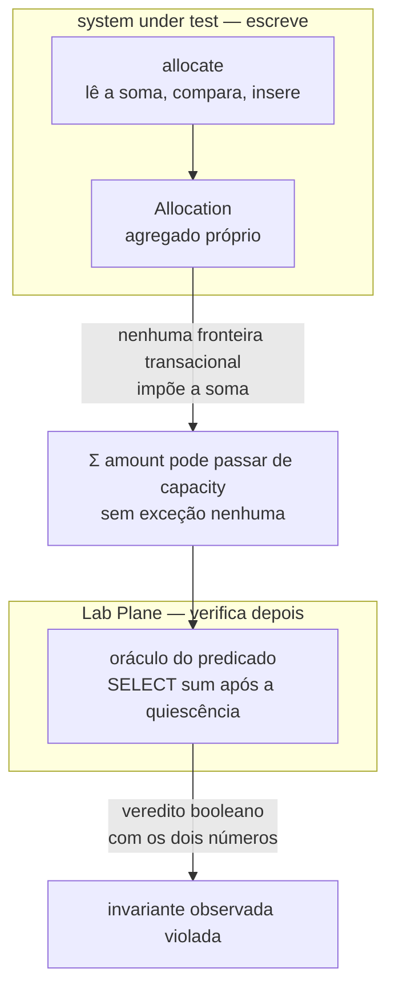
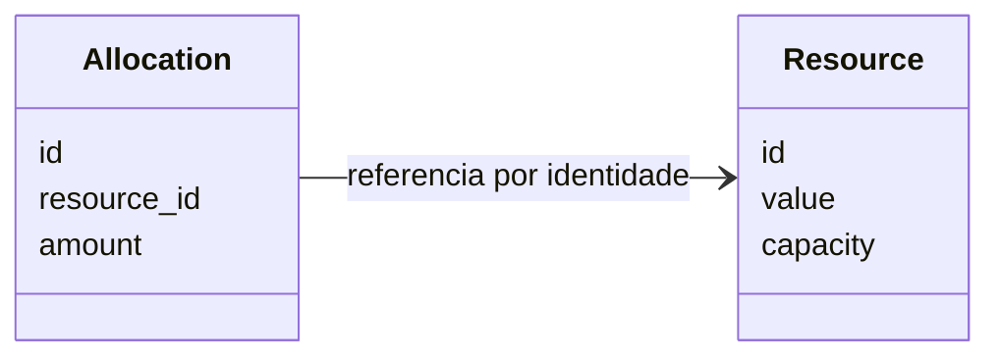
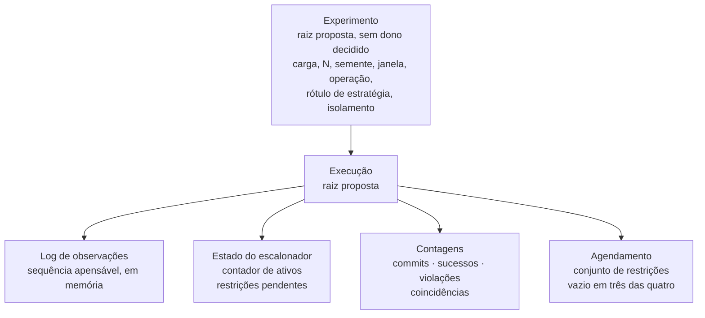
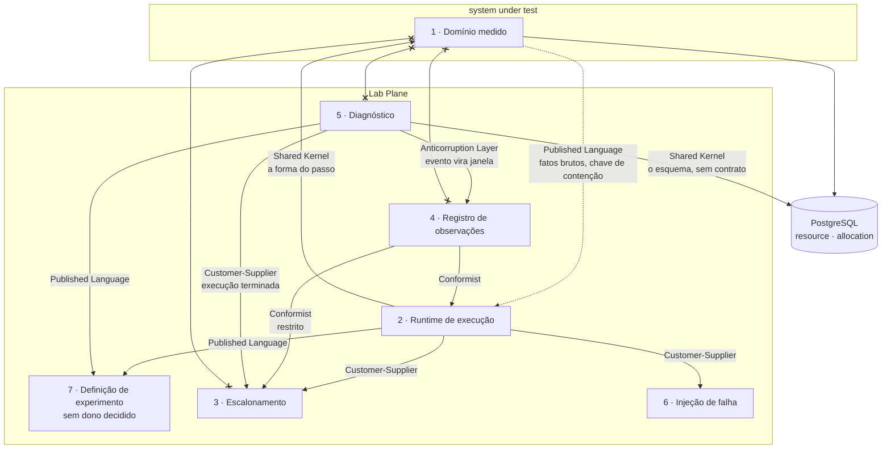
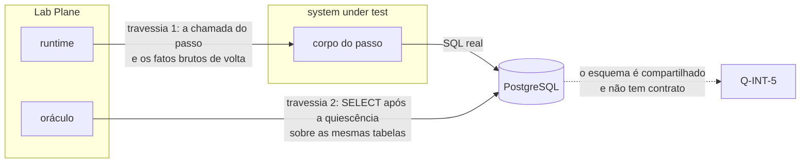

# Modelo de domínio, bounded contexts e context map

- **Estado:** Proposta — requer aprovação humana
- **Data:** 2026-08-03
- **Escopo:** propor os agregados, as fronteiras de contexto e as relações entre elas,
  sem decidir módulo, tabela, fila ou tela.
- **Depende de:** [`ADR-0001`](../adr/0001-o-passo-como-unidade-de-execucao.md),
  [`ADR-0002`](../adr/0002-o-dominio-minimo-e-os-dois-oraculos.md),
  [`ADR-0003`](../adr/0003-a-linguagem-do-agendamento.md),
  [`ADR-0004`](../adr/0004-o-estatuto-da-barreira-e-o-diagnostico-da-nao-ocorrencia.md),
  [`ADR-0005`](../adr/0005-a-forma-do-escalonador.md),
  [`ADR-0006`](../adr/0006-a-forma-da-estrategia-de-concorrencia.md),
  [`ADR-0007`](../adr/0007-o-log-de-observacoes-forma-ordem-e-onde-vive.md) — todos
  `Aceito`. O vocabulário está em [`../CONTEXT.md`](../CONTEXT.md).

## O que este documento decide, e o que ele não toca

Ele propõe agregados, fronteiras de contexto e o padrão de relação entre cada par. Ele
não escolhe módulo de build, esquema físico, exchange, fila nem tela — essas quatro
decisões pertencem a outros documentos, e nenhuma linha aqui as antecipa.

**Um bounded context não é um serviço.** O plano fixa o MVP como uma aplicação, um
banco e nenhum broker (`docs/plano-do-laboratorio.md:531-532`), e exige que a
decomposição seja provocada por um experimento vermelho, nunca agendada
(`docs/plano-do-laboratorio.md:38-41`). Os contextos abaixo são fronteiras de
linguagem. A tabela `## Um contexto poderia virar processo?` diz quais deles têm
gatilho, e nenhum deles o tem hoje.

## A regra que governa este modelo

> Nunca introduza primeiro a solução. Introduza primeiro o problema.

A regra pedagógica do repositório (`docs/plano-do-laboratorio.md:257`) tem uma
consequência direta sobre modelagem, e ela é o eixo desta proposta.

Um agregado, no sentido clássico, é a fronteira transacional que **impõe** uma
invariante. Se `Resource` e `Allocation` formassem um agregado com a invariante
`Σ amount ≤ capacity` imposta na escrita, o write skew do E5 deixaria de ser
reproduzível: a fronteira transacional resolveria o fenômeno antes de ele acontecer. É
o mesmo argumento que derrubou a alternativa D do ADR-0002, em que a verificação vivia
no banco — "o laboratório existe para mostrar a anomalia acontecendo; uma constraint
que a recusa produz um experimento em que nada dá errado"
(`docs/adr/0002-o-dominio-minimo-e-os-dois-oraculos.md:566-569`).

Por isso esta proposta separa duas coisas que costumam ter o mesmo nome:

- **invariante imposta** — verificada na escrita, dentro de uma fronteira
  transacional. O modelo do laboratório tem uma só, e ela é trivial: a identidade de
  cada entidade é única.
- **invariante observada** — verificada depois da quiescência, pelo oráculo do Lab
  Plane, e que o sistema sob teste tem permissão para violar.
  `Σ amount ≤ capacity` é a primeira delas
  (`docs/adr/0002-o-dominio-minimo-e-os-dois-oraculos.md:186-190`).

## Agregados

### O domínio medido

O ADR-0002 fixa duas entidades e cinco atributos, e proíbe qualquer outro no MVP
(`:88-93`). O que esta proposta acrescenta é a fronteira de agregado, que aquele ADR
não nomeia.

| Agregado     | Raiz         | Invariante imposta                        | Fronteira transacional |
|--------------|--------------|-------------------------------------------|------------------------|
| `Resource`   | `Resource`   | identidade única                          | a linha do recurso     |
| `Allocation` | `Allocation` | identidade única; referência a um recurso | a linha da alocação    |

**Proposta:** `Allocation` é agregado próprio, e não membro de `Resource`. A
justificativa é a regra pedagógica acima, e a evidência é o desenho do próprio ADR-0002:
"no instante das duas leituras, a linha que quebra a invariante ainda não existe"
(`:213-214`). Um agregado `Resource` que contivesse as alocações teria uma linha para
travar, e travá-la é a solução — o experimento que a introduz vem depois, e o ADR-0002
já reservou lugar para ele (`:308-312`). A decisão é `D-DOM-07`.

**Proposta:** a invariante `Σ amount ≤ capacity` é invariante observada, e o dono dela é
o contexto de diagnóstico. A decisão é `D-DOM-08`.

Três fatos do ADR-0002 que este modelo não altera:

- `value` é a verdade materializada e `Σ amount` é a verdade derivada, e as duas vivem
  no mesmo recurso (`:98-100`). A separação em dois agregados não separa as duas
  verdades: `capacity` continua na linha do recurso, que é o que torna escrevível o
  experimento futuro de materializar o conflito (`:308-312`).
- O esquema não carrega `version` (`:94-96`).
- `Allocation` não tem estado: uma alocação criada nunca é liberada (`:437-440`).

### As identidades

O ADR-0002 decide que o identificador de `Resource` e de `Allocation` é gerado no
código do sistema sob teste, a partir da semente do experimento, e nunca pelo banco
(`:123-133`). Isso tem uma consequência de modelagem que nenhum documento registra: a
identidade de uma entidade do system under test é **função de um dado do Lab Plane**.

A semente pertence à definição de experimento. O identificador pertence ao domínio
medido. Quem faz a travessia entre os dois não está decidido, e
[`Q-0002-4`](../questions/Q-0002-4.md) mostra o custo: duas execuções da mesma semente
produzem os mesmos identificadores, e a segunda colide com as linhas deixadas pela
primeira. A decisão é `D-DOM-14`.

### As execuções do Lab Plane

| Agregado      | Raiz          | Invariante imposta                                                     | Fronteira transacional |
|---------------|---------------|------------------------------------------------------------------------|------------------------|
| `Execução`    | `Execução`    | o contador de ativos chega a zero uma vez, e o oráculo lê depois disso | memória, por execução  |
| `Experimento` | `Experimento` | não decidida — a forma dele está na fila, posição 8                    | não decidida           |

O estado do escalonador é por execução, atrás de um `ReentrantLock`
(`docs/adr/0005-a-forma-do-escalonador.md:60-61,109-113`). O log de observações é uma
sequência apensável, em memória, uma por execução
(`docs/adr/0007-o-log-de-observacoes-forma-ordem-e-onde-vive.md:85-88`). Os dois têm o
mesmo ciclo de vida da execução, e é isso que sustenta a proposta de `Execução` como
raiz.

**Proposta:** o log de observações é membro do agregado `Execução` enquanto viver em
memória, e vira agregado próprio quando a etapa 6 exigir persistência durável. A
decisão é `D-DOM-10`, e o gatilho já está escrito
(`docs/plano-do-laboratorio.md:610`).

### Objetos de valor

| Objeto de valor          | Do que é feito                                               | Evidência              |
|--------------------------|--------------------------------------------------------------|------------------------|
| endereço de fronteira    | rótulo, entrada\|saída, seletor de tentativa                 | ADR-0001:176-180       |
| papel                    | nome e cardinalidade                                         | ADR-0003:37-38         |
| carga                    | conjunto de papéis                                           | ADR-0003:39,144-147    |
| restrição de precedência | par ordenado de eventos                                      | ADR-0003:123-126       |
| janela de exposição      | par ordenado de fronteiras da mesma operação                 | ADR-0004:24-26,130-135 |
| chave de contenção       | valor opaco, comparado por igualdade de valor                | ADR-0004:192-204       |
| evento do log            | tentativa, worker, endereço, tipo, instante, fatos, restrito | ADR-0007:56-65         |
| traço de SQL             | sequência de statements com valores ligados                  | ADR-0002:28-29,248-264 |
| semente                  | valor declarado pelo experimento                             | ADR-0002:128-130       |

Nenhum deles tem identidade própria, e todos são comparados por valor. O evento do log
é imutável por decisão (`ADR-0007:56-57`), e a chave de contenção usa o mesmo critério
de igualdade que o ADR-0002 fixou para valores ligados (`ADR-0004:202-204`).

## Os bounded contexts

Sete contextos, separados pela linguagem que cada um fala. O critério é linguístico: um
contexto tem fronteira própria quando existe uma palavra que só faz sentido dentro dele,
e cuja entrada no vizinho mudaria o que o vizinho é.

### 1. Domínio medido

**Propósito.** Ser o sistema sob teste. Executar SQL real, numa transação real, num
PostgreSQL real.

**Linguagem própria.** `Resource`, `Allocation`, `value`, `capacity`, `amount`,
`increment`, `allocate`, `estratégia de concorrência`, `passo`, `corpo opaco`.

**O que entra.** A chamada do runtime, uma vez por passo. O rótulo de estratégia, que
seleciona qual implementação roda (`ADR-0006:51-54`).

**O que sai.** Efeitos no PostgreSQL, e os fatos brutos que o passo devolve — entre eles
a chave de contenção (`ADR-0004:192-198`).

**Por que a fronteira cai aqui.** Este contexto não conhece as palavras `experimento`,
`veredito`, `coincidência`, `janela` nem `oráculo`, e não pode conhecê-las: "o runtime
chama a operação; a operação nunca chama o runtime"
(`docs/plano-do-laboratorio.md:573-575`), e o ADR-0001 escreve a mesma regra em forma
normativa (`:94-95`). Um bug do instrumento que atravessasse esta fronteira viraria um
resultado de consistência (`ADR-0002:344-349`).

### 2. Runtime de execução

**Propósito.** Construir a sequência de passos a cada tentativa, executá-los, criar o
escopo de execução e emitir observações.

**Linguagem própria.** `tentativa`, `escopo de execução`, `escopo transacional`,
`fronteira`, `resolução alta` e `resolução baixa`, `execução de operação`, `worker`.

**O que entra.** A definição de operação, entregue como fábrica sem estado mutável
(`ADR-0001:118-124`). A declaração da execução.

**O que sai.** Chamadas ao domínio medido; chegadas e términos ao escalonamento;
observações ao registro; consultas ao injetor de falha.

**Por que a fronteira cai aqui.** O runtime é dono do ciclo de vida da tentativa e do
escopo, e o domínio medido não tem essas palavras. A verificação de posse do escopo
existe porque a fronteira é fina o bastante para ser atravessada por engano
(`ADR-0001:131-134`).

### 3. Escalonamento

**Propósito.** Decidir, em cada fronteira, se o worker prossegue ou espera, e declarar
quando a execução terminou.

**Linguagem própria.** `evento`, `chegada`, `travessia`, `papel`, `carga`, `restrição
de precedência`, `encontro`, `término`, `desistência`, `agendamento não cumprido`.

**O que entra.** O agendamento declarado pela execução; as chegadas e os términos que o
runtime relata (`ADR-0005:63-65`).

**O que sai.** A decisão espere/siga com a marca `restrito`
(`ADR-0007:63-65,72-74`); o sinal "execução terminada" (`ADR-0005:77-83`).

**Por que a fronteira cai aqui.** Nenhuma palavra deste contexto fala de SQL, de
`value` ou de violação. O escalonador ordena instantes e não inspeciona dados — e o
ADR-0003 registra que uma linguagem que passasse a inspecioná-los seria outra decisão
(`:629-633`).

**Nota de escopo.** A declaração da linguagem (ADR-0003) e a execução dela (ADR-0005)
ficam no mesmo contexto porque partilham o vocabulário inteiro, sem tradução. Separá-las
criaria dois contextos com a mesma linguagem.

### 4. Registro de observações

**Propósito.** Guardar a sequência de eventos de uma execução e projetar a timeline.

**Linguagem própria.** `observação`, `tipo de evento`, `instante de parede`, `fatos
brutos`, `restrito`, `subsequência restrita`, `timeline`.

**O que entra.** Eventos emitidos pelo runtime no instante em que ocorrem
(`ADR-0001:245-251`), com o `restrito` lido do escalonador.

**O que sai.** A timeline; a subsequência de eventos restritos que serve ao critério de
igualdade entre execuções de controle (`ADR-0007:90-95`).

**Por que a fronteira cai aqui.** Este contexto registra sem interpretar. Os fatos
brutos são payload opaco (`ADR-0007:60-61`), e a ordem entre workers só é garantida para
os pares restritos (`ADR-0007:78-83`). No instante em que ele aprendesse a palavra
`coincidência`, passaria a interpretar o que registra.

### 5. Diagnóstico

**Propósito.** Produzir e classificar o veredito de uma execução.

**Linguagem própria.** `oráculo`, `commits`, `sucessos`, `violações`, `taxa de
violação`, `taxa de aborto`, `limite superior a 95%`, `janela de exposição`,
`coincidência`, `exposição oferecida`, `exposição sobrevivente`, `calibração`,
`protegido`, `inválido`, `janela mal declarada`, `exposição insuficiente`.

**O que entra.** O estado final do banco, lido depois da quiescência
(`ADR-0002:214-217`). O log de observações, do qual as coincidências são derivadas
(`ADR-0004:159-161`). O sinal de execução terminada (`ADR-0005:77-83`).

**O que sai.** O relatório com as três contagens, as duas taxas e o veredito
classificado.

**Por que a fronteira cai aqui.** É o único contexto que tem permissão de comparar o
banco com uma expectativa. E é o único que traduz eventos em janelas: o registro não
tem essas palavras, e a tradução é uma camada anticorrupção que este contexto possui.

### 6. Injeção de falha

**Propósito.** Decidir se uma falha declarada dispara naquela fronteira.

**Linguagem própria.** `ponto nomeado`, `falha declarada`, `seletor de tentativa`.

**O que entra.** A consulta do runtime, sempre depois do escalonador
(`ADR-0001:196-199`).

**O que sai.** Nenhuma falha, ou a falha a lançar.

**Por que a fronteira cai aqui, com ressalva.** A linguagem própria dele tem três
palavras, e o formato interno da injeção está adiado até a etapa 6
(`docs/plano-do-laboratorio.md:609`). Um contexto com três palavras e uma decisão
adiada pode ser parte do runtime, e a escolha é `D-DOM-12`.

### 7. Definição de experimento — sem dono decidido

**Propósito.** Declarar o que uma execução roda antes de rodar.

**Linguagem própria.** `experimento`, `hipótese`, `semente`, `N`, `asserção`, `nível de
isolamento`, `estado inicial`.

**O que entra.** Nada, hoje: a fonte de verdade entre arquivo versionado e Experiment
Designer na UI é tensão aberta (`docs/plano-do-laboratorio.md:693-698`).

**O que sai.** A carga, o `N`, a semente, a janela de exposição, o rótulo de estratégia
e o nível de isolamento, para todos os outros contextos.

**Por que a fronteira cai aqui.** Ele é upstream de todos os demais, e três questões
pendentes moram nele: [`Q-0002-4`](../questions/Q-0002-4.md),
[`Q-0003-8`](../questions/Q-0003-8.md) e [`Q-0001-1`](../questions/Q-0001-1.md). A
decisão está na fila, posição 8 (`docs/adr/README.md:204`).

## Context map

A seta aponta de quem depende para quem é dependido: a ponta de origem é o contexto
downstream, e o rótulo nomeia o padrão que ele adota. A aresta pontilhada é fluxo de
dado, não dependência.

As três arestas cruzadas na base são **Separate Ways**, e a ausência é o desenho: o
domínio medido não integra com escalonamento, registro nem diagnóstico, por decisão
(`docs/plano-do-laboratorio.md:573-575`). O plano chama isso de "a seta que não
existe", e ela é o que mantém a regra 6 verde com injeção de falha dentro do processo.

| Par                              | Padrão               | Por que este padrão                                                                                                       |
|----------------------------------|----------------------|---------------------------------------------------------------------------------------------------------------------------|
| Runtime → Domínio medido         | Shared Kernel        | os dois precisam concordar sobre o que é um passo, um rótulo e um tipo; o ADR-0001 define isso para os dois lados         |
| Domínio medido ⇢ Runtime         | Published Language   | os fatos brutos são um vocabulário publicado e opaco; o runtime os registra sem interpretar (`ADR-0001:249-251`)          |
| Runtime → Escalonamento          | Customer-Supplier    | o runtime é o cliente que exige decisão em toda fronteira, e o protocolo de dois eventos existe por essa exigência        |
| Runtime → Injeção de falha       | Customer-Supplier    | mesma relação, com a ordem fixada: escalonador primeiro, injetor depois (`ADR-0001:196-199`)                              |
| Registro → Runtime               | Conformist           | o registro adota `tentativa`, `worker` e `endereço de fronteira` sem tradução nenhuma (`ADR-0007:58-59`)                  |
| Registro → Escalonamento         | Conformist           | `restrito` vem do escalonador e não ganha significado no registro (`ADR-0007:63-65`)                                      |
| Diagnóstico → Registro           | Anticorruption Layer | janela e coincidência não existem no registro; a tradução vive no diagnóstico, e o registro não pode aprendê-las          |
| Diagnóstico → Escalonamento      | Customer-Supplier    | o oráculo espera o sinal de execução terminada, que o escalonador declara (`ADR-0005:77-83`)                              |
| Runtime, Diagnóstico → Definição | Published Language   | a definição publica carga, `N`, semente, janela, rótulo de estratégia e isolamento; a forma dela não está decidida        |
| Diagnóstico, Domínio ↔ esquema   | Shared Kernel        | os dois leem as mesmas tabelas, e nenhum contrato as formaliza — `Q-INT-5` em `docs/architecture/integrations.md:104-108` |
| Domínio medido ↮ os três         | Separate Ways        | a integração é proibida, e a proibição é o que separa instrumento de sistema medido                                       |

### A direção das dependências não se inverte

Uma única regra sustenta o mapa inteiro: **nenhum contexto do Lab Plane é citado por
nome dentro do domínio medido.** Ela é normativa desde o ADR-0001 (`:94-95`), e o plano
a marca como a exigência que a arquitetura mínima precisa impor por regra executável,
porque os dois planos dividem a mesma JVM (`docs/plano-do-laboratorio.md:534-536`).

Invertê-la teria um efeito nomeado e não hipotético: o sistema sob teste passaria a
saber que está sendo medido, que é o argumento com que o ADR-0001 descartou a
alternativa B (`:576-580`).

### Onde a fronteira system under test / Lab Plane cai

Ela cai em dois lugares, e só um deles é limpo.

A primeira travessia é a chamada do passo, e ela é assimétrica por decisão: o runtime
chama, o passo devolve fatos opacos, e nada volta na outra direção.

A segunda travessia é o esquema. O oráculo lê `resource` e `allocation` — as mesmas
tabelas que as operações escrevem (`ADR-0002:186-190`). Isso é um Shared Kernel entre
os dois planos, e a matriz de integrações registra que ele não tem forma verificável
(`docs/architecture/integrations.md:104-108`). É a fronteira mais frágil do desenho, e
a decisão é `D-DOM-13`.

## Um contexto poderia virar processo?

| Contexto                 | Poderia virar processo?    | Em qual etapa | Gatilho                                                                                             |
|--------------------------|----------------------------|---------------|-----------------------------------------------------------------------------------------------------|
| Domínio medido           | sim                        | 4             | o experimento `JVM_LOCK` ficar vermelho com duas instâncias (`plano:362-364,607`)                   |
| Domínio medido           | sim, obrigatório           | 11            | o grupo E exige mais de um processo por construção (`plano:241-243`)                                |
| Escalonamento            | pergunta em aberto         | 4             | dois processos deixam o `ReentrantLock` por execução sem alcance (`ADR-0005:109-113`)               |
| Registro de observações  | não, mas muda de substrato | 6             | um experimento que derrube o processo (`plano:610`)                                                 |
| Runtime de execução      | nenhum gatilho previsto    | —             | ele acompanha o domínio medido, e não tem gatilho próprio                                           |
| Diagnóstico              | nenhum gatilho previsto    | —             | ele lê o banco depois da quiescência, e a leitura não exige processo próprio                        |
| Injeção de falha         | não                        | 5 e 6         | a injeção fica na fronteira do passo, em processo; Toxiproxy não tem gatilho aqui (`plano:816-820`) |
| Definição de experimento | nenhum gatilho previsto    | —             | a tensão 1 do plano é sobre fonte de verdade, não sobre processo (`plano:693-698`)                  |
| Canal de mensagens       | sim, por construção        | 5             | o primeiro experimento assíncrono (`plano:608`)                                                     |

Nenhuma linha desta tabela é um plano de decomposição. Cada uma nomeia o experimento
cujo resultado vermelho torna a separação obrigatória, e a etapa 4 não tem data
(`plano:362-364`).

## Os 42 fenômenos e os contextos que cada grupo exige

| Grupo               | Cenários                            | Contextos que já existem                   | Contexto novo que o grupo exige                            | Etapa |
|---------------------|-------------------------------------|--------------------------------------------|------------------------------------------------------------|-------|
| A — Intercalação    | 25, 1 a 7                           | os sete deste documento                    | nenhum                                                     | 1 a 3 |
| B — Entrega         | 8 a 12, 15, 18, 19, 22, 32          | os sete, mais um domínio medido em 2 lados | **canal de mensagens** — mensagem, entrega, ack, ordem     | 5     |
| C — Escrita parcial | 13, 14, 26 a 31, 12                 | os sete, mais o canal                      | **segunda representação do estado**, e amostragem no tempo | 6 a 9 |
| D — Saturação       | 16, 17, 20, 21, 23, 24, 33, 38 a 40 | os sete                                    | nenhum contexto novo; o diagnóstico ganha o formato curva  | 10    |
| E — Posse no tempo  | 34 a 36, fencing                    | os sete, com mais de um processo           | **posse** — dono, lease, expiração, fencing token          | 11    |

Três observações que a tabela não cabe.

**O grupo D não acrescenta contexto, e é o que mais muda o modelo.** Ele quebra o
formato de veredito: não existe estado errado, e sim uma fila crescendo com um limiar
que alguém precisa declarar (`plano:221-229`). O plano exige que os dois formatos
existam desde o desenho, e a decisão está na fila, posição 9. A decisão é `D-DOM-16`.

**O grupo C exige um mecanismo que nenhum contexto tem.** A amostragem no tempo é a
lacuna mais antiga do repositório, e nenhum mecanismo foi proposto
(`plano:706-709`). Ela alcança o registro e o diagnóstico ao mesmo tempo:
[`Q-0002-3`](../questions/Q-0002-3.md) registra que os dois oráculos descrevem apenas o
estado final quiescente.

**O grupo E é o único cuja separação de processos não é opcional** (`plano:241-243`).
Ele é também o que quebra a janela de exposição como par de fronteiras, e o ADR-0004
registra o sinal (`:591-594`).

## Conceitos sem dono

Cada linha nomeia um conceito que este modelo precisa e que nenhum ADR aceito define.
Nenhum deles foi inventado aqui.

| Conceito                               | Por que falta                                                              | Questão                                | Destino na fila                |
|----------------------------------------|----------------------------------------------------------------------------|----------------------------------------|--------------------------------|
| `Experimento` como agregado            | a forma dele não está decidida; três questões mudam o escopo antes         | Q-0002-4, Q-0003-8, Q-0001-1           | Experiment, posição 8          |
| estado inicial e reset entre execuções | ninguém escreve `value_inicial`, e a identidade da semente colide          | [`Q-0002-4`](../questions/Q-0002-4.md) | Experiment                     |
| o que `N` conta                        | tentativa do ADR-0001 inclui retry, que é resultado e não entrada          | [`Q-0003-8`](../questions/Q-0003-8.md) | Experiment                     |
| identidade de versão de uma operação   | o corpo do passo muda com o rótulo intacto, e o replay mede outra operação | [`Q-0001-1`](../questions/Q-0001-1.md) | Experiment                     |
| formato curva do veredito              | o E4 não tem card, porque a forma do resultado não foi decidida            | Q-0002-3, Q-0004-5, Q-0004-8           | dois formatos, posição 9       |
| amostragem no tempo                    | uma violação transitória não sobrevive até o estado final                  | [`Q-0002-3`](../questions/Q-0002-3.md) | dois formatos, posição 9       |
| nível de isolamento como eixo          | o E5 varre três níveis, e nenhuma linha da fila nomeia esse parâmetro      | `docs/adr/README.md:260-291`           | não decidido                   |
| obrigação de reportar a chave          | um passo que não reporte a chave produz contagem errada sem falhar         | [`Q-0004-2`](../questions/Q-0004-2.md) | arquitetura mínima, posição 10 |
| relógio do log                         | comparar janelas entre workers exige um instante ordenável entre eles      | [`Q-0004-3`](../questions/Q-0004-3.md) | log de observações             |
| guardas executáveis das três regras    | relógio injetável, semente e identidade são texto, não regra verificável   | [`Q-0002-1`](../questions/Q-0002-1.md) | arquitetura mínima, posição 10 |

## Conceitos adiados pela regra pedagógica

Cada conceito abaixo é a **solução** de um fenômeno que o laboratório ainda não
mostrou. Nenhum deles entra no modelo antes que o experimento que o motiva fique
vermelho. A coluna do gatilho não é uma data.

| Conceito adiado                   | Fenômeno que precisa ficar vermelho antes             | Etapa | Evidência                        |
|-----------------------------------|-------------------------------------------------------|-------|----------------------------------|
| coluna `version`                  | a atualização perdida do E1, medida                   | 2     | ADR-0002:392-402; ADR-0006:56-60 |
| lock de linha na verdade derivada | o write skew do E5, com a soma passando da capacidade | 3     | ADR-0002:308-312                 |
| estado em `Allocation`            | uma liberação concorrendo com uma alocação            | —     | ADR-0002:437-440                 |
| Outbox                            | o dual write do produtor, na etapa 6                  | 6     | plano:318-320,346                |
| Inbox, idempotency key            | a duplicata de entrega, na etapa 5                    | 7     | plano:347                        |
| DLQ e política de retry           | a poison message, na etapa 8                          | 8     | plano:348                        |
| projeção e read model             | a leitura defasada, na etapa 9                        | 9     | plano:349                        |
| lease e fencing token             | a posse expirada com dois donos, na etapa 11          | 11    | plano:351                        |
| lock distribuído externo          | um experimento provar que advisory lock não basta     | 11    | plano:613                        |

O caso de `version` merece nota, porque é o único já decidido nos dois sentidos. O
ADR-0002 o mantém fora do esquema (`:94-96`) e o ADR-0006 declara que `OPTIMISTIC` o
exige, com a migração nascendo no mesmo commit que introduz a estratégia
(`:56-60`). O modelo de hoje não tem a coluna, e isso não é omissão.

## Decisões que exigem aprovação humana

| ID       | Decisão                                                 | Alternativas                                                              | Recomendação                                                 | Por que só uma pessoa decide                                                 |
|----------|---------------------------------------------------------|---------------------------------------------------------------------------|--------------------------------------------------------------|------------------------------------------------------------------------------|
| D-DOM-07 | `Allocation` é agregado próprio ou membro de `Resource` | agregado próprio; membro do agregado `Resource`; entidades independentes  | agregado próprio                                             | membro tornaria o E5 irreproduzível, e o E5 é o resultado mais valioso       |
| D-DOM-08 | Onde vive a invariante `Σ amount ≤ capacity`            | oráculo do Lab Plane; agregado do system under test; banco                    | oráculo, como invariante observada                           | é a diferença entre observar e impedir a anomalia                            |
| D-DOM-09 | Se `Experimento` é raiz dona das quatro execuções       | raiz dona; `Execução` independente com referência; adiar                  | adiar, e citar a fila, posição 8                             | três questões pendentes mudam o escopo antes da decisão                      |
| D-DOM-10 | Se o log é membro de `Execução` ou agregado próprio     | membro enquanto em memória; agregado próprio desde já; decidir na etapa 6 | membro agora, agregado próprio quando persistir              | antecipar a persistência contraria um adiamento já registrado                |
| D-DOM-11 | Se o escalonamento é contexto próprio                   | contexto próprio; parte do runtime; dividir declaração e execução         | contexto próprio, com declaração e execução juntas           | a linguagem dele não é a do runtime, e a decomposição não pode ser agendada  |
| D-DOM-12 | Se a injeção de falha é contexto próprio                | contexto próprio; parte do runtime; decidir na etapa 6                    | parte do runtime até a etapa 6                               | o formato interno está adiado, e um contexto sem linguagem é fronteira vazia |
| D-DOM-13 | O esquema compartilhado entre operações e oráculo       | Shared Kernel com contrato; Shared Kernel sem contrato; leitura própria   | Shared Kernel com contrato verificável                       | é a fronteira mais frágil entre os dois planos, e `Q-INT-5` está aberta      |
| D-DOM-14 | Quem é dono da identidade derivada da semente           | definição de experimento; domínio medido; um serviço de identidade        | definição de experimento publica a semente; o domínio deriva | a identidade do system under test passa a depender de um dado do Lab Plane       |
| D-DOM-15 | Quais fronteiras de contexto a stack materializa        | todas; só a de system under test / Lab Plane; nenhuma                         | só a de system under test / Lab Plane, imposta por teste         | materializar todas antecipa a decomposição que o plano proíbe agendar        |
| D-DOM-16 | Se o modelo já reserva lugar para o veredito curva      | reservar agora; esperar a decisão da fila; reservar só o formato de saída | reservar só o formato de saída                               | o plano exige antecipação e a fila proíbe decidir agora — a tensão é real    |

### D-DOM-07 — `Allocation` é agregado próprio ou membro de `Resource`

**O problema.** As duas entidades têm uma invariante que as liga: `Σ amount ≤
capacity`. Na modelagem clássica, isso faz de `Resource` a raiz e de `Allocation` um
membro, com a fronteira transacional cobrindo os dois.

**Alternativa A — `Allocation` como membro de `Resource`.** A favor: é a leitura
canônica de agregado, a invariante fica declarada onde é verificada, e um leitor com
formação em DDD reconhece o desenho sem explicação. Contra: a fronteira transacional
impõe a invariante, e impor a invariante torna o write skew irreproduzível. O E5 existe
para mostrar que a soma passa da capacidade sem nenhuma exceção lançada
(`plano:462-466`); com o agregado clássico, a exceção passa a existir.

**Alternativa B — `Allocation` como agregado próprio.** A favor: as duas escritas
permanecem independentes, e a anomalia acontece. Contra: o modelo deixa de comunicar
que existe uma invariante ligando as duas, e um leitor precisa do oráculo para
descobri-la.

**Alternativa C — duas entidades sem relação declarada.** A favor: nenhuma
expectativa de invariante. Contra: contraria o ADR-0002, que decidiu que as duas
verdades vivem no mesmo recurso e que separá-las quebraria o experimento futuro de
materializar o conflito (`:308-312,518-527`).

**Recomendação.** Alternativa B, com a invariante declarada no contexto de diagnóstico
(`D-DOM-08`) para que ela não desapareça do modelo.

**Se a escolha for outra.** Com a alternativa A, o E5 sai do MVP, e com ele sai a
capacidade que `deteccao-de-protecao-inerte` especifica. Com a alternativa C, o
experimento de materializar o conflito exige criar a ligação depois — que é exatamente
o custo pelo qual o ADR-0002 descartou a alternativa A dele.

### D-DOM-08 — Onde vive a invariante `Σ amount ≤ capacity`

**O problema.** A invariante precisa existir em algum lugar do modelo. Se ela vive no
agregado, é imposta. Se vive no oráculo, é observada. As duas são modelagens legítimas,
e produzem laboratórios diferentes.

**Alternativa A — no oráculo do Lab Plane.** A favor: é o que o ADR-0002 decidiu
(`:186-190`), e é o que permite ao experimento mostrar a violação acontecendo. Contra:
o system under test fica sem nenhuma regra de negócio, e o modelo do sistema sob teste
passa a ser puramente estrutural.

**Alternativa B — no agregado do system under test.** A favor: o sistema medido passa a
parecer o código que um engenheiro escreveria, que é a força de fidelidade do ADR-0001.
Contra: a imposição resolve o fenômeno, e o experimento perde o objeto.

**Alternativa C — no banco, por constraint ou trigger.** A favor: a violação apareceria
no instante em que ocorresse, e não apenas no fim. Contra: o ADR-0002 já a descartou,
com um argumento que vale duas vezes — a trigger roda sob o mesmo isolamento e sofre o
mesmo write skew, deixando passar o caso que deveria pegar (`:566-574`).

**Recomendação.** Alternativa A, com o termo `invariante observada` no glossário para
que a diferença fique nomeada.

**Se a escolha for outra.** A alternativa C contraria um ADR aceito, e exigiria um ADR
que o substitua.

### D-DOM-09 — Se `Experimento` é raiz dona das quatro execuções

**O problema.** O ADR-0003 diz que o experimento declara uma carga e que três execuções
rodam sobre ela, enquanto o controle positivo declara carga própria (`:154-168`). Isso
descreve uma composição, e não decide se `Experimento` é raiz de agregado.

**Alternativa A — `Experimento` é raiz, e as execuções são membros.** A favor: a regra
de que controle negativo e execução medida partilham a mesma carga vira propriedade da
estrutura, e o ADR-0003 usa esse argumento (`:363-367`). Contra: antecipa a decisão da
posição 8 da fila, cujo escopo três questões pendentes ainda mudam.

**Alternativa B — `Execução` é raiz independente, com referência ao experimento.** A
favor: cada execução tem ciclo de vida próprio, e o estado do escalonador e o log já são
por execução. Contra: a igualdade de carga volta a depender de alguém conferir dois
números, que é o defeito que o ADR-0003 removeu.

**Alternativa C — adiar, e citar a fila.** A favor: nenhuma decisão nasce antes do ADR
que a fixa. Contra: o modelo fica com um buraco no lugar de onde tudo é declarado.

**Recomendação.** Alternativa C, com a alternativa A registrada como candidata.

**Se a escolha for outra.** Com a alternativa A, [`Q-0002-4`](../questions/Q-0002-4.md)
e [`Q-0003-8`](../questions/Q-0003-8.md) passam a ser respondidas por um documento que
não é ADR.

### D-DOM-10 — Se o log é membro de `Execução` ou agregado próprio

**O problema.** Hoje o log vive em memória, uma sequência por execução
(`ADR-0007:85-88`). Na etapa 6 um experimento derruba o processo de propósito, e o log
em memória deixa de ser aceitável (`plano:590-592`).

**Alternativa A — membro de `Execução` enquanto viver em memória.** A favor: o ciclo de
vida é o mesmo, e nada é antecipado. Contra: a etapa 6 força uma mudança de fronteira de
agregado, e mudanças de fronteira custam caro.

**Alternativa B — agregado próprio desde já.** A favor: a fronteira não muda depois, e
a persistência entra sem reescrever o modelo. Contra: antecipa uma decisão que o plano
adiou com gatilho nomeado, e um agregado com identidade própria hoje não tem quem o
referencie.

**Alternativa C — decidir na etapa 6.** A favor: é o gatilho já escrito. Contra: o
modelo de hoje precisa dizer alguma coisa sobre o log, e o silêncio é uma resposta pior
que uma proposta reversível.

**Recomendação.** Alternativa A, com a mudança de fronteira registrada como custo
conhecido da etapa 6.

**Se a escolha for outra.** Com a alternativa B, a decisão de persistência entra pela
porta dos fundos, sem o experimento que a motiva.

### D-DOM-11 — Se o escalonamento é contexto próprio

**O problema.** O escalonador é consultado em toda fronteira, e o runtime é quem o
consulta. Os dois poderiam ser um contexto só.

**Alternativa A — contexto próprio.** A favor: a linguagem dele — papel, carga,
restrição, encontro, desistência — não aparece em nenhum outro lugar, e o ADR-0005 lhe
dá estado próprio por execução. Contra: no MVP os dois vivem na mesma JVM, e a
fronteira é conceitual.

**Alternativa B — parte do runtime.** A favor: um componente a menos, e a consulta em
toda fronteira é um caminho quente que o grupo D mede. Contra: o runtime passaria a
falar duas linguagens, e a proibição de o Lab Plane ramificar por estratégia depende de
fronteiras nítidas dentro do próprio Lab Plane.

**Alternativa C — dividir declaração e execução do agendamento.** A favor: o ADR-0003
declara e o ADR-0005 executa. Contra: os dois partilham o vocabulário inteiro sem
tradução, e dois contextos com a mesma linguagem não são dois contextos.

**Recomendação.** Alternativa A, com declaração e execução juntas.

**Se a escolha for outra.** Com a alternativa B, a pergunta de processo da etapa 4
passa a alcançar o runtime junto, e não só o escalonador.

### D-DOM-12 — Se a injeção de falha é contexto próprio

**O problema.** O ADR-0001 nomeia o injetor de falha como componente do Lab Plane
consultado em cada fronteira (`:37-38`). O formato interno dele está adiado até a etapa
6 (`plano:609`).

**Alternativa A — contexto próprio desde já.** A favor: os doze pontos nomeados já
existem, e a etapa 6 é o eixo inteiro do grupo C. Contra: a linguagem própria dele tem
três palavras, e um contexto sem linguagem é uma fronteira vazia — o repositório já
pagou por esse erro com o `services/` de pastas com nome de dono.

**Alternativa B — parte do runtime até a etapa 6.** A favor: nenhuma fronteira nasce
antes do vocabulário que a justifica. Contra: quando a etapa 6 chegar, extrair o
contexto custa mais que tê-lo desde o início.

**Alternativa C — decidir junto do formato interno.** A favor: o gatilho já está
escrito. Contra: o modelo de hoje precisa dizer onde a consulta em cada fronteira mora.

**Recomendação.** Alternativa B, com a extração prevista para a etapa 6.

**Se a escolha for outra.** Com a alternativa A, o context map ganha uma caixa cuja
linguagem própria não sustenta a fronteira.

### D-DOM-13 — O esquema compartilhado entre operações e oráculo

**O problema.** As operações escrevem em `resource` e `allocation`, e o oráculo lê as
mesmas tabelas. É um Shared Kernel entre system under test e Lab Plane, e
`Q-INT-5` registra que ele não tem forma verificável
(`docs/architecture/integrations.md:104-108`).

**Alternativa A — Shared Kernel com contrato verificável.** A favor: a fronteira mais
frágil do desenho ganha guarda, e uma mudança de esquema deixa de quebrar o oráculo em
silêncio. Contra: exige decidir a forma do contrato, e nenhum contrato existe no
repositório hoje.

**Alternativa B — Shared Kernel sem contrato, como está.** A favor: nada a decidir
agora, e o MVP tem duas tabelas e cinco atributos. Contra: uma coluna renomeada quebra o
oráculo, e o sintoma aparece como resultado de consistência.

**Alternativa C — o oráculo lê por um caminho próprio, com camada anticorrupção.** A
favor: os dois lados deixam de partilhar modelo. Contra: o caminho próprio precisaria
ler as mesmas linhas, e a tradução não remove o acoplamento — ela o esconde.

**Recomendação.** Alternativa A. A forma do contrato pertence a quem decide o esquema.

**Se a escolha for outra.** Com a alternativa B, `Q-INT-5` continua aberta, e a
travessia mais frágil do desenho fica sem guarda.

### D-DOM-14 — Quem é dono da identidade derivada da semente

**O problema.** O ADR-0002 exige que o identificador seja função da semente do
experimento e nunca do instante da execução (`:128-130`). A semente é dado da definição
de experimento; o identificador é dado do domínio medido.

**Alternativa A — a definição publica a semente, e o domínio deriva o identificador.**
A favor: o domínio medido continua sem citar nenhum contexto do Lab Plane por nome, e a
semente entra como valor. Contra: a regra de derivação vive no system under test, e uma
mudança nela altera identificadores de execuções antigas.

**Alternativa B — a definição publica os identificadores prontos.** A favor: a regra de
derivação fica num lugar só, no Lab Plane. Contra: o Lab Plane passa a decidir a
identidade do sistema sob teste, e a fronteira entre observar e construir fica menos
nítida.

**Alternativa C — um gerador de identidade próprio, com contrato.** A favor: a regra
fica isolada e testável. Contra: acrescenta um contexto para uma regra de uma linha.

**Recomendação.** Alternativa A.

**Se a escolha for outra.** Qualquer das três continua sem responder
[`Q-0002-4`](../questions/Q-0002-4.md): duas execuções da mesma semente colidem, e
quem limpa o banco entre elas não está decidido.

### D-DOM-15 — Quais fronteiras de contexto a stack materializa

**O problema.** A stack escolhida pelo usuário — Java, Spring Boot, PostgreSQL, e
adiante RabbitMQ e um frontend — materializa fronteiras com facilidade. O plano proíbe
agendar decomposição (`:38-41`), e o MVP é uma aplicação só (`:531-532`).

**Alternativa A — materializar todas as sete fronteiras como seams impostos.** A favor:
a linguagem de cada contexto fica protegida por construção. Contra: sete fronteiras
impostas numa aplicação de duas tabelas antecipam a decomposição que o plano proíbe
agendar, e cinco delas não têm dois adaptadores — um adaptador é um seam hipotético.

**Alternativa B — materializar só a fronteira system under test / Lab Plane, imposta por
teste.** A favor: é a única fronteira que o plano exige impor por regra executável,
porque os dois planos dividem a mesma JVM (`:534-536`). As outras seis continuam
conceituais e sobrevivem à mudança. Contra: uma fronteira conceitual é atravessada sem
que nada falhe.

**Alternativa C — não materializar nenhuma.** A favor: nada a manter. Contra: a
separação instrumento/sistema medido deixa de ter guarda, e é justamente a separação
cujo colapso produz um falso resultado de consistência.

**Recomendação.** Alternativa B. O mecanismo da imposição pertence à decisão de
arquitetura mínima, e não a este documento.

**Se a escolha for outra.** Com a alternativa A, a decisão de arquitetura mínima nasce
já respondida por um documento que não é ADR.

### D-DOM-16 — Se o modelo já reserva lugar para o veredito curva

**O problema.** O plano afirma que os dois tipos de veredito precisam existir desde o
desenho, e que descobrir isso no Nível 4 seria caro (`:226-229`). A fila põe a decisão
dos formatos na posição 9, e três questões mudam o escopo dela antes.

**Alternativa A — reservar o lugar agora, com forma proposta.** A favor: o E4 está no
MVP, e o plano pede antecipação. Contra: `features/README.md:35-51` registra que um card
escrito agora seria majoritariamente pergunta em aberto, e a mesma razão vale para o
modelo.

**Alternativa B — esperar a decisão da fila.** A favor: nenhuma forma nasce antes do
ADR. Contra: contraria a exigência explícita do plano de que os formatos existam desde
o desenho.

**Alternativa C — reservar só o formato de saída, sem forma interna.** A favor: o
diagnóstico passa a declarar qual formato produz, e a curva entra como um valor a mais
desse eixo, sem que ninguém decida como uma curva é comparada ou reprovada. Contra: um
eixo declarado sem valores é uma promessa, e promessas não são verificáveis.

**Recomendação.** Alternativa C.

**Se a escolha for outra.** Com a alternativa A, a decisão da posição 9 encontra o
modelo já comprometido com uma forma que ela deveria escolher.

## Perguntas em aberto

**P1 — A etapa 4 quebra o mecanismo do escalonador, e nenhum documento registra isso.**
O ADR-0005 põe o contador de ativos e as restrições pendentes atrás de um
`ReentrantLock` por execução (`:109-113`). Um `ReentrantLock` exclui threads da mesma
JVM. A etapa 4 põe workers em dois processos (`plano:344`), e o encontro do ADR-0003 é
declarado sobre papéis de uma execução, sem dizer onde o escalonador vive quando há dois
processos. Não foi possível confirmar que alguém já tenha considerado o caso.

**P2 — Não está escrito se um documento de modelo pode contradizer um ADR aceito.** A
mesma lacuna que o repositório registra para o Feature Card alcança este arquivo, e ela
está aberta em `docs/specification-process.md`.

**P3 — Nenhum documento diz quem aprova um agregado ou uma fronteira de contexto.**
Regra de negócio e definição de domínio são aprovadas por pessoa, e o processo não
nomeia essa pessoa.

**P4 — O `Experimento` aparece em `plano:544` como caixa do Lab Plane e na fila como
decisão não tomada.** As duas coisas convivem, e não foi possível confirmar se a caixa
do diagrama descreve uma intenção ou apenas o lugar onde a decisão vai cair.

**P5 — `worker` não tem definição normativa.** Este modelo o trata como executor com
conexão própria, a partir de `plano:579-582`. Nenhum ADR o define, e a etapa 4 pergunta
exatamente o que ele é (`plano:344`).

**P6 — A chave de contenção é um conceito do diagnóstico que só o domínio medido pode
produzir.** Ela atravessa a fronteira entre os planos como fato bruto
(`ADR-0004:192-198`), e [`Q-0004-2`](../questions/Q-0004-2.md) registra que nada obriga
um passo a reportá-la. É a única dependência do diagnóstico sobre o system under test, e
ela não tem guarda.

**P7 — O grupo B introduz um domínio medido em dois lados de um canal.** Produtor e
consumidor passam a ser dois pontos de escrita sobre o mesmo estado lógico, e nenhum
documento diz se isso é um contexto ou dois. A pergunta aparece na etapa 5, e não foi
respondida aqui.
