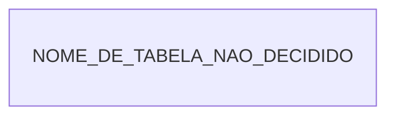

# O schema do instrumento, `lab_plane`

Um dos dois arquivos de [`schemas/`](README.md). A fronteira entre este schema e o do
sistema medido é do
[`README.md`](README.md#a-ausência-de-linha-entre-os-dois-diagramas-é-a-decisão) da pasta,
e o porquê de a forma viver aqui, e não dentro do ADR-0015, também
([`README.md`](README.md#por-que-a-forma-vive-aqui-e-não-dentro-do-adr-0015)).

### O que o diagrama do `lab_plane` não desenha

**Deste lado quase nada tem forma.** `NOME_DE_TABELA_NAO_DECIDIDO` é um token de
placeholder: não é nome de tabela, e nada deste repositório se chama assim. A existência
da tabela foi decidida; nome, colunas, chave e migração continuam `Pergunta em aberto` —
inclusive se ela carrega o discriminador. Não existe tabela desenhada para as quatro
colunas de tempo, e não existe decisão sobre em qual banco a definição de experimento
vive.

| O que não aparece no desenho   | O que foi decidido                                                                                                                                                                                               | Evidência                                                                                                                                                                                                                                            |
|--------------------------------|------------------------------------------------------------------------------------------------------------------------------------------------------------------------------------------------------------------|------------------------------------------------------------------------------------------------------------------------------------------------------------------------------------------------------------------------------------------------------|
| a forma da tabela              | a lista de execuções ativas vive numa tabela do schema `lab_plane`; ela sai da lista pela sentinela de fim, pelo limite de espera ou pelo cancelamento explícito; "colunas, chave e migração" seguem sem escolha | [`E-35`](../../fila-de-decisoes.md#e-35-fecha-em-tabela-no-lab_plane-escolhida-em-2026-08-10) e [`E-50`](../../fila-de-decisoes.md#e-50-fecha-em-três-caminhos-de-saída-da-lista-escolhida-em-2026-08-12)                                            |
| o vocabulário do discriminador | `execution_id` é o nome que o instrumento usa para ele, onde quer que apareça; que esta tabela o carregue não foi decidido                                                                                       | [`E-23`](../../fila-de-decisoes.md#e-23-fecha-em-nomes-assimétricos-um-por-lado-da-fronteira)                                                                                                                                                        |
| as quatro colunas de tempo     | fonte de relógio decidida por papel do valor, sem tabela desenhada; onde a definição de experimento vive é **`Pergunta em aberto`**                                                                              | [ADR-0015](../../adr/0015-a-chave-o-discriminador-de-execucao-e-as-colunas-de-tempo.md#as-colunas-de-tempo-e-a-fonte-do-relógio-por-papel-do-valor) e [`E-57`](../../fila-de-decisoes.md#e-57--a-definição-de-experimento-tem-dois-donos-declarados) |
