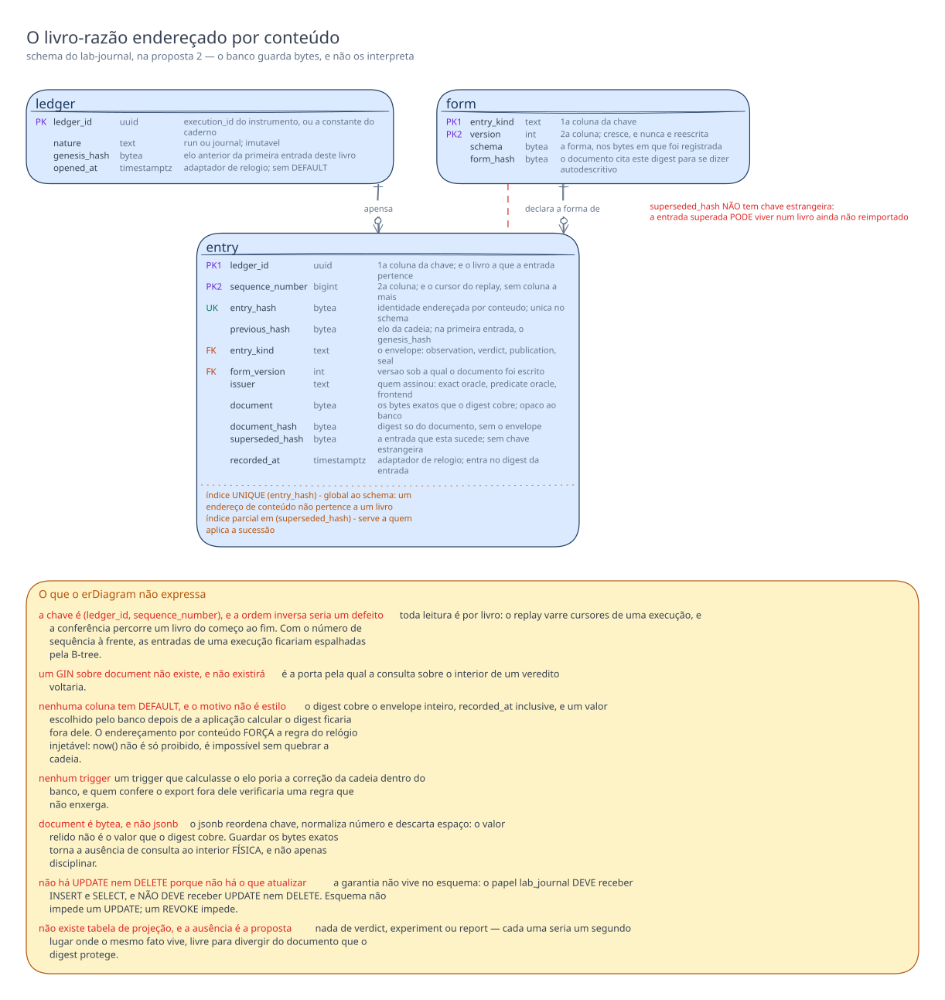
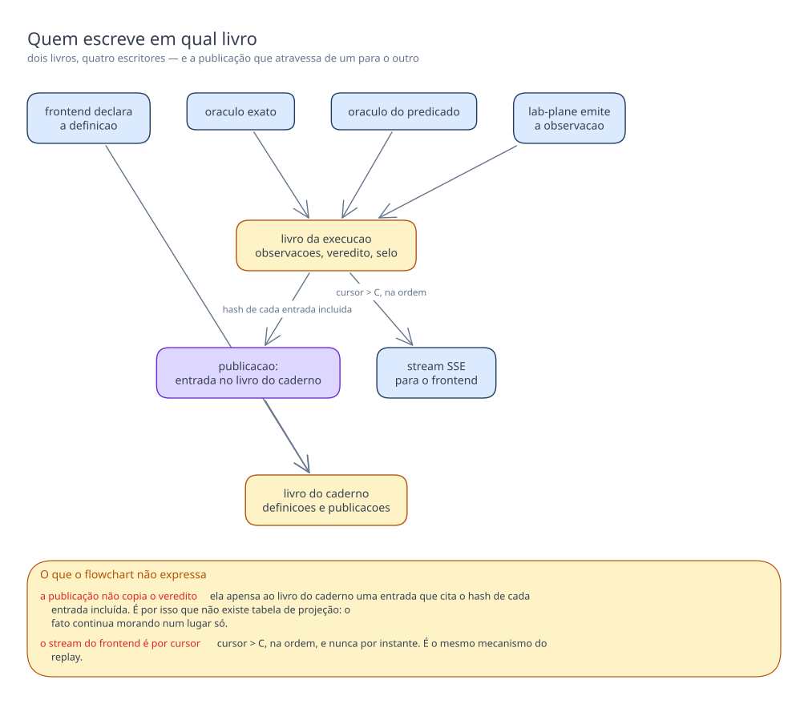

# Proposta 2 — O livro-razão apensável, endereçado por conteúdo

**A aposta é que o `lab-journal` não guarda um modelo relacional do resultado, e sim um
livro-razão apensável de documentos fechados, endereçados pelo próprio conteúdo e
encadeados por digest.** Ela otimiza integridade e exportabilidade do que foi gravado, e
paga com a perda de qualquer consulta sobre o interior de um veredito.

Isto é **proposta**, e não decisão. Nenhum schema deste banco foi desenhado ainda: a pasta
de esquemas não tem arquivo para o `lab_journal`, e nem em qual banco a definição de
experimento vive está decidido
([`schemas/lab-plane.md`](../../../lab-plane.md#o-que-o-diagrama-do-lab_plane-não-desenha)).

## O problema que este modelo resolve

O caderno guarda quatro coisas de naturezas diferentes: a definição de um experimento
declarada pelo frontend, o log de observações que alimenta o replay, o resultado de cada
execução, e a leitura que agrupa vários resultados. Só a segunda tem forma fixada por ADR
aceito
([ADR-0007](../../../../../adr/0007-o-log-de-observacoes-forma-ordem-e-onde-vive.md#a-forma-de-um-evento)).

O resultado é onde um modelo relacional se rompe. Um oráculo produz uma contagem de
operações perdidas
([ADR-0002](../../../../../adr/0002-o-dominio-minimo-e-os-dois-oraculos.md#o-oráculo-exato));
outro produz um booleano com dois números
([ADR-0002](../../../../../adr/0002-o-dominio-minimo-e-os-dois-oraculos.md#o-oráculo-do-predicado));
a execução medida produz três contagens, duas taxas e um limite de confiança
([ADR-0004](../../../../../adr/0004-o-estatuto-da-barreira-e-o-diagnostico-da-nao-ocorrencia.md#o-veredito-de-uma-execução-medida-é-uma-taxa)),
mais uma classificação de cinco condições avaliadas em ordem
([ADR-0004](../../../../../adr/0004-o-estatuto-da-barreira-e-o-diagnostico-da-nao-ocorrencia.md#o-zero-é-classificado-e-a-classificação-tem-quatro-valores));
e o formato curva do E4 não tem forma decidida
([`features/README.md`](../../../../../features/README.md#capacidade-conhecida-e-não-especificada)).
Modelar isso em colunas exige adivinhar hoje a união dos formatos, e migrá-la a cada
formato novo. Uma migração num caderno que já guarda resultado publicado reescreve o
passado, e resultado reescrito não é evidência de nada. A pergunta que este modelo escolhe
responder não é "como consulto um resultado", e sim "como provo que ele é o que foi
gravado, e que nada saiu do meio".

Duas regras do repositório dizem que o caderno **não tem caminho de volta**: o oráculo NÃO
DEVE ler o log de observações, e nenhum serviço lê o schema de outro
([ADR-0010](../../../../../adr/0010-a-fronteira-de-schema-e-o-cdc-como-fonte-do-veredito.md#decisão)).
Um banco que só recebe, e nunca alimenta a medição, não precisa de forma consultável —
precisa de forma conferível.

E há o custo nomeado no
[ADR-0011](../../../../../adr/0011-a-topologia-de-servicos-e-o-caderno-de-laboratorio-fora-do-git.md#o-caderno-de-laboratório-sai-do-git):
um resultado deixa de aparecer em diff, de ser revisado em PR e de sobreviver a um banco
recriado. Esta proposta ataca os três.

## O modelo

Três tabelas, e nenhuma descreve um experimento. `ledger` é o livro-razão, `entry` é o
fato apensado, e `form` registra as versões sob as quais um documento pôde ser escrito.

**Existe um livro por execução, e um livro só para o caderno.** O `ledger_id` de um livro
de execução **é** o discriminador do instrumento — o `execution_id`, nome que o
instrumento dá ao valor que o sistema medido chama de `partition_id`
([ADR-0015](../../../../../adr/0015-a-chave-o-discriminador-de-execucao-e-as-colunas-de-tempo.md#o-nome-assimétrico-do-discriminador-e-a-tradução-num-ponto-único)).
Não há coluna de execução na `entry`: a pertinência é o livro, e por isso "de qual
execução veio" é o que o banco sabe sem abrir documento nenhum.

**O cursor do replay e o número de sequência do livro são a mesma coluna.** O ADR-0016
exige campo próprio, monotônico por execução, que não seja um timestamp
([ADR-0016](../../../../../adr/0016-o-streaming-e-o-replay-do-log-de-observacoes.md#o-cursor-é-campo-próprio-monotônico-por-execução)),
e um livro-razão precisa exatamente disso para provar contiguidade. O `SELECT` do replay —
entradas com cursor maior que `C`, na ordem do cursor
([ADR-0016](../../../../../adr/0016-o-streaming-e-o-replay-do-log-de-observacoes.md#o-replay-por-cursor-é-o-único-mecanismo-com-ou-sem-histórico-completo))
— é a varredura do livro a partir de uma posição. Nada foi acrescentado para o streaming.

**O evento terminal do stream é o selo.** A regra `R4` exige que uma execução encerrada
devolva o histórico, depois um evento terminal, e só então feche
([card](../../../../../features/streaming-e-replay-do-log-de-observacoes/feature-card.md#regras-de-negócio)).
O selo é a última entrada do livro, e fechá-lo não muda estado: não existe coluna de
estado a atualizar.

**A cadeia é conferível por dois mecanismos que falham diferente.** A sequência contígua
denuncia entrada ausente; o `previous_hash` denuncia entrada trocada, quebrando o elo de
todas as seguintes. O primeiro sozinho não enxerga substituição; o segundo sozinho não
distingue fim de truncamento. É a guarda de contiguidade que o
[ADR-0013](../../../../../adr/0013-a-proveniencia-da-fonte-como-criterio-da-proibicao-do-oraculo.md#decisão)
exige do WAL, aplicada ao transporte da observação, que não carrega LSN
([ADR-0014](../../../../../adr/0014-o-broker-na-travessia-da-observacao-e-o-cursor-monotonico-do-replay.md#negativas)).

**Correção é entrada nova.** `superseded_hash` aponta para a entrada superada, e a superada
permanece. Quem lê aplica a sucessão; o banco não a resolve.

**A composição global dos formatos de veredito é publicação, e não relacionamento.** Uma
publicação é uma entrada no livro do caderno cujo documento lista os `entry_hash` que
entraram naquela leitura, na ordem em que entraram. A curva do E4 e a comparação entre os
três níveis de isolamento
([card](../../../../../features/comparacao-entre-niveis-de-isolamento/feature-card.md#escopo))
não ganham estrutura própria. Duas publicações da mesma execução são duas linhas, e ambas
verdadeiras: a segunda sucede a primeira, e não a corrige.

## O que o diagrama não expressa

**A chave é `(ledger_id, sequence_number)`, e a ordem inversa seria um defeito.** Toda
leitura é por livro: o replay varre cursores de uma execução, e a conferência percorre um
livro do começo ao fim. Com o número de sequência à frente, as entradas de uma execução
ficariam espalhadas pela B-tree. O `ledger_id` é um UUIDv7 derivado pelo instrumento, e o
prefixo de instante põe cada livro novo no fim da árvore, como no sistema medido
([`schemas/sut.md`](../../../sut.md#o-que-o-diagrama-do-sut-não-desenha)).

**Dois índices aditivos, e a ausência do terceiro é a decisão.** O `UNIQUE` sobre
`entry_hash` é global ao schema, porque um endereço de conteúdo não pertence a um
livro — é assim que uma publicação resolve entrada de outro livro sem chave estrangeira. O
segundo é parcial, sobre `superseded_hash`, e serve a quem aplica a sucessão. **Um GIN
sobre `document` não existe, e não existirá:** é a porta pela qual a consulta sobre o
interior de um veredito voltaria.

**Nenhuma coluna tem `DEFAULT`, e o motivo não é estilo.** O digest cobre o envelope
inteiro, `recorded_at` inclusive, e um valor escolhido pelo banco depois de a aplicação
calcular o digest ficaria fora dele. O endereçamento por conteúdo **força** a regra de
relógio injetável: `now()` não é só proibido, é impossível sem quebrar a cadeia — e
`gen_random_uuid()` também, porque `ledger_id` vem do instrumento.

**Nenhum trigger.** Um trigger que calculasse o elo poria a correção da cadeia dentro do
banco, e quem confere o export fora dele verificaria uma regra que não enxerga.

**Uma chave estrangeira existe, outra não.** `entry` referencia `ledger` e `form`; as
duas ligações são internas ao `lab_journal` e nenhuma toca a janela medida — o caderno é
alimentado depois do broker
([ADR-0016](../../../../../adr/0016-o-streaming-e-o-replay-do-log-de-observacoes.md#no-lab-journal-a-ordem-é-serial-persiste-depois-emite)).
O lock que a tirou do sistema medido
([ADR-0015](../../../../../adr/0015-a-chave-o-discriminador-de-execucao-e-as-colunas-de-tempo.md#sem-chave-estrangeira-em-allocationresource_id))
não alcança um schema onde nada é medido. Já `superseded_hash` **não** tem chave
estrangeira: a entrada superada PODE viver num livro ainda não reimportado.

**`document` é `bytea`, e não `jsonb`.** O `jsonb` reordena chave, normaliza número e
descarta espaço: o valor relido não é o valor que o digest cobre. Guardar os bytes exatos
torna a ausência de consulta ao interior **física**, e não apenas disciplinar.

**Não há `UPDATE` nem `DELETE` porque não há o que atualizar.** A garantia não vive no
esquema: o papel `lab_journal` DEVE receber `INSERT` e `SELECT`, e NÃO DEVE receber
`UPDATE` nem `DELETE`. Esquema não impede um `UPDATE`; um `REVOKE` impede.

**Não existe tabela de projeção, e a ausência é a proposta.** Nada de `verdict`,
`experiment` ou `report` — cada uma seria um segundo lugar onde o mesmo fato vive,
livre para divergir do documento que o digest protege.

## Decisões assumidas

| O que assumi                                                                                                                                 | Alternativa que ficou de fora                                           | O que muda no modelo se a pessoa decidir o contrário                                                                                                                    |
|----------------------------------------------------------------------------------------------------------------------------------------------|-------------------------------------------------------------------------|-------------------------------------------------------------------------------------------------------------------------------------------------------------------------|
| A composição global dos formatos de veredito é uma **publicação**: entrada cujo documento fixa, por hash, quais entradas entraram na leitura | tabela de relatório com chave estrangeira para cada veredito componente | entram uma tabela `report` e uma de junção; a curva do E4 e a comparação entre níveis ganham estrutura própria, e cada formato novo exige migração                      |
| O cursor do replay **é** o `sequence_number` do livro                                                                                        | coluna `cursor` separada, atribuída só às entradas de observação        | o que não é observação deixa de ocupar posição no cursor, o buraco de sequência deixa de significar perda, e a contiguidade precisa de outro eixo                       |
| Existe **um livro por execução**, mais um livro único para o caderno                                                                         | um livro-razão global único para todo o `lab-journal`                   | o cursor deixa de ser monotônico por execução, contrariando o ADR-0016, e o export de uma execução deixa de ser uma cadeia fechada                                      |
| O evento terminal do stream é a entrada de tipo **selo**, última do livro                                                                    | coluna `closed_at` no `ledger`, escrita no fim da execução              | reaparece o `UPDATE` que o desenho não tem, e o fim da execução deixa de ser um fato assinado por alguém                                                                |
| `document` guarda os **bytes exatos** que o digest cobre                                                                                     | `jsonb`, consultável                                                    | o digest passa a exigir canonicalização declarada, a conferência do export depende de reproduzir a serialização do banco, e a consulta ao interior volta a ser possível |
| A autoridade do emissor é concedida no **caminho de escrita**, e o banco só registra o nome declarado                                        | assinatura digital por chave, verificável dentro do banco               | entram par de chaves, rotação e um lugar para a chave pública; a regra de tecnologia por conveniência exigiria dispensa escrita por inteiro                             |
| `recorded_at` vem do adaptador de relógio e **entra no digest**                                                                              | `DEFAULT now()`, como o ADR-0015 admitiu para metadado de CRUD          | o instante fica fora do digest e a entrada deixa de ser verificável por inteiro; some a única medida de quando a travessia terminou                                     |
| `ledger_id` de um livro de execução **é** o `execution_id` do instrumento                                                                    | identificador próprio do caderno, ligado ao `execution_id` por coluna   | entram uma coluna e um índice; duas execuções passam a poder dividir um livro, e a pertinência deixa de ser estrutural                                                  |
| A definição de experimento vive **neste** schema, no livro do caderno                                                                        | a definição no `lab_plane`, e o caderno guardando só o resultado        | o livro do caderno perde metade do conteúdo, e a publicação cita uma definição que este banco não guarda — o export deixa de bastar por si                              |
| As versões de forma vivem em tabela **neste** banco, e não só em Git                                                                         | o esquema de cada documento versionado no repositório                   | um banco recriado a partir do export passa a depender do repositório para validar documento antigo, e o documento deixa de ser autodescritivo                           |
| Correção e retratação são a mesma coisa: entrada nova que **sucede**                                                                         | um tipo `retraction`, que anula sem substituir                          | entra a distinção entre "isto está errado" e "isto foi substituído por aquilo", e quem lê passa a precisar de duas regras                                               |
| A calibração é entrada como qualquer outra, e recusar o relatório é do **leitor**                                                            | coluna de validade na execução, escrita quando `commits` diverge        | o banco passa a interpretar o resultado da calibração, e a fórmula do ADR-0002 entra no schema — o oposto da aposta                                                     |
| O algoritmo do digest e a canonicalização do envelope são declarados uma vez, para o schema inteiro                                          | algoritmo por entrada, em campo próprio                                 | entra uma coluna de algoritmo, e conferir uma cadeia passa a exigir suportar todos os que já apareceram nela                                                            |
| O append é serializado por livro pelo `UNIQUE` da chave: dois appends concorrentes colidem, e um repete                                      | um contador do último número no `ledger`, atualizado a cada entrada     | volta o `UPDATE`, e com ele um ponto de contenção; o modelo deixa de ser apensável em sentido estrito                                                                   |

## Trade-offs

**A conferibilidade foi aceita em troca de o banco não responder nada sobre resultado.**
"Quais execuções violaram a invariante" vira um programa: varrer os livros, abrir cada
documento de veredito, validar contra a forma daquela versão e decidir. Vale a pena por um
motivo deste repositório: **o caderno
guarda evidência de um instrumento de medição, e evidência que pode ser reescrita não é
evidência.** "217 operações perdidas" só tem valor se alguém puder mostrar que aquele é o
número que o oráculo publicou, e não o que uma migração deixou lá.

**O resultado voltar a caber num diff foi aceito em troca de duas cópias e de uma cerimônia
de export.** Um livro selado exporta como arquivo de entradas em ordem de sequência, e o
arquivo se confere sozinho: recalcula-se cada digest, refazem-se os elos, compara-se o hash
do selo. Basta então versionar em Git **uma linha** por execução — `ledger_id`, último
número e hash do selo — para o resultado voltar a aparecer em diff e a ser revisado em PR,
sem que o volume do log de observações entre no repositório. Um banco recriado se reimporta
do arquivo, e a linha versionada prova que o que voltou é o que saiu — os três custos que o
[ADR-0011](../../../../../adr/0011-a-topologia-de-servicos-e-o-caderno-de-laboratorio-fora-do-git.md#negativas)
nomeou.

**E cobra caro.** A reimportação DEVE preservar `sequence_number` e `previous_hash`
exatamente, o que proíbe renumeração e obriga a importar `form` antes de `entry`. O
arquivo é uma segunda cópia, e só livro selado se exporta com segurança. E a linha
versionada só prova alguma coisa se o arquivo existir em algum lugar: sem ele, resta um
hash que ninguém confere contra nada.

**Nenhuma migração tocar resultado publicado foi aceito em troca de o esquema não validar
nada.** Documento malformado entra, e só é detectado por quem o lê contra a `form`
declarada: um emissor que escrever lixo produz entrada íntegra e inútil.

**O append estritamente apensável foi aceito em troca de contenção por livro.** Dois
consumidores do mesmo livro colidem no `UNIQUE` da chave e um repete. Isso é aceitável
enquanto o `lab-journal` persistir em série, como o
[ADR-0016](../../../../../adr/0016-o-streaming-e-o-replay-do-log-de-observacoes.md#no-lab-journal-a-ordem-é-serial-persiste-depois-emite)
já exige, e deixa de ser no dia em que ele rodar em mais de uma instância.

## O que esta proposta NÃO decide

Nenhum formato de documento — nem o do veredito exato, nem o do predicado, nem o da taxa,
nem o da curva do E4, que segue sem forma
([`features/README.md`](../../../../../features/README.md#capacidade-conhecida-e-não-especificada)).
Ela decide onde o documento mora e como se prova que ele não mudou, e nada sobre o que ele
diz.

O contrato HTTP entre o frontend e o `lab-journal`, ausente na
[matriz](../../../../integrations.md#matriz); o formato JSON de cada evento no
stream e a contrapressão do broker, os dois em aberto no
[ADR-0016](../../../../../adr/0016-o-streaming-e-o-replay-do-log-de-observacoes.md#negativas); e
o que o stream faz quando o `Last-Event-ID` aponta para um cursor que não existe — a
contiguidade da cadeia oferece resposta possível, e esta proposta não a escolhe.

A política de retenção: um livro-razão que nunca apaga cresce por construção.

## Perguntas que ela levanta

**O `lab-journal` vai rodar em mais de uma instância?** O append serializado por livro e o
pub/sub local ao processo dependem da resposta.

**A linha de selo vai ser versionada em Git?** O modelo torna isso possível; se for, parte
do custo do ADR-0011 é revertida, e passa a existir artefato do caderno dentro do
repositório — o que aquele ADR tirou de lá.

**O que conta como "o resultado" a exportar: o veredito, ou o livro inteiro com as
observações?** Um livro do E1 carrega entre novecentas e mil e quinhentas observações
([ADR-0014](../../../../../adr/0014-o-broker-na-travessia-da-observacao-e-o-cursor-monotonico-do-replay.md#justificativa)),
e a escolha muda a ordem de grandeza do arquivo e o que a cadeia consegue provar.

**Uma publicação pode incluir execuções rodadas sob definições diferentes?** A comparação
entre níveis supõe que só o nível varia
([card](../../../../../features/comparacao-entre-niveis-de-isolamento/feature-card.md#regras-de-negócio)),
e o modelo não impede uma publicação que misture cargas incomparáveis — impedir exigiria
saber o que o documento diz.
