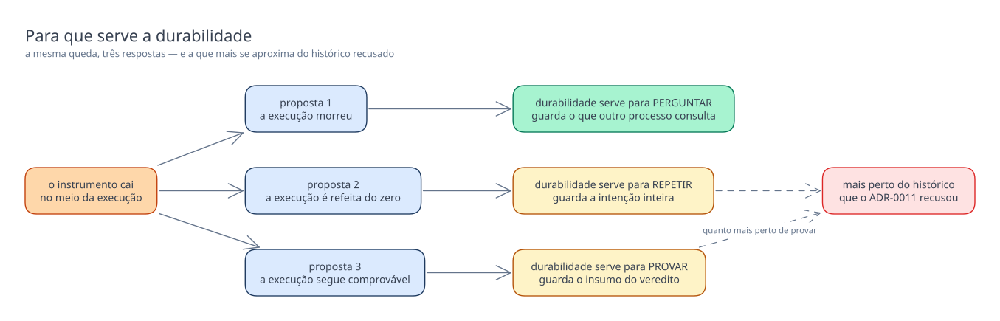

# As três propostas de modelo do `lab_plane`, lado a lado

Este documento não recomenda nenhuma das três. Ele existe para tornar a escolha
comparável, e a escolha é da pessoa.

## O eixo real

As três propostas parecem diferir em quantidade — uma tabela, sete tabelas, dez tabelas —,
e essa leitura é a errada. O que separa as três é **o que uma queda do instrumento
significa para a execução que estava rodando**, e a contagem de tabelas é consequência
disso. A proposta 1 responde que a execução morreu, e por isso guarda só o que outro
processo precisa perguntar. A proposta 2 responde que a execução precisa ser refeita do
zero, e por isso guarda a intenção inteira, que é o que a redigitação custaria. A proposta
3 responde que a execução precisa continuar comprovável, e por isso guarda o insumo do
veredito evento a evento. Escolher entre elas é decidir se durabilidade no instrumento
serve para **perguntar**, para **repetir** ou para **provar** — e as três respostas são
mutuamente exclusivas, porque cada uma torna as outras duas ou insuficientes ou
excessivas. Há um segundo eixo embutido, e ele não é livre: o
[ADR-0011](../../../../../adr/0011-a-topologia-de-servicos-e-o-caderno-de-laboratorio-fora-do-git.md#histórico-de-execução-dentro-do-lab-plane)
recusou histórico de execução dentro do `lab-plane`, e quanto mais uma proposta se aproxima
de "provar", mais perto ela chega daquilo que aquela decisão descartou.

## O que cada uma decide diferente

| Ponto de decisão                       | [Proposta 1 — Instrumento amnésico](proposta-1-instrumento-amnesico.md#o-modelo) | [Proposta 2 — Plano durável, execução efêmera](proposta-2-plano-duravel-execucao-efemera.md#o-modelo) | [Proposta 3 — Livro-razão do veredito](proposta-3-livro-razao-do-veredito.md#o-modelo) |
| -------------------------------------- | -------------------------------------------------------------------------------- | ----------------------------------------------------------------------------------------------------- | -------------------------------------------------------------------------------------- |
| tabelas no schema                      | uma                                                                              | sete                                                                                                  | dez                                                                                    |
| o que é durável                        | só o filtro do consumidor de CDC                                                 | a intenção declarada antes de executar                                                                | todo insumo que entra no veredito                                                      |
| o que um reinício significa            | a execução morreu, por construção                                                | a execução é reexecutável, nunca retomável                                                            | a execução continua re-derivável, e o reinício vira linha                              |
| onde mora a lista de ativas            | é a própria tabela, e a única                                                    | é projeção das linhas em `RUNNING`                                                                    | é projeção de `run` mais os eventos de ciclo de vida                                   |
| semente e configuração                 | fora do schema, no comando e no caderno                                          | dentro, em `EXPERIMENT_PLAN`                                                                          | dentro, em `run`, por execução                                                         |
| agendamento                            | fora do schema, em memória                                                       | dentro, já expandido em pares de precedência                                                          | dentro, com a origem de cada restrição marcada                                         |
| pontos de injeção de falha             | fora do schema                                                                   | dentro, já expandidos                                                                                 | dentro, declarados antes e casados com o disparo                                       |
| calibração do denominador              | não persistida; a sessão recomeça inteira                                        | é uma execução como as outras, e o resultado não fica                                                 | tem tabela própria, com o `matched` materializado                                      |
| veredito                               | fora do schema, no relatório                                                     | fora do schema, no relatório                                                                          | dentro, com a extensão do livro-razão que o produziu                                   |
| contiguidade de LSN                    | não persistida; sem veredito em voo, não há a quem servir                        | não persistida                                                                                        | encadeada em coluna, e é a prova que a proposta vende                                  |
| máquina de estados                     | nenhuma; o estado é o predicado de atividade                                     | duas, e são a espinha do desenho                                                                      | nenhuma; o estado é projeção de eventos apensáveis                                     |
| linha reescrita                        | não há `UPDATE`; só inserção e remoção                                           | há `UPDATE` a cada transição de estado                                                                | nenhuma linha é reescrita, nunca                                                       |
| chave estrangeira                      | nenhuma, e nenhuma poderia existir                                               | cinco, todas dentro do schema, declaradas de propósito                                                | nenhuma declarada; a órfã é verificada, e não impedida                                 |
| `DEFAULT` e trigger                    | nenhum, em nenhuma coluna                                                        | dois `DEFAULT now()` e um trigger, em metadado de CRUD                                                | nenhum, em nenhuma coluna                                                              |
| identidade                             | UUIDv7 da aplicação, mais a vida do processo                                     | `bigint` da aplicação, sem `SERIAL` nem `nextval`                                                     | UUIDv7 da aplicação, e ordinal atribuído pelo escritor                                 |
| crescimento                            | limitado; a poda acontece no boot                                                | ilimitado; ninguém decidiu quem remove plano encerrado                                                | ilimitado; cresce por tentativa, e a poda fica em aberto                               |
| o que o `lab_journal` precisa absorver | tudo: definição, log, veredito, calibração                                       | o acontecido inteiro                                                                                  | o menos dos três: a intenção e a prova já estão aqui                                   |
| como colide com a `R6`                 | não colide: a tabela é só o filtro                                               | colide na letra — a linha do filtro carrega a intenção                                                | mantém a letra, e colide com o motivo que a regra invoca                               |

## O que cada uma torna fácil, e o que torna caro

**Proposta 1.** Ela torna barato tudo o que envolve mudar de ideia: o schema é uma tabela,
a migração é curta, e nenhuma decisão futura sobre definição de experimento, formato de
relatório ou linguagem de agendamento envelhece dentro dele. Torna barata também a
honestidade — nenhum estado guardado aqui pode fazer um relatório parecer íntegro sobre uma
janela em que o instrumento esteve ausente, porque a costura que produziria esse relatório
é inexprimível no modelo. O que ela torna caro é toda pergunta sobre o passado: uma
execução interrompida a um evento do fim é perdida inteira, um veredito produzido e não
entregue some sem rastro deste lado, e qualquer auditoria depende de o outro serviço ter
recebido o que este mandou. Ela também transfere um custo que não aparece no seu diagrama:
o `lab_journal` precisa absorver definição, log, veredito e calibração, e a forma daquele
schema não está decidida.

**Proposta 2.** Ela torna barato recusar cedo e repetir sem redigitar: o
[ADR-0003](../../../../../adr/0003-a-linguagem-do-agendamento.md#o-que-a-plataforma-recusa-antes-de-executar)
manda recusar ciclo, papel não declarado e endereço que não resolve antes de executar, e
com a intenção inteira em linhas o instrumento tem exatamente a estrutura que essa
validação consome — a mesma que o escalonador depois executa. Ela torna barata também a
comparação entre níveis de isolamento, que vira braço inspecionável antes de qualquer
worker rodar, e a igualdade de carga entre controle e execução medida, que vira igualdade
de chave estrangeira em vez de conferência de dois números. O que ela torna caro é o
espaço e a fidelidade da forma declarada: um encontro entre cinquenta workers vira dois mil
quatrocentos e cinquenta linhas, e quem abre o banco vê pares de precedência, e não a linha
curta que dizia o que causa a anomalia. Caro também é o acontecido, que ela abre mão por
inteiro — cursor, coincidências parciais e resultado de calibração morrem com o processo —,
e a linha que serve de filtro passa a carregar muito mais que o filtro.

**Proposta 3.** Ela torna barato provar: o veredito é re-derivável depois de uma queda, a
contiguidade de LSN deixa de ser presumida e passa a ser encadeada, e a queda proposital
que a etapa 6 provoca no próprio instrumento deixa marca em vez de buraco silencioso. Torna
barata a auditoria de um descarte, porque cada um tem linha com o LSN e a classificação, em
vez de um contador que não permite reconstituir nada. O que ela torna caro é o I/O do
instrumento no mesmo PostgreSQL do sistema medido — a perturbação que as
[negativas do ADR-0017](../../../../../adr/0017-a-persistencia-antecipada-do-log-de-observacoes-e-o-buffer-que-a-alimenta.md#negativas)
já nomeiam —, e o tamanho, porque o livro-razão cresce por tentativa e ninguém decidiu
quando ele é podado. Ela paga ainda dois custos que não são de recurso: uma sombra dos
dados do sistema medido passa a viver dentro do schema do instrumento, e o desenho depende
de o conector expor o elo do evento anterior, o que nenhum teste deste repositório provou.

## O detalhamento das propostas 2 e 3 foi nivelado ao do caderno

Feito em 2026-08-14, por escolha da pessoa, e não é mudança de modelo: nenhuma tabela
nasceu, nenhuma sumiu, nenhuma coluna trocou de tipo. O que mudou é a quarta célula de
cada linha do desenho. O diagrama do
[caderno](../lab-journal/proposta-1-o-caderno-conhece-cada-veredito.md#o-modelo) escreve
**marcador de chave, nome, tipo e uma nota com a constraint e a origem do valor**, e por
isso ele determina a `CREATE TABLE` sem que nenhum DDL precise ser escrito ao lado. As
duas propostas maiores daqui não escreviam o mesmo, e a lacuna custava mais deste lado:
é o `lab_plane` que uma implementação cria primeiro. Uma coluna sem nulabilidade
declarada, e um domínio enumerado em prosa sem o `CHECK` que o fecha, deixam a migração
indeterminada — quem a escrevesse decidiria por conta própria o que o diagrama não disse,
e a decisão ficaria no Flyway em vez de ficar na proposta.

| Diagrama                                                                                     | Colunas tipadas | Nulabilidade declarada | `CHECK` |
|----------------------------------------------------------------------------------------------|-----------------|------------------------|---------|
| [caderno, proposta 1](../lab-journal/proposta-1-o-caderno-conhece-cada-veredito.md#o-modelo) | 89              | 63 de 89               | 20      |
| [instrumento amnésico](proposta-1-instrumento-amnesico.md#o-modelo)                          | 4               | 2 de 4                 | 0       |
| [plano durável](proposta-2-plano-duravel-execucao-efemera.md#o-modelo)                       | 55              | 55 de 55               | 20      |
| [livro-razão](proposta-3-livro-razao-do-veredito.md#o-modelo)                                | 81              | 81 de 81               | 17      |

**O nivelamento revelou o que a prosa não decidia, e nada disso foi inventado para caber
no desenho.** Onde o repositório não fixa o conjunto de valores de uma coluna de domínio
fechado, o diagrama declara `CHECK sem lista decidida` e nomeia a ausência — oito colunas
na proposta 2, uma na proposta 3. Cada uma virou pergunta em aberto na própria proposta,
e nenhuma virou valor escolhido por quem desenhou.

**Duas colunas do instrumento amnésico seguem sem nulabilidade declarada**, e ficaram
fora de propósito: a escolha alcançou as propostas 2 e 3. Corrigi-las é trabalho de uma
linha, e ninguém está encarregado dele.

## As perguntas que sobrevivem a qualquer escolha

- **Onde a definição de experimento vive.** As três a empurram para fora de si, e o
  [dono da forma do `lab_plane`](../../../lab-plane.md#o-que-o-diagrama-do-lab_plane-não-desenha)
  registra a pergunta sem decisão. Nenhuma escolha aqui a responde.
- **A forma do `lab_journal`.** As três dependem dele para o que não guardam, e a
  [matriz](../../../../integrations.md#matriz) o registra vazio. Quanto menos o
  `lab_plane` guardar, mais aquele schema precisa absorver.
- **Se a `R6` e o ADR-0011 admitem alguma durabilidade além do filtro.** As três esbarram
  na mesma regra aprovada, em
  [higiene e invalidação](../../../../../features/distincao-entre-higiene-e-invalidacao/feature-card.md#regras-de-negócio),
  por caminhos diferentes: a 1 não a toca, a 2 a contraria na letra, a 3 a mantém na letra
  e colide com o motivo que ela invoca. Só a pessoa desfaz a regra que aprovou, e essa
  resposta é anterior à escolha do modelo.
- **O que significa "sair da lista de ativas".** Deixar de casar com o predicado, ou ter a
  linha apagada. As duas leituras produzem esquemas diferentes, e o card não separa uma da
  outra.
- **O valor do limite de espera, e qual relógio o avalia.** Se o adaptador injetável for o
  mesmo que o experimento controla, um relógio congelado impede a expiração do filtro; se
  for outro, o instrumento passa a ter dois relógios.
- **A retenção.** Nenhuma das três decide quando o schema do instrumento é podado, e as
  duas maiores crescem sem teto declarado.
- **O contrato do comando de execução e o formato do relatório**, sem forma em
  [`Q-INT-1`](../../../../integrations.md#perguntas-em-aberto). As três supõem
  algo sobre como a execução é aberta, e nenhuma decide o contrato.
- **A réplica única é condição, e não garantia.** As três dependem dela — a 1 no predicado
  de vida do processo, a 2 e a 3 na projeção mantida em memória —, e é o
  [ADR-0012](../../../../../adr/0012-o-broker-no-caminho-do-veredito-e-a-dispensa-que-ele-exigiu.md#decisão)
  que a declara. Nenhuma das três a produz.
