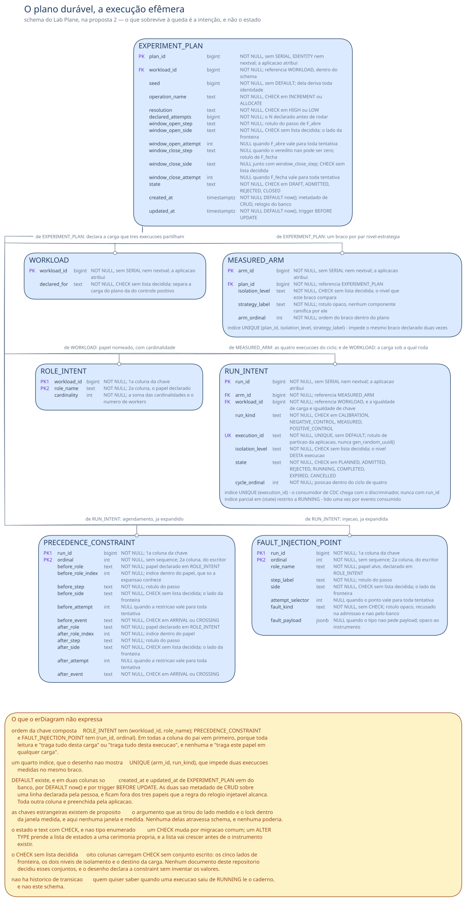
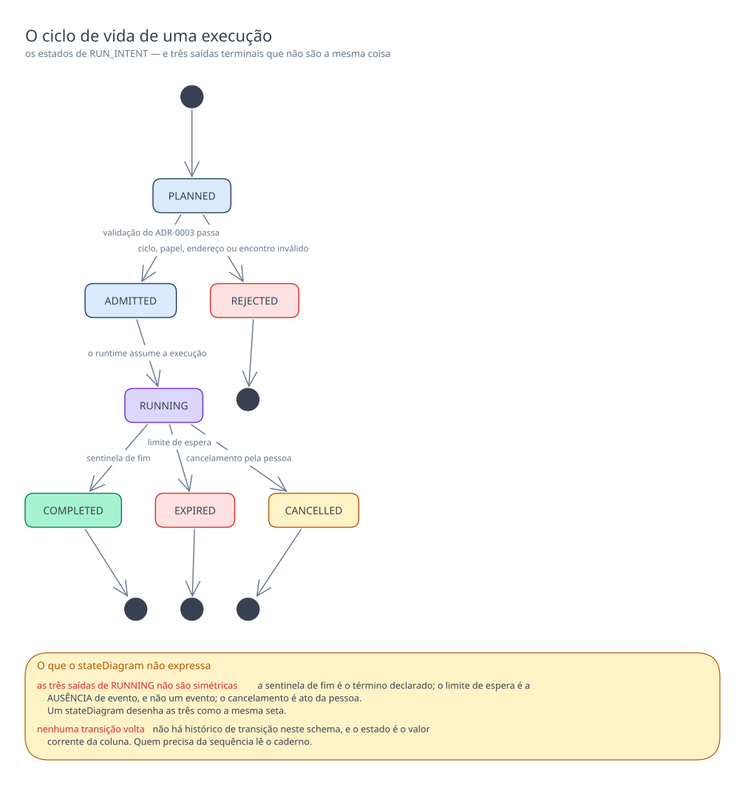
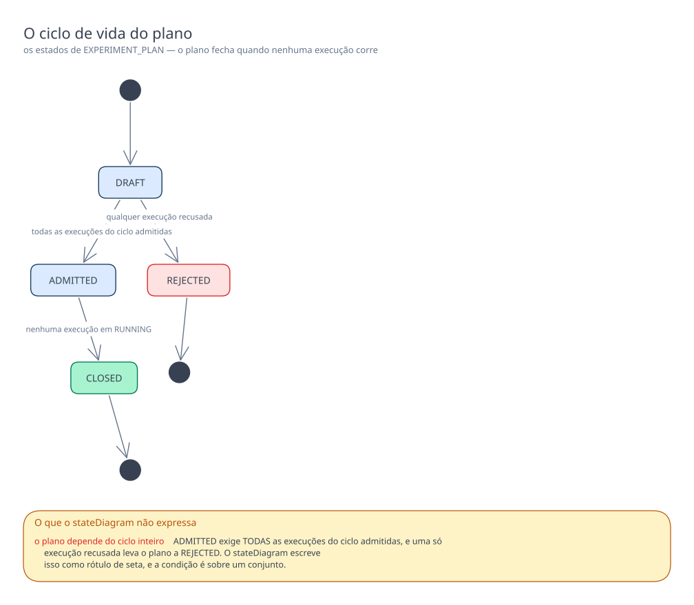

# Proposta 2 — Plano durável, execução efêmera

O instrumento é dono da **intenção**, e não do acontecido: vira linha durável no
`lab_plane` tudo o que descreve o que se pretende medir, e o que ocorreu durante a
execução vive em memória e escoa para o caderno de laboratório. A aposta otimiza duas
coisas — reexecutar uma intenção a partir do banco do instrumento, e recusar um plano
defeituoso antes de qualquer worker rodar — e paga por elas com amnésia sobre a execução
interrompida.

Isto é proposta, e não decisão. O dono da forma vigente do schema continua sendo
[`schemas/lab-plane.md`](../../../lab-plane.md#o-que-o-diagrama-do-lab_plane-não-desenha),
que hoje desenha um token de placeholder e nenhuma tabela.

## O problema que este modelo resolve

Uma execução deste laboratório é precedida por muita declaração e produz pouca linha.
Antes de rodar, alguém declara a semente, a carga em papéis com cardinalidade, o `N`, a
janela de exposição, a estratégia, o nível de isolamento, o agendamento do controle
positivo e os pontos de injeção de falha. Depois de rodar, o que sobra é um relatório — e
o relatório tem dono, e o dono não é este schema: a definição de experimento e o resultado
vivem no banco do `lab-journal`, pelo
[ADR-0011](../../../../../adr/0011-a-topologia-de-servicos-e-o-caderno-de-laboratorio-fora-do-git.md#o-caderno-de-laboratório-sai-do-git).

Sobra ao `lab_plane` uma coisa, e ela tem três usos. O primeiro é recusar antes de
executar o que o
[ADR-0003](../../../../../adr/0003-a-linguagem-do-agendamento.md#o-que-a-plataforma-recusa-antes-de-executar)
manda recusar: ciclo no grafo de precedências, papel não declarado, endereço de fronteira
que não resolve, encontro fora de `F_abre`. O segundo é responder ao consumidor de CDC
quais discriminadores estão ativos, sem o que ele não distingue higiene de invalidação —
é a exigência do
[ADR-0012](../../../../../adr/0012-o-broker-no-caminho-do-veredito-e-a-dispensa-que-ele-exigiu.md#decisão),
e a `R4` de
[`distincao-entre-higiene-e-invalidacao`](../../../../../features/distincao-entre-higiene-e-invalidacao/feature-card.md#regras-de-negócio)
já a pôs numa tabela deste schema. O terceiro é reexecutar a mesma intenção sem que
ninguém a redigite.

Os três usos são de intenção. Nenhum deles precisa do que aconteceu. É essa observação
que o modelo leva até o fim: **nenhuma tabela deste schema guarda contagem, veredito,
observação, cursor de LSN ou instante de ocorrência.** O log de observações já sai do
processo por buffer em memória e thread separada, pelo
[ADR-0017](../../../../../adr/0017-a-persistencia-antecipada-do-log-de-observacoes-e-o-buffer-que-a-alimenta.md#o-runtime-publica-por-um-buffer-em-memória-numa-thread-separada);
o contador de ativos que declara o fim da execução já vive dentro do escalonador, pelo
[ADR-0005](../../../../../adr/0005-a-forma-do-escalonador.md#o-contador-de-ativos-sinaliza-o-fim-da-execução).

## O modelo

A espinha tem três níveis: o plano declara a carga e a janela, cada braço fixa um par
nível-estratégia, e cada braço abre as quatro execuções do ciclo. As duas tabelas-folha
guardam o agendamento e a injeção **já expandidos**.

A máquina de estados de `RUN_INTENT` é o coração da aposta. Ela tem exatamente três saídas
de `RUNNING`, e elas são as três da `R7` de
[`distincao-entre-higiene-e-invalidacao`](../../../../../features/distincao-entre-higiene-e-invalidacao/feature-card.md#regras-de-negócio):
a sentinela de fim, o limite de espera e o cancelamento pela pessoa. A lista de execuções
ativas não é uma segunda tabela — ela é a projeção das linhas em `RUNNING`.

O plano tem uma máquina menor, e ela é só o portão de admissão do conjunto.

## O que o diagrama não expressa

**A ordem das colunas nas chaves compostas não é decorativa.** `ROLE_INTENT` tem
`(workload_id, role_name)`, `PRECEDENCE_CONSTRAINT` e `FAULT_INJECTION_POINT` têm
`(run_id, ordinal)`. Em todas, a coluna do pai vem primeiro porque toda leitura é "traga
tudo desta carga" ou "traga tudo desta execução", e nenhuma é "traga este papel em
qualquer carga". Uma chave que começasse pelo nome do papel obrigaria a varredura na
única consulta que existe.

**Quatro índices, e cada um paga um caminho de leitura nomeado.** Um `UNIQUE` sobre
`run_intent.execution_id`, porque o consumidor de CDC chega com o discriminador na mão e
nunca com o `run_id` — a tradução de `partition_id` para `execution_id` acontece nele, e
não no banco, pelo
[ADR-0015](../../../../../adr/0015-a-chave-o-discriminador-de-execucao-e-as-colunas-de-tempo.md#o-nome-assimétrico-do-discriminador-e-a-tradução-num-ponto-único).
Um índice parcial sobre `run_intent(state)` restrito a `RUNNING`, porque essa leitura
acontece uma vez por evento consumido e o resto da tabela é ruído para ela. Um `UNIQUE`
sobre `(arm_id, run_kind)`, que impede duas execuções medidas no mesmo braço. Um `UNIQUE`
sobre `(plan_id, isolation_level, strategy_label)`, que impede o mesmo braço declarado
duas vezes.

**Não existe `DEFAULT` neste esquema, exceto em duas colunas.** `created_at` e
`updated_at` de `EXPERIMENT_PLAN` vêm do banco, por `DEFAULT now()` e por trigger
`BEFORE UPDATE`. As duas são metadado de CRUD sobre uma linha declarada pela pessoa, e
por isso ficam fora dos três papéis que a regra do relógio injetável alcança — é o mesmo
recorte que o
[ADR-0015](../../../../../adr/0015-a-chave-o-discriminador-de-execucao-e-as-colunas-de-tempo.md#as-colunas-de-tempo-e-a-fonte-do-relógio-por-papel-do-valor)
fixou para as colunas de tempo da definição de experimento. A objeção que derrubou o
trigger do lado medido não alcança este lado: lá ele rodava dentro da janela exata em que
o E1 mede, e aqui não existe janela medida. Toda outra coluna é preenchida pela
aplicação, e nenhuma identidade vem de `SERIAL`, `IDENTITY` ou `nextval`, pelo mesmo
motivo que o
[ADR-0002](../../../../../adr/0002-o-dominio-minimo-e-os-dois-oraculos.md#a-identidade-das-entidades-é-atribuída-pela-aplicação)
deu ao lado medido.

**As chaves estrangeiras existem, e existem de propósito.** O
[ADR-0015](../../../../../adr/0015-a-chave-o-discriminador-de-execucao-e-as-colunas-de-tempo.md#sem-chave-estrangeira-em-allocationresource_id)
tirou a chave estrangeira do lado medido porque o `FOR KEY SHARE` que ela adquire colide
com o `FOR UPDATE` de `PESSIMISTIC` dentro da janela medida. Aqui nenhuma estratégia está
sob teste e nenhuma janela é medida, e o argumento não se transporta: as cinco chaves do
diagrama são declaradas. Nenhuma delas atravessa schema, e nenhuma poderia — a fronteira
do
[ADR-0010](../../../../../adr/0010-a-fronteira-de-schema-e-o-cdc-como-fonte-do-veredito.md#decisão)
proíbe, e é por isso que este canvas desenha um schema só.

**O estado é `text` com `CHECK`, e não tipo enumerado.** Um `CHECK` muda por migração
comum; um `ALTER TYPE` prende a lista de estados a uma cerimônia própria, e a lista vai
crescer antes de o instrumento existir.

**Oito colunas têm `CHECK` sem o conjunto de valores:** os cinco lados de fronteira,
os dois níveis de isolamento e o destino da carga em `WORKLOAD.declared_for`. Nenhum
documento deste repositório decidiu esses conjuntos, e o desenho não os inventa.

**Não há histórico de transição, e a ausência é a decisão.** Quem quiser saber quando uma
execução saiu de `RUNNING` lê o caderno, e não este schema.

## Decisões assumidas

| O que assumi                                                                                         | Alternativa que ficou de fora                                             | O que muda se a pessoa decidir o contrário                                                                                                                       |
| ---------------------------------------------------------------------------------------------------- | ------------------------------------------------------------------------- | ---------------------------------------------------------------------------------------------------------------------------------------------------------------- |
| A definição de experimento vive no `lab_journal`, e o `lab_plane` guarda um **plano derivado** dela. | A definição vive no `lab_plane`, e o `lab-journal` guarda só o resultado. | `EXPERIMENT_PLAN` deixa de ser derivado e vira o original; o `lab-journal` perde metade do caderno, e a duplicação entre os dois schemas desaparece.             |
| O nível de isolamento é declarado em coluna de `MEASURED_ARM`, um braço por nível comparado.         | O nível é declarado fora do banco, na configuração do processo.           | `MEASURED_ARM` desaparece, `RUN_INTENT` pendura direto no plano, e a comparação entre níveis deixa de ser inspecionável antes de executar.                       |
| O agendamento é persistido **expandido** em pares de precedência; o encontro não é persistido.       | Persistir a forma curta e expandi-la em memória a cada admissão.          | Nascem `ENCOUNTER` e `ENCOUNTER_ROLE`, `PRECEDENCE_CONSTRAINT` encolhe, e a expansão passa a existir só em memória.                                              |
| A expansão nomeia o participante por `(papel, índice no papel)`.                                     | A expansão guarda um identificador de worker.                             | O índice sai, e o modelo passa a depender de uma identidade de worker que nenhuma decisão criou.                                                                 |
| As quatro execuções do ciclo nascem com o plano, na admissão.                                        | Cada execução é criada quando a anterior termina.                         | O ciclo de quatro deixa de ser inspecionável antes da primeira execução, e a recusa antecipada perde três quartos do alvo.                                       |
| O controle positivo aponta para uma `WORKLOAD` própria; as outras três partilham a do plano.         | Cada execução declara a própria carga.                                    | `WORKLOAD` some, `ROLE_INTENT` pendura em `RUN_INTENT`, e a igualdade de carga entre controle negativo e medida deixa de ser verificável por igualdade de chave. |
| A lista de execuções ativas é a projeção `RUN_INTENT` em `RUNNING`.                                  | Uma tabela própria, só com discriminador e estado.                        | Nasce `ACTIVE_EXECUTION`, `RUN_INTENT` perde a máquina de estados, e as duas passam a poder divergir.                                                            |
| A invalidação de uma execução não é durável: ela é acontecido, e vai para o caderno.                 | Uma coluna `invalidated` em `RUN_INTENT`.                                 | Um reinício deixa de reapresentar como válida uma execução já corrompida, e o schema passa a guardar um fato da execução.                                        |
| O motivo de uma recusa de admissão não é durável; só o estado `REJECTED` fica.                       | Uma tabela `ADMISSION_DEFECT`, com a restrição culpada.                   | Nasce a tabela, e quem relê um plano recusado passa a saber por quê sem repetir a validação.                                                                     |
| O tipo da falha injetada é rótulo opaco, com payload opaco ao lado.                                  | Um conjunto fechado de tipos, validado pelo banco.                        | A coluna vira enumeração, e o instrumento passa a rejeitar tipo desconhecido na escrita, e não na admissão.                                                      |
| O endereço de fronteira é repetido como três colunas, e não vira tabela própria.                     | Uma tabela `FRONTIER`, referenciada por chave estrangeira.                | Cinco chaves estrangeiras novas e um `JOIN` a mais em cada leitura de agendamento.                                                                               |
| A calibração é um `RUN_INTENT` como os outros, e o resultado dela não é durável.                     | Guardar o veredito da calibração ao lado da intenção.                     | O instrumento passa a guardar acontecido, e a `R6` de `distincao-entre-higiene-e-invalidacao` é contrariada de frente.                                           |
| O filtro do consumidor de CDC não tem tabela própria; ele lê a projeção de ativas.                   | Uma tabela de filtro, com os contadores de descarte de `R3`.              | Os contadores viram linha durável, e a fronteira entre intenção e acontecido se rompe no ponto mais quente do modelo.                                            |
| O `execution_id` é rótulo de partição gerado pela aplicação, e não por `gen_random_uuid()`.          | Deixar o banco gerá-lo.                                                   | O esquema ganha um `DEFAULT` de aleatoriedade, e a origem do valor sai do processo que controla a semente.                                                       |
| Um plano encerrado permanece na tabela; nada o remove.                                               | Remover o plano quando o ciclo encerra.                                   | A tabela para de crescer, e a reexecução a partir do banco deixa de existir.                                                                                     |

## Trade-offs

O benefício **uma execução interrompida é reexecutável a partir do banco, sem
redigitação** foi aceito em troca do custo **uma execução interrompida não é retomável**:
o cursor de LSN do consumidor, a contagem de coincidências parcial e o veredito da
calibração vivem em memória, e um reinício apaga os três.

O benefício **a validação e o escalonador consomem exatamente a mesma estrutura** foi
aceito em troca do custo **a expansão do encontro é quadrática no banco**. Um encontro
entre cinquenta workers vira dois mil quatrocentos e cinquenta linhas de
`PRECEDENCE_CONSTRAINT`, e o
[ADR-0003](../../../../../adr/0003-a-linguagem-do-agendamento.md#o-encontro-é-a-forma-curta-e-ele-se-expande-em-precedências)
já nomeia essa aritmética. Persistir a forma curta cortaria o custo e criaria um segundo
lugar onde o agendamento vive.

O benefício **o agendamento persistido é o que o escalonador executa** foi aceito em troca
do custo **a forma curta se perde**. Quem abrir o banco vê pares de precedência, e não a
linha que dizia o que causa a anomalia — e o índice de participante que a expansão exige é
o que a linguagem declarada proíbe, pelo
[ADR-0003](../../../../../adr/0003-a-linguagem-do-agendamento.md#o-sujeito-de-uma-restrição-é-um-papel-e-o-papel-tem-cardinalidade).

O benefício **uma carga declarada uma vez não diverge de si mesma** foi aceito em troca do
custo **duas execuções apontando para a mesma `WORKLOAD` não podem divergir nem quando
alguém quer que divirjam**. A igualdade que o
[ADR-0004](../../../../../adr/0004-o-estatuto-da-barreira-e-o-diagnostico-da-nao-ocorrencia.md#a-plataforma-conta-coincidências)
exige entre controle negativo e execução medida vira igualdade de chave estrangeira, e
deixa de depender de alguém conferir dois números.

O benefício **a lista de execuções ativas tem um lugar só** foi aceito em troca do custo
**a linha que serve de filtro carrega muito mais que o filtro**. É a colisão de
`## Perguntas que ela levanta`, e ela não é resolvida aqui.

O benefício **o plano derivado é lido sem atravessar processo** foi aceito em troca do
custo **a semente e a carga existem em dois schemas, sem constraint que os ligue**. A
fronteira do
[ADR-0010](../../../../../adr/0010-a-fronteira-de-schema-e-o-cdc-como-fonte-do-veredito.md#decisão)
proíbe a chave estrangeira que detectaria a divergência, e o que sobra é a disciplina de
quem escreve o plano.

## O que esta proposta NÃO decide

A forma do schema `lab_journal`, que a
[matriz](../../../../integrations.md#matriz) registra como vazio: este modelo
diz o que **não** guarda, e não diz onde o que sobra é guardado. Onde a definição de
experimento vive em definitivo, que
[`schemas/lab-plane.md`](../../../lab-plane.md#o-que-o-diagrama-do-lab_plane-não-desenha)
declara sem decisão. O valor do limite de espera de `R7`, e se ele é por execução ou
global. Como o nível de isolamento chega até a conexão, que o card de
[`execucao-de-experimento`](../../../../../features/execucao-de-experimento/feature-card.md#fora-de-escopo)
mantém sem decisão ao lado de onde ele é declarado. A capacidade do buffer em memória e o
tipo do evento de bloqueio dele, lacunas do
[ADR-0017](../../../../../adr/0017-a-persistencia-antecipada-do-log-de-observacoes-e-o-buffer-que-a-alimenta.md#negativas).
O formato curva do veredito do E4. Quem estabelece o estado inicial do lado medido entre
duas execuções, que o
[ADR-0002](../../../../../adr/0002-o-dominio-minimo-e-os-dois-oraculos.md#o-que-este-adr-não-decide)
recusa decidir. A forma do payload de falha, que este modelo trata como opaco.

## Perguntas que ela levanta

**A `R6` diz que a tabela de execuções ativas guarda só o estado corrente do filtro, e
este modelo faz dela a linha que carrega a intenção inteira.** A regra está aprovada por
pessoa em
[`distincao-entre-higiene-e-invalidacao`](../../../../../features/distincao-entre-higiene-e-invalidacao/feature-card.md#regras-de-negócio),
e diz também que aquela tabela não é o histórico de execução que o
[ADR-0011](../../../../../adr/0011-a-topologia-de-servicos-e-o-caderno-de-laboratorio-fora-do-git.md#histórico-de-execução-dentro-do-lab-plane)
recusou manter aqui. Este modelo não guarda o que uma execução mediu, e por isso atende a
primeira metade da regra; a segunda metade ele contraria na letra, porque a linha guarda
muito além do filtro. **A colisão não é resolvida aqui.** Só a pessoa desfaz a regra que
ela aprovou, e a saída — separar a tabela de filtro da tabela de plano, ou alargar a
regra — é decisão dela.

**Um plano encerrado permanece, e ninguém decidiu quem o remove.** A tabela acumula
intenções antigas, e uma tabela de intenções antigas com um estado terminal em cada linha
se parece com o histórico de execução que o ADR-0011 recusou manter neste processo. Se a
retenção é ilimitada, se ela tem prazo, ou se um plano encerrado é apagado ao ser
transcrito para o caderno, nenhum documento deste repositório responde.

**A `R7` diz que uma execução sai da lista de ativas por exatamente três caminhos, e a
invalidação da `R1` não é um deles.** Uma execução invalidada continua sendo consumida até
que uma das três saídas ocorra, e este modelo a mantém em `RUNNING` por isso. Se essa
é a leitura pretendida, ou se a invalidação deveria ser uma quarta saída, é pergunta sobre
duas regras aprovadas juntas, e não sobre o modelo.

**A nulabilidade dos seletores foi assumida, e não decidida.** O desenho lê o nulo do
seletor de tentativa, do payload de falha e das colunas de `F_fecha` como "vale para toda
tentativa", "o tipo não pede payload" e "o veredito não pode ser zero". Nenhum documento a
fixa: se o seletor ausente significar outra coisa, cinco colunas mudam.

**A calibração precisa ser provável depois de um reinício?** O
[ADR-0002](../../../../../adr/0002-o-dominio-minimo-e-os-dois-oraculos.md#a-calibração-do-denominador)
exige que toda execução medida seja precedida por calibração em que `commits` iguale
`final_value − initial_value`. Sob esta aposta, o resultado da calibração é acontecido, e
o banco do instrumento não guarda prova de que a exigência foi cumprida. Se a exigência é
sobre a ordem das execuções dentro de um processo vivo, o modelo a atende; se ela é sobre
o relatório poder ser auditado depois, o modelo não a atende, e a resposta muda o que é
intenção.
