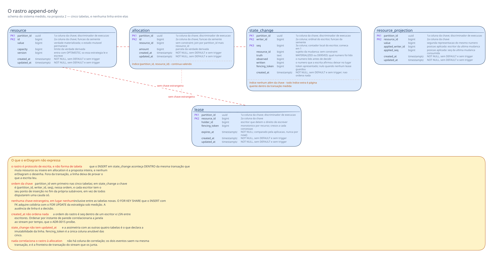

# Proposta 2 — O rastro append-only, e o schema paga

**A aposta:** toda escrita medida grava, na mesma transação que muta a linha de
domínio, uma linha nova e nunca atualizada num rastro append-only do próprio schema
`sut`, com o número lido e o número gravado — e o WAL passa a carregar fatos
autodescritos em vez de um `UPDATE` que só mostra o que sobreviveu. Ela otimiza o que
nenhuma leitura de estado final alcança: a violação transitória, a atribuição da perda
ao par de tentativas que a produziu, e o tempo de convergência.

Isto é **proposta**, e não decisão: o dono da forma vigente continua sendo
[`schemas/sut.md`](../../../sut.md#o-schema-do-sistema-medido-sut).

## O problema que este modelo resolve

O oráculo não consulta este schema. Ele lê o WAL por replicação lógica, pelo
[ADR-0010](../../../../../adr/0010-a-fronteira-de-schema-e-o-cdc-como-fonte-do-veredito.md#decisão),
e o que ele calcula depende do que cada evento carrega. Um `UPDATE` sobre uma linha
mutável carrega a tupla nova, nunca o número que a transação **leu**. Daí a atualização
perdida só existir como escalar agregado, `lost_operations = commits − (final_value −
initial_value)`
([ADR-0002](../../../../../adr/0002-o-dominio-minimo-e-os-dois-oraculos.md#o-oráculo-exato)),
e nunca como o par de tentativas que colidiu.

Dois custos disso já estão escritos e aceitos, nas
[negativas do ADR-0002](../../../../../adr/0002-o-dominio-minimo-e-os-dois-oraculos.md#negativas):
"uma violação que exista durante a execução e desapareça antes do fim é invisível para
os dois oráculos", e `commits` é "a única entrada do veredito que não vem do banco".

O rastro ataca os dois pelo mesmo mecanismo. Cada escrita commitada vira um `INSERT`
próprio, com o valor lido e o valor gravado, e a sequência dessas linhas ordenada por
LSN **é** a trajetória do estado. A perda deixa de ser diferença de dois escalares e
passa a ser um par vizinho em que `observed` não é o `written` do antecessor. A
contagem das linhas do rastro é uma segunda medida de `commits`, produzida pelas
escritas reais e não pelo instrumento — proveniência que o
[ADR-0013](../../../../../adr/0013-a-proveniencia-da-fonte-como-criterio-da-proibicao-do-oraculo.md#decisão)
admite, e o segundo testemunho que a
[detecção de divergência](../../../../../features/deteccao-de-divergencia-entre-fontes/feature-card.md#problema-e-resultado-esperado)
procura por outro caminho.

## O modelo

## O que o diagrama não expressa

- **O rastro é protocolo de escrita, e não forma de tabela.** Que o `INSERT` em
  `state_change` aconteça **dentro** da mesma transação que muta `resource` ou insere
  em `allocation` é a proposta inteira, e nenhum `erDiagram` o desenha. Fora da
  transação, a linha deixa de provar o que a escrita leu.
- **Ordem das colunas da chave composta.** `partition_id` vem primeiro nas cinco
  tabelas, como já vem nas duas vigentes; em `state_change` a chave é
  `(partition_id, writer_id, seq)`, nessa ordem, e cada escritor tem o seu ponto de
  inserção no fim da própria subárvore, em vez de todos disputarem uma cauda só.
- **Nenhuma chave estrangeira, em lugar nenhum, inclusive entre as tabelas novas.**
  `state_change.resource_id`, `resource_projection.resource_id` e `lease.resource_id`
  repetem a ausência que o
  [ADR-0015](../../../../../adr/0015-a-chave-o-discriminador-de-execucao-e-as-colunas-de-tempo.md#sem-chave-estrangeira-em-allocationresource_id)
  fixou para `allocation.resource_id`, e pelo mesmo motivo: o `FOR KEY SHARE` que o
  `INSERT` com FK adquire colidiria com o `FOR UPDATE` da estratégia sob medição. Não
  há linha entre entidades no diagrama, e a ausência de linha é a decisão.
- **Índices.** Um índice aditivo `(partition_id, resource_id)` em `allocation`
  continua valendo. `state_change` **não** ganha índice nenhum além da chave: ninguém
  consulta o rastro dentro da janela medida, e todo índice extra é página quente a
  mais dentro da transação que o experimento mede. `resource_projection` e `lease` são
  alcançadas só pela chave.
- **Ausência de `DEFAULT` e de trigger.** Nenhuma coluna de tempo tem `DEFAULT
  now()`, e nenhuma tabela tem trigger. Vale também para `state_change.created_at` e
  para `lease.expires_at`: o valor vem da aplicação, pelo adaptador de relógio, como o
  [ADR-0015](../../../../../adr/0015-a-chave-o-discriminador-de-execucao-e-as-colunas-de-tempo.md#as-colunas-de-tempo-e-a-fonte-do-relógio-por-papel-do-valor)
  exige. A escrita que esquecer a coluna falha alto.
- **`created_at` não ordena nada.** A ordem do rastro é `seq` dentro de um escritor e
  LSN entre escritores. Ordenar por instante de parede correlacionaria a janela ao
  stream por tempo, que o
  [ADR-0015](../../../../../adr/0015-a-chave-o-discriminador-de-execucao-e-as-colunas-de-tempo.md#a-janela-medida-não-se-correlaciona-ao-stream-por-tempo)
  proíbe.
- **`state_change` não tem `updated_at`**, e a assimetria com as outras quatro tabelas
  é o que declara a imutabilidade da linha.
- **`truth` é `text` sem `CHECK` e sem tipo enum**, e `fencing_token` é a única coluna
  anulável das cinco tabelas.
- **Nada liga a linha do rastro à `allocation` que a mesma tentativa criou.** Não há
  coluna de correlação; os dois eventos saem na mesma transação, e é a fronteira de
  transação do stream que os junta.

## Decisões assumidas

| O que assumi                                                         | Alternativa que ficou de fora                                                      | O que muda se a pessoa decidir o contrário                                                                                                                                                                                                                                  |
|----------------------------------------------------------------------|------------------------------------------------------------------------------------|-----------------------------------------------------------------------------------------------------------------------------------------------------------------------------------------------------------------------------------------------------------------------------|
| o rastro grava na mesma transação da mutação                         | rastro assíncrono, escrito depois do commit                                        | o rastro deixa de provar o que a transação leu e vira observação do instrumento com outro nome; a proibição de proveniência do ADR-0013 volta a alcançá-lo, e a proposta perde o objeto                                                                                     |
| a fonte do valor lido é o rastro                                     | `REPLICA IDENTITY FULL`, que põe a tupla antiga inteira no WAL sem tocar no schema | a tupla antiga é o que estava commitado no instante da escrita, e não o que a transação leu: sob `READ COMMITTED` o `UPDATE` da perdedora reescreve a linha já avançada, e o antes-imagem grava 6 → 6                                                                       |
| uma linha por escrita **commitada**                                  | registrar também a tentativa recusada e a abortada                                 | uma transação de leitura pura passa a escrever; sob `SERIALIZABLE` ela vira participante do conflito, e o E5 mede o rastro em vez da anomalia                                                                                                                               |
| chave `(partition_id, writer_id, seq)`                               | `id` `bigint` função da semente, como em `resource` e `allocation`                 | o número de linhas do rastro depende do retry, e um ordinal fechado na semeadura colide na primeira repetição                                                                                                                                                               |
| `seq` é contador local do escritor, atribuído pela aplicação         | `bigserial`, `nextval` ou `IDENTITY`                                               | a identidade volta ao banco, contra a [regra do ADR-0002](../../../../../adr/0002-o-dominio-minimo-e-os-dois-oraculos.md#a-identidade-das-entidades-é-atribuída-pela-aplicação), e a reexecução deixa de ser comparável                                                           |
| `writer_id` chega pela borda, como o `partition_id`                  | derivar o escritor da sessão ou do `backend_pid` do PostgreSQL                     | o valor deixa de ser função da semente, e duas execuções da mesma semente produzem rastros com identidades diferentes                                                                                                                                                       |
| uma tabela só para as duas verdades, com `truth` discriminando       | um rastro por operação, `increment_log` e `allocate_log`                           | o oráculo passa a juntar dois streams para reconstruir uma trajetória só, e a soma do predicado ganha uma dependência de ordem entre tabelas                                                                                                                                |
| `truth` nomeia a **verdade lida**, e não a operação                  | uma coluna com o nome da operação                                                  | duas operações que leiam a mesma verdade deixam de ser distinguíveis no rastro; com a coluna, o schema medido passa a nomear o catálogo de operações do experimento                                                                                                         |
| `truth` é `text`, sem `CHECK` e sem tipo enum                        | tipo enum nativo, ou `CHECK` com a lista de valores                                | o valor chega ao oráculo como string de qualquer modo, e o enum acrescenta objeto de schema que toda operação nova obriga a migrar                                                                                                                                          |
| `version` entra em `resource`                                        | manter o esquema sem ela até o commit da estratégia                                | quem a introduz é o ADR de estratégias de concorrência, que o [ADR-0002](../../../../../adr/0002-o-dominio-minimo-e-os-dois-oraculos.md#decisão) delega e o [ADR-0006](../../../../../adr/0006-a-forma-da-estrategia-de-concorrencia.md#decisão) cumpre; sem `OPTIMISTIC`, a coluna sai |
| `resource_projection` entra no `sut` como segunda representação      | a projeção viver fora do banco, em cache, ou não existir                           | sem ela o grupo C não tem do que divergir, e a leitura defasada volta a não ter onde acontecer; uma tecnologia nova exigiria a dispensa que a regra de tecnologia cobra                                                                                                     |
| a projeção carrega a posição aplicada, e não ganha rastro próprio    | um rastro de aplicações da projeção                                                | o `UPDATE` da projeção já é autodescrito, porque carrega a posição nova; com rastro próprio, o custo dobra sem informação nova                                                                                                                                              |
| `lease` e `fencing_token` entram no schema medido                    | o grupo E ficar fora do modelo de dados                                            | sem o token no rastro, a escrita feita com direito expirado é indistinguível da legítima; com eles, o schema medido carrega duas tabelas que quatro dos cinco grupos não usam                                                                                               |
| `expires_at` é comparado pela aplicação                              | `WHERE now() < expires_at` no SQL                                                  | o relógio do servidor entra no veredito de posse, e o grupo E deixa de ser controlável pelo relógio injetável                                                                                                                                                               |
| o rastro não aponta para a `allocation` da mesma tentativa           | uma coluna de correlação em `state_change`                                         | a correlação passa a depender de o transporte preservar a fronteira de transação; com a coluna, o schema paga uma referência a mais e a órfã ganha um segundo lugar onde acontecer                                                                                          |
| o rastro não registra leitura que não vira escrita                   | gravar também a leitura pura                                                       | a leitura defasada isolada continua invisível; gravá-la transformaria toda leitura em escrita, que é o custo recusado duas linhas acima                                                                                                                                     |
| `observed` e `written` são `bigint`, como as três colunas já fixadas | um tipo próprio para o rastro                                                      | as duas colunas carregam os mesmos números de `value` e de `Σ amount`, `bigint` nas três por decisão vigente ([`sut.md`](../../../sut.md#o-que-o-diagrama-do-sut-não-desenha)); um tipo diferente obrigaria a conversão dentro do oráculo              |

## Trade-offs

O custo central não é espaço em disco: é que o rastro entra na transação que o
experimento está medindo. Ele alonga a janela entre a leitura e o commit, e alonga
para mais anomalia, não para menos — o número absoluto de perdas de uma execução
deixa de ser comparável ao de um laboratório sem rastro.

| Benefício aceito                                                                     | Em troca do custo                                                                                                        |
|--------------------------------------------------------------------------------------|--------------------------------------------------------------------------------------------------------------------------|
| a perda passa a ser atribuída ao par de tentativas que a produziu                    | toda escrita medida paga um `INSERT` a mais dentro da janela que o experimento mede                                      |
| a trajetória do estado fica reconstruível, e a violação transitória deixa de sumir   | o schema medido deixa de ser o que um engenheiro ingênuo escreveria, e a regra pedagógica fica mais difícil de sustentar |
| `commits` ganha uma segunda medida, vinda das escritas reais                         | o WAL de cada tentativa dobra de eventos, e o transporte de CDC fica mais perto da saturação que o grupo D estuda        |
| o grupo C ganha as duas representações e a posição aplicada entre elas               | duas tabelas do schema medido não participam de nenhum experimento dos grupos A e B                                      |
| o grupo E ganha detecção de escrita com token vencido, direto do stream              | `fencing_token` é a única coluna anulável, e todo evento de `state_change` a carrega vazia fora do grupo E               |
| nenhuma chave estrangeira nova, e nenhum lock que a estratégia sob medição não tenha | a órfã ganha três lugares novos onde acontecer, e nenhum deles tem verificação decidida                                  |

## O que esta proposta NÃO decide

- Se o oráculo **PODE substituir** a contagem de `commits` do instrumento pela
  contagem do rastro. Ela propõe a segunda medida, e a calibração do
  [ADR-0002](../../../../../adr/0002-o-dominio-minimo-e-os-dois-oraculos.md#a-calibração-do-denominador)
  continua exigindo os dois números iguais.
- O formato do veredito que a trajetória habilita. Tempo de convergência não é
  contagem, booleano nem taxa, e a composição segue
  [aberta](../../../../../adr/0002-o-dominio-minimo-e-os-dois-oraculos.md#o-que-este-adr-não-decide).
- A retenção do rastro entre execuções, e quem apaga as linhas de uma execução
  antiga.
- Onde a linha órfã é verificada — a pergunta continua aberta no
  [ADR-0015](../../../../../adr/0015-a-chave-o-discriminador-de-execucao-e-as-colunas-de-tempo.md#sem-chave-estrangeira-em-allocationresource_id),
  e esta proposta a multiplica sem respondê-la.
- O que o endpoint de confirmação relata do rastro, se relatar
  ([card](../../../../../features/deteccao-de-divergencia-entre-fontes/feature-card.md#escopo)).
- Quem escreve `resource_projection`, e por qual transporte ela recebe as mudanças.
- O nível de isolamento de cada braço, e a estratégia que serve de calibração.

## Perguntas que ela levanta

- **O transporte preserva a fronteira de transação do WAL até o oráculo?** A
  correlação entre a linha do rastro e a `allocation` da mesma tentativa depende
  disso, e o agrupamento por transação atravessa conector e broker antes de chegar ao
  consumidor. Não é fato que eu consiga confirmar na árvore.
- **O que um evento de `UPDATE` do `pgoutput` carrega sob `REPLICA IDENTITY
  DEFAULT`?** A proposta parte de que ele carrega a tupla nova e a chave antiga, e
  nada além. Se alguma versão do PostgreSQL usada aqui carregar mais, parte do
  argumento contra a alternativa acima enfraquece.
- **Um `INSERT` em índice que ninguém varre acrescenta conflito de leitura-escrita ao
  footprint de uma transação `SERIALIZABLE`?** Se acrescentar, o rastro muda a taxa de
  aborto `40001` do braço `SERIALIZABLE` do E5, e o número medido passa a incluir o
  instrumento.
- **A ordem dos eventos dentro de uma transação, no stream, é a ordem física das
  escritas?** O oráculo precisa saber se a linha do rastro chega antes ou depois do
  `UPDATE` que ela descreve para reconstruir a trajetória sem ambiguidade.
