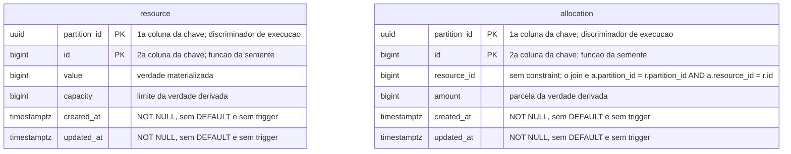

# O schema do sistema medido, `sut`

Um dos dois arquivos de [`schemas/`](README.md). A fronteira entre este schema e o do
instrumento é do
[`README.md`](README.md#a-ausência-de-linha-entre-os-dois-diagramas-é-a-decisão) da pasta,
e o porquê de a forma viver aqui, e não dentro do ADR-0015, também
([`README.md`](README.md#por-que-a-forma-vive-aqui-e-não-dentro-do-adr-0015)).

### O que o diagrama do `sut` não desenha

**O `erDiagram` acima anota, por comentário de coluna, tudo que ele não tem sintaxe
própria para desenhar: ausência de FK, o join composto que a substitui, ordem da chave
composta, ausência de `DEFAULT` e de trigger, e origem do valor da identidade.** O tipo
de `value`, `capacity` e `amount` **não** entra nessa lista — o `erDiagram` já o declara
nativamente, `bigint` nas três. A última linha da tabela deixou de ser `Pergunta em
aberto` em 2026-08-13: as três colunas são `bigint`, um tipo só, decidido em
[`E-56`, fecho](../../fila-de-decisoes.md#e-56-fecha-em-bigint-nas-três-escolhida-em-2026-08-13).
Só o **índice aditivo** sobre `allocation` fica de fora até do comentário: `erDiagram`
não expressa índice, e nada acima o substitui. A tabela sustenta cada linha com
evidência, o que um comentário sozinho não carrega.

| O que o diagrama anota (ou não)                  | O que foi decidido                                                                                                                                                                                                                                                                                                                                                                                              | Evidência                                                                                                                                                                                                  |
|--------------------------------------------------|-----------------------------------------------------------------------------------------------------------------------------------------------------------------------------------------------------------------------------------------------------------------------------------------------------------------------------------------------------------------------------------------------------------------|------------------------------------------------------------------------------------------------------------------------------------------------------------------------------------------------------------|
| `"sem constraint"` e o join, em `resource_id`    | ausência de FK, e o **join composto** que a substitui: `a.partition_id = r.partition_id AND a.resource_id = r.id`. Sem as duas colunas, a consulta cruza execuções, que é o que o discriminador existe para impedir. Onde a órfã é verificada segue em aberto, e o porquê da ausência é do [ADR-0015, Justificativa](../../adr/0015-a-chave-o-discriminador-de-execucao-e-as-colunas-de-tempo.md#justificativa) | [`E-9`](../../fila-de-decisoes.md#e-9-fecha-a-escolha-e-abre-uma-pendência-que-e-18-criou)                                                                                                                 |
| `"1a"`/`"2a coluna da chave"`                    | o discriminador vem **primeiro**, `(partition_id, id)`; ele é um UUIDv7, e o prefixo de instante põe toda inserção no fim da B-tree                                                                                                                                                                                                                                                                             | [`E-22`](../../fila-de-decisoes.md#e-22-fecha-em-execution_id-id-e-a-linha-foi-decidida-duas-vezes) e [`E-23`, fecho](../../fila-de-decisoes.md#e-23-fecha-em-nomes-assimétricos-um-por-lado-da-fronteira) |
| nada — a única ausência real                     | o índice aditivo `(partition_id, resource_id)` sobre `allocation`. O porquê publicá-lo é do [ADR-0015, Sem chave estrangeira](../../adr/0015-a-chave-o-discriminador-de-execucao-e-as-colunas-de-tempo.md#sem-chave-estrangeira-em-allocationresource_id)                                                                                                                                                       | [`E-10`, fecho](../../fila-de-decisoes.md#a-primeira-rodada-do-grupo-ii-em-2026-08-06) e [`E-23`, fecho](../../fila-de-decisoes.md#e-23-fecha-em-nomes-assimétricos-um-por-lado-da-fronteira)              |
| `"NOT NULL, sem DEFAULT e sem trigger"`          | `timestamptz NOT NULL`, preenchida pela aplicação com o adaptador de relógio; a escrita que esquecer a coluna falha alto                                                                                                                                                                                                                                                                                        | [`E-27`](../../fila-de-decisoes.md#e-27-fecha-na-aplicação-e-o-ddl-das-duas-tabelas-medidas-deixa-de-ter-lacuna)                                                                                           |
| `"funcao da semente"`                            | o tipo é `bigint` e o valor é **derivado da semente**, e não gerado pelo banco; `allocation.resource_id` repete o tipo porque aponta para `resource.id`                                                                                                                                                                                                                                                         | [`E-8`, fecho](../../fila-de-decisoes.md#a-primeira-rodada-do-grupo-ii-em-2026-08-06)                                                                                                                      |
| `bigint` nativo em `value`, `capacity`, `amount` | as três colunas são `bigint`, um tipo só nas três; o argumento pela escolha e as alternativas descartadas vivem só na linha da fila, ao lado                                                                                                                                                                                                                                                                    | [`E-56`, fecho](../../fila-de-decisoes.md#e-56-fecha-em-bigint-nas-três-escolhida-em-2026-08-13)                                                                                                           |

**`resource.value`, `resource.capacity` e `allocation.amount` são `bigint`, um tipo só
nas três — decisão da pessoa em 2026-08-13.** A escolha fixa `allocation.amount` como
sempre inteiro: o fracionário não é fenômeno distribuído, e passa a exigir decisão nova
quando um experimento o exigir. O argumento pela escolha e as alternativas descartadas,
com o motivo de cada uma, vivem só na fila, em
[`E-56`, fecho](../../fila-de-decisoes.md#e-56-fecha-em-bigint-nas-três-escolhida-em-2026-08-13);
este arquivo não os repete.

**Nenhuma migração cria as duas tabelas hoje.** A `V1` do sistema medido cria só o schema,
e forma decidida não é implementação.
