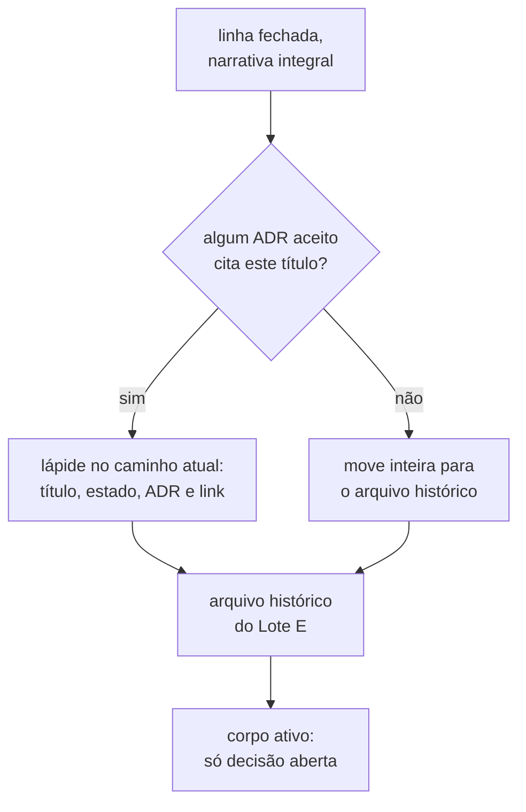

# Auditoria de coerência e limites documentais

**Data do recorte:** 2026-08-06
**Última verificação:** 2026-08-07
**Escopo:** árvore de trabalho atual, incluindo a documentação ainda não consolidada
dos ADRs 0010 a 0012. Corpo de ADR aceito e conteúdo em `docs/adr/arquivo/` não são
erro por preservarem o passado, e não se alteram.

## Resultado executivo

A auditoria levantou catorze achados. **Doze foram fechados**, e o texto deles saiu
desta página em 2026-08-07: o que eles corrigiram está nos documentos corrigidos, e
repetir aqui a ordem já cumprida faria esta página envelhecer contra a árvore — o mesmo
defeito que a auditoria apontou nos outros documentos.

**Dois continuam abertos, e são os únicos abaixo.**

O `A-08` fechou **por decisão diferente da que esta auditoria ordenava**: ela mandava
remover do conjunto ativo os quatro `behavior.feature` sem regra aprovada, e a pessoa
decidiu marcá-los como inativos por cabeçalho no próprio arquivo. A ordem original não
vale, e por isso não está mais escrita aqui.

O diagnóstico que originou os catorze vale para os dois que ficam: informação mutável
copiada para documentos com papéis diferentes, quando cada fato precisa de um único
dono e os demais, de um resumo estável com link.

## A-09 — CONTEXT.md é glossário, proposta, decisão e backlog ao mesmo tempo

**Estado em 2026-08-07:** parcialmente resolvido.
**Classificação:** conteúdo no documento errado, alta.

A seção `## Os contextos propostos` já saiu do arquivo. Quatro continuam nele sem ser
vocabulário, contra o que o processo define em
[glossário de domínio](../specification-process.md#glossário-de-domínio--contextmd):

| Seção                                                                                               | Natureza        | Dono correto                                                                            |
|-----------------------------------------------------------------------------------------------------|-----------------|-----------------------------------------------------------------------------------------|
| [termos ambíguos](../CONTEXT.md#termos-ambíguos-e-a-desambiguação-proposta)                         | proposta        | [fila](../adr/fila-de-decisoes.md#o-que-esta-fila-enfileira)                            |
| [seis decisões de vocabulário](../CONTEXT.md#as-seis-decisões-de-vocabulário)                       | decisão fechada | ADR de vocabulário, ou a linha da fila que a fechou                                     |
| [perguntas em aberto](../CONTEXT.md#perguntas-em-aberto)                                            | pendência       | [`docs/questions/`](../questions/README.md#índice)                                      |
| [dois rótulos do instrumento](../CONTEXT.md#os-dois-rótulos-do-instrumento-decididos-em-2026-08-05) | decisão datada  | ADR de vocabulário                                                                      |
| [a sigla `SUT` no código](../CONTEXT.md#a-sigla-sut-no-código-decidida-em-2026-08-05)               | decisão datada  | [fila#a5](../adr/fila-de-decisoes.md#a5--a-sigla-sut-no-código-decidida-em-2026-08-05)  |

**A medição desqualifica a explicação benigna.** São 35.633 caracteres de prosa contra
um teto genérico de 4.000. "Glossário cresce com o vocabulário" não explica o número,
porque o excesso não é vocabulário — uma isenção declarada hoje congelaria o defeito em
vez de reconhecer a natureza do artefato.

**Estado em 2026-08-08: a migração não resolve o tamanho, e isto é medição, não
estimativa.** As seções da tabela acima somam 5.863 caracteres de prosa, num arquivo de
34.602 na mesma contagem. Migrá-las deixa cerca de 28.700 contra o teto genérico de
4.000, porque `## Linguagem` sozinha carrega 24.750 — e ela **é** vocabulário vigente. A
correção abaixo continua certa pela natureza do artefato, e **não** é solução de
tamanho: o glossário precisará de teto próprio ou de isenção de qualquer maneira, o que
o torna dependente da linha do
[orçamento de prosa](../adr/fila-de-decisoes.md#o-orçamento-de-prosa-quem-é-dono-do-teto-e-o-que-ele-alcança).

**A contagem deste achado diverge da tabela dele.** A frase de abertura diz que quatro
seções continuam no arquivo, e a tabela lista cinco. Qual das duas está certa não foi
apurado, e a divergência fica registrada em vez de desaparecer numa correção silenciosa.

**Correção one-shot:** manter apenas termo, definição breve, status ou sinônimo e link
de origem; mover alternativa e justificativa para a fila ou ADR, e pergunta para
`docs/questions/`. Medir o arquivo **depois** da migração, e só então decidir se
glossário precisa de limite próprio.

## A-11 — A fila ativa contém narrativa integral de decisões fechadas

**Estado em 2026-08-07:** aberto. As lápides existem; as narrativas nunca migraram.
**Classificação:** redundância estrutural e violação de processo, alta.

[A saída, decidida em 2026-08-06](../adr/fila-de-decisoes.md#a-saída-decidida-em-2026-08-06)
determina que a linha deixa a fila quando nasce o ADR. As rodadas que geraram os ADRs
0010 a 0012 seguem no corpo ativo com narrativa completa: 119.084 caracteres de prosa
em cinquenta títulos. Dezesseis lápides já existem, e nenhuma aponta para um arquivo
histórico, porque ele ainda não foi criado.

Títulos da fila citados por ADR aceito impedem apagar o conteúdo. Um ADR aceito só muda
pelas formas do
[lifecycle](../adr/README.md#a-emenda-e-o-adendo-decididos-em-2026-08-05) e da
[revogação da imutabilidade](../adr/README.md#a-revogação-da-imutabilidade-decidida-em-2026-08-07).



**Estado em 2026-08-08: a poda é por linha, e não por rodada.** A consulta reversa
decidida na
[linha da apuração](../adr/fila-de-decisoes.md#o-que-apura-a-âncora-citada-antes-de-uma-redução)
responde por título, e mediu esta divisão nos três níveis de heading que a fila usa:

| Situação da seção                       | Seções | Prosa  |
|-----------------------------------------|--------|--------|
| citada de fora, exige lápide            | 34     | 33.286 |
| sem citação alguma                      | 70     | 71.488 |
| só âncora interna, quebra em silêncio   | 7      | 14.202 |

**A segunda linha não é movível em bloco, e a razão é o aninhamento.** Uma narrativa de
rodada, em nível 3, não é citada por ninguém, enquanto as linhas `E-NN` que ela contém,
em nível 4, são citadas por ADR aceito — `E-11`, `E-12`, `E-13`, `E-18`, `E-24` e `E-32`
estão nesse caso. Mover a rodada inteira levaria junto o heading que o ADR alcança.

Um levantamento que agregue o nível 4 no pai mede errado, e mediu: a primeira apuração
desta data contou 32 seções e 61.530 caracteres como movíveis, e refazê-la com a
granularidade correta desmontou o número. Fica registrado porque o erro é reincidente —
é o mesmo de 2026-08-06, quando uma apuração correta envelheceu em horas.

Isso reconduz a correção ao que o processo já exige: a poda acontece **uma linha por
vez**, pela regra de [`AGENTS.md`](../../AGENTS.md#pendências-de-processo), e nunca por
lote de rodada.

**Correção one-shot:** levantar todos os títulos da fila citados por ADR aceito; mover a
narrativa fechada para um arquivo histórico do Lote E; deixar no caminho atual uma
lápide com título, estado, ADR e link, preservando a âncora e a evidência que o ADR
alcança. No corpo ativo, só decisão aberta.

## Critérios de aceite

Restam os dois que alcançam os achados acima; os demais saíram junto com os achados que
os originaram.

- CONTEXT contém somente vocabulário vigente.
- A fila ativa contém pendência e lápide, e nenhuma narrativa de rodada fechada.

Depois de cada correção, conferir âncoras e medir os artefatos alcançados:

```
python scripts/check_citations.py --root . --baseline scripts/citations-baseline.txt
python .claude/skills/feature-planning/scripts/check_artifact_limits.py --root . --file <alvo>
```
