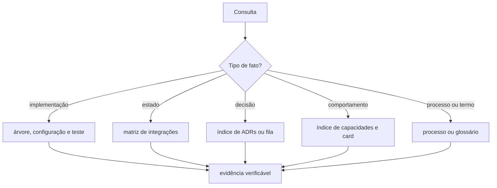

# Auditoria e plano de navegação documental para agentes

**Data do recorte:** 2026-08-07
**Escopo:** documentação, instruções de agentes, skills, validações e rotas para
evidência na árvore. Este plano não decide arquitetura do laboratório nem altera as
auditorias A-09 e A-11.

## Resultado

Cinco missões de leitura cobriram documentos, instruções, automação, árvore e desenho.
O ambiente permitiu quatro threads filhas; a quinta missão ocorreu como continuação de
um agente concluído. Um Advogado do Diabo confrontou a proposta em duas réplicas. A
terceira não foi necessária, pois todas as críticas verificadas foram aceitas.

A recomendação é separar **instrução global** de **descoberta documental**. O
`AGENTS.md` continua com guardrails e dispatch obrigatório. O `docs/README.md` passa a
ser o único roteador de consultas documentais. Ele contém somente intenção, documento
dono e âncora. Ele não contém estado, inventário, racional ou afirmação de implementação.

## Precedência de consulta

| Pergunta do agente | Fonte dona | Limite da inferência |
|---|---|---|
| O que existe e executa? | árvore, configuração e testes | Configuração prova presença, não funcionamento universal. |
| Qual é o estado de uma fronteira? | [matriz](../architecture/integrations.md#matriz) | Abrir a evidência primária citada antes de concluir. |
| Qual decisão vale? | [ADR aceito](../adr/README.md#índice) | Plano e auditoria não substituem decisão aceita. |
| O que ainda precisa de decisão? | [fila única](../adr/fila-de-decisoes.md#o-que-esta-fila-enfileira) | Não fechar a lacuna por inferência. |
| Que comportamento foi especificado? | [Feature Card](../features/README.md#índice) | Regra pendente não é comportamento aprovado. |
| Qual processo ou aprovação vale? | [processo](../specification-process.md#a-decisão-vem-antes-do-artefato) | Skill não altera o lifecycle. |
| Qual termo usar? | [glossário](../CONTEXT.md#linguagem) | Termo em disputa não é vocabulário vigente. |
| Onde está uma questão? | índice conforme o tipo | `Q-*`, `Q-INT-*`, ADR proposto e Example Mapping não têm o mesmo dono. |

A matriz já é dona do estado das fronteiras, e a árvore é a prova do que existe. O
roteador deve preservar essa divisão, definida em
[Integrações](../architecture/integrations.md#integrações) e em
[Árvore](../../AGENTS.md#árvore).

## Estrutura alvo

| Alvo | Papel depois da reestruturação | Ação planejada |
|---|---|---|
| `AGENTS.md` | Bootstrap global | Manter guardrails, evidência e gatilhos de skills; remover roteamento documental repetido. |
| `docs/README.md` | Roteador documental | Substituir ordem obrigatória e mapas concorrentes por intenção, dono e âncora. |
| `README.md` | Onboarding humano | Apontar ao roteador documental; não manter tabela concorrente. |
| `docs/AGENTS.md` | Delta de edição de `docs/` | Manter regras locais acionáveis e links aos documentos donos. |
| `CLAUDE.md` | Ponte de compatibilidade | Permanecer ponte para `AGENTS.md`; não virar fonte normativa. |
| Skills | Procedimento sob demanda | Corrigir o loop ADR que aponta para seção inexistente de `CLAUDE.md`; não alterar o link válido ao processo. |
| Descoberta de skills | Metadado derivado | Não criar catálogo manual; a forma de derivação continua em aberto. |

O planejamento continua obrigatório para mudança de comportamento, conforme
[AGENTS.md](../../AGENTS.md#como-o-planejamento-funciona-aqui). A correção do loop de
escritor e revisor é pontual: a fonte atual é
[AGENTS.md](../../AGENTS.md#redação-e-revisão-independente-de-adr), não `CLAUDE.md`.

## Plano de reestruturação

1. **Decidir contratos pendentes.** A pessoa define a forma reprodutível de descoberta
   de skills e a fonte, unidade, escopo e exceções do orçamento de instruções.
2. **Inventariar compatibilidade.** Gerar a lista reversa de referências de documentos,
   skills, agentes e arquivo. A pessoa aprova os headings que precisam de lápide.
3. **Trocar o roteamento em um commit.** Criar o roteador em `docs/README.md` e, no
   mesmo commit, reduzir os mapas em `README.md` e `AGENTS.md`. O último preserva
   instruções globais.
4. **Corrigir e enxugar instruções.** Corrigir o loop ADR. Reduzir arquivos somente
   depois do inventário e das decisões de orçamento.
5. **Automatizar o contrato aprovado.** O workflow `docs` valida links, aliases e
   orçamentos apenas com verificações determinísticas. O Graphify permanece auxiliar
   local, fora da precedência e fora do CI.

## Dependências e critérios de aceite

As migrações do glossário e da fila não são tarefas mecânicas deste plano. Elas seguem
seus próprios planos, pois A-09 ainda separa conteúdo por dono e A-11 exige lápides para
preservar evidência histórica:
[A-09](2026-08-06-coerencia-e-limites-documentais.md#a-09--contextmd-é-glossário-proposta-decisão-e-backlog-ao-mesmo-tempo) e
[A-11](2026-08-06-coerencia-e-limites-documentais.md#a-11--a-fila-ativa-contém-narrativa-integral-de-decisões-fechadas).

- Uma consulta documental alcança o documento dono em, no máximo, dois saltos.
- O roteador não duplica estado, decisão, comportamento, contagem ou racional.
- `AGENTS.md` preserva as instruções globais e as âncoras aprovadas.
- Toda validação nova é determinística, tem teste e não interpreta semântica.
- O workflow não usa o Graphify como gate.

## Perguntas em aberto

1. A descoberta de skills será saída versionada derivada do front matter ou recurso
   efêmero do ambiente?
2. Qual arquivo será fonte canônica dos orçamentos, e quais instruções ele alcança?
3. Quais headings citados precisam de lápide antes de qualquer redução?
4. Qual rito reconcilia uma divergência entre a matriz e a árvore antes da correção?
