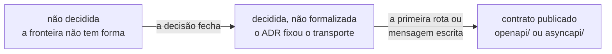
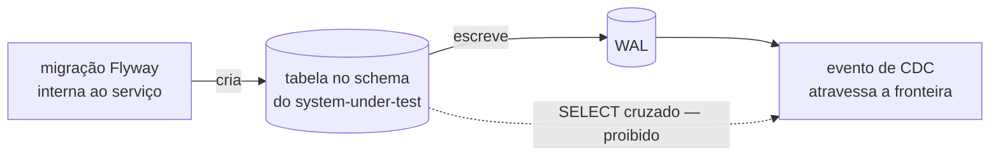

# Contratos

O que atravessa uma fronteira de processo, formalizado como esquema.

## Estado: nenhum contrato existe

Não há `openapi/` nem `asyncapi/` neste diretório, e a ausência é deliberada. Nenhum
contrato formal existe hoje, e essa afirmação continua verdadeira depois dos ADRs 0010 a
0012. **O que mudou foram os motivos.**

Um contrato é criado **quando a interface existir**. "Não existir" cobre três situações
distintas, e tratá-las como uma só adia contrato por razão falsa — foi exatamente o que
aconteceu quando esta página disse que o AsyncAPI esperava a etapa 5.

| Estado da interface           | O que significa                                                                                   |
|-------------------------------|---------------------------------------------------------------------------------------------------|
| **não decidida**              | a forma da fronteira ainda é escolha em aberto; formalizar agora congelaria uma resposta não dada |
| **decidida, não formalizada** | um ADR fixou quem fala com quem e por qual transporte; falta a interface existir e ser descrita   |
| **inexistente**               | não há fronteira de processo alguma para descrever                                                |

Uma interface percorre os dois primeiros estados antes de chegar ao contrato, e o gatilho
que a move é diferente em cada um: no primeiro é uma **decisão**, no segundo é a
**primeira rota ou mensagem escrita**.

| Contrato                                            | Estado                    | Por que não existe                                                                                                                                                                                                                                                                                                                 | Gatilho que o cria                    |
|-----------------------------------------------------|---------------------------|------------------------------------------------------------------------------------------------------------------------------------------------------------------------------------------------------------------------------------------------------------------------------------------------------------------------------------|---------------------------------------|
| OpenAPI — frontend → `lab-plane`                    | decidida, não formalizada | [ADR-0011](../adr/0011-a-topologia-de-servicos-e-o-caderno-de-laboratorio-fora-do-git.md#comando-no-lab-plane-leitura-no-lab-journal-sem-bff) fixou o comando direto, sem BFF; nenhuma operação, payload ou resposta foi decidida, e nenhuma rota existe na árvore                                                                 | a primeira rota HTTP escrita          |
| OpenAPI — frontend → `lab-journal`                  | decidida, não formalizada | mesmo ADR: leitura e streaming saem do `lab-journal`; o transporte do streaming é SSE (`frontend/nginx.conf:18-28`), e nenhum evento foi especificado                                                                                                                                                                              | a primeira rota HTTP escrita          |
| AsyncAPI — Debezium Server → RabbitMQ → `lab-plane` | decidida, não formalizada | [ADR-0012](../adr/0012-o-broker-no-caminho-do-veredito-e-a-dispensa-que-ele-exigiu.md#decisão) pôs o broker no caminho do veredito; exchange, roteamento e o mecanismo que recebe os eventos continuam sem decisão, nas [neutras do mesmo ADR](../adr/0012-o-broker-no-caminho-do-veredito-e-a-dispensa-que-ele-exigiu.md#neutras) | o primeiro evento publicado no broker |
| JSON Schema do relatório de execução                | não decidida              | o relatório atravessa do `lab-journal` para a interface web, e nenhum documento fixa a forma dele                                                                                                                                                                                                                                  | o primeiro relatório emitido          |

**O AsyncAPI deixou de esperar a etapa 5.** O broker está **decidido** desde
[ADR-0012](../adr/0012-o-broker-no-caminho-do-veredito-e-a-dispensa-que-ele-exigiu.md#decisão),
e a regra de que nenhuma tecnologia entra por estar disponível foi **dispensada**, e não
satisfeita — o registro está nas
[consequências negativas do mesmo ADR](../adr/0012-o-broker-no-caminho-do-veredito-e-a-dispensa-que-ele-exigiu.md#negativas).
O que falta não é a decisão: é a interface existir. Duas pendências reais a bloqueiam, e
nenhuma delas é "esperar a etapa 5":

- **Qual mecanismo do RabbitMQ recebe os eventos** — a queue clássica sobre AMQP 0-9-1 ou
  o stream com semântica de offset — continua sem decisão, e o próprio ADR-0012 a registra
  como `Pergunta em aberto` nas
  [consequências neutras](../adr/0012-o-broker-no-caminho-do-veredito-e-a-dispensa-que-ele-exigiu.md#neutras).
  A escolha muda o que um AsyncAPI declararia sobre retenção e ordenação.
- **Onde vive a configuração do Debezium Server** também continua sem decisão, nas
  [consequências negativas](../adr/0012-o-broker-no-caminho-do-veredito-e-a-dispensa-que-ele-exigiu.md#negativas).
  Nem o broker nem o conector existem na árvore hoje.

**O relatório não atravessa para um diretório do Git.** A definição de um experimento e o
resultado dela vivem no banco do `lab-journal`, declarados pela pessoa via frontend, desde
[ADR-0011](../adr/0011-a-topologia-de-servicos-e-o-caderno-de-laboratorio-fora-do-git.md#o-caderno-de-laboratório-sai-do-git).
Nenhum diretório de experimentos é criado no Git, e a migração `V1` do `lab-journal`
já registra isso no próprio banco
(`lab-journal/src/main/resources/db/migration/V1__criar_schema_do_lab_journal.sql`).
A única fronteira que o relatório atravessa é a leitura do frontend.

**Um diretório vazio não é criado antecipadamente.** Uma pasta `openapi/` sem conteúdo
afirma que existem APIs a documentar, e a afirmação seria falsa. O repositório já pagou
por esse erro uma vez: o esqueleto de `services/` com cinco pastas de nome de dono foi
apagado justamente porque afirmava uma propriedade que não existia
([`../plano-do-laboratorio.md`](../plano-do-laboratorio.md#11-tensões-abertas-neste-próprio-plano)).

## O DDL de um serviço não é contrato

Um contrato formaliza o que atravessa uma fronteira de **processo**, pela regra em
[`../specification-process.md`](../specification-process.md#contratos--só-o-que-existe).
O DDL interno de um serviço não atravessa fronteira nenhuma: desde
[ADR-0010](../adr/0010-a-fronteira-de-schema-e-o-cdc-como-fonte-do-veredito.md#decisão)
nenhum serviço acessa o schema de outro, e o oráculo lê o WAL em vez de fazer `SELECT`. O
que atravessa a fronteira é o **evento de CDC**, e não a tabela — o contrato a formalizar
ali é o AsyncAPI da linha acima.

Por isso o DDL de `resource` e `allocation` **saiu do inventário de contratos**. Ele tem
dois donos, e nenhum deles é este diretório:

- **O modelo de dados** é a decisão do
  [ADR-0002](../adr/0002-o-dominio-minimo-e-os-dois-oraculos.md#decisão), que fixa as duas
  entidades, suas colunas e a ausência de `version`.
- **O esquema executável** são as migrações Flyway de cada serviço. Hoje existe uma por
  serviço, e **nenhuma cria tabela**: `V1__criar_schema_do_lab_plane.sql`,
  `V1__criar_schema_do_lab_journal.sql` e `V1__criar_schema_do_sut.sql`, cada uma em
  `<serviço>/src/main/resources/db/migration/`. Elas criam apenas o schema de cada
  serviço, porque sem nenhuma migração o Flyway não roda. As tabelas `resource` e
  `allocation` dependem das decisões de modelo de dados que ainda não fecharam.

`Q-INT-5` foi escrita sob a premissa de que faltava um contrato de esquema para essas duas
entidades. A premissa não sobrevive à regra acima, e o destino da linha é a matriz de
integrações, não este diretório.

## A rota de proxy não é endpoint publicado

`/api/runs` e `/api/journal` aparecem em `frontend/nginx.conf` e em
`frontend/vite.config.ts`. Os dois são **mapas de roteamento do frontend**, não
interfaces publicadas por um back-end: eles declaram para qual processo um prefixo é
encaminhado, e nada sobre operações, payloads ou respostas. Nenhuma classe da árvore serve
essas rotas hoje — os três executáveis têm apenas a classe de bootstrap.

Um prefixo de proxy **NÃO DEVE** ser tratado como endpoint a documentar. Confundi-los
criaria um OpenAPI que descreve a configuração do nginx, e não a interface do serviço. O
gatilho do OpenAPI continua sendo a primeira rota HTTP escrita no back-end.

## Quando um contrato for criado

**A estrutura.** `contracts/openapi/<nome>.yaml` e `contracts/asyncapi/<nome>.yaml`, um
arquivo por interface.

**O que o contrato carrega, e o Markdown não repete.** Operações, autenticação e
autorização, payloads, respostas, erros, paginação, filtros, idempotência e política de
compatibilidade. O Feature Card faz link; ele não descreve de novo.

**Para eventos, o contrato distingue comando de evento de domínio**, e declara produtor,
consumidores conhecidos, tópico ou queue, chave de particionamento, versão, correlação,
idempotência, ordenação, retry, DLQ e garantia de entrega — **cada um apenas quando
houver evidência ou decisão explícita**. Um campo preenchido por analogia com outro
projeto é invenção.

**Evolução backward-compatible.** Um contrato publicado não muda de forma incompatível
sem que os consumidores sejam identificados e o impacto declarado.

**Exemplos realistas e esquemas validados.** Um contrato que não valida não é contrato.

## O que existe hoje no lugar de contrato

| Fronteira                                   | Onde está descrita                                                                                                                                                                                            | Forma                                                  |
|---------------------------------------------|---------------------------------------------------------------------------------------------------------------------------------------------------------------------------------------------------------------|--------------------------------------------------------|
| comando e leitura entre frontend e serviços | [`0011-a-topologia-de-servicos-e-o-caderno-de-laboratorio-fora-do-git.md`](../adr/0011-a-topologia-de-servicos-e-o-caderno-de-laboratorio-fora-do-git.md#comando-no-lab-plane-leitura-no-lab-journal-sem-bff) | prosa e diagrama, só topologia                         |
| evento de CDC no caminho do veredito        | [`0012-o-broker-no-caminho-do-veredito-e-a-dispensa-que-ele-exigiu.md`](../adr/0012-o-broker-no-caminho-do-veredito-e-a-dispensa-que-ele-exigiu.md#decisão)                                                   | prosa e diagrama                                       |
| conteúdo do relatório de execução           | [`0004-o-estatuto-da-barreira-e-o-diagnostico-da-nao-ocorrencia.md`](../adr/0004-o-estatuto-da-barreira-e-o-diagnostico-da-nao-ocorrencia.md#o-veredito-de-uma-execução-medida-é-uma-taxa)                    | prosa                                                  |
| endereço de fronteira                       | [`0001-o-passo-como-unidade-de-execucao.md`](../adr/0001-o-passo-como-unidade-de-execucao.md#a-fronteira)                                                                                                     | prosa                                                  |
| manifests de entrega                        | ADR 0017 do `homelab-infrastructure`                                                                                                                                                                          | Kustomize, **e o diretório `deploy/` não existe aqui** |

Nenhuma dessas descrições é contrato: são decisões em prosa, e uma delas descreve apenas
quem fala com quem. Elas não substituem o esquema, e o esquema não as repete.

Ver [`../architecture/integrations.md`](../architecture/integrations.md#matriz) para a
visão factual completa das fronteiras, com o estado de cada uma. Ela não é reproduzida
aqui.
