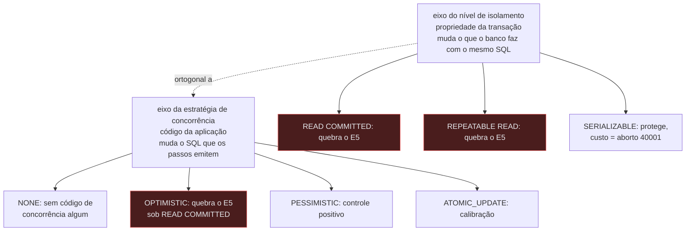

# Comparação entre níveis de isolamento — Example Mapping

Companheiro de [`feature-card.md`](feature-card.md). As regras vêm de uma decisão da
pessoa, sem ADR: comparar os três níveis é comportamento verificável, e não decisão
arquitetural.
Os exemplos concretos vêm do E5, já especificado em
[`deteccao-de-protecao-inerte`](../deteccao-de-protecao-inerte/feature-card.md), com
evidência no [`ADR-0002`](../../adr/0002-o-dominio-minimo-e-os-dois-oraculos.md), no
[`ADR-0006`](../../adr/0006-a-forma-da-estrategia-de-concorrencia.md) e no
[`ADR-0015`](../../adr/0015-a-chave-o-discriminador-de-execucao-e-as-colunas-de-tempo.md),
todos `Aceito`.

## História

> Como pessoa que projeta um experimento de concorrência, quero comparar o mesmo
> experimento sob os três níveis de isolamento do PostgreSQL, para saber quais protegem a
> invariante e a que custo, sem que a plataforma recuse nenhuma combinação de nível e
> estratégia.

## Regras

1. **R1** — Comparar o mesmo experimento sob os três níveis, e dizer quais protegem a
   invariante e a que custo.
2. **R2** — Nenhuma combinação de nível e estratégia é recusada.
3. **R3** — O relatório exibe o par (nível, estratégia) ao lado de cada veredito; um
   rótulo único que colapse os dois eixos não satisfaz a regra.

O que já se sabe sobre cada ponta dos dois eixos que `R1` e `R3` comparam:

## Exemplos concretos

| Regra             | Dado                                                                               | Quando                                                   | Então                                                                                                                                                                                                                                                                                          |
|-------------------|------------------------------------------------------------------------------------|----------------------------------------------------------|------------------------------------------------------------------------------------------------------------------------------------------------------------------------------------------------------------------------------------------------------------------------------------------------|
| R1                | E5: `capacity = 10`, dois workers inserem `amount = 6` cada, com barreiras         | a mesma execução roda sob os três níveis, um de cada vez | o relatório traz três veredictos: `READ COMMITTED` e `REPEATABLE READ` quebram a invariante (`Σ = 12 > 10`), `SERIALIZABLE` a preserva                                                                                                                                                         |
| R1, contraexemplo | E5 com `NONE` — nenhuma estratégia de concorrência no código da aplicação          | a mesma execução roda sob `SERIALIZABLE`                 | a invariante não quebra sob `SERIALIZABLE` — o mesmo fato que o `Exemplo 7.4` de `deteccao-de-protecao-inerte` registra —, e desde o `ADR-0018` o braço conclui `protegido` pela ordem 5: o controle negativo, sob `READ COMMITTED`, viola; o positivo, sob `SERIALIZABLE`, aborta com `40001` |
| R2                | `OPTIMISTIC` sob `READ COMMITTED` — a combinação que quebra sem lançar exceção     | a execução é declarada e roda até o fim                  | a plataforma não recusa a combinação antes de rodar, e o resultado contraintuitivo aparece no relatório                                                                                                                                                                                        |
| R3                | um veredito qualquer produzido pela comparação                                     | o relatório é montado                                    | cada linha mostra o par declarado — por exemplo `(SERIALIZABLE, OPTIMISTIC)` — ao lado do booleano ou do SQLSTATE `40001`                                                                                                                                                                      |
| R3, contraexemplo | um relatório com três níveis e mais de uma estratégia possível                     | alguém lê o relatório                                    | nível e estratégia aparecem em colunas distintas — um rótulo único como `SERIALIZABLE_OPTIMISTIC` violaria `R3`, porque deixaria de exibir o par declarado                                                                                                                                     |
| R3, contraste     | o par `(READ COMMITTED, OPTIMISTIC)` comparado ao par `(SERIALIZABLE, OPTIMISTIC)` | os dois vêm do mesmo relatório                           | o resultado é oposto, e só a exibição separada do par atribui a diferença ao eixo do nível, não ao da estratégia                                                                                                                                                                               |

## Alternativas descartadas antes deste card

> **Hospedar a capacidade em `execucao-de-experimento` foi a recomendação da sessão, e a
> pessoa a descartou em 2026-08-12.** O motivo: a capacidade não é *declarar um nível*, e
> sim *comparar os três e dizer quais protegem e a que custo* — o que tem pergunta de
> oráculo própria. Também foram descartadas: hospedar dentro de
> `deteccao-de-protecao-inerte`, que misturaria o eixo do nível com o oráculo do
> predicado; e escrever um ADR novo, recusado pelo reenquadramento da própria pessoa.

Registrado aqui porque o card cita `execucao-de-experimento` como fronteira e relatório
reusados — sem este registro, a pergunta "por que isto não é parâmetro daquele card"
voltaria sem resposta escrita.

## Perguntas em aberto

| #  | Pergunta                                                                                                                                                                                                                                                                                                                                                                                                                                                                                                                                                                                                                                                                                                                                                                                                                      | Origem                                                                                                                                                                                                                                                 | Status                                                                                           |
|----|-------------------------------------------------------------------------------------------------------------------------------------------------------------------------------------------------------------------------------------------------------------------------------------------------------------------------------------------------------------------------------------------------------------------------------------------------------------------------------------------------------------------------------------------------------------------------------------------------------------------------------------------------------------------------------------------------------------------------------------------------------------------------------------------------------------------------------|--------------------------------------------------------------------------------------------------------------------------------------------------------------------------------------------------------------------------------------------------------|--------------------------------------------------------------------------------------------------|
| P1 | A `R7` de `deteccao-de-protecao-inerte` — aprovada, e nascida da mesma decisão — já descreve a comparação sob os três níveis para o E5. Decidir entre absorver o texto dela neste card novo, ou mantê-la como ponteiro no card antigo, é trabalho da redação. Custo de absorver: apagar ou renumerar `R7` desloca `R8` a `R11` daquele card; `R11` também descreve o braço `SERIALIZABLE`, e a renumeração quebraria a citação por nome que `R15` de `execucao-de-experimento` faz a `R8` — citação em prosa, não em âncora, que o verificador de citações não detecta. Custo de manter como ponteiro: a mesma comparação vive descrita em dois cards, e nada impede que um seja editado sem o outro. Este card não decide: `R7` permanece intocada, e `R1` a `R3` aqui se apoiam na mesma decisão, sem repetir o texto dela. | [`deteccao-de-protecao-inerte`, R7](../deteccao-de-protecao-inerte/feature-card.md#regras-de-negócio)                                                                                                                                                  | aberta                                                                                           |
| P2 | Onde o nível de isolamento é declarado — no experimento, na conexão, ou em outro lugar? O `ADR-0002` deixou isso fora de escopo por escrito, e nenhum ADR posterior o fixou.                                                                                                                                                                                                                                                                                                                                                                                                                                                                                                                                                                                                                                                  | [`ADR-0002`, O que este ADR não decide](../../adr/0002-o-dominio-minimo-e-os-dois-oraculos.md#o-que-este-adr-não-decide) e [`deteccao-de-protecao-inerte`, Example Mapping, P1](../deteccao-de-protecao-inerte/example-mapping.md#perguntas-em-aberto) | aberta                                                                                           |
| P3 | O retry exigido depois do SQLSTATE `40001` é da estratégia de concorrência ou do runtime? A resposta muda o que compõe "o custo" de um nível que protege.                                                                                                                                                                                                                                                                                                                                                                                                                                                                                                                                                                                                                                                                     | [`deteccao-de-protecao-inerte`, Example Mapping, P2](../deteccao-de-protecao-inerte/example-mapping.md#perguntas-em-aberto)                                                                                                                            | aberta                                                                                           |
| P4 | O que quantifica formalmente "o custo" de um nível que protege — a taxa de aborto `(N − commits) / N` já definida em `execucao-de-experimento`, o número de retries, o tempo de execução, ou outra métrica? Nenhum documento fixa isso.                                                                                                                                                                                                                                                                                                                                                                                                                                                                                                                                                                                       | nova, 2026-08-12, relacionada a [`execucao-de-experimento`, R6](../execucao-de-experimento/feature-card.md#regras-de-negócio)                                                                                                                          | aberta                                                                                           |
| P5 | Esta capacidade generaliza a comparação entre níveis para outros experimentos — o oráculo exato do E1/E3 — ou fica restrita ao E5? A decisão que criou este card fala em "o mesmo experimento" de forma genérica, mas a única instância concreta hoje é o E5, via `R7`.                                                                                                                                                                                                                                                                                                                                                                                                                                                                                                                                                       | nova, 2026-08-12                                                                                                                                                                                                                                       | aberta                                                                                           |
| P6 | Esta capacidade usa "protege" e "a que custo" informalmente. Se "protege" é o veredito `protegido`, classificado pelo `ADR-0004`, então a ordem 1 da tabela dele — controle negativo não viola → `inválido` — precisa se comportar de outro jeito quando o próprio nível de isolamento é o eixo variado: sob `SERIALIZABLE`, o controle negativo `NONE` não viola porque o nível protege, e não por falta de carga, e a tabela atual não distingue as duas causas — ela foi escrita antes de o isolamento virar um eixo.                                                                                                                                                                                                                                                                                                      | nova, 2026-08-12, [`ADR-0004`, O zero é classificado](../../adr/0004-o-estatuto-da-barreira-e-o-diagnostico-da-nao-ocorrencia.md#o-zero-é-classificado-e-a-classificação-tem-quatro-valores)                                                           | resolvida por [`ADR-0018`](../../adr/0018-cada-controle-roda-sob-o-seu-proprio-nivel.md#decisão) |

## Adiado de propósito

| Item                                                   | Gatilho que o retoma                                                                                  |
|--------------------------------------------------------|-------------------------------------------------------------------------------------------------------|
| Onde o nível de isolamento é declarado                 | a decisão que fixar esse parâmetro — o mesmo adiamento já registrado em `deteccao-de-protecao-inerte` |
| A generalização da comparação para outros experimentos | uma decisão explícita que estenda o eixo além do E5                                                   |
| A métrica formal do custo de um nível que protege      | a decisão que fixar o que compõe o relatório da comparação                                            |

## O que não virou cenário, e por quê

Nenhuma regra deste card tem `Aprovada por` preenchido — todas nasceram `pendente`
nesta redação, pela decisão de tratar a comparação como capacidade própria, ainda sem
aprovação de pessoa sobre o texto exato. Regra `pendente` NÃO DEVE virar cenário
Gherkin, e por isso este ciclo não produz `behavior.feature` para este card.

Os exemplos concretos do E5 sob os três níveis já existem em
[`deteccao-de-protecao-inerte`, R7](../deteccao-de-protecao-inerte/example-mapping.md#r7--o-nível-de-isolamento-como-eixo)
— regra aprovada por pessoa, e não o material em volta dela — e a Pergunta 1 acima é
exatamente sobre o que fazer com essa sobreposição, antes de qualquer cenário poder ser
escrito sem risco de descrever a mesma regra duas vezes, de duas formas.
