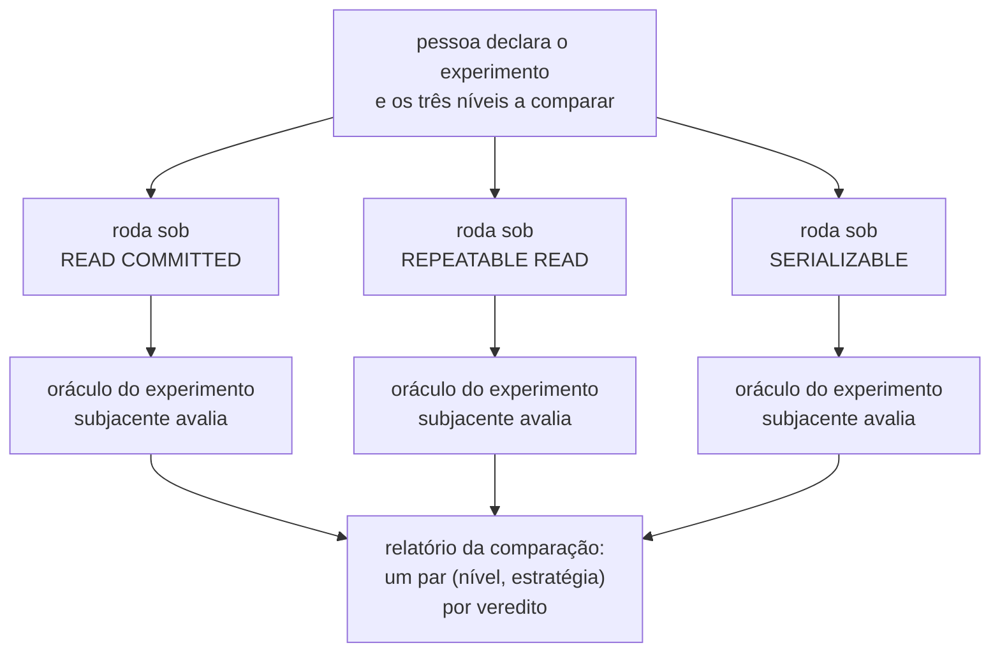

# Feature Card — Comparação entre níveis de isolamento

Estado: `especificado, não implementado` · Origem: [`E-87`, fecho](../../fila-de-decisoes.md#e-87-fecha-em-card-novo-para-a-comparação-entre-níveis-de-isolamento-escolhida-em-2026-08-12)

Cobre o eixo do nível de isolamento como parâmetro de execução, hoje exercido pelo **E5**
(`write-skew-inert-protection`).

## Problema e resultado esperado

O nível de isolamento e a estratégia de concorrência parecem a mesma escolha, e não são.
O nível é propriedade da transação: muda o que o PostgreSQL faz com o **mesmo** SQL. A
estratégia é código da aplicação: muda o SQL emitido. Misturar os dois eixos apaga o
resultado mais desconfortável do laboratório — `OPTIMISTIC` sob `READ COMMITTED` quebra a
invariante do E5 sem lançar exceção, porque inserir uma alocação não incrementa a versão
de linha alguma.

Resultado esperado: o mesmo experimento roda sob os três níveis; o relatório diz qual
protege, a que custo; nenhuma combinação é recusada; o par declarado aparece ao lado de
cada veredito.

## Atores e gatilho

- **Quem projeta o experimento** — declara os três níveis a comparar; onde isso é
  declarado é `Pergunta em aberto`.
- **Os workers do system under test** — executam a operação três vezes, uma por nível.
- **O oráculo subjacente** — hoje o do E5 — avalia cada execução, pelo mecanismo de
  [`deteccao-de-protecao-inerte`](../deteccao-de-protecao-inerte/feature-card.md#atores-e-gatilho).

Gatilho: execução declarada para comparação entre níveis.

## Escopo

- O eixo do nível de isolamento, ortogonal ao da estratégia de concorrência.
- A execução do mesmo experimento nos três níveis do PostgreSQL.
- A ausência de recusa para qualquer combinação de nível e estratégia.
- A exibição do par (nível, estratégia) ao lado de cada veredito no relatório.

## Fora de escopo

- A semântica de cada estratégia de concorrência —
  [`ADR-0006`](../../adr/0006-a-forma-da-estrategia-de-concorrencia.md#decisão), `Aceito`.
- O oráculo exato do contador (E1/E3) e o do predicado (E5) — cada um com card:
  [`deteccao-de-atualizacao-perdida`](../deteccao-de-atualizacao-perdida/feature-card.md)
  e [`deteccao-de-protecao-inerte`](../deteccao-de-protecao-inerte/feature-card.md).
- Onde o nível de isolamento é declarado, e como a execução o aplica à conexão —
  `Pergunta em aberto`.
- O que quantifica formalmente "o custo" de um nível que protege — `Pergunta em aberto`.

## Regras de negócio

| #  | Regra                                                                                                                                                                                                                                                    | Evidência                                                                                                                               | Aprovada por |
|----|----------------------------------------------------------------------------------------------------------------------------------------------------------------------------------------------------------------------------------------------------------|-----------------------------------------------------------------------------------------------------------------------------------------|--------------|
| R1 | A capacidade DEVE comparar o mesmo experimento sob `READ COMMITTED`, `REPEATABLE READ` e `SERIALIZABLE`, e DEVE dizer quais níveis protegem a invariante e a que custo.                                                                                  | [`E-87`, fecho](../../fila-de-decisoes.md#e-87-fecha-em-card-novo-para-a-comparação-entre-níveis-de-isolamento-escolhida-em-2026-08-12) | pendente     |
| R2 | A plataforma NÃO DEVE recusar nenhuma combinação de nível de isolamento e estratégia de concorrência, mesmo quando a combinação quebra a invariante sem lançar exceção.                                                                                  | [`E-87`, fecho](../../fila-de-decisoes.md#e-87-fecha-em-card-novo-para-a-comparação-entre-níveis-de-isolamento-escolhida-em-2026-08-12) | pendente     |
| R3 | O relatório de uma execução comparada DEVE exibir o par declarado — nível de isolamento e estratégia de concorrência — ao lado do veredito. Um rótulo único que colapse os dois eixos, escondendo qual deles produziu o efeito, NÃO satisfaz esta regra. | [`E-87`, fecho](../../fila-de-decisoes.md#e-87-fecha-em-card-novo-para-a-comparação-entre-níveis-de-isolamento-escolhida-em-2026-08-12) | pendente     |

Os exemplos de cada nível, e o diagrama dos dois eixos, estão no
[Example Mapping](example-mapping.md).

## Integrações e contratos afetados

Esta capacidade reusa a fronteira de
[`execucao-de-experimento`](../execucao-de-experimento/feature-card.md#integrações-e-contratos-afetados):
persistência no `lab-journal`, sem versionamento em Git —
[`ADR-0011`](../../adr/0011-a-topologia-de-servicos-e-o-caderno-de-laboratorio-fora-do-git.md#o-caderno-de-laboratório-sai-do-git);
nenhuma fronteira nova abre.

Como as três execuções se agrupam num relatório único é `Pergunta em aberto` — nenhum
contrato formaliza isso hoje, e `Q-INT-1` já cobre a ausência geral de contrato do
relatório, em [`integrations.md`](../../architecture/integrations.md#perguntas-em-aberto).

## Riscos e decisões pendentes

- **Onde o nível é declarado.** Herdado de `deteccao-de-protecao-inerte`; `ADR-0002`
  recusou decidir por escrito.
- **Absorção ou ponteiro da `R7`.** Escolha da redação, pelo fecho de `E-87`; `R7`
  intocada, custo no Example Mapping.
- **Generalização além do E5.** Nada aplica isto ao oráculo exato do E1/E3.
- **A métrica de "custo".** A taxa de aborto de `execucao-de-experimento` é candidata,
  sem confirmação.
- **Já não é pendente — resolvida pelo
  [`ADR-0018`](../../adr/0018-cada-controle-roda-sob-o-seu-proprio-nivel.md):
  "protege" é o `protegido` do `ADR-0004`.** Ver Example Mapping, `P6`.

Detalhes e origem de cada pendência no
[Example Mapping](example-mapping.md#perguntas-em-aberto).

## Critérios de pronto

R1 a R3 verificadas por teste, sobre o E5: `READ COMMITTED` e `REPEATABLE READ` violam,
`SERIALIZABLE` preserva com SQLSTATE `40001`. Nenhuma combinação é recusada antes de
rodar, e cada linha do relatório traz o par ao lado do veredito, não um rótulo único que
colapse os dois eixos.

## Links

- [Example Mapping](example-mapping.md)
- [`E-87`, fecho](../../fila-de-decisoes.md#e-87-fecha-em-card-novo-para-a-comparação-entre-níveis-de-isolamento-escolhida-em-2026-08-12)
- [`deteccao-de-protecao-inerte`](../deteccao-de-protecao-inerte/feature-card.md) — o E5,
  única instância hoje
- [`execucao-de-experimento`](../execucao-de-experimento/feature-card.md) — relatório
  reusado
- [`ADR-0002`](../../adr/0002-o-dominio-minimo-e-os-dois-oraculos.md#o-que-este-adr-não-decide),
  `Aceito` — recusa decidir o nível de isolamento
- [`ADR-0004`](../../adr/0004-o-estatuto-da-barreira-e-o-diagnostico-da-nao-ocorrencia.md#o-zero-é-classificado-e-a-classificação-tem-quatro-valores),
  `Aceito` — a classificação que o `ADR-0018` usa para `P6`
- [`ADR-0006`](../../adr/0006-a-forma-da-estrategia-de-concorrencia.md), `Aceito` — a
  estratégia como eixo separado
- [`ADR-0018`](../../adr/0018-cada-controle-roda-sob-o-seu-proprio-nivel.md), `Aceito` —
  sob qual nível cada controle roda; "protege" = `protegido`
- [`ADR-0015`](../../adr/0015-a-chave-o-discriminador-de-execucao-e-as-colunas-de-tempo.md#sem-chave-estrangeira-em-allocationresource_id),
  `Aceito` — o plano do braço `SERIALIZABLE`
