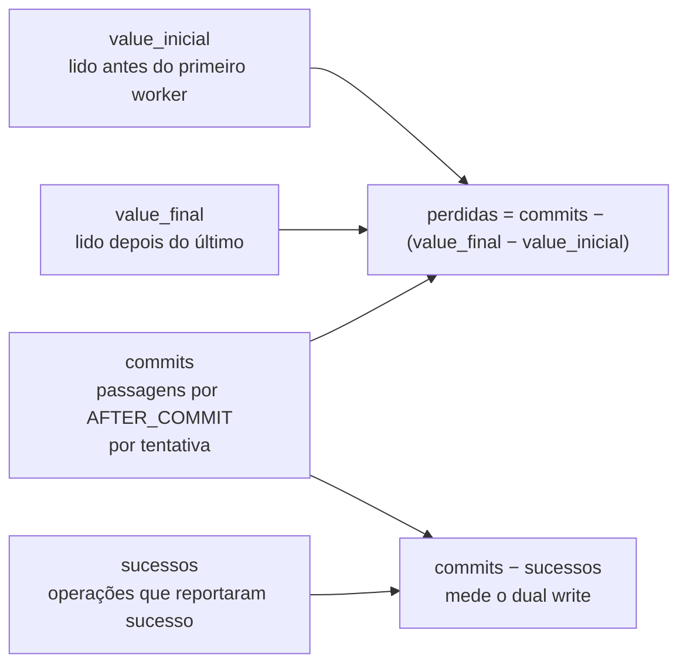

# Example Mapping — Detecção da atualização perdida

Companheiro de [`feature-card.md`](feature-card.md). As regras vêm do
[`ADR-0002`](../../adr/0002-o-dominio-minimo-e-os-dois-oraculos.md), `Aceito`, e da seção
6 do [`plano-do-laboratorio.md`](../../plano-do-laboratorio.md).

## História

> Como quem estuda concorrência, preciso saber **quantos** incrementos se perderam e sob
> qual proteção, para que "às vezes perde" deixe de ser a única frase disponível.

## Regras e exemplos

### R2 — O esquema não tem `version`

- **Exemplo 2.1** — O E1 roda sobre `Resource(id, value, capacity)`. A perda acontece sem
  que exista coluna de versão para detectá-la, que é exatamente o ponto pedagógico.
- **Exemplo 2.2, a armadilha conhecida** — O esboço ilustrativo do ADR-0001 mostra
  `UPDATE resource SET value = ?, version = version + 1`. Aquele esboço fixa a forma, não
  a API, e lê uma coluna que o esquema não tem. Quem for implementar precisa saber disso.

### R3 e R4 — A identidade vem da semente

- **Exemplo 3.1** — Duas execuções com a semente `42` produzem o mesmo identificador de
  recurso. É o que o replay da etapa 12 exige.
- **Exemplo 4.1, o conflito** — E é também o que faz a segunda execução colidir com as
  linhas deixadas pela primeira. `Q-0002-4` está aberta por causa desse par.
- **Contraexemplo 3.2** — Um `SERIAL` no banco tornaria o identificador função da ordem de
  inserção, e duas execuções da mesma semente divergiriam.

### R5, R6 e R7 — O oráculo e o denominador

- **Exemplo 5.1, fluxo principal** — 100 incrementos, 10 workers, sem proteção.
  `commits = 100`, `value_final = 63`, `value_inicial = 0`. `perdidas = 37`.
- **Exemplo 6.1, por que por tentativa** — Uma operação que commita, falha depois do
  commit e tenta de novo incrementa **duas** vezes. Contar por operação esconderia o
  segundo incremento, e o oráculo acusaria uma perda que não houve.
- **Exemplo 7.1, o caso que separa `commits` de `sucessos`** — Uma tentativa alcança
  `AFTER_COMMIT`, o injetor lança falha ali, e a operação reporta erro. Ela **entra** em
  `commits` e **não entra** em `sucessos`.
- **Exemplo 7.2, o caso oposto** — Uma operação que esgotou as tentativas nunca alcançou
  `AFTER_COMMIT`. Ela **não entra** em `commits`.
- **Contraexemplo 7.3, por que não `sucessos`** — Com `sucessos` no denominador, uma perda
  real seria cancelada por uma falha injetada depois do commit, e o oráculo reportaria
  zero. Os dois erros se anulariam e o relatório ficaria verde.

As duas contagens e o que cada uma alimenta:

### R8 — `commits − sucessos` mede outra coisa

- **Exemplo 8.1** — `commits = 100`, `sucessos = 94`. A diferença de 6 é o dual write: seis
  transações aplicadas no banco cujo efeito o chamador acredita não ter acontecido. É o
  fenômeno da etapa 6, e ele não é atualização perdida.

### R9 — O oráculo lê o banco

- **Exemplo 9.1** — O oráculo emite `SELECT value FROM resource WHERE id = ?` depois da
  quiescência.
- **Contraexemplo 9.2** — Derivar `value_final` somando os eventos do log de observações
  faria o instrumento medir a si mesmo: um passo que executou e não persistiu contaria
  como incremento aplicado.
- **Nota** — `commits` é a única entrada vinda do Lab Plane, e a calibração existe para
  impedir que essa entrada vire a derivação proibida por outro caminho.

### R10 — O E1 é obrigado a falhar

- **Exemplo 10.1** — `value` final igual a 63 sob 100 incrementos. O experimento vale.
- **Exemplo 10.2, erro** — `value` final igual a 100. A carga é insuficiente, e nenhum
  resultado do E3 sobre a mesma carga significa alguma coisa. É a regra que separa um
  laboratório de uma demonstração.

### R11 — Uma conexão por worker

- **Exemplo 11.1, o falso negativo silencioso** — Um pool de 5 conexões com 10 workers
  serializa metade deles. A anomalia não aparece porque não houve concorrência, e o
  relatório diz "protegido". O tamanho do pool precisa ser verificado, não presumido.

### E3 — A estratégia é um dado, não uma branch

- **Exemplo E3.1** — A mesma carga roda quatro vezes, trocando apenas a estratégia:
  `NONE`, `ATOMIC_UPDATE`, `OPTIMISTIC`, `PESSIMISTIC`.
- **Exemplo E3.2** — `NONE` perde. As outras três chegam a 100 por caminhos diferentes e
  com custos diferentes.
- **Exemplo E3.3, onde o custo aparece** — `OPTIMISTIC` chega a 100 pagando em taxa de
  aborto. `PESSIMISTIC` chega pagando em tempo de espera em lock. A tabela comparativa
  precisa das duas colunas, ou as duas parecem equivalentes.

## Perguntas em aberto

| # | Pergunta | Origem |
|---|---|---|
| P1 | Qual estratégia serve de calibração? Ela precisa não perder incremento nenhum. | ADR-0002:295-296 |
| P2 | Quem estabelece o estado inicial, e como o banco volta ao ponto de partida? | `Q-0002-4` |
| P3 | O que impede um colaborador injetado de fabricar a perda dentro do instrumento? | `Q-0001-2` |
| P4 | O oráculo lê o estado final quiescente. E um fenômeno cuja violação seja transitória? | `Q-0002-3` |
| P5 | R11 exige pool maior que o número de workers. Quem verifica, e em que momento? | nova, 2026-08-01 |
| P6 | `capacity` existe em `Resource` desde o MVP, e `increment` não a lê. Um incremento pode ultrapassá-la sem que nada reclame. Isso é intencional? | nova, 2026-08-01 |
| P7 | A tabela do E3 compara quatro estratégias. Três delas podem chegar a taxa zero com limites de confiança diferentes — o que a tabela permite concluir? | `Q-0004-5` |

## Adiado de propósito

| Item | Gatilho que o retoma |
|---|---|
| A coluna `version` e a política que a lê | a decisão de estratégias de concorrência |
| O nível de isolamento como parâmetro | o E5, que varre três níveis |
| A definição das quatro estratégias | a decisão de estratégias de concorrência |

## O que não virou cenário, e por quê

R1 (as duas entidades) é estrutural e vira `Contexto`.

Os nomes das quatro estratégias aparecem nos cenários do E3 como dado de exemplo, e não
como comportamento especificado — a semântica de cada uma pertence à decisão que ainda
não foi tomada.
