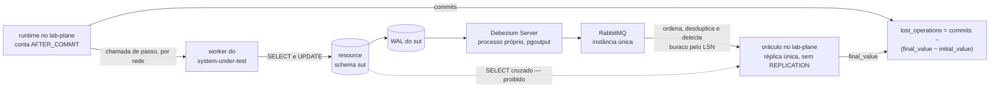

# Feature Card — Detecção da atualização perdida

Estado: `especificado, não implementado` · Origem: [`ADR-0002`](../../adr/0002-o-dominio-minimo-e-os-dois-oraculos.md), `Aceito`

Cobre os experimentos **E1** (`lost-update-none`) e **E3** (`lost-update-strategies`).
Os dois compartilham o mesmo oráculo; o E3 varia a estratégia sobre a mesma carga.

## Problema e resultado esperado

Duas operações leem um contador, calculam e gravam. Uma sobrescreve a outra, sem exceção,
log ou rastro. O engenheiro continua sem saber **quanto** se perde, e sob qual proteção.

Resultado esperado: uma contagem exata de incrementos perdidos, não um predicado que
pode ou não ter sido violado.

## Atores e gatilho

Workers do system under test executam `increment(resourceId)` concorrentemente. O oráculo
lê o WAL do sistema medido por replicação lógica e **NÃO DEVE** emitir `SELECT` no schema
dele, desde o
[`ADR-0010`](../../adr/0010-a-fronteira-de-schema-e-o-cdc-como-fonte-do-veredito.md).
`final_value` é o último valor de `resource.value` visto no stream. `initial_value` vem da
**mesma** fonte: antes de cada execução o estado inicial é inserido, não pressuposto, e
esse `INSERT` é capturado como qualquer outro evento. Gatilho: uma execução de experimento
sobre `increment`.

## Escopo

O domínio mínimo de duas entidades. A operação `increment`. O oráculo exato. A escolha
do denominador. A separação entre `commits` e `successes`. A comparação entre quatro
estratégias sobre a mesma carga.

## Fora de escopo

**A coluna `version` não existe no esquema hoje.** O [`ADR-0006`](../../adr/0006-a-forma-da-estrategia-de-concorrencia.md#decisão),
`Aceito`, decide que `OPTIMISTIC` a exige, mas a migração real nasce só quando a
arquitetura mínima existir — ver R15. O esboço do ADR-0001 lê a
coluna antes disso, e não é normativo.

O SQL exato de cada uma das quatro estratégias e o mapa completo de exceção → retry
ficam para quando o código existir; o ADR-0006 fixa só o contrato (R12 a R16). Nível de
isolamento, classificação do veredito zero e formato curva estão em outros cards.

## Regras de negócio

| #   | Regra                                                                                                                                                                                                                                                                                                                                                                                                                                                                                                                                                 | Evidência                                                                                                                                                                                                                                                                                                                                                                                                                                                                                      | Aprovada por                   |
|-----|-------------------------------------------------------------------------------------------------------------------------------------------------------------------------------------------------------------------------------------------------------------------------------------------------------------------------------------------------------------------------------------------------------------------------------------------------------------------------------------------------------------------------------------------------------|------------------------------------------------------------------------------------------------------------------------------------------------------------------------------------------------------------------------------------------------------------------------------------------------------------------------------------------------------------------------------------------------------------------------------------------------------------------------------------------------|--------------------------------|
| R1  | O domínio tem duas entidades e nenhum nome de negócio: `Resource(id, value, capacity)` e `Allocation(id, resource_id, amount)`. A regra "nenhuma outra coluna entra no MVP" do ADR-0002 passou a admitir `partition_id`, `created_at` e `updated_at` como colunas adicionais, nas duas tabelas, por emenda registrada no cabeçalho do ADR-0002; a forma delas é de `schemas/`. **A emenda enumera as três, e não declara que são as únicas** — o quanto ela admite além delas depende da forma de lifecycle que a nomear, e essa é `E-58`, em aberto. | [ADR-0002, Decisão](../../adr/0002-o-dominio-minimo-e-os-dois-oraculos.md#decisão), [ADR-0015, Decisão](../../adr/0015-a-chave-o-discriminador-de-execucao-e-as-colunas-de-tempo.md#decisão) e [`E-58`](../../fila-de-decisoes.md#e-58--a-forma-da-alteração-do-adr-0002-por-este-adr-não-foi-nomeada)                                                                                                                                                                                         | pessoa, em 2026-08-12          |
| R2  | O esquema **NÃO DEVE** carregar uma coluna `version`.                                                                                                                                                                                                                                                                                                                                                                                                                                                                                                 | [ADR-0002, Decisão](../../adr/0002-o-dominio-minimo-e-os-dois-oraculos.md#decisão)                                                                                                                                                                                                                                                                                                                                                                                                             | pessoa, em 2026-08-12          |
| R3  | O identificador **DEVE** ser gerado pela aplicação a partir da semente. O esquema **NÃO DEVE** usar `SERIAL`, `IDENTITY`, `nextval` nem valor padrão do banco.                                                                                                                                                                                                                                                                                                                                                                                        | [ADR-0002, A identidade das entidades](../../adr/0002-o-dominio-minimo-e-os-dois-oraculos.md#a-identidade-das-entidades-é-atribuída-pela-aplicação)                                                                                                                                                                                                                                                                                                                                            | pessoa, em 2026-08-12          |
| R4  | O identificador **DEVE** ser função da semente e **NÃO DEVE** ser função do instante da execução. Duas execuções da mesma semente produzem os mesmos identificadores.                                                                                                                                                                                                                                                                                                                                                                                 | [ADR-0002, A identidade das entidades](../../adr/0002-o-dominio-minimo-e-os-dois-oraculos.md#a-identidade-das-entidades-é-atribuída-pela-aplicação)                                                                                                                                                                                                                                                                                                                                            | pessoa, em 2026-08-12          |
| R5  | O oráculo produz uma contagem: `lost_operations = commits − (final_value − initial_value)`.                                                                                                                                                                                                                                                                                                                                                                                                                                                           | [ADR-0002, O oráculo exato](../../adr/0002-o-dominio-minimo-e-os-dois-oraculos.md#o-oráculo-exato)                                                                                                                                                                                                                                                                                                                                                                                             | pessoa, em 2026-08-12          |
| R6  | `commits` é o número de passagens pela fronteira `AFTER_COMMIT`, contadas **por tentativa**.                                                                                                                                                                                                                                                                                                                                                                                                                                                          | [ADR-0002, O oráculo exato](../../adr/0002-o-dominio-minimo-e-os-dois-oraculos.md#o-oráculo-exato)                                                                                                                                                                                                                                                                                                                                                                                             | pessoa, em 2026-08-12          |
| R7  | O denominador **DEVE** ser `commits`. Ele **NÃO DEVE** ser o número de operações submetidas nem o de operações que reportaram sucesso.                                                                                                                                                                                                                                                                                                                                                                                                                | [ADR-0002, O oráculo exato](../../adr/0002-o-dominio-minimo-e-os-dois-oraculos.md#o-oráculo-exato)                                                                                                                                                                                                                                                                                                                                                                                             | pessoa, em 2026-08-12          |
| R8  | `successes` conta as execuções de operação que reportaram sucesso. A diferença `commits − successes` mede o dual write.                                                                                                                                                                                                                                                                                                                                                                                                                               | [ADR-0002, O oráculo exato](../../adr/0002-o-dominio-minimo-e-os-dois-oraculos.md#o-oráculo-exato)                                                                                                                                                                                                                                                                                                                                                                                             | pessoa, em 2026-08-12          |
| R9  | O oráculo **DEVE** obter `final_value` do WAL do sistema medido, por replicação lógica. Ele **NÃO DEVE** emitir `SELECT` no schema dele nem derivar estado do log de observações.                                                                                                                                                                                                                                                                                                                                                                     | [ADR-0010, Decisão](../../adr/0010-a-fronteira-de-schema-e-o-cdc-como-fonte-do-veredito.md#decisão)                                                                                                                                                                                                                                                                                                                                                                                            | pessoa, em 2026-08-12          |
| R17 | `final_value` é o último valor de `resource.value` visto no stream, e a comparação só ocorre depois de o stream alcançar o LSN do commit final.                                                                                                                                                                                                                                                                                                                                                                                                       | [ADR-0010, Decisão](../../adr/0010-a-fronteira-de-schema-e-o-cdc-como-fonte-do-veredito.md#decisão)                                                                                                                                                                                                                                                                                                                                                                                            | pessoa, em 2026-08-12          |
| R18 | O estado inicial **DEVE** ser inserido antes de cada execução, e não pressuposto, para que `initial_value` venha do mesmo stream que `final_value`.                                                                                                                                                                                                                                                                                                                                                                                                   | [`E-86`, fecho](../../fila-de-decisoes.md#e-86-fecha-em-o-estado-inicial-é-escrito-com-a-captura-aberta-escolhida-em-2026-08-12)                                                                                                                                                                                                                                                                                                                                                               | pessoa, em 2026-08-12          |
| R10 | O E1 **precisa falhar**. Se `value` final for igual a 100, a carga é insuficiente e nenhum resultado posterior significa alguma coisa.                                                                                                                                                                                                                                                                                                                                                                                                                | [ADR-0004, o zero é classificado](../../adr/0004-o-estatuto-da-barreira-e-o-diagnostico-da-nao-ocorrencia.md#o-zero-é-classificado-e-a-classificação-tem-quatro-valores)                                                                                                                                                                                                                                                                                                                       | pessoa, em 2026-08-12          |
| R11 | Cada worker tem sua própria conexão, e o pool **DEVE** ser maior que o número de workers.                                                                                                                                                                                                                                                                                                                                                                                                                                                             | [`AGENTS.md`, regras estruturais](../../../AGENTS.md#regras-estruturais-que-valem-sempre)                                                                                                                                                                                                                                                                                                                                                                                                      | pessoa, em 2026-08-12          |
| R12 | O Lab Plane trata a estratégia como rótulo opaco. Nenhum componente **DEVE** inspecioná-lo ou ramificar por ele.                                                                                                                                                                                                                                                                                                                                                                                                                                      | [ADR-0006, Decisão](../../adr/0006-a-forma-da-estrategia-de-concorrencia.md#decisão)                                                                                                                                                                                                                                                                                                                                                                                                           | pessoa, em 2026-08-12          |
| R13 | Cada estratégia responde "há outra tentativa?" a partir da exceção recebida. Uma exceção não reconhecida **DEVE** receber resposta não.                                                                                                                                                                                                                                                                                                                                                                                                               | [ADR-0006, Decisão](../../adr/0006-a-forma-da-estrategia-de-concorrencia.md#decisão)                                                                                                                                                                                                                                                                                                                                                                                                           | pessoa, em 2026-08-12          |
| R14 | `PESSIMISTIC` é controle positivo: suas coincidências **DEVEM** ser zero em toda execução.                                                                                                                                                                                                                                                                                                                                                                                                                                                            | [ADR-0006, `PESSIMISTIC` é o controle positivo](../../adr/0006-a-forma-da-estrategia-de-concorrencia.md#pessimistic-é-a-estratégia-de-controle-positivo)                                                                                                                                                                                                                                                                                                                                       | pessoa, em 2026-08-12          |
| R15 | `ATOMIC_UPDATE` é a estratégia de calibração exigida pelo ADR-0002 R3.                                                                                                                                                                                                                                                                                                                                                                                                                                                                                | [ADR-0006, `ATOMIC_UPDATE` é a calibração](../../adr/0006-a-forma-da-estrategia-de-concorrencia.md#atomic_update-é-a-estratégia-de-calibração)                                                                                                                                                                                                                                                                                                                                                 | pessoa, em 2026-08-12          |
| R16 | Uma estratégia **PODE** exigir coluna além das que o ADR-0002 e o ADR-0015 já decidiram; a migração nasce no mesmo commit que a introduz no código.                                                                                                                                                                                                                                                                                                                                                                                                   | [ADR-0006, Decisão](../../adr/0006-a-forma-da-estrategia-de-concorrencia.md#decisão)                                                                                                                                                                                                                                                                                                                                                                                                           | pessoa, em 2026-08-12          |
| R19 | Uma estratégia de concorrência **NÃO DEVE** ler `updated_at`. A coluna é um token de versão clássico, e lê-la seria optimistic locking escrito sem a palavra — a regra pedagógica manda introduzir o problema antes da solução, e a coluna entregaria de graça metade do que o E1 deve construir do zero.                                                                                                                                                                                                                                             | [E-25, timestamps nas tabelas medidas](../../fila-de-decisoes.md#e-25--timestamps-nas-tabelas-medidas), dona da regra e do argumento pedagógico ([E-76, fecho](../../fila-de-decisoes.md#e-76-fecha-em-a-regra-desce-para-o-feature-card-escolhida-em-2026-08-12)), e [ADR-0015, As colunas de tempo](../../adr/0015-a-chave-o-discriminador-de-execucao-e-as-colunas-de-tempo.md#as-colunas-de-tempo-e-a-fonte-do-relógio-por-papel-do-valor), que cita `E-25` como dona sem absorver a regra | pessoa, em `E-25` (2026-08-06) |

O diagrama das duas contagens, e do caminho que produz cada uma, está em
[Integrações e contratos afetados](#integrações-e-contratos-afetados).

## Integrações e contratos afetados

`increment` emite `SELECT` e `UPDATE` contra `resource` — isso é o domínio do sistema
medido, e não mudou. **O oráculo não emite `SELECT` nenhum, e também não abre conexão de
replicação:** o `REPLICATION` é papel do conector, e o `lab-plane` consome do broker. O
schema do `system-under-test` permanece inacessível a ele: não há `GRANT` cruzado.

**O transporte entre o WAL e o oráculo está decidido, e não é decisão desta
capacidade.** Debezium Server em processo próprio pelo plugin `pgoutput`, RabbitMQ em
instância única, e o filtro por execução no consumidor — que exige o `lab-plane` em
réplica única, pela mesma
[decisão](../../adr/0012-o-broker-no-caminho-do-veredito-e-a-dispensa-que-ele-exigiu.md#decisão).
O que continua sem escolha é o sink do conector, nas
[neutras](../../adr/0012-o-broker-no-caminho-do-veredito-e-a-dispensa-que-ele-exigiu.md#neutras).

**Nenhum documento vigente carrega DDL.** A forma das duas tabelas vive em
[`schemas/sut.md`](../../architecture/schemas/sut.md#o-schema-do-sistema-medido-sut), e o que
restringe a medição no
[`ADR-0015`](../../adr/0015-a-chave-o-discriminador-de-execucao-e-as-colunas-de-tempo.md#decisão).
`Q-INT-5` em
[`integrations.md`](../../architecture/integrations.md#perguntas-em-aberto) reflete isso
neste commit; segue aberto ali onde a órfã é verificada.

## Riscos e decisões pendentes

| Questão                                     | O que está em jogo                                                                                                                                                                                                                                                                                                               |
|---------------------------------------------|----------------------------------------------------------------------------------------------------------------------------------------------------------------------------------------------------------------------------------------------------------------------------------------------------------------------------------|
| [`Q-0002-4`](../../questions/Q-0002-4.md)   | ninguém estabelece o estado inicial; o discriminador do ADR-0015 evita a colisão de `id` entre execuções da mesma semente que `Q-0002-4` descrevia — o que falta é quem limpa, e quando (nota em `Q-0002-4`)                                                                                                                     |
| `E-86`, na fila                             | a origem de `R18` é proposta arquivada, e não decisão aceita; falta decidir se o estado inicial DEVE ser escrito dentro da janela de captura, para `initial_value` e `final_value` virem do mesmo stream ([`E-86`](../../fila-de-decisoes.md#e-86--a-regra-r18-do-e1-é-viva-e-a-única-evidência-dela-está-no-arquivo-congelado)) |
| [`Q-0002-3`](../../questions/Q-0002-3.md)   | o oráculo lê o estado final quiescente, e não serve a violação transitória                                                                                                                                                                                                                                                       |
| [`Q-0003-8`](../../questions/Q-0003-8.md)   | quantas vezes `OPTIMISTIC` tenta de novo sob exceção reconhecida não tem limite definido                                                                                                                                                                                                                                         |
| o alcance da proibição de derivar de stream | `final_value` é lido do stream sem somar; se a proibição do ADR-0002 o alcança, R9 cai com ele                                                                                                                                                                                                                                   |
| a emissão ao vivo das observações           | cada travessia até o `lab-journal` entra na janela medida; o buffer local não foi avaliado                                                                                                                                                                                                                                       |

## Critérios de pronto

R1 a R19 verificadas por teste. O E1 produz `lost_operations > 0` de forma repetida sob a carga
declarada. R7 é testada com o caso que a distingue: uma tentativa que commitou e
reportou falha entra na contagem; uma que esgotou as tentativas, não. R9 é testada pela
negativa: o `lab_plane` não tem `GRANT` no schema do `system-under-test`, e um `SELECT`
cruzado **falha** por permissão em vez de retornar linha.

**R2, R10 e a segunda metade de R3 são verificadas por inspeção de schema, não por
Gherkin** — nenhuma sustenta comportamento externo, e um cenário citaria coluna e
tabela. Um teste sobre `information_schema` (ou equivalente) cobre as três: sem
`SERIAL`/`IDENTITY`/`nextval`/`DEFAULT` em coluna de identidade, e sem `version`.

## Links

[Example Mapping](example-mapping.md) · [BDD](behavior.feature) ·
[`ADR-0002`](../../adr/0002-o-dominio-minimo-e-os-dois-oraculos.md) ·
[`ADR-0010`](../../adr/0010-a-fronteira-de-schema-e-o-cdc-como-fonte-do-veredito.md),
`Aceito` — a fonte do oráculo ·
[`ADR-0006`](../../adr/0006-a-forma-da-estrategia-de-concorrencia.md), `Aceito` ·
[`ADR-0015`](../../adr/0015-a-chave-o-discriminador-de-execucao-e-as-colunas-de-tempo.md),
`Aceito` — evidência de `R1`, e cita `E-25` como dona de `R19` sem absorvê-la ·
[`E-25`, timestamps nas tabelas medidas](../../fila-de-decisoes.md#e-25--timestamps-nas-tabelas-medidas)
— dona da regra e do argumento pedagógico de `R19`, aprovados por pessoa em 2026-08-06
([`E-76`, fecho](../../fila-de-decisoes.md#e-76-fecha-em-a-regra-desce-para-o-feature-card-escolhida-em-2026-08-12)) ·
[`execucao-de-experimento`](../execucao-de-experimento/feature-card.md)
