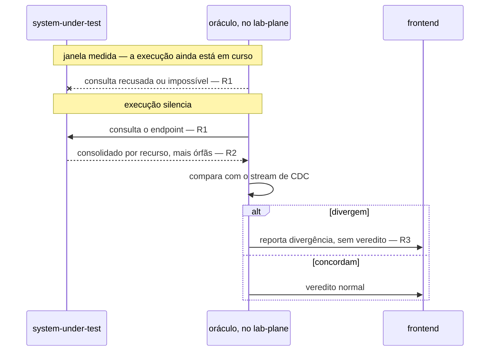
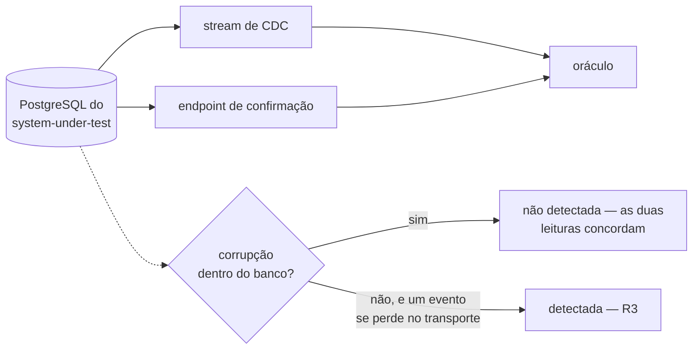

# Detecção de divergência entre fontes — Example Mapping

Companheiro de [`feature-card.md`](feature-card.md). As três regras vêm da decisão da
pessoa em 2026-08-13, registrada no
[fecho de `E-96`](../../fila-de-decisoes.md#e-96-fecha-em-card-e-example-mapping-sem-adr-escolhida-em-2026-08-13),
sobre o
[enunciado da mesma linha](../../fila-de-decisoes.md#e-96--o-sistema-medido-expõe-endpoint-de-confirmação-e-a-fonte-deixa-de-ser-única).

## História

> Como oráculo do `lab-plane`, quero comparar o que o stream de CDC entregou com o que o
> sistema medido confirma depois da quiescência, para que um evento perdido no transporte
> não vire um veredito errado sem sintoma.

## Regras

1. O endpoint de confirmação **DEVE** ser consultado somente depois que a execução
   silencia, e **NÃO DEVE** ser consultado dentro da janela medida.
2. O endpoint **DEVE** retornar um consolidado por recurso — valor final, capacidade,
   soma das alocações e contagem de alocações —, mais a contagem de alocações órfãs.
3. Uma divergência entre o consolidado do endpoint e a leitura do stream **DEVE**
   invalidar o veredito da execução, e **DEVE** ser reportada no frontend.

## Exemplos concretos

| Regra | Dado                                                                                             | Quando                               | Então                                                                                                                                     |
|-------|--------------------------------------------------------------------------------------------------|--------------------------------------|-------------------------------------------------------------------------------------------------------------------------------------------|
| R1    | uma execução em andamento, workers ainda escrevendo                                              | o oráculo tenta consultar o endpoint | a consulta é recusada ou impossível pela arquitetura — ela só acontece depois da quiescência                                              |
| R1    | uma execução que acabou de silenciar                                                             | o oráculo consulta o endpoint        | a consulta acontece fora da janela medida, e não altera o tempo medido do experimento                                                     |
| R2    | um recurso com `capacity = 100`, três alocações somando `70`, e nenhuma alocação órfã            | o endpoint é consultado              | ele devolve, para aquele recurso, `value_final`, `capacity = 100`, `soma = 70`, `contagem = 3`; a contagem de órfãs do consolidado é zero |
| R2    | uma alocação sem `resource_id` correspondente na tabela de recursos, ao lado de recursos normais | o endpoint é consultado              | a contagem de órfãs do consolidado é maior que zero — separada dos recursos, porque a órfã não pertence a nenhum deles                    |
| R3    | o stream de CDC relata `soma = 70`, e o endpoint relata `soma = 65` para o mesmo recurso         | o oráculo compara as duas leituras   | a execução não produz veredito válido, e a divergência é reportada no frontend                                                            |
| R3    | o stream de CDC e o endpoint concordam em todos os recursos tocados pela execução                | o oráculo compara as duas leituras   | a execução produz veredito normalmente, sem reporte de divergência                                                                        |

### Contraexemplo — a objeção que a proposta não vence

O `E-96` registra uma objeção de 2026-08-09 contra uma segunda fonte de leitura do mesmo
banco: "as duas leem o mesmo banco, e nenhuma detecta erro do banco"
([`E-96`, enunciado](../../fila-de-decisoes.md#e-96--o-sistema-medido-expõe-endpoint-de-confirmação-e-a-fonte-deixa-de-ser-única)).
Um recurso corrompido **dentro** do próprio PostgreSQL — uma linha alterada fora do
caminho normal de escrita, por exemplo — apareceria igual nas duas leituras, porque as
duas leem, cedo ou tarde, do mesmo dado persistido. R3 não detecta esse caso: ela
compara dois **caminhos de transporte**, e não dois **bancos**. Este contraexemplo
marca o limite da capacidade, e não uma regra que falta escrever — a objeção segue
válida contra o endpoint como árbitro de correção do banco, só não contra ele como
detector de perda no transporte.

## Alternativas descartadas antes deste card

> **O enunciado do `E-96` ofereceu três formas para o endpoint** — consolidado por
> recurso, conjunto de identificadores, e as linhas —, cada uma com poder de detecção
> diferente. A pessoa escolheu a primeira no fecho, e as outras duas não aparecem na
> decisão; nenhum motivo foi dado por escrito para descartá-las
> ([fecho de `E-96`](../../fila-de-decisoes.md#e-96-fecha-em-card-e-example-mapping-sem-adr-escolhida-em-2026-08-13)).

Registrado aqui porque `R2` fixa a forma escolhida sem explicar por que as outras duas
ficaram de fora — sem este registro, a pergunta "por que não o conjunto de
identificadores, ou as linhas" voltaria sem resposta escrita.

## Perguntas em aberto

- **De quem é o endpoint.** Ele vive no sistema medido e só existe para medi-lo — o que
  tensiona a exigência de o sistema medido ser ingênuo. Ninguém decidiu se ele é um
  controlador de propósito experimental, uma rota de administração, ou outra forma.
  Bloqueia a implementação, e não bloqueia este card.
- **O formato do resultado de divergência.** Não é número, não é booleano e não é taxa
  — é formato novo, e a composição dos formatos de veredito num relatório único já era
  decisão aberta, em
  [capacidade conhecida e não especificada](../README.md#capacidade-conhecida-e-não-especificada).
  Bloqueia o `.feature` desta capacidade: sem o formato, um `Então` não tem o que
  afirmar sobre o resultado.
- **A forma concreta do endpoint** — rota, método, payload. Nenhum contrato nasce agora,
  pela regra de que contrato só existe quando a interface existir
  ([`contracts/README.md`](../../contracts/README.md#estado-nenhum-contrato-existe)).
  Bloqueia o `.feature` e a implementação.
- **Se a guarda de contiguidade de LSN**, que a soma do predicado já exige antes de
  somar
  ([ADR-0013, Decisão](../../adr/0013-a-proveniencia-da-fonte-como-criterio-da-proibicao-do-oraculo.md#decisão)),
  também precisa cobrir a leitura do stream que alimenta esta comparação. Nenhuma regra
  acima o afirma nem o nega.
- **A objeção que descartou "Chamada HTTP ao próprio system under test" no ADR-0010
  incide sobre `R3`, e não está respondida.** O motivo dado ali: "o instrumento passaria
  a depender dele para medi-lo" — um bug no próprio código do endpoint, e não uma
  corrupção do banco, poderia produzir um consolidado que concorda com uma leitura de
  stream igualmente errada, e `R3` não teria como distinguir isso de um veredito
  correto. É diferente do contraexemplo acima, que é sobre corrupção **dentro** do
  banco; esta é sobre um erro **no código do endpoint**. Nenhuma regra acima o afirma
  nem o nega.
- **O que `R3` faz com a contagem de órfãs de `R2` não foi decidido.** Ela entra no
  consolidado, mas se uma divergência só nela já invalida o veredito, ou se ela conta
  como algo distinto, não foi fixado. Toca
  [`E-74`](../../fila-de-decisoes.md#e-74--quem-verifica-a-órfã-de-allocation-e-o-obstáculo-que-caiu),
  aberta — quatro saídas foram propostas ao longo da linha, duas já contraditas pela
  resposta de 2026-08-13, e nenhuma foi formalmente escolhida —, e a `Pergunta em aberto` do
  [ADR-0015](../../adr/0015-a-chave-o-discriminador-de-execucao-e-as-colunas-de-tempo.md#sem-chave-estrangeira-em-allocationresource_id)
  sobre quem verifica a órfã — `R2` introduz uma quinta saída possível sem decidi-la.

## Adiado de propósito

| Item                                | Gatilho que o retoma                                                       |
|-------------------------------------|----------------------------------------------------------------------------|
| O `.feature` desta capacidade       | a decisão do formato do resultado de divergência, e de quem é o endpoint   |
| A forma concreta do endpoint        | a decisão de rota, método e payload, seguida da criação do contrato formal |
| O alcance da guarda de contiguidade | a decisão sobre se ela cobre também a leitura que alimenta a comparação    |

## O que não virou cenário, e por quê

R1, R2 e R3 estão `aprovada`, e nenhuma virou cenário Gherkin nesta rodada — não porque a
regra esteja em debate, mas porque encenar exige um `Então` concreto, e duas lacunas
tornam isso impossível sem inventar.

- **R1** tem um `Então` inteiramente temporal — antes ou depois da quiescência — e não
  depende de nenhuma das duas lacunas abertas. Ela poderia virar cenário isolada, mas um
  `.feature` de uma regra só, enquanto as outras duas do mesmo card ficam de fora,
  fragmenta a especificação sem ganho: o adiamento é do arquivo inteiro, não da regra.
- **R2** tem um `Então` que descreve a forma do consolidado, mas a forma concreta do
  endpoint — rota, payload — é `Pergunta em aberto`; um cenário precisaria descrever um
  payload que ninguém decidiu.
- **R3** tem um `Então` que descreve o resultado da divergência, e o formato desse
  resultado é `Pergunta em aberto`; um cenário precisaria afirmar sobre um formato que
  ainda não existe.
