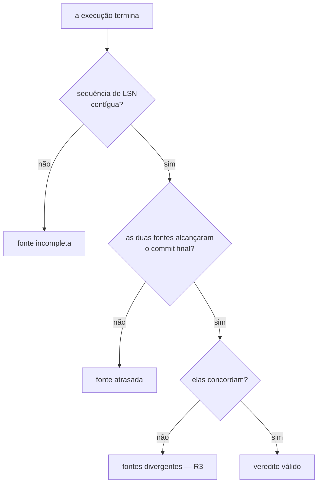
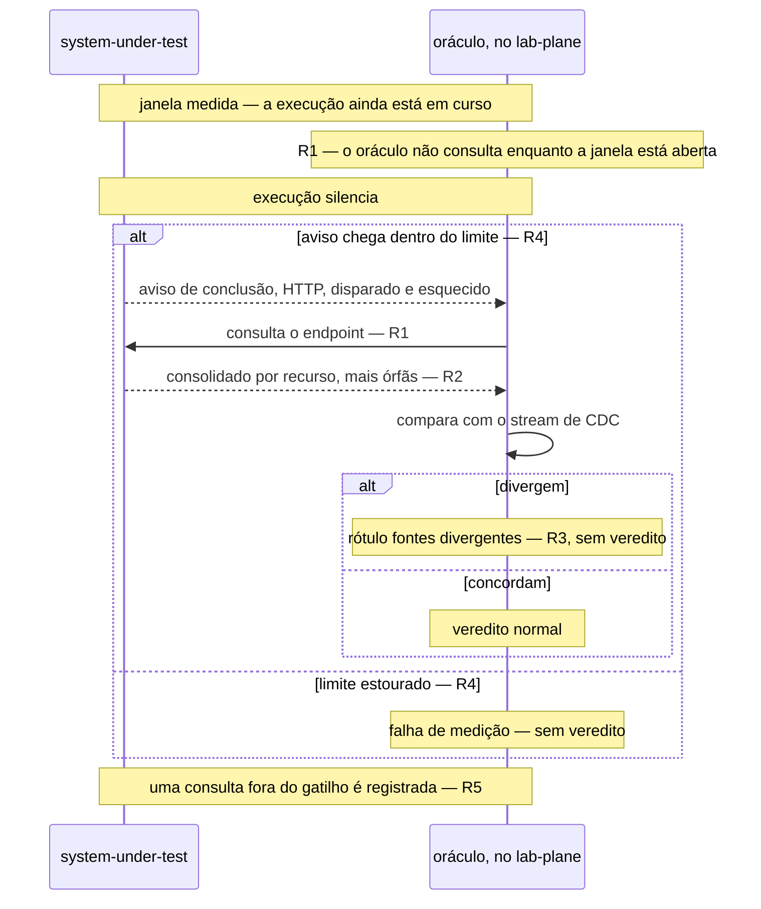
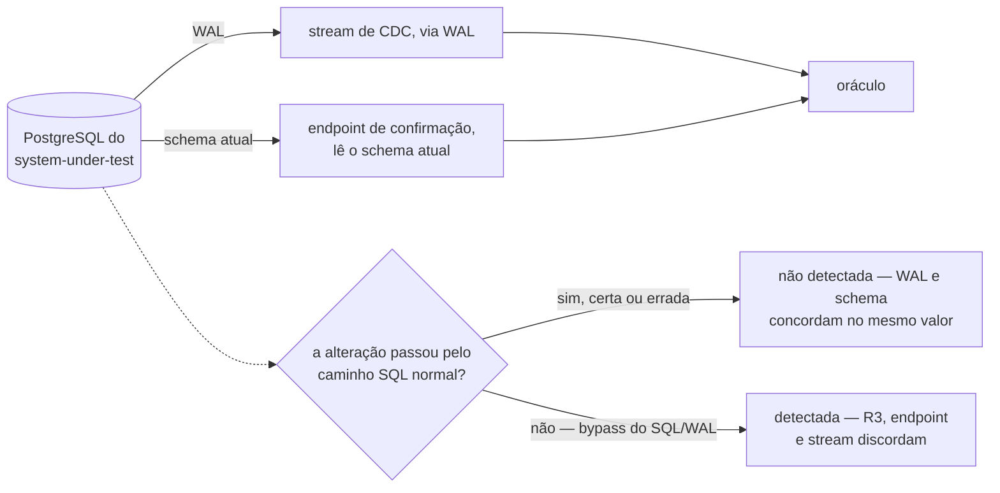

# Detecção de divergência entre fontes — Example Mapping

Companheiro de [`feature-card.md`](feature-card.md). As três primeiras regras vêm da
decisão da pessoa em 2026-08-13, registrada no
[fecho de `E-96`](../../fila-de-decisoes.md#e-96-fecha-em-card-e-example-mapping-sem-adr-escolhida-em-2026-08-13),
sobre o
[enunciado da mesma linha](../../fila-de-decisoes.md#e-96--o-sistema-medido-expõe-endpoint-de-confirmação-e-a-fonte-deixa-de-ser-única).
**Duas regras novas, `R4` e `R5`, e o refinamento de `R1` e `R3`, vêm de seis decisões
que a pessoa tomou em 2026-08-14** — o resíduo exato da comparação, a relação entre
rótulo e veredito, o nome do rótulo, o desenho do aviso de conclusão e a consulta
indevida. Essas decisões vivem numa fila que não é família citável
([`AGENTS.md`, ao trabalhar aqui](../../../AGENTS.md#ao-trabalhar-aqui)); por isso o
conteúdo delas está trazido por inteiro nesta página, em vez de citado.

## História

> Como oráculo do `lab-plane`, quero comparar o que o stream de CDC entregou com o que o
> sistema medido confirma depois da quiescência, para que um evento perdido no transporte
> não vire um veredito errado sem sintoma.

## Regras

1. O oráculo **DEVE** consultar o endpoint de confirmação somente ao receber o aviso de
   conclusão do sistema medido, e **NÃO DEVE** consultá-lo dentro da janela medida.
2. O endpoint **DEVE** retornar um consolidado por recurso — valor final, capacidade,
   soma das alocações e contagem de alocações —, mais a contagem de alocações órfãs.
3. Uma divergência entre o consolidado do endpoint e a leitura do stream **DEVE**
   produzir o rótulo `fontes divergentes` — nenhum veredito é emitido para a execução —,
   e o rótulo **DEVE** ser reportado no frontend.
4. O sistema medido **DEVE** avisar a conclusão do processo por um callback HTTP,
   disparado e esquecido, fora da janela medida; a impossibilidade de entregá-lo **NÃO
   DEVE** alterar nada no sistema medido. Esgotado um limite de espera sem o aviso
   chegar, a execução termina sem veredito.
5. O endpoint de confirmação **DEVE** registrar o instante de cada consulta recebida, e
   **NÃO DEVE** recusar nenhuma. O relatório final **DEVE** cruzar esses instantes com a
   janela medida; uma consulta registrada dentro dela é falha de medição — catalogada,
   apresentada no relatório, e sem veredito emitido.

**A precedência entre os três rótulos do instrumento já cobria este caso, e nenhuma
regra acima a altera.** A contiguidade da sequência é conferida primeiro, e produz
`fonte incompleta`; depois pergunta-se se as duas fontes alcançaram o commit final, e a
falha produz `fonte atrasada`; só então pergunta-se se elas concordam, e a discordância
produz `fontes divergentes` — o resultado que `R3` fixa.

**O caminho até o frontend, que bloqueava `R3` na rodada anterior, foi decidido em
2026-08-14 — fora deste ciclo, e trazido aqui por inteiro, porque a fila não é família
citável.** O `lab-plane` publica o rótulo, ou o veredito, como mensagem terminal no
mesmo RabbitMQ que já leva a observação; o `lab-journal` persiste e emite por SSE, a
mesma exigência de a definição e o resultado do experimento viverem no banco dele
([ADR-0011, O caderno de laboratório sai do
Git](../../adr/0011-a-topologia-de-servicos-e-o-caderno-de-laboratorio-fora-do-git.md#o-caderno-de-laboratório-sai-do-git)).
O `Backend For Frontend` segue recusado — o relatório de duas camadas é montado pelo
`lab-journal`, dono do resultado
([ADR-0011, Um Backend For Frontend entre o frontend e os dois
serviços](../../adr/0011-a-topologia-de-servicos-e-o-caderno-de-laboratorio-fora-do-git.md#um-backend-for-frontend-entre-o-frontend-e-os-dois-serviços))
— e nenhuma aresta nova entra na topologia: `lab-plane` → RabbitMQ
([ADR-0012, Decisão](../../adr/0012-o-broker-no-caminho-do-veredito-e-a-dispensa-que-ele-exigiu.md#decisão))
e RabbitMQ → `lab-journal` → frontend
([ADR-0014](../../adr/0014-o-broker-na-travessia-da-observacao-e-o-cursor-monotonico-do-replay.md#o-evento-sai-do-passo-pelo-broker);
[ADR-0016](../../adr/0016-o-streaming-e-o-replay-do-log-de-observacoes.md#o-replay-por-cursor-é-o-único-mecanismo-com-ou-sem-histórico-completo))
já existiam. O custo aceito é que o rótulo atravessa a peça que os experimentos do grupo
B sabotam de propósito
([ADR-0012, Justificativa](../../adr/0012-o-broker-no-caminho-do-veredito-e-a-dispensa-que-ele-exigiu.md#justificativa)),
sem LSN para desduplicar — mitigado por idempotência pelo discriminador de execução. A
mesma decisão abriu uma mensagem de abertura de execução, pelo mesmo broker, publicada
pelo `lab-plane` com a definição inteira copiada; ela pertence ao card de
[streaming-e-replay-do-log-de-observacoes](../streaming-e-replay-do-log-de-observacoes/feature-card.md)
e não é regra deste — mas dela decorre a distinção que `R4` usa entre execução que não
produziu veredito e veredito perdido no transporte.

## Exemplos concretos

| Regra | Dado                                                                                                  | Quando                             | Então                                                                                                      |
|-------|-------------------------------------------------------------------------------------------------------|------------------------------------|------------------------------------------------------------------------------------------------------------|
| R1    | uma execução em andamento, workers ainda escrevendo                                                   | a janela medida ainda está aberta  | o oráculo não consulta — nenhum aviso foi recebido, e nenhuma chamada sai antes dele                       |
| R1    | o sistema medido chama o callback de conclusão                                                        | o oráculo recebe o aviso           | a consulta acontece então, fora da janela medida, sem alterar o tempo medido do experimento                |
| R2    | um recurso com `capacity = 100`, três alocações somando `70`, e nenhuma alocação órfã                 | o endpoint é consultado            | ele devolve, para aquele recurso, `value_final`, `capacity = 100`, `soma = 70`, `contagem = 3`; órfãs zero |
| R2    | uma alocação sem `resource_id` correspondente na tabela de recursos, ao lado de recursos normais      | o endpoint é consultado            | a contagem de órfãs do consolidado é maior que zero — separada dos recursos, porque não pertence a nenhum  |
| R3    | o stream de CDC relata `soma = 65`, e o endpoint relata `soma = 70` para o mesmo recurso              | o oráculo compara as duas leituras | nenhum veredito é emitido; sai o rótulo `fontes divergentes`, reportado no frontend                        |
| R3    | o stream de CDC e o endpoint concordam em todos os recursos tocados pela execução                     | o oráculo compara as duas leituras | a execução produz veredito normalmente, sem rótulo algum                                                   |
| R4    | a execução termina, e o sistema medido chama o callback dentro do limite de espera                    | o oráculo recebe o aviso           | ele consulta o endpoint, e a execução segue para a comparação                                              |
| R4    | a execução termina, e o callback nunca chega — rede indisponível entre os dois planos                 | o limite de espera estoura         | a execução termina sem veredito, e nada no sistema medido é alterado pela falha de entrega                 |
| R5    | um bug no runtime faz o oráculo consultar o endpoint enquanto a janela ainda está aberta              | o endpoint recebe a consulta       | ele registra o instante, sem recusar e sem retornar erro                                                   |
| R5    | o relatório final cruza os instantes registrados pelo endpoint com a janela medida, e acha uma dentro | a execução é avaliada              | nenhum veredito é emitido; a consulta indevida é catalogada e apresentada no relatório                     |

**A pessoa confirmou, em 2026-08-14, que o primeiro exemplo de `R3` acima é exatamente o
resíduo desta capacidade — não mais uma hipótese.** O
[ADR-0012, Decisão](../../adr/0012-o-broker-no-caminho-do-veredito-e-a-dispensa-que-ele-exigiu.md#decisão)
fixa que o `lab-plane` **DEVE** usar o LSN — atribuído "antes de qualquer transporte
existir" — para "ordenar, desduplicar e detectar buraco na sequência antes de calcular o
veredito". Sob essa regra, uma perda no transporte deixa buraco na sequência, e o buraco
já invalida pela `R8` de
[deteccao-de-protecao-inerte](../deteccao-de-protecao-inerte/feature-card.md#regras-de-negócio)
— o par "stream completo, relatando menos" só existe **se o LSN não sobreviver ao
transporte inteiro**, e é só para essa falha que a comparação existe. A escolha vale
para as duas direções: um stream relatando **menos** é evento que sumiu, um relatando
**mais** é evento contado duas vezes — as duas passam despercebidas pela mesma causa, o
LSN corrompido, que derruba a desduplicação e a conferência de contiguidade juntas.

### Contraexemplo — a objeção que a proposta não vence

O `E-96` registra uma objeção de 2026-08-09 contra uma segunda fonte de leitura do mesmo
banco: "as duas leem o mesmo banco, e nenhuma detecta erro do banco"
([`E-96`, enunciado](../../fila-de-decisoes.md#e-96--o-sistema-medido-expõe-endpoint-de-confirmação-e-a-fonte-deixa-de-ser-única)).
O contraexemplo real é o oposto do que a leitura ingênua sugere, porque a segunda fonte
não lê "o mesmo banco": o stream lê o **WAL**, e o endpoint lê o **schema atual**.
Qualquer alteração que passe pelo caminho normal de escrita SQL — certa ou errada, por
bug de aplicação ou por operador — gera o mesmo `INSERT`/`UPDATE` no WAL e a mesma linha
na leitura do endpoint; as duas leituras concordam num valor que pode estar
semanticamente errado, e `R3` não detecta esse caso: ela compara dois **caminhos de
transporte** que nascem do mesmo evento SQL, e não a correção do dado em si. Uma linha
alterada **fora** desse caminho — por exemplo, escrita direta no arquivo de dados, sem
passar pelo SQL e pelo WAL — é o caso oposto: o endpoint relataria o novo valor, o
stream jamais veria o evento, e `R3` **detectaria** a divergência. Este contraexemplo
marca o limite da capacidade, e não uma regra que falta escrever — a objeção segue
válida contra o endpoint como árbitro de correção semântica do banco, só não contra ele
como detector de perda no transporte.

## Alternativas descartadas antes deste card

> **O enunciado do `E-96` ofereceu três formas para o endpoint** — consolidado por
> recurso, conjunto de identificadores, e as linhas —, cada uma com poder de detecção
> diferente. A pessoa escolheu a primeira no fecho, e as outras duas não aparecem na
> decisão; nenhum motivo foi dado por escrito para descartá-las
> ([fecho de `E-96`](../../fila-de-decisoes.md#e-96-fecha-em-card-e-example-mapping-sem-adr-escolhida-em-2026-08-13)).

Registrado aqui porque `R2` fixa a forma escolhida sem explicar por que as outras duas
ficaram de fora — sem este registro, a pergunta "por que não o conjunto de
identificadores, ou as linhas" voltaria sem resposta escrita.

## Alternativas descartadas nas decisões de 2026-08-14

### O caminho até o frontend

Uma aresta nova e direta do `lab-plane` até o frontend foi recusada — contraria a letra
do ADR-0011, que só admite comando no `lab-plane` e leitura no `lab-journal`, sem
`Backend For Frontend`
([ADR-0011, Decisão](../../adr/0011-a-topologia-de-servicos-e-o-caderno-de-laboratorio-fora-do-git.md#comando-no-lab-plane-leitura-no-lab-journal-sem-bff)).
O resultado atravessando o `lab-journal` foi escolhido: nenhuma aresta nova entra na
topologia, e o resultado deixa de existir só no navegador de quem olhava, a mesma
exigência do
[ADR-0011, O caderno de laboratório sai do
Git](../../adr/0011-a-topologia-de-servicos-e-o-caderno-de-laboratorio-fora-do-git.md#o-caderno-de-laboratório-sai-do-git).

### O resíduo da comparação

Arquivar a capacidade por redundância com o que o ADR-0012 já obriga foi recusado —
desfaria uma regra aprovada por pessoa um dia antes, e descartaria junto a detecção de
defeito no próprio somatório do oráculo, que o LSN não alcança. Emendar o ADR-0012
também foi recusado — nada nele se tornou falso, e reabri-lo para acomodar uma
vizinhança nova abriria precedente para reabrir ADR sem que nenhuma afirmação dele
tenha caído.

### O aviso de conclusão

A marca de fim no stream, como reserva do aviso perdido, foi recusada — no caso em que o
LSN não sobrevive, a marca também pode não ser reconhecida, e a reserva falharia junto
com o que deveria cobrir. Consultar por conta própria passado o limite foi recusada —
consultar sem saber que a execução terminou é o que a regra do silêncio, `R1`, proíbe.

**Por que `R4` existe, e o que a torna diferente de uma chamada de passo comum.** A
comparação existe para o caso em que o LSN não sobrevive ao transporte; um sinal de
conclusão que trafegasse dentro do próprio stream de CDC seria inútil exatamente nessa
falha, porque nasceria sujeito ao mesmo transporte que pode tê-lo corrompido. Por isso o
aviso vai por HTTP, disparado e esquecido, fora do stream — e por isso ele precisa ser
**disparado e esquecido**: se bloqueasse, repetisse ou lançasse exceção quando o
`lab-plane` não responde, o comportamento do sistema medido passaria a depender do
instrumento estar de pé, a confusão entre os dois planos que o ADR-0008 existe para
evitar. Uma mensagem de abertura de execução, decidida no mesmo dia e publicada pelo
`lab-plane` no mesmo broker, torna possível distinguir **execução que não produziu
veredito** — abertura registrada, sem fechamento — de **veredito que se perdeu no
transporte** — abertura e fechamento registrados, sem o resultado correspondente. Essa
distinção pertence ao card de streaming e replay, e não é regra deste; `R4` só a usa.

### A relação entre rótulo e veredito

Um envelope único, em que todo resultado sai na mesma forma com um campo dizendo o
tipo, foi recusado — põe falha de instrumento e resultado de consistência no mesmo
plano, a confusão que invalida a conclusão. Um relatório por oráculo, sem composição
nenhuma, foi recusado — uma execução que roda os dois oráculos produziria dois
documentos sem relação declarada.

### A consulta indevida

Catalogar sem invalidar foi recusado — um veredito acompanhado de ressalva é o que a
decisão da relação entre rótulo e veredito já recusou, e quem lê o número tende a
ignorar a nota. Exigir que o endpoint recuse a consulta foi recusado — obrigaria o
sistema medido a saber o que é janela medida, e o agnosticismo do desenho vale também
aqui.

### A tensão com o ADR-0008

O ADR-0008 fixa, sem qualificar a chamada de passo, que "O Control Plane NÃO DEVE
chamar o Lab Plane"
([ADR-0008, Decisão](../../adr/0008-os-dois-planos-em-processos-separados.md#decisão)),
e o `## Contexto` do mesmo ADR define o Control Plane como o sistema medido. O aviso de
`R4` trafega exatamente nesse sentido — do sistema medido para o `lab-plane`. Deixar a
tensão sem resposta foi recusado — "um card NÃO PODE contradizer um ADR aceito. A
contradição é decisão arquitetural nova: ela entra na fila de decisões no mesmo turno em
que é vista, e o card é alinhado ao que o ADR que sair dela disser" continua valendo. A
regra é citada por inteiro porque nem `AGENTS.md` nem `docs/AGENTS.md` são família
citável, e o próprio `AGENTS.md` deixa esse estatuto em aberto; o texto vive em
`docs/AGENTS.md`, seção "Feature Card" ([cortesia](../../AGENTS.md#feature-card)). **A pessoa
resolveu isto em 2026-08-14**, pelo
[ADR-0020](../../adr/0020-o-aviso-de-conclusao-e-a-subsuncao-do-adr-0008.md#decisão): a
proibição do ADR-0008 continua valendo por inteiro para a chamada de passo, e passa a
admitir o aviso de conclusão de `R4`, nas três condições que a Decisão daquele ADR fixa.

## Perguntas em aberto

- **De quem é o endpoint de confirmação.** Ele vive no sistema medido e só existe para
  medi-lo — o que tensiona a exigência de o sistema medido ser ingênuo. Ninguém decidiu
  se ele é um controlador de propósito experimental, uma rota de administração, ou
  outra forma. Bloqueia a implementação, e o `.feature`.
- **Qual rótulo o estouro do limite de espera do aviso de conclusão produz.** Pode ser
  o mesmo `fonte atrasada`, que já nomeia a fonte que não alcançou o ponto declarado no
  tempo declarado, ou um rótulo novo. O argumento a favor de reusar é que o glossário
  evitou de propósito amarrar aquele rótulo a uma tecnologia; o argumento contra é que
  o aviso não mede nada — ele é sinal de controle, e não leitura. Ninguém decidiu.
  Bloqueia o `.feature` do ramo de estouro em `R4`.
- **A forma concreta do endpoint e do callback** — rota, método, payload. Nenhum
  contrato nasce agora, pela regra de que contrato só existe quando a interface existir
  ([`contracts/README.md`](../../contracts/README.md#estado-nenhum-contrato-existe)).
  Bloqueia o `.feature` e a implementação.
- **Qual identidade a execução carrega, e se é o mesmo discriminador que já particiona
  o stream de CDC.** Se for, o discriminador ganha um segundo papel — rótulo de
  partição e identidade de execução; se não, existem dois identificadores para a mesma
  execução, e `R4`/`R5` precisariam dizer qual usam para correlacionar o aviso e a
  consulta a uma execução específica. Ninguém decidiu; a resposta pertence sobretudo ao
  card de streaming e replay, onde a mensagem de abertura vive. Não bloqueia o
  `.feature` desta capacidade sozinha.
- **A objeção que descartou "Chamada HTTP ao próprio system under test" no ADR-0010
  incide sobre `R3`, e não está respondida.** O motivo dado ali
  ([ADR-0010, Chamada HTTP ao próprio system under
  test](../../adr/0010-a-fronteira-de-schema-e-o-cdc-como-fonte-do-veredito.md#chamada-http-ao-próprio-system-under-test))
  — "o instrumento passaria a depender dele para medi-lo" — descreve o caso direto: um
  defeito no código do endpoint produz um consolidado errado, `R3` o compara contra um
  stream correto, o rótulo `fontes divergentes` sai por engano, e um veredito bom é
  destruído sem que nada no sistema medido tenha falhado. O caso inverso, mais raro, é
  a coincidência: um bug no endpoint produz um consolidado que concorda com uma leitura
  de stream igualmente errada, e `R3` não teria como distinguir isso de um veredito
  correto. É diferente do contraexemplo acima, que é sobre corrupção **dentro** do
  banco; esta é sobre um erro **no código do endpoint**. Nenhuma regra acima o afirma
  nem o nega — o encolhimento do escopo, em 2026-08-14, não muda essa objeção, porque
  ela incide sobre a confiança no endpoint, não sobre o tamanho do resíduo que `R3`
  cobre.
- **O que `R3` e `R5` fazem com a contagem de órfãs de `R2` não foi decidido.** Ela
  entra no consolidado, mas se uma divergência só nela já produz o rótulo, ou se ela
  conta como algo distinto, não foi fixado — nem se uma consulta indevida que só toca
  órfãs é catalogada do mesmo jeito. Toca
  [`E-74`](../../fila-de-decisoes.md#e-74--quem-verifica-a-órfã-de-allocation-e-o-obstáculo-que-caiu),
  aberta — quatro saídas foram propostas ao longo da linha, duas já contraditas pela
  resposta de 2026-08-13, e nenhuma foi formalmente escolhida —, e a `Pergunta em aberto` do
  [ADR-0015](../../adr/0015-a-chave-o-discriminador-de-execucao-e-as-colunas-de-tempo.md#sem-chave-estrangeira-em-allocationresource_id)
  sobre quem verifica a órfã — `R2` introduz uma quinta saída possível sem decidi-la.

## Adiado de propósito

| Item                          | Gatilho que o retoma                                                                                |
|-------------------------------|-----------------------------------------------------------------------------------------------------|
| O `.feature` desta capacidade | a decisão de quem é o endpoint, da forma concreta do endpoint e do callback, e do rótulo do estouro |
| A forma concreta do endpoint  | a decisão de rota, método e payload, seguida da criação do contrato formal                          |

## O que não virou cenário, e por quê

R1 a R5 estão `aprovada`, e nenhuma virou cenário Gherkin nesta rodada — não porque a
regra esteja em debate, mas porque encenar exige um `Então` concreto, e três lacunas de
[Perguntas em aberto](#perguntas-em-aberto) — quem é o endpoint, o rótulo do estouro, e a
forma concreta do endpoint e do callback — tornam isso impossível sem inventar, para ao
menos uma regra de cada vez.

- **R1** tem um `Então` inteiramente temporal — antes ou depois de receber o aviso — e
  não depende de nenhuma das três lacunas. O bloqueio que a recusa do endpoint impunha a
  ela, na rodada anterior, caiu: `R5` resolveu isso. Ela poderia virar cenário isolada,
  mas um `.feature` de uma regra só, enquanto as outras quatro do mesmo card ficam de
  fora, fragmenta a especificação sem ganho — o adiamento é do arquivo inteiro.
- **R2** tem um `Então` que descreve a forma do consolidado, mas a forma concreta do
  endpoint — rota, payload — é uma das três lacunas.
- **R3** tem um `Então` que descreve o rótulo `fontes divergentes`. O caminho até o
  frontend, que a bloqueava na rodada anterior, foi decidido em 2026-08-14: nenhuma das
  três lacunas restantes a bloqueia diretamente. Ela seria a primeira candidata a
  cenário se o arquivo fosse fragmentado por regra — recusado pelo mesmo motivo de
  sempre, e explicado no item de `R1` acima.
- **R4** tem dois ramos. O aviso chegando dentro do limite dependia da tensão com o
  ADR-0008, resolvida pelo [ADR-0020](../../adr/0020-o-aviso-de-conclusao-e-a-subsuncao-do-adr-0008.md);
  o que ainda bloqueia esse ramo é a forma concreta do aviso HTTP, uma das três lacunas
  restantes. O limite estourando depende também do rótulo do estouro, ainda sem nome.
- **R5** tem um `Então` que descreve o registro e a catalogação, mas depende da forma
  concreta do endpoint para descrever como o instante é registrado.
