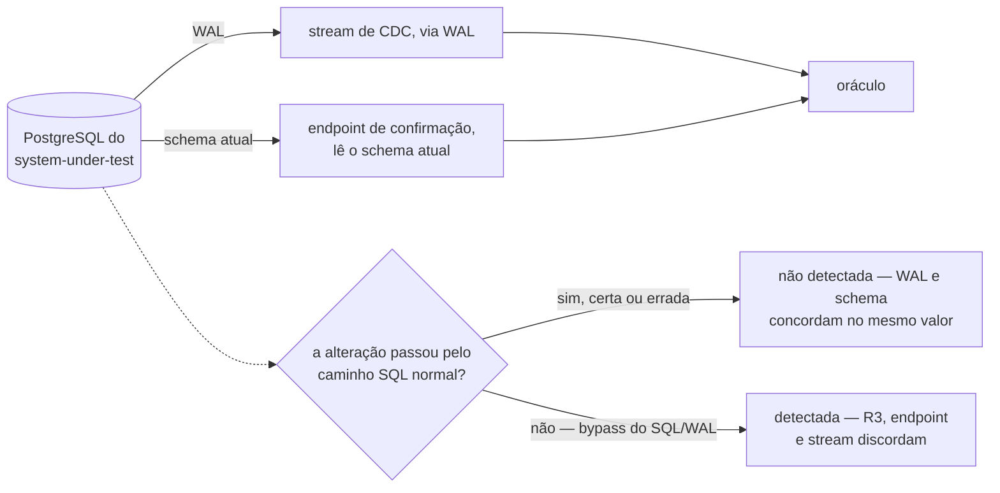

# Detecção de divergência entre fontes — Example Mapping

Companheiro de [`feature-card.md`](feature-card.md). As três regras vêm da decisão da
pessoa em 2026-08-13, registrada no
[fecho de `E-96`](../../fila-de-decisoes.md#e-96-fecha-em-card-e-example-mapping-sem-adr-escolhida-em-2026-08-13),
sobre o
[enunciado da mesma linha](../../fila-de-decisoes.md#e-96--o-sistema-medido-expõe-endpoint-de-confirmação-e-a-fonte-deixa-de-ser-única).

## História

> Como oráculo do `lab-plane`, quero comparar o que o stream de CDC entregou com o que o
> sistema medido confirma depois da quiescência, para que um evento perdido no transporte
> não vire um veredito errado sem sintoma.

## Regras

1. O endpoint de confirmação **DEVE** ser consultado somente depois que a execução
   silencia, e **NÃO DEVE** ser consultado dentro da janela medida.
2. O endpoint **DEVE** retornar um consolidado por recurso — valor final, capacidade,
   soma das alocações e contagem de alocações —, mais a contagem de alocações órfãs.
3. Uma divergência entre o consolidado do endpoint e a leitura do stream **DEVE**
   invalidar o veredito da execução, e **DEVE** ser reportada no frontend.

```mermaid
sequenceDiagram
    participant SUT as system-under-test
    participant OR as oráculo, no lab-plane
    Note over SUT,OR: janela medida — a execução ainda está em curso
    Note over OR: R1 — o oráculo não emite a consulta enquanto a janela está aberta
    Note over SUT,OR: execução silencia
    OR->>SUT: consulta o endpoint — R1
    SUT-->>OR: consolidado por recurso, mais órfãs — R2
    OR->>OR: compara com o stream de CDC
    alt divergem
        Note over OR: veredito inválido — R3; caminho até<br/>o frontend não decidido, ver Perguntas em aberto
    else concordam
        Note over OR: veredito normal
    end
```

## Exemplos concretos

| Regra | Dado                                                                                             | Quando                             | Então                                                                                                                                     |
|-------|--------------------------------------------------------------------------------------------------|------------------------------------|-------------------------------------------------------------------------------------------------------------------------------------------|
| R1    | uma execução em andamento, workers ainda escrevendo                                              | a janela medida ainda está aberta  | o oráculo não consulta o endpoint — nenhuma chamada sai dele antes da quiescência                                                         |
| R1    | uma execução que acabou de silenciar                                                             | o oráculo consulta o endpoint      | a consulta acontece fora da janela medida, e não altera o tempo medido do experimento                                                     |
| R2    | um recurso com `capacity = 100`, três alocações somando `70`, e nenhuma alocação órfã            | o endpoint é consultado            | ele devolve, para aquele recurso, `value_final`, `capacity = 100`, `soma = 70`, `contagem = 3`; a contagem de órfãs do consolidado é zero |
| R2    | uma alocação sem `resource_id` correspondente na tabela de recursos, ao lado de recursos normais | o endpoint é consultado            | a contagem de órfãs do consolidado é maior que zero — separada dos recursos, porque a órfã não pertence a nenhum deles                    |
| R3    | o stream de CDC relata `soma = 65`, e o endpoint relata `soma = 70` para o mesmo recurso         | o oráculo compara as duas leituras | a execução não produz veredito válido, e a divergência é reportada no frontend                                                            |
| R3    | o stream de CDC e o endpoint concordam em todos os recursos tocados pela execução                | o oráculo compara as duas leituras | a execução produz veredito normalmente, sem reporte de divergência                                                                        |

**O primeiro exemplo de `R3` acima é justamente o caso que as guardas de**
[deteccao-de-protecao-inerte](../deteccao-de-protecao-inerte/feature-card.md#regras-de-negócio)
**não capturam.** `R8` invalida com `fonte incompleta` só quando há buraco na
sequência de LSN; `R9` invalida com `fonte atrasada` só quando a marca de fim não é
reconhecida dentro do limite de espera. Nenhuma das duas exige que a soma relatada
**corresponda** ao valor final: um stream que chegou até `65`, sem buraco na sequência
e com a marca de fim reconhecida — completo, pelo critério que as duas guardas
verificam —, passa por elas mesmo relatando menos do que o endpoint confirma (`70`),
que é a direção que a perda no transporte produz. Ver a pergunta em aberto sobre se a
guarda de contiguidade cobre este caso, abaixo.

### Contraexemplo — a objeção que a proposta não vence

O `E-96` registra uma objeção de 2026-08-09 contra uma segunda fonte de leitura do mesmo
banco: "as duas leem o mesmo banco, e nenhuma detecta erro do banco"
([`E-96`, enunciado](../../fila-de-decisoes.md#e-96--o-sistema-medido-expõe-endpoint-de-confirmação-e-a-fonte-deixa-de-ser-única)).
O contraexemplo real é o oposto do que a leitura ingênua sugere, porque a segunda fonte
não lê "o mesmo banco": o stream lê o **WAL**, e o endpoint lê o **schema atual**.
Qualquer alteração que passe pelo caminho normal de escrita SQL — certa ou errada, por
bug de aplicação ou por operador — gera o mesmo `INSERT`/`UPDATE` no WAL e a mesma linha
na leitura do endpoint; as duas leituras concordam num valor que pode estar
semanticamente errado, e `R3` não detecta esse caso: ela compara dois **caminhos de
transporte** que nascem do mesmo evento SQL, e não a correção do dado em si. Uma linha
alterada **fora** desse caminho — por exemplo, escrita direta no arquivo de dados, sem
passar pelo SQL e pelo WAL — é o caso oposto: o endpoint relataria o novo valor, o
stream jamais veria o evento, e `R3` **detectaria** a divergência. Este contraexemplo
marca o limite da capacidade, e não uma regra que falta escrever — a objeção segue
válida contra o endpoint como árbitro de correção semântica do banco, só não contra ele
como detector de perda no transporte.



## Alternativas descartadas antes deste card

> **O enunciado do `E-96` ofereceu três formas para o endpoint** — consolidado por
> recurso, conjunto de identificadores, e as linhas —, cada uma com poder de detecção
> diferente. A pessoa escolheu a primeira no fecho, e as outras duas não aparecem na
> decisão; nenhum motivo foi dado por escrito para descartá-las
> ([fecho de `E-96`](../../fila-de-decisoes.md#e-96-fecha-em-card-e-example-mapping-sem-adr-escolhida-em-2026-08-13)).

Registrado aqui porque `R2` fixa a forma escolhida sem explicar por que as outras duas
ficaram de fora — sem este registro, a pergunta "por que não o conjunto de
identificadores, ou as linhas" voltaria sem resposta escrita.

## Perguntas em aberto

- **De quem é o endpoint.** Ele vive no sistema medido e só existe para medi-lo — o que
  tensiona a exigência de o sistema medido ser ingênuo. Ninguém decidiu se ele é um
  controlador de propósito experimental, uma rota de administração, ou outra forma.
  Bloqueia a implementação, e não bloqueia este card.
- **O caminho da divergência até o frontend.** O ADR-0011 fixa que o frontend fala com
  o `lab-plane` para comando e com o `lab-journal` para leitura e streaming, sem
  `Backend For Frontend`
  ([ADR-0011, Decisão](../../adr/0011-a-topologia-de-servicos-e-o-caderno-de-laboratorio-fora-do-git.md#comando-no-lab-plane-leitura-no-lab-journal-sem-bff)),
  e nenhuma das duas arestas decididas leva um veredito de oráculo até lá. Duas saídas,
  nenhuma decidida: uma aresta nova e direta do `lab-plane` até o frontend, que
  contraria a letra do ADR-0011; ou o resultado atravessando o `lab-journal`, que
  obriga um resultado de oráculo a passar pelo caderno de execuções — caminho que
  nenhum documento deste repositório prevê hoje. Bloqueia o `.feature`: sem o caminho,
  um `Então` não tem por onde afirmar que a divergência chegou ao frontend.
- **O formato do resultado de divergência, e se ele já existe.** O vocabulário do
  instrumento já nomeia três rótulos, nenhum veredito sobre o sistema medido: `fontes
  divergentes` — as duas fontes alcançaram o commit final e discordam; `fonte atrasada`
  — uma fonte não alcançou o ponto declarado a tempo; `fonte incompleta` — a sequência
  de LSN tem buraco, e o oráculo não produz veredito. `docs/CONTEXT.md` não é família
  citável como fonte
  ([`AGENTS.md`, ao trabalhar aqui](../../../AGENTS.md#ao-trabalhar-aqui)), por isso as
  três definições e a ordem de conferência entre elas estão trazidas por inteiro aqui e
  no [feature card](feature-card.md#riscos-e-decisões-pendentes), em vez de citadas.

  ```mermaid
  flowchart TD
      E["a execução termina"] --> C{"sequência de LSN<br/>contígua?"}
      C -->|" não "| I["fonte incompleta"]
      C -->|" sim "| Q{"as duas fontes alcançaram<br/>o commit final?"}
      Q -->|" não "| A["fonte atrasada"]
      Q -->|" sim "| D{"elas concordam?"}
      D -->|" não "| F["fontes divergentes"]
      D -->|" sim "| V["veredito válido"]
  ```

  Não está decidido se o resultado que `R3` exige **é** `fontes divergentes`, ou é
  formato distinto; e, sendo o mesmo rótulo, em que ponto desta ordem entra o endpoint
  de confirmação — fonte que não existia quando a ordem foi fixada. A composição desse
  resultado, seja qual for, num relatório único com os outros formatos de veredito
  continua decisão aberta, em
  [capacidade conhecida e não especificada](../README.md#capacidade-conhecida-e-não-especificada).
  Bloqueia o `.feature` desta capacidade: sem a resposta, um `Então` não tem o que
  afirmar sobre o resultado.
- **A forma concreta do endpoint** — rota, método, payload. Nenhum contrato nasce agora,
  pela regra de que contrato só existe quando a interface existir
  ([`contracts/README.md`](../../contracts/README.md#estado-nenhum-contrato-existe)).
  Bloqueia o `.feature` e a implementação.
- **Se a guarda de contiguidade de LSN**, que a soma do predicado já exige antes de
  somar
  ([ADR-0013, Decisão](../../adr/0013-a-proveniencia-da-fonte-como-criterio-da-proibicao-do-oraculo.md#decisão)),
  também precisa cobrir a leitura do stream que alimenta esta comparação. É esta a
  pergunta que o primeiro exemplo de `R3` na tabela acima ilustra — um stream completo
  pelo critério de `R8`/`R9`, mas divergindo do endpoint —, como a nota logo abaixo da
  tabela detalha. Nenhuma regra acima o afirma nem o nega.
- **A direção oposta — stream relatando mais do que o endpoint — é produzível por
  duplicação, e não só por perda.** "O transporte PODE duplicar, reordenar ou perder
  mensagem", em regra aprovada por pessoa
  ([distincao-entre-higiene-e-invalidacao, Problema e resultado
  esperado](../distincao-entre-higiene-e-invalidacao/feature-card.md#problema-e-resultado-esperado)).
  Duas coisas não estão escritas em documento nenhum, e nenhuma delas é decidida aqui:
  se `R3` alcança a divergência produzida por duplicação, ou só a produzida por perda;
  e se a guarda de contiguidade de LSN de `R8` detecta duplicação, ou só detecta buraco
  na sequência. A segunda importa porque, se `R8` já pega os dois casos, o resíduo que
  esta capacidade reivindica encolhe.
- **Quando a leitura do stream está completa, no oráculo, para esta comparação.** `R1`
  fixa a hora da consulta ao **endpoint** — depois que a execução silencia — e nenhuma
  regra acima fixa a hora em que a leitura do stream pode ser considerada pronta para a
  comparação de `R3`, antes de `R9` reconhecer a marca de fim. Comparar um consolidado
  final contra um stream genuinamente ainda em trânsito diverge em execução sã, por
  motivo distinto do exemplo de `R3` acima — que é sobre uma perda que `R8`/`R9` não
  capturam, e não sobre uma leitura incompleta. Bloqueia o `.feature`: sem a condição de
  término, um cenário de `R3` não sabe quando afirmar o resultado.
- **A objeção que descartou "Chamada HTTP ao próprio system under test" no ADR-0010
  incide sobre `R3`, e não está respondida.** O motivo dado ali
  ([ADR-0010, Chamada HTTP ao próprio system under
  test](../../adr/0010-a-fronteira-de-schema-e-o-cdc-como-fonte-do-veredito.md#chamada-http-ao-próprio-system-under-test))
  — "o instrumento passaria a depender dele para medi-lo" — descreve, antes de tudo, o
  caso direto: um defeito no código do endpoint produz um consolidado errado, `R3` o
  compara contra um stream correto, a divergência é falsa, e um veredito bom é
  destruído sem que nada no sistema medido tenha falhado. O caso inverso, mais raro, é
  a coincidência: um bug no endpoint produz um consolidado que concorda com uma leitura
  de stream igualmente errada, e `R3` não teria como distinguir isso de um veredito
  correto. É diferente do contraexemplo acima, que é sobre corrupção **dentro** do
  banco; esta é sobre um erro **no código do endpoint**. Nenhuma regra acima o afirma
  nem o nega.
- **Se a recusa da consulta, do lado do endpoint, deve virar regra própria.** `R1`
  obriga o **oráculo** a não consultar antes da quiescência; ela não obriga o endpoint a
  recusar uma consulta prematura por conta própria — hoje nada garante isso caso o
  oráculo tenha um bug e consulte cedo. Bloqueia o critério de pronto de `R1`, que só
  verifica o lado do oráculo.
- **O que `R3` faz com a contagem de órfãs de `R2` não foi decidido.** Ela entra no
  consolidado, mas se uma divergência só nela já invalida o veredito, ou se ela conta
  como algo distinto, não foi fixado. Toca
  [`E-74`](../../fila-de-decisoes.md#e-74--quem-verifica-a-órfã-de-allocation-e-o-obstáculo-que-caiu),
  aberta — quatro saídas foram propostas ao longo da linha, duas já contraditas pela
  resposta de 2026-08-13, e nenhuma foi formalmente escolhida —, e a `Pergunta em aberto` do
  [ADR-0015](../../adr/0015-a-chave-o-discriminador-de-execucao-e-as-colunas-de-tempo.md#sem-chave-estrangeira-em-allocationresource_id)
  sobre quem verifica a órfã — `R2` introduz uma quinta saída possível sem decidi-la.

## Adiado de propósito

| Item                                | Gatilho que o retoma                                                                                                                       |
|-------------------------------------|--------------------------------------------------------------------------------------------------------------------------------------------|
| O `.feature` desta capacidade       | a decisão do formato do resultado, do caminho até o frontend, da forma concreta do endpoint, e de quando a leitura do stream está completa |
| A forma concreta do endpoint        | a decisão de rota, método e payload, seguida da criação do contrato formal                                                                 |
| O alcance da guarda de contiguidade | a decisão sobre se ela cobre também a leitura que alimenta a comparação, e se distingue perda de duplicação                                |

## O que não virou cenário, e por quê

R1, R2 e R3 estão `aprovada`, e nenhuma virou cenário Gherkin nesta rodada — não porque a
regra esteja em debate, mas porque encenar exige um `Então` concreto, e quatro lacunas
de [Perguntas em aberto](#perguntas-em-aberto), marcadas `Bloqueia o .feature`, tornam
isso impossível sem inventar.

- **R1** tem um `Então` inteiramente temporal — antes ou depois da quiescência — e não
  depende de nenhuma das quatro lacunas que bloqueiam o `.feature`. Ela depende, porém,
  de uma quinta — se a recusa do lado do endpoint deve virar regra própria —, que
  bloqueia o critério de pronto de `R1`, e não o `Então` do cenário. Ela poderia virar
  cenário isolada, mas um `.feature` de uma regra só, enquanto as outras duas do mesmo
  card ficam de fora, fragmenta a especificação sem ganho: o adiamento é do arquivo
  inteiro, não da regra.
- **R2** tem um `Então` que descreve a forma do consolidado, mas a forma concreta do
  endpoint — rota, payload — é uma das quatro; um cenário precisaria descrever um
  payload que ninguém decidiu.
- **R3** tem um `Então` que descreve o resultado da divergência, e as outras três o
  bloqueiam: o formato do resultado, o caminho até o frontend, e quando a leitura do
  stream está completa para a comparação; um cenário precisaria afirmar sobre coisas
  que ninguém decidiu.
