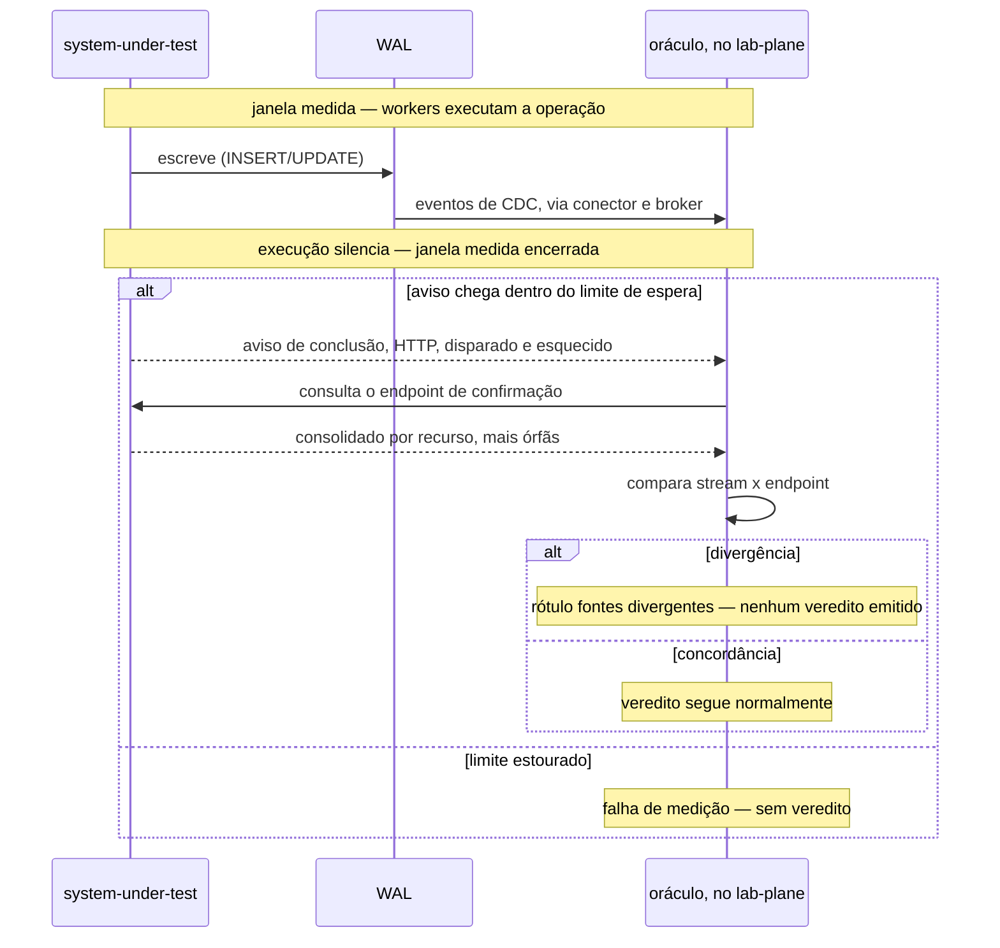
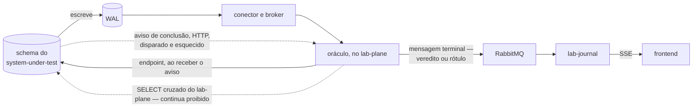

# Feature Card — Detecção de divergência entre fontes

Estado: `especificado, não implementado` · Origem: a decisão de especificar esta
capacidade **sem ADR** — escrever um foi recusado, e o corpo do ADR-0010 não é tocado.
Refinada no [Example Mapping](example-mapping.md#regras).

## Problema e resultado esperado

O oráculo lê o WAL do sistema medido por replicação lógica, fonte única do veredito
desde o
[ADR-0010](../../adr/0010-a-fronteira-de-schema-e-o-cdc-como-fonte-do-veredito.md#decisão).
O [ADR-0012](../../adr/0012-o-broker-no-caminho-do-veredito-e-a-dispensa-que-ele-exigiu.md#decisão)
já obriga o `lab-plane` a ordenar, desduplicar e detectar buraco na sequência pelo LSN,
atribuído pelo servidor PostgreSQL **antes de qualquer transporte existir**. **O escopo
desta capacidade encolheu para o resíduo dessas três obrigações**: um LSN corrompido,
reescrito ou perdido as derruba juntas, em silêncio — a sequência parece contígua ao
oráculo, e falta ou sobra evento. A comparação existe só para esse caso. Nenhum
documento afirma que ele já ocorreu, mas o próprio
[ADR-0012, Negativas](../../adr/0012-o-broker-no-caminho-do-veredito-e-a-dispensa-que-ele-exigiu.md#negativas)
registra que não há teste que prove a sobrevivência do LSN — e esta é a única
verificação que essa ressalva tem hoje, detalhada no
[Example Mapping](example-mapping.md#regras).

O resultado esperado: o sistema medido expõe um endpoint com o consolidado por recurso,
e avisa o oráculo por callback HTTP, independente do stream. O oráculo consulta o
endpoint ao receber o aviso, e compara; divergência produz o rótulo `fontes
divergentes`, sem veredito para a execução.

## Atores e gatilho

- **O sistema medido** — expõe o endpoint e o callback, agnóstico à janela medida: do
  ponto de vista dele, fornece dados e avisa o cliente do próprio sistema.
- **O oráculo**, no `lab-plane` — recebe o aviso, consulta, compara.
- **O frontend** — exibe o rótulo, se existir, via SSE do `lab-journal`.

Gatilho: o sistema medido chama o callback, fora da janela medida.

## Escopo

- A comparação cobre **só** a falha do LSN no transporte — corrompido, reescrito ou
  perdido —, nas duas direções: stream relatando menos, ou mais por duplicata que a
  desduplicação por LSN não descartou.
- O aviso de conclusão, por callback HTTP disparado e esquecido, fora da janela medida,
  com limite de espera: estourado, a execução termina sem veredito.
- A consulta ao endpoint, disparada pelo aviso, e o consolidado por recurso que ele
  retorna — valor final, capacidade, soma e contagem de alocações, mais órfãs.
- O registro, pelo endpoint, do instante de cada consulta recebida, e a detecção pelo
  relatório de consulta ocorrida dentro da janela medida.
- Os três rótulos que a comparação pode produzir, no lugar de veredito, checados nesta
  ordem: `fonte incompleta` (buraco de LSN), `fonte atrasada` (atraso), e `fontes
  divergentes` (discordam). Compor isso com os vereditos dos oráculos segue
  [capacidade conhecida e não
  especificada](../README.md#capacidade-conhecida-e-não-especificada).

## Fora de escopo

- Consultar o endpoint fora do gatilho do aviso, ou o endpoint recusar uma consulta —
  ele não recusa nada, registra.
- A forma concreta do endpoint e do callback — rota, método, payload — e qualquer
  contrato formal: nasce quando a interface existir
  ([`contracts/README.md`](../../contracts/README.md#estado-nenhum-contrato-existe)).
- Quem verifica a órfã de `allocation`, que segue sem decisão e não é deste card. Ela é
  achado que entra no relatório, e não invalida a execução.
- Qualquer alteração ao ADR-0010, e a contiguidade de LSN e a marca de fim — guardas de
  `R8`/`R9` de
  [deteccao-de-protecao-inerte](../deteccao-de-protecao-inerte/feature-card.md#regras-de-negócio),
  que **não** cobrem a falha do LSN, e é por isso que esta capacidade existe.

## Regras de negócio

| #  | Regra                                                                                                                                                                                                                                                                                                                                                                                                                                | Evidência                                                                                                                                                                                                     | Aprovada por                                           |
| -- | ------------------------------------------------------------------------------------------------------------------------------------------------------------------------------------------------------------------------------------------------------------------------------------------------------------------------------------------------------------------------------------------------------------------------------------ | ------------------------------------------------------------------------------------------------------------------------------------------------------------------------------------------------------------- | ------------------------------------------------------ |
| R1 | O oráculo **DEVE** consultar o endpoint de confirmação somente ao receber o aviso de conclusão do sistema medido, e **NÃO DEVE** consultá-lo dentro da janela que o experimento mede.                                                                                                                                                                                                                                                | decisão da pessoa, sem ADR — consultar o endpoint dentro da janela medida poria carga e lock no sistema medido, e o experimento passaria a medir também a confirmação                                         | pessoa, em 2026-08-13; gatilho precisado em 2026-08-14 |
| R2 | O endpoint **DEVE** retornar um consolidado por recurso — o valor final, a capacidade, a soma das alocações e a contagem de alocações —, mais a contagem de alocações órfãs.                                                                                                                                                                                                                                                         | decisão da pessoa, sem ADR — das três formas oferecidas para o endpoint (consolidado por recurso, conjunto de identificadores, as linhas), a escolhida foi a primeira; as outras duas não aparecem na decisão | pessoa, em 2026-08-13                                  |
| R3 | Uma divergência entre o consolidado do endpoint e a leitura do stream de CDC **DEVE** produzir o rótulo `fontes divergentes` — nenhum veredito é emitido para a execução —, e o rótulo **DEVE** ser reportado no frontend.                                                                                                                                                                                                           | decisão da pessoa, sem ADR — o endpoint não é confiado cegamente, e serve para confirmar o que o stream entregou; a inconsistência entre as duas leituras invalida o veredito daquela execução                | pessoa, em 2026-08-13; precisada em 2026-08-14         |
| R4 | O sistema medido **DEVE** avisar a conclusão do processo por um callback HTTP, disparado e esquecido, fora da janela medida; a impossibilidade de entregá-lo **NÃO DEVE** alterar nada no sistema medido. Esgotado um limite de espera sem o aviso chegar, a execução termina sem veredito — registrada, pelo par abertura/fechamento do broker, como execução que não produziu veredito, e não como veredito perdido no transporte. | [Example Mapping, O aviso de conclusão](example-mapping.md#o-aviso-de-conclusão)                                                                                                                              | pessoa, em 2026-08-14                                  |
| R5 | O endpoint de confirmação **DEVE** registrar o instante de cada consulta recebida, e **NÃO DEVE** recusar nenhuma. O relatório final **DEVE** cruzar esses instantes com a janela medida; uma consulta registrada dentro dela é falha de medição — catalogada, apresentada no relatório, e sem veredito emitido.                                                                                                                     | [Example Mapping, A consulta indevida](example-mapping.md#a-consulta-indevida)                                                                                                                                | pessoa, em 2026-08-14                                  |

## Integrações e contratos afetados

Fronteira nova: `system-under-test` → `lab-plane`, aviso de conclusão HTTP, disparado e
esquecido, fora da janela medida; e `lab-plane` → `system-under-test`, a consulta
disparada ao recebê-lo. Sem contrato — ele nasce quando a interface existir
([`contracts/README.md`](../../contracts/README.md#estado-nenhum-contrato-existe)).

**A letra do ADR-0010 não é contrariada** — quem lê o schema é o dono dele
([ADR-0010, Decisão](../../adr/0010-a-fronteira-de-schema-e-o-cdc-como-fonte-do-veredito.md#decisão)).
Quatro trechos dele ficam desatualizados e permanecem intocados: as consequências
negativas, a justificativa, o primeiro item dos trade-offs e a alternativa "Chamada HTTP
ao próprio system under test", descartada ali e adotada aqui.

**`R4` tensionava a letra do ADR-0008, e o
[ADR-0020](../../adr/0020-o-aviso-de-conclusao-e-a-subsuncao-do-adr-0008.md#decisão)
subsume a proibição**: ela vale por inteiro para a chamada de passo, e passa a admitir o
aviso de conclusão nas três condições que aquele ADR fixa.

**O rótulo chega ao frontend pelo mesmo caminho do veredito**: mensagem terminal no
RabbitMQ, persistida e emitida por SSE pelo `lab-journal`, sem `Backend For Frontend`
nem aresta nova — detalhado no [Example Mapping](example-mapping.md#regras).

## Riscos e decisões pendentes

- **De quem é o endpoint de confirmação, qual rótulo o estouro do aviso produz, e qual
  identidade a execução carrega** — mesmo discriminador do CDC, ou um segundo
  identificador. Ninguém decidiu; detalhado no
  [Example Mapping](example-mapping.md#perguntas-em-aberto).
- **A objeção contra "Chamada HTTP" e o que `R3`/`R5` fazem com a órfã de `R2`** seguem
  sem resposta, no [Example Mapping](example-mapping.md#perguntas-em-aberto).

## Critérios de pronto

R1 a R5 verificadas por teste. R1: sem consulta antes do aviso — travando a execução e
checando ausência de chamada. R2: consolidado com as quatro grandezas por recurso, mais
órfãs. R3: discordância **DEVE** produzir `fontes divergentes`, sem veredito. R4: sem
aviso, esgotado o limite, sem veredito, e o sistema medido **NÃO DEVE** ser afetado. R5:
consulta antes do aviso é registrada, catalogada, sem veredito.

## Links

- [Example Mapping](example-mapping.md)
- [`ADR-0008`](../../adr/0008-os-dois-planos-em-processos-separados.md), `Aceito` —
  tensão com `R4` resolvida pelo `ADR-0020`
- [`ADR-0010`](../../adr/0010-a-fronteira-de-schema-e-o-cdc-como-fonte-do-veredito.md),
  `Aceito`
- [`ADR-0012`](../../adr/0012-o-broker-no-caminho-do-veredito-e-a-dispensa-que-ele-exigiu.md),
  `Aceito`
- [`ADR-0013`](../../adr/0013-a-proveniencia-da-fonte-como-criterio-da-proibicao-do-oraculo.md),
  `Aceito`
- [`ADR-0020`](../../adr/0020-o-aviso-de-conclusao-e-a-subsuncao-do-adr-0008.md), `Aceito`
