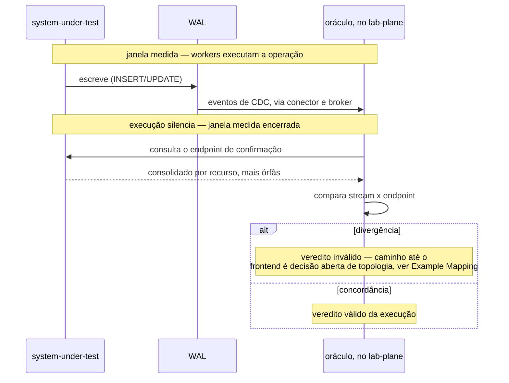
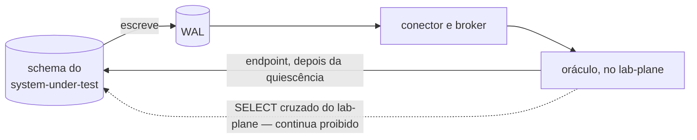

# Feature Card — Detecção de divergência entre fontes

Estado: `especificado, não implementado` · Origem:
[`E-96`, fecho](../../fila-de-decisoes.md#e-96-fecha-em-card-e-example-mapping-sem-adr-escolhida-em-2026-08-13),
decisão sem ADR — a pessoa recusou o artefato recomendado.

## Problema e resultado esperado

O oráculo lê o WAL do sistema medido por replicação lógica, fonte única do veredito
desde o
[ADR-0010](../../adr/0010-a-fronteira-de-schema-e-o-cdc-como-fonte-do-veredito.md#decisão).
O risco que motivou esta proposta é a perda de evento no transporte entre o WAL e o
oráculo
([`E-96`, enunciado](../../fila-de-decisoes.md#e-96--o-sistema-medido-expõe-endpoint-de-confirmação-e-a-fonte-deixa-de-ser-única)).
Parte desse risco já é guardada, com os rótulos `fonte incompleta` e `fonte atrasada` —
`R8` e `R9` de
[deteccao-de-protecao-inerte](../deteccao-de-protecao-inerte/feature-card.md#regras-de-negócio).
Se essas guardas não alcançarem essa perda — `Pergunta em aberto` abaixo —, o resíduo
que esta proposta cobre é: stream sem buraco, dentro do prazo, mas divergindo do que o
sistema medido confirma; delimitação em Fora de escopo.

O resultado esperado é um segundo testemunho, por caminho distinto do WAL: o sistema
medido expõe um endpoint que relata o que ocorreu no próprio schema. O oráculo consulta
depois que a execução silencia, e compara o consolidado contra o que o stream entregou.
Divergência invalida o veredito, e é reportada no frontend.

## Atores e gatilho

- **O oráculo, no `lab-plane`** — consulta o endpoint depois que a execução silencia.
- **O sistema medido** — expõe o endpoint, sem confiança cega: a fonte do número é o
  stream; o endpoint é segundo testemunho.
- **O frontend** — exibe a divergência, se ela existir.

Gatilho: fim da execução medida, quando a janela encerra.

## Escopo

- A consulta ao endpoint, **somente** depois da quiescência.
- O consolidado por recurso: valor final, capacidade, soma das alocações e contagem de
  alocações, mais a contagem de alocações órfãs.
- A comparação entre a leitura do stream e a leitura do endpoint.
- A invalidação do veredito da execução quando as duas leituras divergirem.
- O reporte da divergência no frontend.

## Fora de escopo

- Consultar o endpoint dentro da janela medida — proibido por `R1`.
- A forma concreta do endpoint — rota, método, payload — e qualquer contrato formal:
  nasce quando a interface existir
  ([`contracts/README.md`](../../contracts/README.md#estado-nenhum-contrato-existe)).
- Quem verifica a órfã de `allocation` — pertence a
  [`E-74`](../../fila-de-decisoes.md#e-74--quem-verifica-a-órfã-de-allocation-e-o-obstáculo-que-caiu),
  aberta, e não a este card.
- Qualquer alteração ao ADR-0010: a letra dele não é contrariada, e o corpo não é
  tocado por este card.
- A contiguidade de LSN e a marca de fim, guardas de `R8`/`R9` de
  [deteccao-de-protecao-inerte](../deteccao-de-protecao-inerte/feature-card.md#regras-de-negócio)
  — se cobrem esta perda é `Pergunta em aberto`, acima.
- Quando a leitura do stream está completa para ser comparada — `R1` fixa a hora da
  consulta ao endpoint, não a do stream. `Pergunta em aberto`, no
  [Example Mapping](example-mapping.md#perguntas-em-aberto).

## Regras de negócio

| #  | Regra                                                                                                                                                                        | Evidência                                                                                                       | Aprovada por          |
|----|------------------------------------------------------------------------------------------------------------------------------------------------------------------------------|-----------------------------------------------------------------------------------------------------------------|-----------------------|
| R1 | O oráculo **DEVE** consultar o endpoint de confirmação somente depois que a execução silencia, e **NÃO DEVE** consultá-lo dentro da janela que o experimento mede.           | [`E-96`, fecho](../../fila-de-decisoes.md#e-96-fecha-em-card-e-example-mapping-sem-adr-escolhida-em-2026-08-13) | pessoa, em 2026-08-13 |
| R2 | O endpoint **DEVE** retornar um consolidado por recurso — o valor final, a capacidade, a soma das alocações e a contagem de alocações —, mais a contagem de alocações órfãs. | [`E-96`, fecho](../../fila-de-decisoes.md#e-96-fecha-em-card-e-example-mapping-sem-adr-escolhida-em-2026-08-13) | pessoa, em 2026-08-13 |
| R3 | Uma divergência entre o consolidado do endpoint e a leitura do stream de CDC **DEVE** invalidar o veredito daquela execução, e **DEVE** ser reportada no frontend.           | [`E-96`, fecho](../../fila-de-decisoes.md#e-96-fecha-em-card-e-example-mapping-sem-adr-escolhida-em-2026-08-13) | pessoa, em 2026-08-13 |

## Integrações e contratos afetados

Fronteira nova: `lab-plane` → `system-under-test`, depois da quiescência — o estado
dela vive na [matriz](../../architecture/integrations.md#matriz), e este card não o
repete. Sem contrato: nasce só quando a interface existir
([`contracts/README.md`](../../contracts/README.md#estado-nenhum-contrato-existe)).

**A letra do ADR-0010 não é contrariada** — endpoint do próprio sistema medido não é
`SELECT` cruzado, pois quem lê o schema é o dono dele
([ADR-0010, Decisão](../../adr/0010-a-fronteira-de-schema-e-o-cdc-como-fonte-do-veredito.md#decisão)).
Quatro trechos ficam desatualizados, sem serem tocados — `### Negativas`,
`## Justificativa`, o primeiro item de `## Trade-offs`, e "Chamada HTTP", título da
alternativa no ADR-0010: aqui se adota a consulta ao endpoint, sem transporte
decidido —, listados no
[fecho de `E-96`](../../fila-de-decisoes.md#e-96-fecha-em-card-e-example-mapping-sem-adr-escolhida-em-2026-08-13),
terceiro caso de
[`E-71`](../../fila-de-decisoes.md#e-71--uma-decisão-sem-adr-falsificou-prosa-de-um-adr-aceito).

O caminho de `OR` até o frontend fica fora do diagrama: nenhuma aresta do
[ADR-0011](../../adr/0011-a-topologia-de-servicos-e-o-caderno-de-laboratorio-fora-do-git.md#comando-no-lab-plane-leitura-no-lab-journal-sem-bff)
leva um veredito até lá — decisão aberta de topologia, no
[Example Mapping](example-mapping.md#perguntas-em-aberto).

## Riscos e decisões pendentes

- **De quem é o endpoint.** `Pergunta em aberto`
  ([`E-96`](../../fila-de-decisoes.md#e-96--o-sistema-medido-expõe-endpoint-de-confirmação-e-a-fonte-deixa-de-ser-única)).
- **O resultado de `R3` já tem nome.** O instrumento nomeia três rótulos, nunca
  veredito do sistema medido: `fontes divergentes` — as duas fontes alcançaram o
  commit final e discordam; `fonte atrasada` — uma não alcançou o ponto a tempo;
  `fonte incompleta` — buraco na sequência de LSN, sem veredito. Ordem de conferência:
  LSN, commit final, concordância. `Pergunta em aberto`: se `R3` produz `fontes
  divergentes`, e onde entra o endpoint nessa ordem. Composição num relatório único
  segue aberta
  ([capacidade conhecida e não especificada](../README.md#capacidade-conhecida-e-não-especificada)).
  Detalhada no [Example Mapping](example-mapping.md#perguntas-em-aberto).
- **Se a guarda de contiguidade do ADR-0013 cobre a perda que motiva esta proposta.**
  `Pergunta em aberto`, no [Example Mapping](example-mapping.md#perguntas-em-aberto).
- **A objeção contra "Chamada HTTP" incide sobre `R3`, sem resposta.** `Pergunta em
  aberto`, no [Example Mapping](example-mapping.md#perguntas-em-aberto).
- **O que `R3` faz com a órfã de `R2` não foi decidido**, e toca
  [`E-74`](../../fila-de-decisoes.md#e-74--quem-verifica-a-órfã-de-allocation-e-o-obstáculo-que-caiu),
  aberta — no [Example Mapping](example-mapping.md#perguntas-em-aberto).
- **Se a recusa do lado do endpoint deve virar regra própria.** `R1` obriga o oráculo;
  o endpoint recusar por conta própria não está decidido. `Pergunta em aberto`, no
  [Example Mapping](example-mapping.md#perguntas-em-aberto).

## Critérios de pronto

R1 a R3 verificadas por teste. R1: o oráculo **NÃO DEVE** emitir a consulta antes da
quiescência — verificado travando a execução em curso e checando ausência de chamada.
R2: o consolidado contém as quatro grandezas por recurso mais a contagem de órfãs. R3:
endpoint e stream discordando **DEVE** terminar sem veredito válido, com divergência
exibida no frontend.

## Links

- [Example Mapping](example-mapping.md)
- [`E-96`, enunciado](../../fila-de-decisoes.md#e-96--o-sistema-medido-expõe-endpoint-de-confirmação-e-a-fonte-deixa-de-ser-única)
  e
  [`E-96`, fecho](../../fila-de-decisoes.md#e-96-fecha-em-card-e-example-mapping-sem-adr-escolhida-em-2026-08-13)
- [`ADR-0010`](../../adr/0010-a-fronteira-de-schema-e-o-cdc-como-fonte-do-veredito.md),
  `Aceito` — a fronteira que este card não contraria
- [`ADR-0013`](../../adr/0013-a-proveniencia-da-fonte-como-criterio-da-proibicao-do-oraculo.md),
  `Aceito` — a guarda de contiguidade que delimita o risco
- [`E-71`](../../fila-de-decisoes.md#e-71--uma-decisão-sem-adr-falsificou-prosa-de-um-adr-aceito) —
  dona do diagnóstico de prosa desatualizada sem ADR
- [`E-74`](../../fila-de-decisoes.md#e-74--quem-verifica-a-órfã-de-allocation-e-o-obstáculo-que-caiu) —
  quem verifica a órfã, aberta
- [`architecture/integrations.md`](../../architecture/integrations.md#matriz) — a
  fronteira nova
