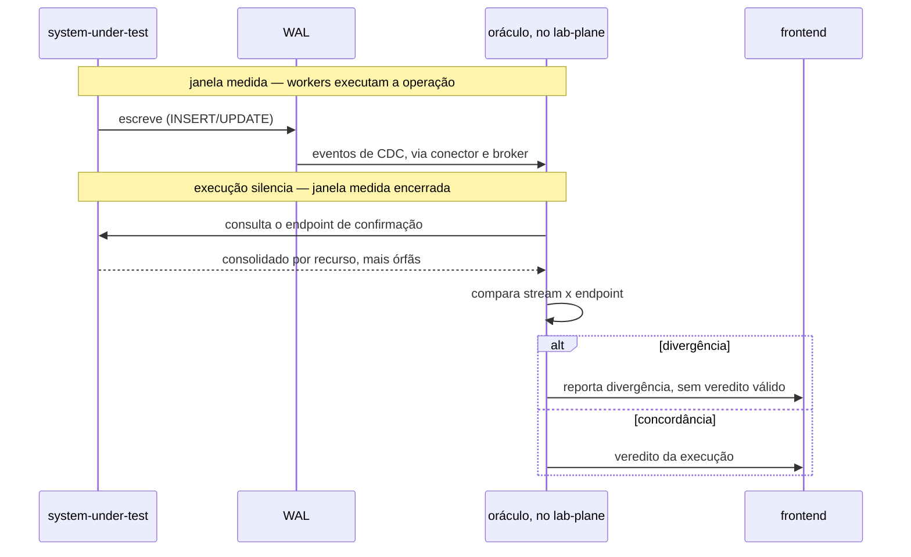
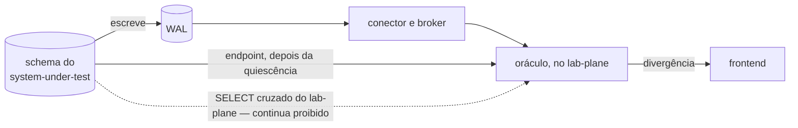

# Feature Card — Detecção de divergência entre fontes

Estado: `especificado, não implementado` · Origem:
[`E-96`, fecho](../../adr/fila-de-decisoes.md#e-96-fecha-em-card-e-example-mapping-sem-adr-escolhida-em-2026-08-13),
decisão sem ADR — a pessoa recusou o artefato recomendado.

## Problema e resultado esperado

O oráculo lê o WAL do sistema medido por replicação lógica, fonte única do veredito
desde o
[ADR-0010](../../adr/0010-a-fronteira-de-schema-e-o-cdc-como-fonte-do-veredito.md#decisão).
O risco que motivou esta proposta é a perda de evento no transporte entre o WAL e o
oráculo
([`E-96`, enunciado](../../adr/fila-de-decisoes.md#e-96--o-sistema-medido-expõe-endpoint-de-confirmação-e-a-fonte-deixa-de-ser-única)).
Os ADRs aceitos já guardam parte desse risco com sintoma, e não em silêncio — a
delimitação exata está em Riscos e decisões pendentes.

O resultado esperado é um segundo testemunho, por um caminho distinto do WAL: o
sistema medido expõe um endpoint que relata o que ocorreu no próprio schema. O
oráculo o consulta depois que a execução silencia, e compara o consolidado devolvido
contra o que o stream de CDC entregou. Uma divergência invalida o veredito daquela
execução, e é reportada no frontend.

## Atores e gatilho

- **O oráculo, no `lab-plane`** — consulta o endpoint depois que a execução silencia.
- **O sistema medido** — expõe o endpoint, sem ser confiado cegamente: a fonte do
  número continua sendo o stream; o endpoint é segundo testemunho.
- **O frontend** — exibe a divergência, quando ela existir.

Gatilho: fim de uma execução medida, depois que a janela medida encerra.

## Escopo

- A consulta ao endpoint, e ela acontece **somente** depois que a execução silencia.
- O consolidado por recurso: valor final, capacidade, soma das alocações e contagem de
  alocações, mais a contagem de alocações órfãs.
- A comparação entre a leitura do stream de CDC e a leitura do endpoint.
- A invalidação do veredito da execução quando as duas leituras divergirem.
- O reporte da divergência no frontend.

## Fora de escopo

- Consultar o endpoint dentro da janela medida — proibido por `R1`.
- A forma concreta do endpoint — rota, método, payload — e qualquer contrato formal:
  nasce quando a interface existir
  ([`contracts/README.md`](../../contracts/README.md#estado-nenhum-contrato-existe)).
- Quem verifica a órfã de `allocation` — pertence a
  [`E-74`](../../adr/fila-de-decisoes.md#e-74--quem-verifica-a-órfã-de-allocation-e-o-obstáculo-que-caiu),
  aberta, e não a este card.
- Qualquer alteração ao ADR-0010: a letra dele não é contrariada, e o corpo não é
  tocado por este card.

## Regras de negócio

| #  | Regra                                                                                                                                                                        | Evidência                                                                                                            | Aprovada por          |
|----|------------------------------------------------------------------------------------------------------------------------------------------------------------------------------|-----------------------------------------------------------------------------------------------------------------------|------------------------|
| R1 | O oráculo **DEVE** consultar o endpoint de confirmação somente depois que a execução silencia, e **NÃO DEVE** consultá-lo dentro da janela que o experimento mede.           | [`E-96`, fecho](../../adr/fila-de-decisoes.md#e-96-fecha-em-card-e-example-mapping-sem-adr-escolhida-em-2026-08-13) | pessoa, em 2026-08-13 |
| R2 | O endpoint **DEVE** retornar um consolidado por recurso — o valor final, a capacidade, a soma das alocações e a contagem de alocações —, mais a contagem de alocações órfãs. | [`E-96`, fecho](../../adr/fila-de-decisoes.md#e-96-fecha-em-card-e-example-mapping-sem-adr-escolhida-em-2026-08-13) | pessoa, em 2026-08-13 |
| R3 | Uma divergência entre o consolidado do endpoint e a leitura do stream de CDC **DEVE** invalidar o veredito daquela execução, e **DEVE** ser reportada no frontend.           | [`E-96`, fecho](../../adr/fila-de-decisoes.md#e-96-fecha-em-card-e-example-mapping-sem-adr-escolhida-em-2026-08-13) | pessoa, em 2026-08-13 |

## Integrações e contratos afetados

Fronteira nova: `lab-plane` → `system-under-test`, depois da quiescência — o estado
dela vive na [matriz](../../architecture/integrations.md#matriz), e este card não o
repete. Sem contrato: nasce só quando a interface existir
([`contracts/README.md`](../../contracts/README.md#estado-nenhum-contrato-existe)).

**A letra do ADR-0010 não é contrariada** — um endpoint do próprio sistema medido não
é `SELECT` cruzado, porque quem lê o schema é o dono dele
([ADR-0010, Decisão](../../adr/0010-a-fronteira-de-schema-e-o-cdc-como-fonte-do-veredito.md#decisão)).
**Quatro seções dele ficam desatualizadas, sem serem tocadas** — `### Negativas`,
`## Justificativa`, o primeiro item de `## Trade-offs`, e a alternativa
["Chamada HTTP ao próprio system under test"](../../adr/0010-a-fronteira-de-schema-e-o-cdc-como-fonte-do-veredito.md#chamada-http-ao-próprio-system-under-test),
descartada ali e adotada aqui. O registro vive em
[`E-71`](../../adr/fila-de-decisoes.md#e-71--uma-decisão-sem-adr-falsificou-prosa-de-um-adr-aceito),
terceiro caso conhecido dela, e no
[fecho de `E-96`](../../adr/fila-de-decisoes.md#e-96-fecha-em-card-e-example-mapping-sem-adr-escolhida-em-2026-08-13).

## Riscos e decisões pendentes

- **De quem é o endpoint.** `Pergunta em aberto`
  ([`E-96`, enunciado](../../adr/fila-de-decisoes.md#e-96--o-sistema-medido-expõe-endpoint-de-confirmação-e-a-fonte-deixa-de-ser-única)).
- **O formato do resultado de divergência.** `Pergunta em aberto`; ver
  [capacidade conhecida e não especificada](../README.md#capacidade-conhecida-e-não-especificada).
- **Onde a guarda de contiguidade do ADR-0013 já cobre a perda no transporte, e onde
  não cobre.** Não estabelecido pelos ADRs aceitos. `Pergunta em aberto`, detalhada no
  [Example Mapping](example-mapping.md#perguntas-em-aberto).
- **A objeção contra "Chamada HTTP", descartada no ADR-0010, incide sobre `R3`, e não
  está respondida.** `Pergunta em aberto`, detalhada no
  [Example Mapping](example-mapping.md#perguntas-em-aberto).
- **A contagem de órfãs de `R2` toca [`E-74`](../../adr/fila-de-decisoes.md#e-74--quem-verifica-a-órfã-de-allocation-e-o-obstáculo-que-caiu),
  aberta, e a `Pergunta em aberto` do
  [ADR-0015](../../adr/0015-a-chave-o-discriminador-de-execucao-e-as-colunas-de-tempo.md#sem-chave-estrangeira-em-allocationresource_id)
  sobre quem verifica a órfã.** `R2` introduz uma quinta saída sem decidi-la, e o que
  `R3` faz com a contagem de órfãs não foi decidido. Detalhada no
  [Example Mapping](example-mapping.md#perguntas-em-aberto).

## Critérios de pronto

R1 a R3 verificadas por teste. R1: consulta antes da quiescência **DEVE** ser recusada
ou impossível pela arquitetura. R2: o consolidado contém as quatro grandezas por
recurso mais a contagem de órfãs. R3: endpoint e stream discordando **DEVE** terminar
sem veredito válido, com divergência exibida no frontend.

## Links

- [Example Mapping](example-mapping.md)
- [`E-96`, enunciado](../../adr/fila-de-decisoes.md#e-96--o-sistema-medido-expõe-endpoint-de-confirmação-e-a-fonte-deixa-de-ser-única)
  e
  [`E-96`, fecho](../../adr/fila-de-decisoes.md#e-96-fecha-em-card-e-example-mapping-sem-adr-escolhida-em-2026-08-13)
- [`ADR-0010`](../../adr/0010-a-fronteira-de-schema-e-o-cdc-como-fonte-do-veredito.md),
  `Aceito` — a fronteira que este card não contraria
- [`ADR-0013`](../../adr/0013-a-proveniencia-da-fonte-como-criterio-da-proibicao-do-oraculo.md),
  `Aceito` — a guarda de contiguidade que delimita o risco
- [`E-71`](../../adr/fila-de-decisoes.md#e-71--uma-decisão-sem-adr-falsificou-prosa-de-um-adr-aceito) —
  dona do diagnóstico de prosa desatualizada sem ADR
- [`E-74`](../../adr/fila-de-decisoes.md#e-74--quem-verifica-a-órfã-de-allocation-e-o-obstáculo-que-caiu) —
  quem verifica a órfã, aberta
- [`architecture/integrations.md`](../../architecture/integrations.md#matriz) — a
  fronteira nova
