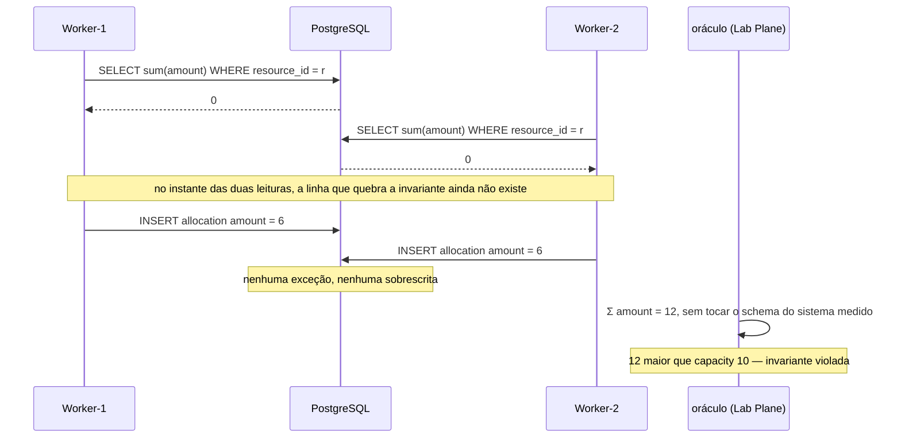

# Example Mapping — Detecção de proteção presente e inerte

Companheiro de [`feature-card.md`](feature-card.md). As regras vêm do
[`ADR-0002`](../../adr/0002-o-dominio-minimo-e-os-dois-oraculos.md), do
[`ADR-0010`](../../adr/0010-a-fronteira-de-schema-e-o-cdc-como-fonte-do-veredito.md), do
[`ADR-0013`](../../adr/0013-a-proveniencia-da-fonte-como-criterio-da-proibicao-do-oraculo.md)
e do [`ADR-0015`](../../adr/0015-a-chave-o-discriminador-de-execucao-e-as-colunas-de-tempo.md),
todos `Aceito`, e da seção 6 do
[`plano-do-laboratorio.md`](../../plano-do-laboratorio.md).

## História

> Como quem ativou uma estratégia de concorrência, preciso descobrir que ela pode estar
> presente e não proteger nada, antes que a invariante quebre em silêncio numa aplicação
> real.

## Regras e exemplos

### R1 e R2 — A verdade é a soma, não uma coluna

- **Exemplo 1.1** — Um recurso com `capacity = 10` e nenhuma alocação. A verdade que
  interessa não está na linha do recurso: está na ausência de linhas em `Allocation`.
- **Exemplo 2.1, fluxo principal** — `allocate(r, 6)` sobre soma 0 e capacidade 10. Cabe,
  e a alocação é inserida.
- **Exemplo 2.2, borda** — `allocate(r, 4)` sobre soma 6 e capacidade 10. Atinge a
  capacidade exata. Cabe.
- **Exemplo 2.3, erro** — `allocate(r, 6)` sobre soma 6 e capacidade 10. Excede, e nada é
  inserido.

### R3 e R4 — O oráculo do predicado

- **Exemplo 3.1, a anomalia** — Dois workers, com barreiras. Cada um lê a soma (0),
  conclui que cabe uma alocação de 6, e insere. O oráculo lê 12 sobre capacidade 10.
- **Exemplo 4.1** — A violação reportada carrega `soma = 12` e `capacity = 10`. Um
  booleano sozinho não permitiria distinguir uma violação de 12 de uma de 60.
- **Exemplo 3.2, o que não acontece** — Nenhuma exceção é lançada. Nenhuma linha é
  sobrescrita. Nenhum log registra erro. É por isso que nenhum teste de unidade o detecta.

Por que travar a linha do recurso não ajudaria:

**A última aresta mudou de natureza, e o fenômeno não.** Até o
[`ADR-0010`](../../adr/0010-a-fronteira-de-schema-e-o-cdc-como-fonte-do-veredito.md) o
oráculo emitia `SELECT sum` contra o banco do sistema medido; a fronteira de schema
proibiu isso. O que o diagrama mostra continua idêntico — as duas leituras enxergam zero,
as duas inserções cabem, nenhuma exceção aparece. **Como o oráculo obtém aquele 12 tem
resposta desde o
[`ADR-0013`](../../adr/0013-a-proveniencia-da-fonte-como-criterio-da-proibicao-do-oraculo.md#decisão):**
ele soma `Σ amount` a partir dos eventos de `INSERT` do WAL, por proveniência, sob a
guarda de contiguidade de LSN.

**O `ADR-0015` não participa disso, e o que ele muda para o E5 são duas exigências
independentes.** `allocation.resource_id` não tem chave estrangeira porque o `FOR KEY
SHARE` que o `INSERT` com FK adquire colidiria com o `FOR UPDATE` de `PESSIMISTIC`
([`ADR-0015`, Sem chave estrangeira](../../adr/0015-a-chave-o-discriminador-de-execucao-e-as-colunas-de-tempo.md#sem-chave-estrangeira-em-allocationresource_id)).
E o plano de execução efetivo do braço `SERIALIZABLE` vai ao relatório porque, **sem o
índice aditivo**, o `40001` viria da varredura sequencial e do lock de relação, e ninguém
distinguiria uma causa da outra
([`ADR-0015`, Justificativa](../../adr/0015-a-chave-o-discriminador-de-execucao-e-as-colunas-de-tempo.md#justificativa)).
**Uma não decorre da outra**: acrescentar a chave estrangeira não dispensaria publicar o
plano. Por isso cada uma tem regra própria no card: a ausência de FK é `R10`, e a
publicação do plano efetivo é `R11`.

### A parte contraintuitiva — a proteção presente e inerte

- **Exemplo 5.1** — O mesmo experimento com `OPTIMISTIC` ativo produz o **mesmo**
  resultado. Inserir uma alocação não incrementa a `version` do recurso, porque não
  existe linha compartilhada para versionar.
- **Exemplo 5.2, por que o lock também não ajuda** — Travar a linha do recurso não resolve:
  no instante das duas leituras, a linha que quebra a invariante ainda não existe. Não
  há o que travar.
- **Exemplo 5.3, o contraste com o E1** — No E1 a proteção funciona, porque as duas
  transações disputam a **mesma linha**. Aqui elas escrevem linhas diferentes, e a
  invariante que elas violam juntas não pertence a nenhuma das duas.

### R6 — Os três ramos do predicado

- **Exemplo 6.1** — A prova de equivalência de `allocate` amostra: soma 0 com `amount` 6
  (cabe), soma 4 com `amount` 6 (atinge a capacidade), soma 6 com `amount` 6 (excede).
- **Exemplo 6.2, por que os três** — Um conjunto que amostre só o ramo que cabe deixa os
  outros dois invisíveis à prova, e uma divergência entre as resoluções ali nunca
  apareceria.

### R7 — O nível de isolamento como eixo

- **Exemplo 7.1** — Sob `READ COMMITTED`, as duas transações commitam e a invariante
  quebra.
- **Exemplo 7.2** — Sob `REPEATABLE READ`, as duas transações commitam e a invariante
  quebra. O PostgreSQL não detecta write skew nesse nível: as duas leram o mesmo
  conjunto e escreveram linhas distintas.
- **Exemplo 7.3** — Sob `SERIALIZABLE`, uma das transações aborta com SQLSTATE `40001`. A
  invariante sobrevive, ao custo de exigir retry na aplicação.
- **Exemplo 7.4, o que a varredura ensina** — O eixo do isolamento é **ortogonal** ao eixo
  da estratégia. `OPTIMISTIC` sob `READ COMMITTED` quebra; `NONE` sob `SERIALIZABLE` não
  quebra. Uma tabela com um eixo só esconde isso.

## Perguntas em aberto

| #  | Pergunta                                                                                                                                                                        | Origem                                                                                        |
|----|---------------------------------------------------------------------------------------------------------------------------------------------------------------------------------|-----------------------------------------------------------------------------------------------|
| P1 | Onde o nível de isolamento é declarado? O `ADR-0002` o deixou fora de escopo, e nenhum ADR posterior o fixou.                                                                   | [`ADR-0002`](../../adr/0002-o-dominio-minimo-e-os-dois-oraculos.md#o-que-este-adr-não-decide) |
| P2 | O retry exigido por `SERIALIZABLE` é da estratégia ou do runtime? A resposta muda quem conta as tentativas.                                                                     | nova, 2026-08-01                                                                              |
| P3 | `allocate` lê a soma e compara com `capacity`. Quando o predicado reprova, a operação reporta sucesso ou falha ao Lab Plane? A distinção afeta `commits − sucessos`.            | nova, 2026-08-01                                                                              |
| P4 | O oráculo avalia "para cada recurso". O E5 tem um recurso só — a contagem de coincidências qualificada por chave sugere experimentos com muitos. Quantos recursos o E5 declara? | nova, 2026-08-01                                                                              |
| P5 | Uma alocação nunca é removida no MVP. O oráculo do estado final quiescente serve por isso. Isso é premissa ou coincidência?                                                     | [`Q-0002-3`](../../questions/Q-0002-3.md)                                                     |

## Adiado de propósito

| Item                                           | Gatilho que o retoma                     |
|------------------------------------------------|------------------------------------------|
| Onde o nível de isolamento é declarado         | a decisão que fixar esse parâmetro       |
| Remoção de alocação                            | nenhum experimento do MVP a exige        |
| A semântica de cada estratégia de concorrência | a decisão de estratégias de concorrência |

## O que não virou cenário, e por quê

R1 (a verdade derivada) é estrutural e vira `Contexto`.

O comportamento sob `REPEATABLE READ` está no exemplo 7.2 e **virou** cenário, porque é
o resultado que mais contraria a intuição: o nome do nível sugere proteção que ele não
dá para este fenômeno.
