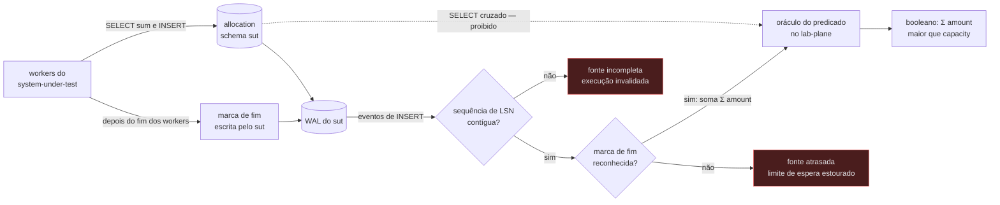

# Feature Card — Detecção de proteção presente e inerte

Estado: `especificado, não implementado` · Origem: [`ADR-0002`](../../adr/0002-o-dominio-minimo-e-os-dois-oraculos.md), `Aceito`

Cobre o experimento **E5** (`write-skew-inert-protection`).

## Problema e resultado esperado

Um engenheiro ativa optimistic locking e acredita estar protegido. Duas transações válidas
leem a mesma soma, cada uma conclui que cabe uma alocação, e as duas inserem. Nenhuma
sobrescreve a outra — não há atualização perdida. A soma passa da capacidade, **nenhuma
exceção é lançada**, e a anotação continua lá.

O resultado esperado é mostrar que "ter uma estratégia de concorrência" e
"estar protegido" são coisas diferentes. Nenhum teste de unidade detecta essa diferença.

## Atores e gatilho

- **Workers do system under test** — executam `allocate(resourceId, amount)`.
- **O oráculo do predicado** (Lab Plane) — avalia `Σ amount ≤ capacity` depois do fim,
  sem `SELECT` no schema do sistema medido, desde o
  [`ADR-0010`](../../adr/0010-a-fronteira-de-schema-e-o-cdc-como-fonte-do-veredito.md).

Gatilho: uma execução de experimento sobre `allocate`.

**A fonte foi decidida em 2026-08-09**, pelo
[`ADR-0013`](../../adr/0013-a-proveniencia-da-fonte-como-criterio-da-proibicao-do-oraculo.md):
`Σ amount` vem do WAL, e a soma é precedida da guarda de `R8`.

## Escopo

A operação `allocate`. O oráculo do predicado. A verdade derivada, que é a soma das
alocações e não uma coluna. O nível de isolamento como eixo de variação.

## Fora de escopo

O oráculo exato do contador está em
[`deteccao-de-atualizacao-perdida`](../deteccao-de-atualizacao-perdida/feature-card.md).
A semântica das estratégias de concorrência pertence à decisão ainda não tomada.

## Regras de negócio

| #  | Regra                                                                                                                                                                                                 | Evidência                                                                                                                                                                                                                | Aprovada por |
|----|-------------------------------------------------------------------------------------------------------------------------------------------------------------------------------------------------------|--------------------------------------------------------------------------------------------------------------------------------------------------------------------------------------------------------------------------|--------------|
| R1 | `Σ amount` das linhas de `Allocation` de um recurso é a **verdade derivada**. `capacity` é o limite dela. A verdade não é um contador na linha do recurso.                                            | [ADR-0002, Decisão](../../adr/0002-o-dominio-minimo-e-os-dois-oraculos.md#decisão)                                                                                                                                       | pendente     |
| R2 | `allocate(resourceId, amount)` lê a soma das alocações, compara com `capacity` e insere quando couber.                                                                                                | [ADR-0002, Decisão](../../adr/0002-o-dominio-minimo-e-os-dois-oraculos.md#decisão)                                                                                                                                       | pendente     |
| R3 | O oráculo avalia `Σ amount ≤ capacity` para cada recurso depois do fim da execução, e **NÃO DEVE** emitir `SELECT` no schema do sistema medido. `Σ amount` vem dos `INSERT` no WAL.                   | [ADR-0010, Decisão](../../adr/0010-a-fronteira-de-schema-e-o-cdc-como-fonte-do-veredito.md#decisão) e [ADR-0013, Decisão](../../adr/0013-a-proveniencia-da-fonte-como-criterio-da-proibicao-do-oraculo.md#decisão)       | pendente     |
| R4 | O veredito é booleano, e a violação **DEVE** carregar os dois números: a soma obtida e a capacidade declarada.                                                                                        | [ADR-0002, O oráculo do predicado](../../adr/0002-o-dominio-minimo-e-os-dois-oraculos.md#o-oráculo-do-predicado)                                                                                                         | pendente     |
| R5 | O oráculo **NÃO DEVE** derivar o estado final do log de observações do Lab Plane. A proibição alcança fonte produzida pelo instrumento, e o WAL não é uma delas.                                      | [ADR-0002, O oráculo lê o banco](../../adr/0002-o-dominio-minimo-e-os-dois-oraculos.md#o-oráculo-lê-o-banco-e-não-deve-ler-o-log-de-observações)                                                                         | pendente     |
| R6 | O conjunto de entradas amostradas para `allocate` **DEVE** conter os três ramos do predicado: a alocação cabe, atinge a capacidade exata, e excede.                                                   | [ADR-0002, O critério de igualdade entre traços](../../adr/0002-o-dominio-minimo-e-os-dois-oraculos.md#o-critério-de-igualdade-entre-dois-traços-de-sql)                                                                 | pendente     |
| R7 | O mesmo experimento **DEVE** ser comparado sob `READ COMMITTED`, `REPEATABLE READ` e `SERIALIZABLE`. Só o terceiro aborta uma das transações, com SQLSTATE `40001`.                                   | [plano, E5](../../plano-do-laboratorio.md#e5--write-skew-inert-protection)                                                                                                                                               | pendente     |
| R8 | A contiguidade da sequência de LSN **DEVE** ser conferida antes da soma, no consumidor do broker. Um buraco **DEVE** invalidar a execução com o rótulo `fonte incompleta`, e nenhum veredito sai.     | [`E-46`, fecho](../../adr/fila-de-decisoes.md#e-46-fecha-no-consumidor-do-broker-escolhida-em-2026-08-10) e [ADR-0013, Decisão](../../adr/0013-a-proveniencia-da-fonte-como-criterio-da-proibicao-do-oraculo.md#decisão) | pendente     |
| R9 | O oráculo **DEVE** somar até reconhecer no stream o evento da marca de fim, escrita pelo sistema medido fora da janela medida. O estouro do limite de espera produz `fonte atrasada`, e não veredito. | [`E-47`, fecho](../../adr/fila-de-decisoes.md#e-47-fecha-na-sentinela-escolhida-em-2026-08-10)                                                                                                                           | pendente     |

O diagrama de por que travar a linha do recurso não ajudaria está no
[Example Mapping](example-mapping.md).

## Integrações e contratos afetados

`allocate` emite um `SELECT sum` e um `INSERT` contra `allocation` — isso é o domínio do
sistema medido, e não mudou. **O oráculo não emite `SELECT`**: o schema do
`system-under-test` é inacessível ao Lab Plane, sem `GRANT` cruzado. Quem o substitui é o
WAL, por `R3`. **Não existe DDL nem contrato de esquema** — `Q-INT-5` em
[`integrations.md`](../../architecture/integrations.md#perguntas-em-aberto).

O transporte do
[ADR-0012](../../adr/0012-o-broker-no-caminho-do-veredito-e-a-dispensa-que-ele-exigiu.md#decisão)
passa a servir aos dois oráculos. A diferença não é de permissão: ler o último valor
pede **recência**, somar pede **completude** — e é isso que `R8` e `R9` repõem.

## Riscos e decisões pendentes

**O nível de isolamento é parâmetro da execução, e nada hoje o declara.** O
[`ADR-0002`](../../adr/0002-o-dominio-minimo-e-os-dois-oraculos.md#o-que-este-adr-não-decide)
não o decide, nenhum ADR aceito o decidiu depois, e este card também não.

**A distinção que o E5 existe para mostrar corre risco de ser apagada.** Uma estratégia é
código da aplicação e muda o SQL; um nível de isolamento é propriedade da transação e muda
o que o banco faz com o **mesmo** SQL. Tratá-los como valores da mesma enumeração apagaria
a diferença.

**[`Q-0002-3`](../../questions/Q-0002-3.md)** — o oráculo descreve o estado final
quiescente, e serve ao E5: uma alocação excedente não sai da tabela.

**O E5 deixou de estar bloqueado pela fonte do oráculo em 2026-08-09**, pelo
[`ADR-0013`](../../adr/0013-a-proveniencia-da-fonte-como-criterio-da-proibicao-do-oraculo.md),
que pôs o WAL onde o ADR-0010 deixara vazio. **As três pendências dele fecharam em
2026-08-10**, e `R8` e `R9` as carregam: a guarda vive no consumidor do broker, o buraco
produz `fonte incompleta`, e a soma termina numa marca de fim.

**`R8` herda a pergunta mais séria do ADR-0012**, nas
[consequências negativas](../../adr/0012-o-broker-no-caminho-do-veredito-e-a-dispensa-que-ele-exigiu.md#negativas):
que o LSN sobreviva ao transporte inteiro, sem teste que o prove.

## Critérios de pronto

R1 a R9 verificadas por teste. **R8 pela injeção**: retirado um evento de `INSERT` do
stream, a execução **DEVE** terminar como `fonte incompleta`, sem veredito. **R9 pela
retenção**: retida a marca de fim, a execução **DEVE** terminar como `fonte atrasada`. O
E5 produz `Σ = 12 > capacity = 10` sem exceção, com `OPTIMISTIC` ativo. Só
`SERIALIZABLE` registra aborto com SQLSTATE `40001`, na varredura dos três níveis. R5
pela negativa: o `lab_plane` não tem `GRANT` no schema do `system-under-test`, e um
`SELECT` cruzado **falha** por permissão.

## Links

- [Example Mapping](example-mapping.md) · [Cenários BDD](behavior.feature)
- [`ADR-0002`](../../adr/0002-o-dominio-minimo-e-os-dois-oraculos.md) ·
  [`plano-do-laboratorio.md`, seção 6, E5](../../plano-do-laboratorio.md#e5--write-skew-inert-protection)
- [`ADR-0010`](../../adr/0010-a-fronteira-de-schema-e-o-cdc-como-fonte-do-veredito.md), `Aceito` — retirou o `SELECT sum` deste oráculo
- [`ADR-0013`](../../adr/0013-a-proveniencia-da-fonte-como-criterio-da-proibicao-do-oraculo.md), `Aceito` — pôs o WAL no lugar, com a guarda
- [`execucao-de-experimento`](../execucao-de-experimento/feature-card.md) — o ciclo que consome este oráculo
