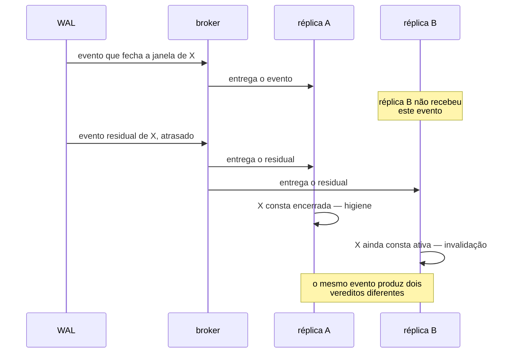

# Distinção entre higiene e invalidação — Example Mapping

Companheiro de [`feature-card.md`](feature-card.md). As regras vêm do
[`ADR-0012`](../../adr/0012-o-broker-no-caminho-do-veredito-e-a-dispensa-que-ele-exigiu.md),
`Aceito`, e do fecho de duas linhas da
[fila de decisões](../../adr/fila-de-decisoes.md): `E-33` e `E-35`.

## História

> Como o consumidor do broker dentro do `lab-plane`, preciso decidir, para cada evento
> que descarto, se ele corrompe o veredito de uma execução em curso ou se é resíduo
> inofensivo de uma janela que já fechou — para não descartar às cegas nem invalidar sem
> motivo.

## Regras

1. Um evento com discriminador de execução **ativa** e não reconhecida invalida essa
   execução.
2. Um evento com discriminador de execução **encerrada** é descartado em silêncio —
   higiene.
3. O consumidor conta todo evento que descarta, nos dois casos.
4. A lista de execuções ativas vive numa tabela do schema `lab_plane`.
5. O `lab-plane` roda em réplica única — condição do veredito confiável.
6. A tabela de execuções ativas não é histórico de execução, só estado corrente do
   filtro.

## Exemplos concretos

| Regra | Dado                                                                                     | Quando                                                                          | Então                                                                                    |
|-------|-------------------------------------------------------------------------------------------|----------------------------------------------------------------------------------|---------------------------------------------------------------------------------------------|
| R1    | A execução `X` está em curso, e não consta como discriminador reconhecido pelo consumidor no instante em que o evento chega | Chega um evento de `INSERT` do WAL com discriminador `X`, via broker             | A execução `X` é invalidada, e o descarte é contado como invalidação                        |
| R2    | A execução `Y` terminou e saiu da lista de execuções ativas                              | Chega um evento atrasado do broker com discriminador `Y`, depois do fim da execução | O evento é descartado em silêncio, o veredito de `Y` permanece como já estava, e o descarte é contado como higiene |
| R3    | Uma execução qualquer descarta um evento, por qualquer motivo                            | O consumidor termina de processar o lote                                        | O relatório da execução mostra a contagem de descartes, separada por motivo                 |
| R4    | O schema `lab_plane` está vazio, sem tabela nenhuma                                       | A primeira migração que cria uma tabela de execuções ativas é aplicada          | Ela se torna a primeira tabela daquele schema                                               |
| R5    | Duas réplicas do `lab-plane` sobem ao mesmo tempo, cada uma com sua própria visão da lista | O broker publica um evento com discriminador ativo só na visão da réplica A     | A réplica B, que não vê o discriminador como ativo, não tem como classificar o evento corretamente — contraexemplo, e não cenário |
| R6    | A tabela de execuções ativas tem uma linha para a execução `Z`                            | A execução `Z` termina                                                          | A linha some da tabela — mas o que ela guarda enquanto existe é só "está ativa", nunca o que `Z` mediu |

### Contraexemplo — o duplo descarte que a réplica única evita

Com duas réplicas, a réplica A vê o evento de `INSERT` que fecha a janela de `X` e marca
`X` como encerrada; a réplica B, que nunca viu esse evento porque o broker o entregou só
à réplica A (ou às duas, sem coordenação entre elas), continua tratando `X` como ativa.
Um evento de resíduo que chega depois é higiene para A e invalidação para B — a mesma
entrada produz dois vereditos, e nenhum dos dois sabe que o outro existe. É exatamente
por isso que
[`ADR-0012`](../../adr/0012-o-broker-no-caminho-do-veredito-e-a-dispensa-que-ele-exigiu.md#decisão)
exige réplica única, e por isso R5 não vira cenário: o comportamento sob duas réplicas
não é comportamento decidido, é o que a decisão de réplica única existe para impedir.

## Perguntas em aberto

| #  | Pergunta                                                                                                                                                     | Origem                                                                                                                                                                       |
|----|-----------------------------------------------------------------------------------------------------------------------------------------------------------|--------------------------------------------------------------------------------------------------------------------------------------------------------------------------|
| P1 | Qual é a forma da tabela de execuções ativas — colunas, chave e migração?                                                                                     | [E-35, fecho](../../adr/fila-de-decisoes.md#e-35-fecha-em-tabela-no-lab_plane-escolhida-em-2026-08-10)                                                                       |
| P2 | Como uma execução ativa deixa de ser ativa quando ela **alcança o fim**? A marca de fim é reconhecida por mais de um ator, e nenhum deles foi atribuído à remoção da linha. | [E-50](../../adr/fila-de-decisoes.md#e-50--como-uma-execução-ativa-deixa-de-ser-ativa-chegue-ou-não-ao-fim)                                                                  |
| P3 | Como uma execução ativa deixa de ser ativa quando ela **é abandonada**, sem escrever a marca de fim? Nenhum sinal foi decidido para esse caso.                | [E-50](../../adr/fila-de-decisoes.md#e-50--como-uma-execução-ativa-deixa-de-ser-ativa-chegue-ou-não-ao-fim)                                                                  |
| P4 | A remoção da linha de uma execução ativa entra em veredito? O fecho de `E-47` e o fecho de `E-35` apontam em direções opostas, e a divergência ficou registrada, não resolvida. | [E-50](../../adr/fila-de-decisoes.md#e-50--como-uma-execução-ativa-deixa-de-ser-ativa-chegue-ou-não-ao-fim)                                                                  |
| P5 | A réplica única é hoje ausência de reinício automático, não garantia formal contra duas réplicas. O que garante isso na entrega?                              | [E-3](../../adr/fila-de-decisoes.md#as-decisões-do-grupo-i-em-2026-08-06)                                                                                                    |

## Adiado de propósito

| Item                                                        | Gatilho que o retoma                                                     |
|--------------------------------------------------------------|----------------------------------------------------------------------------|
| A forma da tabela de execuções ativas                        | a decisão de `E-35` sobre colunas, chave e migração                       |
| O mecanismo que remove uma linha de execução ativa            | a decisão de `E-50`, nas duas metades                                     |
| A garantia formal de réplica única na entrega                 | a decisão de `E-3`, a forma do `deploy/`                                  |

## O que não virou cenário, e por quê

R4 (a tabela vira a primeira do schema `lab_plane`) é estrutural — descreve onde algo
vive, não um comportamento observável — e por isso não vira cenário; ela aparece como
exemplo para registrar a evidência.

R6 (a tabela não é histórico) também não vira cenário: ela é um limite negativo sobre a
forma da tabela, e a forma da tabela é `Pergunta em aberto`. Um cenário exigiria
descrever a coluna que não existe ainda, e um cenário BDD não cita coluna
([`specification-process.md`, BDD](../../specification-process.md#bdd--só-o-que-estabilizou)).

R5 (réplica única) não vira cenário porque descreve uma exigência de topologia de
implantação, não um comportamento observável dentro de uma execução — o contraexemplo
acima mostra por que ela é necessária, mas o cenário correto é "duas réplicas não sobem",
e isso pertence à entrega, não ao `lab-plane` em si.

Nenhuma das seis regras tem `Aprovada por` preenchido — todas nasceram `pendente`, pela
regra de que se aprova a regra, e não o card
([`AGENTS.md`](../../../AGENTS.md#pendências-de-processo)). Nenhuma vira cenário Gherkin
enquanto isso não mudar.
