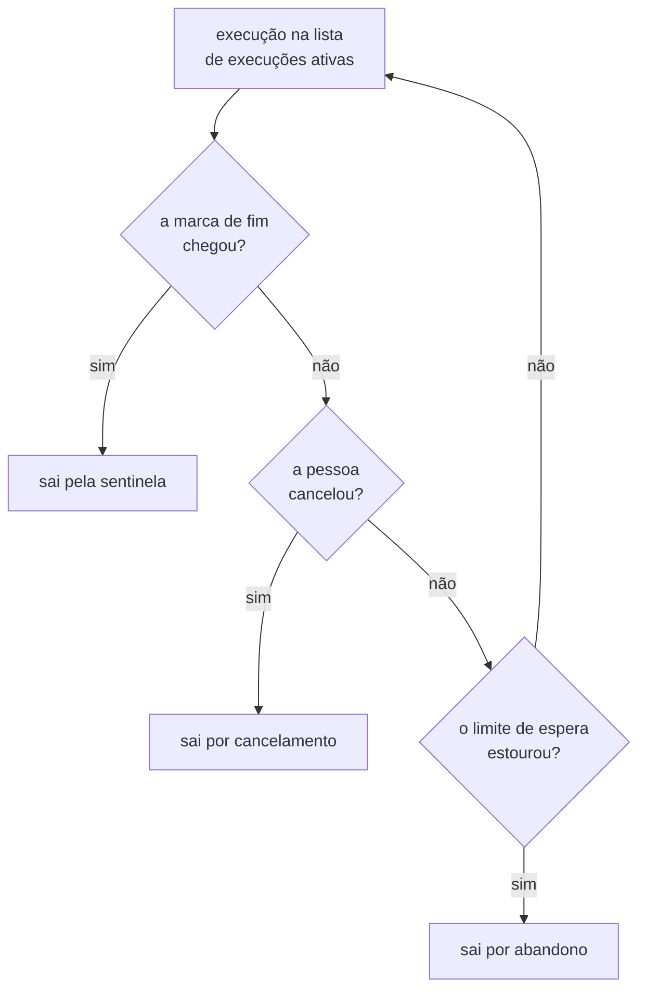
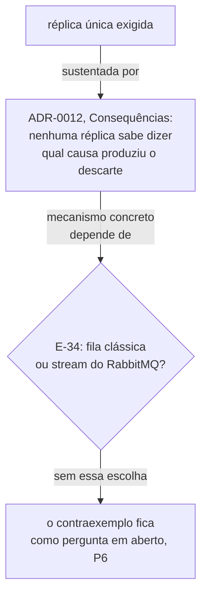

# Distinção entre higiene e invalidação — Example Mapping

Companheiro de [`feature-card.md`](feature-card.md). As regras vêm do
[`ADR-0012`](../../adr/0012-o-broker-no-caminho-do-veredito-e-a-dispensa-que-ele-exigiu.md),
`Aceito`, e do fecho de três linhas da
[fila de decisões](../../fila-de-decisoes.md): `E-33`, `E-35` e
[`E-50`](../../fila-de-decisoes.md#e-50-fecha-em-três-caminhos-de-saída-da-lista-escolhida-em-2026-08-12),
esta última a origem de `R7`.

## História

> Como o consumidor do broker dentro do `lab-plane`, preciso decidir, para cada evento
> que descarto, se ele corrompe o veredito de uma execução em curso ou se é resíduo
> inofensivo de uma janela que já fechou — para não descartar às cegas nem invalidar sem
> motivo.

## Regras

1. Um evento com discriminador de execução **ativa** e não reconhecida invalida essa
   execução.
2. Um evento com discriminador de execução **encerrada** é descartado em silêncio —
   higiene.
3. O consumidor conta todo evento que descarta, nos dois casos.
4. A lista de execuções ativas vive numa tabela do schema `lab_plane`.
5. O `lab-plane` roda em réplica única — condição do veredito confiável.
6. A tabela de execuções ativas não é histórico de execução, só estado corrente do
   filtro.
7. Uma execução sai da lista de execuções ativas por exatamente três caminhos: a
   sentinela de fim, o limite de espera do adaptador de relógio, ou o cancelamento
   explícito pela pessoa.

### Os três caminhos de saída da lista de execuções ativas

O fecho de `E-50` fixa o fluxo que R7 registra, com o mesmo diagrama a seguir
([E-50, fecho](../../fila-de-decisoes.md#e-50-fecha-em-três-caminhos-de-saída-da-lista-escolhida-em-2026-08-12)):

## Exemplos concretos

| Regra | Dado                                                                                                                                                  | Quando                                                                                                                                                                                                        | Então                                                                                                                                                                                                                             |
|-------|-------------------------------------------------------------------------------------------------------------------------------------------------------|---------------------------------------------------------------------------------------------------------------------------------------------------------------------------------------------------------------|-----------------------------------------------------------------------------------------------------------------------------------------------------------------------------------------------------------------------------------|
| R1    | A execução `X` está em curso, e não consta como discriminador reconhecido pelo consumidor no instante em que o evento chega                           | Chega um evento de `INSERT` do WAL com discriminador `X`, via broker                                                                                                                                          | A execução `X` é invalidada, e o descarte é contado como invalidação                                                                                                                                                              |
| R2    | A execução `Y` já não conta como ativa para o consumidor — ela saiu por um dos três caminhos que R7 fixa: sentinela, limite de espera ou cancelamento | Chega um evento atrasado do broker com discriminador `Y`, depois de `Y` deixar de contar como ativa                                                                                                           | O evento é descartado em silêncio, o veredito de `Y` permanece como já estava, e o descarte é contado como higiene                                                                                                                |
| R3    | Uma execução qualquer descarta um evento, por qualquer motivo                                                                                         | O consumidor termina de processar o lote                                                                                                                                                                      | O relatório da execução mostra a contagem de descartes, separada por motivo                                                                                                                                                       |
| R4    | O schema `lab_plane` está vazio, sem tabela nenhuma                                                                                                   | A primeira migração que cria uma tabela de execuções ativas é aplicada                                                                                                                                        | Ela se torna a primeira tabela daquele schema                                                                                                                                                                                     |
| R5    | Duas réplicas do `lab-plane` sobem ao mesmo tempo, lendo a mesma tabela de execuções ativas do schema `lab_plane` (R4)                                | Hipótese não decidida, condicionada ao ramo `fila clássica` de `E-34`: o broker distribui os eventos do backlog entre as duas réplicas, sem que nenhuma processe sozinha a sequência completa de uma execução | Nenhuma das duas sabe dizer, sozinha, qual causou um descarte — contraexemplo dependente do mecanismo que `E-34` ainda não decidiu, e não cenário                                                                                 |
| R6    | A tabela de execuções ativas tem uma linha para a execução `Z`                                                                                        | A execução `Z` termina                                                                                                                                                                                        | O que a linha guarda enquanto a execução consta como ativa é só "está ativa", nunca o que `Z` mediu — a linha sai por um dos três caminhos de R7; o valor do limite de espera, se for esse o caminho, é `Pergunta em aberto` (P7) |
| R7    | Uma execução `W` está ativa na tabela de execuções ativas do `lab_plane`                                                                              | Nenhuma marca de fim chega dentro do limite de espera do adaptador de relógio, e a pessoa não cancela pelo frontend                                                                                           | O `lab-plane` remove a linha de `W` pelo caminho do limite de espera, e não pelo caminho da sentinela nem pelo do cancelamento                                                                                                    |

### Contraexemplo — o duplo descarte que a réplica única evita

O `ADR-0012` sustenta a exigência de réplica única assim: "Com duas réplicas, cada uma
vê o backlog da outra, e nenhuma sabe dizer qual das duas causas produziu o descarte"
([ADR-0012, Consequências](../../adr/0012-o-broker-no-caminho-do-veredito-e-a-dispensa-que-ele-exigiu.md#consequências)).
A lista de execuções ativas vive numa tabela compartilhada do schema `lab_plane` (R4), e
não em memória por réplica — a alternativa que `E-35` descartou. O mecanismo exato pelo
qual duas réplicas, lendo a mesma tabela, ainda produzem um descarte ambíguo depende de
qual sink do RabbitMQ recebe os eventos — fila clássica ou stream —, e essa escolha
continua aberta em `E-34`. Por isso este contraexemplo fica registrado como dependente
de `E-34` (P6), e não como um mecanismo concreto encenável hoje.

### Contraexemplo — o limite de espera que ignora o adaptador de relógio

O fecho de `E-50` recusou, para o limite de espera, a exceção que o fecho de `E-47`
concedeu a "um limite que não entra em veredito": aqui a assimetria de risco pesa mais
que o custo do adaptador
([E-50, fecho](../../fila-de-decisoes.md#e-50-fecha-em-três-caminhos-de-saída-da-lista-escolhida-em-2026-08-12)).
Um `lab-plane` que implementasse o limite de espera lendo `Instant.now()` direto, em vez
do adaptador injetável, produziria uma remoção de linha que depende do relógio real da
máquina — dois replays da mesma semente, em máquinas com carga diferente, decidiriam o
abandono de uma execução em instantes distintos, sem que nada no relatório avisasse.
Isso é exatamente o modo de falha que a regra estrutural do relógio existe para evitar
([AGENTS.md, regras estruturais](../../../AGENTS.md#regras-estruturais-que-valem-sempre)),
e é o motivo de R7 não repetir a exceção de
[R9 de `deteccao-de-protecao-inerte`](../deteccao-de-protecao-inerte/feature-card.md#regras-de-negócio) —
o limite de espera daquele card que produz `fonte atrasada`, e não veredito.

## Perguntas em aberto

| #  | Pergunta                                                                                                                                                                                                                                                                                                                                                                             | Origem                                                                                                                                                                                                                                                                                      |
|----|--------------------------------------------------------------------------------------------------------------------------------------------------------------------------------------------------------------------------------------------------------------------------------------------------------------------------------------------------------------------------------------|---------------------------------------------------------------------------------------------------------------------------------------------------------------------------------------------------------------------------------------------------------------------------------------------|
| P1 | Qual é a forma da tabela de execuções ativas — colunas, chave e migração?                                                                                                                                                                                                                                                                                                            | [E-35, fecho](../../fila-de-decisoes.md#e-35-fecha-em-tabela-no-lab_plane-escolhida-em-2026-08-10)                                                                                                                                                                                          |
| P4 | Uma execução encerrada pelo **limite de espera** produz veredito? O fecho de `E-50` lista isso entre as três perguntas que ficam abertas — candidata natural a um quinto valor da classificação do veredito zero, que o ADR-0004 já fixou com quatro — acrescentar um quinto é decisão arquitetural nova, e entra na fila quando alguém a propuser.                                  | [E-50, fecho](../../fila-de-decisoes.md#e-50-fecha-em-três-caminhos-de-saída-da-lista-escolhida-em-2026-08-12)                                                                                                                                                                              |
| P5 | Resolvida em parte: `E-3` fechou em 2026-08-13 sem tratar disso, mas o `DEVE` de réplica única do `lab-plane` (ADR-0012) moveu de lugar — vira critério de aceite normativo (`replicas: 1`) na issue #2 do `homelab-infrastructure`. O que ainda falta é o conflito entre isso e um experimento que suba deliberadamente uma segunda instância sob `selfHeal`, registrado em `E-95`. | [ADR-0019](../../adr/0019-a-entrega-sai-do-deploy-e-a-imagem-ganha-tag-semantica.md#a-réplica-única-do-lab-plane-passa-a-ser-critério-de-aceite-na-issue-2) e [E-95](../../fila-de-decisoes.md#e-95--um-experimento-com-segunda-instância-deliberada-roda-sob-um-orquestrador-com-selfheal) |
| P6 | Qual mecanismo concreto faz duas réplicas do `lab-plane`, lendo a mesma tabela de execuções ativas, ainda produzirem descarte ambíguo? A resposta depende de qual sink do RabbitMQ `E-34` escolher.                                                                                                                                                                                  | [E-34](../../fila-de-decisoes.md#e-34--qual-dos-dois-sinks-de-rabbitmq-e-o-que-ele-amarra)                                                                                                                                                                                                  |
| P7 | Qual é o limite de espera, e ele é por execução ou global?                                                                                                                                                                                                                                                                                                                           | [E-50, fecho](../../fila-de-decisoes.md#e-50-fecha-em-três-caminhos-de-saída-da-lista-escolhida-em-2026-08-12)                                                                                                                                                                              |
| P8 | O cancelamento explícito e o abandono por limite de espera se distinguem no registro da execução, ou os dois produzem o mesmo estado?                                                                                                                                                                                                                                                | [E-50, fecho](../../fila-de-decisoes.md#e-50-fecha-em-três-caminhos-de-saída-da-lista-escolhida-em-2026-08-12)                                                                                                                                                                              |

P2 e P3 foram respondidas pelo fecho de
[`E-50`](../../fila-de-decisoes.md#e-50-fecha-em-três-caminhos-de-saída-da-lista-escolhida-em-2026-08-12):
os três caminhos de saída da lista de execuções ativas são R7.

## Adiado de propósito

| Item                                                           | Gatilho que o retoma                                         |
|----------------------------------------------------------------|--------------------------------------------------------------|
| A forma da tabela de execuções ativas                          | a decisão de `E-35` sobre colunas, chave e migração          |
| O valor do limite de espera, e se ele é por execução ou global | a decisão que fecha `E-50`, P7                               |
| Se o registro distingue cancelamento de abandono               | a decisão que fecha `E-50`, P8                               |
| Se uma execução encerrada por limite produz veredito           | a decisão que fecha `E-50`, P4                               |
| O mecanismo concreto do contraexemplo de `R5`                  | a decisão de `E-34`, qual sink do RabbitMQ recebe os eventos |

**A garantia formal de réplica única na entrega saiu desta lista em 2026-08-13.** O
gatilho — a decisão de `E-3` — disparou, e a resposta está em P5: `E-3` fechou sem tratar
da réplica única; o `DEVE` do ADR-0012 passou a ser critério de aceite na issue #2 do
`homelab-infrastructure`, e o que sobra é `E-95`.

## O que não virou cenário, e por quê

R4 (a tabela vira a primeira do schema `lab_plane`) é estrutural — descreve onde algo
vive, não um comportamento observável — e por isso não vira cenário; ela aparece como
exemplo para registrar a evidência.

R6 (a tabela não é histórico) também não vira cenário: ela é um limite negativo sobre a
forma da tabela, e a forma da tabela é `Pergunta em aberto`. Um cenário exigiria
descrever a coluna que não existe ainda, e um cenário BDD não cita coluna
([`specification-process.md`, BDD](../../specification-process.md#bdd--só-o-que-estabilizou)).

R5 (réplica única) não vira cenário porque descreve uma exigência de topologia de
implantação, não um comportamento observável dentro de uma execução — o contraexemplo
acima cita por que ela é necessária, embora o mecanismo concreto continue em aberto
(P6). O cenário correto é "duas réplicas não sobem", e isso pertence à entrega, não ao
`lab-plane` em si.

R7 (os três caminhos de saída) também não vira cenário ainda: além de `pendente`,
o valor do limite de espera e a distinção entre cancelamento e abandono no registro
continuam `Pergunta em aberto` (P7/P8), e um cenário sobre um limite sem valor não é
encenável.

Nenhuma das sete regras tem `Aprovada por` preenchido — todas nasceram `pendente`, pela
regra de que se aprova a regra, e não o card
([`AGENTS.md`](../../../AGENTS.md#pendências-de-processo)). Nenhuma vira cenário Gherkin
enquanto isso não mudar.
