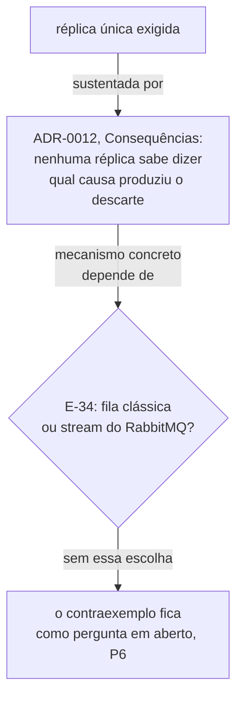

# Distinção entre higiene e invalidação — Example Mapping

Companheiro de [`feature-card.md`](feature-card.md). As regras vêm do
[`ADR-0012`](../../adr/0012-o-broker-no-caminho-do-veredito-e-a-dispensa-que-ele-exigiu.md),
`Aceito`, e do fecho de duas linhas da
[fila de decisões](../../adr/fila-de-decisoes.md): `E-33` e `E-35`.

## História

> Como o consumidor do broker dentro do `lab-plane`, preciso decidir, para cada evento
> que descarto, se ele corrompe o veredito de uma execução em curso ou se é resíduo
> inofensivo de uma janela que já fechou — para não descartar às cegas nem invalidar sem
> motivo.

## Regras

1. Um evento com discriminador de execução **ativa** e não reconhecida invalida essa
   execução.
2. Um evento com discriminador de execução **encerrada** é descartado em silêncio —
   higiene.
3. O consumidor conta todo evento que descarta, nos dois casos.
4. A lista de execuções ativas vive numa tabela do schema `lab_plane`.
5. O `lab-plane` roda em réplica única — condição do veredito confiável.
6. A tabela de execuções ativas não é histórico de execução, só estado corrente do
   filtro.

## Exemplos concretos

| Regra | Dado                                                                                                                             | Quando                                                                                                                                                                                                        | Então                                                                                                                                                               |
|-------|----------------------------------------------------------------------------------------------------------------------------------|---------------------------------------------------------------------------------------------------------------------------------------------------------------------------------------------------------------|---------------------------------------------------------------------------------------------------------------------------------------------------------------------|
| R1    | A execução `X` está em curso, e não consta como discriminador reconhecido pelo consumidor no instante em que o evento chega      | Chega um evento de `INSERT` do WAL com discriminador `X`, via broker                                                                                                                                          | A execução `X` é invalidada, e o descarte é contado como invalidação                                                                                                |
| R2    | A execução `Y` já não conta como ativa para o consumidor — por qual critério ela deixou de contar é `Pergunta em aberto` (P2/P3) | Chega um evento atrasado do broker com discriminador `Y`, depois de `Y` deixar de contar como ativa                                                                                                           | O evento é descartado em silêncio, o veredito de `Y` permanece como já estava, e o descarte é contado como higiene                                                  |
| R3    | Uma execução qualquer descarta um evento, por qualquer motivo                                                                    | O consumidor termina de processar o lote                                                                                                                                                                      | O relatório da execução mostra a contagem de descartes, separada por motivo                                                                                         |
| R4    | O schema `lab_plane` está vazio, sem tabela nenhuma                                                                              | A primeira migração que cria uma tabela de execuções ativas é aplicada                                                                                                                                        | Ela se torna a primeira tabela daquele schema                                                                                                                       |
| R5    | Duas réplicas do `lab-plane` sobem ao mesmo tempo, lendo a mesma tabela de execuções ativas do schema `lab_plane` (R4)           | Hipótese não decidida, condicionada ao ramo `fila clássica` de `E-34`: o broker distribui os eventos do backlog entre as duas réplicas, sem que nenhuma processe sozinha a sequência completa de uma execução | Nenhuma das duas sabe dizer, sozinha, qual causou um descarte — contraexemplo dependente do mecanismo que `E-34` ainda não decidiu, e não cenário                   |
| R6    | A tabela de execuções ativas tem uma linha para a execução `Z`                                                                   | A execução `Z` termina                                                                                                                                                                                        | O que a linha guarda enquanto a execução consta como ativa é só "está ativa", nunca o que `Z` mediu — se e quando a linha sai da tabela é `Pergunta em aberto` (P2) |

### Contraexemplo — o duplo descarte que a réplica única evita

O `ADR-0012` sustenta a exigência de réplica única assim: "Com duas réplicas, cada uma
vê o backlog da outra, e nenhuma sabe dizer qual das duas causas produziu o descarte"
([ADR-0012, Consequências](../../adr/0012-o-broker-no-caminho-do-veredito-e-a-dispensa-que-ele-exigiu.md#consequências)).
A lista de execuções ativas vive numa tabela compartilhada do schema `lab_plane` (R4), e
não em memória por réplica — a alternativa que `E-35` descartou. O mecanismo exato pelo
qual duas réplicas, lendo a mesma tabela, ainda produzem um descarte ambíguo depende de
qual sink do RabbitMQ recebe os eventos — fila clássica ou stream —, e essa escolha
continua aberta em `E-34`. Por isso este contraexemplo fica registrado como dependente
de `E-34` (P6), e não como um mecanismo concreto encenável hoje.

## Perguntas em aberto

| #  | Pergunta                                                                                                                                                                                            | Origem                                                                                                      |
|----|-----------------------------------------------------------------------------------------------------------------------------------------------------------------------------------------------------|-------------------------------------------------------------------------------------------------------------|
| P1 | Qual é a forma da tabela de execuções ativas — colunas, chave e migração?                                                                                                                           | [E-35, fecho](../../adr/fila-de-decisoes.md#e-35-fecha-em-tabela-no-lab_plane-escolhida-em-2026-08-10)      |
| P2 | Como uma execução ativa deixa de ser ativa quando ela **alcança o fim**? A marca de fim é reconhecida por mais de um ator, e nenhum deles foi atribuído à remoção da linha.                         | [E-50](../../adr/fila-de-decisoes.md#e-50--como-uma-execução-ativa-deixa-de-ser-ativa-chegue-ou-não-ao-fim) |
| P3 | Como uma execução ativa deixa de ser ativa quando ela **é abandonada**, sem escrever a marca de fim? Nenhum sinal foi decidido para esse caso.                                                      | [E-50](../../adr/fila-de-decisoes.md#e-50--como-uma-execução-ativa-deixa-de-ser-ativa-chegue-ou-não-ao-fim) |
| P4 | A remoção da linha de uma execução ativa entra em veredito? O fecho de `E-47` e o fecho de `E-35` apontam em direções opostas, e a divergência ficou registrada, não resolvida.                     | [E-50](../../adr/fila-de-decisoes.md#e-50--como-uma-execução-ativa-deixa-de-ser-ativa-chegue-ou-não-ao-fim) |
| P5 | A réplica única não tem garantia formal na entrega. O que impede duas réplicas do `lab-plane` de subirem ao mesmo tempo, hoje e depois que `E-3` fechar?                                            | [E-3](../../adr/fila-de-decisoes.md#as-decisões-do-grupo-i-em-2026-08-06)                                   |
| P6 | Qual mecanismo concreto faz duas réplicas do `lab-plane`, lendo a mesma tabela de execuções ativas, ainda produzirem descarte ambíguo? A resposta depende de qual sink do RabbitMQ `E-34` escolher. | [E-34](../../adr/fila-de-decisoes.md#e-34--qual-dos-dois-sinks-de-rabbitmq-e-o-que-ele-amarra)              |

## Adiado de propósito

| Item                                               | Gatilho que o retoma                                         |
|----------------------------------------------------|--------------------------------------------------------------|
| A forma da tabela de execuções ativas              | a decisão de `E-35` sobre colunas, chave e migração          |
| O mecanismo que remove uma linha de execução ativa | a decisão de `E-50`, nas duas metades                        |
| A garantia formal de réplica única na entrega      | a decisão de `E-3`, a forma do `deploy/`                     |
| O mecanismo concreto do contraexemplo de `R5`      | a decisão de `E-34`, qual sink do RabbitMQ recebe os eventos |

## O que não virou cenário, e por quê

R4 (a tabela vira a primeira do schema `lab_plane`) é estrutural — descreve onde algo
vive, não um comportamento observável — e por isso não vira cenário; ela aparece como
exemplo para registrar a evidência.

R6 (a tabela não é histórico) também não vira cenário: ela é um limite negativo sobre a
forma da tabela, e a forma da tabela é `Pergunta em aberto`. Um cenário exigiria
descrever a coluna que não existe ainda, e um cenário BDD não cita coluna
([`specification-process.md`, BDD](../../specification-process.md#bdd--só-o-que-estabilizou)).

R5 (réplica única) não vira cenário porque descreve uma exigência de topologia de
implantação, não um comportamento observável dentro de uma execução — o contraexemplo
acima cita por que ela é necessária, embora o mecanismo concreto continue em aberto
(P6). O cenário correto é "duas réplicas não sobem", e isso pertence à entrega, não ao
`lab-plane` em si.

Nenhuma das seis regras tem `Aprovada por` preenchido — todas nasceram `pendente`, pela
regra de que se aprova a regra, e não o card
([`AGENTS.md`](../../../AGENTS.md#pendências-de-processo)). Nenhuma vira cenário Gherkin
enquanto isso não mudar.
