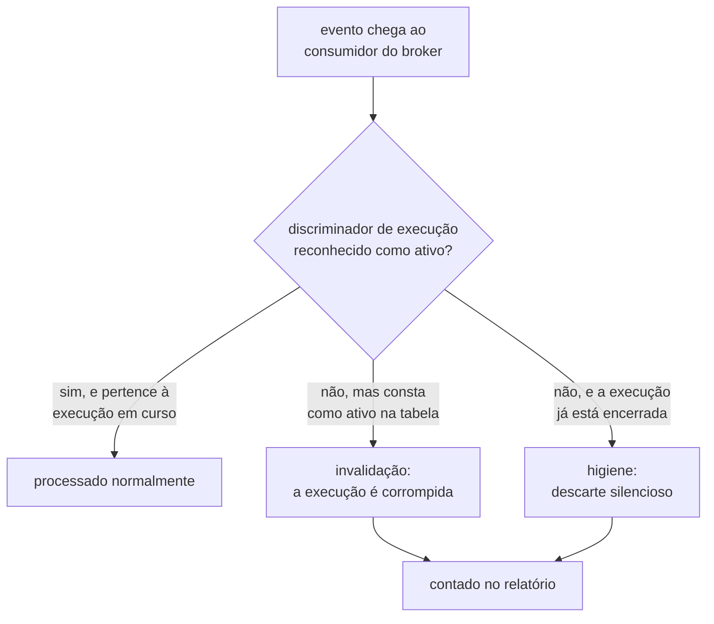

# Feature Card — Distinção entre higiene e invalidação

Estado: `especificado, não implementado` · Origem:
[`ADR-0012`](../../adr/0012-o-broker-no-caminho-do-veredito-e-a-dispensa-que-ele-exigiu.md),
`Aceito`

Cobre o consumidor do broker do `lab-plane`, comum aos dois oráculos já especificados
([ADR-0013, Decisão](../../adr/0013-a-proveniencia-da-fonte-como-criterio-da-proibicao-do-oraculo.md#decisão)).

## Problema e resultado esperado

O `lab-plane` consome eventos de CDC pelo broker que o
[ADR-0012](../../adr/0012-o-broker-no-caminho-do-veredito-e-a-dispensa-que-ele-exigiu.md#decisão)
instala no caminho do veredito. O transporte PODE duplicar, reordenar ou perder mensagem,
e a mesma instância é a peça que o grupo B sabota de propósito
([ADR-0012, Negativas](../../adr/0012-o-broker-no-caminho-do-veredito-e-a-dispensa-que-ele-exigiu.md#negativas)).
Um evento PODE chegar fora de ordem, atrasado, ou depois de a execução que o produziu já
ter terminado.

O consumidor responde, para cada evento que descarta: ele invalida o veredito de uma
execução em curso, ou é resíduo inofensivo de janela já fechada? A resposta depende de
saber quais execuções estão ativas — sem essa lista, um descarte silencioso PODE esconder
corrupção real
([E-33, fecho](../../adr/fila-de-decisoes.md#e-33-fecha-na-distinção-e-ela-transforma-uma-recomendação-de-e-3-em-requisito)).

## Atores e gatilho

- O **consumidor do broker**, dentro do `lab-plane`, que filtra por execução
  ([ADR-0012, Decisão](../../adr/0012-o-broker-no-caminho-do-veredito-e-a-dispensa-que-ele-exigiu.md#decisão)).
- A **tabela de execuções ativas**, primeira tabela do schema `lab_plane`, hoje vazio
  ([E-35, fecho](../../adr/fila-de-decisoes.md#e-35-fecha-em-tabela-no-lab_plane-escolhida-em-2026-08-10)).

Gatilho: o consumidor descarta um evento cujo discriminador de execução não corresponde
à execução que ele processa agora.

## Escopo

- Classificar cada evento descartado em dois casos: higiene (execução encerrada) ou
  invalidação (execução ativa e não reconhecida).
- A consulta à tabela de execuções ativas que sustenta a classificação.
- A contagem de todo evento descartado, qualquer que seja o caso.
- A distinção vale para os dois oráculos já especificados — o WAL é fonte legítima para
  os dois
  ([ADR-0013, Decisão](../../adr/0013-a-proveniencia-da-fonte-como-criterio-da-proibicao-do-oraculo.md#decisão)).

## Fora de escopo

- A forma da tabela de execuções ativas — colunas, chave e migração. `Pergunta em
  aberto`
  ([E-35, fecho](../../adr/fila-de-decisoes.md#e-35-fecha-em-tabela-no-lab_plane-escolhida-em-2026-08-10)).
- O valor do limite de espera de R7, o escopo dele (por execução ou global), e a
  distinção entre cancelamento e abandono no registro. `Pergunta em aberto`
  ([E-50, fecho](../../adr/fila-de-decisoes.md#e-50-fecha-em-três-caminhos-de-saída-da-lista-escolhida-em-2026-08-12)).
- A réplica única como garantia formal de entrega — `E-3` continua aberta
  ([As decisões do grupo I](../../adr/fila-de-decisoes.md#as-decisões-do-grupo-i-em-2026-08-06)).
- A contiguidade de LSN e o reconhecimento da marca de fim do oráculo do predicado —
  `R8`/`R9` de
  [deteccao-de-protecao-inerte](../deteccao-de-protecao-inerte/feature-card.md#regras-de-negócio).
- O transporte do evento pelo broker, e a preservação do LSN —
  [ADR-0012](../../adr/0012-o-broker-no-caminho-do-veredito-e-a-dispensa-que-ele-exigiu.md)
  e
  [ADR-0014](../../adr/0014-o-broker-na-travessia-da-observacao-e-o-cursor-monotonico-do-replay.md).

## Regras de negócio

| #  | Regra                                                                                                                                                                                                                                                                                                                                                                                                                                                                                                                                                                                                                                    | Evidência                                                                                                                                                                                                                                                                                                                           | Aprovada por |
|----|------------------------------------------------------------------------------------------------------------------------------------------------------------------------------------------------------------------------------------------------------------------------------------------------------------------------------------------------------------------------------------------------------------------------------------------------------------------------------------------------------------------------------------------------------------------------------------------------------------------------------------------|-------------------------------------------------------------------------------------------------------------------------------------------------------------------------------------------------------------------------------------------------------------------------------------------------------------------------------------|--------------|
| R1 | Um evento cujo discriminador de execução pertence a uma execução **ativa** e não reconhecida DEVE invalidar essa execução.                                                                                                                                                                                                                                                                                                                                                                                                                                                                                                               | [ADR-0012, Decisão](../../adr/0012-o-broker-no-caminho-do-veredito-e-a-dispensa-que-ele-exigiu.md#decisão) e [E-33, fecho](../../adr/fila-de-decisoes.md#e-33-fecha-na-distinção-e-ela-transforma-uma-recomendação-de-e-3-em-requisito)                                                                                             | pendente     |
| R2 | Um evento cujo discriminador de execução pertence a uma execução **encerrada** DEVE ser descartado em silêncio — higiene, sem invalidar veredito nenhum.                                                                                                                                                                                                                                                                                                                                                                                                                                                                                 | [ADR-0012, Decisão](../../adr/0012-o-broker-no-caminho-do-veredito-e-a-dispensa-que-ele-exigiu.md#decisão) e [E-33, fecho](../../adr/fila-de-decisoes.md#e-33-fecha-na-distinção-e-ela-transforma-uma-recomendação-de-e-3-em-requisito)                                                                                             | pendente     |
| R3 | O consumidor DEVE contar todo evento que descarta, tanto por higiene quanto por invalidação.                                                                                                                                                                                                                                                                                                                                                                                                                                                                                                                                             | [ADR-0012, Decisão](../../adr/0012-o-broker-no-caminho-do-veredito-e-a-dispensa-que-ele-exigiu.md#decisão)                                                                                                                                                                                                                          | pendente     |
| R4 | A lista de quais execuções estão ativas DEVE viver numa tabela do schema `lab_plane` — a primeira tabela daquele schema, hoje vazio de propósito.                                                                                                                                                                                                                                                                                                                                                                                                                                                                                        | [E-35, fecho](../../adr/fila-de-decisoes.md#e-35-fecha-em-tabela-no-lab_plane-escolhida-em-2026-08-10)                                                                                                                                                                                                                              | pendente     |
| R5 | O `lab-plane` DEVE rodar em réplica única, condição do veredito confiável: com duas réplicas, cada uma vê o backlog da outra, e nenhuma sabe dizer qual das duas causas produziu o descarte. O mecanismo exato continua `Pergunta em aberto`, dependente de `E-34` (Example Mapping, P6).                                                                                                                                                                                                                                                                                                                                                | [ADR-0012, Decisão](../../adr/0012-o-broker-no-caminho-do-veredito-e-a-dispensa-que-ele-exigiu.md#decisão), [ADR-0012, Consequências](../../adr/0012-o-broker-no-caminho-do-veredito-e-a-dispensa-que-ele-exigiu.md#consequências) e [E-34](../../adr/fila-de-decisoes.md#e-34--qual-dos-dois-sinks-de-rabbitmq-e-o-que-ele-amarra) | pendente     |
| R6 | A tabela de execuções ativas NÃO DEVE registrar o que uma execução mediu. Ela guarda só o estado corrente do filtro, e não é o histórico de execução que o ADR-0011 recusou manter aqui.                                                                                                                                                                                                                                                                                                                                                                                                                                                 | [E-35, fecho](../../adr/fila-de-decisoes.md#e-35-fecha-em-tabela-no-lab_plane-escolhida-em-2026-08-10) e [ADR-0011, Histórico de execução dentro do `lab-plane`](../../adr/0011-a-topologia-de-servicos-e-o-caderno-de-laboratorio-fora-do-git.md#histórico-de-execução-dentro-do-lab-plane)                                        | pendente     |
| R7 | Uma execução DEVE sair da lista de execuções ativas do `lab_plane` por exatamente três caminhos, e por nenhum outro: a sentinela de fim, que passa a remover a linha; o limite de espera, disparado pelo adaptador de relógio do `lab-plane`; ou o cancelamento explícito pela pessoa, no frontend. O limite de espera DEVE usar o adaptador de relógio injetável — a exceção que o fecho de `E-47` deu a um limite que não entra em veredito NÃO é aplicada aqui, por assimetria de risco: aplicar a regra a um limite que não precisava custa um adaptador, e não aplicá-la a um que precisava quebra a reprodutibilidade em silêncio. | [E-50, fecho](../../adr/fila-de-decisoes.md#e-50-fecha-em-três-caminhos-de-saída-da-lista-escolhida-em-2026-08-12) e [AGENTS.md, regras estruturais](../../../AGENTS.md#regras-estruturais-que-valem-sempre)                                                                                                                        | pendente     |

## Integrações e contratos afetados

O transporte do
[ADR-0012](../../adr/0012-o-broker-no-caminho-do-veredito-e-a-dispensa-que-ele-exigiu.md#decisão)
é compartilhado pelos dois oráculos. A tabela de execuções ativas é DDL de um único
serviço, e DDL NÃO É contrato
([specification-process.md, Contratos](../../specification-process.md#contratos--só-o-que-existe)):
a forma dela vai para
[`esquemas.md`](../../architecture/esquemas.md#o-schema-do-instrumento-lab_plane) quando a
pendência fechar, nunca neste card. Nenhum contrato OpenAPI ou AsyncAPI nasce daqui.

## Riscos e decisões pendentes

- `Pergunta em aberto`: a forma da tabela, e os detalhes de R7 — seguem no
  [Example Mapping](example-mapping.md#perguntas-em-aberto).
- A réplica única não tem garantia formal na entrega — `E-3` continua aberta
  ([As decisões do grupo I](../../adr/fila-de-decisoes.md#as-decisões-do-grupo-i-em-2026-08-06)).

## Critérios de pronto

- R1 a R7 verificadas por teste.
- **R1 pela injeção**: evento com discriminador ativo e não reconhecido invalida a
  execução.
- **R2 pela retenção**: evento com discriminador encerrado é descartado, e o veredito já
  fechado permanece intacto.
- **R3 pela contagem**: todo descarte aparece no relatório, com o motivo — higiene ou
  invalidação.
- **R5 pela ausência de segunda réplica, condicionada ao fecho de `E-3`**: até lá,
  nenhuma configuração conhecida sobe duas réplicas do `lab-plane` ao mesmo tempo, e a
  garantia formal de entrega permanece `Pergunta em aberto`
  ([As decisões do grupo I](../../adr/fila-de-decisoes.md#as-decisões-do-grupo-i-em-2026-08-06)).

## Links

- [Example Mapping](example-mapping.md), com o diagrama de R7
- [ADR-0012](../../adr/0012-o-broker-no-caminho-do-veredito-e-a-dispensa-que-ele-exigiu.md),
  `Aceito` — a distinção nasce na `## Decisão` dele
- [`deteccao-de-protecao-inerte`](../deteccao-de-protecao-inerte/feature-card.md) —
  mesmo consumidor
