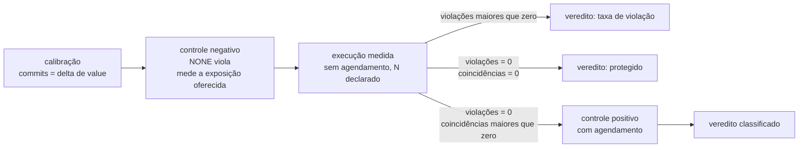

# Example Mapping — Execução de um experimento

Companheiro de [`feature-card.md`](feature-card.md). As regras vêm do
[`ADR-0004`](../../adr/0004-o-estatuto-da-barreira-e-o-diagnostico-da-nao-ocorrencia.md),
`Aceito`, e da calibração do
[`ADR-0002`](../../adr/0002-o-dominio-minimo-e-os-dois-oraculos.md), `Aceito`.

## História

> Como quem lê o relatório de um experimento, preciso saber se um resultado zero é
> proteção ou defeito do instrumento, para que a comparação entre duas estratégias
> signifique alguma coisa.

O ciclo que as regras abaixo descrevem:

## Regras e exemplos

### R3 — A calibração valida o denominador

- **Exemplo 3.1** — Calibração com 100 tentativas: `commits = 100`,
  `value_final − value_inicial = 100`. Os números batem, e a execução medida pode rodar.
- **Exemplo 3.2, erro** — `commits = 100` e a diferença dá 97. O instrumento está errado:
  ou a contagem de `AFTER_COMMIT` não corresponde a commits reais, ou algo escreveu no
  recurso fora dos workers. A plataforma recusa o relatório inteiro, e nenhum resultado
  daquela execução vale.

### R4 — `N` declarado antes, e nunca condicionado ao resultado

- **Exemplo 4.1** — `N = 1000` declarado. A primeira violação aparece na tentativa 12, e
  a execução continua até 1000.
- **Contraexemplo 4.2** — Parar na primeira violação torna `N` função do resultado, e a
  taxa deixa de medir o sistema: ela passa a medir quando a primeira violação apareceu.
- **Contraexemplo 4.3** — Prosseguir além de `N` porque nada apareceu tem o mesmo defeito
  na direção oposta.

### R5, R6 e R7 — O que o relatório traz

- **Exemplo 5.1** — `N = 1000`, `commits = 980`, `violações = 37`. Taxa de violação
  `37/980`. Taxa de aborto `20/1000`.
- **Exemplo 6.1, por que a taxa de aborto** — Uma estratégia que protege abortando chega
  a zero violações pagando em abortos. Sem esse número, `OPTIMISTIC` e `PESSIMISTIC`
  parecem ter o mesmo custo.
- **Exemplo 7.1, borda** — `violações = 0` e `commits = 900`. O relatório declara limite
  superior em torno de `3/900`.
- **Exemplo 7.2, por que sobre `commits`** — Com `N = 1000` e `commits = 100`, calcular
  sobre `N` afirmaria dez vezes mais confiança do que a execução observou. Uma tentativa
  abortada nunca poderia violar.
- **Exemplo 7.3, o que o número não diz** — As tentativas competem pelo mesmo recurso e
  pelo mesmo pool. O limite pressupõe independência, e a correlação não tem sinal
  conhecido sem um modelo. É `Q-0004-8`.

### R9, R10 e R11 — A contagem de coincidências

- **Exemplo 9.1** — Duas tentativas atravessam `F_abre` antes que qualquer uma alcance
  `F_fecha`, sobre a mesma chave. É uma coincidência.
- **Exemplo 10.1, borda** — Duas janelas sobrepostas no tempo, sobre recursos diferentes.
  As chaves de contenção diferem, e o par **não** conta. Num experimento com cem recursos
  e dez workers, quase toda sobreposição temporal é dessa espécie.
- **Exemplo 11.1, erro** — Comparar as coincidências de uma execução com `N = 1000` com
  as de outra com `N = 100`. A plataforma recusa: as cargas declaradas diferem.
- **Exemplo 9.2, por que a contagem do controle negativo** — `SELECT ... FOR UPDATE`
  serializa as tentativas e fecha a janela por construção. Zero coincidências ali é
  proteção. Zero coincidências no controle negativo seria carga que nunca gerou
  concorrência. Sem as duas contagens, os dois zeros são idênticos.

### R12 — A classificação do zero

A ordem é normativa. Duas condições **podem** casar ao mesmo tempo, e a de cima descreve
um defeito que torna a de baixo ilegível.

- **Exemplo 12.1, ordem 1** — O controle negativo com `NONE` termina sem violar. A carga
  não quebra nada, e nenhum resultado daquela bateria significa alguma coisa. Veredito
  `inválido`.
- **Exemplo 12.2, ordem 2** — O controle negativo viola, e as coincidências dele dão
  zero. Uma violação exige que a janela real tenha aberto; se a contagem der zero, o par
  `(F_abre, F_fecha)` declarado não delimita a janela em que a anomalia acontece. Veredito
  `janela mal declarada`.
- **Exemplo 12.3, ordem 3** — `PESSIMISTIC`, coincidências próprias zero. A carga ofereceu
  exposição, e a estratégia a eliminou. A eliminação **é** a proteção. Veredito
  `protegido`, sem controle positivo.
- **Exemplo 12.4, ordem 4** — `OPTIMISTIC`, coincidências maiores que zero, e o controle
  positivo viola. A anomalia é alcançável ali; a carga não a alcançou. Veredito
  `exposição insuficiente`, e a saída é aumentar `N`.
- **Exemplo 12.5, ordem 5** — Coincidências maiores que zero, e o controle positivo **não**
  viola. A anomalia é impossível naquela configuração. Veredito `protegido`.
- **Exemplo 12.6, o que casa duas vezes** — Uma execução em que o controle negativo não
  viola **e** as coincidências da medida são zero casaria as ordens 1 e 3. A ordem 1 vence,
  e o veredito é `inválido`: um `protegido` derivado de uma bateria sem carga afirmaria
  proteção que ninguém mediu.

### R13 — O controle positivo não é resultado

- **Exemplo 13.1** — O controle positivo viola, e o relatório do experimento continua
  trazendo `violações = 0` com veredito `exposição insuficiente`. A violação do controle
  **não** entra na contagem reportada.
- **Exemplo 13.2, por que ele não roda sempre** — Numa estratégia que zerou as próprias
  coincidências, a intercalação que o controle impõe exige uma leitura concorrente que o
  lock impede. O controle travaria, e a ordem 3 existe para dispensá-lo.

### R14 — Alta resolução para quem pode reportar zero

- **Exemplo 14.1, erro** — Uma operação em baixa resolução é uma sequência de um passo,
  sem fronteiras internas. `(F_abre, F_fecha)` não tem onde ser ancorado, e a contagem de
  coincidências não existe. A plataforma recusa o experimento.

## Perguntas em aberto

| #   | Pergunta                                                                                                                                                               | Origem           |
|-----|------------------------------------------------------------------------------------------------------------------------------------------------------------------------|------------------|
| P1  | O limite `3/commits` pressupõe independência que a execução não tem. O que o número publicado afirma?                                                                  | `Q-0004-8`       |
| P2  | Quem escolhe `N`, e o experimento roda no pipeline, sob demanda, ou os dois com `N` diferente?                                                                         | `Q-0004-4`       |
| P3  | Como a taxa com incerteza cabe ao lado do booleano e da curva?                                                                                                         | `Q-0004-5`       |
| P4  | Quem declara que a execução terminou, e o oráculo lê antes ou depois?                                                                                                  | `Q-0002-2`       |
| P5  | Quem estabelece o estado inicial, e como o banco volta ao ponto de partida entre execuções?                                                                            | `Q-0002-4`       |
| P6  | O que obriga um passo a reportar a chave de contenção que R10 consome?                                                                                                 | `Q-0004-2`       |
| P7  | Os instantes de dois workers precisam ser ordenáveis entre si. Qual relógio, e com que resolução?                                                                      | `Q-0004-3`       |
| P8  | A tabela do E3 põe três estratégias com taxa zero e limites diferentes lado a lado. O que ela permite concluir?                                                        | `Q-0004-5`       |
| P9  | Um experimento cujo veredito **não** pode ser zero está dispensado de declarar janela. Qual experimento é esse, e quem decide?                                         | nova, 2026-08-01 |
| P10 | R11 exige mesma carga para comparar. "Mesma carga" é mesmo `N`, mesmos workers e mesma operação — a estratégia difere por construção. A semente entra nessa igualdade? | nova, 2026-08-01 |
| P11 | O `ADR-0003` foi aceito e nenhum cenário cobre o agendamento. Quais das sete recusas viram cenário, e este card é o dono delas ou a capacidade pede card próprio?      | nova, 2026-08-01 |

## Adiado de propósito

| Item                                                              | Gatilho que o retoma                              |
|-------------------------------------------------------------------|---------------------------------------------------|
| Veredito em formato curva (E4)                                    | a decisão "os dois formatos de veredito", na fila |
| Nível de isolamento como parâmetro                                | o E5, que varre três níveis                       |
| Definição do experimento: arquivo versionado ou registro no banco | o Experiment Designer da UI                       |

## O que não virou cenário, e por quê

**Nada do [`ADR-0003`](../../adr/0003-a-linguagem-do-agendamento.md), ainda.** Ele foi
aceito em 2026-08-01, e o motivo que o mantinha fora do Gherkin — a questão 4 em
`aberto (crítico)` — deixou de valer. O agendamento como conjunto de restrições de
precedência, o encontro como forma curta e as sete recusas antes de executar são
comportamento externo estabilizado, e **nenhum cenário foi escrito para eles**. A pergunta
P11 registra a pendência e o que falta decidir antes de escrevê-los.

R1 (a medida roda sem agendamento) é premissa de todos os cenários, e vira `Contexto`.
