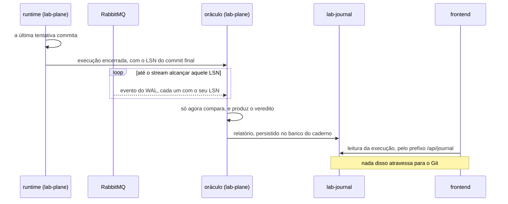

# Feature Card — Execução de um experimento e classificação do veredito

Estado: `especificado, não implementado` · Origem: [`ADR-0004`](../../adr/0004-o-estatuto-da-barreira-e-o-diagnostico-da-nao-ocorrencia.md), `Aceito`

## Problema e resultado esperado

Zero violações não diz nada por si. O zero tem quatro causas com a mesma aparência: a
anomalia é impossível ali; a janela nunca abriu; a carga não gerou concorrência; ou a
janela foi declarada errada. A primeira é conhecimento, as outras três são defeito do
instrumento.

Resultado esperado: todo veredito é **classificado**, e a plataforma recusa reportar
como proteção o zero que não é proteção.

## Atores e gatilho

Quem monta o experimento declara carga, `N`, janela e estratégia. O runtime conta commits,
violações e coincidências. O oráculo lê o WAL do sistema medido por replicação lógica e
**NÃO DEVE** emitir `SELECT` no schema dele, desde o
[`ADR-0010`](../../adr/0010-a-fronteira-de-schema-e-o-cdc-como-fonte-do-veredito.md); a
comparação só ocorre depois de o stream alcançar o LSN do commit final.

## Escopo

O ciclo de quatro execuções. O `N` declarado antes. As taxas de violação e de aborto. O
limite superior do zero. A janela de exposição e a contagem de coincidências. A
classificação do zero. A barreira como controle positivo.

## Fora de escopo

O veredito em **formato curva** (E4) não tem forma decidida — ver
[`README.md`](../README.md#capacidade-conhecida-e-não-especificada). As estratégias de
concorrência estão em
[`ADR-0006`](../../adr/0006-a-forma-da-estrategia-de-concorrencia.md#decisão), `Aceito`.
O nível de isolamento não tem decisão registrada, e o estado inicial entre execuções
segue em [`Q-0002-4`](../../questions/Q-0002-4.md).

## Regras de negócio

| #   | Regra                                                                                                                                                                                                         | Evidência                                                                                                                                                                                           | Aprovada por |
|-----|---------------------------------------------------------------------------------------------------------------------------------------------------------------------------------------------------------------|-----------------------------------------------------------------------------------------------------------------------------------------------------------------------------------------------------|--------------|
| R1  | A execução medida roda **sem agendamento**. O agendamento **NÃO DEVE** produzir o resultado reportado.                                                                                                        | [ADR-0004, Decisão](../../adr/0004-o-estatuto-da-barreira-e-o-diagnostico-da-nao-ocorrencia.md#decisão)                                                                                             | pendente     |
| R2  | Um experimento tem quatro execuções: calibração, controle negativo, medida e controle positivo. Só a última tem agendamento.                                                                                  | [ADR-0003, Quem declara a carga](../../adr/0003-a-linguagem-do-agendamento.md#quem-declara-a-carga-e-quem-declara-o-agendamento)                                                                    | pendente     |
| R3  | Na calibração, `commits` **DEVE** igualar `value_final − value_inicial`. Divergindo, a plataforma **DEVE** recusar o relatório.                                                                               | [ADR-0002, A calibração do denominador](../../adr/0002-o-dominio-minimo-e-os-dois-oraculos.md#a-calibração-do-denominador)                                                                          | pendente     |
| R4  | `N` **DEVE** ser declarado antes. A execução **NÃO DEVE** parar na primeira violação nem prosseguir além de `N`.                                                                                              | [ADR-0004, O experimento declara o número de tentativas](../../adr/0004-o-estatuto-da-barreira-e-o-diagnostico-da-nao-ocorrencia.md#o-experimento-declara-o-número-de-tentativas-antes-de-executar) | pendente     |
| R5  | O veredito é `violações / commits`. O relatório **DEVE** exibir as três contagens, e **NÃO DEVE** exibir apenas a razão.                                                                                      | [ADR-0004, O veredito é uma taxa](../../adr/0004-o-estatuto-da-barreira-e-o-diagnostico-da-nao-ocorrencia.md#o-veredito-de-uma-execução-medida-é-uma-taxa)                                          | pendente     |
| R6  | O relatório **DEVE** exibir a taxa de aborto, `(N − commits) / N`.                                                                                                                                            | [ADR-0004, O veredito é uma taxa](../../adr/0004-o-estatuto-da-barreira-e-o-diagnostico-da-nao-ocorrencia.md#o-veredito-de-uma-execução-medida-é-uma-taxa)                                          | pendente     |
| R7  | Com zero violações, o relatório **DEVE** declarar o limite superior a 95%, em torno de `3 / commits`. **NÃO DEVE** ser calculado sobre `N`.                                                                   | [ADR-0004, O veredito é uma taxa](../../adr/0004-o-estatuto-da-barreira-e-o-diagnostico-da-nao-ocorrencia.md#o-veredito-de-uma-execução-medida-é-uma-taxa)                                          | pendente     |
| R8  | Um experimento cujo veredito **PODE** ser zero **DEVE** declarar a janela `(F_abre, F_fecha)`.                                                                                                                | [ADR-0004, O experimento declara uma janela de exposição](../../adr/0004-o-estatuto-da-barreira-e-o-diagnostico-da-nao-ocorrencia.md#o-experimento-declara-uma-janela-de-exposição)                 | pendente     |
| R9  | O runtime **DEVE** contar coincidências em **toda** execução, derivadas do log. O sistema sob teste **NÃO DEVE** participar.                                                                                  | [ADR-0004, A plataforma conta coincidências](../../adr/0004-o-estatuto-da-barreira-e-o-diagnostico-da-nao-ocorrencia.md#a-plataforma-conta-coincidências)                                           | pendente     |
| R10 | Janelas sobrepostas com chaves de contenção diferentes **NÃO DEVEM** contar como coincidência.                                                                                                                | [ADR-0004, A janela é qualificada por uma chave de contenção](../../adr/0004-o-estatuto-da-barreira-e-o-diagnostico-da-nao-ocorrencia.md#a-janela-é-qualificada-por-uma-chave-de-contenção)         | pendente     |
| R11 | A plataforma **NÃO DEVE** comparar contagens de execuções cuja carga declarada diferir.                                                                                                                       | [ADR-0004, A plataforma conta coincidências](../../adr/0004-o-estatuto-da-barreira-e-o-diagnostico-da-nao-ocorrencia.md#a-plataforma-conta-coincidências)                                           | pendente     |
| R12 | Com zero violações, a plataforma **DEVE** classificar pela tabela de cinco condições, **na ordem**. `inválido`, `janela mal declarada` e `exposição insuficiente` **NÃO DEVEM** ser reportados como proteção. | [ADR-0004, O zero é classificado](../../adr/0004-o-estatuto-da-barreira-e-o-diagnostico-da-nao-ocorrencia.md#o-zero-é-classificado-e-a-classificação-tem-quatro-valores)                            | pendente     |
| R13 | O controle positivo roda com zero violações **e** coincidências próprias maiores que zero. Ele **NÃO DEVE** ser reportado como resultado.                                                                     | [ADR-0004, A barreira é o controle positivo](../../adr/0004-o-estatuto-da-barreira-e-o-diagnostico-da-nao-ocorrencia.md#a-barreira-é-o-controle-positivo)                                           | pendente     |
| R14 | Um experimento cujo veredito **PODE** ser zero **DEVE** rodar em alta resolução.                                                                                                                              | [ADR-0004, A alta resolução deixa de ser opcional](../../adr/0004-o-estatuto-da-barreira-e-o-diagnostico-da-nao-ocorrencia.md#a-alta-resolução-deixa-de-ser-opcional-para-quem-pode-reportar-zero)  | pendente     |

O ciclo em diagrama está no [Example Mapping](example-mapping.md).

## Integrações e contratos afetados

O relatório atravessa para a interface web e é persistido no banco do `lab-journal`.
**Ele não vai para o Git**: a definição de experimento e o resultado vivem no banco, e a
pessoa os declara pelo frontend — nem `experiments/` nem `docs/experiments/` são criados.
O custo disso está nomeado: um resultado deixa de aparecer em diff, de ser revisado em PR
e de sobreviver a um banco recriado. **Nenhum contrato o formaliza** — `Q-INT-1` em
[`integrations.md`](../../architecture/integrations.md#perguntas-em-aberto).

A espera pelo LSN é o que separa o fim da execução do veredito, e ela atravessa três
processos:

## Riscos e decisões pendentes

| Questão                                   | O que está em jogo                                                       |
|-------------------------------------------|--------------------------------------------------------------------------|
| [`Q-0004-8`](../../questions/Q-0004-8.md) | o limite `3/commits` pressupõe independência que as tentativas não têm   |
| [`Q-0004-4`](../../questions/Q-0004-4.md) | `N` alto ocupa o runner; `N` baixo produz falha intermitente no pipeline |
| [`Q-0004-5`](../../questions/Q-0004-5.md) | a taxa com incerteza é um terceiro formato de veredito                   |
| [`Q-0002-2`](../../questions/Q-0002-2.md) | quem declara o fim da execução, e se o oráculo lê antes ou depois        |
| [`Q-0004-2`](../../questions/Q-0004-2.md) | nada obriga o passo a reportar a chave de contenção que R10 consome      |
| a espera pelo stream                      | o oráculo aguarda o LSN do commit final; o estouro é rótulo próprio      |
| a segunda fonte acabou                    | com o stream como fonte única, não há leitura independente a comparar    |

O [`ADR-0003`](../../adr/0003-a-linguagem-do-agendamento.md) foi aceito em 2026-08-01.
Ele encaminhou [`Q-0003-1`](../../questions/Q-0003-1.md),
[`Q-0003-2`](../../questions/Q-0003-2.md), [`Q-0003-3`](../../questions/Q-0003-3.md) e
[`Q-0003-8`](../../questions/Q-0003-8.md); as duas primeiras alcançam a execução de
controle deste card.

## Critérios de pronto

R3 a R14 verificadas por teste. Um veredito `inválido`, `janela mal declarada` ou
`exposição insuficiente` é recusado como evidência de proteção. A ordem de avaliação é
testada com um caso em que duas condições casam ao mesmo tempo.

## Links

[Example Mapping](example-mapping.md) · [BDD](behavior.feature) ·
[`ADR-0004`](../../adr/0004-o-estatuto-da-barreira-e-o-diagnostico-da-nao-ocorrencia.md)
