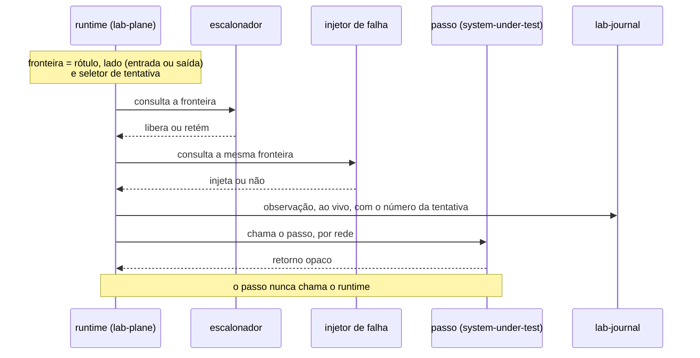

# Feature Card — Observação passo a passo de uma operação

Estado: `especificado, não implementado` · Origem: [
`ADR-0001`](../../adr/0001-o-passo-como-unidade-de-execucao.md), `Aceito`

## Problema e resultado esperado

Um método Java comum não tem fronteira observável entre a leitura e a escrita. Sem ela,
três exigências ficam sem mecanismo: pausar um worker entre `READ` e `WRITE`, falhar num
ponto nomeado como `AFTER_COMMIT`, e emitir um registro por passo para a timeline.

Resultado esperado: o runtime para, falha e observa **entre** dois passos consecutivos,
sem que o código da operação saiba disso.

## Atores e gatilho

Quem declara a operação escreve a sequência de passos. O runtime a constrói e a executa.
Escalonador e injetor de falha são consultados em cada fronteira. Gatilho: o runtime
inicia uma tentativa.

## Escopo

A operação como sequência ordenada e finita de passos nomeados. O endereço canônico de
uma fronteira. A ordem das duas consultas nela. A emissão de observações. O escopo
transacional por `TransactionTemplate`. O eixo de resolução. A prova de equivalência.

## Fora de escopo

A linguagem do agendamento está em
[`ADR-0003`](../../adr/0003-a-linguagem-do-agendamento.md), `Aceito`, e a forma do
escalonador em [`ADR-0005`](../../adr/0005-a-forma-do-escalonador.md), `Aceito`. O
contrato de retentativa está em
[`ADR-0006`](../../adr/0006-a-forma-da-estrategia-de-concorrencia.md#decisão), `Aceito`,
e quantas vezes uma estratégia retenta segue em
[`Q-0003-8`](../../questions/Q-0003-8.md). O formato interno da injeção de falha não tem
decisão registrada, e este card não o decide.

## Regras de negócio

| #   | Regra                                                                                                                                                                                                     | Evidência                                                                                                                                                                       | Aprovada por |
|-----|-----------------------------------------------------------------------------------------------------------------------------------------------------------------------------------------------------------|---------------------------------------------------------------------------------------------------------------------------------------------------------------------------------|--------------|
| R1  | O runtime chama o passo. O passo **NÃO DEVE** chamar o runtime.                                                                                                                                           | [ADR-0001, Decisão](../../adr/0001-o-passo-como-unidade-de-execucao.md#decisão)                                                                                                 | pendente     |
| R2  | Cada passo carrega rótulo único na operação, tipo de conjunto fechado (`READ`, `COMPUTE`, `WRITE`) e corpo opaco. O runtime **NÃO DEVE** gerar, interpretar ou analisar o SQL.                            | [ADR-0001, Decisão](../../adr/0001-o-passo-como-unidade-de-execucao.md#decisão)                                                                                                 | pendente     |
| R3  | O endereço de uma fronteira é a tripla (rótulo, entrada\|saída, seletor de tentativa). O seletor **NÃO DEVE** ter valor padrão.                                                                           | [ADR-0001, A fronteira](../../adr/0001-o-passo-como-unidade-de-execucao.md#a-fronteira)                                                                                         | pendente     |
| R4  | A plataforma **DEVE** recusar endereço que não resolva para passo nenhum, e **DEVE** recusar nome abreviado quando o tipo aparecer mais de uma vez.                                                       | [ADR-0001, A fronteira](../../adr/0001-o-passo-como-unidade-de-execucao.md#a-fronteira)                                                                                         | pendente     |
| R5  | Em cada fronteira o runtime consulta o escalonador **e depois** o injetor de falha, nesta ordem.                                                                                                          | [ADR-0001, A fronteira](../../adr/0001-o-passo-como-unidade-de-execucao.md#a-fronteira)                                                                                         | pendente     |
| R6  | Uma definição de operação **NÃO DEVE** guardar estado mutável. Um teste executável **DEVE** rejeitar campo não final, campo de tipo mutável e `static` mutável.                                           | [ADR-0001, A definição de operação é uma fábrica](../../adr/0001-o-passo-como-unidade-de-execucao.md#a-definição-de-operação-é-uma-fábrica-e-o-runtime-é-dono-do-ciclo-de-vida) | pendente     |
| R7  | O escopo de execução carrega worker e tentativa. O runtime **DEVE** rejeitar acesso vindo de outro worker, nomeando o passo.                                                                              | [ADR-0001, A definição de operação é uma fábrica](../../adr/0001-o-passo-como-unidade-de-execucao.md#a-definição-de-operação-é-uma-fábrica-e-o-runtime-é-dono-do-ciclo-de-vida) | pendente     |
| R8  | Toda observação **DEVE** carregar o número da tentativa.                                                                                                                                                  | [ADR-0001, A observação](../../adr/0001-o-passo-como-unidade-de-execucao.md#a-observação)                                                                                       | pendente     |
| R9  | `COMMIT` é o retorno do callback do `TransactionTemplate`, não um passo. `AFTER_COMMIT` é a primeira fronteira depois do escopo.                                                                          | [ADR-0001, A transação é demarcada através do Spring](../../adr/0001-o-passo-como-unidade-de-execucao.md#a-transação-é-demarcada-através-do-spring-não-no-lugar-dele)           | pendente     |
| R10 | Um teste executável **DEVE** provar que as duas resoluções emitem o mesmo traço de SQL numa execução sem concorrência. Sem esse teste, a cláusula de honestidade **NÃO DEVE** ser considerada satisfeita. | [ADR-0001, A equivalência entre as duas resoluções](../../adr/0001-o-passo-como-unidade-de-execucao.md#a-equivalência-entre-as-duas-resoluções-é-provada-por-teste)             | pendente     |
| R11 | Toda anomalia reproduzida com barreiras **DEVE** aparecer também sem barreiras, sob carga alta.                                                                                                           | [ADR-0001, A cláusula de honestidade](../../adr/0001-o-passo-como-unidade-de-execucao.md#a-cláusula-de-honestidade)                                                             | pendente     |
| R12 | As observações **DEVEM** atravessar para o `lab-journal` ao vivo, evento por evento. O Lab Plane **NÃO DEVE** acumulá-las para enviar ao fim da execução.                                                 | [ADR-0010, Decisão](../../adr/0010-a-fronteira-de-schema-e-o-cdc-como-fonte-do-veredito.md#decisão)                                                                             | pendente     |

O critério de igualdade entre dois traços foi fixado depois, pelo
[`ADR-0002`](../../adr/0002-o-dominio-minimo-e-os-dois-oraculos.md#o-critério-de-igualdade-entre-dois-traços-de-sql).

## Integrações e contratos afetados

Um passo emite SQL real contra o PostgreSQL, numa transação real. Não há contrato
formalizado: o esquema existe apenas como prosa no ADR-0002 — ver `Q-INT-5` em
[`integrations.md`](../../architecture/integrations.md#perguntas-em-aberto).

**Cada observação atravessa a rede até o `lab-journal` no instante em que nasce**, desde o
[`ADR-0010`](../../adr/0010-a-fronteira-de-schema-e-o-cdc-como-fonte-do-veredito.md). O
`lab-journal` é serviço próprio, com schema próprio, e o Lab Plane não escreve no schema
dele por acesso direto. **Nenhum contrato formaliza essa travessia.**

## Riscos e decisões pendentes

| Questão                                   | O que está em jogo                                                                                                                                                  |
|-------------------------------------------|---------------------------------------------------------------------------------------------------------------------------------------------------------------------|
| [`Q-0001-1`](../../questions/Q-0001-1.md) | o corpo de um passo muda com o rótulo intacto, e o replay mede outra operação em silêncio; quatro candidatas de mecanismo, nenhuma escolhida                        |
| [`Q-0002-1`](../../questions/Q-0002-1.md) | "relógio injetável" e "aleatoriedade semeada" são texto, não regra executável; uma chamada a `Instant.now()` faz R10 reprovar um par correto, de forma intermitente |
| [`Q-0004-2`](../../questions/Q-0004-2.md) | nada obriga um passo a reportar a chave de contenção                                                                                                                |
| a emissão ao vivo entra na janela medida  | o E1 emite de 900 a 1500 observações por execução, e cada travessia é somada ao que se mede; o buffer local não bloqueante existe como saída e não foi escolhido    |

## Critérios de pronto

R1 a R12 verificadas por teste. R4, R6 e R7 produzem recusa que nomeia o culpado — o
endereço, o campo ou o passo. A prova de R10 existe para `increment` e para `allocate`.

## Links

- [Example Mapping](example-mapping.md) · [Cenários BDD](behavior.feature)
- [`ADR-0001`](../../adr/0001-o-passo-como-unidade-de-execucao.md) — a decisão e as seis
  alternativas descartadas
- [`plano-do-laboratorio.md`, seção 2](../../plano-do-laboratorio.md#2-a-abstração-central-uma-operação-é-uma-sequência-de-passos-nomeados)
