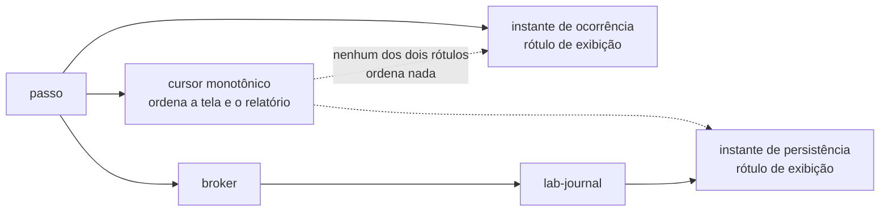

# Example Mapping — Streaming e replay do log de observações

Companheiro de [`feature-card.md`](feature-card.md). As regras vêm do
[`ADR-0016`](../../adr/0016-o-streaming-e-o-replay-do-log-de-observacoes.md),
`Aceito`. `R7` tem origem própria: uma decisão da pessoa — o instante de parede existe
para leitura humana, e quem ordena é o cursor monotônico.

## História

> Como quem acompanha uma execução, preciso ver o histórico completo ao abrir a tela e
> continuar recebendo eventos ao vivo, sem perder nem repetir nada quando a conexão cai
> e volta.

## Regras e exemplos

### R1 — Abrir sem cursor

- **Exemplo 1.1, fluxo principal** — a execução tem 40 observações persistidas. O
  frontend abre o stream sem `Last-Event-ID`. Os 40 eventos chegam na ordem do cursor, e
  o stream continua aberto.
- **Exemplo 1.2, execução recém-criada** — a execução ainda não tem nenhuma observação
  persistida. O stream abre vazio e passa direto a receber eventos ao vivo.

### R2 e R3 — Abrir com `Last-Event-ID`, e o mecanismo único

- **Exemplo 2.1, reconexão** — o frontend caiu depois do evento de cursor 12, numa
  execução com 40 observações. Reabre com `Last-Event-ID: 12`. Recebe os cursores 13 a
  40 e depois os eventos ao vivo.
- **Exemplo 2.2, cursor no fim** — reconecta com `Last-Event-ID` igual ao último cursor
  persistido. O replay não devolve nada, e o stream passa direto ao vivo.
- **Exemplo 3.1, o mesmo endpoint** — cursor vazio (R1) e `Last-Event-ID: 12` (R2) chamam
  o mesmo `GET /stream`. Não existe um segundo endpoint `/stream/history`.

### R4 — Execução encerrada

- **Exemplo 4.1** — a execução terminou com 40 observações. O frontend abre o stream sem
  cursor três dias depois. Recebe as 40 e o stream fecha, sem ficar pendurado esperando
  um evento 41 que não existe.
- **Exemplo 4.2, com cursor** — o frontend reconecta com `Last-Event-ID: 30` numa
  execução já encerrada. Recebe 31 a 40 e o stream fecha.

### R5 — A fronteira entre replay e ao vivo

- **Exemplo 5.1, o risco de duplicar** — um evento de cursor 41 é publicado no pub/sub
  exatamente entre o `SELECT` do replay terminar e a assinatura do pub/sub começar. Sem
  cuidado nessa ordem, o cursor 41 apareceria duas vezes, ou nenhuma.
- **Exemplo 5.2, por que a ordem importa** — assinar o pub/sub antes de o `SELECT`
  terminar arrisca duplicar; assinar depois arrisca pular. A sequência exata que evita as
  duas coisas é detalhe de implementação que este card não fecha; é o que o critério de
  pronto testa.

### R6 — O cursor não é precedência

- **Exemplo 6.1** — dois workers concorrentes emitem observações que ocorreram em ordem
  inversa à que chegam ao broker. O cursor registra a ordem de chegada; a
  [timeline do ADR-0007](../../adr/0007-o-log-de-observacoes-forma-ordem-e-onde-vive.md#a-ordem-garantida)
  não lê esse cursor como prova de que uma ocorreu antes da outra.

### R7 — O instante é rótulo, e nunca ordem

- **Exemplo 7.1** — A tela de uma execução lista as observações. A lista usa a ordem do
  cursor devolvida pelo replay; o instante de ocorrência e o de persistência aparecem só
  como coluna de exibição, ao lado de cada linha.
- **Contraexemplo 7.2, o erro que não avisa** — Um relatório é construído ordenando as
  observações pelo instante de ocorrência em vez do cursor. Dois eventos publicados por
  workers diferentes, no mesmo milissegundo de relógio ou fora de ordem por clock skew
  entre processos, trocam de posição no relatório — e nada nele sinaliza a troca, porque
  o número de eventos e o conteúdo continuam os mesmos. O relatório **parece** certo.
  Esta é a leitura descartada em
  [ADR-0016, Ordenar o replay pelo instante do evento](../../adr/0016-o-streaming-e-o-replay-do-log-de-observacoes.md#ordenar-o-replay-pelo-instante-do-evento),
  e o motivo de R7 proibi-la também fora do replay, em qualquer relatório ou tela.
- **Exemplo 7.3, os dois instantes convivem sem ordenar** — Um evento carrega o instante
  de ocorrência (atribuído no `lab-plane`) e o de persistência (atribuído no
  `lab-journal`). Os dois aparecem lado a lado na tela, e nenhum dos dois decide a
  posição da linha — só o cursor decide.
- **Contraexemplo 7.4, rótulo não quer dizer inofensivo** — De "o instante é rótulo"
  alguém conclui que compará-lo não faz mal em lugar nenhum. Não é o que o repositório
  diz: a contagem de coincidências **depende** de comparar instantes entre threads, e
  qual relógio os produz ninguém decidiu — é negativa expressa do
  [ADR-0004](../../adr/0004-o-estatuto-da-barreira-e-o-diagnostico-da-nao-ocorrencia.md#negativas).
  R7 tira o instante da **ordem**; ela não o promove a grandeza comparável.

## Perguntas em aberto

| #  | Pergunta                                                                                                                                                                                          | Origem                                                                                          |
|----|---------------------------------------------------------------------------------------------------------------------------------------------------------------------------------------------------|-------------------------------------------------------------------------------------------------|
| P1 | O que acontece quando `Last-Event-ID` aponta para um cursor que nunca existiu — maior que o último persistido, ou de outra execução? Devolver tudo, recusar ou um erro dedicado não foi decidido. | nova, 2026-08-10                                                                                |
| P2 | Como o `lab-journal` sabe que uma execução terminou, para `R4` fechar o stream? Nenhum ADR aceito decide o critério de encerramento.                                                              | nova, 2026-08-10                                                                                |
| P3 | Qual é o formato JSON de cada evento no stream — nomes de campo, tipo do cursor, os dois instantes?                                                                                               | [ADR-0016, negativas](../../adr/0016-o-streaming-e-o-replay-do-log-de-observacoes.md#negativas) |
| P4 | Existe limite para o replay do histórico completo de uma execução muito longa, ou o `lab-journal` sempre lê a tabela inteira de uma vez?                                                          | nova, 2026-08-10                                                                                |
| P5 | `Q-0004-3` permanece `pendente` com escopo reduzido: a monotonicidade do instante saiu da pergunta com R7, mas qual relógio o produz e qual é a resolução dele continuam sem resposta.            | [`Q-0004-3`](../../questions/Q-0004-3.md)                                                       |

## Adiado de propósito

| Item                                                | Gatilho que o retoma                                                 |
|-----------------------------------------------------|----------------------------------------------------------------------|
| O contrato formal do endpoint (OpenAPI ou AsyncAPI) | quando a interface existir, pela regra do `specification-process.md` |
| O formato JSON do evento no stream                  | a decisão da forma concreta do registro, no próprio ADR-0016         |

## O que não virou cenário, e por quê

Nenhum exemplo virou cenário Gherkin: as sete regras estão `pendente` no Feature Card, e
uma regra sem `Aprovada por` preenchido NÃO DEVE sustentar `behavior.feature`. O Exemplo
4.1 e as perguntas P1 e P2 são os primeiros candidatos quando a pessoa aprovar `R4` e
responder o que falta. R7 fica pelo mesmo motivo — nasceu `pendente` nesta rodada, e o
Exemplo 7.1 é o candidato quando a pessoa a aprovar.
