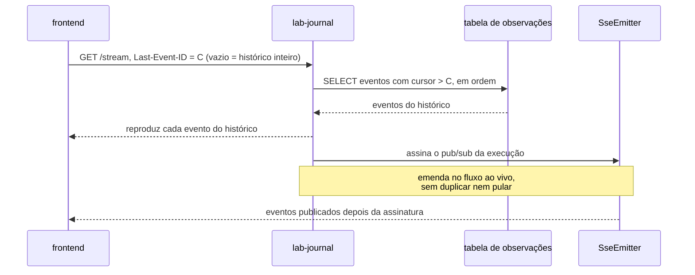

# Feature Card — Streaming e replay do log de observações

Estado: `especificado, não implementado` · Origem: [
`ADR-0014`](../../adr/0014-o-broker-na-travessia-da-observacao-e-o-cursor-monotonico-do-replay.md),
`Aceito`

## Problema e resultado esperado

Quem abre a tela de uma execução precisa ver o que já aconteceu e continuar vendo o que
acontece dali em diante, sem perder nem repetir um evento na fronteira entre os dois. Uma
reconexão no meio de uma execução longa não pode reiniciar do zero, e uma execução já
encerrada precisa devolver tudo de uma vez, sem ficar esperando um evento que não virá.

Resultado esperado: um único stream SSE que serve ao histórico completo, à reconexão
parcial e ao acompanhamento ao vivo, sem duplicar nem pular evento na fronteira entre o
que já foi persistido e o que ainda chega.

## Atores e gatilho

- **frontend** — abre o stream para acompanhar ou revisar uma execução.
- **lab-journal** — atende o stream; persiste antes de emitir, pelo
  [ADR-0014](../../adr/0014-o-broker-na-travessia-da-observacao-e-o-cursor-monotonico-do-replay.md#decisão).

Gatilho: o frontend abre `GET` no endpoint de stream de uma execução, com ou sem o
cabeçalho `Last-Event-ID`.

## Escopo

Abrir o stream sem cursor. Abrir com `Last-Event-ID`. Abrir o stream de uma execução já
encerrada. A fronteira entre o replay do histórico e o apêndice ao vivo.

## Fora de escopo

O transporte do evento entre o `lab-plane` e o `lab-journal`, o broker, e a ordem
persiste-depois-emite pertencem ao
[ADR-0014](../../adr/0014-o-broker-na-travessia-da-observacao-e-o-cursor-monotonico-do-replay.md#decisão)
e não são redecididos aqui. A forma de um evento é do
[ADR-0007](../../adr/0007-o-log-de-observacoes-forma-ordem-e-onde-vive.md#a-forma-de-um-evento).

## Regras de negócio

| #  | Regra                                                                                                                                                           | Evidência                                                                                                                                                                                                        | Aprovada por |
|----|-----------------------------------------------------------------------------------------------------------------------------------------------------------------|------------------------------------------------------------------------------------------------------------------------------------------------------------------------------------------------------------------|--------------|
| R1 | Abrir o stream sem `Last-Event-ID` DEVE retornar o histórico completo da execução, na ordem do cursor, e DEVE continuar entregando eventos ao vivo depois.      | [ADR-0014, O replay por cursor](../../adr/0014-o-broker-na-travessia-da-observacao-e-o-cursor-monotonico-do-replay.md#o-replay-por-cursor-é-o-único-mecanismo-com-ou-sem-histórico-completo)                     | pendente     |
| R2 | Abrir o stream com `Last-Event-ID` DEVE retornar só os eventos com cursor maior que o declarado, na ordem do cursor, e DEVE continuar ao vivo a partir daí.     | [ADR-0014, O replay por cursor](../../adr/0014-o-broker-na-travessia-da-observacao-e-o-cursor-monotonico-do-replay.md#o-replay-por-cursor-é-o-único-mecanismo-com-ou-sem-histórico-completo)                     | pendente     |
| R3 | A plataforma NÃO DEVE expor um segundo endpoint para o histórico completo. Cursor vazio e cursor de reconexão usam o mesmo mecanismo.                           | [ADR-0014, O replay por cursor](../../adr/0014-o-broker-na-travessia-da-observacao-e-o-cursor-monotonico-do-replay.md#o-replay-por-cursor-é-o-único-mecanismo-com-ou-sem-histórico-completo)                     | pendente     |
| R4 | Abrir o stream de uma execução encerrada DEVE devolver o histórico completo e DEVE fechar o stream, sem aguardar evento ao vivo que não virá.                   | proposta deste card; nenhum ADR aceito decide o sinal de encerramento — ver Riscos e decisões pendentes                                                                                                          | pendente     |
| R5 | A fronteira entre o replay do histórico e o apêndice ao vivo NÃO DEVE duplicar nem pular um evento.                                                             | [ADR-0014, O replay por cursor](../../adr/0014-o-broker-na-travessia-da-observacao-e-o-cursor-monotonico-do-replay.md#o-replay-por-cursor-é-o-único-mecanismo-com-ou-sem-histórico-completo)                     | pendente     |
| R6 | O cursor NÃO DEVE ser lido como precedência causal entre eventos: é ordem de chegada no `lab-journal`, não ordem de ocorrência.                                 | [ADR-0014, Dois instantes](../../adr/0014-o-broker-na-travessia-da-observacao-e-o-cursor-monotonico-do-replay.md#dois-instantes-nenhum-deles-é-ordem)                                                            | pendente     |

## Integrações e contratos afetados

O stream atravessa a fronteira entre o `frontend` e o `lab-journal`, por HTTP/SSE, sob o
prefixo `/api/journal` já roteado sem BFF pelo
[ADR-0011](../../adr/0011-a-topologia-de-servicos-e-o-caderno-de-laboratorio-fora-do-git.md#comando-no-lab-plane-leitura-no-lab-journal-sem-bff).
**Nenhum contrato existe hoje**: um contrato só é criado quando a interface existir, e o
endpoint ainda não foi escrito — `Q-INT-2`, resolvida quanto ao mecanismo pelo
[ADR-0014](../../adr/0014-o-broker-na-travessia-da-observacao-e-o-cursor-monotonico-do-replay.md#o-replay-por-cursor-é-o-único-mecanismo-com-ou-sem-histórico-completo),
em [`integrations.md`](../../architecture/integrations.md#perguntas-em-aberto). A forma
concreta do registro — nomes de coluna, tipo do cursor — segue em aberto no próprio
[ADR-0014, negativas](../../adr/0014-o-broker-na-travessia-da-observacao-e-o-cursor-monotonico-do-replay.md#negativas),
e o formato JSON de cada evento no stream herda essa mesma lacuna.

## Riscos e decisões pendentes

| Questão                                        | O que está em jogo                                                                                                                                                                                                          |
|------------------------------------------------|-----------------------------------------------------------------------------------------------------------------------------------------------------------------------------------------------------------------------------|
| cursor aponta para evento inexistente          | comportamento não decidido; registrado como pergunta em aberto no [Example Mapping](example-mapping.md), e `R2`/`R3` não o cobrem                                                                                           |
| sinal de encerramento do stream (`R4`)         | nenhum ADR aceito decide se o `lab-journal` sabe que uma execução terminou, nem como o stream sinaliza isso ao frontend; `R4` é proposta deste card                                                                         |
| forma concreta do registro                     | coluna, tipo do cursor e migração seguem sem decisão — [ADR-0014, negativas](../../adr/0014-o-broker-na-travessia-da-observacao-e-o-cursor-monotonico-do-replay.md#negativas)                                               |
| contrapressão entre o broker e o `lab-journal` | um consumidor lento pode acumular ou descartar mensagem sem política decidida — [ADR-0014, negativas](../../adr/0014-o-broker-na-travessia-da-observacao-e-o-cursor-monotonico-do-replay.md#negativas)                      |

## Critérios de pronto

R1 a R6 verificadas por teste. R1 e R3 pelo mesmo teste: cursor vazio e reconexão sem
cursor produzem o mesmo histórico. R5 por um teste que force um evento a chegar durante a
transição entre o replay e a assinatura do pub/sub, e conte cada cursor uma vez só.

## Links

- [Example Mapping](example-mapping.md)
- [`ADR-0014`](../../adr/0014-o-broker-na-travessia-da-observacao-e-o-cursor-monotonico-do-replay.md) —
  o mecanismo, e o porquê de cada peça dele
- [`ADR-0007`](../../adr/0007-o-log-de-observacoes-forma-ordem-e-onde-vive.md) — a forma
  do evento que o stream transporta
- [`observacao-passo-a-passo`](../observacao-passo-a-passo/feature-card.md) — quem emite
  o evento que este card entrega
