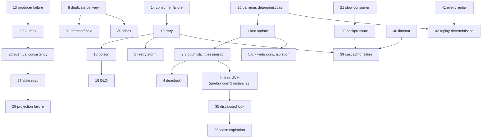
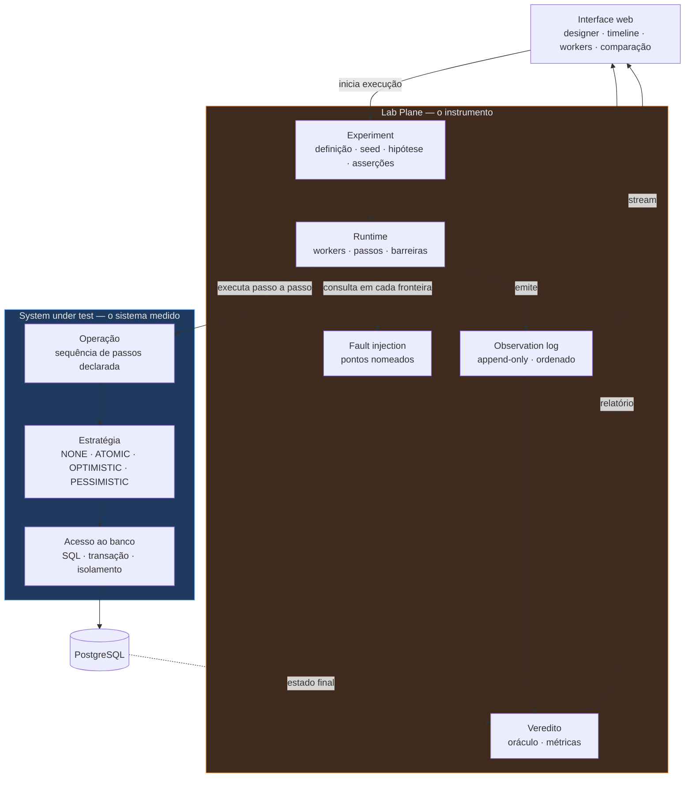

# Plano do laboratório — taxonomia, dependências e roadmap

- **Data:** 2026-07-28
- **Estado:** Proposta de replanejamento. Nada aqui é decisão até virar ADR aceito.
- **Substitui:** o roadmap do `README.md` e a tabela de etapas da primeira série de
  ADRs, arquivada em [`adr/arquivo/`](adr/arquivo/README.md).

Este documento responde à primeira tarefa do briefing de replanejamento: refinar a
taxonomia dos experimentos, mapear as dependências pedagógicas entre eles, propor um
roadmap incremental, escolher um MVP e desenhar a menor arquitetura que o sustente.

Ele **não** decide nada. Cada seção marcada com `→ ADR` precisa de um ADR próprio,
debatido um a um, antes de virar código.

---

## 1. O que mudou, e por que o planejamento anterior não serve como está

O repositório tinha 13 ADRs construídos sobre uma pergunta: *quanto custa proteger uma
invariante de capacidade sob concorrência, e o que muda quando ela é distribuída?*
Nenhum deles chegou a ser aceito. Todos foram arquivados em
[`adr/arquivo/`](adr/arquivo/README.md) e a numeração da série corrente recomeça do
zero — documentos da série antiga são citados aqui como
`arquivo/NNNN`.

O briefing novo faz outra pergunta: *como construir um instrumento que reproduza,
observe e compare 42 fenômenos conhecidos de sistemas distribuídos?*

As duas perguntas se sobrepõem, mas não coincidem. Três divergências são estruturais.

**A invariante deixa de ser o centro.** Dos 42 cenários do briefing, oito dependem de
uma invariante de domínio. Os outros 34 — duplicata, reordenação, DLQ, backpressure,
retry storm, lease — acontecem igual em qualquer domínio. Um planejamento organizado em
torno da invariante coloca 80% do laboratório na periferia.

**A decomposição em serviços deixa de ser premissa.** O arquivo/0011 decide cinco
serviços e uma migração de fronteira na Etapa 5. O briefing pede o oposto:
*"comece com a menor arquitetura capaz de reproduzir os fenômenos desejados"* e *"quando
um cenário exigir múltiplos processos independentes, faça a separação"*. A diferença não
é de tamanho. É de gatilho: o arquivo/0011 agenda a separação, o briefing quer que ela
seja provocada por um experimento que falha sem ela.

**O determinismo sobe de prioridade.** O arquivo/0004 é explícito: *"o `seed` não torna
o sistema determinístico"*. O briefing exige o contrário, no cenário 25:
*"a plataforma deve conseguir introduzir barreiras artificiais para tornar race
conditions determinísticas e reproduzíveis... não quero depender apenas da sorte do
scheduler"*. Isso não é um requisito a mais. É uma restrição sobre **como uma operação é
escrita**, e ela precisa valer desde o primeiro commit.

O que **não** mudou: o rigor do processo, a exigência de grupo de controle, a separação
entre o sistema e o instrumento, e a regra de que a decisão vem antes do código. Essas
quatro ideias sobrevivem inteiras e a Seção 10 detalha o que mais sobrevive.

---

## 2. A abstração central: uma operação é uma sequência de passos nomeados

Esta é a decisão mais importante do replanejamento, e ela é anterior a qualquer
taxonomia. Três exigências do briefing convergem para o mesmo mecanismo, e nenhuma delas
é atendível se uma operação for um método Java comum.

**Exigência 1 — barreiras determinísticas (cenário 25).**

```
READ → WAIT → CALCULATE → WAIT → WRITE
```

Para pausar o Worker-1 entre a leitura e a escrita, alguém precisa ter o controle
*entre* as duas. Um método `@Transactional` não oferece esse ponto.

**Exigência 2 — fault injection em pontos nomeados.** O briefing lista doze:
`BEFORE_READ`, `AFTER_READ`, `BEFORE_WRITE`, `AFTER_WRITE`, `BEFORE_COMMIT`,
`AFTER_COMMIT`, `BEFORE_PUBLISH`, `AFTER_PUBLISH`, `BEFORE_CONSUME`, `AFTER_CONSUME`,
`BEFORE_ACK`, `AFTER_ACK`. Espalhar doze ganchos pelo código do sistema sob teste
significa que o sistema sob teste passa a conter o instrumento.

**Exigência 3 — a timeline.** O briefing quer ver
`12:01:00.100 Worker-1 READ resource=42 version=1`. Isso é um registro por passo.

As três exigências são a mesma exigência: **existe uma fronteira observável e
controlável entre passos consecutivos de uma operação.**

### A forma

Uma operação é declarada como uma sequência de passos. O runtime do laboratório executa
a sequência e, em cada fronteira entre dois passos, faz três coisas na ordem:
consulta o escalonador (devo bloquear numa barreira?), consulta o injetor de falha (devo
falhar aqui?) e emite uma observação (o que acabou de acontecer?).

```
operação increment:
  READ     → SELECT value, version FROM resource WHERE id = ?
  COMPUTE  → value + 1
  WRITE    → UPDATE resource SET value = ?, version = version + 1 WHERE ...
  COMMIT
```

Um passo é uma unidade que executa **SQL real, numa transação real, num PostgreSQL
real**. O runtime não simula o banco. Ele controla apenas o *tempo entre passos*.

### A objeção honesta, e por que ela não derruba a ideia

*"Isso não é o código real. Você está testando o seu interpretador, não JPA com
`@Transactional`."*

A objeção é legítima e precisa ficar registrada. A resposta tem três partes.

Primeiro, o que é sintético é apenas o **agendamento**. O nível de isolamento é o do
PostgreSQL, o lock de linha é o do PostgreSQL, o `40001` de serialização vem do
PostgreSQL. Nenhuma anomalia estudada é produzida pelo runtime; todas são produzidas
pelo banco. O runtime só decide *quando* cada transação dá seu próximo passo.

Segundo, o agendamento é exatamente a variável que o laboratório existe para controlar.
Um lost update que aparece uma vez em mil execuções não é observável, não é explicável e
não prova correção quando some. Trocar "sorte do scheduler" por
"agendamento declarado" é o objetivo, não um efeito colateral.

Terceiro, o custo é limitado e mensurável: o laboratório precisa provar, uma vez, que a
mesma anomalia aparece **também** sem barreiras, sob carga alta. Se aparecer nos dois
modos, o interpretador está reproduzindo um fenômeno, não fabricando um. Isso vira uma
asserção obrigatória do MVP, não uma promessa.

### Por que isso resolve um impasse já registrado no repositório

O arquivo/0012 está travado há três rascunhos numa escolha entre três males: interceptar
dentro do processo (fiel, mas contamina), no broker (isolado, mas entra na medida de
latência) ou na rede (puro, mas não produz duplicata semântica). A regra 6 do
arquivo/0006 proíbe o system under test de importar o Lab Plane, e o gancho dentro do
processo parecia violá-la.

Com a operação executada **pelo** runtime, a direção da dependência se inverte. O
sistema sob teste não chama o injetor de falha; o runtime chama o sistema sob teste,
passo a passo, e decide entre um passo e outro. O gancho fica na fronteira, não dentro.
A regra 6 continua verde e a injeção continua sendo dentro do processo, que é o modo
fiel.

> `→ ADR` **O passo como unidade de execução, observação e injeção.** É o primeiro
> ADR a escrever. Ele decide a forma de uma operação, e todo o resto herda dela.

---

## 3. Taxonomia refinada

A classificação do briefing (Nível 1 concorrência local, 2 mensageria, 3 consistência
distribuída, 4 resiliência, 5 coordenação, 6 reprodução) mistura dois critérios e coloca
um pré-requisito no fim. Três problemas concretos:

**Os níveis 1 a 3 classificam por tecnologia; o nível 4 classifica por regime.**
"Mensageria" é um substrato. "Retry storm" é um estado de carga. Um retry storm não é
mais avançado que um outbox — é outro tipo de pergunta. Misturar os dois critérios faz o
roadmap parecer linear quando não é.

**O nível 6 é pré-requisito, não graduação.** Escalonamento determinístico e replay
estão no fim da lista. Mas o próprio briefing marca o cenário 25 como *"particularmente
importante"*, e sem ele **todo experimento dos níveis 1 a 5 é anedota**. Um instrumento
que só fica confiável no último nível produziu cinco níveis de resultados não
confiáveis.

**O cenário 37 não é um cenário.** "Network-like delay" é um botão de configuração que
os grupos B e D consomem. Tratá-lo como experimento produz uma etapa cujo entregável é
infraestrutura, sem pergunta associada.

### A classificação proposta: pela causa, não pela tecnologia

Cada grupo é definido pela **fonte de não determinismo que produz a anomalia**. Isso
importa porque determina o que a plataforma precisa saber *controlar* para reproduzir o
fenômeno — que é a pergunta de arquitetura, não a de catálogo.

| Grupo                   | Fonte da anomalia                                                  | O que a plataforma precisa controlar                        | Veredito                |
|-------------------------|--------------------------------------------------------------------|-------------------------------------------------------------|-------------------------|
| **A — Intercalação**    | dois fluxos tocam o mesmo estado no mesmo banco                    | barreiras entre passos; nível de isolamento                 | safety, booleano        |
| **B — Entrega**         | o canal não garante uma vez, em ordem, no prazo                    | interceptação do canal com semente                          | safety, booleano        |
| **C — Escrita parcial** | uma mudança lógica atravessa dois sistemas que não commitam juntos | falha em ponto nomeado; amostragem no tempo                 | safety + convergência   |
| **D — Saturação**       | nada está incorreto; o sistema não dá conta                        | taxa de produção, latência artificial, profundidade de fila | **curva, não booleano** |
| **E — Posse no tempo**  | quem tem o direito de escrever, e até quando                       | relógio injetável; mais de um processo                      | safety, booleano        |

#### Grupo A — Intercalação

Cenários 25, 1, 2, 3, 4, 5, 6, 7.

Race condition, lost update, conflito otimista, contenção pessimista, deadlock, write
skew, non-repeatable read, phantom read.

Substrato: **um processo, N workers, um PostgreSQL. Nenhum broker.** É o grupo mais
barato de montar e o que mais depende do mecanismo da Seção 2.

#### Grupo B — Entrega

Cenários 8, 9, 10, 11, 12, 15, 18, 19, 22, 32.

Duplicata de mensagem, duplicata de comando, reordenação, atraso, perda, at-least-once,
poison message, DLQ, crash de consumidor, competing consumers.

Substrato: adiciona RabbitMQ.

**O cenário 15 não merece experimento próprio.** "At-least-once implica duplicação" é a
*explicação* do cenário 8, não um fenômeno distinto. Montá-lo separado repete o mesmo
setup para produzir a mesma evidência. Ele vira uma seção do relatório do cenário 8.

#### Grupo C — Escrita parcial

Cenários 13, 14, 29, 30, 31, 26, 27, 28, 12 (reconciliação).

Producer failure e dual write, consumer failure, Outbox, Inbox, idempotência,
consistência eventual, stale read, falha de projeção.

Substrato: broker mais uma segunda representação do estado.

**Este grupo exige um mecanismo que os outros não exigem: amostragem no tempo.** Uma
leitura defasada não sobrevive até o estado final — ela é um valor que era falso no
instante em que foi lido e virou verdadeiro depois. Nenhuma consulta ao estado final a
encontra. É a lacuna que o arquivo/0013 já havia declarado, e ela continua aberta.

#### Grupo D — Saturação

Cenários 16, 17, 20, 21, 23, 24, 33, 38, 39, 40.

Retry, retry storm, backpressure, slow consumer, thundering herd, hot resource, ordering
vs throughput, partial failure, cascading failure, timeout.

**Este grupo quebra o modelo de veredito do resto do laboratório.** Nos grupos A, B, C e
E a pergunta é booleana: a invariante foi violada, sim ou não. Aqui não existe estado
errado. Existe uma fila de 40 mil mensagens com idade mediana de 8 segundos, e alguém
precisa decidir se isso é uma falha.

Consequência prática: se a plataforma for construída assumindo `assert violations == 0`
como único formato de veredito, o grupo D não cabe — e isso só será descoberto no Nível
4, com a arquitetura já formada. **Os dois tipos de veredito precisam existir desde o
desenho**, mesmo que o segundo só seja usado depois.

O repositório já tinha descoberto essa distinção por outro caminho: o arquivo/0002
separa safety (nunca pode ser violado) de liveness (é o objeto da medida). A
generalização é direta e vale a pena preservar.

#### Grupo E — Posse no tempo

Cenários 34, 35, 36, e fencing.

Single writer, lock distribuído, expiração de lease, fencing tokens.

Substrato: **mais de um processo, obrigatoriamente.** É o único grupo em que a separação
de processos não é opcional — um lock distribuído com um processo só é um lock local com
passos extras.

#### Transversal — o instrumento

Cenários 37, 41, 42, mais a interface, as métricas, a correlação e a comparação.

Não são níveis. São capacidades da plataforma, construídas junto com os grupos que as
exigem. O cenário 37 é um botão; o 41 é a consequência natural do log de observações; o
42 é a soma de 41 com semente e barreiras.

---

## 4. Dependências pedagógicas

A regra do briefing é: primeiro o problema, depois a solução. Isso cria arestas
obrigatórias. As que importam:



Quatro arestas merecem justificativa, porque não são óbvias.

**`25 → 1`.** O lost update precisa ser demonstrado, não sorteado. Sem barreiras, o
experimento produz "às vezes perde" — que é a mesma frase que o engenheiro já dizia
antes de abrir o laboratório.

**`2,3 → lock de JVM → 35`.** Esta é a ponte entre uma arquitetura de um processo e uma
de vários, e ela não está no briefing. Se todos os workers forem threads da mesma JVM,
um `synchronized` **resolve** o lost update. O resultado é verdadeiro e a lição é falsa.
O experimento certo é: rodar a estratégia `JVM_LOCK` com uma instância (passa) e com
duas (falha). Esse é o momento em que a arquitetura precisa evoluir, e o gatilho é um
experimento vermelho, não uma etapa agendada.

**`13 → 29`.** O Outbox só é compreensível depois de ver o dual write falhar.
Implementar Outbox antes é entregar a solução de um problema que ninguém viu.

**`29 → 26`.** Construir uma projeção assíncrona em cima de um dual write já sabidamente
quebrado produz duas causas para a mesma divergência. O experimento de consistência
eventual não consegue atribuir a divergência à assincronia se a publicação também pode
ter falhado.

**Ciclo aparente entre 20 e 21.** O briefing lista slow consumer depois de backpressure.
A ordem correta é a inversa: o consumidor lento é a *causa*, o backpressure é o
*efeito*. Produzir backpressure sem um consumidor lento exige um produtor absurdamente
rápido, o que mede a máquina, não o fenômeno.

---

## 5. Roadmap incremental

Doze etapas. Cada uma responde uma pergunta concreta e introduz **exatamente uma**
dificuldade nova. Nenhuma etapa tem infraestrutura como entregável — a infraestrutura
entra quando um experimento a exige.

| #  | Pergunta que a etapa responde                                           | Novo na plataforma                                                         | Grupo       |
|----|-------------------------------------------------------------------------|----------------------------------------------------------------------------|-------------|
| 1  | Como demonstrar visualmente um lost update, e **provar** que aconteceu? | passo como unidade; log de observações; timeline; barreiras; oráculo exato | A           |
| 2  | Qual estratégia corrige, e a que custo?                                 | comparação entre execuções; métricas de throughput e retry                 | A           |
| 3  | Por que a proteção pode estar presente e inerte?                        | modelo de verificação derivado; nível de isolamento como parâmetro         | A           |
| 4  | O que quebra quando o worker deixa de ser uma thread?                   | segunda instância do processo                                              | A→E         |
| 5  | O que muda quando a operação vira uma mensagem?                         | RabbitMQ; competing consumers; duplicata                                   | B           |
| 6  | O que acontece se o processo morre entre o commit e o publish?          | injeção de falha em ponto nomeado; Outbox                                  | C           |
| 7  | Como garantir que o efeito lógico aconteça uma vez só?                  | Inbox; idempotency key; deduplicação                                       | C           |
| 8  | Para onde vai a mensagem que nunca dá certo?                            | retry com política; poison; DLQ; replay                                    | B/D         |
| 9  | Como medir o que o usuário viu, e não o que ficou gravado?              | **amostragem no tempo**; projeção; tempo de convergência                   | C           |
| 10 | Quando um sistema correto deixa de servir?                              | **veredito por curva**; controle de taxa; profundidade de fila             | D           |
| 11 | Quem tem o direito de escrever, e até quando?                           | relógio injetável; lease; fencing                                          | E           |
| 12 | Como transformar um bug de concorrência num teste repetível?            | replay determinístico completo                                             | transversal |

Três observações sobre a forma da tabela.

**As etapas 1 a 3 são o MVP.** Os quatro experimentos da seção 6 se distribuem assim:
E1 na etapa 1, E3 e E4 na etapa 2, E5 na etapa 3. A execução de controle do E2 acompanha
a etapa 1, porque o E1 depende dela para classificar um resultado zero. O MVP termina
quando o laboratório conseguir produzir, explicar e comparar as duas famílias de
anomalia do grupo A — sem nenhum broker envolvido.

**A etapa 4 não tem data.** Ela acontece quando o experimento do lock de JVM ficar
vermelho com duas instâncias. Se ele nunca for escrito, a etapa 4 nunca chega — e isso é
informação, não atraso.

**A etapa 9 destrava a 10 e a 11.** A amostragem no tempo é o mecanismo que falta hoje,
e ele é pré-requisito de tudo que envolve convergência. Adiá-lo mais faz o laboratório
concluir "nenhuma violação" em cenários onde o usuário viu dado errado o tempo todo.

---

## 6. MVP — quatro experimentos

Todos no grupo A. Nenhum exige broker, segundo processo, ou qualquer serviço além do
primeiro.

Os três primeiros compartilham o mesmo oráculo exato sobre um contador. O quarto troca
o oráculo por um predicado sobre um conjunto — é o que produz a segunda família de
anomalia, e o que exige o nível de isolamento como parâmetro.

O MVP tinha cinco experimentos até 2026-08-01. O
[ADR-0004](adr/0004-o-estatuto-da-barreira-e-o-diagnostico-da-nao-ocorrencia.md)
rebaixou o E2 a **execução de controle positivo** do E1 e do E3, e uma execução de
controle não é reportada como resultado. A numeração dos demais não mudou, para que as
citações existentes continuem resolvendo.

### E1 — `lost-update-none` (grupo de controle)

- **Fenômeno:** duas ou mais operações leem, calculam e gravam; uma sobrescreve a outra.
- **Estado inicial:** um `Resource` com `value = 0`.
- **Estímulo:** 100 operações de incremento, 10 workers, mesmo recurso, sem proteção.
- **Resultado esperado:** `value` final **menor** que 100.
- **Detecção:** o oráculo é exato. `perdidas = 100 - value`. Não é um predicado que pode
  ou não ser violado; é uma contagem.
- **Interface:** timeline mostrando dois `READ version=N` antes de dois
  `WRITE version=N+1`, com o segundo marcado como sobrescrita.
- **Este experimento precisa falhar.** Se `value == 100`, a carga é insuficiente e
  nenhum resultado posterior significa nada.
- **Veredito e janela, pelo ADR-0004:** o relatório traz tentativas lançadas, commits,
  violações e taxa de aborto. O E1 declara a janela de exposição que vai da fronteira de
  saída de `select-resource` à de entrada de `update-resource`, e a contagem de
  coincidências dele é a exposição de referência das demais execuções sobre a mesma
  carga.

### E2 — `lost-update-deterministic` (execução de controle, não é experimento)

O ADR-0004 tirou o E2 da lista de experimentos do MVP. Ele permanece descrito aqui
porque a máquina continua existindo, e porque as citações a ele em outras seções deste
plano precisam resolver.

- **Fenômeno:** o mesmo do E1. O que muda é o estatuto epistêmico.
- **Estímulo:** 2 workers, barreiras explícitas:
  `W1.READ → W2.READ → W1.WRITE → W2.WRITE`.
- **Resultado esperado:** **exatamente uma** atualização perdida, em toda execução.
- **Quando roda:** quando uma execução medida do E1 ou do E3 termina com zero violações
  **e** com coincidências próprias maiores que zero. A estratégia que zera as
  coincidências chega a `protegido` sem que esta execução aconteça — e é o caso do
  `PESSIMISTIC`, cujo lock tornaria a intercalação inalcançável.
- **O que ele responde:** se a anomalia é impossível naquela configuração, ou possível e
  rara demais para o `N` declarado. Ele **não** produz resultado reportável.
- **Asserção obrigatória de honestidade:** a anomalia reportada é sempre produzida sem
  barreiras, porque a execução medida roda sem agendamento. A cláusula do ADR-0001 fica
  atendida por construção, e o ADR-0004 a subsume para o caso de coincidências maiores
  que zero.

### E3 — `lost-update-strategies`

- **Estímulo:** a carga de E1, quatro vezes, trocando apenas a estratégia:
  `NONE`, `ATOMIC_UPDATE`, `OPTIMISTIC`, `PESSIMISTIC`.
- **Resultado esperado:** `NONE` perde; as outras três chegam a 100 por caminhos
  diferentes e com custos diferentes.
- **Detecção:** a tabela comparativa. Correção, throughput, retries, tempo de espera em
  lock, duração.
- **O que ele prova sobre a plataforma:** que a estratégia é um dado, não uma branch.
- **O zero das três é classificado, pelo ADR-0004.** O braço `NONE` é o controle
  negativo, e a contagem de coincidências dele mede a exposição que a carga oferece.
  `PESSIMISTIC` zera as próprias coincidências e recebe `protegido` sem execução de
  controle; `ATOMIC_UPDATE` e `OPTIMISTIC` mantêm coincidências e passam pelo controle
  positivo. A tabela traz a taxa de aborto, que é onde o custo do `OPTIMISTIC` aparece.

### E4 — `optimistic-under-contention`

- **Estímulo:** `OPTIMISTIC` fixo, workers variando de 2 a 50 sobre o mesmo recurso.
- **Resultado esperado:** correção sempre verde; retries por operação crescendo mais
  rápido que linearmente; throughput com pico e depois queda.
- **Por que ele entra no MVP:** é o primeiro experimento cujo resultado é uma **curva,
  não um veredito**. Ele obriga a plataforma a suportar os dois formatos de resultado
  antes que a arquitetura endureça — que é exatamente o erro apontado na Seção 3, grupo
  D.

### E5 — `write-skew-inert-protection`

O `arquivo/0001` chama este de resultado mais valioso que o laboratório pode produzir.

- **Fenômeno:** duas transações individualmente válidas produzem juntas um estado que
  viola uma invariante global. Nenhuma sobrescreve a outra — não há lost update.
- **Estado inicial:** um `Resource` com `capacity = 10` e nenhuma alocação. A verdade
  não é um contador na linha do recurso; é a **soma das alocações ativas**.
- **Estímulo:** dois workers, com barreiras. Cada um lê a soma (0), conclui que cabe uma
  alocação de 6, e insere.
- **Resultado esperado:** duas linhas de 6 numa capacidade de 10. `Σ = 12 > 10`. A
  invariante está violada e **nenhuma exceção foi lançada**.
- **A parte contraintuitiva:** com `OPTIMISTIC` ativo, o resultado é o mesmo. Inserir
  uma alocação não incrementa a `version` do recurso — não existe linha compartilhada
  para versionar. A anotação está lá, o engenheiro acredita estar protegido, e a
  invariante quebra em silêncio. Chamamos isso de **proteção presente e inerte**.
- **Detecção:** o oráculo aqui é um predicado sobre um conjunto, não uma contagem.
  `SELECT sum(amount) ... > capacity`.
- **Interface:** a timeline precisa mostrar os dois `SELECT sum` retornando o mesmo
  valor **antes** de qualquer `INSERT`. É o único desenho que explica por que travar uma
  linha não ajudaria: a linha que quebra a invariante ainda não existe.
- **Comparação obrigatória:** o mesmo experimento sob `READ COMMITTED`,
  `REPEATABLE READ` e `SERIALIZABLE`. Só o terceiro aborta uma das transações, com
  SQLSTATE `40001` — e ao custo de exigir retry na aplicação.

**O que este experimento exige e os quatro anteriores não:** um segundo modelo de
verificação (a verdade é a soma, não o contador) e o nível de isolamento como parâmetro
do experimento. É escopo real. Ele está no MVP porque é o experimento que mais justifica
o laboratório existir: nenhum teste de unidade o detecta, e ele demonstra que "ter uma
estratégia de concorrência" e "estar protegido" são coisas diferentes.

---

## 7. Por que esses quatro formam uma boa fundação

**Custam a menor arquitetura possível.** Um processo, um banco, um navegador. Nenhum
broker, nenhum segundo serviço, nenhum container além do PostgreSQL. Qualquer coisa que
falhe aqui é do laboratório, não da infraestrutura.

**Exercitam as cinco capacidades das quais todo o resto depende.** Uma operação
decomposta em passos observáveis. Controle determinístico da intercalação, hoje na
execução de controle. Um oráculo automático. Comparação entre execuções. Os formatos de
veredito, que o ADR-0004 levou de dois a três. Se as cinco funcionam
sobre as anomalias mais simples que existem, funcionam sobre os outros 37 cenários. Se
qualquer uma delas não funcionar, nenhum experimento posterior é confiável — e é muito
mais barato descobrir isso agora.

**Instalam a disciplina do grupo de controle.** E1 é obrigado a falhar. Essa regra é a
diferença entre um laboratório e uma demonstração: sem ela, uma estratégia parece
funcionar quando na verdade a carga era fraca demais para quebrar qualquer coisa.

**Cobrem os dois tipos de oráculo que o laboratório vai usar para sempre.** E1 a E4 usam
uma **contagem exata**: depois de 100 incrementos o valor deve ser 100, e a diferença é
o número preciso de atualizações perdidas. E5 usa um **predicado sobre um conjunto**: a
soma excedeu a capacidade. São formas diferentes de saber que algo deu errado, e todo
experimento posterior usa uma das duas. Descobrir na etapa 9 que o segundo formato não
cabe seria caro.

**Produzem dois resultados contraintuitivos por um preço baixo.** E4 mostra que a
estratégia "correta" tem um custo que cresce mais rápido que a contenção, e que existe
um ponto onde ela fica pior que a alternativa. E5 mostra algo mais desconfortável: que a
proteção pode estar presente, visível no código, e não proteger nada. Os dois saem de
experimentos que rodam em segundos, num processo só.

**A suspeita fica no lugar certo.** Como o oráculo de E1 a E4 é exato e não estatístico,
um resultado estranho aponta para o sistema, nunca para a medida. Começar por um oráculo
ambíguo inverteria isso — e um instrumento em que não se confia não produz conhecimento
nenhum.

Esse parágrafo vale para a violação observada, e o ADR-0004 recortou o alcance dele. O
oráculo continua exato quando conta uma perda: `perdidas` não é uma estimativa. O
**resultado zero**, esse sim, passou a carregar um limite de confiança e um veredito
classificado, porque um zero não é uma observação — é a ausência de uma. A separação
entre as duas leituras é o que o ADR-0004 acrescentou, e ela é a razão de a contagem de
coincidências existir.

---

## 8. Arquitetura mínima do MVP

**Uma aplicação Spring Boot. Um PostgreSQL. Uma interface web servida pela própria
aplicação.** Nenhum broker. Nenhum Valkey. Nenhum segundo processo.

Os módulos abaixo são **pacotes internos**, não serviços. A separação que importa não é
entre processos — é entre o instrumento e o sistema medido, e ela precisa ser imposta
por regra executável justamente porque os dois compartilham a mesma JVM.



A seta que **não** existe é a mais importante: nenhuma caixa de `SUT` aponta para dentro
de `LAB`. O runtime chama a operação; a operação nunca chama o runtime. É o que mantém a
regra 6 do arquivo/0006 verde com fault injection dentro do processo.

### Quatro restrições que o MVP precisa impor desde o início

**Cada worker tem sua própria conexão.** Se o pool serializar dois workers, o
experimento produz um falso negativo silencioso — a anomalia não aparece porque não
houve concorrência, e o relatório diz "protegido". O tamanho do pool precisa ser maior
que o número de workers, e isso precisa ser verificado, não presumido.

**Nenhuma sincronização de JVM no sistema sob teste.** `synchronized`, `ReentrantLock`
e `AtomicInteger` mascaram exatamente os fenômenos do grupo A. A exceção é a estratégia
`JVM_LOCK`, que existe **como experimento** para provar que ela falha com duas
instâncias.

**O log de observações não escreve no banco sob teste.** Gravar observações no mesmo
PostgreSQL adiciona contenção à medida. No MVP, o log vive em memória e é persistido no
fim da execução. O custo é perder o log se o processo morrer — aceitável enquanto nenhum
experimento derrubar o processo de propósito. Deixa de ser aceitável na etapa 6.

**Toda aleatoriedade vem da semente, e todo relógio é injetado.** As regras 7 e 8 do
arquivo/0006 valem sem alteração. Elas custam quase nada agora e são impossíveis de
aplicar depois.

---

## 9. Decisões deliberadamente adiadas

Adiar é diferente de esquecer. Cada item abaixo tem um gatilho: o experimento que torna
a decisão obrigatória.

| Decisão adiada                                                    | Gatilho que a torna obrigatória                                                |
|-------------------------------------------------------------------|--------------------------------------------------------------------------------|
| Quantos processos, e quais                                        | o experimento `JVM_LOCK` ficar vermelho com duas instâncias (etapa 4)          |
| Broker: exchanges, filas, roteamento                              | o primeiro experimento assíncrono (etapa 5)                                    |
| Formato interno da injeção de falha                               | a etapa 6, quando o ponto `BEFORE_PUBLISH` precisar existir de verdade         |
| Onde o log de observações é persistido                            | um experimento que derrube o processo (etapa 6)                                |
| Mecanismo de streaming para a UI (SSE ou WebSocket)               | a primeira execução longa o suficiente para não caber num polling              |
| Definição de experimento: arquivo versionado ou registro no banco | o Experiment Designer da UI (ver Seção 11)                                     |
| Valkey                                                            | um experimento que prove que advisory lock do PostgreSQL não basta (etapa 11)  |
| Build, pacote raiz e número de módulos                            | **deixou de ser adiável** — o pipeline do dia zero precisa deles (seção 12)    |
| OpenTelemetry, Prometheus, Grafana, Tempo                         | um fenômeno que a timeline própria não consiga explicar                        |
| Kafka, Helm, service mesh                                         | nenhum gatilho previsto no roadmap atual                                       |
| Kubernetes                                                        | **gatilho já disparado** — é o destino de entrega desde o dia zero (seção 12)  |
| Event Sourcing e CQRS completos                                   | nenhum. A etapa 9 precisa de uma projeção, não de Event Sourcing               |

O padrão comum: nenhuma tecnologia entra por estar disponível. Cada uma entra quando um
experimento não puder ser executado sem ela.

As duas últimas linhas alteradas merecem nota. O Kubernetes entrou, mas **como destino
de entrega, não como objeto de estudo** — nenhum experimento o usa, e a distinção é o
que preserva a regra acima. O build deixou de ser adiável porque a entrega contínua no
dia zero exige saber o que empacotar; o detalhe está na seção 12.

---

## 10. O que sobrevive dos ADRs arquivados

A primeira série foi arquivada em `docs/adr/arquivo/` e a numeração reiniciou. Nenhum
dos treze estava aceito. A tabela separa o que continua valendo do que colide com o
escopo novo.

> **Citação:** documentos da série antiga são citados como `arquivo/NNNN`. `ADR-NNNN`
> sem prefixo se refere sempre à série corrente.

### Sobrevive inteiro

| Ideia                                                 | Origem                                 | Por quê                                                  |
|-------------------------------------------------------|----------------------------------------|----------------------------------------------------------|
| Veredito em dois eixos: safety e liveness             | `arquivo/0002`                         | generaliza para os grupos A–C (booleano) e D (curva)     |
| Grupo de controle obrigatório — `NONE` precisa falhar | `arquivo/0003`                         | é a regra que separa laboratório de demonstração         |
| Separação system under test / Lab Plane                   | `arquivo/0006` regra 6                 | mais crítica agora, porque os dois dividem a mesma JVM   |
| Relógio injetável                                     | `arquivo/0006` regra 8                 | pré-requisito das etapas 9 e 11                          |
| Nenhuma aleatoriedade não semeada                     | `arquivo/0004`, `arquivo/0006` regra 7 | pré-requisito do replay determinístico                   |
| Domínio em Java puro, testável com `new` e `assert`   | `arquivo/0006`                         | mantém a troca de estratégia por configuração            |
| Experiment com hipótese, semente e asserções          | `arquivo/0004`                         | a hipótese escrita antes impede racionalizar o resultado |
| Estratégias como dado, não como branch                | `arquivo/0003`                         | é o que torna E3 possível                                |
| Verificação materializada vs derivada                 | `arquivo/0001`                         | é a origem de E5, a proteção presente e inerte           |
| ADR antes do código; debate um a um                   | processo                               | não é decisão técnica, é o método                        |

### Colide com o escopo novo

| Documento                                                              | Colisão                                                                    |
|------------------------------------------------------------------------|----------------------------------------------------------------------------|
| `arquivo/0011` — cinco serviços, migração de fronteira na etapa 5      | o escopo novo quer separação provocada por experimento, não agendada       |
| `arquivo/0010` — profiles de Compose para cinco serviços               | pressupõe o `arquivo/0011`                                                 |
| `arquivo/0012` — chaos como serviço separado                           | a seção 2 resolve o impasse dentro do processo, sem serviço                |
| `arquivo/0008`, `arquivo/0009` — motor de workflow com dois executores | prematuro; nenhum experimento do roadmap novo exige saga antes da etapa 11 |
| `arquivo/0005` — reactor com múltiplos módulos                         | sobrevive como monorepo, mas o reactor começa com um módulo                |

### Precisa de reformulação

**`arquivo/0001` — o domínio.** O escopo novo sugere um contador
(`value = 87, version = 19`), e o exemplo de resultado é exato:
*"Expected 1.000, Actual 783, Lost updates 217"*. O `arquivo/0001` modela uma invariante
de capacidade (`Σ alocações ≤ capacidade`). São coisas diferentes, e as duas são
necessárias.

O contador dá o **oráculo exato**: depois de N incrementos o valor deve ser N, e a
diferença é o número preciso de atualizações perdidas. Nenhum predicado oferece isso.

A invariante de capacidade dá o **predicado sobre um conjunto**, que é a única forma de
produzir write skew — a anomalia que lock de linha não alcança.

Recomendação: o mesmo `Resource` carrega os dois. `value` com oráculo exato serve as
etapas 1 e 2 (experimentos E1 a E4); `capacity` com predicado entra na etapa 3, junto
com o modelo derivado (experimento E5). É a segunda decisão da fila.

**`arquivo/0002` — as quatro origens de escrita.** A ideia de que origens diferentes
produzem famílias de falha diferentes continua correta, mas ela deixa de ser o eixo
organizador. Operator, Agent, Reconciler e Lease Expiry reaparecem como cenários das
etapas 9 e 11, não como estrutura do laboratório.

---

## 11. Tensões abertas neste próprio plano

Registradas aqui porque nada que importa pode existir só na conversa.

**1. Experiment Designer contra definição versionada.** O briefing pede uma interface
onde o engenheiro seleciona o cenário, configura e clica em iniciar. Isso implica que a
definição nasce no banco. O arquivo/0004 decidiu que a definição é um arquivo JSON
versionado no Git, e que os relatórios formam um caderno de laboratório. As duas coisas
não coexistem sem uma regra de qual é a fonte de verdade. Nenhuma resposta é óbvia: se o
arquivo manda, a UI precisa gerar commit; se o banco manda, o histórico sai do Git.

**2. O oráculo do grupo D não existe.** Um experimento de backpressure não tem resposta
certa. Alguém precisa declarar o limiar, e um limiar mal calibrado produz falha
intermitente — que é o pior resultado possível num instrumento de medida. O arquivo/0004
já registrava essa dúvida para
`convergence.seconds`; ela se agrava quando o veredito inteiro do grupo D depende disso.

**3. A amostragem no tempo ainda não tem forma.** A etapa 9 depende dela e ela é a
lacuna mais antiga do repositório (questão 2 do arquivo/0004, rascunho do arquivo/0013).
Registrar "o valor lido e o valor verdadeiro na mesma marca de tempo" exige um
observador que não perturbe o que observa. Nenhum mecanismo foi proposto.

**4. A fidelidade do runtime de passos precisa ser provada, não afirmada.** A Seção 2
propõe uma asserção de honestidade — a anomalia precisa aparecer com e sem barreiras. Se
ela aparecer só com barreiras em qualquer experimento, esse experimento não vale, e a
regra precisa estar escrita antes do primeiro relatório, não depois.

**5. Java 25 e Spring Boot 4.x não foram validados contra as dependências.** A stack
muda de Java 21 / Spring Boot 3.x. Testcontainers, ArchUnit e o driver do PostgreSQL
precisam ser verificados antes do parent POM. É uma checagem, não uma decisão — mas se
falhar, vira decisão.

---

**6. O esqueleto de diretórios foi apagado antes do ADR que definiria o novo.** O
`services/` com cinco pastas de nome de dono e o `deploy/` com Helm e ArgoCD sumiram nos
commits `83fcfc9` e `e1c88ae`. A limpeza estava certa em mérito — uma pasta vazia com
nome de dono afirma uma propriedade que não existe —, mas a árvore ficou sem `deploy/`,
e o `Application` do ArgoCD no homelab aponta para ele. O repositório está hoje num
estado que o cluster reporta como erro. O conserto é a decisão de arquitetura mínima da
fila, e ela subiu de prioridade por isso.

**7. Uma decisão sobre este repositório foi tomada em outro repositório.** A ADR 0017 do
homelab escolheu Gradle e Toxiproxy para o laboratório, e descreveu-o como
microsserviços. Nenhuma das três passou pelo debate daqui. Não é má-fé nem erro: a ADR
0017 é de 2026-07-26 e o replanejamento é de 2026-07-28. Mas o resultado é que a decisão
8 da fila já está parcialmente respondida por um documento aceito fora do alcance deste
processo. Ratificar ou emendar é escolha consciente, e precisa ser feita
explicitamente — absorver em silêncio seria exatamente o que a regra dura do repositório
existe para impedir. Detalhe na seção 12.

**8. Um experimento destrutivo sob um orquestrador que ressuscita não mede o que
pretende.** A etapa 6 mata o processo de propósito; o Kubernetes o reinicia. Nenhum dos
dois repositórios registrava isso. Não há solução proposta — as candidatas visíveis
(rodar experimentos destrutivos fora do cluster; matar a *operação* em vez do processo;
desligar `selfHeal` durante a execução) têm custos diferentes e nenhuma é obviamente
certa. Detalhe na seção 12.

---

## 12. O acoplamento com o `homelab-infrastructure`

O laboratório é entregue na infraestrutura do repositório
[`homelab-infrastructure`](https://github.com/da0hn/homelab-infrastructure), e a
exigência é que um serviço **nasça já entregando** — pipeline e CI/CD aplicados no dia
zero, não retrofitados depois. Esta seção registra o que isso implica e onde colide com
o resto do plano.

### O acoplamento já existe, e não é hipotético

Três fatos verificáveis hoje, sem escrever nada:

1. A **ADR 0017** do homelab (`docs/adr/0017-cicd-das-aplicacoes-no-github-actions.md`)
   está **Aceita**, datada de **2026-07-26**, e nomeia este repositório como a primeira
   carga de trabalho da Camada 8.
2. Existe um `Application` do ArgoCD commitado em
   `kubernetes/applications/apps/distributed-consistency-lab.yaml` apontando para
   `https://github.com/da0hn/distributed-consistency-lab.git`, `targetRevision: master`,
   `path: deploy`, com `prune: true` e `selfHeal: true`.
3. O `deploy/` deste repositório **foi apagado** no commit `e1c88ae`. Logo, esse
   `Application` está em `ComparisonError` **agora** — o próprio comentário do manifesto
   prevê o sintoma e o classifica como ruidoso, mas inofensivo enquanto o monorepo não
   existir.

A consequência de processo é que a fronteira do princípio inviolável do homelab (*"nada
existe no servidor que não esteja descrito no Git"*) deixou de coincidir com aquele
repositório. O `.github/workflows/` e o `deploy/` **deste** repositório passam a ser
infraestrutura, e a reconstrução do ambiente passa a exigir dois `git clone`. A ADR 0017
registra isso como consequência aceita.

### A ADR 0017 descreve a arquitetura arquivada

Ela precede o replanejamento em dois dias, e a premissa que ela usa é a do
`arquivo/0011`. Isso não a invalida — a maior parte do que ela decide não depende de
quantos serviços existem —, mas separa o que pode ser absorvido do que precisa de
reconciliação.

**Sobrevive sem alteração**, porque o motivo é independente da contagem de serviços:

| Decisão da ADR 0017                                        | Por que continua valendo com um módulo                                                         |
|------------------------------------------------------------|------------------------------------------------------------------------------------------------|
| CI/CD exclusivamente no GitHub Actions                     | Testcontainers exige daemon Docker; o backend Kubernetes do Woodpecker não expõe nenhum        |
| Runner hospedado, fora do perímetro do homelab             | repo público + `docker.sock` no nó equivale a root no servidor para qualquer autor de PR       |
| Imagens no GHCR com `GITHUB_TOKEN` efêmero                 | evita credencial de longa duração como secret em repositório aberto                            |
| Tag da imagem = SHA do commit, nunca `latest`              | tag mutável faria o ArgoCD reportar `Synced` com outro binário rodando                         |
| `deploy/` neste repositório, renderizado por Kustomize     | escrever no homelab exigiria deploy key read-write da infra inteira num repo público           |
| Bump de imagem commitado pelo `GITHUB_TOKEN`               | push com esse token não dispara workflows — é a proteção nativa contra recursão de build       |
| ArgoCD por polling (~3 min), sem webhook                   | o Cloudflare Access na frente do ArgoCD bloquearia o POST não-interativo do GitHub             |
| Secrets ficam no homelab, referenciados por nome           | nenhum Secret vai para o repositório público                                                   |
| Job agregador como único check obrigatório                 | um check filtrado por `paths:` nunca reporta status e trava o PR para sempre                   |

**Colide, e precisa de decisão aqui:**

| A ADR 0017 afirma                                                | O plano de 2026-07-28 diz                                                                      |
|------------------------------------------------------------------|------------------------------------------------------------------------------------------------|
| "monorepo de microsserviços JVM", "matriz de serviços"           | MVP é **uma aplicação e um banco**; decomposição provocada por experimento (etapa 4)           |
| namespace único porque "eles falam entre si o tempo todo"        | não há "eles" — há um processo                                                                 |
| "referência de projeto **Gradle**"                               | decisão de entrega contínua, **não decidida**; a seção 9 deste plano presume **reactor Maven** |
| "**Toxiproxy**, para injetar partição e latência de rede"        | injeção na fronteira de passo, em processo; rede só no grupo B, etapa 5                        |
| `path: deploy` no `Application`                                  | `deploy/` foi apagado; a árvore é decisão de arquitetura mínima                                |

A colisão do Gradle é a mais séria, e não é técnica — é de governança. Uma decisão sobre
o build **deste** repositório está registrada como aceita em ADR de **outro**
repositório, sem ter passado pelo debate daqui. Maven contra Gradle tem argumentos
legítimos dos dois lados; o problema é que a escolha foi feita como detalhe de contexto
de uma decisão de CI/CD.

A colisão do Toxiproxy é menor em consequência, mas viola a regra estrutural do plano:
nenhuma tecnologia entra por estar disponível. Toxiproxy injeta falha **na rede**, e o
`arquivo/0012` já concluiu que a rede não produz duplicata semântica. O MVP inteiro é
grupo A — um processo, um banco, nenhuma rede entre partes. Toxiproxy não tem gatilho
antes da etapa 5, e talvez nem lá.

### Kubernetes como destino de entrega não é Kubernetes como objeto de estudo

Esta distinção é o que mantém a regra estrutural intacta. A tabela da seção 9 dizia que
Kubernetes não tinha gatilho previsto, e isso ficou falso — mas não pelo motivo que a
linha antecipava. O cluster **hospeda** o laboratório; ele não entra em nenhum
experimento. Nenhum dos 42 fenômenos é reproduzido por um recurso do Kubernetes, e
nenhum ADR da série corrente precisa decidir sobre orquestração para que os experimentos
existam.

O que muda é o alvo de empacotamento: o artefato deixa de ser "um jar que roda na
máquina" e passa a ser "uma imagem OCI com manifest Kustomize". Isso é escopo real, mas
é ortogonal à decisão 1.

### Quatro riscos que nenhum dos dois repositórios registrou

**1. O orquestrador ressuscita o processo que o experimento matou.** A etapa 6 pergunta
*"o que acontece se o processo morre entre o commit e o publish?"*, e a forma de
responder é derrubar o processo de propósito. Sob um `Deployment` do Kubernetes com
`selfHeal: true` no `Application`, o kubelet reinicia o pod e o ArgoCD reconcilia o
estado. O experimento passa a medir **o orquestrador junto com o fenômeno**. É a
confusão entre system under test e Lab Plane de novo, um nível abaixo: o instrumento
passou a rodar dentro de algo que reage ao que o instrumento faz. O laboratório precisa
de uma forma de matar um processo que o cluster não desfaça — ou de rodar os
experimentos destrutivos fora do cluster.

**2. Reusar a Camada 6 contamina a medida nos dois sentidos.** O homelab já tem
PostgreSQL (CNPG), RabbitMQ e Valkey, e a economia de reusá-los é óbvia. Mas o grupo D
produz saturação de propósito, e o grupo A produz deadlock de propósito. Rodar isso num
banco compartilhado degrada as outras cargas do homelab; e as outras cargas, por sua
vez, viram ruído dentro da medida. Um laboratório cuja linha de base depende dos
vizinhos não tem linha de base. A recomendação é PostgreSQL dedicado ao namespace do
laboratório, e ela custa exatamente o que a Camada 6 tentava economizar.

**3. `prune: true` alcança um repositório que não é o do homelab.** Apagar o `deploy/`
daqui remove os workloads do cluster no próximo sync. É o comportamento desejado e está
documentado lá — mas significa que uma limpeza de árvore neste repositório (decisão 7 da
fila) tem efeito em produção. A limpeza deixou de ser barata.

**4. A proteção de branch conflita com o commit de bump.** A ADR 0017 já registra o
problema e adota Ruleset com bypass para o GitHub Actions. Vale notar aqui porque a
alternativa que ela descarta — branch `deploy` dedicada — tem um argumento que este
repositório valoriza: manteria a proteção intacta. O custo é espalhar manifests por duas
branches.

### O que "nascer com CI/CD no dia zero" exige da fila de decisões

Um pipeline que constrói uma imagem e a entrega precisa saber: qual build tool, quantos
módulos, qual o artefato, qual a porta, qual o health check e qual a forma do `deploy/`.
Isso é a **decisão 7** (arquitetura mínima) e a **decisão 8**
(stack e build) — hoje no fim da fila, justamente porque dependiam da decisão 1.

A exigência do dia zero **reordena a fila**. Vale reconhecer o argumento a favor: um
pipeline que empacota e entrega um esqueleto não decide nada sobre o passo, o oráculo ou
o veredito — esses eixos são ortogonais, e retrofitar CI/CD depois é reconhecidamente
mais caro. O risco real é outro e é específico: o `Dockerfile` e o
`deploy/kustomization.yaml` **fixam o número de módulos e a forma do artefato**, que é o
conteúdo das decisões 7 e 8. Um pipeline no dia zero não antecipa a decisão 1; ele
antecipa a 7 e a 8.

> `→ ADR` **Entrega contínua no homelab desde o dia zero.** Precisa ratificar ou emendar
> o que a ADR 0017 do homelab decidiu por este repositório
> (Gradle, Toxiproxy, contagem de serviços), decidir o Postgres dedicado contra o
> compartilhado, e resolver o conflito entre experimento destrutivo e
> orquestrador que ressuscita.

---

## 13. Próximo passo

Nada neste documento é decisão.

A decisão de processo já foi tomada: a primeira série foi arquivada em
[`adr/arquivo/`](adr/arquivo/README.md) e a numeração recomeçou. A fila de decisões está
em [`adr/README.md`](adr/README.md).

O próximo passo é escrever o primeiro ADR da série corrente, e ele é o da seção 2 — **o
passo como unidade de execução, observação e injeção de falha**. Ele vem primeiro porque
toda outra decisão herda a forma que ele escolher: o formato da timeline, os pontos de
fault injection, o mecanismo de barreira e a viabilidade do replay determinístico saem
todos dele.

Enquanto ele não existir, **nenhuma linha de código é escrita**.
