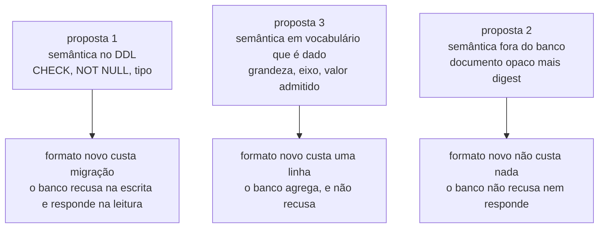

# As três propostas de modelo de dados do `lab-journal`

Três desenhos foram escritos em isolamento para o schema `lab_journal`, hoje vazio.
Nenhum é decisão, e esta página não recomenda nenhum: ela põe lado a lado o que cada um
decide diferente, para que a escolha seja consciente. A forma deste schema não tem dono
declarado, e a pasta que é dona da forma dos outros dois diz por escrito que ele fica
fora dela, em
[`schemas/README.md`](../../../architecture/schemas/README.md#a-ausência-de-linha-entre-os-dois-diagramas-é-a-decisão).

- [Proposta 1 — O caderno que conhece cada veredito pelo nome](proposta-1-o-caderno-conhece-cada-veredito.md)
- [Proposta 2 — O livro-razão apensável, endereçado por conteúdo](proposta-2-livro-razao-enderecado-por-conteudo.md)
- [Proposta 3 — O caderno como série de medições](proposta-3-serie-de-medicoes.md)

## O eixo real da escolha

O eixo não é quantas tabelas cada desenho tem. É **onde mora a semântica de um
veredito** — quem sabe que `217` é uma contagem de operações perdidas, e o que impede
que esse número seja gravado sem o denominador que o torna legível. A proposta 1 põe
essa semântica no **DDL**: cada formato tem tabela própria, e a fórmula do
[oráculo exato](../../../adr/0002-o-dominio-minimo-e-os-dois-oraculos.md#o-oráculo-exato)
vira `CHECK`. A proposta 3 põe a semântica num **vocabulário que é dado**: o schema
conhece a forma de uma medição, e o significado de cada grandeza mora em linhas de
tabela. A proposta 2 põe a semântica **fora do banco**: o documento é opaco, e o que o
schema guarda é procedência e integridade, não conteúdo.

Escolher um ponto desse eixo fixa duas grandezas ao mesmo tempo, e elas andam em sentidos
opostos. Quanto mais o banco sabe, mais ele consegue **recusar na escrita** e **responder
na leitura** — e mais caro fica o formato de veredito que ninguém previu. Quanto menos ele
sabe, mais barato é o formato novo — e menos resta de garantia que não seja disciplina de
quem escreve. Não existe posição neutra nesse eixo, e é por isso que as três propostas são
incompatíveis em vez de complementares.

## O que cada uma decide diferente

| Questão                                           | Proposta 1 — veredito tipado                                         | Proposta 2 — livro-razão                                                       | Proposta 3 — série de medições                                        |
| ------------------------------------------------- | -------------------------------------------------------------------- | ------------------------------------------------------------------------------ | --------------------------------------------------------------------- |
| O que o schema sabe da forma do veredito          | tudo: uma tabela por formato, com as colunas daquele formato         | nada: o veredito é `bytea` opaco, e o `jsonb` foi recusado de propósito        | a meta-forma: toda medição tem grandeza, valor e incerteza            |
| Composição global dos formatos, hoje não decidida | um relatório composto, com uma associação nomeada por formato        | uma publicação: entrada que fixa por hash quais entradas entraram na leitura   | não existe composição, porque só existe um formato                    |
| O que impede um veredito malformado               | o banco, no `INSERT`: `CHECK`, `NOT NULL` e tipo de coluna           | nada no banco; quem lê valida contra a versão de forma declarada               | nada no banco: `valor numeric` aceita 7 onde só 0 e 1 significam algo |
| O que um formato novo custa                       | tabela, migração e mais um `LEFT JOIN` em quem monta o relatório     | nada: é uma versão de forma a mais                                             | uma linha no vocabulário de grandezas                                 |
| O que o banco responde sobre resultado            | tudo, por consulta direta                                            | nada; "quais execuções violaram" vira um programa                              | agregação sobre medições, sem saber o que o número significa          |
| A curva do E4                                     | cabeçalho com eixo e domínio, mais um ponto por abscissa             | um documento como outro qualquer; nenhuma estrutura própria                    | uma série num eixo de workers; nenhuma estrutura própria              |
| A comparação entre níveis                         | entidade própria; o par nível e estratégia é chave primária          | uma publicação que aponta para as execuções comparadas                         | uma série num eixo de nível de isolamento                             |
| Correção de um resultado publicado                | linha nova de `experimento`, e a rodada congela a versão             | entrada nova que sucede a anterior; a superada permanece                       | não tratada: `experimento` é imutável depois da primeira execução     |
| `UPDATE` no desenho                               | existe, num trigger só, sobre `experimento.updated_at`               | não existe, e a garantia vem de `REVOKE`, não do esquema                       | existe, no mesmo trigger de `experimento.updated_at`                  |
| Cursor do replay                                  | coluna própria em `observacao`, contígua por execução                | é o número de sequência do livro; nada foi acrescentado para o stream          | coluna própria em `observacao`, contígua por execução                 |
| Evento terminal do stream                         | derivado de `execucao.cursor_final`; não é linha do log              | é o selo, última entrada do livro                                              | é linha de `observacao`, e `cursor_final` a espelha                   |
| Relógio do banco                                  | `DEFAULT now()` em `experimento`, pela carve-out de metadado de CRUD | nenhum `DEFAULT`: o digest cobre o instante, e `now()` quebraria a cadeia      | `DEFAULT now()` em `experimento`, pela mesma carve-out                |
| O custo de Git do ADR-0011                        | atenuado: um resumo confere uma cópia publicada contra a origem      | atacado de frente: livro selado exporta, e uma linha por execução volta ao Git | atenuado: série exportável como texto canônico, e hash da declaração  |
| Tabelas                                           | catorze                                                              | três                                                                           | oito                                                                  |

**As três concordam em quatro pontos, e a concordância vale tanto quanto a divergência.**
Todas põem a definição de experimento no `lab_journal`, seguindo o
[ADR-0011](../../../adr/0011-a-topologia-de-servicos-e-o-caderno-de-laboratorio-fora-do-git.md#o-caderno-de-laboratório-sai-do-git);
todas mantêm cada chave estrangeira dentro do schema, e nenhuma atravessa a fronteira;
todas recusam um caminho de `join` entre o log de observações e o veredito, que é a forma
tabular da proibição do
[ADR-0002](../../../adr/0002-o-dominio-minimo-e-os-dois-oraculos.md#o-oráculo-lê-o-banco-e-não-deve-ler-o-log-de-observações);
e todas atribuem o cursor pela aplicação, contíguo por execução, como o
[ADR-0016](../../../adr/0016-o-streaming-e-o-replay-do-log-de-observacoes.md#o-cursor-é-campo-próprio-monotônico-por-execução)
exige. Nenhum desses quatro pontos é ponto de escolha.

## O que a proposta 1 torna fácil, e o que torna caro

**Fácil: o veredito malformado não chega a existir.** A regra de que o relatório DEVE
exibir as três contagens e NÃO DEVE exibir apenas a razão, do
[ADR-0004](../../../adr/0004-o-estatuto-da-barreira-e-o-diagnostico-da-nao-ocorrencia.md#o-veredito-de-uma-execução-medida-é-uma-taxa),
deixa de ser prosa e vira três colunas `NOT NULL`. A `R3` da
[comparação entre níveis](../../../features/comparacao-entre-niveis-de-isolamento/feature-card.md#regras-de-negócio),
que proíbe um rótulo único colapsando os dois eixos, fica **inexprimível**: o par é a
chave primária. Quem abre o schema descobre o que o laboratório publica sem ler código.

**Caro: o esquema afirma uma resposta para uma pergunta que ninguém respondeu.** A
composição global dos formatos segue sem decisão, e o índice de capacidades avisa que quem
enumerar o conjunto hoje está errado, em
[capacidade conhecida e não especificada](../../../features/README.md#capacidade-conhecida-e-não-especificada).
Este desenho enumera. A forma da curva do E4 — retries, throughput e correção verde num
eixo de workers — é invenção da proposta, e ela é estrutural: se a curva publicar outra
coisa, duas tabelas mudam. Um quinto formato entra por migração, e montar um relatório
custa cinco `LEFT JOIN`, com a falha de esquecer um deles produzindo relatório mudo.

## O que a proposta 2 torna fácil, e o que torna caro

**Fácil: nada é reescrito, e o que foi gravado é provável.** Duas conferências que falham
de maneiras diferentes cobrem os dois modos de dano: a sequência contígua denuncia entrada
ausente, e o elo de hash denuncia entrada trocada. O cursor do replay e o número de
sequência do livro colapsam numa coluna só, e o streaming não custa nada de estrutura. A
regra do relógio injetável deixa de ser disciplina e vira impossibilidade física, porque o
resumo criptográfico cobre o instante. E o custo de Git do ADR-0011 ganha resposta
concreta: um livro selado exporta como arquivo autoconferível, e uma linha por execução —
identificador, último número e resumo do selo — volta a caber num diff e a ser revisada em
PR.

**Caro: o banco para de responder qualquer pergunta sobre resultado.** "Quais execuções
violaram a invariante" deixa de ser consulta e vira programa que abre cada documento. O
esquema não valida nada: um emissor que escrever lixo produz entrada íntegra e inútil, e
toda garantia migra para o caminho de escrita e para um `REVOKE`. E a resposta ao custo de
Git só se paga se alguém de fato rodar a cerimônia de export e guardar o arquivo — sem
ele, a linha versionada é um resumo que ninguém confere contra nada.

## O que a proposta 3 torna fácil, e o que torna caro

**Fácil: o formato decidido amanhã não custa esquema.** Ele é uma grandeza a mais num
vocabulário que é dado. A curva, a comparação entre níveis e o veredito de uma execução
única são a mesma forma lida com eixos diferentes, e por isso não existem duas maneiras de
agrupar execuções para divergirem depois. A classificação do zero vira medição de domínio
categórico, indexável pelo mesmo eixo que tudo o mais.

**Caro: o esquema para de distinguir um booleano de uma contagem.** `valor numeric` aceita
7 onde só 0 e 1 significam algo, e o que reprovaria o 7 mora numa tabela que nenhuma
constraint alcança a partir da medição. A semântica migra para um vocabulário que passa a
precisar de governo próprio, e o desenho cria esse vocabulário sem dizer quem o governa.
Nada obriga as três contagens a existirem juntas: a regra migra para quem escreve. E a
própria proposta levanta a dúvida de se a regra de comparabilidade — que recusa comparar
contagens de execuções cuja carga declarada difira — proíbe a curva de ser uma série só,
já que ela varia workers de ponto a ponto por construção.

## As perguntas que sobrevivem a qualquer escolha

Nenhuma das três fecha estas, e escolher um desenho não as responde.

1. **Onde a definição de experimento vive.** O
   [ADR-0011](../../../adr/0011-a-topologia-de-servicos-e-o-caderno-de-laboratorio-fora-do-git.md#o-caderno-de-laboratório-sai-do-git)
   a manda para o banco do `lab-journal`; o
   [ADR-0015](../../../adr/0015-a-chave-o-discriminador-de-execucao-e-as-colunas-de-tempo.md#as-colunas-de-tempo-e-a-fonte-do-relógio-por-papel-do-valor)
   trata o lado do instrumento como `lab_plane` ou `lab_journal`, em aberto. Os dois estão
   `Aceito`. As três propostas seguiram o primeiro, e nenhuma decidiu.
2. **Qual é a composição global dos formatos de veredito.** As três a assumiram para
   conseguir modelar, e cada uma assumiu uma diferente.
3. **Qual é a forma da curva do E4** — o que ela declara, como se compara e como se
   reprova. Só a proposta 1 a inventou por inteiro, e por isso é a única que quebra se a
   resposta for outra.
4. **Se a calibração é exigida por execução medida ou uma por agrupamento.** A curva do E4
   tem uma execução medida por valor do eixo, e o número de calibrações que isso implica
   nunca foi posto na mesa.
5. **Se a regra de comparabilidade proíbe ler uma curva como objeto único**, já que ela
   varia a carga declarada de ponto a ponto.
6. **Onde vive a guarda de completude do stream**, e o que uma contagem sobre stream
   incompleto produz — recusa, número com ressalva, ou outro rótulo.
7. **Qual relógio produz o instante de persistência.** O
   [ADR-0016](../../../adr/0016-o-streaming-e-o-replay-do-log-de-observacoes.md#dois-instantes-nenhum-deles-é-ordem)
   publica a diferença entre os dois instantes como medida da travessia, e não diz de onde
   vem o segundo.
8. **Retenção e crescimento do log de observações**, que cresce por fronteira atravessada.
9. **O contrato entre o frontend e o `lab-journal`**, ausente e registrado como `Q-INT-1`
   em [`integrations.md`](../../../architecture/integrations.md#perguntas-em-aberto).
