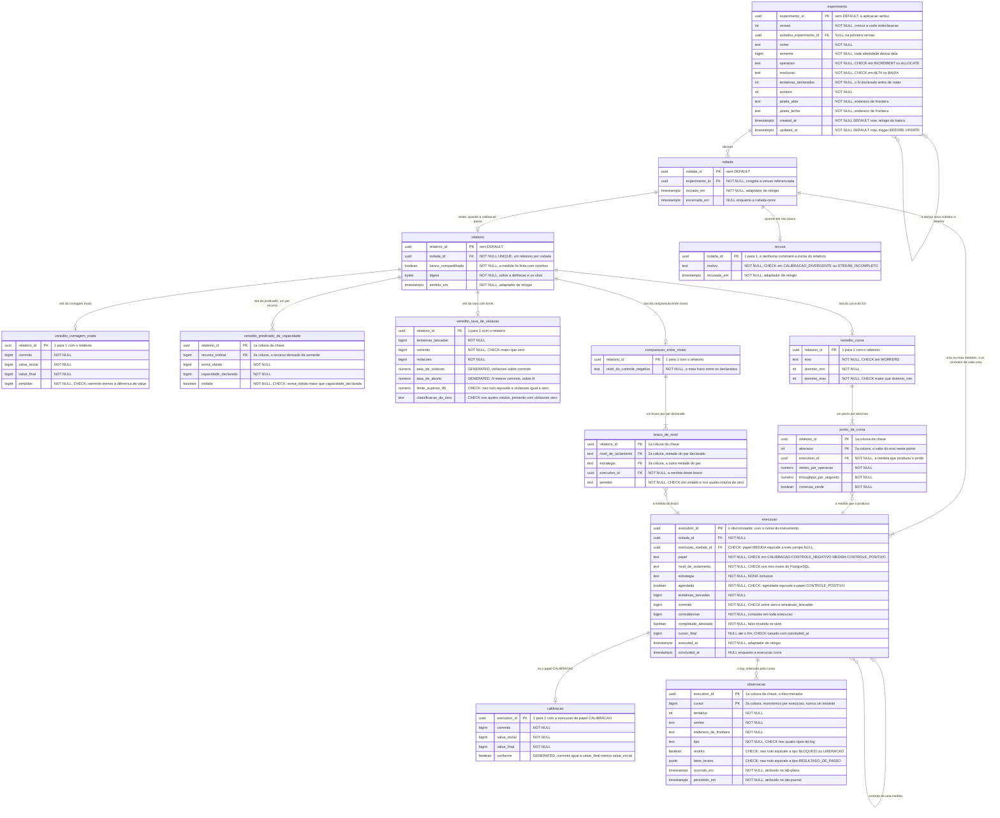

# Proposta 1 — O caderno que conhece cada veredito pelo nome

A aposta é que o schema `lab_journal` declare **cada formato de veredito em tabela
própria**, com as colunas daquele formato `NOT NULL` e a regra do oráculo escrita como
`CHECK` — o banco, e não o código do `lab-journal`, recusa o veredito malformado. Ela
otimiza duas coisas: quem abre o schema descobre o que o laboratório publica sem ler uma
linha de código, e quem grava um veredito incompleto descobre no `INSERT`, e não meses
depois, na leitura de um relatório já publicado.

Isto é uma **proposta**, e não decisão: nenhum schema deste banco foi desenhado ainda, e
a pasta que é dona da forma dos outros dois declara por escrito que o `lab_journal` fica
fora dela, em
[`schemas/README.md`](../../../architecture/schemas/README.md#a-ausência-de-linha-entre-os-dois-diagramas-é-a-decisão).

## O problema que este modelo resolve

Três formatos de veredito já estão decididos, um por oráculo, e nenhum é caso particular
do outro: a
[contagem exata](../../../adr/0002-o-dominio-minimo-e-os-dois-oraculos.md#o-oráculo-exato) do
contador, o
[predicado booleano](../../../adr/0002-o-dominio-minimo-e-os-dois-oraculos.md#o-oráculo-do-predicado)
da capacidade e a
[taxa com limite superior de confiança](../../../adr/0004-o-estatuto-da-barreira-e-o-diagnostico-da-nao-ocorrencia.md#o-veredito-de-uma-execução-medida-é-uma-taxa).
Um quarto, a curva do E4, tem estímulo e forma esperada, e nenhuma regra sobre como se
declara ou se compara — em
[capacidade conhecida e não especificada](../../../features/README.md#capacidade-conhecida-e-não-especificada).

Um caderno que guardasse os quatro numa coluna `numeric` chamada `resultado`, ou num
`jsonb` chamado `payload`, aceitaria uma taxa sem denominador, um predicado carregando o
valor `7` e uma curva de um ponto só. O defeito apareceria na leitura, depois de o
relatório existir — a pior hora possível num instrumento de medida. Este modelo põe a
recusa na escrita, e paga por isso com uma tabela por formato.

## O modelo

## O que o diagrama não expressa

**A ordem das colunas nas chaves compostas é escolha, e não acaso.** Em `observacao` a
chave é `(execution_id, cursor)`, com o discriminador na frente: toda leitura do stream
pergunta o que veio depois de um cursor **dentro de uma execução**, e a B-tree responde
com uma varredura de intervalo. Invertida, cada replay varreria as execuções todas. Em
`ponto_da_curva` e em `braco_de_nivel` o relatório vem primeiro pelo mesmo motivo: a
consulta que existe é "os pontos deste relatório", nunca "os pontos de abscissa 12".

**Os índices aditivos são dois, e `erDiagram` não os expressa:** `(rodada_id, papel)`
sobre `execucao`, que é como o relatório encontra os controles de uma medida, e
`(experimento_id, versao)` sobre `experimento`. **Um índice único parcial que forçasse
"uma só execução medida por rodada" fica de fora de propósito** — ele tornaria a curva do
E4 inexprimível, porque ali a rodada tem uma medida por valor do eixo.

**A ausência de `DEFAULT` alcança toda chave e quase toda coluna de tempo.** Nenhum
`gen_random_uuid()`, nenhum `IDENTITY`, nenhum `nextval`: a aplicação atribui o valor, e
a escrita que esquecer a coluna falha alto. As duas exceções são `experimento.created_at`
e `experimento.updated_at`, que carregam `DEFAULT now()` e **contrariam a regra do
relógio injetável na letra**. A autorização é da tabela de fonte por papel do valor do
[ADR-0015](../../../adr/0015-a-chave-o-discriminador-de-execucao-e-as-colunas-de-tempo.md#as-colunas-de-tempo-e-a-fonte-do-relógio-por-papel-do-valor),
que atribui ao banco o metadado de CRUD da definição — e vale a pena porque a definição é
declarada por pessoa, fora de qualquer janela medida.

**Existe um trigger, e é um só:** `BEFORE UPDATE` sobre `experimento`, para `updated_at`.
Ele é aceitável exatamente onde o mesmo ADR recusou trigger no lado medido: aqui ele
nunca dispara dentro da janela em que alguma coisa é medida. Nenhuma outra tabela deste
schema tem trigger, e é por isso que as três regras do parágrafo final ficam sem guarda.

**Toda chave estrangeira fica dentro do schema, e nenhuma sai dele.**
`ponto_da_curva.execution_id` e `braco_de_nivel.execution_id` apontam para `execucao`, do
próprio `lab_journal`. O `partition_id` do sistema medido não aparece aqui, e não
poderia: os dois nomes designam o mesmo valor e nenhuma constraint os liga, pelo
[ADR-0015](../../../adr/0015-a-chave-o-discriminador-de-execucao-e-as-colunas-de-tempo.md#o-nome-assimétrico-do-discriminador-e-a-tradução-num-ponto-único).

**Nenhuma coluna liga um slot de veredito a `observacao`, e essa é a ausência mais cara
do modelo.** Ela é a forma tabular da proibição do
[ADR-0002](../../../adr/0002-o-dominio-minimo-e-os-dois-oraculos.md#o-oráculo-lê-o-banco-e-não-deve-ler-o-log-de-observações):
o `lab-journal` recebe o veredito pronto e **não** o recompõe a partir do log que ele
guarda. Um `JOIN` que o recompusesse continua escrevível a qualquer momento; o que este
desenho garante é só que nenhuma chave o convide.

**Três regras ficam fora do alcance do banco, e a escolha é deliberada.** Um `relatorio`
sem slot nenhum é aceito; uma `rodada` com `relatorio` e `recusa` ao mesmo tempo é
aceita; e um `ponto_da_curva` fora do domínio declarado no cabeçalho da curva é aceito.
As três exigiriam trigger ou constraint deferida, e o modelo prefere pagar a verificação
em código a espalhar procedimento pelo schema de um instrumento de medida.

## Decisões assumidas

| O que foi assumido                                                                                                                  | Alternativa que ficou de fora                                                                          | O que muda se a pessoa decidir o contrário                                                                                                                                     |
|-------------------------------------------------------------------------------------------------------------------------------------|--------------------------------------------------------------------------------------------------------|--------------------------------------------------------------------------------------------------------------------------------------------------------------------------------|
| A composição global é um **relatório composto**, com uma associação nomeada por formato de veredito                                 | uma coluna `formato` mais um `jsonb` de payload; ou uma tabela `veredito` genérica com `numeric valor` | o modelo colapsa em duas tabelas, os `CHECK` de fórmula somem, e a validação volta inteira para o código                                                                       |
| A **curva do E4** é um cabeçalho com eixo e domínio, mais um ponto por abscissa, cada ponto ligado à execução medida que o produziu | a curva como um `jsonb` de pares; ou como uma coluna `numeric[]` por série                             | `veredito_curva` e `ponto_da_curva` viram uma coluna só, e a rastreabilidade de cada ponto até a execução desaparece                                                           |
| A curva publica **retries por operação, throughput e correção verde** por ponto, com o eixo em `workers`                            | séries declaradas em tempo de execução, com nome e unidade em linha                                    | `ponto_da_curva` troca as três colunas por `(serie, valor)`, e o banco deixa de saber o que a curva publica                                                                    |
| A **comparação entre níveis** é entidade própria, e o par nível mais estratégia é a chave primária de `braco_de_nivel`              | agrupar as execuções por `rodada` e deduzir a comparação na consulta                                   | volta a ser possível o rótulo único que a `R3` de [comparação entre níveis](../../../features/comparacao-entre-niveis-de-isolamento/feature-card.md#regras-de-negócio) proíbe  |
| A **rodada** é a unidade de relatório, e agrupa uma ou mais execuções medidas com os controles de cada uma                          | o relatório pendurado direto na execução medida                                                        | curva e comparação perdem onde morar: nenhuma das duas é veredito de uma execução só                                                                                           |
| Um controle aponta para a sua medida por `execucao_medida_id`, e um `CHECK` casa isso com o papel                                   | os quatro papéis como irmãos dentro da rodada, sem ligação entre eles                                  | com mais de uma medida por rodada, ninguém sabe qual controle interpreta qual medida                                                                                           |
| O **nível de isolamento é coluna de `execucao`**, e não da rodada nem do experimento                                                | o nível declarado na definição, valendo para todas as execuções                                        | o [ADR-0018](../../../adr/0018-cada-controle-roda-sob-o-seu-proprio-nivel.md#decisão) fica inexprimível: o controle negativo roda sob nível diferente do medido                |
| A **calibração reprovada não gera relatório**: ela gera linha em `recusa`                                                           | um relatório com uma coluna `valido` em falso                                                          | a consulta que lista relatórios passa a devolver medida que não vale, e todo consumidor precisa lembrar do filtro                                                              |
| `completude_atestada` é coluna de `execucao`, e um slot sobre execução não atestada é defeito                                       | a completude conferida só em memória, dentro do consumidor                                             | a `R15` de [execução de experimento](../../../features/execucao-de-experimento/feature-card.md#regras-de-negócio) perde o lugar onde o atestado fica gravado                   |
| O **evento terminal** do stream é derivado de `execucao.cursor_final`, e não é uma linha de `observacao`                            | um quinto tipo de evento no log, com cursor próprio                                                    | a `R4` de [streaming e replay](../../../features/streaming-e-replay-do-log-de-observacoes/feature-card.md#regras-de-negócio) deixa de poder carregar o cursor do último evento |
| `observacao.persistido_em` vem do **adaptador de relógio** do `lab-journal`, e não de `DEFAULT now()`                               | `DEFAULT now()`, tratando o instante como puro metadado de exibição                                    | a diferença entre os dois instantes, que mede o custo da travessia, passa a subtrair dois relógios diferentes                                                                  |
| `fatos_brutos` é `jsonb` opaco, e o banco só verifica que ele existe onde o tipo o exige                                            | uma tabela de fatos com `(chave, valor)` em texto                                                      | o payload que o runtime não interpreta ganha esquema, e o `lab-journal` passa a interpretá-lo                                                                                  |
| O **experimento é versionado por linha nova**, e a rodada congela a versão que referenciou                                          | editar a definição no lugar, como CRUD comum                                                           | um resultado publicado passa a poder mudar de premissa sem deixar rastro                                                                                                       |
| `relatorio.digest` guarda um resumo criptográfico da definição e dos slots                                                          | nenhum resumo: o relatório vale pelo que o banco contém naquele instante                               | um relatório copiado para fora do banco deixa de ser conferível contra a origem                                                                                                |
| A definição de experimento vive **neste** schema, e não no `lab_plane`                                                              | a definição no instrumento, e só o resultado no caderno                                                | `experimento` e `rodada` saem daqui, e o relatório passa a referenciar por identificador sem constraint, atravessando a fronteira de schema                                    |
| O identificador de `experimento`, `rodada` e `execucao` é `uuid` atribuído pela aplicação                                           | `bigint` por ordinal, como o do sistema medido                                                         | o discriminador deixa de ser o mesmo valor que atravessa o CDC, e a tradução no consumidor ganha uma conversão                                                                 |
| `value_inicial`, `value_final`, `perdidas`, `soma_obtida` e `capacidade_declarada` são `bigint`; só as taxas são `numeric`          | `numeric` em todas, por simetria                                                                       | os `CHECK` de fórmula passam a comparar decimais, e a igualdade exata do oráculo do contador vira comparação com tolerância                                                    |

## Trade-offs

O benefício **um veredito malformado não chega a existir** foi aceito em troca do custo
**cada formato novo cobra uma tabela e uma migração**. O preço é real, e não teórico: a
composição global dos formatos continua sem decisão, e o próprio índice de capacidades
avisa que quem enumerar o conjunto hoje está errado, em
[capacidade conhecida e não especificada](../../../features/README.md#capacidade-conhecida-e-não-especificada).
Se amanhã a pessoa decidir um quinto formato — um veredito contínuo no tempo, por
exemplo —, ele não estava previsto aqui: entra por tabela nova, mais uma associação
nomeada saindo de `relatorio`, mais o código que a lê. Nenhum `ALTER` de coluna resolve.

Vale a pena mesmo assim por dois motivos. O primeiro é que **a tabela nova é barata e o
veredito errado é caro**: uma migração que acrescenta cinco colunas custa minutos, e uma
taxa publicada sem denominador custa a confiança no instrumento inteiro, que é o ativo
que este repositório mais protege. O segundo é que **o conjunto de formatos cresce por
decisão da pessoa, e não por variação de dado**: não existe o caso em que alguém precisa
gravar hoje um formato que ninguém decidiu, porque um formato sem decisão não tem o que
publicar. Um esquema genérico paga flexibilidade que este domínio nunca vai gastar.

O benefício **o caderno fora do Git ganha um substituto para o diff** foi aceito em troca
do custo **nada nele é editável no lugar**. A definição é imutável depois da primeira
rodada, a versão nova é linha nova, e `relatorio.digest` deixa conferir uma cópia
publicada contra a origem. O que isso **não** devolve é a revisão em PR nem a
sobrevivência a um banco recriado: os dois custos que o
[ADR-0011](../../../adr/0011-a-topologia-de-servicos-e-o-caderno-de-laboratorio-fora-do-git.md#o-caderno-de-laboratório-sai-do-git)
nomeia continuam pagos por inteiro. O modelo só impede que um terceiro se acrescente a
eles — o de um resultado publicado mudar de premissa em silêncio.

O benefício **quem lê o schema sabe o que o laboratório publica** foi aceito em troca do
custo **catorze tabelas onde uma consulta ingênua esperava duas**. Montar o relatório
completo de uma rodada custa cinco `LEFT JOIN`, um por slot, e quem esquecer um deles
publica um relatório mudo em vez de um relatório errado. É a falha menos danosa das duas,
e ainda assim é uma falha.

## O que esta proposta NÃO decide

A composição global dos formatos de veredito continua **não decidida**, e esta proposta
não a fecha: ela assume uma forma para conseguir modelar, e a assunção está na primeira
linha de [`## Decisões assumidas`](#decisões-assumidas), acima. Qual formato prevalece
quando dois se aplicam à mesma rodada, e o que um relatório publica quando carrega três
slots, seguem abertos.

Ela não decide o contrato HTTP entre o `frontend` e o `lab-journal`, nem o formato JSON
de cada evento no stream. Os dois seguem sem forma, e a matriz é dona desse estado, em
[perguntas em aberto](../../../architecture/integrations.md#perguntas-em-aberto).

Ela não decide a política de contrapressão entre o broker e o `lab-journal`, nem o que o
stream faz quando o `Last-Event-ID` aponta para um cursor que não existe. As duas lacunas
são das
[negativas do ADR-0016](../../../adr/0016-o-streaming-e-o-replay-do-log-de-observacoes.md#negativas),
e nenhuma coluna deste desenho as fecha.

E ela não decide particionamento nem retenção de `observacao`, que cresce por fronteira
atravessada.

## Perguntas que ela levanta

**Um relatório sem nenhum slot preenchido é defeito, ou é a rodada que terminou sem
veredito?** O desenho aceita os dois, e nada no repositório diz qual deles o laboratório
quer nomear.

**De onde sai o `throughput_por_segundo` de cada ponto da curva, e sob qual relógio?** A
duração de uma execução medida pode vir de `executed_at` e `concluded_at`, que o
adaptador preenche — mas nesse caso o par deixa de ser rótulo de exibição e passa a
entrar num número publicado, o que muda o papel do valor.

**Uma rodada com mais de uma execução medida precisa de uma calibração por medida, ou de
uma só para a rodada inteira?** A
[calibração](../../../adr/0002-o-dominio-minimo-e-os-dois-oraculos.md#a-calibração-do-denominador)
é exigida antes de toda execução medida, e a curva do E4 tem uma medida por valor do
eixo: quarenta e nove calibrações numa rodada é um número que ninguém pôs na mesa.

**Como o `recurso_ordinal` do slot do predicado identifica o recurso?** Ele é função da
semente, do lado medido, e o caderno não pode consultar aquele schema para conferir que o
número existe.

